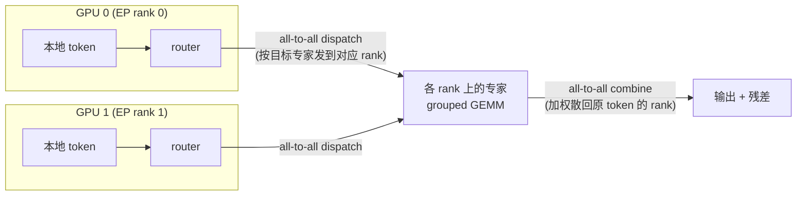

# MoE · 进阶与生产实践

> 配套 toy 代码:本目录 `moe.py`(纯 PyTorch / CPU,`SparseMoE` = router + top-k + 加权组合 + Switch 式 aux loss)与逐段精讲 `手把手教学.md`。
> 本文负责把这个"几十秒跑完"的玩具,和 Switch / GShard / Mixtral / DeepSeekMoE / Megatron-MoE / DeepEP 这些**真实生产系统**打通:讲清生产到底补了哪些东西、为什么必须这么补、量级怎么估、坑在哪里。
> 准确性优先:不编造精确 benchmark,数字用定性或"约"。

---

## 0. 本项目 toy 与生产的差距

`moe.py` 故意把所有"工程脏活"删掉,只保留 MoE 的三个灵魂(router / 稀疏组合 / 负载均衡),好让你一眼看穿原理。但这也意味着它离能上线的 MoE 差着一整套基础设施。下面这张对照表是本文的总纲——后面每一节都在补其中一列。

| 维度 | 本 toy 的做法 | 生产必须补什么 | 为什么(根因) |
| --- | --- | --- | --- |
| 专家计算 | Python `for e in range(E)` 循环 + `torch.where` + `index_add_` | 批量 **dispatch/combine** 矩阵,或 **grouped GEMM / 分组矩阵乘**(每专家一块连续显存) | for 循环在 GPU 上是串行 kernel launch,E 个专家就是 E 次小 GEMM,利用率极低;生产要把它压成一两个大算子 |
| 容量管理 | 无。每个被选中的 token 都被处理 | **expert capacity + token drop / padding**(`capacity = factor * T * k / E`) | 真实 batch 里专家命中数高度不均,不设上限就没法静态分配显存、all-to-all buffer 也对不齐 |
| 分布式 | 单进程、单设备 | **专家并行 EP**:专家切到不同 GPU,token 用 **all-to-all** 来回搬运 | 几百上千个专家(DeepSeek-V3 共 256 个)放不进单卡;EP 是 MoE 扩展的核心维度 |
| 路由稳定性 | 只有 Switch aux loss | 再加 **router z-loss**、**noisy/jitter gating**、fp32 router、专家 dropout、有时 **EP 内 bias 路由**(DeepSeek-V3 无 aux-loss 均衡) | logits 爆炸、训练后期路由抖动、专家坍缩等故障在大规模下被放大 |
| 数值精度 | 全 fp32 | **router 用 fp32、专家可 bf16/fp8**,组合权重 fp32 累加 | router 的 softmax/top-k 对精度极敏感,半精度会让路由决策抖动 |
| 模型形态 | 单层 MoE + 残差,做 toy 分类 | MoE 替换 Transformer 的 **FFN 子层**,每隔几层放一个 MoE 层(交替 dense/MoE) | 不是每层都 MoE;典型是隔层或固定比例,平衡通信与质量 |
| 专家结构 | E 个等大独立 FFN | **细粒度专家 + 共享专家**(DeepSeekMoE)、专家 down-projection 缩小 | 细粒度提升组合数与专业化,共享专家承接公共知识、减少冗余 |
| 推理 | 训练即推理同一份代码 | **EP 部署 + 负载均衡副本 + 容量松弛 + 通信掩盖**,vLLM/SGLang 的 MoE kernel | 推理是 decode 逐 token、batch 小、路由更不均,工程要点和训练不同 |
| 通信 | 无 | **DeepEP 等专用 all-to-all**(NVLink + RDMA、计算通信重叠、FP8 dispatch) | EP 的 all-to-all 是 MoE 训练/推理的头号瓶颈,通用 NCCL 不够 |

一句话:**toy 教你"MoE 是什么",生产解决"几百个专家跨上千张卡怎么又快又稳地跑起来"。**

---

## 1. 业界系统怎么做

### 1.1 一条主线:稀疏激活 = 参数与算力解绑

所有现代 MoE 都共享 toy 里的内核——把 Transformer 的 FFN 子层换成"N 个专家 + 一个 router,每 token 只激活 k 个"。区别在于路由策略、专家粒度、并行与通信。下表是几个里程碑系统的取舍:

| 系统 | 路由 | 专家数 / 激活 | 负载均衡手段 | 标志性设计 |
| --- | --- | --- | --- | --- |
| **GShard**(2020) | top-2 | 每层数百 | aux loss + capacity | 奠基:top-2 + 专家并行 + all-to-all + 容量丢弃 |
| **Switch Transformer**(2021) | **top-1** | 上千 | aux loss(`E·Σf_i·P_i`,本 toy 同款)+ capacity + z-loss | top-1 把通信/计算砍半;证明稀疏可扩到万亿参数 |
| **Mixtral 8x7B**(2024) | top-2 of 8 | 8 个 / 激活 2 | 训练侧均衡(开源权重) | 开源稀疏 MoE 代表;top-k 权重重归一化(本 toy 一致) |
| **DeepSeekMoE / V2 / V3** | top-k(细粒度) | V3 共 **256 路由专家 + 1 共享**,激活 8 | V2/V3 走 **device-limited routing + 辅助均衡**,V3 主打 **aux-loss-free**(per-expert bias 动态调) | 细粒度专家 + 共享专家;明确分离"专业化"与"公共知识" |

> 说明:Mixtral 命名里的 "8x7B" 不等于 56B 计算量——总参约 47B,但每 token 只激活约 13B,这就是"参数大、激活小"的直接体现。

### 1.2 从 toy 的 for 循环到生产的 dispatch/combine

toy 的 `for e in range(E): index_add_(...)` 在原理上等价于两个稀疏矩阵乘:

```
dispatch:  X_e = D_e^T · X        # 把路由到专家 e 的 token 聚成一块连续 buffer
expert  :  Y_e = Expert_e(X_e)    # 每专家一次大 GEMM(grouped GEMM)
combine :  Y   = Σ_e  C_e · Y_e   # 按门控权重 g 加权散回原 token 位置
```

其中 `D_e`(dispatch)、`C_e`(combine)是由 router top-k 结果 + capacity 决定的 0/1·权重矩阵。生产实现把它做成:

- **固定 capacity** → buffer 形状静态、可预分配、对齐 all-to-all;超出的 token 被 drop(或溢出到残差)。
- **grouped GEMM** → 把 E 个不等长的小 GEMM 合并为一次批量算子(如 Megatron / cutlass grouped gemm、Triton MoE kernel),吃满 GPU。
- **专家并行 EP** → `Expert_e` 分布在不同 GPU,`dispatch`/`combine` 各变成一次 **all-to-all** 通信。



### 1.3 Megatron-MoE 的并行组合

生产 MoE 不是单一并行,而是 **DP × TP × EP × PP(× SP)** 的乘积网格:

- **EP(Expert Parallel)**:专家切到不同 GPU,这是 MoE 特有维度;EP 组内做 all-to-all。
- **TP(Tensor Parallel)**:专家内部的大矩阵再按列/行切(专家很大时用)。
- **DP / PP / SP**:数据并行、流水并行、序列并行,和 dense 模型一致。

Megatron-MoE / Megatron-Core 把这些参数化:EP=8 表示 8 张卡各放 1/8 的专家;一个 256 专家的层若 EP=8,则每卡 32 个专家。注意 **EP 和 TP 的 all-to-all/all-reduce 互相叠加**,通信拓扑设计(NVLink 域内做 EP、跨节点慎用)是关键。

### 1.4 DeepEP:为 MoE 定制的通信库

通用 NCCL all-to-all 对 MoE 不够好(token 数据量不均、要和计算重叠、要 FP8)。**DeepEP**(DeepSeek 开源)针对 EP 做了:

- **NVLink + RDMA 双层 all-to-all**:节点内走 NVLink、跨节点走 RDMA,带宽吃满。
- **训练/预填用高吞吐 kernel,decode 用低延迟 kernel**(纯 RDMA、避免 SM 抢占)。
- **计算-通信重叠**:用 hook 把 dispatch/combine 的通信塞进专家 GEMM 的空隙。
- **FP8 dispatch**:token 用 FP8 发送,通信量直接减半。

这把 EP 的 all-to-all 从"头号瓶颈"压到可接受范围,是 DeepSeek-V3 能用大规模 EP 训练的工程底座。

---

## 2. 关键变体与优化

逐个讲"解决什么问题、代价是什么"。

### 2.1 top-1(Switch) vs top-2(GShard/Mixtral)

- **问题**:激活几个专家是质量 vs 成本的核心旋钮。
- **top-1(Switch)**:每 token 一个专家。通信/计算最省,但没有"第二选择"做缓冲,**路由更易坍缩**(本 toy 练习 2 已能复现:top-1 比 top-2 塌得更猛),需要更强的 aux loss / z-loss。
- **top-2**:多一个专家做平滑,梯度更稳、质量更好,代价是 dispatch/combine 与专家计算翻倍。
- **取舍**:训练稳定性与质量偏好 top-2;极致省成本偏好 top-1。DeepSeek 走"细粒度 + 高 k(激活 8 个细专家)",在更细的粒度上拿组合数。

### 2.2 容量因子(capacity factor)与 token drop

- **公式**:`capacity = ceil(capacity_factor * T * k / E)`,即每个专家最多收多少 token(T=batch token 数,E=专家数,k=top-k)。
- **问题**:专家负载本就不均,要静态分配显存/buffer 就必须设上限。
- **token drop**:超过 capacity 的 token 被**丢弃**(该专家对它不贡献,只走残差)→ 信息损失。
- **padding**:不足 capacity 的专家**补零**到固定长度 → 算无用功、浪费算力。
- **取舍**:`capacity_factor` 大(如 1.25~2.0)→ drop 少、质量好,但 padding 多、显存/算力浪费大;小(如 1.0)→ 省,但 drop 多、掉点。训练常用 1.25 左右,**eval/推理用更大甚至 dropless**。
- **dropless MoE**(如 MegaBlocks)用 **block-sparse / 变长 grouped GEMM** 避免 padding 和 drop,代价是 kernel 更复杂。

### 2.3 DeepSeekMoE:细粒度专家 + 共享专家

- **细粒度(fine-grained)**:把每个专家的 hidden 维切小(如 1/m),专家数对应放大 m 倍,激活数也放大。**总激活 FLOPs 不变**,但"从 N 选 k"的组合数从 C(N,k) 暴涨到 C(mN, mk),专业化空间更大、表达更丰富。
- **共享专家(shared expert)**:1~2 个**永远激活**的专家,承接"所有 token 都需要的公共知识"。这样路由专家专心学差异化模式,**减少冗余**(否则每个专家都得各自学一份公共能力)。
- **数据流**:`y = SharedExpert(x) + Σ_{i∈topk} g_i · RoutedExpert_i(x)`。
- **代价**:共享专家是 dense 计算(每 token 都算),增加固定开销;但换来更高的参数效率。

### 2.4 路由稳定性套件:z-loss / noisy gating / aux-loss-free

- **router z-loss**:`z_loss = (1/T) Σ_t (logsumexp(logits_t))^2`,惩罚 logits 整体变大,防止 softmax 进入饱和区导致数值不稳。是 Switch/PaLM 的标配,**和 toy 的 aux loss 互补**(aux 管均衡,z-loss 管数值)。
- **noisy / jitter gating**:路由 logits 上加噪声(本 toy 练习 5),早期鼓励探索、打破赢者通吃的初期正反馈。
- **aux-loss-free 均衡(DeepSeek-V3)**:不用辅助损失(辅助损失会和主任务梯度打架、伤质量),而是给每个专家一个**可学/动态调的 bias**:某专家过载就调低它的 bias、欠载就调高,直接在 router 打分上做均衡,不污染主损失梯度。这是近两年的重要工程进展。

### 2.5 不同均衡粒度

- toy 的 aux 是 **batch 级**;生产常区分:
  - **expert-level**:单专家别过载(本 toy)。
  - **device-level / EP-level**:保证各 GPU 收到的 token 量均衡(否则 all-to-all 长尾、某卡空转)——比 expert-level 更重要,因为它直接决定通信和算力是否被拖慢。
  - **device-limited routing**(DeepSeek-V2):限制每个 token 最多路由到的设备数,**直接压低跨节点通信**。

---

## 3. 真实工程权衡与坑

### 3.1 显存 / 吞吐 / 延迟 / 精度 / 通信 的取舍

- **显存**:MoE 总参数巨大(专家是大头),但激活只占 k/E。显存压力主要来自**专家权重 + optimizer state + all-to-all buffer**。EP 把专家权重摊薄到多卡是省显存的主路径;但 EP 越大,**all-to-all 跨节点越多、通信越贵**。
- **吞吐 vs 延迟**:训练/prefill 看吞吐(大 batch、grouped GEMM 吃满)→ 用 DeepEP 高吞吐 kernel;decode 看延迟(逐 token、batch 极小、路由极不均)→ 用低延迟 kernel,且容量、副本策略都不同。
- **精度**:**router 必须 fp32**(top-k 决策对精度敏感,bf16 会让边界 token 路由抖动、训练不稳);专家可 bf16,前沿系统(DeepSeek-V3)专家 GEMM 用 **fp8**,但组合/累加回 fp32。
- **通信是 MoE 的命门**:一层有 dispatch + combine 两次 all-to-all,深层模型累加起来通信占比可能很高。掩盖手段:计算通信重叠、NVLink 域内做 EP、FP8 dispatch、device-limited routing 减少跨节点。

### 3.2 线上常见故障与调优

- **专家坍缩 / 饿死(load collapse)**:正是 toy 实验 A 复现的现象(占比塌成 0、imbalance→inf)。生产排查:看 per-expert / per-device token 占比直方图;调大 aux 权重、加 z-loss、加 jitter、或换 aux-loss-free bias。
- **token drop 掉点**:eval 比 train 差很多,常因 capacity_factor 太小、eval 路由分布偏移。处理:eval/推理放大 capacity 甚至 dropless。
- **all-to-all 长尾拖慢全局**:某 EP rank 持续过载,通信变成同步点,整组等它。根因往往是 device-level 不均衡 → 加 device-level 均衡或 device-limited routing。
- **router logits 爆炸 / NaN**:没有 z-loss、或 router 用了半精度。处理:fp32 router + z-loss。
- **EP all-to-all 与 TP all-reduce 互相阻塞**:并行拓扑没规划好,跨节点通信叠加。处理:把 EP 限制在 NVLink 域内、调整 PP/EP/TP 维度顺序。
- **专家权重负载不均导致显存 OOM 某卡**:专家放置不均(尤其共享专家、热专家)。处理:专家放置策略 / 推理时热专家多副本。
- **微批太小 → 专家命中过少 → grouped GEMM 利用率低**:MoE 偏好大 global batch 让每专家拿到足够 token。

---

## 4. 性能直觉与估算

下面给可手算的量级公式(都用 toy 的符号:E=专家数,k=top-k,T=batch token,d=d_model,h=d_hidden)。

### 4.1 稀疏激活省了多少算力

- 单专家 FFN 前向 FLOPs ≈ `2 * (2*d*h)` per token(两层线性,× 前向系数 2)。
- **dense FFN(等价单个大 FFN)**:每 token 算 1 份。
- **稀疏 MoE**:每 token 只算 **k 份**(激活 k 个专家),但**参数量是 E 份**。
- **参数 / 激活比 = E / k**。例:DeepSeek-V3 共约 256+1 专家、激活约 8 个,激活参数约总参的 **1/30 量级**;Mixtral 总约 47B、激活约 13B,比例约 **k/E = 2/8**。
- 直觉:**用约 1/(E/k) 的算力,撑起 E/k 倍的参数容量**——这就是 MoE 的全部卖点。

### 4.2 容量与丢弃估算

- `capacity_per_expert = capacity_factor * T * k / E`。
- 若 router 均匀,每专家期望收到 `T*k/E` 个 token,`capacity_factor` 就是"留多少余量"。
- **drop 率**直觉:负载越不均、capacity_factor 越接近 1,drop 越多。把 factor 从 1.0 提到 1.25,padding 浪费约 +25%,但 drop 显著下降——典型甜点。

### 4.3 通信量估算(EP all-to-all)

- 一层 MoE 一次前向有 **dispatch + combine 两次 all-to-all**,每次搬运的数据量 ≈ `T * k * d * bytes`(被路由 token 数 × 维度 × 精度字节)。
- **FP8 dispatch**:bytes 从 2(bf16)降到 1,通信量直接砍半。
- 反向再来一遍 → 训练时一层 MoE 约 **4 次 all-to-all** 的通信量级。
- 估通信时间:`通信量 / 有效带宽`;跨节点 RDMA 带宽远低于 NVLink,所以**尽量把 EP 收进 NVLink 域**、用 device-limited routing 压跨节点流量。

### 4.4 加速比 / 利用率直觉

- MoE 的"理论加速比"= dense 等参数模型算力 / MoE 激活算力 ≈ `E/k`,但**实际加速远低于此**,被三件事吃掉:① all-to-all 通信;② capacity padding 浪费;③ grouped GEMM 在专家小/不均时利用率不足。
- 工程目标:让有效算力利用率(MFU)尽量接近 dense——这正是 DeepEP、grouped GEMM、通信重叠存在的意义。

---

## 5. 动手进阶路线

把本目录的 toy 一步步推向接近生产(每步给方向,不必一次到位):

1. **dispatch/combine 矩阵化(消灭 for 循环)**
   把 `for e in range(E)` 改成构造 `dispatch_mask [T, E, C]`(含 capacity 维 C),用一次 `einsum` 把 token 散到 `[E, C, d]` 的稠密 buffer,专家批量前向后再用 `combine` 散回。先在单卡验证数值和 toy 完全一致。

2. **加入 expert capacity + token drop**
   设 `capacity_factor`,超出 capacity 的 token 不进 buffer(只走残差)。打印 **drop 率**,扫 capacity_factor ∈ {1.0, 1.25, 2.0} 看 drop 率与 task_loss 的权衡——亲手感受第 2.2 节。

3. **补全路由稳定性套件**
   加 **router z-loss**(`logsumexp(logits)^2` 的均值)、**noisy gating**(toy 练习 5),把 router 计算切到 **fp32**。对比"只有 aux" vs "aux+z-loss+jitter"在 top-1 下的坍缩速度。

4. **细粒度 + 共享专家(DeepSeekMoE 化)**
   把 `d_hidden` 切小、`num_experts` 放大保持总激活 FLOPs 不变(细粒度);再加 1 个**永远激活**的共享专家 `y += SharedExpert(x)`。观察专家分化是否更清晰、收敛是否更稳。

5. **专家并行 EP 雏形(多进程)**
   用 `torch.distributed` 起 2~4 个进程,每进程持有 1/EP 的专家,dispatch/combine 换成 `dist.all_to_all`。先跑通正确性(和单卡数值对齐),再测 all-to-all 占比,体会为什么需要 DeepEP 这类专用通信。

---

## 6. 延伸阅读

**本仓库已有深度文档(相对路径,优先看):**

- MoE 原理:[`../../llm-algo/moe`](../../llm-algo/moe)
- Mixtral(稀疏 MoE 开源代表作):[`../../llm-algo/mixtral`](../../llm-algo/mixtral)
- DeepSeek 系列(DeepSeekMoE / V2 / V3,细粒度+共享专家+aux-loss-free):[`../../llm-algo/deepseek`](../../llm-algo/deepseek)
- 普通 FFN / MLP(专家的本体):[`../../llm-algo/mlp.md`](../../llm-algo/mlp.md)
- Transformer 架构(MoE 替换的是 FFN 子层):[`../../llm-algo/transformer.md`](../../llm-algo/transformer.md)
- Megatron 训练(EP / TP / PP 并行落地):[`../../llm-train/megatron`](../../llm-train/megatron)
- 推理部署(张量并行 / PD 分离 / vLLM、SGLang 等,MoE 推理工程背景):[`../../llm-inference`](../../llm-inference)
- 本项目内核精讲:[`./手把手教学.md`](./手把手教学.md)

**经典论文 / 社区资源:**

- **GShard**(arXiv:2006.16668)—— top-2 路由 + 专家并行 + all-to-all + capacity 的奠基。
- **Switch Transformers**(arXiv:2101.03961)—— top-1 + 本 toy 同款 aux loss(`E·Σf_i·P_i`)+ z-loss;万亿参数稀疏化。
- **Mixtral of Experts**(arXiv:2401.04088)—— top-2 of 8 开源稀疏 MoE;top-k 权重重归一化与本 toy 一致。
- **DeepSeekMoE / DeepSeek-V2 / V3** —— 细粒度专家 + 共享专家、device-limited routing、aux-loss-free 均衡。
- **Megatron-LM / Megatron-Core MoE** —— EP × TP × PP × DP 并行与 grouped GEMM 工程。
- **MegaBlocks** —— dropless MoE(block-sparse / 变长 grouped GEMM)。
- **DeepEP**(DeepSeek 开源)—— MoE 专用 all-to-all(NVLink+RDMA、计算通信重叠、FP8 dispatch、低延迟 decode kernel)。

---

> 总结:toy 的 `SparseMoE` 已经把 router、稀疏组合、负载均衡这三块"原理肌肉"练到位。生产化的全部工作,是围绕它补上 **capacity 管理(省显存/对齐通信)、dispatch/combine + grouped GEMM(吃满算力)、专家并行 EP + DeepEP all-to-all(跨卡扩展)、路由稳定性套件(z-loss / 细粒度 / 共享专家 / aux-loss-free)** 这四圈装甲。理解"为什么每一圈都不可省",你就从"会写 MoE 层"升级到了"能判断一个 MoE 系统的瓶颈在哪"。
