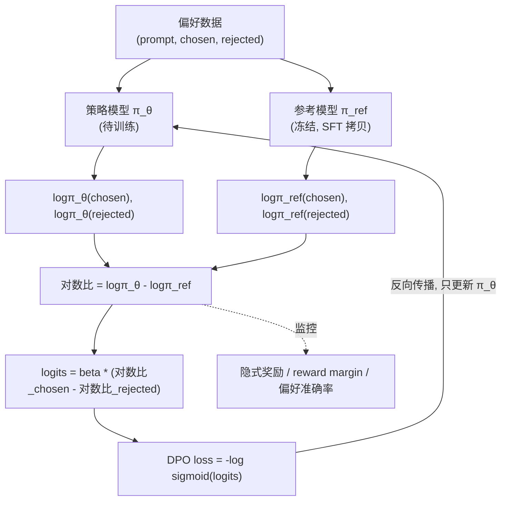

# 手把手：从零实现 DPO 偏好对齐

> 一句话导览：本文带你把 `dpo.py` 这份**纯 PyTorch、CPU 几十秒能跑完**的玩具代码彻底吃透。学完这篇你能掌握：
>
> 1. **偏好对（chosen / rejected）** 到底是什么数据、为什么 DPO 只需要"相对偏好"而不需要绝对奖励分数。
> 2. **参考模型（reference model）、beta、隐式奖励（implicit reward）** 三个核心概念的含义与作用。
> 3. **DPO 损失是怎么从"KL 正则的 RLHF 最优解"一步步推导出来的**（含完整数学），从而理解它为什么**不需要奖励模型、也不需要 PPO**。
> 4. 把 `dpo_loss()`、`sequence_logprob()`、`train_dpo()` 等每一段真实代码逐行读懂，并能亲手改超参做实验。

---

## 0. 前置知识与环境

**你需要会一点点：**

- Python 基础（函数、类、列表推导）。看不懂 `dataclass` 没关系，本文会讲。
- 知道"神经网络靠反向传播 + 梯度下降训练"这件事的大概意思。
- 听说过"语言模型就是预测下一个 token"。如果完全没概念，记住一句话：**语言模型读入一段文字，对"下一个字符是谁"输出一个概率分布**，本文就够用。
- 完全不懂 RLHF / PPO / 强化学习也没关系——DPO 的卖点恰恰就是"把这些都绕过去"，本文会从零讲。

**安装环境：**

```bash
pip install torch numpy          # 必需，CPU 版即可
pip install matplotlib           # 可选，用来画训练曲线；不装也能跑（会自动降级为文本提示）
```

**怎么跑：**

```bash
cd practical-projects/09-dpo-from-scratch
python dpo.py
```

无需 GPU、无需下载任何数据集、无需联网。代码里偏好数据是**写死合成**的，模型是几十 KB 的玩具模型。普通笔记本几十秒跑完。

> 小提示：`dpo.py` 顶部注释特意说明——所有 `print` 只用 ASCII 英文，因为 Windows 控制台默认 GBK，直接 print 中文容易 `UnicodeEncodeError`。所以你看到输出全是英文是**故意的**，中文都放在注释和文档里。

---

## 1. 问题背景：不用 DPO 会怎样

假设你训练好了一个会说话的语言模型（SFT 之后），但它"说话不得体"：你问它问题，它有时礼貌地回答 `thank you very much`，有时却蹦出 `go away right now`。两句话**语法都对、都是合法的英文**，模型自己分不出哪句"更该说"。

我们想让模型**更偏向说礼貌正向的话**。怎么办？

**传统 RLHF（基于人类反馈的强化学习）的做法，链路很长：**

```
SFT 模型  ──►  训练一个奖励模型(RM)  ──►  用 PPO 强化学习让策略最大化 RM 给的奖励
```

每一步都有坑：

1. **要单独训练一个奖励模型 RM**：再搭一个网络、再标一批数据、再调一轮参，工程量翻倍。
2. **要用 PPO 做在线强化学习**：PPO 训练**出了名地不稳定**，超参敏感、容易崩；而且训练时要让策略"在线采样"生成文本，再喂给 RM 打分，速度慢、显存吃紧。
3. **奖励黑客（reward hacking）**：策略可能学会"骗"奖励模型，刷高分但实际变差。

痛点很清楚：**为了让模型对齐人类偏好，我们被迫维护"RM + PPO"这一整套又重又脆的机器。**

**DPO（Direct Preference Optimization）的洞察是：能不能跳过 RM 和 PPO，直接用一个普通的监督损失，在偏好数据上做梯度下降就完成对齐？**

答案是可以——而且数学上和"RM + PPO"那一套是**等价**的。这就是本项目要从零实现并讲透的东西。

---

## 2. 核心原理详解

### 2.1 偏好数据长什么样

DPO 的输入不是"这句话得 8 分、那句话得 3 分"这种**绝对分数**，而是一对**相对偏好**：

> 在同一个 prompt $x$ 下，回答 $y_w$（winner，更好的，即 **chosen**）比 $y_l$（loser，更差的，即 **rejected**）更受偏好。记作 $y_w \succ y_l \mid x$。

在 `dpo.py` 里这就是 `PROMPTS`（提示）配上 `POSITIVE`（正向续写当 chosen）和 `NEGATIVE`（负向续写当 rejected）：

- prompt 例如 `"the user said "`
- chosen 例如 `"the user said thank you very much"`（prompt + 礼貌正向）
- rejected 例如 `"the user said go away right now"`（prompt + 粗鲁负向）

注意 **chosen / rejected 都是"完整序列 = prompt + 续写"**，但我们只关心续写部分的好坏。

### 2.2 Bradley-Terry 偏好模型

怎么把"$y_w$ 比 $y_l$ 好"写成数学？经典做法是 **Bradley-Terry 模型**：假设每个回答有一个潜在的"奖励" $r(x,y)$，则"$y_w$ 战胜 $y_l$"的概率是两个奖励经 softmax：

$$
P(y_w \succ y_l \mid x) = \frac{\exp\big(r(x,y_w)\big)}{\exp\big(r(x,y_w)\big) + \exp\big(r(x,y_l)\big)} = \sigma\big(r(x,y_w) - r(x,y_l)\big)
$$

其中 $\sigma(z) = \frac{1}{1+e^{-z}}$ 是 sigmoid。**直觉**：两个奖励差得越多，"赢"的概率越接近 1。传统 RLHF 就是先用这个公式**训练奖励模型 $r$**。

### 2.3 KL 正则的 RLHF 目标与它的最优解（关键推导）

有了奖励 $r$，RLHF 让策略 $\pi_\theta$ 去最大化奖励，**但又不能离参考模型 $\pi_{\text{ref}}$ 太远**（否则模型会胡说八道、丢掉语言能力）。于是加一个 KL 惩罚：

$$
\max_{\pi_\theta}\ \mathbb{E}_{x,\ y\sim\pi_\theta}\Big[ r(x,y) \Big] \;-\; \beta\, \mathrm{KL}\big(\pi_\theta(\cdot\mid x)\,\|\,\pi_{\text{ref}}(\cdot\mid x)\big)
$$

- 第一项：奖励越高越好。
- 第二项：$\pi_\theta$ 偏离 $\pi_{\text{ref}}$ 越多，KL 越大，被罚得越狠。
- $\beta$ 控制"敢偏离多少"。$\beta$ 越大 → KL 罚得越轻 → 越敢偏离参考；$\beta$ 越小 → 越保守、越贴着参考模型。

**这个带约束的优化问题有解析最优解**（标准变分推导，结论务必记住）：

$$
\pi^*(y\mid x) = \frac{1}{Z(x)}\, \pi_{\text{ref}}(y\mid x)\,\exp\!\Big(\tfrac{1}{\beta} r(x,y)\Big)
$$

其中 $Z(x) = \sum_y \pi_{\text{ref}}(y\mid x)\exp(\frac1\beta r(x,y))$ 是配分函数（归一化常数，跟 $y$ 无关）。

**直觉**：最优策略 = 参考模型按"奖励高低"做指数级重加权。奖励高的回答被放大，奖励低的被压低，但起点是参考模型。

### 2.4 反解出奖励 → DPO 损失（核心一步）

上式两边取对数、移项，**把奖励 $r$ 用策略表达出来**：

$$
r(x,y) = \beta \,\log\frac{\pi^*(y\mid x)}{\pi_{\text{ref}}(y\mid x)} + \beta\log Z(x)
$$

这就是 **重参数化（reparameterization）**：奖励不再需要一个单独的 RM，它**就藏在"策略相对参考模型的对数比"里**。我们把待训练的 $\pi_\theta$ 当作 $\pi^*$ 代入。

现在把这个 $r$ 代回 2.2 的 Bradley-Terry 公式。**关键**：公式里只出现 $r(x,y_w) - r(x,y_l)$ 这个**差**，而 $\beta\log Z(x)$ 项跟 $y$ 无关，**两个一减就抵消了**（这就是为什么不需要算那个讨厌的配分函数 $Z(x)$）：

$$
P(y_w \succ y_l\mid x) = \sigma\!\Big( \beta\log\frac{\pi_\theta(y_w\mid x)}{\pi_{\text{ref}}(y_w\mid x)} - \beta\log\frac{\pi_\theta(y_l\mid x)}{\pi_{\text{ref}}(y_l\mid x)} \Big)
$$

最后，对偏好数据做**最大似然**（让上面这个"赢"的概率尽量接近 1），取负对数就是 **DPO 损失**：

$$
\mathcal{L}_{\text{DPO}} = -\,\mathbb{E}_{(x,y_w,y_l)}\Big[ \log\sigma\Big( \beta\big(\underbrace{\log\pi_\theta(y_w|x) - \log\pi_{\text{ref}}(y_w|x)}_{\text{chosen 的对数比}}\big) - \beta\big(\underbrace{\log\pi_\theta(y_l|x) - \log\pi_{\text{ref}}(y_l|x)}_{\text{rejected 的对数比}}\big) \Big)\Big]
$$

**这就是 `dpo.py` 里 `dpo_loss()` 实现的那一行。** 它形式上就是一个**二分类的逻辑回归损失**——所以 DPO 才能"像普通监督学习一样"训练。

### 2.5 隐式奖励（implicit reward）

我们把这个量定义为**隐式奖励**：

$$
\hat r(x,y) = \beta\,\big(\log\pi_\theta(y\mid x) - \log\pi_{\text{ref}}(y\mid x)\big)
$$

- 它**不是**某个独立 RM 算出来的，而是策略和参考模型对数概率之差乘以 $\beta$，所以叫"隐式"。
- DPO 的目标就是让 **chosen 的隐式奖励 > rejected 的隐式奖励**，两者之差叫 **reward margin（奖励间隔）**，训练中我们盯着它往上涨。
- 代码里 `chosen_reward`、`rejected_reward` 就是这个量（用来监控，`.detach()` 掉不参与反传）。

### 2.6 为什么无需奖励模型 / PPO（总结）

| 传统 RLHF | DPO |
| --- | --- |
| 单独训练奖励模型 RM | 奖励被"重参数化"进策略对数比，**不存在独立 RM** |
| 用 PPO 在线采样 + 强化学习 | 直接在静态偏好数据上做监督式梯度下降 |
| KL 约束靠 PPO 里加惩罚项实现 | KL 约束通过 $\beta$ + 参考模型对数比**隐式**编码进损失 |
| 训练不稳、慢 | 像分类任务一样稳、快 |

一句话：**DPO 把"RM + PPO + KL"折叠成了一个 sigmoid 二分类损失。**

### 2.7 一张图看懂整条链路



---

## 3. 代码逐段精讲

下面把 `dpo.py` 按逻辑拆成 8 段。每段都贴出真实代码并解释"在干什么 / 为什么这么写 / 对应原理哪一步"。

### 3.1 固定随机种子（可复现）

```python
SEED = 42
random.seed(SEED)
np.random.seed(SEED)
torch.manual_seed(SEED)
```

- 三个库（Python 标准库 `random`、`numpy`、`torch`）都用到了随机性（打乱数据、初始化权重、采样），全部用同一个种子固定。
- **为什么重要**：保证你每次跑得到**相同结果**，README 里那串数字（`pref_acc=0.583 -> 1.000`）才能复现。教学代码尤其需要可复现。

### 3.2 合成偏好数据（chosen / rejected 的来源）

```python
PROMPTS = ["the user said ", "my reply is ", "i think that ", "the answer is "]
POSITIVE = ["thank you very much", "you are most welcome", "i am happy to help", ...]  # chosen 续写
NEGATIVE = ["go away right now", "i do not care here", "that is a bad idea", ...]      # rejected 续写

@dataclass
class PrefExample:
    prompt: str
    chosen: str      # 完整序列 = prompt + 正向续写
    rejected: str    # 完整序列 = prompt + 负向续写
    prompt_len: int  # prompt 的字符数（算 logp 时用来屏蔽 prompt，只对续写计损失）
```

- `@dataclass` 是 Python 的"自动帮你写好 `__init__` 的简化类"。这里就是把一条偏好样本的 4 个字段打包：prompt、chosen、rejected、prompt_len。
- **关键**：`chosen` 和 `rejected` 都包含同一个 prompt 前缀，区别只在续写。`prompt_len` 记下 prompt 有多少字符，后面要靠它**屏蔽掉 prompt 部分、只对续写算对数概率**（对应原理里我们要的是 $\log\pi(y\mid x)$，是"给定 prompt 后续写"的概率，不是 prompt 自身的概率）。

```python
def build_preference_dataset() -> list[PrefExample]:
    data = []
    for p in PROMPTS:
        for pos, neg in zip(POSITIVE, NEGATIVE):
            data.append(PrefExample(prompt=p, chosen=p+pos, rejected=p+neg, prompt_len=len(p)))
    random.shuffle(data)
    return data
```

- 双重循环：4 个 prompt × 6 对 (正向, 负向) = **24 条偏好对**（这就是输出里的 `num_preference_pairs=24`）。
- 注意 `zip(POSITIVE, NEGATIVE)`：它**按位置配对**第 i 个正向和第 i 个负向，不是全笛卡尔积，所以是 6 对而不是 36 对。
- **新手易困惑点**：DPO 训练**不需要**给每个回答打绝对分，只需要"chosen 比 rejected 好"这个相对关系。这正是偏好数据相比奖励标注更易获取的原因。

### 3.3 字符级词表

```python
class CharVocab:
    BOS = "\x02"  # 用一个不会出现在正文里的控制字符当作"序列起始符"
    def __init__(self, texts):
        charset = set(self.BOS)
        for t in texts:
            charset.update(t)
        self.itos = [self.BOS] + sorted(c for c in charset if c != self.BOS)  # id->字符
        self.stoi = {c: i for i, c in enumerate(self.itos)}                   # 字符->id
    def encode(self, text, add_bos=True):
        ids = [self.stoi[c] for c in text]
        if add_bos:
            ids = [self.stoi[self.BOS]] + ids
        return ids
    def decode(self, ids):
        return "".join(self.itos[i] for i in ids if self.itos[i] != self.BOS)
```

- 这是个**字符级**词表：每个字符（包括空格）就是一个 token。把所有出现过的字符收集起来排序，得到约 25 个 token（输出里的 `vocab_size=25`）。
- `BOS`（Begin Of Sequence）是自回归生成的"起跑线"。`encode` 时默认在最前面加一个 BOS。
- **新手易困惑点 1**：`itos`（index-to-string）是列表，`stoi`（string-to-index）是字典，互为反查。
- **新手易困惑点 2**：因为 encode 在最前面加了 BOS，**所有真实字符整体向后移了一位**。这一位偏移就是后面代码里反复出现的 `prompt_len + 1` 的来源（+1 是为了跳过 BOS）。

### 3.4 玩具自回归语言模型

```python
class CharLM(nn.Module):
    def __init__(self, vocab_size, embed_dim=32, hidden=64):
        super().__init__()
        self.embed = nn.Embedding(vocab_size, embed_dim)
        self.gru = nn.GRU(embed_dim, hidden, batch_first=True)
        self.head = nn.Linear(hidden, vocab_size)
    def forward(self, x):                 # x: (B, T) 的 token id
        h = self.embed(x)                 # (B, T, embed_dim)
        out, _ = self.gru(h)              # (B, T, hidden)
        return self.head(out)             # (B, T, V) 每个位置对全词表的打分(logits)
```

- 结构极简：**embedding → 单层 GRU → 线性头**。输入一串 token id，输出每个位置上"下一个 token 是谁"的 logits（未归一化的打分）。
- 这里用 GRU 只是因为它小、CPU 快。**DPO 的逻辑跟 backbone 是什么完全无关**——换成 Transformer/GPT 也是一样的损失。这正是本 demo 想强调的：DPO 是**模型无关**的对齐算法。
- `(B, T, V)` 含义：B=batch、T=序列长度、V=词表大小。

### 3.5 序列对数概率（DPO 的关键输入，屏蔽 prompt）

这是整份代码**最该看懂**的函数，因为它产出 $\log\pi(y\mid x)$。

```python
def sequence_logprob(model, token_ids, response_start):
    x = token_ids.unsqueeze(0)                  # (1, T) 加一个 batch 维
    logits = model(x)[0]                         # (T, V)
    logp_all = F.log_softmax(logits, dim=-1)    # 每个位置对全词表的对数概率

    targets = token_ids[1:]                      # (T-1,) 位置 t 的预测目标是 token_ids[t+1]
    pred_logp = logp_all[:-1]                    # (T-1, V) 去掉最后一个(它没有"下一个"可预测)
    token_logp = pred_logp.gather(1, targets.unsqueeze(1)).squeeze(1)  # (T-1,) 取出"真实下一字符"的对数概率

    positions = torch.arange(1, token_ids.size(0))   # 每个目标 token 的绝对位置 = 1..T-1
    mask = (positions >= response_start).float()     # 只保留续写部分(屏蔽 prompt/BOS)
    return (token_logp * mask).sum()                 # 续写各 token 的对数概率求和 = logπ(y|x)
```

逐块拆解：

1. **`log_softmax`**：把 logits 变成对数概率。每个位置 t 得到一个长度 V 的向量，第 j 项 = "下一个字符是第 j 个 token 的对数概率"。
2. **目标对齐 `targets = token_ids[1:]`**：自回归的本质——用位置 t 的输出预测位置 t+1 的真实字符。所以预测用 `logp_all[:-1]`（前 T-1 个），目标用 `token_ids[1:]`（后 T-1 个），一一对应。
3. **`gather`**：在每个位置的 V 维分布里，**只挑出"真实发生的那个字符"的对数概率**。这一步把 (T-1, V) 压成 (T-1,)。
4. **mask 屏蔽 prompt**：`positions >= response_start` 只保留续写部分。`response_start` 调用时传的是 `prompt_len + 1`（+1 跳过 BOS）。这样我们算的就是 $\log\pi(y\mid x)$——**给定 prompt 后续写的对数似然**，而不是把 prompt 自身也算进去。
5. **`.sum()`**：续写各 token 对数概率相加 = 整条续写的对数概率（对数下相加 = 概率相乘）。返回的是**带计算图的标量**，能反向传播。

> **新手易困惑点**：为什么 prompt 部分要屏蔽？因为偏好只关乎"模型怎么续写"，prompt 是给定的、两边一样的，算它没意义还会污染信号。对应原理里我们要的就是 $\log\pi(y\mid x)$ 而非 $\log\pi(x,y)$。

### 3.6 DPO 损失（核心中的核心）

```python
def dpo_loss(pi_logp_chosen, pi_logp_rejected, ref_logp_chosen, ref_logp_rejected, beta):
    pi_logratio_chosen   = pi_logp_chosen   - ref_logp_chosen      # chosen 的对数比
    pi_logratio_rejected = pi_logp_rejected - ref_logp_rejected    # rejected 的对数比

    logits = beta * (pi_logratio_chosen - pi_logratio_rejected)    # DPO 核心 logit
    loss = -F.logsigmoid(logits)                                   # -log sigmoid(logits)

    chosen_reward   = (beta * pi_logratio_chosen).detach()         # 隐式奖励(仅监控)
    rejected_reward = (beta * pi_logratio_rejected).detach()
    return loss, chosen_reward, rejected_reward
```

**和 2.4 / 2.5 的公式逐项对照：**

- `pi_logratio_chosen = logπ_θ(y_w|x) - logπ_ref(y_w|x)` —— 这正是 chosen 的对数比，乘以 $\beta$ 就是 chosen 的隐式奖励。
- `logits = beta * (对数比_chosen - 对数比_rejected)` —— 这就是 sigmoid 里那一坨，等于 $\hat r(x,y_w) - \hat r(x,y_l)$。
- `loss = -F.logsigmoid(logits)` —— 即 $-\log\sigma(\cdot)$，与 $\mathcal{L}_{\text{DPO}}$ 完全一致。**logits 越大 → loss 越小 → chosen 越受偏好。**
- `chosen_reward / rejected_reward` 调用 `.detach()`：它们只用来**打印监控**，不参与梯度（detach 把它们从计算图里摘出来）。

> **新手易困惑点 1**：为什么用 `F.logsigmoid(logits)` 而不是 `torch.log(torch.sigmoid(logits))`？因为前者**数值更稳定**，避免 sigmoid 接近 0 时 log 爆成 `-inf`。
>
> **新手易困惑点 2**：参考模型的 logp 在这里是**常数**（外面已 `no_grad`），所以梯度只会流向策略 $\pi_\theta$。参考模型相当于一个"锚点"。

### 3.7 评估与采样

**评估**：在全部 24 条偏好对上算两个指标。

```python
@torch.no_grad()
def evaluate(policy, ref, vocab, data, beta):
    correct = 0; margin_sum = 0.0
    for ex in data:
        ids_c = torch.tensor(vocab.encode(ex.chosen),   dtype=torch.long)
        ids_r = torch.tensor(vocab.encode(ex.rejected), dtype=torch.long)
        start_c = ex.prompt_len + 1            # +1 跳过 BOS
        start_r = ex.prompt_len + 1
        pi_c = sequence_logprob(policy, ids_c, start_c)
        pi_r = sequence_logprob(policy, ids_r, start_r)
        ref_c = sequence_logprob(ref, ids_c, start_c)
        ref_r = sequence_logprob(ref, ids_r, start_r)
        if pi_c.item() > pi_r.item():          # 偏好准确率：策略是否判 chosen 更可能
            correct += 1
        rc = beta * (pi_c - ref_c); rr = beta * (pi_r - ref_r)
        margin_sum += (rc - rr).item()         # 隐式奖励间隔
    return correct / len(data), margin_sum / len(data)
```

- `@torch.no_grad()`：评估不需要梯度，省内存、加速。
- **偏好准确率 `pref_acc`**：策略给 chosen 续写的 logp 是否 > rejected。统计有多少比例"判对了"。越接近 1.0 越好。
- **奖励间隔 `reward_margin`**：所有样本上 $\hat r(\text{chosen}) - \hat r(\text{rejected})$ 的平均。越大说明策略越把 chosen 抬高、rejected 压低。
- **新手易困惑点**：训练开始时 `policy` 和 `ref` 是**同一个深拷贝**，所以对数比恒为 0、奖励间隔恰好 = `+0.0000`（见 README 输出）。这是个很好的健全性检查（sanity check）。

**采样**：自回归生成，用于训练前后肉眼对比。

```python
@torch.no_grad()
def sample(model, vocab, prompt, max_new=22, temperature=0.7):
    ids = torch.tensor(vocab.encode(prompt), dtype=torch.long)   # 含 BOS + prompt
    for _ in range(max_new):
        logits = model(ids.unsqueeze(0))[0, -1]                  # 取最后一步的 logits
        probs = F.softmax(logits / temperature, dim=-1)          # 温度缩放后转概率
        nxt = torch.multinomial(probs, num_samples=1)            # 按概率随机抽一个字符
        ids = torch.cat([ids, nxt])                              # 拼回去，继续生成
    return vocab.decode(ids.tolist())
```

- 每步只取**最后一个位置**的 logits（`[0, -1]`），它代表"下一个字符"的分布。
- `temperature=0.7`：温度 <1 让分布更尖锐（更确定、更保守）；>1 更随机。
- `multinomial`：按概率随机采样而不是贪心取最大，这样生成有多样性。

### 3.8 SFT 预热 + DPO 主循环 + 入口

**先做极小 SFT，造一个"中性"参考模型：**

```python
def pretrain_sft(model, vocab, texts, steps=400, lr=5e-3):
    opt = torch.optim.Adam(model.parameters(), lr=lr)
    seqs = [torch.tensor(vocab.encode(t), dtype=torch.long) for t in texts]
    model.train()
    for step in range(steps):
        seq = random.choice(seqs)
        logits = model(seq.unsqueeze(0))[0]              # (T, V)
        loss = F.cross_entropy(logits[:-1], seq[1:])     # 标准语言模型损失:前t个预测第t+1个
        opt.zero_grad(); loss.backward(); opt.step()
        if (step + 1) % 100 == 0:
            print(f"[sft] step {step+1:4d}/{steps}  ce_loss={loss.item():.4f}")
    model.eval()
```

- 这是**普通的语言模型训练**（交叉熵），让模型先"学会写英文字符"。
- **为什么必须先 SFT**：若直接拿随机初始化的模型做 DPO，对数比全是噪声，收敛信号不直观。真实流程里参考模型本来就是 SFT 模型，这里照此构造。
- 注意它在**全部文本（正向+负向都见）**上训练，所以参考模型对 chosen / rejected 是**中性**的——这给了 DPO"往 chosen 偏移"的空间。

**DPO 主循环：**

```python
def train_dpo(policy, ref, vocab, data, beta=0.1, steps=300, lr=2e-3, batch_size=8):
    opt = torch.optim.Adam(policy.parameters(), lr=lr)
    ref.eval()
    for p in ref.parameters():
        p.requires_grad_(False)                          # 参考模型全程冻结
    history = []
    for step in range(steps):
        policy.train()
        batch = random.sample(data, k=min(batch_size, len(data)))
        loss_accum = 0.0
        for ex in batch:
            ids_c = torch.tensor(vocab.encode(ex.chosen),   dtype=torch.long)
            ids_r = torch.tensor(vocab.encode(ex.rejected), dtype=torch.long)
            start = ex.prompt_len + 1
            pi_c = sequence_logprob(policy, ids_c, start)
            pi_r = sequence_logprob(policy, ids_r, start)
            with torch.no_grad():                        # 参考模型 logp 不需要梯度
                ref_c = sequence_logprob(ref, ids_c, start)
                ref_r = sequence_logprob(ref, ids_r, start)
            loss, _, _ = dpo_loss(pi_c, pi_r, ref_c, ref_r, beta)
            loss_accum = loss_accum + loss
        loss_mean = loss_accum / len(batch)
        opt.zero_grad(); loss_mean.backward(); opt.step()
        if (step + 1) % 30 == 0:
            acc, margin = evaluate(policy, ref, vocab, data, beta)
            history.append((step+1, loss_mean.item(), acc, margin))
            print(f"[dpo] step {step+1:4d}/{steps}  loss={loss_mean.item():.4f}  "
                  f"pref_acc={acc:.3f}  reward_margin={margin:+.4f}")
    return history
```

逐点解释：

- **参考模型冻结**：`ref.eval()` + `requires_grad_(False)`，确保只更新 `policy`，`ref` 当锚点。
- **batch 是 Python 逐样本循环**：为可读性牺牲效率（真实实现会 padding 成张量一次前向）。把每条样本的 `loss` 累加再除以 batch 大小求平均。
- **只有策略前向带梯度**：参考模型前向包在 `with torch.no_grad()` 里。这对应 3.6 里"梯度只流向策略"。
- **默认超参**（务必记住）：`beta=0.1`、`steps=300`、`lr=2e-3`、`batch_size=8`。
- **每 30 步评估并打印**：loss、pref_acc、reward_margin 三个量，并存进 `history` 供画图。

**入口 `main()` 的流程：**

```python
def main():
    data = build_preference_dataset()
    vocab = CharVocab(all_texts)
    base = CharLM(vocab.size)
    pretrain_sft(base, vocab, all_texts, steps=400)      # Stage 1: SFT 中性参考
    import copy
    policy = copy.deepcopy(base)                          # 策略 = SFT 起点的拷贝
    ref    = copy.deepcopy(base)                          # 参考 = 同一 SFT 起点
    beta = 0.1
    # 训练前评估 + 采样 ...
    history = train_dpo(policy, ref, vocab, data, beta=beta, steps=300)  # Stage 2: DPO
    # 训练后评估 + 采样 + 画图 + 打印 SUMMARY ...
```

- **`policy` 和 `ref` 都是 `base` 的 `deepcopy`**：这是 DPO 标准做法——策略和参考从同一 SFT 起点出发，初始时完全相同（所以初始奖励间隔 = 0）。
- 训练后 `main()` 会打印 SUMMARY，用 `improved = (acc1 >= acc0) and (margin1 > margin0)` 判定 `PASS / CHECK`。

---

## 4. 跑起来 + 逐行读懂输出

**运行：**

```bash
cd practical-projects/09-dpo-from-scratch
python dpo.py
```

**预期输出（种子固定为 42，可复现，节选自 README）：**

```
vocab_size=25  num_preference_pairs=24

[before DPO] pref_acc=0.583  reward_margin=+0.0000
[before DPO] samples:
   'the user said that isa great idean h'
   'i think that that is a bad ideat id'

-- Stage 2: DPO preference optimization --
[dpo] step   30/300  loss=0.0046  pref_acc=1.000  reward_margin=+5.8164
[dpo] step  150/300  loss=0.0003  pref_acc=1.000  reward_margin=+8.4747
[dpo] step  300/300  loss=0.0001  pref_acc=1.000  reward_margin=+9.5317

[after DPO]  pref_acc=1.000  reward_margin=+9.5317
[after DPO]  samples:
   'the user said t ank t that you ar th'
   'i think that that you are most t an'
   'the answer is of course t am happy t'

================================================================
SUMMARY (success signals)
================================================================
preference accuracy : 0.583 -> 1.000  (delta +0.417)
reward margin       : +0.0000 -> +9.5317  (delta +9.5317)
result              : PASS - DPO pushed policy toward chosen
```

**逐条读懂每个数字：**

| 输出 | 含义 | 为什么是这个趋势 |
| --- | --- | --- |
| `vocab_size=25` | 字符词表共 25 个 token | 所有正/负/prompt 文本里出现的不同字符（含 BOS）就这么多 |
| `num_preference_pairs=24` | 偏好对数量 | 4 个 prompt × 6 对 (正,负) = 24 |
| `[before DPO] pref_acc=0.583` | 训练前偏好准确率 | 策略=参考=刚 SFT 完，对 chosen/rejected 基本中性，约一半多判对，接近"碰运气" |
| `reward_margin=+0.0000` | 训练前奖励间隔恰好为 0 | **policy 和 ref 此刻完全相同**，对数比处处为 0，所以间隔严格 = 0（很好的健全性检查） |
| `before DPO samples` | 训练前采样 | 中性，会蹦出负向词（`bad idea` 等），还看不出偏好 |
| `loss 0.0046 → 0.0003 → 0.0001` | DPO 损失逐步下降 | 损失 = 偏好分类的负对数似然，策略越能把 chosen 抬高，logits 越大，loss 越趋近 0 |
| `pref_acc 1.000` | 偏好准确率冲到满分 | 24 条偏好对策略全部判 chosen 更可能。**注意：数据只有 24 条，几十步就到 1.0 是典型过拟合** |
| `reward_margin +5.8 → +8.5 → +9.5` | 奖励间隔持续上升 | 策略不断把 chosen 的隐式奖励抬高、rejected 压低；越大说明偏离参考越多 |
| `after DPO samples` | 训练后采样 | 明显偏向礼貌正向（`thank` / `you are most` / `of course` / `happy`），肉眼可见对齐生效 |
| `SUMMARY ... delta` | 训练前后变化量 | pref_acc +0.417、reward_margin +9.53，均为正 |
| `result: PASS` | 自动判定通过 | 因为 `acc1>=acc0` 且 `margin1>margin0` 同时成立 |

> **重要直觉**：`pref_acc` 到 1.0、`reward_margin` 一路涨，在这个**24 条的玩具数据**上是**过拟合**而非泛化能力——这恰好提醒你真实 DPO 需要大数据 + early stop + 验证集监控，否则会 reward over-optimization（策略偏离参考过远、语言能力退化）。

---

## 5. 动手改造（练习）

> 下面练习由易到难。改完重跑 `python dpo.py`，对照预期观察。

**练习 1（最易）：调大 beta，看"敢偏离"的效果。**
把 `main()` 里的 `beta = 0.1` 改成 `beta = 0.5`，再改成 `beta = 1.0`。
- 预期：`reward_margin` 的数值会更大（因为 margin 本身含 $\beta$ 因子），采样风格可能更"激进"地偏向正向，但也更容易过拟合/偏离参考。提示：margin 变大不等于"对齐更好"，对照采样质量一起看。

**练习 2（易）：缩短/拉长训练步数，看收敛速度。**
把 `train_dpo(..., steps=300)` 改成 `steps=60` 或 `steps=600`。
- 预期：60 步可能 pref_acc 还没到 1.0、margin 较小；600 步 margin 会更大但边际收益递减。体会"小数据很快过拟合"。

**练习 3（中）：往偏好数据加"风格冲突"样本。**
在 `POSITIVE` / `NEGATIVE` 里加几条**语义相近但措辞不同**的句子（甚至故意加一条模棱两可的）。重跑看 `pref_acc` 是否还能稳到 1.0。
- 预期：数据越"难"，准确率到 1.0 越慢，甚至到不了——这更接近真实场景。提示：保持 `POSITIVE` 和 `NEGATIVE` 等长，否则 `zip` 会截断。

**练习 4（中）：给 `sequence_logprob` 加长度归一化。**
当前是对续写 token 的 logp **求和**，长续写天然 logp 更小（长度偏置）。把最后一行改成对续写 token 数取平均（用 `mask.sum()` 当分母）。
- 预期：奖励间隔的数值尺度会变；若 chosen/rejected 长度差异大，效果会更公平。这正是工程里 length penalty / IPO 想解决的问题。提示：注意除以 0 的保护。

**练习 5（较难）：把"逐样本 Python 循环"改成 batch 张量一次前向。**
把 chosen/rejected padding 成同一长度的张量，用 mask 一次性算所有样本的 logp。
- 预期：训练明显加速，结果应基本一致。提示：padding 位置的 logp 要用 mask 清零，别算进 loss；这是把玩具实现推向工程实现的关键一步。

---

## 6. 常见坑与排错

1. **打印中文报 `UnicodeEncodeError`**：Windows 控制台默认 GBK。代码所有 `print` 已只用 ASCII，**不要往 print 里塞中文**。中文只放注释/文档。
2. **`reward_margin` 初始不是 0**：如果你改了"策略和参考的初始化"，让它们不再是同一份深拷贝，初始 margin 就不会是 `+0.0000`。想看到 0，必须保证 `policy = deepcopy(base)`、`ref = deepcopy(base)`。
3. **忘了冻结参考模型**：如果 `ref` 也在更新，对数比会失去"锚点"意义，训练发散。代码里靠 `ref.eval()` + `requires_grad_(False)` + `with torch.no_grad()` 三重保险。
4. **`prompt_len + 1` 写成 `prompt_len`**：忘了 +1 跳过 BOS，会把 prompt 最后一个字符也算进续写 logp，信号被污染。记住 encode 默认加了 BOS。
5. **loss 不降 / margin 不涨**：先确认 SFT 阶段 `ce_loss` 在下降（参考模型没学好的话 DPO 信号很弱）；再确认 `beta`、`lr` 没被改成离谱值。
6. **`pref_acc` 一开始就 1.0**：在这个 24 条小数据上很正常（过拟合），不是 bug。想看更真实的曲线，加大/加难数据（见练习 3）。
7. **没装 matplotlib**：不影响训练，`maybe_plot` 会捕获异常打印 `[plot] skipped`。想要曲线图就 `pip install matplotlib`。
8. **把隐式奖励当成"绝对分数"解读**：它是 $\beta\times$对数比，依赖 $\beta$ 和参考模型，只有"chosen 减 rejected 的相对差"才有稳定意义。

---

## 7. 一图速查 / 知识卡片

**核心公式速查：**

| 名称 | 公式 |
| --- | --- |
| Bradley-Terry | $P(y_w\succ y_l)=\sigma\big(r(x,y_w)-r(x,y_l)\big)$ |
| KL 正则 RLHF 目标 | $\max_\pi \mathbb{E}[r] - \beta\,\mathrm{KL}(\pi\|\pi_{\text{ref}})$ |
| 最优策略解析解 | $\pi^*(y|x)=\frac1{Z(x)}\pi_{\text{ref}}(y|x)\exp(\tfrac1\beta r)$ |
| 隐式奖励 | $\hat r(x,y)=\beta\big(\log\pi_\theta(y|x)-\log\pi_{\text{ref}}(y|x)\big)$ |
| **DPO 损失** | $-\log\sigma\big(\beta[(\log\tfrac{\pi_\theta}{\pi_{\text{ref}}})_{w}-(\log\tfrac{\pi_\theta}{\pi_{\text{ref}}})_{l}]\big)$ |

**关键代码地图：**

| 函数 | 职责 |
| --- | --- |
| `build_preference_dataset` | 合成 24 条偏好对 (prompt, chosen, rejected) |
| `CharVocab` | 字符↔id，含 BOS |
| `CharLM` | embedding→GRU→线性头 的玩具 LM |
| `sequence_logprob` | 算 $\log\pi(y|x)$，**屏蔽 prompt** 只计续写 |
| `dpo_loss` | 算 DPO 损失 + 隐式奖励 |
| `evaluate` | 偏好准确率 + 奖励间隔 |
| `pretrain_sft` | Stage 1：造中性参考模型 |
| `train_dpo` | Stage 2：DPO 主循环 |

**默认超参速查：**

| 超参 | 默认值 | 出处 |
| --- | --- | --- |
| `SEED` | 42 | 全局可复现 |
| `beta` | 0.1 | 隐式 KL 强度（DPO 最重要的超参） |
| DPO `steps` | 300 | `train_dpo` |
| DPO `lr` | 2e-3 | `train_dpo`（Adam） |
| `batch_size` | 8 | `train_dpo` |
| SFT `steps` | 400 | `pretrain_sft` |
| SFT `lr` | 5e-3 | `pretrain_sft` |
| `embed_dim / hidden` | 32 / 64 | `CharLM` |
| 采样 `temperature` | 0.7 | `sample` |

**记忆口诀：** chosen 抬高、rejected 压低；参考冻结当锚点；beta 管偏离强度；损失就是一个 sigmoid 二分类。

---

## 8. 延伸阅读

**本仓库相关文档（相对本项目目录）：**

- 直接偏好优化原理：[`../../llm-alignment/DPO.md`](../../llm-alignment/DPO.md)
- RLHF 对照与对齐总览：[`../../llm-alignment/RLHF.md`](../../llm-alignment/RLHF.md)、[`../../llm-alignment/基本概念.md`](../../llm-alignment/基本概念.md)
- 对齐专题目录：[`../../llm-alignment`](../../llm-alignment)
- 本项目简介与预期输出：[`./README.md`](./README.md)

**经典论文与社区资源：**

- DPO 原始论文：[Direct Preference Optimization: Your Language Model is Secretly a Reward Model（arXiv:2305.18290）](https://arxiv.org/abs/2305.18290)
- 进阶变体：IPO、cDPO（label smoothing）、reference-free DPO、KTO——都是为缓解本 demo 局限（长度偏置、过拟合、参考模型依赖）而提出的。

> 把本文当作 DPO 原理的"动手可跑"配套：文档负责推导，代码负责亲手改 `beta`、改偏好数据、看曲线。先把 `dpo.py` 跑通，再回到第 2 节的推导，会有"原来公式就长在代码里"的顿悟。
