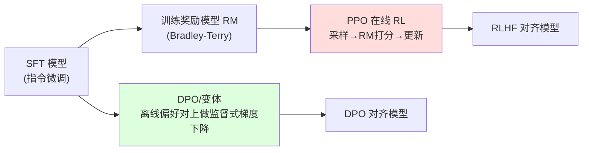
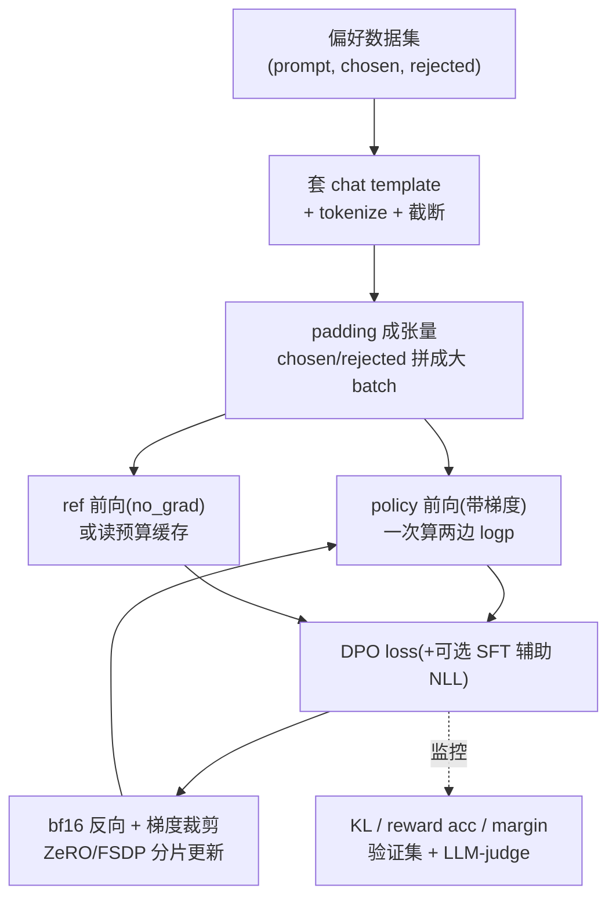

# DPO 对齐 · 进阶与生产实践

> 本文承接 `dpo.py`(纯 PyTorch、CPU 几十秒可跑的 toy)与 `手把手教学.md`(原理推导),把这份玩具实现与**业界真实偏好对齐系统**打通:从 PPO-RLHF / DPO / IPO / KTO / ORPO / SimPO / 迭代 DPO / GRPO 一路讲到工程权衡、显存/通信估算与升级路线。
>
> 一句话定位:`dpo.py` 让你看懂"DPO loss 长在代码里";本文回答"为什么生产系统不能照搬这份 toy,以及它们到底怎么做"。
>
> 准确性声明:文中不引用具体 benchmark 绝对数字(易过时/失真),量级一律用"约/数量级/定性"表达;凡涉及精确比例处只给可手算的估算公式。

---

## 0. 本项目 toy 与生产的差距

`dpo.py` 为了"CPU 几十秒看懂原理"做了大量刻意简化。下表逐项列出**它简化了什么、生产为什么必须补**。

| 维度 | 本 toy 的做法 | 生产必须补什么 | 不补的后果 |
| --- | --- | --- | --- |
| 模型规模 | 单层 GRU,hidden=64,~几十 KB | 数 B~数百 B 参数的 Transformer(Llama/Qwen 等) | toy 学不到任何真实语言能力 |
| 偏好数据 | 24 条写死合成对 | 数万~数百万条真实人类/AI 标注偏好(HH-RLHF、UltraFeedback、SHP 等) | 24 条几十步即 `pref_acc=1.0`,纯过拟合 |
| batch 计算 | Python 逐样本 for 循环算 logp | padding + 张量化,chosen/rejected **拼成一个大 batch 一次前向** | 逐样本前向慢几十~上百倍,GPU 利用率极低 |
| 参考模型 | `deepcopy` 常驻内存,逐样本 no_grad 前向 | 要么常驻 1 份冻结 ref(双倍权重显存),要么**预计算 ref logp 缓存到磁盘** | 不缓存则每 step 重复跑 ref,吞吐腰斩 |
| 长度处理 | 续写 logp 直接 `.sum()`,无长度归一化 | 处理 length bias(SimPO 长度归一化 / IPO 有界目标 / 长度惩罚) | 模型学会"靠堆长度/堆短"刷 margin |
| KL/正则 | 仅靠 β 与 ref 隐式约束 | 监控 KL、加 SFT 辅助 loss(如 RPO/DPO+NLL)防能力退化 | reward over-optimization,通用能力崩 |
| 优化器/精度 | Adam fp32 CPU | AdamW + bf16/混合精度 + 梯度裁剪 + cosine/warmup 调度 | 大模型 fp32 显存放不下,收敛差 |
| 分布式 | 单进程单卡(CPU) | ZeRO/FSDP 分片 + 多卡/多机,ref 也需分片或卸载 | 单卡放不下 policy+ref+optimizer state |
| 评估 | 自身 24 条上的 `pref_acc`/`reward_margin` | 留出验证集 + early stop + 外部 LLM-judge/人评 + 通用能力回归测试 | 训练集 margin 涨 ≠ 真实变好 |
| 数据质量 | 正负对天然清晰可分 | 去重、过滤 tie/低质标注、控制标注噪声、防 reward hacking | 噪声偏好对会把模型带偏 |
| 多轮/系统提示 | 单轮、无 chat template | 套 chat template、只对 assistant turn 计 loss、多轮拼接 | 模板不对会破坏对话能力 |

**核心认知**:toy 验证的是"DPO loss 的数学正确性";生产解决的是"在真实大模型上,如何**稳定、高吞吐、不退化**地把这条 loss 跑出泛化效果"。后者的复杂度 90% 不在 loss 本身,而在数据、显存、稳定性、评估。

---

## 1. 业界系统怎么做

### 1.1 两条主流对齐范式

业界把"用偏好对齐模型"分成两大流派,DPO 属于后者:

| 维度 | PPO-RLHF | DPO 系 |
| --- | --- | --- |
| 组件数 | 4 个模型同时在显存:policy / ref / RM / value(critic) | 2 个:policy + ref(ref 可缓存) |
| 是否在线采样 | 是(每步用当前 policy 生成 rollout) | 否(用静态预采好的偏好对) |
| 稳定性 | 差,超参敏感,易崩 | 好,像分类任务一样稳 |
| 吞吐/显存 | 重(采样+4模型+KL估计) | 轻(2 模型,无采样) |
| 上限/灵活度 | 高(在线探索,能持续改进) | 受限于离线数据分布(易 off-policy) |
| 工程门槛 | 高(rollout 引擎+RM 服务+RL 循环) | 低(数据准备好即可常规训练) |

主流训练框架(如 HuggingFace TRL、各家内部对齐栈、OpenRLHF、verl 等)通常**同时提供 PPO 与 DPO 系两套 trainer**,让团队按数据形态和算力预算选择。DPO 因"工程简单、稳定、便宜",成为绝大多数开源对齐模型的默认起点;PPO/GRPO 则在追求上限、有在线采样基建时使用。

### 1.2 生产 DPO trainer 的标准数据流(对照 toy)

与 toy 的关键差异:(1) 套 chat template 且**只对 assistant 续写计 loss**(对应 toy 的 `response_start` 屏蔽 prompt,但生产是 token 级 label mask);(2) 把 chosen/rejected **拼成一个 forward**(toy 是 4 次独立前向);(3) ref logp 可离线缓存避免重复前向;(4) 全程混合精度 + 分布式分片。

---

## 2. 关键变体与优化

每个变体本质都是在改 DPO 的**损失形状**或**采样来源**,解决一个具体痛点。

### 2.1 IPO(Identity Preference Optimization)— 防过拟合/防退化

- **解决什么**:DPO 的 `-log σ(β·Δ)` 在偏好确定(数据无噪声)时会**把 margin 推到无穷**,容易过拟合、过度偏离 ref(正是 toy 里 24 条数据 `pref_acc` 秒到 1.0 的现象)。
- **怎么改**:把 sigmoid 目标换成**有界的平方损失**,逼近一个固定 margin 而非无限拉大:
  $$\mathcal{L}_{\text{IPO}} = \Big(\,\Delta - \tfrac{1}{2\beta}\,\Big)^2,\quad \Delta = \log\tfrac{\pi_\theta(y_w)}{\pi_{\text{ref}}(y_w)} - \log\tfrac{\pi_\theta(y_l)}{\pi_{\text{ref}}(y_l)}$$
- **代价**:目标更保守,纯靠它有时欠拟合;需调 β 找到合适的目标 margin。

### 2.2 KTO(Kahneman-Tversky Optimization)— 不需要成对数据

- **解决什么**:DPO 必须有**成对**的 (chosen, rejected),而真实业务里常常只有**单边二元标签**(这条好/这条坏,点赞/点踩),凑对成本高。
- **怎么改**:借鉴前景理论(prospect theory),对"好样本"和"坏样本"分别定义相对 ref 的效用,**逐样本**(unpaired)优化,无需配对。
- **代价**:理论上不如成对信号干净;需要估计/设定一个参考点(KL 基线),好坏样本比例需调。
- **何时用**:线上反馈天然是 thumbs up/down、无法配对时,KTO 是首选。

### 2.3 ORPO(Odds Ratio Preference Optimization)— 砍掉参考模型 + 合并 SFT

- **解决什么**:DPO 需要常驻一个 ref(双倍权重显存/额外前向),且通常要先单独做一遍 SFT。
- **怎么改**:**不用 ref**。在标准 SFT 的 NLL loss 上加一个基于 **odds ratio** 的偏好惩罚项,直接在基座上**一步**同时做 SFT + 偏好对齐:
  $$\mathcal{L}_{\text{ORPO}} = \mathcal{L}_{\text{NLL}}(y_w) + \lambda \cdot \mathcal{L}_{\text{OR}},\quad \mathcal{L}_{\text{OR}} = -\log\sigma\Big(\log\tfrac{\text{odds}_\theta(y_w)}{\text{odds}_\theta(y_l)}\Big)$$
- **代价**:省掉 ref 显存,但混合两个目标需调 λ;没有 ref 锚点,正则性质不同于 DPO。

### 2.4 SimPO(Simple Preference Optimization)— 无 ref + 长度归一化

- **解决什么**:(1) DPO 的 logp 求和有 **length bias**(toy 直接 `.sum()` 正是这个问题);(2) 仍想去掉 ref。
- **怎么改**:用**长度归一化的平均 log 概率**作为隐式奖励(除以续写 token 数),并引入一个 **target reward margin γ**:
  $$\mathcal{L}_{\text{SimPO}} = -\log\sigma\Big(\tfrac{\beta}{|y_w|}\log\pi_\theta(y_w) - \tfrac{\beta}{|y_l|}\log\pi_\theta(y_l) - \gamma\Big)$$
- **代价**:对 β、γ 较敏感;无 ref 时若数据噪声大可能更易退化。对应 toy 练习 4(长度归一化)正是 SimPO 的雏形。

### 2.5 cDPO / 标签平滑 — 容忍标注噪声

- **解决什么**:真实标注有错(标反的偏好对)。原始 DPO 假设标签 100% 可信。
- **怎么改**:用 label smoothing ε,把目标从"赢的概率=1"软化为 1-ε,等价于在 loss 里混入"反向偏好"的小权重项。
- **代价**:需估计噪声率 ε;过大反而欠拟合。

### 2.6 在线 vs 离线 / 迭代 DPO — 突破离线数据天花板

- **痛点**:标准 DPO 是**纯离线**的——偏好对来自某个固定模型的采样,训练中 policy 漂移后,这些样本变得 **off-policy**,信号失真,上限受限于数据分布。
- **在线/迭代 DPO 做法**(把 DPO 推向接近 PPO 的在线性):
  1. 用当前 policy 对一批 prompt 采样多个候选;
  2. 用一个**偏好信号源**(RM、更强的 LLM-judge、或规则)对候选排序,构造**新鲜的 on-policy 偏好对**;
  3. 在新对上跑一轮 DPO;回到 1,迭代多轮。
- **收益**:显著提升上限(数据始终贴着当前 policy 分布),逼近在线 RLHF 的效果,但仍保留 DPO 的稳定性。
- **代价**:重新引入采样成本与一个偏好信号源(RM 或 judge),工程比纯离线重。

### 2.7 GRPO(DeepSeek)— 去 critic 的组内相对优化

- **解决什么**:PPO 需要一个和 policy 同量级的 **value/critic 网络**(额外一份大模型显存 + 难训)。
- **怎么改**:对同一 prompt 采样**一组**(group)候选,用**组内奖励的均值/方差做标准化**当作 advantage,**完全去掉 critic**:
  $$\hat A_i = \frac{r_i - \text{mean}(\{r_1..r_G\})}{\text{std}(\{r_1..r_G\})}$$
  再套类 PPO 的 clip 目标 + KL 到 ref 的惩罚。
- **关键意义**:GRPO 是 DeepSeek-R1 等推理模型对齐的核心,把"在线 RL"的显存从 4 模型降到 3(去 critic),又保留在线探索能力。
- **代价**:仍需在线采样(比 DPO 重)、需要 group size G 个 rollout、对奖励信号质量敏感。

### 2.8 RLVR(Reinforcement Learning with Verifiable Rewards)— 用可验证奖励替代 RM

- **解决什么**:RM 会被 reward hacking,且训练 RM 本身贵。对**有客观对错**的任务(数学、代码、形式证明),根本不需要主观偏好模型。
- **怎么做**:奖励直接来自**自动验证器**(单元测试通过/答案匹配/编译运行/形式校验),0-1 或分级,喂给 GRPO/PPO。
- **与 DPO 关系**:RLVR 通常配 GRPO(在线),不走 DPO;但思想互通——**奖励信号越客观,对齐越不易被 hack**。这也是把"可验证奖励"焊进训练循环的趋势(对数学/代码/Agent 任务尤其有效)。
- **代价**:仅适用于可验证任务;开放式对话(礼貌、帮助性)仍需偏好/RM。

### 2.9 一张表选型

| 变体 | 要 ref? | 要成对数据? | 在线采样? | 主攻痛点 |
| --- | --- | --- | --- | --- |
| DPO | 要 | 要 | 否 | 替代 PPO,稳定便宜 |
| IPO | 要 | 要 | 否 | 过拟合/无限 margin |
| cDPO | 要 | 要 | 否 | 标注噪声 |
| KTO | 要(基线) | **否** | 否 | 只有单边二元标签 |
| ORPO | **否** | 要 | 否 | 省 ref + 合并 SFT |
| SimPO | **否** | 要 | 否 | length bias + 省 ref |
| 迭代/在线 DPO | 要 | 要(动态生成) | **是** | 离线天花板/off-policy |
| GRPO | 要(KL) | 否(用奖励) | **是** | 去 critic 的在线 RL |
| RLVR(+GRPO) | 要(KL) | 否 | **是** | 客观任务,防 hack |

---

## 3. 真实工程权衡与坑

### 3.1 显存:DPO 的"双模型"账

DPO 比 SFT 多一份 ref。一个粗略账本(以参数量 N、字节/参数 b 计):

- **policy**:权重 + 梯度 + Adam 两个 state(m, v)。bf16 训练混合精度常驻 fp32 master 时,经验值约 **16N 字节/参数**(2 权重+2 梯度+4+4 优化器 +fp32 master 等,实现而异)。
- **ref**:只前向、冻结、无梯度无优化器,**约 2N 字节**(bf16 权重)。
- **激活**:与 batch×seqlen×层数成正比,长序列偏好对(chosen/rejected 两条)激活翻倍。

**优化手段(按收益排序)**:
1. **预计算 ref logp**:训练前用 ref 把整份数据集的 chosen/rejected logp 跑一遍存盘,训练时直接读 → 省掉 ref 常驻显存与每步前向(吞吐可观提升,代价是一次性预处理 + 磁盘)。
2. **ZeRO-3 / FSDP 分片** policy 与优化器 state。
3. **梯度检查点(activation checkpointing)**:用算力换激活显存。
4. **LoRA-DPO**:只训 LoRA adapter,ref = 基座(关掉 adapter 即得 ref logp),**一份权重当两个模型用**,显存骤降——这是消费级/单卡跑 DPO 的主流方案,可直接复用本仓库 `03-lora-from-scratch`。

### 3.2 吞吐与延迟

- **chosen/rejected 拼 batch**:toy 的逐样本 4 次前向是吞吐杀手;生产把两边拼成一个 forward,GPU 利用率成倍提升。
- **长度分桶(length grouping)**:把长度相近的样本放一个 batch,减少 padding 浪费(偏好对长度差异大时尤其重要)。
- **ref 缓存**(见上)是单点最大吞吐收益。

### 3.3 精度与稳定性

- 必须 `F.logsigmoid` 而非 `log(sigmoid(·))`(toy 已做对):数值稳定,避免 -inf。
- bf16 比 fp16 更稳(动态范围大),logp 求和涉及很多负数累加,fp16 易溢出/精度丢失。
- 梯度裁剪 + warmup:DPO 学习率通常比 SFT 小一个量级(经验 5e-7~5e-6 级别,模型/数据而异),太大会一步把 policy 推离 ref 导致退化。

### 3.4 线上常见故障与调优

| 现象 | 可能原因 | 调优方向 |
| --- | --- | --- |
| chosen 和 rejected 的 logp **同时下降** | DPO 已知现象:loss 可降但绝对似然双降,长此以往伤生成质量 | 加 SFT 辅助 NLL(DPO+NLL/RPO);监控 chosen logp 绝对值 |
| reward margin 涨但**实测变差** | reward over-optimization,偏离 ref 太远;或 length/格式 hacking | 降 β/lr、early stop、长度归一化(SimPO)、外部 judge 评 |
| 通用能力(MMLU 等)退化 | KL 失控,丢掉 SFT 能力 | 增大 KL 约束(减小 β)、加 SFT replay、缩短训练 |
| margin 不涨 | ref 没冻结 / SFT 没学好 / β 或 lr 离谱 | 检查 ref `requires_grad=False`、先确认 SFT 质量 |
| 偏好准确率虚高 | 训练集过拟合(toy 24 条即此症) | 留验证集 early stop,扩 + 去噪数据 |
| 多卡 loss 抖动/NaN | bf16/分片通信精度、未裁剪梯度 | 梯度裁剪、loss scaling、检查分片 reduce |

> **β 是 DPO 最重要的超参**:β 小 → 贴紧 ref、保守、不易退化但学得慢;β 大 → 敢偏离、学得快但易过优化。生产常从 0.1 起调(toy 默认也是 0.1)。

---

## 4. 性能直觉与估算

下面给**可手算**的量级公式,帮助拍预算。

### 4.1 显存估算(单卡能否放下)

设模型 N 参数,混合精度 AdamW 训练:
$$M_{\text{policy}} \approx 16N \text{ bytes}, \quad M_{\text{ref}} \approx 2N \text{ bytes}, \quad M_{\text{DPO}} \approx 18N + M_{\text{act}}$$

- 例:N=7B → policy ≈ 7e9×16 ≈ **112 GB**,ref ≈ 14 GB,合计 ~126 GB(不含激活)→ 单张 80GB 卡放不下,需 ZeRO-3/多卡,或改 **LoRA-DPO**(此时优化器只覆盖 adapter,policy 显存项坍缩到接近 2N + 小 adapter,单卡可行)。
- **LoRA-DPO 估算**:M ≈ 2N(基座 bf16,policy/ref 共享) + 16×N_lora(adapter,N_lora≪N) + 激活 → 7B 模型常可塞进单张 24~48GB 卡。

### 4.2 ref 缓存省多少

每 step DPO 前向次数:
- 不缓存:policy(chosen+rejected) + ref(chosen+rejected) = **4 次前向等价计算**(其中 2 次 ref 是纯浪费的重复)。
- 缓存 ref:只剩 policy 的 2 次。**理想上界**:省去约 1/3 的前向 FLOPs(ref 前向比 policy 便宜,因为无反向),实测吞吐提升取决于 ref 前向占比,通常**可观但非线性 1/3**。

### 4.3 偏好对计算量

一条偏好对的前向成本 ≈ **2 条普通序列**(chosen + rejected)。所以同样 token 预算下,DPO 的 step 吞吐(以"偏好对/秒"算)约为 SFT(以"序列/秒"算)的 **1/2 量级**,再叠加 ref 开销 → 经验上 DPO 比同规模 SFT **慢约 2~3 倍/样本**(缓存 ref 后更接近 2 倍)。

### 4.4 在线/GRPO 的采样放大

GRPO 每个 prompt 要 G 个 rollout(典型 G=4~16),每个 rollout 是**自回归解码**(比训练前向贵得多):
$$\text{cost}_{\text{online}} \approx \underbrace{G \times \text{decode}(L)}_{\text{采样,主导项}} + \text{训练前向反向}$$
所以在线方法(GRPO/迭代 DPO)的算力主要烧在**采样解码**上——这正是它比离线 DPO 重一个数量级的根因,也是为什么离线 DPO 在"性价比"上长期是默认选择。

---

## 5. 动手进阶路线

把 `dpo.py` 从 toy 推向接近生产,建议分 5 步,每步都能独立验证:

1. **张量化 batch(去掉 Python 逐样本循环)**
   把 chosen/rejected `pad` 成同长张量,用 attention mask + label mask 一次前向算全 batch logp(对应 `手把手教学.md` 练习 5)。验证:结果与逐样本一致,但每 step 明显加速。这是迈向工程实现最关键的一步。

2. **接真实 backbone + 真实数据**
   用 HuggingFace 一个小型预训练模型(如 GPT-2/小 Qwen)替换 `CharLM`,套 chat template,只对 assistant 续写打 label;数据换成公开偏好集(HH-RLHF / UltraFeedback 的子集)。验证:在留出验证集上 `pref_acc` 提升且不秒到 1.0。

3. **加 LoRA + ref 缓存 + 混合精度**
   policy 用 LoRA(复用 `../03-lora-from-scratch` 思路),ref = 关掉 adapter 的基座;训练前预计算并缓存 ref logp;切 bf16 + 梯度裁剪 + warmup/cosine 调度。验证:单卡显存大幅下降,吞吐提升。

4. **加正则与监控防退化**
   损失里加一个 SFT 辅助 NLL 项(DPO+NLL);引入长度归一化(向 SimPO 靠);训练中监控 KL、chosen 绝对 logp、验证集 margin,加 early stop。验证:reward margin 上升的同时,chosen logp 不崩、通用能力不退化。

5. **做一轮迭代/在线 DPO(进阶)**
   用当前 policy 采样候选 → 用一个 LLM-judge 或简单 RM 排序构造新偏好对 → 再跑一轮 DPO。验证:新一轮在验证集上优于纯离线一轮,体会 on-policy 的收益与采样成本。(若有可验证任务,可顺势体验 RLVR + GRPO 思想。)

---

## 6. 延伸阅读

**本仓库已有深度文档(优先,相对本项目目录):**

- 直接偏好优化原理:[`../../llm-alignment/DPO.md`](../../llm-alignment/DPO.md)
- RLHF / PPO 对照与对齐总览:[`../../llm-alignment/RLHF.md`](../../llm-alignment/RLHF.md)、[`../../llm-alignment/基本概念.md`](../../llm-alignment/基本概念.md)
- 对齐专题目录:[`../../llm-alignment`](../../llm-alignment)
- LoRA(LoRA-DPO 省显存的基础):[`../03-lora-from-scratch`](../03-lora-from-scratch)、[`../../llm-train/peft`](../../llm-train/peft)、[`../../llm-train/qlora`](../../llm-train/qlora)
- 训练并行/显存基建(ZeRO/Megatron/DeepSpeed-Chat):[`../../llm-train/megatron-deepspeed`](../../llm-train/megatron-deepspeed)、[`../../llm-train/deepspeedchat`](../../llm-train/deepspeedchat)
- 张量并行动手:[`../12-tensor-parallel-from-scratch`](../12-tensor-parallel-from-scratch)、通信原语 [`../13-ring-allreduce`](../13-ring-allreduce)
- 评估闭环:[`../14-llm-eval-mini`](../14-llm-eval-mini)、[`../../llm-eval`](../../llm-eval)
- 本项目原理与逐行精讲:[`./手把手教学.md`](./手把手教学.md)、[`./README.md`](./README.md)

**经典论文与社区资源:**

- DPO 原始论文:Direct Preference Optimization(arXiv:2305.18290)
- IPO:A General Theoretical Paradigm to Understand Learning from Human Preferences(arXiv:2310.12036)
- KTO:Model Alignment as Prospect Theoretic Optimization(arXiv:2402.01306)
- ORPO:Monolithic Preference Optimization without Reference Model(arXiv:2403.07691)
- SimPO:Simple Preference Optimization with a Reference-Free Reward(arXiv:2405.14734)
- GRPO / DeepSeekMath:DeepSeekMath(arXiv:2402.03300);DeepSeek-R1(arXiv:2501.12948)
- RLVR / 可验证奖励:Tülu 3(可验证奖励的开源对齐配方,arXiv:2411.15124)
- 工程实现参考:HuggingFace TRL(DPOTrainer/KTOTrainer/ORPOTrainer)、OpenRLHF、verl

> 学习建议:先用本文第 5 节把 `dpo.py` 升到"张量化 + 真实模型 + LoRA",亲手体会显存与吞吐的真实约束;再回看第 2 节各变体的损失公式,你会发现它们都是在你刚踩过的坑(过拟合、length bias、省 ref、离线天花板)上各打一拳。
