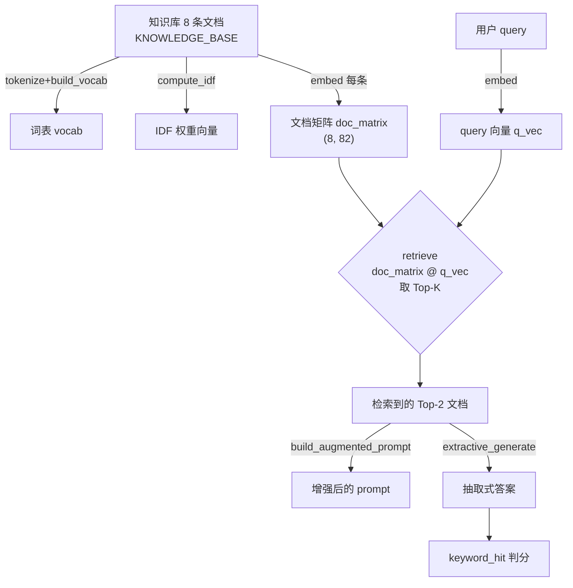

# 从零实现最小 RAG：手把手教学

> 本文带你逐行读懂 `rag_minimal.py`——一个**零依赖、CPU 几秒跑通**的检索增强生成(RAG)最小实现。

**学完这篇你能掌握：**

1. 说清楚 **RAG(Retrieval-Augmented Generation)** 到底解决什么问题、五个步骤是什么。
2. 亲手推导 **TF-IDF** 向量化与 **余弦相似度** 的数学，并知道代码里每个 `+1`、每次归一化为什么这么写。
3. 看懂 `embed / retrieve / build_augmented_prompt / extractive_generate` 这条主干代码的每一行。
4. 读懂程序输出里的 `cos=0.371`、`accuracy 0/5`、`+100 percentage points` 各代表什么。
5. 通过一个**对照实验(No-RAG vs RAG)**，亲眼看到"检索接地(grounding)"如何把幻觉命中率从 0% 拉到 100%。

---

## 0. 前置知识与环境

**你需要会一点：**

- Python 基础语法（函数、列表、字典、`for` 循环）。
- 不需要懂深度学习、不需要 GPU、不需要任何 API key。向量、相似度这些概念本文会从零讲。
- 高中数学（向量点积、对数 $\log$）够用，剩下的本文推导。

**安装依赖：** 整个项目只依赖 `numpy`。

```bash
pip install numpy
```

**怎么跑：**

```bash
cd practical-projects/10-rag-minimal
python rag_minimal.py
```

几秒钟跑完，全部输出打印在终端。脚本所有 `print` 刻意只用英文/ASCII，是为了避免 Windows GBK 控制台报 `UnicodeEncodeError`——中文说明都在注释、README 和本文里。

---

## 1. 问题背景：不用这个技术会怎样

设想你给公司做了一个客服机器人，背后是一个大模型。用户问：

> "Acme 公司是哪年成立的？员工有多少天年假？"

大模型的全部知识，都"冻结"在它训练完那一刻的参数里。而 **Acme 是一家虚构公司**，它的成立年份、年假天数、退货政策，全是企业私域信息，模型预训练时**根本没见过**。这时模型有两种典型反应：

- 老实说"我不知道"——但很多模型不会，它们倾向于给出一个**听起来很自信**的答案。
- **编造(hallucination/幻觉)**：比如一本正经地说"Acme 成立于 2008 年，提供 15 天年假"。语气笃定，事实全错。

这正是 `rag_minimal.py` 里 `closed_book_answer` 模拟的场景——它返回一句写死的、自信的错误答案：

```python
return "Acme was founded in 2008 and offers 15 vacation days (model guess, ungrounded)."
```

`ungrounded`（未接地）一词点出了病根：答案没有**任何证据支撑**，纯靠"参数记忆"硬猜。对私域、时效性强的问题，这种硬猜的正确率约等于 0。

**RAG 的思路一句话：先去外部知识库把相关资料检索出来，塞进 prompt，再让模型基于这些资料作答。** 这样答案就被"锚定(grounding)"在真实证据上，而不是靠模型瞎编。本脚本把这套闭环用纯 numpy 全手写了一遍。

---

## 2. 核心原理详解

RAG 把"回答问题"拆成五步。先看全景图：



下面把两个数学核心讲透。

### 2.1 TF-IDF：把文本变成可比较的向量

要让计算机判断"问题"和"文档"像不像，得先把文本变成**数字向量**。最经典的做法是 TF-IDF。

**词表(vocabulary)**：先把语料里出现过的每个词分配一个固定的列号。本 demo 一共 82 个不同的词，于是每段文本都被表示成一个 **82 维向量**，第 $j$ 维对应词表里第 $j$ 个词。不同文本落在**同一个坐标系**里，才能比较。

**TF（词频，Term Frequency）**：词 $w$ 在某段文本里出现的次数，除以该文本的总词数：

$$
\text{tf}(w, d) = \frac{\text{count}(w, d)}{|d|}
$$

除以总词数 $|d|$ 是为了抵消文本长短差异——长文档里每个词的原始计数天然偏大。

**IDF（逆文档频率，Inverse Document Frequency）**：衡量一个词的"区分度"。像 `the / of / a` 这种几乎每篇都有的词，没有主题信息；而 `phoenix / vacation` 只在少数文档里出现，才是检索的关键信号。代码用的平滑公式是：

$$
\text{idf}(w) = \log\!\left(\frac{1 + N}{1 + \text{df}(w)}\right) + 1
$$

其中 $N$ 是文档总数（本 demo $N=8$），$\text{df}(w)$ 是**包含词 $w$ 的文档数**。

- 分子分母各加 $1$：**平滑**，避免 $\text{df}=0$ 时除零，也避免某词出现在全部文档时算出 $\log 1 = 0$ 把它彻底清零。
- 末尾 `+ 1`：保证 IDF 恒为正，即使是最常见的词也保留一点权重。

直觉验证：一个词出现的文档越多（$\text{df}$ 越大），分数越小 → IDF 越小 → 越不重要。完全符合"越普遍越没区分度"。

**TF-IDF = TF × IDF**：把两者逐维相乘，得到一个向量——常见词被压低、关键词被放大。

$$
\text{tfidf}(w, d) = \text{tf}(w, d)\cdot \text{idf}(w)
$$

### 2.2 余弦相似度：两个向量有多"像"

有了向量，怎么比较 query 和文档像不像？用**余弦相似度**——看两个向量夹角的余弦值：

$$
\cos(\mathbf{q}, \mathbf{d}) = \frac{\mathbf{q}\cdot\mathbf{d}}{\|\mathbf{q}\|\,\|\mathbf{d}\|}
$$

它只看**方向**不看长度：值在 $[-1, 1]$（TF-IDF 非负所以实际在 $[0, 1]$），越接近 1 越相似，0 表示毫无共同关键词。

**关键技巧——L2 归一化：** 如果我们提前把每个向量除以它自己的模长 $\|\mathbf{v}\|$，让它变成单位向量，那么分母就恒为 1，于是：

$$
\cos(\mathbf{q}, \mathbf{d}) = \mathbf{q}\cdot\mathbf{d} \quad(\text{当 } \|\mathbf{q}\|=\|\mathbf{d}\|=1)
$$

**余弦相似度直接退化成点积**。这就是代码里 `embed` 末尾做 L2 归一化、`retrieve` 里只用一句 `doc_matrix @ q_vec` 就能算出所有相似度的原因——既省事又快。

---

## 3. 代码逐段精讲

下面按"知识库 → 分词 → 词表 → IDF → 向量化 → 检索 → 增强 → 生成 → 对照 → 主流程"的逻辑顺序拆解。

### 3.1 知识库：RAG 的"外部记忆"

```python
KNOWLEDGE_BASE = [
    "Acme Corp was founded in 2011 in the city of Greenfield by Dana Lee.",
    "The Acme Phoenix laptop ships with 32 gigabytes of memory and a 14 inch screen.",
    "Acme employees get 25 paid vacation days per year plus public holidays.",
    "The Acme support hotline operates from 9 am to 6 pm on weekdays only.",
    "Returns at Acme are accepted within 30 days of purchase with a valid receipt.",
    "The Phoenix laptop battery lasts about 12 hours of normal office use.",
    "Acme's headquarters moved to a new green building in 2020 to cut energy use.",
    "All Acme software updates are released on the first Tuesday of each month.",
]
```

- 这是 8 条**独立的文档块（chunk）**。真实工程里这些来自 PDF/网页切片后的片段。
- 内容刻意写成"模型预训练时不可能知道"的私域事实（虚构公司 Acme 的规章/产品），这样才能凸显"不检索 = 只能编造"。
- **新手易困惑点**：这里每条文档恰好是一句话，所以"文档块"和"句子"暂时是一回事。但代码后面仍保留了按句切分的逻辑，以兼容"一个 chunk 含多句"的真实情况。

### 3.2 分词 tokenize

```python
def tokenize(text):
    """Lowercase and split text into alphanumeric word tokens."""
    return re.findall(r"[a-z0-9]+", text.lower())
```

- 先 `.lower()` 全转小写（这样 `Acme` 和 `acme` 视为同一个词），再用正则 `[a-z0-9]+` 抓出所有"连续的字母或数字"段。
- 标点、空格自动被丢弃。比如 `"Acme's headquarters"` → `['acme', 's', 'headquarters']`（注意撇号被切开，`s` 单独成词）。
- **为什么这么写**：这是最朴素的分词，教学够用。真实工程会用 BPE / WordPiece 等专门 tokenizer。

### 3.3 构建词表 build_vocab

```python
def build_vocab(documents):
    """Build a sorted {word: column_index} mapping from all documents."""
    vocab = {}
    for doc in documents:
        for word in tokenize(doc):
            if word not in vocab:
                vocab[word] = len(vocab)
    return vocab
```

- 遍历所有文档的所有词，第一次见到某个词就给它分配一个**列索引**：第 1 个新词 → 0，第 2 个 → 1……（用 `len(vocab)` 巧妙地拿到"下一个空位号"）。
- 结果是一个 `{词: 列号}` 字典，例如 `{'acme': 0, 'corp': 1, 'was': 2, ...}`。这就是向量每一维的"含义说明书"。
- 本 demo 跑出来 **82 个不同的词**，所以每个向量是 82 维。
- **新手易困惑点**：docstring 写的是 "sorted"，但代码实际是**按出现顺序**编号，并没有排序。这不影响正确性——只要同一套词表始终用同一个映射，所有向量就处在同一坐标系下，可比较即可。

### 3.4 计算 IDF compute_idf

```python
def compute_idf(documents, vocab):
    """Compute the IDF weight for every vocabulary word."""
    n_docs = len(documents)
    df = np.zeros(len(vocab))  # df[w] = 含有词 w 的文档数
    for doc in documents:
        seen = set(tokenize(doc))  # 每个文档每个词只计一次
        for word in seen:
            df[vocab[word]] += 1.0
    idf = np.log((1.0 + n_docs) / (1.0 + df)) + 1.0
    return idf
```

- `df` 是长度 82 的数组，`df[j]` = "第 $j$ 个词出现在多少篇文档里"。
- **关键 `set()`**：`seen = set(tokenize(doc))` 对每篇文档去重，保证"一个词在同一篇文档里出现多次也只算 1 篇"——这正是 IDF 里 **document frequency（文档频率）** 的定义，区别于 TF 的词频。
- 最后一行完全对应 §2.1 的公式 $\text{idf} = \log\frac{1+N}{1+\text{df}} + 1$。numpy 的逐元素运算让整条公式一行算完，得到长度 82 的 IDF 权重向量。
- **对应原理**：这一步在给每个维度（词）定一个"重要性权重"，越稀有的词权重越大。

### 3.5 向量化 embed（最核心的一段）

```python
def embed(text, vocab, idf):
    """Encode text into an L2-normalized TF-IDF vector."""
    vec = np.zeros(len(vocab))
    tokens = tokenize(text)
    if not tokens:
        return vec
    # TF:词在本文本中的出现频率(除以总词数,抵消文本长短差异)
    for word in tokens:
        if word in vocab:          # 词表外的词忽略(OOV)
            vec[vocab[word]] += 1.0
    vec /= len(tokens)
    # TF * IDF:常见词被压低,关键词被放大
    vec *= idf
    # L2 归一化
    norm = np.linalg.norm(vec)
    if norm > 0:
        vec /= norm
    return vec
```

逐块对应 §2 的数学：

1. `vec = np.zeros(len(vocab))`：开一个 82 维全零向量，准备往对应维度上累加。
2. `if not tokens: return vec`：空文本直接返回零向量（防御性编程）。
3. **算 TF 的分子**：`for word in tokens: ... vec[vocab[word]] += 1.0`——把每个词在对应列上 +1，得到原始词频计数。`if word in vocab` 处理 **OOV（out-of-vocabulary，词表外词）**：query 里若出现知识库从没出现过的词，直接忽略（它没有列号，也没法贡献相似度）。
4. **算 TF 的分母**：`vec /= len(tokens)`——除以文本总词数，得到归一化词频 $\text{tf}$，对应 §2.1 的 $\frac{\text{count}}{|d|}$。
5. **乘 IDF**：`vec *= idf`——逐维乘权重，得到完整的 TF-IDF 向量。
6. **L2 归一化**：`vec /= norm`——除以模长变单位向量。**这一步是为了让后面检索时点积就等于余弦相似度**（见 §2.2）。`if norm > 0` 防止全零向量除零。

- **新手易困惑点**：为什么 query 和文档用**同一个** `embed` 函数？因为只有用同一套 `vocab` 和 `idf`，二者才落在同一个坐标系里，点积才有意义。这是"可比较"的前提。

### 3.6 检索 retrieve（Retrieve 那一步）

```python
def retrieve(query, documents, doc_matrix, vocab, idf, top_k=2):
    """Return the top_k (doc_index, score) pairs most similar to the query."""
    q_vec = embed(query, vocab, idf)
    # 因为向量都已 L2 归一化,矩阵乘法直接得到每篇文档的余弦相似度
    scores = doc_matrix @ q_vec
    # 取分数最高的 top_k 个,并按分数从高到低排序
    top_idx = np.argsort(scores)[::-1][:top_k]
    return [(int(i), float(scores[i])) for i in top_idx]
```

- `q_vec = embed(query, ...)`：把问题编码成同坐标系的单位向量。
- `scores = doc_matrix @ q_vec`：`doc_matrix` 形状是 `(8, 82)`，`q_vec` 是 `(82,)`，矩阵乘法一次性算出 8 个点积 = 8 个余弦相似度，存进 `scores`（长度 8）。**这一句就是向量数据库的核心操作**，只不过我们用 numpy 暴力算，真实系统用 Faiss/Milvus 的近似最近邻索引加速。
- `np.argsort(scores)` 返回"从小到大排序的下标"，`[::-1]` 反转成"从大到小"，`[:top_k]` 取前 `top_k=2` 个。于是 `top_idx` 是相似度最高的 2 篇文档的编号。
- 返回 `[(doc_index, score), ...]`——既给文档编号，也给分数（后面要打印 `cos=0.371`）。
- **新手易困惑点**：`top_k` 默认 2，意味着每次只把最相关的 2 条文档喂给生成器。`top_k` 是 RAG 最重要的超参之一：太小可能漏掉答案，太大会引入噪声、撑爆上下文。

### 3.7 增强 build_augmented_prompt（Augment 那一步）

```python
def build_augmented_prompt(query, retrieved_docs):
    """Assemble a context-augmented prompt string (the 'A' in RAG)."""
    context = "\n".join("- " + doc for doc in retrieved_docs)
    prompt = (
        "Answer the question using ONLY the context below.\n"
        "If the context lacks the answer, say you do not know.\n\n"
        "Context:\n" + context + "\n\n"
        "Question: " + query + "\n"
        "Answer:"
    )
    return prompt
```

- 把检索到的文档拼成一段 `Context:`，每条前面加 `- ` 列成清单。
- 关键是那两句**系统指令**：
  - `"Answer the question using ONLY the context below."`——强制模型只用给定证据，**这是抑制幻觉的核心约束**。
  - `"If the context lacks the answer, say you do not know."`——允许模型说不知道，而不是硬编。
- 这就是 RAG 里的 **A（Augment，增强）**：把"模型不知道的外部知识"注入到生成阶段的输入里。真实 RAG 会把这整个字符串发给 LLM；本 demo 把它交给下面的抽取式生成器。
- **新手易困惑点**：这个函数在 `main` 里**实际并没有被调用**（demo 走的是抽取式生成那条路）。它的存在是为了让你看清"真实 RAG 喂给 LLM 的 prompt 长什么样"。这是非常常见的"教学留痕"——你可以在练习里把它打印出来。

### 3.8 生成 extractive_generate（Generate 那一步）

```python
def extractive_generate(query, retrieved_docs):
    """A tiny extractive 'generator': pick the context sentence best matching the query."""
    q_words = set(tokenize(query))
    # 去掉问句里的疑问词等停用词,避免它们干扰匹配
    stopwords = {"what", "when", "where", "who", "how", "is", "are", "the",
                 "a", "an", "of", "do", "does", "many", "long", "much"}
    q_keywords = q_words - stopwords

    best_sentence = None
    best_overlap = -1
    for doc in retrieved_docs:
        # 文档块本身就是单句,但保留按句切分以兼容多句 chunk
        for sentence in re.split(r"(?<=[.!?])\s+", doc):
            s_words = set(tokenize(sentence))
            overlap = len(q_keywords & s_words)
            if overlap > best_overlap:
                best_overlap = overlap
                best_sentence = sentence
    if best_sentence is None or best_overlap == 0:
        return "I do not know based on the provided context."
    return best_sentence.strip()
```

- 这是替代真实 LLM decoder 的**极简抽取式生成器**——不"生成"新文字，而是从检索到的上下文里**挑一句最匹配的原文**作为答案。
- `q_keywords = q_words - stopwords`：把问句里的疑问词/虚词（what/how/the/of...）剔掉。否则像 `the`、`of` 这种到处都有的词会干扰匹配。这是一个手写的"轻量停用词过滤"。
- 双重循环：遍历每条检索到的文档，再用 `re.split(r"(?<=[.!?])\s+", doc)` 按句号/问号/叹号**切句**（`(?<=...)` 是零宽后顾断言，保证标点留在句末）。
- `overlap = len(q_keywords & s_words)`：集合交集大小 = 问题关键词和这句话**重合了几个词**。重合越多越可能是答案。记录重合最多的那句 `best_sentence`。
- 兜底：若一句都没匹配上（`best_overlap == 0`），返回 `"I do not know based on the provided context."`——对应 prompt 指令里"没答案就说不知道"，这就是**诚实地拒答**，比硬编强。
- **对应原理**：它承担的角色和真实 LLM 完全一致——"基于给定 context 产出答案"，只是用最简单可控的"挑句子"代替了神经网络生成。
- **新手易困惑点**：它本质是再做一次"词重叠匹配"，所以它和 TF-IDF 检索一样，吃**词面是否对齐**这碗饭。问句用词若和原文不同（如 `return` vs `returns`），这一步也可能挑错。

### 3.9 对照组与判分

```python
def closed_book_answer(query):
    """Simulate a no-retrieval LLM: confidently produce a guess with no grounding."""
    return "Acme was founded in 2008 and offers 15 vacation days (model guess, ungrounded)."


def keyword_hit(answer, expected_keywords):
    """Check whether the answer contains all expected keywords (case-insensitive)."""
    a = answer.lower()
    return all(kw.lower() in a for kw in expected_keywords)
```

- `closed_book_answer`：模拟"没检索、纯凭参数硬猜"的 LLM，返回一句写死的、自信但事实错误的答案（2008、15 天，全错）。这就是**幻觉**的化身。
- `keyword_hit`：自动判分器。只要答案里**包含全部** `expected_keywords`（不区分大小写）就算命中。`all(...)` 表示"每个关键词都得在"。简单但客观——避免人工评判。

### 3.10 主流程 main：把五步串起来

建索引部分（离线预处理）：

```python
vocab = build_vocab(KNOWLEDGE_BASE)
idf = compute_idf(KNOWLEDGE_BASE, vocab)
doc_matrix = np.vstack([embed(doc, vocab, idf) for doc in KNOWLEDGE_BASE])
```

- 三行做完"入库"：建词表 → 算 IDF → 把 8 条文档逐条 `embed` 再用 `np.vstack` 堆成 `(8, 82)` 的矩阵。真实工程里这步是预处理/写进向量库，只做一次。

评测问题集：

```python
questions = [
    ("Who founded Acme and in what year?", ["dana lee", "2011"]),
    ("How many vacation days do Acme employees get?", ["25"]),
    ("How much memory does the Phoenix laptop have?", ["32"]),
    ("What are the support hotline hours?", ["9 am", "6 pm"]),
    ("How many days are returns accepted at Acme?", ["30 days"]),
]
top_k = 2
```

- 5 道事实题，每题配一组"正确答案必须包含的关键词"，用于 `keyword_hit` 自动判分。

主循环（每题跑两条线）：

```python
for qi, (query, expected) in enumerate(questions, 1):
    # ===== 对照组:No-RAG(闭卷)=====
    norag_ans = closed_book_answer(query)
    norag_ok = keyword_hit(norag_ans, expected)
    norag_hits += int(norag_ok)
    ...
    # ===== RAG:检索 -> 增强 -> 生成 =====
    hits = retrieve(query, KNOWLEDGE_BASE, doc_matrix, vocab, idf, top_k=top_k)
    retrieved_docs = [KNOWLEDGE_BASE[i] for i, _ in hits]
    ...
    rag_ans = extractive_generate(query, retrieved_docs)
    rag_ok = keyword_hit(rag_ans, expected)
    rag_hits += int(rag_ok)
```

- 每题先跑 **No-RAG**（直接 `closed_book_answer`），再跑 **RAG**（`retrieve` → `extractive_generate`），各自判分累加。`int(True)=1, int(False)=0` 是把布尔转成计数的常用小技巧。

汇总与成功信号：

```python
print("  No-RAG (closed book) accuracy: %d/%d = %.0f%%" % (norag_hits, n, 100.0*norag_hits/n))
print("  RAG    (retrieve+gen) accuracy: %d/%d = %.0f%%" % (rag_hits, n, 100.0*rag_hits/n))
gain = 100.0 * (rag_hits - norag_hits) / n
print("  Accuracy gain from RAG        : +%.0f percentage points" % gain)
...
if rag_hits > norag_hits:
    print("SUCCESS: retrieval grounding reduced hallucination as expected.")
```

- 把两条线的命中率打印出来，并算出**RAG 带来的准确率增益**——这个差值就是整个 demo 的"实验结论"。

---

## 4. 跑起来 + 逐行读懂输出

运行：

```bash
python rag_minimal.py
```

### 建索引阶段

```
Knowledge base : 8 documents
Vocabulary size: 82 unique words
Doc matrix     : shape (8, 82) (L2-normalized TF-IDF)
```

- `8 documents`：知识库 8 条 chunk。
- `82 unique words`：`build_vocab` 数出的不同词数 = 向量维度。
- `shape (8, 82)`：8 篇文档 × 82 维 TF-IDF，全部 L2 归一化（所以每行模长都是 1）。

### 单题示例（Q1）

```
Q1: Who founded Acme and in what year?
  [No-RAG ] answer: Acme was founded in 2008 and offers 15 vacation days (model guess, ungrounded).
  [No-RAG ] correct? NO
  [RAG    ] retrieved top-2:
      #1 (cos=0.371) Acme Corp was founded in 2011 in the city of Greenfield by Dana Lee.
      #2 (cos=0.184) Acme employees get 25 paid vacation days per year plus public holidays.
  [RAG    ] answer: Acme Corp was founded in 2011 in the city of Greenfield by Dana Lee.
  [RAG    ] correct? YES
```

逐条解释：

- `[No-RAG] answer ...`：闭卷给出的自信错误答案。期望关键词是 `["dana lee", "2011"]`，答案里既无 `dana lee` 也无 `2011`，所以 `correct? NO`。
- `[RAG] retrieved top-2`：检索返回的两条最相关文档。
  - `#1 (cos=0.371) ...`：余弦相似度 **0.371**，排第一，正好是讲创始人和年份的那条——命中目标文档。
  - `#2 (cos=0.184) ...`：相似度 0.184，排第二，蹭到了 `acme`、年份相关词所以分数次高，但不是答案。
  - **为什么分数都不到 0.5**：query 和文档里大量是停用词/各自独有的词，真正重合的关键词（`acme`、`founded`、`year`...）只占一小部分，所以余弦值偏低。**重要的不是绝对值，而是相对排序**——目标文档排第一即可。
- `[RAG] answer`：抽取式生成器从 top-2 里挑出词重叠最多的那句，即 #1 整句，含 `Dana Lee` 和 `2011`，所以 `correct? YES`。

### 最终汇总

```
RESULTS over 5 factual questions
  No-RAG (closed book) accuracy: 0/5 = 0%
  RAG    (retrieve+gen) accuracy: 5/5 = 100%
  Accuracy gain from RAG        : +100 percentage points
======================================================================
SUCCESS: retrieval grounding reduced hallucination as expected.
```

- `No-RAG 0/5 = 0%`：闭卷把 5 题全答错——因为 `closed_book_answer` 永远返回同一句写死的错误答案，不可能命中任何一题的关键词。
- `RAG 5/5 = 100%`：检索增强后全对。因为本 demo 的问句**刻意对齐了语料用词**，TF-IDF 每题都能把正确文档检索到 top-2，抽取式生成器再精准挑句。
- `+100 percentage points`：增益 = 100% − 0% = +100。**这就是 RAG 价值的直接量化。**
- `SUCCESS`：`rag_hits(5) > norag_hits(0)` 成立，打印成功信号，说明"检索接地确实抑制了幻觉"。

---

## 5. 动手改造（练习）

> 以下实验从易到难，都只需改 `rag_minimal.py` 几行。

**练习 1（最易）：复现"稀疏检索失败"。**
把 Q5 改回原始问法：

```python
("What is the return policy window?", ["30 days"]),
```

`policy`、`window` 这两个词在知识库里压根不存在（OOV），而文档写的是 `returns ... within 30 days ... receipt`；且 `return` vs `returns` 不做词干归并。预期：Q5 检索/作答失败，RAG 准确率掉到 **4/5 = 80%**。这直观演示了 **vocabulary mismatch（词表不匹配）**——也是真实场景要升级到稠密语义检索的原因。

**练习 2：调 `top_k`。**
把 `main` 里的 `top_k = 2` 改成 `1`，再改成 `5`，观察检索打印行数和准确率变化。提示：`top_k=1` 时若答案文档没排第一就会漏；`top_k=5` 会引入更多无关文档（噪声），但抽取式生成器靠词重叠仍能挑对句子。体会"召回 vs 噪声"的权衡。

**练习 3：把增强 prompt 打印出来。**
在主循环 RAG 分支里加一行：

```python
print(build_augmented_prompt(query, retrieved_docs))
```

亲眼看看真实 RAG 喂给 LLM 的 prompt 长什么样（含 `Context:` 和系统指令）。这个函数本来定义了却没被调用，正好补上。

**练习 4：扩充知识库。**
往 `KNOWLEDGE_BASE` 加一条新事实（如 `"Acme's CEO in 2023 is Mia Park."`），再加一道对应问题和关键词。预期：`Vocabulary size` 变大、`Doc matrix` 行数 +1，新题也能命中。体会"增量入库"。

**练习 5（较难）：加词干归并。**
在 `tokenize` 后简单把结尾的 `s` 去掉（朴素 stemming），让 `returns` → `return`。然后回到练习 1 的问法，看 Q5 是否能重新命中。提示：朴素去 `s` 会有副作用（如 `acme's` 的 `s`），体会真实 stemmer 为何更复杂。

---

## 6. 常见坑与排错

- **`ModuleNotFoundError: No module named 'numpy'`**：没装 numpy。运行 `pip install numpy`。
- **Windows 控制台 `UnicodeEncodeError`**：本脚本已规避（print 全英文）。如果你自己加了中文 print 又报错，可在文件顶部设置 `import sys; sys.stdout.reconfigure(encoding='utf-8')`，或改用英文打印。
- **改了问句后 RAG 准确率下降**：多半踩到 vocabulary mismatch（见练习 1）。检查问句关键词是否真的出现在某条文档里——TF-IDF 是**词面匹配**，同义词/改写匹配不上。
- **余弦相似度全是 0**：query 里的词全是 OOV（词表外），或全被 stopwords 过滤。检查 `tokenize(query)` 和 `q_keywords` 的内容。
- **`top_k` 设得比文档数还大**：`np.argsort(...)[:top_k]` 会安全返回全部 8 篇，不报错，但会引入很多低分噪声文档。
- **以为 `build_augmented_prompt` 被用了**：它在 demo 里未被调用，抽取式生成走的是 `extractive_generate`。别误以为答案是 LLM 生成的。
- **误把余弦绝对值当质量标准**：0.371 不算"低分失败"。本任务关键看**目标文档是否排进 top-k**，相对排序比绝对值重要。

---

## 7. 一图速查 / 知识卡片

**RAG 五步：**

| 步骤 | 英文 | 本 demo 对应函数 | 真实工程 |
| --- | --- | --- | --- |
| 知识库 | Knowledge Base | `KNOWLEDGE_BASE` | 海量文档切片入库 |
| 向量化 | Embedding | `embed`（TF-IDF） | BERT/BGE/OpenAI 稠密向量 |
| 检索 | Retrieve | `retrieve`（点积 top-k） | 向量库 + ANN（HNSW/IVF） |
| 增强 | Augment | `build_augmented_prompt` | 拼 context 进 prompt |
| 生成 | Generate | `extractive_generate` | LLM decoder |

**关键公式：**

| 名称 | 公式 |
| --- | --- |
| TF | $\text{tf}(w,d)=\dfrac{\text{count}(w,d)}{\lvert d\rvert}$ |
| IDF | $\text{idf}(w)=\log\!\dfrac{1+N}{1+\text{df}(w)}+1$ |
| TF-IDF | $\text{tf}(w,d)\cdot\text{idf}(w)$ |
| 余弦相似度 | $\cos(\mathbf q,\mathbf d)=\dfrac{\mathbf q\cdot\mathbf d}{\lVert\mathbf q\rVert\,\lVert\mathbf d\rVert}$，L2 归一化后 $=\mathbf q\cdot\mathbf d$ |

**关键超参/数值：** `top_k=2`、知识库 8 条、词表 82 词、矩阵 `(8, 82)`、5 道评测题、`np.random.seed(42)`、IDF 平滑 `+1`。

**核心结论：** No-RAG 0% → RAG 100%，增益 **+100 个百分点**。

---

## 8. 延伸阅读

本仓库相关文档（相对本目录路径）：

- RAG 总览与方案：[`../../llm-application/rag`](../../llm-application/rag)
  - [`README.md`](../../llm-application/rag/README.md)、[`方案.md`](../../llm-application/rag/方案.md)、[`embedding.md`](../../llm-application/rag/embedding.md)、[`存在的一些问题.md`](../../llm-application/rag/存在的一些问题.md)
- Embedding 模型：[`../../llm-application/embbedding-model.md`](../../llm-application/embbedding-model.md)
- 向量数据库：[`../../llm-application/vector-db`](../../llm-application/vector-db)
- 应用全景：[`../../llm-application`](../../llm-application)

经典论文与社区资源：

- RAG 原始论文：[Retrieval-Augmented Generation for Knowledge-Intensive NLP Tasks, arXiv:2005.11401](https://arxiv.org/abs/2005.11401)
- 向量检索库 [Faiss](https://github.com/facebookresearch/faiss)
- 开源中文 Embedding [BGE / FlagEmbedding](https://github.com/FlagOpen/FlagEmbedding)
- TF-IDF / 余弦相似度延伸：可对照阅读 BM25（关键词检索的强基线）与稠密检索 DPR。

---

> 小结：这份 demo 用最少的代码把 RAG 的灵魂讲透了——**检索接地 = 抑制幻觉**。当你日后用 Faiss + BGE + 真实 LLM 搭生产系统时，骨架与本文一模一样，变的只是每一步换成更强的实现。
