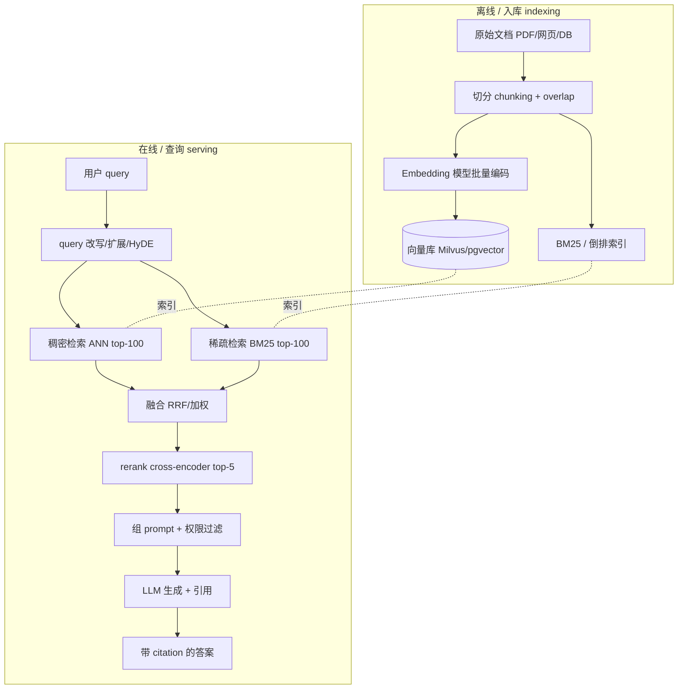
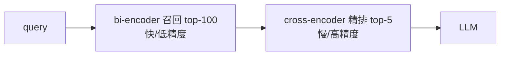

# RAG · 进阶与生产实践

> 配套 `rag_minimal.py`(纯 numpy + TF-IDF 检索 + 抽取式生成)与《手把手教学.md》。
> 本文不重复 toy 的原理,而是回答一个问题:**当你把这个 8 行知识库的 demo 换成"千万级文档 + 真 LLM + 线上 QPS"时,每一步会变成什么样、为什么必须那样改。**
> benchmark 一律用定性或"约"的量级,不编造精确数字。

---

## 0. 本项目 toy 与生产的差距

`rag_minimal.py` 把 RAG 五步(KB → embed → retrieve → augment → generate)讲透了,但为了"零依赖、CPU 几秒跑通",**每一步都被故意简化**。生产系统不是"换个更强的实现"那么简单,而是要补上 toy 里根本不存在的整条工程链路。

| 维度 | 本 toy 的做法 | 为什么够用(教学) | 生产必须补什么 | 不补的后果 |
| --- | --- | --- | --- | --- |
| **Embedding** | TF-IDF(词面计数) | 演示"文本→可比向量" | 稠密语义向量(BGE/E5/OpenAI),最好领域微调 | 同义/改写匹配不上(见教学练习 1 的 vocabulary mismatch) |
| **检索算法** | `doc_matrix @ q_vec` 暴力点积 | 8 条文档,O(N) 没问题 | ANN 索引(HNSW/IVF-PQ),向量库(Milvus/FAISS/pgvector) | N=千万时单次查询从 ms 飙到秒级 |
| **分块 chunk** | 一条文档=一句话 | 刚好对齐 | 切分策略(固定窗口/语义/父子块)+ overlap | 切碎丢上下文 or 切大撑爆窗口 |
| **召回精度** | 只靠 cosine top-k | 问句对齐了语料用词 | rerank(cross-encoder)二段精排 | top-k 里混入噪声,LLM 被带偏 |
| **检索通道** | 纯稠密向量 | demo 词面就对齐 | hybrid:BM25(稀疏)+ 向量(稠密)融合 | 专有名词/数字/代号召不回(向量弱项) |
| **生成** | 抽取式挑一句原文 | 可控、可离线 | 真 LLM 带 grounded prompt + 引用 | 无法多文档综合/推理/改写 |
| **评测** | 5 题关键词命中 | 自动判分够直观 | 检索指标(Recall@k/MRR/nDCG)+ 生成指标(忠实度/答对率)+ 人工 | 改了就上线,无法量化回归 |
| **更新** | 重建整个矩阵 | 一次性 | 增量入库 / 删改 / 版本化索引 | 全量重建慢、热更新难 |
| **工程化** | 单进程脚本 | 跑通即可 | 服务化、缓存、限流、监控、权限过滤 | 线上不可用 |

**一句话**:toy 证明了"检索接地 = 抑制幻觉"这个**灵魂**;生产 RAG 的 90% 工作量,在 toy 里全部被抽象掉了——而那 90% 决定了系统好不好用。

---

## 1. 业界系统怎么做

### 1.1 生产 RAG 的标准管线

真实系统分**离线(索引构建)**与**在线(查询服务)**两条链路:



对比 toy:toy 只有上图中间最细的一条线(单 embedding → 单次点积 → 抽取一句)。生产把它**展开成"多路召回 + 精排 + grounded 生成"**,并在两端加上索引构建与服务化。

### 1.2 向量库三个典型选型(Milvus / FAISS / pgvector)

| | FAISS | Milvus | pgvector |
| --- | --- | --- | --- |
| 形态 | **库**(嵌入进程) | 独立**分布式服务** | **Postgres 扩展** |
| 索引 | Flat/IVF/HNSW/PQ 全 | 同 FAISS + 服务化 | HNSW/IVFFlat |
| 规模 | 单机(亿级靠 PQ 压) | 水平扩展,十亿级 | 千万级以内最舒服 |
| 增删改 | 弱(偏静态/重建) | 强(实时插入/删除) | 强(就是 SQL) |
| 过滤 | 需自己拼 | 标量+向量混合过滤 | `WHERE` 原生 |
| 适合 | 研究/原型/嵌入式 | 大规模线上检索中台 | 已有 PG、数据量中等、想少加组件 |

判断:**toy 的 `doc_matrix @ q_vec` 本质就是 FAISS 的 `IndexFlatIP`(精确暴力)**。FAISS 的价值是再往上加 IVF/HNSW/PQ 做近似加速;Milvus 是把 FAISS 这类索引"服务化 + 分布式 + 可增删 + 带标量过滤";pgvector 则是"把向量检索塞进你已经在用的 Postgres"。选型第一原则:**数据量与是否需要实时增删** > 召回精度的微小差异。

### 1.3 ANN 索引:为什么不能像 toy 那样暴力算

toy 是**精确**最近邻(扫全库),N 大了不可行。生产用 **ANN(近似最近邻)**,牺牲一点召回率换数量级的速度:

- **HNSW**(分层可导航小世界图):查询快、召回高,**内存占用大**(存图边)。线上默认首选。
- **IVF**(倒排+聚类):先把向量聚成 nlist 个簇,查询只扫最近的 nprobe 个簇。省内存,nprobe 调大→召回↑速度↓。
- **PQ / IVF-PQ**(乘积量化):把向量压缩成短码,**显存/内存省一个量级**,代价是精度下降。亿级以上常用。

直觉:HNSW 把 toy 的 O(N) 点积降到约 O(log N) 图遍历;IVF 把它降到 O(N/nlist × nprobe)。

---

## 2. 关键变体与优化

逐个讲"解决什么问题、代价是什么"。

### 2.1 稠密 Embedding 与微调:解决 vocabulary mismatch

toy 的 TF-IDF 是**词面匹配**——教学练习 1 已经演示:问句用 `policy/window`、文档用 `returns/receipt`,词对不上就召不回。这是 TF-IDF 的死穴。

稠密 embedding(BGE/E5/GTE/OpenAI)把句子映射到语义空间,"退货政策"与"returns accepted within 30 days"即使**零词面重叠**也能高相似度。

- **代价**:需要模型推理(GPU/CPU 算力)、向量维度高(768/1024,toy 才 82 维稀疏)。
- **微调**:通用 embedding 在垂直领域(医疗/法律/代码)往往不够。用领域内 (query, 正样本, 难负样本) 三元组做对比学习(InfoNCE)微调,召回可明显提升。**难负样本(hard negative)挖掘是微调成败的关键**——拿"语义近但答案错"的样本当负例,逼模型学会细分。
- **对称 vs 非对称**:RAG 是"短 query 配长 doc"的**非对称检索**,选 embedding 时要用 asymmetric 模型,且 query 端常需加指令前缀(如 BGE 的 `"为这个句子生成表示用于检索相关文章:"`)。

### 2.2 Rerank(cross-encoder):召回与精排分离

向量检索是 **bi-encoder**:query 和 doc **各自独立编码**再算相似度,快,但没有"交互",精度有上限。

cross-encoder 把 (query, doc) **拼在一起**喂进模型,输出一个相关性分数——精度高得多,但**O(N) 次模型前向,贵**。

生产标准做法是**两段式**:
1. 向量/BM25 召回 top-100(快、粗)。
2. cross-encoder 对这 100 条精排,取 top-5(慢、准,但只算 100 次)。



- **解决**:召回阶段为保 recall 会放进噪声,rerank 把真正相关的顶到最前,LLM 只看 top-5 干净上下文。
- **代价**:多一次模型推理,增加延迟(几十~上百 ms)。延迟敏感场景可用轻量 rerank 或减少候选数。
- 对照 toy:toy 的 `extractive_generate` 里"按词重叠挑最匹配句子"其实是一个**极简的 rerank 雏形**——只是它用词重叠当分数,生产换成 cross-encoder 打分。

### 2.3 Hybrid(BM25 + 向量):稀疏与稠密互补

稠密向量擅长语义,但**弱于精确匹配**:产品型号 `Phoenix X1-2024`、错误码 `ERR_4012`、人名、罕见专有名词——这些恰恰是 BM25(TF-IDF 的强化版,稀疏检索)的强项。

hybrid 同时跑两路,再融合。最常用的融合是 **RRF(Reciprocal Rank Fusion)**,只看排名不看分数量纲:

$$
\text{RRF}(d) = \sum_{r \in \{\text{dense},\text{sparse}\}} \frac{1}{k + \text{rank}_r(d)} \quad (k \approx 60)
$$

- **解决**:单通道盲区。语义题靠向量,关键词/数字/代号题靠 BM25,两者各取所长。
- **代价**:维护两套索引、两次检索、一次融合;调融合权重。
- 直觉:toy 的 TF-IDF **就是 BM25 的简化前身**。生产里它没被抛弃,而是作为 hybrid 的"稀疏腿"被保留——这也是教学延伸阅读里"BM25 是关键词检索强基线"的含义。

### 2.4 GraphRAG:解决"跨文档全局推理"

朴素 RAG 是"局部检索几个 chunk"。但有些问题需要**横跨整个语料的全局综合**(如"总结这份合同集体现的主要风险主题"),top-k 个孤立 chunk 根本答不了。

GraphRAG(微软提出的范式)思路:
1. 离线用 LLM 从文档抽取**实体 + 关系**,建知识图谱。
2. 对图做**社区聚类**,为每个社区预先生成摘要。
3. 查询时:局部问题走实体邻域;全局问题走社区摘要做 map-reduce。

- **解决**:多跳推理、全局主题归纳——朴素向量 RAG 的盲区。
- **代价**:**离线建图成本极高**(对全语料反复调 LLM,token 消耗大、慢),图维护复杂。仅当业务确实需要全局推理时才上。

### 2.5 长文档:chunk 策略与 context 利用

toy "一条=一句"是奢侈品。真实文档是 PDF/网页,要先切。

- **固定窗口 + overlap**:简单,但可能切断语义。overlap(相邻块重叠 10~20%)缓解边界丢信息。
- **语义切分**:按标题/段落/句子边界切,保结构。
- **父子块(small-to-big)**:用**小块做检索**(精准命中),但喂给 LLM 时返回它所属的**大父块**(给足上下文)。生产常用。
- **chunk 大小权衡**:太小→语义碎、召回散;太大→稀释相关信号、撑 context、贵。一般 200~500 token 起步,按数据实测。
- "长 context 模型出来了还要 RAG 吗?":要。把 100 万 token 全塞进去,**贵、慢、且有"lost in the middle"**(中间信息被忽略)。RAG 先筛出相关片段,再交给(长)context 生成,仍是性价比最优解。

### 2.6 其他常用增强

- **query 改写/扩展**:口语 query 改写成检索友好的形式;多 query 召回再合并。
- **HyDE**(Hypothetical Document Embeddings):先让 LLM 生成一个"假想答案",用它的向量去检索——比短 query 更接近 doc 分布,提召回。
- **引用/溯源**:让 LLM 输出答案时标注来源 chunk,既增信任也便于纠错。toy 完全没有,生产几乎必备。

---

## 3. 真实工程权衡与坑

### 3.1 延迟 / 吞吐 / 精度三角

线上一次 RAG 请求的延迟 = embed(query) + ANN 检索 + rerank + LLM 生成。其中 **LLM 生成通常是大头**(占比常达 70%+),其次 rerank。优化优先级:

- 想降延迟:减 rerank 候选数、用更小 rerank、缓存高频 query 的检索结果、流式输出(首 token 先到)。
- 想升精度:hybrid + rerank + 更好 chunk + 领域微调 embedding——但每一项都加延迟/成本。
- **没有银弹**:这是"召回 vs 噪声 vs 延迟 vs 成本"的多目标平衡,必须用评测集量化后取舍。

### 3.2 检索召不回(最常见故障)

- 现象:LLM 答"我不知道"或胡说,但答案明明在库里。
- 根因排查:① embedding 不匹配领域(该微调);② chunk 太大/太小;③ 只用了稠密、专有名词召不回(上 hybrid);④ query 与 doc 非对称没处理好;⑤ ANN 的 nprobe/efSearch 调太小漏召回。
- 这正是 toy 教学练习 1 的放大版——把 vocabulary mismatch 从词面推到语义/工程层。

### 3.3 检索到了但 LLM 答错

- top-k 里混入相关但不含答案的"干扰块",LLM 被带偏 → 上 rerank 净化、调小 top-k。
- 多个 chunk 互相矛盾(文档版本冲突)→ 加时间/版本元数据,prompt 里要求"以最新为准"。
- context 太长触发 lost-in-the-middle → 把最相关的放最前/最后,控制喂入数量。

### 3.4 数据与一致性

- **增量更新**:文档改了,旧向量不删会召回过期内容。需要按 doc_id 版本化、可删改的索引(Milvus/pgvector 强,纯 FAISS 弱)。
- **权限过滤**:多租户/分权限场景,**必须在检索阶段就按用户权限过滤**(标量过滤 + 向量),否则会把 A 部门文档检索给 B 用户——典型的数据泄露事故。toy 完全没有这一层。
- **embedding 漂移**:换了 embedding 模型,**全库必须重新编码**,新旧向量不可混用(坐标系不同)——和 toy 里"query 和 doc 必须用同一套 vocab/idf"是同一个道理,只是代价从几毫秒变成重建千万级索引。

### 3.5 显存/内存

- 向量本身:N 条 × dim × 4 字节(float32)。HNSW 还要额外存图边(约再翻倍)。亿级向量,内存是真问题 → 上 PQ 量化压缩。
- embedding/rerank/LLM 模型显存:rerank 和 LLM 抢 GPU,要么分卡部署,要么 rerank 用 CPU/小模型。

---

## 4. 性能直觉与估算

给几个可手算的量级公式(数量级直觉,不是精确值)。

### 4.1 向量索引内存

```
原始向量内存 ≈ N × dim × 4 bytes        (float32)
HNSW 总内存  ≈ 原始 × (1.5 ~ 2)          (额外存图)
IVF-PQ 内存  ≈ N × m bytes               (m=子量化段数, 远小于 dim×4)
```

例:1000 万条 × 768 维 float32 ≈ 10^7 × 768 × 4 ≈ **约 30 GB**(裸向量);HNSW 后约 **50~60 GB**;若用 PQ(m=64)压到 **约 0.6 GB**——这就是亿级以上为什么必须量化。

### 4.2 检索延迟量级

```
暴力(toy/Flat)  : O(N × dim)   → N 千万级时单查询 ~ 百 ms~秒(不可接受)
HNSW            : ~ O(log N × dim) → 单查询通常 ms 级
IVF(nprobe=p)   : ~ O(N/nlist × p × dim)
```

直觉:从 Flat 换 HNSW,千万级库的检索延迟可降约 2~3 个数量级。

### 4.3 单请求延迟分解(估算思路)

```
T_total ≈ T_embed_query + T_ann + T_rerank + T_llm_generate
        ≈ (几 ms)      + (几 ms) + (几十 ms) + (几百 ms ~ 秒)
```

→ 优化第一刀永远砍最大项(通常是 LLM 生成:用流式/更小模型/限制输出长度)。

### 4.4 rerank 划不划算

```
召回 100 条做 cross-encoder ≈ 100 次模型前向
若每次 ~ 1 ms(小 rerank, batch) → 约 +100 ms 延迟换显著精度提升
候选数翻倍 → 延迟近似翻倍(线性)
```

→ 这就是"召回 top-100、精排 top-5"而不是"直接 cross-encoder 扫全库"的原因:把昂贵操作限制在小候选集上。

---

## 5. 动手进阶路线

把本 toy 一步步推向接近生产,每步只换一件事,便于看清每项改动的收益。

1. **稀疏 → 稠密 embedding**:把 `embed`(TF-IDF)换成调用 BGE/`sentence-transformers` 的 `model.encode`。保留 `doc_matrix @ q_vec` 不变(向量已 L2 归一化,点积仍是 cosine)。立刻能解掉教学练习 1 的 vocabulary mismatch。方向:体会"语义检索"对同义/改写 query 的鲁棒性。

2. **暴力 → FAISS/向量库**:把 `np.vstack` + `argsort` 换成 `faiss.IndexHNSWFlat` 或 pgvector。文档量从 8 条灌到几千几万条,对比暴力 vs ANN 的延迟。方向:理解 ANN 近似、nprobe/efSearch 调参。

3. **加 rerank**:在 retrieve 后接一个 cross-encoder(如 `bge-reranker`),召回 top-50 → 精排 top-5。对比加 rerank 前后,正确 chunk 是否更稳定地排进前列。方向:体会召回/精排分离。

4. **上 hybrid + 真 LLM**:加一路 BM25(`rank_bm25`),用 RRF 融合;把 `extractive_generate` 换成真 LLM,用 `build_augmented_prompt`(toy 里定义了却没调用,正好补上)做 grounded 生成,并要求输出引用。方向:打通完整生产闭环。

5. **建评测 + chunk 策略**:做一个小评测集,量化 Recall@k / 答对率;实现父子块切分与 overlap,跑回归看每项改动的真实收益。方向:从"感觉变好了"升级到"数据证明变好了"——这是生产与玩具的分水岭。

---

## 6. 延伸阅读

**本仓库已有深度文档(相对本目录):**

- RAG 总览与方案:[`../../llm-application/rag`](../../llm-application/rag)
  - [`README.md`](../../llm-application/rag/README.md) · [`方案.md`](../../llm-application/rag/方案.md) · [`embedding.md`](../../llm-application/rag/embedding.md) · [`存在的一些问题.md`](../../llm-application/rag/存在的一些问题.md)(线上坑/调优,强烈建议配本文 §3 一起读)
- Embedding 模型:[`../../llm-application/embbedding-model.md`](../../llm-application/embbedding-model.md)
- 向量数据库:[`../../llm-application/vector-db`](../../llm-application/vector-db)(含 [`README.md`](../../llm-application/vector-db/README.md) · [`reference.md`](../../llm-application/vector-db/reference.md))
- 应用全景与场景:[`../../llm-application`](../../llm-application) · [`../../llm-application/应用场景.md`](../../llm-application/应用场景.md)
- 同目录基础:[`rag_minimal.py`](./rag_minimal.py) · [`手把手教学.md`](./手把手教学.md)

**经典论文与社区:**

- RAG 原始论文:[Retrieval-Augmented Generation for Knowledge-Intensive NLP Tasks (arXiv:2005.11401)](https://arxiv.org/abs/2005.11401)
- 稠密检索 DPR:[Dense Passage Retrieval (arXiv:2004.04906)](https://arxiv.org/abs/2004.04906)
- 长 context 退化 "lost in the middle":[arXiv:2307.03172](https://arxiv.org/abs/2307.03172)
- HyDE:[Precise Zero-Shot Dense Retrieval without Relevance Labels (arXiv:2212.10496)](https://arxiv.org/abs/2212.10496)
- GraphRAG:[微软 GraphRAG (arXiv:2404.16130)](https://arxiv.org/abs/2404.16130) · [github.com/microsoft/graphrag](https://github.com/microsoft/graphrag)
- 向量检索库 [FAISS](https://github.com/facebookresearch/faiss) · 向量库 [Milvus](https://github.com/milvus-io/milvus) · [pgvector](https://github.com/pgvector/pgvector)
- 中文 Embedding/Reranker:[BGE / FlagEmbedding](https://github.com/FlagOpen/FlagEmbedding)
- BM25 实现:[rank_bm25](https://github.com/dorianbrown/rank_bm25)

---

> 小结:toy 教会你 RAG 的**灵魂**(检索接地抑制幻觉);本文教你 RAG 的**骨架到血肉**——稠密 embedding 解语义、ANN 解规模、rerank 解精度、hybrid 解盲区、chunk 解长文、评测解可控、权限/版本/缓存解上线。生产 RAG 难的从来不是哪一步,而是把这条链路在**延迟、成本、精度**之间调到平衡,并用数据证明它真的更好。
