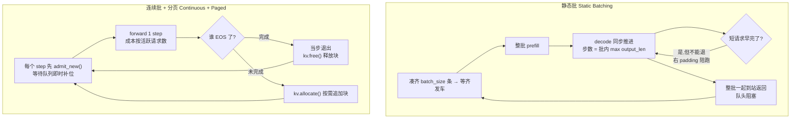

# 手把手教学:连续批处理 + 分页 KV 调度模拟器

> 本文配套代码:`paged_batching_sim.py`(同目录)。我们用一个 **纯 Python 离散事件模拟器**,在 CPU 上几秒钟跑通,把 vLLM 的两大核心思想 —— **连续批处理 (Continuous / iteration-level Batching)** 与 **分页 KV 缓存 (PagedAttention)** —— 拆开讲透,并 **定量** 对比它相对传统静态批处理的收益。

**学完这篇你能掌握:**

1. 看懂 **静态批处理 (Static Batching)** 为什么会因为"右 padding + 队头阻塞"浪费大量算力;
2. 理解 **iteration-level(迭代级)调度** 的本质:为什么"每个 forward step 重新调度"能让短请求即时退出、新请求即时补位;
3. 搞懂 **分页 KV 缓存** 怎么用"固定大小的块 (block) 按需分配/释放"消灭外部碎片、把内部碎片压到极小;
4. 会自己读懂模拟器打印的 **吞吐 (throughput)、延迟 (latency)、显存峰值、碎片率 (fragmentation)** 这几个指标,并解释它们的趋势;
5. 能动手改超参(`BLOCK_SIZE`、`TOTAL_KV_BLOCKS`、`batch_size`、负载长尾比例)做对照实验,亲眼看到结论怎么变化。

---

## 0. 前置知识与环境

**你需要会一点点:**

- Python 基础(函数、`class`、`list`、`dataclass` 大概长啥样即可);
- 知道 LLM 推理分两个阶段:**prefill**(把整段 prompt 一次性吃进去,算出它的 KV 缓存)和 **decode**(一个 token 一个 token 往外吐,每吐一个就要把它的 KV 追加进缓存);
- 听说过 "KV 缓存 (KV cache)":自回归生成时,前面 token 的 Key/Value 张量会被缓存下来,避免每步重算。这块缓存会随着序列变长而 **持续增大**,是显存的大头。

> 如果你对 KV 缓存还没概念,可以先扫一眼本仓库的 [`../../llm-inference/KV-Cache优化.md`](../../llm-inference/KV-Cache优化.md),再回来。

**安装依赖:**

```bash
pip install numpy
# 可选(不装也能跑,核心模拟是纯 numpy/Python):
pip install torch matplotlib
```

代码里 `torch` 只用来做一次"环境自检"(证明环境里确实有它),`matplotlib` 只用来可选地画一张三联柱状图;**两者缺失都不会让程序崩溃**。真正必需的只有 `numpy`。

**怎么跑:**

```bash
cd practical-projects/11-paged-attention-batching-sim
python paged_batching_sim.py
```

约 3 秒跑完,屏幕上会打印两种策略的对比报告。先把它跑出来,后面第 4 节我们逐行读输出。

> 小提示:代码里所有 **打印 (print) 一律用英文/ASCII**,作者在 docstring 里明确写了原因 —— Windows 的 GBK 控制台直接 print 中文容易 `UnicodeEncodeError`。中文只出现在注释和文档里。这是个很实用的跨平台工程习惯。

---

## 1. 问题背景:不用这个技术会怎样

想象你在做一个 LLM 推理服务(像 ChatGPT 后端)。用户请求像水流一样 **错峰到达**,而且每条请求 **输出长度差异极大**:有人问"今天星期几"(输出 5 个 token 就完事),有人让你"写一篇 2000 字作文"(输出 1000+ token)。

### 痛点一:静态批的"右 padding"浪费算力

GPU 喜欢"批 (batch)"着算 —— 把多条请求堆成一个矩阵一起做矩阵乘,效率最高。传统做法叫 **静态批处理 (static batching)**:凑齐 `batch_size` 条请求,一起送进模型,**一起**往外解码。

问题来了:一个 batch 里既有"输出 5 个 token 的"也有"输出 1000 个 token 的"。静态批必须 **右 padding(右补齐)到批内最长的那条**,整批一起跑 1000 步。那条只要 5 个 token 的请求,在剩下的 995 步里 **白白陪跑**(它的位置还占着 batch 宽度,算力照付),这就是 padding 浪费。

### 痛点二:队头阻塞 (head-of-line blocking),短请求被拖死

更糟的是:即便短请求第 5 步就生成完了,它 **也不能提前返回**给用户 —— 因为整批是"同步发车、同步到站"的,必须等批内 **最慢的那条** 跑完,整批才一起返回。于是一条本该 50ms 就回的短请求,被硬生生拖到几秒。用户体验直接崩。

### 痛点三:KV 显存"为最坏情况预留",碎片巨大

经典实现给 KV 缓存 **静态预留连续显存**:不知道你最终会生成多长,干脆按 `max_seq_len`(最大可能序列长度)给每条请求预留一整块连续空间。结果一条只用了 13 个 token 的请求,却占着 `max_seq_len`(比如 158)个格子的显存 —— **90% 以上是空着的内部碎片**。显存本来就是推理服务最稀缺的资源,这么浪费意味着你能并发的请求数大大减少,甚至直接 OOM。

**这三个痛点,正是 vLLM 论文 (PagedAttention, arXiv:2309.06180) 要解决的。** 解法就是本项目模拟的两件事:把 **调度迭代化**(连续批处理)+ 把 **显存分页化**(分页 KV)。

---

## 2. 核心原理详解

### 2.1 连续批处理:把调度粒度从"请求"降到"一步"

静态批的调度单位是 **一整条请求**(request-level):一条进来,就得跟它的同批兄弟一起从生到死。

连续批处理(也叫 iteration-level batching)的调度单位是 **一个 forward step**(= 给批内每条请求各推进 1 个 token)。每跑完一步,调度器都重新看一眼:

- 谁生成完 EOS 了?→ **当步立即退出**,把它占的显存还回去;
- 等待队列里有没有新请求?→ 只要还有空位 + 够显存,**当步即时补位** 进运行批次。

于是"短请求陪长请求跑完"和"新请求干等整批结束"这两个浪费就同时消失了。

### 2.2 step 时间成本模型:为什么"批越大越省"

模拟器不跑真实矩阵乘,而是用一个简单的 **成本模型** 近似一次 forward step 的耗时。直觉来自 roofline:一次 decode forward 的延迟 ≈ **一个固定开销**(kernel launch、读模型权重,这部分跟批里有几条请求无关)+ **每条请求的边际开销**(线性增加)。

写成公式,设批内活跃请求数为 $n$:

$$
T_{\text{step}}(n) = T_{\text{fixed}} + T_{\text{per\_req}} \cdot n
$$

代码里 $T_{\text{fixed}} = 8.0\,\text{ms}$(`STEP_FIXED_MS`),$T_{\text{per\_req}} = 1.2\,\text{ms}$(`STEP_PER_REQ_MS`)。

关键洞察:**每个 token 平摊到的时间** 是

$$
\frac{T_{\text{step}}(n)}{n} = \frac{T_{\text{fixed}}}{n} + T_{\text{per\_req}}
$$

当 $n$ 越大,固定开销 $T_{\text{fixed}}$ 被摊得越薄,单 token 成本越低。这就是"批越大越省"的数学根据。

那两种策略的差别落在哪?**$n$ 怎么取**:

- 静态批:成本永远按 **整批宽度** `len(batch)` 算 —— 哪怕短请求早跑完了,它的位置还占着,你还是付 `len(batch)` 条的钱(padding 浪费);
- 连续批:成本只按 **当前真正活跃的请求数** `len(running)` 算 —— 跑完的立刻踢出去不再计费。

### 2.3 分页 KV 缓存:把显存当成操作系统的分页内存

PagedAttention 借用了操作系统 **虚拟内存分页** 的思想。把 KV 缓存切成一堆固定大小的 **物理块 (block)**,每块装 `BLOCK_SIZE = 16` 个 token 的 KV。维护一个 **空闲块列表 (free list)**:

- 分配 (allocate):序列变长、当前块装不下了,就从空闲列表 **弹出一块** 追加给这条请求;
- 释放 (free):请求一完成,把它所有块 **塞回** 空闲列表,空间当步就能被别人复用。

存 $n$ 个 token 需要的块数(向上取整):

$$
\text{blocks\_needed}(n) = \left\lceil \frac{n}{\text{BLOCK\_SIZE}} \right\rceil
$$

**碎片对比**:

- 静态预留:每条按 `max_seq_len` 占连续空间,内部碎片 = 预留 − 实际,通常巨大;且因为要"连续"的一大块,还会有 **外部碎片** (external fragmentation)。
- 分页:逻辑上连续的 KV 序列,物理上散落在不同块里 —— **彻底消除外部碎片**;内部碎片最多只剩"每条请求最后一块的半空部分",所以很小。

模拟器里 **内部碎片率** 这样算(`fragmentation` 方法):

$$
\text{frag} = \frac{\text{已分配块容量} - \text{实际占用 token}}{\text{已分配块容量}} = \frac{B_{\text{used}} \cdot \text{BLOCK\_SIZE} - \sum_r \text{total\_len}(r)}{B_{\text{used}} \cdot \text{BLOCK\_SIZE}}
$$

其中 $B_{\text{used}}$ 是当前已用块数。分子越接近 0,显存利用越满。

### 2.4 两种策略的调度对比图



---

## 3. 代码逐段精讲

下面把 `paged_batching_sim.py` 按逻辑拆开。每段先贴关键代码,再解释"在干什么、为什么这么写、对应原理哪一步",并标出新手易困惑点。

### 3.1 全局超参:成本模型 + 分页参数

```python
SEED = 42

# --- KV 分页参数 ---
BLOCK_SIZE = 16          # 每个 KV block 容纳的 token 数(vLLM 默认 16)
TOTAL_KV_BLOCKS = 64     # 显存池里一共有多少个 KV block(toy 规模)

# --- step 时间成本模型(单位:毫秒)---
STEP_FIXED_MS = 8.0      # 每个 forward step 的固定开销(摊给整批)
STEP_PER_REQ_MS = 1.2    # 批内每多一条活跃请求,这一 step 额外增加的耗时
```

- `SEED = 42`:固定随机种子,保证每次跑结果完全一样(可复现)。
- `BLOCK_SIZE = 16`:对应原理 2.3 的分页粒度,正好是 vLLM 的默认值。
- `TOTAL_KV_BLOCKS = 64`:显存池一共 64 块,即 $64 \times 16 = 1024$ 个 token 格子。这个数 **故意调小**,好制造"显存不够"的压力,让分页的优势凸显。
- `STEP_FIXED_MS`、`STEP_PER_REQ_MS`:对应原理 2.2 的 $T_{\text{fixed}}$ 和 $T_{\text{per\_req}}$。

> 易困惑点:这些是 **手调常数**,不是从真实硬件测出来的。它们的作用是"演示趋势",绝对数字不可外推到真实 GPU。改它们能体验不同硬件特征(见第 5 节练习)。

### 3.2 请求的数据结构 `Request`

```python
@dataclass
class Request:
    req_id: int
    arrival_ms: float          # 到达时间(ms),模拟在线流量错峰到达
    prompt_len: int            # prompt(prefill)token 数
    output_len: int            # 需要解码生成的 token 数(decode 步数)

    generated: int = 0         # 已生成的 token 数
    start_ms: float = -1.0     # 首次被调度执行的时间
    finish_ms: float = -1.0    # 完成时间
    kv_blocks: List[int] = field(default_factory=list)  # 当前持有的 KV block 物理号
```

这是一条请求的"档案"。前四个是输入属性,后四个是运行期状态(模拟过程中更新)。

三个派生属性帮我们少算账:

```python
    @property
    def total_len(self) -> int:
        return self.prompt_len + self.generated   # 当前逻辑 KV 长度

    @property
    def final_len(self) -> int:
        return self.prompt_len + self.output_len  # 生命周期最大 KV 长度

    @property
    def is_done(self) -> bool:
        return self.generated >= self.output_len
```

- `total_len`:**此刻** 这条请求占了多少个 token 的 KV(随 decode 增长);
- `final_len`:这条请求 **最终** 会占到多大(prompt + 全部输出),静态预留要按这个量级;
- `is_done`:生成够了没。

> 易困惑点:`kv_blocks` 存的是 **物理块号**(整数列表),不是 token 本身。这正是"逻辑序列 ↔ 物理块"映射的体现 —— 一条请求逻辑上是连续的 token,物理上对应一组可能不相邻的块号。

### 3.3 负载生成 `make_workload`:故意制造"对静态批最不利"的场景

```python
def make_workload(n_requests: int, rng: random.Random) -> List[Request]:
    reqs = []
    t = 0.0
    for i in range(n_requests):
        t += rng.expovariate(1.0 / 20.0)        # 泊松到达,平均 ~20ms 来一个
        prompt_len = rng.randint(8, 40)         # prompt 长度 8~40
        if rng.random() < 0.25:
            output_len = rng.randint(60, 120)   # 25% 是 "长输出"
        else:
            output_len = rng.randint(8, 40)     # 75% 是 "短输出"
        reqs.append(Request(req_id=i, arrival_ms=t,
                            prompt_len=prompt_len, output_len=output_len))
    return reqs
```

- `rng.expovariate(1.0 / 20.0)`:到达间隔服从 **指数分布**(对应 **泊松到达过程**),平均每 20ms 来一个。`t += ...` 累加成绝对到达时刻,模拟 **错峰到达**。
- 输出长度 **长尾分布**:75% 短(8~40),25% 长(60~120)。这种"少数很长、多数很短"正是 **放大队头阻塞** 的关键 —— 一个长请求就能把整批拖住。

> 这段设计是有意为之:长度方差大 + 错峰到达 = 静态批最吃亏、连续批收益最大的场景。作者在 docstring 里写明了这个动机。

### 3.4 分页 KV 缓存 `PagedKVCache`:本项目的"主角"

构造与空闲列表:

```python
class PagedKVCache:
    def __init__(self, total_blocks: int, block_size: int):
        self.block_size = block_size
        self.total_blocks = total_blocks
        self.free_blocks: List[int] = list(range(total_blocks))  # 空闲块号池
```

`free_blocks` 就是 vLLM block allocator 的极简版:一开始 `[0, 1, 2, ..., 63]` 全空闲。**分配 = 从里面弹出,释放 = 放回去。**

```python
    @property
    def used_blocks(self) -> int:
        return self.total_blocks - len(self.free_blocks)

    def blocks_needed(self, n_tokens: int) -> int:
        return math.ceil(n_tokens / self.block_size)   # 向上取整,分页本质

    def can_allocate(self, n_blocks: int) -> bool:
        return len(self.free_blocks) >= n_blocks
```

- `blocks_needed` 就是原理 2.3 的向上取整公式;
- `can_allocate` 检查空闲块够不够。

**按需分配** `allocate`(全片最核心的方法之一):

```python
    def allocate(self, req: Request, n_tokens_total: int) -> bool:
        need = self.blocks_needed(max(1, n_tokens_total))
        have = len(req.kv_blocks)
        if need <= have:
            return True                 # 现有块够用,不用追加
        extra = need - have
        if not self.can_allocate(extra):
            return False                # 显存不够,分配失败
        for _ in range(extra):
            req.kv_blocks.append(self.free_blocks.pop())  # 弹空闲块给它
        return True
```

逐块解释:

1. 算这条请求总共需要几块 (`need`),`max(1, ...)` 保证至少 1 块;
2. 它现在已经有几块 (`have`);
3. 若 `need <= have`,现有块还能装下新 token,直接返回 `True`(**很多 step 根本不用追加块** —— 因为一块能装 16 个 token,decode 16 步才需要要一块新的);
4. 否则要追加 `extra` 块。先 `can_allocate` 检查够不够,不够就返回 `False`(**调用方据此让请求继续排队/不推进**);
5. 够就循环 `free_blocks.pop()` 把空闲块号挪到 `req.kv_blocks`。

> 这正是原理 2.1 说的"decode 时序列变长 → 按需追加一块"的行为。**按需 (on-demand)** 是关键词:不预留,用多少给多少。

**释放** `free`:

```python
    def free(self, req: Request) -> None:
        for b in req.kv_blocks:
            self.free_blocks.append(b)   # 块号还回空闲池
        req.kv_blocks.clear()
```

请求一完成立刻调用,块马上回到空闲池,**当步就能被新请求复用** —— 这是连续批处理能"即时补位"的物理基础。

**碎片率** `fragmentation`(对应原理 2.3 公式):

```python
    def fragmentation(self, running: List[Request]) -> float:
        if self.used_blocks == 0:
            return 0.0
        allocated_slots = self.used_blocks * self.block_size       # 已分配块容量
        real_tokens = sum(r.total_len for r in running)            # 实际占用 token
        return max(0.0, (allocated_slots - real_tokens) / allocated_slots)
```

分子是"分了块但没装满 token 的格子数",分母是"分出去的总格子数"。分页方案下只有每条最后一块可能半空,所以这个值天然小。

### 3.5 step 时间成本模型 `step_time_ms`(两策略共用,保证公平)

```python
def step_time_ms(active_reqs: int) -> float:
    if active_reqs <= 0:
        return 0.0
    return STEP_FIXED_MS + STEP_PER_REQ_MS * active_reqs
```

就是原理 2.2 的 $T_{\text{step}}(n) = T_{\text{fixed}} + T_{\text{per\_req}} \cdot n$。

> 重点:**两种策略用同一个成本函数**,差别 **只在传进去的 `active_reqs`** —— 静态批传 `len(batch)`(整批宽度),连续批传 `len(running)`(真正活跃数)。这保证对比是公平的,差距全来自调度策略本身。

### 3.6 指标容器 `SimResult` 与延迟统计

```python
@dataclass
class SimResult:
    name: str
    makespan_ms: float            # 处理完所有请求的总墙钟时间
    total_output_tokens: int      # 总共生成的 token 数
    avg_latency_ms: float         # 平均端到端延迟(完成 - 到达)
    p99_latency_ms: float         # 尾延迟
    throughput_tok_s: float       # 吞吐 tokens/s
    peak_kv_slots: int            # KV 峰值占用(以 token "格子" 计)
    avg_frag: float               # 平均内部碎片率
    n_steps: int                  # 总共跑了多少个 forward step
```

`print_report` 把这些字段排版成英文报告(避免 GBK 报错)。延迟统计:

```python
def _latency_stats(reqs: List[Request]) -> tuple[float, float]:
    lat = sorted(r.finish_ms - r.arrival_ms for r in reqs)
    avg = float(np.mean(lat))
    idx = min(len(lat) - 1, int(math.ceil(0.99 * len(lat)) - 1))
    p99 = lat[idx]
    return avg, p99
```

- 端到端延迟 = `finish_ms - arrival_ms`(从用户发出到拿到结果,包含排队);
- `avg` 是均值;
- `p99` 是 **尾延迟**:把延迟排序后取第 99 百分位那条。`idx` 用 `ceil(0.99 * n) - 1` 算下标,再 `min(..., len-1)` 防越界。尾延迟比均值更能反映"最差用户体验",是服务质量的关键指标。

### 3.7 策略 (a):静态批处理 `run_static_batching`

先深拷贝请求并重置状态(避免污染原始负载):

```python
    reqs = sorted([Request(**vars(r)) for r in requests], key=lambda x: x.arrival_ms)
    for r in reqs:
        r.generated = 0; r.kv_blocks = []
        r.start_ms = -1.0; r.finish_ms = -1.0
```

> `Request(**vars(r))` 是把原请求字段拆开重建一个新对象,**深拷贝**,这样静态批和连续批跑的是同一份负载的独立副本,互不干扰。

按到达顺序切批、等齐发车:

```python
    pending = list(reqs)
    i = 0
    while i < len(pending):
        batch = pending[i:i + batch_size]
        i += len(batch)

        # 发车时刻 = max(当前时钟, 批内最后一条的到达时间)。必须等齐才发车。
        clock = max(clock, max(r.arrival_ms for r in batch))
        for r in batch:
            r.start_ms = clock
```

这就是 **请求级调度**:取连续的 `batch_size` 条凑一批,且必须等这批 **最后一条到达** 才能发车(`max(r.arrival_ms ...)`)。错峰到达在这里第一次造成损失 —— 早到的请求干等晚到的。

静态显存预留:

```python
        reserved_slots = len(batch) * max_seq_len   # 每条都按最坏长度预留
        peak_kv_slots = max(peak_kv_slots, reserved_slots)
```

对应原理:**为最坏情况预留连续显存**。注意 `max_seq_len` 在主程序里取的是整份负载里实际遇到的最大 `final_len`,所以预留量很大。

prefill + decode 主循环(全片最该看懂的对照点):

```python
        clock += step_time_ms(len(batch))   # 整批 prefill 也算一个 step
        n_steps += 1

        max_out = max(r.output_len for r in batch)   # 步数 = 批内最长输出
        for step in range(max_out):
            active = [r for r in batch if r.output_len > step]   # 仍需产出的
            clock += step_time_ms(len(batch))   # 关键:成本按整批宽度,不是 active 数!
            n_steps += 1
            for r in active:
                r.generated += 1
                if r.is_done and r.finish_ms < 0:
                    r.finish_ms = clock
            real = sum(r.total_len for r in batch)
            frag_samples.append(max(0.0, (reserved_slots - real) / reserved_slots))
```

逐点解释:

- `max_out = max(r.output_len for r in batch)`:整批要跑这么多步 —— 这是 **右 padding** 的直接体现,被最长那条拖着;
- `active = [...output_len > step]`:还没生成完的请求。短请求早就 `output_len <= step`,从 `active` 里消失了,**但是**——
- `clock += step_time_ms(len(batch))`:成本传的是 `len(batch)`,**不是 `len(active)`**!即使一半请求早完了,你还是按整批宽度付钱。这是 padding 浪费算力的代码级铁证;
- `frag_samples` 每步采样碎片率:预留多、实际少,碎片自然大。

整批同步到站(队头阻塞):

```python
        for r in batch:
            if r.finish_ms < 0:
                r.finish_ms = clock
```

兜底:任何还没标完成时间的,统统记成 **整批最后一步的时刻**。短请求的返回时间被拖到这里 —— 这就是队头阻塞在延迟上的代价。

### 3.8 策略 (b):连续批处理 + 分页 `run_continuous_batching`

同样先深拷贝重置,然后建显存池:

```python
    kv = PagedKVCache(TOTAL_KV_BLOCKS, BLOCK_SIZE)
    waiting: List[Request] = []     # 已到达、等待调度
    running: List[Request] = []     # 运行批次中
    not_arrived = list(reqs)        # 还没到达(按时间排序)
    finished = 0
    total_req = len(reqs)
```

调度器 `admit_new`(连续批的灵魂):

```python
    def admit_new() -> None:
        # 1) 把 "已到达" 的从 not_arrived 移到 waiting
        while not_arrived and not_arrived[0].arrival_ms <= clock + 1e-9:
            waiting.append(not_arrived.pop(0))
        # 2) 在不超 max_running 且 KV 够的前提下,尽量入队
        j = 0
        while j < len(waiting) and len(running) < max_running:
            r = waiting[j]
            need_tokens = r.prompt_len + 1                      # prompt + 第一个待生成
            need_blocks = kv.blocks_needed(need_tokens) - len(r.kv_blocks)
            if kv.can_allocate(need_blocks):
                kv.allocate(r, need_tokens)
                r.start_ms = clock
                running.append(r)
                waiting.pop(j)
            else:
                j += 1   # 这条暂塞不下,看下一条(best-effort)
```

- 第一步把当前时刻已到达的请求放进 `waiting`;
- 第二步把 `waiting` 里的请求尽量塞进 `running` —— 条件是 **没超 `max_running` 容量** 且 **KV 块够**。入队要为 `prompt_len + 1`(prefill 加第一个待生成 token)预留块;
- 塞不下的(显存不够)就 `j += 1` 跳过看下一条,**不强行等**,这就是 best-effort 即时补位。

主循环:

```python
    while finished < total_req:
        if not running:                       # 运行批次空了 → 快进到下一个到达时刻
            if not_arrived:
                clock = max(clock, not_arrived[0].arrival_ms)
            admit_new()
            if not running:
                break

        admit_new()                           # 每个 step 开始都尝试补位!

        clock += step_time_ms(len(running))   # 成本按当前活跃数,不是固定批宽
        n_steps += 1

        done_this_step = []
        for r in running:
            r.generated += 1
            ok = kv.allocate(r, r.total_len)  # decode +1,可能要追加一块
            if not ok:
                r.generated -= 1              # 显存真不够 → 回退这一步(简化的抢占)
                continue
            if r.is_done:
                r.finish_ms = clock           # 完成即出,延迟即时结算
                done_this_step.append(r)

        for r in done_this_step:              # 完成的当步释放块 + 移出 running
            kv.free(r)
            running.remove(r)
            finished += 1

        peak_kv_slots = max(peak_kv_slots, kv.used_blocks * BLOCK_SIZE)
        frag_samples.append(kv.fragmentation(running))
```

对照静态批,逐点看差异:

- `admit_new()` 在 **每个 step 开头** 调用 → 新请求 **任意 step 即时补位**(静态批要等整批结束);
- `step_time_ms(len(running))` 传的是 **真正活跃数** → 跑完的不再计费(静态批永远按整批宽度);
- 每条 decode 后 `kv.allocate(r, r.total_len)` → **按需追加块**(静态批一次性预留);
- `if not ok: r.generated -= 1` → 显存不够时 **回退这一步不推进**,这是对真实 vLLM "抢占/换出"的极简化;
- `if r.is_done: r.finish_ms = clock` → 完成 **当步结算延迟**,无队头阻塞(静态批被拖到整批末);
- `kv.free(r)` + `running.remove(r)` → 完成 **当步释放显存**,空间立即可复用。

> 易困惑点:`if not running` 那段是处理"空窗期"—— 所有请求都跑完了但还有没到达的,把时钟 **快进** 到下一个到达时刻,免得空转。

### 3.9 主程序 `main`:组织实验

```python
    random.seed(SEED); np.random.seed(SEED)
    if _HAS_TORCH:
        torch.manual_seed(SEED)
        _ = (torch.arange(4, dtype=torch.float32) ** 2).sum().item()  # torch 自检

    rng = random.Random(SEED)
    N = 48
    workload = make_workload(N, rng)
    ...
    max_seq_len = max(r.final_len for r in workload)
    static = run_static_batching(workload, batch_size=16, max_seq_len=max_seq_len)
    cont   = run_continuous_batching(workload, max_running=16)
```

- 三处 `seed` + `rng = random.Random(SEED)` 锁死随机性;
- `N = 48` 条请求;
- `batch_size=16` 和 `max_running=16` 让两种策略 **批宽可比**(公平);
- `max_seq_len` 取整份负载实际最大序列长度,作为静态预留依据。

收尾算收益 + 自动断言:

```python
    speedup  = static.makespan_ms / cont.makespan_ms
    thr_gain = cont.throughput_tok_s / static.throughput_tok_s
    lat_drop = static.avg_latency_ms / cont.avg_latency_ms
    ...
    assert thr_gain > 1.0,  "continuous batching should out-throughput static"
    assert frag_cont < frag_static, "paged KV should fragment far less than static reservation"
```

两个 `assert` 是"教学结论必须成立"的护栏:跑通就证明连续批 **吞吐更高** 且 **碎片更小**。最后 `try_plot` 可选画一张三联柱状图(吞吐/延迟/碎片),没装 matplotlib 也不崩。

---

## 4. 跑起来 + 逐行读懂输出

运行:

```bash
python paged_batching_sim.py
```

预期输出(来自真实跑通的 README 摘录):

```
 RESULTS
  [static_batching]
    forward steps      : 327
    makespan (ms)      :     9127.6
    throughput (tok/s) :      241.6
    avg latency (ms)   :     3971.0
    p99 latency (ms)   :     8508.6
    peak KV slots      : 2528
    avg KV frag (%)    :       64.5
  [continuous_paged]
    forward steps      : 211
    makespan (ms)      :     4620.8
    throughput (tok/s) :      477.2
    avg latency (ms)   :     1772.2
    p99 latency (ms)   :     3754.3
    peak KV slots      : 1024
    avg KV frag (%)    :       10.8
--------------------------------------------------------------------
 SUMMARY (continuous+paged vs static)
   makespan speedup        :   1.98x  faster
   throughput gain         :   1.98x  more tok/s
   avg-latency improvement :   2.24x  lower
   KV fragmentation        :  64.5%  ->  10.8%
   peak KV slots           : 2528  ->  1024
 CHECK PASSED: continuous+paged wins on throughput AND fragmentation.
```

逐条解释每个数字的含义和趋势:

- **forward steps `327` → `211`**:总共跑了多少个 forward step。静态批多 116 步,**全是 padding 步**(短请求陪长请求空跑的那些)。连续批把这些步省掉了。
- **makespan (ms) `9127.6` → `4620.8`**:处理完全部 48 条请求的总墙钟时间。少了快一半,因为步数少 + 每步成本低(按活跃数而非批宽)。
- **throughput (tok/s) `241.6` → `477.2`**:吞吐 = 总输出 token 数 / makespan(秒)。两边输出 token 总数相同(同一份负载),所以 makespan 减半 → 吞吐翻倍。**↑ 1.98x**。
- **avg latency (ms) `3971.0` → `1772.2`**:平均端到端延迟。**↓ 2.24x**。短请求不再被长请求拖着陪跑,完成即返回,所以延迟降得比吞吐更猛。
- **p99 latency (ms) `8508.6` → `3754.3`**:尾延迟(最差那批用户的等待)。静态批里队头阻塞最伤的就是尾部,所以这里改善也很大。
- **peak KV slots `2528` → `1024`**:KV 峰值占用(token 格子数)。静态预留 `2528` **甚至超过了 1024 的物理显存池** —— 意味着真实显卡上这份负载用静态方案会 **OOM**!分页则把峰值压在池子容量 `1024` 内。这正是 PagedAttention 让显存"装得下更多并发"的直观体现。
- **avg KV frag (%) `64.5%` → `10.8%`**:平均内部碎片率。静态预留按最坏长度,约 2/3 显存空着;分页只有"每条最后一块半空",浪费极小。
- **SUMMARY 的 speedup / gain / improvement** 是上面几项的比值汇总;最后 **CHECK PASSED** 说明两个 `assert` 都通过了。

> 为什么"吞吐 +1.98x"和"延迟 −2.24x"数值不一样?吞吐看的是 **整体 makespan**,延迟看的是 **每条请求各自的体验**。连续批对延迟的改善更大,因为它专门消灭了"短请求陪跑长请求"这种 **延迟杀手**。

---

## 5. 动手改造(练习)

按由易到难顺序,每个都给"改哪里 + 预期观察 + 提示"。

### 练习 1(易):放大显存压力,看分页救场

把 `TOTAL_KV_BLOCKS` 从 `64` 改小到 `32`(显存池减半)。

- **预期**:连续批仍能跑完(它会用"回退这一步"的简化抢占顶住),静态批的 `peak KV slots` 数字不变(它只是"声称要预留"这么多)。重点体会:真实显卡上 32 块时静态方案更容易 OOM,而分页能撑住。
- **提示**:观察连续批的 `forward steps` 会不会变多(因为有些 step 被回退重试)。

### 练习 2(易):改 `BLOCK_SIZE`,看碎片怎么变

把 `BLOCK_SIZE` 从 `16` 改成 `1`,再改成 `64`。

- **预期**:`BLOCK_SIZE=1` 时连续批碎片率几乎 → 0(每块只装 1 个 token,永远装满),但块管理开销在真实系统里会变大;`BLOCK_SIZE=64` 时碎片变大(最后一块半空的浪费更多)。
- **提示**:对照原理 2.3 的碎片公式想一想 —— 块越大,"最后一块半空"的绝对浪费越多。

### 练习 3(中):去掉长尾,看静态批"翻身"

在 `make_workload` 里把那个 `if rng.random() < 0.25` 分支删掉,让所有请求输出长度都用 `rng.randint(8, 40)`(都短、都接近)。

- **预期**:长度方差变小 → 静态批的 padding 浪费和队头阻塞大幅减少 → 两种策略差距 **显著缩小**(但连续批仍不输)。这验证了"长尾负载才最能体现连续批优势"。
- **提示**:差距缩小但 `assert` 应该还能过;若想看极端,把 prompt/output 都设成固定值。

### 练习 4(中):调成本模型,模拟"固定开销很大"的硬件

把 `STEP_FIXED_MS` 从 `8.0` 调到 `40.0`(固定开销变大)。

- **预期**:固定开销越大,"批越大越省"越明显 → 大批处理收益放大。观察吞吐 gain 是否进一步拉开。
- **提示**:回顾原理 2.2 的 $T_{\text{fixed}}/n$ 项 —— $T_{\text{fixed}}$ 越大,摊薄收益越大。

### 练习 5(难):加一个"加权公平"调度

`admit_new` 当前是按 `waiting` 列表顺序(近似 FCFS)补位。试着改成 **优先调度短请求**(按 `output_len` 升序排 `waiting`)。

- **预期**:平均延迟可能进一步下降(短请求更快走),但要小心长请求 **饿死 (starvation)**。看看 p99 是否反而变差。
- **提示**:在 `admit_new` 第一步移入 `waiting` 后,对 `waiting` 做一次 `sort`。这其实就是真实调度器要权衡的"吞吐 vs 公平"。

---

## 6. 常见坑与排错

1. **`ModuleNotFoundError: No module named 'numpy'`**
   `numpy` 是唯一硬依赖。`pip install numpy` 即可。`torch`/`matplotlib` 缺了不影响主逻辑。

2. **Windows 控制台打印中文报 `UnicodeEncodeError`**
   本项目已规避:**所有 print 都是英文**。如果你自己加了中文 print 又报错,要么改回英文,要么在脚本开头 `sys.stdout.reconfigure(encoding="utf-8")`。

3. **改完代码 `assert` 挂了(AssertionError)**
   两个 `assert` 要求"连续批吞吐更高 + 碎片更小"。如果你把负载改成"全部等长、无长尾",差距会缩小,但通常仍能过;若你把 `STEP_PER_REQ_MS` 调得极大、`STEP_FIXED_MS` 调成 0,可能让"批大反而不省",从而破坏结论。明白了原理就知道怎么调才合理。

4. **没看到 `comparison.png`**
   说明没装 matplotlib,程序会打印 `matplotlib not available -> skipped figure`,这是正常分支,文本报告已足够。想要图就 `pip install matplotlib`。

5. **以为这些毫秒数能代表真实 GPU 延迟**
   不能!`STEP_FIXED_MS / STEP_PER_REQ_MS` 是手调常数,模拟器 **不跑真实算子**,数字只反映 **趋势**,不可外推到真实硬件。

6. **改了原始 `workload` 担心污染另一策略**
   不用担心:两个 `run_*` 函数开头都用 `Request(**vars(r))` **深拷贝** 了一份独立副本,互不干扰。

---

## 7. 一图速查 / 知识卡片

**两种策略对比表:**

| 维度 | 静态批 Static | 连续批 + 分页 Continuous + Paged |
|---|---|---|
| 调度粒度 | 请求级(凑批发车) | 迭代级(每 step 重调度) |
| 短请求早退 | 不能(右 padding 陪跑) | 能(EOS 当步退出) |
| 新请求进入 | 等整批结束 | 任意 step `admit_new` 补位 |
| step 成本按 | 整批宽度 `len(batch)` | 活跃数 `len(running)` |
| KV 显存 | 按 `max_seq_len` 静态预留 | 按 `BLOCK_SIZE` 块按需分配/释放 |
| 碎片 | 大(预留−实际) | 小(只剩最后一块半空) |

**关键公式:**

- step 耗时:$T_{\text{step}}(n) = T_{\text{fixed}} + T_{\text{per\_req}} \cdot n$,代码 $T_{\text{fixed}}=8.0,\ T_{\text{per\_req}}=1.2$;
- 单 token 成本:$T_{\text{fixed}}/n + T_{\text{per\_req}}$(批越大越省);
- 需要块数:$\lceil n_{\text{tokens}} / \text{BLOCK\_SIZE} \rceil$;
- 碎片率:$(B_{\text{used}}\cdot\text{BLOCK\_SIZE} - \sum_r \text{total\_len}) / (B_{\text{used}}\cdot\text{BLOCK\_SIZE})$;
- 吞吐:$\text{total\_output\_tokens} / (\text{makespan}/1000)$。

**核心超参速查:**

| 超参 | 默认值 | 含义 |
|---|---|---|
| `SEED` | 42 | 随机种子(可复现) |
| `BLOCK_SIZE` | 16 | 每块 token 数(vLLM 默认) |
| `TOTAL_KV_BLOCKS` | 64 | 显存池块数(= 1024 格子) |
| `STEP_FIXED_MS` | 8.0 | 每 step 固定开销 |
| `STEP_PER_REQ_MS` | 1.2 | 每请求边际开销 |
| `N`(main) | 48 | 请求总数 |
| `batch_size` / `max_running` | 16 / 16 | 两策略批宽(可比) |

**关键函数/类一览:**

- `Request` —— 请求档案(含 `total_len`/`final_len`/`is_done`);
- `make_workload` —— 泊松到达 + 长尾输出 的合成负载;
- `PagedKVCache` —— 分页显存池(`allocate`/`free`/`fragmentation`);
- `step_time_ms` —— 共用成本模型;
- `run_static_batching` —— 策略 (a);
- `run_continuous_batching` —— 策略 (b),含内部 `admit_new` 调度器;
- `SimResult` / `_latency_stats` —— 指标汇总与延迟统计。

---

## 8. 延伸阅读

**本仓库相关文档:**

- KV 缓存优化原理:[`../../llm-inference/KV-Cache优化.md`](../../llm-inference/KV-Cache优化.md)
- vLLM 与 PagedAttention 专题:[`../../llm-inference/vllm/`](../../llm-inference/vllm/)(含 `vllm.md`、`请求处理流程.md`、`源码.md` 等)
- 推理优化总览:[`../../llm-inference/README.md`](../../llm-inference/README.md)
- 相关动手项目:[`../04-kv-cache`](../04-kv-cache)(KV 缓存本身)、[`../07-speculative-decoding`](../07-speculative-decoding)(投机解码)

**经典论文 / 社区资源:**

- vLLM: Efficient Memory Management for LLM Serving with PagedAttention — [arXiv:2309.06180](https://arxiv.org/abs/2309.06180)
- Orca: A Distributed Serving System for Transformer-Based Generative Models(iteration-level batching 的源头论文)
- Inside vLLM: Anatomy of a High-Throughput LLM Inference System — [blog.vllm.ai](https://blog.vllm.ai/2025/09/05/anatomy-of-vllm.html)

> 一句话总结:这份代码帮你 **建立直觉、看懂 vLLM 在解决什么问题**;原理吃透后,真正上生产请直接用 vLLM / SGLang 等成熟框架。
