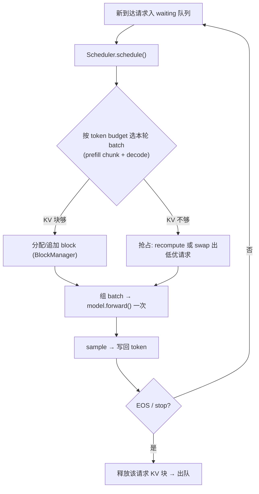
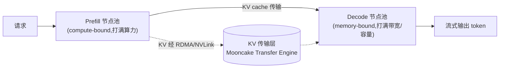

# 连续批处理 + 分页 KV · 进阶与生产实践

> 本文是 `paged_batching_sim.py` 的"出 toy 入生产"配套读物。前置请先读同目录 [`手把手教学.md`](手把手教学.md):那里把 **continuous batching** 与 **PagedAttention** 的原理、成本模型、碎片公式讲透了。本文不重复原理,只回答一个问题:**真实的 vLLM / SGLang / Mooncake 是怎么把这套 toy 想法做成线上系统的?它们补了哪些这个 demo 故意没做的东西?为什么必须补?**
>
> 准确性优先:文中不编造精确 benchmark,凡是量级一律标"约 / 数量级 / 取决于硬件"。本 demo 里那些毫秒数(`STEP_FIXED_MS=8.0` 等)是手调常数,只反映 **趋势**,绝不可外推到真实 GPU。

---

## 0. 本项目 toy 与生产的差距

这个模拟器抓住了两个 **本质机制**——迭代级调度(短请求当步退出、新请求当步补位)和分页显存(block 按需分配/释放消灭外部碎片)。这两点是 vLLM 的灵魂,demo 抓对了。但为了"几十秒 CPU 跑通、纯 Python 无依赖",它把生产系统里 **同样关键** 的一大堆东西全砍了。下表逐项对照:

| 维度 | 本 toy 怎么做 | 生产(vLLM/SGLang/…)必须补什么 | 为什么不能省 |
|---|---|---|---|
| **算子** | 不跑矩阵乘,`step_time_ms(n)=8.0+1.2n` 线性成本模型 | 真实 attention/GEMM kernel;PagedAttention 自定义 CUDA kernel 处理"逻辑连续、物理分块"的 KV | 分块 KV 让标准 attention kernel 没法直接用,必须重写按 block table gather KV 的 kernel |
| **block table** | `req.kv_blocks: List[int]` 一个 Python 列表 | 每请求一张 GPU 上的 **block table**(逻辑块→物理块映射),kernel 按表索引 | attention 算子在 GPU 上跑,映射必须在显存里供 kernel 实时查 |
| **prefill / decode** | prefill 简化成"算一个 step 的成本" | prefill 是 **compute-bound**(整段 prompt 并行),decode 是 **memory-bound**(每步 1 token);两者特性相反,需分别优化、甚至分别部署 | 混在一起调度会让长 prompt 的 prefill 卡住所有人的 decode(见 §2 chunked prefill) |
| **抢占/换出** | 显存不够时 `r.generated -= 1` 回退这一步 | **preemption**:recompute(丢弃重算)或 swap(KV 换出到 CPU/NVMe 再换回) | 回退一步在真实系统会死循环;必须真正腾出显存 |
| **前缀共享** | 无 | **prefix caching / RadixAttention**:相同前缀(system prompt、few-shot)的 KV 块跨请求 **共享**,copy-on-write | 多轮对话/批量同模板请求,前缀重算是巨大浪费 |
| **调度策略** | 近似 FCFS(按 `waiting` 顺序补位) | FCFS + 优先级 + 公平 + 抢占 + 准入控制 + SLA 感知 | 线上要兼顾 throughput / TTFT / TPOT / 防饿死 |
| **并行** | 单"卡"(单池) | TP / PP / EP / DP + 多机;KV 池随并行切分 | 大模型单卡放不下;KV 也要随 TP 切到各卡 |
| **PD 部署** | prefill+decode 同一循环 | **PD 分离**(Mooncake):prefill 节点与 decode 节点分开,KV 跨节点传输 | prefill 与 decode 抢资源会互相拖累,分开各自打满 |
| **采样/输出** | `generated += 1` 当占位 | 真实 logits→sampling(temperature/top-p/beam)、stop tokens、structured output | 是真正的"生成"而非计数 |
| **量化/dtype** | KV 用"token 格子"计数 | FP16/BF16/FP8 KV cache;KV 量化把每 token KV 占用再砍一半 | KV 是显存大头,量化直接换并发 |
| **可观测/容错** | 一次性跑完打印 | metrics(TTFT/TPOT/queue depth/KV util)、健康检查、请求超时、OOM 兜底 | 线上 7×24,必须能观测和自愈 |

一句话:**toy 证明了"为什么这么做能赢",生产负责"在真实约束(算子、显存、并行、SLA、容错)下把这个赢落地"。** 下面逐块展开生产怎么补。

---

## 1. 业界系统怎么做

### 1.1 vLLM:把 toy 的两个机制工业化

vLLM(arXiv:2309.06180)就是这个 demo 的"真身"。它的核心组件与 demo 的对应关系:

- **BlockManager** ≈ demo 的 `PagedKVCache.free_blocks`,但管的是 GPU 显存里的真实 KV 块,且支持 CPU swap 空间、copy-on-write 引用计数。
- **Scheduler** ≈ demo 的 `admit_new` + 主循环,但实现了 prefill/decode 混合调度、token budget、抢占。
- **PagedAttention kernel** = demo **完全没有** 的部分:一个自定义 CUDA kernel,attention 计算时按每请求的 block table 去显存里 gather 散落的 K/V 块,使得"逻辑连续、物理分页"对上层透明。

vLLM 的调度主循环每个 iteration(对应 demo 的一个 step)做的事:



对比 demo:demo 的 `admit_new()` 只看"有没有空位 + KV 够不够";vLLM 还要在 **同一个 batch 里混排 prefill 和 decode**,并用 **token budget**(本轮总共处理多少 token)而不是"请求条数"作为批宽上限——因为一条做 prefill 的请求一次吃几百 token,和一条做 decode 的请求一次吃 1 token,代价天差地别,按"条数"算批宽会失真(这正是 demo 成本模型只按 `len(running)` 计费的简化)。

### 1.2 SGLang:RadixAttention 把"前缀共享"做到自动

SGLang 的招牌是 **RadixAttention**:把所有请求的 KV 缓存组织成一棵 **radix tree(基数树/前缀树)**,key 是 token 序列,value 是对应的 KV 块。

- 新请求进来,先在树上做 **最长前缀匹配**:命中的前缀 KV **直接复用,不重算 prefill**;只对未命中的后缀做 prefill。
- 节点带引用计数,用 **LRU** 淘汰冷前缀。
- 多轮对话(每轮都重发完整历史)、共享 system prompt、few-shot 模板、tree-of-thought 这类"前缀高度重叠"的负载,RadixAttention 能省掉绝大部分重复 prefill。

这相当于把 demo 里每条请求 **独占** 自己 KV 块的假设打破:生产里 KV 块是 **可跨请求共享的资产**。vLLM 的 **automatic prefix caching(APC)** 是同类思想的另一种实现(按 block 做哈希前缀缓存)。

### 1.3 PD 分离 / Mooncake:把 prefill 和 decode 拆到不同节点

prefill 是 **compute-bound**(一次性并行处理整段 prompt,吃算力),decode 是 **memory-bandwidth-bound**(每步只产 1 token,瓶颈在反复读 KV 和权重)。两者放同一组卡上互相干扰:一个长 prompt 的 prefill 会让同批所有 decode 请求的 TPOT 抖动(latency spike)。

**Prefill-Decode 分离(PD disaggregation)** 的做法:



**Mooncake**(Moonshot Kimi 的服务架构)的关键设计是 **KVCache-centric**:把整个集群的 CPU/DRAM/SSD 上的闲置内存池化成一个 **分布式 KV 缓存池(Transfer Engine)**,prefill 产出的 KV 通过高速网络(RDMA)送给 decode 节点,同时这个大池子也充当全局 prefix cache。好处:prefill 和 decode 各自的池子可 **独立扩缩容**、各打满自己的瓶颈;代价是引入 **KV 跨节点传输** 这条新的关键路径(见 §3 通信坑)。本仓库已有专门文档:[`../../llm-inference/Mooncake.md`](../../llm-inference/Mooncake.md)、[`../../llm-inference/PD分离.md`](../../llm-inference/PD分离.md)、[`../../llm-inference/分离式推理架构.md`](../../llm-inference/分离式推理架构.md)。

---

## 2. 关键变体与优化

逐个讲清:解决什么问题、代价是什么。

### 2.1 Chunked Prefill(分块预填充)

- **问题**:一条 prompt 很长(比如 8K token)的请求来做 prefill,会把这一个 iteration 的算力全吃掉,导致同批正在 decode 的请求这一步全部 **卡顿**——TPOT(每 token 延迟)出现尖刺。
- **做法**:把长 prefill 切成固定大小的 **chunk**(如每次 512 token),分多个 iteration 完成;每个 iteration 用剩余的 token budget **顺带捎上若干 decode 请求**。于是 prefill 和 decode 在同一 batch 里混合,GPU 既不空转也不被长 prefill 独占。
- **代价**:长 prompt 的 TTFT(首 token 延迟)会略微变长(它被切成几段处理);chunk 大小是个调参旋钮——太小则 prefill 吞吐下降,太大则 decode 仍被抖动。本质是 **用 prefill 的一点延迟换 decode 的延迟稳定性 + 整体吞吐**。
- 对 demo 的意义:demo 把 prefill 简化成"一个 step",所以根本不会出现这个问题;一旦你给 demo 加真实的"prefill 步数 ∝ prompt_len",就会立刻看到长 prompt 把 makespan 拖住,这时 chunked prefill 才有意义。

### 2.2 Prefix Caching / RadixAttention

- **问题**:见 §1.2,前缀重复 prefill 的浪费。
- **做法**:KV 块按前缀哈希(vLLM APC)或前缀树(SGLang)缓存并跨请求共享,copy-on-write 保证写时才分裂。
- **代价**:缓存管理开销 + 显存被缓存占用(需要 LRU 淘汰);命中率低的负载(每条 prompt 都独一无二)收益为零甚至略亏。**收益完全取决于负载前缀重叠度。**

### 2.3 抢占:Recompute vs Swap

demo 显存不够时 `r.generated -= 1` 是"假装无事发生"。生产必须真正腾地方,两条路:

- **Recompute(重算)**:把被抢占请求的 KV **直接丢弃**,块还给池子;等它重新被调度时,把已生成的 token 当新 prompt **重新 prefill** 一遍。省显存带宽,费算力。
- **Swap(换出)**:把 KV **拷贝到 CPU 内存/NVMe**,块还给池子;恢复时再拷回 GPU。省算力,费 PCIe/NVLink 带宽 + 占 CPU 内存。
- **取舍**:短序列重算便宜(重算成本 ∝ 序列长度²的 attention,但 token 少);长序列 swap 更划算但受 PCIe 带宽限制。vLLM 两者都支持,默认策略随版本演进。

### 2.4 KV cache 量化(FP8 / INT8 KV)

- **问题**:KV 是显存大头,FP16 下每 token 每层 KV 占 `2(K,V) × num_kv_heads × head_dim × 2 bytes`。
- **做法**:把 KV cache 存成 FP8 甚至 INT8,**显存占用直接减半**,等于并发请求数翻倍 / 上下文翻倍。
- **代价**:轻微精度损失(通常可接受,长上下文/高并发场景普遍开)。

### 2.5 调度策略:FCFS / 优先级 / 公平

- **FCFS**(demo 近似实现):简单、无饿死,但短请求可能排在长请求后面吃亏。
- **优先级 / SLA 感知**:VIP 请求、交互式 vs 批处理分级。代价是低优请求可能 **饿死(starvation)**,需要 aging(等待越久优先级越高)兜底——这正是 `手把手教学.md` 练习 5 留的坑。
- **准入控制(admission control)**:队列过深时直接拒绝/排队,保护已接受请求的 SLA,防止雪崩。

### 2.6 并行维度下的 KV

真实大模型用 **Tensor Parallelism** 切到多卡:每张卡只持有部分 attention head 的 KV,KV 池也随之切分(可参考本仓库动手项目 [`../12-tensor-parallel-from-scratch`](../12-tensor-parallel-from-scratch) 与 [`../13-ring-allreduce`](../13-ring-allreduce))。**GQA/MQA**(多 query 头共享少量 KV 头)是另一条正交优化:直接从模型结构上把 KV 头数砍掉数倍,显存与带宽同步下降——这也是现代模型几乎都用 GQA 的原因。

---

## 3. 真实工程权衡与坑

### 3.1 三个核心指标先分清

线上调优永远在这三者之间权衡,且它们 **互相打架**:

- **Throughput(吞吐,tok/s)**:整体每秒产出 token,决定成本/卡。批越大越高。
- **TTFT(Time To First Token)**:从请求到首 token,决定"反应快不快"。受排队 + prefill 影响。
- **TPOT / ITL(Time Per Output Token)**:decode 阶段每 token 间隔,决定"打字流不流畅"。受批内并发数影响。

**核心矛盾**:batch 越大 → throughput 越高(摊薄固定开销,正是 demo §2.2 的 `T_fixed/n`),但 **每个请求的 TPOT 越长**(同一个 forward 要喂更多请求,memory-bound 下读 KV 更多)。所以"无脑加大批"会牺牲单用户体验。生产用 **max_num_batched_tokens / max_num_seqs** 这类旋钮卡一个平衡点。

### 3.2 显存账:KV 才是并发上限的决定者

线上"能并发多少请求"几乎不由算力决定,而由 **KV 显存** 决定。显存预算大致:

```
可用 KV 显存 = 总显存 − 模型权重 − 激活/临时 buffer − 框架开销
最大并发 token 数 ≈ 可用 KV 显存 / 每 token KV 字节数
```

demo 里 `peak KV slots 2528 → 1024` 那个数字背后的真实含义就是这个:静态预留方案在真实卡上 **直接 OOM**,分页方案因为消灭了碎片,把峰值压回池子容量内,从而 **同样的卡能多塞一倍多请求**。这是 PagedAttention 在生产最值钱的地方——不是快,而是"装得下"。

### 3.3 常见线上故障与调优

- **频繁抢占/吞吐塌陷**:并发拉太高 → KV 池满 → 大量 recompute/swap → 吞吐不升反降甚至雪崩。调:降 `max_num_seqs`、开 KV 量化、加准入控制。
- **TTFT 尖刺**:长 prompt prefill 阻塞 → 开 **chunked prefill**。
- **TPOT 抖动**:批内突然涌入大 prefill → 同上;或运行批太大 → 限批宽。
- **prefix cache 命中率低还占显存**:负载无前缀重叠却开了 APC → 关掉或调小缓存配额。
- **PD 分离下 KV 传输成为瓶颈**:decode 节点等 prefill 的 KV 经网络送达 → TTFT 被网络拖累。需 RDMA/NVLink 高带宽 + KV 量化降传输量 + prefill/decode 节点比例调优(prefill 重的负载多配 prefill 节点)。
- **OOM**:max_seq_len 估高、突发长上下文请求 → 预留 watermark、请求级 max_tokens 限制、超长请求单独路由。
- **精度问题**:FP8 KV + 长上下文偶发质量下降 → 对质量敏感的请求降回 FP16 KV。

---

## 4. 性能直觉与估算

下面给可手算的量级公式,建立"数字直觉"。

### 4.1 每 token KV 显存

单 token 在 KV cache 占用(单卡、未量化):

```
bytes_per_token = 2 (K和V) × num_layers × num_kv_heads × head_dim × dtype_bytes
```

举例量级(类 7B、GQA):约 `2 × 32 × 8 × 128 × 2B ≈ 128 KB/token`(随模型差异大,仅示量级)。于是一条 2K 上下文请求 ≈ 256 MB KV;一张 80GB 卡扣掉约 14GB 权重后,KV 可用约 60GB,**理论并发 token 数 ≈ 60GB / 128KB ≈ 数十万 token**——这就是"能同时服务多少 2K 会话"的上界。FP8 KV 直接把这个上界翻倍。

### 4.2 分页 vs 静态预留的显存节省

静态预留:每条按 `max_seq_len` 占;分页:每条按 `ceil(实际len / block_size) × block_size` 占。内部碎片上界 = `block_size − 1` 个 token / 请求(只浪费最后一块的半空)。所以:

```
分页显存 / 静态显存 ≈ 平均实际长度 / max_seq_len
```

负载越长尾(平均远小于最大),分页省得越狠——demo 里 64.5% → 10.8% 碎片正是这个比值的体现。

### 4.3 批处理加速比(沿用 demo 成本模型)

单 token 摊薄成本 = `T_fixed/n + T_per_req`。从批宽 `n1` 增到 `n2` 的单 token 加速比:

```
speedup ≈ (T_fixed/n1 + T_per_req) / (T_fixed/n2 + T_per_req)
```

固定开销 `T_fixed` 越大、batch 越大,收益越明显(`手把手教学.md` 练习 4 把 `STEP_FIXED_MS` 从 8 调到 40 就是验证这点)。但真实 decode 是 memory-bound,`n` 增大时读 KV 的带宽也线性涨,所以加速比有上限——批到一定大小后 throughput 平台化,而 TPOT 继续恶化,这就是 §3.1 的权衡点。

### 4.4 chunked prefill 的 budget 估算

每 iteration 的 token budget `B` 大致分给 prefill chunk 和 decode:`B ≈ chunk_size + len(running_decode)`。chunk 越大,长 prompt TTFT 越短但 decode 抖动越大;一般 chunk 取 512~2048,使 `chunk_size` 与 decode batch 的算力占用相当。

---

## 5. 动手进阶路线

想把本 toy 推向接近生产,建议分 4 步,每步只加一个机制、跑出新指标对照:

1. **让 prefill 真实化 + 加 chunked prefill**。现在 prefill 被压成一个 step;改成"prefill 步数 ∝ ceil(prompt_len / chunk)",并在同一 step 的成本里混入正在 decode 的请求。观察:长 prompt 不再独占;对比开/关 chunk 时长 prompt 的 TTFT 与他人 TPOT。方向:成本模型从"按请求数"升级为"按 token budget"。

2. **把"回退一步"换成真正的抢占**。实现 recompute(丢 KV、把已生成 token 当新 prompt 重排队)和 swap(把 `kv_blocks` 标记为"在 CPU",恢复时计一笔搬运耗时)两种策略,各加一个搬运/重算成本。观察:高负载下两种抢占的 makespan / 额外步数差异。

3. **加 prefix sharing**。给请求加一个 `prompt_prefix_id`,相同前缀的请求 **共享 KV 块**(引用计数 + copy-on-write):新请求若命中前缀,跳过那部分 prefill。构造一批"共享 system prompt"的负载,观察显存峰值和 prefill 步数的下降。这就是 RadixAttention/APC 的最小内核。

4. **加优先级调度 + 防饿死**。把 `admit_new` 的 FCFS 改成优先级队列(短请求优先 / VIP 优先),再加 aging 防止长请求饿死。观察 avg latency 下降但 p99 是否恶化——亲手体会 §3.1 的 throughput-fairness 取舍(对应 `手把手教学.md` 练习 5 的延伸)。

(进一步可加第 5 步:把单池拆成"prefill 池 + decode 池",中间加一笔"KV 传输耗时",模拟 PD 分离,观察传输成为瓶颈的临界点——对照 [`../../llm-inference/PD分离.md`](../../llm-inference/PD分离.md)。)

每步都遵循 demo 已有的工程纪律:固定 SEED 保证可复现、所有 print 用 ASCII 避开 Windows GBK、新机制用 assert 锁住"应观察到的趋势"。

---

## 6. 延伸阅读

**本仓库已有深度文档(优先看):**

- vLLM 与 PagedAttention 专题:[`../../llm-inference/vllm/`](../../llm-inference/vllm/)(含 `vllm.md`、`请求处理流程.md`、`源码.md`、`服务启动参数.md`)
- KV 缓存优化原理:[`../../llm-inference/KV-Cache优化.md`](../../llm-inference/KV-Cache优化.md)
- SGLang / RadixAttention:[`../../llm-inference/sglang/`](../../llm-inference/sglang/)(含 `README.md`、`source-code.md`、`项目代码结构.md`)
- PD 分离与 KV-centric 架构:[`../../llm-inference/PD分离.md`](../../llm-inference/PD分离.md)、[`../../llm-inference/Mooncake.md`](../../llm-inference/Mooncake.md)、[`../../llm-inference/分离式推理架构.md`](../../llm-inference/分离式推理架构.md)
- 推理优化总览:[`../../llm-inference/README.md`](../../llm-inference/README.md)
- 张量并行下的 KV(动手):[`../12-tensor-parallel-from-scratch`](../12-tensor-parallel-from-scratch)、[`../13-ring-allreduce`](../13-ring-allreduce)
- 相关动手项目:[`../04-kv-cache`](../04-kv-cache)(KV 缓存本身)、[`../07-speculative-decoding`](../07-speculative-decoding)(投机解码,正交于本主题的 decode 加速)

**经典论文 / 社区资源:**

- vLLM: Efficient Memory Management for LLM Serving with PagedAttention — arXiv:2309.06180
- Orca: A Distributed Serving System for Transformer-Based Generative Models(iteration-level batching 源头)
- SGLang: Efficient Execution of Structured Language Model Programs(RadixAttention)— arXiv:2312.07104
- Mooncake: A KVCache-centric Disaggregated Architecture for LLM Serving — arXiv:2407.00079
- SARATHI / DeepSpeed-FastGen(chunked prefill 与 SplitFuse 思想的来源)
- Inside vLLM: Anatomy of a High-Throughput LLM Inference System — blog.vllm.ai

> 一句话:这份 toy 帮你建立"为什么连续批 + 分页能赢"的直觉;生产系统的全部复杂度,都是在 **真实算子、有限显存、多机并行、严格 SLA、必须容错** 这五条约束下,把这个"赢"稳稳落地。原理吃透后,上线请直接用 vLLM / SGLang 等成熟框架,别自己造。
