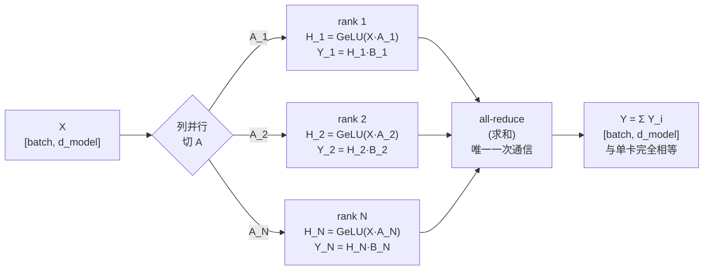

# 从零理解张量并行(Megatron):手把手教学

> 一句话导览:本篇带你在**一台普通电脑、单进程、纯 CPU** 上,用几十行 PyTorch 把 Megatron-LM 风格的**张量并行(Tensor Parallelism, TP)** 亲手"复现"出来。学完你能掌握:
>
> 1. **列并行(column parallel)** 和 **行并行(row parallel)** 到底在切什么、为什么这么切;
> 2. 为什么"列并行接行并行"组合下,一个 MLP 块前向**只需要 1 次 all-reduce**;
> 3. 怎么用一次张量相加"**模拟 all-reduce**",并用 `torch.allclose` 证明**切分版与单卡版逐元素等价**;
> 4. Megatron 名言"**每个 Transformer 层前向 2 次 all-reduce、一个 step 共 4 次**"的来龙去脉;
> 5. 看懂程序打印的每一个数字(`all_reduce_calls`、`max_err`、`MATCH`)分别意味着什么。

本教学严格基于本目录下真实文件 `tensor_parallel.py`(约 282 行)。所有函数名、类名、变量名、超参数都与代码一致,你可以边读边对照源码。

---

## 0. 前置知识与环境

### 0.1 你需要会什么(不会也能跟,边学边补)

- **Python 基础**:函数、类、`for` 循环、列表推导式。
- **一点点矩阵乘法**:知道 `[m, k] @ [k, n] = [m, n]`(行 × 列,中间维度要对上)就够了。代码里 `@` 就是矩阵乘。
- **不需要**:不需要懂 CUDA、不需要懂 NCCL、不需要有 GPU、不需要装多卡环境。整个项目就是为了"没有这些条件也能理解张量并行"而设计的。

### 0.2 安装依赖

只需要 PyTorch(CPU 版即可),`matplotlib` 是可选的(画一张误差图,缺了也不报错):

```bash
# 必需
pip install torch

# 可选(用于画 "误差 vs 分片数" 图,缺了会自动退化为文本打印,不影响主流程)
pip install matplotlib
```

### 0.3 怎么打开跑

```bash
cd practical-projects/12-tensor-parallel-from-scratch
python tensor_parallel.py
```

几秒钟跑完,会在终端打印一大段结果(第 4 节会逐行解读),并尝试保存一张 `tp_error_vs_shards.png`。

> 新手提示:这个项目**不会带来任何加速**。它是"教学模拟",目的是让你**理解原理 + 验证数学等价性**,而不是真的把计算分到多张卡上跑得更快。真正的加速要靠多 GPU + NCCL。

---

## 1. 问题背景:不用这个技术会怎样

### 1.1 痛点:一张卡装不下一个大模型

设想我们要训练一个大语言模型。模型里最"吃显存"的部件之一就是 **MLP 块**(也叫 FFN,前馈网络)。一个标准 MLP 块长这样:

$$
Y = \mathrm{GeLU}(X A) B
$$

- $X$ 形状 `[batch, d_model]`,是输入。
- $A$ 形状 `[d_model, d_ff]`,第一个线性层把维度从 `d_model` **升**到 `d_ff`(Megatron 里通常 `d_ff = 4 * d_model`)。
- $B$ 形状 `[d_ff, d_model]`,第二个线性层把维度从 `d_ff` **降**回 `d_model`。

对真实大模型来说,`d_model` 可能是 12288,那么 `d_ff = 49152`。光是 $A$ 一个矩阵就是 `12288 × 49152 ≈ 6 亿` 个参数,再加上 $B$ 又是 6 亿。**仅一个 MLP 块的权重就上 GB**,而一个模型有几十上百层。单张 GPU 的显存(比如 80GB)根本放不下整个模型的权重 + 优化器状态 + 激活值。

### 1.2 朴素方案的问题

你可能会想:"那我把模型切成几段,每张卡放几层不就行了?" —— 这叫**流水线并行(pipeline parallelism)**,确实是一种办法,但它有"气泡(bubble)"导致的空闲、且单层若本身就放不下还是没救。

**张量并行**换了个思路:**不是按层切,而是把每一层内部的大矩阵本身切开**,让多张卡**协作算同一层**。比如把 $A$ 这个大矩阵切成 4 块,4 张卡各拿一块,各算一部分,再把结果合起来。这样:

- 每张卡只需要存 $A$ 的 $1/N$;
- 计算也分摊到 N 张卡上。

但难点立刻来了:**矩阵乘法不是逐元素的,随便切开算完结果对不上**。怎么切才能保证"切开并行算 + 合并"的结果和"不切、单卡直接算"**完全一样**?这正是 Megatron 论文(arXiv:1909.08053)解决的核心问题,也是本项目要手把手带你验证的东西。

---

## 2. 核心原理详解

### 2.1 列并行:切第一个线性层 A

把 $A$ 按**输出维 `d_ff`**(也就是 `dim=1`,列方向)切成 $N$ 块:

$$
A = [\,A_1 \mid A_2 \mid \cdots \mid A_N\,], \qquad A_i \text{ 形状 } [d\_model,\ d\_ff/N]
$$

那么 $X A$ 就等于把各块的结果横向拼起来:

$$
X A = [\,X A_1 \mid X A_2 \mid \cdots \mid X A_N\,]
$$

关键一步:**GeLU 是逐元素(element-wise)函数**。逐元素的意思是,输出的每个位置只依赖输入对应位置的那一个数,彼此互不影响。所以对一个"横向拼接"的矩阵施加 GeLU,等价于"先分别施加 GeLU 再拼接":

$$
\mathrm{GeLU}(X A) = [\,\mathrm{GeLU}(X A_1) \mid \cdots \mid \mathrm{GeLU}(X A_N)\,]
$$

这意味着:**第 $i$ 个 rank(虚拟设备)只要拿到 $X$ 和自己那块 $A_i$,就能完全独立地算出隐藏激活的第 $i$ 段** $H_i = \mathrm{GeLU}(X A_i)$,**全程不需要和别人通信**。这就是为什么第一层选"列并行"——它天然免通信。

> 直觉:GeLU 不会让不同列"串味"。第 3 列的激活值不依赖第 5 列的输入,所以谁算第 3 列、谁算第 5 列互不干扰,自然可以分开算。

### 2.2 行并行:切第二个线性层 B

接着算 $Y = H B$,其中 $H = \mathrm{GeLU}(XA)$。现在 $H$ 已经按列被切成了 $H_1, \dots, H_N$(每块 `[batch, d_ff/N]`)。为了让乘法对得上,$B$ 必须按**输入维 `d_ff`**(也就是 `dim=0`,行方向)切成 $N$ 块,**切点和 $A$ 完全对齐**:

$$
B = \begin{bmatrix} B_1 \\ B_2 \\ \vdots \\ B_N \end{bmatrix}, \qquad B_i \text{ 形状 } [d\_ff/N,\ d\_model]
$$

这时用上**分块矩阵乘法**的基本恒等式:把 $H$ 横切、$B$ 竖切,乘积等于各块乘积之和:

$$
Y = H B = \sum_{i=1}^{N} H_i B_i
$$

每个 rank 能独立算出 $Y_i = H_i B_i$,它的形状是完整的 `[batch, d_model]`,但它只是**部分和(partial sum)**——只有把 $N$ 个 $Y_i$ **全部加起来**才是正确的 $Y$。

"把分散在各 rank 上的张量逐元素求和、再让每个 rank 都拿到这个和"——这个集合通信原语就叫 **all-reduce(求和)**。于是:

$$
Y = \mathrm{AllReduce}\big(Y_1, Y_2, \dots, Y_N\big) = \sum_{i=1}^N H_i B_i
$$

### 2.3 为什么是"1 次 all-reduce"

把 2.1 和 2.2 串起来看整条数据流:



- **列并行段**($X \to H_i$):各 rank 独立,**0 次通信**。
- **行并行段**($H_i \to Y_i$):各 rank 独立算部分和,**0 次通信**。
- **合并**($Y_i \to Y$):只有最后这一步需要 all-reduce,**恰好 1 次通信**。

这就是 Megatron 的精妙之处:**列并行 + 行并行"接力",把通信压缩到整个 MLP 块只剩 1 次。** 如果反过来(第一层行并行、第二层列并行),中间就得多一次通信,代价更高。

### 2.4 从"1 个块 1 次"到"每层 2 次、每 step 4 次"

一个标准 Transformer 层 = **Attention 块 + MLP 块**:

- **MLP 块**:就是本项目演示的,前向 1 次 all-reduce。
- **Attention 块**:用同样的套路(QKV 投影做列并行、输出投影做行并行),前向也是 1 次 all-reduce。

所以**前向一层 = 1(MLP) + 1(Attention) = 2 次 all-reduce**。反向传播时,前向里"切分"的算子在反向里对应"all-reduce",前向里"all-reduce"的算子在反向里对应"切分",因此反向**对称地再来 2 次**。合计:

$$
\underbrace{2}_{\text{前向}} + \underbrace{2}_{\text{反向}} = 4 \text{ 次 all-reduce / 层 / step}
$$

> 本项目代码**只实现了 MLP 块的前向**,所以你在输出里看到的是"每块 1 次"。Attention 块和反向的那几次,代码里以注释 + 打印文字的形式点明了来由(见 `main()` 末尾的 print),但没有实现——这是教学取舍,README 第 6 节也明确列了这些局限。

---

## 3. 代码逐段精讲

下面把 `tensor_parallel.py` 按逻辑拆成 6 段:**通信原语 → 单卡基线 → 张量并行版 → 堆叠网络 → 画图 → 主程序**。每段先贴关键代码,再解释"在干什么、为什么这么写、对应原理哪一步"。

### 3.1 第 0 段:种子 + 模拟 all-reduce 的"通信计数器"

```python
SEED = 1234
torch.manual_seed(SEED)


class CommCounter:
    def __init__(self):
        self.all_reduce_calls = 0

    def all_reduce_sum(self, shards):
        self.all_reduce_calls += 1
        out = shards[0].clone()
        for t in shards[1:]:
            out = out + t
        return out
```

逐块解释:

- `torch.manual_seed(SEED)`:固定随机种子。后面用 `torch.randn` 生成的权重和输入都可复现。**为什么重要**:我们要拿"切分版"和"单卡版"逐元素对比,两者必须基于**同一份权重**,种子固定 + 后面"切的就是同一份权重"才能保证这点。
- `CommCounter`:这是整个教学的点睛之笔。真实分布式里,all-reduce 是跨 GPU 的 NCCL 集合通信(各卡把张量求和后,结果广播回每张卡)。这里我们**单进程内用一次张量相加来"扮演"它**。
- `all_reduce_sum(self, shards)`:
  - `self.all_reduce_calls += 1`:每调用一次就计数 +1。这就是后面能把"通信次数"**量化打印**出来的原因。
  - `out = shards[0].clone()` 然后 `out = out + t` 循环:把各 rank 的张量列表 `shards` **逐元素求和**。语义对应 `dist.all_reduce(op=SUM)`——通信后每个 rank 都拿到这个"全局求和"结果。这里直接把求和结果返回即可。

> 新手易困惑点:**这不是真的并行通信**。它就是个普通的 Python 加法循环。"模拟"的意义在于:① 计算出 all-reduce **在数学上该返回什么**(求和);② 用计数器**统计该发生几次通信**。性能瓶颈(NCCL 带宽延迟)在这里完全不体现。

> 为什么用 `.clone()`?为了不就地修改 `shards[0]`(避免污染调用方的张量),先克隆一份再累加,是安全写法。

### 3.2 第 1 段:单卡基线 BaselineMLP(我们的"正确答案")

```python
class BaselineMLP:
    def __init__(self, d_model, d_ff):
        self.A = torch.randn(d_model, d_ff) * (1.0 / math.sqrt(d_model))
        self.B = torch.randn(d_ff, d_model) * (1.0 / math.sqrt(d_ff))

    def forward(self, X):
        H = F.gelu(X @ self.A)   # 第一线性层 + 逐元素非线性
        Y = H @ self.B           # 第二线性层
        return Y
```

- `self.A` 形状 `[d_model, d_ff]`,`self.B` 形状 `[d_ff, d_model]`。乘上 `1/sqrt(d_model)` 之类的缩放是常见的权重初始化技巧,让数值量级合理,**对理解 TP 不关键**,可以先忽略它的具体值。
- `forward`:严格就是 $Y = \mathrm{GeLU}(XA)B$。`F.gelu` 是 PyTorch 内置的逐元素 GeLU。
- **这个类的作用**:它是"不切分的标准做法",输出 `Y` 就是**正确答案(reference / ground truth)**。后面张量并行版本会"切"这同一份 `self.A` / `self.B`,然后和它的输出比对。

> 新手易困惑点:这里没有用 `torch.nn.Linear`,而是手写 `X @ self.A`。这是为了让"权重矩阵长什么样、怎么被切"完全暴露出来,教学更直白。`nn.Linear` 里权重默认是转置存的(`[out, in]`),反而会绕晕初学者。

### 3.3 第 2 段:张量并行版 TensorParallelMLP(核心!)

#### 构造函数:切权重

```python
class TensorParallelMLP:
    def __init__(self, baseline_mlp, num_shards, comm):
        self.num_shards = num_shards
        self.comm = comm
        d_ff = baseline_mlp.A.shape[1]
        assert d_ff % num_shards == 0, "d_ff 必须能被分片数整除(教学简化)"
        chunk = d_ff // num_shards

        # 列并行:沿 dim=1(输出维 d_ff)切 A
        self.A_shards = [
            baseline_mlp.A[:, i * chunk:(i + 1) * chunk] for i in range(num_shards)
        ]
        # 行并行:沿 dim=0(输入维 d_ff)切 B —— 切点与 A 完全对齐
        self.B_shards = [
            baseline_mlp.B[i * chunk:(i + 1) * chunk, :] for i in range(num_shards)
        ]
```

- 注意构造函数**直接接收一个 `baseline_mlp`**:它不重新随机初始化权重,而是**复用基线的同一份 `A` / `B`**,只是把它们切片。这就保证了"切分版 vs 单卡版"用的是同一组数,比对才有意义。
- `chunk = d_ff // num_shards`:每个分片在 `d_ff` 方向上的宽度。`assert d_ff % num_shards == 0` 要求整除,这是教学简化(真实框架会处理不整除的 padding)。
- `self.A_shards`:对 `A` 做 `[:, i*chunk:(i+1)*chunk]`,即**沿 `dim=1`(列方向)切**。每个 `A_i` 形状 `[d_model, chunk]`。**这正是 2.1 节的列并行。**
- `self.B_shards`:对 `B` 做 `[i*chunk:(i+1)*chunk, :]`,即**沿 `dim=0`(行方向)切**。每个 `B_i` 形状 `[chunk, d_model]`。**这正是 2.2 节的行并行。**
- **关键:切点对齐**。`A` 的第 $i$ 列块和 `B` 的第 $i$ 行块用的是同一个 `i*chunk:(i+1)*chunk` 区间。只有对齐,`H_i = GeLU(X @ A_i)` 的列才能正好对上 `B_i` 的行,矩阵乘法维度才合法。

> 新手易困惑点:为什么 A 切 `dim=1`、B 切 `dim=0`?记住口诀:**列并行切"输出维",行并行切"输入维"**。A 的输出维是 `d_ff`(它的第 1 维),B 的输入维也是 `d_ff`(它的第 0 维)。两者切的都是 `d_ff`,只是 `d_ff` 在 A 里是"列"、在 B 里是"行"。

#### 前向:并行算 + all-reduce 合并

```python
    def forward(self, X):
        partial_outputs = []
        for A_i, B_i in zip(self.A_shards, self.B_shards):
            # --- 列并行段:本 rank 独立算自己的隐藏激活,无通信 ---
            H_i = F.gelu(X @ A_i)          # [batch, d_ff/N]
            # --- 行并行段:本 rank 算部分输出(部分和的一项) ---
            Y_i = H_i @ B_i               # [batch, d_model]
            partial_outputs.append(Y_i)

        # --- 唯一一次通信:把各 rank 的部分和 all-reduce(求和)成完整输出 ---
        Y = self.comm.all_reduce_sum(partial_outputs)
        return Y
```

- `for A_i, B_i in zip(...)`:这个 `for` 循环**在模拟"N 个 rank 各自的本地计算"**。在真实分布式里,这是 N 张卡**同时**做的;在这里我们用单进程依次做,数学结果一样。
- `H_i = F.gelu(X @ A_i)`:列并行段。形状 `[batch, d_ff/N]`。对应 2.1,**无通信**。
- `Y_i = H_i @ B_i`:行并行段。形状 `[batch, d_model]`(完整输出形状!但只是部分和)。对应 2.2,**无通信**。
- `partial_outputs.append(Y_i)`:把每个 rank 的部分和收集起来。
- `Y = self.comm.all_reduce_sum(partial_outputs)`:**整个前向唯一一次通信**。把 N 个部分和求和,得到完整 `Y`。对应 2.3,这就是"MLP 块前向的那 1 次 all-reduce"。

> 新手易困惑点:`Y_i` 的形状已经是完整的 `[batch, d_model]` 了,看起来"算完了",为什么还要 all-reduce?因为每个 `Y_i = H_i @ B_i` 只用了 `H` 的一段、`B` 的一段,它是 $\sum_i H_i B_i$ 这个和式里的**一项**,不是全部。必须把所有项加起来才对。形状对了 ≠ 数值对了。

### 3.4 第 3 段:堆叠多层 run_stacked_demo

```python
def run_stacked_demo(num_layers, d_model, d_ff, num_shards, batch, comm):
    torch.manual_seed(SEED + 7)
    X = torch.randn(batch, d_model)

    # 基线:逐层单卡前向
    baselines = [BaselineMLP(d_model, d_ff) for _ in range(num_layers)]
    Y_base = X
    for mlp in baselines:
        Y_base = mlp.forward(Y_base)

    # 张量并行:复用同一份权重切片,逐层前向
    comm.all_reduce_calls = 0
    tp_layers = [TensorParallelMLP(b, num_shards, comm) for b in baselines]
    Y_tp = X
    for tp in tp_layers:
        Y_tp = tp.forward(Y_tp)

    max_err = (Y_base - Y_tp).abs().max().item()
    ok = torch.allclose(Y_base, Y_tp, atol=1e-5, rtol=1e-4)
    return ok, max_err, comm.all_reduce_calls
```

- 先用 `num_layers` 个 `BaselineMLP` 堆成一个小"网络",逐层算出基线输出 `Y_base`(上一层的输出喂给下一层)。
- `comm.all_reduce_calls = 0`:**先清零计数器**,这样接下来统计的就是"这次堆叠前向"触发的通信次数。
- `tp_layers = [TensorParallelMLP(b, ...) for b in baselines]`:每个 TP 层都**基于对应的基线层 `b`** 构造(复用同一份权重),保证逐层都可比。
- `for tp in tp_layers: Y_tp = tp.forward(Y_tp)`:逐层 TP 前向。每层调用一次 `forward`,内部触发 1 次 all-reduce。所以 `num_layers` 层后,`comm.all_reduce_calls` 应该恰好等于 `num_layers`。
- `max_err = (Y_base - Y_tp).abs().max().item()`:两个输出逐元素相减取绝对值,再取最大值——**最大绝对误差**。理想情况应接近 0。
- `ok = torch.allclose(Y_base, Y_tp, atol=1e-5, rtol=1e-4)`:`allclose` 判断两个张量是否"足够接近"(允许 `atol=1e-5` 绝对容差 + `rtol=1e-4` 相对容差)。**这是验证"数学等价"的核心断言。**
- 返回 `(ok, max_err, calls)` 三元组供主程序打印。

> 新手易困惑点:为什么不要求误差严格等于 0?因为浮点加法**顺序不同会有舍入差异**。单卡是 `((a+b)+c)+...`,切分版可能是别的求和顺序,最后一位二进制会差一点点。这是正常的、可接受的浮点误差(~1e-6),远小于 `1e-5` 阈值,所以 `allclose` 仍判 True。

### 3.5 第 4 段:误差图 plot_error_vs_shards(可选,容错)

```python
def plot_error_vs_shards(shard_list, err_list, out_path):
    try:
        import matplotlib
        matplotlib.use("Agg")  # 无界面后端,直接存文件
        import matplotlib.pyplot as plt
        ...
        plt.yscale("log")
        plt.savefig(out_path, dpi=110)
        return out_path
    except Exception as e:  # 缺 matplotlib 或其它问题:不崩,文本兜底
        print(f"[plot] skipped (matplotlib unavailable: {e}); text summary:")
        for s, err in zip(shard_list, err_list):
            print(f"[plot]   shards={s:2d}  max_err={err:.3e}")
        return None
```

- `matplotlib.use("Agg")`:用无界面后端,服务器/无显示器环境也能直接存成 PNG 文件,不弹窗。
- `plt.yscale("log")`:y 轴用对数刻度。因为误差都在 1e-6~1e-7 量级,线性刻度看不清,对数刻度才直观。
- **整段被 `try/except` 包住**:这是很好的工程习惯——如果没装 matplotlib,不会让整个程序崩溃,而是退化为**文本打印**误差摘要。这就是为什么 README 说 matplotlib "可选,没有也不会崩"。

### 3.6 第 5 段:主程序 main()

```python
def main():
    d_model = 64
    d_ff = 256          # = 4 * d_model,Megatron 典型比例
    batch = 32
    ...
    comm = CommCounter()

    # ---- (A) 单块 MLP:不同分片数都应与单卡基线一致 ----
    baseline = BaselineMLP(d_model, d_ff)
    torch.manual_seed(SEED + 1)
    X = torch.randn(batch, d_model)
    Y_ref = baseline.forward(X)  # 正确答案

    shard_list, err_list = [], []
    for num_shards in [1, 2, 4, 8]:
        comm.all_reduce_calls = 0
        tp = TensorParallelMLP(baseline, num_shards, comm)
        Y_tp = tp.forward(X)
        max_err = (Y_ref - Y_tp).abs().max().item()
        match = torch.allclose(Y_ref, Y_tp, atol=1e-5, rtol=1e-4)
        ...
```

- **超参**:`d_model=64`、`d_ff=256`(正好 `4 * d_model`,Megatron 典型比例)、`batch=32`。toy 规模,CPU 秒级跑完。
- **实验 (A) 单块 MLP**:固定一份 `baseline`,然后对 `num_shards ∈ [1, 2, 4, 8]` 各跑一遍 TP 前向。每次都**清零计数器**、构造对应分片数的 `TensorParallelMLP`、算 `max_err` 和 `match`。预期:无论切几份,都和单卡基线一致(`MATCH`),且每次只 1 次 all-reduce。
- `num_shards=1` 是个有趣的边界:切 1 份 = 不切,误差应该是 `0.000e+00`(完全相同),但 all-reduce 仍计 1 次(因为代码无条件调用了一次合并)。

```python
    # ---- (B) 堆叠 N 层 ----
    for num_layers in [1, 2, 6]:
        ok, max_err, calls = run_stacked_demo(
            num_layers, d_model, d_ff, num_shards=4, batch=batch, comm=comm
        )
    ...
    # ---- (C) 误差图 ----
    out_png = "tp_error_vs_shards.png"
    saved = plot_error_vs_shards(shard_list, err_list, out_png)
    ...
    # ---- 最终量化结论 ----
    overall_max_err = max(err_list)
    all_match = overall_max_err < 1e-5
```

- **实验 (B) 堆叠多层**:固定 `num_shards=4`,对 `num_layers ∈ [1, 2, 6]` 各跑一遍堆叠 demo。预期:`total_all_reduce` 恰好等于层数,端到端 `EQUIVALENT`。
- **实验 (C)**:画/打印误差随分片数变化。
- **最终结论**:`overall_max_err = max(err_list)` 取所有分片实验里最坏的误差,`all_match = overall_max_err < 1e-5` 判断是否整体通过(目标 < 1e-5)。

---

## 4. 跑起来 + 逐行读懂输出

### 4.1 运行命令

```bash
cd practical-projects/12-tensor-parallel-from-scratch
python tensor_parallel.py
```

### 4.2 预期输出(真实运行摘录)

```
[1] Single MLP block: column-parallel(A) + row-parallel(B)
    shards= 1 | all_reduce_calls=1 | max_err=0.000e+00 | vs single-device: MATCH
    shards= 2 | all_reduce_calls=1 | max_err=7.153e-07 | vs single-device: MATCH
    shards= 4 | all_reduce_calls=1 | max_err=9.537e-07 | vs single-device: MATCH
    shards= 8 | all_reduce_calls=1 | max_err=9.537e-07 | vs single-device: MATCH
    -> one column-parallel + row-parallel MLP needs exactly 1 all-reduce

[2] Stacked MLP blocks: #all_reduce should equal #layers (MLP view)
    layers=1 | total_all_reduce=1 | max_err=1.192e-06 | end-to-end: EQUIVALENT
    layers=2 | total_all_reduce=2 | max_err=9.537e-07 | end-to-end: EQUIVALENT
    layers=6 | total_all_reduce=6 | max_err=1.788e-07 | end-to-end: EQUIVALENT
    -> a real Transformer layer = MLP(1) + Attention(1) = 2 all-reduce/fwd
       (backward mirrors it, so 4 all-reduce per layer per step)

RESULT
  shards tested        : [1, 2, 4, 8]
  worst max_abs_error  : 9.537e-07  (target < 1e-5)
  tensor-parallel == single-device : True
```

### 4.3 逐条解读每个数字

**实验 [1] 单块 MLP:**

- `shards= 1 ... max_err=0.000e+00`:切 1 份其实就是不切,所以输出和单卡**逐位相同**,误差严格为 0。这是个"sanity check"——连这个都不对的话就是代码写错了。
- `shards= 2/4/8 ... max_err≈7e-07~9e-07`:切多份后误差是 ~1e-6 量级。**为什么不是 0?** 因为切分改变了求和的顺序,浮点累加的舍入误差导致最后几位有微小差异。这是**正常且可接受的**,不是 bug。
- `all_reduce_calls=1`(全部行都是 1):**这是本项目最想让你记住的数字**。无论切成 2/4/8 份,一个"列并行 + 行并行"MLP 块前向**永远只有 1 次 all-reduce**。切得越多,通信"次数"不变(只是每次参与的张量更多),印证了 Megatron 设计的高效性。
- `vs single-device: MATCH`:`torch.allclose` 判定为"足够接近",即**数学等价**。误差 ~1e-6 远小于阈值 1e-5,所以全部 MATCH。
- `-> one column-parallel + row-parallel MLP needs exactly 1 all-reduce`:代码打印的小结,呼应 2.3 节结论。

**实验 [2] 堆叠多层:**

- `layers=1 | total_all_reduce=1`、`layers=2 | total_all_reduce=2`、`layers=6 | total_all_reduce=6`:**总通信次数恰好等于层数**。因为每层 MLP 块前向 1 次,N 层就是 N 次。这把"每块 1 次"线性外推到了整个网络。
- `max_err` 仍在 ~1e-6 量级,`end-to-end: EQUIVALENT`:即使误差会随层数累积传播,也始终远小于阈值,端到端等价成立。
- `-> a real Transformer layer = MLP(1) + Attention(1) = 2 all-reduce/fwd` 和 `(backward mirrors it, so 4 all-reduce per layer per step)`:这两行**用文字补全了 2.4 节的完整图景**——本代码只演示了 MLP 那 1 次,真实一层前向是 2 次、加上反向共 4 次。

**RESULT 总结块:**

- `shards tested : [1, 2, 4, 8]`:测过的分片数。
- `worst max_abs_error : 9.537e-07 (target < 1e-5)`:所有实验里最坏的误差,约 1e-6,**远低于** 1e-5 目标。
- `tensor-parallel == single-device : True`:最终结论——**张量并行版与单卡版数值等价**,验证成功。

> 注意:你机器上跑出的 `max_err` 具体数值(比如 `7.153e-07`)可能和这里**不完全一样**,因为浮点结果与 PyTorch 版本、CPU、累加实现都有关。但**量级(~1e-6)、`all_reduce_calls`、`MATCH/EQUIVALENT` 这些结构性结论应当一致**。

---

## 5. 动手改造(练习)

下面 5 个实验由易到难。建议每改一处就跑一次,观察输出变化。

### 练习 1(易):换更大的分片数

在 `main()` 的 `for num_shards in [1, 2, 4, 8]` 里加上 `16`、`32`(注意 `d_ff=256` 必须能被整除,所以最大到 `256`)。
**预期**:`all_reduce_calls` 依然是 1,误差仍在 ~1e-6 量级,全部 MATCH。**结论**:切得再多,通信次数不变、等价性不变。

### 练习 2(易):故意切到不整除,看 assert 触发

把 `num_shards` 改成 `3`(`256 % 3 != 0`)。
**预期**:程序在构造 `TensorParallelMLP` 时触发 `AssertionError: d_ff 必须能被分片数整除`。**结论**:理解为什么真实框架要对 `d_ff` 做 padding 才能支持任意切分数。

### 练习 3(中):放大模型规模

把 `d_model` 改成 `512`、`d_ff` 改成 `2048`、`batch` 改成 `128`。
**预期**:CPU 上仍能跑(慢一点),误差量级基本不变。**结论**:等价性与规模无关,这套切法对大模型同样成立。可顺便观察误差是否随规模略微变化(更大的累加链可能误差略大)。

### 练习 4(中):破坏"切点对齐",制造 MISMATCH

把 `B_shards` 的切法故意改错,比如让 `B` 的切点和 `A` 错位(例如把某个 `B_i` 换成相邻块)。
**提示**:在 `__init__` 里把 `self.B_shards` 的索引动一下手脚。
**预期**:`max_err` 变得很大、出现 `MISMATCH`。**结论**:亲手验证"A 列切点必须与 B 行切点对齐",这是 TP 正确性的命门。

### 练习 5(难):自己加一个"行并行优先"的反例

新写一个 `TensorParallelMLP_bad`:让第一层 `A` 做行并行、第二层 `B` 做列并行。你会发现中间需要先 all-reduce 一次(把 `X` 的部分积合并)才能算 GeLU,然后输出又得拼接。
**提示**:行并行第一层意味着按 `d_model`(输入维)切 `A`,各 rank 只算出 `X_i @ A_i` 的部分和,GeLU 前必须先 all-reduce。
**预期**:同样能算对,但**前向需要 2 次通信**(而不是 1 次)。**结论**:深刻理解为什么 Megatron 选"列→行"而不是"行→列"——前者把通信压到了 1 次。

---

## 6. 常见坑与排错

1. **`AssertionError: d_ff 必须能被分片数整除`**
   `num_shards` 不能整除 `d_ff`。改成 `d_ff` 的约数(1/2/4/8/16/.../256),或调大 `d_ff`。

2. **误差不是 0 是不是错了?**
   不是。~1e-6 是正常浮点误差(求和顺序不同导致)。只要 `allclose` 判 `MATCH/True`、误差远小于 1e-5,就是对的。只有当误差跳到 1e-2、1e-1 这种量级才是真出错(多半是切点没对齐)。

3. **没装 matplotlib 报错?**
   不会报错。`plot_error_vs_shards` 用 `try/except` 兜底,缺 matplotlib 会改为文本打印,主流程照常跑完。想要那张图就 `pip install matplotlib`。

4. **以为这个项目能加速训练**
   不能。它是**单进程模拟**,用 `for` 循环依次算各分片、用一次张量加法"扮演"all-reduce,**没有任何真实并行**。它只验证**数值等价性**和**通信次数**。真实加速要多 GPU + NCCL。

5. **把 `nn.Linear` 的权重直接套进来切,维度对不上**
   本项目权重是手写的 `[in, out]`(`A` 是 `[d_model, d_ff]`),而 `nn.Linear.weight` 是 `[out, in]`(转置存)。如果你想用 `nn.Linear` 复现,记得先转置或调整切的维度。

6. **改了超参后忘记权重要"同源"**
   验证等价性的前提是 TP 版和基线版用**同一份权重**(代码里 `TensorParallelMLP(baseline, ...)` 直接切 baseline 的权重)。如果你不小心让两边各自随机初始化,误差会很大,这是预期的,不是 bug。

---

## 7. 一图速查 / 知识卡片

### 7.1 切分速查表

| 项 | 列并行(A,第一层) | 行并行(B,第二层) |
|----|---------------------|---------------------|
| 切哪个维 | 输出维 `d_ff`(`dim=1`,列) | 输入维 `d_ff`(`dim=0`,行) |
| 每片形状 | `[d_model, d_ff/N]` | `[d_ff/N, d_model]` |
| 本地计算 | `H_i = GeLU(X @ A_i)` | `Y_i = H_i @ B_i` |
| 是否通信 | 否(GeLU 逐元素,免通信) | 合并时 1 次 all-reduce |
| 代码处 | `self.A_shards = [A[:, i*chunk:...]]` | `self.B_shards = [B[i*chunk:..., :]]` |

### 7.2 关键公式

$$
\mathrm{GeLU}(XA) = [\,\mathrm{GeLU}(XA_1) \mid \cdots \mid \mathrm{GeLU}(XA_N)\,] \quad(\text{列并行免通信})
$$

$$
Y = HB = \sum_{i=1}^{N} H_i B_i = \mathrm{AllReduce}(Y_1, \dots, Y_N) \quad(\text{行并行 1 次 all-reduce})
$$

### 7.3 通信次数清单

| 场景 | 前向 all-reduce 次数 |
|------|----------------------|
| 1 个 MLP 块(本项目) | 1 |
| 1 个 Attention 块 | 1 |
| 1 个 Transformer 层(MLP + Attention)前向 | 2 |
| 1 个 Transformer 层 一个 step(前向 + 反向) | 4 |
| 堆叠 N 个 MLP 块(本项目实验 [2]) | N |

### 7.4 默认超参(来自 `main()`)

| 超参 | 值 | 说明 |
|------|----|----|
| `SEED` | 1234 | 随机种子,保证可复现 |
| `d_model` | 64 | 模型维度 |
| `d_ff` | 256 | FFN 隐藏维(= 4 × d_model) |
| `batch` | 32 | 批大小 |
| `num_shards`(测试集) | [1, 2, 4, 8] | 实验 [1] 的分片数 |
| `num_layers`(测试集) | [1, 2, 6] | 实验 [2] 的层数(固定 num_shards=4) |
| `atol / rtol` | 1e-5 / 1e-4 | `allclose` 容差 |
| 误差目标 | < 1e-5 | 判定整体通过的阈值 |

### 7.5 三个核心组件速记

- `CommCounter.all_reduce_sum(shards)` —— 模拟 all-reduce(求和)+ 计数。
- `BaselineMLP.forward(X)` —— 单卡正确答案 `Y = GeLU(X@A)@B`。
- `TensorParallelMLP.forward(X)` —— 列并行 + 行并行 + 1 次 all-reduce,结果与基线 allclose。

---

## 8. 延伸阅读

**本仓库相关文档(相对路径):**

- 张量并行所属训练框架:[`../../ai-framework/megatron-lm`](../../ai-framework/megatron-lm)
- 训练框架总览:[`../../ai-framework`](../../ai-framework)
- 大模型分布式训练:[`../../llm-train`](../../llm-train)
- 本项目自带说明:[`./README.md`](./README.md)、源码 [`./tensor_parallel.py`](./tensor_parallel.py)

**经典论文 / 社区资源:**

- Megatron-LM 原始论文:Shoeybi et al., *Megatron-LM: Training Multi-Billion Parameter Language Models Using Model Parallelism*,[arXiv:1909.08053](https://arxiv.org/abs/1909.08053) —— 列/行切分 + all-reduce 的源头,本项目就是它最小化的教学复现。
- PyTorch 分布式通信 `torch.distributed`:理解真实的 `dist.all_reduce(op=SUM)`(本项目用 `CommCounter` 模拟它)。
- NVIDIA NCCL 文档:真实多卡 all-reduce 的底层实现(带宽/延迟才是真实瓶颈)。
- 进阶概念:**序列并行(sequence parallelism)**、**3D 并行**(张量并行 × 数据并行 × 流水线并行),都是在本项目这套基础之上的工程扩展。

---

> 收尾:你现在应该能完整回答这三个问题——① 列并行/行并行各切哪个维、为什么这样切;② 为什么一个 MLP 块前向只要 1 次 all-reduce;③ "每层 2 次、每 step 4 次"是怎么来的。把 `tensor_parallel.py` 再通读一遍,对照本文每一段,你就真正"从零理解张量并行"了。
