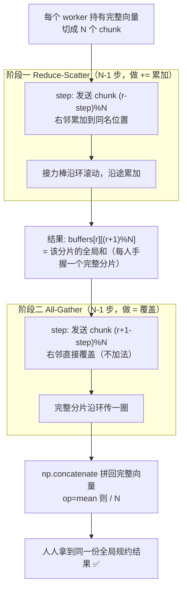

# 从零实现 Ring All-Reduce —— 手把手教学

> 一句话导览：本文带你**逐行**读懂 `ring_allreduce.py`（纯 numpy，单进程模拟 N 个 worker），学完你能掌握：
>
> 1. **All-Reduce 是什么、为什么数据并行训练离不开它**（N 张卡各算一份梯度，必须求和再平均，人人拿到同一份全局梯度）。
> 2. **Ring All-Reduce 的两阶段算法**：Reduce-Scatter（求和阶段）+ All-Gather（收集阶段），各 `N-1` 步，每步只和右邻通信一个分片。
> 3. **为什么它"带宽最优"**：每个 worker 收发量是 $2(N-1)/N$ 倍数据量，$N\to\infty$ 时趋于常数 $2$，**与卡数无关**——这就是它能扩到上万张卡的原因。
> 4. **Ring vs Naive 的本质差距**：naive 中心节点通信量随 $N$ **线性增长**，会成为带宽瓶颈。
> 5. **怎么把这套通信原语接进一次真实的 SGD 训练**，看着 loss 真的降下去。

---

## 0. 前置知识与环境

**你需要会一点点：**

- Python 基础（list、for 循环、切片 `a[i:j]`）。
- numpy 入门：`np.array`、`@`（矩阵乘法）、`np.sum`、`np.concatenate`、广播。完全没接触过也没关系，文中每个 numpy 调用都会解释。
- 高中数学 + 一点点向量/求导的概念（线性回归的 MSE 梯度，文中会推）。

**完全不需要：** GPU、CUDA、NCCL、torch、多进程/多机。本项目**用单进程的 numpy 数组"假装"成 N 个 worker**，把通信也写成普通的数组赋值。这正是它适合入门的地方：没有真实网络的复杂度，算法骨架却是真的。

**安装与运行：**

```bash
# 只需要 numpy；matplotlib 可选（画 loss 曲线，没装会自动退化成 ASCII 火花线，不会崩）
pip install numpy
pip install matplotlib   # 可选

cd practical-projects/13-ring-allreduce
python ring_allreduce.py
```

CPU 上数秒跑完。脚本最后用 `raise SystemExit(main())` 返回退出码：全部通过返回 `0`，否则返回 `1`（方便接 CI）。

> 小贴士：源码里有意把所有 `print` 都写成 **ASCII**（中文只在注释/docstring 里）。原因写在 docstring：Windows 控制台默认 GBK 编码，打印中文容易 `UnicodeEncodeError`。这是一个很实在的工程细节。

---

## 1. 问题背景：不用这个技术会怎样

设想你要训练一个大模型，单卡装不下数据/算不动，于是上 **数据并行（Data Parallel）**：把一个 batch 切成 N 份，N 张 GPU 各算一份。

每张卡 backward 之后会得到一份**本地梯度** $g_r$（$r=0,1,\dots,N-1$）。但你不能让每张卡各自用自己的梯度更新——那样 N 个模型会越走越散，等于训练了 N 个不同的模型。**正确做法是：把 N 份梯度求和再平均，得到全局梯度 $\bar g=\frac1N\sum_r g_r$，然后让每张卡都用同一个 $\bar g$ 更新**。这样所有卡的参数始终保持一致，等价于"单机用全部数据训练"。

这个"全员求和、人人拿到同一份结果"的操作，就是 **All-Reduce**。

**那 naive（朴素）地做会怎样？** 最直觉的方案是"星型 / reduce-to-0 + broadcast"：

- 选一个中心节点（worker 0），让其余 $N-1$ 张卡把梯度都发给它（它要**收** $N-1$ 份）。
- 中心节点求和后，再把结果广播回去（它要**发** $N-1$ 份）。

问题来了：**中心节点的收发量是 $(N-1)\times$ 数据量，随卡数 $N$ 线性增长**。N=8 时它要扛 7 倍数据；N=256 时要扛 255 倍。它是单点热点（hotspot），整个集群的速度被它一个人卡死。卡越多越慢——这与"加卡是为了变快"的初衷背道而驰。

代码里 `communication_cost_report` 用一行精确刻画了这个痛点：

```python
naive_per_worker = (N - 1) * data_bytes               # Naive 中心节点的负担
```

**Ring All-Reduce 就是来解决这个线性增长问题的**：它把通信均摊到环上每条边，让每个 worker 的收发量收敛到常数 $2\times$ 数据量，与 $N$ 无关。下面把原理讲透。

---

## 2. 核心原理详解

### 2.1 环形拓扑

把 N 个 worker 首尾相连成一个**环**。约定：worker `r` 的**右邻**是 `(r+1)%N`（它只往右邻发数据），它的**左邻**（数据来源）是 `(r-1)%N`。代码里这两行就是环的全部定义：

```python
right = (r + 1) % N           # 右邻：接收者
```

每个 worker 只和**右邻**通信，永远不和别人直接说话。这是 Ring 的关键——没有中心节点，没有热点。

### 2.2 把张量切成 N 个 chunk

Ring 的核心技巧是**分片（chunk）**：把每个 worker 的向量切成 N 等份。代码：

```python
chunk = length // N
buffers = [
    [t[c * chunk:(c + 1) * chunk].copy() for c in range(N)]
    for t in tensors
]
```

于是 `buffers[r][c]` = worker `r` 的第 `c` 个分片。整个算法只在这些**小分片**上做"加法 + 沿环传递"。每次只传 `data/N` 大小的一小块，而不是整份数据——这是带宽最优的基础。

> 这里也解释了为什么 toy 实现要求 `length % N == 0`（必须能被 N 整除），否则切不齐。真实 NCCL 会对不整除做 padding。

### 2.3 阶段一：Reduce-Scatter（求和阶段，N-1 步）

**目标**：经过 $N-1$ 步后，让每个分片的"全局和"汇聚到某一个 worker 手里。具体说，结束时 `buffers[r][(r+1)%N]` 恰好是第 `(r+1)%N` 个分片的全局和（已经累加了所有 N 份）。

**每一步在做什么**：每个 worker 把自己"当前负责累加"的那个 chunk 发给右邻，右邻收到后**累加（reduce）**到自己对应位置上。chunk 像接力棒一样沿环滚动，一边滚一边把沿途各 worker 的那一片加进来。

下面用 **N=3** 手算一遍（每个 worker 的向量切成 3 片，记 worker `r` 的初始第 `c` 片为 $a^r_c$）：

初始（`buffers[r][c]`）：

| worker | chunk0 | chunk1 | chunk2 |
|---|---|---|---|
| 0 | $a^0_0$ | $a^0_1$ | $a^0_2$ |
| 1 | $a^1_0$ | $a^1_1$ | $a^1_2$ |
| 2 | $a^2_0$ | $a^2_1$ | $a^2_2$ |

代码里发送下标是 `send_idx = (r - step) % N`，接收方把它累加进 `recv_idx = (r - step) % N`（注意 send_idx 和 recv_idx 数值相同，因为右邻把"从 r 收到的片"加到自己同名位置）。

- **step=0**：worker `r` 发送 chunk `r`（`(r-0)%3=r`）给右邻 `(r+1)`。
  - 结果：`buffers[1][0] += a⁰₀` → $a^1_0+a^0_0$；`buffers[2][1] += a¹₁` → $a^2_1+a^1_1$；`buffers[0][2] += a²₂` → $a^0_2+a^2_2$。
- **step=1**：worker `r` 发送 chunk `(r-1)%3`。
  - worker0 发 chunk2（已是 $a^0_2+a^2_2$）给 worker1：`buffers[1][2] += (a⁰₂+a²₂)`... 依次类推，每条接力棒再加一片。

$N-1=2$ 步后，每个分片都集齐了 3 份。可以验证：`buffers[0][1]`、`buffers[1][2]`、`buffers[2][0]` 各自是对应分片的**全局和** $\sum_r a^r_c$。代码注释精炼地总结为：

> 此刻：对每个 worker r，`buffers[r][(r + 1) % N]` 已是该分片的全局和。

### 2.4 阶段二：All-Gather（收集阶段，N-1 步）

现在"完整的分片"散落在各 worker 手里（每人手里有一个已规约好的分片）。**目标**：把这些完整分片再沿环传一圈，让每个 worker 集齐全部 N 个完整分片，拼出完整结果。

**关键区别**：这一阶段**只搬运、不再加法**——直接覆盖（拷贝），因为这些分片已经是最终结果了。代码用 `=` 而不是 `+=`：

```python
buffers[right][recv_idx] = send_snapshot[r]    # 直接覆盖，不累加
```

发送下标变成 `send_idx = (r + 1 - step) % N`（从"已经完整"的那个分片 `(r+1)%N` 开始转发）。再走 $N-1$ 步，环上每个位置都被填上正确的完整分片。

### 2.5 拼回 + 平均

最后把 N 个分片拼成完整向量，按需平均：

```python
full = np.concatenate(buffers[r])          # N 个分片拼成完整结果
if op == "mean":
    full = full / N                        # DDP 默认对梯度取平均
```

### 2.6 两阶段流程图



### 2.7 通信量为什么是 $2(N-1)/N$（带宽最优性）

每一步每个 worker 只收/发**一个 chunk**，大小是 $\text{data}/N$。两阶段各 $N-1$ 步，所以每个 worker 的**单向发送总量**：

$$
\text{ring\_send} = \underbrace{(N-1)}_{\text{Reduce-Scatter}}\cdot\frac{\text{data}}{N} + \underbrace{(N-1)}_{\text{All-Gather}}\cdot\frac{\text{data}}{N} = \frac{2(N-1)}{N}\cdot\text{data}
$$

关键在系数 $\dfrac{2(N-1)}{N}=2\left(1-\dfrac1N\right)$：

$$
\lim_{N\to\infty}\frac{2(N-1)}{N}=2
$$

**当卡数 $N$ 增大，每个 worker 的通信量趋于常数 $2\times$ 数据量，与 $N$ 无关**。对比 naive 的 $(N-1)\times$ 数据量（线性增长），二者比值 $\dfrac{(N-1)\,\text{data}}{2(N-1)/N\,\text{data}}=\dfrac{N}{2}$，即 **Ring 比 naive 快约 $N/2$ 倍**，卡越多差距越大。这就是"带宽最优（bandwidth optimal）"的含义。

代码把这套数学原封不动写进了 `communication_cost_report`：

```python
ring_per_worker  = 2.0 * (N - 1) / N * data_bytes      # Ring 单 worker 收/发量
naive_per_worker = (N - 1) * data_bytes                # Naive 中心节点的负担
"ring_coefficient": 2.0 * (N - 1) / N,                 # 关键系数 2(N-1)/N
"speedup_vs_naive": naive_per_worker / ring_per_worker # = N/2
```

---

## 3. 代码逐段精讲

文件结构清晰，分 5 大块：① 参考实现 ② Ring 主体 ③ 通信量分析 ④ toy 训练 ⑤ demo/自检。下面按逻辑逐段拆。

### 3.1 头部：导入与全局种子

```python
import numpy as np

SEED = 42
```

只依赖 numpy。`SEED=42` 是全局随机种子，保证每次跑结果**可复现**（正确性误差、loss 数字都一样）。

### 3.2 参考实现 `naive_all_reduce_sum` —— "正确答案"

```python
def naive_all_reduce_sum(tensors):
    total = np.sum(np.stack(tensors, axis=0), axis=0)  # 全局求和
    return [total.copy() for _ in range(len(tensors))]  # 人人一份
```

- `np.stack(tensors, axis=0)`：把 N 个一维数组摞成一个 `(N, length)` 的二维数组。
- `np.sum(..., axis=0)`：沿第 0 维（worker 维）求和，得到逐元素的全局和，形状 `(length,)`。
- 返回 N 份**相同**的拷贝——这就是 All-Reduce(SUM) 的语义："每个 worker 最终都拿到全员之和"。

它**不是** Ring 算法，而是"一把梭"的标准答案（reference），唯一作用是给 Ring 版本做正确性校验。

> 易困惑点：为什么要 `.copy()`？如果不拷贝，N 个返回元素会指向同一块内存，改一个全变。`.copy()` 保证它们是独立的副本，更贴近"每张卡各有一份"的真实语义。

### 3.3 Ring 主体 `ring_all_reduce` —— 项目核心

**函数签名与边界处理：**

```python
def ring_all_reduce(tensors, op="sum"):
    N = len(tensors)
    assert N >= 1, "need at least one worker"
    if N == 1:
        out = tensors[0].copy()
        return [out / 1 if op == "sum" else out]
```

- `tensors`：长度 N 的 list，每个是形状相同的一维 `np.ndarray`，`tensors[r]` 是 worker `r` 的本地数据（如本地梯度）。
- `op`："sum" 或 "mean"（DDP 默认取平均）。
- N=1 的特判：只有一个 worker 时无需通信，直接返回拷贝。`out / 1` 与 `out` 数值相同，是为了对称地写两个分支。

**切分约束 + 分片：**

```python
    length = tensors[0].size
    assert length % N == 0, (
        "for this toy demo the tensor length must be divisible by N; "
        f"got length={length}, N={N}"
    )
    chunk = length // N
    buffers = [
        [t[c * chunk:(c + 1) * chunk].copy() for c in range(N)]
        for t in tensors
    ]
```

对应 §2.2：`length % N == 0` 保证能切齐；`buffers[r][c]` = worker `r` 的第 `c` 个分片。这是个嵌套 list comprehension，外层遍历 worker，内层遍历 chunk 下标。

**阶段一 Reduce-Scatter：**

```python
    for step in range(N - 1):
        send_snapshot = []
        for r in range(N):
            send_idx = (r - step) % N
            send_snapshot.append(buffers[r][send_idx].copy())

        for r in range(N):
            right = (r + 1) % N           # 右邻：接收者
            recv_idx = (r - step) % N     # 右邻要累加到的 chunk 下标
            buffers[right][recv_idx] += send_snapshot[r]
```

对应 §2.3。**这里有一个新手极易踩的设计要点**：每步分成两个独立的 for 循环——

1. **先快照**：把所有 worker 本轮"要发送的分片"用 `.copy()` 拍下来存进 `send_snapshot`。
2. **再统一累加**：用快照去做 `+=`。

为什么不能边发边改？因为真实并发收发是"同时发生"的。如果在同一个循环里一边读 `buffers[r]` 一边改 `buffers[right]`，当 `right` 的数据在本步晚些时候又被当作发送源时，就会读到**被本步污染过**的值，结果出错。先快照再统一更新，模拟了真实的并发语义。这是分布式/并行代码里非常典型的"双缓冲/快照"技巧。

- `send_idx = (r - step) % N`：精心设计的调度，使数据沿环正确累加。
- `+=` 就是 **reduce（累加）** 本身——All-Reduce 名字里的 "Reduce"。

**阶段二 All-Gather：**

```python
    for step in range(N - 1):
        send_snapshot = []
        for r in range(N):
            send_idx = (r + 1 - step) % N
            send_snapshot.append(buffers[r][send_idx].copy())

        for r in range(N):
            right = (r + 1) % N
            recv_idx = (r + 1 - step) % N
            buffers[right][recv_idx] = send_snapshot[r]   # 直接覆盖（拷贝）
```

对应 §2.4。结构与阶段一**几乎一样**，但有两处关键差异：

1. 起始下标变成 `(r + 1 - step) % N`（从"已完整"的分片开始转发）。
2. 用 `=`（**覆盖**）而非 `+=`（累加）——因为这些分片已经是规约完成的最终结果，再加就错了。

**拼回与平均：**

```python
    results = []
    for r in range(N):
        full = np.concatenate(buffers[r])          # N 个分片拼成完整结果
        if op == "mean":
            full = full / N                        # DDP 默认对梯度取平均
        results.append(full)
    return results
```

对应 §2.5。`np.concatenate(buffers[r])` 把 worker `r` 手里的 N 个分片按顺序拼成完整向量。`op=="mean"` 时除以 N（梯度平均，DDP 默认）。返回 N 份完整结果，理论上**完全相同**。

### 3.4 通信量分析 `communication_cost_report`

```python
def communication_cost_report(N, num_elements, bytes_per_elem=4):
    data_bytes = num_elements * bytes_per_elem            # 一整份张量的字节数
    ring_per_worker = 2.0 * (N - 1) / N * data_bytes      # Ring 单 worker 收/发量
    naive_per_worker = (N - 1) * data_bytes               # Naive 中心节点的负担
    return {
        "data_bytes": data_bytes,
        "ring_send_bytes": ring_per_worker,
        "ring_coefficient": 2.0 * (N - 1) / N,            # 关键系数 2(N-1)/N
        "naive_hotspot_bytes": naive_per_worker,
        "speedup_vs_naive": naive_per_worker / ring_per_worker,
    }
```

对应 §2.7 的全部数学。`bytes_per_elem=4` 默认是 fp32（4 字节）。返回字典里 `ring_coefficient` 就是那个会收敛到 2 的系数，`speedup_vs_naive` 就是 $N/2$。这个函数不通信、不训练，纯粹是"用公式算账"，把带宽最优性量化出来。

### 3.5 toy 数据并行训练 `toy_data_parallel_training`

这是把通信原语接进**真实训练循环**的部分，证明它不只是数组游戏。任务是线性回归 $y=Xw$。

**造数据：**

```python
def toy_data_parallel_training(N=4, dim=8, total_samples=512, steps=60, lr=0.1):
    rng = np.random.default_rng(SEED)
    true_w = rng.standard_normal(dim)
    X = rng.standard_normal((total_samples, dim))
    y = X @ true_w + 0.01 * rng.standard_normal(total_samples)
```

默认超参：N=4 个 worker、dim=8 维特征、512 个样本、60 步、学习率 0.1。先采一个真值权重 `true_w`，再造 `X`，标签 `y = X @ true_w + 噪声`（噪声很小，`0.01` 倍标准正态）。训练目标就是从含噪数据里**找回 `true_w`**。

**切分数据给 N 个 worker：**

```python
    shards_X = np.array_split(X, N)
    shards_y = np.array_split(y, N)
    w = np.zeros(dim)
```

`np.array_split` 把 512 个样本切成 N=4 份不重叠的分片——这就是**数据并行的本质**：各 worker 看一份不同的数据。`w = np.zeros(dim)`：所有 worker 从**同一个**初始参数出发（很重要，否则模型会发散）。

**训练循环：**

```python
    losses = []
    for step in range(steps):
        local_grads = []
        for r in range(N):
            Xr, yr = shards_X[r], shards_y[r]
            pred = Xr @ w
            err = pred - yr
            grad = (2.0 / Xr.shape[0]) * (Xr.T @ err)   # MSE 对 w 的梯度
            local_grads.append(grad)

        synced_grads = ring_all_reduce(local_grads, op="mean")
        global_grad = synced_grads[0]   # 同步后人人相同，取任意一个即可

        w = w - lr * global_grad

        full_pred = X @ w
        loss = float(np.mean((full_pred - y) ** 2))
        losses.append(loss)

    return losses, w, true_w
```

逐块解释：

1. **每个 worker 算本地梯度**：在自己的分片 `(Xr, yr)` 上算。MSE $L=\frac1m\|Xw-y\|^2$ 对 $w$ 的梯度是 $\frac{2}{m}X^\top(Xw-y)$，代码 `(2.0 / Xr.shape[0]) * (Xr.T @ err)` 一字不差地实现了它（`Xr.shape[0]` 是该分片样本数 $m$，`err = Xr@w - yr`）。
2. **核心一行**：`ring_all_reduce(local_grads, op="mean")` 把 N 份本地梯度同步成**全局平均梯度**。这正是真实 DDP 里"每次 backward 之后发生的事"。
3. `global_grad = synced_grads[0]`：同步后人人相同，取第 0 个即可。
4. **更新**：`w = w - lr * global_grad`，所有 worker 用同一份梯度更新，参数自然始终一致。
5. **记录全局 loss**：用**全量** `X, y` 评估（不是某个分片），便于观察收敛。返回 `losses, w, true_w`。

> 易困惑点：注意梯度是在每个分片上算的，然后用 ring 取 `mean`。由于各分片样本数相同（512 能被 4 整除），分片平均的梯度等价于全量梯度——这就是为什么 toy DDP 能复现单机效果。

### 3.6 三个 demo + 画图 + main

**`_demo_correctness`（正确性自检）：**

```python
def _demo_correctness():
    rng = np.random.default_rng(SEED)
    N = 5
    length = 20                       # 必须能被 N 整除
    tensors = [rng.standard_normal(length) for _ in range(N)]
    ref_sum = naive_all_reduce_sum(tensors)[0]
    ring_sum = ring_all_reduce([t.copy() for t in tensors], op="sum")
    ring_mean = ring_all_reduce([t.copy() for t in tensors], op="mean")
    all_equal = all(np.allclose(ring_sum[0], r) for r in ring_sum)
    max_err_sum = max(np.max(np.abs(r - ref_sum)) for r in ring_sum)
    max_err_mean = max(np.max(np.abs(r - ref_sum / N)) for r in ring_mean)
```

用 N=5、length=20（能整除）随机造数据，分别跑 naive（参考）和 ring（sum/mean），然后比三件事：① 所有 worker 结果是否一致（`all_equal`）；② ring sum 与参考的最大逐元素误差；③ ring mean 与"参考/N"的最大误差。判定 `ok = all_equal and max_err_sum < 1e-9 and max_err_mean < 1e-9`。

> 注意传给 ring 的是 `[t.copy() for t in tensors]`——因为 ring 内部对 buffers 做 in-place `+=`，传拷贝避免污染原始 `tensors`（不然第二次跑 mean 时输入已被改）。

**`_demo_communication`**：对 `N in (2, 4, 8, 16, 64, 256)` 循环调用 `communication_cost_report`，打印成表格，直观展示系数收敛到 2、naive 线性爆炸。

**`_demo_training`**：调 `toy_data_parallel_training()`（全用默认超参），打印 loss 的若干关键点、下降倍数、权重误差，判定 `converged = losses[-1] < losses[0] and w_err < 0.05`。

**`_maybe_plot`**：装了 matplotlib 就用 `Agg` 后端（无显示环境）画对数坐标 loss 曲线存 `training_loss.png`；否则用 `try/except` 兜底打印一条 ASCII 火花线（用字符 `" .:-=+*#%@"` 表示高低），**绝不崩溃**。这是健壮性写法的好范例。

**`main`**：依次跑四个 demo，最后用 `success = ok_correct and ok_train` 判定总体成败，返回 0/1。

---

## 4. 跑起来 + 逐行读懂输出

```bash
python ring_allreduce.py
```

预期输出（README 里的真实跑通摘录）：

```
[1] Correctness check (Ring vs naive sum/mean)
    all workers identical : True
    max abs err  (sum)    : 4.441e-16
    max abs err  (mean)   : 1.110e-16
    result == reference   : True

[2] Communication volume per worker (lower is better)
       N |  ring_coeff 2(N-1)/N |   ring_MB |  naive_MB | ring<naive
       4 |               1.5000 |     6.000 |    12.000 |       2.0x
       8 |               1.7500 |     7.000 |    28.000 |       4.0x
      64 |               1.9688 |     7.875 |   252.000 |      32.0x
     256 |               1.9922 |     7.969 |  1020.000 |     128.0x
    Note: ring coefficient -> 2.0 as N grows (independent of N) ... bandwidth optimal

[3] Toy data-parallel SGD with ring all-reduce gradient sync
    loss[  0] = 5.070283
    loss[ -1] = 0.000099
    loss reduction factor : 51012.1x  (loss went down)
    max|w_learned - w_true|: 0.0007  (recovered true weights)
    training converged    : True

 OVERALL: SUCCESS (correctness passed AND training converged)
```

**逐条读懂：**

`[1] 正确性`
- `all workers identical : True`：N 个 worker 的 ring 结果逐元素一致——All-Reduce 的语义要求"人人拿到同一份"。
- `max abs err (sum) : 4.441e-16`：ring sum 与"直接求和"的最大误差约 $4\times10^{-16}$，这是 **float64 的机器精度极限**（$\approx 2.2\times10^{-16}$）。意味着 ring 与一把梭求和在数值上**等价**，差异只来自浮点加法的舍入顺序。
- `max abs err (mean) : 1.110e-16`：mean 误差更小（因为除以 N 后量级变小），同样在浮点极限。
- `result == reference : True`：通过 `< 1e-9` 判定。

`[2] 通信量`（每列含义对应 §2.7 的公式）
- `ring_coeff 2(N-1)/N`：N=4→1.5000，N=8→1.75，N=64→1.9688，N=256→1.9922。**单调上升并收敛到 2**——验证了 $\lim_{N\to\infty}=2$。
- `ring_MB`：单 worker 收发量，始终在 6~8 MB 之间（约等于 $2\times$ 数据 3.81MB），**几乎不随 N 变**。
- `naive_MB`：中心节点负担，N=4→12，N=8→28，N=256→**1020 MB**，随 N **线性爆炸**。
- `ring<naive`：即 $N/2$ 倍优势，N=256 时 **128x**。一张图说尽"为什么 ring 能扩到上万卡"。

`[3] toy 训练`
- `loss[0] = 5.07`：初始 `w=0`，loss 较大。
- `loss[-1] = 0.000099`：60 步后降到约 $10^{-4}$。
- `loss reduction factor : 51012.1x`：`losses[0]/losses[-1]`，loss 下降了约 **5 万倍**——证明用 ring 同步梯度真能驱动收敛。
- `max|w_learned - w_true|: 0.0007`：学到的权重与真值最大差 $7\times10^{-4}$，几乎完美找回 `true_w`（残差来自标签里 `0.01` 的噪声）。
- `training converged : True`：通过 `losses[-1] < losses[0] and w_err < 0.05`。

`OVERALL: SUCCESS`：正确性通过 **且** 训练收敛。脚本退出码为 0。

如果装了 matplotlib，还会多打印 `[4] Loss curve saved to training_loss.png`。

---

## 5. 动手改造（练习）

由易到难，建议每改一处就跑一次对比。

1. **【易】改 worker 数 N。** 把 `_demo_communication` 里的 `for N in (2, 4, 8, 16, 64, 256)` 加上 `1024, 4096`。预期：`ring_coeff` 继续逼近 2（如 4096→约 1.9995），`ring_MB` 几乎不变，`naive_MB`/`speedup` 继续线性飙升。直观感受"带宽最优"。

2. **【易】改训练规模。** 调 `toy_data_parallel_training(N=8, steps=120)`（在 `_demo_training` 里改调用）。提示：N 变了但 `total_samples=512` 仍能被 8 整除；steps 多了 loss 会更低。观察收敛是否更充分。

3. **【中】验证 sum 与 mean 的关系。** 写几行：对同一组 `tensors` 分别跑 `op="sum"` 和 `op="mean"`，断言 `np.allclose(ring_mean[0] * N, ring_sum[0])`。预期成立——因为 mean 只是 sum 除以 N。

4. **【中】触发不整除断言。** 故意调 `ring_all_reduce([np.arange(10.0) for _ in range(4)])`（length=10 不能被 4 整除）。预期抛 `AssertionError`，提示信息含 `length=10, N=4`。然后思考：真实 NCCL 是怎么用 padding 解决的？

5. **【难】手动展开 N=3 验证中间状态。** 取 N=3、length=3 的简单整数张量（如 `[1,2,3]`、`[10,20,30]`、`[100,200,300]`），在 Reduce-Scatter 两步后打印 `buffers`，对照 §2.3 的手算表，确认 `buffers[r][(r+1)%N]` 确实是该分片全局和（如 chunk0 应为 $1+10+100=111$）。这是真正"看见"算法在动的练习。

---

## 6. 常见坑与排错

- **`UnicodeEncodeError`（Windows）。** 源码已经规避：所有 `print` 用 ASCII，中文只在注释。你自己加 print 时别在 Windows GBK 控制台里直接打印中文，否则会报错。需要中文输出可先 `chcp 65001` 切到 UTF-8。

- **`AssertionError: tensor length must be divisible by N`。** 张量长度必须能被 N 整除。toy 实现不做 padding——这是有意简化。改数据时注意 `length % N == 0`、`total_samples % N == 0`。

- **忘了传拷贝，结果第二次跑变了。** `ring_all_reduce` 内部对 `buffers` 做 in-place `+=`，但 `buffers` 是从 `tensors` `.copy()` 切出来的，所以**不会改原 `tensors`**。不过 `_demo_correctness` 仍显式传 `[t.copy() for t in tensors]` 是好习惯。自己复用同一个 list 时，养成传拷贝的习惯。

- **"为什么不能边发边改？"导致结果错。** 如果你重写时把"快照 + 累加"合并成一个循环、边读边写，会污染数据。务必保留 `send_snapshot` 这个两段式结构（见 §3.3）。

- **模型发散 / loss 不降。** 检查：① 所有 worker 是否从同一 `w` 出发（`w = np.zeros(dim)`）；② 是否用了同步后的 `global_grad` 而不是各自的 `local_grad`；③ `lr` 是否过大。

- **matplotlib 报错。** 不会让脚本崩——`_maybe_plot` 用 `try/except` 兜底成 ASCII 火花线。要画图建议用 `Agg` 后端（源码已设 `matplotlib.use("Agg")`），无显示环境也能存 png。

---

## 7. 一图速查 / 知识卡片

**两阶段对照表：**

| 维度 | Reduce-Scatter（阶段一） | All-Gather（阶段二） |
|---|---|---|
| 目的 | 把每个分片的全局和汇聚到某 worker | 把完整分片传遍全环 |
| 步数 | $N-1$ | $N-1$ |
| 每步操作 | `+=`（累加 / reduce） | `=`（覆盖 / 拷贝） |
| 发送下标 | `(r - step) % N` | `(r + 1 - step) % N` |
| 结束状态 | `buffers[r][(r+1)%N]` = 该分片全局和 | 人人集齐全部完整分片 |

**关键公式：**

| 量 | 公式 | 代码 |
|---|---|---|
| Ring 单 worker 收发 | $\dfrac{2(N-1)}{N}\cdot\text{data}$ | `2.0*(N-1)/N*data_bytes` |
| Ring 系数极限 | $\lim_{N\to\infty}\dfrac{2(N-1)}{N}=2$ | `ring_coefficient` |
| Naive 中心节点 | $(N-1)\cdot\text{data}$ | `(N-1)*data_bytes` |
| Ring vs Naive 提速 | $N/2$ | `speedup_vs_naive` |
| 每个 chunk 大小 | $\text{data}/N$ | `chunk = length // N` |
| MSE 梯度 | $\frac{2}{m}X^\top(Xw-y)$ | `(2.0/Xr.shape[0])*(Xr.T@err)` |

**默认超参（`toy_data_parallel_training`）：** `N=4, dim=8, total_samples=512, steps=60, lr=0.1`，`SEED=42`。

**核心函数清单：**
- `naive_all_reduce_sum(tensors)` —— 参考实现（正确答案）
- `ring_all_reduce(tensors, op="sum")` —— Ring 主体（两阶段）
- `communication_cost_report(N, num_elements, bytes_per_elem=4)` —— 通信量分析
- `toy_data_parallel_training(...)` —— 把 ring 接进 SGD
- `_demo_correctness / _demo_communication / _demo_training / _maybe_plot / main`

---

## 8. 延伸阅读

**本仓库相关文档（相对路径）：**
- [集合通信原语](../../ai-infra/网络/集合通信原语.md) —— §8 Ring-AllReduce 流程图解、§8.3 通信量 $2(N-1)/N$ 推导、§10 小数字手算数据流
- [NCCL](../../ai-infra/网络/NCCL.md) —— 工业级实现 NCCL 的环/树拓扑与性能
- [集合通讯性能测试](../../ai-infra/网络/nccl-test-集合通讯的性能测试.md) —— 真实 all-reduce 带宽实测
- 网络目录总览：[../../ai-infra/网络](../../ai-infra/网络)

**经典论文 / 社区资源：**
- Baidu，*Bringing HPC Techniques to Deep Learning*（Ring-AllReduce 原始推广文）：https://andrew.gibiansky.com/blog/machine-learning/baidu-allreduce/
- NVIDIA Developer Blog，*Massively Scale Deep Learning Training with NCCL 2.4*：https://developer.nvidia.com/blog/massively-scale-deep-learning-training-nccl-2-4/
- NCCL 官方文档 — Collective Operations：https://docs.nvidia.com/deeplearning/nccl/user-guide/docs/usage/collectives.html

> 一句话收尾：本项目用最少代码把 Ring All-Reduce 的**算法骨架（两阶段）**与**带宽最优性（$2(N-1)/N$）**讲透并跑通，是理解 DDP/NCCL"梯度同步为什么不随卡数变慢"的最小可运行模型。读懂它，你就抓住了大规模训练通信的命门。
