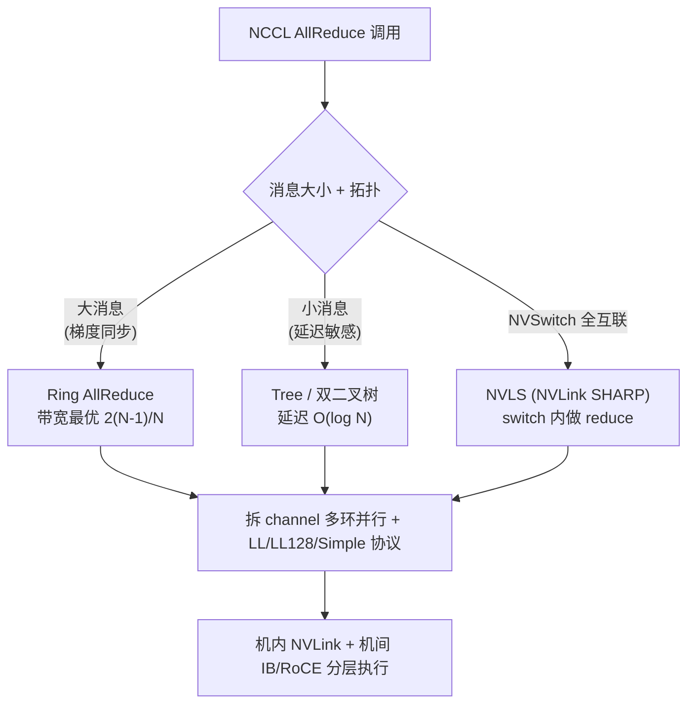

# Ring All-Reduce · 进阶与生产实践

> 把 `ring_allreduce.py` 这个纯 numpy、单进程模拟 N 个 worker 的 toy，对照到 NCCL / IB·RoCE / DDP / FSDP 的真实工程里。看完你会知道：toy 把哪些"难"故意删掉了、生产为什么要那样补、以及怎么把这个 demo 一步步推到接近工业实现。
>
> 配套教学见同目录 `手把手教学.md`；通信量推导见 `../../ai-infra/网络/集合通信原语.md`。

---

## 0. 本项目 toy 与生产的差距

本 demo 的价值是把**算法骨架**（Reduce-Scatter + All-Gather，各 N-1 步）和**带宽最优性**（$2(N-1)/N$）讲透并跑通。但它运行在「单进程、一根线程、用数组赋值假装网络」的世界里，把生产中最难的部分全部省掉了。下面逐条对照。

| 维度 | 本 toy 怎么做 | 生产（NCCL/DDP）必须补什么 | 为什么 |
|---|---|---|---|
| **"通信"** | `buffers[right][idx] += snapshot` 纯内存赋值 | 真实 `send/recv` 走 PCIe / NVLink / IB / RoCE，有 RDMA、零拷贝、GPU Direct | 内存赋值没有带宽上限、没有延迟、不会丢包；真实链路这三者都是一等约束 |
| **并发** | 两段式 for 循环串行模拟"同时收发" | 全双工：每个 rank **同时**向右发、从左收（双向流水线），收发 overlap | 串行实现每步耗时翻倍；真实 ring 靠全双工把发送和接收时间重叠 |
| **拓扑** | 逻辑环 `(r+1)%N`，硬编码单环 | NCCL 启动时**自动探测**拓扑（NVLink/NVSwitch/PCIe/IB），构建多 ring + tree，做 rail 对齐 | 物理拓扑决定环怎么连才不踩慢链路；连错环带宽可掉一个数量级 |
| **数据类型** | float64，`length % N == 0` 才能跑 | fp32/fp16/bf16/fp8，任意 size（自动 padding/分块），in-place reduce 算子 | 训练梯度是 bf16/fp16；不整除是常态；低精度求和有累加误差问题 |
| **分块粒度** | 一步发整整 1 个 chunk（data/N） | 把 chunk 再切成多个 **slice**，做软件流水线（pipeline），隐藏首尾延迟 | 一次只发 data/N 太大，无法 overlap 启动/排空开销；细分才能填满带宽 |
| **与计算重叠** | 先算完所有梯度，再一把 all-reduce | **bucketing**：backward 边算边触发，梯度按 bucket 异步 all-reduce，与反向计算 overlap | 串行"算完再通信"会让 GPU 在通信时干等，吞吐腰斩 |
| **多机** | 无机间概念 | 两级：机内 NVLink ring + 机间 IB ring（hierarchical / 2D ring） | 机内带宽（NVLink ~数百 GB/s）远高于机间（IB ~数十 GB/s），必须分层 |
| **容错** | 一个 rank 挂了整个进程崩 | 超时检测、health check、弹性训练（torchrun elastic）、checkpoint 续训 | 千卡训练单卡/单链路故障是高频事件，必须能恢复 |
| **正确性保证** | `op="mean"` 直接 `/N` | 数值确定性（deterministic）、reduce 顺序固定、低精度下的 loss scaling | 不同 reduce 顺序在 fp16 下会产生不同结果，影响可复现与调试 |
| **API 形态** | 函数返回 N 份结果 | in-place、流式、async handle、stream/event 同步、CUDA graph 捕获 | 训练循环里 all-reduce 嵌在 CUDA stream，必须能异步并被图捕获 |

一句话：**toy 教的是"算法对不对"，生产解决的是"算法在真实带宽/延迟/故障/重叠约束下还能不能跑满"**。

---

## 1. 业界系统怎么做

### 1.1 NCCL 是事实标准

NVIDIA Collective Communications Library（NCCL）是 GPU 集合通信的工业标准，PyTorch DDP/FSDP、DeepSpeed、Megatron-LM 底层全部依赖它。它实现了 AllReduce、ReduceScatter、AllGather、Broadcast、Reduce、AllToAll 等原语（见 `../../ai-infra/网络/集合通信原语.md`），并在启动时做三件本 toy 完全没有的事：

1. **拓扑探测**：扫描 NVLink / NVSwitch / PCIe switch / IB HCA 的连接关系，构建一张带宽图。
2. **算法/协议选择**：根据 message size、GPU 数、拓扑，自动选 Ring 还是 Tree（甚至 NVLS/CollNet），并选 LL / LL128 / Simple 协议。
3. **channel 划分**：把一次集合通信拆到多个 channel（多个并行环）上跑，吃满所有链路。

### 1.2 Ring vs Tree vs 双二叉树：NCCL 的核心取舍

这是面试高频、也是理解 NCCL 的关键。三者本质是**带宽**和**延迟**的取舍：

| 算法 | 单 worker 通信量 | 延迟（步数/跳数） | 擅长 | 软肋 |
|---|---|---|---|---|
| **Ring** | $2(N-1)/N \cdot D$，趋于 $2D$，与 N 无关 | $O(N)$ 步，随 N 线性增长 | **大消息**（梯度同步，带宽决定） | 小消息时 N 大延迟高 |
| **Tree** | 约 $2D$ 量级 | $O(\log N)$ 跳 | **小消息 + 多机**（延迟决定） | 树根/内部节点带宽利用不如 ring 满 |
| **Double Binary Tree** | $\approx 2D$ | $O(\log N)$ | 兼顾带宽与延迟，机间扩展性好 | 实现复杂 |

- **Ring** 的缺点正是 toy 公式里 $N-1$ 步带来的：步数随 N 线性增长，**每步至少一个网络延迟**。当 N=512、消息很小时，$2(N-1)\approx 1022$ 步的延迟累加会压倒带宽优势。
- **Tree** 把通信组织成树，规约和广播都是 $O(\log N)$ 跳——256 卡只要约 8 跳，延迟随 N 几乎不涨。代价是带宽利用率略低于满载 ring。
- **Double Binary Tree（双二叉树）** 是 NCCL 2.4 引入的关键优化：构造**两棵互补的二叉树**，让每个 rank 在一棵树里是叶子、在另一棵里是内部节点，从而**两棵树同时跑、各占一半数据**，把树算法的带宽利用率拉到接近 ring，同时保留 $O(\log N)$ 延迟。这是大规模多机训练（成千上万 GPU）的主力算法之一。

NCCL 的实际策略是**按消息大小自动切换**：大消息走 ring（吃带宽），小消息走 tree/双二叉树（省延迟），用户通常无需手动指定（可用 `NCCL_ALGO` 强制）。

### 1.3 PyTorch DDP 怎么用它

DDP 不直接暴露 ring，而是把 NCCL AllReduce 包进训练循环并做两个关键工程优化（toy 完全没有）：

- **Gradient Bucketing**：把参数梯度按大小分桶（默认约 25MB/bucket）。backward 反向计算时，**一个 bucket 的梯度一就绪就立即异步发起 all-reduce**，不等整个 backward 结束。
- **Computation/Communication Overlap**：因此通信和反向计算**重叠**进行——GPU 在算前面层梯度时，后面层的梯度已经在网络上飞了。这是 DDP 高吞吐的核心，也是 toy "算完所有梯度再 all-reduce" 与生产最大的结构性差异。

---

## 2. 关键变体与优化

逐个讲清每个变体「解决什么、代价是什么」。

### 2.1 Reduce-Scatter + All-Gather 的解耦（ZeRO/FSDP）

Ring AllReduce = ReduceScatter + AllGather（toy 里就是这两阶段）。把它们**拆开单独用**就得到了显存优化的 ZeRO/FSDP：

- 标准 DDP：每卡存**完整**优化器状态 + 梯度 + 参数，all-reduce 同步全量梯度。
- FSDP/ZeRO：参数和优化器状态按 rank **分片**。forward/backward 前用 **AllGather** 临时聚齐参数，算完梯度用 **ReduceScatter** 直接把"我负责那片"的规约结果留给自己。
- **解决**：显存随卡数下降（ZeRO-3 显存近似 $1/N$）。**代价**：通信量约为纯 DDP 的 1.5 倍（多一次 all-gather 参数），且通信更频繁，对带宽更敏感。

### 2.2 梯度压缩（gradient compression）

通信量正比于梯度字节数，压缩梯度就能减小通信。常见手段：

- **低精度**：fp32→fp16/bf16 直接砍一半（最常用，几乎无损，bf16 已是默认）；fp8 all-reduce 是前沿。
- **量化 / 稀疏化**：PowerSGD（低秩近似）、Top-k 稀疏、1-bit/0.5-bit SGD（DeepSpeed 1-bit Adam）。
- **代价**：压缩/解压本身有计算开销，且会引入误差需 **error feedback** 补偿;低秩/稀疏会拖慢收敛或损精度。所以**只在通信确实是瓶颈（机间带宽受限）时才上**，机内 NVLink 富裕时不划算。

### 2.3 通信-计算重叠（overlap）

如 §1.3，bucketing 让 all-reduce 与 backward 重叠。更进一步：

- **梯度累积**：每 K 个 micro-batch 才 all-reduce 一次，把通信摊薄到 K 步（DDP `no_sync()`）。
- **代价**：bucket 太小→通信次数多、启动开销大；太大→重叠窗口小。需调 `bucket_cap_mb`。这正是 toy 里"一步发整个 chunk"无法体现的流水线工程。

### 2.4 分层 / 2D Ring（hierarchical all-reduce）

机内 NVLink 带宽远高于机间 IB（量级差几倍到十几倍）。单一大环若跨机会被慢的机间链路拖死。解法：

1. **机内**先做一次 ReduceScatter（走 NVLink，极快）；
2. **机间**对各机的分片结果做 AllReduce（走 IB，数据量已被机内规约缩小）；
3. **机内**再 AllGather 广播回去。

这样**昂贵的机间通信量被压到最小**。NCCL 的多 ring + rail-optimized 拓扑本质就是在自动做这件事。

### 2.5 NVLS / In-network reduction（SHARP）

最前沿的优化：**让交换机自己做加法**。NVLink SHARP（NVLS）让 NVSwitch 在芯片内完成 reduce；IB 的 SHARP 让 IB 交换机在网络中聚合。数据"路过"交换机时就被求和，省掉一来一回。**代价**：依赖特定硬件（NVSwitch / Quantum IB switch），且对 op 类型有限制。

---

## 3. 真实工程权衡与坑

### 3.1 显存 / 吞吐 / 延迟 / 精度 / 通信 的取舍

- **显存 vs 通信**：DDP 省通信（一次 all-reduce）但每卡存全量；FSDP 省显存（分片）但通信翻倍。卡多、模型大、机间带宽足→FSDP；模型能放下、想要极致吞吐→DDP。
- **吞吐 vs 延迟**：大 bucket / 大 message 走 ring 吞吐高但单次延迟大；小 message 走 tree 延迟低。NCCL 自动权衡，但你调 bucket 大小就是在这条曲线上选点。
- **精度 vs 通信**：bf16 all-reduce 省一半带宽，但**低精度求和有累加舍入误差**——大 N 时尤其明显，有的框架对 reduce 用 fp32 累加（`NCCL` 内部、或 master weights）来兜底。
- **重叠 vs 内存**：overlap 需要为 in-flight bucket 留通信 buffer，显存换吞吐。

### 3.2 IB / RoCE 的工程坑

- **IB (InfiniBand) vs RoCE (RDMA over Converged Ethernet)**：IB 是专用网络（自带无损、低延迟、SHARP），贵但省心；RoCE 跑在以太网上更便宜，但**必须配好 PFC（优先级流控）+ ECN 做无损**，否则丢包重传让 all-reduce 性能崩塌。RoCE 调参是生产大坑（见 `../../ai-infra/网络/roce.md`）。
- **GPU Direct RDMA**：让 IB 网卡直接读写 GPU 显存，绕过 CPU/host 内存拷贝。没开等于白白损失带宽。
- **rail 对齐 / 拓扑**：多机时哪张 GPU 配哪张 HCA、走哪条 rail，配错会让 ring 跨慢链路。NCCL 的拓扑探测 + `NCCL_IB_HCA` 等环境变量就在管这个。

### 3.3 线上常见故障与调优

- **某个 rank 慢（straggler）**：ring 是流水线，**一个慢节点拖垮全环**（木桶效应）。常见于某卡降频、某条链路降速、数据加载不均。排查用 `nccl-test`（见 `../../ai-infra/网络/nccl-test-集合通讯的性能测试.md`）逐链路测带宽。
- **NCCL hang / timeout**：某 rank 没进 collective（如分支不一致、OOM、死锁），其它 rank 在 all-reduce 处死等到 `NCCL_TIMEOUT`。排查：打开 `NCCL_DEBUG=INFO` 看是否所有 rank 都进了同一个 collective。
- **带宽打不满**：常因 message 太小（走了 tree）、没开 GPU Direct、PCIe 而非 NVLink、channel 数不够。`NCCL_DEBUG=INFO` 会打印选了哪个算法/协议/几个 channel。
- **结果不确定**：fp16 下 reduce 顺序变化导致结果抖动，影响复现。需要 deterministic 时固定算法和环境。

---

## 4. 性能直觉与估算

记数据量（梯度字节数）$D$，卡数 $N$，机间/链路单向带宽 $B$，单步延迟（每跳）$\alpha$。

**Ring AllReduce 通信时间**（toy 公式的物理版，$\alpha$-$\beta$ 模型）：
$$
T_{\text{ring}} \approx \underbrace{2(N-1)\,\alpha}_{\text{延迟项, 2(N-1) 步}} + \underbrace{\frac{2(N-1)}{N}\cdot\frac{D}{B}}_{\text{带宽项, 趋于 } 2D/B}
$$

- **带宽项** $\to 2D/B$，与 N **无关**——这就是 toy 反复强调的带宽最优。直觉：不管多少卡，每张卡总要发/收约 2 份完整数据。
- **延迟项** $2(N-1)\alpha$ 随 N 线性涨——这是 ring 在**大 N + 小 D** 时输给 tree 的原因。

**Tree AllReduce**：延迟项变成 $\approx 2\log_2 N \cdot \alpha$，带宽项同量级 $\approx 2D/B$。所以：
$$
\text{大消息 (D 大)} \Rightarrow \text{ring}; \qquad \text{小消息 + 大 N} \Rightarrow \text{tree/双二叉树}
$$

**手算示例**：1B 参数模型，bf16 梯度 $D \approx 2\,\text{GB}$。机间 IB 单向带宽 $B \approx 25\,\text{GB/s}$（200Gbps）。
- 带宽项 $\approx 2 \times 2 / 25 = 0.16\,\text{s}$ 每步 all-reduce。若一步训练算力耗时 ~0.4s，且**完全重叠**则通信几乎隐藏;若不重叠，吞吐损失 ~30%+。
- 这解释了为什么 overlap（§2.3）和 bf16（§2.2）是必选项。

**加速比直觉**：理想数据并行线性加速 $N\times$。实际 $\text{speedup} \approx N \cdot \dfrac{T_{\text{compute}}}{T_{\text{compute}} + T_{\text{comm,exposed}}}$。通信占比越低（重叠越好、带宽越高、压缩越狠）越接近线性。

---

## 5. 动手进阶路线

把本 toy 一步步推向接近生产，每步给方向（不必一次到位）：

1. **从单进程到真多进程（最关键的一步）**。用 `torch.distributed` + `torch.multiprocessing` 起 N 个进程，把 `buffers[right][idx] += snapshot` 换成真正的 `dist.send`/`dist.recv`（gloo 后端可在 CPU 上跑）。你会立刻撞上 toy 回避的并发/死锁问题——必须**奇偶 rank 交错收发**或用非阻塞 `isend/irecv` 才不死锁。这一步让你真正理解"双缓冲快照"在真实网络里对应什么。

2. **加全双工 + 流水线分块**。让每个 rank 同时向右发、从左收（非阻塞 + `wait`），并把每个 chunk 再切成 K 个 slice 做软件流水线。对比加速比，体会 §0 表里"一步发整 chunk"为何不够。

3. **接真实 NCCL，跑 nccl-test**。在有 GPU 的机器上 `dist.all_reduce(tensor)`（backend=nccl），并用 `nccl-test` 实测带宽（见 `../../ai-infra/网络/nccl-test-集合通讯的性能测试.md`）。打开 `NCCL_DEBUG=INFO`，观察它选了 ring 还是 tree、几个 channel——把你的手写实现和工业实现对照。

4. **复刻 DDP 的 overlap**。把你的 all-reduce 接进一个真实小模型训练循环，先做"算完再通信"，再改成 bucketing + backward hook 触发异步 all-reduce，测吞吐差异。这一步让你理解 DDP 的精髓。

5. **多机分层 all-reduce**。两台机各 N 卡时，手写"机内 ReduceScatter → 机间 AllReduce → 机内 AllGather"的两级方案，对比单一大环，体会 NVLink/IB 带宽差为何逼出分层（§2.4）。

---

## 6. 延伸阅读

**本仓库已有深度文档（优先）：**
- 集合通信原语（含 Ring 流程图、$2(N-1)/N$ 推导、小数字手算）：[../../ai-infra/网络/集合通信原语.md](../../ai-infra/网络/集合通信原语.md)
- NCCL（工业实现、ring/tree 拓扑、协议）：[../../ai-infra/网络/NCCL.md](../../ai-infra/网络/NCCL.md)
- NCCL 集合通讯性能测试（nccl-test 实测带宽）：[../../ai-infra/网络/nccl-test-集合通讯的性能测试.md](../../ai-infra/网络/nccl-test-集合通讯的性能测试.md)
- InfiniBand：[../../ai-infra/网络/InfiniBand.md](../../ai-infra/网络/InfiniBand.md)
- RoCE（RDMA over Ethernet 工程坑）：[../../ai-infra/网络/roce.md](../../ai-infra/网络/roce.md)
- Spine-Leaf 与 IB 网络架构区别：[../../ai-infra/网络/Spine-Leaf和InfiniBand网络架构区别简述.md](../../ai-infra/网络/Spine-Leaf和InfiniBand网络架构区别简述.md)
- HPC 性能测试 / 网络硬件 / 通信软件：[../../ai-infra/网络/](../../ai-infra/网络/)
- 本项目逐行教学：[手把手教学.md](手把手教学.md)

**经典论文 / 社区资源：**
- Baidu, *Bringing HPC Techniques to Deep Learning*（Ring-AllReduce 原始推广）：https://andrew.gibiansky.com/blog/machine-learning/baidu-allreduce/
- NVIDIA, *Massively Scale Deep Learning Training with NCCL 2.4*（双二叉树 tree all-reduce）：https://developer.nvidia.com/blog/massively-scale-deep-learning-training-nccl-2-4/
- NCCL 官方文档 — Collective Operations / Environment Variables：https://docs.nvidia.com/deeplearning/nccl/user-guide/
- PyTorch DDP 设计文档（bucketing + overlap）：https://pytorch.org/docs/stable/notes/ddp.html
- ZeRO / FSDP（ReduceScatter+AllGather 分片）：https://arxiv.org/abs/1910.02054 ;  https://pytorch.org/docs/stable/fsdp.html
- DeepSpeed 1-bit Adam（梯度压缩）：https://www.deepspeed.ai/tutorials/onebit-adam/

> 一句话收尾：toy 让你确信"算法对、带宽省"；生产把同一个 $2(N-1)/N$ 公式放进真实的带宽、延迟、重叠、分层、容错约束里，于是有了 ring/tree 自动切换、bucketing overlap、机内外分层、RDMA 与 in-network reduction。读懂这条从 toy 到 NCCL 的链路，你就掌握了大规模训练通信的命门。
