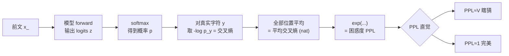
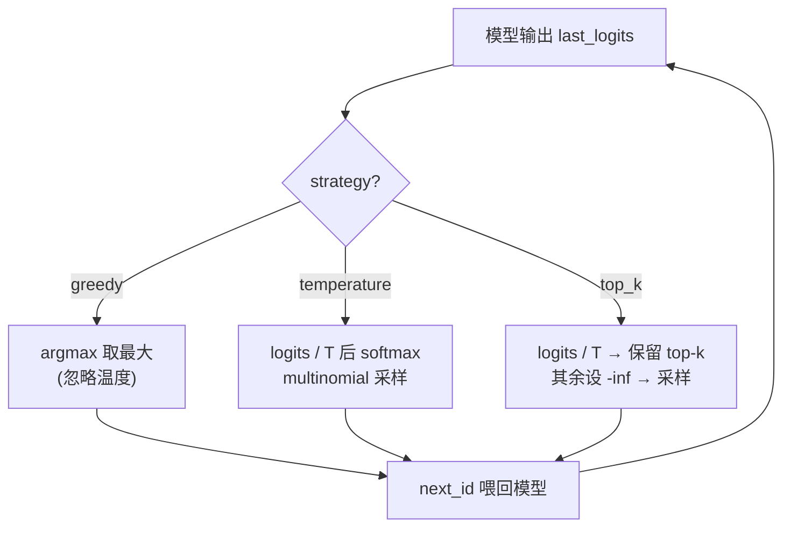

# 从零实现迷你 LLM 评测:困惑度 / 解码策略 / 下游准确率(手把手)

> 一句话导览:本篇带你逐行读懂 `eval_mini.py`——一个 CPU 几十秒就能跑通、零外部依赖的字符级语言模型(char-LM)评测脚本。学完你能掌握:
>
> 1. **困惑度 Perplexity 到底是什么**——为什么 `PPL = exp(平均交叉熵)`,以及它和"有效分支数""随机基线 ≈ 词表大小"的直觉联系;
> 2. **greedy / temperature / top-k 三种解码策略的本质区别**——同一个模型为什么换采样方式输出天差地别,以及评测生成为什么必须固定解码策略;
> 3. **内在指标(PPL)和外在指标(下游准确率)的关系**——为什么"PPL 低 ≠ 下游好用",以及怎么用一个 next-char 完形填空任务量化下游能力;
> 4. **一个完整评测脚本的骨架**——数据 / 词表 / 模型 / 前向 / 损失 / 训练循环 / 评估 / 解码 / 画图,怎么拼在一起。

本文严格基于 `eval_mini.py` 的真实实现来讲,所有函数名、变量名、默认超参都与代码一致,绝不臆造。

---

## 0. 前置知识与环境

**你需要会一点点:**

- Python 基础(函数、类、`for` 循环、列表推导);
- 知道"神经网络有参数、要训练、训练靠反向传播"这个大概念即可,不需要懂 LSTM 细节;
- 高中/大一数学:指数 `exp`、对数 `log`、概率求和为 1。其余我都在正文里推。

**装环境(只需要 PyTorch 和 numpy):**

```bash
pip install torch numpy
# 可选:装了就能多存一张 PPL 曲线图,不装也照样跑(脚本会自动降级为文本打印)
pip install matplotlib
```

脚本头部注释里写明:Python 3.13 / numpy 2.3 / torch 2.12(CPU)亲测可跑,约 14 秒。版本不必严格一致,torch ≥ 2.0、numpy ≥ 1.20 一般都行。

**怎么跑:**

```bash
cd practical-projects/14-llm-eval-mini
python eval_mini.py
```

就这一条命令。脚本固定用 CPU(`device = torch.device("cpu")`),不需要 GPU,不联网,不下数据集。

---

## 1. 问题背景:不用这个技术会怎样

假设你训了一个语言模型,或者从 HuggingFace 拉了个模型回来。**你怎么判断它"好不好"?**

新手最容易犯的错是:**只看几条生成样例,凭感觉打分。** 这会出三个大问题:

1. **不可量化、不可比较。** "我觉得这个比那个顺一点"——明天换个 prompt 结论就翻了,没法画曲线、没法回归测试、没法告诉别人"我的模型进步了 22 倍"。
2. **解码策略偷偷影响结论。** 同一个模型,你用贪心生成觉得很死板,换温度采样又觉得很有创意。如果不固定解码策略,你比的根本不是模型本身,而是"模型 + 一套随机采样配置"的混合物。
3. **内在好 ≠ 任务好。** 一个模型可能"语言流畅度"很高(困惑度低),但一到具体任务(算术、问答)就翻车。只看一种指标会得出片面结论。

**这个脚本就是把"科学评测一个语言模型"的最小骨架摆出来给你看:**

- 用 **困惑度(PPL)** 这个内在指标,量化"模型对真实文本有多意外",并画出它随训练下降的曲线——这就是"模型在学东西"的硬证据;
- 用 **三种解码策略对比**,让你亲眼看到采样方式如何改变输出,从而理解"评测生成必须固定解码";
- 用 **下游 next-char 准确率** 这个外在指标,补上"在具体任务上对不对"这一维度。

为什么用一个玩具 char-LM 而不是真模型?因为评测**原理**和模型规模无关。把模型缩到 ~2.7 万参数、CPU 秒级训练,就能把注意力全放在"指标本身怎么算"上,而不是被工程规模分散。

---

## 2. 核心原理详解

### 2.1 语言模型在算什么

字符级语言模型做的事:**给定前文 $x_{<t}$,预测下一个字符的概率分布 $P(x_t \mid x_{<t})$。**

比如看到 `"the ca"`,模型要对词表里每个字符(`a`、`b`、…、空格、`.`)给一个概率,理想情况下 `t` 的概率最高(因为语料里常出现 `the cat`)。

模型最后一层输出的是 **logits**(未归一化分数),经过 softmax 变成概率:

$$
P(x_t = j \mid x_{<t}) = \frac{e^{z_j}}{\sum_{k} e^{z_k}}
$$

其中 $z_j$ 是第 $j$ 个字符的 logit。

### 2.2 交叉熵:衡量"模型对真实下一个字符给了多大概率"

训练和评测的核心损失是 **交叉熵(cross-entropy)**。对单个位置,真实下一个字符是 $y$,模型给它的概率是 $p_y$,那么这一步的交叉熵就是:

$$
\text{CE} = -\log p_y
$$

直觉:

- 如果模型对真实字符给了 $p_y = 1$(完全确定且正确),则 $-\log 1 = 0$,损失为零;
- 如果模型给了 $p_y = 0.01$(几乎没料到),则 $-\log 0.01 \approx 4.6$,损失很大;
- 损失越小 = 模型对真实文本越"不意外"。

整段文本的平均交叉熵(单位是 **nat**,因为用自然对数):

$$
\overline{\text{CE}} = \frac{1}{N} \sum_{t=1}^{N} \big(-\log p_{y_t}\big)
$$

### 2.3 困惑度 PPL = exp(平均交叉熵)

困惑度就是把平均交叉熵取指数:

$$
\boxed{\;\text{PPL} = \exp\!\big(\overline{\text{CE}}\big)\;}
$$

**为什么取 exp?为什么这个数有意义?** 这是本篇最该讲透的一点。

把 $-\log p$ 还原回去:$\exp(-\log p) = 1/p$。所以 PPL 可以理解为 **"模型平均给真实字符的概率的倒数"**,也就是 **"有效分支数 / 平均要在多少个等可能选项里猜"**。

举两个极端:

- **随机乱猜**:模型对词表大小为 $V$ 的字符表均匀分配概率,每个字符 $p = 1/V$,则 $\text{CE} = -\log(1/V) = \log V$,于是 $\text{PPL} = \exp(\log V) = V$。

  **所以:随机模型的 PPL ≈ 词表大小。** 本脚本词表 $V=24$,未训练模型的 PPL 应该在 24 附近——这就是脚本里那句 `random-guess perplexity ~= vocab_size` 的来历,它是一个非常有用的"理智检查基线"。

- **完美确定**:模型每次都对真实字符给 $p \approx 1$,则 $\text{CE} \approx 0$,$\text{PPL} \approx 1$。PPL = 1 意味着"模型基本不犹豫,等效于只有 1 个分支"。

所以 PPL 的取值范围直觉是:**从 1(完美)到 V(瞎猜)**。脚本训练后 PPL 从 ~24 降到 ~1.07,意思是模型从"瞎猜"一路学到"几乎完全确定"。



### 2.4 三种解码策略:同一个模型,采样方式决定输出

训练好之后要"生成"文本时,模型每一步给出一个概率分布,**怎么从分布里挑下一个字符**就是"解码策略"。三种主流方式:

**(1) greedy(贪心):** 每步直接取概率最大的字符。

$$
x_t = \arg\max_j \, P(x_t = j \mid x_{<t})
$$

确定性最高、最"安全",但容易陷入重复(总是走最常见的路)。它**与温度无关**(取 argmax 不需要采样)。

**(2) temperature(温度采样):** 先把 logits 除以温度 $T$,再 softmax 后按概率采样。

$$
P_T(j) = \frac{e^{z_j / T}}{\sum_k e^{z_k / T}}
$$

- $T < 1$:相当于放大 logits 差距,分布变**尖锐**,更保守、更接近 greedy;
- $T > 1$:压缩 logits 差距,分布变**平坦**,更随机、更容易采到低概率字符(更"发散",也更容易出噪声);
- $T = 1$:就是原始分布。

**(3) top-k:** 在温度缩放后,只保留概率最高的 $k$ 个候选,其余概率置零(代码里置 $-\infty$ 再 softmax),然后在这 $k$ 个里采样。好处是**截断长尾**——既保留多样性,又不会采到那些明显胡来的极低概率字符。



### 2.5 内在 vs 外在指标

- **内在指标(intrinsic)**:只看模型对文本分布的拟合,如 PPL。不需要外部任务,但低 PPL 不保证任务好用。
- **外在指标(extrinsic / 下游)**:把模型放到具体任务上看对错,如本脚本的 next-char 准确率(给真实前缀让模型预测下一个字符,和语料真实字符比对)。真实世界里就是 MMLU / GSM8K / HumanEval 这类基准。

两者**应该同向改善**才能让人放心。脚本最后还专门检查 `(final_ppl < base_ppl) and (final_acc > base_acc)`,两者都改善才判 PASS。

---

## 3. 代码逐段精讲

下面按逻辑把 `eval_mini.py` 拆成若干段。每段先贴关键代码,再讲"在干什么、为什么这么写、对应原理哪一步"。

### 3.1 固定随机种子(可复现)

```python
SEED = 1234
random.seed(SEED)
np.random.seed(SEED)
torch.manual_seed(SEED)
```

**在干什么:** 把三个随机源(Python `random`、numpy、torch)全部固定到同一个种子 `1234`。

**为什么:** 评测的第一条铁律是**可复现**。模型初始化、batch 采样、温度采样、下游探针抽取全都带随机性。种子不固定,你今天 PPL=1.07、明天 PPL=1.12,就没法说"我改的东西到底有没有效"。

> 新手易困惑点:固定种子 ≠ 关掉随机性。温度采样仍然是随机采样,只是"随机的轨迹"被种子锁定了,所以每次运行结果一致。

### 3.2 构造 toy 语料

```python
def build_corpus():
    sentences = [
        "the cat sat on the mat. ",
        "the dog ran in the park. ",
        ...
        "i drink water in the morning. ",
    ]
    corpus = "".join(sentences) * 40
    return corpus
```

**在干什么:** 把 8 个**结构化**的小英文句子拼起来,再整体重复 40 遍,得到一段足够长、规律性很强的训练流。

**为什么这么写:** 语料越有规律,char-LM 越容易在几秒内学出"the 后面常接 cat/dog/sun""句号后接空格"这类转移规律,PPL 下降就越明显——这样才能直观演示"模型在学习"。这是教学取舍:真实评测当然用真实大语料。

> 新手易困惑点:句子末尾都有一个空格 `". "`,这是故意的,让模型也能学到"句号→空格→下一句开头"的边界规律。

### 3.3 字符级词表(tokenizer)

```python
class CharVocab:
    def __init__(self, text):
        chars = sorted(set(text))      # 排序保证可复现
        self.itos = chars              # id -> char
        self.stoi = {c: i for i, c in enumerate(chars)}  # char -> id
        self.size = len(chars)

    def encode(self, s):
        return [self.stoi[c] for c in s]

    def decode(self, ids):
        return "".join(self.itos[i] for i in ids)
```

**在干什么:** 建立"字符 ↔ 整数 id"的双向映射。`encode` 把字符串变成 id 列表(喂给模型),`decode` 把 id 列表变回字符串(读懂模型输出)。

**为什么 `sorted(set(text))`:** `set` 去重得到所有出现过的字符,`sorted` 保证每次运行字符顺序一致(否则 set 的顺序不确定,会破坏可复现)。`self.size` 就是**词表大小 V**——记住它,后面 PPL 的随机基线就是这个数。

> 新手易困惑点:这是**字符级**分词,一个字符就是一个 token。真实 LLM 用 BPE/SentencePiece 子词,但评测原理完全一样。

### 3.4 模型:单层 LSTM char-LM

```python
class TinyCharLM(nn.Module):
    def __init__(self, vocab_size, embed_dim=32, hidden_dim=64):
        super().__init__()
        self.embed = nn.Embedding(vocab_size, embed_dim)
        self.lstm = nn.LSTM(embed_dim, hidden_dim, batch_first=True)
        self.head = nn.Linear(hidden_dim, vocab_size)   # 输出每个字符的 logit

    def forward(self, x, hidden=None):
        emb = self.embed(x)                    # (B, T, E)
        out, hidden = self.lstm(emb, hidden)   # (B, T, H)
        logits = self.head(out)                # (B, T, V) 未归一化分数
        return logits, hidden
```

**在干什么:** 三层结构——

1. `embed`:把字符 id 查表成 `embed_dim=32` 维向量;
2. `lstm`:`hidden_dim=64` 的单层 LSTM,按时间步处理序列,记住前文;
3. `head`:一个线性层,把每个时间步的隐状态映射成 **V 个 logit**(对应词表每个字符的分数)。

**为什么返回 `hidden`:** LSTM 的隐状态可以跨调用传递。生成时一个字符一个字符往前推,把上一步的 `hidden` 接着用,就不用每步重算整个前缀(自回归的关键)。

**形状对照(B=batch、T=序列长、E=32、H=64、V=词表):** 输入 `(B,T)` → 嵌入 `(B,T,E)` → LSTM `(B,T,H)` → logits `(B,T,V)`。每个位置都输出"下一个字符的 V 维分数",这正是 PPL 计算所依赖的东西。

> 新手易困惑点:`forward` 返回的是 **logits(未归一化)**,不是概率。softmax 留到需要的地方(计算损失或采样)再做,这是 PyTorch 的惯例,数值更稳。

### 3.5 取训练 batch:输入与目标错开一位

```python
def get_batch(data_ids, seq_len, batch_size, device):
    n = len(data_ids)
    starts = torch.randint(0, n - seq_len - 1, (batch_size,))
    x = torch.stack([data_ids[s:s + seq_len] for s in starts])          # 输入
    y = torch.stack([data_ids[s + 1:s + 1 + seq_len] for s in starts])  # 目标 = 右移一位
    return x.to(device), y.to(device)
```

**在干什么:** 随机选 `batch_size` 个起点,每个截取长度 `seq_len` 的片段当输入 `x`;目标 `y` 是 `x` **整体右移一位**。

**为什么右移一位:** 这是 **next-token 预测** 的标准做法。位置 $t$ 的输入要预测位置 $t+1$ 的字符,所以 `y[t] = x[t+1]`。模型在每个位置学的都是"看到当前及之前,猜下一个"。

> 新手易困惑点:`randint(0, n - seq_len - 1, ...)` 的上界减去 `seq_len + 1` 是为了保证 `y` 取到 `s+seq_len` 时不越界。

### 3.6 困惑度评测(本篇核心)

```python
@torch.no_grad()
def evaluate_perplexity(model, data_ids, seq_len, device):
    model.eval()
    total_loss = 0.0
    total_tokens = 0
    step = seq_len
    for start in range(0, len(data_ids) - seq_len - 1, step):
        x = data_ids[start:start + seq_len].unsqueeze(0).to(device)
        y = data_ids[start + 1:start + 1 + seq_len].unsqueeze(0).to(device)
        logits, _ = model(x)
        loss = F.cross_entropy(
            logits.reshape(-1, logits.size(-1)), y.reshape(-1), reduction="sum"
        )
        total_loss += loss.item()
        total_tokens += y.numel()
    model.train()
    avg_ce = total_loss / max(total_tokens, 1)   # 平均交叉熵 (nat/token)
    ppl = math.exp(avg_ce)                        # 困惑度 = exp(平均交叉熵)
    return avg_ce, ppl
```

逐块对应原理:

- `@torch.no_grad()` + `model.eval()`:评测不需要梯度,关掉省内存提速;`eval()` 切到评测模式(本模型没 dropout/BN,但这是好习惯)。结束后 `model.train()` 切回训练模式。
- **不重叠遍历整段保留文本**(`step = seq_len`):把验证文本切成一段段不重叠的片段,逐段前向。不重叠是为了让每个 token 只被算一次,得到对平均交叉熵的稳定无偏估计。
- `F.cross_entropy(..., reduction="sum")`:**关键**。`cross_entropy` 内部会对 logits 做 softmax 再取 $-\log p_y$,正好就是 2.2 节的交叉熵。这里用 `reduction="sum"`(求和而非平均),是为了**按真实 token 数手动加权平均**——因为最后一段可能不满 `seq_len`,直接用各 batch 的 mean 再平均会算错权重。
- `logits.reshape(-1, V)` / `y.reshape(-1)`:把 `(B,T,V)` 摊平成 `(B*T, V)`,把 `(B,T)` 摊平成 `(B*T,)`,这是 `cross_entropy` 要求的形状(每行一个样本,一个标量标签)。
- `avg_ce = total_loss / total_tokens`:对应 $\overline{\text{CE}}$。
- `ppl = math.exp(avg_ce)`:**对应 $\text{PPL}=\exp(\overline{\text{CE}})$,这就是困惑度的定义在代码里的落地。**

> 新手易困惑点:为什么 PPL 用 `math.exp` 而不是 `2 ** ...`?因为这里交叉熵用的是自然对数(nat),exp 才能正确还原。如果换成 $\log_2$(bit),就要用 `2 ** avg_ce`。脚本统一用 nat + exp,自洽即可。

### 3.7 解码:greedy / temperature / top-k

```python
@torch.no_grad()
def generate(model, vocab, prompt, steps, device,
             strategy="greedy", temperature=1.0, top_k=None):
    model.eval()
    ids = torch.tensor(vocab.encode(prompt), dtype=torch.long, device=device).unsqueeze(0)
    hidden = None
    logits, hidden = model(ids, hidden)     # 先把 prompt 喂进去
    last_logits = logits[:, -1, :]          # 最后一个位置的 logits

    out_ids = []
    for _ in range(steps):
        if strategy == "greedy":
            next_id = torch.argmax(last_logits, dim=-1, keepdim=True)
        else:
            scaled = last_logits / max(temperature, 1e-6)   # 温度缩放
            if strategy == "top_k" and top_k is not None:
                v, _ = torch.topk(scaled, min(top_k, scaled.size(-1)))
                thresh = v[:, -1].unsqueeze(-1)
                scaled = torch.where(scaled < thresh,
                                     torch.full_like(scaled, float("-inf")),
                                     scaled)
            probs = F.softmax(scaled, dim=-1)
            next_id = torch.multinomial(probs, num_samples=1)  # 按概率采样
        out_ids.append(next_id.item())
        logits, hidden = model(next_id, hidden)   # 把新字符喂回去,推进自回归
        last_logits = logits[:, -1, :]

    model.train()
    return prompt + vocab.decode(out_ids)
```

逐块对应原理:

- **先喂 prompt**:`model(ids, hidden)` 把整个 prompt 一次性跑完,拿到 `hidden`(记忆)和 `last_logits`(对下一个字符的预测)。
- **自回归循环 `steps` 次**:每生成一个字符,就把它 `model(next_id, hidden)` 喂回去,带着上一步的 `hidden`,只跑这一个新字符——这就是"自回归"的高效写法(不重算前缀)。
- **greedy**:`torch.argmax`,直接取最大 logit。对应 2.4(1),与温度无关。
- **温度缩放**:`scaled = last_logits / max(temperature, 1e-6)`。除以 `max(T, 1e-6)` 是为了防止 `T=0` 除零。对应 2.4(2)的 $z_j/T$。
- **top-k**:`torch.topk` 取最大的 k 个,`v[:, -1]` 是第 k 大的值作为阈值 `thresh`,凡是小于阈值的 logit 用 `torch.where` 设成 `-inf`。softmax 后 `-inf` → 概率 0,于是只在 top-k 里采样。对应 2.4(3)。
- **采样**:`F.softmax` 转概率,`torch.multinomial` 按概率抽一个。这是"采样"区别于"贪心"的地方。
- 返回 `prompt + 生成`,完整可读。

> 新手易困惑点:`top_k` 分支也走了温度缩放,所以脚本里 `top_k=5, temperature=1.0` 是"先按原始分布、再截断 top-5 采样"。温度和 top-k 是可以叠加的两个旋钮。

### 3.8 下游 next-char 准确率(外在指标)

```python
@torch.no_grad()
def downstream_next_char_accuracy(model, vocab, corpus, device, num_probes=200, prefix_len=12):
    model.eval()
    rng = random.Random(SEED)   # 独立 RNG,保证探针集合可复现
    correct = 0
    total = 0
    for _ in range(num_probes):
        start = rng.randint(0, len(corpus) - prefix_len - 2)
        prefix = corpus[start:start + prefix_len]
        gold_next = corpus[start + prefix_len]   # 真实的下一个字符
        ids = torch.tensor(vocab.encode(prefix), dtype=torch.long, device=device).unsqueeze(0)
        logits, _ = model(ids)
        pred_id = torch.argmax(logits[:, -1, :], dim=-1).item()
        if vocab.itos[pred_id] == gold_next:
            correct += 1
        total += 1
    model.train()
    return correct / max(total, 1)
```

**在干什么:** 抽 `num_probes=200` 个真实前缀(每个长 `prefix_len=12`),让模型用 **greedy(argmax)** 预测第 13 个字符,和语料真实字符 `gold_next` 比对,算准确率。

**为什么这么设计:**

- **用独立 `random.Random(SEED)`**:确保每次评测抽到的是**同一批探针**,准确率才可比(否则抽样波动会污染结论)。
- **用 greedy 预测**:外在准确率衡量"模型最可能给出的答案对不对",所以取 argmax,不引入采样随机性。
- 这是**完形填空式**的外在指标:它直接量化"任务对错",补上 PPL 看不到的维度。

> 新手易困惑点:这个 toy 任务的"答案"其实来自训练语料本身,所以模型学得好时准确率会冲到 1.0。真实下游评测(MMLU 等)用的是模型没见过的题,难度高得多;这里只为演示"外在指标"的概念。

### 3.9 训练循环:边训边评

```python
def train(model, train_ids, val_ids, vocab, corpus, device,
          steps=600, seq_len=48, batch_size=32, lr=3e-3, log_every=100):
    opt = torch.optim.Adam(model.parameters(), lr=lr)
    history = []

    # 训练前先评一次:随机初始化基线
    base_ce, base_ppl = evaluate_perplexity(model, val_ids, seq_len, device)
    base_acc = downstream_next_char_accuracy(model, vocab, corpus, device)
    history.append((0, float("nan"), base_ce, base_ppl, base_acc))
    print(...)

    for step in range(1, steps + 1):
        x, y = get_batch(train_ids, seq_len, batch_size, device)
        logits, _ = model(x)
        loss = F.cross_entropy(logits.reshape(-1, logits.size(-1)), y.reshape(-1))
        opt.zero_grad()
        loss.backward()
        torch.nn.utils.clip_grad_norm_(model.parameters(), 1.0)   # 梯度裁剪
        opt.step()

        if step % log_every == 0 or step == steps:
            val_ce, val_ppl = evaluate_perplexity(model, val_ids, seq_len, device)
            acc = downstream_next_char_accuracy(model, vocab, corpus, device)
            history.append((step, loss.item(), val_ce, val_ppl, acc))
            print(...)
    return history
```

逐块对应原理:

- **训练前先评一次(step=0)**:这就是"随机初始化基线",PPL 应该 ≈ 词表大小(24),下游准确率应该 ≈ 1/V(瞎猜)。后面所有改善都拿它当参照。`train_loss` 这一项填 `float("nan")`(还没训,没有损失)。
- **训练损失 = `F.cross_entropy`(默认 mean)**:注意——**训练用的损失和 PPL 算的是同一个交叉熵**!训练就是在最小化交叉熵,而 PPL 就是 `exp(交叉熵)`,所以"降低训练损失"和"降低 PPL"是一回事。这是把两个看似无关的概念打通的关键点。
- `opt.zero_grad()` → `loss.backward()` → `opt.step()`:标准三步,清梯度、反传、更新参数。
- **`clip_grad_norm_(..., 1.0)`**:梯度裁剪,把梯度范数限制在 1.0,防止 LSTM 训练时梯度爆炸,是 RNN 类模型的稳定性常用技巧。
- **每 `log_every=100` 步评一次**:记录 `(step, train_loss, val_ce, val_ppl, acc)` 到 `history`,这就是后面画 PPL 曲线的数据源。

**默认超参一览(来自函数签名,务必记住):** `steps=600`、`seq_len=48`、`batch_size=32`、`lr=3e-3`、`log_every=100`;模型 `embed_dim=32`、`hidden_dim=64`。

### 3.10 画图(可选,绝不崩)

```python
def plot_ppl(history, out_path="ppl_curve.png"):
    steps = [h[0] for h in history]
    ppls = [h[3] for h in history]
    try:
        import matplotlib
        matplotlib.use("Agg")   # 无显示环境后端,纯存文件
        import matplotlib.pyplot as plt
        ...
        plt.savefig(out_path, dpi=120)
        print("[plot] saved perplexity curve to %s" % out_path)
    except Exception as e:
        print("[plot] matplotlib unavailable (%s); printing PPL as text instead:" % type(e).__name__)
        print("[plot] step -> ppl: " + ", ".join("%d:%.1f" % (s, p) for s, p in zip(steps, ppls)))
```

**在干什么:** 把 `history` 里的 `(step, ppl)` 画成曲线存成 `ppl_curve.png`。`matplotlib.use("Agg")` 用无界面后端,服务器/CI 上也能存图。

**为什么用 try/except:** 没装 matplotlib 也不能让脚本崩。`except` 分支降级成纯文本打印 PPL 列表。这是教学脚本的稳健性设计——**评测工具不应该因为画图依赖缺失就报错**。

### 3.11 main:把全流程串起来

`main()` 依次:打印标题 → 建语料/词表/编码 → 切 90% 训练、10% 验证 → 打印数据统计和"随机基线 = 词表大小" → 建模型、打印参数量 → `train(...)` → 打印 PPL 与下游准确率的 baseline→final 对比 → `plot_ppl` → 用同一 prompt `"the "` 跑 4 种解码对比 → 最后判定 `success = (final_ppl < base_ppl) and (final_acc > base_acc)`,两者都改善才 PASS。

其中数据切分:

```python
n_train = int(len(data) * 0.9)
train_ids, val_ids = data[:n_train], data[n_train:]
```

90/10 切分,验证集不参与训练,PPL 才衡量的是"对没直接训过的文本"的拟合。

---

## 4. 跑起来 + 逐行读懂输出

运行:

```bash
python eval_mini.py
```

预期输出(README 中的真实跑通摘录):

```
[data] corpus_chars=8520  vocab_size=24  train_tokens=7668  val_tokens=852
[data] random-guess perplexity ~= vocab_size = 24 (a useful sanity baseline)
[model] TinyCharLM params=27416
------------------------------------------------------------------------
[eval] step=   0  val_ce=3.1840  val_ppl=   24.14  downstream_acc=0.025  (baseline)
[eval] step= 100  train_loss=0.4241  val_ce=0.4092  val_ppl=    1.51  downstream_acc=0.990
[eval] step= 300  train_loss=0.0847  val_ce=0.0940  val_ppl=    1.10  downstream_acc=1.000
[eval] step= 600  train_loss=0.0686  val_ce=0.0712  val_ppl=    1.07  downstream_acc=1.000
------------------------------------------------------------------------
[result] perplexity: baseline=24.14 -> final=1.07  (22.5x lower)
[result] downstream next-char accuracy: baseline=0.025 -> final=1.000
------------------------------------------------------------------------
[decoding] same model, same prompt, different decoding strategies:
  greedy          : 'the mat. the dog ran in the park. a bird fle'
  temperature=0.5 : 'the lake. the sun is bright today. she likes'
  temperature=1.3 : 'the sun is bright today. she likes to rdat g'
  top_k=5         : 'the old town. i drink water in the morning. '
------------------------------------------------------------------------
[summary] perplexity dropped: True | downstream improved: True
[summary] OVERALL: PASS - the model measurably learned
```

逐条解释每个数字:

- **`corpus_chars=8520`**:8 句 ×40 遍拼出来的总字符数。**`vocab_size=24`**:语料里出现过 24 种不同字符(26 个字母用到一部分 + 空格 + 句号)。**`train_tokens=7668 / val_tokens=852`**:90/10 切分。
- **`random-guess perplexity ~= vocab_size = 24`**:理论随机基线。对应 2.3 节"瞎猜时 PPL ≈ V"。
- **`TinyCharLM params=27416`**:模型总参数量(嵌入 + LSTM + 线性头)。~2.7 万,极小。
- **`step=0 ... val_ppl=24.14`**:训练前基线。**几乎正好等于 24**,完美验证"随机模型 PPL ≈ 词表大小"。此时 `downstream_acc=0.025` ≈ 1/24,也就是"瞎猜"水平。
- **`step=100 ... val_ppl=1.51, downstream_acc=0.990`**:才训 100 步,PPL 就从 24 暴跌到 1.51,下游准确率冲到 99%。因为语料规律性极强,模型很快学会。
- **`step=300 / 600 ... val_ppl=1.10 / 1.07, acc=1.000`**:继续逼近 PPL=1(完美确定),下游打满 100%。注意 `train_loss` 和 `val_ce` 都在下降且彼此接近——**训练损失就是交叉熵,PPL 就是它的 exp**,所以它们同步下降。
- **`perplexity: baseline=24.14 -> final=1.07 (22.5x lower)`**:从"瞎猜"到"几乎完全确定",PPL 降了 22.5 倍。这是"模型在学东西"的硬证据。
- **`downstream ... 0.025 -> 1.000`**:内在指标和外在指标**同向改善**,可以放心。
- **解码四行(关键,逐行看)**:同一个模型、同一个 prompt `"the "`,采样方式不同——
  - `greedy`:确定性输出,吐出连贯的语料短语,但容易走最常见的路;
  - `temperature=0.5`:低温更保守,接近 greedy 的连贯度;
  - `temperature=1.3`:**出现了 `rdat g` 这种噪声!** 高温让分布变平,采到了低概率字符——这就是"温度越高越发散"的直观证据;
  - `top_k=5`:截断长尾后采样,既有多样性又保持连贯,没有明显噪声。
- **`OVERALL: PASS`**:`final_ppl < base_ppl` 且 `final_acc > base_acc` 都为 True,判定模型确实学到了东西。

如果装了 matplotlib,还会多一行 `[plot] saved perplexity curve to ppl_curve.png`,生成一张 PPL 随步数下降的曲线图。

---

## 5. 动手改造(练习)

由易到难,每个都给预期现象和提示。

**练习 1(易):把 PPL 单位从 nat 换成 bit。** 在 `evaluate_perplexity` 里把 `math.exp(avg_ce)` 改成 `2 ** (avg_ce / math.log(2))`(等价于以 2 为底)。

- 预期:数值会变,但下降趋势完全一样。提示:nat 和 bit 只差一个常数因子 $\log 2$,exp/2 的底要配套换。

**练习 2(易):调温度看发散程度。** 在 `main` 里把 `temperature=1.3` 改成 `temperature=2.0`,再加一行 `temperature=0.2`。

- 预期:`2.0` 噪声更多、更乱;`0.2` 几乎和 greedy 一样死板。提示:温度就是分布尖锐度的旋钮。

**练习 3(中):改 top-k 的 k。** 把 `top_k=5` 改成 `top_k=1` 和 `top_k=20` 各跑一次。

- 预期:`top_k=1` 退化成 greedy(只剩最大那个);`top_k=20`(接近词表 24)≈ 纯温度采样。提示:k 越小越保守,k≥V 就等于不截断。

**练习 4(中):减少训练步数看欠拟合。** 把 `train(...)` 调用里默认的 `steps=600` 改成 `steps=50`(在 `train` 签名或调用处传参)。

- 预期:final PPL 不会降到 1.07 附近,下游准确率也到不了 1.0。提示:这演示"训练不足 → 指标停在半路",正是评测能捕捉到的信号。

**练习 5(难):换更随机的语料,观察 PPL 下界抬高。** 把 `build_corpus` 里的句子换成更长、更多样、规律更弱的文本(或干脆随机字符串)。

- 预期:final PPL 不再接近 1,而会停在一个更高的值——因为**真实文本本身有不可消除的不确定性(熵)**,PPL 的下界不是 1 而是文本的真实熵。提示:这正解释了为什么真实 LLM 的 PPL 永远到不了 1。

---

## 6. 常见坑与排错

- **`ModuleNotFoundError: No module named 'torch'`**:没装 PyTorch,`pip install torch`。numpy 同理。
- **没装 matplotlib 报错?** 不会。脚本 `plot_ppl` 用 try/except 自动降级为文本打印,只会少一张图。
- **控制台出现乱码 / `UnicodeEncodeError`(Windows)**:脚本所有 `print` 故意只用 ASCII,中文只在注释里,所以正常不会乱码;若你自己改了 print 加了中文,在 GBK 控制台可能报错,改回 ASCII 或设 `PYTHONUTF8=1`。
- **每次结果不一样?** 检查是不是动了 `SEED` 或删了 `random.seed/np.random.seed/torch.manual_seed` 三行。三个随机源都要固定。
- **PPL 不下降 / 一直在 24 附近**:多半是学习率 `lr` 被改得太小,或 `steps` 太少,或不小心把目标 `y` 也改成没右移。检查 `get_batch` 里 `y` 是否仍是 `x` 右移一位。
- **PPL 算出来比词表还大很多**:通常是交叉熵的底和 exp 不配套(比如用了 $\log_2$ 却仍 `math.exp`),按练习 1 的方式确保底一致。
- **温度采样报错 `probability tensor contains inf/nan`**:`temperature` 设成 0 时会触发,脚本已用 `max(temperature, 1e-6)` 防住;若你绕过了这层保护就会复现。
- **`downstream_acc` 一直很低但 PPL 很低**:正常情况下两者应同向;若分叉,先确认下游探针用的 `vocab` / `corpus` 和训练一致,且 `rng = random.Random(SEED)` 没被改成无种子。

---

## 7. 一图速查 / 知识卡片

**核心公式**

| 概念 | 公式 | 直觉 |
| --- | --- | --- |
| 单步交叉熵 | $\text{CE} = -\log p_y$ | 真实字符给的概率越低,损失越大 |
| 平均交叉熵 | $\overline{\text{CE}} = \frac{1}{N}\sum_t -\log p_{y_t}$ | 整段文本的平均"意外度"(nat) |
| 困惑度 | $\text{PPL} = \exp(\overline{\text{CE}})$ | 等效有效分支数,1=完美、V=瞎猜 |
| 随机基线 | $\text{PPL} \approx V$ | 均匀分布时 PPL = 词表大小 |
| softmax | $p_j = e^{z_j}/\sum_k e^{z_k}$ | logits → 概率 |
| 温度采样 | $p_j \propto e^{z_j/T}$ | T<1 尖锐保守,T>1 平坦发散 |

**三种解码对比**

| 策略 | 怎么选 | 特点 | 受温度影响 |
| --- | --- | --- | --- |
| greedy | `argmax` | 确定、稳、易重复 | 否 |
| temperature | `logits/T` 后采样 | T 调发散程度 | 是 |
| top-k | 留 top-k 再采样 | 截断长尾、平衡质量与多样性 | 是(可叠加) |

**默认超参速查(来自真实代码)**

| 参数 | 值 | 出处 |
| --- | --- | --- |
| `SEED` | 1234 | 全局 |
| `embed_dim` / `hidden_dim` | 32 / 64 | `TinyCharLM` |
| `steps` | 600 | `train` |
| `seq_len` | 48 | `train` |
| `batch_size` | 32 | `train` |
| `lr` | 3e-3(Adam) | `train` |
| `log_every` | 100 | `train` |
| grad clip | 1.0 | `train` |
| `num_probes` / `prefix_len` | 200 / 12 | 下游准确率 |
| 解码 steps | 40 | `main` |
| top_k | 5 | `main` |

**评测三件套清单**

- [ ] 内在指标:PPL = exp(交叉熵),越低越好,基线 ≈ 词表大小
- [ ] 生成评测:固定解码策略(greedy / temperature / top-k)再比较
- [ ] 外在指标:下游 next-char 准确率,衡量任务对错
- [ ] 可复现:固定所有随机种子
- [ ] PASS 判据:PPL 下降 **且** 下游准确率上升

---

## 8. 延伸阅读

**本仓库相关文档**

- 评测专题目录:[`../../llm-eval`](../../llm-eval) —— 讲 LLM 评测体系与方法论,本项目是它"可跑"的极简补充。
- 本目录现有简介:[`./README.md`](./README.md) —— 含与真实评测工程差异的对照表(模型规模、分词、基准、解码 top-p/beam 等)。
- 推理相关:[`../../llm-inference`](../../llm-inference) —— 解码策略在真实推理引擎里的工程实现。

**经典论文 / 社区资源**

- [EleutherAI lm-evaluation-harness](https://github.com/EleutherAI/lm-evaluation-harness) —— 业界最常用的开源 LLM 评测框架,支持数百个标准任务;本项目可视为它"困惑度 + 解码 + 任务准确率"思路的极简手写版。
- Holtzman et al., *The Curious Case of Neural Text Degeneration*(2019)—— top-p / nucleus sampling 的来源,讲清了为什么 greedy 会退化、采样为什么需要截断长尾。
- 标准基准:MMLU、GSM8K、HumanEval、C-Eval —— 真实下游评测用的外在任务,本脚本的 next-char 准确率是它们的概念雏形。

> 一句话收尾:本项目让你亲手摸到"评测一个模型"的最小骨架——PPL 怎么从交叉熵算出来、解码策略怎么改变生成、内在指标和外在指标如何对应。把这套直觉迁移到真实框架(lm-evaluation-harness),你就能看懂大模型评测报告里每一个数字的含义。
