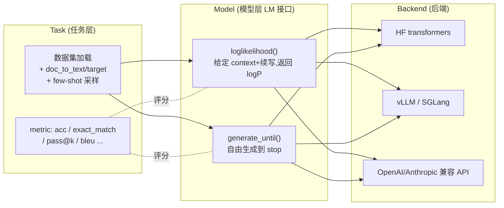

# LLM 评测 · 进阶与生产实践

> 本文承接 `eval_mini.py` 与 `手把手教学.md`。toy 脚本把"评测一个语言模型"的**最小骨架**讲透了:PPL = exp(平均交叉熵)、greedy/temperature/top-k 三种解码、内在指标(PPL)与外在指标(下游准确率)的对应。本文做的是另一件事——**把这套玩具直觉接到业界真实的评测系统上**:lm-evaluation-harness 怎么跑数百个任务、MMLU/GSM8K/HumanEval/MT-Bench 各自评的是什么、LLM-as-judge 的偏置从哪来、pass@k 怎么算才无偏、长度偏置/位置偏置在线上怎么咬人。
>
> 阅读约定:术语保留英文;不编造精确 benchmark 数字,量级用"约/数量级"表述;凡涉及本仓库已有深度文档,给相对路径。

---

## 0. 本项目 toy 与生产的差距

`eval_mini.py` 是一个 ~2.7 万参数的 char-LM,CPU 十几秒跑完,它**故意**把工程规模、真实数据、判分复杂度全部砍掉,只留评测指标本身。下表逐项列出"toy 简化了什么 / 生产必须补什么",这也是本文后续章节的展开提纲。

| 维度 | 本 toy 实现 | 生产必须补什么 | 为什么 |
| --- | --- | --- | --- |
| 模型 | 单层 LSTM char-LM,CPU | 7B–700B Transformer,多卡/多机推理 | 评测吞吐成为瓶颈,需推理引擎(vLLM/SGLang)而非裸 `model()` |
| tokenizer | 字符级,词表 24 | BPE/SentencePiece,词表 3万–25万 | PPL 跨模型不可比的根因之一就是 tokenizer 不同(见 §3) |
| 数据集 | 8 句 ×40 遍,自造 | 标准基准 + 私有 holdout,防污染 | 公开基准被训练集污染会让分数虚高,要去重/canary/私测 |
| 内在指标 | PPL on 验证集 | byte-level PPL / bits-per-byte(BPB),或干脆不用 PPL 比模型 | 不同 tokenizer 下 token 级 PPL 无法横比 |
| 任务格式 | next-char 完形填空 | MC(loglikelihood)、生成 + 抽取答案、代码执行、judge | 真实任务 4 大判分范式,见 §1 |
| 下游样本 | 来自训练语料(必然 1.0) | 模型未见过的题 + few-shot prompt | toy 准确率冲到 1.0 是因为"答案在训练集里",真实评测必须 held-out |
| 解码 | greedy/temperature/top-k | + top-p(nucleus)、beam、min-p、固定 seed | 评测生成必须锁死解码配置,否则比的是"模型+采样" |
| few-shot/prompt | 无 | n-shot、prompt 模板、chat template、system prompt | prompt 微小变化能让 MMLU 波动数个百分点 |
| 判分 | argmax 字符比对 | exact-match / 正则抽取 / 代码沙箱执行 / LLM judge | 自由生成答案需要鲁棒的答案抽取,是头号噪声源 |
| 可复现 | 固定 3 个 seed | + 框架版本、prompt 版本、采样参数、batch 顺序全部固定并记录 | "复现别人的分数"在业界是出了名的难 |
| 规模/工程 | 单进程 | 批量、缓存、断点续跑、并发请求、成本控制 | 一次全量 eval 可能跑几小时、几千万 token |

一句话:**toy 教会你"一个指标怎么算",生产要解决的是"几十个指标、几十万道题、几十个模型,如何算得快、算得准、算得可复现、还防得住作弊"。**

---

## 1. 业界系统怎么做

### 1.1 lm-evaluation-harness:事实标准的评测框架

EleutherAI 的 **lm-evaluation-harness**(简称 lm-eval / harness)是开源界最广泛使用的评测框架,Hugging Face Open LLM Leaderboard 早期就构建在它之上。它把 toy 里手写的"喂数据 → 前向 → 算指标"抽象成可插拔的三层:

关键设计与取舍:

- **两种请求原语**——这是 harness 的灵魂,直接对应 toy 里两类评测:
  - `loglikelihood`:给一段 context 和一个候选续写,返回该续写的对数似然(以及"是否 greedy 命中")。**多选题(MMLU)就是对每个选项算 logP,取最大者**——这本质上是 toy 里 `evaluate_perplexity` 算 `-log p_y` 的复用,只不过是在"候选答案"粒度上比较。
  - `generate_until`:从 prompt 自由生成,直到遇到 stop 串。**GSM8K、HumanEval 这类需要模型"写出来"的任务走这条路**——对应 toy 里的 `generate()`。
- **Task 用配置/YAML 描述**:`doc_to_text`(题面模板)、`doc_to_target`(答案)、`few_shot`、`metric_list`。新增一个 benchmark 不用改框架核心,只写一个 task 配置。
- **后端解耦**:同一套 task 可跑 HF、vLLM、SGLang 或远程 API。**生产里几乎一定用 vLLM/SGLang 后端**,否则 70B 模型跑完 MMLU(约 1.4 万题 ×4 选项 loglikelihood)会慢到不可接受。
- **可复现承诺**:harness 把 prompt 版本、few-shot 顺序、框架 commit 都纳入"复现要素"。社区惨痛教训:同一个模型在不同 prompt 模板下 MMLU 能差几个点,所以"报分必须报 harness 版本 + task 版本"。

国内/其他常见框架同源同构:**OpenCompass**(本仓库有 `../../llm-eval/opencompass.md`)、**EvalScope**(`../../llm-eval/EvalScope.md`)、HELM。它们的抽象都是"Task × Model 接口 × Backend",理解了 harness 就能迁移。

### 1.2 四大基准评的是不同能力维度

| 基准 | 任务类型 | 判分范式 | 主要风险/噪声 |
| --- | --- | --- | --- |
| **MMLU** | 57 学科多选题(4 选 1) | loglikelihood 取 argmax,或生成后抽取字母 | prompt 格式敏感;污染;"A/B/C/D"位置偏置 |
| **GSM8K** | 小学数学应用题(链式推理) | 生成 CoT → 正则抽末尾数字 → exact match | 抽取脆弱;少打一步全错;few-shot 模板影响大 |
| **HumanEval** | Python 函数补全 | **执行单元测试**,pass@k | 沙箱安全;flaky 测试;只测 164 题方差大 |
| **MT-Bench** | 多轮开放对话(80 题,8 类) | **LLM-as-judge** 打 1–10 分 | judge 偏置(长度/位置/自偏好) |

直觉对应:**MMLU/GSM8K/HumanEval 是 toy 里"下游准确率"的真实版本**(客观、可自动判);**MT-Bench 是 toy 里完全没有的维度**——开放生成质量,没有标准答案,只能靠模型/人来判。

### 1.3 判分范式决定了系统复杂度

按判分难度递增,生产系统要逐级加东西:

1. **loglikelihood 比较**(MMLU 多选):最干净,只需前向,无生成、无抽取。harness 默认走这条,稳。
2. **生成 + 规则抽取**(GSM8K):要自由生成,再用正则/字符串规则从一堆 CoT 里抠出答案。**抽取规则是头号 bug 源**——同一个模型答对了,正则没匹配上就判错。
3. **生成 + 代码执行**(HumanEval/MBPP):要把生成的代码丢进**隔离沙箱**跑单元测试。涉及安全(防恶意代码)、超时、依赖隔离。
4. **生成 + LLM/人判**(MT-Bench/Arena):要再调一个强模型当裁判,或挂人工标注。最贵、最主观、偏置最多。

---

## 2. 关键变体与优化

### 2.1 LLM-as-judge:用模型当裁判

**解决什么**:MT-Bench、Arena-Hard、AlpacaEval 这类开放生成任务没有 gold answer,人工评太贵太慢。用一个强模型(GPT-4 类)按 rubric 打分,能以 ~低成本逼近人类判断的相关性。两种用法:

- **single-answer grading**:给裁判一道题 + 一个回答,打 1–10 分。
- **pairwise comparison**:给两份回答,判 A 胜 / B 胜 / 平。Chatbot Arena、Arena-Hard 用这种,再用 Elo/Bradley-Terry 聚合成排行榜。

**代价与坑**(这是本主题最该讲透的):

| 偏置 | 现象 | 缓解 |
| --- | --- | --- |
| **位置偏置 position bias** | 裁判倾向选"第一个"(或某个固定位置)的回答 | 交换 A/B 各判一次取平均;或要求两序都胜才算胜 |
| **长度偏置 length/verbosity bias** | 越长的回答越容易被判高分,哪怕没更对 | 长度去偏(如 AlpacaEval 2.0 的 length-controlled win rate);rubric 明确"不因长度加分" |
| **自偏好 self-preference** | 裁判偏爱与自己风格相近/自己生成的回答 | 换不同家族的裁判;多裁判投票 |
| **格式偏置** | markdown、列表、礼貌语气被偏好 | rubric 约束;对照实验 |

**长度偏置**值得单独说:它和 toy 里"温度越高越发散"是两类不同的偏置,但同样是"评测信号被无关因素污染"。RLHF 训出来的模型常学会"写更长"来骗高分(reward hacking 的一种)。AlpacaEval 2.0 的 **length-controlled win rate** 用回归把长度作为协变量回归掉,显著提升与人类排名的相关性——这是生产级 judge 的标配修正。

### 2.2 pass@k:代码评测的无偏估计

**解决什么**:HumanEval 评"模型能不能写对代码"。直接"采 1 个看对不对"(pass@1)方差大;实际我们关心"采 k 个里至少 1 个对"的概率 pass@k。

朴素做法(采 k 个直接算比例)是**有偏且高方差**的。Codex 论文给出的无偏估计:对每题采 $n \ge k$ 个样本,数出通过数 $c$,则

$$
\text{pass@}k = \mathbb{E}_{\text{problems}}\left[\,1 - \frac{\binom{n-c}{k}}{\binom{n}{k}}\,\right]
$$

直觉:$\binom{n-c}{k}/\binom{n}{k}$ 是"抽 k 个全是失败样本"的概率,1 减去它就是"至少 1 个通过"。工程上为数值稳定用连乘 $\prod_{i=n-c+1}^{n}(1 - k/i)$ 而非直接算组合数。

**代价**:要采 $n$(常 ≥ 100)个样本才能稳定估 pass@k,**采样成本 ×n**;且每个样本都要进沙箱执行。这是 toy 里 `generate()` 只跑一遍所完全没有的开销维度。

### 2.3 PPL 在生产里的退化与替代

toy 把 PPL 当核心内在指标,但**生产里 PPL 几乎不用来横比不同模型**,原因:

- **tokenizer 不同 → token 级 PPL 不可比**。词表大、压缩率高的 tokenizer 天然 PPL 更低,并不代表模型更好。
- 修正:用 **bits-per-byte(BPB)** 或 byte-level PPL——把交叉熵按"原始字节数"而非"token 数"归一化,消除 tokenizer 差异。公式与 toy 的 `exp(avg_ce)` 同源,只是把分母从 token 数换成 byte 数(并换底为 2)。

PPL 仍有用的场景:**同一模型同一 tokenizer 下**监控训练(toy 的曲线就是这个用途)、量化前后掉点评估(见 `../../llm-compression`)、long-context 困惑度衰减分析。

### 2.4 few-shot / prompt 模板:评测的隐藏自由度

toy 没有 prompt 概念(直接喂前缀)。真实评测里 **n-shot 数量、demo 顺序、模板措辞、chat template** 都是会显著移动分数的旋钮:

- MMLU 常用 5-shot;GSM8K 常用 8-shot CoT;HumanEval 用 0-shot。
- 同一模型换 prompt 模板,MMLU 可波动数个百分点——所以**报分必须连 prompt 配置一起报**,否则不可比。
- chat 模型必须套对 chat template(system/user/assistant 标记),套错会大幅掉分。

### 2.5 数据污染检测(contamination)

公开基准发布越久,越可能进入后续模型的训练集,导致分数虚高。生产对策:

- **n-gram 重叠检测 / 子串匹配**:扫训练集与 benchmark 的重叠。
- **canary string**:基准里埋特定字符串,若模型能续写出来即暴露污染。
- **私有 held-out 测试集 / 动态出题**:如 LiveBench、定期刷新题库;闭源私测集。

这是 toy 里"下游样本来自训练语料所以必然 1.0"问题的工业版反面教材——**评测样本必须是模型没见过的**。

---

## 3. 真实工程权衡与坑

### 3.1 吞吐 / 延迟 / 成本

- **评测是推理密集型,不是训练**。一次全量 multi-benchmark eval 可能要跑数千万到上亿 token。**后端必须用 vLLM/SGLang**(continuous batching、PagedAttention),裸 HF `generate` 慢一个数量级。参考 `../../llm-inference/vllm`、`../../llm-inference/sglang`。
- **loglikelihood 任务**(MMLU)只前向不生成,吞吐高;**生成任务**(GSM8K CoT、pass@k 采样)要自回归解码,慢得多,是耗时大头。pass@k 还要 ×n 倍采样。
- **judge 评测**额外叠加裁判模型的推理成本(常是更贵的大模型/API),且要交换位置判 2 遍去偏 → 再 ×2。
- 成本优化:结果**缓存**(同 prompt 不重复跑)、按任务分级(便宜的客观题先筛,贵的 judge 后跑)、合理 batch、控制 `max_new_tokens`。

### 3.2 答案抽取——最隐蔽的精度杀手

线上最常见的"模型其实答对了却判错"几乎都出在抽取层:

- GSM8K 正则只抓最后一个数字,模型把答案写在中间就漏;模型输出 `$1,000` 带逗号/货币符没归一化就 mismatch。
- MMLU 生成式判分时模型回 "The answer is B because..." 而抽取只认开头单字母。
- 修正:多模板抽取 + 规范化(去逗号/空格/大小写)+ 对失败样本人工抽检。**判分脆弱性会系统性低估模型**,排查 eval 异常时先怀疑抽取,再怀疑模型。

### 3.3 可复现性地狱

复现别人公布的分数在业界出了名地难,根因是自由度太多:框架版本、task 版本、prompt 模板、few-shot 顺序、采样参数(temperature/top-p/seed)、batch size 甚至 GPU 数值差异(fp16 累加顺序)都会移动小数点。

- 铁律:**报分=分数 + 框架 commit + task 版本 + 解码配置 + 模型精度**。toy 固定 3 个 seed 只是起点,生产要固定整条 pipeline 并版本化。
- 已知陷阱:batch padding 影响 loglikelihood 数值;`temperature=0` 不同框架对 tie-break 处理不同;vLLM 与 HF 在边界 logit 上可能给出不同 argmax。

### 3.4 judge 评测的线上故障

- judge 输出**格式漂移**:让它输出 `[[A]]` 却回了自然语言 → 解析失败 → 整批判分丢失。要严格 prompt + 解析容错 + 重试。
- judge **打分塌缩**:大量回答都给 8 分,区分度差。要校准 rubric、用 pairwise 而非绝对分。
- judge 版本升级导致**历史分数不可比**(裁判模型一换,整个 leaderboard 漂移)。要固定裁判版本或全量重判。

### 3.5 统计有效性

- HumanEval 只有 164 题、MT-Bench 80 题——**小样本方差大**,两个模型差 1–2 分可能没有统计显著性。要报置信区间 / bootstrap,别把噪声当进步。
- pass@k 估计要足够 n;judge win-rate 要足够样本量;否则 leaderboard 名次会随机抖。

---

## 4. 性能直觉与估算

下面给可手算的量级公式,帮你在跑 eval 前估时间/成本。

### 4.1 一次 benchmark 的请求量

- **多选 loglikelihood 任务**:请求数 ≈ 题数 × 选项数。
  - MMLU ≈ 1.4 万题 × 4 ≈ **约 5.6 万次前向**(每次是一段 context+option 的打分)。
- **生成任务**:请求数 ≈ 题数 ×(few-shot 已含在 prompt 里,不额外乘)。
  - GSM8K ≈ 1.3 万题 × 1 次生成(若不做 self-consistency)。
- **pass@k 任务**:请求数 ≈ 题数 × n(采样数)。
  - HumanEval pass@10 常采 n≈100~200 → 164 × 100 ≈ **约 1.6 万次生成 + 1.6 万次沙箱执行**。
- **judge 任务(pairwise 去偏)**:judge 调用 ≈ 题数 × 模型对数 × 2(交换位置)。

### 4.2 生成耗时

单条生成的解码时间 ≈ `输出 token 数 × 单 token 解码延迟`。批量下用吞吐估:

$$
T_{\text{eval}} \approx \frac{\text{总输出 tokens}}{\text{引擎吞吐 (tok/s)}}
$$

直觉:GSM8K CoT 平均输出约一两百 token,1.3 万题 → 约百万级输出 token;一台高端 GPU 上 7B 模型用 vLLM 吞吐可达数千 tok/s 量级,**纯生成约几分钟到十几分钟**;但 70B 多卡 + pass@k ×100 采样,就可能拉到**数小时**。loglikelihood 任务无自回归,通常比同规模生成任务快一个数量级。

### 4.3 PPL / BPB 估算

- 随机基线:`PPL ≈ vocab_size`(toy 里 24 那条规律,真实模型词表几万 → 未训练 PPL 几万)。这解释了为什么 PPL 不能跨 tokenizer 比——分母的"等可能分支数"本身就不同。
- 跨模型比要换 **BPB**:`BPB = (总交叉熵 nat / 总字节数) / ln2`。同一段文本、不同 tokenizer,BPB 才可比。

### 4.4 judge 与人类一致性的直觉

强 LLM judge 与人类偏好的一致率,经验上可达到**与"人类两两之间一致率"相近的量级**(定性,不给精确数)。但这建立在**做了位置/长度去偏**之上;不去偏时一致性会明显下降。这也是为什么生产 judge 必须双向判 + 长度控制。

---

## 5. 动手进阶路线

把本 toy 一步步升级到接近生产,建议 5 步:

1. **接真实模型 + 真实任务(最小可用)**
   把 `TinyCharLM` 换成从 HF 加载的小模型(如 GPT-2 / Qwen-0.5B),把 next-char 任务换成一个**真多选题子集**(MMLU 取 1 个学科 ~100 题)。复刻 harness 的 `loglikelihood`:对每个选项算 `-log p`(直接复用 toy 的 `evaluate_perplexity` 思路),取最小损失项为预测。这一步你会立刻撞上 tokenizer / chat template / prompt 模板问题——正是生产的真实开端。

2. **引入 few-shot 与生成式判分**
   实现 n-shot prompt 拼接;把一个生成任务(GSM8K 子集)接进来:`generate_until` 到 stop,再写正则抽末尾数字做 exact match。**重点体会答案抽取的脆弱性**——故意看几条"答对却抽错"的样本。

3. **换推理后端 + 批量化**
   把裸 `model.generate` 换成 **vLLM/SGLang** 后端(或 OpenAI 兼容 API),做 continuous batching。测一下 loglikelihood 任务 vs 生成任务的吞吐差,建立"评测耗时主要花在生成上"的直觉。参考 `../../llm-inference/vllm`、`../../llm-inference/sglang`。

4. **实现 pass@k + 沙箱执行**
   接 HumanEval 的几道题:对每题采 n 个样本,用 §2.2 的无偏公式算 pass@k,生成代码丢进**子进程 + 超时**的隔离环境跑断言。体会"采样成本 ×n + 执行安全"这对生产开销。

5. **加 LLM-as-judge 并做去偏**
   对一个开放生成任务(几道 MT-Bench 风格题),调一个强模型当 pairwise 裁判,**交换 A/B 位置各判一次**消位置偏置,再加一个 length-controlled 修正(简单版:对长度做线性回归后取残差胜率)。亲手复现长度偏置、位置偏置,并验证去偏有效。

每步都对齐一个生产能力:任务接口 → prompt/抽取 → 吞吐 → 代码评测无偏估计 → judge 去偏。

---

## 6. 延伸阅读

**本仓库相关文档(优先)**

- 评测专题目录:[`../../llm-eval`](../../llm-eval) —— LLM 评测体系与方法论,本项目是其"可跑"的极简补充。
  - [`../../llm-eval/EvalScope.md`](../../llm-eval/EvalScope.md) —— EvalScope 框架,Task×Model×Backend 抽象的国内实现。
  - [`../../llm-eval/opencompass.md`](../../llm-eval/opencompass.md) —— OpenCompass,大规模多基准评测框架。
  - [`../../llm-eval/大模型测评集.md`](../../llm-eval/大模型测评集.md) —— 常见测评集清单(MMLU/C-Eval/GSM8K 等)。
- 解码策略工程实现:[`../../llm-inference/解码策略.md`](../../llm-inference/解码策略.md) —— greedy/temperature/top-k/top-p/beam 在真实推理引擎里的落地(toy 的解码部分的工程版)。
- 推理后端:[`../../llm-inference/vllm`](../../llm-inference/vllm)、[`../../llm-inference/sglang`](../../llm-inference/sglang) —— 评测必须依赖的高吞吐推理引擎。
- 量化掉点评估:[`../../llm-compression`](../../llm-compression) —— PPL/BPB 在量化前后评估中的真实用途。
- 对齐与 reward hacking:[`../../llm-alignment`](../../llm-alignment) —— 长度偏置/judge 偏置与 RLHF 的关系。
- 本目录:[`./手把手教学.md`](./手把手教学.md)(逐行讲 toy)、[`./README.md`](./README.md)(与真实工程差异对照)、[`./面试题.md`](./面试题.md)。

**经典论文 / 社区资源**

- EleutherAI **lm-evaluation-harness**(github.com/EleutherAI/lm-evaluation-harness)—— 开源评测事实标准,本 toy 可视为其"loglikelihood + generate + metric"思路的极简手写版。
- Chen et al., *Evaluating Large Language Models Trained on Code*(2021)—— HumanEval 与 **pass@k 无偏估计**的来源(§2.2 公式出处)。
- Zheng et al., *Judging LLM-as-a-Judge with MT-Bench and Chatbot Arena*(2023)—— **LLM-as-judge** 与位置/长度/自偏好偏置的系统研究。
- Dubois et al., *Length-Controlled AlpacaEval*(2024)—— **长度偏置去偏**的标准做法(length-controlled win rate)。
- Holtzman et al., *The Curious Case of Neural Text Degeneration*(2019)—— top-p / nucleus sampling,解释 greedy 退化与截断长尾。
- Hendrycks et al., *Measuring Massive Multitask Language Understanding*(MMLU, 2021);Cobbe et al., *Training Verifiers to Solve Math Word Problems*(GSM8K, 2021)。

> 一句话收尾:toy 让你算清"一个数字怎么来";生产让你把"几十个基准、几十万道题、几个候选模型"算得**快(推理引擎)、准(抽取与判分)、稳(去偏与统计)、可复现(全 pipeline 版本化)、防作弊(污染检测)**。把这套差距装进脑子,再去读任何一份大模型评测报告,你会本能地追问:用的什么 prompt?什么解码?judge 去偏了吗?样本量够吗?题被污染了吗?——这正是从会跑 toy 到能负责线上评测的分水岭。
