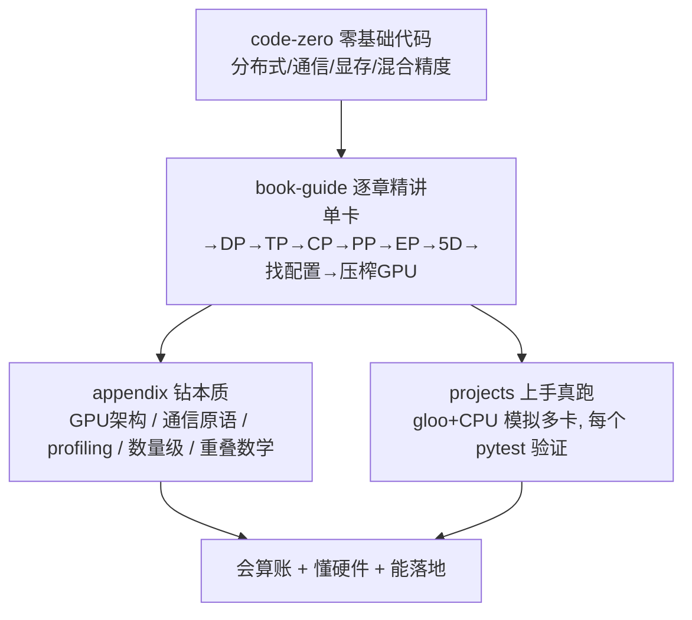

# Ultra-Scale Playbook · 精讲与实战

> **把 LLM 训练扩展到 GPU 集群:显存 / 计算 / 通信 的编排。**
>
> 本合集是对 HuggingFace《The Ultra-Scale Playbook: Training LLMs on GPU Clusters》(Nouamane Tazi、Ferdinand Mom、Haojun Zhao 等)的**逐章逐节中文精讲 + 展开到本质的 GPU 架构附录 + 零基础分布式代码课 + 6 个"能在一台没有 GPU 的笔记本上真跑"的分布式实战项目**。是 `llm-action` 仓库的 AI-Infra 配套。

---

## 🗺️ 学习路径



**建议顺序**:先 `code-zero` 打底(尤其没写过分布式的)→ 跟 `book-guide` 逐章走 → 用 `projects` 亲手把每种并行跑一遍(`pytest` + `run_demo.py`)→ 回 `appendix/A` 把 GPU 架构与 5D 并行的映射钻透。

---

## 📘 book-guide · 逐章精讲(11 篇)

| 文件 | 讲什么 |
|---|---|
| [00 导读·全书地图·五维并行全景](book-guide/00_导读_全书地图_为什么在GPU集群训练_五维并行全景.md) | 全书主线、5D 并行一句话总览、怎么学 |
| [01 单卡训练·显存解剖·激活重算·梯度累积](book-guide/01_单卡训练_显存解剖_激活重算_梯度累积.md) | 训练显存四大块、用算力/时间换显存 |
| [02 数据并行 DP·全批量·ZeRO 分片](book-guide/02_数据并行_DP_全批量_ZeRO分片.md) | all-reduce 梯度、ZeRO-1/2/3 |
| [03 张量并行 TP·序列并行 SP](book-guide/03_张量并行_TP_序列并行_SP.md) | 列/行并行、Megatron MLP、按头切注意力 |
| [04 上下文并行 CP·Ring/Zig-Zag Attention](book-guide/04_上下文并行_CP_RingAttention_ZigZag.md) | 超长序列、K/V 环传、在线 softmax |
| [05 流水线并行 PP·AFAB/1F1B/零气泡](book-guide/05_流水线并行_PP_AFAB_1F1B_交错_零气泡DualPipe.md) | 切层、气泡、调度演进 |
| [06 专家并行 EP·MoE](book-guide/06_专家并行_EP_MoE.md) | 路由、All-to-All、容量因子 |
| [07 5D 并行总览](book-guide/07_5D并行总览_把所有维度拼起来.md) | 五维如何组合、硬件映射 |
| [08 寻找最优训练配置](book-guide/08_寻找最优训练配置_显存_批量_吞吐_基准.md) | 显存→批量→吞吐→基准 的决策流程 |
| [09 深入 GPU·融合/线程/混合精度/FlashAttention](book-guide/09_深入GPU_融合_线程_混合精度_FlashAttention_融合核.md) | 压榨单卡的 kernel 手段 |
| [10 结论与全书综述](book-guide/10_结论与全书综述_从单卡到万卡.md) | 从单卡到万卡的决策链 + 参考文献导读 |

## 📗 appendix · 钻本质(5 篇)

| 文件 | 讲什么 |
|---|---|
| [★ A GPU 架构与本质(展开·全面)](appendix/A_GPU架构与本质_从晶体管到张量核_SM_warp_显存层级_NVLink_集群网络.md) | **从晶体管→张量核→SM/warp→显存层级→NVLink/NVSwitch→集群网络→roofline→硬件↔5D并行映射** |
| [B 并行编程速成·集合通信原语](appendix/B_并行编程速成_集合通信原语_NCCL_AllReduce_ReduceScatter等.md) | AllReduce/ReduceScatter/AllGather/All2All、ring 算法、NCCL |
| [C 分布式训练性能剖析](appendix/C_分布式训练性能剖析_profiling_trace_瓶颈定位.md) | profiler/trace/瓶颈定位、MFU |
| [D LLM 训练的典型规模与数字](appendix/D_LLM训练的典型规模与数字_要记住的数量级.md) | 1B/7B/70B/405B 的显存/卡数/算力数量级 |
| [E 计算通信重叠的数学](appendix/E_计算通信重叠的数学_把通信藏进计算.md) | t_comm ≤ t_comp 的临界条件推导 |

## 📙 code-zero · 零基础代码课(4 篇)

| 文件 | 讲什么 |
|---|---|
| [01 PyTorch 分布式零基础](code-zero/01_PyTorch分布式零基础_进程组_rank_world_size_启动.md) | 进程组/rank/world_size、gloo、mp.spawn/torchrun |
| [02 集合通信零基础(手画)](code-zero/02_集合通信零基础_AllReduce_ReduceScatter_AllGather_手画.md) | 每个原语的语义/形状/用途 |
| [03 Transformer 显存与计算](code-zero/03_Transformer显存与计算零基础_参数_激活_优化器_FLOPs估算.md) | `12Lh²` / `16 B/param` / `6ND` |
| [04 混合精度与 FlashAttention](code-zero/04_混合精度与FlashAttention零基础.md) | bf16/fp16/fp8、loss scaling、在线 softmax |

## 🛠️ projects · 实战(6 个,全部 gloo/CPU 真跑 + pytest 验证)

| 项目 | 复现什么 | 验证 |
|---|---|---|
| [01 显存 & FLOPs 计算器](projects/01_memory_flops_calculator) | 训练显存四块 + `6ND` + ZeRO/TP/PP 缩放 | **13 passed** |
| [02 数据并行 + ZeRO](projects/02_data_parallel_zero) | 手写 DDP + ZeRO-1/2/3 分片 | **5 passed** + gloo DDP demo |
| [03 张量并行](projects/03_tensor_parallel) | 列/行并行 Linear、并行 MLP、按头切注意力 | **15 passed** + gloo demo |
| [04 流水线并行](projects/04_pipeline_parallel) | AFAB/1F1B 调度 + 气泡分析 | **10 passed** + gloo P2P demo |
| [05 上下文并行 · Ring Attention](projects/05_context_parallel_ring_attention) | 序列分块 + 在线 softmax + 环传 K/V | **15 passed** + gloo ring demo |
| [06 集合通信从零实现](projects/06_collectives_from_scratch) | 用 P2P 搭 ring AllReduce | **12 passed** + gloo demo(对拍官方) |

> ✅ 6 个项目共 **70 个 pytest 用例全部通过**;每个都有 `run_demo.py`,用 `gloo` 后端在本机 CPU 上真起多进程(无需 GPU)。金标准都是"**分布式结果 == 单卡参考**"。

### 如何运行任一项目
```bash
cd projects/03_tensor_parallel
python -m pytest -q      # 离线核心:单进程验证分布式逻辑正确(稳过,不依赖多进程)
python run_demo.py       # 真·多进程:gloo 后端起多进程真跑(会有无害的 socket 警告)
```
> 真实多卡:把 `backend='gloo'→'nccl'`、`device='cpu'→'cuda'` 即可。

---

## 🎯 对应的面试 / 八股考点

| 主题 | 看这里 |
|---|---|
| 显存怎么算、7B 为什么放不下 | code-zero/03、project 01、book-guide/01 |
| DDP / ZeRO-1/2/3 / FSDP | book-guide/02、project 02、code-zero/02 |
| 张量并行 / 序列并行 / 为什么机内做 | book-guide/03、project 03、appendix/A |
| 流水线气泡 / 1F1B / 零气泡 | book-guide/05、project 04 |
| 长序列 / Ring Attention / FlashAttention | book-guide/04、09、project 05、code-zero/04 |
| 通信原语 / ring AllReduce 带宽最优 | code-zero/02、appendix/B、project 06 |
| GPU 架构 / 张量核 / NVLink / roofline | **appendix/A** |
| 5D 并行如何组合 | book-guide/07、08 |

---

*基于 HuggingFace《The Ultra-Scale Playbook: Training LLMs on GPU Clusters》。代码在本机 `torch 2.12.0+cpu` / gloo 环境全部验证通过。*
