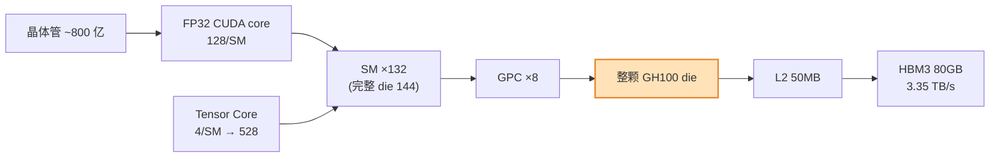
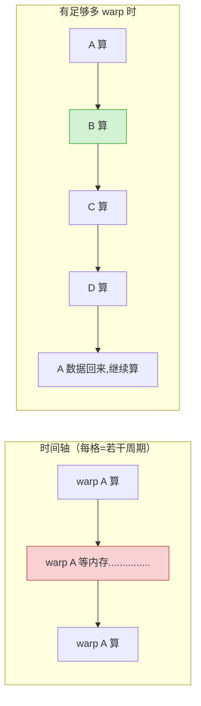
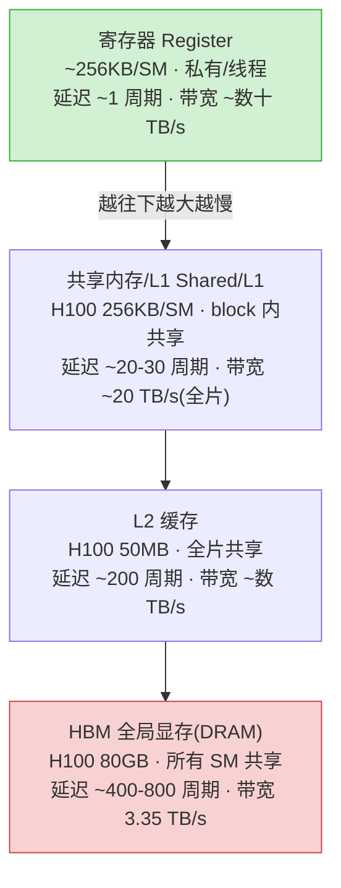
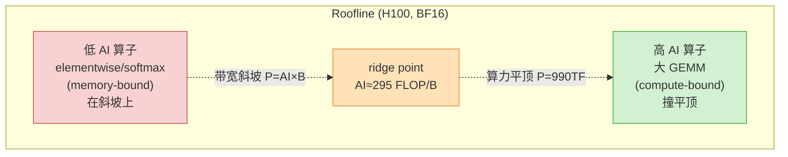
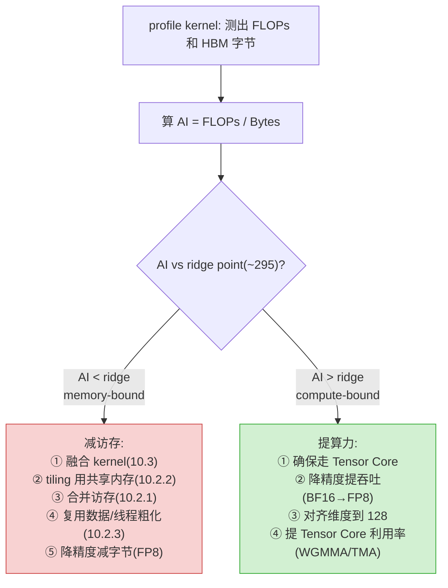
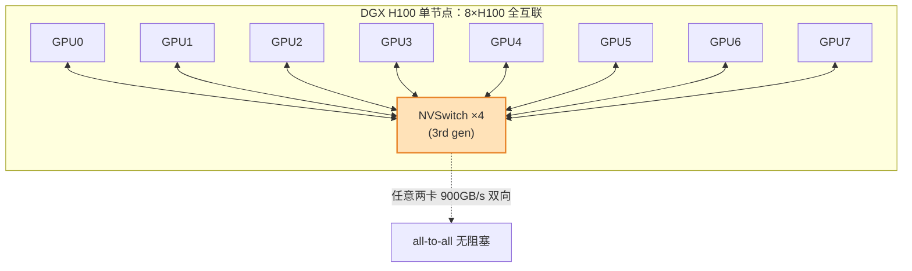
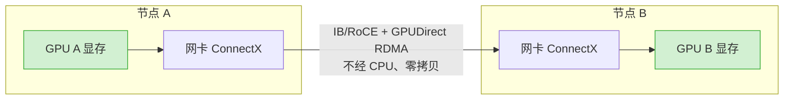
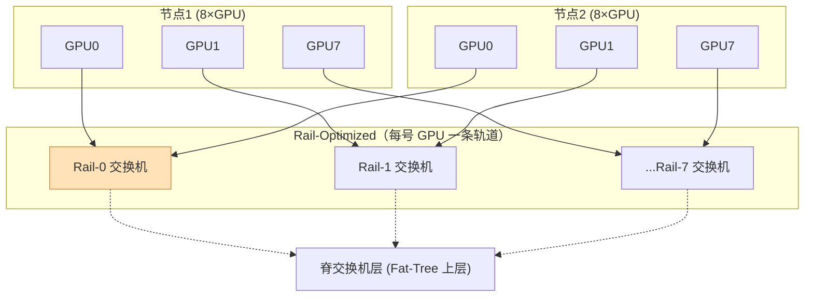
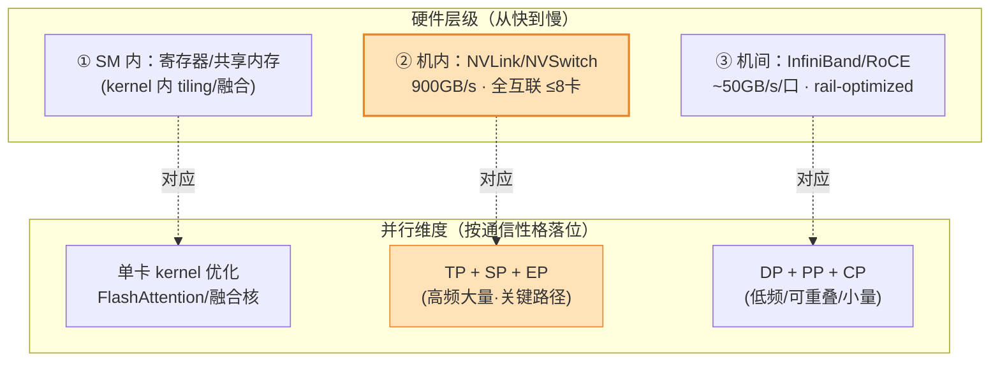
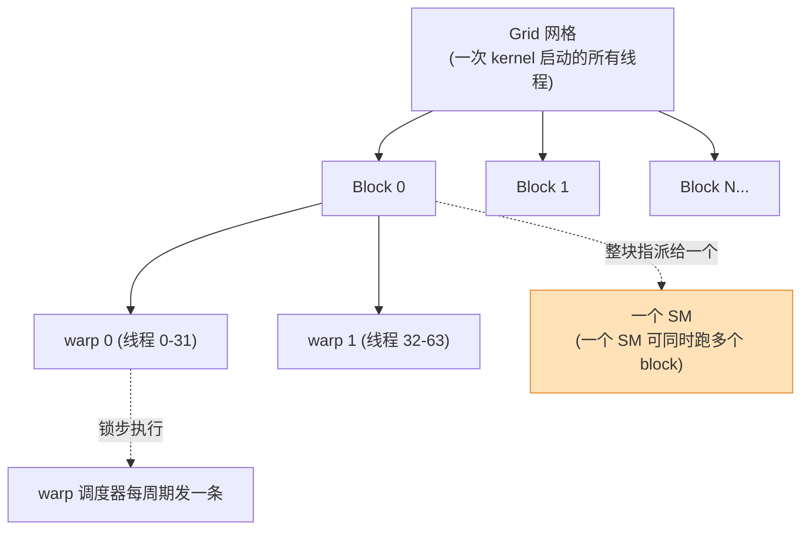

# 附录 A · GPU 架构与本质：从晶体管到张量核、SM/warp、显存层级、NVLink 与集群网络

> **定位**：这是《Ultra-Scale Playbook 精讲》的**硬件大附录**，比正文第 10 章（《深入 GPU：融合、线程、混合精度、FlashAttention》，原书 p.163–200）**更钻本质、更全面**。正文第 10 章在多处用 🔬 框点到"这里只讲到概念级深度"，并把 **warp 调度器、bank conflict、Tensor Core 的 MMA、内存事务粒度、NVLink/NVSwitch 拓扑、集群网络** 这些**第一性原理**留给本附录展开。本附录就是来还这笔账的。
>
> **读法**：从晶体管一路往上读（硬件物理层级 → 执行模型 → 内存 → 张量核 → roofline → 机内互联 → 机间网络 → 谱系表 → 映射到 5D 并行 → CUDA/FlashAttention），也可以当字典按需跳读。每一个硬件数字都**标注了代际与口径**（dense/sparse、单向/双向聚合），因为 GPU 数字最容易被"市场口径"忽悠。
>
> **本质一句话**：现代 GPU 是一台**内存墙机器**，不是算力墙机器。本附录所有内容——SIMT、occupancy、显存金字塔、Tensor Core、roofline、NVLink、AllReduce——都在回答同一个问题：**怎么让数据在正确的时间出现在正确的、足够快的那层内存里，好让昂贵的算力单元一刻也不闲着。**

---

## 🗺️ 0. 导航：这张芯片到底长什么样？

我们先建立一张"从小到大"的全局心智图，后面每一节都在放大其中一块：

```mermaid
flowchart TB
    subgraph CHIP["整颗 GPU（die）"]
        direction TB
        subgraph GPC["GPC 图形处理簇 ×7~8"]
            subgraph TPC["TPC 纹理处理簇 ×N"]
                subgraph SM["SM 流多处理器（H100: 132 个）"]
                    subgraph SMSP["SM 子分区 ×4（处理块）"]
                        WS["Warp 调度器 + 派发"]
                        FP["32× FP32 CUDA core"]
                        INT["16× INT32"]
                        TC["1× Tensor Core（4th gen）"]
                        RF["寄存器堆 16K×32bit"]
                    end
                    SMEM["共享内存 / L1（H100: 256KB 合一）"]
                    TMA["TMA 张量内存加速器（Hopper 新增）"]
                end
            end
        end
        L2["L2 缓存（H100: 50MB）"]
    end
    HBM["HBM3 显存（H100: 80GB @ 3.35TB/s）"]
    CHIP --> L2 --> HBM
    style SM fill:#ffe2b8,stroke:#e8852a,stroke-width:2px
    style TC fill:#d2f0d2,stroke:#3a3
    style HBM fill:#f8d2d2,stroke:#c44
```

把这张图刻进脑子，本附录就成功了一半。下面逐层拆。

---

## 🔬 1. 从晶体管到整颗芯片：GPU 的物理层级

### 1.1 晶体管：一切的地基

GPU 由数百亿个**晶体管（transistor）**刻在硅片上构成。一个晶体管本质是一个**电控开关**：栅极加电压，源极到漏极导通或截止，对应逻辑 1 / 0。

- **数量级**：H100（Hopper，2022，台积电 4N 工艺）集成约 **800 亿晶体管**；A100（Ampere，2020，台积电 7nm）约 **542 亿**；B200（Blackwell，2024）是**双 die**封装，合计约 **2080 亿**。（来源：各代 NVIDIA 架构白皮书）
- **为什么 GPU 能塞这么多算力**：CPU 把大量晶体管花在**控制逻辑、分支预测、大缓存**上（让单线程跑得飞快）；GPU 把绝大多数晶体管花在**算术逻辑单元（ALU）**上（让海量线程同时跑）。这就是 GPU "为吞吐量而生、为延迟妥协"的物理根源。

🔬 **第一性原理**：晶体管越多、越小，单位面积算力越高，但**功耗与散热**成了硬约束（这就是为什么有了多 die、有了 FP8/FP4 这种"用更少比特换更多 FLOPS"的路线——见第 4、10 节）。

### 1.2 晶体管 → 逻辑门 → ALU → CUDA core

往上堆叠：

```
晶体管 → 逻辑门(AND/OR/NOT) → 加法器/乘法器 → ALU（算术逻辑单元）→ CUDA core
```

- **CUDA core**（NVIDIA 营销词）≈ 一条 **FP32 ALU 流水线 + 一条 INT32 ALU**。它每个时钟周期能做一次浮点乘加（FMA, `a*b+c` 算 2 次浮点运算 FLOP）。
- 注意：CUDA core 是**标量**单元，一次只处理一个数。真正的"矩阵猛兽"是后面要讲的 **Tensor Core**（第 4 节）——一个 Tensor Core 一拍能做一整块小矩阵乘加，吞吐是 CUDA core 的几十倍。

> 💡 **面试高频**："H100 有多少 CUDA core？" → 132 SM × 128 FP32 core/SM = **16,896 个 FP32 CUDA core**（正文 p.165 原文给的就是这个数）。但别忘了补一句：**真正的训练算力来自 528 个 Tensor Core，不是这一万多个标量 core**。

### 1.3 SM 流多处理器（Streaming Multiprocessor）解剖

**SM 是 GPU 的基本"工人车间"**，是调度和资源分配的核心单位。正文 p.165 原文：

> "An NVIDIA H100 GPU has 132 SMs with 128 cores per SM, resulting in a total of 16,896 cores."

一个 Hopper/Ampere SM 内部被切成 **4 个子分区（SM sub-partition, SMSP，也叫 processing block）**，每个子分区是一个相对独立的"小作坊"：

| SM 子分区（SMSP）内组件 | 数量（每子分区） | 作用 |
|---|---|---|
| Warp 调度器 Warp Scheduler | 1 | 每周期从就绪的 warp 里挑一个发射指令 |
| 派发单元 Dispatch Unit | 1（或 2） | 把指令送到执行单元 |
| FP32 CUDA core | 32 | 标量浮点乘加 |
| INT32 单元 | 16 | 整数运算（地址计算、循环计数） |
| FP64 单元 | 视代际 | 科学计算/双精度 |
| **Tensor Core** | 1（4th gen, Hopper） | 矩阵乘加 MMA（算力主力） |
| LD/ST 单元（LSU） | 若干 | 读写内存（load/store） |
| SFU 特殊函数单元 | 若干 | exp/sin/sqrt/倒数等超越函数 |
| 寄存器堆 Register File | 16,384 × 32-bit | 线程私有寄存器 |

**整个 SM 共享**：

| SM 级共享资源 | A100（Ampere, 2020） | H100（Hopper, 2022） |
|---|---|---|
| 共享内存 + L1（合一） | 192 KB | 256 KB |
| 最大可配共享内存/SM | 164 KB | 228 KB |
| 寄存器/SM | 65,536 × 32-bit（256 KB） | 65,536 × 32-bit（256 KB） |
| 每 SM 最大常驻线程 | 2,048 | 2,048 |
| 每 SM 最大常驻 warp | 64 | 64 |
| 每 SM 最大常驻 block | 32 | 32 |
| 每 SM Tensor Core | 4（3rd gen） | 4（4th gen） |

（来源：NVIDIA A100 / H100 架构白皮书与 CUDA C Programming Guide）

🔬 **本质**：SM 内部"算力多、控制少、内存小且分级"。它能同时**装下**很多线程（最多 2048），但每周期只能**发射**很少几条指令（4 个子分区 × 1 = 4 条/周期）。这种"装得多、发得少"正是延迟隐藏的基础（见 2.4）。

### 1.4 GPC / TPC：SM 之上的封装层级

SM 不是直接铺满整颗 die 的，中间还有两层组织：

```
整颗 die
 └─ GPC（Graphics Processing Cluster，图形处理簇）×7~8
     └─ TPC（Texture Processing Cluster，纹理处理簇）×N
         └─ SM（流多处理器）×2（每个 TPC 通常含 2 个 SM）
```

- **GPC** 自带光栅化引擎（图形遗产）、并在内部共享一部分调度/内存资源。H100（GH100 完整 die）有 **8 个 GPC**，每 GPC 含 9 个 TPC、每 TPC 含 2 个 SM → 完整 die 144 SM，**量产屏蔽到 132 SM**（良率取舍）。
- 对**训练**而言 GPC/TPC 基本透明，但理解它有助于明白：**L2 缓存横跨所有 GPC**，是全片 SM 的"公共集散地"（见第 3 节）。Hopper 还把 GPC 内的 SM 组成 **Thread Block Cluster（线程块簇）**，允许同簇 block 直接读彼此的共享内存（"分布式共享内存 DSMEM"）——这是 Hopper 给 FlashAttention-3 一类算子提供的新武器。

### 1.5 整颗芯片：把数字串起来（H100 SXM5 为例）



| H100 SXM5 关键数（Hopper, 2022, NVIDIA 白皮书） | 数值 |
|---|---|
| 晶体管 | ~800 亿 |
| SM | 132（量产）/ 144（完整 die） |
| FP32 CUDA core | 16,896 |
| Tensor Core（4th gen） | 528 |
| 时钟（boost） | ~1.98 GHz |
| BF16/FP16 Tensor（dense） | ~990 TFLOPS |
| FP8 Tensor（dense） | ~1,979 TFLOPS |
| TF32 Tensor（dense） | ~495 TFLOPS |
| FP32（非 Tensor） | ~67 TFLOPS |
| L2 缓存 | 50 MB |
| HBM3 | 80 GB @ 3.35 TB/s |
| 热设计功耗 TDP | 700 W |

> ⚠️ **常见坑**：NVIDIA 官方营销页常给**带稀疏（sparsity）的数字**（再 ×2），且默认 Tensor Core 口径。本表给的是**稠密（dense）**数字，和正文第 9 章/第 10 章用的 990 TFLOPS BF16、3.35 TB/s 一致。引用任何 FLOPS 数前，先问三件事：**哪代卡？dense 还是 sparse？是不是 Tensor Core 口径？**

---

## 🧵 2. SIMT 执行模型：warp、warp scheduler、延迟隐藏与 occupancy

这一节是正文 10.2.4（最小化控制分歧）和整章"线程"主题的**底层原理**。

### 2.1 SIMT 是什么？和 SIMD/SMT 的区别

- **SIMD（Single Instruction, Multiple Data，单指令多数据）**：一条指令操作一个向量寄存器里的多个数据（如 CPU 的 AVX-512 一次算 16 个 float）。程序员要显式写向量。
- **SMT（Simultaneous Multithreading，同时多线程）**：CPU 超线程，一个核轮流跑几个线程隐藏停顿。
- **SIMT（Single Instruction, Multiple Threads，单指令多线程）= NVIDIA 的模型**：你写**标量**线程代码（每个线程像独立跑），硬件把 **32 个线程打包成一个 warp**，让它们**锁步（lockstep）执行同一条指令、各算各的数据**。

正文 p.183 把它叫 SIMD（"A streaming multiprocessor is built to execute all threads in a warp using the Single Instruction, Multiple Data (SIMD) model"）。严格说 NVIDIA 自己的术语是 **SIMT**——区别在于 SIMT 允许每个线程有自己的程序计数器和分支（代价是分歧时变慢，见 2.6），而纯 SIMD 不允许。**写代码时按 SIMT 想，算性能时按 SIMD 的"32 道并发"想**。

### 2.2 warp = 32 个线程，锁步前进

正文 p.167 原文：

> "Threads are grouped in warps, each containing 32 threads. All the threads in a warp are synchronized to execute instructions simultaneously but on different parts of the data."

**warp（线程束）是 GPU 调度的最小单位**。关键事实：

- warp 大小恒为 **32**（从 Tesla 架构至今没变过；这是 NVIDIA 的硬件常数）。
- 一个 warp 的 32 个线程**共用一个取指/译码/发射**——这就是为什么 SIMT 省控制硬件、把面积让给算力（正文 p.184 原话）。
- block（线程块）里的线程数若不是 32 的倍数，最后一个 warp 会有"空闲车道（inactive lanes）"，浪费算力。**所以 block 尺寸几乎总取 32 的倍数（128、256、512、1024）。**

### 2.3 warp scheduler：每周期发一条指令

每个 SM 子分区有一个 **warp 调度器**。它的工作循环极其简单：

```
每个时钟周期：
  1. 看哪些常驻 warp 是"就绪的"（操作数已到、无依赖阻塞）
  2. 从就绪 warp 里挑一个（按某种优先级/轮转策略）
  3. 把它的下一条指令发射到对应执行单元（FP32 / Tensor Core / LSU / SFU）
  4. 该 warp 可能因等内存/等依赖变"未就绪"，下周期挑别的 warp
```

一个 SM 有 4 个子分区 → 4 个调度器 → **每周期最多发射 4 条 warp 指令**。但它**常驻**的 warp 可以多达 64 个。**"常驻多、发射少"是故意的**——见下。

### 2.4 🔬 为什么要"超额线程 + 快速切换"来隐藏延迟？

这是 GPU 设计哲学的**最核心一招**，务必理解透。

**问题**：从 HBM 读一个数据要 **400~800 个时钟周期**（见第 3 节延迟表）。如果一个 warp 发出读内存指令后**干等**，那这几百个周期里算力全闲——利用率惨不忍睹。

**CPU 的解法**：巨大的乱序执行窗口 + 多级大缓存 + 分支预测，硬把单线程的停顿填掉（花大量晶体管在控制上）。

**GPU 的解法**：**零开销线程切换 + 海量超额线程**。当 warp A 卡在等内存时，调度器**下一个周期立刻切到 warp B、C、D……**去发指令。只要常驻的 warp 足够多，总有就绪的 warp 可发，算力就不闲。warp 切换**不需要保存/恢复上下文**（因为每个 warp 的寄存器一直驻留在寄存器堆里，不挪窝），所以切换零开销。

用 **Little's 定律（Little's Law）**量化所需的并发：

$$
\text{需要的在途请求数} = \text{延迟} \times \text{带宽}
$$

要把 HBM 带宽喂满，必须维持"延迟 × 带宽"这么多字节同时在途。换算成 warp：**只有当常驻 warp 足够多、它们一起发出足够多的访存请求，才能把内存流水线填满、把延迟藏住**。这就是为什么 GPU 要"超额订阅（oversubscribe）"线程——线程不是为了同时算，而是为了**互相填坑**。



> 💡 **一句话**：CPU 用**缓存和乱序**消灭延迟；GPU 用**并发和切换**隐藏延迟。这就是为什么"GPU 喜欢大批量、长序列"——批量大才有足够多 warp 把延迟藏住。

### 2.5 占用率 Occupancy：到底多少 warp 算够？

**占用率（occupancy）= 实际常驻 warp 数 ÷ 硬件支持的最大常驻 warp 数**。H100/A100 每 SM 最多 64 warp，若实际常驻 48 个，occupancy = 75%。

occupancy 受**三道资源闸门**限制，取最严的那道：

| 限制因素 | 公式（每 SM） | H100 上限 |
|---|---|---|
| **寄存器** | warp 数 ≤ 65536 ÷ (32 × 每线程寄存器数) | 寄存器堆 65,536 |
| **共享内存** | block 数 ≤ 228KB ÷ 每 block 共享内存 | 228 KB 可配 |
| **block/线程硬上限** | ≤ 32 block 且 ≤ 2048 线程 | 64 warp |

**例**：若一个 kernel 每线程用 **64 个寄存器**，则每 SM 最多 `65536 / 64 = 1024` 线程 = **32 warp** = occupancy 50%。想提高 occupancy 就得砍寄存器用量（但砍太狠会"寄存器溢出"到本地内存，反而更慢）。

🔬 **本质纠偏**：**occupancy 不是越高越好，而是"够用就好"**。occupancy 的唯一作用是**提供足够并发来隐藏延迟**（见 2.4）。一旦延迟被藏住，再加 warp 也没用。很多高性能 kernel（如 FlashAttention、GEMM）反而用**较低 occupancy + 大量寄存器/共享内存**做数据复用，跑得比高 occupancy 还快。这是正文 10.2.3"线程粗化（thread coarsening）"背后的张力：**用更多寄存器/每线程干更多活，换更少的访存往返，哪怕 occupancy 降一点也值。**

### 2.6 控制分歧 Control Divergence（呼应正文 10.2.4）

正文 p.183–184 讲：warp 内 32 线程锁步执行同一条指令。如果代码里有 `if`，让一半线程走分支 A、一半走分支 B：

```cuda
if (threadIdx.x % 2 == 0)
    do_A();   // 偶数线程
else
    do_B();   // 奇数线程
```

硬件无法同时执行两条不同指令，只能**串行化**：先让走 A 的线程干活、走 B 的线程在车道里**闲置等待**；再反过来。结果该 warp 的有效吞吐**砍半**。这就是**控制分歧（control divergence）**。

正文给的解药：

1. **重构代码减少分支**（把数据排好，让同一 warp 的线程走同一路径）；
2. 用**断言/谓词执行（predication）**：把短分支编译成"无分支的条件赋值"（如 `c = cond ? a : b`），避免真分支。

> ⚠️ **坑**：`if (x < N)` 这种**边界检查**几乎不可避免（数组尾巴），但它只在最后一个 warp 分歧，影响极小，不用怕。真正要避免的是**warp 内大面积、长代码的分歧**。

### 2.7 一个完整数值例子（把 2.1–2.6 串起来）

设 H100 上跑一个逐元素 kernel，处理 1 亿个 float32：

- 数据量 = 1e8 × 4 B × 2（读+写）= 0.8 GB。
- HBM 带宽 3.35 TB/s → 理论下限 `0.8e9 / 3.35e12 ≈ 0.24 ms`。
- 这是**纯访存受限**：每个元素只做 1 次运算（算术强度 ≈ 0.25 FLOP/Byte，远低于 ridge point 295，见第 5 节）。
- **优化方向不是加算力，而是减访存**：能不能和上一个/下一个 kernel **融合（fuse）**，省掉一次往返 HBM？这正是正文 10.3 融合核的动机。

---

## 🧠 3. 显存层级全解剖：寄存器 → 共享内存/L1 → L2 → HBM

正文 p.165 给了金字塔的轮廓："Registers ... Shared memory and L1 ... L2 ... global memory"。本节给**真实容量/带宽/延迟数字**，并讲透 coalescing 与 bank conflict。

### 3.1 显存金字塔（带数字）



**核心规律：越往上越小、越快、越私有；越往下越大、越慢、越公共。** 高性能 kernel 的全部艺术就是**把数据尽量留在金字塔上层、减少往下层（尤其 HBM）的往返**。

### 3.2 寄存器 Register（线程私有，最快）

- **位置**：每个 SM 一块寄存器堆，H100/A100 都是 **65,536 个 32-bit 寄存器（256 KB）/SM**。
- **私有性**：寄存器**属于线程**，线程之间互不可见。warp 切换时寄存器**原地不动**（这就是零开销切换的物理基础，见 2.4）。
- **延迟**：约 1 个周期，本质零延迟。
- **约束**：每线程最多 255 个寄存器；用得多→occupancy 降（见 2.5）。寄存器不够时**溢出（spill）**到"本地内存（local memory）"——名字叫 local，其实在 HBM 里，巨慢，要极力避免。

### 3.3 共享内存 / L1（block 内共享，可编程的缓存）

正文 p.179 原文："the shared memory on a GPU is a small, fast memory area accessible by all threads within a block."

- **位置**：每 SM 一块，H100 上共享内存与 L1 **合用 256 KB**（可配置切分，最多 228 KB 给共享内存）；A100 是 192 KB（最多 164 KB 共享）。
- **可编程**：共享内存是**程序员手动管理的便笺（scratchpad）**——这是它和自动 L1 缓存的最大区别。正文 10.2.2 的 **tiling（分块）** 就是手动把 HBM 里的数据块搬进共享内存、让一个 block 的所有线程复用，把 6.6 TFLOPS 的朴素矩阵乘提速。
- **延迟**：约 20–30 周期，比 HBM 快一个数量级以上。

#### 🔬 Bank Conflict（存储体冲突）—— 正文没展开、附录补全

共享内存被划成 **32 个 bank（存储体）**，每个 bank 宽 4 字节（一个 float）。连续地址轮流落在 32 个 bank 上：地址 0→bank0、地址 4→bank1 ... 地址 124→bank31、地址 128→bank0（回绕）。

**关键规则**：一个 warp 的 32 个线程**同时**访问共享内存时：

- 若 32 个线程访问 **32 个不同 bank**（或全访问同一地址=广播）→ **1 个周期搞定，满速**；
- 若有 **k 个线程访问同一 bank 的不同地址** → **k 路冲突（k-way conflict）**，硬件串行化成 k 个周期，慢 k 倍。

**经典踩坑**：按列访问一个行主序的 `float tile[32][32]`，每列的 32 个元素地址相差 32×4=128 字节，**全部落在同一个 bank** → 32 路冲突，慢 32 倍！

**经典解法——padding（补一列）**：声明成 `float tile[32][33]`，每行多一个无用元素，让列访问错开 bank，冲突消失。这是写共享内存 kernel 的"祖传一招"。

> 💡 正文 10.2.3 提到的告警 `mio_throttle`（"warp 等共享内存指令队列"）很多时候就是 bank conflict 或共享内存压力过大引起的。NVIDIA 给的建议"用更少但更宽的 load"（fewer but wider loads，如一次读 `float4` = 16 字节）正是为了减少事务数、缓解 bank 压力——这与正文的"线程粗化"是同一思想。

### 3.4 L2 缓存（全片共享，硬件自动）

- **位置**：横跨所有 GPC，**全片唯一**，所有 SM 共享。
- **容量**：H100 **50 MB**（Hopper）；A100 **40 MB**（Ampere）；V100 仅 6 MB（Volta）——L2 暴涨是 Ampere/Hopper 的一大改进，因为更大的 L2 能把更多"热数据"留在片上、少打 HBM。
- **延迟**：约 200 周期；带宽数 TB/s 级，介于共享内存与 HBM 之间。
- **自动**：L2 是硬件管理的缓存，程序员不直接控制（但 Hopper 提供 L2 驻留策略 hint）。

### 3.5 HBM 全局显存（最大、最慢、最关键的瓶颈）

正文 p.174 原文："The global memory in GPUs ... has a long latency and low bandwidth in comparison to the cache, creating a major bottleneck."；p.187 还点明 **HBM（High Bandwidth Memory）虽然名字叫"高带宽"，但在 GPU 内部内存层级里它是最慢的那层**——比 SRAM（寄存器/共享内存）慢得多。

- **物理**：HBM 是 3D 堆叠的 DRAM，靠超宽总线（数千 bit）和高频获得带宽。容量大（H100 80GB、H200 141GB、B200 192GB）但延迟高、带宽相对算力仍是瓶颈。
- **延迟**：约 400–800 周期（几百纳秒）。
- **带宽（代际）**：V100 HBM2 ~0.9 TB/s；A100 HBM2e 1.55 TB/s(40GB)/~2.0 TB/s(80GB)；H100 HBM3 3.35 TB/s；H200 HBM3e 4.8 TB/s；B200 HBM3e 8 TB/s。（来源：各代白皮书）

#### 合并访存 Coalescing（正文 10.2.1 的本质）

正文 p.174 讲得很到位：DRAM 每次被访问会**以突发（burst）方式**一次吐出一连串连续地址的数据。**合并访存（memory coalescing）**就是让一个 warp 的 32 个线程访问**连续地址**，硬件把它们合并成**一次大的 burst 事务**，而不是 32 次零散小事务。

正文给的矩阵乘例子（p.175–179）：朴素实现里 `(0,0)` 和 `(1,0)` 两个线程读 A 的不同**行**，行主序下两行相隔很远 → 不连续 → 不能合并。改成 1D block、让同 warp 线程读 A 的同一**行**的连续元素（CODE.XV）→ 合并成功 → **内存吞吐和执行时间各改善约 10×**。

🔬 **硬件本质**：HBM 事务有**最小粒度**（如 32 字节/64 字节/128 字节一段，sector/cache line）。合并 = 让一个事务里的字节**全部有用**；不合并 = 一个事务里大部分字节被浪费（你只要 4 字节，硬件却搬了 32 字节）。所以不合并的有效带宽可能只有峰值的 1/8。

### 3.6 显存层级数字大表（A100 vs H100）

| 层级 | A100（Ampere, 2020） | H100（Hopper, 2022） | 典型延迟 | 作用域 | 谁管理 |
|---|---|---|---|---|---|
| 寄存器 | 256 KB/SM（65536×32b） | 256 KB/SM | ~1 周期 | 线程私有 | 编译器 |
| 共享内存/L1 | 192 KB/SM（≤164 共享） | 256 KB/SM（≤228 共享） | ~20–30 周期 | block 内 | **程序员（共享）** |
| L2 | 40 MB | 50 MB | ~200 周期 | 全片 | 硬件 |
| HBM 全局 | 40/80 GB | 80 GB | ~400–800 周期 | 全片+跨卡可见(NVLink) | 程序员（显式 cudaMalloc） |
| HBM 带宽 | 1.55 / ~2.0 TB/s | 3.35 TB/s | — | — | — |

（来源：NVIDIA A100/H100 白皮书、CUDA C Programming Guide；延迟为典型量级，随访问模式波动）

### 3.7 🔬 为什么训练常常是"访存受限（memory-bound）"？

把算力和带宽放一起算一笔账（H100，BF16）：

$$
\text{ridge point} = \frac{\text{峰值算力}}{\text{峰值带宽}} = \frac{990 \times 10^{12}\ \text{FLOP/s}}{3.35 \times 10^{12}\ \text{B/s}} \approx 295\ \text{FLOP/Byte}
$$

含义：**每从 HBM 读 1 字节，硬件期望你对它做约 300 次浮点运算**，才能让 Tensor Core 不闲。但很多训练算子的"算术强度"远低于此：

| 算子 | 算术强度（约） | 受限于 |
|---|---|---|
| 逐元素（ELU、加法、dropout） | ~0.25–1 FLOP/B | **访存** |
| LayerNorm / softmax | ~1–10 FLOP/B | **访存** |
| 注意力 QKᵀ·softmax·V（朴素） | 低（要落地 N×N） | **访存** |
| 大矩阵乘 GEMM（N 很大） | 几十~几百 FLOP/B | 接近/达到**算力** |

结论：**Transformer 里只有大 GEMM 能吃满算力，其余大量"小算子"被带宽卡死。** 这正是本书第 10 章所有技巧的总动机——**融合（10.3）、FlashAttention（10.4）都在拼命减少对 HBM 的往返，把访存受限的算子救回算力受限。**

---

## ⚡ 4. 张量核 Tensor Core：矩阵乘的专用引擎

正文第 10 章把 Tensor Core 当背景常识用（p.165 提"see the docs for tensor cores"，10.5 讲精度），但没展开它的工作原理。本节补全。

### 4.1 为什么需要专用的矩阵单元？

深度学习 99% 的算力花在**矩阵乘（GEMM）**上（线性层、注意力的 QKᵀ 和 ·V、MoE 的专家）。用标量 CUDA core 做矩阵乘，每次 FMA 只算一个元素、还要反复读写寄存器，效率有上限。

**Tensor Core 的思路**：造一个**硬连线的小矩阵乘加阵列**，一拍（few cycles）吞下一整块小矩阵 A、B，吐出 `D = A·B + C`。一个 Tensor Core 的等效吞吐是标量 core 的**几十倍**。这就是为什么 H100 的 BF16 算力（990 TFLOPS，靠 Tensor Core）是它 FP32 标量算力（67 TFLOPS）的 **~15 倍**。

### 4.2 MMA 是什么：D = A·B + C

**MMA（Matrix Multiply-Accumulate，矩阵乘累加）**是 Tensor Core 的基本操作：

$$
\mathbf{D}_{m\times n} = \mathbf{A}_{m\times k} \cdot \mathbf{B}_{k\times n} + \mathbf{C}_{m\times n}
$$

- 一个 warp 的 32 个线程**协作**完成一块 MMA（比如 16×16×16 的小块）。每个线程持有 A/B/C 的若干**碎片（fragment）**，硬件在内部把它们拼成完整小矩阵相乘。
- **累加器（C/D）通常用更高精度（FP32）**，输入 A/B 用低精度（FP16/BF16/FP8）。这就是"混合精度"在硬件层面的体现：**低精度算、高精度累加**，正好对应正文 10.5.1 的第 3 招"用 FP32 累加避免溢出"。

### 4.3 支持的精度（呼应正文 10.5 的格式表）

正文 p.191 给了浮点格式表，本节补上**Tensor Core 对各精度的吞吐代际**：

| 精度 | 位宽（符/阶/尾） | 引入代际 | H100 dense 吞吐（约） | 用途 |
|---|---|---|---|---|
| FP16 | 1/5/10 | Volta（1st gen TC, 2017） | 990 TFLOPS | 混合精度训练 |
| BF16 | 1/8/7 | Ampere（3rd gen） | 990 TFLOPS | 主流训练（范围大、不易溢出） |
| TF32 | 1/8/10（19bit 内部） | Ampere | 495 TFLOPS | FP32 的"加速替身"（自动） |
| FP8 e4m3 | 1/4/3 | Hopper（4th gen） | 1,979 TFLOPS | 前向/激活（精度高、范围小） |
| FP8 e5m2 | 1/5/2 | Hopper | 1,979 TFLOPS | 梯度（范围大、精度低） |
| INT8 | 整数 8bit | Turing/Ampere | 1,979 TOPS | 推理量化 |
| FP4 | 1/2/1 | **Blackwell（5th gen）** | ~20 PFLOPS（含稀疏） | 下一代训练（正文 p.198 预告） |

（来源：NVIDIA 各代白皮书；正文 10.5 浮点格式表 + p.197–198 FP8/FP4 讨论）

🔬 **为什么 BF16 比 FP16 更适合训练**（正文 p.194 的本质）：BF16 用 **8 位指数**（和 FP32 一样），保留了 FP32 的**动态范围**（~10³⁸），只牺牲尾数精度；FP16 只有 5 位指数，范围小（~6.5万封顶），梯度一小就**下溢为 0**——这正是正文 10.5.1 要"loss scaling 损失缩放"来抢救的原因。BF16 范围大，往往**不需要 loss scaling**，所以成了训练默认。

🔬 **TF32 的妙处**：它是 Ampere 给 FP32 准备的"无痛加速"——内部用 19 bit（8 位指数 + 10 位尾数 + 符号），把 FP32 输入截断成 TF32 喂 Tensor Core，**代码不用改、精度够用、速度翻倍**。`torch.backends.cuda.matmul.allow_tf32 = True` 就是开它。

### 4.4 WGMMA 与 TMA：Hopper 的两件新武器

正文 p.189 提到 FlashAttention-3 "carefully optimizing for FP8 and Tensor Core support on the latest Hopper (H100) architecture"。它依赖的就是 Hopper 这两个硬件特性：

- **WGMMA（Warpgroup MMA，`wgmma` 指令）**：Hopper 把 MMA 的协作单位从 1 个 warp（32 线程）扩大到 **1 个 warpgroup（4 个 warp = 128 线程）**，一条指令驱动更大的矩阵块、并能**异步**执行（算的同时去搬下一块数据）。这让 Tensor Core 利用率更高。
- **TMA（Tensor Memory Accelerator，张量内存加速器）**：Hopper 新增的**异步批量数据搬运引擎**。以前从 HBM 搬一块 tile 到共享内存要让一堆线程算地址、发 load；TMA 让你**一条指令描述一个多维张量块**，由专用硬件**异步搬运**，线程腾出来去算。这正好喂饱 WGMMA，实现"搬运与计算重叠"——FlashAttention-3 提速的关键之一。


### 4.5 为什么矩阵乘"必须"喂给 Tensor Core？对齐与形状要求

- **吞吐差距**：不喂 Tensor Core，等于把 990 TFLOPS 的卡当 67 TFLOPS 用，浪费 ~93% 算力。
- **形状对齐**：Tensor Core 按固定小块（如 16×16×16）工作，要求矩阵维度对齐到 8/16 的倍数（FP16）或更严（FP8）。**这就是为什么模型超参里 hidden size、词表、注意力头维度都爱取 128 的倍数**——不是迷信，是为了让 GEMM 维度对齐、吃满 Tensor Core，避免补零浪费。
- **实战**：PyTorch 里只要用 `autocast` + 维度对齐，cuBLAS/cuDNN 会自动路由到 Tensor Core。验证是否用上：看 nsight 里 kernel 名带 `h884`/`i16816`/`hgemm` 等字样，或 Tensor Core 利用率指标。

> 💡 **面试高频**："为什么 vocab size / hidden dim 要凑成 128 的倍数？" → 让 GEMM 的 M/N/K 对齐 Tensor Core 的 MMA 块尺寸与内存事务粒度，避免补零和未合并访存，吃满 990 TFLOPS。

---

## 📐 5. Roofline 模型：判断一个 kernel 该往哪优化

Roofline 是把"算力 vs 带宽"画成一张图、一眼看出 kernel 瓶颈的神器。正文用 295 FLOP/Byte 的 ridge point 暗示了它，本节正式展开。

### 5.1 算术强度 Arithmetic Intensity（AI）

$$
\text{AI} = \frac{\text{算子的浮点运算数（FLOPs）}}{\text{算子搬运的字节数（Bytes，主要指 HBM 读写）}}\quad [\text{FLOP/Byte}]
$$

AI 衡量"每搬 1 字节能榨出多少计算"。AI 高 = 计算密集 = 适合算力受限；AI 低 = 搬运密集 = 卡在带宽。

### 5.2 Roofline 公式与 ridge point（脊点）

可达到的实际算力是两条"屋顶"的较小者：

$$
\text{可达算力} = \min\Big(\underbrace{P_{\max}}_{\text{算力屋顶}},\ \underbrace{\text{AI} \times B_{\max}}_{\text{带宽斜坡}}\Big)
$$

- $P_{\max}$：峰值算力（H100 BF16 ≈ 990 TFLOPS）；
- $B_{\max}$：峰值 HBM 带宽（H100 ≈ 3.35 TB/s）；
- 两条线的交点叫 **ridge point（脊点）**，其横坐标 = $P_{\max}/B_{\max}$ ≈ **295 FLOP/Byte**（H100 BF16）。

**判据**：
- AI < ridge point → **带宽受限（memory-bound）**，落在斜坡上，加算力没用，**要减少访存**；
- AI > ridge point → **算力受限（compute-bound）**，撞到平顶，**要提算力效率**（用 Tensor Core、降精度）。

### 5.3 Roofline 图（示意）



文字版坐标系（横轴 AI 对数、纵轴可达 FLOP/s 对数）：

```
可达 FLOP/s
  990TF |          ________________  ← 算力平顶 (P_max)
        |         /
        |        /  ← 带宽斜坡 (斜率 = B_max = 3.35TB/s)
        |       /
        |      /
        +-----+--------------------→ 算术强度 AI (FLOP/Byte)
             295 (ridge point)
       memory-bound | compute-bound
```

### 5.4 各类算子的 AI（H100 直觉）

| 算子 | FLOPs | Bytes（HBM） | AI | 位置 |
|---|---|---|---|---|
| 向量加 `c=a+b`（n 元素，FP16） | n | 6n | 0.17 | 深陷斜坡，访存受限 |
| GEMV（矩阵×向量，M×K · K） | 2MK | 2MK | ~1 | 访存受限 |
| GEMM（M=N=K=4096，FP16） | 2·4096³ | 2·3·4096² | ~1365 | 远超 ridge，算力受限 |
| 注意力（朴素，落地 N×N） | O(N²d) | O(N²) | 低 | 访存受限 |
| 注意力（FlashAttention，不落地） | O(N²d) | O(Nd) | 高（↑） | 推向算力受限 |

🔬 **GEMM 的 AI 随规模增长**：方阵 GEMM 的 AI ≈ $\frac{2N^3}{2\cdot 3N^2 \cdot \text{dtype}} = \frac{N}{3\cdot\text{dtype}}$，**N 越大 AI 越高**。这就是为什么"大矩阵乘"几乎总是算力受限、能吃满 Tensor Core，而"瘦长矩阵/小 batch/GEMV"容易掉进带宽斜坡。

### 5.5 怎么用 Roofline 指导优化（决策流程）



### 5.6 数值例子：FlashAttention 为什么是 roofline 的胜利

朴素注意力把 N×N 的 S=QKᵀ 和 P=softmax(S) **落地到 HBM** 再读回（正文 p.187）。设序列 N=8192、头维 d=128：

- S 矩阵 = 8192² × 2 B = **128 MB**，要写一次、读一次 → 256 MB HBM 流量，**仅为了一个中间结果**。
- FlashAttention 用 tiling + online softmax，**根本不落地 S**，只在共享内存里分块算、保留 softmax 的运行统计量（max、sum），HBM 流量从 O(N²) 降到 O(N·d)。
- 效果：**AI 大幅提高**（同样的 FLOPs、字节数骤降），把注意力从"访存受限的斜坡"推向"算力受限的平顶"，同时省下 O(N²) 的显存。这就是正文 p.189 说它"resolves so many bottlenecks"的 roofline 解释。

---

## 🔗 6. 单机多卡互联：PCIe vs NVLink vs NVSwitch

一台机器里 8 张 GPU 怎么连？连得好不好，直接决定**张量并行（TP）**能不能用。

### 6.1 PCIe：通用但慢的"默认通道"

- PCIe 是 GPU 接入主板/CPU 的标准总线，也可作 GPU↔GPU 的兜底通道。
- 带宽（x16 全宽，双向聚合）：**PCIe 3.0 ≈ 32 GB/s、4.0 ≈ 64 GB/s、5.0 ≈ 128 GB/s、6.0 ≈ 256 GB/s**。
- 问题：相比 NVLink **慢一个数量级**，且要经过 CPU/PCIe switch，延迟高。PCIe 版 GPU（如 H100 PCIe）卡间只能走 PCIe（或少量 NVLink Bridge），TP 体验远不如 SXM。

### 6.2 NVLink：GPU 之间的"高速公路"（代际表）

NVLink 是 NVIDIA 专为 GPU↔GPU（及 GPU↔CPU 如 Grace）设计的点对点高速链路，带宽是 PCIe 的数倍到十几倍。

| NVLink 代 | 首发卡（代际） | 每 GPU 链路数 | **每 GPU 总带宽（双向聚合）** |
|---|---|---|---|
| 1.0 | P100（Pascal, 2016） | 4 | 160 GB/s |
| 2.0 | V100（Volta, 2017） | 6 | 300 GB/s |
| 3.0 | A100（Ampere, 2020） | 12 | 600 GB/s |
| 4.0 | H100（Hopper, 2022） | 18 | 900 GB/s |
| 5.0 | B200（Blackwell, 2024） | 18 | 1,800 GB/s |

（来源：各代 NVIDIA 白皮书；"总带宽"为该 GPU 所有 NVLink 链路双向聚合）

对比一眼看出差距：**H100 的 NVLink 900 GB/s ≈ PCIe 5.0（128 GB/s）的 7 倍**。这 7 倍就是 TP 必须待在 NVLink 域里的硬理由（见 6.5）。

### 6.3 NVSwitch：把"两两直连"变成"全互联"

只有 NVLink 还不够：8 张卡两两直连需要的链路数随卡数平方增长。**NVSwitch** 是一颗交换芯片，把所有 GPU 的 NVLink 汇聚进一个**无阻塞交换网**，实现**任意两卡都以全 NVLink 带宽通信（all-to-all 全互联）**。

| 平台 | NVSwitch 代 | 单 NVLink 域 GPU 数 |
|---|---|---|
| DGX-2（V100, 2018） | 1st | 16 |
| DGX A100（2020） | 2nd（6 颗/节点） | 8 |
| DGX H100（2022） | 3rd（4 颗/节点） | 8（可经 NVLink Switch System 扩到 256） |
| GB200 NVL72（2024） | 4th | **72**（一个机柜一个 NVLink 域，可扩到 576） |

🔬 **趋势本质**：NVLink 域越做越大（8 → 72 → 576），是因为大模型的 **TP/EP 通信** 渴望"全互联高带宽域"。Blackwell 的 NVL72 把 72 张卡放进**一个 NVLink 域**，等于把"机内高速"扩展成"机柜内高速"，让更大的 TP/EP 也能跑在 NVLink 上。

### 6.4 NVLink 全互联拓扑图（DGX H100 8 卡为例）



**要点**：经 NVSwitch，GPU0↔GPU7 和 GPU0↔GPU1 享受**同样的 900 GB/s**，没有"近邻快、远邻慢"之分。这对需要 all-reduce/all-gather 的 TP 至关重要。

### 6.5 🔬 为什么 TP（张量并行）必须待在 NVLink 域内？

把第 9 章/正文的并行通信量摊开算：

- **TP 的通信频率极高、量极大**：张量并行把每一层的矩阵乘切开，**每个 Transformer 层的前向 + 反向都要做 all-reduce/all-gather**（序列并行 SP 还要 reduce-scatter/all-gather）。一个 70B 模型有 80 层 → 一次前向就有上百次集合通信，且每次搬运的是**完整激活张量**（batch×seq×hidden）。
- 这种"高频 + 大量 + 在计算关键路径上（很难重叠）"的通信，**只有 NVLink（900 GB/s）扛得住**。若把 TP 放到 PCIe（128 GB/s）或跨机 IB（50 GB/s/口），通信会成为绝对瓶颈，GPU 大半时间在等数据。
- **所以铁律**：**TP degree ≤ 单节点 GPU 数（通常 ≤ 8）**，让 TP 通信全程走 NVLink；跨节点（IB）只放**低频通信**的并行维度。

对比一下各并行维度的通信"性格"（详见第 9 节大表）：

| 并行维度 | 通信原语 | 频率 | 单次量 | 该放哪层互联 |
|---|---|---|---|---|
| TP/SP | all-reduce / all-gather / reduce-scatter | **每层、极高** | 大（激活） | **NVLink（机内）** |
| EP | all-to-all | **每 MoE 层、高** | 中–大 | **NVLink（机内）优先** |
| CP | P2P ring（K/V） | 每注意力、中 | 中 | NVLink 优先，可跨机 |
| PP | P2P send/recv（激活） | **每微批边界、低** | 小 | 机间 IB 可接受 |
| DP | all-reduce / ZeRO 通信 | **每步一次、低** | 大（但可重叠） | 机间 IB 可接受 |

---

## 🌐 7. 多机网络：InfiniBand/RoCE、RDMA、GPUDirect、拓扑与 AllReduce

NVLink 解决"机内"，跨节点（成百上千张卡）靠的是**数据中心网络**。这是把训练从单机扩到万卡的关键。

### 7.1 InfiniBand vs RoCE vs 以太网

| 网络 | 本质 | 典型代际带宽（每口） | 延迟 | 谁在用 |
|---|---|---|---|---|
| **InfiniBand（IB）** | 专为 HPC 设计的低延迟无损网络 | HDR 200Gb/s(25GB/s)、NDR 400Gb/s(50GB/s)、XDR 800Gb/s | ~1–2 μs | NVIDIA DGX SuperPOD 主流 |
| **RoCE**（RDMA over Converged Ethernet） | 在以太网上跑 RDMA | 200/400 GbE | 略高于 IB | 想用以太网生态又要 RDMA |
| **普通 TCP/以太网** | 通用网络 | — | 高（要过内核协议栈） | 一般不用于训练梯度通信 |

（来源：NVIDIA Quantum-2/ConnectX-7 规格；DGX H100 标配 8× ConnectX-7 NDR 400Gb/s）

### 7.2 RDMA 与 GPUDirect：绕过 CPU 直送数据

- **RDMA（Remote Direct Memory Access，远程直接内存访问）**：网卡直接读写**远端机器的内存**，**不经过 CPU、不经过内核协议栈、零拷贝**。这是 IB/RoCE 低延迟高带宽的核心。
- **GPUDirect RDMA**：更进一步，让网卡**直接读写 GPU 显存**，数据从"GPU A 显存 → 网卡 → 网卡 → GPU B 显存"，**全程不碰 CPU 内存、不绕道**。这砍掉了一次"显存→主存"的拷贝，是跨机 GPU 通信高效的关键。
- **GPUDirect P2P**：机内 GPU 经 NVLink/PCIe 直接互访显存（NCCL 在机内用它走 NVLink）。



### 7.3 网络拓扑：Fat-Tree 与 Rail-Optimized

成百上千张卡怎么连？不是随便接交换机，而是讲究**拓扑**，目标是**任意两节点都有高带宽、无阻塞（non-blocking）路径**。

- **Fat-Tree（胖树）**：经典 HPC 拓扑。叶交换机（leaf/ToR）连一批服务器，脊交换机（spine）把叶子连成树；越往上链路越"胖"（带宽越大），保证任意两点对分带宽充足。常做成"无收敛比 1:1"（full fat-tree）以避免上行瓶颈。
- **Rail-Optimized（轨道优化）**：GPU 集群的专用优化。每台 8 卡服务器的 **8 张网卡分别接到 8 个独立的"轨道（rail）"交换机平面**——GPU0 的网卡接 rail-0 交换机，GPU1 接 rail-1……同号 GPU 在各自的"轨道"内通信，**最小化跨轨道跳数**。这让 DP all-reduce（同号 GPU 之间通信）走最短路径，极大提升集合通信效率。



🔬 **本质**：rail-optimized 让**跨节点的同号 GPU**（DP/PP 常在它们之间通信）只跨一台 rail 交换机就到，避免穿越整棵 fat-tree。这把跨机 all-reduce 的有效带宽拉满。

### 7.4 AllReduce 算法：Ring vs Tree，带宽公式

DP 训练每步要把所有 GPU 的梯度**求和并广播回去**，这就是 **all-reduce**。怎么实现决定了它快不快。

#### Ring AllReduce（环形，带宽最优）

把 N 个 GPU 排成环，分两阶段：

1. **reduce-scatter**：数据切 N 份，每步每卡把一份发给右邻、收左邻的一份并累加，转 N−1 步后每卡持有一份"全局和的分片"。
2. **all-gather**：再转 N−1 步，把各分片传遍全环。

每张卡总共收发的数据量：

$$
\text{每卡通信量} = 2 \cdot \frac{N-1}{N} \cdot D \quad (D = \text{梯度总字节})
$$

N 大时趋近 $2D$，**与 GPU 数无关**——这就是 ring all-reduce "带宽最优（bandwidth-optimal）"的含义：**总线带宽利用率接近 100%，不随集群变大而恶化**。

**完成时间**（带宽受限时）：

$$
T_{\text{ring}} \approx \frac{2(N-1)}{N} \cdot \frac{D}{B} \approx \frac{2D}{B}\quad (B=\text{每卡有效互联带宽})
$$

#### Tree AllReduce（树形，延迟最优）

把 GPU 组成二叉树，reduce 沿树向上、broadcast 沿树向下。步数 $O(\log N)$，**延迟低**，但带宽利用不如 ring。适合**小消息**（延迟主导）；ring 适合**大消息**（带宽主导）。

| 算法 | 步数/延迟 | 带宽利用 | 适用 |
|---|---|---|---|
| Ring | $O(N)$ 步，延迟高 | 最优（~2D） | 大梯度（训练主力） |
| Tree / 双树 | $O(\log N)$ 步，延迟低 | 较低 | 小消息、大规模 |

**NCCL（NVIDIA Collective Communications Library）**会**根据消息大小和拓扑自动选** ring / tree / 分层算法，并在机内走 NVLink、机间走 IB，对用户透明。`torch.distributed` 的后端 `nccl` 就是它。

#### 一个 all-reduce 数值例子（H100 集群）

设 70B 模型，梯度 D = 70e9 × 2 B（BF16）= 140 GB。

- 机内 NVLink（B≈900 GB/s 双向，有效单向约 450 GB/s 量级）：$T ≈ 2D/B ≈ 280/450 ≈ 0.62$ s（理论下限）。
- 跨机 NDR IB（每口 50 GB/s）：同样数据慢一个数量级。
- 结论：**梯度 all-reduce 量巨大**，所以要 ① 用 ZeRO/分片把通信分摊、② 和反向计算**重叠（overlap）**、③ 尽量让 DP 通信走最优拓扑（rail-optimized）。这正是本书第 2 章数据并行反复强调的工程点。

---

## 🏗️ 8. GPU 各代谱系大表（V100 → B200）

把训练相关的关键硬件指标按代际排开（dense 口径、SXM 版本；来源为各代 NVIDIA 架构白皮书与数据手册）：

| 指标 | V100 | A100（80GB） | H100（SXM5） | H200 | B200 |
|---|---|---|---|---|---|
| 架构 / 年份 | Volta / 2017 | Ampere / 2020 | Hopper / 2022 | Hopper / 2023 | Blackwell / 2024 |
| 工艺 | TSMC 12nm | TSMC 7nm | TSMC 4N | TSMC 4N | TSMC 4NP（双 die） |
| 晶体管 | 211 亿 | 542 亿 | ~800 亿 | ~800 亿 | ~2080 亿 |
| SM 数 | 80 | 108 | 132 | 132 | — |
| FP32（非 TC） | 15.7 TFLOPS | 19.5 TFLOPS | ~67 TFLOPS | ~67 TFLOPS | — |
| **FP16/BF16 Tensor（dense）** | 125 TFLOPS | 312 TFLOPS | ~990 TFLOPS | ~990 TFLOPS | ~2,250 TFLOPS |
| **FP8 Tensor（dense）** | — | —（无原生 FP8） | ~1,979 TFLOPS | ~1,979 TFLOPS | ~4,500 TFLOPS |
| FP4 Tensor | — | — | — | — | ~9,000 TFLOPS（dense）/ ~20 PF（sparse） |
| 显存类型/容量 | HBM2 16/32GB | HBM2e 80GB | HBM3 80GB | HBM3e 141GB | HBM3e 192GB |
| **显存带宽** | 0.9 TB/s | ~2.0 TB/s | 3.35 TB/s | 4.8 TB/s | 8 TB/s |
| L2 缓存 | 6 MB | 40 MB | 50 MB | 50 MB | — |
| **NVLink 代 / 每 GPU 带宽** | 2.0 / 300 GB/s | 3.0 / 600 GB/s | 4.0 / 900 GB/s | 4.0 / 900 GB/s | 5.0 / 1,800 GB/s |
| 单 NVLink 域规模 | 16（DGX-2） | 8 | 8（可扩 256） | 8 | **72（NVL72，可扩 576）** |
| TDP | 300 W | 400 W | 700 W | 700 W | ~1000 W |

> ⚠️ **口径提醒**：① Tensor Core 数字是 **dense**；NVIDIA 营销页常给 **sparse（×2）**。② Blackwell（B200）为**双 die**，部分官方数字按整卡聚合；FP4/FP8 的 dense/sparse 拆分各家引用不一，本表取常见 dense 量级，**以官方最新数据手册为准**。③ A100 无原生 FP8（FP8 从 Hopper 才有），这是正文 10.5.2 把 FP8 和 H100 绑在一起讲的硬件原因。

🔬 **从谱系表读出三条趋势**：
1. **算力涨得比带宽快**：BF16 算力 V100→H100 涨了 ~8×，但带宽只涨 ~3.7×。**内存墙越来越高**——这就是融合/FlashAttention/降精度越来越重要的根因。
2. **靠"降精度"续命**：FP16→BF16→FP8→FP4，每降一档算力翻倍（正文 p.197 说 H100 FP8 是 BF16 的 2×，p.198 预告 Blackwell FP4）。代价是数值稳定性挑战（正文 10.5.1/10.5.2 的全部技巧）。
3. **互联域越做越大**：NVLink 域 8→72，是为了让更大的 TP/EP 留在高带宽域。

---

## 🧩 9. 这一切如何映射到 5D 并行

终于到了把硬件层级和并行策略**对齐**的时刻。这是全书工程智慧的浓缩：**把通信"性格"匹配到合适的硬件层。**

### 9.1 各并行维度的通信特征（决策表）

| 并行维度 | 切什么 | 通信什么（原语） | 频率 | 通信量 | 能否与计算重叠 | **落在哪层硬件** |
|---|---|---|---|---|---|---|
| **TP** 张量并行 | 每层权重矩阵（按行/列） | all-reduce / all-gather | 每层 ×2（前+反） | 大（整块激活） | 难（在关键路径） | **NVLink（机内，≤8）** |
| **SP** 序列并行 | LayerNorm/Dropout 的序列维 | reduce-scatter / all-gather | 每层 | 中 | 部分 | **NVLink（与 TP 同域）** |
| **EP** 专家并行 | MoE 的专家 | all-to-all | 每 MoE 层 | 中–大 | 部分 | **NVLink 优先** |
| **CP** 上下文并行 | 序列长度维（K/V） | P2P ring（环形传 K/V） | 每注意力 | 中 | 可（ring 重叠） | NVLink 优先，可跨机 |
| **PP** 流水线并行 | 模型层（按 stage） | P2P send/recv（激活/梯度） | 每微批边界 | **小**（仅 stage 边界激活） | 可（与气泡重叠） | **机间 IB 可接受** |
| **DP** 数据并行 | 数据批量（每卡全模型副本/分片） | all-reduce（或 ZeRO 的 RS+AG） | **每步 1 次** | 大（全梯度） | **可（与反向重叠）** | **机间 IB 可接受** |

### 9.2 硬件层级 ↔ 并行维度 映射大图



### 9.3 放置规则与典型反例

**黄金规则**：**通信越频繁、量越大、越在计算关键路径上，就越要放到越快的硬件层。**

- ✅ **TP×8 在机内 NVLink，DP/PP 跨机 IB**：这是 Megatron/DeepSpeed 训大模型的标准摆法。一个 512 卡集群常见配置：`TP=8（机内）× PP=8（跨机）× DP=8（跨机）`。
- ❌ **反例 1：TP 跨机**。把 TP=16 跨两台机，TP 的 all-reduce 被迫走 IB（50 GB/s），比 NVLink 慢 ~18×，前向反向全程等通信，吞吐崩塌。**所以 TP degree 几乎从不超过单机卡数。**
- ❌ **反例 2：DP 放机内、TP 跨机**。把"低频可重叠"的 DP 浪费在宝贵的 NVLink 上，却让"高频关键路径"的 TP 去挤 IB——完全本末倒置。
- 🔬 **本质**：5D 并行的配置艺术 = **把通信原语的"性格"与硬件互联的"带宽/延迟梯度"对齐**。这也是本书第 8 章"寻找最优配置"的核心搜索维度之一。

> 💡 **面试高频**："为什么 TP 一般不超过 8？" → 因为单台 DGX/HGX 节点通常 8 卡全互联在一个 NVLink 域内；TP 通信高频且在关键路径，必须吃 NVLink 的 900 GB/s，一旦跨机走 IB（慢一个数量级）就成瓶颈。

---

## 🧩 10. CUDA 执行模型 + kernel/融合/FlashAttention 为什么有效

最后回到正文第 10 章的代码层，把"执行模型"和前面所有硬件知识缝合起来。

### 10.1 Host / Device 二元结构（抄录正文 CODE.IX/X 逐行讲）

GPU 程序天然分两半：**host 端（CPU）准备数据、调度 kernel**；**device 端（GPU）执行 kernel**。正文 p.168 的向量加法是最小完整例子：

```cpp
// ===== Host code（跑在 CPU）：向量加法 c = a + b =====
void vecAdd(float* h_A, float *h_B, float *h_c, int n) {
    int size = n * sizeof(float);          // 总字节数 = n 个 float
    float *d_A, *d_B, *d_C;                // d_ 前缀 = device(显存) 指针
    cudaMalloc(&d_A, size);                // ① 在 HBM 上分配显存
    cudaMalloc(&d_B, size);
    cudaMalloc(&d_C, size);
    cudaMemcpy(d_A, h_A, size, cudaMemcpyHostToDevice);  // ② 主存→显存 拷数据
    cudaMemcpy(d_B, h_B, size, cudaMemcpyHostToDevice);
    int threadsPerBlock = 256;             // ③ 每个 block 256 线程(=8 个 warp)
    int blocksPerGrid =                    //    需要多少 block 才能盖住 n 个元素
        (n + threadsPerBlock - 1) / threadsPerBlock;   // 向上取整
    VecAdd<<<blocksPerGrid, threadsPerBlock>>>(d_A, d_B, d_C, n); // ④ 启动 kernel
    cudaMemcpy(h_c, d_C, size, cudaMemcpyDeviceToHost);  // ⑤ 结果 显存→主存
    cudaFree(d_A); cudaFree(d_B); cudaFree(d_C);         // ⑥ 释放显存
}
```

```cpp
// ===== Device code（跑在 GPU）：每个线程算一个元素 =====
__global__ void VecAdd(float* A, float* B, float* C, int N)
{
    int i = blockDim.x * blockIdx.x + threadIdx.x;   // ★ 全局线程编号
    if (i < N)            // 边界检查(最后一个 block 可能越界)
        C[i] = A[i] + B[i];   // 这个线程只干一件事：算第 i 个元素
}
```

**逐行本质**：
- `__global__`：标记这是 kernel，从 host 调用、在 device 执行。
- `<<<blocksPerGrid, threadsPerBlock>>>`：**执行配置**——告诉硬件起多少 block、每 block 多少线程。这就是把工作映射到 SM/warp 的入口。
- `blockDim.x * blockIdx.x + threadIdx.x`：把"我是第几个 block 的第几个线程"换算成"我负责全局第 i 个数据"。这是 SIMT 的灵魂——**每个线程用自己的索引去算数据的不同部分**（正文 p.167 的"same instruction, different data"）。
- `threadsPerBlock = 256`：取 32 的倍数（8 个 warp），避免空闲车道（见 2.2）。

### 10.2 grid / block / thread → SM / warp 的映射



正文 p.167 原文："Warps are grouped in larger blocks ... with each block assigned to a single SM. An SM may run several blocks in parallel." 关键约束：**一个 block 整体落在一个 SM 上**（这样块内线程能共享该 SM 的共享内存、能 `__syncthreads()` 同步）；一个 SM 同时跑几个 block（受寄存器/共享内存/occupancy 限制，见 2.5）。

### 10.3 融合核（正文 10.3）为什么有效——用前面的知识解释

正文 p.185 用 Horace He 的图说：朴素地一个算子一个 kernel，意味着**每个中间结果都要写回 HBM、下个 kernel 再读回**。结合第 3、5 节：

- 每次往返 HBM 都是"低 AI、访存受限"的浪费（3.7 节）。
- **融合（fusion）= 把连续的逐元素算子塞进一个 kernel**，中间结果**留在寄存器/共享内存**（金字塔上层），算完一气呵成再写一次 HBM。
- 效果：**把 K 个算子的 K 次 HBM 往返压成 1 次**，AI 提高 K 倍，从带宽斜坡爬向算力平顶。LayerNorm、激活、bias+GELU 这类"逐 token 独立的逐元素链"是融合的黄金对象（正文原文）。

### 10.4 FlashAttention（正文 10.4）为什么是集大成者

把本附录所有武器在 FlashAttention 上**会师**：

| 用到的本质 | 在 FlashAttention 里的体现 |
|---|---|
| **HBM 是瓶颈**（3.5、3.7） | 朴素注意力把 N×N 的 S、P 落地 HBM，被带宽卡死 |
| **共享内存/tiling**（3.3、正文 10.2.2） | 把 Q/K/V 分块（tile）搬进共享内存，分块算注意力 |
| **融合**（10.3） | QKᵀ→softmax→·V 全部融进一个 kernel，**不落地 S** |
| **online softmax** | 只保留运行 max/sum 统计量，边算边修正归一化，避免全量 S |
| **roofline**（第 5 节） | HBM 流量 O(N²)→O(Nd)，AI 飙升，推向算力受限 |
| **Tensor Core / WGMMA / TMA**（第 4 节） | FA-2 优化 warp/block 划分；FA-3 用 Hopper 的 WGMMA+TMA+FP8 榨干 Tensor Core |

正文 p.189 的总结值得记住：FlashAttention **同时**解决了"显存爆（不落地 N×N）"和"速度慢（少打 HBM）"两个瓶颈，所以"已成为所有 transformer 做注意力的默认方式"，连各种线性/近似注意力都因它而靠边站。

🔬 **一句话本质**：FlashAttention = **不在最慢的内存里物化最大的中间矩阵**。这就是整个第 10 章、整本附录的精神缩影——**算力很便宜，搬运很贵；优化的本质是减少搬运。**

---

## 📌 本附录小结

把这张"从晶体管到集群"的认知地图收束成几条可背诵的本质：

1. **GPU 是为吞吐造的内存墙机器**：晶体管几乎全花在 ALU/Tensor Core 上，控制和缓存极少；瓶颈通常是**带宽**而非算力（H100 ridge point ≈ 295 FLOP/Byte）。
2. **SIMT + 超额线程 + 零开销切换**：warp（32 线程锁步）是调度单位；occupancy 的唯一意义是**提供足够并发隐藏延迟**，够用即可，不是越高越好；控制分歧会让 warp 串行化、吞吐砍半。
3. **显存是金字塔**：寄存器（~1 周期）→ 共享内存/L1（~20–30 周期，要防 bank conflict）→ L2（~200 周期）→ HBM（~400–800 周期，要 coalescing）。**一切优化都是"把数据留在上层、减少往 HBM 的往返"。**
4. **Tensor Core 是算力主力**：MMA 做 `D=A·B+C`，低精度算、高精度累加；BF16（大范围）成训练默认，FP8（Hopper）/FP4（Blackwell）靠降精度续命；维度对齐 128 才喂得满。
5. **Roofline 是优化罗盘**：算 AI、比 ridge point，memory-bound 就减访存（融合/tiling/合并/降精度），compute-bound 就提 Tensor Core 利用率。
6. **互联是分层的带宽梯度**：寄存器/共享内存（机内 SM）≫ NVLink/NVSwitch（机内 900 GB/s 全互联）≫ InfiniBand/RoCE（机间 ~50 GB/s/口，rail-optimized + GPUDirect RDMA）。
7. **5D 并行 = 把通信性格匹配硬件层**：TP/SP/EP（高频大量·关键路径）吃 NVLink（≤8 卡机内）；DP/PP/CP（低频/小量/可重叠）走机间 IB。**TP 几乎从不跨机**。
8. **kernel/融合/FlashAttention 的共同灵魂**：不在最慢的内存里物化最大的中间结果——**减少搬运，就是性能。**

---

## 🔗 延伸阅读

- **正文配套**：`../book-guide/09_深入GPU_融合_线程_混合精度_FlashAttention_融合核.md`（第 10 章逐节精讲：torch.compile/Triton/CUDA 四级、合并访存、tiling、线程粗化、融合、FlashAttention、混合精度）。本附录是它在 🔬 框里反复指向的"硬件深挖版"。
- **全书地图**：`../book-guide/00_导读_全书地图_为什么在GPU集群训练_五维并行全景.md`、`../book-guide/07_5D并行总览_把所有维度拼起来.md`（5D 并行如何拼装）、`../book-guide/08_寻找最优训练配置_显存_批量_吞吐_基准.md`（配置搜索把硬件约束变成搜索空间）。
- **并行维度逐章**：`../book-guide/02_数据并行_DP_全批量_ZeRO分片.md`（DP/ZeRO all-reduce 与本附录第 7 节呼应）、`../book-guide/03_张量并行_TP_序列并行_SP.md`（TP/SP 为何吃 NVLink）、`../book-guide/05_流水线并行_PP_AFAB_1F1B_交错_零气泡DualPipe.md`（PP 为何能容忍机间 IB）、`../book-guide/06_专家并行_EP_MoE.md`（EP 的 all-to-all）。
- **动手项目**：`../projects/06_collectives_from_scratch`（从零实现 all-reduce/ring，亲手验证第 7 节带宽公式）、`../projects/03_tensor_parallel`（感受 TP 通信量）、`../projects/01_memory_flops_calculator`（算显存/FLOPs，验证第 5 节 roofline 与第 3 节显存账）。
- **官方源**（正文第 10 章参考链接）：NVIDIA Tensor Core 文档、CUDA C Programming Guide、Nsight Compute Profiling Guide（warp stall reasons）、Simon Boehm 的 CUDA-MMM 博客、Horace He 的 brrr 博客、FlashAttention 论文（Tri Dao 等）。

> 🧭 **一句话定位**：正文第 10 章教你"在一张 GPU 上把 kernel 写快"；本附录告诉你"为什么这样写快、硬件凭什么这样跑、以及当 GPU 变成成千上万张时，数据在哪一层流动"。把这张从晶体管到集群网络的全景刻进脑子，你看任何分布式训练系统都会多一层"硬件 X 光视角"。
