# 附录 B：并行编程速成 —— 集合通信原语（Collective Operations）

> 对应《The Ultra-Scale Playbook: Training LLMs on GPU Clusters》(HuggingFace, Nouamane Tazi、Ferdinand Mom、Haojun Zhao 等) **附录 A1「Parallel Programming Crash Course」（PDF 第 217–232 页）**。
>
> 原书这一节是整本书的"地基"：前面讲的 5D 并行（DP / TP / PP / CP / EP）全都建立在"卡与卡之间怎么搬数据"这一层之上。书里用了 7 张图（FIG.LXXXVI–XCIII）和十几段 PyTorch 代码（CODE.XVII–XXXII），把 7 个集合通信原语逐个演示了一遍。但因为它定位是"速成"，很多**为什么**、**通信量到底多少**、**用在哪种并行**、**底层硬件带宽是多少**都一笔带过。
>
> 本附录把这些**全部展开、钻到本质**：每个原语都配 mermaid 示意图 + 通信量公式 + "用在哪种并行"的落地、逐行讲原书代码、补上 Ring/Tree AllReduce 的带宽推导、再把 NVLink / NVSwitch / InfiniBand / PCIe 的真实硬件数字（V100→A100→H100→H200/B200 各代）摆出来。读完这一篇，你再回头看正文任何一章的"通信什么"都会秒懂。
>
> 配套动手代码见 [`../projects/06_collectives_from_scratch/`](../projects/06_collectives_from_scratch/)（从零用 `torch.distributed` 实现并测速这 7 个原语 + Ring AllReduce）。

---

## 🗺️ 这一篇在全书的位置：所有并行的"地基层"

整本《Ultra-Scale Playbook》是一条"**单卡 → 多卡 → 多机 → 5D 并行 → 压榨 GPU**"的升级路线。每一种并行的本质都是"**沿某个维度把张量切开，再用某个集合通信原语把切散的东西拼回来**"。换句话说：

> 🔬 **第一性原理**：并行 = 切分（split）+ 通信（collective）。切分决定"省了什么显存/计算"，通信决定"代价是什么"。集合通信原语就是这一层的"指令集"。

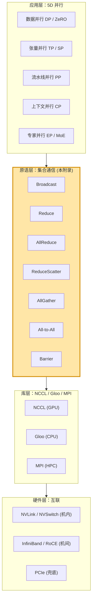

原书在第 142 页给出的"每种并行沿哪个维度切"，我们这里再补上"**它靠哪个原语通信**"——这正是本附录要补全的最后一列：

| # | 并行 | 沿哪个维度切 | 省了什么 | **主力通信原语** |
|---|------|------|------|------|
| 1 | 数据并行 DP（Data Parallelism） | batch 批次维 | ZeRO 省优化器/梯度/参数显存 | **AllReduce**（梯度），ZeRO 拆成 **ReduceScatter + AllGather** |
| 2 | 张量并行 TP（Tensor Parallelism） | hidden 隐藏维 | 权重 + 激活显存 | **AllReduce / AllGather / ReduceScatter** |
| 3 | 序列/上下文并行 SP/CP | sequence 序列维 | 激活显存（长序列） | **AllGather / ReduceScatter**（SP），**P2P / All-Gather KV**（Ring Attention） |
| 4 | 流水线并行 PP（Pipeline Parallelism） | layer 层维 | 权重显存（深模型） | **P2P Send/Recv**（点对点，非集合） |
| 5 | 专家并行 EP（Expert Parallelism） | expert 专家维 | MoE 权重显存 | **All-to-All**（路由 token） |

> 💡 **面试高频**：被问"DP/TP/EP 各用什么通信原语"，标准答案就是上表最后一列。再追问一句"为什么 DP 用 AllReduce 而 ZeRO 用 ReduceScatter+AllGather"——因为 **AllReduce = ReduceScatter + AllGather**（下文 Ring AllReduce 一节会证明），ZeRO 只是把这两步**拆开、分别在不同时机做**，从而把梯度/参数也切片省显存。这个"拆"是 ZeRO 的灵魂。

---

## 1️⃣ 基础概念：进程 / rank / world_size / 进程组

在讲任何原语之前，必须先把"**谁在通信**"这件事讲清楚。原书第 217 页开篇就点了题：我们有一堆**独立的节点（independent nodes）**，可能是 CPU 核、GPU、或整台计算节点；每个节点先各自算一段，然后要把结果（或一部分）发给别的节点供下一步用。

### 1.1 是什么：四个核心名词

| 名词 | 英文 | 是什么 | 怎么拿到 |
|------|------|--------|----------|
| **进程** | process / worker / node | 一个独立运行的程序实例。**约定：1 个进程绑定 1 张 GPU** | 由 `torchrun` 启动 |
| **rank** | rank | 进程的全局编号，`0 ~ world_size-1`，**全局唯一** | `dist.get_rank()` |
| **local_rank** | local rank | 进程在**本机**内的编号（决定用哪张本地 GPU） | `int(os.environ["LOCAL_RANK"])` |
| **world_size** | world size | 参与通信的进程总数 | `dist.get_world_size()` |
| **root / src / dst** | root | 某些操作里"地位特殊"的那个节点（数据的源或目标） | 由你在 API 里指定，如 `src=0` |

> ⚠️ **最常见的混淆：rank ≠ GPU 编号（物理）**。`rank` 是逻辑编号；`local_rank` 才用来 `torch.cuda.set_device()` 选物理卡。在 2 机 × 8 卡 = 16 进程的集群里，rank 是 0–15，但每台机器上的 `local_rank` 都是 0–7。原书示例代码里 `torch.cuda.set_device(dist.get_rank())` 只在**单机**下成立（单机时 rank == local_rank）；多机时必须改用 `local_rank`，这是新手第一个大坑。

举个具体的拓扑：**2 台机器 × 每台 8 张 GPU = world_size 16**。

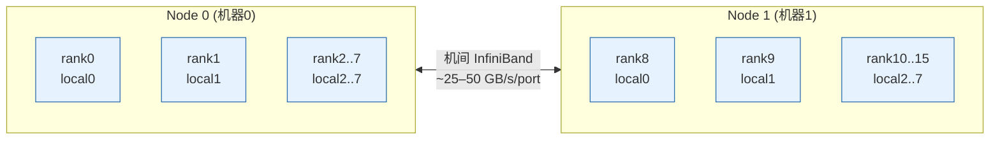

机内 8 卡之间走 **NVLink/NVSwitch**（几百 GB/s），两台机器之间走 **InfiniBand**（几十 GB/s）——**机内快、机间慢，差一个数量级**，这是后面所有"通信优化"的物理根源。

### 1.2 为什么要"进程组"：init_process_group 干了三件事

原书第 217 页底部说：用 `dist.init_process_group` 初始化一个**进程组（process group）**，它做三件事：

1. **设定通信后端（backend）**：NCCL / Gloo / MPI（下文详述）；
2. **确定有多少 worker、给每个分配 rank**；
3. **在所有 worker 之间建立连接**（握手，交换地址）。

```python
import torch
import torch.distributed as dist

def init_process():
    dist.init_process_group(backend='nccl')   # ① 选后端：GPU 用 nccl
    torch.cuda.set_device(dist.get_rank())     # ② 把当前进程绑到第 rank 张卡（单机）
```

**逐行精讲**：

- `import torch.distributed as dist`：PyTorch 的分布式子模块，**所有集合通信原语都挂在 `dist.` 下**（`dist.broadcast`、`dist.all_reduce`…）。
- `dist.init_process_group(backend='nccl')`：这是一道**集合操作**——所有进程必须都调用它、并在此**汇合（rendezvous）**才能返回。`backend='nccl'` 表示用 NVIDIA 的 GPU 通信库。它会去读环境变量 `MASTER_ADDR`、`MASTER_PORT`、`RANK`、`WORLD_SIZE`（由 `torchrun` 自动注入）来完成握手。
- `torch.cuda.set_device(dist.get_rank())`：把当前进程的"默认 CUDA 设备"设成第 `rank` 张卡。**之所以必须设**：NCCL 要求每个进程独占一张卡；不设的话所有进程都默认用 `cuda:0`，会挤在一张卡上既慢又会显存爆。

### 1.3 怎么跑：torchrun 与启动方式

原书第 219 页给出运行命令：

```bash
torchrun --nproc_per_node=3 dist_op.py
```

- `torchrun` 是 PyTorch 官方的分布式启动器（取代老的 `python -m torch.distributed.launch`）。
- `--nproc_per_node=3`：在**本机**起 3 个进程（需要 3 张 GPU；卡不够就改小这个数，或用 `gloo` 后端跑 CPU）。它会自动为每个进程设好 `RANK`、`LOCAL_RANK`、`WORLD_SIZE` 等环境变量。
- 多机时还要加 `--nnodes=2 --node_rank=0/1 --master_addr=... --master_port=...`。

> 💡 **实战**：本地只有 1 张卡（甚至没有卡）也能学这些原语——把 `backend='nccl'` 换成 `backend='gloo'`，`.cuda()` 全去掉，用 `--nproc_per_node=4` 起 4 个 **CPU 进程**即可在笔记本上把这 7 个原语全跑通。配套项目 06 就提供了这种 CPU 版，方便零 GPU 学习。

下面正式进入 7 个原语。**统一约定**：例子里 world_size = 3（rank 0/1/2），每个张量长度记为 K（原书例子里 K=5）。

---

## 2️⃣ Broadcast 广播：一份数据，发给所有人

### 2.1 是什么 / 为什么 / 怎么用

**Broadcast（广播）**：节点 1（root）上有一份数据，想原封不动地**复制到所有其他节点**，好让大家都拿这份数据去算。这是最简单的原语。

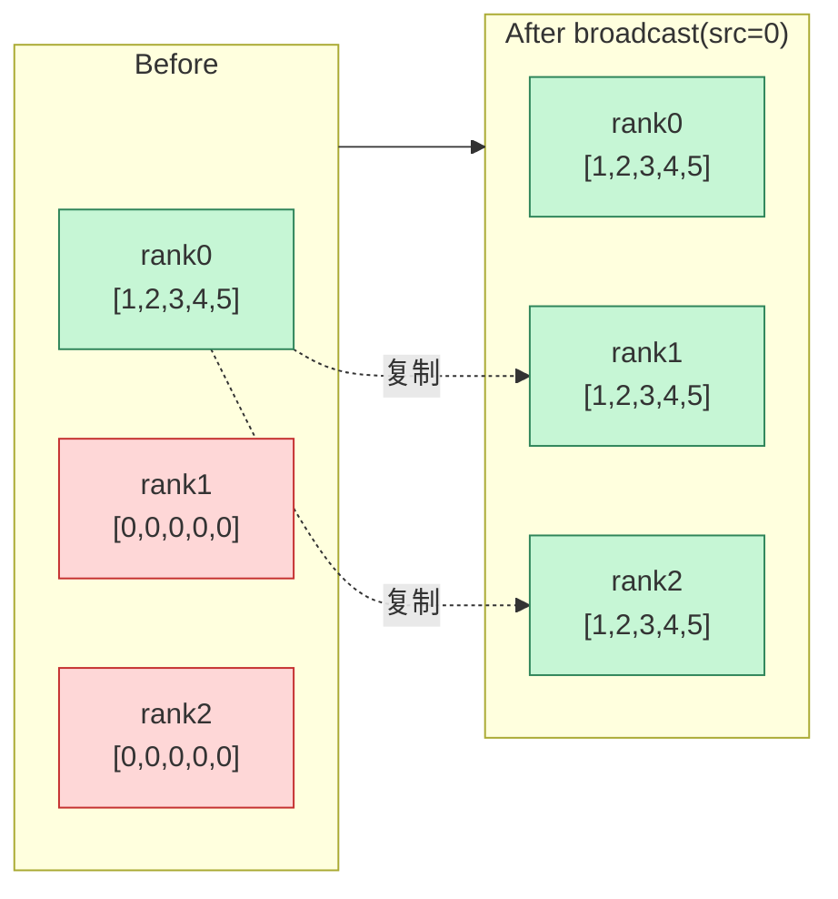

### 2.2 逐行讲代码（原书 CODE.XVII）

```python
def example_broadcast():
    if dist.get_rank() == 0:
        # 只有 rank0 持有真实数据
        tensor = torch.tensor([1, 2, 3, 4, 5], dtype=torch.float32).cuda()
    else:
        # 其他 rank 先准备一个全 0 的"容器"，形状/dtype 必须和源一致
        tensor = torch.zeros(5, dtype=torch.float32).cuda()
    print(f"Before broadcast on rank {dist.get_rank()}: {tensor}")
    dist.broadcast(tensor, src=0)    # ← 核心：把 src=0 的 tensor 广播到所有 rank
    print(f"After broadcast on rank {dist.get_rank()}: {tensor}")

init_process()
example_broadcast()
```

**关键点逐条**：

- `torch.zeros(5, ...)`：非 root 节点**必须预先分配好同样形状、同样 dtype 的张量**当接收缓冲区。NCCL 不会帮你分配内存，它只负责"把字节填进你给的 buffer"。形状对不上 → 报错或脏数据。
- `dist.broadcast(tensor, src=0)`：**原地（in-place）操作**——root 的 `tensor` 内容会被写进每个 rank 的 `tensor`。这是一道**集合操作**：所有 rank 都得调用它才会返回。
- root 自己的 `tensor` 不变（它本来就是源）。

运行输出（原书 CODE.XVIII，已为可读性排序，实际可能乱序打印）：

```
Before broadcast on rank 0: tensor([1., 2., 3., 4., 5.], device='cuda:0')
Before broadcast on rank 1: tensor([0., 0., 0., 0., 0.], device='cuda:1')
Before broadcast on rank 2: tensor([0., 0., 0., 0., 0.], device='cuda:2')
After  broadcast on rank 0: tensor([1., 2., 3., 4., 5.], device='cuda:0')
After  broadcast on rank 1: tensor([1., 2., 3., 4., 5.], device='cuda:1')
After  broadcast on rank 2: tensor([1., 2., 3., 4., 5.], device='cuda:2')
```

> ⚠️ **打印乱序不是 bug**：原书特意提醒——`print` 谁先执行无法控制，多进程输出本来就会交错。要有序得自己按 rank 排或加 `dist.barrier()`。

### 2.3 通信量公式

朴素实现（root 逐个发给 N−1 个节点）：root 要发 $(N-1)\,K$ 字节，是瓶颈。优化实现（树形/流水线 Broadcast，NCCL 内部用）：

$$
T_{\text{broadcast}} \approx \frac{K}{B}\quad(\text{流水线/树形，理想下与 }N\text{ 弱相关})
$$

其中 $K$ 是数据字节数，$B$ 是带宽。重点记：**广播只搬数据、不做计算**。

### 2.4 用在哪种并行

- **加载模型/初始化权重**：rank0 从磁盘读权重，`broadcast` 给其他 DP 副本，保证所有数据并行副本初始参数完全一致（DDP 启动时就做这件事）。
- **TP 中**：把某些需要全副本的标量/小张量（如随机种子、dropout mask 同步）广播出去。
- **PP / 调度**：把一些控制信号广播给所有 stage。

---

## 3️⃣ Reduce 规约 与 AllReduce 全规约：把大家的数加起来

### 3.1 是什么：Reduce vs AllReduce 的唯一区别

**Reduce（规约）**：用一个函数 $f$（求和 SUM、平均 AVG、最大 MAX…）把所有节点上的数据**合并成一个结果**，但结果**只送给 root 一个节点**。

**AllReduce（全规约）**：同样合并，但结果**广播给所有节点**。

> 一句话：**AllReduce = Reduce + Broadcast**（先合并到 root，再发给所有人）。这也是为什么 AllReduce 比 Reduce 贵一倍。

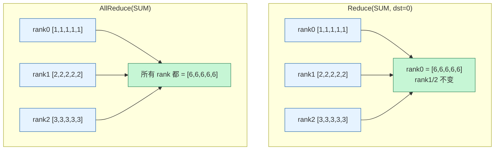

> 🔬 **没有"凭空飞行"的节点**：原书第 219 页强调——没有一个"自由飘在空中的节点"能凭空完成求和。实际是每个节点做**部分计算**，节点按**环（ring）或树（tree）**组织起来传递。比如环形求和：第一个节点把数发给邻居，邻居加上自己的数再转发……转一圈回到起点就拿到总和。这个"环"正是 Ring AllReduce 的思想（见第 7 节）。

### 3.2 逐行讲 Reduce 代码（原书 CODE.XIX）

```python
def example_reduce():
    # 每个 rank 造一个 [rank+1]*5 的张量：rank0→[1,1,1,1,1], rank1→[2,...], rank2→[3,...]
    tensor = torch.tensor([dist.get_rank() + 1] * 5, dtype=torch.float32).cuda()
    print(f"Before reduce on rank {dist.get_rank()}: {tensor}")
    dist.reduce(tensor, dst=0, op=dist.ReduceOp.SUM)   # 求和，结果只放到 dst=0
    print(f"After reduce on rank {dist.get_rank()}: {tensor}")
```

- `op=dist.ReduceOp.SUM`：规约算子。可选 `SUM / PRODUCT / MIN / MAX / BAND / BOR / BXOR`，以及（NCCL）`AVG`、`PREMUL_SUM`。
- `dst=0`：结果落在 rank0。**只有 rank0 的 `tensor` 被更新**，rank1/2 的 `tensor` 保持原值（这是 Reduce 与 AllReduce 的唯一区别）。

输出：rank0 → `[6,6,6,6,6]`（=1+2+3），rank1 仍 `[2,...]`、rank2 仍 `[3,...]`。

### 3.3 逐行讲 AllReduce 代码（原书 CODE.XXI）

```python
def example_all_reduce():
    tensor = torch.tensor([dist.get_rank() + 1] * 5, dtype=torch.float32).cuda()
    print(f"Before all_reduce on rank {dist.get_rank()}: {tensor}")
    dist.all_reduce(tensor, op=dist.ReduceOp.SUM)   # 注意：不需要 dst！
    print(f"After all_reduce on rank {dist.get_rank()}: {tensor}")
```

- **不需要 `dst`**：因为结果要发给所有人。（原书代码里写了 `dst=0` 其实是笔误，`all_reduce` 没有 `dst` 参数。）
- 结果：**所有 rank 都得到 `[6,6,6,6,6]`**。

### 3.4 通信量公式（重点）

Ring AllReduce 的精确通信量（第 7 节会推）：每张卡收发的数据量

$$
V_{\text{AllReduce}} = 2\cdot\frac{N-1}{N}\cdot K \;\xrightarrow{N\text{ 大}}\; 2K
$$

即 **AllReduce 的单卡通信量 ≈ 2 倍数据量**，与 N 几乎无关（这正是它能 scale 的原因）。换算成时间（理想 bus 带宽 $B$）：

$$
T_{\text{AllReduce}} \approx \frac{2(N-1)}{N}\cdot\frac{K}{B} \approx \frac{2K}{B}
$$

### 3.5 用在哪种并行（AllReduce 是 DP 的心脏）

- **数据并行 DP 梯度同步**：每个 DP 副本各自 backward 得到本地梯度，然后对**全部梯度** AllReduce(SUM)，再除以 N（或直接用 AVG）得到平均梯度，保证所有副本用同一份梯度更新 → 参数始终一致。**这是 LLM 训练中通信量最大的一处**：通信量 ≈ 2 × 模型参数量（每步！）。
- **张量并行 TP**：行并行（row-parallel）线性层的输出需要把各卡的部分和 AllReduce 求全和（原书 TP 章 $f$ / $g$ 算子里的 $g$）。
- **Loss / 指标聚合**：把各卡的 loss、token 数 AllReduce 求和，算全局平均。

> 💡 **面试高频**：65B 模型 BF16 训练，DP=64，每步 DP 通信量多少？参数 65×10⁹，BF16 每参数 2 字节 → 梯度 130 GB。AllReduce 单卡收发 ≈ 2×130 = 260 GB/step。若 NVLink/IB 有效带宽 200 GB/s，则**纯梯度通信 ≈ 1.3 s/step**——这就是为什么要 ZeRO、要梯度累积、要计算-通信重叠（overlap）。

---

## 4️⃣ Gather 收集 与 AllGather 全收集：把碎片拼起来（不做计算）

### 4.1 是什么

**Gather（收集）**：每个节点持有一块**不同的数据**（chunk），把它们**收集到一个节点**上拼成完整列表。
**AllGather（全收集）**：收集到**所有**节点上（每个节点都拿到完整拼图）。

和 Broadcast 的区别：Broadcast 是"一份数据复制 N 份"；Gather/AllGather 是"N 块不同数据拼成 1 个"。和 Reduce 的区别：Gather **不做计算，只拼接**（保留每块原样）。

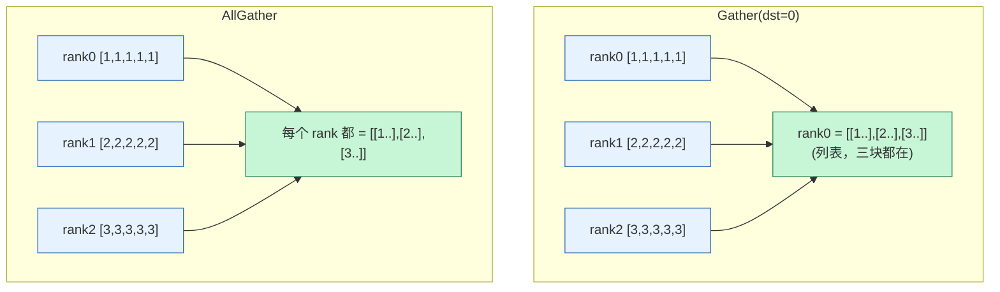

> 原书第 221 页提到：图里的虚线表示"有些数据其实根本没动"（因为它本来就在那个节点上）。AllGather 里每个节点自己的 chunk 不需要再发给自己。

### 4.2 逐行讲 Gather 代码（原书 CODE.XXIII）

```python
def example_gather():
    tensor = torch.tensor([dist.get_rank() + 1] * 5, dtype=torch.float32).cuda()
    if dist.get_rank() == 0:
        # 只有 dst 节点要准备"容器列表"，长度 = world_size，每个槽位是同形状空张量
        gather_list = [
            torch.zeros(5, dtype=torch.float32).cuda()
            for _ in range(dist.get_world_size())
        ]
    else:
        gather_list = None   # 非 dst 节点不需要容器
    print(f"Before gather on rank {dist.get_rank()}: {tensor}")
    dist.gather(tensor, gather_list, dst=0)   # 各 rank 的 tensor → 汇集到 rank0 的 gather_list
    if dist.get_rank() == 0:
        print(f"After gather on rank 0: {gather_list}")
```

- `gather_list`：**只有 dst 才需要**，是一个**张量列表**，长度等于 world_size，第 i 个槽位接收 rank i 的张量。非 dst 传 `None`。
- 结果：rank0 的 `gather_list == [[1,1,1,1,1], [2,2,2,2,2], [3,3,3,3,3]]`。

### 4.3 逐行讲 AllGather 代码（原书 CODE.XXV）

```python
def example_all_gather():
    tensor = torch.tensor([dist.get_rank() + 1] * 5, dtype=torch.float32).cuda()
    # AllGather：每个节点都要准备容器（区别于 Gather 只有 dst 准备）
    gather_list = [
        torch.zeros(5, dtype=torch.float32).cuda()
        for _ in range(dist.get_world_size())
    ]
    print(f"Before all_gather on rank {dist.get_rank()}: {tensor}")
    dist.all_gather(gather_list, tensor)   # 注意参数顺序：(输出列表, 输入张量)，无 dst
    print(f"After all_gather on rank {dist.get_rank()}: {gather_list}")
```

- 原书原话：AllGather 相对 Gather"唯一要改的"就是**每个节点都要准备容器**。
- `dist.all_gather(gather_list, tensor)`：参数顺序是 **(输出, 输入)**，和很多人直觉相反，**易错点**。
- 结果：**每个 rank** 的 `gather_list` 都变成完整的三块。

### 4.4 通信量公式

AllGather（Ring 实现）每张卡收发：

$$
V_{\text{AllGather}} = \frac{N-1}{N}\cdot K_{\text{total}} \approx K_{\text{total}}
$$

其中 $K_{\text{total}}$ 是拼起来后的总大小。**注意：AllGather 通信量约是 AllReduce 的一半**（因为只搬不算，少了"reduce 阶段的回搬"）。

### 4.5 用在哪种并行

- **ZeRO-3 / FSDP 参数收集**：参数被切片存在各卡，前向/反向**用到某层时临时 AllGather** 出完整权重，算完即丢——用通信换显存的核心机制。
- **序列并行 SP**：SP 把激活按序列维切开存，进入需要全序列的算子（如 LayerNorm 后接 TP 的列并行）前，用 AllGather 把序列拼回。
- **张量并行 TP**：列并行（column-parallel）的输出有时要 AllGather 拼回完整 hidden。

---

## 5️⃣ Scatter 散射 与 ReduceScatter 规约散射：分发碎片（后者带计算）

### 5.1 是什么

**Scatter（散射）**：和 Gather 相反——一个节点有一大块数据，把它**切成 N 片，每个节点发一片**。和 Broadcast 的区别：Broadcast 发的是**完整副本**，Scatter 发的是**切片**。

**ReduceScatter（规约散射）**：比 Scatter 复杂一点。像 AllReduce 一样**先对所有节点的数据做规约**，但每个节点**只拿到结果的一个切片**（而不是像 AllReduce 那样人人拿到完整结果）。

> 一句话对照（原书 FIG.XC 的精髓）：
> - **AllReduce**：reduce 之后，**每人拿全部**。
> - **ReduceScatter**：reduce 之后，**每人只拿 1/N 切片**。
> 所以 **AllReduce = ReduceScatter + AllGather**（先各拿一片，再把片拼全）。

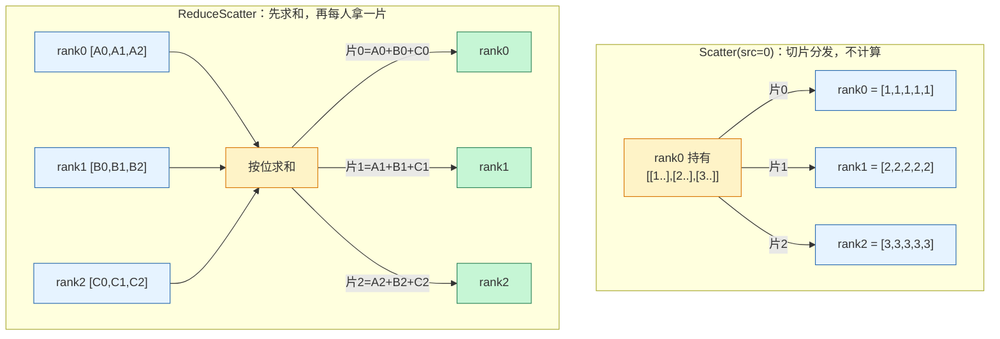

### 5.2 逐行讲 Scatter 代码（原书 CODE.XXVII）

```python
def example_scatter():
    if dist.get_rank() == 0:
        # 源节点准备"要分发的列表"：第 i 片发给 rank i
        scatter_list = [
            torch.tensor([i + 1] * 5, dtype=torch.float32).cuda()
            for i in range(dist.get_world_size())
        ]                       # [[1..],[2..],[3..]]
        print(f"Rank 0: Tensor to scatter: {scatter_list}")
    else:
        scatter_list = None
    tensor = torch.zeros(5, dtype=torch.float32).cuda()   # 每个 rank 的接收 buffer
    print(f"Before scatter on rank {dist.get_rank()}: {tensor}")
    dist.scatter(tensor, scatter_list, src=0)   # 把 src 的 scatter_list 第 i 片发给 rank i
    print(f"After scatter on rank {dist.get_rank()}: {tensor}")
```

- 和 Gather 完全镜像：Gather 准备"接收列表"，Scatter 准备"发送列表"，且都要指定 `src`/`dst`。
- 结果：rank0 → `[1,1,1,1,1]`，rank1 → `[2,2,2,2,2]`，rank2 → `[3,3,3,3,3]`。

### 5.3 逐行讲 ReduceScatter 代码（原书 CODE.XXIX，含巧妙构造的数据）

原书故意造了"有意思"的数据来展示规约+切片：每个节点造一个**长度 = world_size 的张量列表**，每个张量是 `[rank+1 的倍数]` 再取 `(j+1)` 次幂。

```python
def example_reduce_scatter():
    rank = dist.get_rank()
    world_size = dist.get_world_size()
    # 第 j 片 = ([(rank+1)*1, (rank+1)*2]) 的 (j+1) 次幂
    input_tensor = [
        torch.tensor([(rank + 1) * i for i in range(1, 3)],
                     dtype=torch.float32).cuda() ** (j + 1)
        for j in range(world_size)
    ]
    output_tensor = torch.zeros(2, dtype=torch.float32).cuda()   # 只收 1 片（长度2）
    print(f"Before ReduceScatter on rank {rank}: {input_tensor}")
    dist.reduce_scatter(output_tensor, input_tensor, op=dist.ReduceOp.SUM)
    print(f"After ReduceScatter on rank {rank}: {output_tensor}")
```

我们把数据列出来（验证语义）。基向量 `[(rank+1)*1, (rank+1)*2]`：

| rank | base | 片0 = base¹ | 片1 = base² | 片2 = base³ |
|------|------|------|------|------|
| 0 | [1,2] | [1,2] | [1,4] | [1,8] |
| 1 | [2,4] | [2,4] | [4,16] | [8,64] |
| 2 | [3,6] | [3,6] | [9,36] | [27,216] |

ReduceScatter(SUM) 后，**rank r 拿到"所有节点第 r 片之和"**：

- rank0 = 片0 求和 = [1+2+3, 2+4+6] = **[6, 12]** ✅
- rank1 = 片1 求和 = [1+4+9, 4+16+36] = **[14, 56]** ✅
- rank2 = 片2 求和 = [1+8+27, 8+64+216] = **[36, 288]** ✅

和原书输出完全一致。**这就是 ReduceScatter 的精髓：竖着把每个节点的第 r 片加起来，结果归 rank r**。

- `dist.reduce_scatter(output_tensor, input_tensor, op=...)`：参数 **(输出片, 输入列表, 算子)**。输入是列表（N 片），输出是单片。

### 5.4 通信量公式

ReduceScatter（Ring 实现）每张卡收发：

$$
V_{\text{ReduceScatter}} = \frac{N-1}{N}\cdot K_{\text{total}} \approx K_{\text{total}}
$$

和 AllGather **完全相同**（它俩是 AllReduce 拆出来的两半，各占一半）：

$$
\underbrace{V_{\text{ReduceScatter}}}_{\approx K} + \underbrace{V_{\text{AllGather}}}_{\approx K} = \underbrace{V_{\text{AllReduce}}}_{\approx 2K}
$$

### 5.5 用在哪种并行

- **ZeRO-1/2/3 与 FSDP 的梯度规约**：不再对全梯度 AllReduce，而是 **ReduceScatter** —— 每张卡只拿到"自己负责那一片参数"的规约后梯度，于是优化器状态、梯度都只存 1/N，显存大降。这是 ZeRO 省显存的关键一步。
- **张量并行 TP + 序列并行 SP**：原书 TP 章里，row-parallel 之后接 SP 时，把 AllReduce 替换成 **ReduceScatter**（输出顺便切回序列维），通信量不变但激活显存减半。
- **任何"AllReduce 后马上要切片"的场景**：直接用 ReduceScatter 省一次搬运。

---

## 6️⃣ All-to-All 全到全：每人给每人发不同的片

### 6.1 是什么（书附录没单列，但 EP 章重度使用，这里补全）

**All-to-All（全到全）**：每个节点都有 N 片数据，**第 j 片发给 rank j**；同时从每个节点收一片。可以理解为"**N 个节点同时各做一次 Scatter**"，等价于把一个 `[N, N]` 的数据矩阵做**转置**。

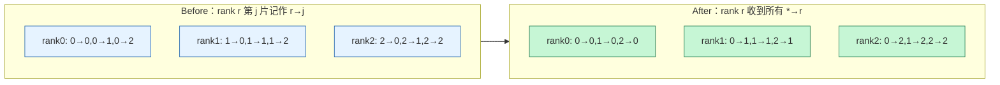

PyTorch API：

```python
# 等分版本：input 沿 dim0 切成 world_size 份，第 j 份发给 rank j
output = torch.empty_like(input)
dist.all_to_all_single(output, input)

# 不等分版本（MoE 必用，因为每个专家收到的 token 数不同）：
dist.all_to_all_single(output, input,
                       output_split_sizes=out_splits,   # 我从每个 rank 收多少
                       input_split_sizes=in_splits)     # 我发给每个 rank 多少
```

### 6.2 通信量公式

每张卡发出 $(N-1)/N$ 的数据、收进同样多。总通信量与数据量同阶；但 All-to-All 的**消息数是 $N^2$**（每对节点都通信），所以**对延迟（latency）和小消息特别敏感**，机间做 All-to-All 是 MoE 训练的头号瓶颈。

$$
V_{\text{All2All}} \approx \frac{N-1}{N}\cdot K_{\text{total}} \approx K_{\text{total}},\qquad \#\text{messages} = N(N-1)
$$

### 6.3 用在哪种并行

- **专家并行 EP（MoE）**：router 决定每个 token 去哪个专家，专家分布在不同卡上 → 用 All-to-All **把 token 路由到对应专家所在卡**（dispatch），算完再用一次 All-to-All **送回原位**（combine）。这是 EP 唯一也是最贵的通信。
- **TP 的某些重排** 和 **序列<->hidden 维度转换**（如 DeepSpeed-Ulysses 的序列并行注意力）也用 All-to-All 在"按序列切"和"按头切"之间转换。

> ⚠️ **MoE 大坑：负载不均**。如果某专家被 router 选中特别多，对应卡的 All-to-All 收到超量 token → 该卡变慢、拖垮整个 batch。所以要 capacity factor（容量因子）截断 + 负载均衡损失。详见正文第 6 章 EP。

---

## 7️⃣ Ring AllReduce 与 Tree AllReduce：算法与带宽

这是整个附录最硬核、也最值钱的一节。原书第 225–230 页用了 2 张大图（FIG.XCI ReduceScatter 步、FIG.XCII AllGather 步）讲清了 **Ring AllReduce**。

### 7.1 为什么不能"所有卡直接互发"

朴素 AllReduce：让一个 root 收集所有卡的数据求和再广播回去。问题：**root 成为瓶颈**——它要收 $(N-1)K$、发 $(N-1)K$，带宽被它一个人占满，N 越大越糟。Ring AllReduce 的目标就是**让每张卡的收发量与 N 几乎无关**。

### 7.2 Ring AllReduce = ReduceScatter + AllGather（两阶段，各 N−1 步）

把 N 张卡连成一个环（rank0→1→2→…→N−1→0），每张卡的张量切成 **N 个 chunk**。

**阶段一：ReduceScatter（N−1 步）**

- 每一步：每张卡把"某个 chunk"发给**右邻居**，同时从**左邻居**收一个 chunk，**把收到的加到自己对应 chunk 上**（边传边 reduce）。
- 转 N−1 步后：**每张卡恰好持有 1 个"全局求和完成"的 chunk**（rank r 持有第 r 个 chunk 的总和）。

**阶段二：AllGather（N−1 步）**

- 每一步：每张卡把"自己那个已求和的 chunk"发给右邻居、从左邻居收一个，**直接覆盖**（不加）。
- 转 N−1 步后：**每张卡都集齐了全部 N 个求和后的 chunk** → 完整 AllReduce 结果。

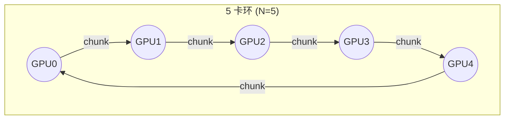

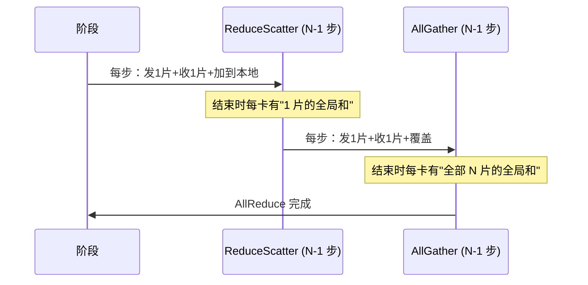

### 7.3 带宽推导（原书第 229–230 页的公式补全）

设数组总元素数 $K$，GPU 数 $N$，每个 chunk 大小 $K/N$。

- 两个阶段各 $N-1$ 步，每步每张卡**发送 $K/N$、接收 $K/N$**。
- 单卡**发送**总量 = $2(N-1)\cdot \dfrac{K}{N}$，接收同理。

$$
\boxed{V_{\text{每卡收发}} = 2\cdot\frac{N-1}{N}\cdot K \;\xrightarrow{N\to\infty}\; 2K}
$$

**关键结论（原书黑体强调的两点）**：

1. AllReduce 单卡通信量 $\approx 2K$（书里写作 $2\Psi$，$\Psi$=参数量），**与 N 无关** → 完美可扩展。
2. AllReduce 可拆成 ReduceScatter + AllGather，**每个的通信量是 AllReduce 的一半**，即 $\approx K$（$\Psi$）。

时间（设每卡双向带宽 $B$）：

$$
T_{\text{Ring AllReduce}} = \frac{2(N-1)}{N}\cdot\frac{K\cdot b}{B}
$$

其中 $b$ 是每元素字节数。**注意**：环越长，**延迟**（步数 $2(N-1)$）越大——所以 Ring 适合大消息（带宽受限），不适合小消息（延迟受限）。

> 🔬 **第一性原理：为什么 Ring 最优**。链路总带宽固定，AllReduce 至少要让每张卡"看过"全部数据一遍（reduce）再"散布"一遍（gather），信息论下界就是 $\approx 2K$ 收发。Ring 让每条链路**始终满负荷、无空闲、无热点**，恰好打到这个下界。这就是 NCCL/Horovod 默认用 Ring 的原因。

### 7.4 Tree AllReduce：低延迟的另一条路

| 维度 | Ring AllReduce | Tree AllReduce / Double-Tree |
|------|------|------|
| 步数（延迟） | $2(N-1)$，**随 N 线性增长** | $\sim 2\log_2 N$，**对数增长** |
| 单卡带宽 | $\approx 2K$，最优 | 略高于 Ring，但常数大 |
| 擅长 | **大消息**（带宽受限，如梯度 AllReduce） | **小消息 / 大规模 N**（延迟受限） |
| 典型场景 | 单机/中等集群大张量 | 上千 GPU 跨多机、小张量同步 |

NCCL 会**自动**根据消息大小、N、拓扑在 Ring / Tree / CollNet 之间选（也可用环境变量 `NCCL_ALGO=Ring/Tree` 强制）。**双二叉树（double binary tree）** 是 NCCL 在超大规模下的默认，能同时拿到对数延迟和接近满的带宽。

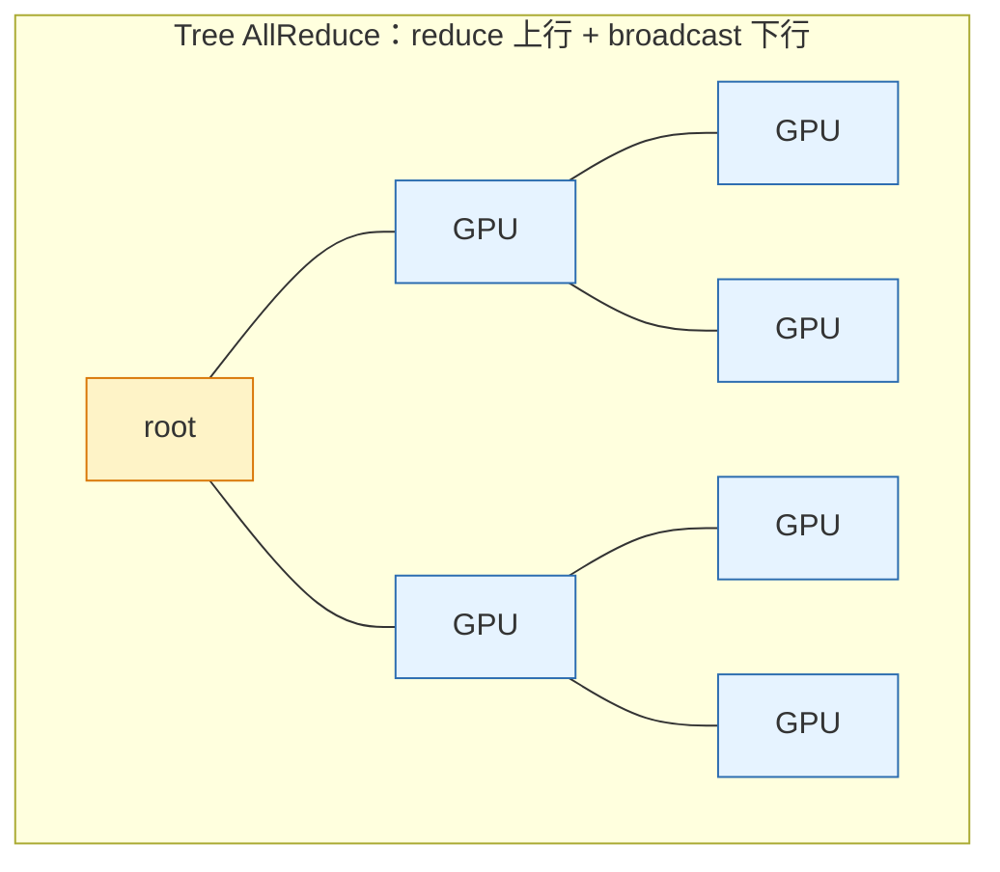

> 💡 **面试高频**：「Ring 和 Tree AllReduce 怎么选？」——大张量（如梯度）用 Ring（带宽最优、延迟可摊销）；小张量/超大集群用 Tree（延迟 $O(\log N)$）。NCCL 自动切换，但理解原理才能在 profile 看到诡异通信耗时时判断该调 `NCCL_ALGO`。

---

## 8️⃣ Barrier 栅栏：让所有节点对齐

### 8.1 是什么

**Barrier（栅栏）**：最简单的同步原语。**所有节点都到达 barrier 之前，谁也不许往下走**；等最后一个到了，所有人同时放行。

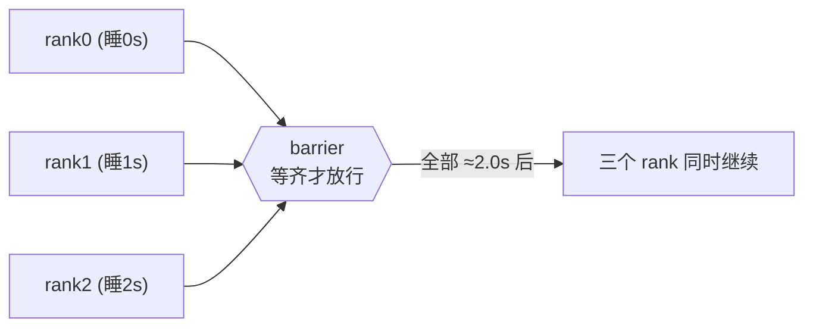

### 8.2 逐行讲代码（原书 CODE.XXXI）

```python
import time
def example_barrier():
    rank = dist.get_rank()
    t_start = time.time()
    print(f"Rank {rank} sleeps {rank} seconds.")
    time.sleep(rank)        # rank0 睡0s, rank1 睡1s, rank2 睡2s —— 人为制造快慢不均
    dist.barrier()          # 在此等所有人
    print(f"Rank {rank} after barrier time delta: {time.time()-t_start:.4f}")
```

输出：

```
Rank 0 after barrier time delta: 2.0025
Rank 1 after barrier time delta: 2.0025
Rank 2 after barrier time delta: 2.0024
```

**精髓**：rank0 明明一秒没睡，却也花了 ~2.0s 才过 barrier——因为它得**等最慢的 rank2 睡完 2 秒**。这就是"木桶效应"：barrier 的耗时 = 最慢节点的到达时间。

### 8.3 ⚠️ 别滥用 Barrier

原书第 232 页特意警告：**过度同步会抵消并行的意义**。让快节点干等慢节点，整体反而变慢。很多时候让快节点先跑下一个 job 完全 OK——因为它下一轮可能变慢，长期会自动"摊平"。

**Barrier 的正当用途**：计时/profile 前对齐（保证测的是真实并行段）、检查点保存前确保所有卡写完、调试死锁定位。**不要**在训练主循环里随手加 barrier。

> 💡 **冷知识**：很多集合操作（AllReduce 等）**本身就隐含同步**（必须所有 rank 都到才能完成），所以单独的 `dist.barrier()` 在训练循环里往往是冗余的。

---

## 9️⃣ NCCL / Gloo / MPI：到底用哪个？

原书第 232 页用一句俏皮话引出："训练大模型时，我们有时会挖到金子（gold），但**总会撞上镍（nickel，谐音 NCCL）**！" 这是把 NCCL 这个绕不开的库拟人化。

### 9.1 三个后端对比

PyTorch 的 `dist` 支持三种集合通信后端：

| 后端 | 全称 | 谁做的 | 擅长硬件 | PyTorch 里何时用 |
|------|------|--------|----------|------|
| **NCCL** | NVIDIA Collective Communications Library | NVIDIA | **GPU↔GPU**（NVLink/NVSwitch/IB/RoCE） | **GPU 训练首选** |
| **Gloo** | — | Meta | CPU↔CPU、CPU↔GPU | CPU 训练、调试、没有 NCCL 的环境 |
| **MPI** | Message Passing Interface | HPC 经典标准 | 各类超算互联 | 已有 MPI 集群、需自定义 MPI 实现时 |

原书给的"一句话决策树"：

- **GPU 训练 → 用 NCCL**
- **CPU 训练 → 用 Gloo**

### 9.2 NCCL 多讲两句（书没展开的本质）

NCCL 之所以是 GPU 训练事实标准，因为它把上面所有原语（AllReduce / ReduceScatter / AllGather / Broadcast / All-to-All…）针对 NVIDIA 拓扑做了**极致优化**：

- **拓扑感知**：自动探测 NVLink / NVSwitch / PCIe / InfiniBand 的连接图，构造最优 Ring / Tree。
- **GPUDirect RDMA**：GPU 显存里的数据**不经过 CPU/系统内存**，直接经网卡发到对端 GPU 显存，省一次拷贝、降延迟。
- **算法自适应**：按消息大小自动在 Ring / Tree / CollNet / NVLS（NVLink SHARP，在 NVSwitch 上做"网络内规约"）间切换。
- **常用调试环境变量**：`NCCL_DEBUG=INFO`（打印它选了什么算法/拓扑）、`NCCL_ALGO`、`NCCL_PROTO`、`NCCL_IB_DISABLE`、`NCCL_P2P_DISABLE`。

> ⚠️ **实战踩坑**：训练卡在 `init_process_group` 不动、或 AllReduce 莫名超时，90% 是 NCCL 的网络问题（IB 没起来、`NCCL_SOCKET_IFNAME` 选错网卡、防火墙挡了 `MASTER_PORT`）。第一步永远是 `export NCCL_DEBUG=INFO` 看它卡在哪。

---

## 🔟 真实硬件数字：带宽 / 延迟 / FLOPS（钻到物理层）

理解通信量公式后，还得知道分母 $B$（带宽）到底多大，才能算出真实时间。下面是各代 NVIDIA 平台的真实数字（近似值，便于估算量级）。

### 10.1 机内互联（NVLink / NVSwitch / PCIe）

| 互联 | 代际 | 单卡聚合双向带宽 | 备注 |
|------|------|------|------|
| PCIe Gen4 ×16 | 通用 | ~32 GB/s（双向，单向16） | 没有 NVLink 时的兜底，慢一个数量级 |
| PCIe Gen5 ×16 | 通用 | ~64 GB/s | H100 PCIe 版用 |
| NVLink 2.0 | V100 | ~300 GB/s（6 链 × 50） | 2017，第一代大规模 NVLink |
| NVLink 3.0 | A100 | ~600 GB/s（12 链 × 50） | 2020，DGX A100 8 卡全互联 |
| NVLink 4.0 | H100 | ~900 GB/s（18 链 × 50） | 2022，Hopper |
| NVLink 5.0 | B200 | ~1800 GB/s | 2024，Blackwell，翻倍 |
| NVSwitch | A100/H100 | 让机内 8 卡**任意两卡**都跑满 NVLink 带宽 | 全互联交叉开关，All-to-All 福音 |

### 10.2 机间互联（InfiniBand / RoCE）

| 互联 | 单端口带宽 | DGX 整机网络 | 备注 |
|------|------|------|------|
| InfiniBand HDR | 200 Gb/s = 25 GB/s | DGX A100：8×200Gb/s = 1.6 Tb/s | 2020 |
| InfiniBand NDR | 400 Gb/s = 50 GB/s | DGX H100：8×400Gb/s = 3.2 Tb/s | 2022 |
| RoCE v2 | 同等以太网速率 | 云厂商常用（成本低于 IB） | 基于以太网的 RDMA |

> 🔬 **机内 vs 机间差一个数量级**：H100 机内 NVLink ~900 GB/s，机间单端口 IB ~50 GB/s——**约 18 倍差距**。这就是为什么并行策略要"**把通信最重的维度（如 TP）放在机内、通信轻的（如 DP/PP）放到机间**"。正文第 7 章 5D 并行的"维度排布"全靠这条物理规律。

### 10.3 算力（FLOPS）—— 为了算"通信 vs 计算"谁是瓶颈

| GPU | BF16/FP16 稠密算力 | FP8 算力 | 显存 / 带宽 |
|------|------|------|------|
| V100 (32GB) | ~125 TFLOPS | — | 32 GB / 0.9 TB/s |
| A100 (80GB) | ~312 TFLOPS | — | 80 GB / 2.0 TB/s |
| H100 SXM | ~990 TFLOPS | ~1979 TFLOPS | 80 GB / 3.35 TB/s |
| H200 | ~990 TFLOPS | ~1979 TFLOPS | 141 GB / 4.8 TB/s |
| B200 | ~2250 TFLOPS（稠密近似） | ~4500 TFLOPS | 192 GB / 8 TB/s |

> 💡 **怎么用这些数字判断瓶颈**：一个 matmul 的计算时间 ≈ FLOPs / 算力，通信时间 ≈ 通信量 / 带宽。如果某并行让计算 < 通信，就是"**通信受限（communication-bound）**"，再多卡也不快——这时要么换并行策略，要么做**计算-通信重叠（overlap）**（正文反复出现的优化）。

### 10.4 延迟（latency）—— 小消息的隐形杀手

| 路径 | 典型延迟 | 影响 |
|------|------|------|
| NVLink P2P | ~1–2 μs | 机内极快 |
| InfiniBand（机间） | ~1–3 μs（链路）+ 软件栈 | 机间小消息瓶颈 |
| NCCL kernel 启动 | ~5–10 μs | 每次集合操作的固定开销 |

延迟解释了为什么"**很多小 AllReduce 不如一个大 AllReduce**"——固定开销被消息数放大。所以 DDP 会把多层梯度**打包成 bucket**（梯度桶）一起 AllReduce，减少消息数。

---

## 1️⃣1️⃣ 七大原语总表（带走这一张就够）

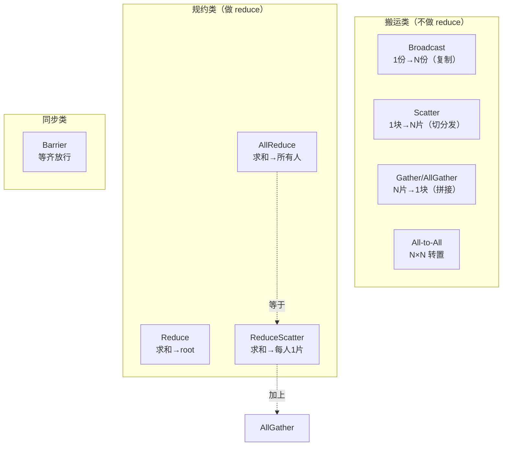

| 原语 | 一句话 | 做计算? | 单卡通信量(≈) | 主力用在 | PyTorch API |
|------|--------|:---:|------|------|------|
| **Broadcast** | 一份复制给所有人 | ❌ | $K$ | 初始化/同步权重 | `dist.broadcast` |
| **Reduce** | 求和只给 root | ✅ | $K$ | 指标聚合到主卡 | `dist.reduce` |
| **AllReduce** | 求和给所有人 | ✅ | $2K$ | **DP 梯度同步**、TP | `dist.all_reduce` |
| **Gather** | 碎片收到 root | ❌ | $K$ | 收集结果/采样 | `dist.gather` |
| **AllGather** | 碎片收到所有人 | ❌ | $K$ | **ZeRO-3/FSDP 取参**、SP | `dist.all_gather` |
| **Scatter** | root 切片分发 | ❌ | $K$ | 分发数据/分片 | `dist.scatter` |
| **ReduceScatter** | 求和后每人1片 | ✅ | $K$ | **ZeRO 梯度规约**、TP+SP | `dist.reduce_scatter` |
| **All-to-All** | 每人给每人不同片 | ❌ | $K$ | **EP/MoE 路由**、Ulysses | `dist.all_to_all_single` |
| **Barrier** | 等齐放行 | — | — | profile/检查点对齐 | `dist.barrier` |

> 记忆口诀：**"reduce 的给全部人 = AllReduce；reduce 的每人一片 = ReduceScatter；不 reduce 拼全 = AllGather；不 reduce 切发 = Scatter"**。而 **AllReduce = ReduceScatter + AllGather**，这条等式串起一切。

---

## 📌 本附录小结

1. **并行 = 切分 + 通信**。前面 5D 并行（DP/TP/PP/CP/EP）每一种都靠这一层的集合通信原语把切散的张量拼回正确答案。原语就是分布式训练的"指令集"。
2. **三个基础名词**：进程（1 进程绑 1 GPU）、rank（全局编号）、world_size（总进程数）；`init_process_group` 选后端 + 编号 + 建连，`torchrun` 启动。**rank ≠ local_rank** 是多机第一坑。
3. **七大原语**：Broadcast（复制）、Reduce（求和给 root）、AllReduce（求和给所有人）、Gather/AllGather（拼接）、Scatter/ReduceScatter（切分/求和切片）、All-to-All（转置路由）、Barrier（同步）。核心等式 **AllReduce = ReduceScatter + AllGather**。
4. **通信量**：AllReduce 单卡 $\approx 2K$ 且**与 N 无关**（Ring 的功劳）；ReduceScatter / AllGather 各 $\approx K$（半个 AllReduce）。这套数字让你能**手算任意并行配置的每步通信量**。
5. **Ring vs Tree**：Ring 带宽最优（$O(N)$ 步），适合大梯度；Tree 延迟最优（$O(\log N)$ 步），适合小消息/超大集群。NCCL 自动选。
6. **后端**：GPU 用 **NCCL**，CPU 用 **Gloo**，HPC 集群可 **MPI**。NCCL 拓扑感知 + GPUDirect RDMA + 算法自适应是 GPU 训练事实标准。
7. **硬件物理**：机内 NVLink（H100 ~900 GB/s）比机间 IB（NDR ~50 GB/s/port）快约 18 倍——**通信重的并行放机内、轻的放机间**，是 5D 并行排布的物理铁律。

> 🔬 **一句话本质**：所有分布式训练的优化，最终都是在"**显存 / 计算 / 通信**"三角里，用集合通信原语把"切分省下的显存"和"必须付出的通信代价"做最优平衡。读懂本附录，你就拿到了看穿正文每一章"通信什么、瓶颈在哪"的钥匙。

---

## 🔗 延伸阅读

- **配套动手项目**：[`../projects/06_collectives_from_scratch/`](../projects/06_collectives_from_scratch/) —— 从零用 `torch.distributed` 实现并 benchmark 这 7 个原语 + 手写 Ring AllReduce，CPU(gloo)/GPU(nccl) 双版本，无 GPU 也能跑。
- **正文相关章节**：
  - DP 与 ZeRO 如何把 AllReduce 拆成 ReduceScatter+AllGather → [`../book-guide/02_数据并行_DP_全批量_ZeRO分片.md`](../book-guide/02_数据并行_DP_全批量_ZeRO分片.md)
  - TP/SP 里 AllReduce ↔ AllGather/ReduceScatter 的替换 → [`../book-guide/03_张量并行_TP_序列并行_SP.md`](../book-guide/03_张量并行_TP_序列并行_SP.md)
  - CP / Ring Attention 的 P2P 与 AllGather → [`../book-guide/04_上下文并行_CP_RingAttention_ZigZag.md`](../book-guide/04_上下文并行_CP_RingAttention_ZigZag.md)
  - PP 的 P2P Send/Recv（非集合通信） → [`../book-guide/05_流水线并行_PP_AFAB_1F1B_交错_零气泡DualPipe.md`](../book-guide/05_流水线并行_PP_AFAB_1F1B_交错_零气泡DualPipe.md)
  - **All-to-All 与 MoE 路由** → [`../book-guide/06_专家并行_EP_MoE.md`](../book-guide/06_专家并行_EP_MoE.md)
  - 5D 并行如何按机内/机间排布通信 → [`../book-guide/07_5D并行总览_把所有维度拼起来.md`](../book-guide/07_5D并行总览_把所有维度拼起来.md)
- **官方资料**：PyTorch Distributed 文档（`torch.distributed`）、NCCL 官方文档（`NCCL_DEBUG`/`NCCL_ALGO`）、HuggingFace《Ultra-Scale Playbook》原书附录 A1。
