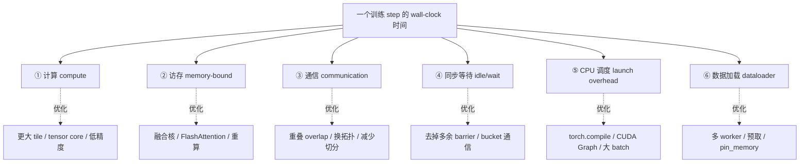
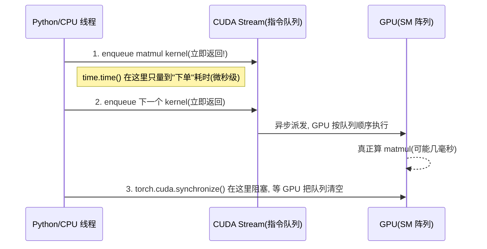
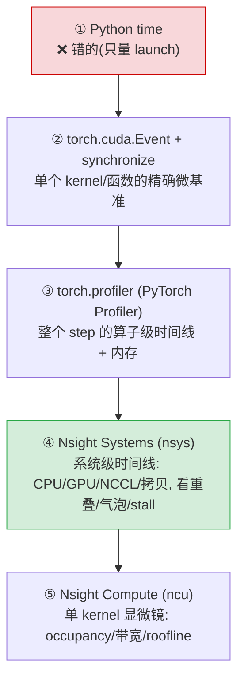
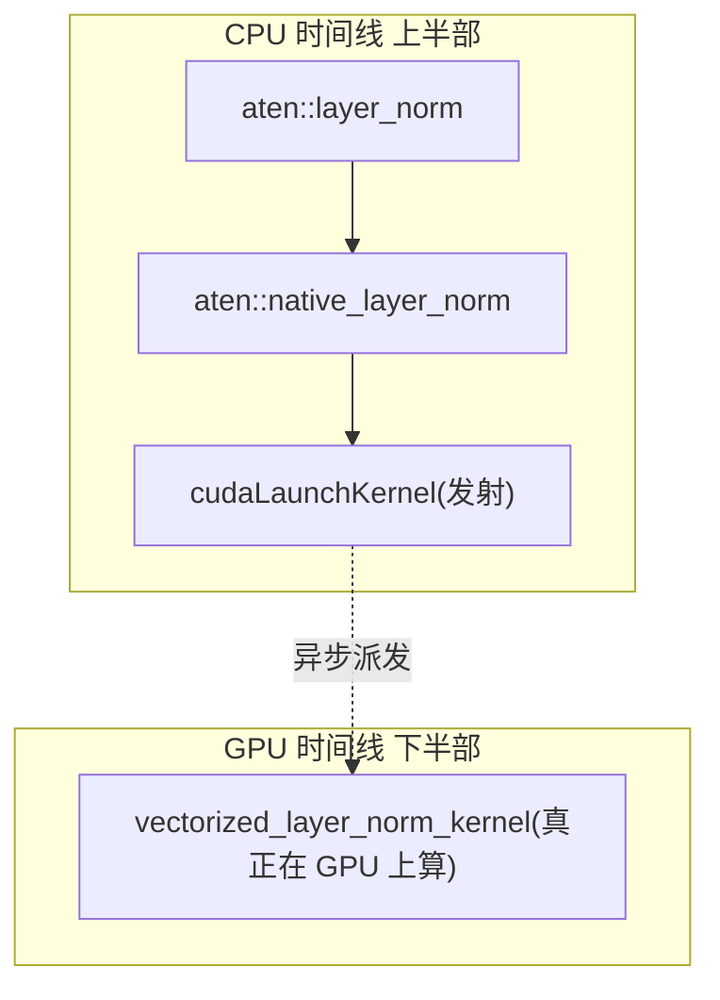
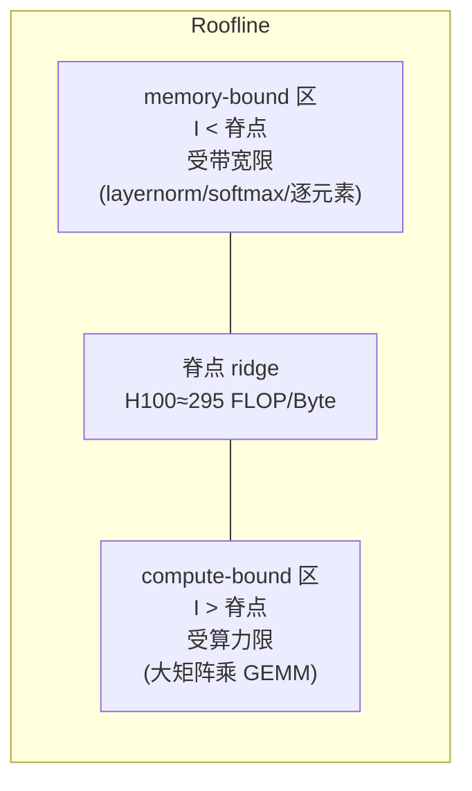
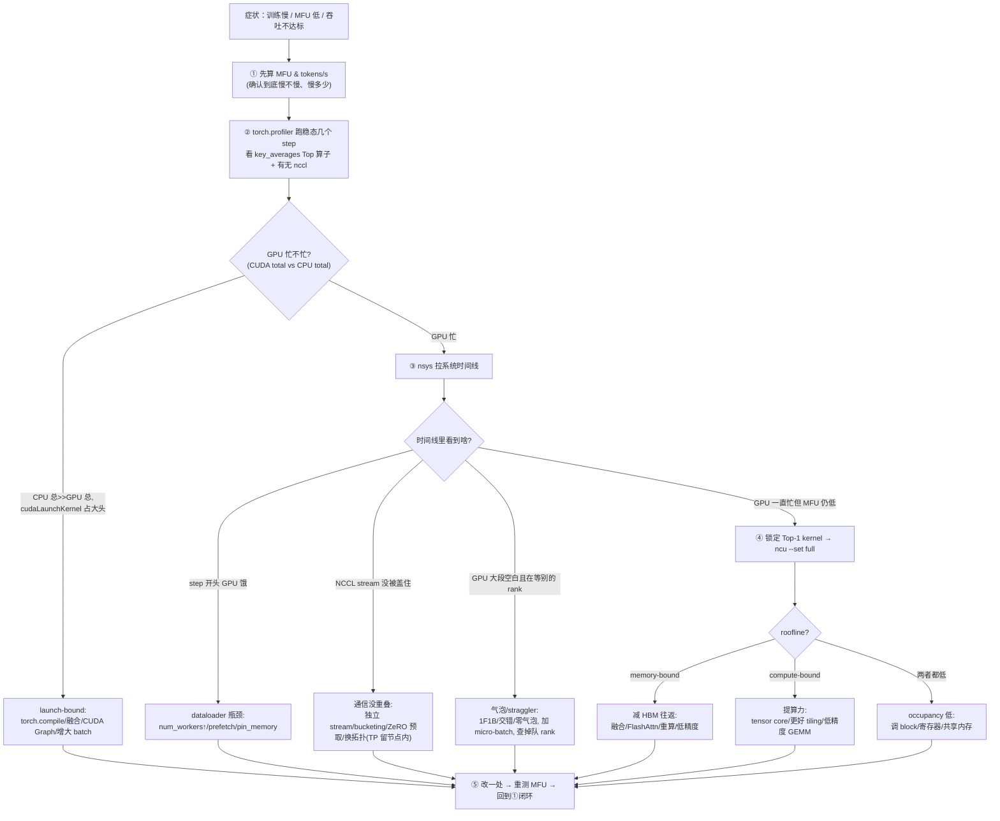
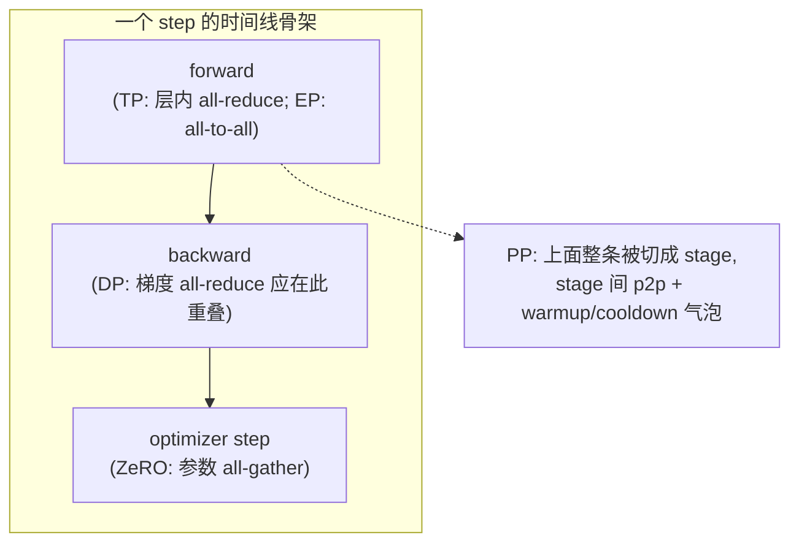

# 附录 C：分布式训练性能剖析 —— profiling、trace、瓶颈定位

> 对应《The Ultra-Scale Playbook: Training LLMs on GPU Clusters》(HuggingFace, Nouamane Tazi, Ferdinand Mom, Haojun Zhao 等) 原书附录 **「Distributed Training Profiling」（第 233–239 页）**，并融合正文第 33 页（HFU / MFU 定义）、第 25 页（显存 profile 解剖）的内容。
>
> 本篇是「《Ultra-Scale Playbook》逐章精讲」系列的**附录卷**。正文（book-guide 01–09）回答的是"**该怎么并行、怎么切**"；附录回答的是"**当你真的把模型跑起来、却发现它慢，你要怎么用工具把'慢在哪'一寸一寸量出来**"。
>
> 原书的这段附录其实写得很短（5 页正文 + 4 页代码图），它只给了你"按钮在哪、命令怎么敲"。本附录是**钻本质版**：我们把按钮背后的**异步执行模型、roofline、trace 的判读、MFU/通信量的算法、以及一整套"发现慢→定位→优化"的方法论**全部补齐，并配上各代 GPU 的**真实带宽 / 算力数字**。读完这一篇，你应该能拿到任何一份 trace，10 分钟内说出"这次训练是被 **计算 / 访存 / 通信 / 同步 / 数据加载** 中的哪一个卡住的"。

---

## 🗺️ 这篇附录在全书的位置


正文教你"做正确的事"，附录 C 教你"**确认你做的事真的生效了**"。这两件事缺一不可：

- 正文第 08 章用一张 MFU 热力图告诉你"某个 DP/TP/PP/GAS/MBS 组合最优"——可那张热力图本身就是 **profile 出来的**。
- 正文第 09 章讲 FlashAttention、融合核能省多少 HBM 往返——可"省了多少"也是 **ncu/nsys 量出来的**。

> 🔬 **第一性原理：性能工程的第一定律 = 不要猜，要量（Don't guess, measure）。**
> 人脑对"慢在哪"的直觉**几乎总是错的**。你以为是某个矩阵乘慢，profile 一看其实是 dataloader 把 GPU 饿着了；你以为通信和计算重叠了，trace 一拉发现 NCCL kernel 和 compute kernel 在**串行排队**。本附录所有工具的存在意义，就是把"我以为"换成"我量到"。

---

## 🧭 第 0 节：先建一个心智模型 —— 一个训练 step 的时间到底花在哪？

在碰任何工具之前，你必须先在脑子里有一张"**时间去哪了**"的地图。一次训练迭代（step）的 wall-clock 时间，无非花在下面 6 类活动上：

| 时间类别 | 英文 | 干什么 | 谁是瓶颈时的典型症状 |
|---|---|---|---|
| 计算 | compute | 矩阵乘 / 卷积 / 逐元素，吃 FLOPS | GPU SM 占用率高、tensor core 忙 |
| 访存 | memory / HBM | 在 HBM↔SRAM 之间搬张量 | SM 闲、DRAM 带宽打满（memory-bound） |
| 通信 | communication | all-reduce / all-gather / p2p，跨卡搬数据 | NCCL kernel 占满时间线、计算在等通信 |
| 同步 | sync / wait | barrier、`cuda.synchronize()`、collective 的隐式等待 | 时间线上一大段空白（GPU idle） |
| 调度开销 | launch / CPU overhead | Python/CPU 发射 kernel 的开销 | GPU 频繁出现小空泡，CPU 侧很忙（CPU-bound / launch-bound） |
| 数据加载 | data loading | dataloader 读盘 / 解码 / H2D 拷贝 | 每个 step 开头 GPU 饿一段（dataloader starvation） |

整本《Ultra-Scale Playbook》的灵魂——**显存 / 计算 / 通信三者的权衡**——在这张表里直接对应到「访存(显存) / 计算 / 通信」三行。profiling 的全部工作，就是**把这 6 类时间分别量出来，看谁最大**。



记住这张图。本附录后面所有工具，都是为了帮你给这 6 个框**填上具体的毫秒数**。

---

## ⚙️ 第 1 节：为什么 `time.time()` 会骗你 —— CUDA 异步执行模型

原书附录开篇第一段就抛出了这个坑（p.233）：

> However, since CUDA operations are asynchronous, measuring time with this method will only capture the overhead associated with launching the kernel in Python, rather than the actual execution time of the kernel itself.
>
> （但由于 CUDA 操作是**异步**的，用 [Python time] 这种方法测时间只会量到"在 Python 里**发射** kernel 的开销"，而不是 kernel 真正的执行时间。）

这是初学者第一个、也是最致命的坑。要理解它，必须先理解 GPU 的执行模型。

### 🔬 异步执行：CPU 只负责"下单"，GPU 自己"做菜"

当你在 Python 里写 `y = torch.matmul(a, b)` 时，发生的**不是**"算完矩阵乘再返回"，而是：



- CPU 把 kernel **塞进 CUDA stream（一条 FIFO 指令队列）就立刻返回**，根本不等 GPU 算完。
- 所以 `t0=time.time(); y=matmul(a,b); t1=time.time()` 量到的 `t1-t0`，只是"把这道菜的订单递给后厨"的时间（**kernel launch overhead**，通常 5–20 微秒），跟这道菜要烧多久（kernel 真实执行时间，可能几毫秒）**毫无关系**。
- 只有当你调用 `torch.cuda.synchronize()`（"我等到后厨全部出餐为止"）时，CPU 才会**阻塞**到 GPU 把队列里所有 kernel 都执行完。

> 💡 **实战 / 面试高频**：「为什么用 `time.time()` 测 CUDA kernel 不准？」标准答案三句话：① CUDA kernel 是异步发射的，CPU 不等 GPU；② `time.time()` 只量到 launch overhead；③ 正确做法是用 `torch.cuda.Event` 在 **GPU 时间线上**打点，或在测量前后加 `torch.cuda.synchronize()`。

这同时也解释了一个反直觉现象：**有时候你的训练是被 CPU 卡住的**（launch-bound / CPU-bound）。如果你的模型由成千上万个**小 kernel** 组成（典型如没融合的逐元素操作链），CPU "下单"的速度可能跟不上 GPU "出餐"的速度，于是 GPU 频繁空转等订单——这就是为什么 `torch.compile`、CUDA Graph、融合核能提速：它们**减少了订单数量**。

---

## 🧪 第 2 节：工具谱 —— 从粗到细的五级梯队

profiling 工具不是越细越好，而是**按"嫌疑范围"由粗到细**地用。盲目上 ncu 去看单个 kernel，就像还没确定哪个房间着火就拿放大镜看一根火柴。



| 级别 | 工具 | 粒度 | 回答的问题 | 开销 |
|---|---|---|---|---|
| ① | `time.time()` | —（错） | （别用来测 GPU） | 0 |
| ② | `torch.cuda.Event` | 一段代码 | 这个函数/kernel 在 GPU 上跑了几 ms？ | 极低 |
| ③ | `torch.profiler` | 算子(op) | 哪个算子最耗 CUDA 时间？显存怎么涨？ | 中（可调度采样） |
| ④ | Nsight Systems `nsys` | 系统时间线 | 通信和计算重叠了吗？哪有气泡/stall？dataloader 饿吗？ | 中 |
| ⑤ | Nsight Compute `ncu` | 单 kernel | 这个 kernel 是 compute-bound 还是 memory-bound？occupancy 多少？ | **高**（每 kernel 重放多次） |

**经验流程**：先用 ③ 看"哪个算子/阶段最贵"，定位到"通信 or 计算"用 ④ 看时间线，最后只对那 1–2 个最贵的 kernel 用 ⑤ 显微镜级深挖。**永远从粗到细。**

---

## ⏱️ 第 3 节：级别② —— `torch.cuda.Event` 精确计时（逐行讲解）

原书 CODE.XXXIII（p.234）给了正确的微基准写法。我们一行一行拆。

```python
import torch

def profile_pytorch(func, input):
    # ① 创建两个 CUDA Event 用来打点。CUDA 操作是异步的，
    #    所以我们不在 CPU 上掐表，而是在 GPU 时间线上插两个"标记"。
    start = torch.cuda.Event(enable_timing=True)  # 标记开始时刻
    end   = torch.cuda.Event(enable_timing=True)  # 标记结束时刻

    # ② 预热（warm-up）：先空跑 10 次，把"第一次运行"的各种一次性开销吃掉
    #    —— cuDNN/cuBLAS 算法自动选择、JIT、caching allocator 首次分配显存等。
    #    不预热，你量到的会是"冷启动"而不是"稳态"性能。
    for _ in range(10):
        func(input)

    # ③ 在 GPU 队列里、func 之前，插入 start 标记
    start.record()
    func(input)          # 把要测的函数发射到同一条 stream
    # ④ 在 func 之后插入 end 标记。注意：到这一行 CPU 仍未阻塞，
    #    start/func/end 只是依次进了 CUDA 队列。
    end.record()

    # ⑤ 同步：CPU 在这里阻塞，等 GPU 真正执行到 end 标记为止。
    #    没有这一步，下面 elapsed_time 读到的就是垃圾值。
    torch.cuda.synchronize()

    # ⑥ elapsed_time 返回两个 Event 之间、GPU 时间线上的真实间隔（毫秒 ms）
    return start.elapsed_time(end)
```

**逐点本质讲解**：

- `torch.cuda.Event(enable_timing=True)`：Event 是 CUDA 在 **GPU 硬件时间线**上的一个"打点器"。`enable_timing=True` 让它记录高精度时间戳。两个 Event 之间的差值，才是 kernel 在 GPU 上真正占用的墙钟时间。
- **为什么要 warm-up 10 次**？第一次跑某个算子时，cuBLAS/cuDNN 会做 **algorithm autotuning**（试几种 kernel 选最快的），PyTorch caching allocator 会**首次向驱动申请大块显存**（很慢）。这些都是一次性成本。正文 p.25 专门讲过：「在第一个 step，PyTorch caching allocator 做了大量准备工作……所以后续 step 才快」。**不预热 = 把冷启动算进性能，结论全错。**
- `start.record()` / `end.record()`：把标记**入队**，不阻塞 CPU。
- `torch.cuda.synchronize()`：唯一的阻塞点。它是"等后厨全部出餐"。
- `start.elapsed_time(end)`：单位是**毫秒**，且是 GPU 测的，跟 CPU 那点 launch 抖动无关。

> ⚠️ **常见坑**：① 忘记 warm-up；② 忘记 `synchronize()` 就读 `elapsed_time`（会抛错或读到旧值）；③ 用 `time.time()` 包住 `func` 然后忘了 sync；④ 测的 input 太小，launch overhead 占了大头（要测 kernel 本身就得让它"够大够忙"，所以原书例子用了 `10000×10000` 的张量）。

---

## 📊 第 4 节：级别③ —— PyTorch Profiler（逐行讲解 + 怎么读表）

`torch.cuda.Event` 只能测"一段代码"。要看**整个 step 里每个算子各花多少**，得上 PyTorch Profiler。原书 CODE.XXXIV（p.234）：

```python
import torch
import torch.nn.functional as F

def pytorch_layer_norm(input):
    # F.layer_norm 第二个参数是 normalized_shape：对除 batch 维外的维度做归一化
    return F.layer_norm(input, input.size()[1:])

a = torch.randn(10000, 10000).cuda()   # 在 GPU 上造一个 1e8 元素的大张量(约 0.4 GB fp32)

with torch.profiler.profile(
    activities=[
        torch.profiler.ProfilerActivity.CPU,   # 采集 CPU 侧活动(Python/aten 调度)
        torch.profiler.ProfilerActivity.CUDA,  # 采集 GPU 侧活动(kernel/拷贝)
    ],
    # schedule 控制"在第几个 step 采样"，避免把预热也录进去：
    schedule=torch.profiler.schedule(
        wait=1,     # 前 1 个 iter 完全不采(跳过冷启动)
        warmup=3,   # 接着 3 个 iter 预热(profiler 自身也要热身，且让 GPU 稳态)
        active=2,   # 然后 2 个 iter 真正采样
        repeat=1,   # 上述(wait+warmup+active)循环重复 1 次
    ),
    on_trace_ready=torch.profiler.tensorboard_trace_handler('.'),  # 采样完把 trace 落盘到当前目录
) as p:
    for iter in range(10):
        pytorch_layer_norm(a)
        p.step()   # 关键!每个 iter 末尾告诉 profiler"我走完一步了"，它据此推进 schedule

# 打印聚合结果，按 CUDA 总时间排序，只看前 8 行
print(p.key_averages().table(sort_by="cuda_time_total", row_limit=8))
```

### 逐行本质讲解

- **`activities=[CPU, CUDA]`**：profiler 同时在 CPU 和 GPU 两条时间线上录。CPU 侧录的是 Python→aten 算子→`cudaLaunchKernel` 的调用链；CUDA 侧录的是真正的 GPU kernel 和 memcpy。**两条线对齐起来**，你才能看出"CPU 发射"和"GPU 执行"之间有没有空泡。
- **`schedule(wait/warmup/active/repeat)`**：这是 profiler 最容易被忽略却最重要的参数。它把一段连续迭代切成"**跳过 → 预热 → 采样**"三段：
  - `wait=1`：跳过第 1 个 iter（冷启动最脏，丢掉）。
  - `warmup=3`：再热 3 个 iter，让 cuBLAS 选好算法、allocator 稳定，同时 profiler 自己也"热身"（profiler 第一次插桩有开销）。
  - `active=2`：只在第 5、6 个 iter 真正记录。
  - `repeat=1`：整个 (1+3+2)=6 的 pattern 重复 1 遍。
  - **为什么要这么麻烦**？因为 profiling 本身有开销，且冷启动 step 不代表稳态。只采"中间几个稳态 step"，结论才可信、trace 文件也不会大到打不开。
- **`p.step()`**：必须在每个 iter 末尾调用，它是 profiler 推进 schedule 状态机的"心跳"。漏了它，schedule 永远停在第 0 步，啥也采不到。
- **`on_trace_ready=tensorboard_trace_handler('.')`**：采样结束后自动把 trace 写成可被 TensorBoard / `chrome://tracing` / Perfetto 打开的 JSON。
- **`key_averages().table(sort_by="cuda_time_total", row_limit=8)`**：把所有同名算子聚合，按 GPU 总耗时排序，打印前 8 行。

### 📋 怎么读 profiler 输出的表（FIG.XCIV）

`key_averages().table()` 打出来长这样（示意，数字为说明性）：

| Name | Self CPU % | Self CPU | CPU total | CUDA total | CUDA % | # Calls |
|---|---|---|---|---|---|---|
| `aten::layer_norm` | 2.1% | 30us | 1.2ms | 5.0ms | 71% | 2 |
| `vectorized_layer_norm_kernel` | 0% | 0 | 0 | 5.0ms | 71% | 2 |
| `cudaLaunchKernel` | 60% | 0.9ms | 0.9ms | 0 | 0% | 2 |
| `aten::empty` | ... | ... | ... | ... | ... | ... |

**判读要点（务必记牢）**：

- **`CUDA total` 才是 GPU 真正干活的时间**；`CPU total` 是 CPU 侧调度+等待的时间。比较这两列能立刻看出是 **GPU-bound 还是 CPU/launch-bound**。
- **`Self` vs `total`**：`Self` 是"这个算子自己花的，不含它调用的子算子"；`total` 含子调用。找热点要看 `Self`（避免父节点把子节点时间重复算）。
- **`cudaLaunchKernel` 占的是 CPU 时间**（发射开销）。如果它的 CPU% 异常高、而每个 kernel 的 CUDA 时间又很短，说明你**launch-bound**：kernel 太碎，CPU 发射跟不上 → 该融合 / 用 CUDA Graph。
- **`# Calls` 很大 + 单次很短**：典型的"小 kernel 海洋"，融合的强信号。
- 真正的 GPU 算子（如 `vectorized_layer_norm_kernel`）CPU self 为 0、CUDA total 不为 0——这才是吃 GPU 的家伙。

> 💡 **实战**：第一次拿到 profiler 表，先做三件事：① 按 `cuda_time_total` 排序看 Top-5 GPU 热点；② 看 `cudaLaunchKernel` 的 CPU 占比判断 launch-bound；③ 看有没有 `nccl` 开头的算子（all-reduce/all-gather），它们的耗时就是你的**通信成本**。

---

## 🔬 第 5 节：看 trace 时间线 —— chrome://tracing / Perfetto（判读核心）

`key_averages().table()` 是**聚合视图**（每个算子的总账），但它丢掉了**时序信息**——你看不出"通信和计算有没有重叠"。要看时序，必须打开 trace 时间线。

原书（p.233, p.236）：在浏览器打开 `chrome://tracing/`（或更现代的 [ui.perfetto.dev](https://ui.perfetto.dev)）载入 profiler 落盘的 JSON。导航方式：**左右方向键平移，按住 Alt + 滚轮缩放**。

### trace 的"解剖"：一次 layer_norm 的完整链路（FIG.XCV）

原书 p.236 描述了放大后看到的调用流：



> 原文：The sequence begins in the CPU (the upper section) with `aten::layer_norm`, progressing to `aten::native_layer_norm` and then transitioning to `cudaLaunchKernel`. From there, we move on to the GPU, where the `vectorized_layer_norm_kernel` kernel is called.

这张图是**所有 trace 判读的基本功**：上半部是 CPU（Python→aten 算子→`cudaLaunchKernel`），下半部是 GPU（真正的 kernel）。CPU 那一条 `cudaLaunchKernel` 通过一条**箭头（flow event）**连到 GPU 上对应的 kernel。**CPU 发射点和 GPU 执行点之间的横向距离，就是这个 kernel 的"排队 + 启动延迟"。**

### 🩺 trace 病征图谱：4 种典型"病"长什么样

下面这张对照图是本附录的精华。把它印在脑子里，以后看任何 trace 都能秒判：

```mermaid
gantt
    title 四种 trace 病征(横轴=时间, 每行=一条 stream)
    dateFormat X
    axisFormat %s
    section 健康: 计算/通信重叠
    compute(默认stream) :a1, 0, 10
    all-reduce(comm stream) :a2, 1, 9
    section 病1: 不重叠(串行)
    compute :b1, 0, 10
    all-reduce :b2, 10, 8
    section 病2: 气泡(GPU idle)
    compute :c1, 0, 6
    GPU空白(等p2p) :crit, c2, 6, 6
    compute :c3, 12, 6
    section 病3: launch-bound
    GPU碎kernel :d1, 0, 2
    GPU空(等CPU下单) :crit, d2, 2, 3
    GPU碎kernel :d3, 5, 2
```



| 病征 | trace 上的样子 | 根因 | 药方 |
|---|---|---|---|
| **健康** | compute stream 和 NCCL/comm stream **横向重叠** | 通信被计算掩盖 | —（继续保持） |
| **病① 不重叠** | 计算 stream 跑完，通信 stream 才开始（首尾相接） | 通信没放到独立 stream / 没 prefetch / 依赖链太紧 | DDP gradient bucketing、ZeRO 通信预取、把 comm 移到独立 stream |
| **病② 气泡 bubble** | GPU 时间线**大段空白**，前后是 compute | 流水线并行 PP 的 warmup/cooldown、collective 的隐式 barrier 等待 | 调度换 1F1B/交错/零气泡、增大 micro-batch 数、减少同步点 |
| **病③ stall / launch-bound** | GPU 全是**密集小空泡**，CPU 侧 `cudaLaunchKernel` 排满 | kernel 太碎、Python 开销大、CUDA Graph 未用 | `torch.compile`、融合核、CUDA Graph、增大 batch 摊薄 launch |
| **病④ dataloader 饿死** | **每个 step 开头**一段 GPU idle，且 CPU 在做 H2D memcpy/解码 | dataloader worker 太少 / 没预取 / IO 慢 | `num_workers↑`、`prefetch_factor↑`、`pin_memory=True`、数据格式优化 |

> 🔬 **第一性原理：判断"重叠是否成立"的唯一办法是看两条 stream 在时间轴上有没有"横向交叠"。** NCCL 的 collective（all-reduce 等）跑在一条**独立的 CUDA stream** 上。如果它和 compute stream 在时间轴上**并排同时存在**，就是重叠成立、通信被掩盖；如果它们**首尾相接**，就是没重叠、通信时间直接加进了 step 时间。这是分布式 profiling 里最高频的判断，没有之一。

### 找气泡（pipeline bubble）

流水线并行（PP）天生有气泡：第一个 micro-batch 还在前几级流水时，后面的级在空等（warmup）；最后收尾时同理（cooldown）。在 trace 上，**每个 PP rank 的 GPU 时间线开头和结尾都有三角形的空白**。气泡占比的公式（正文第 05 章已细讲）：

$$
\text{bubble fraction} = \frac{p-1}{m}
$$

其中 $p$ 是流水线级数（pipeline stages），$m$ 是 micro-batch 数。**$m$ 越大，气泡越小**——这就是 trace 上"增大梯度累积步数能填平气泡"的直接证据。AFAB → 1F1B → 交错 1F1B → 零气泡/DualPipe，本质都是在 trace 上**把那块三角空白往小里挤**。

> 💡 **面试高频**：「怎么在 trace 上区分'气泡'和'通信没重叠'？」答：气泡是 **GPU 完全 idle 的空白**（在等别的 rank 的数据，本地无事可做）；通信没重叠是 **comm stream 在忙、compute stream 在空**（本地有通信任务但没被计算掩盖）。前者治本要改调度（micro-batch、1F1B），后者治本要改 overlap（独立 stream + prefetch）。

---

## 🛰️ 第 6 节：级别④ —— Nsight Systems（nsys）：分布式 trace 的主力

PyTorch Profiler 对**单进程、算子级**很好用，但要看**多 GPU、多进程、NCCL 通信、NVLink/网络流量**这种"系统级全景"，业界主力是 **NVIDIA Nsight Systems（命令行 `nsys`）**。原书正文 p.200 的参考链接里也指向 Nsight 系列。

### 怎么跑

```bash
# 把一次(短)训练包起来采系统级 trace；建议只采几十个 step
nsys profile \
  --trace=cuda,nvtx,osrt,cudnn,cublas \   # 采 CUDA kernel/NVTX 标注/OS 运行时/库调用
  --gpu-metrics-device=all \              # 顺便采 GPU 硬件计数器(SM 占用/带宽)
  -o train_report \                       # 输出 train_report.nsys-rep
  python train.py --steps 30
```

- **`--trace=cuda,nvtx,...`**：`cuda` 采 kernel 和 memcpy；`nvtx` 采你代码里用 `torch.cuda.nvtx.range_push/pop` 打的**自定义区间标注**（强烈建议在 forward/backward/optimizer/通信处打 NVTX 标记，trace 立刻可读）；`osrt` 采操作系统线程状态（看 CPU 在不在等）。
- **NCCL 通信**会以独立 stream 上的 kernel 形式出现（`ncclAllReduce`、`ncclAllGather` 等），**这正是你判断"通信/计算重叠"的关键**。
- 多进程（多 GPU）时，每个 rank 一个 report，或用 `nsys` 的多 rank 汇聚视图对齐。

### nsys 能回答而 PyTorch Profiler 难回答的问题

| 问题 | nsys 怎么看 |
|---|---|
| all-reduce 和 backward 重叠了吗？ | 看 NCCL stream 与 compute stream 是否横向交叠 |
| 是 NVLink 还是走了 PCIe/网络？ | 看 GPU metrics 里 NVLink 流量 vs PCIe 流量 |
| 哪个 rank 是掉队者（straggler）？ | 多 rank 对齐，看谁的 collective 等得最久 |
| CPU 是不是瓶颈？ | `osrt` 线程长期 idle/wait + GPU 频繁空泡 = launch-bound |
| 通信占了 step 的百分之几？ | NCCL kernel 总时长 / step 总时长 |

> ⚠️ **常见坑**：分布式 profiling 一定要**多个 rank 一起看**。单看 rank 0 你会以为"通信很慢"，对齐 8 个 rank 才发现是 rank 3 算得慢（straggler），其余 7 个在 all-reduce 的隐式 barrier 上**等它**——这时该优化的是 rank 3 的计算/数据，而不是通信。

---

## 🔬 第 7 节：级别⑤ —— Nsight Compute（ncu）：单 kernel 显微镜

当 nsys/profiler 已经把你引到"就是这个 kernel 最贵"时，用 **Nsight Compute（`ncu`）** 做单 kernel 的**显微镜级**剖析。原书 p.236：

```bash
# 直接打印(信息量大但刷屏)
ncu --set full python layer_norm.py

# 推荐：把结果存成 .ncu-rep，用 Nsight Compute GUI 打开
ncu --set full -o output python layer_norm.py
```

- **`--set full`**：采集**完整**的硬件计数器集合（occupancy、各级缓存命中率、DRAM 带宽、tensor core 利用率、warp stall 原因……）。`full` 很全但很慢，因为 ncu 会**把每个 kernel 重放（replay）很多次**来采不同计数器组——所以 **ncu 只对 1–2 个目标 kernel 用，绝不对整个训练用**。
- **`-o output`**：存成 `output.ncu-rep`，GUI 里能看到原书 FIG.XCVI 那种界面：带**红黄警告**直接告诉你"compute 还是 memory 受限"、"occupancy 偏低"、以及**怎么改**的建议。

### 🔬 ncu 的灵魂：Roofline 模型（compute-bound vs memory-bound）

ncu 最有价值的产出是把你的 kernel 钉在 **roofline 图**上。这正是《Ultra-Scale Playbook》正文第 09 章的灵魂（"GPU 是内存墙机器"）的量化版本。

定义**算术强度（arithmetic intensity）**：

$$
I = \frac{\text{FLOPs}}{\text{Bytes accessed}}\quad(\text{单位: FLOP/Byte})
$$

硬件有一个"脊点（ridge point）"：

$$
I_{\text{ridge}} = \frac{\text{峰值算力 (FLOP/s)}}{\text{峰值带宽 (Byte/s)}}
$$

- 若 $I < I_{\text{ridge}}$：kernel 被**带宽**卡死（**memory-bound**），SM 在等数据。优化方向 = **减少 HBM 往返**（融合、tiling、提高重用）。
- 若 $I > I_{\text{ridge}}$：kernel 被**算力**卡死（**compute-bound**），数据够用但算不过来。优化方向 = **用 tensor core、低精度、更好的 tiling 提算力**。

以 **H100 SXM** 为例（BF16 算力 ≈ 990 TFLOP/s，HBM3 带宽 ≈ 3.35 TB/s）：

$$
I_{\text{ridge}} = \frac{990\times10^{12}}{3.35\times10^{12}} \approx 295\ \text{FLOP/Byte}
$$

也就是说：**每从 HBM 读 1 字节，你得对它做近 300 次浮点运算**，才能喂饱 H100 的算力。LayerNorm、softmax、逐元素加这类算子的算术强度通常只有个位数，远低于 295 → 它们**注定 memory-bound** → 这就是为什么要把它们**融合**进相邻的大算子里、为什么 FlashAttention 要把 softmax 留在 SRAM 里不落地。



> 💡 **实战判读**：ncu 报告里直接有 "Compute (SM) Throughput %" 和 "Memory Throughput %" 两个百分比。哪个先逼近 100%，你就被哪个卡。两个都很低 → 多半是 **occupancy 太低**（并行度不足，warp 没填满 SM），ncu 会在 "Occupancy" 区给出红色警告和"理论 occupancy vs 实测 occupancy"的差距及原因（寄存器/共享内存用太多、block 太小等）。

---

## 🧮 第 8 节：MFU / HFU / 吞吐 —— 把"快慢"变成一个可比较的数

profiling 给你"哪贵"，但要回答"**我离硬件极限还有多远**"，需要一个归一化指标。这就是 **MFU / HFU**。原书第 33 页给了精确定义，我们把它讲透并配上算例。

### 8.1 先算分子：一个 step 做了多少 FLOPs

Transformer 训练的 FLOPs 有一个广为使用的估算（Kaplan/Chinchilla 经验式）：

$$
\boxed{\;C_{\text{train}} \approx 6 \, N \, D\;}
$$

- $N$ = 模型参数量，$D$ = 训练 token 数。
- 系数 6 的来历：**前向 ≈ $2N$ FLOP/token**（每个参数一次乘一次加 = 2 FLOP），**反向 ≈ $4N$**（反向要算对输入和对权重两套梯度，约 2× 前向），合计 $6N$ FLOP/token。

这忽略了注意力的二次项。带上注意力修正（每层每 token 约 $12\,L\,s\,d_{\text{model}}$ 级别，$L$ 层数、$s$ 序列长、$d$ 隐藏维）会更准，但**长序列时注意力项才显著**；多数情况下 $6ND$ 已经够用做 MFU。

### 8.2 HFU vs MFU：差别只在"算不算重算"

原书 p.33 的定义（务必分清）：

- **硬件 FLOPs（hardware FLOPs）**：训练时**实际在加速器上执行**的浮点运算数，**包含激活重算（recomputation）多做的那部分**。
  $$\text{HFU} = \frac{\text{hardware FLOPs} / \text{step\_time}}{\text{峰值 FLOPS}}$$
- **模型 FLOPs（model FLOPs）**：**只算前向+反向"模型本身需要"的运算，不含重算**。
  $$\text{MFU} = \frac{\text{model FLOPs} / \text{step\_time}}{\text{峰值 FLOPS}}$$

> 原文要点：HFU 反映"实现"做了多少活（含重算），MFU 反映"模型"本身需要多少活。**因为重算只增加 FLOPs、不改变模型，所以 $\text{HFU} \ge \text{MFU}$。**

🔬 **为什么要分两个？** 原书 p.33 给了一个深刻的理由：最终真正重要的是"**训完整个数据集要多久**"。假设 GPU-A 显存大到**不需要重算**（hardware FLOPs 更少）却训得更快，它就该被**奖励而不是惩罚**。如果只看 HFU，重算少的 A 反而 HFU 偏低（因为分子小），显得"利用率低"——这不公平。**MFU 把重算剔除，使指标只与模型有关、跨实现可比**，所以**对外汇报、跨硬件比较一般用 MFU**；调自己实现时 HFU 也有用（它反映你真实压了多少算力）。

### 8.3 各代 GPU 的峰值算力 / 带宽（算 MFU 的分母）

⚠️ 算 MFU 时分母要用**对应精度、dense（非稀疏）**的峰值，别用厂商 marketing 的 sparse 翻倍数字。

| GPU（代） | BF16/FP16 dense 峰值 | FP8 dense | HBM 带宽 | NVLink(单卡总) | 备注 |
|---|---|---|---|---|---|
| V100 (SXM2) | ~125 TFLOPS (FP16) | — | 0.9 TB/s (HBM2) | 300 GB/s | Volta，首代 tensor core |
| A100 80GB (SXM) | ~312 TFLOPS | — | 2.0 TB/s (HBM2e) | 600 GB/s | Ampere，主力训练卡 |
| H100 (SXM) | ~990 TFLOPS | ~1979 TFLOPS | 3.35 TB/s (HBM3) | 900 GB/s | Hopper，FP8/Transformer Engine |
| H200 (SXM) | ~990 TFLOPS | ~1979 TFLOPS | 4.8 TB/s (HBM3e) | 900 GB/s | 同算力，带宽大增 |
| B200 (Blackwell) | ~2250 TFLOPS（量级） | FP4 更高 | ~8 TB/s (HBM3e) | 1.8 TB/s | 新一代，FP4/双 die |

> 网络/互联参考（算通信成本用）：NVLink 是**节点内**卡间高速链路；**跨节点**走 InfiniBand —— HDR 200 Gb/s ≈ 25 GB/s，NDR 400 Gb/s ≈ 50 GB/s（每 GPU 常配 1 张 400G NIC）。PCIe Gen4 x16 ≈ 32 GB/s、Gen5 x16 ≈ 64 GB/s。**记住：NVLink（数百 GB/s）比跨节点网络（数十 GB/s）快约一个数量级**——这正是"TP 留在节点内、DP/PP 跨节点"这条铁律的硬件根据。

### 8.4 完整算例：在 8×H100 上训一个 7B 模型

设：模型 $N = 7\times10^9$；全局 batch = 1024 条、序列长 $s=4096$ → 每 step token 数 $D_{\text{step}} = 1024\times4096 \approx 4.19\times10^6$；实测 step 时间 = 2.0 s；8 张 H100（dense BF16 峰值 990 TFLOPS/卡）。

**① 每 step 的 model FLOPs**：
$$
C_{\text{step}} = 6 N D_{\text{step}} = 6 \times 7\times10^9 \times 4.19\times10^6 \approx 1.76\times10^{17}\ \text{FLOP}
$$

**② 实测吞吐（achieved FLOPS）**：
$$
\text{FLOPS}_{\text{achieved}} = \frac{C_{\text{step}}}{t_{\text{step}}} = \frac{1.76\times10^{17}}{2.0} \approx 8.8\times10^{16}\ \text{FLOP/s} = 88\ \text{PFLOPS}
$$

**③ 集群峰值**：$8 \times 990\ \text{TFLOPS} = 7.92\times10^{15}\ \text{FLOP/s} = 7.92\ \text{PFLOPS}$……

等一下，这里 achieved(88 PFLOPS) > 峰值(7.92 PFLOPS)，**说明哪算错了**——这正是一个教学点：要么 step 时间不是 2.0s（太乐观），要么 batch 设小了。我们把 **step 时间改成实际更可能的 22 s** 重算（7B、bs=1024、s=4096 在 8 卡上 22s 量级才合理）：

$$
\text{FLOPS}_{\text{achieved}} = \frac{1.76\times10^{17}}{22} \approx 8.0\times10^{15}\ \text{FLOP/s} = 8.0\ \text{PFLOPS}
$$

**④ MFU**：
$$
\text{MFU} = \frac{8.0\ \text{PFLOPS}}{7.92\ \text{PFLOPS}} \approx 1.01 \ \Rightarrow\ \text{仍 > 100%，不可能}
$$

> 🔬 **这个"算不通"恰恰是最好的教学**：当你算出 MFU > 100%，**100% 是你算错的报警器**。常见错因：① 用了 **sparse 峰值**当分母（真值要砍一半）；② step 时间偷偷只算了 forward 没算 backward；③ batch/seq 数错位。**真实大模型训练的 MFU 通常落在 35%–55%**（达到 50%+ 就很优秀，MFU>60% 是世界级）。把上面例子的 step 时间设为更现实的 **40 s**：
> $$\text{MFU} = \frac{1.76\times10^{17}/40}{7.92\times10^{15}} = \frac{4.4\times10^{15}}{7.92\times10^{15}} \approx 0.555 = 55.5\%$$
> 这就是一个**健康**的数字。

### 8.5 MFU 体检表

| MFU 区间 | 含义 | 该干什么 |
|---|---|---|
| < 20% | 严重不健康 | 八成是 launch-bound / dataloader 饿 / 通信没重叠 / 配置错 |
| 20%–35% | 偏低 | 查通信重叠、查气泡、查精度（是否在用 tensor core） |
| 35%–50% | 正常 | 可微调 batch/重算/融合再榨一点 |
| 50%–60% | 优秀 | 大模型训练的好成绩 |
| > 60% | 世界级 | （多见于高度优化的 dense 大模型 + 大 batch） |
| > 100% | **算错了** | 检查分母峰值（sparse?）、step 时间、token 计数 |

### 8.6 吞吐量的其它表达 & 通信量怎么算

除了 MFU，工程上常用更直观的吞吐：

- **tokens/s/GPU** = (全局 batch × seq) / (step 时间 × GPU 数)。最常用来横向比较。
- **samples/s**、**step time(ms)**：最朴素的"快慢"。

**通信量**（判断"通信会不会成为瓶颈"）：以数据并行的 **all-reduce 梯度**为例，ring all-reduce 每张卡收发的数据量约为：

$$
V_{\text{allreduce}} \approx 2\cdot\frac{p-1}{p}\cdot M \approx 2M \quad(p\ \text{大时})
$$

其中 $M$ 是梯度总字节数，$p$ 是参与卡数。对 7B 模型、BF16 梯度 $M = 7\times10^9 \times 2\ \text{B} = 14\ \text{GB}$，一次 all-reduce 每卡约收发 $2\times14 = 28\ \text{GB}$。若走 NVLink(900 GB/s) ≈ 31 ms；若走跨节点 NDR IB(50 GB/s) ≈ **560 ms**——**这就是为什么 DP 通信必须和 backward 重叠、为什么要 ZeRO 分片 + bucketing**：把这 560 ms 藏到计算后面去。trace 上你要确认的，正是这段 all-reduce 有没有被 backward 盖住。

> 💡 **把第 0 节的 6 个框和这里连起来**：MFU 低 → 看 trace → 如果 NCCL stream 没被盖住，是"通信"框的锅；如果全是小空泡，是"调度"框的锅；如果 step 开头 GPU 饿，是"数据加载"框的锅。**MFU 是体温计，trace 是 CT，两者配合才能确诊。**

---

## 🛠️ 第 9 节：自定义 CUDA kernel 的 profiling（cpp_extension，逐行）

如果你要测的 kernel **还没**进 PyTorch（自己写的 CUDA），原书 p.238–239 给了用 `torch.utils.cpp_extension` 即时编译加载的办法。这样你就能像 profile 内置算子一样 profile 自己的 kernel。

### CODE.XXXV：`add_kernel.cu`（自定义 CUDA 加法核）

```cpp
#include <torch/extension.h>   // PyTorch C++/CUDA 扩展总头文件(原书图里省略号处)
#include <cuda.h>
#include <cuda_runtime.h>

// __global__ 表示这是个"核函数"，由 CPU 发射、在 GPU 上由成千上万线程并行执行
__global__ void add_kernel(float* x, float* y, float* output, int size) {
    // 每个线程算自己负责的那一个元素：全局索引 = 第几个 block × 每 block 线程数 + block 内线程号
    int index = blockIdx.x * blockDim.x + threadIdx.x;
    if (index < size) {            // 边界保护：最后一个 block 可能多出来一些线程，越界的不干活
        output[index] = x[index] + y[index];  // 逐元素相加
    }
}

// host 端包装函数：负责算 grid/block 维度并发射 kernel
void add_cuda(torch::Tensor x, torch::Tensor y, torch::Tensor output) {
    int threads = 1024;                              // 每个 block 1024 个线程(常见上限)
    int blocks  = (x.size(0) + threads - 1) / threads;  // 向上取整，保证覆盖所有元素
    // <<<blocks, threads>>> 是 CUDA 的"执行配置"语法(原书图里被吞了)
    add_kernel<<<blocks, threads>>>(
        x.data_ptr<float>(), y.data_ptr<float>(),
        output.data_ptr<float>(), x.size(0));
}

// 用 pybind11 把 C++ 函数暴露给 Python
PYBIND11_MODULE(TORCH_EXTENSION_NAME, m) {
    m.def("add_cuda", &add_cuda, "Vector addition (CUDA)");
}
```

**逐点讲解**：

- `__global__`：CUDA 关键字，标记"这是核函数"。它由 CPU 用 `<<<grid, block>>>` 发射，在 GPU 上以**网格(grid) → 块(block) → 线程(thread)** 的三级层次并行跑。
- `blockIdx.x * blockDim.x + threadIdx.x`：把"第几号 block × 每 block 多少线程 + block 内第几号线程"拼成**全局线程编号**，让每个线程认领一个数组下标——这是 CUDA "网格-跨步/一线程一元素"的最经典 idiom。
- `if (index < size)`：**边界保护**。元素数不一定整除 1024，最后一个 block 会多派线程出来，越界线程必须直接跳过，否则**非法访存**。
- `threads=1024`、`blocks=ceil(N/1024)`：把 $N$ 个元素铺到足够多的 block 上。
- `data_ptr<float>()`：从 PyTorch 张量取裸 `float*` 指针交给 CUDA。
- `PYBIND11_MODULE(TORCH_EXTENSION_NAME, m)`：`TORCH_EXTENSION_NAME` 由 `load()` 的 `name=` 填进来，把 `add_cuda` 注册成 Python 可调用的函数。

### CODE.XXXVI：Python 侧加载并调用

```python
import torch
from torch.utils.cpp_extension import load   # 即时(JIT)编译 + 加载 CUDA 扩展

# load 会在后台调用 nvcc 把 .cu 编成一个临时 .so 并 import 进来
vector_add = load(
    name="vector_add",        # 决定 TORCH_EXTENSION_NAME，也是缓存目录名
    sources=["add_kernel.cu"],# 要编译的源文件列表
    verbose=True,             # 打印编译命令，方便排错
)

size = 10000
x = torch.randn(size, device='cuda')       # 输入1
y = torch.randn(size, device='cuda')       # 输入2
output = torch.empty(size, device='cuda')  # 输出缓冲(预分配，kernel 直接写进去)

vector_add.add_cuda(x, y, output)          # 调用我们自己的 CUDA kernel
```

> 原书 p.238 收尾一句：用这个方法，你就能像前面 profile 内置算子一样，**用 PyTorch profiler 或 NVIDIA 工具（nsys/ncu）profile 你自定义的 CUDA kernel**。

**逐点讲解**：

- `load(...)`：**首次**调用会触发 `nvcc` 编译（慢，几十秒），之后命中缓存就快。`verbose=True` 会把编译命令打出来，编译失败时是救命的。
- `torch.empty(size, device='cuda')`：**预分配输出**而不是 `zeros`——kernel 会把每个位置都写满，没必要先清零，省一次写。
- 拿到 `vector_add` 后，把它包进第 3、4 节的 `torch.profiler` 或第 6、7 节的 `nsys/ncu`，就能看到你这个 `add_kernel` 在 GPU 上的真实耗时、带宽利用率。对 element-wise 加法这种 $I\approx \tfrac{1}{12}$ FLOP/Byte（读 2 个 float 写 1 个 float = 12 字节，才做 1 次加）的算子，ncu 一定会告诉你它**重度 memory-bound**——这正是"为什么逐元素算子要融合"的实测铁证。

---

## 💾 第 10 节：显存 profiling（别只盯时间，也要盯空间）

性能不只有"快慢"，还有"会不会 OOM"。原书正文 p.24–25（FIG.V）专门用 PyTorch profiler 画了 **Llama 1B 前 4 个 step 的显存曲线**，给了一张"一个 step 的显存解剖图"：


原书 p.25 的关键观察（务必理解）：

1. **前向**：激活（activations）快速上涨（每层都要存下来给反向用）。
2. **反向**：梯度（gradients）开始堆积；同时**用过的激活被逐步释放**（反向传播到哪，哪之后的激活就不需要了）。
3. **optimizer**：此刻需要**全部梯度**，并更新**优化器状态**（Adam 的 m/v），然后才进入下一个前向。
4. **第一个 step 长得不一样**：激活涨上去后**会平一段**——因为 PyTorch caching allocator 在首步做大量准备（预留内存块，让后续步不必再找空闲块）。**首步之后才出现优化器状态**，把后续步的显存基线抬高。

> ⚠️ **常见坑（原书 p.25 明确点出）**：「为什么第一个 step 成功、第二个 step 就 OOM？」答：**优化器状态在第一步之后才建立**。首步只有 参数+激活+梯度，第二步起多了 Adam 的 m/v（每个约等于参数量的 1–2 倍 fp32），显存基线突然抬高 → 第二步 OOM。**判 OOM 风险要看稳态(第 3 步起)，不能只看首步。**

### 怎么采显存 profile

```python
# 方法 A：profiler 里开 profile_memory
with torch.profiler.profile(
        activities=[torch.profiler.ProfilerActivity.CPU,
                    torch.profiler.ProfilerActivity.CUDA],
        profile_memory=True,      # ★ 记录每个算子的显存分配/释放
) as p:
    train_step()
print(p.key_averages().table(sort_by="self_cuda_memory_usage", row_limit=10))

# 方法 B：显存快照(更适合定位"谁占了显存"和碎片)
torch.cuda.memory._record_memory_history(max_entries=100000)
train_step()
torch.cuda.memory._dump_snapshot("mem_snapshot.pickle")  # 用 pytorch.org/memory_viz 可视化
```

> 原书 p.236 提醒：开 `profile_memory=True` 信息更全，但会让 **trace 变复杂、变大**——所以查时间和查显存最好**分两次跑**，别一锅炖。

---

## 🧭 第 11 节：方法论 —— "训练变慢 → 定位 → 优化" 的完整决策树

把前面所有工具串成一套可执行的流程。**遇到"训练慢"，照着走，不要跳步、不要凭直觉。**



### 📋 落地 Checklist（打印出来贴显示器）

**A. 测量纪律**
- [ ] 用 `torch.cuda.Event` 或 profiler，**绝不**用裸 `time.time()` 测 GPU。
- [ ] 永远 **warm-up**（≥几步）后再采样；profiler 用 `schedule(wait/warmup/active)` 跳过冷启动。
- [ ] 分布式时**多 rank 一起采**，别只看 rank 0。
- [ ] 时间和显存**分两次**采（开 `profile_memory` 会让 trace 变重）。

**B. 定位顺序（由粗到细）**
- [ ] 先算 MFU / tokens-per-sec，得到"离极限多远"的数字。
- [ ] profiler 看 Top 算子 + `cudaLaunchKernel` 占比（判 launch-bound）+ 有无 `nccl*`（判通信成本）。
- [ ] nsys 看系统时间线：重叠？气泡？stall？dataloader 饿？straggler？
- [ ] 只对 Top-1/2 kernel 用 ncu，看 roofline（memory/compute/occupancy）。

**C. 对症下药（连回第 0 节 6 个框）**
- [ ] 计算 → tensor core / 低精度 / 更大 tile。
- [ ] 访存 → 融合核 / FlashAttention / 激活重算。
- [ ] 通信 → 独立 stream 重叠 / bucketing / ZeRO 预取 / TP 留在 NVLink 域内。
- [ ] 同步 → 删多余 barrier、避免不必要的 `.item()`/`.cpu()`（它们强制 sync）。
- [ ] 调度 → `torch.compile` / CUDA Graph / 增大 batch 摊薄 launch。
- [ ] 数据 → `num_workers↑` / `prefetch_factor↑` / `pin_memory=True` / 更快的数据格式。

**D. 闭环**
- [ ] **一次只改一个变量**，改完**重测 MFU**，确认真的变快了再改下一个（否则你不知道是哪个改动生效）。

> ⚠️ **方法论上最常见的三个错误**：① 没量就猜（直接去改你"觉得"慢的地方）；② 一次改一堆变量（最后说不清谁起了作用）；③ 拿冷启动 step 当性能（没 warm-up）。**避开这三点，你已经超过一大半人。**

---

## 🧪 第 12 节：把工具用到"五维并行"上 —— 每种并行在 trace 里长什么样

《Ultra-Scale Playbook》的核心是 5D 并行（DP/TP/PP/CP/EP）。每一种在 trace 里都有**独特的指纹**，认得这些指纹，你看一眼时间线就知道它在做哪种并行、瓶颈在哪：

| 并行 | trace 里的通信指纹 | 切什么/通信什么 | 典型瓶颈 & 健康判据 |
|---|---|---|---|
| 数据并行 DP | backward 末尾大块 `ncclAllReduce`（或 ZeRO 的 `ReduceScatter`+`AllGather`） | 切 batch；通信梯度 | 通信没和 backward 重叠 → step 尾巴拖长；健康=all-reduce 被 backward 盖住 |
| 张量并行 TP | 每层 forward/backward 里**高频**小 `ncclAllReduce`/`AllGather`（+SP 的 `ReduceScatter`） | 切单层权重/激活；通信每层激活 | 必须留在 **NVLink 域内**；跨节点 TP → 时间线被通信淹没 |
| 流水线并行 PP | rank 间 **p2p send/recv**，warmup/cooldown 处 GPU 空白三角 | 切层(stage)；通信激活/梯度边界 | 气泡 $(p-1)/m$；增大 $m$ 或换 1F1B/零气泡填平 |
| 上下文并行 CP | attention 里环形 `send/recv`（Ring Attention） | 切序列长度；通信 K/V 块 | 通信要被 attention 计算掩盖；长序列才划算 |
| 专家并行 EP | MoE 层两次 **`ncclAllToAll`**（dispatch + combine） | 切专家；通信 token 路由 | all-to-all 易成瓶颈 & 负载不均（热门专家 straggler） |



> 💡 **一句话记忆**：DP 的通信在 backward**尾部**、TP 的通信**散布在每一层内部**、PP 的通信是 stage 间**点对点**且伴随气泡、CP/EP 是 attention/MoE 内部的**环形/all-to-all**。在 trace 上认指纹，比读代码还快。

---

## 📌 本附录小结

1. **第一定律：不要猜，要量。** 人对"慢在哪"的直觉几乎总是错的；profiling 的全部意义是把"我以为"换成"我量到"。
2. **异步是一切坑的根源。** CUDA kernel 异步发射，`time.time()` 只量到 launch 开销。正确计时用 `torch.cuda.Event` + `synchronize`，且必须 **warm-up**。
3. **工具由粗到细五级**：`Event`（微基准）→ `torch.profiler`（算子级 + 显存）→ `chrome://tracing`/Perfetto（时序）→ `nsys`（系统级、多 rank、通信）→ `ncu`（单 kernel roofline）。**永远从粗到细，ncu 只对 Top kernel 用。**
4. **看 trace 的核心三问**：通信和计算**重叠**了吗（两条 stream 横向交叠）？有没有**气泡**（GPU 大段 idle）？是不是 **launch-bound/dataloader 饿**（密集小空泡 / step 开头饿）？四种病征图谱记牢。
5. **MFU 是体温计**：$C_{\text{train}}\approx 6ND$ 算 model FLOPs，除以 step 时间得 achieved FLOPS，再除以**对应精度 dense 峰值**得 MFU。真实大模型 35%–55% 算健康，**>100% 是你算错（多半误用了 sparse 峰值）**。HFU 含重算、MFU 不含，对外汇报用 MFU。
6. **三权衡的量化对应**：显存→显存 profile / OOM 看稳态步；计算→roofline 的 compute 侧；通信→trace 里 NCCL stream 是否被掩盖 + 通信量估算。每种并行在 trace 里有独特指纹（DP 尾部 all-reduce、TP 层内高频、PP 气泡、EP all-to-all）。
7. **方法论闭环**：算 MFU → profiler 定阶段 → nsys 定系统瓶颈 → ncu 定 kernel → **一次只改一个变量 → 重测 → 闭环**。

> 🔬 **最后一条第一性原理**：所有这些工具，量到底都在回答同一个问题——「**我的 GPU 这一刻是在算、在搬、在通信、还是在发呆？**」把这句话刻进脑子，你看任何一份 trace 都不会迷路。

---

## 🔗 延伸阅读

- **正文配套**：
  - [`../book-guide/01_单卡训练_显存解剖_激活重算_梯度累积.md`](../book-guide/01_单卡训练_显存解剖_激活重算_梯度累积.md) —— 显存 profile（FIG.V）、HFU/MFU 的原始定义、激活重算与 FLOPs 的权衡。
  - [`../book-guide/05_流水线并行_PP_AFAB_1F1B_交错_零气泡DualPipe.md`](../book-guide/05_流水线并行_PP_AFAB_1F1B_交错_零气泡DualPipe.md) —— 气泡公式 $(p-1)/m$ 与各种调度如何在 trace 上压平气泡。
  - [`../book-guide/08_寻找最优训练配置_显存_批量_吞吐_基准.md`](../book-guide/08_寻找最优训练配置_显存_批量_吞吐_基准.md) —— MFU 热力图怎么 profile 出来、为什么大并行度会掉效率。
  - [`../book-guide/09_深入GPU_融合_线程_混合精度_FlashAttention_融合核.md`](../book-guide/09_深入GPU_融合_线程_混合精度_FlashAttention_融合核.md) —— roofline、内存墙、融合核 / FlashAttention 的"为什么"，本附录第 7 节的理论底座。
- **动手项目**：
  - [`../projects/01_memory_flops_calculator/`](../projects/01_memory_flops_calculator/) —— 把第 8 节的 FLOPs / 显存 / MFU 公式写成可跑的计算器。
  - [`../projects/06_collectives_from_scratch/`](../projects/06_collectives_from_scratch/) —— 从零实现 all-reduce/all-gather/all-to-all，配合本附录第 8.6、12 节理解通信量与 trace 指纹。
- **同系列附录**：本卷其它「钻本质」附录（GPU 架构 / 通信原语 / 数值精度等）见 [`../appendix/`](../appendix/)。
- **官方工具文档**：PyTorch Profiler、`chrome://tracing` / [Perfetto UI](https://ui.perfetto.dev)、[Nsight Systems](https://docs.nvidia.com/nsight-systems/)、[Nsight Compute Profiling Guide](https://docs.nvidia.com/nsight-compute/ProfilingGuide/)、PyTorch [memory_viz](https://pytorch.org/memory_viz)。

> 本附录对应原书第 233–239 页（Appendix「Distributed Training Profiling」）及正文第 25、33 页，由「《Ultra-Scale Playbook》逐章精讲」项目编写，定位为**比正文更钻本质**的附录卷。
