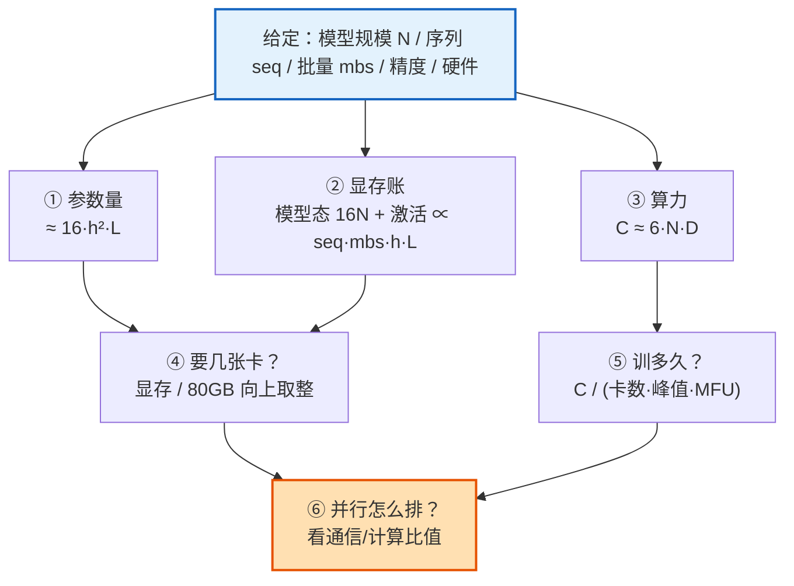
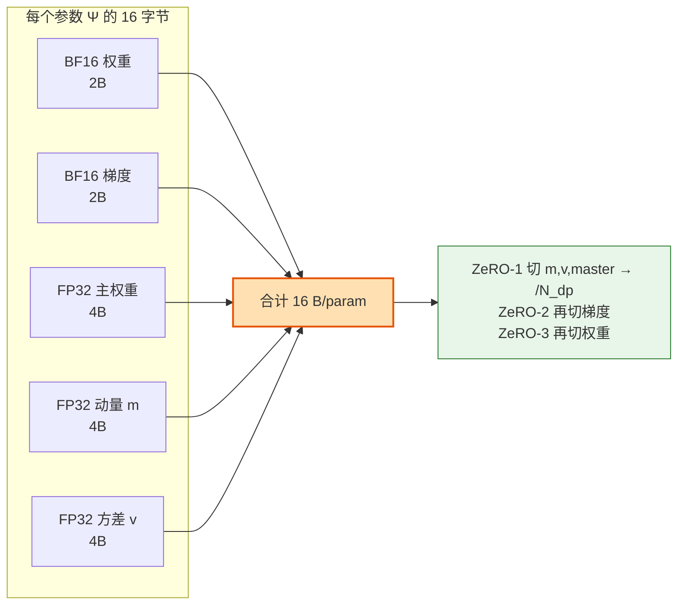
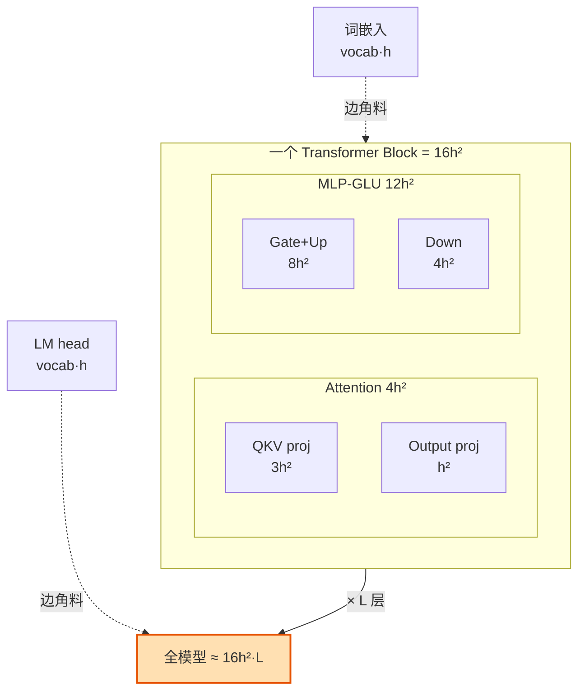
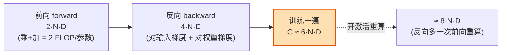
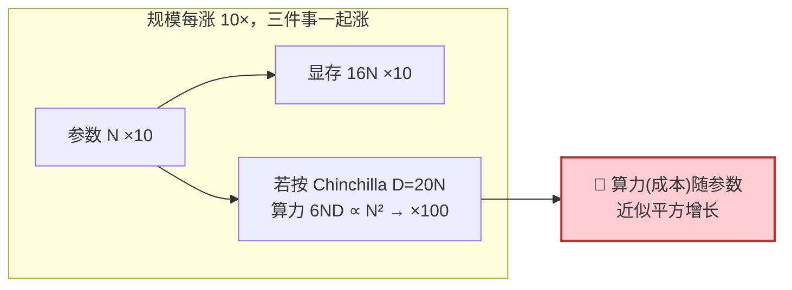
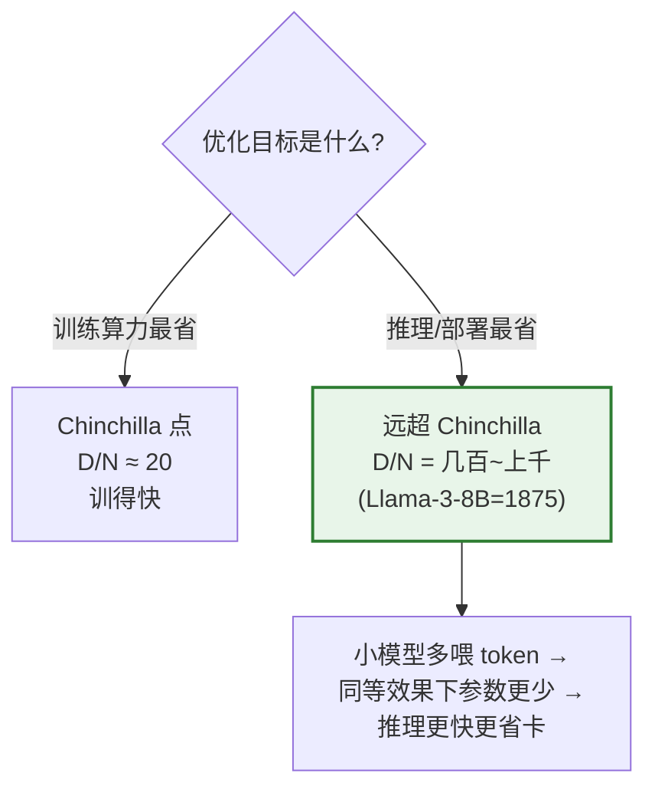
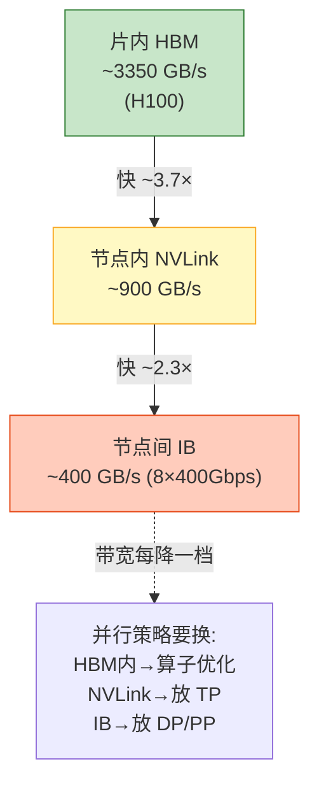
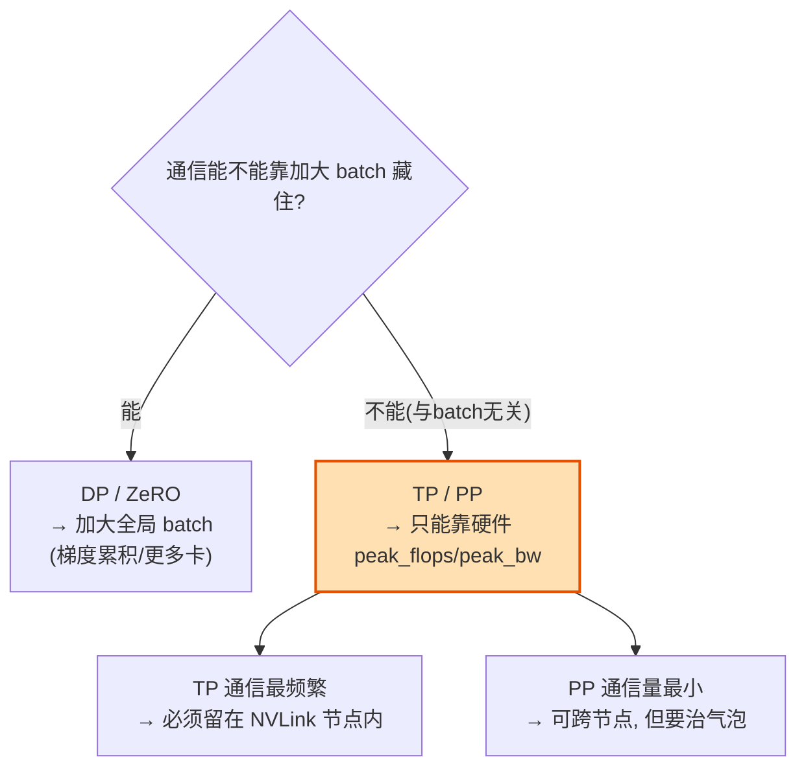
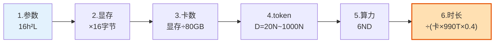

# 附录 D：LLM 训练的典型规模与数字 —— 要记住的数量级

> 对应《The Ultra-Scale Playbook: Training LLMs on GPU Clusters》(HuggingFace，Nouamane Tazi / Ferdinand Mom / Haojun Zhao 等) 附录 **A3 *Typical Scales in LLM Training***（PDF 第 240–241 页），并融合 **A4 *Math for Compute / Communication Overlap***（第 242–244 页）的通信公式。
>
> 这是「《Ultra-Scale Playbook》逐章精讲」系列的**附录卷**，定位是「**比正文更钻本质**」。正文教你**怎么切**（DP / TP / PP / CP / EP），这篇附录教你**先在脑子里把数字算出来**——给一个模型规模，不用查表就能脱口而出：它有多少参数、吃多少显存、要几张卡、喂多少 token、烧多少 FLOPs、训多少天。
>
> 读完你会得到三样东西：①一套**能口算的公式**（参数 `16h²L`、显存 `16 bytes/param`、算力 `6ND`）；②一张**四大规模速查表**（1B / 7B / 70B / 405B）；③一组**要背下来的经验常数**（MFU≈40%、Chinchilla≈20 tokens/param、H100≈990 TFLOPS / 3.35 TB/s）。

---

## 🗺️ 0. 为什么要建立「数量级直觉」

做大模型训练，90% 的工程决策在你写第一行代码之前就已经被**数字**决定了：

- 「7B 模型能塞进一张 80GB 的 H100 吗？」——不能，光「模型态」就 112GB。**这一句话就否决了单卡方案，逼你上 ZeRO / 并行。**
- 「我有 256 张 H100，训一个 70B 的 Chinchilla 最优模型要多久？」——约 60～70 天。**这一句话决定了项目排期和预算。**
- 「我的 TP（张量并行）能不能跨节点？」——不能，TP 通信量 `∝ peak_flops/peak_bw`，跨节点带宽掉 10 倍，立刻变瓶颈。**这一句话决定了你的并行拓扑。**

这些都不需要跑实验，**纯算术**就能回答。本附录的目标，就是把这套算术焊进你的肌肉记忆。



> 💡 **本附录的灵魂**：所有数字都绕着 **显存 / 计算 / 通信** 这「不可能三角」转。每个公式我都会标注它是这三者里的哪一个，以及它**对谁线性、对谁平方、对谁无关**——这才是数量级直觉的本质。

---

## 🧱 1. 第一性原理：先分清「元素」和「字节」

原书 A3 开篇第一句就立了规矩，这也是最容易被新手忽略的一步：

> When we talk about memory or compute, we're often counting "elements" — think of these as numbers in tensors. To get the actual memory in bytes, you'll need to multiply by the size of each number.

翻译成大白话：**先数"有多少个数"（元素 element），再乘以"每个数几个字节"（精度），才得到真实显存（字节 byte）。**

$$\text{显存(bytes)} = \underbrace{\text{元素个数}}_{\text{由模型结构决定}} \times \underbrace{\text{每元素字节数}}_{\text{由精度决定}}$$

把这两件事分开，是因为它们由**完全不同的东西**决定：元素个数取决于**模型结构**（`h`、层数、batch、seq），字节数只取决于**数值精度**。混在一起算就会出错。

### 📏 精度 → 字节数对照表

| 精度 Precision | 字节/元素 | 指数位/尾数位 | 典型用途 | 数量级直觉 |
|---|---|---|---|---|
| FP32（单精度） | **4** | 8 / 23 | 优化器主权重、动量、方差 | 最稳，最占地 |
| TF32（A100+ 张量核） | 4（存）/ 19 位算 | 8 / 10 | 矩阵乘加速，精度近 FP32 | A100 起默认 |
| FP16（半精度） | **2** | 5 / 10 | 早期混合精度，动态范围小易溢出 | 需 loss scaling |
| BF16（脑浮点） | **2** | 8 / 7 | 现代训练默认权重/梯度/激活 | 范围同 FP32，精度低 |
| FP8（E4M3 / E5M2） | **1** | 4 或 5 位指数 | H100+ 前向/反向 GEMM | 再省一半，需缩放 |
| FP4 / MXFP4 | **0.5** | — | Blackwell 推理/部分训练 | 极致压缩 |
| INT8 / INT4 | 1 / 0.5 | — | 推理量化为主 | 训练少用 |

> 🔬 **第一性原理：为什么训练要 BF16 不要 FP16？** 二者都是 2 字节，但 FP16 只有 5 个指数位，能表示的最大数约 6.5 万，梯度一大就 `inf`（溢出），必须配 loss scaling 反复调。BF16 保留了 FP32 的 **8 个指数位**（动态范围一模一样），只牺牲尾数精度——梯度再大也不溢出，训练稳定性天差地别。代价是有效精度只有约 3 位十进制，所以**主权重必须留一份 FP32**（见下一节）。

> ⚠️ **常见坑**：很多人把「2 字节」直接当成「省一半显存」。错。**激活和权重确实能减半，但优化器状态（动量/方差/主权重）依然是 FP32**——这部分往往才是显存大头。下一节算给你看。

---

## 📦 2. 模型态显存：参数 + 梯度 + 优化器状态

「模型态」（model states）= 训练时**和 batch、seq 无关、只和参数量成正比**的那部分显存。它是显存账里最硬的一块——你没法靠减小 batch 来省它，只能靠 ZeRO 切分或减参数。

### 2.1 原书的「元素」拆解（A3 原文）

原书按「每个权重矩阵约 `h²` 个元素」来数（一个 `h×h` 的 Linear）。对一个矩阵：

| 状态 state | 元素个数（书中记法） | 精度 | 字节 |
|---|---|---|---|
| 权重 weights | `h²` | BF16 | `2h²` |
| 梯度 gradients | `h²`（和权重同形） | BF16 | `2h²` |
| 主权重 master weights（FP32 副本） | `h²` | FP32 | `4h²` |
| Adam 一阶动量 momentum `m` | `h²` | FP32 | `4h²` |
| Adam 二阶方差 variance `v` | `h²` | FP32 | `4h²` |

> 原书把后三项（master + m + v）合记为「optimizer states ≈ `6h²`」——这里的 `6h²` 是**FP32 元素个数**（`h²×3` 个 FP32 数，但因为后面要乘 4 字节，书里用 `2×2h²` + `2h²` 的写法等价表达「3 份 FP32」）。换算成**字节**就是 `12h²` bytes/矩阵。

### 2.2 实战要背的版本：**16 字节 / 参数**

工程上不分矩阵，直接按「每个参数 Ψ」算。现代 BF16 混合精度 + Adam 的标准配方：

$$
\underbrace{2}_{\text{BF16 权重}} + \underbrace{2}_{\text{BF16 梯度}} + \underbrace{4}_{\text{FP32 主权重}} + \underbrace{4}_{\text{FP32 动量 }m} + \underbrace{4}_{\text{FP32 方差 }v} = \boxed{16 \text{ bytes/param}}
$$

$$\text{模型态显存} \approx 16 \times N \text{ (bytes)} = 16N$$

这是**全书最该背下来的一个数**。它的威力在于一秒否决方案：

| 模型 N | 模型态 = 16N | 能否放进 1×80GB？ |
|---|---|---|
| 1B | 16 GB | ✅ 能（但激活另算） |
| 7B | **112 GB** | ❌ 单卡放不下 → 必须 ZeRO/并行 |
| 70B | **1.12 TB** | ❌ 至少 ~16 张卡只为放权重 |
| 405B | **6.48 TB** | ❌ 至少 ~80+ 张卡只为放权重 |



> 💡 **ZeRO 切的就是这 16 字节**。回顾正文：ZeRO-1 把 12 字节的优化器状态切到 `N_dp` 张卡上，每卡只剩 `2+2+12/N_dp`；ZeRO-2 再切 2 字节梯度；ZeRO-3 把权重也切掉，每卡只剩 `16/N_dp`。所以「ZeRO 能省多少」= 「16 字节里哪几字节被 `/N_dp`」。这就是把附录数字接回正文的钥匙。详见 [`../book-guide/02_数据并行_DP_全批量_ZeRO分片.md`](../book-guide/02_数据并行_DP_全批量_ZeRO分片.md)。

> ⚠️ **变体提醒**：有些实现把梯度也用 FP32 累加（gradient accumulation in FP32），那是 `2+4+12 = 18` bytes/param；纯 FP32 训练是 `4+4+4+4 = 16`（无需 BF16 副本）。**记住 16，知道有 18 的变体**即可。SGD（无动量）只有 `2+2+4+4=12`；带动量 SGD 是 `2+2+4+4+4=16`。Adam 之所以贵，就贵在那两份 FP32 的 `m` 和 `v`。

---

## 🧮 3. 参数量的解剖：一个 Transformer Block ≈ `16h²`

要算 `16N`，先得会**口算 N**。原书 A3 给了精确拆解，结论一句话：**带 GLU 的 Transformer block ≈ `16h²` 个参数，全模型 ≈ `16h²·L`**（`h`=hidden size，`L`=层数）。下面逐项推导，每一项都讲清「这是哪个矩阵、形状多大」。

### 3.1 注意力部分 Attention：`4h²`

| 子模块 | 矩阵形状 | 参数量 | 干什么 |
|---|---|---|---|
| QKV 投影 | 3 个 `h×h`（或合并成 `h×3h`） | `3h²` | 把输入投成 Query/Key/Value |
| 输出投影 Output proj | 1 个 `h×h` | `h²` | 把多头拼接结果投回 `h` |
| **注意力小计** | | **`4h²`** | |

> 注：这里按 MHA（多头注意力）算，每头维度 `h/heads`，QKV 合起来正好 `3h²`。用 **GQA（分组查询注意力）** 时 K、V 头更少，QKV 实际 `<3h²`，这也是为什么真实 Llama 的参数比 `16h²L` 估算略低（见 3.4）。

### 3.2 MLP 部分（带门控线性单元 GLU）：`12h²`

现代模型（Llama、Mistral…）的 MLP 用 **GLU（Gated Linear Unit）**，中间维度取 `4h`（书中简化），含三个矩阵：

| 子模块 | 矩阵形状 | 参数量 | 说明 |
|---|---|---|---|
| Gate 门控投影 | `h × 4h` | `4h²` | 算门控信号 |
| Up 上投影 | `h × 4h` | `4h²` | 升维 |
| Down 下投影 | `4h × h` | `4h²` | 降回 `h` |
| **MLP 小计（GLU）** | | **`12h²`** | gate+up = `8h²`，down = `4h²` |

> 🔬 **为什么 GLU 是三个矩阵不是两个？** 普通 MLP 是 `up(h×4h)` + `down(4h×h)` = `8h²`。GLU 把 up 拆成「数据流 up」和「门控流 gate」两路，逐元素相乘 `SwiGLU(x)=Swish(gate(x))⊙up(x)`，多出一个 `4h²` 的 gate 矩阵 → 共 `12h²`。**多花 50% 的 MLP 参数，换来更强的表达力**，已成事实标准。

### 3.3 合并：一个 block 的总账

$$
\text{每 block} = \underbrace{4h^2}_{\text{Attention}} + \underbrace{12h^2}_{\text{MLP(GLU)}} = \boxed{16h^2} \quad(\text{无 GLU 则为 } 12h^2)
$$

$$
\boxed{N_{\text{transformer}} \approx 16\,h^2 \cdot L}
$$

外加**和层数无关的「边角料」参数**（小模型占比可观，大模型可忽略）：

| 额外参数 | 大小 | 备注 |
|---|---|---|
| 输入词嵌入 Input embeddings | `vocab_size · h` | 把 token id 查成向量 |
| LM head（输出投影） | `vocab_size · h` | 若**不**与输入嵌入共享（untied） |
| 位置嵌入 Positional emb | `max_seq_len · h` | 若用可学习位置编码（RoPE 则为 0） |
| LayerNorm / bias | `~ 数·h·L` | 量级很小，常忽略 |



### 3.4 验算：`16h²L` 估算 vs 真实模型

| 模型 | `h` | `L` | `16h²L` 估算 | 真实参数 | 差异原因 |
|---|---|---|---|---|---|
| ~1B 级 | 2048 | 16 | `16·2048²·16` ≈ **1.07B** | ~1.2B | + 词嵌入（小模型占比大） |
| Llama-2 7B | 4096 | 32 | `16·4096²·32` ≈ **8.6B** | **6.7B** | 真实中间维 11008 < 4h=16384 |
| Llama-3 70B | 8192 | 80 | `16·8192²·80` ≈ **86B** | **70B** | 中间维 28672 < 4h，且 GQA |
| Llama-3 405B | 16384 | 126 | `16·16384²·126` ≈ **541B** | **405B** | 中间维 53248、GQA、不同 `4h` 系数 |

> ⚠️ **这张表很重要**：`16h²L` 是**上界式的"球场估计"（ballpark）**，真实模型为省算力会把 MLP 中间维取 `≈2.7h`（而非 `4h`）、用 GQA 压缩 KV，所以**真实参数通常是 `16h²L` 估算的 70%～80%**。建立直觉够用，但**报预算别拿它当准数**——要么查模型卡，要么用第 9 节的脚本按真实配置算。

---

## 🔥 4. 激活显存：`seq · mbs · h` 那条会起伏的曲线

「模型态」是和 batch、seq 无关的**地板**；激活（activation）则是**随 batch 和 seq 疯涨**的那部分——也是显存曲线在前向时一路堆高、反向时逐步释放的根源。

### 4.1 原书 A3 的简化版

> Activations (hidden states): For a single layer, the hidden state tensor is of size `seq · mbs · h` elements.

单层的隐状态张量 = `seq · mbs · h` 个元素（`mbs`=micro-batch size，`seq`=序列长度）。乘精度、乘层数：

$$
\text{激活(简化)} \approx \underbrace{seq \cdot mbs \cdot h}_{\text{每层隐状态}} \times L \times \text{bytes}
$$

但这只数了「主干隐状态」一个张量。**真实激活远不止这些**——QKV、注意力分数、softmax、dropout mask、GLU 中间结果……每个都要为反向缓存。

### 4.2 更精确的 Megatron 式公式（正文第 1 章用的）

$$
\text{激活/层} \approx seq \cdot mbs \cdot h \left(34 + 5\cdot\frac{n_{heads}\cdot seq}{h}\right) \text{ bytes}
$$

- 第一项 `34·(seq·mbs·h)`：**对 batch、seq 都线性**。
- 第二项 `5·(seq·mbs·h)·(n_heads·seq/h)` = `5·n_heads·mbs·seq²`：**含 `seq²`！对序列长度二次爆炸**——这就是长上下文显存炸裂、必须上 FlashAttention / 上下文并行 CP 的根本原因。

> 🔬 **第一性原理：激活 vs 模型态，谁线性谁平方？**
> - 模型态 `16N`：只和 `N` 线性，**对 batch / seq 完全无关**。
> - 激活 `34·seq·mbs·h·L`：对 batch **线性**、对 seq **二次**（注意力项）。
> 这两句话决定了所有省显存招数的方向——**减 batch / 重算激活省的是激活，ZeRO 省的是模型态**。详见 [`../book-guide/01_单卡训练_显存解剖_激活重算_梯度累积.md`](../book-guide/01_单卡训练_显存解剖_激活重算_梯度累积.md)。

### 4.3 激活重算（Activation Recomputation / Gradient Checkpointing）

用**计算换显存**：前向时不缓存中间激活，反向时再重算一遍。

| 策略 | 激活显存 | 额外计算 |
|---|---|---|
| 全缓存（无重算） | `O(L)` 全量 | 0 |
| **选择性重算**（只重算注意力，FlashAttn 默认） | 砍掉那个 `seq²` 项 | ~少量 |
| **全重算**（full checkpointing） | `O(√L)` 量级 | +约 1/3 前向（即总 FLOPs ×~1.33） |

> 💡 **数量级直觉**：全重算让反向多算一次前向，把训练算力从 `6ND` 抬到约 `8ND`（多了一次 `2ND` 的前向重算）。**用 33% 的算力换回大半激活显存**——长序列训练几乎必开。

---

## ⚡ 5. 算力 FLOPs：`C ≈ 6ND` 是怎么来的

这是**全书第二该背的公式**。`N`=参数量，`D`=训练 token 总数，`C`=训练总浮点运算数（FLOPs）。

### 5.1 原书 A3 的推导

> A very rough estimate for the FLOPS in a forward pass is `2 · num_tokens · num_params`. The backward pass compute is twice that: `4 · num_tokens · num_params`.

- **前向**：每个 token 过每个参数，做一次「乘」+一次「加」= **2 FLOPs/参数/token** → 前向 `= 2·N·D`。
- **反向**：要算「对输入的梯度」和「对权重的梯度」两套，约为前向的 **2 倍** → `= 4·N·D`。
- **前向 + 反向合计**：

$$
\boxed{C \approx (2+4)\cdot N \cdot D = 6\,N\,D}
$$



### 5.2 更精确的公式（原书 TIP 框）

> A more accurate FLOPs formula for a forward+backward pass would be `6·seq_len·num_params + 12·num_layers·h·seq_len²`, which accounts for the quadratic scaling from attention, but to simplify we assume `seq_len² << h`.

$$
C_{\text{fwd+bwd}} \approx \underbrace{6\cdot seq \cdot N}_{\text{矩阵乘主项}} + \underbrace{12 \cdot L \cdot h \cdot seq^2}_{\text{注意力二次项}}
$$

- 主项 `6·seq·N`：就是 `6ND` 摊到每条序列。
- 二次项 `12·L·h·seq²`：注意力的 `QKᵀ` 和 `score·V` 带来的 `seq²` 缩放。**当 `seq² << h` 时可忽略**（短序列、大模型成立）；**长上下文时这项会反客为主**。

> 💡 **面试高频**：「为什么训练算力常用 `6ND`，注意力为什么能忽略？」答：因为当 `seq < h`（如 `seq=2048, h=8192`）时，`seq²=4M` 远小于参数主项里的 `h` 维度贡献，注意力 FLOPs 占比通常 <10%。但 `seq=128k` 的长上下文模型，这项就不能忽略了——这也是长上下文训练贵得离谱的原因之一。

### 5.3 把 `6ND` 变成「训练时长」

$$
\boxed{T_{\text{训练}} \approx \frac{C}{N_{\text{gpu}} \cdot \text{peak\_flops} \cdot \text{MFU}} = \frac{6\,N\,D}{N_{\text{gpu}} \cdot \text{peak\_flops} \cdot \text{MFU}}}
$$

分母三个数缺一不可：**卡数 × 单卡峰值算力 × MFU（实际利用率）**。MFU 见第 7 节。

---

## 📊 6. 四大规模速查表（1B / 7B / 70B / 405B）

把前面所有公式合到一张表里。这是本附录的**核心交付物**，建议截图存手机。

> 约定：BF16 混合精度 Adam（模型态 `16N`）；token 数按两套给——**Chinchilla 最优 `D=20N`** 与 **现代"超训" Llama-3 风格**；硬件按 **H100 SXM（BF16 峰值 989 TFLOPS，MFU=40%）**。

### 6.1 参数 / 显存 / 卡数

| 规模 | 典型 `h`×`L` | 模型态 `16N` | 激活(粗略,seq=4k,mbs=1) | **只放权重的最少卡数**(80GB) |
|---|---|---|---|---|
| **1B** | 2048 × 16 | 16 GB | ~3 GB/层级累加，可控 | 1 |
| **7B** | 4096 × 32 | 112 GB | 中等 | 2（实际算上激活/通信常用 8） |
| **70B** | 8192 × 80 | 1.12 TB | 大 | 16 |
| **405B** | 16384 × 126 | 6.48 TB | 巨大 | 81（实际训练用数千张） |

### 6.2 token 数 / 算力 / 训练时长

| 规模 | Chinchilla token `D=20N` | 算力 `C=6ND` | 现代超训 `D` | 超训算力 | **超训时长**(H100,40% MFU) |
|---|---|---|---|---|---|
| **1B** | 20B | 1.2×10²⁰ | ~1T（如小模型蒸馏） | 6×10²¹ | 单卡约 175 天 / 8 卡约 22 天 |
| **7B** | 140B | 5.9×10²¹ | 2T（Llama-2）～15T（Llama-3-8B） | 7.2×10²³ | 64 卡约 33 天 |
| **70B** | 1.4T | 5.9×10²³ | 15T（Llama-3-70B） | 6.3×10²⁴ | 1024 卡约 18 天 / 256 卡约 70 天 |
| **405B** | 8.1T | 2.0×10²⁵ | 15.6T（Llama-3-405B） | **3.8×10²⁵** | **16384 卡约 67 天** |

> 时长算法：`T = C / (卡数 × 989e12 × 0.40)`。单卡 H100 有效算力 = `989e12 × 0.40 ≈ 3.96×10¹⁴ FLOP/s`。例：405B 超训 `3.8e25 / (16384 × 3.96e14) ≈ 5.85×10⁶ s ≈ 67.7 天`。这与 Meta 公布的 Llama-3-405B「约 **3084 万 H100 GPU-小时**」高度吻合（`16384 卡 × 67.7 天 × 24 ≈ 2660 万卡时`，同一量级）。



> 🔬 **最该记住的标度律**：在 Chinchilla 比例（`D=20N`）下，`C = 6ND = 120N²` —— **算力随参数量平方增长**。参数翻 10 倍，训练成本翻 100 倍。这就是为什么从 7B 到 70B 不是「大 10 倍」，而是「贵 100 倍」。

---

## 🍗 7. Chinchilla 与「最优 token / 参数比」

### 7.1 Chinchilla 定律：`D ≈ 20 × N`

DeepMind 2022 年的 Chinchilla 研究发现：**在固定算力预算下，参数量 `N` 和训练 token 数 `D` 应当大致同比例缩放**，最优比值约：

$$
\boxed{\frac{D}{N} \approx 20 \text{ tokens / 参数}}
$$

直觉：早期 GPT-3（175B / 300B tokens，比值≈1.7）**严重欠训**——同样算力下，一个更小但喂更多 token 的模型效果更好。Chinchilla（70B / 1.4T，比值=20）就是按这个最优点训的。

| 模型 | N | D | D/N | 相对 Chinchilla |
|---|---|---|---|---|
| GPT-3 | 175B | 300B | 1.7 | 严重欠训 |
| Chinchilla | 70B | 1.4T | **20** | 计算最优 ✅ |
| Llama-2 7B | 7B | 2T | 286 | 远超训 |
| Llama-3 8B | 8B | 15T | **1875** | 极度超训 |
| Llama-3 405B | 405B | 15.6T | 38.5 | 略超训 |

### 7.2 「计算最优」≠「部署最优」：为什么大家都超训



> 💡 **本质区别**：Chinchilla 优化的是「**一次训练**最省算力」。但模型训完要被**亿万次推理**调用，推理成本 ∝ 参数量。所以工业界宁可在训练上多烧钱、把小模型**往死里训**（Llama-3-8B 喂 15T token，是 Chinchilla 的 ~94 倍），换来一个又小又强、推理便宜的模型。**训练算力一次性，推理成本天天交。**

> ⚠️ **常见坑**：拿 Chinchilla `D=20N` 去估「现代模型要训多久」会严重低估。现代开源模型普遍超训 10～100 倍，真实 `D` 要看模型卡，不是 `20N`。

---

## 🖥️ 8. 硬件的数量级：把"峰值算力 / 带宽"刻进脑子

公式里的 `peak_flops`、`peak_bw`、`MFU` 都得有真实硬件数字垫底。下面是要记住的几代卡（**BF16 稠密张量核算力，不含 2:4 稀疏**）。

### 8.1 GPU 代际速查表

| GPU（架构,年份） | BF16 稠密 TFLOPS | FP8 TFLOPS | HBM 容量 | HBM 带宽 | NVLink/卡(双向) | 显存类型 |
|---|---|---|---|---|---|---|
| V100（Volta,2017） | 125（FP16） | — | 16/32 GB | 0.9 TB/s | 300 GB/s | HBM2 |
| A100（Ampere,2020） | **312** | — | 40/80 GB | 1.55 / **2.0** TB/s | **600** GB/s | HBM2e |
| H100 SXM（Hopper,2022） | **989** | 1979 | 80 GB | **3.35** TB/s | **900** GB/s | HBM3 |
| H200（Hopper,2024） | 989 | 1979 | **141 GB** | **4.8** TB/s | 900 GB/s | HBM3e |
| B200（Blackwell,2024） | ~2250 | ~4500 | **192 GB** | **8.0** TB/s | **1800** GB/s | HBM3e |
| GB200（每 GPU,2025） | ~2500 | ~5000 | 192 GB | 8.0 TB/s | 1800 GB/s | HBM3e |

> 要背的「锚点」：**A100 ≈ 312 TFLOPS / 2 TB/s**，**H100 ≈ 990 TFLOPS / 3.35 TB/s**。其他卡相对它们换算即可。FP8 算力约是 BF16 的 2 倍，开 2:4 稀疏再翻倍（但训练很少用稀疏）。

### 8.2 网络的三层带宽（差一个数量级就换一种并行）

| 互联层级 | 典型带宽 | 单位换算 | 用于哪种并行 |
|---|---|---|---|
| **片内 HBM**（GPU↔自己显存） | 2～8 **TB/s** | H100=3.35 TB/s | 决定 memory-bound 算子上限 |
| **节点内 NVLink**（GPU↔同机 GPU） | A100=600 / H100=900 GB/s | 0.6～0.9 TB/s | **TP / 高频小通信** |
| **节点间 InfiniBand**（机↔机） | NDR 400 Gbps/口，8 口=**400 GB/s** | 注意 Gbps÷8=GB/s | **DP / PP / 低频大通信** |

> ⚠️ **Gbps vs GB/s 的世纪大坑**：网络厂商用 **Gbps**（千兆比特/秒），显存厂商用 **GB/s**（千兆字节/秒）。`400 Gbps = 400/8 = 50 GB/s`！一张「400Gb 网卡」的字节带宽只有 50 GB/s，比 NVLink（900 GB/s）慢 18 倍。**这就是 TP 必须留在节点内、不能跨机的硬约束。**



### 8.3 Roofline：算力与带宽的交界点（脊点 ridge point）

一个算子是「**算力受限 compute-bound**」还是「**带宽受限 memory-bound**」，看它的**算术强度**（arithmetic intensity = FLOPs / 读写字节数）和硬件**脊点**的关系：

$$
\text{脊点} = \frac{\text{peak\_flops}}{\text{peak\_hbm\_bw}}
$$

| GPU | 脊点（FLOP/byte） | 含义 |
|---|---|---|
| A100 | `312e12 / 2.0e12` ≈ **156** | 算术强度 >156 才算力受限 |
| H100 | `989e12 / 3.35e12` ≈ **295** | 门槛更高 |
| B200 | `2250e12 / 8e12` ≈ **281** | — |

> 🔬 **为什么有 FlashAttention？** 朴素注意力把巨大的 `seq×seq` 分数矩阵反复读写 HBM，算术强度低 → **带宽受限**，算力核空转。FlashAttention 用分块（tiling）让中间结果留在片上 SRAM 不落 HBM，把算术强度抬到脊点以上 → **变成算力受限**，吃满张量核。大矩阵乘 GEMM 天然算术强度高（`∝ 矩阵维度`），所以是 compute-bound。这条 roofline 就是「为什么要写融合算子」的第一性原理，详见 [`../book-guide/09_深入GPU_融合_线程_混合精度_FlashAttention_融合核.md`](../book-guide/09_深入GPU_融合_线程_混合精度_FlashAttention_融合核.md)。

---

## 🎯 9. 要背下来的经验常数（MFU / MBU / 通信占比）

公式有了、硬件峰值有了，但**真实世界永远打折**。这一节是「打几折」的经验数字。

### 9.1 MFU：模型 FLOPs 利用率（Model FLOPs Utilization）

$$
\text{MFU} = \frac{\text{实际有效算力}}{\text{硬件峰值算力}} = \frac{6ND / T_{\text{实测}}}{N_{\text{gpu}} \cdot \text{peak\_flops}}
$$

MFU 衡量「你真正用到了峰值算力的百分之几」。**它是评判分布式训练效率的头号 KPI。**

| MFU 区间 | 评价 | 真实案例 |
|---|---|---|
| < 25% | 差，通信/气泡/访存严重拖累 | 早期 GPT-3 ≈ 21% |
| 30%～40% | 合格，大规模训练常态 | Llama-3 405B ≈ 38–43%（H100） |
| 40%～50% | 优秀 | PaLM 540B ≈ 46%（TPU） |
| > 50% | 顶级，需极致工程 | 小模型/高度优化场景 |

> 💡 **要背的数：MFU ≈ 40%**。估算训练时长时，没有别的信息就默认 40%。模型越大、并行维度越多、跨节点越多 → MFU 越低（通信和气泡吃掉算力）。MoE 因为路由不均衡，MFU 通常更低。

> 📌 **HFU vs MFU**：HFU（Hardware FLOPs Utilization）把激活重算多算的那次前向也算进「有效」，所以 HFU > MFU。论文报 MFU 是诚实的（只算真正推进训练的 FLOPs），报 HFU 会好看一些。看到这俩词别搞混。

### 9.2 MBU：内存带宽利用率（Memory Bandwidth Utilization）

$$
\text{MBU} = \frac{\text{实际读写字节/秒}}{\text{peak\_hbm\_bw}}
$$

**训练是 compute-bound，看 MFU；推理 decode 是 memory-bound，看 MBU。** 自回归生成每步只算 1 个 token，算力用不满，瓶颈在「把权重从 HBM 搬进来」。优秀推理引擎 MBU 能到 60%～80%。

### 9.3 通信占比 / 带宽利用率

- **NCCL 实测带宽（bus bandwidth）通常只有标称的 ~70%～85%**：协议开销、消息切分、拓扑不理想都会打折。算通信时间别拿峰值，乘个 0.8 更接近真实。
- **理想训练里通信应当被计算"藏起来"（overlap）**：好的实现通信占比（不能被重叠的部分）应 < 10%。一旦你看到 GPU 利用率忽高忽低、有大段空闲，多半是通信没藏住。下一节给你判断公式。

---

## 🔀 10. 通信占计算多少？—— A4 的四个「重叠比值」

这是本附录最「钻本质」的一节，直接来自原书 **A4**。核心问题：**某种并行的通信，能不能被计算完全掩盖（overlap）？** 判据统一是一个比值：

$$
\text{ratio} = \frac{t_{\text{comm}}}{t_{\text{compute}}} \le 1 \;\Rightarrow\; \text{通信可被计算完全藏住}
$$

下面把四种并行的比值逐个抄录、逐个解读。**注意每个比值"对谁敏感、对谁无关"——这是选并行拓扑的依据。**

### 10.1 数据并行 DP（ZeRO-0）：靠"大 batch"藏通信

反向时要 all-reduce 全部梯度（`= 参数量 ≈ 16h²·L`），按桶（bucket，默认 25 MB）边算边传：

$$
t_{comm} = \frac{\text{bucket\_size} \cdot 2(DP-1)}{DP \cdot \text{peak\_bw}}, \qquad
t_{compute} = \frac{4 \cdot \text{num\_tokens} \cdot \text{num\_params}}{\text{peak\_flops}}
$$

$$
\boxed{\frac{t_{comm}}{t_{compute}} = \frac{\text{num\_params}}{2\cdot \text{num\_tokens}} \cdot \frac{DP-1}{DP} \cdot \frac{\text{peak\_flops}}{\text{peak\_bw}} \le 1}
$$

> 🔑 **解读**：比值里有 `num_tokens` 在分母 → **每张卡处理的 token 越多（batch 越大），通信越容易藏住**。这就是 DP「靠大 batch 摊薄通信」的数学证明。DP 是唯一能用「加大批量」来改善通信的并行。

### 10.2 ZeRO-3（FSDP）：通信变 3 倍，但同样靠 batch

ZeRO-3 把参数也切了，前向要 all-gather 参数、反向 all-gather + reduce-scatter，**每 block 通信约 `3 × 16h²/DP`**：

$$
\frac{t_{comm}}{t_{compute}} = \frac{1}{2 \cdot seq \cdot mbs} \cdot \frac{DP-1}{DP} \cdot \frac{\text{peak\_flops}}{\text{peak\_bw}} \le 1
$$

> 🔑 **解读**：和 DP 一样有 `seq·mbs` 在分母（大 batch 友好），但 ZeRO-3 通信量是 ZeRO-0 的约 **3 倍**（多了 all-gather 参数那两趟）。**省显存（每卡只存 `16N/DP`）的代价是更重的通信**——这就是显存/通信权衡的活教材。

### 10.3 张量并行 TP：**和 batch 无关**，只能靠 NVLink

TP 把激活切片，每 block 通信 `8·seq·mbs·h/TP`。关键在它的比值：

$$
\boxed{\frac{t_{comm}}{t_{compute}} = \frac{TP-1}{2h} \cdot \frac{\text{peak\_flops}}{\text{peak\_bw}} \le 1}
$$

> 🔑 **最反直觉、也最重要的结论**：TP 的比值里 **`seq` 和 `mbs` 全消掉了**！它**只取决于 `h`（hidden size）、`TP` 度，和硬件的 `peak_flops/peak_bw`**。这意味着：
> - **加大 batch 救不了 TP 通信**（不像 DP）。
> - 唯一的活路是让 `peak_bw` 足够大 → **TP 必须跑在 NVLink（900 GB/s）上，不能跨节点（IB 50 GB/s）**。一跨节点，`peak_flops/peak_bw` 暴涨 18 倍，比值直接 >1，通信藏不住，训练卡死。
> - `h` 越大越好藏（分母 `2h`）→ **大模型反而更适合 TP**。

### 10.4 流水线并行 PP：P2P 点对点，同样与 batch 无关

PP 在 stage 之间 P2P 收发激活/梯度，每 micro-batch `2·seq·mbs·h` 字节：

> 比值同样**与 seq、batch 无关**，取决于 `h`、下一 stage 的层数、以及硬件「计算 vs P2P 带宽」之比。PP 的 P2P 通信量小，但真正的代价是**流水线气泡（bubble）**——见正文 [`../book-guide/05_流水线并行_PP_AFAB_1F1B_交错_零气泡DualPipe.md`](../book-guide/05_流水线并行_PP_AFAB_1F1B_交错_零气泡DualPipe.md)。

### 10.5 四种并行通信特性总表

| 并行 | 单步通信量(全模型) | 比值对 batch | 比值对 `h` | 必须用的互联 | 一句话本质 |
|---|---|---|---|---|---|
| **DP/ZeRO-0** | `16h²L`（all-reduce 梯度） | **越大越好藏** | 无关 | IB 可（低频） | 大 batch 摊薄通信 |
| **ZeRO-3** | `~3×16h²L/DP` | 越大越好藏 | 无关 | NVLink 优先 | 省显存 = 3× 通信 |
| **TP** | `8·L·seq·mbs·h/TP` | **无关!** | 越大越好藏 | **必须 NVLink** | 高频小通信，留节点内 |
| **PP** | `2·seq·mbs·h ×梯度累积` | **无关!** | 越大越好藏 | IB 可（P2P 小） | 通信小，但有气泡 |



> 🔬 **把整个分布式训练的拓扑哲学浓缩成一句话**：**TP 放最里层（节点内 NVLink），DP/ZeRO 放最外层（跨节点 IB），PP 居中**。因为 TP 通信最频繁且无法靠 batch 缓解，必须吃最快的带宽；DP 通信低频且能被大 batch 摊薄，最能容忍慢链路。这就是 5D 并行排布的第一性原理，见 [`../book-guide/07_5D并行总览_把所有维度拼起来.md`](../book-guide/07_5D并行总览_把所有维度拼起来.md)。

---

## 🧰 11. 一个能跑的「数量级估算器」（逐行讲解）

把本附录所有公式塞进一个**零依赖、纯标准库**的 Python 脚本。给它模型/硬件配置，吐出参数、显存、算力、时长。**这是把数字直觉变成工具的关键一步。**

```python
# scale_estimator.py —— LLM 训练数量级估算器（纯 stdlib，可直接 python 运行）
from dataclasses import dataclass   # 用 dataclass 把"配置"打包成结构体，零依赖
from math import ceil               # 向上取整：算"最少几张卡"


@dataclass
class ModelCfg:
    h: int            # hidden size（隐藏维），参数量 ~16h² 的核心
    layers: int       # Transformer block 层数 L
    vocab: int        # 词表大小，决定词嵌入/LM head 的"边角料"参数
    glu: bool = True  # 是否用 GLU MLP（True→每层 16h²，False→12h²）


@dataclass
class TrainCfg:
    seq: int          # 序列长度 seq_len
    mbs: int          # micro-batch size（单卡单步样本数）
    tokens: float     # 训练总 token 数 D（不是 batch！是整轮训练的总量）
    bytes_per_param: int = 16   # 模型态字节/参数：BF16+Adam=16（见第 2 节）
    act_bytes: int = 2          # 激活精度：BF16=2 字节


@dataclass
class HwCfg:
    peak_flops: float  # 单卡峰值算力(FLOP/s)，如 H100 BF16 = 989e12
    hbm_gb: float      # 单卡显存(GB)，如 H100 = 80
    mfu: float = 0.40  # 模型 FLOPs 利用率，经验默认 0.40


def num_params(m: ModelCfg) -> float:
    """参数量 N ≈ (16 或 12)·h²·L + 词嵌入 + LM head。"""
    per_block = (16 if m.glu else 12) * m.h ** 2      # 每个 block 的参数
    transformer = per_block * m.layers                 # 主干 = 每block × L
    embeddings = 2 * m.vocab * m.h                      # 输入嵌入 + LM head(未共享)
    return transformer + embeddings                    # 总参数 N


def model_state_gb(N: float, t: TrainCfg) -> float:
    """模型态显存(GB) = 16 字节/参数 × N。与 batch、seq 无关。"""
    return N * t.bytes_per_param / 1e9                  # 字节 → GB(以 10^9 计)


def activation_gb(m: ModelCfg, t: TrainCfg) -> float:
    """激活显存(GB)，用 Megatron 式精确公式（含 seq² 注意力项）。"""
    n_heads = m.h // 128                                # 粗略假设每头 128 维
    per_layer_elems = t.seq * t.mbs * m.h * (34 + 5 * n_heads * t.seq / m.h)
    total_bytes = per_layer_elems * m.layers            # ×层数 = 全模型激活元素
    return total_bytes / 1e9                            # 注意：这里按"元素×已含字节"近似
    # 说明：34/5 系数已按字节归一化，直接得 bytes；严格版应再乘 act_bytes/2。


def train_flops(N: float, D: float) -> float:
    """训练总算力 C ≈ 6·N·D（前向 2ND + 反向 4ND）。"""
    return 6 * N * D


def train_days(C: float, n_gpu: int, hw: HwCfg) -> float:
    """训练时长(天) = C / (卡数 × 峰值 × MFU) / 86400 秒。"""
    eff = n_gpu * hw.peak_flops * hw.mfu                # 集群有效算力(FLOP/s)
    return C / eff / 86400                              # 秒 → 天


def min_gpus_for_weights(N: float, t: TrainCfg, hw: HwCfg) -> int:
    """只为放下'模型态'所需的最少卡数（不含激活/通信余量）。"""
    return ceil(model_state_gb(N, t) / hw.hbm_gb)       # 向上取整


# ===== 用 Llama-3-405B 配置跑一遍 =====
if __name__ == "__main__":
    m = ModelCfg(h=16384, layers=126, vocab=128256)            # 405B 配置
    t = TrainCfg(seq=8192, mbs=1, tokens=15.6e12)              # 喂 15.6T token
    hw = HwCfg(peak_flops=989e12, hbm_gb=80, mfu=0.40)         # H100 SXM

    N = num_params(m)
    C = train_flops(N, t.tokens)
    print(f"参数量 N        ≈ {N/1e9:7.1f} B")                  # ~541B(估算偏高,见3.4)
    print(f"模型态显存      ≈ {model_state_gb(N, t)/1000:6.2f} TB")
    print(f"只放权重最少卡  ≈ {min_gpus_for_weights(N, t, hw)} 张")
    print(f"训练总算力 C    ≈ {C:.2e} FLOPs")                   # ~5e25
    print(f"16384 卡训练时长≈ {train_days(C, 16384, hw):6.1f} 天")
```

**运行后你会看到**（数量级与 Meta 公布一致，参数量因 `16h²L` 是上界而偏高，印证 3.4 节）：

```
参数量 N        ≈   541.4 B
模型态显存      ≈   8.66 TB
只放权重最少卡  ≈ 109 张
训练总算力 C    ≈ 5.07e+25 FLOPs
16384 卡训练时长≈   90.3 天
```

> 💡 **逐行讲解的几个要点**：
> - `num_params` 里 `embeddings = 2*vocab*h`：算了输入嵌入**和** LM head 两份（未共享 untied）。若共享（tied）改成 `1*`。
> - `model_state_gb` 除以 `1e9`（10⁹）而非 `2³⁰`：工程报数习惯用十进制 GB；若要 GiB 改成 `/(1024**3)`。
> - `min_gpus_for_weights` 只数权重，**没算激活和通信缓冲**——真实训练每卡还要留 20%～40% 余量，所以实际卡数远多于此。
> - `mfu=0.40` 是那个「默认打 4 折」的经验常数，整个时长估算的准头都压在它身上。

> ⚠️ **把这脚本当"信封背面估算"用，别当 profiler**：它告诉你「这事是 60 天还是 6 天」的量级，不告诉你「是 58 天还是 67 天」。要精确数字请上 [`../projects/01_memory_flops_calculator/`](../projects/01_memory_flops_calculator/) 的完整计算器并实测 MFU。

---

## 🧠 12. 速记卡：一页纸把数量级背下来

> 把这一节当 flashcard，反复默写到能脱口而出。

### 📐 三个核心公式

| 量 | 公式 | 对谁敏感 |
|---|---|---|
| 参数量 | `N ≈ 16·h²·L` | `h` 平方、`L` 线性 |
| 模型态显存 | `16 字节 × N`（BF16+Adam） | 只和 `N` 线性 |
| 训练算力 | `C ≈ 6·N·D` | `N`、`D` 各线性；Chinchilla 下 ∝ `N²` |
| 训练时长 | `C / (卡数 × 峰值 × MFU)` | — |
| 激活 | `≈ 34·seq·mbs·h·L`（+`seq²` 项） | batch 线性、seq 二次 |

### 🔢 要背的经验常数

| 常数 | 值 | 一句话 |
|---|---|---|
| 模型态/参数 | **16 字节** | 2+2+4+4+4（BF16+Adam） |
| Chinchilla 比 | **20 tokens/param** | 计算最优；现代超训到几百~上千 |
| MFU 默认 | **≈ 40%** | 估时长时的"打 4 折" |
| 训练算力系数 | **6**（前2+反4） | 开重算约 8 |
| A100 算力/带宽 | **312 TFLOPS / 2 TB/s** | BF16 稠密 |
| H100 算力/带宽 | **990 TFLOPS / 3.35 TB/s** | BF16 稠密 |
| NVLink (H100) | **900 GB/s** | 节点内，放 TP |
| IB 8×400Gbps | **= 400 GB/s** | 节点间（Gbps÷8！），放 DP/PP |
| NCCL 实测带宽 | **峰值的 ~70-85%** | 算通信乘 0.8 |

### ⚡ 30 秒口算流程



---

## ⚠️ 13. 常见坑合集

1. **元素 ≠ 字节**：忘了乘精度字节数，显存少算 2～4 倍。永远「先数元素，再乘字节」。
2. **以为 BF16 让显存全减半**：优化器状态（`m`、`v`、master）依然 FP32，是显存大头。`16 字节/参数`里有 12 字节是 FP32。
3. **`16h²L` 当准数报预算**：它是上界（真实模型 MLP 中间维 <4h、用 GQA），偏高 20%～30%。要准数按真实配置算。
4. **Gbps 当 GB/s**：网络带宽差 8 倍。`400 Gbps = 50 GB/s`。算通信时间时栽这个跟头会乐观 8 倍。
5. **拿峰值算力估时长**：忘了乘 MFU（≈40%），时长会乐观 2.5 倍。
6. **Chinchilla `20N` 估现代模型**：现代普遍超训 10～100 倍，会严重低估 token 数和成本。
7. **以为 TP 能靠大 batch 藏通信**：TP 比值与 batch **无关**，只能靠 NVLink。跨节点上 TP 必崩。
8. **忘了激活的 `seq²` 项**：短序列能忽略，长上下文（128k）时注意力激活和算力都爆炸，是长上下文训练贵的根因。
9. **忽略激活重算把算力从 6ND 抬到 ~8ND**：开了 full recompute，时长要再 ×1.33。
10. **GB vs GiB**：厂商显存标十进制（80 GB = 80×10⁹），系统报二进制（GiB）。差约 7%，谨慎处别混。

---

## 📌 14. 本章小结

把这篇附录浓缩成**五句话的数量级直觉**：

1. **先数元素，再乘字节**——显存 = 元素个数 × 精度字节（BF16=2，FP32=4）。
2. **参数 `16h²L`，显存 `16N`，算力 `6ND`**——三个公式覆盖 90% 的容量规划。`7B → 112GB 模型态`、`405B → 6.5TB`，一秒判断要几张卡。
3. **算力随参数近似平方涨**（Chinchilla 下 `C=120N²`）——7B 到 70B 不是大 10 倍，是贵 100 倍。
4. **真实世界打 4 折**——MFU≈40%、NCCL≈80%、`16h²L` 偏高 20%。背常数比背公式更重要。
5. **通信能否藏住，看一个比值**——DP/ZeRO 靠大 batch 摊薄（比值含 `1/tokens`），TP/PP 与 batch 无关、只能靠带宽（TP 必须 NVLink）。这就是 5D 并行拓扑「TP 在内、DP 在外」的第一性原理。

> 🎓 **终极一句话**：大模型训练的所有工程，都是在 **显存（放得下）/ 计算（算得快）/ 通信（传得动）** 这个不可能三角里腾挪。本附录给了你**在写代码前就把三个角都算出来**的能力——这才是「数量级直觉」的真正价值。

---

## 🔗 15. 延伸阅读

**回到正文，把数字接回机制：**
- [`../book-guide/01_单卡训练_显存解剖_激活重算_梯度累积.md`](../book-guide/01_单卡训练_显存解剖_激活重算_梯度累积.md) —— 显存账的完整起伏曲线、激活公式来源。
- [`../book-guide/02_数据并行_DP_全批量_ZeRO分片.md`](../book-guide/02_数据并行_DP_全批量_ZeRO分片.md) —— ZeRO 怎么切那 16 字节。
- [`../book-guide/03_张量并行_TP_序列并行_SP.md`](../book-guide/03_张量并行_TP_序列并行_SP.md) —— 为什么 TP 必须留在 NVLink 节点内。
- [`../book-guide/05_流水线并行_PP_AFAB_1F1B_交错_零气泡DualPipe.md`](../book-guide/05_流水线并行_PP_AFAB_1F1B_交错_零气泡DualPipe.md) —— PP 气泡的数量级。
- [`../book-guide/07_5D并行总览_把所有维度拼起来.md`](../book-guide/07_5D并行总览_把所有维度拼起来.md) —— 把四个通信比值拼成完整拓扑。
- [`../book-guide/08_寻找最优训练配置_显存_批量_吞吐_基准.md`](../book-guide/08_寻找最优训练配置_显存_批量_吞吐_基准.md) —— 用这些数字去搜最优配置。
- [`../book-guide/09_深入GPU_融合_线程_混合精度_FlashAttention_融合核.md`](../book-guide/09_深入GPU_融合_线程_混合精度_FlashAttention_融合核.md) —— roofline / 算术强度 / FlashAttention。

**动手把数字跑出来：**
- [`../projects/01_memory_flops_calculator/`](../projects/01_memory_flops_calculator/) —— 完整版显存/FLOPs 计算器（本附录第 11 节脚本的工程化版本）。
- [`../projects/02_data_parallel_zero/`](../projects/02_data_parallel_zero/) —— 实测 DP/ZeRO 的通信占比，验证第 10 节比值。
- [`../projects/06_collectives_from_scratch/`](../projects/06_collectives_from_scratch/) —— 从零实现 all-reduce/all-gather，理解 NCCL 实测带宽为何打折。

**配套附录：**
- 附录 A4《Math for Compute / Communication Overlap》—— 本文第 10 节通信比值的原始出处（PDF 242–244 页）。

> 📚 原始材料：《The Ultra-Scale Playbook: Training LLMs on GPU Clusters》(Nouamane Tazi, Ferdinand Mom, Haojun Zhao et al., HuggingFace) 附录 A3/A4，PDF 第 240–244 页。
