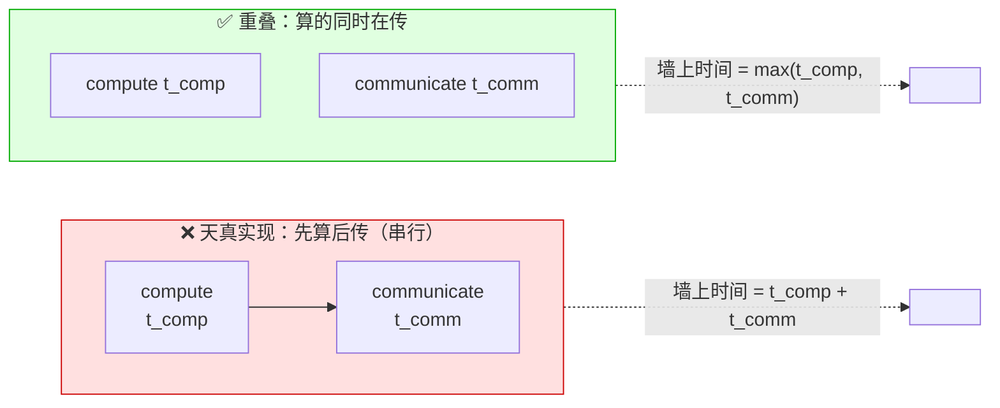
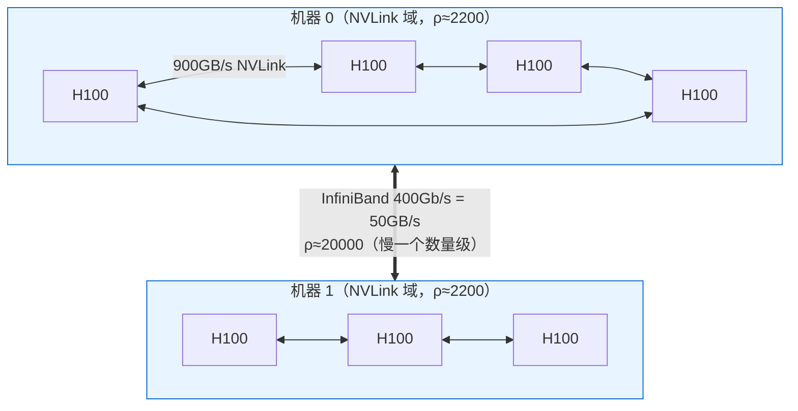
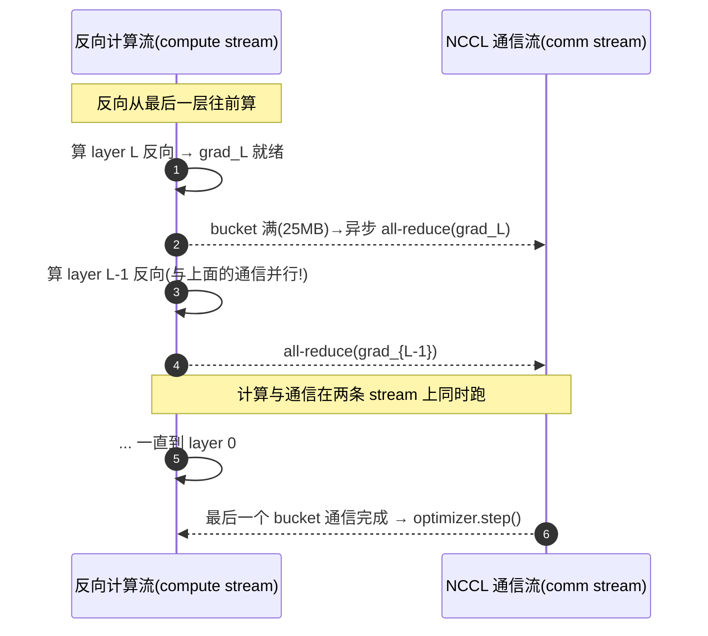
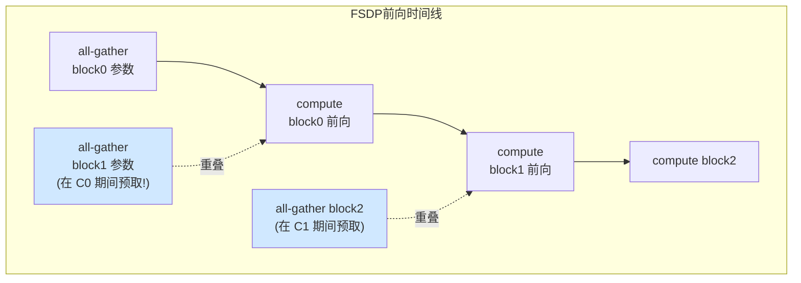

# 附录 E　计算通信重叠的数学：把通信藏进计算

> 对应原书《The Ultra-Scale Playbook: Training LLMs on GPU Clusters》(HuggingFace, Nouamane Tazi / Ferdinand Mom / Haojun Zhao 等) 附录 **A4 _Math for Compute / Communication Overlap_**，PDF 第 242–245 页；用到的"元素计数 / FLOPS / 显存"公式来自附录 **A3 _Typical Scales in LLM Training_**（第 240–241 页）。
>
> 这一篇是**附录里钻本质的一篇**。正文（book-guide 第 2–7 章）告诉你"要把通信藏进计算"，本篇用**代数**把"能不能藏住、什么时候藏不住、临界点在哪"算到底。读完你应该能**只用纸笔**判断：给定一张卡的算力、一根网线的带宽、一个模型的形状，DP / TP / PP / ZeRO-3 的通信**能不能被完全隐藏**——这正是大厂做并行策略选型时在白板上画的东西。

---

## 🗺️ 0. 这一篇要回答的核心问题

分布式训练里有一条贯穿全书的铁律（book-guide 第 2 章里那句 **"先算后传是 A BIG NO-NO"**）：

> **通信本身不创造任何 FLOPS。它只是把数据搬来搬去。所以唯一不亏的通信，是被计算"盖住"的通信。**

把一层（或一个算子）的耗时拆成两部分：

- $t_{\text{comp}}$：这层**纯计算**要花的时间（GPU 在做矩阵乘法）。
- $t_{\text{comm}}$：这层**为了并行**必须搬运的数据所花的时间（NVLink / InfiniBand / PCIe 在搬张量）。

如果硬件能**同时**做这两件事（GPU 的 SM 在算，同时 NIC / NVLink 引擎在搬），那么这一层的真实耗时是：

$$
t_{\text{layer}} = \max(t_{\text{comp}},\, t_{\text{comm}})
$$

而**不是** $t_{\text{comp}} + t_{\text{comm}}$。于是只要满足

$$
\boxed{\;t_{\text{comm}} \le t_{\text{comp}} \;\Longleftrightarrow\; \frac{t_{\text{comm}}}{t_{\text{comp}}} \le 1\;}
$$

通信就被**完全藏住**，并行的通信开销在理想情况下**等于 0**（墙上时间 wall-clock 没有变长）。这条不等式就是整个附录 A4 的主角，下面四种并行（DP / ZeRO-3 / TP / PP）做的事情，**全都是把各自的 $t_{\text{comm}}/t_{\text{comp}}$ 算出来、看它跟 1 的关系**。



> 🔬 **第一性原理：这其实是 Roofline 模型在"分布式"上的翻版。** 单卡里我们比 $t_{\text{compute}}$（受 FLOPS 限）与 $t_{\text{memory}}$（受 HBM 带宽限），算"算术强度 arithmetic intensity"；分布式里我们比 $t_{\text{compute}}$（受卡内 FLOPS 限）与 $t_{\text{comm}}$（受**卡间**带宽限）。临界点的形式几乎一模一样：**一个"每字节通信摊到多少 FLOP"的比值，对上"硬件 FLOPS÷带宽"的比值。** 谁大谁是瓶颈。

> 💡 **为什么是 $\max$ 而不是相加？** 现代 GPU 上，集合通信跑在**独立的拷贝引擎 / NVLink 引擎 / NIC** 上，由专门的 CUDA stream 驱动（NCCL 用单独的 stream）。只要计算 kernel 和通信 kernel 在不同 stream、且数据依赖允许，它们就**物理上同时进行**。这就是"重叠 overlap"的硬件基础——不是调度技巧，是真有两套独立的搬运/计算单元。

---

## 📏 1. 先备齐"尺子"：元素计数、FLOPS、带宽公式（来自附录 A3）

要算 $t_{\text{comp}}$ 和 $t_{\text{comm}}$，得先有三把尺子。原书附录 A3 给了 LLM 训练里"东西有多大"的速查表，我们这里全程用 Transformer 的隐藏维 $h$（hidden size）当主变量。

### 🔢 1.1 一个 Transformer block 有多少参数

记号约定（全篇通用）：

| 符号 | 含义 | 典型值 |
|---|---|---|
| $h$ | 隐藏维 hidden size | 4096 / 8192 / 12288 |
| $L$ | 层数 num_layers | 32 / 80 / 96 |
| $s$ | 序列长 seq_len | 2048 / 4096 / 8192 |
| $b$ | 微批大小 micro-batch size (mbs) | 1 / 2 / 4 |
| $\text{tok}$ | 一个微批的 token 数 $= s\cdot b$ | — |
| $DP,TP,PP$ | 各并行维度的并行度 | 2 / 8 / 16 ... |

原书 A3 给出：**每个 weight 矩阵约 $h^2$ 个元素**，一个带门控 MLP（GLU）的 Transformer block 总参数量约

$$
P_{\text{block}} \approx 16h^2 \quad(\text{元素 / block})
$$

> 🔬 **这 $16h^2$ 怎么来的？**（书里被排版吃掉了，这里补全）
> - 注意力部分：QKV 投影 $3h^2$ + 输出投影 $h^2$ = $4h^2$。
> - GLU MLP 部分：门控 + 上投影（2 个 $h \times \tfrac{8}{3}h$ 矩阵）+ 下投影（1 个 $\tfrac{8}{3}h \times h$ 矩阵）≈ $3 \times \tfrac{8}{3}h^2 = 8h^2$ ……不同实现略有出入，原书统一取 **$\approx 16h^2$** 这个量级数，方便后面所有比值里 $h^2$ 能干净约掉。**关键不是精确系数，是"参数量 $\propto h^2$"这件事。**

于是整模型参数：

$$
P_{\text{model}} \approx L \cdot 16h^2
$$

梯度和参数**一样大**（每个参数一个梯度）：$\text{Gradients} = \text{Parameters} \approx L\cdot 16h^2$。这就是 DP 每步要 all-reduce 的东西。

### 🔢 1.2 一层激活有多大

单层隐藏状态张量（activations / hidden states）：

$$
A_{\text{layer}} = b \cdot s \cdot h \quad(\text{元素})
$$

这就是 TP / PP / CP 里要搬的"激活"的大小。注意它**带 $b\cdot s$（token 数）**，而参数**不带**——这个区别后面会决定"谁能藏住、谁藏不住"。

### 🔢 1.3 FLOPS：算一遍要多少浮点运算

原书 A3 的粗略估计（也是业界最常用的 "6N" 法则的来源）：

$$
\text{FLOPs}_{\text{forward}} \approx 2\cdot \text{num\_tokens}\cdot \text{num\_params},\qquad
\text{FLOPs}_{\text{backward}} \approx 4\cdot \text{num\_tokens}\cdot \text{num\_params}
$$

合计前向 + 反向 $\approx 6\cdot \text{tokens}\cdot\text{params}$。那个 **"2"** 来自一次矩阵乘里"一乘一加"两个 FLOP；反向是前向的 **2 倍**（要算对输入的梯度 + 对权重的梯度两套）。

> 💡 **面试高频：为什么前向 2、反向 4、合计 6？** 前向每个参数对每个 token 贡献 1 次乘加 = 2 FLOP。反向要算两份梯度（$\partial L/\partial x$ 传给上一层、$\partial L/\partial W$ 更新权重），所以是 2×2 = 4。合计 6。这就是著名的 **$C \approx 6ND$**（$N$ 参数、$D$ token）训练算力估算公式。

> ⚠️ **这是"简化版"。** 原书 TIP 指出更准的前向+反向是 $6\cdot s\cdot P + 12\cdot L\cdot h\cdot s^2$，后一项是注意力的 $O(s^2)$ 部分。A4 全程假设 $s^2 \ll h$（即注意力 FLOPS 相对线性层可忽略），所以只用 $6\cdot\text{tok}\cdot P$。长序列（$s$ 很大）时这个近似会偏乐观，长上下文要用上下文并行 CP，见 book-guide 第 4 章。

### 🔢 1.4 计算时间与通信时间的通用式

把 FLOPS 除以卡的峰值算力 $\text{peak\_flops}$（单位 FLOP/s），就是计算时间：

$$
t_{\text{comp}} = \frac{\text{FLOPs}}{\text{peak\_flops}}
$$

把字节数除以有效带宽 $\text{peak\_bw}$（单位 B/s），就是通信时间。但**集合通信的有效字节数不等于张量大小**——这是最容易错的地方：

> 🔬 **NCCL 总线带宽（bus bandwidth）公式。** 原书 NOTE 特别强调：带宽计算要用 NCCL 文档里的 **bus bandwidth** 公式，它把"集合通信的具体搬运模式"折进了有效字节数。对**环形（ring）**算法：
> - **All-Reduce**：每个 rank 收发 $\;2\cdot\dfrac{n-1}{n}\cdot S\;$ 字节（先 reduce-scatter 再 all-gather，所以有个 **2**）。
> - **All-Gather / Reduce-Scatter**：每个 rank 收发 $\;\dfrac{n-1}{n}\cdot S\;$ 字节（只有一半）。
> - **P2P（点对点 send/recv）**：就是 $S$ 字节，没有 $\frac{n-1}{n}$ 因子（只有两张卡参与）。
>
> 其中 $S$ 是参与归约/聚合的张量总大小，$n$ 是参与的卡数。**注意 $\frac{n-1}{n}\to 1$（$n$ 大时）**，所以大集群里 all-reduce ≈ 搬 $2S$、all-gather ≈ 搬 $S$。

这就解释了一个常被问的点：**ZeRO-3 的通信量约是 DP 的 1.5 倍**——DP 每步一次 all-reduce（$2S$），ZeRO-3 每步要 all-gather 参数（$S$，前向）+ all-gather 参数（$S$，反向）+ reduce-scatter 梯度（$S$）= $3S$，但其中反向那两次本来 DP 也要做归约，净增约 50%。代数会在第 3 节里把这层意思直接顶出来。

---

## 💻 2. 硬件数字：把 peak_flops 和 peak_bw 填成真值

所有临界点最后都落到一个**机器常数**上：

$$
\rho \;\equiv\; \frac{\text{peak\_flops}}{\text{peak\_bw}}\quad\Big[\frac{\text{FLOP/s}}{\text{B/s}} = \text{FLOP/Byte}\Big]
$$

$\rho$ 的物理意义是：**这台机器，每从网线上搬 1 个字节的时间里，能算多少个浮点运算。** $\rho$ 越大，说明"算力相对带宽过剩"，通信越容易成为瓶颈、越难藏住。下面是几代真实硬件的牌价（BF16 稠密算力，带宽用单向有效值，便于直接代入 $t=S/\text{bw}$）：

| 硬件 | peak_flops (BF16) | 互联 | 单向有效带宽 peak_bw | $\rho=$ flops/bw (FLOP/Byte) |
|---|---|---|---|---|
| **H100 SXM** 卡内 | $\approx 9.9\times10^{14}$ (989 TFLOPS) | HBM3 | $3.35\times10^{12}$ (3.35 TB/s) | ~295（这是卡内 Roofline，不是卡间） |
| **H100 + NVLink4**（同机 8 卡） | $9.9\times10^{14}$ | NVLink 4.0 | $\approx 4.5\times10^{11}$（450 GB/s/向，900 双向） | **~2200** |
| **H100 + IB NDR**（跨机） | $9.9\times10^{14}$ | InfiniBand 400 Gb/s | $\approx 5\times10^{10}$（50 GB/s） | **~20000** |
| **A100 SXM + NVLink3** | $3.12\times10^{14}$ (312 TFLOPS) | NVLink 3.0 | $\approx 3\times10^{11}$（300 GB/s/向，600 双向） | ~1040 |
| **A100 + IB HDR** 跨机 | $3.12\times10^{14}$ | InfiniBand 200 Gb/s | $\approx 2.5\times10^{10}$（25 GB/s） | ~12500 |
| **任意卡 + PCIe 4.0** | — | PCIe 4.0 x16 | $\approx 3.2\times10^{10}$（32 GB/s） | （比 NVLink 差一个数量级） |
| **任意卡 + PCIe 5.0** | — | PCIe 5.0 x16 | $\approx 6.4\times10^{10}$（64 GB/s） | — |

> 💡 **一眼看穿的两个数量级。** 同一张 H100，挂在 **NVLink** 上时 $\rho\approx 2200$，跨到 **InfiniBand** 时 $\rho\approx 20000$——**差了快 10 倍**。这 10 倍就是后面所有"TP 必须留在机内、PP/DP 才敢跨机"结论的全部来源。记住一句话：**跨机的 $\rho$ 比机内大一个数量级，所以跨机更难藏住通信。**



下面四节，我们就把 DP / ZeRO-3 / TP / PP 各自的 $\frac{t_{\text{comm}}}{t_{\text{comp}}}$ 推成一个**只含 $\{h, \text{tok}, \text{并行度}, \rho\}$ 的式子**，然后把上面这些 $\rho$ 代进去看临界点。

---

## 🟦 3. 数据并行 DP（ZeRO-0）：用整个反向盖住一次 all-reduce

### 📌 切什么、传什么

DP 把**数据**切给 $DP$ 张卡，每卡一份**完整模型副本**。反向算完后，要把各卡的梯度 **all-reduce 求平均**，让所有副本同步更新（原理见 book-guide 第 2 章）。所以：

- **切的是** batch（数据维）。
- **传的是** 整个模型的梯度，大小 $= P_{\text{model}} \approx L\cdot 16h^2$。
- **藏在哪** 藏在**反向传播**里——PyTorch DDP 把梯度切成 **bucket（默认 25 MB）**，某层反向一算完、它那几个 bucket 的梯度就绪，立刻异步发起 all-reduce，**同时**继续算更靠前层的反向。



### 🧮 代数推导

**通信时间**（all-reduce 一个 25 MB bucket，原书式）：

$$
t_{\text{comm}} = t_{\text{comm\_bucket}} = \frac{\text{bucket\_size}\cdot 2(DP-1)}{DP\cdot \text{peak\_bw}}
$$

这里的 $2(DP-1)/DP$ 正是上一节 NCCL all-reduce 的总线带宽因子。把所有 bucket 累加，等价于把 $\text{bucket\_size}$ 换成整模型梯度 $P_{\text{model}}$（下面比值里这么用）。

**计算时间**（反向传播，FLOPS = 4×tokens×params）：

$$
t_{\text{comp}} = \frac{4\cdot \text{num\_tokens}\cdot \text{num\_params}}{\text{peak\_flops}}
$$

**重叠条件**——原书印的形式是：

$$
\frac{t_{\text{comm}}}{t_{\text{comp}}}
= \frac{\text{num\_params}}{2\cdot \text{num\_tokens}}\cdot\frac{DP-1}{DP}\cdot\frac{\text{peak\_flops}}{\text{peak\_bw}} \;\le\; 1
\tag{原书印刷式}
$$

> 🔬 **钻到底：上式里的 $\text{num\_params}$ 其实会约掉。** 这是本附录最值得停下来想的一处。把通信、计算两个时间**老老实实代进去**：通信量 $\propto \text{num\_params}$（梯度），计算量也 $\propto \text{num\_params}$（FLOPS = $4\cdot\text{tok}\cdot\text{num\_params}$），**比值里 $\text{num\_params}$ 必然消掉**。干净的自洽结果是：
>
> $$\boxed{\;\frac{t_{\text{comm}}}{t_{\text{comp}}}\Big|_{\text{DP}} = \frac{DP-1}{2\cdot \text{num\_tokens}\cdot DP}\cdot \rho \;\le\; 1\;}$$
>
> 也就是说，**DP 能否藏住通信，根本不取决于模型多大，只取决于"每张卡每个微批喂了多少 token"**（$\text{num\_tokens}=s\cdot b$）和机器常数 $\rho$。模型变大，梯度变多（通信变重），但反向的计算也按同比例变多（计算变重），两者抵消。原书把 $\text{num\_params}$ 留在式子里，更像是把"全模型梯度 / 单步反向"这两件事分别写出来时没有约分——读者务必理解**真正卡住你的是 $\text{token 数}$ 和 $\rho$，不是参数量**。

### 🔢 数值例

取 H100，每卡微批 $b=1$、$s=4096$，故 $\text{tok}=4096$；大集群 $\frac{DP-1}{DP}\approx 1$。

- **机内 NVLink**（$\rho\approx 2200$）：$\dfrac{1}{2\times4096}\times2200 = \dfrac{2200}{8192}\approx 0.27 < 1$ ✅ 完全藏住。
- **跨机 InfiniBand**（$\rho\approx 20000$）：$\dfrac{20000}{8192}\approx 2.44 > 1$ ❌ 藏不住，通信暴露约 1.4 倍计算时间。
- **跨机但加大微批** $b=4$（$\text{tok}=16384$）：$\dfrac{20000}{2\times16384}=\dfrac{20000}{32768}\approx 0.61<1$ ✅ 又藏回去了。

> 💡 **这就是"梯度累积 + 大微批让 DP 通信更好藏"的数学根据。** 每卡 token 数 $\uparrow$ → $t_{\text{comp}}\uparrow$ → 同一坨梯度通信更容易被盖住。代价是显存（激活变多）。这正是 book-guide 第 8 章"找最优配置"里调 micro-batch 的底层权衡。

### 💻 代码：DDP 的 bucket 重叠 + 梯度累积时关掉同步

```python
import torch
import torch.distributed as dist
from torch.nn.parallel import DistributedDataParallel as DDP

# ---- DDP 默认就开启了"反向中分桶 all-reduce"的重叠 ----
model = DDP(
    model,
    bucket_cap_mb=25,        # 每个梯度 bucket 25MB：这就是 t_comm 公式里的 bucket_size
    gradient_as_bucket_view=True,  # 让 .grad 直接是 bucket 的视图，省一次拷贝
)
# bucket_cap_mb 的取舍：桶太小→通信次数多、每次启动开销(latency)占比高；
#                       桶太大→第一个桶要等很久才凑满，重叠的"提前量"变少。25MB 是经验折中。

# ---- 梯度累积时：前 K-1 个 micro-batch 不要触发 all-reduce ----
accum_steps = 4
for i, (x, y) in enumerate(loader):
    is_last = (i % accum_steps == accum_steps - 1)
    # no_sync(): 上下文内 DDP 不挂通信 hook，梯度只在本地累加，不 all-reduce
    ctx = model.no_sync() if not is_last else torch.enable_grad()
    with ctx:
        loss = model(x).loss / accum_steps
        loss.backward()      # 非最后一步：只累加本地梯度（省掉 K-1 次通信！）
    if is_last:
        optimizer.step()     # 最后一步的 backward 才真正触发分桶 all-reduce
        optimizer.zero_grad()
```

**逐行讲：**
- `DistributedDataParallel`：PyTorch 的 DP 实现，构造时会给每个参数的梯度注册一个 **autograd hook**。某参数梯度一算出来，hook 就把它塞进所属 bucket；bucket 一满就 `dist.all_reduce(..., async_op=True)`，**异步**发出去，反向继续往前算——这就是 $\max(t_{\text{comp}},t_{\text{comm}})$ 的来源。
- `bucket_cap_mb=25`：对应公式里的 `bucket_size`。它是**重叠粒度**旋钮：太小则被通信启动延迟（latency，~微秒级）吃掉，太大则"凑满第一桶"的等待拖慢重叠开始。
- `no_sync()`：梯度累积时的关键。累积的前几步**不需要**同步（反正还要继续加），用它跳过 all-reduce，把 $K$ 步的通信压成 1 步。这是 book-guide 第 2 章"DP + 梯度累积"省通信的标准写法。
- `gradient_as_bucket_view=True`：让 `param.grad` 直接指向 bucket 内存，避免"梯度→桶"的额外拷贝，省显存也省一次 D2D copy。

---

## 🟩 4. ZeRO-3 / FSDP：用一层的前向盖住"下一层参数"的 all-gather

### 📌 切什么、传什么

ZeRO-3（PyTorch 里叫 **FSDP**, Fully Sharded Data Parallel）在 DP 基础上更狠：**参数、梯度、优化器状态全部沿 DP 维切片**，每张卡平时只存 $1/DP$ 份。代价是：用到某层时，必须临时把这层的完整参数 **all-gather** 回来；用完立刻丢掉（释放显存）。

对一个 $16h^2$ 参数的 block，每步的通信（原书 page 243）：

| 阶段 | 操作 | 每 rank 字节（量级） |
|---|---|---|
| 前向 | all-gather 参数 | $\approx 16h^2$ |
| 反向 | all-gather 参数（重新聚合一次） | $\approx 16h^2$ |
| 反向 | reduce-scatter 梯度 | $\approx 16h^2$ |
| **每 block 合计** | 3 次集合通信 | $\approx 3\cdot 16h^2$ |
| **整模型** | | $\approx 3\cdot L\cdot 16h^2$ |

> 🔬 **"3 倍"就是 ZeRO-3 比 DP 贵的地方的代数证据。** DP 每步只 all-reduce 一次梯度（总线 $2S$）；ZeRO-3 是 all-gather + all-gather + reduce-scatter（总线各 $\approx S$，合 $3S$）。$3S$ vs $2S$ → 约 **1.5×** 通信量。换来的是参数/优化器状态显存降到 $1/DP$。**这就是"用通信换显存"的精确汇率。**

### 🧮 代数推导（关键：藏住"下一层参数的 all-gather"）

ZeRO-3 的重叠是 **prefetch（预取）**：算第 $i$ 层前向的同时，**提前** all-gather 第 $i{+}1$ 层的参数。所以要比的是"一层前向计算" vs "一层参数 all-gather"。

**通信时间**（all-gather $16h^2$ 字节，总线因子 $\frac{DP-1}{DP}$）：

$$
t_{\text{comm}} = 16h^2\cdot\frac{DP-1}{DP\cdot \text{peak\_bw}}
$$

**计算时间**（一层 decoder 前向，FLOPS = 2×tok×params，params=$16h^2$，tok=$s\cdot b$）：

$$
t_{\text{comp}} = \frac{2\cdot s\cdot b\cdot(16h^2)}{\text{peak\_flops}} = \frac{32\cdot s\cdot b\cdot h^2}{\text{peak\_flops}}
$$

**重叠条件**（$h^2$ 干净约掉）：

$$
\boxed{\;\frac{t_{\text{comm}}}{t_{\text{comp}}}\Big|_{\text{ZeRO-3}}
= \frac{1}{2\cdot s\cdot b}\cdot\frac{DP-1}{DP}\cdot\rho \;\le\; 1\;}
$$

> 🔬 **惊人的统一：ZeRO-3（前向藏 all-gather）和 DP（反向藏 all-reduce）的临界比值长得一模一样！**
> $$\frac{t_{\text{comm}}}{t_{\text{comp}}} = \frac{DP-1}{2\cdot\text{tok}\cdot DP}\cdot\rho$$
> 为什么？DP 搬 $2\times$ 数据（all-reduce）但藏进 $4\times$ 计算（反向）；ZeRO-3 搬 $1\times$ 数据（all-gather）但只藏进 $2\times$ 计算（前向）。$\frac{2}{4}=\frac{1}{2}$，正好抵到同一个系数。**两条不同的并行路线，撞到同一个临界点——这说明临界点是"机器和 token 数"决定的物理事实，跟你用哪种分片策略关系不大。**

### 🔢 数值例

同样 H100、$s=4096$：

- **机内 NVLink**（$\rho\approx2200$），$b=1$：$\dfrac{2200}{2\times4096}\approx 0.27<1$ ✅。
- **跨机 IB**（$\rho\approx20000$），$b=1$：$\dfrac{20000}{8192}\approx 2.44>1$ ❌——跨机 + 小微批，ZeRO-3 的参数 all-gather**藏不住**，这正是大家说"FSDP 跨机要么开 `HYBRID_SHARD`、要么把微批/序列拉大"的原因。
- **跨机但 $b=4$**：$\dfrac{20000}{2\times16384}\approx0.61<1$ ✅。

### 💻 代码：FSDP 的前向/反向预取开关

```python
import torch
from torch.distributed.fsdp import FullyShardedDataParallel as FSDP
from torch.distributed.fsdp import ShardingStrategy, BackwardPrefetch
from torch.distributed.fsdp.wrap import transformer_auto_wrap_policy
import functools

model = FSDP(
    model,
    sharding_strategy=ShardingStrategy.FULL_SHARD,   # = ZeRO-3：参数/梯度/优化器全切
    # 用 transformer block 当"包裹单元"：每个 block 单独 all-gather / 释放，
    # 这样"算第 i 个 block 时预取第 i+1 个 block 参数"的重叠粒度才对得上公式
    auto_wrap_policy=functools.partial(
        transformer_auto_wrap_policy,
        transformer_layer_cls={MyTransformerBlock},
    ),
    backward_prefetch=BackwardPrefetch.BACKWARD_PRE,  # 反向时"提前"all-gather下一个要用的block
    forward_prefetch=True,                            # 前向时也提前 all-gather 下一层参数
    limit_all_gathers=True,                           # 限制同时在飞的 all-gather 数，防显存炸
    use_orig_params=True,
)
```

**逐行讲：**
- `ShardingStrategy.FULL_SHARD`：就是 ZeRO-3。还有 `SHARD_GRAD_OP`（=ZeRO-2，只切梯度+优化器，参数不切）、`HYBRID_SHARD`（机内 FULL_SHARD、跨机只做 DP 复制——专门用来躲开上面跨机 $\rho$ 太大的坑）。
- `auto_wrap_policy=transformer_auto_wrap_policy`：把每个 Transformer block 包成一个 FSDP 单元。**为什么重要**：公式里 $t_{\text{comm}}$、$t_{\text{comp}}$ 都是**"一个 block"**的量；只有按 block 包裹，运行时才能"算这个 block / 预取下个 block"，重叠粒度才和代数一致。整模型包成一个单元的话，得先 all-gather 全部参数才能开算，重叠就废了。
- `forward_prefetch=True` / `backward_prefetch=BACKWARD_PRE`：把"下一个单元的 all-gather"**提前**到"当前单元计算"之前发起——这就是把 $t_{\text{comm}}$ 塞进 $t_{\text{comp}}$ 的 $\max$ 里的开关。关掉它们，FSDP 退化成"先 gather 再算"的串行，慢得多。
- `limit_all_gathers=True`：预取太激进会同时把好几层参数 gather 到显存里，可能 OOM。这个旋钮限制"在飞"的 all-gather 数量，是**通信重叠 vs 峰值显存**的权衡。



---

## 🟧 5. 张量并行 TP：临界点只和 $h$、$TP$ 有关（与 token 数无关！）

### 📌 切什么、传什么

张量并行（TP）把**单个权重矩阵**沿行/列切到 $TP$ 张卡上（book-guide 第 3 章）。一个 Transformer block 里有 **2 个列并行（column-linear）+ 2 个行并行（row-linear）** 算子。在 TP 区域内，**激活**要在卡间聚合：

| 阶段 | 操作 | 每 rank 字节 |
|---|---|---|
| 前向（每个 column-linear） | all-gather 激活 | $\;s\cdot b\cdot h/TP$ |
| 反向（每个 column-linear） | reduce-scatter 梯度 | $\;s\cdot b\cdot h/TP$ |
| 行并行同理（反过来） | … | … |
| **每 block 合计**（2 列+2 行） | | $\;8\cdot s\cdot b\cdot h/TP$ |
| **整模型** | | $\;8\cdot L\cdot s\cdot b\cdot h/TP$ |

### 🧮 代数推导（藏住"下一个 linear"的 all-gather）

**通信时间**（all-gather 激活 $s\cdot b\cdot h$，总线因子 $\frac{TP-1}{TP}$）：

$$
t_{\text{comm}} = \frac{s\cdot b\cdot h\cdot(TP-1)}{TP\cdot \text{peak\_bw}}
$$

**计算时间**（下一个 linear，参数 $h^2$，但沿 TP 切了，所以 FLOPS÷TP）：

$$
t_{\text{comp}} = \frac{2\cdot s\cdot b\cdot h^2}{TP\cdot \text{peak\_flops}}
$$

**重叠条件**——$s\cdot b$ 和一个 $h$ **全部约掉**：

$$
\boxed{\;\frac{t_{\text{comm}}}{t_{\text{comp}}}\Big|_{\text{TP}}
= \frac{TP-1}{2\cdot h}\cdot\rho \;\le\; 1\;}
$$

> 🔬 **这是 A4 里最反直觉、也最重要的结论：TP 能不能藏住通信，竟然只取决于隐藏维 $h$ 和并行度 $TP$，跟序列长 $s$、批大小 $b$ 完全无关！** 直觉：TP 搬的激活 $\propto s\cdot b\cdot h$（一次方的 $h$），藏它的矩阵乘计算 $\propto s\cdot b\cdot h^2$（二次方的 $h$）。$s\cdot b$ 在两边都有、约掉；$h$ 留下一个在分母——**矩阵乘的"算"随 $h^2$ 涨得比"传"的 $h$ 快，所以 $h$ 越大，TP 通信越好藏。** 这就是"大模型（大 $h$）才扛得住高 TP"的第一性原理。

### 🔢 数值例（TP 必须留在机内的证明）

TP 几乎总是放在**机内 NVLink**（$\rho\approx 2200$）。临界条件 $\Rightarrow h \ge \frac{TP-1}{2}\rho$：

| 配置 | $\frac{TP-1}{2h}\rho$ | 能否藏住 |
|---|---|---|
| $TP=2,\ h=4096$（机内） | $\frac{1}{2\cdot4096}\cdot2200=0.27$ | ✅ 轻松 |
| $TP=8,\ h=4096$（机内） | $\frac{7}{8192}\cdot2200=1.88$ | ❌ 藏不住 |
| $TP=8,\ h=8192$（Llama-70B，机内） | $\frac{7}{16384}\cdot2200=0.94$ | ✅ 勉强 |
| $TP=8,\ h=12288$（GPT-3 175B，机内） | $\frac{7}{24576}\cdot2200=0.63$ | ✅ 舒服 |
| $TP=8,\ h=8192$，**跨机 IB**（$\rho{=}20000$） | $\frac{7}{16384}\cdot20000=8.5$ | ❌❌ 彻底暴露 |

> 💡 **三条可以直接背的工程结论，全从这一个公式来：**
> 1. **TP 永远别跨机。** 同样 $TP{=}8,h{=}8192$，机内勉强藏住（0.94），跨机直接 8.5 倍暴露。所以 TP 度通常 $\le$ 单机卡数（8）。
> 2. **模型越大（$h$ 越大）越扛得住高 TP。** 小模型硬开 $TP{=}8$ 是亏的（1.88），大模型才划算。
> 3. **想再切更细，要么换 SP（序列并行，把 LayerNorm/Dropout 的激活也切了，进一步降通信），要么上下文并行 CP。** 见 book-guide 第 3、4 章。

### 💻 代码：把 all-gather 异步发出去，盖住下一个 matmul

```python
import torch
import torch.distributed as dist

def column_linear_overlapped(x_shard, weight, tp_group, next_weight):
    """演示 TP 里'异步 all-gather 激活 + 同时算下一个 linear'的重叠骨架。
       x_shard: 本 rank 持有的激活分片, 形状 [s, b, h/TP]
       weight:  本 rank 的列并行权重分片
    """
    tp = dist.get_world_size(tp_group)
    s, b, h_shard = x_shard.shape
    # 1) 开一块完整激活的接收缓冲: [s, b, h]
    x_full = x_shard.new_empty(s, b, h_shard * tp)
    # 2) 异步 all-gather: async_op=True 立即返回一个 handle, 不阻塞!
    handle = dist.all_gather_into_tensor(x_full, x_shard.contiguous(),
                                         group=tp_group, async_op=True)
    # 3) 关键: 在通信"在飞"的同时, 做一些不依赖 x_full 的计算
    #    (例如下一个 linear 的权重做点准备/或本 rank 已有数据的局部计算)
    _ = next_weight.float()  # 占位: 任何能与通信并行的计算
    # 4) 真正要用 x_full 之前, 才 wait —— 理想情况通信已被上面的计算盖住
    handle.wait()
    out = torch.matmul(x_full, weight)   # 这一步的 t_comp 就是公式里的分母
    return out
```

**逐行讲：**
- `all_gather_into_tensor(..., async_op=True)`：**异步**集合通信的核心。`async_op=True` 让调用**立刻返回**一个 `handle`，NCCL 在**独立 stream** 上搬数据，Python 主流程继续往下走——这就是"通信在飞、计算同时跑"的物理实现。
- `handle.wait()`：在**真正要读** `x_full` 之前才同步。`wait()` 之前的所有计算都和 all-gather **重叠**。如果那段计算 $\ge t_{\text{comm}}$，`wait()` 几乎瞬间返回——通信被完全藏住。
- 真实框架（Megatron-LM 的 `--tp-comm-overlap`、TransformerEngine 的 `userbuffers`）把这套做到了**算子内部**：用 CUDA 把 GEMM 切块，一块算完立刻 all-gather/reduce-scatter 那一块，做到**细粒度 pipelined overlap**，比上面这种"整块异步"更彻底。原理仍是这条 $\frac{TP-1}{2h}\rho\le1$。

---

## 🟪 6. 流水线并行 PP：P2P 太小，几乎总能藏住

### 📌 切什么、传什么

流水线并行（PP）把**层**切成若干 stage，放到不同卡/机上（book-guide 第 5 章）。相邻 stage 之间，每个 micro-batch 要 **P2P（点对点）传递激活（前向）/ 梯度（反向）**：

| 阶段 | 操作 | 字节 |
|---|---|---|
| 前向（每 micro-batch） | send/recv 激活 | $2\cdot s\cdot b\cdot h$ |
| 反向（每 micro-batch） | send/recv 梯度 | $2\cdot s\cdot b\cdot h$ |
| **每 micro-batch 合计** | | $4\cdot s\cdot b\cdot h$ |
| **一轮梯度累积**（$gas$ 步） | | $4\cdot gas\cdot s\cdot b\cdot h$ |

注意 PP 的通信是 **P2P，没有 $\frac{n-1}{n}$ 因子**——只有相邻两张卡参与，搬的就是张量本身大小。

### 🧮 代数推导（藏住"P2P 传激活"在"下个 stage 的若干层计算"里）

**计算时间**（下个 pipeline stage 的 $L_{\text{next}}$ 层前向，每层 $16h^2$ 参数）：

$$
t_{\text{comp}} = \frac{32\cdot s\cdot b\cdot h^2\cdot L_{\text{next}}}{\text{peak\_flops}}
\qquad(L_{\text{next}} = \texttt{num\_layers\_in\_next\_pp})
$$

**通信时间**（P2P 传一个激活张量 $s\cdot b\cdot h$）：

$$
t_{\text{comm}} = \frac{s\cdot b\cdot h}{\text{peak\_bw}}
$$

**重叠条件**——$s\cdot b$ 又一次约掉：

$$
\boxed{\;\frac{t_{\text{comm}}}{t_{\text{comp}}}\Big|_{\text{PP}}
= \frac{1}{32\cdot h\cdot L_{\text{next}}}\cdot\rho \;\le\; 1\;}
$$

> 🔬 **和 TP 一样，PP 的临界比值也与 $s$、$b$ 无关，只看 $h$、$L_{\text{next}}$、$\rho$。** 但分母多了个 **$32\cdot L_{\text{next}}$**——一个 stage 通常有好几层（$L_{\text{next}}$ 大），而且系数 32 很大，所以 PP 的比值**天生就小得多**。这就是"PP 的 P2P 通信几乎可以忽略、所以 PP 敢放在最慢的跨机/跨域链路上"的根据。

### 🔢 数值例（PP 通信便宜到什么程度）

PP 通常**跨机**（IB，$\rho\approx20000$），$h=8192$：

- 模型 80 层、$PP=8$ → 每 stage $L_{\text{next}}=10$：$\dfrac{20000}{32\cdot8192\cdot10}=\dfrac{20000}{2.62\times10^6}\approx 0.0076 \ll 1$ ✅ 几乎免费。
- 极端：每 stage 只 **1 层**（$L_{\text{next}}=1$）：$\dfrac{20000}{32\cdot8192}=\dfrac{20000}{262144}\approx 0.076 < 1$ ✅ 仍然轻松藏住。

> 💡 **结论：PP 的瓶颈从来不是 P2P 带宽，而是"气泡 bubble"。** P2P 通信 $\frac{t_{\text{comm}}}{t_{\text{comp}}}\approx 0.01$，根本不是问题。PP 真正的敌人是**流水线气泡**（warm-up/cool-down 阶段卡在等数据），那是**调度问题**（AFAB / 1F1B / interleaved / 零气泡 DualPipe），不是带宽问题。详见 book-guide 第 5 章。这也解释了 5D 并行里"PP 放最外层、跨节点"的布局：它最不挑带宽。

### 💻 代码：1F1B 调度里的 P2P 重叠

```python
import torch
import torch.distributed as dist

def pipeline_1f1b_step(stage, micro_batches, prev_rank, next_rank, num_micro):
    """1F1B(one-forward-one-backward)流水线的 P2P 重叠骨架。
       关键: 用 batch_isend_irecv 把'发给下游'和'从上游收'打包成一次非阻塞通信,
       在它在飞时去算 forward/backward。"""
    activations = []
    for i in range(num_micro):
        # 1) 从上游 stage 非阻塞接收本 micro-batch 的输入激活
        recv_buf = torch.empty_like(micro_batches[i])
        recv_op = dist.P2POp(dist.irecv, recv_buf, prev_rank)
        # 2) batch_isend_irecv: 一次性发起一组 P2P, 返回 handle 列表, 不阻塞
        reqs = dist.batch_isend_irecv([recv_op])
        # 3) 通信在飞时, 这里可以做与 recv_buf 无关的工作(如上一个 micro-batch 的反向)
        #    —— 这就是把 t_comm 藏进 t_comp 的位置
        for req in reqs:
            req.wait()                      # 真正要用 recv_buf 前才同步
        out = stage(recv_buf)               # 本 stage 前向: t_comp 的来源
        activations.append(out)
        # 4) 把输出非阻塞发给下游, 同时立刻进入下一个 micro-batch 的计算
        send_op = dist.P2POp(dist.isend, out, next_rank)
        dist.batch_isend_irecv([send_op])   # 发出去就不管了, 继续算
    return activations
```

**逐行讲：**
- `dist.P2POp(dist.irecv/isend, ...)`：把"非阻塞收 / 非阻塞发"打包成一个**操作描述**，交给 `batch_isend_irecv` 一起发起。打包能让 NCCL 把双向 P2P 调度到同一批，减少启动开销。
- `batch_isend_irecv([...])`：返回 `handle` 列表后**立即返回**，P2P 在独立 stream 上进行。中间那段（注释 3）是**重叠窗口**——1F1B 里通常塞"上一个 micro-batch 的反向计算"。
- `req.wait()`：只在真正要读 `recv_buf` 前同步。PP 里因为 $t_{\text{comm}}\ll t_{\text{comp}}$（上面算过 ~0.01），`wait()` 基本秒回。
- **1F1B 的意义**：相比朴素的 AFAB（all-forward-all-backward），1F1B 让"前向"和"反向"交替进行，每张卡上**总有计算可做来盖住 P2P**，同时把激活显存峰值从 $O(gas)$ 压到 $O(PP)$。这是把"重叠"和"省显存"一起拿下的经典调度。

```mermaid
gantt
    title PP 1F1B 时间线（4 micro-batch, P2P 被计算盖住）
    dateFormat X
    axisFormat %s
    section Stage0
    F0 :0, 1
    F1 :1, 2
    B0 :2, 3
    F2 :3, 4
    B1 :4, 5
    section Stage1
    idle(气泡) :0, 1
    F0 :1, 2
    F1 :2, 3
    B0 :3, 4
    F2 :4, 5
```



---

## 🧩 7. 四种并行的统一对照：临界点公式、曲线与选型

### 📊 7.1 临界比值总表（全篇核心，背下来）

| 并行 | 藏谁进谁 | 临界比值 $t_{\text{comm}}/t_{\text{comp}}$ | 取决于 | **不**取决于 |
|---|---|---|---|---|
| **DP (ZeRO-0)** | all-reduce 梯度 → 反向 | $\dfrac{DP-1}{2\cdot\text{tok}\cdot DP}\cdot\rho$ | token 数、$\rho$ | 模型大小（$h$ 约掉） |
| **ZeRO-3 (FSDP)** | all-gather 参数 → 前向 | $\dfrac{1}{2\cdot s b}\cdot\dfrac{DP-1}{DP}\cdot\rho$ | token 数、$\rho$ | $h$（约掉） |
| **TP** | all-gather 激活 → 下个 linear | $\dfrac{TP-1}{2\,h}\cdot\rho$ | **$h$、$TP$、$\rho$** | **$s$、$b$（约掉）** |
| **PP** | P2P 激活 → 下个 stage | $\dfrac{1}{32\,h\,L_{\text{next}}}\cdot\rho$ | $h$、$L_{\text{next}}$、$\rho$ | $s$、$b$（约掉） |

> 🔬 **看出三大族了吗？**
> - **DP / ZeRO-3 是一族**：临界点由**每卡 token 数**和 $\rho$ 决定，与模型形状无关 → **加大微批 / 序列**能改善。
> - **TP / PP 是另一族**：临界点由**模型形状**（$h$, $L_{\text{next}}$）和 $\rho$ 决定，与 batch/seq 无关 → **改 batch 没用，只能换并行度或换更快的链路**。
> - 串起所有四个的，是同一个机器常数 $\rho=\text{peak\_flops}/\text{peak\_bw}$。**所有"能不能藏住"的问题，最后都是在问：这台机器的 $\rho$，对上你这个并行维度"每字节摊多少 FLOP"，谁大？**

### 📈 7.2 随并行度 / 模型大小变化的曲线（文字描述）

把上面公式当函数画出来，能在脑子里建立"临界曲线"的形状：

**(a) TP 临界曲线：$h$ 关于 $TP$ 的下界。** 由 $\frac{TP-1}{2h}\rho\le1$ 得 $h \ge \frac{(TP-1)}{2}\rho$。这是一条**过原点、斜率 $\rho/2$ 的直线**（横轴 $TP-1$，纵轴最小可行 $h$）：

```
最小可行 h
   ^
   |                                  ·  跨机 ρ=20000(陡)
   |                            ·
   |                      ·
   |                ·
   |          ·                  ___---  机内 ρ=2200(缓)
   |      · _____------
   |  ·___------
   +----------------------------------> TP
   1     2     4     8     16
```
- 机内 NVLink（缓线）：$TP=8$ 要 $h\ge 7700$，所以 $h{=}8192$ 的 70B 刚好够。
- 跨机 IB（陡线）：$TP=8$ 要 $h\ge 70000$——现实里没有这么大的 $h$，**所以 TP 不能跨机**。曲线把这个工程铁律画成了几何事实。

**(b) DP/ZeRO-3 临界曲线：$\frac{t_{\text{comm}}}{t_{\text{comp}}}\propto 1/\text{tok}$。** 是一条**反比双曲线**：每卡 token 数翻倍，比值减半。所以横轴（token/卡）一旦越过 $\frac{\rho}{2}$ 这个临界点，就从"暴露"掉进"藏住"区。临界 token 数 $\text{tok}^\star = \frac{\rho}{2}\cdot\frac{DP-1}{DP}\approx\frac{\rho}{2}$：机内约 1100 token/卡就够，跨机要 10000 token/卡——又是 10 倍差距。

**(c) 随 $DP$ 增大：$\frac{DP-1}{DP}$ 从 0.5（$DP{=}2$）单调升到 1（$DP{\to}\infty$）。** 意味着**卡越多，DP 通信相对越重**（趋近上界），但这个因子最多只让通信翻倍（0.5→1），不是主导项——主导项永远是 $\rho$ 和 token 数。

### 🧮 7.3 一个完整的端到端数值演练

**设定**：训 Llama-70B 量级模型，$h=8192$、$L=80$、$s=4096$、每卡微批 $b=1$（$\text{tok}=4096$）。集群 = 8 机 × 8 卡 H100 = 64 卡。布局 $TP=8$（机内）× $PP=8$（跨机）× $DP=1$。机内 $\rho=2200$、跨机 $\rho=20000$。

| 维度 | 链路 | 代入 | 比值 | 判定 |
|---|---|---|---|---|
| **TP=8** | 机内 NVLink $\rho{=}2200$ | $\frac{7}{2\cdot8192}\cdot2200$ | **0.94** | ✅ 勉强藏住（别再大 TP） |
| **PP=8**, $L_{\text{next}}{=}10$ | 跨机 IB $\rho{=}20000$ | $\frac{20000}{32\cdot8192\cdot10}$ | **0.0076** | ✅ 几乎免费 |
| 假如改 **DP=8** 跨机 | 跨机 IB $\rho{=}20000$ | $\frac{7}{8}\cdot\frac{20000}{2\cdot4096}$ | **2.14** | ❌ 跨机 DP 藏不住，需加大微批 |

> 💡 **这张表就是"为什么 5D 并行要这么摆"的定量答案：** TP 吃满机内 NVLink 的快带宽（且只能机内）；PP 放跨机因为它对带宽最不敏感；跨机 DP 若要开，必须靠加大每卡 token 数把比值压回 1 以下。book-guide 第 7 章"把所有维度拼起来"讲的布局原则，底层就是这三行算术。

### 🆚 7.4 选型速查

| 想省的东西 | 选 | 通信代价 | 临界点最怕 |
|---|---|---|---|
| 纯加速（显存够） | DP | 1× all-reduce（$2S$） | 跨机 + 每卡 token 太少 |
| 省参数/优化器显存 | ZeRO-3 | ~1.5× DP（$3S$） | 跨机 + 每卡 token 太少 |
| 装下单层都放不下的大权重 | TP | 每 block 多次 all-gather/reduce-scatter | 跨机（绝对禁止）、$h$ 太小 |
| 装下层数极多的深模型 | PP | P2P，极小 | 不怕带宽，怕气泡 |

### 🔬 7.5 钻到底：$2\frac{n-1}{n}$ 和 $\frac{n-1}{n}$ 这两个总线因子是怎么推出来的

前面所有 $t_{\text{comm}}$ 都偷偷用了 NCCL 的总线因子，这里从 **ring（环形）算法**一步步把它推出来，不留黑箱。

设 $n$ 张卡排成一个环，每张卡持有一份大小为 $S$ 字节的张量。

**Ring All-Reduce = Reduce-Scatter + All-Gather 两段。** 先把张量切成 $n$ 块（每块 $S/n$）。

**第一段 Reduce-Scatter（$n-1$ 步）：** 第 $k$ 步，每张卡把自己手上"某一块的部分和"发给下一个邻居、同时从上一个邻居收一块来累加。走满 $n-1$ 步后，每张卡手上**恰好攒齐了某一块的全局和**。

- 每步每张卡发送 $S/n$ 字节，共 $n-1$ 步 ⇒ 每卡发送 $\dfrac{n-1}{n}S$ 字节。

**第二段 All-Gather（$n-1$ 步）：** 现在每张卡有一块完整结果，再沿环转一圈把 $n$ 块凑齐。同样每步 $S/n$、共 $n-1$ 步：

- 每卡再发送 $\dfrac{n-1}{n}S$ 字节。

**合计 All-Reduce：** 每卡总发送

$$
\underbrace{\frac{n-1}{n}S}_{\text{reduce-scatter}} + \underbrace{\frac{n-1}{n}S}_{\text{all-gather}} = 2\cdot\frac{n-1}{n}\,S
$$

这就是 DP 公式里那个 $2(DP-1)/DP$ 的来历。而 **All-Gather 或 Reduce-Scatter 单独用**时只有一段，所以是 $\frac{n-1}{n}S$——这正是 ZeRO-3、TP 公式里用 $\frac{DP-1}{DP}$、$\frac{TP-1}{TP}$ 的原因。

> 🔬 **三个洞见，全从这段推导掉出来：**
> 1. **为什么 ring 能跑满带宽？** 每一步**所有链路同时双向满载**，没有谁空着——这是 ring 相对 tree（树形）在大张量上的优势。
> 2. **为什么 all-reduce 是 all-gather 的 2 倍数据？** 因为它"先 reduce-scatter 攒和、再 all-gather 散播"，两段各搬一遍。这把第 1.4 节"ZeRO-3≈1.5×DP"那句话钉死成代数。
> 3. **为什么大集群 $\frac{n-1}{n}\to1$？** $n$ 很大时每卡几乎要把整份 $S$ 发一遍——通信量**不随卡数下降**（与张量大小绑定），这是 all-reduce 不可约的下界，也是"卡越多 DP 通信相对越重"（$\frac{n-1}{n}$ 升向 1）的根。

延迟项补充：上面只算了**带宽项**（$\propto S$）。完整模型还有**延迟项** $t_{\text{comm}}=\alpha\cdot 2(n-1)+\beta\cdot 2\frac{n-1}{n}S$，其中 $\alpha$ 是每步固定启动延迟（~1–5 μs），$\beta=1/\text{peak\_bw}$。**张量小时延迟项主导**（这就是 bucket 不能太小的原因）；张量大时带宽项主导（本篇全程的近似）。

### 🔬 7.6 藏不住时怎么办：量化"暴露通信时间"

当 $\frac{t_{\text{comm}}}{t_{\text{comp}}}=r>1$，通信**没**被完全藏住。这时这一层的真实耗时是 $\max(t_{\text{comp}},t_{\text{comm}})=t_{\text{comm}}$，**暴露出来的额外时间**是：

$$
t_{\text{exposed}} = \max(0,\; t_{\text{comm}}-t_{\text{comp}}) = t_{\text{comp}}\cdot\max(0,\,r-1)
$$

整步的相对拖慢（吞吐损失）约为 $\dfrac{t_{\text{comp}}+t_{\text{exposed}}}{t_{\text{comp}}}-1 = \max(0,r-1)$。

**例**：第 4 节里跨机 DP、$b{=}1$ 时 $r\approx2.44$ ⇒ 暴露 $\max(0,2.44-1)=1.44$，即这步**慢了约 144%**（吞吐掉到原来的 $1/2.44\approx41\%$）。把微批加到 $b{=}4$ 后 $r\approx0.61<1$ ⇒ 暴露 0，吞吐打满。**这就是"$r$ 这个无量纲数"的实战价值：它直接读出你浪费了多少卡时。**

> 💡 **MFU 的隐形杀手。** 模型算力利用率 MFU（Model FLOPs Utilization）上不去，很多时候不是 kernel 不够快，而是某个并行维度 $r>1$、通信暴露在关键路径上。先用本篇四个公式把每个维度的 $r$ 算一遍，$r>1$ 的那个维度就是你要先治的——改链路、改并行度、或（对 DP/ZeRO-3）加大每卡 token 数。

---

## ⚠️ 8. 常见坑 & 面试高频

> ⚠️ **坑 1：以为"重叠"是自动的。** 不是。DDP 默认开了 bucket 重叠，但 FSDP 的 `forward_prefetch` 默认**关**、TP 的 comm-overlap 要专门开 `--tp-comm-overlap`。不开 = 退化成串行 = 墙上时间从 $\max$ 变回**相加**。

> ⚠️ **坑 2：把 algbw 和 busbw 搞混。** `nccl-tests` 报两个带宽：algbw（算法带宽，= 张量大小/时间）和 busbw（总线带宽，= algbw × 总线因子）。**只有 busbw 在不同集合操作/不同卡数间可比**，本篇所有 $t_{\text{comm}}$ 用的都是 busbw 口径（那些 $\frac{n-1}{n}$、$2\frac{n-1}{n}$ 就是从 algbw 换算到 busbw 的因子）。

> ⚠️ **坑 3：忘了 $s^2\ll h$ 的假设。** 长上下文训练（$s$ 几万）时，注意力的 $O(s^2)$ 计算不再可忽略，$t_{\text{comp}}$ 被低估，临界点会比公式乐观——这时该上**上下文并行 CP / Ring Attention**（book-guide 第 4 章），它的通信分析又是另一套。

> 💡 **面试高频 1：为什么 TP 不能跨节点？** 答：TP 临界比值 $\frac{TP-1}{2h}\rho$。跨机 $\rho$（≈20000）比机内（≈2200）大一个数量级，同样 $TP{=}8,h{=}8192$ 机内勉强 0.94、跨机直接 8.5 倍暴露。TP 每层要多次集合通信、频率极高，对带宽最敏感，所以必须钉在 NVLink 域内。

> 💡 **面试高频 2：ZeRO-3 比 DP 多花多少通信？换来什么？** 答：约 1.5×（DP 一次 all-reduce $2S$，ZeRO-3 是两次 all-gather + 一次 reduce-scatter $\approx 3S$）。换来参数/梯度/优化器状态显存从"每卡一整份"降到"每卡 $1/DP$ 份"。

> 💡 **面试高频 3：增大 batch 能改善哪种并行的通信、对哪种没用？** 答：能改善 **DP / ZeRO-3**（临界比值 $\propto 1/\text{tok}$，token 多了通信好藏）；对 **TP / PP 没用**（$s,b$ 在比值里被约掉了），TP/PP 只能靠改并行度、改 $h$ 或换更快链路。

> 💡 **面试高频 4：PP 的瓶颈是带宽吗？** 答：不是。PP 的 P2P 通信比值 ~0.01，几乎免费。PP 的真瓶颈是**流水线气泡**，靠调度（1F1B / interleaved / 零气泡 DualPipe）解决，与带宽无关。

---

## 📌 9. 本章小结

1. **一条主不等式统治全篇**：通信能被完全藏住 $\iff \dfrac{t_{\text{comm}}}{t_{\text{comp}}}\le 1$，因为重叠后墙上时间是 $\max(t_{\text{comp}},t_{\text{comm}})$ 而非相加。
2. **一个机器常数 $\rho=\dfrac{\text{peak\_flops}}{\text{peak\_bw}}$ 决定一切**：它是"每搬一字节能算多少 FLOP"。机内 NVLink $\rho\approx2200$，跨机 IB $\rho\approx20000$，差一个数量级——这就是几乎所有布局结论的根。
3. **四个临界比值**（务必记住分母里 $s,b,h$ 谁约掉了）：
   - DP：$\dfrac{DP-1}{2\cdot\text{tok}\cdot DP}\rho$，ZeRO-3：$\dfrac{1}{2 sb}\cdot\dfrac{DP-1}{DP}\rho$ —— **只看每卡 token 数 + $\rho$**（与 $h$ 无关，加大微批可救）。
   - TP：$\dfrac{TP-1}{2h}\rho$ —— **只看 $h,TP,\rho$**（与 $s,b$ 无关，故 TP 必须机内、大模型才扛得住高 TP）。
   - PP：$\dfrac{1}{32\,h\,L_{\text{next}}}\rho$ —— 极小，**P2P 几乎免费**，PP 的敌人是气泡不是带宽。
4. **DP 与 ZeRO-3 临界点惊人一致**（$\frac{2}{4}=\frac{1}{2}$ 抵消），说明临界点是物理事实、与分片策略选择无关。
5. **代数会自动吐出工程铁律**：TP 钉机内、PP 放跨机、DP/ZeRO-3 跨机要靠大微批——5D 并行的布局不是经验玄学，是这几行约分的必然结果。

---

## 🔗 延伸阅读

**本仓库内：**
- `../book-guide/02_数据并行_DP_全批量_ZeRO分片.md` —— DP 的 all-reduce 重叠、bucket、ZeRO 1/2/3 原理（本篇 DP/ZeRO-3 节的正文）。
- `../book-guide/03_张量并行_TP_序列并行_SP.md` —— TP 的列/行并行、SP 进一步降通信（本篇 TP 节的正文）。
- `../book-guide/05_流水线并行_PP_AFAB_1F1B_交错_零气泡DualPipe.md` —— PP 气泡与 1F1B / DualPipe 调度（本篇 PP 节的正文）。
- `../book-guide/04_上下文并行_CP_RingAttention_ZigZag.md` —— 长序列（$s^2$ 不可忽略）时的通信分析。
- `../book-guide/07_5D并行总览_把所有维度拼起来.md` —— 用本篇临界点做整体布局选型。
- `../book-guide/08_寻找最优训练配置_显存_批量_吞吐_基准.md` —— 调微批/序列把 DP/ZeRO-3 比值压到 1 以下的实操。
- `../book-guide/09_深入GPU_融合_线程_混合精度_FlashAttention_融合核.md` —— stream / kernel 并发的硬件基础。

**配套实践（projects）：**
- `../projects/01_memory_flops_calculator/` —— 把本篇的 $16h^2$、$6\cdot\text{tok}\cdot P$、$\rho$ 写成计算器，输入模型形状自动判每个维度能否藏住。
- `../projects/02_data_parallel_zero/` —— 实测 DDP bucket 重叠、`no_sync` 梯度累积。
- `../projects/03_tensor_parallel/` —— 复现 TP 的 async all-gather overlap，量 $\frac{TP-1}{2h}\rho$。
- `../projects/04_pipeline_parallel/` —— 实现 1F1B，观察 P2P 被计算盖住、气泡随 micro-batch 数收缩。
- `../projects/06_collectives_from_scratch/` —— 从零实现 ring all-reduce / all-gather，亲手验证 $2\frac{n-1}{n}$、$\frac{n-1}{n}$ 总线因子。

**外部链接（原书附录 LINKS）：**
- PyTorch 分布式后端选择：https://pytorch.org/docs/stable/distributed.html#which-backend-to-use
- PyTorch ReduceOp：https://pytorch.org/docs/stable/distributed.html#torch.distributed.ReduceOp
- NCCL 性能与 busbw 定义：`nccl-tests` 仓库 `doc/PERFORMANCE.md`。
