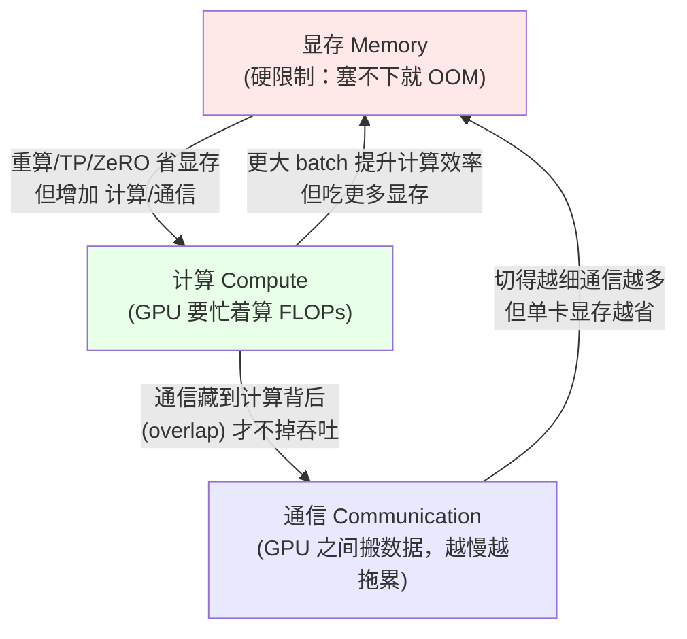
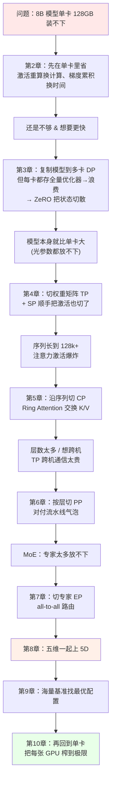
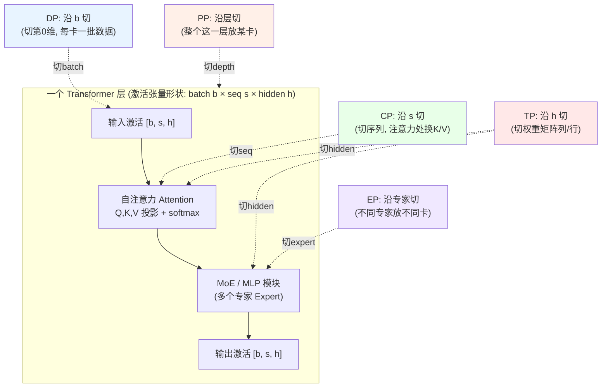
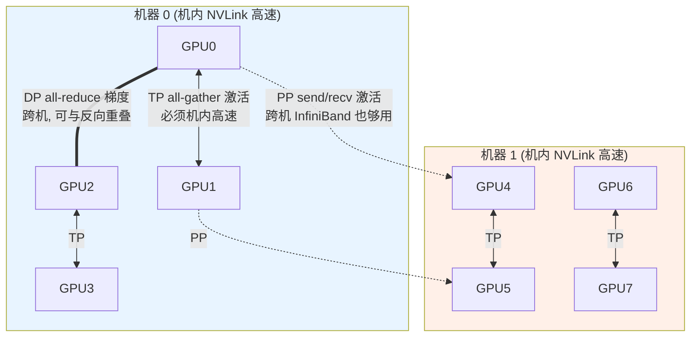
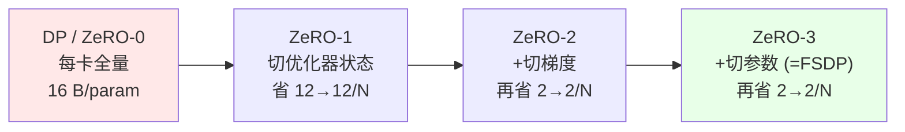
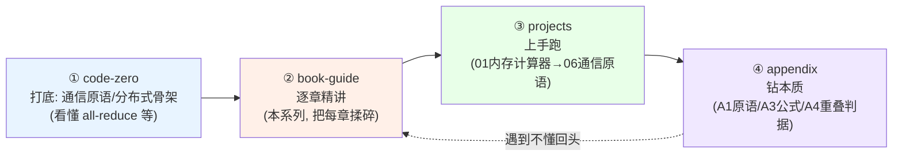

# 00 导读：全书地图、为什么要在 GPU 集群上训练、五维并行全景

> 对应原书：《The Ultra-Scale Playbook: Training LLMs on GPU Clusters》(HuggingFace, Nouamane Tazi / Ferdinand Mom / Haojun Zhao 等) PDF 第 5–18 页（Preface + 目录 + 第 1 章 Overview）；并前瞻引用第 8 章「5D Parallelism in a Nutshell」(p.141–152) 与附录 A3/A4 的尺度与公式。
>
> 本文是「《Ultra-Scale Playbook》逐章精讲」系列的**第 0 篇（导读）**。读完它，你会拿到一张"全书地图"：知道每一章在解决什么问题、五个并行维度各切什么/各通信什么、以及一条从零基础到能上手跑集群训练的学习路径。

---

## 🗺️ 本章地图：你现在站在哪里

这本书的主线，可以用一句话概括：

> **把一个本来连单张 GPU 都塞不下的大模型训练任务，一步步铺到成千上万张 GPU 上，并且让这些 GPU 尽可能"满负荷干活"。**

整条主线像爬一座山，台阶是这样的：

```mermaid
flowchart LR
    A["单卡<br/>1 GPU"] --> B["榨干单卡<br/>激活重算 / 梯度累积"]
    B --> C["多卡同机<br/>数据并行 DP / ZeRO"]
    C --> D["切模型<br/>张量并行 TP / 序列并行 SP"]
    D --> E["切长序列<br/>上下文并行 CP"]
    E --> F["切层<br/>流水线并行 PP"]
    F --> G["切专家<br/>专家并行 EP"]
    G --> H["5D 拼装<br/>多机多卡全维度"]
    H --> I["找最优配置<br/>4100+ 基准实验"]
    I --> J["压榨 GPU<br/>Kernel/FlashAttn/混合精度"]
    style A fill:#e8f4ff
    style H fill:#fff0e8
    style J fill:#e8ffe8
```



**本篇（导读）站在最左边的"出发点"**：还没有引入任何一种并行，只负责回答三个问题——

1. 这本书到底在解决什么？（答：显存 / 计算 / 通信 三者的编排 orchestration）
2. 全书 10 章 + 附录是怎么一环扣一环的？（答：上面那条主线）
3. 五个并行维度 DP / TP / PP / CP / EP 各是什么？（答：本篇的"五维全景总览表"）

后面每一篇精讲，会把上图里的某一个台阶拆开揉碎讲透。所以**这一篇是地图，不是某一座具体的山**——它的价值是让你在后面任何时候迷路时，都能回到这张图看看"我在切什么、为什么要切、代价是什么"。

---

## 1. 📖 这本书在解决什么？

### 1.1 一句话：揭开"千卡训练"的黑箱

原书 Preface（前言）和 1.1 节（Introduction）讲得很直白。我把原文意思翻译并提炼：

> "成千上万张 GPU 像交响乐团一样和谐合奏——这就是训练当今最强 AI 模型所需要的。直到不久前，这还是少数顶尖实验室的专属领地。开源已经改变了很多：你能下载到最新的 Llama、DeepSeek 模型，能读它们的技术报告。**但最难的那部分——训练代码、协调成千上万张 GPU 的知识与技巧——仍然散落在零碎的论文和私有代码库里，被一层复杂性包裹着。这本开源的书，就是来揭开这层面纱的。**"

换句话说，这本书要做的，是把**"分布式训练"这门长期被工业界大厂私藏的手艺**，从单卡一路讲到上千卡，每一步都配**可运行的代码**和**可复现的基准**。

> 💡 **为什么"训练代码"是秘密？**
> 模型权重（weights）可以开源下载，论文也能读，但"怎么把训练高效铺到 512 张甚至上万张卡上"涉及大量工程细节：通信原语怎么用、张量怎么切、显存怎么省、计算和通信怎么重叠……这些 know-how 通常只在大厂内部口口相传。这本书的最大价值就是**把这些 know-how 系统化、可复现地写出来**。

### 1.2 灵魂：显存 / 计算 / 通信 的三角权衡

原书 1.2 节（High Level Overview）点出了全书的"灵魂"。所有技术，本质上都在对付下面**三个反复出现的挑战**：

| # | 挑战 | 英文 | 一句话 | 不解决会怎样 |
|---|------|------|--------|--------------|
| 1 | **显存占用** | Memory usage | 一个训练步必须能塞进显存 | 塞不下 → 直接 OOM，训练根本起不来（硬限制） |
| 2 | **计算效率** | Compute efficiency | 让硬件大部分时间都在算，而不是在搬数据 / 等别人 | GPU 空转，钱白烧 |
| 3 | **通信开销** | Communication overhead | 通信会让 GPU 闲着，要尽量少通信、并把通信藏到计算背后 | 卡越多越慢，扩展性崩盘 |

> 🔬 **第一性原理：这是个"不可能三角"**
> 原书说得很关键：**这三者常常要互相牺牲（trade off）**。你可以用"重算 activation"省显存，代价是多花计算；可以用"张量并行 TP"切模型省显存，代价是多花通信。**没有免费的午餐——大规模训练的全部艺术，就是在显存、计算、通信这个三角里找平衡点。** 记住这句话，后面每一种并行你都能用它来理解"省了什么、付了什么"。

我们用一张图把这个三角钉在脑子里：



### 1.3 单卡装不下：为什么必须上集群（带数值）

光说"显存不够"太抽象。我们用原书附录 A3（Typical Scales，p.240）和第 2 章的内存模型，**算几笔账**，你就明白为什么非上集群不可。

#### 账目一：模型状态的"16 字节/参数"铁律

训练时（不是推理）一个参数要在显存里留下一串东西。以**当今主流配置：BF16 混合精度 + Adam 优化器**为例，每个参数占用：

| 项目 | 英文 | 精度 | 字节/参数 |
|------|------|------|-----------|
| 参数 | weights | BF16 | 2 |
| 梯度 | gradients | BF16 | 2 |
| 优化器·master 权重 | master weights | FP32 | 4 |
| 优化器·一阶动量 $m$ | momentum | FP32 | 4 |
| 优化器·二阶动量 $v$ | variance | FP32 | 4 |
| **合计** | | | **16** |

写成公式，单看"模型状态"（不含激活）的显存：

$$
M_{\text{model}} \;=\; N_{\text{params}} \times 16\ \text{bytes}
$$

代入一个 **8B（80 亿参数）** 模型：

$$
M_{\text{model}} = 8\times10^9 \times 16\ \text{B} = 128\times10^9\ \text{B} = 128\ \text{GB}
$$

**128 GB！** 而一张顶配 H100 / A100 只有 **80 GB** 显存。也就是说——**8B 这种"小"模型，单卡连"模型状态"都装不下**，还没算激活呢。这就是为什么要上多卡。

> ⚠️ **常见坑：第一步成功、第二步却 OOM**
> 原书 2.1 节专门提醒：有时第一个训练步能跑通，第二步反而 OOM。原因是**优化器状态（$m$、$v$、master 权重）是在第一次 optimizer.step() 之后才建起来的**。第一步只有 param+grad+activation，看着够；第二步优化器状态一上来，显存暴涨 6×（12 字节 vs 2 字节），就炸了。

#### 账目二：书里那张"Llama 3 8B 显存表"

原书 FIG.I（p.12）用它的显存预测小工具给了一组**真实数字**（某个 batch / 序列长度配置下）：

```
Total Memory Used:                              158.99 GB
├─ Parameters / Gradients / Optimizer States:    97.90 GB
│    ├─ Parameters:      12.24 GB   (BF16, 2 B/param)
│    ├─ Gradients:       12.24 GB   (BF16, 2 B/param)
│    └─ Optimizer states:73.43 GB   (FP32 ×3 = master+m+v, 12 B/param)
└─ Activation Memory:                            61.09 GB
     (32 层，每层约 1.8–1.9 GB)
```

两个观察，直接预告了后面几章：

- **优化器状态 73.43 GB 是大头**（占模型状态的 75%）。`73.43 / 12.24 ≈ 6`，正好是 12 字节 vs 2 字节的比例。→ 这就是 **ZeRO**（第 3 章）要优先开刀的地方：把优化器状态切散到各卡。
- **激活内存 61.09 GB 也很惊人**，而且它**随 batch、序列长度线性甚至平方增长**。→ 这就是 **激活重算**（第 2 章）、**序列/上下文并行**（第 4、5 章）要对付的地方。

#### 账目二·补：激活内存为什么会"随序列长度爆炸"

原书附录 A3（p.240）给出激活的尺度：**单层的隐藏状态张量约为 $b\cdot s\cdot h$ 个元素**（$b$=micro-batch、$s$=序列长度、$h$=hidden 维）。一个 $L$ 层模型，激活内存粗略正比于

$$
M_{\text{act}} \;\propto\; L \cdot b \cdot s \cdot h \cdot (\text{bytes}) \;+\; \underbrace{L \cdot b \cdot s^2 \cdot n_{\text{heads}}}_{\text{注意力分数, 随 } s^2 \text{ 增长}}
$$

关键在第二项：**注意力分数矩阵是 $s\times s$ 的**，随序列长度**平方**增长。我们用 Llama 3 8B 的尺度（$L=32$、$h=4096$、BF16=2 字节）粗算线性项，看序列长度翻倍的后果：

| micro-batch $b$ | 序列长度 $s$ | 线性项 $L\,b\,s\,h\times 2$ B | 直觉 |
|----------------|--------------|------------------------------|------|
| 1 | 4096 | $32\times1\times4096\times4096\times2 \approx 1.07$ GB | 还好 |
| 1 | 32768 (32k) | $\approx 8.6$ GB | 长上下文吃紧 |
| 1 | 131072 (128k) | $\approx 34$ GB | **仅线性项就 34 GB**，再加 $s^2$ 注意力项直接爆 |

> 🔬 **这就是第 5 章 CP 存在的理由**：当序列长到 128k+，**即使开了全量激活重算**，注意力的激活需求在单卡上也"令人望而却步"（原书 p.145 原话 prohibitive）。沿序列维把激活切散（CP），是唯一出路。而 $s^2$ 那一项的高效解法，正是第 10.4 节的 **FlashAttention**——不显式存 $s\times s$ 矩阵。

#### 账目三：计算量为什么也逼你上千卡

显存之外，**算力**同样逼你上集群。原书附录 A3（p.241）给了估算公式：一次前向 + 反向的总浮点运算量约为

$$
\text{FLOPs}_{\text{fwd+bwd}} \;\approx\; 6 \times N_{\text{params}} \times T_{\text{tokens}}
$$

（前向 $\approx 2NT$，反向是前向的 2 倍，合计 $6NT$。）

代入 **8B 模型训练 1 万亿（$10^{12}$）token**：

$$
6 \times 8\times10^9 \times 10^{12} = 4.8\times10^{22}\ \text{FLOPs}
$$

一张 H100 的 BF16 理论峰值约 $10^{15}$ FLOP/s，实际有效利用率（MFU）算乐观的 50%，即 $5\times10^{14}$ FLOP/s：

$$
t_{\text{1 GPU}} = \frac{4.8\times10^{22}}{5\times10^{14}} \approx 9.6\times10^{7}\ \text{s} \approx 1111\ \text{天}
$$

**单卡要算 3 年多！** 换成 1000 张卡（理想线性扩展）：

$$
t_{\text{1000 GPU}} \approx \frac{1111}{1000}\ \text{天} \approx 1.1\ \text{天}
$$

> 💡 **结论**：显存逼你上多卡（装不下），算力逼你上很多卡（算太久）。而"很多卡"一旦跨机，**通信**就成了新瓶颈。三角又转起来了——这就是为什么需要这一整本书。

---

## 2. 🧭 全书逻辑主线：10 章 + 附录怎么环环相扣

原书目录（p.7）的结构非常清晰，我把它重组成"主线 + 每章在解决三角里的哪个问题"。请对照本文开头那张主线流程图来读。

### 2.1 主线分段表

| 章 | 标题 | 在主线里的位置 | 主要对付的挑战 | 核心一句话 |
|----|------|----------------|----------------|------------|
| **1** | Overview 概览 | 出发点 | — | 摆出显存/计算/通信三挑战（本导读对应它） |
| **2** | First Steps: Training on One GPU 单卡训练 | 榨干单卡 | 显存 | 看清显存都被谁吃了；激活重算、梯度累积 |
| **3** | Data Parallelism 数据并行 | 多卡同机 | 计算↑、显存(ZeRO) | DP 复制模型分摊 batch；ZeRO-1/2/3 切优化器/梯度/参数 |
| **4** | Tensor Parallelism 张量并行 | 切模型 | 显存、通信 | 把每个权重矩阵横/竖切开；序列并行 SP 配套省激活 |
| **5** | Context Parallelism 上下文并行 | 切长序列 | 显存（激活） | 沿序列维切，Ring Attention 让超长上下文可训 |
| **6** | Pipeline Parallelism 流水线并行 | 切层 | 显存（参数） | 把不同层放不同卡；对付"流水线气泡"的各种调度 |
| **7** | Expert Parallelism 专家并行 | 切专家 | 显存（专家参数） | MoE 模型把专家分到不同卡，all-to-all 路由 token |
| **8** | 5D Parallelism in a Nutshell 五维拼装 | 全维度拼装 | 三者综合 | 五种并行 + ZeRO 怎么组合、谁和谁互补/冲突 |
| **9** | Finding the Best Training Configuration 找最优配置 | 找配置 | 三者综合 | 三步法：先塞进显存→达到目标 batch→压吞吐；4100+ 实验 |
| **10** | Diving into the GPUs 钻进 GPU | 压榨硬件 | 计算效率 | Kernel 融合、线程、FlashAttention、混合精度 |
| **11** | Conclusion 结语 | — | — | 收尾 |
| **A1** | Parallel Programming Crash Course | 附录·本质 | 通信 | 通信原语速成：all-reduce / all-gather / … |
| **A2** | Distributed Training Profiling | 附录·本质 | 计算/显存 | 怎么用 profiler 看显存和时间线 |
| **A3** | Typical Scales in LLM Training | 附录·本质 | — | 各种量级的"手算公式"（本导读大量引用） |
| **A4** | Math for Compute / Communication Overlap | 附录·本质 | 通信 | 计算与通信能否重叠的"比值判据" |

### 2.1b 全书"每小节"一句话速览（对照原书目录）

为了让你拿到**最细粒度**的地图，下面把原书每个**小节**（含编号与页码）都用一句话点到。后续每一篇精讲会展开其中一块——你可以把这张表当成"进度条"。

| 节号 | 小节标题 | 页 | 一句话精髓 |
|------|----------|----|-----------|
| 1.1 | Introduction 引言 | 11 | 千卡训练的 know-how 长期被私藏，本书来揭面纱 |
| 1.2 | High Level Overview 高层概览 | 16 | 三大挑战：显存/计算/通信，且常需互相牺牲 |
| 2.1 | Memory usage in transformers | 23 | 显存四占：参数+梯度+优化器+激活；先学会"测/算"它 |
| 2.2 | Activation recomputation 激活重算 | 31 | 前向丢掉激活、反向时重算——**用计算换显存** |
| 2.3 | Gradient accumulation 梯度累积 | 35 | 把大 batch 拆成多个 micro-batch 累加梯度——**用时间换显存** |
| 3.0 | Data Parallelism 数据并行 | 41 | 复制模型到多卡，各算一批，反向 all-reduce 梯度 |
| 3.1 | Revisiting global batch size | 53 | global batch = micro-batch × 累积步 × DP 度，三者要协调 |
| 3.2 | Our journey up to now | 54 | 阶段性复盘：到此为止省了哪些显存 |
| 3.3 | Zero Redundancy Optimizer (ZeRO) | 58 | ZeRO-1/2/3 在 DP 副本间切优化器/梯度/参数 |
| 4.0 | Tensor Parallelism 张量并行 | 71 | 利用矩阵乘的分配律，把权重矩阵列/行切开 |
| 4.1 | TP in a transformer block | 81 | 注意力(QKV列切、输出行切) + MLP 的具体切法 |
| 4.2 | Sequence parallelism 序列并行 | 87 | TP 搭档：在 LayerNorm/Dropout 处沿序列维切激活 |
| 5.0 | Context Parallelism 上下文并行 | 97 | 沿序列维切，让 128k+ 超长上下文可训 |
| 5.1 | Ring Attention | 101 | 把 K/V 沿环形依次传一圈，边传边算注意力 |
| 5.2 | Zig-Zag Ring Attention | 105 | 改进负载均衡（因果掩码让前后 token 计算量不均）|
| 6.0 | Pipeline Parallelism 流水线并行 | 109 | 把层切给不同卡，像流水线工位接力 |
| 6.1 | AFAB (All-Forward-All-Backward) | 113 | 最朴素调度：先全前向再全反向，气泡大 |
| 6.2 | 1F1B & Llama 3.1 schemes | 119 | 一前一后交错，显存与气泡更优 |
| 6.3 | Interleaving stages 交错阶段 | 125 | 一卡负责多个不连续 stage，进一步缩气泡 |
| 6.4 | Zero bubble & DualPipe | 129 | 把反向拆成两半填进空隙，逼近零气泡 |
| 7.0 | Expert Parallelism 专家并行 | 135 | MoE 专家分到各卡，all-to-all 路由 token |
| 8.1 | Scope and focus | 148 | 各并行影响模型的哪一块（TP 全模型/CP 注意力/EP MoE）|
| 8.2 | Summarizing it all | 149 | 五维 + ZeRO 总对比表 + 显存节省全景图 |
| 9.1 | Step 1: Fitting in memory | 155 | 先选并行度让一步塞进显存 |
| 9.2 | Step 2: Target global batch | 156 | 用 DP/梯度累积达到目标 global batch |
| 9.3 | Step 3: Optimizing throughput | 157 | 在前两步约束下把吞吐拉满 |
| 9.4 | Benchmarking thousands of configs | 158 | 4100+ 实验扫遍配置空间 |
| 9.5 | Lessons learned | 161 | 基准踩坑经验总结 |
| 10.1 | A primer on GPUs | 165 | GPU 的 SM/线程/显存层级速成 |
| 10.2 | Improving perf with kernels | 169 | 写/换 kernel 提升性能 |
| 10.3 | Fused kernels 融合算子 | 185 | 多个算子合一，减少显存往返 |
| 10.4 | FlashAttention | 187 | 不显式存 $s\times s$ 注意力矩阵，省显存又快 |
| 10.5 | Mixed precision 混合精度 | 191 | FP32/BF16/FP8 各占 4/2/1 字节，精度换显存与速度 |
| A1 | Parallel Programming Crash Course | 217 | 通信原语本质：all-reduce/gather/scatter/all-to-all |
| A2 | Distributed Training Profiling | 233 | 用 profiler 看显存曲线和时间线 |
| A3 | Typical Scales in LLM Training | 240 | 各种量的手算公式（本导读大量引用）|
| A4 | Math for Compute/Comm Overlap | 242 | 通信能否藏到计算背后的"比值判据" |

> 💡 **怎么用这张表**：读任意一篇精讲前，先回这里看它在全书的位置和"一句话精髓"，建立预期；读完后回来打个勾。**地图 + 进度条，两用。**

### 2.2 为什么是这个顺序？——一条"被显存逼出来"的故事线

原书 1.1 节强调，全书"保持一条单一的故事线（single story line），帮你理解每个方法是从哪儿冒出来的"。这条故事线就是**被显存和通信一步步逼出来的**：



读这张图的关键：**每一章都是被上一章"还没解决干净"的问题逼出来的**。先在单卡里抠（第 2 章），抠不动了复制到多卡（第 3 章），模型本身太大就切权重（第 4 章），序列太长就切序列（第 5 章），层太多/要跨机就切层（第 6 章），MoE 专家太多就切专家（第 7 章），然后把这些维度叠在一起（第 8 章），用实验找出最优组合（第 9 章），最后回头把每张卡本身压榨干净（第 10 章）。

> 💡 **一个反直觉但重要的安排**：第 10 章"压榨单卡 GPU"（Kernel 融合、FlashAttention、混合精度）放在最后，而不是最前。**因为在并行还没搭好之前，单卡优化的收益会被通信瓶颈掩盖**；只有先把多卡框架立起来，再去抠每张卡的极致性能才有意义。

---

## 3. 🎛️ 五维并行全景：DP / TP / PP / CP / EP

这是本导读的**核心总览**。原书第 8 章（p.142）把五个并行维度一次性列齐，我先给每个维度一句话的"切什么 / 通信什么"，再上大对比表，再用图把它们叠在一张 Transformer 层上。

### 3.1 五个维度，一句话各是什么

原书 8.0（p.142）的原话翻译：

> 恭喜！你已经见过了全部五种可以用来扩展模型训练的并行策略：
> 1. **数据并行 DP** —— 沿 **batch（批）维**切
> 2. **张量并行 TP** —— 沿 **hidden（隐藏）维**切
> 3. **序列 / 上下文并行 SP / CP** —— 沿 **sequence（序列）维**切
> 4. **流水线并行 PP** —— 沿 **model layers（模型层）维**切
> 5. **专家并行 EP** —— 沿 **experts（专家）维**切

把它做成"一句话卡片"：

| 维度 | 全称 | 切什么（沿哪个维度） | 每卡存什么 | 主要通信什么 | 一句话直觉 |
|------|------|----------------------|------------|--------------|------------|
| **DP** | Data Parallelism 数据并行 | **batch 批维**（切数据） | **完整模型副本** | 反向时 **all-reduce 梯度** | "人手一份模型，各算一批数据，最后梯度求平均" |
| **TP** | Tensor Parallelism 张量并行 | **hidden 隐藏维**（切权重矩阵） | **一个权重矩阵的一片** | **all-gather / reduce-scatter 激活** | "一个大矩阵乘法，几张卡每人算一竖条/一横条" |
| **PP** | Pipeline Parallelism 流水线并行 | **layer 层维**（切深度） | **完整的若干层** | 相邻 stage 间 **send/recv 激活** | "流水线工位：卡1算第1-8层，卡2算第9-16层…" |
| **CP** | Context Parallelism 上下文并行 | **sequence 序列维**（切 token） | **完整模型 + 一段序列的激活** | 注意力里 **Ring 交换 K/V** | "超长文章每人读一段，注意力时把 K/V 传一圈" |
| **EP** | Expert Parallelism 专家并行 | **expert 专家维**（切 MoE 专家） | **一部分专家的权重** | **all-to-all 路由 token** | "MoE 有 256 个专家，分到各卡，token 按需投递" |

> ⚠️ **别把 SP、ZeRO、EP 和"第六、第七维"混了**
> - **SP（序列并行 Sequence Parallelism）** 不是独立的第六维，它是 **TP 的搭档**：在 TP 切不到的地方（LayerNorm、Dropout 等沿序列维）顺手把激活也切了，所以原书写成"**TP + SP**"。
> - **ZeRO-1/2/3** 也不是新维度，它是 **DP 的"省显存升级版"**：在数据并行的副本之间，把优化器状态(1)/+梯度(2)/+参数(3)逐步切散。
> - **EP** 在输入处理上很像 DP，所以原书 p.147 提到"有些实现把 EP 看作 DP 的一个子集"，区别只是 EP 用专家路由而不是每卡跑相同副本。

### 3.2 五维 + ZeRO 大对比表（原书第 8 章定稿表）

这张表直接来自原书 p.152，是全书对五维并行最精炼的总结，**值得背下来**：

| 方法 | 省的是哪部分显存 | 并行 / 切分维度 | 主要缺点 |
|------|------------------|-----------------|----------|
| **DP** | 激活（通过减小本地 batch） | Batch 批维 | 受**最大可用 batch**限制 |
| **PP** | 模型**参数** | Model layers 层维 | **流水线气泡**（idle bubble）+ 调度复杂 |
| **TP + SP** | 模型参数**和**激活 | Hidden 维 / 序列长度 | 需要**高带宽**通信（难跨机扩展） |
| **CP** | 激活 | Sequence length 序列维 | 在**注意力**模块引入额外通信 |
| **EP** | **专家**参数 | Experts 专家维 | 需要 MoE 层；引入**路由通信** |
| **ZeRO-1** | 优化器状态 | 在 DP 副本间切散 | 参数通信开销 |
| **ZeRO-2** | 优化器状态 + 梯度 | 在 DP 副本间切散 | 参数通信开销 |
| **ZeRO-3** | 优化器状态 + 梯度 + 参数 | 在 DP 副本间切散 | 参数通信开销 |

原书 p.152 的结语一针见血：

> "显然，没有任何一种技术是能魔法般扩展的银弹（silver bullet），我们往往得把它们以某种方式组合起来。"

### 3.3 各维度"切什么、通信什么"——叠在一张 Transformer 层上看

光看表还不够直观。我们把一个 Transformer 层（MoE 变体）画出来，看五个维度分别**沿哪个方向切**：



读图要点（这是理解 5D 的"题眼"）：

- **DP 切的是数据张量的第 0 维（batch）**，模型本身不动——每卡一份完整模型。
- **TP 切的是权重矩阵（沿 hidden 维）**，所以它**贯穿整个模型**（注意力和 MLP 都切），通信发生在每个矩阵乘法前后。
- **CP 切的是序列维**，绝大多数模块（MLP、LayerNorm）能各算各的，**只有注意力**因为"每个 token 要看到全序列的 K/V"才需要通信。
- **EP 只动 MoE 层**（把专家分到各卡），注意力等其它部分原封不动。
- **PP 切的是"层"这个粒度**（深度方向），整层整层地分给不同卡。

> 🔬 **原书第 8.1 节（p.148）的"作用域"总结**——每种并行影响模型的哪一块：
> - **TP（+SP）**：影响**整个模型**（切权重也切激活）。
> - **CP**：主要影响**注意力层**（其它层各算各的）。
> - **EP**：主要影响 **MoE 层**（替换标准 MLP），注意力不变。
> - **PP / ZeRO**：不特别针对某个子模块，但 PP 要求各段**层数均衡**（首尾因为带 embedding 常被特殊处理）。

### 3.4 各维度"通信什么"——把通信原语对上号

并行的代价就是通信。下表把每个维度用到的**通信原语**（collective，第 A1 章会专讲）对上号——这是面试高频：

| 维度 | 何时通信 | 通信原语 | 通信量量级 | 偏好的网络 |
|------|----------|----------|------------|------------|
| DP | 反向结束，同步梯度 | **All-Reduce**（梯度） | $\approx 2\times$ 梯度大小 | 可跨机（梯度可与反向重叠） |
| ZeRO-3 | 前向/反向逐层 | **All-Gather**(参数) + **Reduce-Scatter**(梯度) | 逐层参数大小 | 可跨机（能与计算重叠） |
| TP+SP | 每个 column/row linear 前后 | **All-Gather** / **Reduce-Scatter**（激活） | 与激活 $b\,s\,h$ 同阶 | **必须高带宽（同机 NVLink）** |
| CP | 注意力计算时 | **Ring** 点对点（交换 K/V） | 与 K/V 大小同阶 | 可重叠（环形流水） |
| PP | 相邻 stage 边界 | **Send / Recv**（激活） | 单层激活大小（最省） | 可跨机（带宽要求最低） |
| EP | MoE 路由 | **All-to-All**（token） | 与被路由 token 量同阶 | 看路由分布 |

> 💡 **面试高频：为什么 TP 不能跨机，PP/ZeRO 却可以？**
> 原书 p.144–145 给出黄金法则：**TP 的通信在"计算的关键路径上"**（每个矩阵乘法都要等通信完成才能继续），通信量大且**没法藏到计算背后**，所以 TP 必须放在**同机内的高速 NVLink 域**。而 **PP 只在 stage 边界传一份激活（通信量最小）**、**ZeRO-3 的参数 all-gather 可以预取/与计算重叠**，所以它们能**跨机**（走较慢的 InfiniBand/以太网）。
> **实战配置法则**：TP 度数 ≤ 单机 GPU 数（如 8），把 TP 锁在机内；跨机用 PP 或 ZeRO/DP。

### 3.5 一张图：把 GPU 分组对应到各维度（拓扑感知）

原书 p.144–145 反复强调"把 GPU 高效分组（organize the GPUs into groups）"。下面用一个 **2 机 × 8 卡 = 16 卡** 的例子，演示一种 TP=2 / PP=2 / DP=4 的分组方式直觉（实际配置由第 9 章基准决定）：



**记住这条拓扑铁律**：**通信越频繁/越在关键路径的维度，越要放进机内（NVLink ~900 GB/s）；通信越稀疏/越能重叠的维度，才放到跨机（InfiniBand ~50–400 GB/s）。** 即 TP 在最内、然后 EP/CP、再 PP、最外层是 DP。

### 3.5b 通信量手算：用数字感受"为什么 TP 怕跨机"

原书附录 A4（p.242–244）给了几个并行维度的通信量与"重叠判据"。这里用数字把抽象的"通信开销"落地。

#### 例 1：数据并行 DP 的梯度 all-reduce

反向时要把梯度做一次 all-reduce。Ring All-Reduce 的总传输量约为梯度大小的 $2\times\frac{N-1}{N}\approx 2\times$。对 8B 模型、BF16 梯度（16 GB）：

$$
V_{\text{DP}} \approx 2 \times 16\ \text{GB} = 32\ \text{GB}\ \text{(每步, 沿最慢链路)}
$$

- 走**机内 NVLink（~900 GB/s）**：$32/900 \approx 0.036$ s。
- 走**跨机 InfiniBand（~50 GB/s）**：$32/50 \approx 0.64$ s。

**差了约 18 倍。** 但 DP 的救命稻草是：梯度可以**分桶（默认 25 MB 一桶）边算边传**，把通信藏到反向计算背后（原书 A4）。判据是：

$$
\frac{t_{\text{comm}}(\text{all-reduce 一桶})}{t_{\text{compute}}(\text{反向})} < 1 \;\Rightarrow\; 通信可被完全重叠
$$

#### 例 2：张量并行 TP 为什么"藏不住"

原书 A4（p.244）给出一个**惊人简洁**的结论：TP 区域内"all-gather 激活能否藏到下一个 linear 计算背后"，那个比值**只取决于 hidden 维 $h$ 和 TP 度 $t$，与 batch、序列长度无关**：

$$
\frac{t_{\text{comm}}}{t_{\text{compute}}} \;\sim\; \frac{t-1}{h}\cdot(\text{带宽相关常数})
$$

直觉：**TP 度 $t$ 越大、$h$ 越小，通信越藏不住。** 而且 TP 的 all-gather/reduce-scatter 在**计算关键路径上**——下一个矩阵乘必须等激活凑齐才能开始，没法像 DP 那样分桶重叠。这就是为什么：

> **TP 度数通常 ≤ 单机卡数（如 8），死死锁在机内 NVLink；一旦跨机，通信直接吃掉收益。**

#### 例 3：流水线并行 PP 的"气泡"也是一种隐形通信代价

PP 把模型切成 $p$ 个 stage，最朴素的 AFAB 调度里，**首个 micro-batch 要依次穿过所有 stage、最后一个才开始**，导致两头有"气泡"（GPU 空转）。气泡占比的经典公式：

$$
\text{Bubble fraction} = \frac{p-1}{m+p-1}
$$

其中 $m$=micro-batch 数、$p$=stage 数。举例 $p=4$、$m=4$：

$$
\frac{4-1}{4+4-1} = \frac{3}{7} \approx 43\%
$$

**43% 的时间在空转！** 把 $m$ 加到 16：$\frac{3}{19}\approx 16\%$；加到 64：$\frac{3}{67}\approx 4.5\%$。**这就是为什么 PP 偏好大 micro-batch 数**（原书 p.143：PP "prefers large $m$ to hide bubble"），也是第 6 章 1F1B / 交错 / DualPipe 各种调度要解决的核心。用时间线看：

```mermaid
gantt
    title PP 气泡示意 (p=4 stage, m=4 micro-batch, AFAB 朴素调度)
    dateFormat X
    axisFormat %s
    section GPU0(stage0)
    F1 :0, 1
    F2 :1, 2
    F3 :2, 3
    F4 :3, 4
    空闲(bubble) :crit, 4, 8
    B :8, 12
    section GPU3(stage3)
    空闲(bubble) :crit, 0, 3
    F1 :3, 4
    F2 :4, 5
    F3 :5, 6
    F4 :6, 7
    B :7, 11
```



> 💡 三个例子串起一条规律：**DP 的通信能重叠 → 可跨机；TP 的通信在关键路径 → 锁机内；PP 的代价是气泡 → 靠大 $m$ 和好调度摊薄。** 这正是 3.4 节"拓扑铁律"的数值注脚。

### 3.6 ZeRO 三级：DP 的省显存升级（顺带预告第 3 章）

因为 ZeRO 在 5D 总览表里出现，这里先用一句话讲清三级的区别（细节留给第 3 章精讲）。回忆"16 字节/参数"的三块：参数(2) + 梯度(2) + 优化器状态(12)。ZeRO 在 **DP 的各个副本之间**逐步把它们切散：



用 $N$ 张卡做 ZeRO-3，每卡模型状态显存从 $16\,N_{\text{params}}$ 降到约 $\frac{16\,N_{\text{params}}}{N}$（参数、梯度、优化器全切散），代价是**前向/反向要 all-gather 参数、反向要 reduce-scatter 梯度**。原书 p.142 的原话：

> - **ZeRO-1**：在 DP 副本间切**优化器状态**
> - **ZeRO-2**：在 DP 副本间切**优化器状态 + 梯度**
> - **ZeRO-3**：在 DP 副本间切**优化器状态 + 梯度 + 参数**

> 💡 **ZeRO-3 vs PP 的"双胞胎之辩"**（原书 p.142–143）：两者都是"沿模型深度方向切并通信"。区别在于——**ZeRO-3 每卡只存"一层的一片"，通信传的是"权重"**；**PP 每卡存"完整的一层"，通信传的是"激活"**。所以选择取决于你想让通信负担落在"传权重"还是"传激活"上。二者可以组合但不常组合（要把全局 batch 撑得很大才划算）；而 **ZeRO-1/2 与 PP 是天然互补、容易组合**的（DeepSeek-V3 的训练就用了 PP + ZeRO-1）。

---

## 4. 🧪 本书的"实证 / 基准驱动"精神

原书 1.1 节第 3 条基石（p.15）专门强调，这本书**不是纸上谈兵**，而是**用真实实验说话**：

> "**真实训练效率基准**：如何扩展你的 LLM 训练，取决于你的基础设施——用什么芯片、什么互联（interconnect）等等，所以我们没法给一个放之四海皆准的统一配方。我们能给你的，是一套对多种配置做基准测试的方法。这正是我们在自己的集群上做的：我们跑了 **4100+ 次分布式实验**（含测试运行超过 **16000 次**），用了最多 **512 张 GPU**，扫描了大量可能的分布式训练布局和模型尺寸。"

这段话定义了全书的方法论灵魂：

| 实证精神 | 含义 | 体现在哪 |
|----------|------|----------|
| **没有银弹** | 没有一种并行能解决所有问题 | 第 8 章对比表、第 9 章组合 |
| **依赖基础设施** | 最优配置取决于芯片/互联/规模 | 第 9 章三步法 + 4100 实验 |
| **可复现** | 理论必须配可跑的代码 + 基准 | Picotron(教学) / Nanotron(生产) |
| **先量化再决策** | 算显存、算通信、算气泡，再选配置 | 附录 A3/A4 全是手算公式 |

原书第 9 章把这套精神落成**找最优配置的三步法**（p.155–157），值得提前记住：

1. **Step 1 — 先塞进显存**：选一组并行度，让一个训练步能装下（不 OOM）。
2. **Step 2 — 达到目标全局 batch**：用 DP / 梯度累积把 global batch size 调到目标。
3. **Step 3 — 压榨吞吐**：在前两步约束下，调整配置把 throughput 拉到最高。

> 🔬 **为什么是"基准驱动"而不是"公式驱动"？**
> 通信带宽、NCCL 的 bus bandwidth、kernel 启动开销、显存碎片……这些都很难纯靠公式精确预测（原书 2.1 节就说"你以为能精确算显存，但 CUDA kernel 本身就要吃 1–2 GB，还有缓冲区和碎片"）。所以正确姿势是：**用公式（A3/A4）缩小搜索范围 → 用真实基准（第 9 章）在候选里挑最优。**

---

## 5. 🧱 两套参考代码：Picotron（教学） vs Nanotron（生产）

原书 1.1 节第 2 条基石（p.13–15）说明，全书的代码引用分两套，这对你**动手**很重要：

| 代码库 | 定位 | 特点 | 链接 |
|--------|------|------|------|
| **Picotron** | 教学用 | 每个概念一个**自包含的短文件**，便于读懂原理 | github.com/huggingface/picotron |
| **Nanotron** | 生产用 | HuggingFace 内部**生产级训练代码库** | github.com/huggingface/nanotron |

> 💡 **学习建议**：先读 Picotron 理解"一个并行维度最少需要哪几行代码"，再去 Nanotron 看"工业级实现要处理多少边界情况"。本系列精讲会**抄录等价的 PyTorch 分布式代码并逐行讲解**（import / API / 张量形状 / 通信原语），帮你把 Picotron 那种"短文件"读透。

下面给一段**最小可运行的分布式骨架**（等价于 Picotron 风格的入口），逐行讲解，让你对后面所有并行代码的"通用外壳"有概念：

```python
# ===== 分布式训练最小骨架：理解所有并行代码的"通用外壳" =====
import os
import torch
import torch.distributed as dist          # PyTorch 的分布式通信库（封装 NCCL）

# 1) 初始化进程组：每张 GPU 对应一个进程(rank)
#    backend="nccl" 表示用 NVIDIA 的 NCCL 做 GPU 间集合通信(all-reduce 等)
dist.init_process_group(backend="nccl")

# 2) 拿到本进程的"身份证"
rank        = dist.get_rank()             # 全局编号: 0,1,2,...  (我是第几个进程)
world_size  = dist.get_world_size()       # 总进程数 = 总 GPU 数
local_rank  = int(os.environ["LOCAL_RANK"])  # 本机内编号(决定用哪张卡)
torch.cuda.set_device(local_rank)         # 把当前进程绑定到对应的 GPU

# 3) 造一个张量，演示最核心的通信原语: all-reduce(求和)
#    形状 [2,2]，放到当前 GPU 上；每个 rank 的初值都加上自己的 rank
x = torch.ones(2, 2, device="cuda") * rank
print(f"[rank {rank}] before all_reduce:\n{x}")

# all_reduce: 把所有 rank 的 x 逐元素相加，结果广播回每个 rank
#   这正是"数据并行 DP 同步梯度"的核心动作(把各卡梯度求和后平均)
dist.all_reduce(x, op=dist.ReduceOp.SUM)
print(f"[rank {rank}] after all_reduce (sum over ranks):\n{x}")

# 4) 收尾：销毁进程组，释放通信资源
dist.destroy_process_group()
```

**逐行要点：**

- `import torch.distributed as dist`：这是 PyTorch 分布式的总入口，后面 DP/TP/PP 的所有通信都从它来。
- `dist.init_process_group(backend="nccl")`：**所有分布式程序的第一步**。它建立一个"进程组"——把分散在各卡的进程联成一个能互相通信的整体；`nccl` 后端专为 NVIDIA GPU 集合通信优化。
- `rank` / `world_size` / `local_rank`：三个核心身份。`rank` 是全局唯一编号，`world_size` 是总卡数，`local_rank` 决定"我在本机上用第几张卡"。**几乎每段并行代码都先取这三个值**，再据此决定"我负责切片的哪一份"。
- `torch.cuda.set_device(local_rank)`：把进程钉到一张物理 GPU 上，否则张量默认都堆到 0 号卡会 OOM。
- `dist.all_reduce(x, op=SUM)`：**全书最重要的通信原语之一**。它把每个 rank 上的 `x` 逐元素求和，结果发回每张卡。**数据并行同步梯度就是一次 all-reduce（求和后除以卡数得平均）。** 张量形状 `[2,2]` 通信前后不变——all-reduce 不改变形状，只改变数值。
- `dist.destroy_process_group()`：训练结束清理通信资源。

运行方式（单机 4 卡）：

```bash
# torchrun 会自动为每张卡拉起一个进程，并设置好 RANK / LOCAL_RANK / WORLD_SIZE 环境变量
torchrun --nproc_per_node=4 min_dist.py
```

> ⚠️ **常见坑**：忘了 `torch.cuda.set_device(local_rank)`，所有进程的张量都创建在 `cuda:0` → 0 号卡显存爆掉、其它卡闲着。这是新手最常踩的分布式坑之一。

> 💡 这段骨架就是后面**所有**并行代码的"外壳"：DP 在反向后 all-reduce 梯度，TP 在矩阵乘前后 all-gather/reduce-scatter 激活，PP 在 stage 间 send/recv 激活，CP 用 ring 通信交换 K/V，EP 用 all-to-all 路由 token——**变的只是"通信什么、什么时候通信"，初始化和身份这套外壳都一样**。

---

## 6. 🧑‍🎓 给零基础读者的学习路径

原书假设你"对当前 LLM 架构有基本了解、大致知道深度学习模型怎么训练，但可以完全不懂分布式训练"（p.13）。如果你连这个前置都还虚，原书推荐先补 DeepLearning.ai 或 PyTorch 官方教程。

针对**本仓库（llm-action 风格教程）**的目录结构，我给一条四段式路径：



| 阶段 | 目录 | 做什么 | 产出 |
|------|------|--------|------|
| ① 打底 | `../code-zero/` | 先把通信原语和分布式骨架跑通，建立"多进程协同"的肌肉记忆 | 能手写 all-reduce 求和 |
| ② 精讲 | `./book-guide/`（本系列） | 逐章读精讲，每个概念都问"切什么/通信什么/何时用/瓶颈在哪" | 看得懂任意一种并行 |
| ③ 上手 | `../projects/` | 跟着项目跑：`01_memory_flops_calculator`（先会算显存）→ `02_data_parallel_zero` → `03_tensor_parallel` → `04_pipeline_parallel` → `05_context_parallel_ring_attention` → `06_collectives_from_scratch` | 能跑通真实分布式实验 |
| ④ 钻本质 | `../appendix/` | 回到第一性原理：通信原语数学（A1）、尺度公式（A3）、计算/通信重叠判据（A4） | 能手算"该不该开 TP/会不会通信瓶颈" |

**推荐顺序的理由**：

- **先打底再精讲**：不先把 all-reduce 这类原语跑通，读 DP/ZeRO 时会卡在"它到底在传什么"。
- **精讲后立刻上手**：`projects/01_memory_flops_calculator` 让你先会算显存（对应第 2 章），这是**整本书的地基**——不会算显存，后面所有"该开哪个并行"的决策都没法做。
- **最后钻附录**：附录 A4 的"重叠判据"是高阶内容，等你被通信瓶颈坑过一次，再回去看那个比值公式才会"啊原来如此"。

> 💡 **给真·零基础的最小起步**：如果你时间有限，先做三件事——(1) 跑通本文第 5 节那段 all-reduce 骨架；(2) 用 `projects/01` 算一遍 8B 模型的显存（验证本文的 128 GB）；(3) 读懂本导读 3.2 那张五维对比表。有这三样，你就能听懂任何一篇后续精讲。

---

## 6.5 ⚠️ 五个并行的常见误区辨析（面试高频）

读到这里，把最容易混淆的点单独拎出来辨析。这些几乎都是面试或实战中的"坑"：

| 误区 | 真相 |
|------|------|
| "数据并行能省模型显存" | ❌ DP **不省模型状态**——每卡都存全量参数/梯度/优化器。DP 省的是**激活**（每卡 batch 更小）。要省模型状态得用 **ZeRO** 或 TP/PP。 |
| "卡越多训练一定越快" | ❌ 跨机后通信（尤其 TP/梯度同步）可能吃掉收益，扩展性会掉。这正是第 9 章要用基准找"甜点配置"的原因。 |
| "TP 和 PP 都是切模型，随便用哪个" | ❌ TP 传**激活**且在关键路径→锁机内；PP 传**激活但仅在 stage 边界**、量最小→可跨机。二者通信特性完全不同。 |
| "ZeRO-3 和 PP 一样，二选一" | ❌ 都沿深度切，但 ZeRO-3 传**权重**、每卡存"层的一片"；PP 传**激活**、每卡存"完整的层"。可组合但不常组合。 |
| "SP 是第六种并行" | ❌ SP 是 **TP 的搭档**，专切 TP 切不到的 LayerNorm/Dropout 激活，写作 "TP+SP"。 |
| "激活重算（recompute）是免费的省显存" | ❌ 用**额外计算**换显存——反向时要重新跑一遍前向，吞吐会降。是典型的三角权衡。 |
| "梯度累积能让 batch 无限大不费显存" | ⚠️ 它不增加激活峰值（micro-batch 不变），但**多 micro-batch 串行→单步变慢**，是用时间换 batch。 |
| "EP（专家并行）和 DP 完全不同" | ⚠️ 输入处理上很像 DP，原书称 EP 可看作"用专家路由替代相同副本"的 DP 子集；核心新增是 **all-to-all 路由**。 |
| "开了 FlashAttention 就不用 CP 了" | ❌ FlashAttention 解决 $s^2$ **计算/显存**，但激活仍随 $s$ 线性增长；128k+ 超长序列仍需 **CP** 沿序列切散。 |

## 7. 🔑 重点回顾：把零散概念串成一条逻辑

为了确认你真的拿到了"地图"，我们用一组**自检问答**串一遍（答案都在前文）：

1. **这本书在解决什么？** → 把 LLM 训练从 1 卡扩到上千卡，核心是**显存 / 计算 / 通信**三者的编排，并在三者之间做权衡。
2. **为什么单卡不行？** → 8B 模型仅"模型状态"就需 $8\text{e}9 \times 16 = 128$ GB > 80 GB 单卡；训练 1T token 单卡要 1100+ 天。
3. **优化器状态为什么是显存大头？** → Adam 混合精度下它占 12 字节/参数（master+m+v 各 FP32），是参数 BF16 的 6 倍，故 ZeRO 优先切它。
4. **五维各切什么？** → DP 切 batch、TP 切 hidden、PP 切 layer、CP 切 sequence、EP 切 expert。
5. **各通信什么？** → DP all-reduce 梯度、TP all-gather/reduce-scatter 激活、PP send/recv 激活、CP ring 交换 K/V、EP all-to-all 路由 token。
6. **为什么 TP 要锁在机内？** → TP 通信在计算关键路径上、量大且难重叠，必须走 NVLink；PP/ZeRO 通信稀疏或可重叠，能跨机。
7. **怎么找最优配置？** → 三步法（先塞进显存→达到目标 batch→压吞吐）+ 4100+ 真实基准实验，不靠纯公式。
8. **PP 的气泡怎么压？** → 增大 micro-batch 数 $m$（$p=4,m=4$ 时气泡 43%，$m=64$ 时降到 4.5%）+ 1F1B / 交错 / DualPipe 调度。
9. **激活为什么对长序列敏感？** → 线性项 $\propto b\,s\,h$、注意力项 $\propto b\,s^2$；128k 序列仅线性项就 ~34 GB，故需 CP + FlashAttention。
10. **两套参考代码怎么用？** → 先读 Picotron（教学短文件）懂原理，再看 Nanotron（生产）学工程细节。

---

## 📌 本章小结

| 维度 | 一句话钉死 |
|------|------------|
| **这本书干嘛** | 揭开千卡 LLM 训练黑箱，把分布式训练 know-how 系统化、可复现 |
| **核心灵魂** | 显存 / 计算 / 通信 的三角权衡——没有银弹，全靠组合与平衡 |
| **为什么上集群** | 单卡装不下（8B→128GB）、算不完（1T token→1100 GPU-天） |
| **主线** | 单卡抠 → DP/ZeRO 多卡 → TP 切权重 → CP 切序列 → PP 切层 → EP 切专家 → 5D 拼装 → 基准找最优 → 压榨单卡 |
| **五维口诀** | DP 切批·TP 切宽·PP 切深·CP 切长·EP 切专家 |
| **通信口诀** | DP-AllReduce·TP-AllGather/ReduceScatter·PP-Send/Recv·CP-Ring·EP-AllToAll |
| **拓扑铁律** | 通信重的维度放机内(NVLink)，通信轻/可重叠的维度才跨机(IB) |
| **方法论** | 实证 / 基准驱动：用公式缩范围，用 4100+ 真实实验定配置 |
| **代码** | Picotron(教学短文件) / Nanotron(生产) 两套参考 |

**一句话带走**：**这一整本书，就是教你在"显存装不下、算力算不完、通信拖后腿"这个三难里，沿 batch / hidden / layer / sequence / expert 五个方向把模型和数据切开，再用真实基准把这五刀的组合调到最优。**

---

## 🔗 延伸阅读

- **下一篇 → 第 2 章精讲**：`./` 单卡训练——显存到底被谁吃了、激活重算（用计算换显存）、梯度累积（用时间换 batch）。这是本书地基，务必吃透。
- **算显存动手 → `../projects/01_memory_flops_calculator/`**：亲手验证本文的 128 GB / 158.99 GB，把"16 字节/参数"和"$6NT$ FLOPs"跑成代码。
- **通信原语本质 → `../appendix/`（对应原书 A1 Parallel Programming Crash Course）**：all-reduce / all-gather / reduce-scatter / all-to-all / ring 到底怎么实现、通信量怎么算。
- **尺度与重叠公式 → `../appendix/`（对应原书 A3 Typical Scales / A4 Compute-Comm Overlap）**：手算激活 $b\,s\,h$、参数 $12Lh^2$、以及"通信能否藏到计算背后"的比值判据。
- **通信原语从零实现 → `../projects/06_collectives_from_scratch/`**：把 all-reduce 等亲手写一遍，彻底搞懂第 5 节那段骨架背后发生了什么。
- **原书在线版（含交互可视化）**：`hf.co/spaces/nanotron/ultrascale-playbook`（印刷版丢失的动态图都在这里）；速查表 cheatsheet 见原书链接 [M]。

> 🧭 记住这张地图。后面每一篇精讲，开头我都会用「本章地图」把你定位回主线上的某个台阶——你只需要回到本文开头那张流程图，就永远不会迷路。
