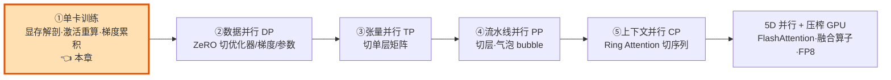
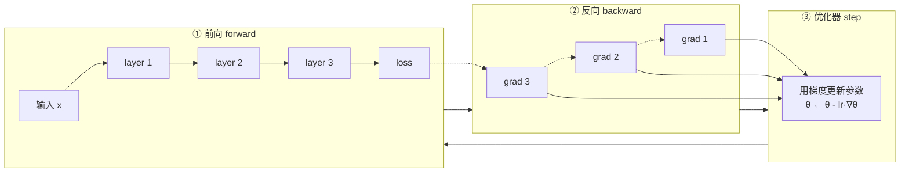
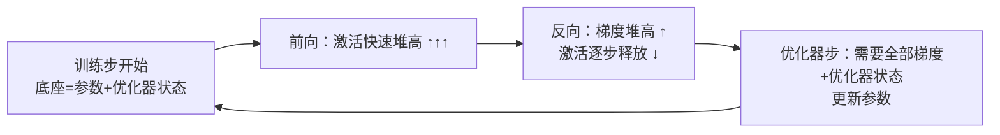
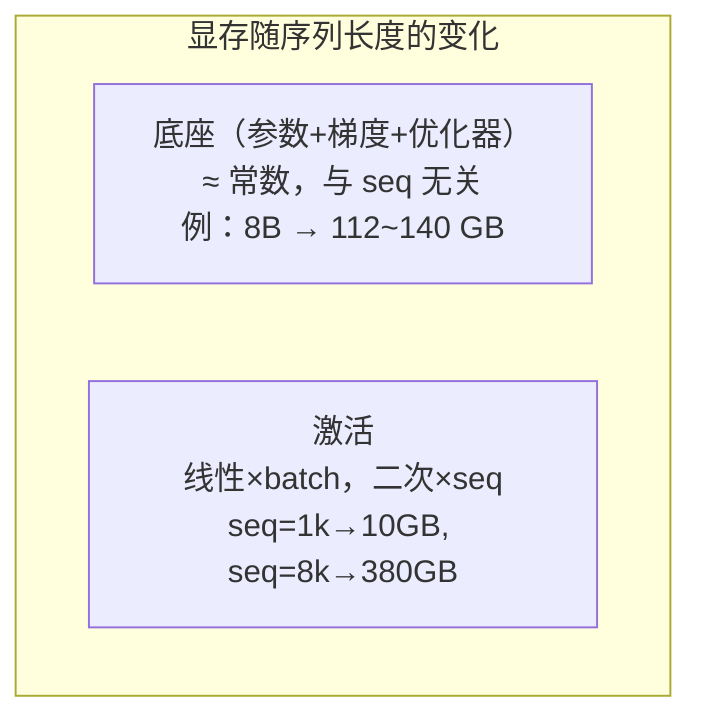
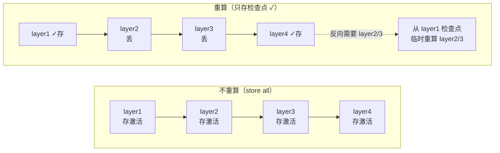
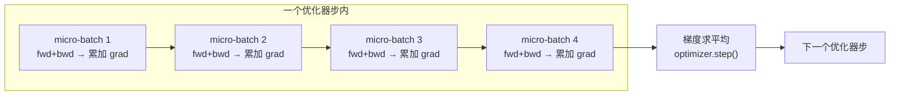
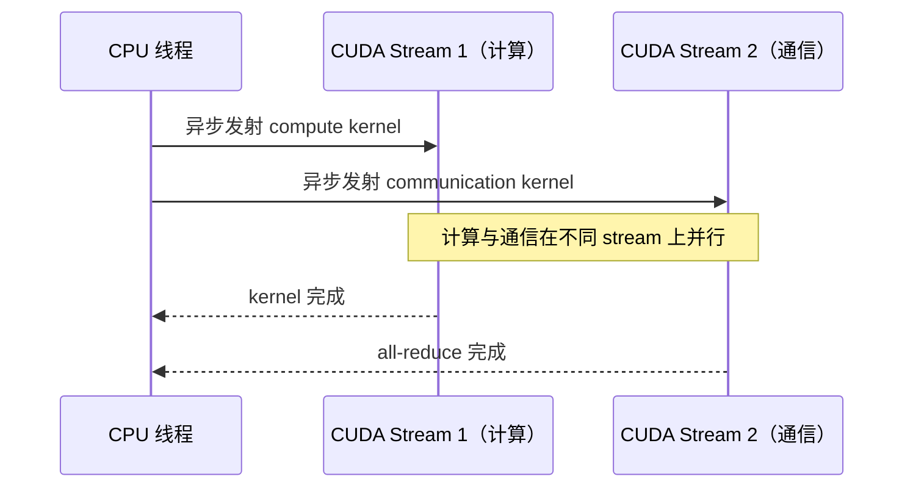
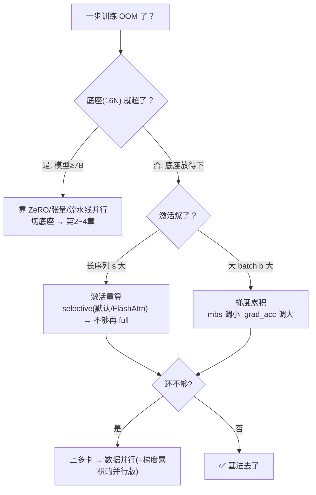

# 第 1 步：单卡训练 —— 显存解剖、激活重算、梯度累积

> 对应《The Ultra-Scale Playbook: Training LLMs on GPU Clusters》(HuggingFace，Nouamane Tazi / Ferdinand Mom / Haojun Zhao 等) 第 2 章 *First Steps: Training on One GPU*（PDF 第 19–40 页）。
>
> 本文是「《Ultra-Scale Playbook》逐章精讲」系列的第一篇。我们从最朴素的「一块 GPU 怎么训模型」讲起，把训练这件事拆成**可以拿计算器算出来的一笔显存账**。读完你应该能回答：给我一个模型规模、一个序列长度、一个 batch size、一种精度，我能不能塞进一块 80GB 的 H100？塞不下时第一招怎么省？

---

## 🗺️ 本章地图：我们在主线的哪一站

整本 Playbook 的主线是一条「**从单卡到万卡**」的升级之路。每一站都在解决同一个矛盾：**显存装不下 / 算得太慢 / 通信太贵**。我们先把这条主线画出来，时刻知道自己在哪。



为什么从单卡开始？因为**所有的多卡技巧，本质都是在单卡这笔显存账上做文章**：

- **数据并行**（第 2 章）= 把梯度累积里的 micro-batch 摊到多卡并行跑，本章末尾你会看到「数据并行就是梯度累积的并行版」这句原文。
- **ZeRO**（第 2 章）= 把本章「参数 / 梯度 / 优化器状态」这三块显存切到多卡上，每卡只存一份切片。
- **张量并行 / 流水线并行 / 上下文并行**（第 3–5 章）= 分别去切「单层权重」「层」「激活的序列维」这三个量。

所以：**先把单卡这本账算清楚，后面每一种并行就是在这本账的某一行上动刀。**

> 💡 **学习目标**：本章结束时，你脑子里要装下两个公式 + 两个旋钮。
> - 公式一：权重/梯度/优化器状态显存 ≈ `(系数) × 参数量`（与 batch、seq **无关**）。
> - 公式二：激活显存 ∝ `层数 × batch × seq × hidden × (常数 + 注意力项)`（与 batch **线性**、与 seq **二次**）。
> - 旋钮一：**激活重算**（用计算换显存）。
> - 旋钮二：**梯度累积**（用时间换显存）。

---

## 🧬 1. 一个训练步长什么样：forward / backward / optimizer

在谈显存之前，先把「训练一步」这件事拆开。单卡训练一步永远是三段（对应原书 FIG.IV）：

1. **前向传播 forward pass**：输入过一遍模型，得到输出（和 loss）。
2. **反向传播 backward pass**：根据 loss 反着算每一层参数的**梯度 gradient**。
3. **优化器步 optimization step**：用梯度去更新参数。



为什么要先讲这三段？因为**显存的「随时间起伏」完全是这三段造成的**：

- 前向时**激活 activation 一路堆高**（每层的中间结果都要存着，留给反向用）。
- 反向时**梯度逐渐堆起来**，同时用过的激活被**逐步释放**。
- 优化器步时需要**全部梯度 + 全部优化器状态**，更新完才进入下一步前向。

这就是为什么后面我们说「显存不是一个静态数字，而是一条随训练步起伏的曲线」。

### 🎚️ batch size：贯穿全书的第一旋钮

`batch size`（批大小，记作 `bs`）是训练最重要的超参数之一，它同时影响**收敛**和**吞吐**：

- **太小**：训练早期有用（快速在 loss 地形里移动），但后期梯度噪声大，模型可能收敛不到最优。
- **太大**：梯度估计很准，但每个 token 的「利用率」下降，收敛变慢、可能浪费算力。
- 好消息：在最优值附近，**模型最终表现对 batch size 的精确值并不敏感**，可以宽幅调整。

> 📌 **实战数值**（原书）：近年 LLM 预训练的甜点区间是**每个 batch 4–60M tokens**。
> - Llama 1：batch ≈ 4M tokens，训了 1.4T tokens。
> - DeepSeek：batch ≈ 60M tokens，训了 14T tokens。
> - DeepSeek-V3/R1 还会**逐步加大 batch**：前 469B tokens 从 3,072 条序列涨到 15,360 条，之后稳定在 15,360。

**LLM 社区习惯用 token 数报告 batch，而不是样本数**，这样和具体序列长度解耦。两者的换算非常简单：

$$
bs_\text{tokens} = bs_\text{samples} \times seq
$$

其中 $seq$ 是序列长度（sequence length）。例如 $bs_\text{samples}=512$、$seq=4096$，则 $bs_\text{tokens}=512\times4096\approx 2.1\text{M tokens}$。

> 反过来，给定目标 token 批量，样本批量就是 $bs_\text{samples} = bs_\text{tokens}/seq$。**本文后面公式默认用样本数 $bs$，乘以 $seq$ 即得 token 数。**

第一道坎来了：当我们想用这么大的 batch 训模型，GPU **装不下**——也就是大名鼎鼎的 **OOM（out-of-memory，显存溢出）**。要解决它，先得知道显存到底被什么吃掉了。

---

## 📦 2. 显存四大块：到底是谁在吃显存

训练一个神经网络时，显存里同时存着 **4 类张量**（原书 2.1 节）：

| 编号 | 名称 | 英文 | 是什么 | 受 batch/seq 影响？ |
|---|---|---|---|---|
| ① | **模型权重** | weights / parameters | 模型本身的参数 $\theta$ | ❌ 无关 |
| ② | **梯度** | gradients | 反向算出的 $\nabla\theta$ | ❌ 无关 |
| ③ | **优化器状态** | optimizer states | Adam 的一阶动量 $m$、二阶动量 $v$ | ❌ 无关 |
| ④ | **激活** | activations | 前向产生、反向要用的中间结果 | ✅ **线性×batch，二次×seq** |

每块张量的大小由两件事决定：

1. **形状 shape**：由超参数决定——batch size、序列长度、隐藏维 hidden dimension、注意力头数、词表大小，以及后面会讲的模型切分。
2. **精度 precision / dtype**：FP32 每个数 **4 字节**、BF16 **2 字节**、FP8 **1 字节**。精度直接决定每个数占几个字节。

> 🔬 **第一性原理**：显存账 = `元素个数(形状) × 每元素字节(精度)`。整章所有公式都只是这条乘法的不同实例。把这句话刻进脑子，下面所有公式你都能自己推。

> ⚠️ **常见坑：算不准的那几个 GB**。原书提醒，理论上你以为能精确算出显存，但有几个「隐形房客」让它算不准：
> - **CUDA kernel 本身要占 1–2 GB**。你可以亲手验证：`import torch; torch.ones((1,1)).to("cuda")`，然后看显存——啥都没干就先吃掉 1–2 GB。
> - **buffer、中间结果、显存碎片 fragmentation** 也吃一部分，且有些碎片根本用不上。
>
> 这些通常是「小而恒定」的因子，本章估算时忽略它们；但你在真机上调 batch 到极限时，会发现理论值和实测值差那么一两 GB，多半就是它们。

### 📈 2.1 显存 profile：为什么第一步和后面长得不一样

用 PyTorch profiler 把一次训练的显存曲线画出来（原书 FIG.V 是 Llama 1B 前 4 步的显存 profile），你会看到一个**典型的锯齿**：



**一个训练步的显存解剖**（原书原话）：

- 前向 → 激活迅速增加。
- 反向 → 梯度堆起来，同时**用过的激活被逐步清掉**。
- 优化 → 需要所有梯度，更新优化器状态，然后进入下一次前向。

**但第一步长得很特别**：激活快速涨上去后**平台期 plateau 一段**。为什么？

1. **PyTorch caching allocator（缓存分配器）在第一步做大量准备工作**：它预先安排好显存块，这样后续步骤不必再去搜索空闲块，于是后面更快（参考 Zach DeVito 的博客）。
2. **第一步之后优化器状态才出现**：Adam 的 $m$、$v$ 是在第一次 `optimizer.step()` 时才分配的，所以它会把后续每一步的显存基线**整体抬高**。

> ⚠️ **高频面试坑**：「为什么训练第一步成功了，第二步反而 OOM？」答案就在这：**第一步还没分配优化器状态**，第二步 Adam 的 $m/v$ 一出现，显存基线被抬高 8 字节/参数，于是溢出。记住这个现象，面试官一问一个准。

下面我们把这四块逐一**算成 GB**。

---

## 🧮 3. 权重 / 梯度 / 优化器状态：与 batch 无关的「底座」

这三块是最好算的，因为它们**只跟参数量 $N$ 和精度有关**，和 batch、seq 完全无关。

### 3.1 先数清楚有多少参数 $N$

对一个标准 Transformer LLM，参数量公式为（原书引用 michaelwornow 的推导）：

$$
N = \underbrace{v\,h}_{\text{词嵌入}} + L\big(\underbrace{12h^2 + 13h}_{\text{每个 Transformer 层}}\big) + \underbrace{2h}_{\text{最后一层 LayerNorm}}
$$

符号约定（全章统一）：

| 符号 | 含义 | 英文 |
|---|---|---|
| $h$ | 隐藏维 | hidden dimension |
| $v$ | 词表大小 | vocabulary size |
| $L$ | 层数 | number of layers |
| $s$ | 序列长度 | sequence length |
| $b$ | 批大小（样本） | batch size |
| $a$ / $n_\text{heads}$ | 注意力头数 | number of heads |

**逐项拆解 $12h^2 + 13h$（每层）**，帮你理解 $h^2$ 从哪来：

- 注意力的 Q、K、V、O 四个投影矩阵：$4h^2$（外加偏置 $4h$）。
- MLP 两层（通常中间维 $4h$）：$h\times 4h + 4h\times h = 8h^2$（外加偏置 $5h$）。
- 两个 LayerNorm：$4h$。
- 合计每层 $\approx 12h^2 + 13h$。

> 🔑 **关键观察**：当 $h$ 很大时，$12Lh^2$ 这个**二次项主导一切**——它是唯一随规模平方增长的项。所以「模型多大」基本就等于「$12Lh^2$ 多大」。

> 📝 注意：这里**没算固定位置编码**（因为现代模型用 RoPE 等，不是可学习的固定位置嵌入）。

**🔢 数值例子（Llama-3 8B 量级）**：取 $v=128256,\ h=4096,\ L=32$。

- 词嵌入 $vh = 128256\times4096 \approx 0.525\text{B}$
- 每层 $12h^2 + 13h = 12\times4096^2 + 13\times4096 = 201{,}326{,}592 + 53{,}248 \approx 0.2014\text{B}$
- 32 层 $\Rightarrow 32\times0.2014\text{B} \approx 6.44\text{B}$
- 末尾 $2h \approx 8\text{K}$（可忽略）
- **合计 $N \approx 6.97\text{B}$**（真实 Llama3-8B 是 8.03B，差异来自 GQA 减少了 KV 头参数、以及更大的 FFN 中间维——但量级与「$12Lh^2$ 主导」的结论完全吻合）。

### 3.2 全精度（FP32）训练：16 字节/参数

全精度（FP32，full precision）下，每个数 4 字节：

$$
\begin{aligned}
m_\text{params} &= 4N \quad(\text{参数，FP32})\\
m_\text{grad}   &= 4N \quad(\text{梯度，FP32})\\
m_\text{opt}    &= (4+4)N = 8N \quad(\text{Adam 的 }m\text{ 和 }v\text{，各 4 字节})
\end{aligned}
$$

$$
\boxed{m_\text{wgo}^\text{FP32} = m_\text{params}+m_\text{grad}+m_\text{opt} = (4+4+8)N = 16N \ \text{字节}}
$$

### 3.3 混合精度（BF16 + FP32 master）：仍是 16 字节/参数

实践中我们几乎不用「纯低精度」，而是**混合精度 mixed precision**（原书后面有专门一节）。当前默认配方：

- **前向/反向用 BF16**：参数和梯度各 **2 字节**——既能用 GPU 上更快的低精度算子，又能**砍掉激活显存**（前向中间结果用 2 字节存）。
- **额外保留一份 FP32 的「主权重」master weights**：4 字节。为什么？因为 BF16 对小数值是有损的，optimizer 更新要在 FP32 上做才稳。
- **Adam 的 $m$、$v$ 仍存 FP32**：各 4 字节（数值稳定性）。

$$
\begin{aligned}
&\text{BF16 参数 } 2N \;+\; \text{BF16 梯度 } 2N \;+\; \text{FP32 主权重 } 4N \\
&\quad +\; \text{Adam } m\ 4N \;+\; \text{Adam } v\ 4N \;=\; 16N \ \text{字节}
\end{aligned}
$$

> 🤯 **反直觉但重要**：混合精度训练**本身并不省显存**！它只是把同样的 16 字节**重新分布**到各组件。它的好处在别处：(1) 低精度算子更快；(2) **激活显存减半**（这才是省显存的真正来源）。

### 3.4 带 FP32 梯度累积：20 字节/参数

有些框架（如 HuggingFace 的 **Nanotron**）为了稳定，会**额外再存一份 FP32 的梯度**用于累积（因为 BF16 对小值有损，累加会丢精度）。这就多了 $4N$：

$$
\boxed{m_\text{wgo}^\text{BF16+FP32grad} = 16N + 4N = 20N \ \text{字节}}
$$

> 「master weights / 主权重」就是那份 FP32 的参数副本，文献和代码库里常这么叫。

### 3.5 一张表把「底座」算成 GB

把 $N$ 代进 $16N$ 和 $20N$（除以 $10^9$ 得 GB），就是原书那张关键表：

| 模型规模 $N$ | FP32 或 BF16（无 FP32 梯度累积）= $16N$ | BF16 + FP32 梯度累积 = $20N$ |
|---|---|---|
| **1B** | 16 GB | 20 GB |
| **7B** | 112 GB | 140 GB |
| **70B** | 1120 GB | 1400 GB |
| **405B** | 6480 GB | 8100 GB |

**怎么读这张表**：

- 一块 H100 是 **80 GB**。**一到 7B，光是「权重+梯度+优化器状态」就 112 GB，已经塞不进单卡了**——而且这还没算激活！这就是为什么 7B 往上必须上多卡 / ZeRO。
- 1B 还能塞（16 GB 底座 + 激活），所以本章后面的「单卡能跑」的例子都拿 1B 或小 batch 说事。

> 📌 **FP8 训练**能把底座进一步压到更低（每个数 1 字节），但**不稳定**，是当前非常活跃的研究方向，后面章节会讲。

> 💡 **面试高频**：「7B 模型混合精度训练，光优化器相关要多少显存？」标准答法：$16\times7 = 112$ GB（params 14 + grads 14 + master 28 + Adam m/v 56），其中**Adam 的 $m,v$ 就占了 $8N=56$ GB**——这正是 ZeRO 第一步要切掉的部分。

---

## 🌊 4. 激活：随 batch 线性、随 seq 二次的「显存杀手」

前面三块是「底座」，和 batch、seq 无关。**激活则完全不同**——它是会随你加大 batch、拉长序列而**爆炸**的那一块。

### 4.1 为什么必须存激活？

反向传播算梯度时，链式法则要用到**前向时每一层的中间结果**。例如 $y = Wx$，$\partial L/\partial W = (\partial L/\partial y)\,x^\top$ ——这里的 $x$ 就是前向激活，反向时必须有它在手才能算 $W$ 的梯度。所以**前向产生的激活要一直存到对应的反向用完才能释放**，这就是激活吃显存的根源。

### 4.2 激活显存公式（NVIDIA Korthikanti et al.）

经过对 Transformer 层内每一步中间张量大小的仔细核算，混合精度下每一层的激活显存（字节）为：

$$
\boxed{\,m_\text{act} = L\cdot s\cdot b\cdot h\left(34 + 5\,\frac{n_\text{heads}\cdot s}{h}\right)\,\text{字节}\,}
$$

这个公式来自 NVIDIA 那篇重算论文 *Reducing Activation Recomputation in Large Transformer Models*（原书参考文献 [4]）。两个括号项的含义：

- **常数项 34**：来自 LayerNorm、QKV/输出投影、MLP 的各种中间张量（线性部分）。乘上 $Lsbh$ 后是 $34\,Lsbh$ —— **线性于 $s$**。
- **注意力项 $5\,n_\text{heads}s/h$**：来自注意力分数矩阵 + softmax + dropout，它的形状是 $b\times n_\text{heads}\times s\times s$。乘上 $Lsbh$ 后变成 $5\,L\,n_\text{heads}\,s^2 b$ —— **二次于 $s$**！

把整式展开看清依赖关系：

$$
m_\text{act} = \underbrace{34\,L\,h\cdot b\cdot s}_{\propto\, b,\ \propto\, s} \;+\; \underbrace{5\,L\,n_\text{heads}\cdot b\cdot s^2}_{\propto\, b,\ \propto\, s^2}
$$

> 🔬 **第一性原理**：激活显存 **线性于 batch $b$**（两项都带一个 $b$）、**二次于序列长 $s$**（第二项带 $s^2$，正是注意力的 $s\times s$ 分数矩阵）。这就是为什么**长序列训练的头号显存杀手是注意力激活**。

**「34」到底是怎么数出来的？** Korthikanti 论文把一个 Transformer 层里、反向要用到的每个中间张量都列出来，按字节累加（基本单位 $sbh$，BF16 存为 2 字节、少数掩码 1 字节）。直觉上的分账（不必背，理解「34 是一堆线性中间结果之和」即可）：

| 来源 | 贡献（以 $sbh$ 为单位） | 说明 |
|---|---|---|
| 两个 LayerNorm 的输入 | 4 | 注意力前、MLP 前各一个，BF16 各 2 |
| QKV 投影的输入 | 2 | 注意力块的输入激活 |
| 注意力输出投影的输入 | 2 | $O$ 投影前的拼接结果 |
| MLP 第一层输入 | 2 | 进 FFN 的激活 |
| MLP 隐藏（中间维 $4h$）激活 | ~8 | FFN 中间层，最大的线性贡献 |
| GeLU、dropout、残差等杂项 | 其余 | 各种 element-wise 中间量 |
| **线性部分合计** | **≈ 34** | 即公式第一项系数 |
| 注意力分数 + softmax + dropout | $5\,n_\text{heads}s/h$（每单位 $sbh$） | 形状 $b\,n_\text{heads}\,s\,s$，**唯一的 $s^2$ 项** |

> 关键不是记住每一行，而是看清：**34 这堆全是「线性于 $s$」的中间激活；唯一二次的是注意力分数矩阵**。所以 selective 重算专挑后者下手（见 §5）。

### 4.3 🔢 数值例子：把「激活爆炸」算出来

仍用 8B 量级参数 $L=32,\ h=4096,\ n_\text{heads}=32$，取 $b=1$，看不同 $seq$ 的激活显存（这正是原书 FIG.VI 想表达的故事）：

**seq = 4096：**

$$
\begin{aligned}
\text{系数} &= 34 + 5\times\frac{32\times4096}{4096} = 34 + 5\times32 = 34+160 = 194\\
m_\text{act} &= 32\times4096\times1\times4096\times194 \\
&= 536{,}870{,}912 \times 194 \approx 1.04\times10^{11}\ \text{字节} \approx \mathbf{104\ GB}
\end{aligned}
$$

**seq = 8192（翻倍）：**

$$
\begin{aligned}
\text{系数} &= 34 + 5\times\frac{32\times8192}{4096} = 34 + 5\times64 = 354\\
m_\text{act} &= 32\times8192\times1\times4096\times354 \approx 3.80\times10^{11}\ \text{字节} \approx \mathbf{380\ GB}
\end{aligned}
$$

**看清「二次爆炸」**：seq 从 4096 翻到 8192（×2），激活从 104 GB 涨到 380 GB（×3.65）——因为注意力项是 $s^2$，翻倍变四倍，把总量拖着超线性上涨。而且这还只是 **batch=1**！batch 调到 8，激活直接 ×8。

对比一下不同序列长度的激活显存（$b=1$，8B 量级）：

| 序列长度 $s$ | 系数 $34+5\cdot32s/4096$ | 激活显存 $m_\text{act}$ | 相对 seq=1024 |
|---|---|---|---|
| 1024 | $34+40=74$ | ≈ 9.9 GB | 1.0× |
| 2048 | $34+80=114$ | ≈ 30.6 GB | 3.1× |
| 4096 | $34+160=194$ | ≈ 104 GB | 10.5× |
| 8192 | $34+320=354$ | ≈ 380 GB | 38× |

> 这张表讲了一个惊人的故事（原书原话）：**短序列（或小 batch）时激活几乎可以忽略，但一旦到 2–4k tokens，激活就开始吃掉大量显存；而参数/梯度/优化器状态对 seq、batch 基本无感**。当 token 数很大时，**激活成为压倒性的显存负担**。

把「底座」和「激活」叠在一起，对比它们对 seq 的不同反应：



能不能驯服这只「激活爆炸」？能——这就引出本章的第一招：**激活重算**。

---

## ♻️ 5. 激活重算 activation recomputation：用计算换显存

**激活重算**（又叫 **gradient checkpointing 梯度检查点** / **rematerialization 重物化**）的核心思想一句话：

> **前向时丢掉一部分激活不存，等反向需要时，从最近保存的检查点出发，临时重新前向算一遍把它造出来。** 用「额外计算」换「显存」。



不重算时，我们在**每两个可学习算子之间**（feedforward、LayerNorm 等）都存下隐藏状态，留给反向用。**用了重算后，只在少数关键点存激活**，其余丢弃，反向时从最近的检查点重新前向算出来——本质是**重做一小段前向**，拿计算换显存。

### 5.1 两种策略：Full 全量 vs Selective 选择性

**选哪些激活当「关键检查点」存下来，有两种策略**：

| 策略 | 存什么 | 省多少显存 | 多花多少计算 | 一句话 |
|---|---|---|---|---|
| **Full 全量** | 只在**每层之间的边界**存激活 | 最多 | **多约一整次前向，+30~40% 计算** | 省显存最猛，但贵 |
| **Selective 选择性** | 存贵的（FFN），**丢便宜又巨大的注意力激活** | 很多 | 极少（GPT-3 仅 **+2.7%**） | 性价比之王 |

- **Full**：在每个 Transformer 层的过渡点 checkpoint。反向时几乎要把每一层都重新前向一遍，等于在反向里塞进一整次前向，**计算成本 +30~40%**，非常显著。
- **Selective**：NVIDIA 重算论文做了细致分析——**哪些激活又大又便宜重算？答案是注意力计算**（softmax 分数矩阵那部分，正是 $s^2$ 项）。于是我们专门丢掉注意力激活、保留昂贵的 FFN 激活。对 **GPT-3 (175B)，这样能减 70% 激活显存，只多花 2.7% 计算**。

### 5.2 🔢 用公式算清两种策略的省法

回到激活公式 $m_\text{act}=Lsbh\left(34+5\frac{n_\text{heads}s}{h}\right)$，三种策略对应三种「系数」：

- **不重算 None**：完整系数 $34 + 5\frac{n_\text{heads}s}{h}$。
- **选择性 Selective**：**砍掉注意力项**，只剩 $34$。因为被丢掉的恰好是 $s^2$ 那项。
- **全量 Full**：每层只留边界激活 $\approx 2sbh$（BF16），总量 $\approx 2sbhL$，系数≈ 2，**几乎贴地**。

**🔢 以 8B、seq=8192、b=1 验证：**

| 策略 | 系数 | 激活显存 | 相对 None | 多花计算 |
|---|---|---|---|---|
| None 不重算 | 354 | ≈ 380 GB | 100% | 0% |
| **Selective 选择性** | 34 | ≈ **36.5 GB** | **9.6%（省 90%）** | 极少 |
| Full 全量 | ≈ 2 | ≈ 2.1 GB | 0.6%（省 99%+） | +30~40% |

**为什么 selective 在长序列省得更多？** seq 越长，注意力的 $s^2$ 项占比越大，砍掉它收益越大。验证 GPT-3 的「70%」：$h=12288,\ a=96,\ s=2048$ 时，注意力项 $5\times96\times2048/12288 = 80$，完整系数 $34+80=114$，selective 留 34，$34/114\approx30\%$ ⇒ **减 70%**，与原书数字精确吻合 ✓。

这也解释了原书 FIG.VIII（None / selective / full 三张柱状图，seq 取 1024/2048/4096/8192，纵轴 0–500 GB）的趋势：**selective 在「省显存」与「多算」之间取得了漂亮的平衡**；而且**激活对小模型/长序列占比更大，所以重算对它们效果更明显**。

### 5.3 FlashAttention 已经替你做了 selective

> 💡 **实战**：现在主流框架几乎都用 **FlashAttention**（后面章节细讲），它**原生集成了激活重算**——反向时**重算注意力分数矩阵**而不是存它。所以**只要你用了 FlashAttention，你其实已经在用 selective 重算了**，那块 $s^2$ 的注意力激活根本不会落显存。
>
> DeepSeek-V3 更进一步：用 **MLA（Multi-Head Latent Attention，多头潜在注意力）** 把注意力激活压到更小，配合 selective checkpointing 进一步省显存。

### 5.4 重算不只省显存，有时还更快

> 🔬 **反直觉**：激活重算「多算了 FLOPs」，但它**大幅减少了显存访问开销**。在 GPU 这种「**算得快、读显存慢**」的硬件上，少读一次大激活、多算一点，**整体往往更快**——既省显存又提速。这在带宽受限的算子上尤其明显。

> 📊 **顺带科普 HFU vs MFU**（衡量你用满 GPU 没有）：
> - **HFU（Hardware FLOPs Utilization，硬件 FLOPs 利用率）**：把**重算的额外 FLOPs 也算进去**的「真实在加速器上跑的运算数 ÷ 理论峰值」。
> - **MFU（Model FLOPs Utilization，模型 FLOPs 利用率）**：**只算前向+反向必需的 FLOPs**，不含重算。MFU 更贴近模型本身、与实现无关。
> - 取舍：如果一块 GPU 显存够大、**不必重算**（更少总 FLOPs）却仍训得更快，它该被奖励而非惩罚——这正是 MFU 存在的意义。**最终真正重要的，是在给定数据集上训完所需的总时间。**

重算把激活的「二次爆炸」摁住了。但激活仍然**线性于 batch**，而上面所有 profile 都是 `bs=1`。一旦上大 batch，激活又会抬头。第二招登场——**梯度累积**。

---

## ⏳ 6. 梯度累积 gradient accumulation：用时间换显存

**梯度累积**是个非常直接的省显存法：**把一个大 batch 切成若干 micro-batch（微批），逐个做前向+反向、把梯度累加起来，最后一起做一次优化器步。**



关键术语（原书把术语精确化，避免歧义）：

| 术语 | 符号 | 含义 |
|---|---|---|
| **micro-batch size 微批大小** | $mbs$ | 每次前向实际喂进去的样本数（决定显存峰值） |
| **gradient accumulation steps** | $grad\_acc$ | 一个优化器步里累加几个 micro-batch |
| **global batch size 全局批大小** | $gbs$ | 一个优化器步真正「等效」的 batch（之前我们口语说的 batch size 其实就是它） |

单卡上的换算关系：

$$
\boxed{gbs = mbs \times grad\_acc}
$$

（后面接入**数据并行 dp** 后会变成 $gbs = mbs\times grad\_acc\times dp$——记住这一点，它正是「数据并行 = 梯度累积的并行版」的伏笔。）

> ⚠️ **细节：累加的是平均不是和**。实际优化器步是对所有 micro-batch 梯度求**平均**，而不是求和——这样结果**与累积步数无关**，你改 $grad\_acc$ 不会偷偷改变等效学习率。

### 6.1 为什么省显存？

激活线性于 batch。把 batch 切成 $grad\_acc$ 份小的，**任一时刻显存里只需放一个 micro-batch 的激活**（前一个 micro-batch 的激活在它反向完就释放了）。于是：

$$
m_\text{act}^\text{峰值} \propto mbs \quad(\text{而不是}\ gbs)
$$

**梯度累积让你把等效 batch 加到「无穷大」，而显存峰值保持不变**——并且它**和激活重算正交**，可以叠加用，进一步省显存。

> ⚠️ **代价：天下没有免费午餐**。梯度累积要求**一个优化器步里跑多次连续的前向/反向**，增加了计算开销、**拖慢训练**（micro-batch 之间是串行的）。这是「**用时间换显存**」。
>
> 还有一个小坑（原书 NOTE）：用梯度累积时，需要一块**贯穿整个训练步的梯度累加 buffer**；而不用累积时，反向边算梯度边释放激活，**峰值显存反而更低**。所以梯度累积省的是「激活峰值」，但多了一份常驻的梯度 buffer。

### 6.2 🔢 数值例子：把大 batch 塞进单卡

目标：等效 $gbs=64$、$seq=4096$（约 0.26M tokens/step）。假设单卡显存只够放 $mbs=8$ 的激活。

- 不用梯度累积：直接 $bs=64$ 的激活 ≈ 8×（$bs=8$ 的激活）→ OOM。
- 用梯度累积：$grad\_acc = gbs / mbs = 64/8 = 8$。每步跑 8 个 micro-batch，**显存峰值只相当于 $mbs=8$**，但等效 batch 是 64。代价：这一步的前向/反向时间 ×8。

### 6.3 💻 等价 PyTorch 代码：逐行实现梯度累积

原书这一节没有给完整训练循环，但梯度累积的代码极其经典、面试也常让手写。下面给一份**最小可运行的等价实现**，逐行讲清每个 API、每个张量形状、每个坑：

```python
import torch
import torch.nn.functional as F

# ── 超参数 ──────────────────────────────────────────────
mbs        = 8       # micro-batch size：每次前向真正喂进 GPU 的样本数（决定显存峰值）
grad_acc   = 8       # 梯度累积步数：攒够 8 个 micro-batch 再更新一次
# 等效全局 batch：gbs = mbs * grad_acc = 64（单卡；多卡再乘 dp）
seq        = 4096    # 序列长度

model     = MyTransformer().cuda()                       # 模型搬到 GPU
optimizer = torch.optim.AdamW(model.parameters(), lr=3e-4)  # AdamW 自带 m,v 两份状态(各 4 字节/参数)
scaler    = torch.amp.GradScaler()                        # 混合精度的梯度缩放器，防 BF16/FP16 下溢

for step, big_batch in enumerate(dataloader):            # big_batch 是一个「全局 batch」的数据
    optimizer.zero_grad()                                # ① 清空上一优化器步残留的梯度 buffer

    # 把全局 batch 沿样本维(dim=0)切成 grad_acc 个 micro-batch
    micro_batches = big_batch.chunk(grad_acc, dim=0)     # 每块形状 [mbs, seq]

    for i, micro in enumerate(micro_batches):            # ② 逐个 micro-batch 串行处理
        micro = micro.cuda(non_blocking=True)            # 异步拷到 GPU，与上一步计算重叠

        with torch.autocast(device_type="cuda", dtype=torch.bfloat16):  # ③ 前向用 BF16
            logits = model(micro)                        # 前向，logits 形状 [mbs, seq, vocab]
            loss   = F.cross_entropy(
                         logits.view(-1, logits.size(-1)),# 摊平成 [mbs*seq, vocab]
                         micro_targets.view(-1))          # 标签摊平成 [mbs*seq]

        # ④ 关键：除以 grad_acc —— 让累加的是「平均」而非「和」，结果与累积步数无关
        loss = loss / grad_acc

        scaler.scale(loss).backward()                    # ⑤ 反向：梯度【累加】进 .grad（不会清零）

    scaler.step(optimizer)                               # ⑥ 攒够 grad_acc 个后，才真正更新参数
    scaler.update()                                      # ⑦ 根据有无溢出，自适应调整缩放因子
```

**逐行拆解 + 形状/坑**：

- **`mbs / grad_acc`**：这两个旋钮的乘积是等效 batch。**调小 `mbs` 降显存峰值、调大 `grad_acc` 补回等效 batch**——这就是「用时间换显存」的两个把手。
- **`AdamW(...)`**：实例化即决定了优化器状态显存。AdamW 为每个参数存 $m$（一阶动量）和 $v$（二阶动量），各 FP32 4 字节，合计 $8N$——正是 §3 底座里那 8 字节/参数。
- **`zero_grad()`（①）**：放在**外层循环**（一个优化器步只清一次），这样内层 8 次 `backward()` 的梯度才能**累加**在一起。⚠️ 若误把它放进内层循环，每个 micro-batch 都清梯度，累积就失效了——这是最常见的实现 bug。
- **`chunk(grad_acc, dim=0)`**：沿样本维把 `[gbs, seq]` 切成 8 块 `[mbs, seq]`。**任一时刻只有一块 `micro` 的激活在显存里**，这正是峰值锁在 `mbs` 的原因。
- **`autocast(... bfloat16)`（③）**：前向在 BF16 下算（激活省一半、算子更快），但权重主副本仍是 FP32（§3.3 的「master weights」）。
- **`loss = loss / grad_acc`（④）**：因为 8 次 `backward()` 的梯度是**相加**的，要先把每次的 loss 除以 8，累加后才等于「平均梯度」。**漏了这一步，等效学习率会被悄悄放大 8 倍**——又一个高频坑。
- **`scaler.scale(loss).backward()`（⑤）**：`backward()` 把梯度**加到** `param.grad` 上（PyTorch 默认 `accumulate`，不调 `zero_grad` 就不清零）——梯度累积正是利用了这个默认行为。`GradScaler` 把 loss 放大再反向，避免半精度梯度下溢到 0。
- **`scaler.step()` / `scaler.update()`（⑥⑦）**：放在**外层**，8 个 micro-batch 跑完才更新一次参数；`update()` 根据这一步有没有出现 inf/nan 自适应调整下次的缩放因子。

> ⚠️ **坑汇总**：① `zero_grad` 必须在外层；② loss 必须除以 `grad_acc`；③ 梯度累积期间那块 `.grad` buffer 是**常驻**的（原书 NOTE 提到，这让峰值显存比「不累积、边算边释放」略高）。

### 6.4 一个伏笔：micro-batch 其实可以并行

> 💡 如果你看得仔细，会发现：**各 micro-batch 的前向/反向其实是彼此独立的**（唯一区别只是输入样本不同）。既然独立，为什么要串行？把它们摊到多块 GPU 上并行跑——这就是**数据并行 Data Parallelism**，也是下一章的主角。原书原话：「**数据并行，就是梯度累积的并行版本。**」

---

## 🔬 7. PyTorch Profiler：把计算与通信看见

在迈向多卡前，原书先教你一个会反复用到的工具——**PyTorch profiler**，它能追踪并可视化 CPU 和 GPU 上到底发生了什么。下面是原书 CODE.I，**逐行讲解**：

```python
with torch.profiler.profile(
    # ① 同时采集 CPU 和 GPU(CUDA) 两侧的活动
    activities=[
        torch.profiler.ProfilerActivity.CPU,
        torch.profiler.ProfilerActivity.CUDA,
    ],
    # ② 采样调度：跳过 wait=1 步，预热 warmup=1 步，正式采 active=3 步
    schedule=torch.profiler.schedule(wait=1, warmup=1, active=3),
    # ③ 采完后把 trace 写成 TensorBoard 可读的文件
    on_trace_ready=torch.profiler.tensorboard_trace_handler('./log/profile'),
    # ④ 记录 Python 调用栈，方便定位是哪行代码触发的 kernel
    with_stack=True
) as prof:
    for step in range(steps):
        train_step()   # 你自己的「一步训练」：fwd + bwd + optimizer.step()
        prof.step()    # ⑤ 告诉 profiler「我走完一步了」，推进它的调度状态机
```

**逐行拆解**：

- **`torch.profiler.profile(...)`**：上下文管理器，进入 `with` 块即开始采样。
- **`activities=[CPU, CUDA]`**：同时看 CPU 线程**异步发射 kernel** 和 GPU 上 kernel 的实际执行——这对理解「通信/计算是否重叠」至关重要。
- **`schedule(wait=1, warmup=1, active=3)`**：profiler 自带状态机。`wait` 跳过前几步（系统还没稳定）、`warmup` 预热（让 caching allocator 等就绪，避免把第一步的「异常 plateau」也采进去）、`active` 才真正记录。这正好呼应 §2.1 说的「第一步显存 profile 和后面不一样」。
- **`tensorboard_trace_handler('./log/profile')`**：采完的 trace 落盘，可在 **TensorBoard** 或 **Chrome trace viewer（chrome://tracing）** 里打开。
- **`with_stack=True`**：保留 Python 调用栈，能点开看「这个 kernel 是哪行代码发的」。
- **`prof.step()`**：每个训练步末尾必须调，推进上面那个 `wait/warmup/active` 状态机。

**trace 能让你看见什么**（原书 FIG.X 展示了一个示例 trace）：



trace 帮你定位的瓶颈：

- **本可重叠却串行的计算与通信**（理想情况：梯度同步 all-reduce 应与反向计算重叠）。
- **GPU 空等数据传输的 idle 时间**。
- **CUDA Sync、CPU↔GPU 之间的数据搬运**。
- **kernel 启动开销**。

> 💡 后面讲数据并行时，你会用这个 trace **亲眼确认梯度同步是否和反向计算正确重叠**了——这是分布式训练性能优化的命脉。详细的 profiling 走查见原书附录 *A1: Distributed Training Profiling*。

---

## 🧾 8. 把「一步训练塞进显存」算成一笔可算的账

现在把本章所有公式拼成**一张总账**。给定模型 $(N,L,h,v,a)$、精度、$mbs$、$seq$，单卡一步训练的显存峰值约为：

$$
\boxed{M_\text{total} \approx \underbrace{c\cdot N}_{\text{底座：}16N\text{ 或 }20N} \;+\; \underbrace{Lsbh\left(34+5\tfrac{a s}{h}\right)\cdot \kappa}_{\text{激活，}b=mbs} \;+\; \underbrace{1\text{–}2\,\text{GB}}_{\text{CUDA kernel 等}}}
$$

其中 $\kappa$ 是重算系数：None $\to 1$、selective $\to \frac{34}{34+5as/h}$、full $\to \approx\frac{2}{34+5as/h}$。

### 🧮 三个完整的算账例子

**例 A：1B 模型能在单卡跑吗？**（$N=1\text{B}$，BF16，$16N$，seq=4096，$mbs=1$，取 8B 同款 $L,h,a$ 偏大估，实际 1B 更小，这里给量级感）

- 底座 $16N = 16$ GB。
- 激活：1B 模型 $L\approx16,h\approx2048,a\approx16$，seq=4096：系数 $34+5\times16\times4096/2048=34+160=194$，$m_\text{act}=16\times4096\times1\times2048\times194\approx 26$ GB。
- 合计 $16+26+2\approx 44$ GB ✅ 能塞进 80 GB H100，甚至能上更大 mbs。

**例 B：8B 模型，seq=8192，要不要重算？**（$16N=128$ GB）

| 配置 | 底座 | 激活（$mbs=1$） | 合计 | 80GB H100? |
|---|---|---|---|---|
| 底座本身 | 128 GB | — | 128 GB | ❌ 已超（需多卡/ZeRO） |
| 假设底座已被 ZeRO 切走，只看激活 | — | None 380 GB | — | ❌ |
| 同上 + **selective** | — | 36.5 GB | — | ✅ 单卡放得下激活 |
| 同上 + **full** | — | 2.1 GB | — | ✅ 余量充足 |

结论：8B 在 seq=8192 时，**激活必须 selective 重算**（FlashAttention 自带），底座则要靠后面的 ZeRO/并行切掉。

**例 C：想要 $gbs=512$ 怎么办？**（单卡只够 $mbs=2$）

- $grad\_acc = 512/2 = 256$。一个优化器步跑 256 个 micro-batch，显存峰值锁死在 $mbs=2$ 的水平，等效 batch=512。
- 代价：每个优化器步的计算时间 ×256。若嫌慢 → 把这 256 个 micro-batch 摊到多卡并行 = 数据并行（下一章）。

### 🧭 单卡省显存决策树



### 🔧 两招对比：重算 vs 累积

本章给了你两个省显存旋钮，它们正交、可叠加，但代价不同，要会区分：

| 维度 | 激活重算 recomputation | 梯度累积 gradient accumulation |
|---|---|---|
| **省的是哪块显存** | 激活（尤其 seq 的 $s^2$ 项） | 激活峰值（把 $b$ 从 $gbs$ 降到 $mbs$） |
| **换的是什么** | **计算**（多跑一段前向） | **时间**（micro-batch 串行） |
| **对底座（$16N$）有用吗** | ❌ 无关 | ❌ 无关 |
| **典型代价** | selective +2.7%，full +30~40% FLOPs | 每优化器步 ×$grad\_acc$ 的前向次数 |
| **额外开销** | 重算的中间量 | 一块常驻梯度累加 buffer |
| **何时优先** | 序列长、注意力激活爆 | batch 大、想要大等效 batch |
| **能并行化吗** | 否（同卡内串行重算） | ✅ 能 → 数据并行 |

> 🧠 **记忆口诀**：**「重算压二次（seq），累积压一次（batch），底座靠并行（ZeRO/TP/PP）。」** 三句话覆盖单卡到多卡的全部省显存手段。

### ❓ 面试高频问答自测

1. **Q：7B 模型混合精度训练，权重+梯度+优化器状态共多少 GB？**
   A：$16\times7=112$ GB（BF16 params 14 + BF16 grads 14 + FP32 master 28 + Adam $m$ 28 + Adam $v$ 28）。超过单卡 80 GB，必须 ZeRO/并行。
2. **Q：第一步训练成功、第二步 OOM，为什么？**
   A：第一步还没分配 Adam 的 $m,v$；第二步优化器状态出现，基线被抬高 $8N$，于是溢出。
3. **Q：混合精度训练为什么不省「底座」显存？**
   A：BF16 砍了 params/grads，但多了 FP32 master 副本，加起来仍是 $16N$；它省的是激活和算子速度。
4. **Q：序列从 4k 加到 8k，激活为何涨得比 2 倍多？**
   A：注意力激活是 $s^2$ 项，seq 翻倍它变 4 倍，把总量拖成超线性。
5. **Q：用了 FlashAttention 还需要手动开 selective 重算吗？**
   A：不用，FlashAttention 原生在反向重算注意力分数矩阵，等于已经做了 selective。
6. **Q：梯度累积里 loss 为什么要除以 `grad_acc`？**
   A：因为多次 `backward()` 梯度是相加的，除以步数才得到平均梯度，避免等效学习率被放大。

---

## 📌 本章小结

把这一章浓缩成可背诵的几条：

1. **训练一步 = 前向 + 反向 + 优化器步**；显存随这三段起伏（前向堆激活、反向堆梯度+释放激活、优化更新状态）。
2. **显存四大块**：参数、梯度、优化器状态（这三块是「底座」，与 batch/seq 无关）+ 激活（随 batch 线性、随 seq 二次）。
3. **底座公式**：$16N$ 字节（FP32 或标准混合精度），$20N$（带 FP32 梯度累积）。**一到 7B（112 GB）就超单卡**。Adam 的 $m,v$ 独占 $8N$，是 ZeRO 第一刀的目标。
4. **混合精度本身不省显存**，只重分布——省显存来自**激活减半**和**低精度算子更快**。
5. **激活公式** $m_\text{act}=Lsbh(34+5\frac{as}{h})$：第一项线性、第二项（注意力 $s^2$）二次。长序列时激活是头号杀手。
6. **激活重算（第一招，用计算换显存）**：selective 砍掉注意力项（GPT-3 减 70% 只多 2.7% 计算，FlashAttention 已默认）；full 几乎贴地但 +30~40% 计算。
7. **梯度累积（第二招，用时间换显存）**：$gbs=mbs\times grad\_acc$，显存峰值锁在 $mbs$，等效 batch 可无限大，代价是串行变慢。
8. **profiler** 让计算/通信可见，是后面调分布式性能的命脉。
9. **伏笔**：micro-batch 彼此独立 → 摊到多卡并行 = **数据并行 = 梯度累积的并行版**（下一章）。

> 🔑 **一句话记住整章**：底座（$16N$）+ 激活（$Lsbh(34+5as/h)$）= 这一步的显存账；**重算压住 seq 的二次项，累积压住 batch 的线性项**，都不够就上多卡切底座。

---

## 🔗 延伸阅读

- **动手项目** → [`../projects/01_memory_flops_calculator/`](../projects/01_memory_flops_calculator/)：把本章两个公式写成一个「输入模型规模/seq/精度/重算策略 → 输出显存与 FLOPs」的计算器，亲手复现本章所有数值表。
- **下一章** → 数据并行 Data Parallelism 与 ZeRO（把「底座」三块切到多卡）：[`../projects/02_data_parallel_zero/`](../projects/02_data_parallel_zero/)。
- **附录** → [`../appendix/`](../appendix/)：分布式训练 profiling 走查、混合精度与 FP8 细节、FlashAttention 原理（本章多次预告）。
- **原始论文**：
  - Korthikanti et al., *Reducing Activation Recomputation in Large Transformer Models*（激活公式与 selective 重算的来源）。
  - Micikevicius et al., *Mixed Precision Training*（混合精度配方）。
  - McCandlish et al., *An Empirical Model of Large-Batch Training*（batch size 与收敛）。
  - DeepSeek-V3 Technical Report（逐步加大 batch、MLA 节省激活）。

---

*下一站：把这一步训练「复制」到多块 GPU 上并行——数据并行登场。记住：它不过是本章梯度累积的并行版。*
