# 第 2 章 数据并行 Data Parallelism：全局批量、梯度同步与 ZeRO 三级分片

> 对应原书《The Ultra-Scale Playbook: Training LLMs on GPU Clusters》(HuggingFace, Nouamane Tazi / Ferdinand Mom / Haojun Zhao 等) 第 3 章 *Data Parallelism*，PDF 第 41–70 页。
>
> 本章是"单卡 → 多卡"的第一道分水岭。读完你应该能回答：**为什么加一张卡能加速、加速的天花板在哪、显存为什么会冗余、ZeRO 怎么把冗余抠干净、抠的代价是多少通信。**

---

## 🗺️ 本章地图：我们走到哪了

整本 Playbook 的主线是一条"压榨 GPU"的攀登路径：

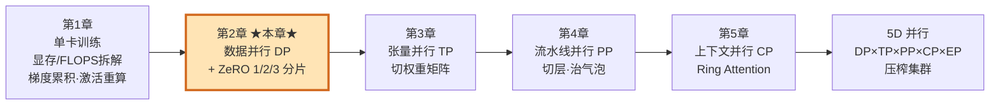

- **第 1 章**回答了"一张卡上，显存花在哪、算力花在哪"——参数、梯度、优化器状态、激活值四块显存，以及前向/反向的 FLOPS。还学了两招省显存的"内功"：**梯度累积 gradient accumulation**（用时间换显存，把一个大 batch 拆成几个小 micro-batch 串行跑）和**激活重算 activation recomputation / checkpointing**（反向时重新算激活，省下存激活的显存）。
- **第 2 章（本章）**是第一个真正意义的**并行维度**：把训练沿"数据样本"这一维切开，分到多张卡上**同时**算。这是所谓 **1D 并行**——后面还会再叠 4 个维度。
- 本章后半段的 **ZeRO**（零冗余优化器）是 DP 的"显存增强版"：在不改变 DP 数学等价性的前提下，把每张卡上重复存的优化器状态/梯度/参数**切片分摊**，让 DP 也能装下单卡放不下的大模型。它和 PyTorch 的 **FSDP** 是同一个东西的两种实现。

> 🔬 **第一性原理：训练就是在显存、计算、通信三者间做权衡。** 这是本书的灵魂，每一种并行都要问四个问题：**切什么？通信什么？何时用？瓶颈在哪？** DP 切的是"数据"，通信的是"梯度"；ZeRO 进一步切"优化器状态/梯度/参数"，代价是多几次集合通信。带着这四个问题往下读。

---

## 3.0 数据并行原理：每卡一份副本 + 不同数据

### 📌 是什么

**数据并行（Data Parallelism, DP）** 的思路一句话：

> 把**整个模型**复制到 N 张 GPU 上（每个副本叫一个 **model instance / 模型副本**），每张卡喂**不同的 micro-batch**（小批数据），N 张卡**并行**地跑前向 + 反向。

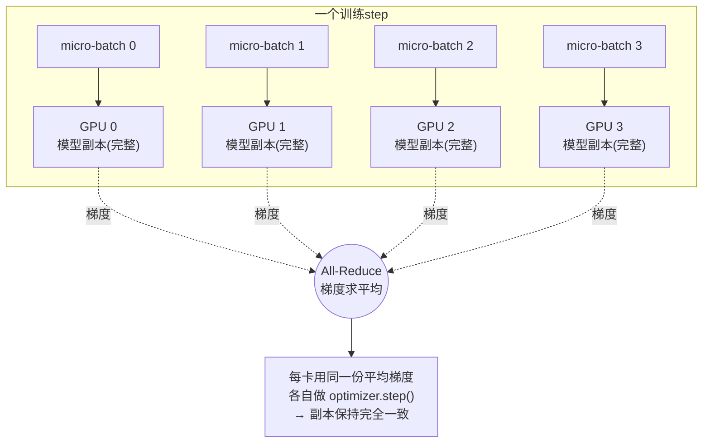

### 📌 为什么需要它

一张 GPU 的吞吐（throughput，单位时间处理的 token 数）是有上限的。要在相同的"墙上时间 wall-clock time"里处理更多数据，最直接的办法就是**多张卡同时干活**。DP 把 batch 切给 N 张卡，理想情况下吞吐近似 ×N。

### 📌 怎么用：关键在"梯度同步"

每张卡喂的是**不同**的 micro-batch，所以反向传播算出来的**梯度也不同**。如果什么都不做，N 个副本各走各的 `optimizer.step()`，几步之后就会变成 N 个**不一样的模型**——这就不是在训练同一个模型了。

为了让 N 个副本始终保持**完全一致**，必须在每个 step 的 `optimizer.step()` **之前**，把 N 份梯度**求平均**，让所有卡拿到**同一份**梯度，再各自更新。这个"求平均"用的就是本书第一个**分布式通信原语（collective communication primitive）**：

> **All-Reduce（全规约）**：把所有卡上的一个张量按某种运算（这里是求和 SUM）规约，再把结果广播回每张卡。所以 All-Reduce 之后，**每张卡都拿到同一份"全卡之和"**。求和之后再除以 N，就是平均梯度。

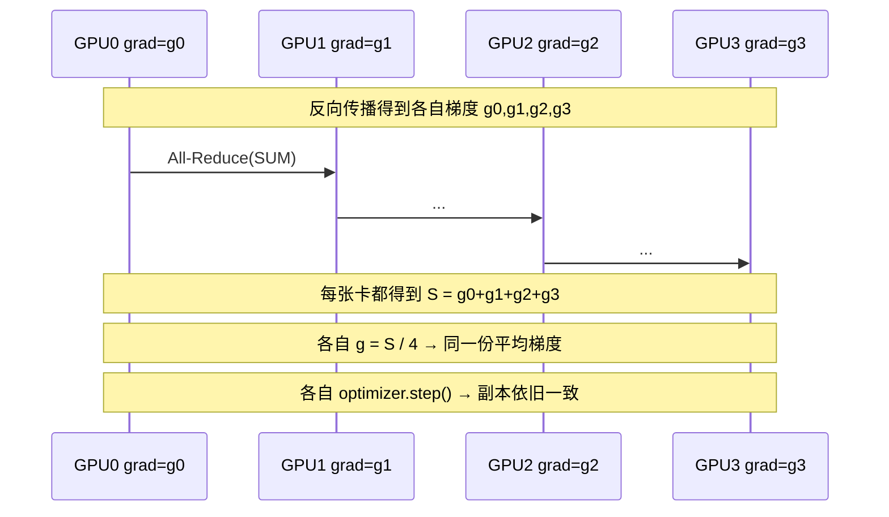

> 💡 **为什么"求和再除 N"等价于"对大 batch 一次性算梯度"？** 因为损失对参数的梯度是**对样本求平均**的线性运算：$\nabla_\theta \mathcal{L} = \frac{1}{B}\sum_{i=1}^{B}\nabla_\theta \ell_i$。把 B 个样本分到 N 张卡、每卡 B/N 个，各卡先算自己那份的和、再 All-Reduce 求总和、再除以 B，结果与单卡跑完整 B 个样本**数学上完全相等**。**这就是 DP 数学等价于单卡大 batch 的根本原因**——DP 不改变优化轨迹，只改变算它的硬件方式。

### 📌 代价是什么

1. **显存代价：每张卡都存了一份完整模型**（参数 + 梯度 + 优化器状态全冗余）。这正是后面 ZeRO 要解决的痛点。
2. **通信代价：每个 step 都要 All-Reduce 整个模型的梯度。** 模型越大、卡越多，这笔通信越贵。

> ⚠️ **常见坑：天真实现把"算"和"通信"串行了。** 最朴素的 DP 会**等整个反向传播跑完、拿到所有梯度后**，才触发一次 All-Reduce。这意味着通信期间所有 GPU **干等着（idle）**——算的时候不通信，通信的时候不算。原书原话：这种"先计算、后通信"的串行步骤是 **A BIG NO-NO**。下面三个优化就是来治这个病的。

---

## 3.0.1 优化一：让梯度同步与反向传播重叠（Overlap）

### 直觉

反向传播是**从最后一层往前**逐层算梯度的。关键观察是：

> **某一层的梯度一算完，就可以立刻开始 All-Reduce 这一层的梯度，根本不用等前面的层。** 因为它们之间没有依赖——后面层的梯度同步，和前面层的梯度计算，是两件可以同时干的事。

```mermaid
flowchart RL
    subgraph 反向传播方向（从右往左）
    direction RL
        L4["Layer N 反向<br/>梯度就绪✓"] --> L3["Layer N-1 反向"] --> L2["Layer N-2 反向"] --> L1["Layer 1 反向"]
    end
    L4 -. "立刻 All-Reduce" .-> C4(("通信通道"))
    L3 -. "立刻 All-Reduce" .-> C4
    L2 -. "立刻 All-Reduce" .-> C4
    Note["计算在往左走，<br/>通信在右边同时进行 → 重叠！"]
```

于是大部分 All-Reduce 通信被**藏在了**反向计算的"身后"，整个 step 的耗时从「反向 + 通信」缩短到约「max(反向, 通信)」。这是本书反复出现的核心技巧——**计算通信重叠（computation-communication overlap）**。

### 怎么实现：PyTorch 的反向钩子（backward hook）

PyTorch 允许给每个参数挂一个**钩子函数**：当这个参数的梯度算好的瞬间，钩子自动触发。我们就在钩子里发起 All-Reduce。下面是原书给出的最小钩子注册（CODE.II）：

```python
def register_backward_hook(self, hook):
    """
    给模型中所有「需要梯度」的参数注册一个反向钩子。
    """
    for p in self.module.parameters():          # 遍历模型每个参数张量 p
        if p.requires_grad is True:             # 只给需要训练(求梯度)的参数挂钩子
            p.register_post_accumulate_grad_hook(hook)
            # ↑ 这是关键 API：当 p 的梯度「累加完成」后回调 hook
            #   "post_accumulate_grad" = 梯度累加进 p.grad 之后才触发，时机最准
```

**逐行讲：**
- `self.module.parameters()`：PyTorch 模型的标准接口，返回所有可学习参数张量（`nn.Parameter`）。
- `p.requires_grad`：布尔标志，标记这个张量是否参与梯度计算。冻结的参数（如某些微调场景）`requires_grad=False`，不需要同步。
- `register_post_accumulate_grad_hook(hook)`：PyTorch 的钩子注册接口。`hook` 会在该参数的 `.grad` **累加完成的那一刻**被调用——正是发起这块梯度 All-Reduce 的最佳时机。

### 完整的天真 DP（带重叠）：Picotron 的 `DataParallelNaive`（CODE.III）

原书直接给出了 HuggingFace 教学库 **Picotron** 的实现。逐段拆解：

```python
class DataParallelNaive(nn.Module):
    """
    天真数据并行。实践中不直接用，但它是理解 DP 工作原理的好起点。
    实现了一个简单的 all-reduce 来跨进程同步梯度，
    以及一个 no_sync 上下文管理器来「临时关闭」梯度同步。
    """
    def __init__(self, module):
        super().__init__()
        self.module = module                       # 被包裹的原始模型
        # 是否在反向时同步梯度。做梯度累积时设为 False（中间步不同步）
        self.require_backward_grad_sync = True
        self.register_backward_hook(self._allreduce_grads)  # 给每个参数挂上「梯度就绪即 all-reduce」的钩子
```

- 它是一个 `nn.Module` 包装器（wrapper）：把真正的模型 `module` 包在里面，对外行为不变，但**偷偷在反向时插入了梯度同步**。这正是 PyTorch 官方 `DistributedDataParallel`（DDP）的设计思路。
- `require_backward_grad_sync`：一个开关。梯度累积时，中间的 micro-batch 反向**不该**同步（白白浪费通信），只有最后一个 micro-batch 才同步。

```python
    def forward(self, *inputs, **kwargs):
        return self.module(*inputs, **kwargs)      # 前向直接转发给内部模型，零修改
```

```python
    def register_backward_hook(self, hook):
        """给所有 requires_grad 的参数注册反向钩子。"""
        for p in self.module.parameters():
            if p.requires_grad is True:
                p.register_hook(hook)              # 梯度就绪时调用 hook(grad)
```

```python
    def _allreduce_grads(self, grad):
        """对梯度做 all-reduce，跨多个进程同步。"""
        # 梯度累积期间不同步，只在最后一次累积时同步
        if self.require_backward_grad_sync:
            dist.all_reduce(
               grad,
               op=dist.ReduceOp.SUM,               # 规约方式：求和
               group=pgm.process_group_manager.cp_dp_group,  # 在「CP+DP」进程组内通信
            )
            grad /= pgm.process_group_manager.cp_dp_world_size  # 除以组内卡数 → 求平均
        return grad
```

**逐行通信原语讲解：**
- `dist.all_reduce(grad, op=SUM, group=...)`：`torch.distributed` 的 All-Reduce 接口。它**原地（in-place）**把 `grad` 替换成"组内所有卡 grad 之和"。
- `group`：通信组（process group）。大规模训练里 GPU 会被划进多个组（DP 组、TP 组、PP 组……），这里用的是 `cp_dp_group`（上下文并行 + 数据并行的联合组）。**只在组内通信**，不波及全集群。
- `grad /= world_size`：求和后除以组内卡数 `world_size`，得到平均梯度。**这一步极易漏，漏了等价于学习率被放大了 N 倍**。

```python
    @contextlib.contextmanager
    def no_sync(self):
        """临时关闭梯度同步的上下文管理器。
        用于梯度累积：多次反向之间不同步，只在最后一次才同步。"""
        self.require_backward_grad_sync = False
        yield
        self.require_backward_grad_sync = True
```

- `no_sync()` 是个 `with` 上下文：进入时关闭同步、退出时恢复。配合梯度累积用——下面优化三会讲。

> 💡 **面试高频：DDP 里 All-Reduce 为什么用 SUM 不用 MEAN？** 因为 NCCL 的 `ReduceOp` 没有内置"求平均"，只有 SUM/MAX/MIN/PROD 等。所以惯例是 **All-Reduce(SUM) 之后再本地除以 world_size**。（也有把 `1/N` 提前乘进每卡梯度再 SUM 的写法，数值上更稳。）

---

## 3.0.2 优化二：梯度分桶（Bucketing）

### 直觉

GPU 和网络都遵循一条规律：**处理少数几个大张量，比处理大量小张量高效得多。** 通信尤其如此——每次集合通信都有固定的"启动开销（latency）"，发 1000 个小张量就要付 1000 次启动开销。

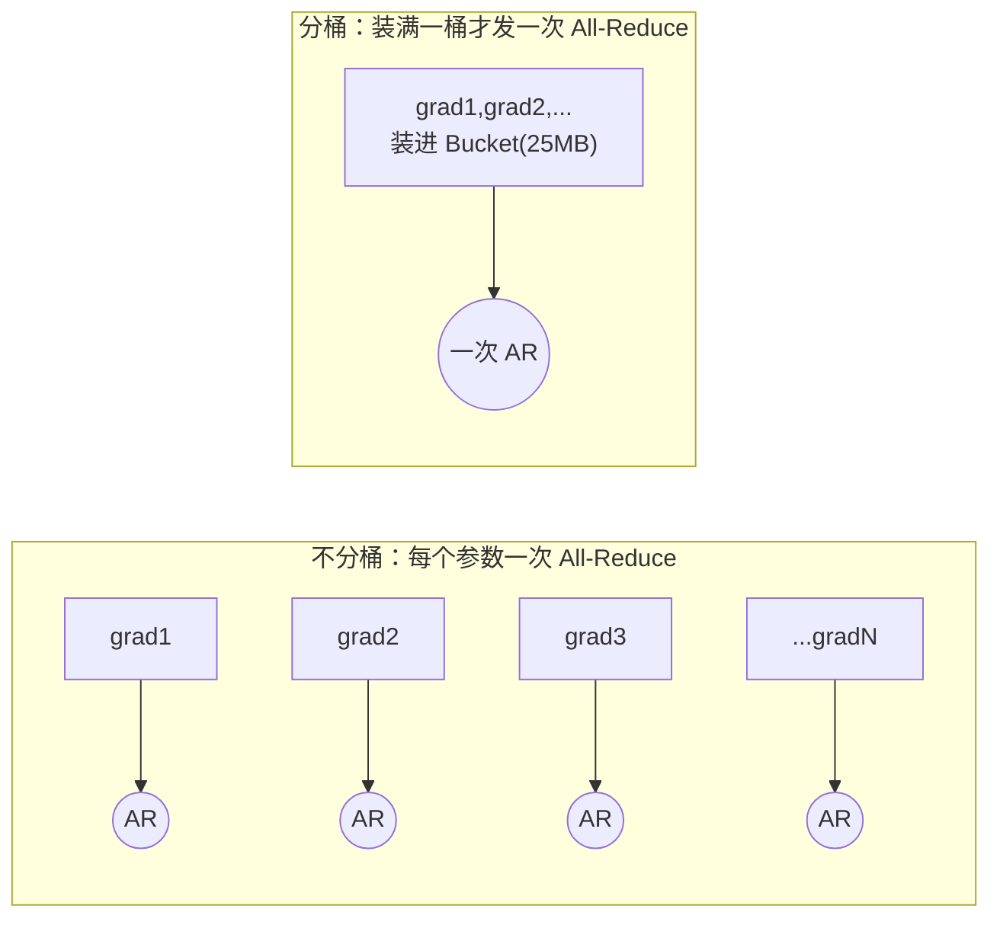

> 比喻：发快递时，与其寄很多个小包裹，不如把东西装进几个大箱子一起寄。**分桶（bucketing）就是把多个参数的梯度凑成一个连续的"桶"，凑满一桶（默认 25 MB）就发一次 All-Reduce**，从而摊薄启动开销。

### 实现：`DataParallelBucket`（CODE.IV，分三部分）

这是 PyTorch 官方 DDP 的真实做法，比天真版复杂不少。看构造函数（PART 1）：

```python
class DataParallelBucket(nn.Module):
    """带梯度分桶的数据并行，降低通信开销。"""
    def __init__(self, module, bucket_cap_mb=25, grad_type=torch.float32):
        super().__init__()
        self.module = module
        self.require_backward_grad_sync = True
        grad_size = 2 if grad_type == torch.bfloat16 else 4   # bf16梯度2字节，fp32梯度4字节
        bucket_size = bucket_cap_mb * 1024 * 1024 // grad_size  # 一个桶能装多少个梯度元素
        self.bucket_manager = BucketManager(                  # 桶管理器：负责把参数分配到各桶
            module.parameters(),
            pgm.process_group_manager.cp_dp_group,
            bucket_size,
            grad_type,
        )
        self.register_backward_hook()
        self._post_backward_callback_set = False              # 「等待同步完成」的回调是否已注册
```

- `bucket_cap_mb=25`：每个桶的容量上限，默认 25 MB（这也是 PyTorch DDP 的默认值）。
- `grad_size`：单个梯度元素的字节数。`bf16`→2 字节，`fp32`→4 字节。
- `bucket_size = 25MB / grad_size`：换算成"一个桶能装多少个梯度元素"。
- `BucketManager`：核心数据结构，把所有参数按顺序塞进若干个桶，并负责"某个桶满了就发 reduce / all-reduce"。

PART 2 的核心是为每个参数挂一个**手写的累加 + 标记钩子**：

```python
        self.grad_accs = []
        for param in self.module.parameters():
            if param.requires_grad:
                param_tmp = param.expand_as(param)             # 扩展一下以拿到 grad_fn
                grad_acc_fn = param_tmp.grad_fn.next_functions[0][0]  # 取到「梯度累加器」节点
                grad_acc_fn.register_hook(
                    self._make_param_hook(param, self.bucket_manager)  # 给累加器挂钩子
                )
                self.grad_accs.append(grad_acc_fn)             # 存住引用，防止被垃圾回收
```

- 这里用了 autograd 计算图的底层技巧：`param.grad_fn.next_functions[0][0]` 拿到的是 PyTorch 内部的 **AccumulateGrad 节点**——梯度真正"落进 `param.grad`"的那个算子。给它挂钩子，时机最精准。
- `self.grad_accs.append(...)`：**必须存住引用**，否则这些累加器函数会被 Python 垃圾回收，钩子就失效了（注释里专门强调了 "prevent them from going out of scope"）。

钩子函数本身（`_make_param_hook`）做三件事：

```python
    def _make_param_hook(self, param, bucket_manager):
        def param_hook(*unused):
            if param.requires_grad:
                assert param.grad is not None
                param.main_grad.add_(param.grad.data)  # 1) 把本次梯度累加进 main_grad(主梯度,常为fp32)
                param.grad = None                      #    释放临时 grad,省显存
                if self.require_backward_grad_sync:    # 只有「需要同步」时才走下面
                    if not self._post_backward_callback_set:
                        Variable._execution_engine.queue_callback(self._post_backward)
                        self._post_backward_callback_set = True   # 2) 注册「反向结束后等同步」的回调(只注册一次)
                    bucket_manager.mark_param_as_ready(param)     # 3) 标记该参数「梯度就绪」,桶满即触发通信
        return param_hook
```

- **第 1 件事：累加进 `main_grad`。** 注意这里手动维护了一份 `main_grad`——因为 **PyTorch 原生不支持"混合精度下的梯度累积"**（注释明确写了原因 #1）。bf16 梯度精度太低，累加多步会丢精度，所以累加到一份高精度（fp32）的 `main_grad` 里。
- **第 2 件事：注册一个反向结束后的回调** `_post_backward`，用 `queue_callback` 排到 autograd 引擎里。这个回调负责"等所有桶的通信都完成"。用 `_post_backward_callback_set` 保证**每个 step 只注册一次**。
- **第 3 件事：`mark_param_as_ready(param)`** 告诉桶管理器"这个参数的梯度好了"。当某个桶里所有参数都就绪，桶管理器立刻对整桶发一次 reduce——**这就是分桶 + 重叠的结合**。

PART 3 是收尾，反向结束后把同步好的梯度拷回 `param.grad`，交给优化器：

```python
    def _post_backward(self):
        """反向结束、优化器 step 之前调用：等所有桶同步完，把梯度拷回 param.grad。"""
        self.bucket_manager.wait()                 # 阻塞,直到所有桶的通信完成
        self._post_backward_callback_set = False
        for p in self.module.parameters():
            if p.requires_grad:
                p.grad = p.main_grad.to(p.dtype)   # 把 fp32 主梯度转回参数 dtype,放进 p.grad
                # 注意:PyTorch 不允许把一种 dtype 的梯度直接赋给另一种 dtype 的张量,故需 .to()
```

> ⚠️ **常见坑：通信缓冲区要连续（contiguous）。** 原书 NOTE 强调：做通信时张量**必须在显存里连续**，否则会产生多余的内存拷贝。为此实践中常**预分配**一块和参数/激活等大的连续缓冲区专门用于通信。好处是快，**坏处是这块缓冲区也算进训练峰值显存**——又一个"用显存换速度"的权衡。

---

## 3.0.3 优化三：与梯度累积（Gradient Accumulation）的配合

回忆第 1 章：**梯度累积**是"先做多次前向+反向、把梯度攒起来，最后才 `optimizer.step()` 一次"。它让我们用小显存模拟大 batch。

当梯度累积**遇上** DP，要小心同步时机：

> ⚠️ 天真做法：**每**做完一次反向就 All-Reduce 一次。但累积 4 步就 All-Reduce 4 次，纯属浪费——**只在最后一步同步一次，效果完全相同**（因为最后那次同步的是累加后的总梯度）。

PyTorch 的解法就是上面见过的 **`model.no_sync()`** 上下文：在不需要同步的那几步反向上关闭同步。

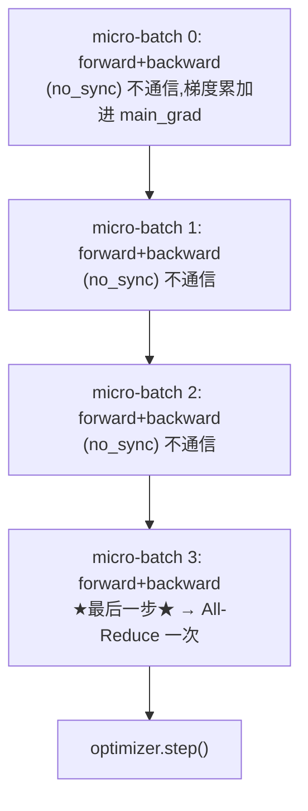

典型写法（伪代码）：

```python
for i, micro_batch in enumerate(grad_acc_batches):
    is_last = (i == len(grad_acc_batches) - 1)
    ctx = model.no_sync() if not is_last else contextlib.nullcontext()
    with ctx:                          # 前 N-1 步关闭同步,最后一步才同步
        loss = model(micro_batch)
        loss.backward()                # 梯度累加进 main_grad,但不 All-Reduce(除最后一步)
optimizer.step()                       # 用累加+同步好的梯度,统一更新一次
optimizer.zero_grad()
```

---

## 3.0.4 进阶：Ring All-Reduce 为什么"几乎与卡数无关"

> 原书把通信原语的细节放进了附录 *A0: Parallel Programming Crash Course*。这里补一段，因为它解释了 DP 的通信底层——也是面试最爱问的。

我们一直说 All-Reduce，但工业界 NCCL 实际用的是 **Ring All-Reduce（环形全规约）**。它把 N 张卡连成一个**逻辑环**，并把 All-Reduce 拆成两个阶段：**Reduce-Scatter（规约-散播）** + **All-Gather（全收集）**。

### 第一阶段：Reduce-Scatter

把每张卡上大小为 $\Psi$ 的梯度切成 N 块。经过 $N-1$ 步，每步每张卡向右邻居发送 $\Psi/N$、从左邻居收 $\Psi/N$ 并就地累加。$N-1$ 步后，**第 k 张卡持有"第 k 块的全卡之和"**。

### 第二阶段：All-Gather

再走 $N-1$ 步，把每张卡手里那块"已规约好的分片"沿环传一圈，让每张卡都集齐全部 N 块。结束时每张卡都拿到完整的"全卡之和"。

### 通信量推导（带宽最优性 bandwidth-optimal）

每张卡在每个阶段发送 $N-1$ 次、每次 $\Psi/N$。两个阶段合计**每张卡发送量**：

$$
V_{\text{ring-allreduce}} = \underbrace{(N-1)\frac{\Psi}{N}}_{\text{reduce-scatter}} + \underbrace{(N-1)\frac{\Psi}{N}}_{\text{all-gather}} = 2\,\frac{N-1}{N}\,\Psi
$$

当 $N$ 很大时，$\frac{N-1}{N}\to 1$，于是：

$$
\boxed{V_{\text{ring-allreduce}} \approx 2\Psi \quad (\text{与卡数 } N \text{ 几乎无关})}
$$

**数值例：** 模型梯度 $\Psi = 8$ GB（80 亿参数、bf16，每参 2 字节 ≈ 16 GB……为方便取梯度 8 GB 演示）。

| 卡数 $N$ | $2\frac{N-1}{N}\Psi$ 每卡发送量 | 相对 $2\Psi=16$ GB |
| :---: | :---: | :---: |
| 2 | $2\cdot\frac12\cdot8=8$ GB | 0.50× |
| 8 | $2\cdot\frac78\cdot8=14$ GB | 0.875× |
| 64 | $2\cdot\frac{63}{64}\cdot8=15.75$ GB | 0.984× |
| 512 | $\approx 15.97$ GB | ≈1.0× |

> 🔬 **为什么这叫"带宽最优"？** 因为不管多少张卡，**每张卡要发送的总字节数都几乎不变（≈2Ψ）**。通信时间 $\approx \frac{2\Psi}{\text{带宽}}$，**不随 N 增长**。对比"每张卡把数据发给一个中心节点求和再广播回来"的朴素方案——那样中心节点要收发 $N\Psi$，成了瓶颈，N 越大越慢。Ring 把负载均摊到环上每条链路，所以是带宽最优的。

> 💡 **面试高频："All-Reduce = Reduce-Scatter + All-Gather"，所以 All-Reduce 通信量是 Reduce-Scatter 的 2 倍。** 记住这句话——它直接解释了后面 ZeRO 各级的通信账：单独一个 Reduce-Scatter 或 All-Gather 的代价是 $\Psi$，一个 All-Reduce 的代价是 $2\Psi$。原书的 NOTE 也点了这句："Reduce-scatter is two times faster than all-reduce!"

> ⚠️ **注意 ring latency（环延迟）的天花板。** 上面只算了带宽项。环还有一个**延迟项**：信号绕环一圈需要时间，和卡数成正比。当 DP 规模到 **512+** 张卡时，通信会开始被 ring latency 主导，**没法再完全和反向重叠**，吞吐就会掉——这正是下一节 FIG.XV 看到的现象，也是该换其他并行维度的信号。

---

## 3.1 重新审视全局批量大小（Global Batch Size）

引入 DP 和梯度累积后，全局批量（global batch size）的公式要更新。设：

- $\text{mbs}$ = micro-batch size，单卡单次前向喂的样本数；
- $\text{grad\_acc}$ = 梯度累积步数；
- $\text{dp}$ = 数据并行度（DP 副本数 / GPU 数）；
- $\text{seq}$ = 序列长度（token 数）。

**以样本计**的全局批量：

$$
\text{bs} = \text{mbs} \times \text{grad\_acc} \times \text{dp}
$$

**以 token 计**的全局批量（论文里常用，记作 $\text{gbst}$, global batch size in tokens）：

$$
\boxed{\text{gbst} = \text{mbs} \times \text{grad\_acc} \times \text{dp} \times \text{seq}}
$$

> 🔬 **关键洞察：给定目标全局批量，可以用 dp 换 grad_acc。** 两者都能放大有效 batch，但本质不同：
> - **dp（数据并行）是真并行**——N 张卡同时算，几乎线性加速；
> - **grad_acc（梯度累积）是串行**——一步步攒，省显存但不加速。
>
> 所以实践中的策略是：**优先把 dp 拉满**（在不超过可用 GPU 数的前提下），**不够再用 grad_acc 补齐**到目标全局批量。

至此我们有了**第一个并行维度**——沿数据样本切分，这就是所谓的 **1D 并行**（后面还会逐步叠加 TP / PP / CP / EP 共 5 个维度）。

---

## 3.2 我们走到哪了：一份 DP 配置的"配方"

原书给出一份设置首个 1D 并行训练的实操配方（recipe）：

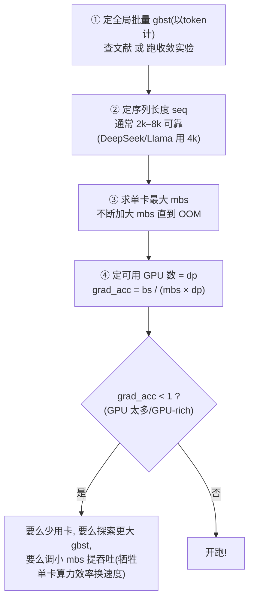

### 数值例（原书的经典例子）

> 目标：训练一个全局批量 $\text{gbst} = 4\text{M}$ token、序列长 $\text{seq} = 4\text{k}$ 的模型。

**第一步，算样本数批量：**

$$
\text{bs} = \frac{\text{gbst}}{\text{seq}} = \frac{4{,}000{,}000}{4{,}096} \approx 1024 \text{ 样本}（取最近的 2 的幂）
$$

**场景 A：有 128 张 GPU，单卡只能放下 mbs = 2。**

$$
\text{grad\_acc} = \frac{\text{bs}}{\text{mbs} \times \text{dp}} = \frac{1024}{2 \times 128} = \frac{1024}{256} = 4
$$

→ 每张卡跑 4 次累积、128 卡并行，凑出 1024 样本 / 4M token 每步。✓

**场景 B：突然有了 512 张 GPU。**

$$
\text{grad\_acc} = \frac{1024}{2 \times 512} = \frac{1024}{1024} = 1
$$

→ 累积步数降到 1，**不再有串行累积**，同样的全局批量，**训练更快**！这就是"用 dp 换 grad_acc"的实战收益。

| 场景 | dp | mbs | grad_acc | 全局批量 | 相对速度 |
| :--- | :---: | :---: | :---: | :---: | :--- |
| A：128 卡 | 128 | 2 | 4 | 1024 样本 | 基准 |
| B：512 卡 | 512 | 2 | 1 | 1024 样本 | **更快**（去掉了 3 步串行累积） |

> 💡 DeepSeek 和 Llama 的主预训练阶段都用 **4k** 序列长度。为什么 2–8k 够用？因为网络上**超过这个长度的文档非常稀少**；长上下文能力通常是在训练**末期**额外掺入长样本、把 seq 拉长得到的。

---

## 3.2.1 DP 的瓶颈：吞吐为什么会"掉头向下"

DP 用"反向计算 + 梯度同步重叠"省下了不少时间，但**这个红利在大规模下会失效**：

> 卡越多（成百上千），**协调它们的开销越来越大**，网络需求超过了重叠能掩盖的范围。结果是**每多加一张卡，系统效率反而下降**。

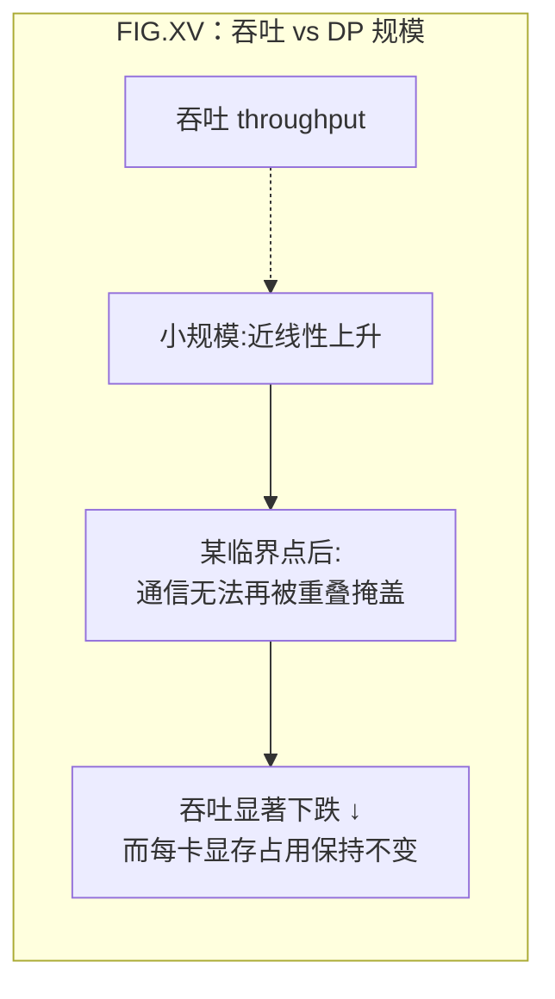

两个关键观察（原书 FIG.XV / FIG.XVI）：

1. **吞吐**：超过某个规模上限后，吞吐**明显下跌**；
2. **每卡显存**：**完全不随 dp 增加而变化**——因为 DP 每张卡都存一份完整模型，加卡只是加副本，单卡显存压力一点没缓解。

这暴露了 DP 的**两个根本局限**：

- **局限一（显存）**：DP 要求**至少一份完整模型能装进单卡**。大模型（哪怕开了激活重算）根本塞不下单卡——FIG.XVI 显示，模型一大，单卡就 OOM。
- **局限二（通信）**：超过一定规模，DP 通信开销吃掉收益。

> 怎么破？原书指出两条路：
> - **并行（parallelism）**：张量并行 TP、上下文并行 CP、专家并行 EP、流水线并行 PP——把模型本身切开（后续章节）；
> - **分片（sharding）**：DeepSpeed **ZeRO** 或 PyTorch **FSDP**——把"重复存储"的张量切片分摊。
>
> 这两条路**正交**，可以叠加。其中**分片范式和 DP 关系最近**，所以我们先讲 ZeRO。

> 💡 **快速估算模型参数显存：参数量 ×2（字节）。** 例：70B → 140 GB（= 133 GiB）。这只是 bf16 参数那一块，还没算梯度和优化器状态。一张 H100 才 80 GB——所以 70B 单卡连参数都放不下，必须分片或切模型。

---

## 3.3 零冗余优化器 ZeRO（Zero Redundancy Optimizer）

### 为什么 DDP 存了一堆冗余

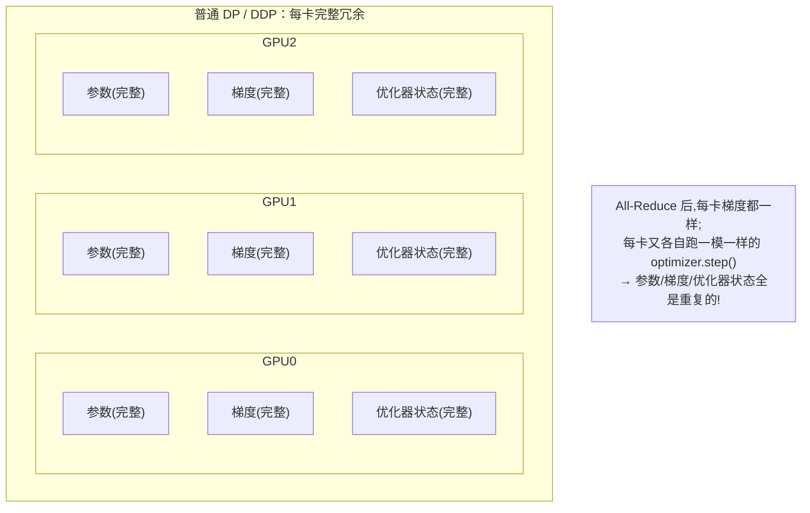

在普通 DP 里：All-Reduce 之后，**每张卡的梯度都相同**，然后每张卡**各自跑一模一样的 `optimizer.step()`**，得到一模一样的参数。也就是说——**参数、梯度、优化器状态这三样，在 N 张卡上存了 N 份完全相同的拷贝**。这就是"冗余（redundancy）"。

**ZeRO 的核心思想**：把优化器状态、梯度、参数**沿 DP 维度切片（partition）**，每张卡只存 $1/N_d$ 的一片；需要完整张量时，临时用集合通信**重建**出来。这样：

- **显存**：除以 $N_d$（DP 度）；
- **代价**：多一些 DP 卡间通信，能否被重叠看情况。

> ⚠️ **注意：激活值（activations）不能被 ZeRO 分片！** 因为每个 DP 副本喂的是**不同**的 micro-batch，所以**每张卡的激活本来就不一样、不是重复的**，没有冗余可省。激活显存只能靠激活重算 + 梯度累积来压（第 1 章）。这是 ZeRO 的一个重要边界。

ZeRO 分三级（沿 DP 轴切的东西逐级增多）：

| 级别 | 切分的内容 | 缩写记忆 |
| :--- | :--- | :--- |
| **ZeRO-1** | 优化器状态 optimizer states | $P_{os}$ |
| **ZeRO-2** | 优化器状态 + 梯度 gradients | $P_{os+g}$ |
| **ZeRO-3** | 优化器状态 + 梯度 + 参数 parameters | $P_{os+g+p}$（即 FSDP） |

---

## 3.3.1 显存账：先把基线算清楚

设模型参数量为 $\Psi$（原书沿用 ZeRO 论文记号 $\Psi$）。**混合精度训练（mixed precision）+ Adam 优化器**下，每张卡要存的东西及其字节数（以"每参数字节"计）：

| 存储项 | 精度 | 每参数字节 | 记号 |
| :--- | :--- | :---: | :---: |
| 模型参数 | 半精度 BF16/FP16 | 2 | $2\Psi$ |
| 模型梯度 | 半精度 BF16/FP16 | 2 | $2\Psi$ |
| FP32 主参数副本（master weights） | FP32 | 4 | 含在 $k\Psi$ |
| Adam 一阶动量 $m$ | FP32 | 4 | 含在 $k\Psi$ |
| Adam 二阶动量 $v$ | FP32 | 4 | 含在 $k\Psi$ |
| （可选）FP32 梯度累积副本 | FP32 | 4 | $4\Psi$ |

把"FP32 主参数 + 动量 + 方差"打包成**优化器状态**，其每参数字节数记作 $k$：

$$
k = \underbrace{4}_{\text{fp32 master}} + \underbrace{4}_{m} + \underbrace{4}_{v} = 12 \quad(\text{Adam})
$$

**不开 FP32 梯度累积**时，每参数总字节：

$$
\underbrace{2}_{\text{bf16 参数}} + \underbrace{2}_{\text{bf16 梯度}} + \underbrace{k}_{\text{优化器状态}} = 2 + 2 + 12 = 16 \;\Rightarrow\; \boxed{16\Psi}
$$

**开 FP32 梯度累积**时再加 $4\Psi$：$2+2+4+12 = 20 \Rightarrow 20\Psi$。下面为简单起见用 **16Ψ** 这条基线。

> 🔬 **第一性原理：为什么是 16 倍？** 一个参数本体（bf16）只占 2 字节，但训练它要"伺候"它的一整套：一份高精度备份（4）、它的梯度（2）、它的两个动量（4+4）。**真正占显存的不是模型本身，而是训练它需要的"脚手架"——脚手架是模型的 7 倍（14Ψ vs 2Ψ）。** ZeRO 干的就是把这堆脚手架切开分摊。

ZeRO 的本质就是把上面这些项**沿 DP 维度切成 $N_d$ 片**，每卡存 $1/N_d$，需要时重建。下面逐级看省多少。

---

## 3.3.2 ZeRO-1：切分优化器状态（$P_{os}$）

### 切什么、省多少

在 ZeRO-1 中，**优化器状态被切成 $N_d$ 等份**，每张卡只保管 $1/N_d$ 的优化器状态，`optimizer.step()` 时也只更新自己那 $1/N_d$ 的 FP32 权重。参数（2Ψ）和梯度（2Ψ）仍然每卡完整。每卡显存：

$$
\boxed{M_{\text{ZeRO-1}} = 2\Psi + 2\Psi + \frac{k\Psi}{N_d} = 4\Psi + \frac{12\Psi}{N_d}}
$$

$N_d \to \infty$ 时趋近 $4\Psi$（相比基线 16Ψ，**最多省到 1/4**）。

### 一个 step 的完整动作序列

但有个新问题：**前向需要完整参数**，而每卡只更新了 $1/N_d$ 的参数。所以 `optimizer.step()` 之后必须补一次 **All-Gather**，把各卡更新好的参数分片拼回完整参数。完整流程：

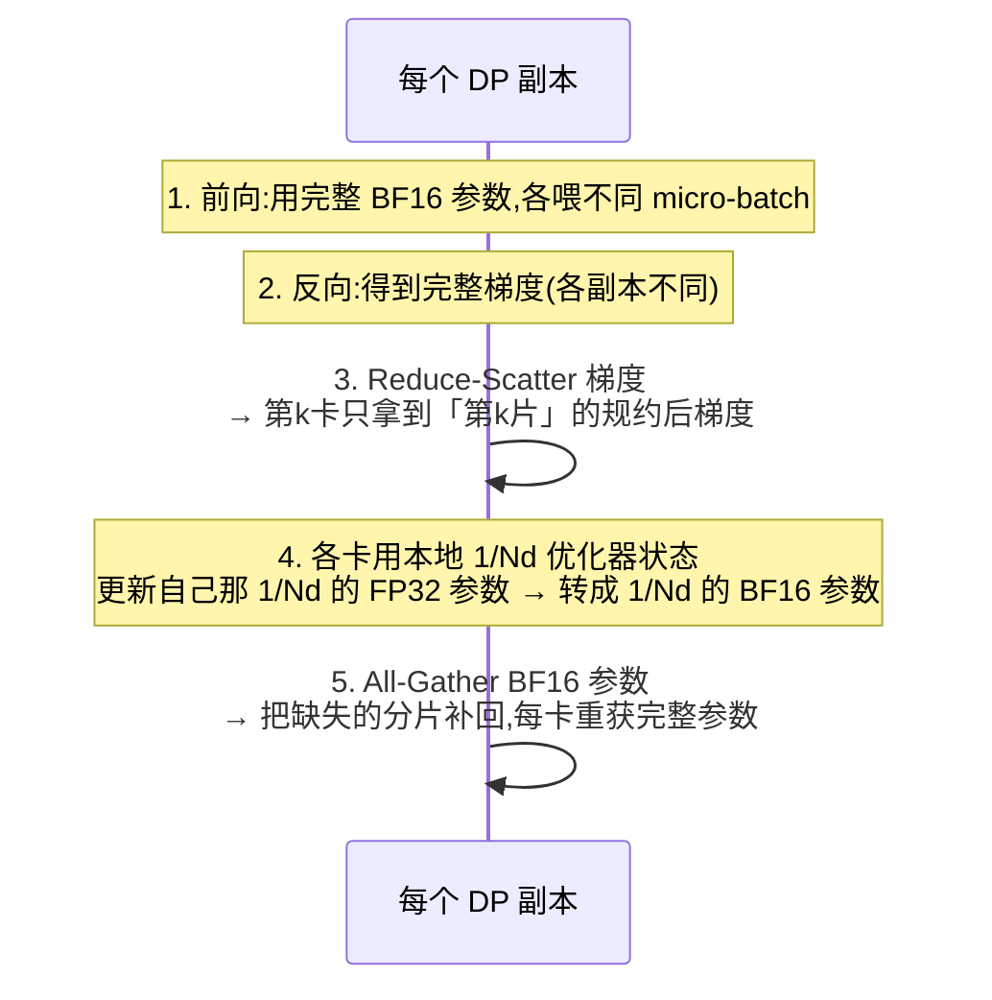

**关键变化（对比普通 DP）：**
- 普通 DP 的"梯度 All-Reduce" → 拆成了 **Reduce-Scatter**（因为每卡只需要自己那片梯度去更新自己那片优化器状态）；
- 末尾**新增**一个 **All-Gather**（普通 DP 没有），把更新后的参数分片拼回完整。

### 通信账

回忆 "All-Reduce = Reduce-Scatter + All-Gather = 2Ψ"。ZeRO-1：

$$
\underbrace{\Psi}_{\text{reduce-scatter 梯度}} + \underbrace{\Psi}_{\text{all-gather 参数}} = 2\Psi
$$

**和普通 DP 的总通信量一样（都是 2Ψ）**——只是把一个 All-Reduce 换成了"Reduce-Scatter + All-Gather"两步。ZeRO-1 几乎是"白送的显存"。

新增的 All-Gather 也能重叠，有两种策略：
- **优化器 step 期间重叠**：第一片参数一更新完就发它的 All-Gather，与后续片的更新重叠；
- **前向期间重叠**：把每层参数的 All-Gather 与该层前向计算重叠。

---

## 3.3.3 ZeRO-2：再切分梯度（$P_{os+g}$）

### 直觉

ZeRO-1 里每卡只更新 $1/N_d$ 的优化器状态，那它**其实只需要对应那 $1/N_d$ 的梯度**——剩下的梯度存着纯属浪费。于是 ZeRO-2 顺手把**梯度也切了**：

> 反向时不再对完整梯度做（虚拟的）All-Reduce，而是直接 **Reduce-Scatter**——通信的同时就把不需要的梯度分片**当场释放**，只在显存里留下自己要用的那 $1/N_d$ 片。

每卡显存：

$$
\boxed{M_{\text{ZeRO-2}} = 2\Psi + \frac{2\Psi + k\Psi}{N_d} = 2\Psi + \frac{14\Psi}{N_d}}
$$

$N_d$ 增大时趋近 $2\Psi$——**相比基线 16Ψ，最多省到 1/8（8× less memory）**。原书原话："use up to 8× less memory than the baseline."

### 通信账：和 ZeRO-1 完全相同

ZeRO-2 的通信流程和 ZeRO-1 一样：一个 Reduce-Scatter（梯度）+ 一个 All-Gather（参数）= **2Ψ**。区别仅在于 ZeRO-2 是"边通信边释放梯度显存"。所以：

> **ZeRO-2 的通信量等价于普通 DP（2Ψ），却比 ZeRO-1 更省显存。** 原书 NOTE 直接给结论："ZeRO-2 over ZeRO-1 几乎没有额外开销，只是实现更复杂——所以 **ZeRO-2 通常是比 ZeRO-1 更好的选择**。" 实践中很少单用 ZeRO-1。

> 💡 FP32 梯度累积场景下：只需保留 $1/N_d$ 份 FP32 梯度，用来累加从 Reduce-Scatter 来的 bf16 梯度；optimizer step 时用这 $1/N_d$ 份 FP32 梯度更新本地那片优化器状态。

---

## 3.3.4 ZeRO-3：再切分参数（$P_{os+g+p}$，即 FSDP）

### 切什么

ZeRO-3 把最后一块也切了——**参数本身也沿 DP 维度分片**。现在每张卡平时只存 $1/N_d$ 的参数、$1/N_d$ 的梯度、$1/N_d$ 的优化器状态。每卡显存达到最终形态：

$$
\boxed{M_{\text{ZeRO-3}} = \frac{2\Psi + 2\Psi + k\Psi}{N_d} = \frac{16\Psi}{N_d}}
$$

**理论上：只要 DP 度 $N_d$ 够大，模型相关显存可以无限压低！** （但激活显存压不了，仍需激活重算 + 梯度累积。）

### 怎么做前向/反向：按需 All-Gather（on-demand）

参数都被切散了，怎么算前向？答案很朴素——**用到哪层，就临时把那层参数 All-Gather 拼完整；用完立刻丢掉（flush），释放显存。**

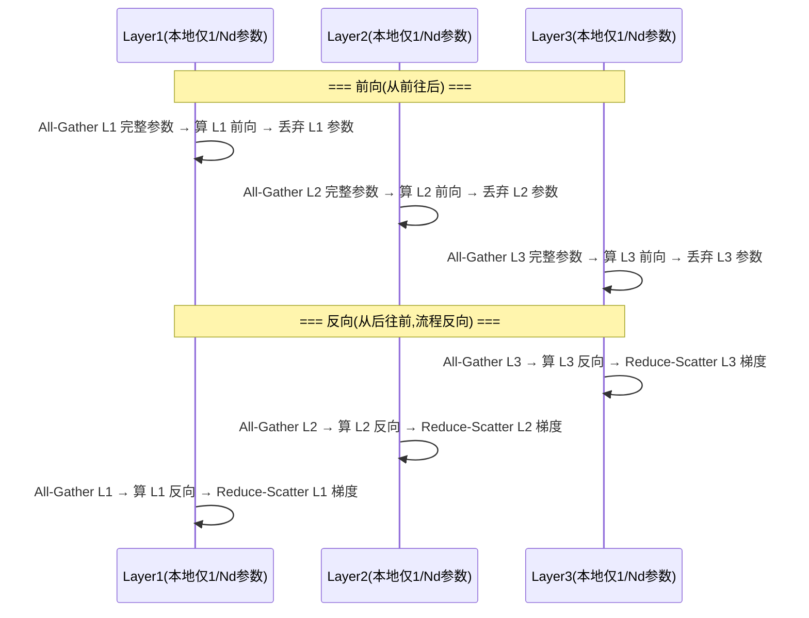

### 通信账：3Ψ（比 ZeRO-2 多 50%）

ZeRO-3 的代价是：整个前向 + 反向要**持续不断地 All-Gather**。逐项算：

$$
\underbrace{\Psi}_{\substack{\text{前向 All-Gather 参数}\\(\text{用完就丢})}} + \underbrace{\Psi}_{\substack{\text{反向 All-Gather 参数}\\(\text{因为前向丢了,要重拿)}}} + \underbrace{\Psi}_{\text{Reduce-Scatter 梯度}} = \boxed{3\Psi}
$$

- 前向时按需 All-Gather 参数：通信税 $\Psi$；
- 因为前向用完就把参数丢了，**反向时还得再 All-Gather 一次**：又 $\Psi$；
- 梯度的 Reduce-Scatter（和 ZeRO-2 一样）：$\Psi$。

合计 **3Ψ**，对比 ZeRO-2 的 **2Ψ**——**ZeRO-3 多了 50% 通信量**。这就是"用参数也分片换更省显存"的代价。同时，每个 step 多出 $\approx$（层数相关的）大量 All-Gather，每个都带一点固定启动延迟。

### 救星：预取（Prefetching）把通信藏起来

3Ψ 听着吓人，但实际**没那么糟**，因为可以**预取**：

> **前向**算第 $n$ 层时，**同时**去 All-Gather 第 $n+1$ 层的参数；**反向**算第 $n$ 层时，同时 All-Gather 第 $n-1$ 层的参数。这样通信被藏在计算身后。

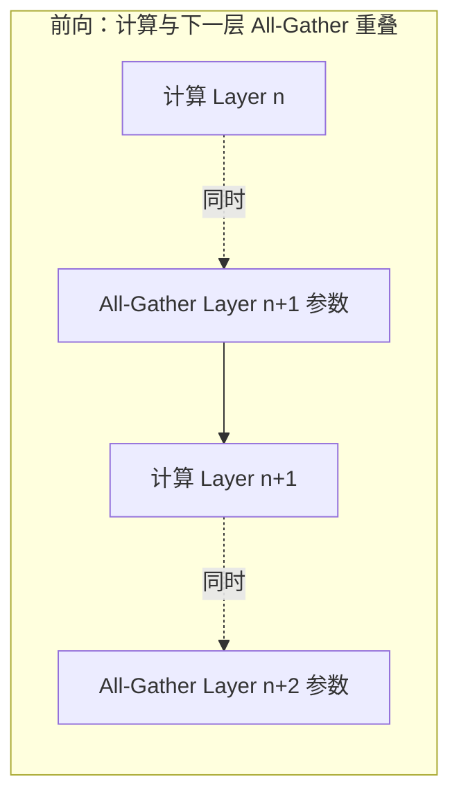

> ⚠️ 预取重叠**只在 DP 不太大时有效**。经验法则：**DP 度不要超过 512**。超了之后通信被 ring latency 主导，藏不住，吞吐就掉——又回到 3.2.1 的老问题，该上别的并行维度了。

---

## 3.3.5 ZeRO-3 与 FSDP 是什么关系

> **它们是同一个东西的两种实现。** ZeRO-3 是 DeepSpeed 的叫法；**FSDP（Fully Sharded Data Parallelism，全分片数据并行）是 PyTorch 原生的实现**。原书声明："本书统一叫 ZeRO-3，但你看到它时可以想成 FSDP。"

| 维度 | DeepSpeed ZeRO-3 | PyTorch FSDP |
| :--- | :--- | :--- |
| 出身 | 微软 DeepSpeed | PyTorch 官方（`torch.distributed.fsdp`） |
| 分片粒度 | 参数/梯度/优化器状态全分片 | 同上；按 **FSDP Unit**（包裹单元）组织 |
| 演进 | ZeRO-1/2/3 + Offload/Infinity | FSDP1 → **FSDP2**（per-parameter 分片，更灵活） |
| 本书态度 | 统一称 ZeRO-3 | 见到 FSDP 即按 ZeRO-3 理解 |

> 💡 **实战建议（原书 NOTE）：ZeRO-1/2 的高效实现很费劲**（要精细玩 hook + bucketing），实践中**直接用 PyTorch 原生的 ZeRO-3 / FSDP，并把 FSDPUnit 设成整个模型**，就能近似得到 ZeRO 各级的好处。也就是说，工程上 FSDP 是默认首选。

---

## 3.3.6 三级 ZeRO 全景对比（显存 + 通信）

### 显存公式汇总

| 方案 | 每卡显存公式 | $N_d\to\infty$ 极限 | 相对基线最大压缩 |
| :--- | :--- | :---: | :---: |
| 基线 DP | $2\Psi + 2\Psi + k\Psi = 16\Psi$ | $16\Psi$ | 1× |
| **ZeRO-1** $P_{os}$ | $2\Psi + 2\Psi + \dfrac{k\Psi}{N_d}$ | $4\Psi$ | **4×** |
| **ZeRO-2** $P_{os+g}$ | $2\Psi + \dfrac{2\Psi + k\Psi}{N_d}$ | $2\Psi$ | **8×** |
| **ZeRO-3** $P_{os+g+p}$ | $\dfrac{2\Psi + 2\Psi + k\Psi}{N_d}$ | $\to 0$ | **$N_d$×（无上限）** |

（$k=12$ for Adam）

### 通信公式汇总

| 方案 | 梯度通信 | 参数通信 | 单 step 总通信量 | vs 基线 |
| :--- | :--- | :--- | :---: | :---: |
| 基线 DP | All-Reduce $2\Psi$ | — | $2\Psi$ | 1× |
| ZeRO-1 | Reduce-Scatter $\Psi$ | All-Gather $\Psi$ | $2\Psi$ | 1× |
| ZeRO-2 | Reduce-Scatter $\Psi$ | All-Gather $\Psi$ | $2\Psi$ | 1× |
| **ZeRO-3** | Reduce-Scatter $\Psi$ | All-Gather **×2**（前向+反向）$2\Psi$ | $\mathbf{3\Psi}$ | **1.5×** |

> 🔬 **一图记牢权衡：ZeRO-1→2 是"白捡显存"（显存更省、通信不变）；ZeRO-2→3 是"花通信买显存"（显存可压到 0，通信 +50%）。**

### 数值例：8B 模型在不同 ZeRO 级别下的每卡显存（FIG.XXV）

取 $\Psi = 8\text{B}$，则 $1\Psi$ 单位 $= 8\text{B}\times 1\text{字节} = 8\text{ GB}$，基线 $16\Psi = 128\text{ GB}$（注意：不含激活）。

| $N_d$（DP 度） | 基线 16Ψ | ZeRO-1 $4\Psi+\frac{12\Psi}{N_d}$ | ZeRO-2 $2\Psi+\frac{14\Psi}{N_d}$ | ZeRO-3 $\frac{16\Psi}{N_d}$ |
| :---: | :---: | :---: | :---: | :---: |
| 1 | 128 GB | 128 GB | 128 GB | 128 GB |
| 8 | 128 GB | $32+12=\mathbf{44}$ GB | $16+14=\mathbf{30}$ GB | $\mathbf{16}$ GB |
| 64 | 128 GB | $32+1.5=\mathbf{33.5}$ GB | $16+1.75=\mathbf{17.75}$ GB | $\mathbf{2}$ GB |
| 128 | 128 GB | $32+0.75=\mathbf{32.75}$ GB | $16+0.875=\mathbf{16.9}$ GB | $\mathbf{1}$ GB |

> **怎么读这张表：**
> - 基线一列**永远 128 GB**——加多少卡，单卡显存都不降（DP 的死穴）。一张 H100（80 GB）连一份都装不下。
> - ZeRO-1 把优化器状态切了，单卡立刻从 128 → 44 GB（8 卡），**已经能塞进 80 GB 的卡了**。
> - ZeRO-3 在 64 卡时单卡只剩 **2 GB**（模型相关部分）——剩下的显存全留给激活和大 batch。
>
> ⚠️ 再强调一次：**这些数字都不含激活显存。** 实际单卡占用 = ZeRO 后的模型显存 + 激活显存。激活随 seq、batch 增长，ZeRO 管不着，得靠激活重算 + 梯度累积，必要时上**上下文并行 CP**（第 5 章）。

---

## 3.4 何时用 DP / ZeRO，瓶颈在哪

### 选型决策树

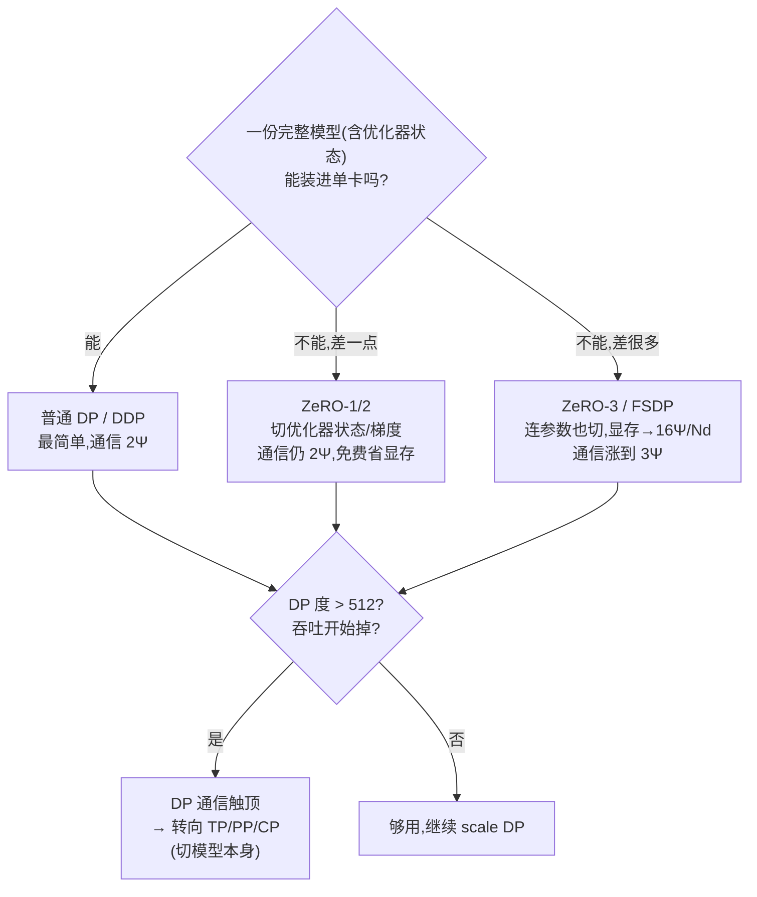

### 什么时候用

| 情况 | 推荐 |
| :--- | :--- |
| 模型小、单卡放得下、想加速 | **普通 DP/DDP** |
| 单卡差一点放不下（优化器状态太占） | **ZeRO-1 → ZeRO-2**（通信不变，免费省显存；优先 ZeRO-2） |
| 单卡差很多 / 想训单卡放不下的大模型 | **ZeRO-3 / FSDP**（显存随 $N_d$ 线性降，通信 +50%） |
| DP 度逼近 512、吞吐掉头 | 该叠 **TP / PP / CP** 了 |
| 激活显存爆（长序列、大 batch） | ZeRO 救不了 → 激活重算 + 梯度累积 + **CP** |

### DP/ZeRO 的根本瓶颈

1. **激活显存压不动**：ZeRO 只能切参数/梯度/优化器状态这三样**冗余**的东西；激活在各卡本就不同，不冗余、切不了。长序列大 batch 时激活会成为新瓶颈。
2. **必须"一层装得下单卡"**：ZeRO-3 能把整模型的参数摊薄，但**单层的前向计算仍要把那层完整参数 All-Gather 到一张卡上**。如果**单独一层都塞不进单卡**，ZeRO 也无能为力——这时必须**张量并行 TP**，把单层的权重矩阵也切开。
3. **通信触顶**：DP 度过大（>512）时 ring latency 主导，重叠失效，吞吐下跌。

> 这正是下一章 **张量并行（Tensor Parallelism, TP）** 登场的理由。原书的钩子很妙：
>
> > 和 ZeRO-3 依赖"大量参数通信"不同，TP 把**参数、梯度、优化器状态，乃至激活**全部切到不同设备上，**却不需要在 GPU 间通信模型参数**。What？这怎么可能？下一章揭晓。

---

## 📌 本章小结

```mermaid
mindmap
  root((第2章<br/>DP + ZeRO))
    数据并行 DP
      每卡完整副本+不同数据
      反向后 All-Reduce 求平均梯度
      数学等价单卡大batch
      三优化
        反向钩子重叠通信
        梯度分桶25MB
        no_sync配合梯度累积
    全局批量
      gbst=mbs×grad_acc×dp×seq
      优先拉满dp再补grad_acc
    Ring All-Reduce
      量=2(N-1)/N·Ψ≈2Ψ
      与卡数几乎无关→带宽最优
      512+受ring latency限
    ZeRO 零冗余
      基线16Ψ=2+2+12
      Z1切优化器→4Ψ
      Z2加切梯度→2Ψ(8×)
      Z3加切参数→16Ψ/Nd(=FSDP)
      通信 Z1/Z2=2Ψ Z3=3Ψ
      激活切不了
    瓶颈
      激活压不动
      单层须装下单卡
      DP>512通信触顶
```

**七句话带走本章：**

1. **DP = 复制模型 + 切数据 + 反向后 All-Reduce 梯度求平均**，数学上等价于单卡跑大 batch，只是用多卡并行算。
2. **三个工程优化**让 DP 高效：① 反向钩子让梯度同步与反向计算**重叠**；② **分桶**（默认 25 MB）摊薄通信启动开销；③ **`no_sync`** 让梯度累积只在最后一步同步。
3. **全局批量** $\text{gbst}=\text{mbs}\times\text{grad\_acc}\times\text{dp}\times\text{seq}$；实践中**优先把 dp 拉满**，不够再用 grad_acc 补。
4. **Ring All-Reduce 通信量 $\approx 2\Psi$，几乎与卡数无关**（带宽最优）；但 DP > 512 时 ring latency 让重叠失效，吞吐掉头。
5. **DP 的死穴是冗余**：N 张卡存 N 份相同的参数/梯度/优化器状态，且加卡不降单卡显存。
6. **ZeRO 沿 DP 维度切片消冗余**：Z1 切优化器状态（→4Ψ）、Z2 加切梯度（→2Ψ，省 8×，通信仍 2Ψ）、Z3 加切参数（→16Ψ/N_d，通信涨到 3Ψ）；**ZeRO-3 = PyTorch FSDP**。
7. **ZeRO 的边界**：切不了激活、要求单层装得下单卡、DP 过大通信触顶——这三条边界把我们逼向**张量并行 TP**（第 3 章）。

**核心数字速查表：**

| 量 | 公式/数值 |
| :--- | :--- |
| 混合精度 + Adam 每参数显存 | $16\Psi$（$2+2+12$），开 FP32 grad accum 则 $20\Psi$ |
| Adam 优化器状态系数 $k$ | $12$（fp32 master 4 + 动量 4 + 方差 4） |
| Ring All-Reduce 每卡通信量 | $2\frac{N-1}{N}\Psi \approx 2\Psi$ |
| ZeRO-1/2 单 step 通信量 | $2\Psi$（Reduce-Scatter Ψ + All-Gather Ψ） |
| ZeRO-3 单 step 通信量 | $3\Psi$（前向 AG Ψ + 反向 AG Ψ + RS Ψ） |
| 参数显存快算 | 参数量 × 2 字节（70B → 140 GB） |
| 预取重叠的 DP 经验上限 | 512 |

---

## 🔗 延伸

- **上一章**：`./01_*.md` — 单卡训练的显存四块（参数/梯度/优化器/激活）与 FLOPS，梯度累积、激活重算（本章的两个前置内功）。
- **下一章**：`./03_张量并行_TP_*.md` — 张量并行，切单层权重矩阵，连激活也切、且不通信参数；解决"单层装不下单卡"。
- **配套动手项目**：
  - `../projects/02_data_parallel_zero/` — 从零实现带分桶 + 重叠的 DP，并复刻 ZeRO-1/2/3 的分片逻辑（对照本章 Picotron 代码）。
  - `../projects/06_collectives_from_scratch/` — 手写 All-Reduce / Reduce-Scatter / All-Gather / Ring 算法，亲手验证"通信量 ≈ 2Ψ 与卡数无关"。
  - `../projects/01_memory_flops_calculator/` — 输入参数量/优化器/精度/$N_d$，自动算出各 ZeRO 级别的每卡显存（复刻本章 8B 数值表）。
- **附录**：`../appendix/` — *A0 并行编程速成（Parallel Programming Crash Course）*：broadcast / gather / all-reduce / reduce-scatter / all-gather 原语与 Ring 算法详解。
- **原始文献**：
  - S. Rajbhandari, J. Rasley, O. Ruwase, Y. He, *"ZeRO: Memory Optimizations Toward Training Trillion Parameter Models"*, arXiv 2020 — ZeRO 论文，本章 16Ψ / k=12 记号与三级分片的源头。
  - Picotron DP 实现：`huggingface/picotron/blob/main/picotron/data_parallel/data_parallel.py`（本章 CODE.III/IV 出处）。
  - PyTorch DDP 论文：arXiv 2006.15704（分桶 + 重叠的工程细节）。
  - Simon Boehm, *"Data-Parallel Training"*：`siboehm.com/articles/22/data-parallel-training`（DP 通信深入好文）。
  - FSDP1 vs FSDP2 实现解析：`christianjmills.com`（PyTorch 原生 ZeRO-3 的演进）。

> 下一章预告：**如果一层都塞不进单卡怎么办？** 张量并行 TP 会告诉你怎么把一个 $W$ 矩阵乘法 $Y = XW$ 沿行/列切到多张卡上，让每张卡只算一片——而且代价低到"不通信参数"。我们下章见。
