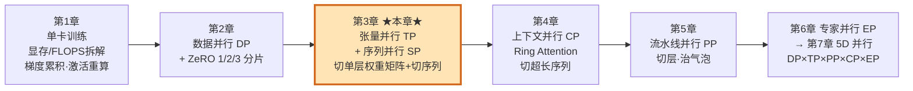
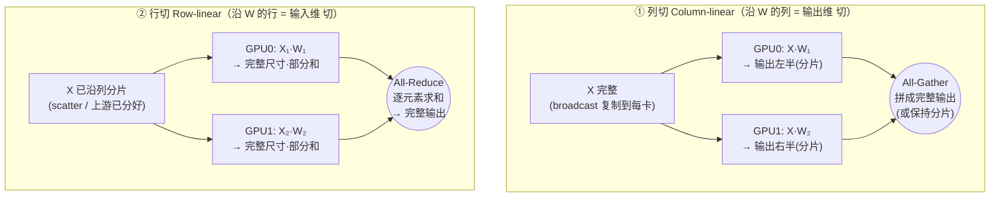
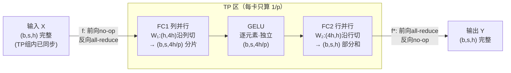
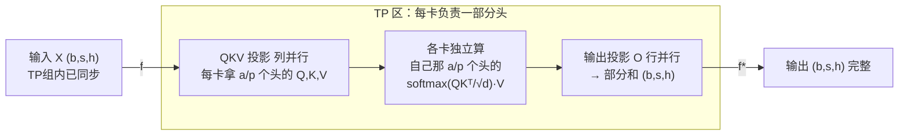
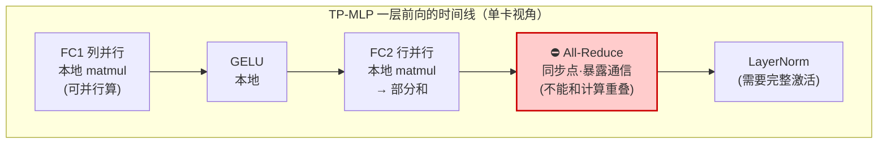
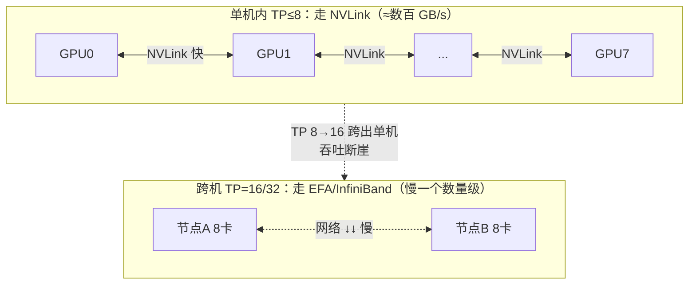
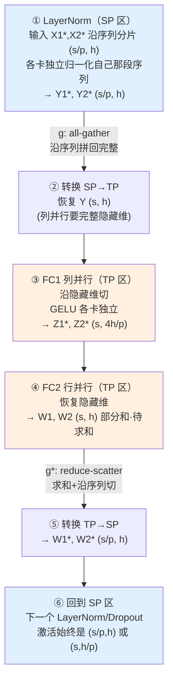
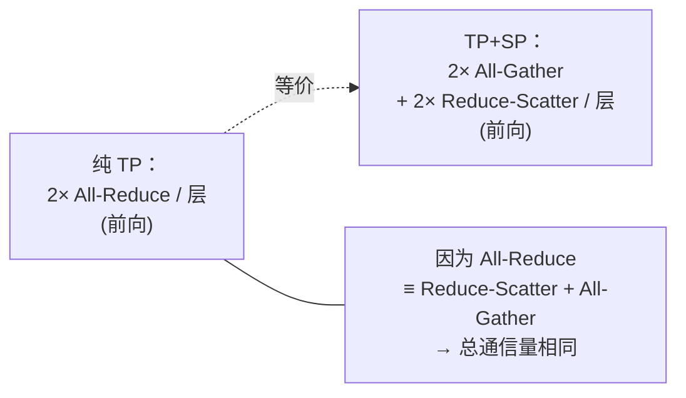
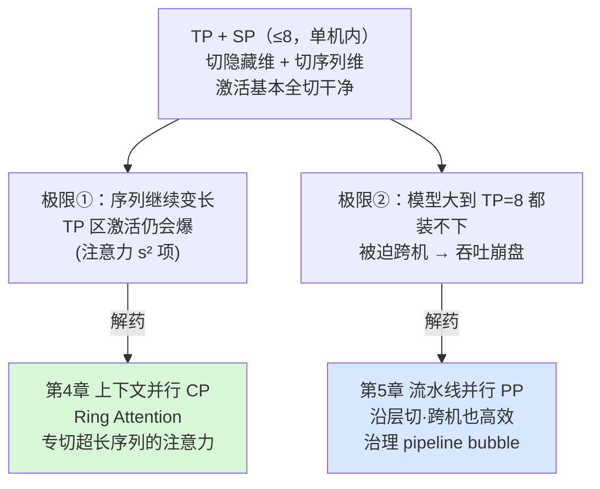

# 第 3 章 张量并行 Tensor Parallelism 与序列并行 Sequence Parallelism：把一个矩阵乘法切到多卡

> 对应原书《The Ultra-Scale Playbook: Training LLMs on GPU Clusters》(HuggingFace, Nouamane Tazi / Ferdinand Mom / Haojun Zhao 等) 第 4 章 *Tensor Parallelism*，PDF 第 71–96 页（含 4.1 Tensor parallelism in a transformer block / 4.2 Sequence parallelism）。
>
> 本章解决上一章 DP + ZeRO 留下的两个死穴：**激活显存压不动**、**单层装不下单卡**。读完你应该能回答：**一个 $Y=XW$ 怎么切到 8 张卡上、为什么一个 transformer block 只需要 2 次 AllReduce、为什么 TP 通信重到只能在单机 NVLink 内做、序列并行 SP 又怎么把最后那点激活也榨干。**

---

## 🗺️ 本章地图：我们走到哪了

整本 Playbook 是一条"压榨 GPU"的攀登路线，从一张卡一路爬到上万张卡：



- **第 1 章**把单卡显存拆成四块：**参数 parameters、梯度 gradients、优化器状态 optimizer states、激活值 activations**，并讲了两招省显存内功——**梯度累积 gradient accumulation**（用时间换显存）和**激活重算 activation recomputation**（反向时重算激活）。
- **第 2 章**用 **数据并行 DP** 沿"样本维"切，再用 **ZeRO（零冗余优化器）** 沿 DP 维把参数/梯度/优化器状态切片消冗余。但 ZeRO 撞到三道墙：① **激活显存切不了**（ZeRO 只切参数/梯度/优化器状态）；② **单层必须装得下单卡**；③ DP 太大通信触顶。
- **第 3 章（本章）**登场的 **张量并行 TP** 正面解决前两道墙：它把单个权重矩阵 $W$ 沿行/列切到多卡，**连激活也一起切**，而且——这是它最神奇的地方——**计算前不需要把参数 gather 回来**。后半段的 **序列并行 SP** 是 TP 的"天作之合"补丁，把 TP 管不到的 LayerNorm/Dropout 沿**序列维**切，把最后一点激活显存也榨干。

> 🔬 **第一性原理（全书灵魂）：训练永远在"显存 / 计算 / 通信"三者间做权衡。** 每种并行都要逼问四件事：**切什么？通信什么？何时用？瓶颈在哪？**
> - DP 切**数据**，通信**梯度**；
> - ZeRO 切**优化器状态/梯度/参数**，通信几次集合操作；
> - **TP 切单层的权重矩阵和激活，通信的是激活（AllReduce），瓶颈是它在关键路径上、藏不住，所以只能在 NVLink 内做**。
>
> 带着这四个问题往下读。

---

## 4.0 为什么需要张量并行：ZeRO 的天花板在哪 🧱

上一章我们用 ZeRO 把模型的**参数、梯度、优化器状态**都分片（shard）了，单卡显存压力大降。但 ZeRO 有个根本局限：

> ⚠️ **ZeRO 不切激活值（activations）。** 它沿 DP 维分片的是"训练状态"（参数/梯度/优化器状态），而前向传播产生、要留到反向用的那一大坨**激活**，每张卡还是各存各的一整份。当 batch 或序列变长，**激活显存会反超**参数显存，把 ZeRO 省下的空间重新吃光。

而且 ZeRO-3 虽然把参数也切了，但**计算某一层之前，必须先 All-Gather 把这一层的完整参数拼回来**——也就是说，真正做矩阵乘法的那一刻，单卡上仍然要短暂地放下**整层完整权重**。如果一层大到单卡放不下，ZeRO-3 也无能为力。

张量并行（Tensor Parallelism, TP）的卖点正好补上这两条：

| | ZeRO-3（FSDP） | 张量并行 TP |
| :--- | :--- | :--- |
| 切参数？ | ✅ 沿 DP 维切 | ✅ 沿矩阵行/列切 |
| 切梯度/优化器状态？ | ✅ | ✅ |
| **切激活？** | ❌ 每卡存完整激活 | ✅ **激活也被切** |
| **算之前要 gather 整层参数？** | ✅ 必须 All-Gather 完整权重 | ❌ **每卡只用自己那一片权重算** |
| 单层能否大于单卡？ | ❌ 不能 | ✅ 可以（一层也被切开） |

> 💡 **一句话抓住 TP 的本质**：ZeRO-3 是"**切了存、算时拼回来**"；TP 是"**切了就地算，永远不拼完整权重**"。代价是——TP 要在矩阵乘法的中间塞进通信原语，而且这些通信藏在计算的关键路径上，**很难像 ZeRO 那样和计算重叠**。这就是后面要反复强调的瓶颈。

下面我们从最朴素的矩阵乘法讲起，一步步搭出 transformer block 的 TP 方案。

---

## 4.1 第一性原理：矩阵乘法本来就能切 🔬

张量并行的全部数学依据，就是矩阵乘法的两条切分恒等式。设要算 $C = A \cdot B$：

### 📐 两条切分恒等式

**① 列切（column-wise）**：把右矩阵 $B$ 沿**列**切成 $p$ 块 $B = [B_1, B_2, \ldots, B_p]$，则

$$
A \cdot B = A \cdot [B_1, B_2, \ldots, B_p] = [\,A B_1,\; A B_2,\; \ldots,\; A B_p\,]
$$

即"分别算每一列块，再横向拼起来"。每块 $AB_i$ 是结果的一**列条**。

**② 行切（row-wise）**：把右矩阵 $B$ 沿**行**切成 $p$ 块，同时把左矩阵 $A$ 沿**列**切成 $p$ 块，则

$$
A \cdot B = [A_1, A_2, \ldots, A_p] \cdot
\begin{bmatrix} B_1 \\ B_2 \\ \vdots \\ B_p \end{bmatrix}
= \sum_{i=1}^{p} A_i \cdot B_i
$$

即"每块各算一个 $A_iB_i$，再把 $p$ 个**完整尺寸**的结果**逐元素相加**"。

> 🔑 这两条恒等式决定了 TP 的两种切法，而它们**需要的通信原语完全不同**：
> - 列切：输出是"拼"出来的 → 用 **All-Gather**（或保持分片）。
> - 行切：输出是"加"出来的 → 用 **All-Reduce**（求和）。
>
> 通信原语（broadcast / scatter / all-gather / all-reduce / reduce-scatter）的细节见附录《并行编程速成》，本章默认你已在第 2 章见过 All-Reduce。

### 🔢 数值例：亲手切一个 2×2 @ 2×4

在神经网络里矩阵乘法常写成 $Y = XW$，其中 $X$ 是**输入/激活**，$W$ 是 Linear 层的**权重**。我们拿一个小例子手算，把两种切法都验证一遍。

取
$$
X = \begin{bmatrix} 1 & 2 \\ 3 & 4 \end{bmatrix}_{(2\times2)}, \qquad
W = \begin{bmatrix} 1 & 2 & 3 & 4 \\ 5 & 6 & 7 & 8 \end{bmatrix}_{(2\times4)}
$$

完整结果 $Y = XW$ 是 $(2\times4)$：

$$
Y = \begin{bmatrix}
1\cdot1+2\cdot5 & 1\cdot2+2\cdot6 & 1\cdot3+2\cdot7 & 1\cdot4+2\cdot8 \\
3\cdot1+4\cdot5 & 3\cdot2+4\cdot6 & 3\cdot3+4\cdot7 & 3\cdot4+4\cdot8
\end{bmatrix}
= \begin{bmatrix} 11 & 14 & 17 & 20 \\ 23 & 30 & 37 & 44 \end{bmatrix}
$$

**列切（用 2 张卡，$p=2$）**：把 $W$ 沿列切两半。
$$
W_1 = \begin{bmatrix} 1 & 2 \\ 5 & 6 \end{bmatrix},\quad
W_2 = \begin{bmatrix} 3 & 4 \\ 7 & 8 \end{bmatrix}
$$
- GPU0 拿到**完整的** $X$ 和 $W_1$：$X W_1 = \begin{bmatrix} 11 & 14 \\ 23 & 30 \end{bmatrix}$（结果的左半）
- GPU1 拿到**完整的** $X$ 和 $W_2$：$X W_2 = \begin{bmatrix} 17 & 20 \\ 37 & 44 \end{bmatrix}$（结果的右半）
- 把两半横向**拼**（All-Gather）就得到完整 $Y$。注意：输入 $X$ 是**复制**到两卡的（broadcast）。

**行切（用 2 张卡，$p=2$）**：把 $W$ 沿行切，把 $X$ 沿列切。
$$
W_1 = \begin{bmatrix} 1 & 2 & 3 & 4 \end{bmatrix},\;
W_2 = \begin{bmatrix} 5 & 6 & 7 & 8 \end{bmatrix};\quad
X_1 = \begin{bmatrix} 1 \\ 3 \end{bmatrix},\;
X_2 = \begin{bmatrix} 2 \\ 4 \end{bmatrix}
$$
- GPU0：$X_1 W_1 = \begin{bmatrix} 1 & 2 & 3 & 4 \\ 3 & 6 & 9 & 12 \end{bmatrix}$（完整尺寸，但是"部分和"）
- GPU1：$X_2 W_2 = \begin{bmatrix} 10 & 12 & 14 & 16 \\ 20 & 24 & 28 & 32 \end{bmatrix}$（完整尺寸，部分和）
- 两个 $(2\times4)$ 矩阵**逐元素相加**（All-Reduce SUM）：

$$
\begin{bmatrix} 1+10 & 2+12 & 3+14 & 4+16 \\ 3+20 & 6+24 & 9+28 & 12+32 \end{bmatrix}
= \begin{bmatrix} 11 & 14 & 17 & 20 \\ 23 & 30 & 37 & 44 \end{bmatrix} = Y \checkmark
$$

两种切法都精确还原了 $Y$，零误差。**这就是 TP 的全部秘密——没有近似，纯粹是矩阵乘法的结合律/分配律。**

### 🧩 列切 vs 行切：通信原语对照



| 维度 | 列切 Column-linear | 行切 Row-linear |
| :--- | :--- | :--- |
| 切 $W$ 的方向 | 沿**列**（第二维 = 输出维 `out_features`） | 沿**行**（第一维 = 输入维 `in_features`） |
| 输入 $X$ 怎么处理 | **完整复制**到每卡（broadcast） | 必须**沿列分片**到每卡（scatter） |
| 每卡输出形状 | 分片（输出维被切） | **完整尺寸**，但只是"部分和" |
| 合并用什么原语 | All-Gather（要完整输出时）| **All-Reduce**（求和，必须） |
| `out_features % tp == 0`? | 输出维要能整除 TP | 输入维要能整除 TP |

> 💡 **记忆口诀**：**列切复制输入、聚合输出（gather）；行切分片输入、求和输出（reduce）。** 一个"切输出"、一个"切输入"，刚好首尾相接——这是下面 MLP 能省通信的关键。

---

## 4.2 抄代码：Picotron 的两个并行 Linear（逐行讲）

原书 CODE.V / CODE.VI 给了 HuggingFace **Picotron**（一个教学级 minimal 训练框架）里 `ColumnParallelLinear` 和 `RowParallelLinear` 的实现。我们逐行拆，把 import、API、张量形状、通信原语全讲清。

### 📄 CODE.V：列并行 Linear `ColumnParallelLinear`

```python
class ColumnParallelLinear(torch.nn.Module):
    """列并行 Linear：Y = XW + b，W 沿第二维（输出维）切成 W=[W_1,...,W_p]。
       forward 返回 Y_i = X·W_i + b_i，输出沿第二维分片。"""
    def __init__(self, in_features, out_features, bias=False,
                 gather_output=False, async_all_reduce=False):
        super().__init__()
        # pgm = process group manager，进程组管理器，记录本卡在 TP 组里的身份
        self.tp_world_size = pgm.process_group_manager.tp_world_size  # TP 组里有几张卡(p)
        self.tp_rank       = pgm.process_group_manager.tp_rank        # 本卡在 TP 组里的编号
        self.in_features   = in_features
        self.out_features  = out_features
        # 关键约束：输出维必须能被 TP 卡数整除，否则切不均匀
        assert out_features % self.tp_world_size == 0, \
            "Hidden dimension must be divisible by the tensor parallel world size"
        # 每张卡只负责 out_features / p 列
        self.output_size_per_partition = out_features // self.tp_world_size
        self.gather_output = gather_output

        # 注意：torch.nn.functional.linear 算的是 X·Wᵀ+b，所以权重存成 (out, in)
        # 这里每卡只存自己那一片 W_i：形状 (out/p, in)
        self.weight = nn.Parameter(
            torch.Tensor(self.output_size_per_partition, self.in_features))  # W_i
        if bias:
            # 偏置也按列切：每卡只存 out/p 个
            self.bias = nn.Parameter(torch.Tensor(self.output_size_per_partition))
            with torch.no_grad():
                self.bias.zero_()
        else:
            self.register_parameter("bias", None)
        self.reset_parameters()
```

**逐行要点：**
- `tp_world_size` / `tp_rank`：TP 进程组的"总人数"和"我是几号"。整个 TP 是按"进程组（process group）"组织的——比如 8 卡一台机做 TP=8，这 8 张卡组成一个 TP 组。
- `assert out_features % tp_world_size == 0`：**列切要求输出维能整除 TP 度**。这就是后面"TP 度不能超过注意力头数"的代码级根源——因为 attention 的输出维是按头组织的。
- `self.weight` 形状是 `(out/p, in)`：**每张卡从一开始就只分配自己那 $1/p$ 片权重**，根本不存完整 $W$。这正是 TP 比 ZeRO-3 省显存的地方——ZeRO-3 算之前要 gather 回完整 $W$，TP 永远不 gather 权重。

```python
    def reset_parameters(self):
        # 先在"逻辑上"构造完整权重 master_weight (out, in)，只为保证初始化分布
        # 和单卡 nn.Linear 一致（可复现），它 requires_grad=False、不参与训练
        master_weight = torch.empty(self.out_features, self.in_features,
                                    dtype=self.weight.dtype,
                                    device=self.weight.device, requires_grad=False)
        k = 1 / master_weight.size(1)          # 1/in_features
        bound = math.sqrt(k)                    # PyTorch 默认 Linear 初始化区间
        torch.nn.init.uniform_(master_weight, -bound, bound)
        # 沿 dim=0（输出维/行）切成 p 块，每块 out/p 行
        weight_list = torch.split(master_weight, self.output_size_per_partition, dim=0)
        # 本卡只留下第 tp_rank 块，.contiguous() 保证内存连续
        self.weight.data = weight_list[self.tp_rank].contiguous()
```
> ⚠️ **常见坑**：这里构造完整 `master_weight` 只是为了"初始化数值和单卡一致"，方便对拍验证；它**不占训练显存**（用完即弃，`requires_grad=False`）。真正长期驻留的只有 `self.weight = (out/p, in)`。生产实现常用 meta device 避免真的分配完整张量。

```python
    def forward(self, x):
        # x 是完整输入（TP 组内各卡已同步成一致），形状 (..., in_features)
        if self.async_all_reduce:
            output = linear_with_async_all_reduce(x, self.weight, self.bias)
        else:
            output = linear_with_all_reduce(x, self.weight, self.bias)
        # output 形状 (..., out/p)，沿输出维分片
        if self.gather_output:                  # 只有最后一层(如 LM head)才需要拼回完整
            output = GatherFromModelParallelRegion.apply(output)
        return output
```

- 这里的 `linear_with_all_reduce` 把"前向 = 本地 matmul、**反向** = 对输入梯度做 All-Reduce"封装成一个 autograd function（就是后面要讲的 **$f$ / $f^*$ 共轭对**）。
- `gather_output=False` 是默认：**保持输出分片**，直接喂给下一层的行并行 Linear——这样**中间不需要任何通信**！只有像 LM head 这种"必须输出完整 vocab logits"的最后一层，才设 `gather_output=True` 做一次 All-Gather。

### 📄 CODE.VI：行并行 Linear `RowParallelLinear`

```python
class RowParallelLinear(nn.Module):
    """行并行 Linear：Y = XW + b，W 沿第一维(输入维)切、X 沿第二维切。
       假设 X 已经是分片的（上游 ColumnParallelLinear 的输出正好满足）。
       forward 返回 Y = sum_i(X_i·W_i) + b。"""
    def __init__(self, in_features, out_features, bias):
        super().__init__()
        self.tp_world_size = pgm.process_group_manager.tp_world_size
        self.tp_rank       = pgm.process_group_manager.tp_rank
        self.in_features, self.out_features = in_features, out_features
        # 行切要求"输入维"能整除 TP 度
        assert in_features % self.tp_world_size == 0, \
            "Hidden dimension must be divisible by the tensor parallel world size"
        self.input_size_per_partition = in_features // self.tp_world_size
        # 每卡权重 (out, in/p)：输出维完整、输入维分片
        self.weight = nn.Parameter(
            torch.Tensor(self.out_features, self.input_size_per_partition))
        if bias:
            self.bias = nn.Parameter(torch.Tensor(self.out_features))  # 偏置完整(不切)
            with torch.no_grad():
                self.bias.zero_()
        else:
            self.register_parameter("bias", None)
        self.reset_parameters()
```

**对比要点：**
- 行并行的 `weight` 形状是 `(out, in/p)`——**输出维完整、输入维被切**，正好和列并行的 `(out/p, in)` 互补。
- **偏置 bias 不切**（`(out,)` 完整）。因为行并行最后要 All-Reduce 求和，bias 只能在求和**之后**加一次，否则会被加 $p$ 次。看 forward 就明白了。

```python
    def reset_parameters(self):
        master_weight = torch.empty(self.out_features, self.in_features, ...,
                                    requires_grad=False)
        k = 1 / master_weight.size(1); bound = math.sqrt(k)
        torch.nn.init.uniform_(master_weight, -bound, bound)
        # 注意 dim=1：沿"输入维/列"切，每块 in/p 列
        weight_list = torch.split(master_weight, self.input_size_per_partition, dim=1)
        self.weight.data = weight_list[self.tp_rank].contiguous()

    def forward(self, x):
        # x 已是分片输入 X_i，形状 (..., in/p)；本地算 X_i·W_iᵀ → 完整尺寸·部分和
        output_parallel = F.linear(x, self.weight)
        # 跨 TP 组 All-Reduce 求和，把 p 份部分和加起来 → 正确的完整输出
        output = ReduceFromModelParallelRegion.apply(output_parallel)
        # bias 在 All-Reduce 之后只加一次
        return output if self.bias is None else output + self.bias
```

- `ReduceFromModelParallelRegion` 就是把"前向 All-Reduce、反向 no-op"封装成 autograd function——它和列并行里的那个**共轭**（一个前向通信、一个反向通信）。
- `split` 的 `dim`：列并行切 `dim=0`（行/输出维），行并行切 `dim=1`（列/输入维）。**别记反**——这是面试高频细节，对应 `F.linear` 算 $XW^\top$ 的事实。

> 💡 **代码层面看透 TP 省通信的精髓**：`ColumnParallelLinear(gather_output=False)` 的输出是**沿输出维分片**的 $(\dots, h/p)$，而 `RowParallelLinear` 要求输入**正好是沿输入维分片**的 $(\dots, h/p)$。两者**形状天衣无缝对接**——所以"列并行 → 行并行"中间**一次通信都不用**！这就是下一节 MLP 设计的全部动机。

---

## 4.3 张量并行在 transformer block 里（原书 4.1） 🧱

一个 transformer 层由两大积木拼成：**前馈网络 MLP（多层感知机）** 和 **多头注意力 MHA（multi-head attention）**。两者都能套 TP。

### 🍔 MLP：列并行 → 行并行，全程只要 1 次 AllReduce

标准 MLP 是 $h \xrightarrow{\text{FC1}} 4h \xrightarrow{\text{GELU}} 4h \xrightarrow{\text{FC2}} h$。TP 方案：**第一层 FC1 用列并行，第二层 FC2 用行并行**。



为什么这样切**全程只需 1 次 AllReduce**？跟着形状走一遍：

1. 输入 $X$ 是 $(b,s,h)$，TP 组内各卡**已经是一致的**（训练时上一层的输出已同步，所以书里说"broadcast 在实际训练中其实不需要"）。
2. **FC1 列并行**：$W_1$ 切成 $(h, 4h/p)$，本地算 $X W_1 \to (b,s,4h/p)$，**输出沿隐藏维分片**。无需通信。
3. **GELU** 是逐元素激活，每个元素独立 → 直接在分片上算，**无需通信**。
4. **FC2 行并行**：输入正好是分片的 $(b,s,4h/p)$（FC1 的输出），$W_2$ 切成 $(4h/p, h)$，本地算出 $(b,s,h)$ 的**部分和**。
5. 最后一步 **All-Reduce 求和** → 得到正确的完整输出。**这是 MLP 前向唯一的一次通信。**

> 🔬 **为什么不能反过来（先行并行后列并行）？** 如果先行并行（FC1 行切）再列并行（FC2 列切），那么 FC1 出来要先 All-Reduce 成完整中间结果，喂给列并行 FC2，FC2 出来又要 All-Gather——**中间多一次 All-Reduce**。而"列→行"的顺序让中间分片直接对接，**省掉了中间那次 All-Reduce**。这就是原书强调的"column-linear followed by row-linear 更高效"。

用 $f$ / $f^*$ 表示这对共轭通信算子（来自 Megatron-LM 的记号）：
- **$f$**（进入 TP 区）：前向是 **no-op**（输入已同步），反向是 **All-Reduce**（同步输入梯度）。
- **$f^*$**（离开 TP 区）：前向是 **All-Reduce**（合并部分和），反向是 **no-op**（梯度已一致）。

所以 **MLP：前向 1 次 AllReduce（$f^*$），反向 1 次 AllReduce（$f$）。**

### 🎯 Attention：按"头"切（column-parallel 的天然解释）

多头注意力的 TP 方案和 MLP 同构：**QKV 投影用列并行、输出投影 O 用行并行**。



- **列并行 QKV** 在 attention 里有个极其自然的解释：**每张 GPU 负责一个或一组注意力头（attention head）**。因为不同头之间的计算是完全独立的——头 $i$ 的 $\text{softmax}(Q_iK_i^\top)V_i$ 不依赖头 $j$。所以"按列切 QKV"= "按头分配"。
- 头内部的 attention（QKᵀ、softmax、×V）全在本地完成，**无需通信**。
- **行并行的输出投影 O** 把各卡的部分结果 All-Reduce 求和。
- **同样：前向 1 次 AllReduce，反向 1 次 AllReduce。**
- 这套方案对 **MQA（multi-query attention）** 和 **GQA（grouped-query attention）** 也成立，只是 K/V 头在多个 Q 头间共享，要小心 K/V 的同步。

> 🔬 **为什么 TP 对 Attention 和 MLP 都这么好用？** 因为这两个 block 都有"天然独立"的维度：**Attention 沿 `num_attention_heads` 维独立**（每个头各算各的），**MLP 沿 `hidden_dim` 维独立**（前馈网络内的运算在这一维上互不耦合）。TP 正是沿这些独立维去切，所以切完各卡能独立算、只在头尾通信。

#### ⚠️ TP 度的硬上限：不能超过注意力头数

因为 QKV 是**按 `num_attention_heads` 维切**的，所以：

$$
\boxed{\;\text{TP 度} \le \text{注意力头数 } a\;}
$$

- 标准多头注意力（MHA）：TP 度最多等于头数。
- **GQA 的坑**：模型有 $a$ 个 Query 头，但只有 $n_{kv}$ 个 K/V 头（$n_{kv} < a$）。比如 **Llama-3 8B：32 个 Query 头，只有 8 个 K/V 头**。理论上 TP 度能开到 32，但当 TP > 8 时，多张卡要**共享**同一组 K/V 头，需要小心地让 K/V 头在这些卡间保持同步——实现起来更复杂。实践中常把 TP 度卡在 $n_{kv}$（这里是 8）以图省事。

### 📊 一个 transformer block 的通信账：2 次 AllReduce（前向）

把 MLP 和 Attention 拼起来，一个完整 decoder 层的前向通信点：

| 子模块 | 前向通信 | 反向通信 |
| :--- | :--- | :--- |
| Attention（QKV 列 + O 行）| 1× All-Reduce（$f^*$）| 1× All-Reduce（$f$）|
| MLP（FC1 列 + FC2 行）| 1× All-Reduce（$f^*$）| 1× All-Reduce（$f$）|
| **每层合计** | **2× All-Reduce** | **2× All-Reduce** |

> 📌 **记住这个数字**：纯 TP 下，**每个 transformer block 前向 2 次 AllReduce、反向 2 次 AllReduce**。$L$ 层的模型一次前反向共 $4L$ 次 AllReduce，全部在关键路径上。

---

## 4.4 TP 的代价：通信藏不住，所以只能在 NVLink 内做 🔌

TP 不是银弹（silver bullet）。它把分布式通信原语**直接塞进了模型的计算图**，而这些通信——和 ZeRO 那种能"藏在反向计算背后"的通信不同——**很难和计算重叠**。

### ⏱️ 时间线：暴露的通信在关键路径上



- 在每个 decoder 层的前向里，都会撞上 **All-Reduce 这个同步点（synchronization point）**：必须等所有 TP rank 的部分和都到齐、加完，才能继续往下走（比如做 LayerNorm）。
- 这段 **暴露的通信开销（exposed communication）** 没法被计算盖住，**直接加在前向传播的关键路径（critical path）上**——关键路径就是"决定前向最短耗时的那串操作"。
- 书里的 NOTE：可以用**分块矩阵乘 + 异步通信**部分隐藏（Megatron-LM、Nanotron 把 All-Gather 和 FC1 计算部分重叠，算一块发一块）；前沿工作如 **Domino** 在研究更激进的重叠。但**完全隐藏做不到**，最终性能是"计算/显存收益"和"新增通信开销"的权衡。

### 📉 扩展性：TP=8 → 16 → 32 的断崖



> ⚠️ **TP 的黄金法则：TP 度 ≤ 单机 GPU 数（通常 ≤ 8），只在 NVLink 域内做。**
> - 单机内 8 卡通过 **NVLink** 高速互联（A100 约 600 GB/s、H100 约 900 GB/s）。
> - 一旦 TP 跨出单机（TP=16 要用两台机），通信就得走 **节点间网络**（EFA / InfiniBand），带宽掉一个数量级（几十 GB/s）。
> - 书里实测：**TP=8 → 16 出现显著下跌，16 → 32 跌得更狠**。因为 TP 通信在关键路径上、又频繁（每层 4 次），慢网络会迅速让通信时间压过计算时间，吞吐崩盘。

权衡的另一面（FIG.XXXII）：**TP 度越高，单卡吞吐越低**（per-GPU throughput 下降，通信占比涨），**但能塞下的 batch / 模型越大**（显存被切薄了）。这是"算得快"和"装得下"之间的经典取舍。

### 🧮 数值例：TP=8 的通信量到底多大

设一个类 7B 配置：隐藏维 $h=4096$，序列 $s=4096$，micro-batch $b=1$，层数 $L=32$，精度 bf16（2 字节），TP=8。

**单次 AllReduce 的消息张量**形状 $(b,s,h)$，大小：
$$
b \cdot s \cdot h \cdot 2 = 1 \times 4096 \times 4096 \times 2 \approx 33.5\ \text{MB}
$$

**Ring All-Reduce 每卡实际收发流量** $\approx 2\cdot\frac{N-1}{N}\cdot M$（见附录 Ring AllReduce），$N=8$：
$$
2 \times \tfrac{7}{8} \times 33.5\ \text{MB} \approx 58.7\ \text{MB（每次 AllReduce）}
$$

**一层前向 2 次、加反向 2 次 = 4 次**：$4 \times 58.7 \approx 235\ \text{MB / 层 / 卡}$。
**整模型 32 层一次迭代**：$235\ \text{MB} \times 32 \approx 7.5\ \text{GB / 卡 / step}$ 的 TP 通信流量。

**时间估算**：
- 在 NVLink（取有效 busBW $\approx 480$ GB/s）：单次 $58.7\text{MB}/480\text{GB/s} \approx 0.12$ ms → 全模型 $4\times32\times0.12 \approx 15.7$ ms 的**暴露 TP 通信**。
- 在跨机网络（取 $\approx 50$ GB/s）：单次 $\approx 1.17$ ms → 全模型 $\approx 150$ ms。**慢约 10 倍**。

> 💡 这 10 倍差距就是"TP 必须留在单机"的量化证据：同样的通信量，跨机会让 TP 通信从"勉强能藏一点"变成"完全压垮计算"。

### 💾 TP 对激活显存：切了一半，但没切干净

TP 确实降了激活显存——矩阵乘法的中间激活（如 MLP 的 $4h$ 维、attention 的头维）被切成 $1/p$。书里 FIG.XXXIII 的 70B 模型显存图就显示：**增大 TP 度让参数/梯度/优化器状态/激活的每卡占用一起下降，到一定程度就能把更大的模型塞进单机 8 卡。** 但是：

> ⚠️ **LayerNorm 和 Dropout 仍然需要完整激活！** 在 All-Reduce 之后、做 LayerNorm 之前，每张卡手里是**完整的** $(b,s,h)$ 激活。所以**这部分激活没被切，显存收益打了折扣**。这正是下一节序列并行 SP 要补的洞。

两个关于 LayerNorm / Dropout 的微妙点（原书 NOTE）：
- **LayerNorm 的梯度在纯 TP 下天然同步**：因为 All-Gather 之后每个 TP rank 看到的是**相同**的完整激活，算出的 LayerNorm 权重梯度自然一致，**反向后不需要额外 All-Reduce 同步 LN 梯度**。
- **Dropout 必须同步随机种子**：纯 TP 下各卡对同一份完整激活做 dropout，必须用**相同的随机种子**，否则各卡丢弃的位置不同，结果就不一致了。

---

## 4.5 序列并行 SP（原书 4.2）：把 LayerNorm/Dropout 沿序列切 🪓

### 📌 是什么 / 为什么

**序列并行（Sequence Parallelism, SP）** 专门处理 TP 管不到的那部分——**LayerNorm、Dropout** 等操作——把它们的激活和计算**沿输入序列维（sequence dimension）**切，而不是沿隐藏维切。

为什么不能像 TP 那样沿隐藏维切这些操作？因为 **LayerNorm 要看到完整隐藏维才能算对**。它要在隐藏维 $h$ 上求均值和方差：

$$
\text{LayerNorm}(x) = \gamma \odot \frac{x - \mu}{\sqrt{\sigma^2 + \epsilon}} + \beta,\qquad
\mu = \frac{1}{h}\sum_{i=1}^{h} x_i,\quad
\sigma^2 = \frac{1}{h}\sum_{i=1}^{h}(x_i - \mu)^2
$$

均值 $\mu$、方差 $\sigma^2$ 都是**沿隐藏维 $h$** 算的——你不能把 $h$ 切开，否则每卡算出来的均值方差是错的。

> 🔬 **第一性原理：切谁取决于"哪个维度上是独立的"。**
> - **TP 沿隐藏维切**，因为 MLP / 注意力头在隐藏维上互相独立。
> - **LayerNorm 在隐藏维上不独立**（要全局统计），但**在序列维上独立**（每个 token 单独归一化）！所以**沿序列维切**它，正好绕开问题。
> - 这两种切法在不同区域交替使用，就是 TP+SP。

虽然 LayerNorm/Dropout 计算量很小，但它们的激活并不小（完整 $(b,s,h)$）。SP 把这块激活沿序列维分摊到各卡，**进一步省激活显存**。

> 💬 **术语警告（原书 TIP）**："序列并行"这个词被**用滥了**。本章的 SP 是**和 TP 紧耦合**的、只作用于 dropout/LayerNorm。而当序列**变得超长**、注意力计算本身成为瓶颈时，用的是 **Ring Attention** 那类技术——它们有时也叫"序列并行"，但本书把那类叫**上下文并行（context parallelism, CP，第 4 章）**以示区分。**记住：本书说"sequence parallelism"时，永远指"和 TP 配合使用的 SP"；CP 则可以独立使用。**

### 🔁 TP ↔ SP 的转换：f/f* 与 g/g* 共轭对

TP 用 $f$/$f^*$ 共轭对，SP 区用另一对 $g$/$g^*$。先把纯 TP 的 $f$/$f^*$ 复习清楚（原书 P.89）：

- **前向**：$f$ 是 **no-op**（激活在各 rank 已复制），$f^*$ 是 **all-reduce**（同步激活保证正确）。
- **反向**：$f^*$ 是 **no-op**（梯度已复制），$f$ 是 **all-reduce**（同步梯度）。
- 它们是**共轭对（conjugate pair）**：每个 pass 里"一个 no-op、另一个 all-reduce"，另一个 pass 刚好对调。

SP 区的关键设计：**绝不用 All-Reduce**——因为 All-Reduce 会把完整激活 gather 出来，峰值显存又涨回去，违背 SP 的初衷。所以用 All-Gather / Reduce-Scatter 这对**不产生完整激活峰值**的原语：

| 算子 | 所在转换 | 前向 | 反向 |
| :--- | :--- | :--- | :--- |
| **$f$** | 进入 TP 区 | no-op | all-reduce |
| **$f^*$** | 离开 TP 区 | all-reduce | no-op |
| **$g$** | SP → TP | **all-gather**（沿序列拼回完整）| reduce-scatter |
| **$g^*$** | TP → SP | **reduce-scatter**（求和+沿序列切）| all-gather |

### 🚶 一步步走完 TP+SP 的 MLP（原书 P.90）



逐步解读：
1. **初始 LayerNorm（SP 区）**：输入 $X_1^\*, X_2^\*$ 是 $(s/p,\,h)$，**已沿序列维分片**。每卡对自己那段序列**独立**做 LayerNorm（每个 token 独立，没问题）→ $Y_1^\*, Y_2^\*$。
2. **第一次转换 SP→TP（$g$ = all-gather）**：把沿序列分片的 $Y$ 沿序列维**拼回完整** $(s,h)$——因为接下来的列并行 Linear 需要完整隐藏维。
3. **FC1 列并行（TP 区）**：沿隐藏维切，GELU 各卡独立，输出 $Z^\*$ 是 $(s, 4h/p)$，**沿隐藏维分片**。
4. **FC2 行并行（TP 区）**：恢复隐藏维，得到 $(s,h)$ 的部分和 $W_1, W_2$，待求和。
5. **最后转换 TP→SP（$g^*$ = reduce-scatter）**：reduce-scatter 一步同时干两件事——**对部分和求和**（保证行并行的正确性）+ **沿序列维切散**。输出 $W_1^\*, W_2^\*$ 是 $(s/p, h)$，回到 SP 分片状态。
6. 回到 SP 区，激活又变回沿序列分片。

> 🔑 **SP 最大的好处：峰值激活尺寸从 $(s,h)$ 降到 $\frac{s\cdot h}{p}$。** 因为整个前向里激活**要么沿序列切（$s/p$）、要么沿隐藏切（$h/p$）**，**永远不会有"完整的 $(s,h)$"长期驻留**。纯 TP 时，LayerNorm 那里会出现完整 $(s,h)$；SP 把这个洞也堵上了。

### 📋 激活分片状态全表（原书 P.93）

原书坦言"这表自己都难记"，我们照搬并标注形状（$s$=序列，$h$=隐藏维，$p$=TP/SP 度）：

| 区域 | 纯 TP（TP only） | TP + SP |
| :--- | :--- | :--- |
| **进入 TP（列并行）** | 输入 $(s,h)$ **完整** | 输入 $(s/p,\,h)$ **沿序列分片** → **all-gather** 成完整 |
| **TP 区** | $(s,\,h/p)$ 沿隐藏分片 | $(s,\,h/p)$ 沿隐藏分片（一样）|
| **离开 TP（行并行）** | $(s,h)$ 完整 + **all-reduce** 求和 | $(s,h)$ 完整 + **reduce-scatter** → $(s/p,h)$ 分片 |
| **SP 区** | $(s,h)$ **完整**（没省到！）| $(s/p,\,h)$ **沿序列分片**（省了！）|

| 区域 | 普通 TP | TP + SP |
| :--- | :--- | :--- |
| **Embedding 层**（行并行，按 vocab 切）| $(s,h)$ 完整 + all-reduce | $(s,h)$ 完整 + **reduce-scatter** → $(s/p,h)$ 分片 |

关键对比就在最后一行"SP 区"：**纯 TP 是完整 $(s,h)$（没省到激活），TP+SP 是 $(s/p,h)$（省了 $p$ 倍）**。这就是 SP 的全部价值所在。

### 🔢 数值例：TP+SP 能多塞多少

用书里的口径：**纯 TP=16 之外再加 SP，能把序列长度推到 16k tokens**——比单纯 TP 大一截。

简化模型说明效果。设无并行时单层激活约 $A$，则：

| 方案 | SP 区激活 | TP 区激活 | 大致峰值 |
| :--- | :--- | :--- | :--- |
| 无并行 | 完整 | 完整 | $A$ |
| 纯 TP=$p$ | **完整**（LN/Dropout 没切）| $A_{\text{tp}}/p$ | 残留一块完整，**不到 $A/p$** |
| **TP+SP=$p$** | $\approx/p$ | $\approx/p$ | **$\approx A/p$（全切干净）** |

举具体数：$s=4096, b=1, h=4096, a=32$，按 Megatron 激活公式每层约
$$
s\cdot b\cdot h\cdot\Big(34 + 5\cdot\frac{a\cdot s}{h}\Big)\ \text{字节} = 4096\cdot1\cdot4096\cdot(34+160)\approx 3.25\ \text{GB/层}
$$
（注：$5\cdot a\cdot s/h$ 这一项来自注意力分数 $s^2$，用 **FlashAttention** 不落地分数后这项会消失，详见第 9 章。）

- **TP+SP=8**：$3.25/8 \approx 0.41$ GB/层 → 32 层约 13 GB。
- **TP+SP=16**：$3.25/16 \approx 0.20$ GB/层 → 32 层约 6.5 GB。**于是 16k token 的序列也塞得下了。**
- 而**纯 TP=16** 因为 SP 区那块完整激活没切，实际峰值会明显高于上面的 $A/16$，塞不下同样长的序列。

### 📡 通信开销：TP+SP 比纯 TP 多吗？又多又不多

> ❓ **常见疑问**：TP+SP 把每层的 2 次 All-Reduce 换成了 **2 次 All-Gather + 2 次 Reduce-Scatter**，操作数翻倍，是不是通信也翻倍？

**答案：操作数翻倍，但总通信量不变。** 因为有一条铁律（见附录 Ring AllReduce）：

$$
\boxed{\;\text{All-Reduce} = \text{Reduce-Scatter} + \text{All-Gather}\;}
$$

一次 All-Reduce 的代价本来就等于"一次 Reduce-Scatter + 一次 All-Gather"。所以把 2 次 All-Reduce 拆成 2 个 All-Gather + 2 个 Reduce-Scatter，**总流量完全相同**。反向也一样（用各自的共轭：no-op↔all-reduce、all-gather↔reduce-scatter）。



- 每层共 **4 次通信操作**（注意力 2 次 + MLP 2 次）。
- 和纯 TP 一样，**TP+SP 的通信也藏不住**，吞吐严重依赖通信带宽 → **同样把 TP+SP 度卡在单机内（TP≤8）**。
- 书里实测（FIG.XXXVIII，3B 模型 / 序列 4096）：**最大跌幅依旧出现在 TP=8→16**，因为那是从"机内 NVLink"跨到"机间 EFA"的分界；而 SP 带来的激活省显存让你能塞**远大于纯 TP** 的 batch。

> ⚠️ **SP 的一个反直觉细节（原书最后 NOTE）**：在 SP 区，各 TP rank 的 LayerNorm 处理的是**不同的序列段**，所以它们算出的 **LayerNorm 权重梯度互不相同**（这点和纯 TP 相反！）。为保持权重同步，**反向时要对 LN 梯度做一次 All-Reduce**——类似 DP 同步梯度。好在 LayerNorm 参数极少，这点通信开销很小。

---

## 4.6 TP+SP 还剩两个极限 → 引出 CP 与 PP 🚪

TP+SP 很强，但仍有两道墙（原书结尾点题）：



1. **序列继续拉长**：哪怕有 SP，TP 区里的注意力激活（$s^2$ 量级）还是会随序列爆炸 → 需要**上下文并行 CP（Ring Attention，第 4 章）**，专门切超长序列的注意力计算。
2. **模型大到 TP=8 都装不下**：被迫开 TP=16/32 跨机，吞吐崩盘 → 需要**流水线并行 PP（第 5 章）**，沿"层"切、跨机也高效（通信量小），代价是要治理**流水线气泡 pipeline bubble**。

这就是为什么 TP 几乎从不单独用——它是"机内主力"，对外要和 DP / CP / PP 组成 5D 并行（第 7 章）。

---

## 📌 本章小结

```mermaid
mindmap
  root((第3章<br/>TP + SP))
    数学依据
      列切 A·[B1..Bp]=[AB1..ABp]
      行切 [A1..Ap]·[B1;..;Bp]=ΣAiBi
      纯矩阵乘恒等·零近似
    两种并行Linear
      列并行 列切W·复制输入·gather输出
      行并行 行切W·分片输入·all-reduce求和
      列→行对接·中间零通信
      out/in 须整除 TP 度
    transformer block
      MLP FC1列+FC2行→1次AllReduce
      Attn QKV列(按头)+O行→1次AllReduce
      每层前向2次·反向2次 AllReduce
      TP度≤注意力头数·GQA要同步KV
    代价与瓶颈
      通信在关键路径·藏不住
      TP≤8 只在NVLink内
      8→16跨机吞吐断崖
      纯TP的LayerNorm/Dropout没切激活
    序列并行 SP
      LayerNorm/Dropout沿序列切
      LN要完整隐藏维→只能切序列
      f/f* 与 g/g* 共轭对
      g=all-gather g*=reduce-scatter
      峰值激活 s·h → s·h/p
      AllReduce=RS+AG→总通信不变
      SP区LN梯度需all-reduce(小)
    两个遗留极限
      长序列→上下文并行CP
      模型太大→流水线并行PP
```

**八句话带走本章：**

1. **TP 的数学依据只有两条**：列切 $A[B_1..B_p]=[AB_1..AB_p]$（输出 gather/分片）、行切 $\sum_i A_iB_i$（输出 all-reduce 求和）。纯矩阵乘法，零近似。
2. **列并行**复制输入、切输出维、聚合用 All-Gather；**行并行**分片输入、切输入维、合并用 **All-Reduce 求和**。两者形状互补，**"列→行"对接中间零通信**。
3. **MLP = 列并行 FC1 + 行并行 FC2**，前向只 1 次 AllReduce；**先列后行**比先行后列省掉中间一次 AllReduce。
4. **Attention 按头切**：QKV 列并行（每卡管一组头）+ O 行并行，前向 1 次 AllReduce。**TP 度 ≤ 注意力头数**；GQA（如 Llama-3 8B 32Q/8KV）要小心同步 K/V。
5. **每个 transformer block 前向 2 次、反向 2 次 AllReduce**，全在关键路径上、**藏不住**。
6. **TP 通信重 → 只在单机 NVLink 内做，TP≤8**；TP=8→16 跨机时吞吐断崖式下跌。
7. **SP 把 LayerNorm/Dropout 沿序列维切**（因为 LN 要完整隐藏维、只能切序列），用 $g$/$g^*$（all-gather / reduce-scatter）共轭对，**峰值激活从 $s\cdot h$ 降到 $\frac{s\cdot h}{p}$**；操作数翻倍但**总通信量不变**（AllReduce = ReduceScatter + AllGather）。
8. **TP+SP 留两道墙**：长序列 → 上下文并行 CP（第 4 章）；模型太大装不下 TP=8 → 流水线并行 PP（第 5 章）。

**核心数字速查表：**

| 量 | 公式 / 数值 |
| :--- | :--- |
| 每 transformer block 前向 AllReduce 次数（纯 TP）| **2**（Attn 1 + MLP 1）|
| 每 block 反向 AllReduce 次数（纯 TP）| **2** |
| TP+SP 每 block 前向通信 | 2× All-Gather + 2× Reduce-Scatter（= 2× AllReduce 的量）|
| 单次 AllReduce 消息大小 | $b\cdot s\cdot h\cdot 2$ 字节（bf16）|
| Ring AllReduce 每卡流量 | $2\cdot\frac{N-1}{N}\cdot M \approx 2M$ |
| TP 度硬上限 | $\le$ 注意力头数 $a$ |
| TP（含 SP）推荐上限 | $\le$ 单机 GPU 数（**TP≤8**，留在 NVLink）|
| 峰值激活（纯 TP）| 残留完整 $(s,h)$（LN/Dropout 区）|
| 峰值激活（TP+SP）| $\dfrac{s\cdot h}{p}$ |
| 列并行约束 | `out_features % tp == 0` |
| 行并行约束 | `in_features % tp == 0` |

---

## 🔗 延伸

- **上一章**：`./02_数据并行_DP_全批量_ZeRO分片.md` — DP + ZeRO 沿 DP 维切参数/梯度/优化器状态，留下"激活切不了、单层装不下"两道墙——正是本章 TP 的入口。
- **下一章**：`./04_上下文并行_CP_RingAttention_ZigZag.md` — 上下文并行，专门解决 TP+SP 之后"序列再变长、注意力激活仍爆"的极限。
- **再下一章**：`./05_流水线并行_PP_AFAB_1F1B_交错_零气泡DualPipe.md` — 流水线并行，解决"模型大到 TP=8 都装不下、被迫跨机"的极限。
- **总览**：`./07_5D并行总览_把所有维度拼起来.md` — TP 在 DP×TP×PP×CP×EP 里的定位（机内主力，一般 TP≤8）。
- **配套动手项目**：
  - `../projects/03_tensor_parallel/` — 从零实现 `ColumnParallelLinear` / `RowParallelLinear`，搭出 TP 版 MLP + Attention，对照本章 Picotron 代码亲手验证"列→行只需 1 次 AllReduce"，并加上 SP 的 g/g* 转换。
  - `../projects/06_collectives_from_scratch/` — 手写 All-Gather / Reduce-Scatter / All-Reduce 与 Ring 算法，亲手验证"AllReduce = ReduceScatter + AllGather"这条让 TP+SP 通信量不变的铁律。
  - `../projects/01_memory_flops_calculator/` — 输入 $h,s,b,L,$ TP 度，自动算出纯 TP vs TP+SP 的每卡激活显存与每层 AllReduce 通信量（复刻本章数值表）。
- **附录**：`../appendix/` — 《并行编程速成》broadcast / scatter / all-gather / all-reduce / reduce-scatter 五大原语；以及《Ring AllReduce》一节（解释 AllReduce = RS + AG）。
- **原始文献 / 链接**：
  - Shoeybi et al., *"Megatron-LM: Training Multi-Billion Parameter Language Models Using Model Parallelism"*, arXiv 2019 — 列/行并行 + $f$/$f^*$ 记号的源头。
  - Korthikanti et al., *"Reducing Activation Recomputation in Large Transformer Models"*, arXiv 2022 — 序列并行 SP 与激活显存公式 $s\,b\,h(34+5\,a\,s/h)$ 的出处。
  - G. Wang, C. Zhang, Z. Shen, A. Li, O. Ruwase, *"Domino: Eliminating Communication in LLM Training via Generic Tensor Slicing and Overlapping"*, arXiv 2024 — 本章 NOTE 提到的"最大化 TP 通信重叠"前沿工作。
  - MQA：Shazeer, arXiv 1911.02150；GQA：Ainslie et al., arXiv 2305.13245（本章"按头切 + GQA 同步 K/V"的依据）。
  - Picotron TP 实现：`huggingface/picotron/blob/main/picotron/tensor_parallel/tensor_parallel.py#L54-L189`（本章 CODE.V / CODE.VI 出处）。

> 下一章预告：**序列长到 128k、1M token 怎么办？** 哪怕 TP+SP 把激活切薄了，注意力的 $s^2$ 依旧会撑爆显存。**上下文并行 CP + Ring Attention** 会告诉你怎么让一段超长序列在多卡间"接力"算注意力——而且把 KV 的通信完美藏在计算背后。我们下章见。
