# 04 · 上下文并行 CP：Ring Attention 与 Zig-Zag 负载均衡

> 《The Ultra-Scale Playbook: Training LLMs on GPU Clusters》逐章精讲 · 第 5 章
> 对应原书 **第 97–108 页**（Chapter 5 *Context Parallelism*，含 5.1 Ring Attention / 5.2 Zig-Zag Ring Attention）。
> 作者：Nouamane Tazi, Ferdinand Mom, Haojun Zhao 等（HuggingFace）。

---

## 🗺️ 本章地图：CP 在「压榨 GPU」主线里的位置

在动手之前，先把这一章钉在整本书的骨架上。整本《Ultra-Scale Playbook》是一条从「单卡」一路打到「上万卡集群」的升级链：

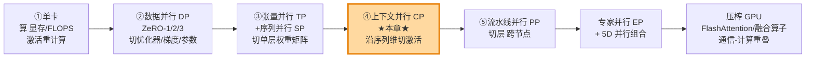

**为什么 CP 排在 TP+SP 之后、PP 之前？** 因为它们各自治不同的「病」：

| 并行维度 | 切的是什么 | 治哪种「显存爆炸」 | 通信代价 |
|---|---|---|---|
| 数据并行 DP / ZeRO | 切 batch（样本）、切模型状态 | 优化器/梯度/参数太大 | 梯度 all-reduce（或 ZeRO 的 reduce-scatter + all-gather） |
| 张量并行 TP | 切单层的权重矩阵（hidden 维） | 单层权重 + 激活太大 | 每层 2 次 all-reduce（贵，限单节点） |
| 序列并行 SP | 在 TP 的 LayerNorm/Dropout 区切序列 | TP 没覆盖到的那部分激活 | 与 TP 共用，all-gather / reduce-scatter |
| **上下文并行 CP（本章）** | **沿序列维切整模型的激活** | **超长序列（128k+）的激活线性爆炸** | **attention 处需在「环」上传 K/V** |
| 流水线并行 PP | 切层（深度维），跨节点放 | 模型权重一个节点都放不下 | 激活/梯度在 stage 间点对点传，有「气泡」 |

> 🔬 **第一性原理**：每一种并行，本质都是在「**显存 / 计算 / 通信**」这个不可能三角里做权衡——把某个维度切开换来显存下降，代价是多出来的通信或重复计算。读这一章时，请始终拿三个问题拷问 CP：**它切什么？它通信什么？瓶颈在哪？**

本章就专门解决一个 TP+SP 都搞不定的痛点：**当序列长到 128k、256k token 时，连「激活」和「KV」本身都放不下一张卡**。

---

## 1. 😱 为什么需要上下文并行：长序列把激活撑爆了

### 1.1 先回顾：TP + SP 已经帮我们省了多少

到上一章为止，我们已经会用「张量并行 TP + 序列并行 SP」把**模型权重**和**大部分激活**都摊到多张卡上。这很强，但书里点出一个残酷现实（原书 p.99）：

> 当我们把序列拉长到 **128k token 甚至更多**时，即便用了 TP+SP，单个节点的显存仍然可能被撑爆——因为**在 TP 区内部，我们仍然要处理一条完整的序列**。

更扎心的是第二句：

> 即使开了**完整激活重计算（full recomputation）**——它已经带来约 **30% 的额外计算开销**——我们**仍然**要在每层的边界（layer boundary）保留一部分激活，而这部分激活的大小是**随序列长度线性增长**的。

也就是说：重计算这把「显存换计算」的刀，砍不动随序列长度线性增长的那部分激活。序列越长，这条线越往上飙。

### 1.2 看图说话：8B 模型的显存随序列长度爆炸（FIG.XXXIX）

原书第 98 页给了一张极有说服力的图：一个 **8B 参数模型**，在不同序列长度（1024 → 4096 → 16384 → 65536 → 131072，即 128k）下的单卡显存占用，红色虚线是 **80GB**（一张 A100/H100 的容量上限）。它分三种配置对比：

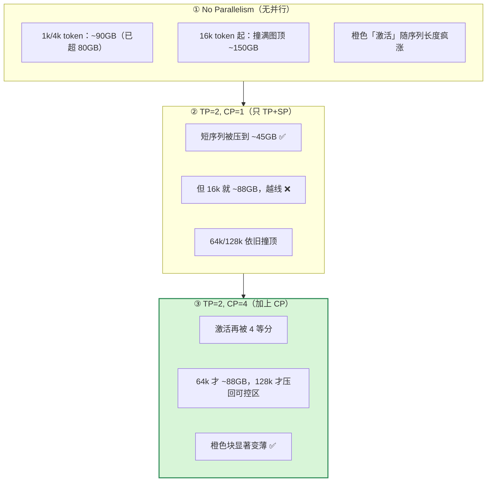

**读图三个关键结论：**

1. **橙色（Activations，激活）是元凶**。模型参数（青）、梯度（粉）、优化器状态（紫）这三块是「跟序列长度无关」的常量；而激活随序列长度**线性**膨胀，长序列下它一家独大。
2. **TP=2 CP=1 治标不治本**：它把常量那部分（参数/优化器）压了下去，但激活在 16k 就越过 80GB 线了。
3. **加上 CP=4，激活被再切 4 份**，128k 才重新回到可控范围。这正是 CP 存在的理由：**它专门砍那块随序列长度线性增长的激活**。

### 1.3 数值例：激活到底有多大？

我们手算一下「激活随序列线性增长」到底是什么量级。对一个 Transformer，单层、单条样本，存下来的主要激活（粗略，bf16，2 字节/元素）约正比于 $b \cdot s \cdot h$（batch × seq × hidden），再乘上每层若干个中间张量。取一个具体设定：

- hidden $h = 4096$，层数 $L = 32$（8B 量级），bf16 = 2 字节，batch $b = 1$。
- 单层「激活基量」近似按 $s \cdot h$ 个元素的若干倍算，这里用一个工程常用的粗系数 $\approx 34 \cdot s \cdot h$ 字节/层（含 QKV、attention 中间量、MLP 中间量等，量级估算用）。

那么全模型激活 $\approx L \cdot 34 \cdot s \cdot h$ 字节：

| 序列长度 $s$ | 估算激活显存（GB，$b{=}1$，不重计算） | 解读 |
|---|---|---|
| 1,024 | $32\times34\times1024\times4096\times2 \approx$ **9 GB** | 还好 |
| 16,384 | $\approx$ **143 GB** | 单卡爆炸 💥 |
| 131,072（128k） | $\approx$ **1.1 TB** | 想都别想 |

> 💡 **直觉**：序列从 1k 拉到 128k，激活涨了 **128 倍**。这不是「优化优化常数」能解决的，必须**沿序列维把它切开**。CP=128 才能把 128k 的那 1.1TB 压回每卡 ~9GB 的水平。这就是上下文并行的全部动机。

---

## 2. 🧩 CP 的核心思想：沿序列维切「整个模型」

### 2.1 一句话定义

> **上下文并行（Context Parallelism, CP）**：沿**序列长度维**把输入切成若干段，每张卡只持有序列的一段（连同这段对应的激活），**且这个切分应用于整个模型**，而不像 SP 那样只在 TP 的局部区域切。

它和**序列并行 SP** 的思想是同源的（都沿序列切），但作用范围不同：

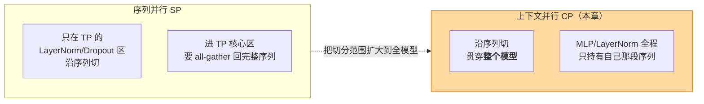

原书的措辞很精确（p.99）：CP 的核心思想「类似序列并行（沿序列长度切），**但这次把它应用到我们已经做了张量并行的那些模块上**——于是我们沿**两个维度**切这些模块，从而也削弱了序列长度的影响。」

### 2.2 切了之后，哪些模块「免费」，哪些要「特殊照顾」

这是本章最关键的认知。把序列切开后：

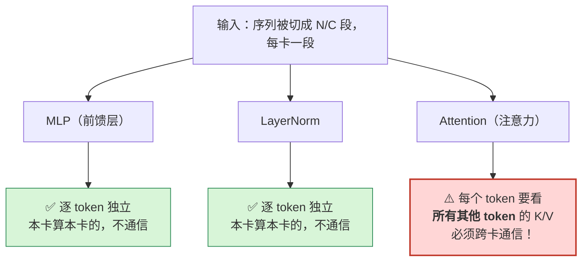

**为什么 MLP / LayerNorm 是「免费」的？**
原书 p.99：「切分序列不影响大多数模块，比如 MLP 和 LayerNorm，因为它们**逐 token 独立处理**。」一个 token 过 MLP，只跟它自己有关，跟邻居无关。所以每张卡拿着自己那段序列，各算各的，**完全不需要通信**。

**而且它比 TP 便宜**：原书 p.99 强调，CP「不像 TP 那样需要昂贵的通信，因为**只切了输入，没切权重矩阵**」。每张卡都持有**完整的权重**（MLP/LayerNorm 的 W），只是喂进去的序列不同——这和**数据并行**几乎一样！

**梯度怎么同步？**
正因为像 DP：原书 p.99 说「就像数据并行一样，算完梯度后，发起一次 **all-reduce** 在 CP 组内同步梯度」。直觉是：每张卡用不同的序列段算出了 W 的梯度，这些梯度是「同一个 W 在不同 token 上的贡献」，求和（all-reduce）就得到完整梯度。

> ⚠️ **常见坑**：很多人以为 CP 和 DP 是两回事，其实在「非 attention 部分」CP 的行为**几乎等同于按序列分片的 DP**——权重整份复制、各算各的、最后梯度 all-reduce。真正特殊的只有 attention 这一处。

### 2.3 唯一的例外：Attention

原书 p.99–100 把矛盾点摊开：

> 在 attention 模块里，**每个 token 都需要访问所有其他 token 的 key/value 对**（在因果注意力下，至少要 attend 到它之前的每一个 token）。

而 CP 把 token 切散在不同卡上了，于是：

> attention 模块需要 GPU 之间进行**完整的通信**来交换必需的 key/value 数据。如果天真地做，这听起来非常昂贵。有没有更便宜、更快的办法？谢天谢地，有一个核心技术能高效处理这种 K/V 通信：**Ring Attention（环形注意力）**。

这就引出了本章的主角。

> 📝 **原书 NOTE（p.100）**：CP 与后面会讲的 **FlashAttention** 有概念上的相似——**两者都靠 online softmax（在线 softmax）来减少显存**。区别在于：FlashAttention 聚焦于**单 GPU 内部**优化 attention 计算（把 SRAM/HBM 之间的搬运减到最少）；而 CP 是通过**把序列分散到多张 GPU** 来减少显存。一个对内，一个对外，用的却是同一把数学钥匙。

---

## 3. 🔑 数学钥匙：在线 softmax（Online Softmax）

要理解 Ring Attention「边传边算、不物化整张注意力矩阵」，必须先吃透 online softmax。这是 FlashAttention 和 Ring Attention 共同的地基。

### 3.1 朴素 attention 的问题

标准注意力（单 query 行，省略 batch/head）：

$$
O = \text{softmax}\!\left(\frac{Q K^\top}{\sqrt{d}}\right) V
$$

朴素实现要先算出完整的分数矩阵 $S = QK^\top/\sqrt d \in \mathbb{R}^{N\times N}$，对它做 softmax，再乘 $V$。问题就在那个 $N\times N$：序列 $N=128\text{k}$ 时，$S$ 是 $128\text{k}\times128\text{k}$，单是这一张矩阵就是 $131072^2 \times 2\text{字节} \approx 34$ GB——**物化它本身就爆显存**。

### 3.2 在线 softmax：分块流式累加，永不物化全矩阵

核心思想：把 $K, V$ 沿序列切成块 $K_1,V_1,\dots,K_T,V_T$，**一块一块地喂**，维护三个「运行中的统计量」：

- $m$：到目前为止见过的分数**行最大值**（为了数值稳定，softmax 要减最大值）；
- $\ell$：到目前为止的 softmax **分母**（指数和）；
- $O$：到目前为止的**加权输出**（未归一化）。

对第 $j$ 块，先算这一块的分数 $S_j = Q K_j^\top/\sqrt d$，然后**更新**：

$$
\begin{aligned}
m_j &= \max\!\big(m_{j-1},\ \text{rowmax}(S_j)\big) \\[4pt]
\ell_j &= e^{\,m_{j-1}-m_j}\,\ell_{j-1} \;+\; \text{rowsum}\!\big(e^{\,S_j-m_j}\big) \\[4pt]
O_j &= e^{\,m_{j-1}-m_j}\,O_{j-1} \;+\; e^{\,S_j-m_j}\,V_j
\end{aligned}
$$

最后归一化：$O = O_T / \ell_T$。

那个 $e^{\,m_{j-1}-m_j}$ 叫**校正因子（rescaling factor）**：当新块带来更大的最大值时，把之前累积的 $\ell$ 和 $O$ 按比例「缩小」，保证和「一次性算完整 softmax」**数值完全等价**。

> 🔬 **为什么这能省显存**：任意时刻我们只持有一个块 $S_j \in \mathbb{R}^{N_q \times N_{blk}}$，外加三个跟序列长度无关大小的运行量。$N\times N$ 的全矩阵**从未被同时物化**。显存从 $O(N^2)$ 降到 $O(N)$。这正是 FlashAttention 的内核，也是 Ring Attention 跨卡时复用的同一招。

### 3.3 数值例：两块流式 = 一次算完（手算验证）

设某个 query 对两个 key 的分数为 $S=[1,\,3]$，对应 $V=[v_1,\,v_2]$。我们把它拆成两块：块1 = $[1]$，块2 = $[3]$。

**标准一次算完：**
$$
\text{softmax}([1,3]) = \frac{[e^1, e^3]}{e^1+e^3} = [0.1192,\ 0.8808],\quad O = 0.1192\,v_1 + 0.8808\,v_2
$$

**在线流式（两步）：**

块1（$S_1=1$）：$m_1=1,\ \ell_1=e^{1-1}=1,\ O_1=e^{0}v_1=v_1$。

块2（$S_2=3$）：$m_2=\max(1,3)=3$，校正因子 $e^{m_1-m_2}=e^{-2}=0.1353$。
$$
\ell_2 = 0.1353\times1 + e^{3-3} = 0.1353 + 1 = 1.1353
$$
$$
O_2 = 0.1353\,v_1 + e^{0}\,v_2 = 0.1353\,v_1 + v_2
$$

归一化：
$$
O = \frac{O_2}{\ell_2} = \frac{0.1353\,v_1 + v_2}{1.1353} = 0.1192\,v_1 + 0.8808\,v_2 \quad✅
$$

**和标准结果分毫不差**。这就是 Ring Attention 敢「K/V 一块块从环上飞过来、收一块算一块」的底气——数学上保证等价。

---

## 4. 💍 Ring Attention：把 K/V 放上「传送带」

### 4.1 算法直觉

原书 5.1 节（p.101）描述得很生动：

> 在这种注意力实现里，每张 GPU 先**异步**发起一次通信，把自己的 K/V 对发给环上的下一张 GPU。在等别人数据的同时，它**先用手头已有的数据**算 attention 分数。理想情况下，下一份 K/V 在本轮计算结束前就到了，于是 GPU 能在算完当前块后**立刻**接着算下一块。

这就是「环形（Ring）」二字的来历：N 张卡首尾相连成一个环，K/V 像在传送带上一样，**逐跳（hop by hop）**绕环传递，每张卡每收到一块就用 online softmax 累加一次，绕完一圈，每个 query 就「见过」了全序列的 K/V。

### 4.2 每个时间步的三个动作

原书把单步拆成三个**接续**的操作（p.101）：

1. **Send（发送）**：把当前的 K/V **非阻塞地（non-blocking）**发给环上的下一台机器（除了最后一步）。非阻塞是关键——这样下面第 2 步能在发送还没完成时就开始。
2. **Compute（计算）**：用当前手头的 K/V，本地算这一块的 attention 分数（就是上面 online softmax 的一次更新）。
3. **Recv（接收）**：等着收上一张 GPU 发来的 K/V，然后**回到第 1 步**——此时「当前 K/V」就换成刚收到的这份。

> 这三步重复 $C$ 次（$C$ = CP 卡数）就完成整个 attention 计算。**4 卡就是 4 个时间步**。

### 4.3 4 卡 4 token 全程推演（FIG.XL）

原书 FIG.XL 用「4 GPU、4 token」把整个环跑了一遍。初始时序列被均匀切开，每卡拿 1 个 token 的 Q/K/V：GPU1 持 $Q_1K_1V_1$、GPU2 持 $Q_2K_2V_2$、…… **注意：Q 始终不动，动的只有 K/V。**

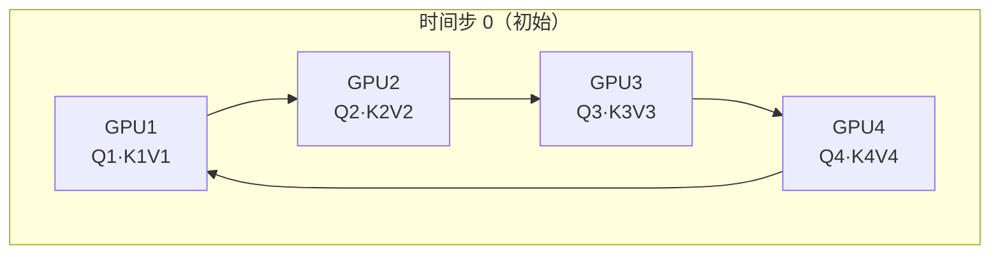

逐步看 K/V 怎么在环上「滚动」（顺时针：GPU1→GPU2→GPU3→GPU4→GPU1）：

| 时间步 | GPU1 手头 K/V | GPU2 手头 K/V | GPU3 手头 K/V | GPU4 手头 K/V | 这一步各卡算的分数 |
|---|---|---|---|---|---|
| **t0** | K1,V1 | K2,V2 | K3,V3 | K4,V4 | $Q_iK_i$（对角） |
| **t1** | K4,V4 | K1,V1 | K2,V2 | K3,V3 | $Q_1K_4,\ Q_2K_1,\ Q_3K_2,\ Q_4K_3$ |
| **t2** | K3,V3 | K4,V4 | K1,V1 | K2,V2 | $Q_1K_3,\ Q_2K_4,\ Q_3K_1,\ Q_4K_2$ |
| **t3** | K2,V2 | K3,V3 | K4,V4 | K1,V1 | $Q_1K_2,\ Q_2K_3,\ Q_3K_4,\ Q_4K_1$ |

（这张表正对应原书 FIG.XL 的四圈动画：每圈 K/V 标签都往前挪一格。）

走完 4 步，GPU1 就用 $Q_1$ 跟 $K_1,K_4,K_3,K_2$ 全配过了一遍——它「见过」了全序列。每张卡都如此。**而全程，每张卡只在显存里持有「自己的 Q + 一块 K/V + 三个运行统计量」，从未持有 $N\times N$ 的全矩阵**。

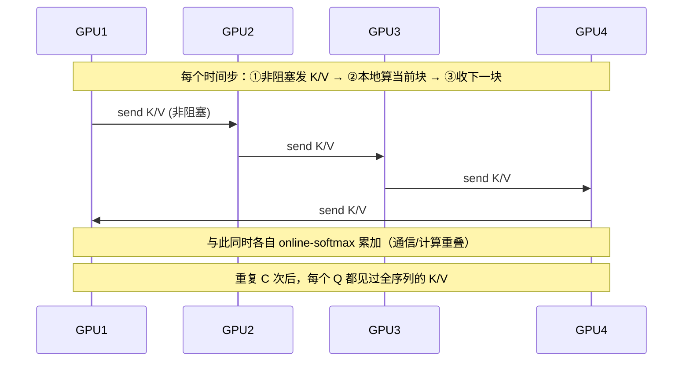

### 4.4 通信量与计算量：手算一遍

设 CP 度为 $C$ 卡，全序列 $N$ token，hidden $d$，bf16 = 2 字节。每卡持有 $N/C$ 个 token。

**通信量（每卡、每层、前向）**：每卡要把自己那块 K/V 沿环转发 $C-1$ 跳。一块 K+V 的大小：
$$
\text{size}_{KV} = 2 \times \frac{N}{C} \times d \times 2\text{字节}
$$
取 $N=131072,\ C=8,\ d=4096$：
$$
\text{size}_{KV} = 2 \times \frac{131072}{8} \times 4096 \times 2 = 2 \times 16384 \times 4096 \times 2 \approx 268\ \text{MB}
$$
每卡转发 $C-1 = 7$ 次 ⇒ **约 1.9 GB / 层 / 前向**。看起来不小，但**它被计算盖住了**（见 4.6），且只在 attention 处发生。

**计算量（每卡）**：每个时间步，本卡算 $Q_{\text{local}}[\frac N C, d]$ 乘一块 $K[\frac N C, d]$ 得分数块 $[\frac N C, \frac N C]$，再乘 $V$。单步 FLOPs $\approx 2\cdot(\frac N C)^2 d \times 2$（QKᵀ + SV）。$C$ 步累计：
$$
\text{FLOPs}_{\text{每卡}} \approx C \cdot 4 \Big(\tfrac N C\Big)^2 d = \frac{4 N^2 d}{C}
$$
对比单卡完整 attention 的 $4N^2 d$，CP 把每卡的 attention 计算量也**降到了 $1/C$**。

**显存（每卡）**：只存 $Q,K,V$ 的本地段 $O(\frac N C \cdot d)$ + 一个分数块 $O((\frac N C)^2)$ + 运行量。全序列的 $N\times N$ 矩阵永不物化 ⇒ **显存 $O(N)$（线性），随 $C$ 进一步线性下降**。

> 💡 **三者一起看**：CP 把 attention 的**显存**和**计算**都摊薄到 $1/C$，代价是多出来一圈 K/V 的**点对点通信**。这就是 CP 在「显存/计算/通信」三角里的成交价。

### 4.5 与 FlashAttention 的关系（一张对比表说清）

| 维度 | FlashAttention | Ring Attention（CP） |
|---|---|---|
| 解决什么 | 单 GPU 内 $N\times N$ 矩阵不入 HBM | 序列长到单卡放不下 |
| 切分方向 | 把 K/V 分块，在 **SRAM** 里流式算 | 把 K/V 分块，在**多卡之间**沿环流式算 |
| 共同内核 | **online softmax** | **online softmax**（同一套公式） |
| 数据搬运 | HBM ↔ SRAM（片内） | GPU ↔ GPU（片间，NVLink/IB） |
| 物化全矩阵？ | 否（$O(N)$ 显存） | 否（$O(N/C)$ 显存/卡） |
| 关系 | **CP 的每张卡内部，本来就跑 FlashAttention 来算它那一块** | Ring 是 FlashAttention 的「跨卡放大版」 |

> 实战里两者是**叠加**的：CP 把序列切到 8 张卡，每张卡再用 FlashAttention 高效算自己负责的那部分块。`ring-flash-attention` 这个库的名字就直白地把两者焊在了一起。

### 4.6 通信/计算重叠：为什么「非阻塞发送」是灵魂

回看 4.2 的三步：**先非阻塞 send，再 compute，最后才 wait/recv**。这个顺序刻意把「发下一块 K/V」与「算当前块」在时间上叠起来：

```mermaid
gantt
    title Ring Attention：通信与计算重叠（理想情形）
    dateFormat X
    axisFormat %s
    section 计算流
    算块0 (Q·K0) :c0, 0, 3
    算块1 (Q·K1) :c1, 3, 3
    算块2 (Q·K2) :c2, 6, 3
    算块3 (Q·K3) :c3, 9, 3
    section 通信流
    传 K/V →下一跳 (覆盖在算块0下) :a0, 0, 3
    传 K/V →下一跳 :a1, 3, 3
    传 K/V →下一跳 :a2, 6, 3
```

只要**单块的计算时间 ≥ 单块的传输时间**，通信就被完全藏在计算背后，CP 几乎「免费」。这在长序列下通常成立（计算 $\propto (N/C)^2$ 增长快，通信 $\propto N/C$ 增长慢）——序列越长，重叠得越好。

> ⚠️ **坑**：序列不够长、或卡间带宽很差（跨节点没有高速互联）时，通信盖不住计算，Ring 就会暴露出「等数据」的气泡。CP 因此和 TP 一样，**偏好高带宽互联（NVLink / 同节点 / 高速 IB）**。

---

## 5. ⚖️ 因果掩码导致的负载不均（FIG.XLI）

Ring Attention 听起来很美，但原书 p.104 立刻泼了一盆冷水：

> 有一个大问题：**朴素的 Ring Attention 实现，会因为因果注意力矩阵的形状，导致 GPU 之间严重的负载不均衡。**

### 5.1 因果掩码长什么样

语言模型用**因果（causal）掩码**：token $i$ 只能 attend 到 $j \le i$ 的 token（不能偷看未来）。所以分数矩阵是个**下三角**——第 $i$ 行有 $i$ 个有效格子。

原书 FIG.XLI 画了 16 token、4 卡、**朴素顺序切分**的情形：

```
         列(被attend的token) 1 → 16
行 1-4   ▓░░░░░░░░░░░░░░░   GPU1（token 1-4）
行 5-8   ▓▓▓▓░░░░░░░░░░░   GPU2（token 5-8）
行 9-12  ▓▓▓▓▓▓▓▓░░░░░░   GPU3（token 9-12）
行13-16  ▓▓▓▓▓▓▓▓▓▓▓▓░   GPU4（token 13-16）
（▓ = 要算的有效格子，░ = 被因果掩码盖掉，不算）
```

### 5.2 数值例：4 张卡的活差了 5.8 倍

softmax 是**按行算**的：一张卡只要收齐了某一行需要的所有 token，就能算这行。逐卡数一下「要算的有效格子」（= 计算量）：

| GPU | 负责 token（行） | 有效格子数（= $\sum$ 行内有效列） | 占比 |
|---|---|---|---|
| GPU1 | 1–4 | $1+2+3+4 = $ **10** | 7% |
| GPU2 | 5–8 | $5+6+7+8 = $ **26** | 19% |
| GPU3 | 9–12 | $9+10+11+12 = $ **42** | 31% |
| GPU4 | 13–16 | $13+14+15+16 = $ **58** | 43% |
| **合计** | | $10+26+42+58 = $ **136** | 100% |

（验证：16 token 因果总格子 = $\frac{16\times17}{2} = 136$ ✓）

原书 p.104 的观察一针见血：

> GPU1 能**立刻**算它的部分（拿着 token 1–4，不需要任何其他 GPU 的信息）；但 GPU2 得**等第二轮**收到 token 1–4，才凑齐 token 5–8 所需的全部值。而且 **GPU1 干的活比所有其他 GPU 都少得多。**

**问题的本质**：整个 attention 步的耗时由**最忙的那张卡（GPU4，58 格）**决定。理想均衡应是 $136/4 = 34$ 格/卡。所以朴素切分让我们白白慢了：
$$
\frac{\text{最忙卡}}{\text{理想均衡}} = \frac{58}{34} \approx \mathbf{1.7\times}
$$
而且 GPU1 大部分时间在**摸鱼**（10 格 vs 58 格，闲置率高达 83%）。卡越多，三角形越尖，这个不均衡越夸张。

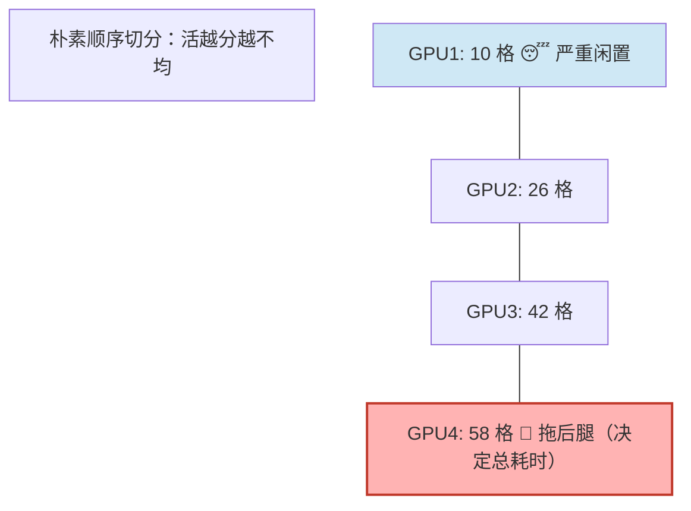

---

## 6. 🪢 Zig-Zag Ring Attention：把活摊平（FIG.XLII）

### 6.1 思路：别按顺序分，要「一早一晚」混着分

原书 5.2 节（p.105）给的解法极其优雅：

> 我们需要更好的方式来分配输入序列。办法是：**不要纯顺序地把 token 分给 GPU，而是把顺序打乱一下，让每张卡上都有一个「早 token」和「晚 token」的良好混合**。这个方法叫 **Zig-Zag Attention**。在这种新排布下，注意力掩码会呈现出**计算的均匀分布**——你数一数有色格子，会发现计算现在在所有 GPU 间均衡了。

### 6.2 Zig-Zag 怎么排（看懂 FIG.XLII 的配色）

把 $C$ 卡、每卡 2 个 chunk 的情况摊开。仍是 16 token、4 卡，但每卡拿**一个前半段 chunk + 一个后半段 chunk**，且后半段是**镜像**配对的：

| GPU | 拿到的 token | 直觉：一早一晚 |
|---|---|---|
| GPU1 | {1, 2} + {15, 16} | 最早 + 最晚 |
| GPU2 | {3, 4} + {13, 14} | 次早 + 次晚 |
| GPU3 | {5, 6} + {11, 12} | … |
| GPU4 | {7, 8} + {9, 10} | 最中间 |

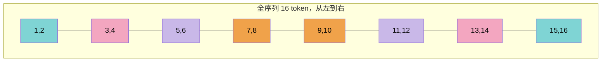

颜色一目了然地呈「锯齿/之字形」对称（这正是 Zig-Zag「之字」名字的由来）：GPU1 占两端，GPU4 占中间，GPU2/3 居中对称。

### 6.3 数值例：每卡精确 34 格，完美均衡

重新数有效格子（因果下三角，行 $i$ 有 $i$ 个有效列）：

| GPU | 行（token） | 各行有效列数 | 合计 |
|---|---|---|---|
| GPU1 | 1, 2, 15, 16 | $1+2+15+16$ | **34** |
| GPU2 | 3, 4, 13, 14 | $3+4+13+14$ | **34** |
| GPU3 | 5, 6, 11, 12 | $5+6+11+12$ | **34** |
| GPU4 | 7, 8, 9, 10 | $7+8+9+10$ | **34** |
| **合计** | | | **136** ✓ |

**每张卡精确 34 格，分毫不差地均衡**！秘诀是配对的两行之和恒定：$1+16=17,\ 2+15=17$，每卡两个「早行」+ 两个「镜像晚行」，行号互补，工作量自然被拉平。

对比朴素切分的「最忙 58 格」：

$$
\text{Zig-Zag 相对加速} = \frac{58}{34} \approx \mathbf{1.7\times}\quad(\text{attention 阶段})
$$

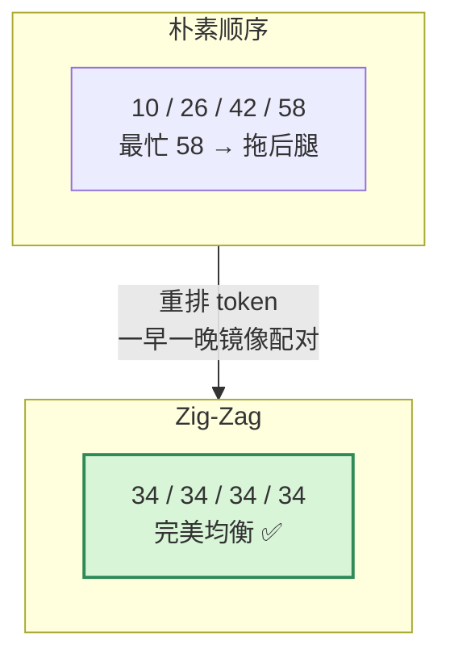

> 原书 p.105 还提醒：在 Zig-Zag 排布下，「要算完所有行，**每张 GPU 都需要来自所有其他 GPU 的信息**」——不像朴素切分里 GPU1 自给自足。这是均衡的代价，但通信总量不变，且能和计算重叠，所以划算。

> 📝 **原书 NOTE（p.105）**：这里展示的 **Zig-Zag Attention 与 Striped Attention（条带注意力）[2] 略有不同**。两者都想解决因果负载不均，但分配粒度/掩码处理有差异，细节见原书给的 GitHub 讨论链接 [A]（`zhuzilin/ring-flash-attention` issue #2）。面试时知道「Zig-Zag ≈ Striped 的同类解法、都为均衡因果掩码」即可。

---

## 7. 📡 两种通信实现：All-Gather vs All-to-All（FIG.XLIII / XLIV）

均衡解决了「算得均不均」，但「K/V 怎么在卡间传」还有两种工程实现。原书 p.105、107 给了选择：

> 我们有两种通用方式来重叠计算与通信：要么做一次**整体 all-gather**，像 ZeRO-3 那样一次性把所有 K/V 在每张卡上聚齐；要么**按需**从每张卡逐块收集。

### 7.1 实现一：All-Gather（一把梭，FIG.XLIII）

```mermaid
gantt
    title FIG.XLIII · All-Gather 实现
    dateFormat X
    axisFormat %s
    section 计算
    Attn(Q,K0,V0) :0, 2
    （等 all-gather）:crit, 2, 3
    Attn(Q,K1,V1) :5, 2
    Attn(Q,K2,V2) :7, 2
    section 通信
    AG(K,V) 一次性聚齐全部 :a, 0, 5
```

- **做法**：所有 GPU **同时** all-gather，把全部 K/V 一次性聚到每张卡（ZeRO-3 风格）。
- **显存**：每卡要临时存下**全部** K/V ⇒ 临时显存开销大。
- **通信**：一步到位，但伴随更大的内存峰值。
- 图中绿色/粉色图例：`AllGather Activs`（聚激活）+ `Forward pass`（前向）。

### 7.2 实现二：All-to-All / Ring（边走边传，FIG.XLIV）

```mermaid
gantt
    title FIG.XLIV · All-to-All（Ring / P2P）实现
    dateFormat X
    axisFormat %s
    section 计算
    Attn(Q,K0,V0)  :0, 2
    Attn(Q,K1,V1)  :2, 2
    Attn(Q,K2,V2)  :4, 2
    section 通信
    Fetch K1,V1 (P2P) :0, 2
    Fetch K2,V2 (P2P) :2, 2
    Fetch K3,V3 (P2P) :4, 2
```

- **做法**：GPU 以**环形**逐块交换 K/V，一次只传一块（就是第 4 节的 Ring）。
- **显存**：**省显存**——每卡只需临时多存**一块** K/V。
- **通信**：摊开成多步，**与计算重叠**；代价是多步带来的**基础延迟（base latency）**叠加。
- 图中绿色图例 `P2P Activs`（点对点传激活），计算与「Fetch 下一块」逐格对齐重叠。

### 7.3 二选一：对比表

| 维度 | All-Gather（FIG.XLIII） | All-to-All / Ring（FIG.XLIV） |
|---|---|---|
| 通信模式 | 一次大集合通信 | 多步环形 P2P |
| 临时显存 | 大（全 K/V 都要存） | 小（只多存一块 K/V） |
| 与计算重叠 | 弱（先聚齐再算） | 强（边收边算） |
| 额外延迟 | 低（一步） | 略高（多步 base latency 累加） |
| 实现复杂度 | 简单 | 略复杂（要管环上的收发轮次） |
| 适用 | 显存宽裕、追求实现简单 | **显存紧张的长序列（主流选择）** |

原书 p.107 的总评：

> All-to-all 方式通常以**稍复杂的通信模式**为代价换来**更好的显存效率**；而 all-gather 更简单，但在 attention 计算期间需要**更多临时显存**。

> 💡 **实战**：超长序列（CP 的主战场）本就是因为显存才上 CP，自然选 **All-to-All / Ring** 这条省显存的路。All-Gather 更多用在显存有富余、想图省事的场景。

---

## 8. 💻 代码教学：从 online softmax 到 Ring Attention 前向

光看公式不够，下面把核心逻辑写成可读的 PyTorch 风格代码，**逐行**讲清张量形状与通信原语。（教学伪代码，省略了 head 维与 FlashAttention 内核细节，聚焦 CP 的骨架。）

### 8.1 在线 softmax 的一步累加

```python
import torch

def online_softmax_step(m, l, acc, q, k_blk, v_blk, scale, mask=None):
    # m   : [Bq] 当前每个 query 行的「运行最大值」，初值 -inf
    # l   : [Bq] 当前每个 query 行的 softmax 「运行分母」，初值 0
    # acc : [Bq, d] 当前「运行加权输出」(未归一化)，初值 0
    # q   : [Bq, d]      本卡的 query 块（Q 始终不动）
    # k_blk,v_blk : [Bk, d] 这一轮从环上拿到的 K/V 块
    s = (q @ k_blk.transpose(-1, -2)) * scale     # [Bq, Bk] 这一块的分数 = QKᵀ/√d
    if mask is not None:
        s = s.masked_fill(mask == 0, float('-inf'))  # 因果掩码：盖掉未来 token

    m_new = torch.maximum(m, s.max(dim=-1).values)   # [Bq] 更新行最大值
    p = torch.exp(s - m_new[:, None])                # [Bq, Bk] 数值稳定的指数
    corr = torch.exp(m - m_new)                      # [Bq] 校正因子 e^{m_old - m_new}

    l = corr * l + p.sum(dim=-1)                      # 缩放旧分母 + 这块的指数和
    acc = corr[:, None] * acc + p @ v_blk             # 缩放旧输出 + 这块的加权 V
    return m_new, l, acc                              # 三个运行量带进下一轮
```

**逐行要点**：
- `q @ k_blk.transpose(-1,-2)`：形状 `[Bq,d] × [d,Bk] → [Bq,Bk]`，只生成**一块**分数，绝不是 `[N,N]` 全矩阵——这是省显存的命门。
- `corr = exp(m - m_new)`：当新块带来更大的最大值时，`m_new > m`，`corr < 1`，把之前累积的 `l`、`acc` 按比例缩小，保证与一次性 softmax 等价（对应第 3.2 节公式）。
- 返回的 `m,l,acc` 不含 `N×N`，只随 `Bq` 走，**显存与序列总长解耦**。

### 8.2 Ring Attention 前向（点对点环形通信）

```python
import torch
import torch.distributed as dist

def ring_attention_forward(q_local, k_local, v_local, cp_group, scale):
    """
    q_local,k_local,v_local : [Bq, d] 本卡持有的那一段序列的 Q/K/V
    cp_group : 上下文并行的进程组（环上的 C 张卡）
    """
    world = dist.get_world_size(cp_group)   # 环上卡数 C（= CP 度）
    rank  = dist.get_rank(cp_group)         # 本卡在环上的编号 0..C-1

    Bq, d = q_local.shape
    m   = torch.full((Bq,), float('-inf'), device=q_local.device)  # 运行最大值
    l   = torch.zeros(Bq, device=q_local.device)                   # 运行分母
    acc = torch.zeros(Bq, d, device=q_local.device)               # 运行输出

    # 环上的「下一跳」与「上一跳」邻居
    send_to   = (rank + 1) % world
    recv_from = (rank - 1 + world) % world

    k_cur, v_cur = k_local, v_local         # 第 0 轮：手头就是自己的 K/V
    for step in range(world):               # 共 C 个时间步，绕环一圈
        # —— 动作①：非阻塞地把当前 K/V 发给下一跳，同时准备接收上一跳 ——
        if step < world - 1:                # 最后一步不必再发
            k_next = torch.empty_like(k_cur)
            v_next = torch.empty_like(v_cur)
            reqs = [
                dist.isend(k_cur, dst=send_to,   group=cp_group),   # 非阻塞发
                dist.isend(v_cur, dst=send_to,   group=cp_group),
                dist.irecv(k_next, src=recv_from, group=cp_group),  # 非阻塞收
                dist.irecv(v_next, src=recv_from, group=cp_group),
            ]

        # —— 动作②：通信在飞的同时，本地算当前这块（通信/计算重叠）——
        m, l, acc = online_softmax_step(m, l, acc, q_local, k_cur, v_cur, scale)

        # —— 动作③：等通信落地，把「下一块」换成「当前块」，进入下一轮 ——
        if step < world - 1:
            for r in reqs:
                r.wait()                    # 等收发都完成
            k_cur, v_cur = k_next, v_next   # 滚动：刚收到的成为下一轮的当前块

    return acc / l[:, None]                  # 最后一次性归一化，得到 attention 输出
```

**逐行讲解 + 通信原语**：
- `dist.get_world_size/get_rank(cp_group)`：拿到**CP 子组**的大小与本卡序号。注意是 `cp_group` 这个**子通信组**，不是全局 world——CP 只在这 $C$ 张卡之间成环。
- `send_to / recv_from`：用取模 `% world` 把卡首尾相连成环（GPU $C{-}1$ 的下一跳是 GPU 0）。
- `dist.isend / dist.irecv`：**非阻塞（immediate）**点对点原语，立刻返回一个 `Request`，不等数据真正传完。这正是原书「non-blocking send」的落地——让动作②的计算能和数据传输**并行**。
- 顺序刻意是「**先发→再算→后 wait**」：把 `online_softmax_step`（计算）夹在 `isend/irecv`（发起通信）和 `r.wait()`（等通信）之间，实现重叠。
- `k_cur, v_cur = k_next, v_next`：环的「滚动」——上一跳传来的块，变成下一轮我要算、也要继续往前传的块。
- `return acc / l[:, None]`：循环里一直累积未归一化的 `acc`，**绕完一圈最后才除以分母**，对应 online softmax 的收尾。

> ⚠️ **坑**：`isend/irecv` 必须配对、且 `wait()` 不能漏，否则会死锁或读到未填充的 `empty_like` 垃圾数据。生产实现（如 `ring-flash-attention`）还会用 double-buffer 收发缓冲、把每卡内部那块换成真正的 FlashAttention 内核来算。

### 8.3 Zig-Zag 重排：把均衡「焊」进数据布局

Zig-Zag 不改算法，只改**每张卡拿哪些 token**。重排发生在「切分输入」那一步：

```python
def zigzag_split(seq, world, rank):
    """
    seq   : [N, ...] 完整序列（N 必须能被 2*world 整除）
    world : CP 卡数 C
    rank  : 本卡编号
    返回   : 本卡负责的那部分 token —— 一个「前半 chunk」+ 一个「镜像后半 chunk」
    """
    N = seq.shape[0]
    chunk = N // (2 * world)                 # 把序列切成 2C 个 chunk
    # 本卡拿第 rank 个 chunk（前半），和第 (2C-1-rank) 个 chunk（后半镜像）
    early = seq[rank * chunk : (rank + 1) * chunk]                       # 早 token
    late  = seq[(2*world - 1 - rank) * chunk : (2*world - rank) * chunk] # 晚 token
    return torch.cat([early, late], dim=0)   # 拼成本卡的局部序列
```

**逐行讲解**：
- `chunk = N // (2*world)`：Zig-Zag 把序列切成 **$2C$** 个 chunk（不是 $C$ 个），这样才能给每卡配「一早一晚」两块。$N$ 须被 $2C$ 整除。
- `early = seq[rank*chunk : ...]`：本卡的「前半段」chunk，rank 越小拿越早的 token。
- `late = seq[(2*world-1-rank)*chunk : ...]`：**镜像**取后半段——rank 0 拿最后一块，rank $C{-}1$ 拿中间块。正是第 6.2 节那张表的代码版（rank0 → {chunk0, chunk7} = token{1,2,15,16}）。
- `torch.cat([early, late])`：把两块拼成本卡的局部序列，喂给上面的 `ring_attention_forward`。
- 因为 early+late 的行号互补（$i$ 与 $N{+}1{-}i$），每卡的因果工作量被精确拉平到 $N(N{+}1)/(2C)$ 格（16 token、4 卡时正好 34）。

> 💡 反向传播时，输出还要按同样的索引**逆置换**回原始顺序——生产实现会保存这个置换索引（permutation index），前向 gather、反向 scatter。

---

## 9. 🧠 三角权衡总账：CP 切什么、通信什么、何时用、瓶颈在哪

把全章拧成一张「第一性原理」总表：

| 问题 | CP 的答案 |
|---|---|
| **切什么** | 沿**序列维**切，每卡持 $N/C$ 个 token 及其激活；权重**整份复制**（非 attention 处像 DP） |
| **省什么显存** | 随序列线性增长的**激活/KV** → 降到 $1/C$；attention 全矩阵从不物化（$O(N)$） |
| **算什么变化** | 非 attention 处各算各的（不变）；attention 处每卡只算 $1/C$ 的 $N^2$ 计算 |
| **通信什么** | ① 非 attention：梯度 **all-reduce**（同 DP）；② attention：K/V 沿环 **P2P**（或 all-gather） |
| **何时用** | 序列**超长**（128k+）、TP+SP+重计算都压不住激活时；常与 TP 叠用（CP×TP 切两个维度） |
| **瓶颈在哪** | K/V 环传通信；序列不够长 / 卡间带宽差时通信盖不住计算 → 偏好**高带宽互联**；因果掩码需 **Zig-Zag** 均衡 |
| **配套技术** | online softmax（地基）、FlashAttention（卡内内核）、Zig-Zag（负载均衡）、all-to-all/all-gather（通信实现） |

### CP 与其他并行的「切 + 通信」对照

| 并行 | 切的维度 | 权重是否切 | 主通信原语 | 何时祭出 |
|---|---|---|---|---|
| DP / ZeRO | batch（+模型状态） | ZeRO-3 才切 | all-reduce / reduce-scatter+all-gather | 通用，扩样本吞吐 |
| TP | hidden（权重矩阵） | ✅ 切 | 每层 all-reduce（贵） | 单层太大，限单节点 |
| SP | 序列（TP 局部区） | ✅（随 TP） | all-gather / reduce-scatter | 配 TP 省那部分激活 |
| **CP** | **序列（全模型）** | ❌ 不切（复制） | **K/V 环 P2P + 梯度 all-reduce** | **超长序列** |
| PP | 层（深度） | ✅ 按层切 | stage 间 P2P（有气泡） | 模型深到一节点放不下 |

原书 p.107 的收尾把 CP 在主线里的位置点明：

> 我们现在已经看到，可以用 **TP** 在一个节点内切开模型来驯服大模型，也可以用 **CP** 来驯服长序列带来的激活爆炸。**然而 TP 跨节点扩展性不好**——如果模型权重连一个节点都放不下怎么办？这就轮到**流水线并行（Pipeline Parallelism）**——我们的第四个并行维度——登场了！

这正是下一章（PP）的引子。

---

## 📌 本章小结

1. **动机**：序列拉到 128k+ 时，随序列长度**线性增长的激活**会撑爆单卡；TP+SP 甚至完整重计算都治不了这块。CP 专门沿序列维把它切开。（FIG.XXXIX）
2. **核心**：CP 沿序列切**整个模型**。MLP/LayerNorm 逐 token 独立 → 不通信、像 DP（梯度 all-reduce）；唯一例外是 **attention**，每个 token 要看全序列的 K/V，必须跨卡通信。
3. **Ring Attention**（5.1）：K/V 在环上**逐跳 P2P 传递**，每卡收一块用 **online softmax** 累加一次，绕一圈见全序列。**永不物化 $N\times N$ 矩阵**，显存 $O(N/C)$、计算 $1/C$。靠「非阻塞发送」实现**通信/计算重叠**。（FIG.XL）
4. **数学地基**：online softmax 用「运行最大值 $m$ + 分母 $\ell$ + 输出 $acc$ + 校正因子 $e^{m_{old}-m_{new}}$」流式累加，与一次算完**数值等价**（本章给了 $[1,3]$ 的手算验证）。这也是 FlashAttention 的同一把钥匙——CP 是它的「跨卡放大版」。
5. **负载不均**（FIG.XLI）：因果掩码是下三角，**朴素顺序切分**让 GPU1 只干 10 格、GPU4 干 58 格，总耗时被最忙卡拖到 **1.7×**。
6. **Zig-Zag**（5.2，FIG.XLII）：每卡拿「一早一晚」镜像配对的 chunk，工作量精确拉平到 **34 格/卡**，吃满 1.7× 加速。它与 Striped Attention 同类、略有差异。
7. **两种通信实现**（FIG.XLIII/XLIV）：**All-Gather**（一把聚齐、省事但费临时显存）vs **All-to-All/Ring**（逐块环传、省显存、重叠好——长序列主流选择）。
8. **一句话**：CP = 「沿序列切激活 + 在环上传 K/V + online softmax 边传边算 + Zig-Zag 摊平因果负载」，在**显存/计算/通信**三角里用「多一圈 P2P 通信」换来「激活与 attention 计算双双降到 $1/C$」。

> 🎯 **面试高频**
> - CP 和 SP 的区别？→ 同源（都沿序列切），但 CP 切**整个模型**、SP 只切 TP 的局部区。
> - Ring Attention 为什么不爆显存？→ online softmax 流式累加，**从不物化 $N\times N$**。
> - 为什么要 Zig-Zag？→ 因果掩码下三角导致朴素切分负载差 5.8×（最忙/最闲），Zig-Zag 用「一早一晚镜像配对」把每卡拉平。
> - CP 和 FlashAttention 啥关系？→ 同用 online softmax；FA 对单卡内（HBM↔SRAM），CP 对多卡间（GPU↔GPU），实战里叠加使用。
> - CP 的通信瓶颈？→ K/V 环传；序列不够长或卡间带宽差时通信盖不住计算 → 偏好高带宽互联。

---

## 🔗 延伸阅读与动手

- **代码实战** → [`../projects/05_context_parallel_ring_attention/`](../projects/05_context_parallel_ring_attention/)：用 `torch.distributed` 的 `isend/irecv` 从零实现 Ring Attention 前向 + Zig-Zag 重排，并与单卡 `F.scaled_dot_product_attention` 对拍验证数值等价。
- **通信原语补课** → [`../projects/06_collectives_from_scratch/`](../projects/06_collectives_from_scratch/)：手写 all-reduce / all-gather / reduce-scatter / 环形 P2P，理解 CP 的「梯度 all-reduce」与「K/V 环传」底层在干什么。
- **上一章（TP+SP）** → [`./03_张量并行_TP_序列并行_SP.md`](./03_张量并行_TP_序列并行_SP.md)：CP 正是建立在 TP+SP 之上、再多切一个序列维。
- **下一章（PP）** → [`./05_流水线并行_PP_AFAB_1F1B_交错_零气泡DualPipe.md`](./05_流水线并行_PP_AFAB_1F1B_交错_零气泡DualPipe.md)：当模型权重连一个节点都放不下，流水线并行登场。
- **附录** → [`../appendix/`](../appendix/)：online softmax 完整推导、FlashAttention 与 Ring Attention 的统一视角、Striped Attention 对比。
- **原始论文**：
  - H. Liu, M. Zaharia, P. Abbeel, *Ring Attention with Blockwise Transformers for Near-Infinite Context*, arXiv 2023 ——原书参考文献 [1]。
  - W. Brandon et al., *Striped Attention: Faster Ring Attention for Causal Transformers*, arXiv 2023 ——原书参考文献 [2]。
  - 工程实现讨论：`zhuzilin/ring-flash-attention` issue #2（原书链接 [A]）。

---

> 📖 本文对应《The Ultra-Scale Playbook: Training LLMs on GPU Clusters》第 5 章（p.97–108）。图号 FIG.XXXIX–XLIV 沿用原书编号，便于对照查阅。
