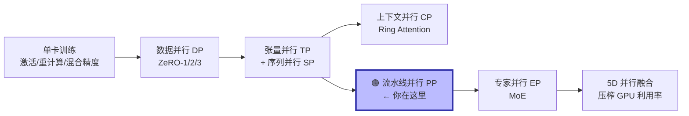
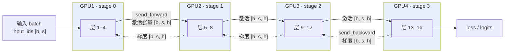
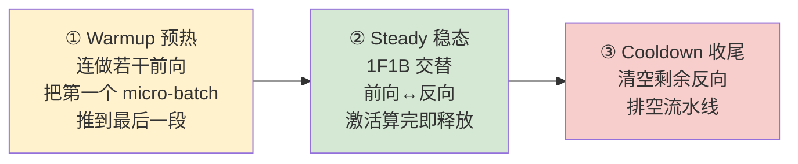
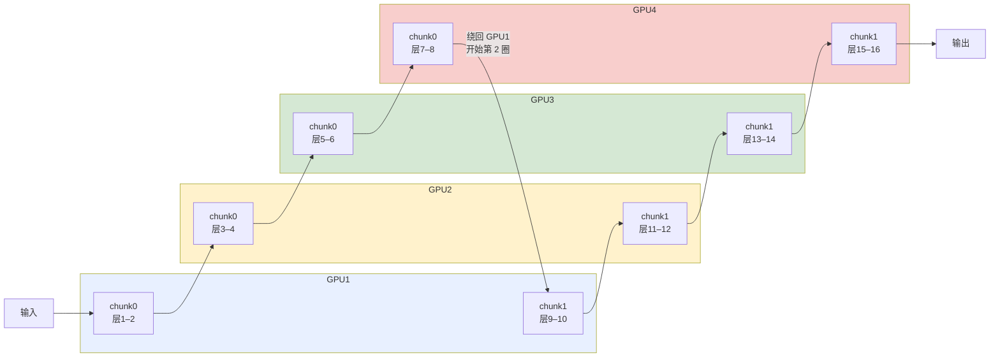
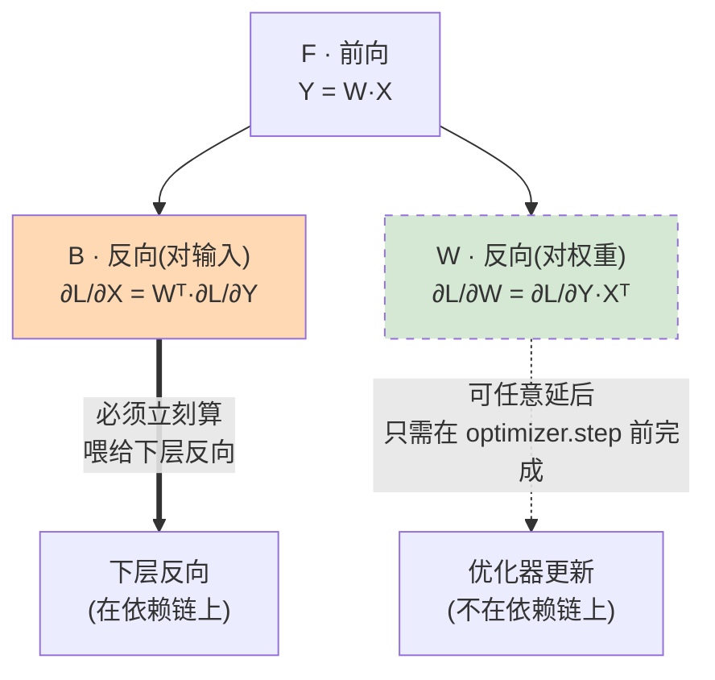
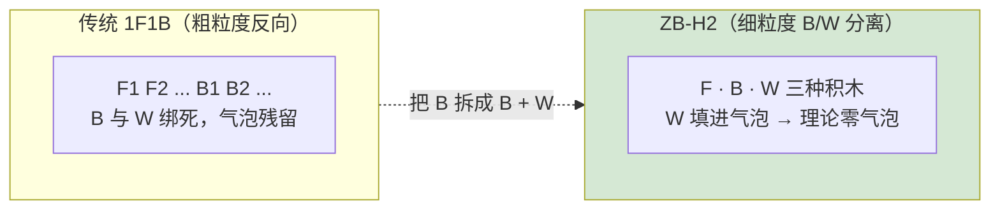
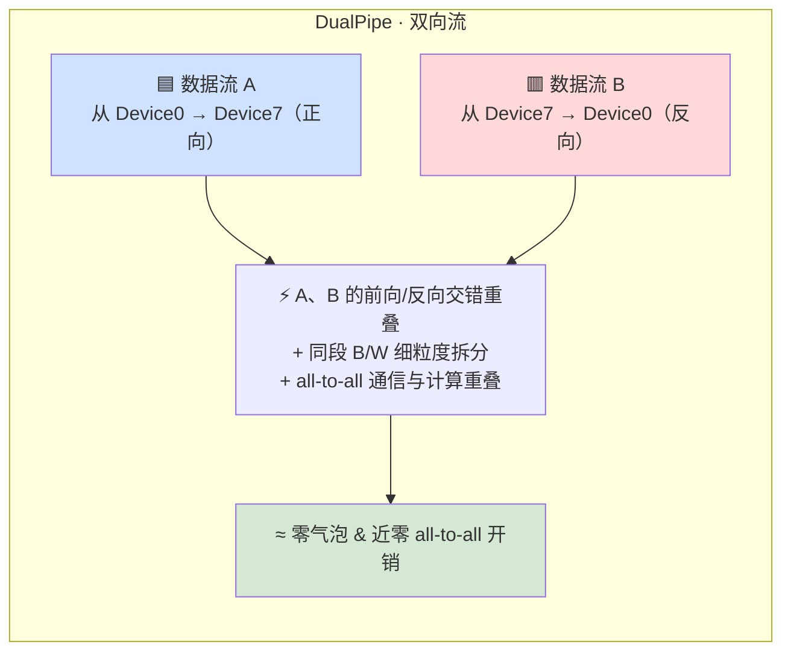

# 第 5 章 流水线并行 PP：AFAB、1F1B、交错、零气泡与 DualPipe

> 对应《The Ultra-Scale Playbook: Training LLMs on GPU Clusters》(HuggingFace, Nouamane Tazi 等) 第 6 章 *Pipeline Parallelism*，PDF 第 109–134 页。
>
> 本章把"把模型层切到不同卡上"的朴素想法，一步步打磨成工业级的 **1F1B / 交错 / 零气泡 / DualPipe** 调度。我们会把书里的每一个图、每一条公式、每一段 Picotron 代码都吃透，并补上大量**数值例子**和**对比表**。

---

## 🗺️ 本章地图：我们走到哪了

整本 Playbook 的主线是一条"**单卡 → 多卡 → 多机 → 5D 并行 → 压榨 GPU**"的升级路：



**为什么在 TP 之后要讲 PP？** 这是理解本章动机的关键：

- **张量并行 TP** 在每一层内部都要做多次 all-reduce 通信，通信极其频繁。一旦 TP 规模超过单节点的 GPU 数（典型 4 或 8 张卡），通信就被迫走**跨节点低带宽网络**，性能断崖式下跌。
- **序列并行 / 上下文并行** 只在"序列很长"时帮得上忙；但如果显存瓶颈的根因是**模型本身太大**（70B+ 参数，光权重就塞不进单节点 4–8 张卡），它们也无能为力。

于是我们请出新的一个并行维度——**流水线并行 Pipeline Parallelism（PP）**。它的通信模式与 TP 截然不同：**只在模型深度方向的少数几个"接缝"处传一次激活**，通信量小、频次低，因此**特别适合跨节点**扩展。本章的灵魂，就是围绕 PP 的一个核心矛盾展开：

> 🔬 **第一性原理**：把模型按层切到不同卡上，天然是**串行**的——第 2 段必须等第 1 段算完才能开始。串行 = GPU 互相等待 = **流水线气泡（pipeline bubble）**。本章所有的调度技巧（AFAB → 1F1B → 交错 → 零气泡 → DualPipe），本质上都是在**用更精巧的排班，把这个气泡填满**，同时尽量不增加通信、不撑爆激活显存。

记住贯穿全书的三角权衡：**显存 (Memory) / 计算 (Compute) / 通信 (Communication)**。每讲一种调度，我们都问四个问题：**切什么、通信什么、何时用、瓶颈在哪**。

---

## 0️⃣ 为什么需要 PP：从带宽与显存说起

### 0.1 跨节点带宽：TP 的天花板（FIG.XLV）

书里 FIG.XLV 在真实集群上测了 all-reduce / all-gather / reduce-scatter 在不同节点数下的带宽（每个节点 8 张 GPU）。结论很直白：

- **节点内（≤8 卡）**：走 NVLink/NVSwitch，带宽几百 GB/s，TP 通信尚可忍受。
- **跨节点（>8 卡）**：走 InfiniBand/以太网，带宽掉一个数量级，TP 的高频 all-reduce 直接把 GPU 拖成"等通信"。

这就是为什么 **TP 一般不跨节点**。要继续往上扩，就需要一个"通信省"的维度——PP 正好补这个位。

### 0.2 PP 的核心思想：把层切开

PP 简单到一句话能说清：

> **把模型的"层"切到多张 GPU 上。** 比如 8 张卡，层 1–4 放 GPU1，层 5–8 放 GPU2，依此类推。每张卡只**存**和**算**模型的一部分层，从而大幅降低每卡的**参数显存**。



- **实线（前向）**：每个 stage 算完自己的层，把输出激活 `[b, s, h]` 用 `send_forward` 发给下一个 stage。
- **虚线（反向）**：从最后一个 stage 往回，把输入端梯度 `[b, s, h]` 用 `send_backward` 发给上一个 stage。
- 每张卡上的"层块"我们称为一个 **stage（流水线段）**，PP 的并行度记为 $p$（= GPU 数 = stage 数）。

### 0.3 一个反直觉的洞察：激活显存**不会**变小（FIG.XLVI）

这是初学者最容易踩的坑。我们来对比 PP 切完之后，8B 模型每卡的显存构成：

| 显存项 | 不切（单卡） | PP 切成 $p$ 段后 | 变化 |
| --- | --- | --- | --- |
| **模型参数** | 全部 | **1/p** | ✅ 大幅下降 |
| **梯度** | 全部 | 1/p | ✅ 大幅下降 |
| **优化器状态** | 全部 | 1/p | ✅ 大幅下降 |
| **激活值** | 全部 | **≈ 不变！** | ⚠️ 没省 |

> ⚠️ **常见坑**：很多人以为"层切了 4 份，激活也省到 1/4"。**错。** 书里 FIG.XLVI 明确显示：参数被漂亮地分摊了，但**激活显存在每张卡上几乎不变**。

为什么？书里的 NOTE 给了答案：

> 每张 GPU 在开始**第一个反向**之前，必须先跑 $p$ 个前向（micro-batch）。每张卡只算 $1/p$ 的层，但要在第一个反向前缓存 $\approx p$ 个 micro-batch 的激活，于是 $\frac{1}{p}\times p = 1$ —— **激活显存约等于不切时的水平**。

用公式直观感受一下。设单个 micro-batch、单层的激活为 $A_{\text{layer}}$，整模型 $L$ 层：

$$
\underbrace{\frac{L}{p}}_{\text{每卡层数}} \times \underbrace{p}_{\text{需缓存的 micro-batch 数}} \times A_{\text{layer}} = L \cdot A_{\text{layer}}
$$

恰好等于单卡的激活量。**这就是 PP 的第一个隐藏代价**，也是后面 1F1B 调度要重点解决的问题。

### 0.4 通信模式：传激活，不传参数

> 💡 **PP 与 ZeRO-3 的根本区别**：ZeRO-3 在数据并行里**通信的是参数**（用前 all-gather 出完整权重再算）；PP **通信的是激活张量**，沿"流水线"在 stage 间顺序传递。两者都把模型切开，但一个传权重、一个传激活，适用场景不同，书的 §5D Parallelism in a Nutshell（P.141）会专门对比。本章先记住：**PP 通信少、频次低、适合跨节点**。

好，动机讲完了。"顺序地""依次地"听起来就不像并行计算该有的词——下面我们直面这个串行难题。

---

## 1️⃣ §6.1 切层 + 朴素调度 AFAB（All-Forward-All-Backward）

### 1.1 最朴素的做法与气泡的诞生

最朴素的 PP：一整个 batch 顺序地穿过 $p$ 个 stage。前向时 GPU1→GPU2→…→GPUp 依次点亮，反向再倒着回来。书的 FIG.XLVII 画的就是这个"楼梯"：

```mermaid
gantt
    title 朴素 PP（单个 batch，p=4）—— 灰色就是气泡 bubble
    dateFormat X
    axisFormat %s
    section GPU1 stage0
    F :0, 1
    bubble :crit, 1, 6
    B :7, 1
    section GPU2 stage1
    idle0 :done, 0, 1
    F :1, 1
    bubble :crit, 2, 4
    B :6, 1
    idle1 :done, 7, 1
    section GPU3 stage2
    idle0 :done, 0, 2
    F :2, 1
    bubble :crit, 3, 2
    B :5, 1
    idle1 :done, 6, 2
    section GPU4 stage3
    idle0 :done, 0, 3
    F :3, 1
    B :4, 1
    idle1 :done, 5, 3
```



> **读图**：`F` = 前向，`B` = 反向，红色 `bubble` = 这张卡在干等。GPU1 算完前向后要一直等到所有下游算完、反向回传才能动；GPU4 则是开头一直空等。**任何时刻只有一张卡在干活**，其余 $p-1$ 张全在摸鱼。

我们量化这个浪费。设：

- $t_f$：一个 micro-batch、一个 stage 的**前向**耗时；
- $t_b$：对应的**反向**耗时（书里常假设 $t_f = t_b$，便于推导）。

**理想情况**（完美并行，没有任何等待）的总时间就是把一个 batch 从头到尾跑一遍：

$$
t_{\text{ideal}} = t_f + t_b
$$

**实际情况**：因为串行，额外多出来的气泡时间是

$$
\boxed{t_{\text{id}} = (p-1)\,(t_f + t_b)}
$$

直观理解：除了正在干活的那张卡，其余 $p-1$ 张卡每张都要把"一前一后"$(t_f+t_b)$ 的时间白白等掉。于是**气泡比例**（额外时间 ÷ 理想时间）：

$$
r_{\text{bubble}} = \frac{t_{\text{id}}}{t_{\text{ideal}}} = \frac{(p-1)(t_f+t_b)}{t_f+t_b} = \boxed{p-1}
$$

> 🔢 **数值例**：$p=4$，$t_f=t_b=1$。理想 $=2$，气泡 $=(4-1)\times 2 = 6$，总时间 $=8 = p(t_f+t_b)$。气泡比例 $= p-1 = 3 = 300\%$！**GPU 利用率仅 $\frac{2}{8}=25\%$**。卡越多越糟（$p=8$ 时利用率只剩 $1/8=12.5\%$）。我们辛辛苦苦优化的吞吐量被这个气泡碾碎了。

### 1.2 第一招：把 batch 切成 micro-batch → AFAB 调度

气泡这么大，是因为整个 batch 像一块铁板一样串行。**解法**：把 batch 切成 $m$ 个更小的 **micro-batch**（微批），让它们像水管里的水一样**首尾相接地流过流水线**。当 GPU2 在处理 micro-batch 1 时，GPU1 已经可以开始处理 micro-batch 2 了。

最简单的排班叫 **AFAB（All-Forward-All-Backward，全前向再全反向）**：**先把所有 micro-batch 的前向全做完，再把所有 micro-batch 的反向全做完**。这也是 **GPipe** 采用的经典调度。它的最大好处是：前向和反向在时间上仍然整齐分两段，**几乎不用改训练主循环的结构**，是最易实现的 PP 方案。

> 📌 **重要约定**：从这一节起，所有流水线图里方块上的数字**不再是层号，而是 micro-batch 编号**。每个方块内部其实包含了好几层（就是上一节切给某张卡的层块）。

下面是 $p=4$、$m=4$ 的 AFAB 完整时间线（$t_f=t_b=1$，每格 1 个时间单位，`·` = 气泡）：

| 时间槽 | 1 | 2 | 3 | 4 | 5 | 6 | 7 | 8 | 9 | 10 | 11 | 12 | 13 | 14 |
|---|---|---|---|---|---|---|---|---|---|---|---|---|---|---|
| **GPU1** s0 | F1 | F2 | F3 | F4 | · | · | · | · | · | · | B1 | B2 | B3 | B4 |
| **GPU2** s1 | · | F1 | F2 | F3 | F4 | · | · | · | · | B1 | B2 | B3 | B4 | · |
| **GPU3** s2 | · | · | F1 | F2 | F3 | F4 | · | · | B1 | B2 | B3 | B4 | · | · |
| **GPU4** s3 | · | · | · | F1 | F2 | F3 | F4 | B1 | B2 | B3 | B4 | · | · | · |

- 前 7 个槽是**全前向**：micro-batch 像楼梯一样依次下行。
- 第 8 槽起是**全反向**：从 GPU4（最后一段）开始往回传。
- 每张卡都恰好空了 **6 个槽**（中间那段连续的 `·`）。

### 1.3 AFAB 的气泡公式与推导

micro-batch 切分后，理想时间变成把 $m$ 个 micro-batch 都跑完：

$$
t_{\text{ideal}} = m\,(t_f + t_b)
$$

而**气泡时间不变**——它只取决于流水线有多深，与 micro-batch 数无关：

$$
t_{\text{pb}} = (p-1)\,(t_f + t_b)
$$

于是气泡比例变成：

$$
\boxed{r_{\text{bubble}} = \frac{t_{\text{pb}}}{t_{\text{ideal}}} = \frac{(p-1)(t_f+t_b)}{m\,(t_f+t_b)} = \frac{p-1}{m}}
$$

> 🔬 **关键洞察**：分母多了个 $m$。也就是说，**多塞 micro-batch，就能把气泡按 $1/m$ 的比例压下去**。这是 PP 第一条黄金法则：`micro-batch 数 m 越大，气泡越小`。

我们用上面 $p=4,m=4$ 的例子验证：

- 理想时间 $= m(t_f+t_b) = 4\times 2 = 8$
- 气泡 $= (p-1)(t_f+t_b) = 3\times 2 = 6$
- 总时间 $= 8 + 6 = 14$（与上表 14 个槽完全吻合 ✅）
- 气泡比例 $= \frac{p-1}{m} = \frac{3}{4} = 75\%$，利用率 $\frac{8}{14}\approx 57\%$

**多塞 micro-batch 的威力**（固定 $p=4$）：

| micro-batch 数 $m$ | 气泡比例 $\frac{p-1}{m}$ | GPU 利用率 $\frac{m}{m+p-1}$ |
|---|---|---|
| 1（=朴素单批） | 300% | 25% |
| 4 | 75% | 57% |
| 8 | 37.5% | 73% |
| 16 | 18.75% | 84% |
| 32 | 9.4% | 91% |
| 64 | 4.7% | 95% |

可见 $m \gg p$ 时气泡才被有效摊薄。**但这里埋了一个雷**：$m$ 不能无限大——它受**全局 batch size 上限**约束（$m$ 太大，每个 micro-batch 太小，GPU 算不饱、且数学上 batch 也不能无限大）。所以单靠堆 micro-batch 有天花板，这正是后面"交错 / 零气泡"要继续发力的原因。

### 1.4 代码精讲：Picotron 的 AFAB 实现（CODE.VII）

书里给出 HuggingFace **Picotron** 的纯 PyTorch 实现，核心就是**两个 for 循环**：一个全前向、一个全反向。我们逐段拆解。

```python
def train_step_pipeline_afab(model, data_loader, tensor_shapes, device, dtype):
    logging_loss: torch.float32 = 0.0
    input_tensors, output_tensors = [], []          # ① 缓存前向的输入/输出
    requires_grad_sync = pgm.process_group_manager.cp_dp_world_size > 1

    # ===== 阶段一：全前向 All-Forward =====
    for _ in range(data_loader.grad_acc_steps):      # ② grad_acc_steps 就是 micro-batch 数 m
        input_tensor = pipeline_communicate(         # ③ 从上一个 stage 收激活
            operation="recv_forward",
            shapes=tensor_shapes, device=device, dtype=dtype,
        )
        batch = next(data_loader)
        batch["hidden_states"] = (                   # ④ 把收到的激活塞进 batch 当隐藏态
            input_tensor.to(device) if input_tensor is not None else input_tensor
        )
        output_tensor = model.forward(               # ⑤ 本 stage 的前向
            input_ids=batch["input_ids"].to(device),
            position_ids=batch["position_ids"].to(device),
            hidden_states=batch["hidden_states"],
        )
        pipeline_communicate(                        # ⑥ 把本 stage 输出发给下一个 stage
            operation="send_forward",
            tensor=output_tensor, device=device, dtype=dtype,
        )
        if pgm.process_group_manager.pp_is_last_stage:   # ⑦ 只有最后一段算 loss
            output_tensor = F.cross_entropy(
                output_tensor.transpose(1, 2),
                batch["target_ids"].to(device),
                reduction="mean",
            )
            logging_loss += output_tensor.item() / data_loader.grad_acc_steps
        input_tensors.append(input_tensor)           # ⑧ 缓存，反向时要用
        output_tensors.append(output_tensor)

    # ===== 阶段二：全反向 All-Backward =====
    for ith_microbatch in range(data_loader.grad_acc_steps):
        if requires_grad_sync:                       # ⑨ 只在最后一个 micro-batch 触发 DP 梯度同步
            is_last_iteration = ith_microbatch == data_loader.grad_acc_steps - 1
            model.require_backward_grad_sync = is_last_iteration
        output_tensor_grad = pipeline_communicate(   # ⑩ 从下一个 stage 收回传梯度
            operation="recv_backward",
            shapes=tensor_shapes, device=device, dtype=dtype,
        )
        input_tensor = input_tensors.pop(0)          # ⑪ 取出当初缓存的输入/输出（FIFO）
        output_tensor = output_tensors.pop(0)
        input_tensor_grad = model.backward(          # ⑫ 本 stage 反向，得到对输入的梯度
            input_tensor, output_tensor, output_tensor_grad
        )
        pipeline_communicate(                        # ⑬ 把输入端梯度发给上一个 stage
            operation="send_backward",
            tensor=input_tensor_grad, device=device, dtype=dtype,
        )
    return logging_loss
```

**逐行讲透**：

- **① `input_tensors / output_tensors`**：两个 Python 列表，是 AFAB 的"账本"。前向阶段把每个 micro-batch 的输入激活、输出激活都**存下来**，因为反向需要它们来求梯度（这正是后面显存爆炸的根源）。
- **② `grad_acc_steps`**：在 Picotron 里，梯度累积步数 = micro-batch 数 $m$。前向循环跑 $m$ 次。
- **③ `pipeline_communicate(operation="recv_forward", shapes=...)`**：从**上一个 stage** 接收激活张量。`shapes=tensor_shapes` 是因为 P2P 接收方必须**预先知道张量形状** `[micro_batch, seq, hidden]` 才能开缓冲区。底层是 `torch.distributed` 的 P2P 原语（`irecv`/`batch_isend_irecv`）。第 0 个 stage 没有上游，收到 `None`。
- **④–⑤**：把收到的激活作为本段的输入隐藏态 `hidden_states`，跑 `model.forward`。注意 `input_ids` / `position_ids` 每段都有（用于 RoPE 位置编码等），但真正承上启下的是 `hidden_states`。
- **⑥ `send_forward`**：把本段输出 `[b,s,h]` **点对点**发给下一个 stage。这就是 PP 唯一的前向通信——一个 micro-batch 在每个接缝处发一次。
- **⑦ `pp_is_last_stage`**：只有**最后一段**持有 `target_ids`、能算交叉熵 loss。这是 PP 的标志性特征：**loss 只在流水线末端产生**。`transpose(1,2)` 是把 `[b, s, vocab]` 调成 `F.cross_entropy` 要的 `[b, vocab, s]`。
- **⑧**：前向结束，把输入/输出激活入账。
- **⑨ `require_backward_grad_sync`**：当 PP 与数据并行 DP 叠加时，DP 的梯度 all-reduce 很贵，**只在最后一个 micro-batch 的反向**触发一次（前面累积、最后才同步），避免每个 micro-batch 都同步。
- **⑩ `recv_backward`**：从**下一个 stage** 收回传来的"输出端梯度" $\partial L/\partial(\text{output})$。最后一段没有下游，这一步拿到 `None`，直接从 loss 求导。
- **⑪ `pop(0)`**：先进先出（FIFO）地取出与当前 micro-batch 对应的输入/输出激活。**反向顺序与前向一致**（micro-batch 1 先反向）。
- **⑫ `model.backward(...)`**：链式法则——已知对输出的梯度，求对**输入**的梯度 `input_tensor_grad`，同时累积本段权重梯度。
- **⑬ `send_backward`**：把输入端梯度发给上一个 stage，让它继续往回传。

> 💡 **面试高频**：AFAB 的前向循环里**每跑一个 micro-batch 就往 `input_tensors`/`output_tensors` 里压一份激活，全程不释放**，直到反向阶段才逐个 `pop`。所以第一个 stage（GPU1）要把 **全部 $m$ 个 micro-batch 的激活**同时扛在显存里——这就是下面要解决的"激活爆炸"。

### 1.5 AFAB 的致命伤：激活显存爆炸

AFAB 把气泡问题缓解了，却带来新麻烦：**所有 micro-batch 的激活必须一直留到反向阶段**。从上面的时间线表看，GPU1 在第 1–4 槽把 F1–F4 全做完，但要等到第 11 槽才开始 B1——这中间 **4 个 micro-batch 的激活全压在显存里**。

**峰值激活显存 $\propto m$**（micro-batch 数）。而我们刚说过，气泡要小就得 $m$ 大——于是 AFAB 陷入两难：

$$
\underbrace{m \uparrow}_{\text{气泡} \frac{p-1}{m}\downarrow} \quad\Longrightarrow\quad \underbrace{\text{激活显存} \propto m \uparrow}_{\text{显存爆炸}}
$$

> 🔬 **顺着第一性原理找突破口**：显存爆炸是因为"前向产生的激活一直留着没用"。如果我们能**在还没跑完全部前向时，就尽早插入反向**，那么对应 micro-batch 的激活一算完反向就能**立刻释放**。这个"尽早反向"的念头，直接催生了下一节的 1F1B。

---

## 2️⃣ §6.2 一前一后 1F1B + Llama 3.1 方案

### 2.1 思想：尽早开始反向

**1F1B（One-Forward-One-Backward，一前一后）** 的核心：在流水线的**稳态（steady state）**，每张卡**交替地做一次前向、一次反向**。一旦某个 micro-batch 在最后一段算完前向、反向开始往回流，前面各段就趁机插入反向，**用完即弃地释放激活**。

整个 1F1B 在每张卡上分**三个阶段**：



**预热前向数**由本段在流水线里的位置决定（Picotron 公式）：

$$
\text{num\_warmup} = \min\big(\underbrace{p - \text{rank} - 1}_{\text{离末端的距离}},\ m\big)
$$

越靠前的 stage（rank 越小）预热越多，因为它离最后一段越远，要先多喂几个前向才能让"反向洪流"回到自己这里。以 $p=4$ 为例：

| stage | rank | num_warmup |
|---|---|---|
| GPU1 (s0) | 0 | $\min(3,m)=3$ |
| GPU2 (s1) | 1 | $\min(2,m)=2$ |
| GPU3 (s2) | 2 | $\min(1,m)=1$ |
| GPU4 (s3) | 3 | $\min(0,m)=0$（末端不预热，直接 1F1B） |

### 2.2 1F1B 时间线（与 AFAB 对照）

同样 $p=4,m=4,t_f=t_b=1$，1F1B 的精确时间线（我按依赖关系逐拍推演得到，可自行核对）：

| 时间槽 | 1 | 2 | 3 | 4 | 5 | 6 | 7 | 8 | 9 | 10 | 11 | 12 | 13 | 14 |
|---|---|---|---|---|---|---|---|---|---|---|---|---|---|---|
| **GPU1** s0 | F1 | F2 | F3 | F4 | · | · | · | B1 | · | B2 | · | B3 | · | B4 |
| **GPU2** s1 | · | F1 | F2 | F3 | · | · | B1 | F4 | B2 | · | B3 | · | B4 | · |
| **GPU3** s2 | · | · | F1 | F2 | · | B1 | F3 | B2 | F4 | B3 | · | B4 | · | · |
| **GPU4** s3 | · | · | · | F1 | B1 | F2 | B2 | F3 | B3 | F4 | B4 | · | · | · |

读这张图的三个关键点：

1. **总时间还是 14 个槽**，和 AFAB 一模一样 → **气泡大小没变**！1F1B 并**没有**缩小气泡，公式仍是 $r_{\text{bubble}} = \frac{p-1}{m}$。
2. **GPU4（末端）变得最饱满**：第 4–11 槽连续干活，前向反向紧密交替（`F1 B1 F2 B2 F3 B3 F4 B4`），中间**零气泡**，只有开头/结尾的边角空闲。
3. **激活释放更早**：GPU1 在第 8 槽就做了 B1——B1 一做完，micro-batch 1 的激活立刻释放。对比 AFAB 里 GPU1 要扛到第 11 槽，**1F1B 任意时刻只需缓存少数几个 micro-batch 的激活**。

### 2.3 气泡相同，但显存大降——这才是 1F1B 的真正价值

> 💡 **面试必答**：1F1B vs AFAB，气泡比例**相同**（都是 $\frac{p-1}{m}$），1F1B 的核心收益是**激活显存**：从 $\propto m$ 降到 $\propto p$。

为什么是 $p$？在稳态里，最前面的 stage 0 最多需要同时持有 num_warmup$+1 \approx p$ 个 micro-batch 的激活；越靠后的 stage 需要缓存的越少（stage $i$ 大约缓存 $p - i$ 个）。所以**峰值激活只取决于流水线深度 $p$，与 micro-batch 总数 $m$ 解耦**。

| | **AFAB** | **1F1B** | 改善 |
|---|---|---|---|
| 气泡比例 | $\frac{p-1}{m}$ | $\frac{p-1}{m}$ | 相同 |
| 峰值激活（按 micro-batch 计） | $\propto m$ | $\propto p$ | **$\div\,\frac{m}{p}$** |
| 实现复杂度 | 简单（两个 for） | 中等（三阶段+独立调度） | — |

> 🔢 **数值例**：$p=4$，要把气泡压到 $\approx 9\%$ 需要 $m=32$。
> - **AFAB**：stage 0 要同时存 **32** 个 micro-batch 的激活。若每个 micro-batch 在该段的激活是 2 GB，则需 **64 GB**——直接 OOM。
> - **1F1B**：stage 0 只需存 $\approx 4$ 个，约 **8 GB**。**省了 8×**。
>
> **正是因为 1F1B 把激活压下来了，我们才"敢"把 $m$ 加大到 32**，从而真正享受到小气泡。这是 1F1B 间接缩小气泡的逻辑链：`省显存 → 敢加 m → 气泡随 m 变小`。书里原话："we can add more micro-batches, which then will actually reduce the bubble."

### 2.4 代码精讲：Picotron 的 1F1B 实现（CODE.VIII）

1F1B 比 AFAB 难写得多，因为**前向和反向不再整齐分两段，而是在各设备上独立交错**——你没法再用一个统一的中央训练循环，必须让每张卡自己决定何时从"前向"切到"反向"。这也是"PP 通常要大改训练代码和建模代码"的根本原因。代码分三块：预热 / 稳态 / 收尾。

#### 第一块：算预热数 + 预热前向

```python
def train_step_pipeline_1f1b(model, data_loader, tensor_shapes, device, dtype):
    num_warmup_microbatches = min(                       # ① 本段预热前向数
        pgm.process_group_manager.pp_world_size
        - pgm.process_group_manager.pp_rank - 1,
        data_loader.grad_acc_steps,
    )
    num_microbatches_remaining = (                       # ② 稳态要处理的 micro-batch 数
        data_loader.grad_acc_steps - num_warmup_microbatches
    )
    logging_loss, input_tensors, output_tensors = 0.0, [], []
    requires_grad_sync = pgm.process_group_manager.cp_dp_world_size > 1

    def _forward_step(input_tensor):                     # ③ 把前向封装成内部函数(预热和稳态都用)
        batch = next(data_loader)
        batch["hidden_states"] = (
            input_tensor.to(device) if input_tensor is not None else input_tensor
        )
        output_tensor = model.forward(
            input_ids=batch["input_ids"].to(device),
            position_ids=batch["position_ids"].to(device),
            hidden_states=batch["hidden_states"],
        )
        if pgm.process_group_manager.pp_is_last_stage:
            output_tensor = F.cross_entropy(
                output_tensor.transpose(1, 2),
                batch["target_ids"].to(device), reduction="mean",
            )
            nonlocal logging_loss
            logging_loss += output_tensor.item() / data_loader.grad_acc_steps
        return output_tensor

    for _ in range(num_warmup_microbatches):             # ④ 预热：只前向，不反向
        input_tensor = pipeline_communicate(
            operation="recv_forward", shapes=tensor_shapes,
            device=device, dtype=dtype)
        output_tensor = _forward_step(input_tensor)
        pipeline_communicate(
            operation="send_forward", tensor=output_tensor,
            device=device, dtype=dtype)
        input_tensors.append(input_tensor)               # ⑤ 预热的激活先存着
        output_tensors.append(output_tensor)
```

- **① num_warmup_microbatches**：就是上面表里的预热公式。末端 stage（rank=$p-1$）算出来是 0，直接进稳态。
- **② num_microbatches_remaining**：总数减预热数，是稳态循环要跑的轮数。
- **③ `_forward_step`**：把前向逻辑（含末端算 loss）抽成闭包，`nonlocal logging_loss` 让它能改外层的损失累加器。预热和稳态都复用它，避免重复代码。
- **④–⑤ 预热循环**：只做 `recv_forward → forward → send_forward`，**完全不碰反向**，把激活压进列表。目的是"灌满流水线"，让第一个 micro-batch 抵达末端、反向能开始流回来。

#### 第二块：稳态 1F1B（精髓所在）

```python
    if num_microbatches_remaining > 0:                   # ⑥ 稳态前先多收一个前向输入
        input_tensor = pipeline_communicate(
            operation="recv_forward", shapes=tensor_shapes,
            device=device, dtype=dtype)
    if requires_grad_sync:
        model.require_backward_grad_sync = False         # ⑦ 稳态期间先关闭 DP 梯度同步

    for ith_microbatch in range(num_microbatches_remaining):
        is_last_iteration = ith_microbatch == num_microbatches_remaining - 1
        output_tensor = _forward_step(input_tensor)      # ⑧ 一次"前向"

        output_tensor_grad = bidirectional_pipeline_communicate(  # ⑨ 同时发前向、收反向
            operation="send_fwd_recv_bwd",
            send_tensor=output_tensor, recv_shapes=tensor_shapes,
            device=device, dtype=dtype)

        input_tensors.append(input_tensor)
        output_tensors.append(output_tensor)
        input_tensor, output_tensor = input_tensors.pop(0), output_tensors.pop(0)  # ⑩ 取最老的

        if num_warmup_microbatches == 0 and is_last_iteration:    # ⑪ 末端 rank 的最后一批触发 DP 同步
            model.require_backward_grad_sync = True

        input_tensor_grad = model.backward(              # ⑫ 一次"反向"
            input_tensor, output_tensor, output_tensor_grad)

        if is_last_iteration:
            input_tensor = None
            pipeline_communicate(                        # ⑬ 最后一轮：只发反向梯度
                operation="send_backward", tensor=input_tensor_grad,
                device=device, dtype=dtype)
        else:
            input_tensor = bidirectional_pipeline_communicate(   # ⑭ 同时发反向、收下一个前向
                operation="send_bwd_recv_fwd",
                send_tensor=input_tensor_grad, recv_shapes=tensor_shapes,
                device=device, dtype=dtype)
```

- **⑧ 前向 → ⑫ 反向**：这就是"1F1B"——循环体里**一次前向紧跟一次反向**，对应时间线表里 GPU4 那种 `F B F B...` 的交替。
- **⑨ / ⑭ `bidirectional_pipeline_communicate`**：1F1B 的关键通信优化。在稳态里，每张卡**同时**要"把前向输出发给下游"和"从下游收反向梯度"。如果先 send 再 recv（或反过来）容易**死锁**，且浪费带宽。所以 Picotron 用 `send_fwd_recv_bwd` / `send_bwd_recv_fwd` 把发送和接收**融合成一次双向 P2P**（底层 `batch_isend_irecv`），既避免死锁又让收发重叠。
  - `send_fwd_recv_bwd`：发本段前向输出给下游 + 收下游回传的反向梯度。
  - `send_bwd_recv_fwd`：发本段反向梯度给上游 + 收上游送来的下一个前向输入。
- **⑩ `pop(0)`**：FIFO——刚算的前向压进队尾，反向取队首"最老的那个"。这保证反向处理的是**最早灌进来的 micro-batch**，从而其激活能尽早释放。
- **⑪ 梯度同步时机**：末端 stage（num_warmup=0）在稳态最后一轮才打开 `require_backward_grad_sync`，与 DP 协同。
- **⑬ 边界处理**：稳态最后一轮没有"下一个前向"要收了，所以只 `send_backward`，把 `input_tensor` 置空，准备进收尾。

#### 第三块：收尾（清空剩余反向）

```python
    for ith_warmup_microbatches in range(num_warmup_microbatches):   # ⑮ 收尾：把预热欠下的反向补完
        if requires_grad_sync:
            is_last_iteration = ith_warmup_microbatches == num_warmup_microbatches - 1
            model.require_backward_grad_sync = (
                ith_warmup_microbatches == num_warmup_microbatches - 1)
        input_tensor = input_tensors.pop(0)
        output_tensor = output_tensors.pop(0)
        output_tensor_grad = pipeline_communicate(       # ⑯ 收下游反向梯度
            operation="recv_backward", shapes=tensor_shapes,
            device=device, dtype=dtype)
        input_tensor_grad = model.backward(
            input_tensor, output_tensor, output_tensor_grad)
        pipeline_communicate(                            # ⑰ 发反向梯度给上游
            operation="send_backward", tensor=input_tensor_grad,
            device=device, dtype=dtype)
    return logging_loss
```

- **⑮ 收尾循环跑 num_warmup_microbatches 次**：预热阶段做了多少个"光前向"，收尾就要补多少个"光反向"，把流水线排空。这对应时间线表里 GPU1 末尾那几个 B。最后一轮触发 DP 梯度同步。

> 💡 **实战**：对照三阶段和时间线表——GPU1 (rank0) 预热 3 个前向（F1F2F3）、稳态 1 轮（F4+B1）、收尾 3 个反向（B2B3B4），正好 `3+1+3 = 7` 个 micro-batch 操作里嵌着 4 前 4 反。整个流程"前重后轻"地把激活峰值压在 $\approx p$ 个 micro-batch。

### 2.5 实测：1F1B 跨节点扩展性碾压 TP（FIG.L）

书里在真实集群上做了 1F1B 的吞吐扫描（FIG.L），两个重要结论：

1. **micro-batch 太少（$m \le p-1$）**：气泡极大，性能很低，甚至**随 PP 增大而下降**——因为 $\frac{p-1}{m}$ 里分子涨、分母没跟上。
2. **micro-batch 远多于 PP 度（$m \gg p$）**：低 PP 度时性能明显改善，但 PP 度很大时仍受限（受全局 batch 上限制约，没法无限加 $m$）。

最亮眼的数据是**跨节点扩展**：

| 方案 | 1 节点 → 2 节点 性能下降 |
|---|---|
| **PP（1F1B）** | **仅 ~14%** ✅ |
| **TP** | ~43% ❌ |

> 🔬 **第一性原理**：PP 只在 stage 接缝处发一次激活，通信量小、频次低，跨过低带宽节点边界时几乎不疼；TP 每层内部多次 all-reduce，跨节点直接被带宽掐死。**这就是为什么大模型多机训练里，TP 留在节点内、PP 跨节点**——本章开头埋的伏笔在此收口。

### 2.6 1F1B 仍未解决的问题

1F1B 把显存压下来了，但**气泡依然 $\propto (p-1)$**，PP 度一大，仍有大块 GPU 在空转。能不能设计更聪明的调度，把气泡进一步榨干？这就引出**交错**与**零气泡**。

---

## 3️⃣ §6.3 交错 interleaved stages（虚拟流水线 virtual pipeline）

### 3.1 换一种切法：让每张卡持有多个不连续的"块"

到目前为止我们都是**沿深度连续切**：层 1–4 给 GPU1，层 5–8 给 GPU2……但这不是唯一选择。**交错（interleaving）**的想法是：把层**穿插**着分。例如 GPU1 拿"奇数块"（层 1–2、9–10），GPU2 拿"偶数块"（层 3–4、11–12）……

每张卡持有的"块"数记为 $v$（virtual stages / model chunks per GPU，又称**虚拟流水线度**）。一个 micro-batch 在前向中会**多次回到同一张卡**，像在流水线里**绕圈（looping pipeline）**：



数据流是：第 1 圈 `GPU1→GPU2→GPU3→GPU4`，然后**绕回 GPU1** 开始第 2 圈 `GPU1→GPU2→GPU3→GPU4`。每张卡在一个 micro-batch 上被点亮 $v$ 次（这里 $v=2$）。

### 3.2 气泡公式：再除以 $v$

交错的关键收益：因为每个块的前向/反向都被切成了 $1/v$ 的小段，能更细地交错前向与反向，**气泡时间也被压成 $1/v$**：

$$
t_{\text{pb}}^{\text{interleaved}} = \frac{(p-1)(t_f+t_b)}{v}
\qquad\Longrightarrow\qquad
\boxed{r_{\text{bubble}} = \frac{1}{v}\cdot\frac{p-1}{m}}
$$

> 🔢 **数值例**：$p=4,m=8$。
> - 1F1B（$v=1$）：$r=\frac{3}{8}=37.5\%$
> - 交错 $v=2$：$r=\frac{1}{2}\cdot\frac{3}{8}=18.75\%$
> - 交错 $v=4$：$r=\frac{1}{4}\cdot\frac{3}{8}=9.4\%$
>
> 在**不增加 micro-batch 数**的前提下，气泡又掉了一半到四分之一。

### 3.3 代价：通信量 ×v（典型的权衡）

天下没有免费的午餐。一个 micro-batch 现在要在 GPU 间多绕 $v$ 圈，**stage 间的通信次数也放大 $v$ 倍**：

$$
\text{通信量} \;\propto\; v
$$

所以交错是一个**清晰的权衡**：`用 v 倍通信，换 1/v 倍气泡`。书里 FIG.LII 画了 $p=8$ 下的多种配置：

- $v=1,\ m=1$ → 朴素 PP（气泡最大）
- $v=1,\ m>1$ → AFAB 或 1F1B
- $v>1$ → 交错配置（气泡更小，但通信更多）

| 配置 | $v$ | 气泡 $\frac{p-1}{v\cdot m}$（$p{=}8,m{=}16$） | 通信量 | 说明 |
|---|---|---|---|---|
| 朴素 | 1, $m{=}1$ | 700% | 最少 | 单批，气泡灾难 |
| 1F1B | 1 | 43.75% | 基准 ×1 | 显存友好 |
| 交错 $v{=}2$ | 2 | 21.9% | ×2 | 气泡减半 |
| 交错 $v{=}4$ | 4 | 10.9% | ×4 | 气泡再减半 |

### 3.4 调度策略：深度优先 vs 广度优先

交错让排班更复杂：某张卡某一刻，是优先让**早来的 micro-batch 走更深的层**（尽快把它"产出"出模型——**深度优先 depth-first**），还是优先让**晚来的 micro-batch 走更早的层**（尽量把流水线灌满——**广度优先 breadth-first**）？

- **深度优先**：尽快让 micro-batch 跑完整个模型、尽早释放其激活 → 省显存。
- **广度优先**：优先填满流水线各段 → 利用率高。

这个取舍在 *Breadth-First Pipeline Parallelism* 论文（Lamy-Poirier, 2023）里有详细讨论。

### 3.5 Llama 3.1 的方案（FIG.LIII）

至此你已经具备读懂 **Llama 3.1 流水线方案**的全部知识点了。它的配方就是：

$$
\boxed{\textbf{Llama 3.1 PP} = \text{1F1B} + \text{交错 stages} + \text{深度/广度优先可调的优先级}}
$$

也就是说，它在 1F1B 的显存优势之上，叠加交错来压气泡，再用一个可调旋钮在"深度优先省显存"和"广度优先高利用"之间找平衡。这是当前工业级大模型 PP 的主流形态。

> ⚠️ **常见坑**：交错把气泡压小、但通信翻倍，所以**只在节点内带宽足够、或通信能与计算重叠时才划算**。盲目把 $v$ 开大，跨节点时通信反而成为新瓶颈。

---

## 4️⃣ §6.4 零气泡 zero-bubble 与 DualPipe（DeepSeek）

交错把气泡压到了 $\frac{p-1}{v\cdot m}$，但仍 $>0$。最近的工作更进一步，逼近"**零气泡（zero bubble）**"——代表就是 DeepSeek-V3/R1 用的 **DualPipe**。我们顺着它的前身、Sea AI Lab 的 *Zero Bubble Pipeline Parallelism*（Qi 等, 2023）来理解其思想。

### 4.1 核心观察：反向其实是两个独立操作（FIG.LIV）

矩阵乘法 $Y = W X$ 的反向，**实际上包含两个互相独立的运算**：

- **B（对输入求导）**：$\dfrac{\partial L}{\partial X} = W^\top \dfrac{\partial L}{\partial Y}$ —— 这个结果**必须**马上算，因为下游（更低的层）的反向要靠它继续往回传。
- **W（对权重求导）**：$\dfrac{\partial L}{\partial W} = \dfrac{\partial L}{\partial Y} X^\top$ —— 这个结果**不急**，它只在**优化器 `optimizer.step()` 之前**用得到，不参与梯度回传链。



> 🔬 **第一性原理**：传统 1F1B 把反向当成**一整块**（B 和 W 绑死）调度，这一整块卡在依赖链上，腾挪空间小。一旦把 W **从依赖链上解耦出来**，它就变成一块"**可以塞进任何空隙**"的自由积木——哪里有气泡，就把 W 填进哪里。

### 4.2 把 W 当填缝剂：ZB-H1 / ZB-H2（FIG.LV）

既然 $W$ 可以**灵活地排在同段 $B$ 之后的任意位置**，我们就能用它去**填流水线气泡**。Zero Bubble 论文手工设计了几种调度：



- **上半（传统 1F1B）**：前向 F、反向（B+W 一体）交替，反向是"粗粒度"的，气泡填不满。
- **下半（ZB-H1/H2）**：把反向拆成细粒度的 **B**（输入梯度）和 **W**（权重梯度）。**ZB-H2** 在理论上利用这种细分实现了**零气泡**——所有空隙都被 W 填满。

代价是调度极其复杂：要**精确测量各种细粒度操作的耗时**，然后求解一个**整数线性规划 ILP（Integer Linear Programming）** 问题，使最终气泡时间最小。所以书里说零气泡/DualPipe"太复杂，无法给出代码片段"，只讲概念。

### 4.3 DualPipe：双向流 + 通信计算重叠（FIG.LVI）

**DualPipe**（DeepSeek-V3 提出）是把上述"B/W 细粒度分解"再推进一步，加上一个大招：**从流水线的两端同时放出两股数据流**，让它们**对穿、交错**，进一步榨干 GPU 空闲。



书里 FIG.LVI 的 DualPipe 时间线用了 5 种颜色块：**前向 F、反向 B、对输入的反向、对权重的反向 W、以及"前向反向重叠块"**。两股流分别从 Device0 和 Device7 出发对穿，把彼此的气泡互相填掉。

> 💡 **MoE 的点睛之笔**：DeepSeek-V3 技术报告里强调，他们的设置实现了"**近零的 all-to-all 通信开销（near-zero all-to-all communication overhead）**"。这是因为 DeepSeek-V3 是 **MoE 模型**，专家并行 EP 需要大量 all-to-all 通信；DualPipe 把这些通信**藏进计算的空隙里重叠掉了**，所以专家路由的通信几乎"免费"。这是 PP 调度与 EP 通信协同优化的典范。

> ⚠️ **常见坑 / 现实感**：零气泡和 DualPipe 看着很美，但实现成本极高（要测算子耗时、解 ILP、双向流编排、还要和 EP 通信协同），**调试和工程量都远超 1F1B**。对绝大多数团队，**1F1B + 交错** 已是性价比最高的选择；零气泡/DualPipe 是超大规模、追求极致 MFU 时才上的"核武器"。

---

## 5️⃣ 全调度横向对比表

把本章五种调度放在一张表里，按"**气泡 / 显存 / 通信 / 复杂度**"四个维度对照（$p$=PP 度，$m$=micro-batch 数，$v$=每卡块数）：

| 调度 | 气泡比例 $r_{\text{bubble}}$ | 峰值激活（micro-batch 计） | 额外通信 | 实现复杂度 | 代表系统 |
|---|---|---|---|---|---|
| **朴素单批** | $p-1$ | $1\times$ | 最少 | ⭐ 最简单 | 教学用 |
| **AFAB** | $\dfrac{p-1}{m}$ | $\propto m$（爆炸） | 少 | ⭐ 简单（两个 for） | GPipe |
| **1F1B** | $\dfrac{p-1}{m}$ | $\propto p$ | 少 | ⭐⭐⭐ 中等 | Megatron、Llama3 基座 |
| **交错 1F1B** | $\dfrac{p-1}{v\cdot m}$ | $\propto p$ | $\times v$ | ⭐⭐⭐⭐ 高 | Megatron interleaved、**Llama 3.1** |
| **零气泡 ZB-H1/H2** | $\approx 0$（理论） | $\propto p$ | 中（B/W 拆分） | ⭐⭐⭐⭐⭐ 很高（ILP） | Sea AI Lab |
| **DualPipe** | $\approx 0$ | 较高（双流） | 含通信重叠 | ⭐⭐⭐⭐⭐⭐ 极高 | **DeepSeek-V3/R1** |

**一句话决策**：

- 只想快速跑通 → **AFAB**（但小心激活 OOM）。
- 生产训练标配 → **1F1B**（显存友好，气泡靠加 $m$ 压）。
- 气泡还嫌大、带宽够 → **交错 1F1B**（= Llama 3.1）。
- 超大规模 / MoE / 追极致 MFU → **DualPipe**。

### 关键公式速查

$$
\begin{aligned}
\text{朴素单批气泡：}\quad & r_{\text{bubble}} = p - 1 \\[4pt]
\text{AFAB / 1F1B 气泡：}\quad & r_{\text{bubble}} = \frac{p-1}{m} \\[4pt]
\text{交错气泡：}\quad & r_{\text{bubble}} = \frac{1}{v}\cdot\frac{p-1}{m} \\[4pt]
\text{峰值激活：}\quad & \text{AFAB} \propto m,\qquad \text{1F1B/交错} \propto p \\[4pt]
\text{通信量：}\quad & \text{交错相对 1F1B} \;\times v
\end{aligned}
$$

---

## 6️⃣ 面试高频 & 常见坑 & 第一性原理总览

> 💡 **面试高频题**
> 1. **PP 切了层，激活显存为什么没省？** → 每卡只算 $1/p$ 层，但第一个反向前要缓存 $\approx p$ 个 micro-batch，$\frac1p\times p=1$，激活约等于不切。
> 2. **AFAB 和 1F1B 气泡一样大，那 1F1B 到底好在哪？** → 气泡确实相同（都是 $\frac{p-1}{m}$）；1F1B 赢在**激活显存从 $\propto m$ 降到 $\propto p$**，因此**敢把 $m$ 加大**，间接把气泡压下去。
> 3. **PP 和 ZeRO-3 都切模型，区别？** → ZeRO-3 通信**参数**、PP 通信**激活**；PP 通信少、频次低，**更适合跨节点**。
> 4. **为什么大模型常 TP 留节点内、PP 跨节点？** → TP 层内高频 all-reduce，跨节点带宽掉一档（实测跨节点 -43%）；PP 只在接缝传激活，跨节点仅 -14%。
> 5. **零气泡靠什么实现？** → 把反向拆成 B（$\partial X$，在依赖链上）和 W（$\partial W$，不在链上），用 W 填气泡 + 解 ILP 优化排班。

> ⚠️ **常见坑合集**
> - 以为"切层 = 激活也按比例省"。**不省**。
> - 把 $m$ 无限加大压气泡——受**全局 batch size 上限**约束，且每个 micro-batch 太小会喂不饱 GPU。
> - AFAB 直接上大 $m$ → stage 0 激活 OOM。先换 1F1B。
> - 交错盲目开大 $v$ → 通信 $\times v$，跨节点反成瓶颈。
> - 1F1B 的稳态忘了用双向融合通信（`send_fwd_recv_bwd`）→ 死锁或带宽浪费。

> 🔬 **第一性原理串讲**：本章所有调度演进，都是同一条逻辑链的展开——
> $$\text{串行 → 气泡} \xrightarrow{\text{切 micro-batch}} \text{AFAB} \xrightarrow{\text{尽早反向省激活}} \text{1F1B} \xrightarrow{\text{多块细交错}} \text{交错} \xrightarrow{\text{拆 B/W 填缝}} \text{零气泡} \xrightarrow{\text{双向流+通信重叠}} \text{DualPipe}$$
> 每一步都在回答同一个问题：**怎样在不撑爆显存、不暴涨通信的前提下，把那块该死的气泡填满。**

---

## 📌 本章小结

1. **PP 是什么**：把模型**按层**切到不同 GPU（stage），前向沿流水线传激活、反向回传梯度。切的是**层**，通信的是**激活张量**，频次低、量小，**特别适合跨节点**。
2. **PP 的隐藏代价**：参数/梯度/优化器状态都降到 $1/p$，但**激活显存几乎不省**（$\frac1p\times p=1$），且天然串行带来**流水线气泡**。
3. **气泡公式三连**：朴素 $p-1$ → AFAB/1F1B $\frac{p-1}{m}$ → 交错 $\frac{1}{v}\cdot\frac{p-1}{m}$。**加 micro-batch（$\div m$）、加虚拟块（$\div v$）** 两条路压气泡。
4. **AFAB**：先全前向再全反向，最易实现（GPipe），但激活 $\propto m$ 会爆。
5. **1F1B**：稳态一前一后交替，**气泡不变但激活降到 $\propto p$**，是工业标配；预热/稳态/收尾三阶段 + 双向融合通信是实现要点。
6. **交错 / Llama 3.1**：每卡持有 $v$ 个不连续块、绕圈流水，气泡再 $\div v$，代价是通信 $\times v$；Llama 3.1 = 1F1B + 交错 + 深度/广度优先可调。
7. **零气泡 / DualPipe**：把反向拆成 B（依赖链上、必须先算）和 W（可延后、填气泡），用 ILP 排出近零气泡；DeepSeek DualPipe 再加双向流 + all-to-all 通信重叠，把 MoE 通信也藏掉。
8. **三角权衡贯穿全章**：每种调度都是在**显存（激活）/ 计算（利用率）/ 通信（接缝次数）** 之间挪重心——没有最优，只有最合身。

---

## 🔗 延伸阅读与动手

- **配套代码项目**：`../projects/04_pipeline_parallel/` —— 用纯 PyTorch 复刻 AFAB 与 1F1B 调度，跑通 `pipeline_communicate` / `bidirectional_pipeline_communicate`，亲手画出气泡时间线。
- **集合通信原语**：`../projects/06_collectives_from_scratch/` —— P2P `isend/irecv`、`batch_isend_irecv` 是 PP 通信的底座，建议先在这里把点对点通信玩熟。
- **显存与气泡计算器**：`../projects/01_memory_flops_calculator/` —— 输入 $p,m,v,t_f,t_b$，自动算气泡比例、利用率、激活峰值，复现本章所有数值表。
- **前置章节**：`./03_张量并行_TP_SP.md`（理解 TP 的跨节点带宽瓶颈，才知道 PP 为何而来）、`./02_数据并行_ZeRO.md`（PP vs ZeRO-3 的"传激活 vs 传参数"之分）。
- **后续章节**：`./06_专家并行_EP_MoE.md`（DualPipe 的 all-to-all 重叠在此发力）、`./5D并行融合.md`（PP 与 DP/TP/CP/EP 如何拼成完整训练拓扑）。
- **附录**：`../appendix/` —— 流水线调度论文清单（Zero Bubble、Breadth-First PP、DeepSeek-V3 技术报告）与公式推导备查。

### 本章参考文献（对应书中 Chapter 6 References）

1. J. Lamy-Poirier, *Breadth-First Pipeline Parallelism*, arXiv [cs.DC], 2023.
2. DeepSeek-AI et al., *DeepSeek-V3 Technical Report*, arXiv [cs.CL], 2024.
3. P. Qi, X. Wan, G. Huang, M. Lin, *Zero Bubble Pipeline Parallelism*, arXiv [cs.DC], 2023.
4. Picotron 源码：`huggingface/picotron/blob/main/picotron/pipeline_parallel/pipeline_parallel.py`（AFAB: L54–83；1F1B: L85–145）。
