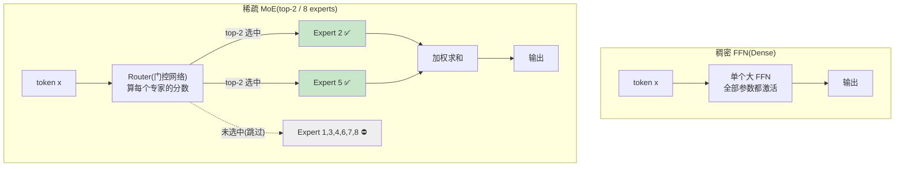
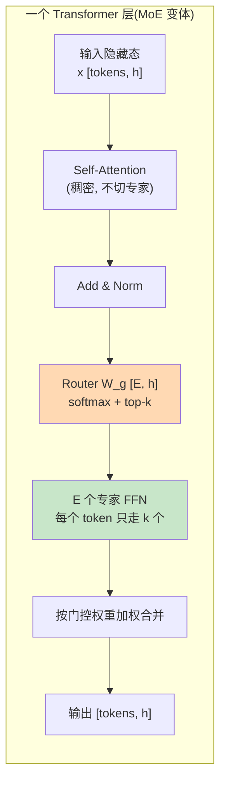
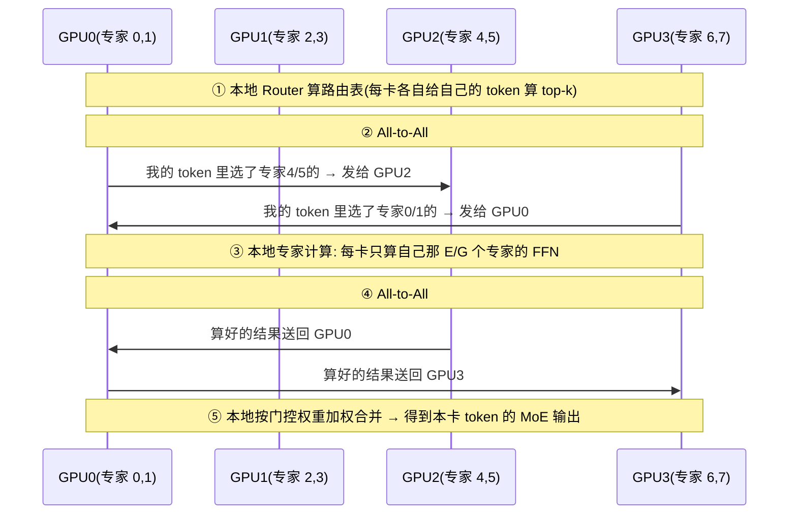
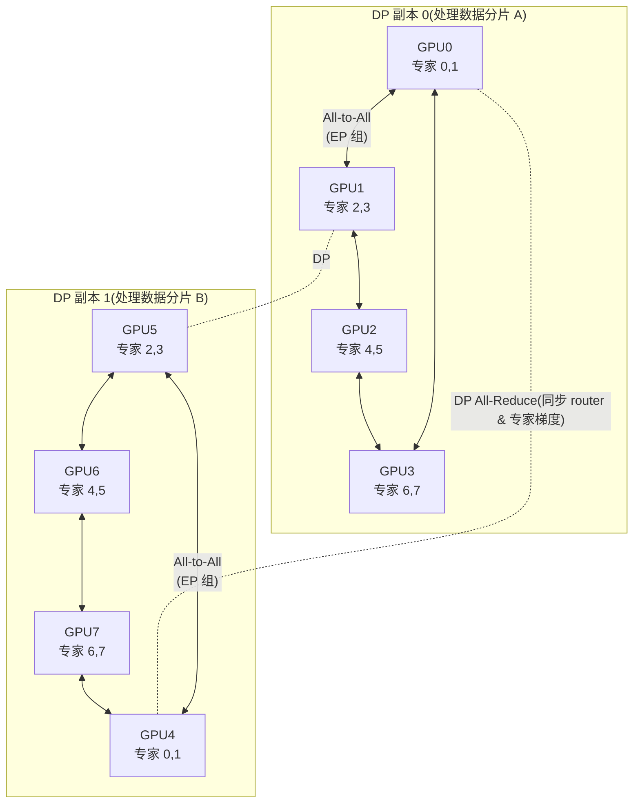
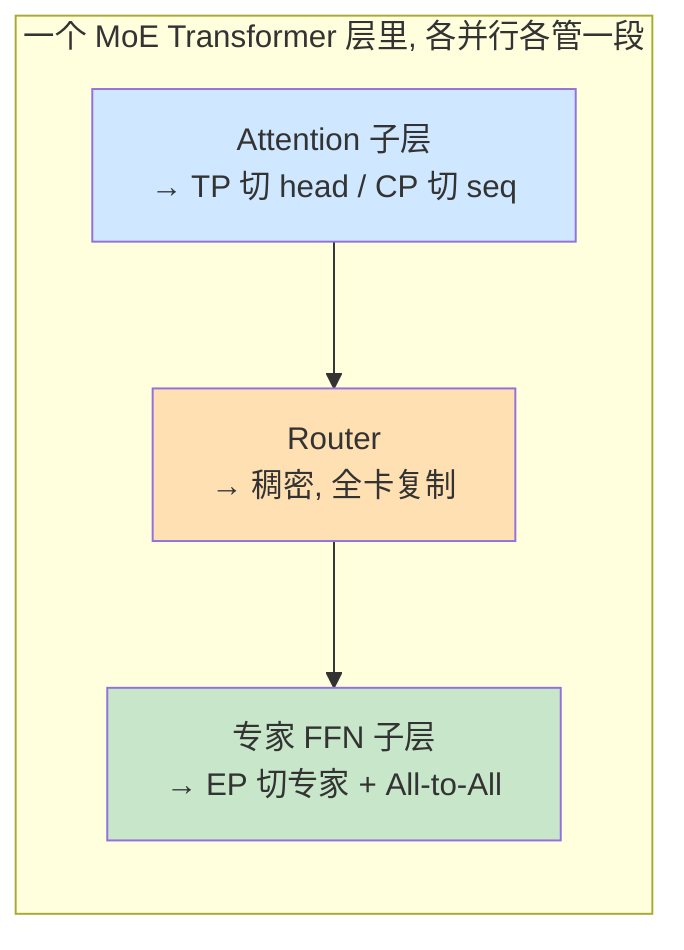
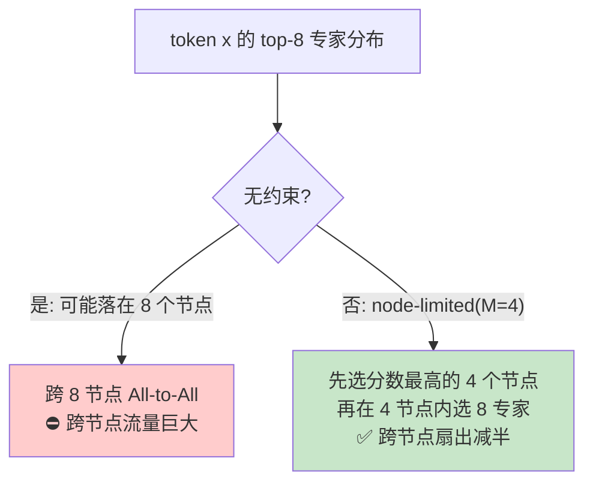
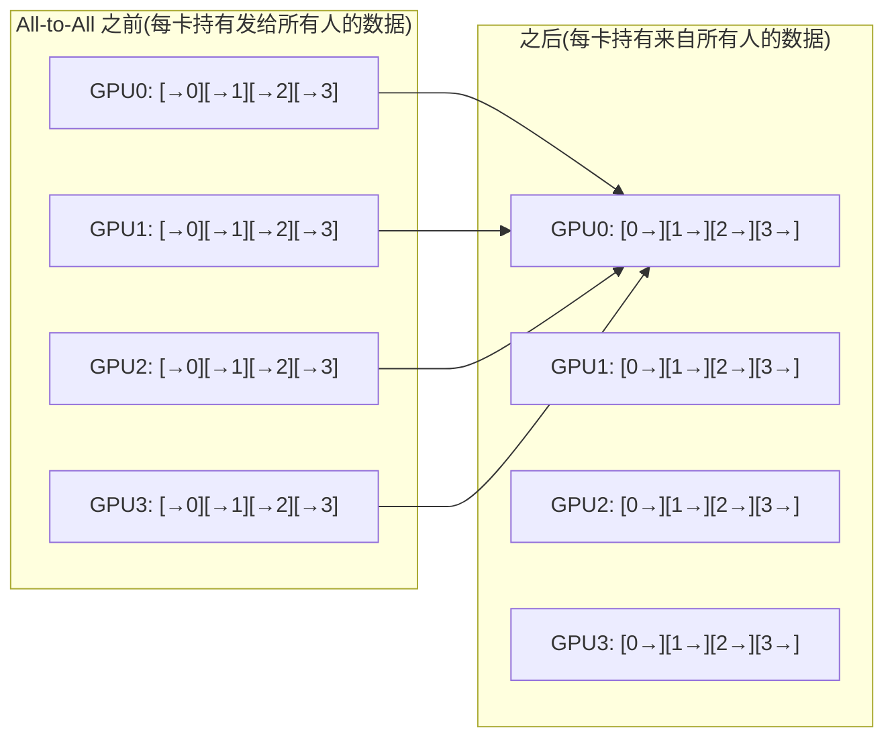
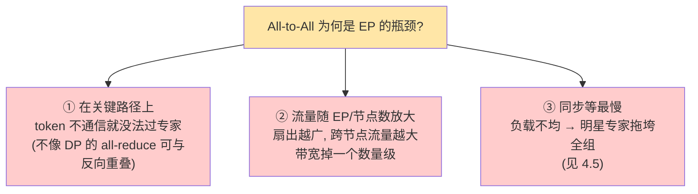
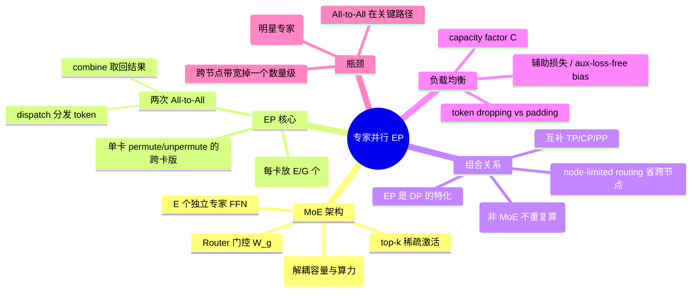

# 第 6 章 专家并行 EP：MoE 的分布式

> 对应《The Ultra-Scale Playbook: Training LLMs on GPU Clusters》(HuggingFace, Nouamane Tazi、Ferdinand Mom、Haojun Zhao 等) **第 7 章 Expert Parallelism（PDF 第 135–139 页）**，并融合 **第 8 章 5D Parallelism in a Nutshell（第 141–151 页）** 中关于 EP 与其它并行交互的论述。
>
> 原书这一章正文只有 4 页 + 2 张图（FIG.LVII Switch Transformer 的 MoE 层、FIG.LVIII MoE Survey 的并行示意），因为 EP 在概念上"看起来很简单"——把不同专家放到不同卡上就行。但**真正的工程难点全藏在两件事里：All-to-All 通信、负载均衡（capacity factor）**。本讲把书里一笔带过的部分全部展开：逐行讲代码、逐步推公式、逐个给数值例，并补上大量对比表与 mermaid 图。

---

## 🗺️ 本章地图：我们走到哪了

整本《Ultra-Scale Playbook》是一条"**单卡 → 多卡 → 多机 → 5D 并行 → 压榨 GPU**"的升级路线。EP 是这条路上的**第五块、也是最后一块并行拼图**：


原书在第 8 章（第 142 页）把五种并行总结成一句话——**每一种并行都是"沿某个维度把张量切开"**：

| # | 并行 | 沿哪个维度切（along the … dimension） | 切完省了什么 |
|---|------|------|------|
| 1 | 数据并行 DP（Data Parallelism） | batch 维（批次） | 靠 ZeRO 省优化器/梯度/参数显存 |
| 2 | 张量并行 TP（Tensor Parallelism） | hidden 维（隐藏维） | 省权重 + 激活显存 |
| 3 | 序列/上下文并行 SP/CP | sequence 维（序列长） | 省激活显存（长序列） |
| 4 | 流水线并行 PP（Pipeline Parallelism） | layer 维（模型层） | 省权重显存（深模型） |
| 5 | **专家并行 EP（Expert Parallelism）** | **expert 维（专家）** | **省 MoE 权重显存** |

EP 和前四种最大的不同：**它只在模型含 MoE（Mixture of Experts，混合专家）层时才存在**。换句话说，EP 不是"通用并行"，而是"**为 MoE 量身定制的并行**"。这也是它被排在 5D 拼图最后一块的原因——理解它，你就集齐了"5D 并行"的全部五个字母 **DP / TP / PP / CP / EP**。

> 🔬 **第一性原理（贯穿全章）**：本书的灵魂是"**显存 / 计算 / 通信**三者的权衡"。对每一种并行我们都问同样四个问题：
> 1. **切什么**？（切显存里的哪个张量）
> 2. **通信什么**？（为这次切分要在卡间搬运什么）
> 3. **何时用**？（什么场景划算）
> 4. **瓶颈在哪**？（代价是什么）
>
> 对 EP，这四个答案是：**切专家（每张卡只放一部分专家的 FFN 权重）→ 通信 token（用 All-to-All 把 token 路由到对应专家、再送回）→ 当专家很多、模型容量大时用 → 瓶颈是 All-to-All 通信 + 专家负载不均**。这一句话就是整章的骨架。

---

## 1️⃣ MoE 与稀疏激活回顾：router、top-k、experts

要讲 EP，先得把它的"宿主"——MoE 架构——讲透。如果你完全没接触过 MoE，原书在第 137 页推荐了一篇更短的 HuggingFace 博客（链接 A：`https://huggingface.co/blog/moe`）。这里我们从零讲起。

### 1.1 是什么：稠密 FFN vs 稀疏 MoE

标准 Transformer 每一层有两个子模块：**注意力（Attention）** 和 **前馈网络（FFN，Feed-Forward Network，也叫 MLP）**。FFN 通常是模型里**参数最多**的部分：

$$
\text{FFN}(x) = W_2 \,\cdot\, \sigma\!\big(W_1 x\big), \quad W_1 \in \mathbb{R}^{d_{ff}\times h},\; W_2 \in \mathbb{R}^{h\times d_{ff}}
$$

其中 $h$ 是隐藏维（hidden size），$d_{ff}$ 是中间维，典型 $d_{ff}=4h$。一个 FFN 的参数量是 $2 \cdot h \cdot d_{ff} = 8h^2$。

> 📌 **关键观察**：稠密模型里，**每个 token 都要过同一个 FFN**，也就是"激活了全部 $8h^2$ 个参数"。模型想变强，最直接的办法是把 FFN 变大，但 FFN 一大，**每个 token 的计算量（FLOPs）也线性变大**，训练/推理都变贵。

MoE 的核心 idea（原书第 137 页原文）：

> "instead of having a single feedforward module per layer, we can have several parallel modules and route tokens through them to be processed differently."
>
> 与其每层只放**一个** FFN，不如放**好几个并行的 FFN**，再把 token 路由到不同的 FFN 去处理。

这"好几个并行的 FFN"就叫 **专家（experts）**。每个专家是一个独立的 FFN，结构一样、权重不同。一层里放 $E$ 个专家（DeepSeek-V3 用了 $E=256$ 个）。

### 1.2 为什么：稀疏激活 = 参数多但计算省

MoE 的魔法在于 **稀疏激活（sparse activation）**：虽然一层有 $E$ 个专家，但**每个 token 只被送进其中 $k$ 个专家**（$k$ 通常是 1 或 2，叫 top-$k$）。于是：

- **总参数量**（model capacity，模型容量）$\propto E$：专家越多，模型"知识"越多。
- **每个 token 的计算量**（active params，激活参数）$\propto k$：和 $E$ 无关！

这就把"**模型多大**"和"**每个 token 算多少**"解耦了。你可以把参数量堆到上万亿，而每个 token 的计算量只相当于一个小稠密模型。



> 💡 **实战 / 面试高频**：一句话区分"参数量"和"激活参数量"。
> - **Mixtral 8×7B**：8 个专家、top-2。**总参数 ≈ 46.7B**，但每个 token 只走 2 个专家，**激活参数 ≈ 12.9B**。推理速度≈13B 稠密模型，知识量≈47B 模型。
> - **DeepSeek-V3**：256 个路由专家 + 1 个共享专家、top-8。**总参数 671B**，**激活参数仅 37B**（约 5.5%）。这就是"用 37B 的算力，喂 671B 的容量"。

### 1.3 怎么用：Router（门控）+ top-k 的数学

MoE 的"大脑"是 **路由器 Router**（也叫门控网络 gating network）。它是一个很小的线性层 $W_g \in \mathbb{R}^{E\times h}$，输入 token 的隐藏向量 $x\in\mathbb{R}^h$，输出 $E$ 个分数（每个专家一个），决定 token 该去哪几个专家。

**第 1 步：算门控分数（logits）**

$$
g = W_g\, x \in \mathbb{R}^{E}, \qquad p = \mathrm{softmax}(g) \in \mathbb{R}^{E}
$$

$p_i$ 就是"token 应该交给专家 $i$ 的概率/权重"。

**第 2 步：选 top-k 个专家**

取 $p$ 里最大的 $k$ 个，记下标集合 $\mathcal{T}=\text{top-}k(p)$。其余专家直接跳过（这就是"稀疏"）。

**第 3 步：归一化权重并加权求和**

$$
y = \sum_{i\in\mathcal{T}} \tilde{p}_i \cdot \text{Expert}_i(x), \qquad \tilde{p}_i = \frac{p_i}{\sum_{j\in\mathcal{T}} p_j}
$$

（top-2 时常把选中的两个权重重新归一化，使其和为 1。）

> 🔢 **数值例（手算一遍 top-2）**：设 $E=8$ 个专家，router 对某个 token 输出 logits
> $$g = [2.0,\ 0.5,\ 3.0,\ -1.0,\ 1.0,\ 0.2,\ 2.5,\ -0.5]$$
> softmax 后（指数归一）最大的是专家 3（$g=3.0$）和专家 7（$g=2.5$）。
> - $e^{3.0}=20.09,\ e^{2.5}=12.18$，其它加起来 $e^{2.0}+e^{1.0}+e^{0.5}+\dots \approx 7.39+2.72+1.65+1.22+0.61+0.37 \approx 13.96$。总和 $\approx 46.23$。
> - $p_3 = 20.09/46.23 = 0.435,\quad p_7 = 12.18/46.23 = 0.263$。
> - top-2 重新归一化：$\tilde{p}_3 = 0.435/(0.435+0.263)=0.623$，$\tilde{p}_7=0.377$。
> - 最终 $y = 0.623\cdot \text{Expert}_3(x) + 0.377\cdot \text{Expert}_7(x)$。专家 1/2/4/5/6/8 **一次乘法都不做**——这就是稀疏激活省算力的来源。

### 1.4 FIG.LVII：Switch Transformer 的 MoE 层

原书第 136 页的 FIG.LVII 直接搬了 **Switch Transformer**（Fedus et al. 2022，参考文献 [3]）论文里的经典图。Switch Transformer 是 MoE 的一个里程碑，它把 top-$k$ 简化到 **top-1**（每个 token 只去 1 个专家），极大简化了路由与通信。其结构正是上面 mermaid 右半边的样子：token → Router → 选 1 个专家 → 输出。



> ⚠️ **常见坑**：注意 **MoE 只替换 FFN，不动 Attention**。原书第 148 页明确说："Expert parallelism primarily affects the MoE layers (which replace standard MLP blocks), leaving attention layers and other components unchanged."——注意力层、LayerNorm、Embedding 全是稠密的，照常计算。这个事实**直接决定了后面 EP 必须和 DP 搭配用**（见第 3 节）。

### 1.5 代码：一个最小可跑的 MoE 层（单卡）

先不谈分布式，把单卡上的 MoE 写出来、逐行讲清。理解了它，EP 不过是"把 `self.experts` 这个列表拆到多张卡上"而已。

```python
import torch
import torch.nn as nn
import torch.nn.functional as F

class Expert(nn.Module):
    """一个专家就是一个普通的 FFN(SwiGLU 这里简化成 ReLU)。"""
    def __init__(self, h, d_ff):
        super().__init__()
        self.w1 = nn.Linear(h, d_ff, bias=False)   # 升维 [h -> d_ff]
        self.w2 = nn.Linear(d_ff, h, bias=False)   # 降维 [d_ff -> h]

    def forward(self, x):                          # x: [num_tokens, h]
        return self.w2(F.relu(self.w1(x)))         # 返回: [num_tokens, h]

class MoELayer(nn.Module):
    def __init__(self, h, d_ff, num_experts, top_k):
        super().__init__()
        self.h = h
        self.num_experts = num_experts             # E
        self.top_k = top_k                         # k
        self.router = nn.Linear(h, num_experts, bias=False)   # W_g: [E, h]
        # E 个独立专家, 用 ModuleList 装起来
        self.experts = nn.ModuleList(
            [Expert(h, d_ff) for _ in range(num_experts)]
        )

    def forward(self, x):
        # x: [batch, seq, h] -> 摊平成 [N, h], N = batch*seq 个 token
        b, s, h = x.shape
        x = x.reshape(-1, h)                        # [N, h]
        N = x.shape[0]

        # 1) Router 算门控分数 -> [N, E]
        logits = self.router(x)                     # 每个 token 对每个专家一个分数
        probs = F.softmax(logits, dim=-1)           # [N, E] 概率

        # 2) 选 top-k: 返回权重 topk_w [N, k] 和专家下标 topk_idx [N, k]
        topk_w, topk_idx = torch.topk(probs, self.top_k, dim=-1)
        topk_w = topk_w / topk_w.sum(dim=-1, keepdim=True)   # 重新归一化, 和为 1

        # 3) 逐专家计算: 把分给专家 e 的 token 聚到一起算(避免 N 次小 matmul)
        y = torch.zeros_like(x)                     # 输出累加器 [N, h]
        for e in range(self.num_experts):
            # 找出"哪些 token 的 top-k 里包含专家 e"
            mask = (topk_idx == e)                  # [N, k] 布尔
            token_ids, slot = mask.nonzero(as_tuple=True)  # 命中的 token 行号
            if token_ids.numel() == 0:
                continue                            # 没 token 选这个专家, 跳过
            xe = x[token_ids]                       # 取出这些 token [n_e, h]
            ye = self.experts[e](xe)                # 过专家 e 的 FFN [n_e, h]
            w  = topk_w[token_ids, slot].unsqueeze(-1)  # 这些 token 给 e 的权重
            y.index_add_(0, token_ids, w * ye)      # 加权累加回输出
        return y.reshape(b, s, h)                   # 还原形状 [batch, seq, h]
```

**逐段拆解**：

- `self.router = nn.Linear(h, num_experts)`：门控就是一个 `[E, h]` 的矩阵，参数量极小（$E\cdot h$），相比专家权重（$E\cdot 8h^2$）可忽略。
- `torch.topk(probs, k)`：PyTorch 内置，沿最后一维取最大的 $k$ 个，**同时返回值和下标**——下标 `topk_idx` 就是"这个 token 该去哪几个专家"，是后面 All-to-All 的路由表。
- **第 3 步的"逐专家聚合"是性能关键**：朴素写法是对每个 token 单独调它的专家，会产生 $N$ 次极小的矩阵乘，GPU 利用率惨不忍睹。正确做法是 `mask.nonzero()` 把"选了专家 $e$ 的所有 token"一次性聚成一个 `[n_e, h]` 的大张量，做**一次**大 matmul。**这个"聚集（gather/permute）+ 散回（scatter）"的动作，在分布式里就升级成了 All-to-All。**
- `y.index_add_(0, token_ids, w*ye)`：把专家输出按门控权重加权，散回到对应 token 的位置。`index_add_` 是原地按下标累加，对 top-$k$（一个 token 来自多个专家）天然正确。

> 🔬 **第一性原理**：单卡 MoE 的本质就是 **"permute（按专家分组）→ 专家计算 → unpermute（散回原位）"**。把这三步里的"专家"分散到多张卡，permute/unpermute 就必须**跨卡搬数据**——那正是 EP 的 All-to-All。所以：**EP = 单卡 MoE 的 permute/unpermute 升级成跨卡 All-to-All**。记住这句，整章就通了。

---

## 2️⃣ 专家并行 EP：把专家放到不同卡，用 All-to-All 路由

### 2.1 是什么：沿专家维切

原书第 137 页把 EP 讲得很干脆：

> "Since the feedforward layers are fully independent, we can simply put each expert's feedforward layer on a different worker. Compared to TP, this approach is much more lightweight, since we don't need to split the matrix multiplication; we just need to route the hidden states of a token to the right expert."

翻译过来：因为各个专家的 FFN **彼此完全独立**（专家 3 的计算不依赖专家 5 的任何中间结果），我们可以**简单地把每个专家整个放到不同的卡上**。

> 💡 **EP 比 TP "轻"在哪？** 这是面试高频对比。
> - **TP（张量并行）**：把**同一个** matmul $W_1 x$ 沿 hidden 维切成两半，分别在两卡算，**每一层内部都要 all-reduce 把部分和拼起来**——通信在计算的关键路径上，频繁且无法跳过。
> - **EP（专家并行）**：不切 matmul，而是把**整个专家 FFN** 当一个不可分的原子，放到某张卡。卡之间只需要"**把 token 送到正确的卡，再把结果取回来**"。通信是"搬 token"而不是"拼矩阵部分和"，**每个 MoE 层只需 2 次 All-to-All**。

### 2.2 怎么用：EP 的四步流水

设 EP 组里有 $G$ 张卡（EP size $=G$），$E$ 个专家**均匀分到** $G$ 张卡，每卡放 $E/G$ 个专家。一个 MoE 层在 EP 下的前向分四步：



**四步详解**：

1. **本地路由（Router）**：每张卡持有自己那一份 token（这部分和 DP 一样，每卡处理不同的数据批次），各自跑 Router 算出每个 token 的 top-$k$ 专家。这一步**无通信**。
2. **All-to-All #1（dispatch / 分发）**：根据"目的专家在哪张卡"，把 token 重排后**互相交换**。交换完，每张卡手里都是"该由本卡专家处理的 token"。
3. **本地专家计算**：每卡只对**自己的 $E/G$ 个专家**做 FFN（就是 1.5 节那个"聚集→大 matmul→散回"，只不过现在 token 已经是别人发来的）。
4. **All-to-All #2（combine / 合并）**：把专家算出的结果**沿原路送回**到 token 原本所在的卡。回去后每卡再按门控权重加权合并，得到自己 token 的最终 MoE 输出。

> 🧠 **为什么是"两次" All-to-All？** 一次去（token 去找专家）、一次回（结果回到 token 原主）。All-to-All 是"**每张卡都要给其它每张卡发一块、也从每张卡收一块**"的集合通信，正好对应"token 被打散到各卡专家、再聚回"。

### 2.3 代码：EP 的前向（含 `dist.all_to_all`）

下面是 EP 前向的最小骨架，重点看 **两次 `all_to_all` 和张量形状的变化**。

```python
import torch
import torch.distributed as dist

def moe_ep_forward(x, router, local_experts, ep_group,
                   num_experts, top_k, capacity):
    """
    x:             [N, h]   本卡持有的 token(已摊平)
    router:        nn.Linear(h, num_experts)  全卡共享同一份 router 权重
    local_experts: 本卡负责的那 E/G 个专家(一个 ModuleList)
    ep_group:      EP 通信组, world_size = G
    capacity:      每个专家最多收多少 token(容量, 见第 4 节)
    """
    G = dist.get_world_size(ep_group)           # EP 组大小
    experts_per_rank = num_experts // G         # 每卡 E/G 个专家
    N, h = x.shape

    # ---------- ① 本地路由 ----------
    logits = router(x)                          # [N, E]
    probs  = torch.softmax(logits, dim=-1)
    topk_w, topk_idx = torch.topk(probs, top_k, dim=-1)  # [N, k] 权重和专家号
    topk_w = topk_w / topk_w.sum(-1, keepdim=True)

    # 把 (token, 被选专家) 摊成一条条"路由请求", 共 N*k 条
    dest_expert = topk_idx.reshape(-1)          # [N*k] 每条请求的目的专家号
    dest_rank   = dest_expert // experts_per_rank  # [N*k] 目的专家在哪张卡

    # ---------- ② 准备 All-to-All #1 的发送缓冲 ----------
    # 按目的卡把 token 分桶, 每桶补齐/截断到 capacity(保证各卡发送量一致)
    send_buf, send_meta = build_dispatch_buffer(
        x, topk_idx, topk_w, dest_rank, G, capacity, h)   # 见下文说明
    # send_buf: [G, capacity*experts_per_rank, h]  发给每张卡一块

    recv_buf = torch.empty_like(send_buf)       # 接收缓冲, 形状相同
    # All-to-All: 第 g 块发给 rank g, 同时从每个 rank 收一块
    dist.all_to_all_single(recv_buf, send_buf, group=ep_group)

    # ---------- ③ 本地专家计算 ----------
    # recv_buf 现在装的是"该由本卡专家处理的 token"
    recv_buf = recv_buf.reshape(G, experts_per_rank, capacity, h)
    out = torch.zeros_like(recv_buf)
    for j, expert in enumerate(local_experts):  # 遍历本卡的 E/G 个专家
        xe = recv_buf[:, j].reshape(-1, h)      # 该专家收到的所有 token
        out[:, j] = expert(xe).reshape(G, capacity, h)

    # ---------- ④ All-to-All #2: 把结果送回原卡 ----------
    combine_buf = torch.empty_like(out.reshape(send_buf.shape))
    dist.all_to_all_single(combine_buf, out.reshape(send_buf.shape),
                           group=ep_group)

    # ---------- ⑤ 本地按门控权重加权, 散回原 token 位置 ----------
    y = scatter_combine(combine_buf, send_meta, topk_w, N, h)  # [N, h]
    return y
```

**逐行讲解（重点）**：

- `dest_rank = dest_expert // experts_per_rank`：这是**路由的核心一行**——专家号整除"每卡专家数"，就得到"该 token 要发往哪张卡"。例如 8 专家、4 卡（每卡 2 专家），专家 5 → `5 // 2 = 2`，发往 GPU2。
- `dist.all_to_all_single(recv_buf, send_buf, group)`：**本章最重要的通信原语**。它要求 `send_buf` 沿第 0 维被切成 $G$ 等份，**第 $g$ 份发给 rank $g$**；同时本卡从每个 rank 各收一份，拼成 `recv_buf`。形状 `[G, capacity*experts_per_rank, h]` 里那个 $G$ 维就是"发给谁/从谁收"。
- **为什么要 `capacity` 把每桶补齐到定长？** All-to-All 的高效实现要求"**每张卡发给每张卡的块大小相同且静态已知**"。但路由是动态的——这一步谁也不知道会有多少 token 选某专家。于是引入 **capacity（容量）**：给每个专家固定一个槽位上限，多了丢弃、少了 padding（第 4 节详谈）。这把"动态稀疏"硬塞进了"静态稠密通信"。
- 第 ④ 步的 combine All-to-All 是 dispatch 的**逆操作**：把每张卡算好的专家输出，按"它原本来自哪张卡"原路退回。
- `scatter_combine`：回到原卡后，一个 token 的 $k$ 份专家结果按门控权重 $\tilde p$ 加权求和，散回它在 `[N, h]` 里的原位——和单卡 1.5 节的 `index_add_` 一模一样，只是 token 刚从外地出差回来。

> ⚠️ **常见坑：router 权重必须全卡一致**。Router 是稠密的小线性层，每张卡都持有**同一份** $W_g$（靠 DP 的 all-reduce 同步梯度）。如果各卡 router 不一致，同一个 token 在不同卡会被路由到不同专家，逻辑就崩了。

---

## 3️⃣ EP 与 DP / TP / PP / CP 的关系与组合

### 3.1 为什么 EP 必须和 DP 一起用

原书第 137 页给了**最关键的一句**：

> "EP only affects the MoE layers and doesn't shard the input tokens (unlike context parallelism). This means our GPUs would be doing redundant computation for all the non-MoE blocks if we only used EP. By combining EP with DP, we can efficiently shard both the experts and the input batches across our GPUs."

拆开理解：

- EP **只切 MoE 层的专家**，它**不切输入 token**（不像 CP 沿序列切）。
- 那么对于**非 MoE 的部分**（Attention、LayerNorm、Embedding——它们是稠密的），如果只用 EP，每张卡岂不是要**对同样的 token 重复算一遍**？那就纯属浪费。
- 解决办法：**EP 叠加 DP**。让不同卡持有**不同的数据批次**（DP 的职责），这样非 MoE 部分天然被 DP 分摊（每卡算自己的 batch，不重复）；而 MoE 部分再叠 EP（每卡放不同专家）。两者正交、互补。

> 📌 原书第 147 页的一句精辟注解：
> "some implementations consider **expert parallelism to be a subset of data parallelism**, with the key difference being that EP uses specialized expert routing rather than having all GPUs process inputs through identical model copies."
>
> **EP 可以看作 DP 的一个变种**：DP 是"每卡一份完整模型副本，各处理不同数据"；EP 是"每卡只放一部分专家，各处理不同数据，再用 All-to-All 互通有无"。

### 3.2 EP × DP 的二维网格

实际部署时，GPU 被组织成一个 **EP × DP 的二维网格**。下面以 8 张卡、`EP=4`、`DP=2` 为例（共 $4\times 2=8$ 卡）：



- **横向（EP 组）**：GPU0–3 是一个 EP 组，组内用 **All-to-All** 路由 token。GPU4–7 是另一个 EP 组。
- **纵向（DP 组）**：GPU0 与 GPU4 都放"专家 0,1"，它们是一个 DP 组，**反向时用 All-Reduce 同步专家 0,1 的梯度**（以及共享的 router、attention 权重）。
- 这样：**专家被 EP 切开省了显存，数据被 DP 切开避免重复算**，两个维度各司其职。

### 3.3 EP × TP / PP / CP：互补还是冲突？

原书第 145 页讲了各维度如何组合。核心原则：**TP 留给节点内高速通信，EP/PP/ZeRO 用于跨节点**。

| 组合 | 关系 | 关键说明 |
|------|------|---------|
| **EP + DP** | 必配 | 见 3.1，DP 负责非 MoE 部分不重复算 |
| **EP + TP** | 互补 | 原书第 145 页："CP and EP also help us shard activations, complementary to TP"。TP 切 Attention 与共享层，EP 切专家；常一起用（DeepSeek-V3 同时用 TP + EP） |
| **EP + PP** | 可组合 | PP 沿层切，EP 沿专家切，正交。但要小心 PP 的负载均衡——含 MoE 的层更重 |
| **EP + CP** | 可组合 | 原书第 145 页："EP enables distributed MoE training, they can be combined without any particular issues"。CP 切序列、EP 切专家，互不干扰 |
| **EP + ZeRO** | 可组合 | ZeRO 在 DP 维度切优化器/梯度/参数，与 EP 正交 |



> 💡 **DeepSeek-V3 的真实配置（面试常考）**：TP + EP + PP + ZeRO-1 + DP 全用上。其中 **EP=64**（256 专家分到 64 卡，每卡 4 专家），PP 配合 DualPipe（见第 5 章），ZeRO-1 只切优化器状态。"5D 并行"在它身上集齐。

### 3.4 关键优化：节点受限路由（node-limited routing）

原书第 139 页点了 DeepSeek-V3 的一个**省通信绝招**：

> "DeepSeek-V3 enforces a constraint in the router, ensuring that each token is sent to at most M nodes (in their case, 4) to keep the tokens on a single node and reduce communication overhead."

**问题**：专家分散在很多卡上（甚至跨很多节点）。如果一个 token 的 top-8 专家恰好落在 8 个不同**节点**上，那这个 token 的数据就要发往 8 个节点——All-to-All 跨节点流量爆炸。

**DeepSeek-V3 的解法**：在 router 里加一条硬约束——**每个 token 最多只能被发往 $M=4$ 个节点**。具体做法是先按节点聚合分数、只保留分数最高的 4 个节点，再在这些节点内选 top-8 专家。这样把跨节点 All-to-All 的"扇出"从最坏 8 节点压到 4 节点，**跨节点流量直接砍半**。



> 🔬 **第一性原理**：MoE 分布式的成败八成取决于"**跨节点 All-to-All 流量**"。任何能把 token 的"专家足迹"约束在更少节点内的设计（node-limited routing、共享专家放本地、专家亲和性分组），都是在直接砍通信。

---

## 4️⃣ 负载不均与 Capacity Factor（容量因子）

### 4.1 问题：路由是动态的，硬件却要静态

EP 最让人头疼的，是 **专家负载不均（load imbalance）**。Router 是学出来的，它**没有义务把 token 均匀分给各专家**。常见现象：少数"明星专家"被挤爆，多数专家门可罗雀。

但 All-to-All 通信和 GPU 计算**都要求静态、定长、均衡的缓冲**（见 2.3 的 capacity 讨论）。于是"动态稀疏路由"和"静态均衡硬件"之间产生了根本矛盾。**Capacity factor 就是为调和这个矛盾而生的。**

### 4.2 Capacity（容量）的定义与公式

设一个 EP 处理单元里共 $N$ 个 token、$E$ 个专家、top-$k$。如果路由**完全均匀**，每个专家期望收到的 token 数是：

$$
\text{expected per expert} = \frac{N \cdot k}{E}
$$

但为了应对不均，我们给每个专家分配一个**容量上限（capacity）**，引入 **容量因子 $C$（capacity factor）**：

$$
\boxed{\ \text{capacity} = \left\lceil C \cdot \frac{N \cdot k}{E} \right\rceil\ }
$$

- $C = 1.0$：容量正好等于均匀期望，不留余量——一旦不均就大量丢 token。
- $C > 1.0$（典型 $1.25\sim 2.0$）：留出缓冲，能容纳"略超额"的专家，但**会 padding（补零）**，浪费一部分算力和通信。
- **超过容量的 token 被丢弃（token dropping）**——它们跳过这个 MoE 层，直接靠残差连接（residual）原样透传到下一层。

### 4.3 数值例：手算容量、丢弃、padding

> 🔢 **设定**：$N = 4096$ 个 token（micro-batch 1、序列 4096），$E = 8$ 个专家，top-$k = 1$（Switch 风格）。
>
> **均匀期望**：每专家 $\frac{4096 \times 1}{8} = 512$ 个 token。
>
> **场景 A — $C=1.0$，容量 = 512**：
> 假设路由很不均，实际分布是
> | 专家 | 0 | 1 | 2 | 3 | 4 | 5 | 6 | 7 |
> |---|---|---|---|---|---|---|---|---|
> | 收到 token | 900 | 700 | 600 | 500 | 400 | 380 | 320 | 296 |
> - 专家 0：收 900，容量 512 → **丢 388 个**。
> - 专家 1：收 700 → 丢 188。专家 2：收 600 → 丢 88。
> - 专家 3–7：都 ≤512，不丢，但有空槽（padding）。
> - **总丢弃 = 388+188+88 = 664 个 token（16.2%）！** 这些 token 在本层没被任何专家处理，模型质量受损。
>
> **场景 B — $C=1.5$，容量 = $\lceil 1.5\times 512\rceil = 768$**：
> - 专家 0：收 900 → 丢 132（少多了）。专家 1：700 ≤ 768 → 不丢。其余都不丢。
> - **总丢弃 = 132 个（3.2%）**，质量大幅改善。
> - 代价：所有专家都按 768 槽位算/通信。实际只用了 $4096/8\text{专家} = 512$ 平均，**padding 浪费 ≈ $(768\times 8 - 4096)/(768\times 8) = (6144-4096)/6144 = 33\%$ 的专家算力与通信**。

> 📊 **容量因子的权衡表**：
>
> | 容量因子 $C$ | 容量(本例) | token 丢弃率 | padding 浪费 | 适用 |
> |---|---|---|---|---|
> | 1.0 | 512 | 高(本例 16%) | 0 | 路由很均时 / 推理 |
> | 1.25 | 640 | 中 | ~20% | 训练常用下限 |
> | 1.5 | 768 | 低(本例 3%) | ~33% | 训练较稳 |
> | 2.0 | 1024 | 极低 | ~50% | 训练初期/极不均 |
>
> **$C$ 是质量与效率的旋钮**：调大 → 丢得少、模型好，但算力/通信浪费多；调小 → 省资源，但丢 token 伤质量。

### 4.4 用辅助损失（auxiliary loss）治本

容量因子是"**事后兜底**"（治标）。治本是让 router **学会均匀分配**，办法是加一个 **负载均衡辅助损失（load balancing auxiliary loss）**。Switch Transformer 的经典形式：

$$
\mathcal{L}_{\text{aux}} = \alpha \cdot E \cdot \sum_{i=1}^{E} f_i \cdot P_i
$$

- $f_i$：实际被路由到专家 $i$ 的 token **比例**（$\sum_i f_i = 1$）。
- $P_i$：router 给专家 $i$ 的**平均门控概率**（$\sum_i P_i = 1$）。
- $\alpha$：辅助损失权重（典型 $0.01$）。

**为什么这个式子能促均衡？** 当某专家既被频繁选中（$f_i$ 大）又被给了高概率（$P_i$ 大），乘积 $f_i P_i$ 就大，损失高，梯度会**压低该专家的门控分数**，把 token 推给冷门专家。当 $f_i = P_i = 1/E$ 完全均匀时，$\sum f_i P_i = E\cdot(1/E)^2 = 1/E$ 取到最小，$\mathcal L_{\text{aux}}=\alpha$，惩罚最小。

> 🔢 **数值例**：$E=8$。完全均匀时 $\sum f_i P_i = 8\times \frac{1}{8}\times\frac18 = \frac18 = 0.125$，$\mathcal L_{\text{aux}}=0.01\times8\times0.125=0.01$。
> 极端不均（所有 token 都去专家 0）时 $f_0=1,P_0\approx1$，$\sum f_iP_i\approx1$，$\mathcal L_{\text{aux}}=0.01\times8\times1=0.08$——是均匀时的 8 倍，梯度据此把 token 往外推。

> 💡 **DeepSeek-V3 的进化：无辅助损失负载均衡（aux-loss-free）**。辅助损失会和主任务损失"打架"（强行均匀可能伤模型质量）。DeepSeek-V3 改用**给每个专家加一个可学习的 bias**，只在路由选择时加到分数上（不进入加权求和），动态地把 token 从过载专家"挤"到空闲专家，**既均衡又不污染主损失梯度**。这是 2024–2025 的前沿做法，面试加分项。

### 4.5 负载不均如何拖慢 All-to-All

负载不均不只伤质量，还**直接拖慢通信**。All-to-All 是同步集合通信——**所有卡必须等最慢的那块发完/收完**。如果专家 0 所在的卡要收 900 个 token，而别的卡只收 300 个，那么整个 All-to-All 被专家 0 那卡拖住，其余卡空等。

```mermaid
gantt
    title All-to-All 被"明星专家"拖慢(负载不均的代价)
    dateFormat X
    axisFormat %s
    section GPU0(专家0,1, 超载)
    收 900 token (重)      :crit, 0, 9
    section GPU1(专家2,3)
    收 500 token          :0, 5
    空等(被 GPU0 拖)       :done, 5, 9
    section GPU2(专家4,5)
    收 400 token          :0, 4
    空等(被 GPU0 拖)       :done, 4, 9
    section GPU3(专家6,7, 冷门)
    收 300 token          :0, 3
    空等(被 GPU0 拖)       :done, 3, 9
```



> ⚠️ **常见坑**：很多人以为容量因子只是"防丢 token"。其实它还隐含**让各卡通信量对齐**——把每桶补齐到 capacity，All-to-All 的每块就等大，硬件才能高效。负载越均，padding 越少、空等越少，通信越快。**质量(少丢) ↔ 效率(少 padding/空等)，全靠 $C$ 和辅助损失这两个旋钮拿捏。**

---

## 5️⃣ All-to-All 通信特性与瓶颈

EP 的命脉是 **All-to-All**。这一节把它讲透：它是什么、量多大、为什么是瓶颈、怎么算。

### 5.1 是什么：每卡对每卡都发一块

集合通信里你已经见过 All-Reduce、All-Gather、Reduce-Scatter。**All-to-All** 是更"密集"的一种：

> **All-to-All**：$G$ 张卡，每张卡把自己的数据切成 $G$ 份，**第 $g$ 份发给 rank $g$**；同时从每张卡各收一份。形象地说，它是一次"**矩阵转置式的全互换**"——发送矩阵的第 $(i,j)$ 块（rank $i$ 发给 rank $j$）变成接收矩阵的第 $(j,i)$ 块。



> 🆚 **All-to-All vs All-Reduce（面试高频对比）**：
> | 维度 | All-Reduce（DP/TP 用） | All-to-All（EP 用） |
> |---|---|---|
> | 语义 | 所有卡的数据**求和**后**人人拿到同一份** | 数据**重新分发**，人人拿到**不同**的一份 |
> | 内容 | 每卡发/收**相同**总量、相同内容 | 每卡发/收的**每一块都可能不同** |
> | 典型实现 | Ring / Tree | 两两点对点直发(pairwise) |
> | 数据守恒 | 输出是输入的归约(变小/同尺寸) | 输出总量≈输入总量(只是换了主) |
> | EP 里干嘛 | 同步专家/router 梯度(DP 维) | dispatch/combine token(EP 维) |

### 5.2 通信量分析：一个 MoE 层要搬多少字节

设 EP 组 $G$ 卡、每卡 $N$ 个 token、隐藏维 $h$、top-$k$、capacity factor $C$、用 bf16（2 字节）。

**dispatch（All-to-All #1）每卡发送量**：每个 token 要发往它的 $k$ 个专家。考虑容量补齐，每卡发送的有效数据约为

$$
V_{\text{dispatch}} \approx \underbrace{C}_{\text{容量倍率}} \cdot \underbrace{N \cdot k}_{\text{路由请求数}} \cdot \underbrace{h}_{\text{每 token 维度}} \cdot \underbrace{2}_{\text{bf16 字节}}\ \text{bytes}
$$

**combine（All-to-All #2）** 把结果送回，量级相同：$V_{\text{combine}} \approx V_{\text{dispatch}}$。

所以**一个 MoE 层前向的 All-to-All 总流量** $\approx 2\,V_{\text{dispatch}}$，反向再来一遍（梯度也要 All-to-All 回传），**整层约 $4\,V_{\text{dispatch}}$**。

### 5.3 数值例：算一次 All-to-All 要多久

> 🔢 **设定**：$N=4096$ token/卡，$h=4096$，top-$k=2$，$C=1.25$，bf16。
>
> **每 token 的字节**：$h\times2 = 4096\times2 = 8192\ \text{B} = 8\ \text{KB}$。
>
> **dispatch 每卡发送量**：
> $$V_{\text{dispatch}} = 1.25 \times 4096 \times 2 \times 8\ \text{KB} = 1.25\times 8192 \times 8\ \text{KB} \approx 80\ \text{MB}$$
> （$4096\times2 = 8192$ 条路由请求 × 8KB ×1.25 ≈ 80 MB。）
>
> **dispatch+combine 前向 ≈ 160 MB/卡**；**含反向整层 ≈ 320 MB/卡**。
>
> **换算时间**——关键看走什么链路：
> | 链路 | 单向带宽(经验值) | 80 MB 耗时 |
> |---|---|---|
> | NVLink (节点内, H100 NVSwitch) | ~400 GB/s | $80\text{MB}/400\text{GB/s} \approx 0.20$ ms |
> | InfiniBand (跨节点, 400Gb/s≈50GB/s) | ~50 GB/s | $80\text{MB}/50\text{GB/s} \approx 1.6$ ms |
> | 100 Gb 以太网 (跨节点) | ~12 GB/s | $80\text{MB}/12\text{GB/s} \approx 6.7$ ms |
>
> **结论**：同样 80 MB，跨节点比节点内**慢 8–30 倍**。这就是为什么 3.4 节 DeepSeek-V3 要拼命**把 token 约束在少数节点内**。

> 🔬 **对比专家计算量**：一个专家 FFN 处理 $C\cdot N\cdot k/E$ 个 token、每个 $2\times(2h\cdot d_{ff})=2\times2\times h\times4h=16h^2$ FLOPs（前向），算下来若 $E$ 大、$h$ 不够大，**通信时间会逼近甚至超过计算时间**——这就是 All-to-All 成为 EP 瓶颈的根因。**EP 的扩展性 = 计算能不能盖住 All-to-All。**

### 5.4 为什么 All-to-All 是瓶颈（三条原因）



1. **在计算的关键路径上**：token 不经过 dispatch 就到不了专家，专家算不完就 combine 不了。它**卡在前向中间**，不像 DP 的梯度 all-reduce 可以藏在反向计算后面慢慢重叠。
2. **流量随规模放大、且常跨节点**：EP 越大，专家越分散，token 的"专家足迹"越可能跨节点；而跨节点带宽比 NVLink 低一个数量级（5.3 表）。
3. **同步原语，等最慢**：All-to-All 是 barrier 式的，负载不均时整组被明星专家拖住（4.5 节）。

### 5.5 怎么缓解：重叠、分组、约束

| 手段 | 原理 | 例子 |
|---|---|---|
| **通信-计算重叠** | dispatch 发某专家 token 的同时，本地先算已收到的专家 | 流水化 All-to-All（如 DeepSeek DualPipe 的双向流水把 EP All-to-All 藏进计算） |
| **节点受限路由** | 限制 token 的专家足迹在 ≤M 个节点 | DeepSeek-V3 的 $M=4$（3.4 节） |
| **共享专家本地化** | 把"每个 token 都要过"的共享专家放本卡，免通信 | DeepSeek-V2/V3 的 shared expert |
| **分层 All-to-All** | 先节点内 All-to-All，再节点间，减少跨节点小包 | 多数高性能 MoE 库（Tutel、Megatron-MoE） |
| **更大 $h$/更少 $E$** | 提高计算/通信比，让计算盖住通信 | 架构层面权衡 |

---

## 6️⃣ 综合数值例：一个完整 MoE 层在 EP 下的账本

把前面的概念串成一笔总账，体会"显存/计算/通信"三角。

> 🔢 **设定**：模型 $h=4096$、$d_{ff}=14336$（SwiGLU，约 $3.5h$）、$E=8$ 专家、top-2、$C=1.25$；硬件 8×H100，EP=8（每卡 1 专家），每卡 micro-batch 处理 $N=4096$ token；bf16 权重、fp32 优化器。
>
> **① 显存（每卡省了多少）**：
> - 一个专家参数 $\approx 3\times h\times d_{ff} = 3\times4096\times14336 \approx 1.76\times10^8 = 176$M 参数（SwiGLU 3 个矩阵）。
> - 8 专家总计 $\approx 1.41$B 参数。**稠密放法**：每卡都要存全部 8 专家 = 1.41B×2B = **2.82 GB/卡**。
> - **EP=8**：每卡只存 1 个专家 = 176M×2B ≈ **0.35 GB/卡**。**省了 8 倍专家权重显存**。
>
> **② 计算（每卡算多少）**：
> - 每卡专家收到 $\approx C\cdot N\cdot k/1 = 1.25\times4096\times2 = 10240$ token（top-2，EP=8 即每卡 1 专家，全组 token 都可能来）。实际单专家均匀期望 $N\cdot k\cdot G/E /G= $ 约 $1024\times C$... 按本卡 1 专家、容量 $C\cdot(8\cdot4096\cdot2)/8 = C\times8192=10240$ 槽位。
> - 单 token 单专家前向 FLOPs $\approx 2\times3\times h\times d_{ff} = 6\times4096\times14336 \approx 3.5\times10^8$。
> - 本卡专家计算 $\approx 10240\times3.5\times10^8 \approx 3.6\times10^{12} = 3.6$ TFLOPs（前向）。H100 bf16 峰值 ~990 TFLOP/s，**理想 ≈ 3.6 ms**（含 padding 浪费 ~20%）。
>
> **③ 通信（All-to-All）**：
> - 前向 dispatch+combine ≈ 160 MB/卡（5.3 节同参数量级）。
> - 节点内 NVLink 400 GB/s → ≈ **0.4 ms**；跨节点 IB 50 GB/s → ≈ **3.2 ms**。
> - **节点内**：通信 0.4 ms vs 计算 3.6 ms，通信占比 ~10%，可接受；**跨节点**：通信 3.2 ms ≈ 计算 3.6 ms，**通信几乎和计算一样长，EP 严重受限**——再次印证"EP 尽量留在节点内 / node-limited routing"。

> 📊 **一图看尽 EP 的三角账**：
> | | 稠密(每卡全专家) | EP=8(每卡1专家, 节点内) | EP=8(跨节点) |
> |---|---|---|---|
> | 专家权重显存/卡 | 2.82 GB | **0.35 GB** ✅ | 0.35 GB ✅ |
> | 额外 All-to-All | 无 | +0.4 ms | +3.2 ms ⚠️ |
> | 计算/卡 | 同 | 3.6 ms | 3.6 ms |
> | 通信/计算比 | 0 | ~10% 👍 | ~90% ⛔ |

---

## 7️⃣ EP 落地决策清单与常见坑

### 7.1 何时用 EP

```mermaid
flowchart TD
    Q1{"模型是 MoE 架构吗?"} -->|否| NO["不用 EP<br/>(EP 只服务 MoE)"]
    Q1 -->|是| Q2{"专家数 E 多到<br/>单卡放不下/想省显存?"}
    Q2 -->|否, 专家少| MAYBE["可不用 EP<br/>每卡放全部专家(DP 即可)"]
    Q2 -->|是, 专家多| Q3{"EP 组能放进单节点吗?"}
    Q3 -->|能(E/卡比 ≤8)| EP_IN["✅ EP 留节点内<br/>走 NVLink, All-to-All 便宜"]
    Q3 -->|不能, 必须跨节点| EP_CROSS["⚠️ 跨节点 EP<br/>务必上 node-limited routing<br/>+ 通信重叠"]
    style EP_IN fill:#c8e6c9
    style EP_CROSS fill:#fff3cd
```

### 7.2 常见坑清单

- ⚠️ **router 不同步**：各卡 router 权重必须一致（DP all-reduce），否则路由逻辑崩。
- ⚠️ **容量因子设太小**：训练初期路由很不均，$C=1.0$ 会丢大量 token，loss 下不去。先大后小。
- ⚠️ **忘了非 MoE 部分**：只上 EP 不上 DP，Attention/Norm 会被每卡重复算，白白浪费。
- ⚠️ **跨节点 All-to-All 没重叠**：通信暴露在关键路径，GPU 利用率断崖。必须重叠或限制扇出。
- ⚠️ **专家分配不能整除**：$E$ 必须能被 EP size 整除，否则各卡专家数不等、负载先天不均。
- ⚠️ **梯度同步范围搞错**：专家梯度只在"放相同专家的 DP 组"内 all-reduce，不是全局；router/attention 才是全局 DP。

---

## 📌 本章小结



一句话总结每个重点：

1. **MoE 与稀疏激活**：一层放 $E$ 个专家，Router 给每个 token 选 top-$k$ 个，**只算 $k$ 个、跳过其余**——参数量 $\propto E$、计算量 $\propto k$，把"模型多大"和"每 token 算多少"解耦。Mixtral 47B 总/13B 激活，DeepSeek-V3 671B 总/37B 激活。
2. **专家并行 EP**：把整个专家 FFN 放到不同卡，用 **All-to-All 把 token 路由到对应专家卡、算完再 All-to-All 送回**。它是单卡 MoE "permute→算→unpermute" 的跨卡升级，比 TP 轻（不切 matmul，只搬 token）。
3. **EP 与 DP/TP/PP/CP**：EP **只切 MoE 层、不切 token**，所以**必须叠 DP** 才不会重复算非 MoE 部分；与 TP/CP/PP 正交可组合。EP 可视作"带专家路由的 DP"。跨节点用 **node-limited routing** 省通信。
4. **负载不均与 capacity factor**：路由动态、硬件要静态 → 用容量 $\text{capacity}=\lceil C\cdot Nk/E\rceil$ 兜底，**超额丢弃、不足 padding**；$C$ 是质量↔效率旋钮；治本靠**辅助损失**或 DeepSeek-V3 的 **aux-loss-free bias**。
5. **All-to-All 瓶颈**：它是"每卡对每卡发不同块"的全互换，**在关键路径上、随规模放大、跨节点带宽差一个数量级、同步等最慢**。数值上一层前向约搬 160 MB/卡，节点内 0.4 ms、跨节点 3.2 ms——**EP 扩展性的本质是"计算能否盖住 All-to-All"**。

> 🎯 **EP 四问速记**：**切专家 → 通信 token（All-to-All）→ MoE 多专家时用 → 瓶颈是 All-to-All + 负载不均**。

---

## 🔗 延伸阅读与动手

- **上一章**：[`05_流水线并行_PP_AFAB_1F1B_交错_零气泡DualPipe.md`](./05_流水线并行_PP_AFAB_1F1B_交错_零气泡DualPipe.md) —— DeepSeek DualPipe 正是用双向流水把 EP 的 All-to-All 藏进计算。
- **下一章**：[`07_5D并行总览_把所有维度拼起来.md`](./07_5D并行总览_把所有维度拼起来.md) —— EP 作为第 5 个字母，如何与 DP/TP/PP/CP 拼成 5D 网格。
- **配置选择**：[`08_寻找最优训练配置_显存_批量_吞吐_基准.md`](./08_寻找最优训练配置_显存_批量_吞吐_基准.md) —— EP size、容量因子如何进入搜索空间。
- **算子层**：[`09_深入GPU_融合_线程_混合精度_FlashAttention_融合核.md`](./09_深入GPU_融合_线程_混合精度_FlashAttention_融合核.md) —— 分组 GEMM（grouped GEMM）如何高效实现"各专家不同大小"的批量 matmul。
- **动手项目**：[`../projects/06_collectives_from_scratch/`](../projects/06_collectives_from_scratch/) —— 从零实现 All-to-All 等集合通信原语，亲手感受 EP 的通信骨架。
- **原书出处**：第 7 章 *Expert Parallelism*（PDF 第 135–139 页）、第 8 章 *5D Parallelism in a Nutshell*（第 141–151 页）。
- **延伸论文**：Switch Transformers [3]、GShard [5]、DeepSeek-V3 Technical Report [1]、A Survey on Mixture of Experts [4]；HuggingFace MoE 博客 `https://huggingface.co/blog/moe`。

> 至此，"5D 并行"的五个字母 **DP / TP / PP / CP / EP** 全部集齐。下一章我们把它们拼成一张完整的并行网格，看看万亿参数模型在万卡集群上到底是怎么切的。
