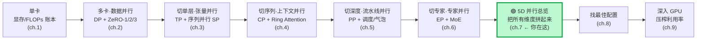
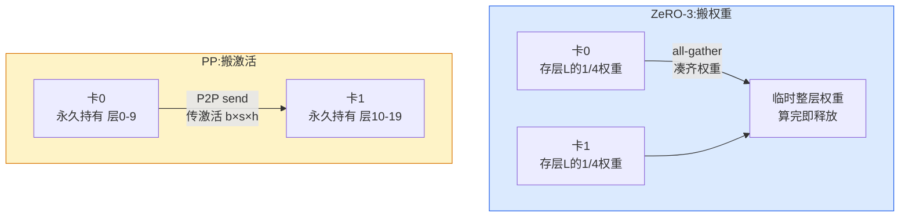
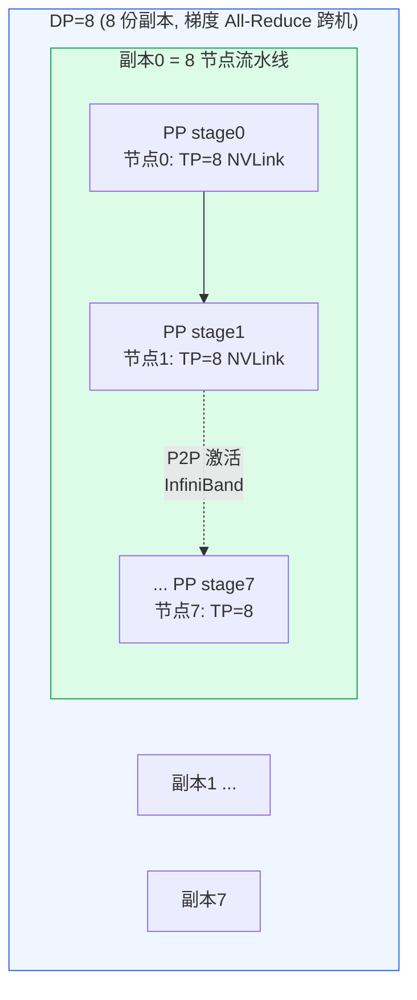
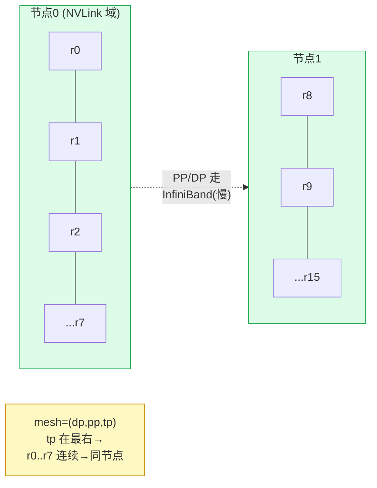
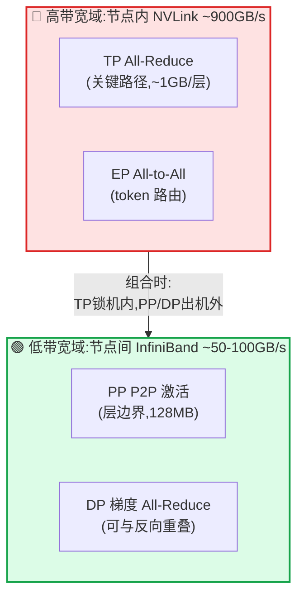
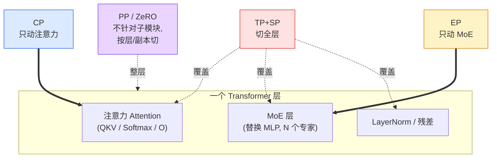
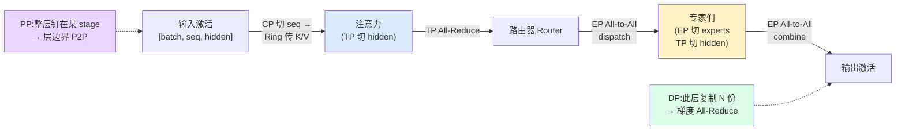
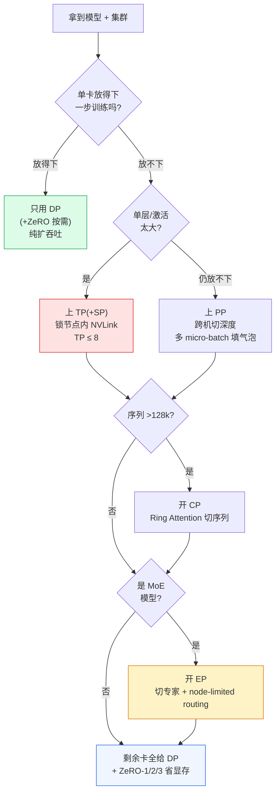

# 第 7 章 · 5D 并行总览:把 DP / TP / PP / CP / EP 拼起来

> 对应原书 **Chapter 8 — 5D Parallelism in a Nutshell**(《The Ultra-Scale Playbook: Training LLMs on GPU Clusters》, Nouamane Tazi / Ferdinand Mom / Haojun Zhao 等, HuggingFace),PDF 第 **141–152** 页。
>
> 这一章是整本书的「**收口章**」。前面六章我们一根一根地把五种并行轴拆开讲透了,这一章把它们**拧成一股绳**:谁能叠、谁互补、谁互斥,以及——最关键的——**每根轴应该贴在硬件的哪一层带宽上**。读完你应该能拿到一个真实集群(比如 512 张 H100),在脑子里直接排出 `TP / PP / DP / CP / EP` 的并行度组合。

---

## 🗺️ 0. 本章地图:我们走到哪了

先把整本书的主线拎出来,看看「5D 并行总览」站在哪个位置。一句话:**单卡装不下 → 多卡分摊 → 多机扩展 → 五个维度协同 → 最后压榨每一张 GPU 的利用率**。



读完前 6 章,你脑子里其实已经装了 **5 个独立的工具**。但真上 512 卡、1024 卡集群去训一个 671B 的 MoE 时,你不会只用其中一个——你会把它们**同时**用上。问题随之而来:

- `TP=8`、`PP=4`、`DP=2`,这三个数字怎么乘出我的总卡数?
- 为什么所有大厂都把 TP「锁」在节点内,而把 PP / DP 放到节点之间?
- CP 和 EP 都在「切激活」,它们会冲突吗?
- 给定一个模型 + 一个集群,我从哪个维度先动手?

本章就回答这些「**怎么拼**」的问题。原书把它分成两小节:

- **8.1 Scope and focus** —— 每种并行**作用在模型的哪个子模块**上(全模型?只注意力?只 MoE?)。
- **8.2 Summarizing it all** —— 一张「五合一」大图 + 一张「显存对比」大图 + 一张「终极取舍表」。

我们在原书基础上,额外补足 **5 维对照大表、通信量数值推导、硬件拓扑映射、`DeviceMesh` 代码逐行讲解**,把「拼起来」这件事讲到能上手。

---

## 🎓 1. 先把五根轴 + 三档 ZeRO 一次性回忆完

原书开篇先给读者发了一张「毕业证」:

> *Congratulations, reader! You have now seen all five parallelism strategies you can use to scale model training.*

**五种并行策略,各自沿着一个不同的张量维度切:**

| # | 策略 | 英文 / 缩写 | 沿哪个维度切 | 一句话本质 |
|---|------|-----------|--------------|------------|
| 1 | 数据并行 | Data Parallelism (**DP**) | **批次 batch** 维 | 每卡一份完整模型,各吃一块数据,梯度再 all-reduce 平均 |
| 2 | 张量并行 | Tensor Parallelism (**TP**) | **隐藏 hidden** 维 | 把单个权重矩阵按列 / 行切到多卡,激活也跟着切 |
| 3 | 序列 / 上下文并行 | Sequence / Context (**SP / CP**) | **序列 sequence** 维 | 把一条长序列的 token 切到多卡 |
| 4 | 流水线并行 | Pipeline Parallelism (**PP**) | **模型层 layers** 维(深度) | 第 0–9 层放卡 A、10–19 层放卡 B…… |
| 5 | 专家并行 | Expert Parallelism (**EP**) | **专家 experts** 维 | 把 MoE 里几百个 expert FFN 分散到多卡 |

**外加三档 ZeRO**(零冗余优化器 Zero Redundancy Optimizer),它们寄生在 DP 之上,专门省显存——把本来「每个 DP 副本各存一份」的东西,改成「在 DP 副本之间分片存」:

| 档位 | 在 DP 副本间分片掉谁 | 直觉 |
|------|----------------------|--------|
| **ZeRO-1** | 优化器状态 optimizer states | Adam 的 $m,v$ 是大头,先切它 |
| **ZeRO-2** | 优化器状态 **+** 梯度 gradients | 在 1 的基础上再切梯度 |
| **ZeRO-3** | 优化器状态 + 梯度 **+** 参数 parameters(= FSDP) | 连权重本身都不再每卡留全份 |

> 🔬 **第一性原理:5 根轴本质是在切同一个「工作量张量」。** 一次前向的工作量可以想成一个张量 $W \in \mathbb{R}^{B \times S \times L \times H \times E}$ —— 批次 $B$、序列 $S$、层数 $L$、隐藏维 $H$、专家数 $E$。**每一种并行就是把这个张量沿其中一个轴切开,分给不同 GPU。** DP 切 $B$、CP 切 $S$、PP 切 $L$、TP 切 $H$、EP 切 $E$。**轴互相正交,所以可以同时切** —— 这就是「5D 并行」这个名字的由来,也是它们能相乘组合的根本原因。

### 1.5 复盘:ZeRO 三档省了多少显存(带公式与数值)

既然原书在「毕业证」里把三档 ZeRO 也列了进来,我们顺手把它的显存账复盘一遍——这是后面理解「PP vs ZeRO-3」的基础。

混合精度 + Adam 训练时,**每个参数**要占的字节(经典 DeepSpeed 记法,$\Psi$ = 参数量):

$$
\underbrace{2\Psi}_{\text{bf16 权重}} + \underbrace{2\Psi}_{\text{bf16 梯度}} + \underbrace{\underbrace{4\Psi}_{\text{fp32 权重副本}}+\underbrace{4\Psi}_{\text{fp32 动量}m}+\underbrace{4\Psi}_{\text{fp32 方差}v}}_{\text{优化器状态}=12\Psi} = 16\Psi\ \text{字节}
$$

三档 ZeRO 把不同的部分在 $N$ 路 DP 副本间分片($N=\text{DP}$):

| 配置 | 每卡显存(模型相关) | 7.5B 模型 × DP=64 的每卡占用 |
|------|----------------------|------------------------------|
| Baseline(纯 DDP) | $16\Psi$ | $16\times7.5\text{B}=120\,\text{GB}$ ❌ 单卡放不下 |
| **ZeRO-1**(切优化器) | $2\Psi+2\Psi+\frac{12\Psi}{N}$ | $4\times7.5+\frac{90}{64}\approx 31.4\,\text{GB}$ |
| **ZeRO-2**(切优化器+梯度) | $2\Psi+\frac{2\Psi+12\Psi}{N}$ | $15+\frac{105}{64}\approx 16.6\,\text{GB}$ |
| **ZeRO-3**(全切=FSDP) | $\frac{16\Psi}{N}$ | $\frac{120}{64}\approx 1.9\,\text{GB}$ ✅ |

**逐项看**:7.5B 模型纯 DDP 要 120 GB/卡,直接 OOM;ZeRO-3 把它压到 1.9 GB/卡——**省了 64 倍(正好等于 DP 路数)**。代价是 ZeRO-3 每次用权重都要 all-gather(通信量 $\propto\Psi$),这正是它和 PP「搬激活」路线的根本分歧点(见 §2)。

> 💡 记住这条规律:**ZeRO-3 的省显存倍率 ≈ DP 路数**,但通信量也随之线性上涨——典型的「显存 ↔ 通信」权衡,贯穿全书。

---

## ⚖️ 2. 第一组对照:PP 与 ZeRO-3 长得最像,却走两条路

原书没有上来就甩五维大表,而是**先单挑一对最容易混淆的**:流水线并行 PP 和 ZeRO-3。为什么挑这俩?因为它们**解决的是同一个问题**——「一层一层地把模型权重铺在多张卡上,沿着模型深度方向做通信/计算」——但**手段完全相反**。

它们的相同点(原书原文):

> Both pipeline parallelism and ZeRO-3 are ways to partition the model weights over several GPUs and perform communication / computation along the model **depth** axis.

- 都沿**深度轴**切;
- 都是**整层算子**(full layer operation)在某张卡上完整执行——这点和 TP / EP 截然不同,TP / EP 是把**单层内部**再切成子单元(sub-layer units)算;
- ZeRO-3 在算当前层时,**预取(prefetch)下一层的权重**;PP 则是把不同层钉死在不同卡上。

> ⚠️ **原书的 NOTE**:这里说「一层(a layer)」只是为了简化。真正的分片单元可大可小——可能是好几层、一层,甚至一层里的一小块,取决于具体实现。

**但它们的差异是本质性的**。这是原书 p.143 那张对照表的逐行翻译 + 解读:

| 维度 | **ZeRO-3** | **流水线并行 PP** |
|------|-----------|-------------------|
| 每个计算单元**存**什么 | 只存**一层的一小片**(a fraction of a layer) | 存**一整层**(a full layer) |
| 通信**传输**什么 | 传 **权重 weights**(用前 all-gather,用完丢) | 传 **激活 activations**(层边界 P2P send/recv) |
| 编排 Orchestration | 与模型无关(Model-agnostic) | 与模型无关(Model-agnostic) |
| 实现难点 | 难在「权重分片 + 通信」要做对 | 难在「高效的 PP 调度」(1F1B / 交错 / 零气泡) |
| 扩展偏好 | 偏好**大 batch、大 seq** 来摊薄通信 | 偏好**大量 micro-batch** 来填满气泡 bubble |

**怎么读这张表?** 一句话总结两条路线:

$$
\underbrace{\text{ZeRO-3}}_{\text{把「权重」搬来搬去}} \quad\text{vs.}\quad \underbrace{\text{PP}}_{\text{把「激活」搬来搬去}}
$$

- **ZeRO-3 选择搬权重**:每张卡平时只留一小片权重,要算某层时临时 all-gather 凑齐 → 算完立刻释放。代价是**每次用都要把权重拉过来**(通信量正比于参数量)。
- **PP 选择搬激活**:权重永久钉在卡上不动,卡与卡之间只在层边界传那一小块激活 $b\times s\times h$。代价是**调度复杂 + 流水线气泡**。

> 💡 **实战:为什么 PP 和 ZeRO-3 很少一起用?** 原书说得很直白:两者「solve the same challenge」,叠加需要把全局 batch 撑得**很大**才能摊薄通信成本,会在「全局 batch / 模型大小 / 网络带宽 / 训练效率」之间制造一个难调的四方权衡。**如果非要叠**,要把 ZeRO-3 配成在一串 PP micro-batch 期间**把权重留在显存里**(别反复 all-gather),否则通信会爆炸。

> ✅ **而 ZeRO-1 / ZeRO-2 就随便叠了。** 它们只切优化器状态和梯度,不碰前向那条关键路径,和 PP **互补**,没有任何新麻烦。原书举的例子:**DeepSeek-V3 就用 PP + ZeRO-1**。记住这个结论,面试常考。



---

## 🧬 3. TP / CP / EP 是怎么和它们互补的

把 PP / ZeRO 这条「整层算」的路线讲完后,原书转向另一条路线:**把单层内部再切**的 TP / CP / EP。它们的共同点是都在「切激活」,因此天然与 PP / ZeRO **互补、可叠加**。

### 3.1 TP:靠矩阵乘的分配律,把权重和激活一起切

> *Tensor parallelism (with sequence parallelism) is naturally complementary to and can be combined with both pipeline parallelism and ZeRO-3, as it relies on the **distributive property of matrix multiplications**, which allows weights and activations to be sharded and computed independently before being combined.*

**为什么 TP 能和别人叠?** 因为它靠的是矩阵乘法的分配律:

$$
Y = X W = X\,[\,W_1 \mid W_2\,] = [\,XW_1 \mid XW_2\,]
$$

把权重按列切成 $W_1, W_2$,两张卡各算一半,**算完再拼**。这意味着 TP 切的是「单层内部的矩阵乘」,和「PP 切层、ZeRO 切副本」在不同的维度上,正交、可同时进行。

**但原书也再次强调 TP 的两个硬限制**(为后面的硬件映射埋伏笔):

1. **通信在关键路径上**:TP 的 all-reduce / all-gather 是前向计算**必经**的一步(不像 DP 的梯度同步可以和反向重叠),所以**过了某个点通信就开始主导**,扩不动。
2. **不是 model-agnostic**:TP 要小心翼翼地处理激活分片——TP 区里沿 hidden 维切、SP 区里沿 sequence 维切,**需要懂模型结构**才能切对,实现起来比 ZeRO / PP 麻烦。

> 这两条限制直接推出本章最重要的工程结论(下一节展开):**TP 只能留在节点内的高速互联里,别跨机。**

### 3.2 CP:专治超长序列,只在注意力处通信

> *CP specifically targets the challenge of training with very long sequences by sharding activations along the sequence dimension.*

- 大多数模块(MLP、LayerNorm)能**独立**处理切好的序列分片,不需要通信;
- **只有注意力**需要通信——因为每个 token 都要看到**整条序列**的 K / V。原书指出这通过 **Ring Attention** 把计算和通信重叠来高效解决(见第 4 章)。
- CP 的杀手锏场景:**128k+ 的极长序列**。这种长度下,哪怕开了全量激活重算(full recomputation),注意力的显存需求在单卡上也**根本放不下**。

### 3.3 EP:专治 MoE,靠 All-to-All 路由 token

> *Expert parallelism specifically targets the challenge of training MoE models by sharding specialized "experts" across GPUs and dynamically routing tokens to relevant experts. For instance, DeepSeek-V3 uses 256 experts.*

- 核心通信原语是 **All-to-All**:把 token 路由(dispatch)到它被分配的专家所在的卡,算完再(combine)收回来。
- 红利:每个 token 只被**一小部分参数**处理(top-$k$ 稀疏激活),所以能在算力几乎不变的前提下**把模型容量做得极大**。
- 原书 NOTE 点破一个深刻视角:**EP 在「输入处理」上和 DP 很像**(都是不同卡处理不同 token),所以有些实现干脆把 **EP 当成 DP 的一个子集**——区别只在于 EP 用「专家路由」,而 DP 是「每卡跑相同的完整模型副本」。

> 🔬 **一句话串起三者:TP 切矩阵乘、CP 切序列、EP 切专家——三把刀切在不同地方,所以可以同时挥。** CP 和 EP 都能和 TP 叠,「without any particular issues」(原书原话)。

### 3.4 为什么不能「只靠一种并行」打天下

原书 p.145 专门解释了**为什么我们不会只用 TP**(以及隐含地,为什么不会只用任何一种)。把这段「反面教材」整理成表,你就明白「必须组合」不是口号而是被逼的:

| 只用某一种 | 会撞到的墙 | 出处/直觉 |
|------------|-----------|-----------|
| **只用 DP** | 每卡仍要放**整个模型**,大模型直接 OOM;且受**最大全局 batch** 限制,加卡只能继续切 batch,边际收益递减 | DP 不省参数显存(ZeRO 才省) |
| **只用 TP** | ① 通信在**关键路径**,过节点(>8)就被通信主导,扩不动;② **非 model-agnostic**,激活分片(hidden ↔ seq)难维护 | 原书:"difficult to scale well beyond a certain point" |
| **只用 PP** | 气泡(bubble)让一部分卡空转;且单个 stage 仍要放下「整段层 + 全部激活」,层内太大照样爆 | 见第 5 章气泡公式 $\frac{p-1}{m}$ |
| **只用 CP** | 只切序列,不省参数;短序列时几乎没用,纯属浪费通信 | CP 专治长序列 |
| **只用 EP** | 只动 MoE 层,Attention 等非 MoE 块**全冗余**;且 dense 模型根本没专家可切 | EP≈带路由的 DP 子集 |

**结论一句话**:每一种并行都只解决「显存/计算/通信」三角里的**一个角**,单独用必然在另一个角崩盘。所以真实集群上,**TP(解层内显存)+ PP(解深度显存)+ DP/ZeRO(解吞吐与状态显存)+ CP(解长序列)+ EP(解 MoE 容量)** 各司其职、缺一不可——这就是「5D」存在的全部理由。

---

## 📊 4. 五维终极对照大表(本章最该背下来的一张表)

把前面散落的信息收成一张「切什么 / 通信什么原语 / 通信量 / 机内还是机间 / 适用场景」的全景对照表。这张表是原书没有完整给出、但把零散段落汇总后**最该记住**的:

| 维度 | 切什么 | 通信原语 | 通信量(每步量级) | 在关键路径? | 放机内/机间 | 最适用场景 |
|------|--------|----------|------------------|:---:|:---:|------------|
| **DP** | 切 **batch**(数据) | grad **All-Reduce**(ZeRO 改 Reduce-Scatter+All-Gather) | $\sim 2\Psi$(参数量级,可与反向重叠) | ❌ 可隐藏 | **机间**(慢链路也行) | 几乎永远要用,扩吞吐 |
| **TP** | 切 **hidden**(权重+激活) | **All-Reduce / All-Gather + Reduce-Scatter**(配 SP) | $\sim b\,s\,h$ × 每层多次 | ✅ **在关键路径** | **机内**(必须 NVLink) | 单层太大、显存吃紧 |
| **PP** | 切 **layers**(深度) | **P2P Send/Recv** 激活 | $\sim b\,s\,h$(只在层边界,最轻) | ⚠️ 半隐藏(有气泡) | **机间**(带宽需求低) | 层数多、跨机扩模型 |
| **CP** | 切 **sequence** | attention 的 **Ring(All-Gather)** K/V | $\sim b\,s\,h$(仅注意力) | ✅ 但可被 Ring 重叠 | 机内优先,可机间 | 超长序列 128k+ |
| **EP** | 切 **experts** | **All-to-All**(dispatch+combine) | $\sim n\,k\,d\,C$ | ✅ **在关键路径** | 机内优先(否则 node-limited) | MoE 大模型 |

> 符号:$\Psi$=参数量,$b$=micro-batch,$s$=序列长,$h$=隐藏维,$n$=token 数,$k$=top-k,$d$=专家维,$C$=capacity factor。

**怎么用这张表做决策?** 看两列就够:

1. **「在关键路径?」**——✅ 的(TP / EP / CP)通信不能被算力盖住,**最娇贵**,要放最快的链路;❌ 的(DP)能和反向重叠,**最皮实**,可以丢到慢链路。
2. **「放机内/机间」**——这一列直接决定你怎么把并行度往硬件上摆,是 §7 的主题。

### 🔢 数值例:把「通信量量级」算成真实数字

设一个真实层:$b=1$(micro-batch)、$s=8192$、$h=8192$、bf16(2 字节)。一份激活张量大小:

$$
b \cdot s \cdot h \cdot 2\,\text{B} = 1 \times 8192 \times 8192 \times 2 = 128\,\text{MB}
$$

- **PP**:层边界 P2P,**单向 128 MB**。一个 PP stage 一次只传这么多 → **最省**。
- **TP=8**:每个 Transformer 层前向有 **2 次 All-Reduce**(Attention 后 + MLP 后),反向再 2 次。All-Reduce 的等效通信量 $\approx 2\times\frac{N-1}{N}\times\text{数据量}\approx 2\times128\,\text{MB}=256\,\text{MB}$/次。**一层就 ~1 GB,且全在关键路径上** → 所以必须 NVLink。
- **DP**:只在反向结束 All-Reduce 梯度,$\sim 2\Psi$,但**能和反向逐 bucket 重叠**,所以即使在 InfiniBand 跨机也能藏掉 → **机间也 OK**。

这组数字就解释了「为什么 TP 进机内、PP/DP 走机外」——**同样是搬激活,TP 一层搬 ~1GB 且必须立刻搬完,PP 一次只搬 128MB 还能错峰**。

### 🧮 四种通信量逐式推导

为了让「通信量量级」那一列不是凭空写的,把四条主要并行的通信量一步步推一遍。统一记号:全局参数 $\Psi$、micro-batch $b$、序列 $s$、隐藏维 $h$、层数 $L$、并行度 $N$。

**① DP 梯度同步(Ring All-Reduce)。** 反向算完,$N$ 张卡各有一份完整梯度(大小 $=2\Psi$ 字节,bf16),要平均。Ring All-Reduce 分 reduce-scatter + all-gather 两段,**每张卡收发的总量**:

$$
V_{\text{DP}} = 2\times\frac{N-1}{N}\times 2\Psi \;\xrightarrow{N\ \text{大}}\; \approx 4\Psi
$$

关键:它**只在每个优化步发生一次**,且可与反向逐 bucket 重叠 → 即使跨机也能藏掉。

**② TP 激活同步(每层 All-Reduce)。** 一个 Transformer 层,前向在 Attention 输出后和 MLP 输出后各 1 次 All-Reduce,反向对称再 2 次,**共 4 次/层**。每次的数据是一份激活 $2bsh$ 字节:

$$
V_{\text{TP}} \approx 4 \times \Big(2\cdot\frac{N-1}{N}\cdot 2bsh\Big)\times L \;\approx\; 16\,bsh\,L\ \text{字节(整模型,N 大时)}
$$

关键:它**每层、每个 micro-batch 都发生**,且**在关键路径上**(算到一半必须停下等)→ 必须最高带宽。

**③ PP 边界激活(P2P)。** 把模型切成 $p$ 段,只在 $p-1$ 个边界做点对点 send/recv,每次 $2bsh$ 字节,一个 micro-batch 走完整条流水线:

$$
V_{\text{PP}} \approx (p-1)\times 2bsh\ \text{字节/micro-batch}
$$

关键:**和层数无关、只和段数有关**,量级最小 → 带宽需求最低,放机间最划算。

**④ EP token 路由(All-to-All)。** $n$ 个 token、top-$k$ 路由、专家维 $d$、容量因子 $C$,dispatch 去程 + combine 回程两次 All-to-All:

$$
V_{\text{EP}} \approx 2\times n\,k\,d\,C\ \text{(每 MoE 层)}
$$

关键:本质是分布式转置,**在关键路径上**,跨机会很疼 → 尽量机内 + node-limited routing。

把它们排个序(同一规模下的相对量级):

$$
V_{\text{PP}} \;\ll\; V_{\text{DP}} \;\lesssim\; V_{\text{EP}} \;\lesssim\; V_{\text{TP}}
$$

这条不等式,就是「**TP 最娇贵进机内、PP 最皮实出机间**」这句话的数学版本。

---

## 🏗️ 5. 如何组合:并行度乘积 = 总卡数

### 5.1 核心恒等式

所有并行度连乘,**必须等于**你的 GPU 总数:

$$
\boxed{\ N_{\text{GPU}} \;=\; \text{DP} \times \text{TP} \times \text{PP} \times \text{CP} \times \text{EP}\ }
$$

每张 GPU 被这 5 个数**唯一定位**——就像 5 个坐标轴上的一个点。这就是「device mesh(设备网格)」。

> ⚠️ **常见坑:EP 不是独立乘进去的第六个数,它复用 DP 的卡。** 严格来说很多框架里 `world_size = DP × TP × PP × CP`,而 **EP 是在 DP×CP 这块「数据维」里再切专家**(因为 EP≈带路由的 DP)。所以你常看到 `EP ≤ DP×CP` 的约束。为讲解直观,本章先按「5 个正交轴相乘」理解,工程实现时再注意 EP 寄生于 DP 这一层。

### 5.2 一个完整的 512 卡例子

**集群**:64 个节点 × 8 卡 = **512 张 H100**,节点内 NVLink(~900 GB/s),节点间 InfiniBand(~50–100 GB/s/卡 量级)。

**目标**:训一个 70B dense 模型。排布:

$$
\text{TP}=8,\quad \text{PP}=8,\quad \text{DP}=8 \;\Rightarrow\; 8\times8\times8 = 512\ ✓
$$

- **TP=8** → 正好一个节点 8 卡,**全部走 NVLink**。✅
- **PP=8** → 8 个节点串成一条流水线,走 InfiniBand,只传层边界激活,带宽需求低。✅
- **DP=8** → 8 份这样的「8 节点流水线」副本,梯度 All-Reduce 跨机但可重叠。✅



### 5.3 MoE 版本(671B,致敬 DeepSeek-V3)

换成 256 专家的 MoE,加上 EP 和 CP:

$$
\text{TP}=8,\ \text{EP}=8,\ \text{PP}=16,\ \text{DP}=8 \;\Rightarrow\; \underbrace{8\times8}_{\text{节点内}}\!\!\times 16 \times 8
$$

这里 EP 复用 DP 那一层切专家:每张卡放 $256/8 = 32$ 个专家;TP 仍锁在节点内;PP=16 把层铺到 16 个节点;DP=8 做数据并行 + **ZeRO-1**(正是 DeepSeek-V3 的选择:**PP + ZeRO-1**)。

---

## 💻 6. 代码教学:用 `DeviceMesh` 把 5 个轴摆上硬件

抽象讲完,落到 PyTorch 代码。现代框架(`torchtitan` / `nanotron` / Megatron)都用 **`DeviceMesh`** 来描述这个多维网格。我们逐行讲。

```python
import torch
import torch.distributed as dist
from torch.distributed.device_mesh import init_device_mesh

# 1) 初始化分布式后端(NCCL = NVIDIA 集合通信库,GPU 专用)
dist.init_process_group(backend="nccl")
world_size = dist.get_world_size()   # 比如 512

# 2) 定义各维并行度,连乘必须 == world_size
dp, pp, tp = 8, 8, 8
assert dp * pp * tp == world_size, "并行度乘积必须等于总卡数!"

# 3) 关键:维度【顺序】决定 rank 在硬件上的物理排布
#    元组里【最后一维变化最快】→ 相邻 rank → 同一节点
#    所以把 tp 放最后,让 TP 组落在节点内(走 NVLink)
mesh = init_device_mesh(
    "cuda",
    mesh_shape=(dp, pp, tp),            # (8, 8, 8)
    mesh_dim_names=("dp", "pp", "tp"),  # 给每个轴起名
)

# 4) 沿某个命名轴切出「子通信组」(ProcessGroup)
tp_group = mesh["tp"].get_group()   # 本卡所属的 TP 组(8 张同节点卡)
pp_group = mesh["pp"].get_group()   # 本卡所属的 PP 组(8 个 stage)
dp_group = mesh["dp"].get_group()   # 本卡所属的 DP 组(8 个副本)

# 5) 各自的局部 rank,用来切张量 / 决定本卡负责哪片
tp_rank = mesh["tp"].get_local_rank()   # 0..7,决定切哪列权重
pp_rank = mesh["pp"].get_local_rank()   # 0..7,决定持有哪几层
dp_rank = mesh["dp"].get_local_rank()   # 0..7,决定吃哪块数据
```

**逐行拆解:**

- **第 1 行 `init_process_group(backend="nccl")`**:拉起分布式运行时。`nccl` 是 NVIDIA 的集合通信库,All-Reduce / All-Gather / All-to-All 这些原语都由它在 GPU 上跑。
- **第 3–4 块 `mesh_shape=(dp, pp, tp)`**:这是**整段代码的灵魂**。`init_device_mesh` 把 `0..511` 的全局 rank 按 **row-major(行优先)** 折叠成一个 $8\times8\times8$ 立方体。**最后一维(tp)变化最快**,意味着 rank `0,1,2,...,7` 是同一个 TP 组——而这 8 个连续 rank **恰好被调度器放在同一台机器的 8 张卡上**。于是 TP 组天然落在 NVLink 域里。
- **如果你手贱把顺序写成 `(tp, pp, dp)`**:那 TP 组就会是 rank `0, 64, 128, ...`——**横跨 8 台机器!** TP 的 ~1GB/层 All-Reduce 全部砸到 InfiniBand 上,训练速度直接腰斩。⚠️ 这是新人最容易踩的「mesh 摆反」坑。
- **第 4 块 `get_group()`**:从大网格里切出本卡所属的一维**子通信组**。后续 `dist.all_reduce(x, group=tp_group)` 就只在这 8 张同节点卡之间通信。
- **第 5 块 `get_local_rank()`**:返回本卡在该轴上的局部坐标。`tp_rank` 告诉你「我该切权重矩阵的第几列」,`pp_rank` 告诉你「我持有第几段层」,`dp_rank` 告诉你「我吃哪一块 batch」。

> 💡 **一句口诀记牢映射规则**:`mesh_dim_names` 元组里,**越靠右 = 通信越频繁 = 越要放进高带宽域**。所以业界惯例是 `(dp, pp, cp, ep, tp)` 这种「TP 永远在最右」的写法——把最娇贵的 TP 焊死在节点内。



---

## 🌐 7. 通信拓扑与硬件映射:为什么 TP 必须在高带宽域

这是原书 p.145 的核心工程论断,也是本章**最实战**的一段。原文:

> *When combining parallelism strategies, **TP will typically be kept for high-speed intra-node communications**, while ZeRO-3 or PP can be used for parallelism groups spanning lower-speed inter-node communications... For instance, the groups of GPUs communicating for TP should be kept inside nodes.*

把「谁放机内、谁放机间」的逻辑做成一张决策表:

| 并行轴 | 通信特征 | 带宽需求 | 能否藏进计算? | → 硬件落点 |
|--------|----------|:---:|:---:|------------|
| **TP** | All-Reduce 在**关键路径**,每层多次,~1GB/层 | 🔴 极高 | ❌ 难 | **节点内 NVLink**(~900 GB/s) |
| **EP** | All-to-All 在关键路径,流量大 | 🔴 高 | ⚠️ 部分可重叠 | **节点内优先**,跨机要 node-limited routing |
| **CP** | Ring 传 K/V,仅注意力 | 🟡 中 | ✅ Ring 可重叠 | 节点内优先,可溢出到机间 |
| **PP** | 只在层边界 P2P,**带宽需求最低** | 🟢 低 | ✅ 用 micro-batch 填气泡 | **机间 InfiniBand** 即可 |
| **DP** | 梯度 All-Reduce,**可与反向重叠** | 🟢 低 | ✅ 完全可重叠 | **机间**(最外层) |

**为什么是这个排序?** 两条物理事实定生死:

1. **带宽差着一个数量级**:节点内 NVLink ≈ 900 GB/s,节点间 InfiniBand ≈ 50–100 GB/s/卡。**差了约 10–18 倍。**
2. **关键路径不能被掩盖**:TP / EP 的通信是前向算到一半**必须停下来等**的,无法和别的计算重叠;DP / PP 的通信可以错峰藏起来。

**把「带宽需求高 × 在关键路径」的轴,塞进「带宽最高」的链路** —— 这就是整个映射哲学。一个反直觉但正确的口诀:

> **越是「躲不掉的通信」,越要放进「最快的线」。** TP 通信躲不掉 → 进 NVLink;DP 通信躲得掉 → 丢去 InfiniBand。



> 💡 **面试高频**:「为什么 TP 一般不超过 8?」答:① TP 通信在关键路径,过了节点 NVLink 域(8 卡)就要跨机,带宽掉约 10 倍,通信立刻主导;② TP 不是 model-agnostic,切得越多越难维护正确的激活分片。所以 **TP ≤ 单节点 GPU 数(常见 8)**,再要扩就交给 PP / DP。

---

## 🎯 8. 8.1 Scope and Focus:每种并行作用在模型的哪一块

原书 8.1 节问了一个很精准的问题:这五种并行,**分别在模型的哪个子模块上起作用**?这决定了它们能不能共存、会不会撞车。

> - **TP(+SP)** 影响**整个模型**——它把权重和激活都切了,贯穿每一层。
> - **CP** 主要影响**注意力层**——只有那里需要跨序列通信,其它层在各自的序列分片上独立工作。
> - **EP** 主要影响 **MoE 层**(替换掉标准 MLP 块)——注意力层和其它组件原封不动。
> - **PP 和 ZeRO** **不特别针对**某个子模块——例外是 PP 要求各 stage 负载均衡(首尾 stage 因为多了 embedding 层,常被特殊处理)。

把它画成「作用范围」图,一眼看出谁覆盖谁:



**为什么这张「作用范围」图重要?** 因为它解释了**为什么 CP 和 EP 不冲突**:CP 动注意力、EP 动 MoE,**作用在不同子模块上**,所以可以叠(原书原话:can be combined without any particular issues)。而 TP 因为「贯穿全层」,反而要小心和 CP / EP 在序列维 / 专家维上的分片协调。

原书 p.148 还给了一张「TP / CP / EP 三栏对照表」,我们逐栏翻译:

| | **TP + SP** | **CP** | **EP** |
|---|---|---|---|
| 切什么 | 沿 hidden/seq 切**权重 + 激活** | 沿 sequence 切**激活** | 切专家的**权重 + 激活** |
| 通信干嘛 | 矩阵乘的列/行 linear 通信 | 注意力的 K/V 通信 | token 路由到专家的通信 |
| 实现门槛 | **需要 model-specific** 实现 | **除注意力外 model-agnostic** | **除 MoE 层外 model-agnostic** |
| 偏好 | 偏好**高带宽节点内通信** | 偏好**大序列长度** | 需要**有 MoE 层** |

这张表把「TP 最难搞、CP/EP 相对干净」这件事说得很清楚:TP 要改全模型(model-specific),CP 只要处理好注意力,EP 只要处理好 MoE 层。

---

## 🧩 9. 8.2 Summarizing It All:三张「终极图表」

原书 8.2 节用三个东西给整本上半部收尾:**一张五合一大图、一张显存对比图、一张终极取舍表**。

### 9.1 五合一大图(FIG.LXII)

原书把**单个 MoE Transformer 层**画出来,在上面同时标注五个并行方向和各自的通信操作。我们用 mermaid 复刻这张「一层里五维同时切」的全景:



**这张图一次性回答了「五维怎么在同一层里共存」**:沿序列方向 CP 切进来 → 注意力里 TP 再切 hidden → 路由器把 token 用 EP 的 All-to-All 发出去 → 专家算完 combine 回来;整层被 PP 钉在某个 stage、被 DP 复制成多份。**五把刀,五个方向,互不打架。**

### 9.2 显存对比图(FIG.LXIII)

原书还画了一张图:在**不同序列长度** + **选择性重算 / 全量重算** 两种设定下,每种策略各自省了多少激活显存。核心洞察(原书原话):*you can see how they all play with activations* —— 五种并行的省显存效果**几乎都最终落在「激活」这一项上**(只有 PP / ZeRO 主要省参数)。这呼应了第 1 章的账本:在大模型大序列下,**激活才是显存大头**,所以大半并行手段都在跟激活较劲。

### 9.3 终极取舍表(原书 p.152 的收官表)

这是原书给整个上半部的**总账**,逐行翻译——背下这张表,你就拿到了「五维 + ZeRO」的速查卡:

| 方法 | 省显存省在哪 | 并行/分片维度 | 缺点(主要瓶颈) |
|------|-------------|---------------|------------------|
| **DP** | 激活(减小本地 batch) | 批次 Batch | 受**最大 batch** 限制 |
| **PP** | 模型参数 | 模型层 | **气泡空转** + 调度复杂 |
| **TP + SP** | 模型参数 **和** 激活 | 隐藏维 / 序列长 | 需要**高带宽**通信 |
| **CP** | 激活 | 序列长 | 给注意力**加通信开销** |
| **EP** | 专家参数 | 专家维 | 需要 MoE 层 + **路由通信开销** |
| **ZeRO-1** | 优化器状态 | 在 DP 副本间分片 | 参数通信开销 |
| **ZeRO-2** | 优化器状态 + 梯度 | 在 DP 副本间分片 | 参数通信开销 |
| **ZeRO-3** | 优化器状态 + 梯度 + 参数 | 在 DP 副本间分片 | 参数通信开销 |

原书对这张表的结语,也是整章的灵魂句:

> *Clearly, **none of these techniques is a silver bullet** for magical scaling, and we'll often have to combine them in one way or another.*

**没有银弹。** 没有哪一种并行能单独把你送上万卡——你**总要组合**。那么有没有一套规则,帮你找到一个好的组合起点?**这正是下一章(第 8 章 / 原书 Ch.9《Finding the Best Training Configuration》)的主题**:Step 1 先把一步训练塞进显存 → Step 2 够到目标全局 batch → Step 3 压榨吞吐 → 然后跑成千上万种配置做基准。

---

## 🏭 10. 工业级案例:DeepSeek-V3 的 5D 是怎么拼的

原书在本章里两次点名 **DeepSeek-V3**(256 专家、PP + ZeRO-1),它是「五维全开」的最佳真实样本,值得单独拆解。

| 维度 | DeepSeek-V3 的选择 | 为什么这么选(对照本章原则) |
|------|--------------------|------------------------------|
| **EP** | 256 个路由专家 + 1 个共享专家,跨卡切分 | MoE 把容量做大;EP 让每卡只放一部分专家 |
| **TP** | 用,但克制(节点内) | TP 在关键路径,锁在 NVLink 域,不跨机 |
| **PP** | 用,配合特制调度(DualPipe 思路) | 跨机扩深度,带宽需求低,适合走 IB |
| **DP + ZeRO** | DP + **ZeRO-1** | 切优化器状态省显存,且和 PP **互补不打架**(对应 §2 的结论) |
| **路由通信** | **node-limited routing**(每 token 最多跨 4 节点) | 把 All-to-All 尽量压在机内/少数机间,治 EP 跨机之痛 |
| 精度 | FP8 训练 + FP8 dispatch | 把 §4 算的 All-to-All 流量再砍一半 |

**读这张表的收获**:DeepSeek-V3 几乎是本章每条原则的「标准答案」——**TP 锁机内、EP 配 DP 且做 node-limited、PP 配 ZeRO-1 而非 ZeRO-3**。当原书说「DeepSeek-V3 用 PP 配 ZeRO-1」时,它其实是在告诉你:**工业界确实回避了 PP+ZeRO-3 的硬叠**,选了互补的那条路。

> 🔬 **第一性原理串讲**:DeepSeek-V3 的每一个并行选择,都能用「这条通信躲不躲得掉 / 在不在关键路径 / 走机内还是机外」三问回答。把这三问背熟,你看任何大模型的并行配置都能秒懂它为什么这么排。

### 决策树:给定模型 + 集群,从哪个维度先动手

把全章的决策逻辑收成一张可执行的决策树——这正是第 8 章会展开的「找最优配置」的直觉前身:



记住这棵树的主干顺序:**DP → TP → PP → CP → EP**,「能少开一维就少开一维」。

---

## 🛠️ 11. 综合演练:给一个真实场景排 5D 配置

把全章揉成一道题。**场景**:你有 **256 张 H100**(32 节点 × 8 卡),要训一个 **30B dense 模型,序列 32k**。怎么排?

**第一步:TP 锁机内。** 30B 单层不算特别大,但 32k 序列下激活很重 → 上 `TP=4`(配 SP 切序列维激活),留在节点内 NVLink。

**第二步:序列 32k 偏长,但还没到 128k。** 先不动 CP(`CP=1`),靠 SP + 重算扛激活;若 OOM 再开 `CP=2`。

**第三步:dense 模型无 MoE → `EP=1`。**

**第四步:用 PP 跨机扩模型 + DP 扩吞吐。** 剩下 $256/4 = 64$ 卡分给 PP 和 DP。取 `PP=4`(4 节点一条流水线)、`DP=16`:

$$
\text{TP}=4 \times \text{PP}=4 \times \text{DP}=16 = 256\ ✓
$$

**第五步:DP 上叠 ZeRO。** 16 路 DP,优化器状态冗余 16 份太浪费 → 至少 **ZeRO-1**;显存还紧就 ZeRO-2 / ZeRO-3(注意 ZeRO-3 别和 PP 硬叠)。

**硬件落点检查:**
- TP=4 组 → 同节点 4 卡,NVLink ✅
- PP=4 → 跨 4 节点,P2P 走 IB,带宽够 ✅
- DP=16 → 最外层,梯度 All-Reduce 跨机但和反向重叠 ✅

一道题就把全章的决策链跑了一遍:**TP 进机内 → 估激活定 CP → 有无 MoE 定 EP → PP/DP 填满剩余卡 → DP 上叠 ZeRO 省显存。**

### 11.2 第二道题:小集群 + MoE(顺带算一次气泡)

**场景**:**64 张 H100**(8 节点 × 8 卡),训一个 **8 × 7B 的 MoE**(8 专家、top-2),序列 4k。

- **EP**:8 专家,取 `EP=8`,每卡放 1 个专家(复用 DP 维)。
- **TP**:单专家 7B 不算大,`TP=1` 即可先不切(节省 TP 通信);若激活紧再上 `TP=2`。
- **CP**:序列才 4k,`CP=1`,不需要。
- **PP / DP**:剩 $64/(\text{EP}=8)=8$ 卡的「数据维」其实被 EP 吃掉了。换个排法——令 `DP=8`(EP 寄生其上)、`PP=8`:
  $$\text{PP}=8 \times \text{DP}=8 = 64,\quad \text{EP}=8\le \text{DP}=8\ ✓$$

**顺手算一次 PP 气泡**:PP=8(即 $p=8$ 个 stage),若每个 micro-batch 取 $m=32$,气泡占比

$$
\text{bubble ratio} = \frac{p-1}{m} = \frac{8-1}{32} = \frac{7}{32} \approx 21.9\%
$$

意思是约 22% 的时间流水线在「填/排空」中空转。想压到 10% 以下?把 micro-batch 提到 $m=64$:$\frac{7}{64}\approx 10.9\%$。**这就是 §2 里「PP 偏好大量 micro-batch」的数值含义**——micro-batch 越多,气泡被摊得越薄。

**收获**:同样 64 卡,dense 模型和 MoE 模型的最优排法完全不同——**MoE 会先把 EP 吃掉一部分「数据维」,再在剩下的维度里平衡 PP 与气泡**。

---

## ⚠️ 12. 常见坑与实战清单

> **⚠️ 组合 5D 并行时最容易踩的坑:**
>
> 1. **mesh 维度顺序写反** → TP 组跨了机,~1GB/层 All-Reduce 砸到 IB,训练腰斩。**永远把 TP 放 mesh 最右(变化最快)。**
> 2. **TP 开过节点(>8)** → 跨 NVLink 域,通信主导,得不偿失。`TP ≤ 单节点卡数`。
> 3. **PP 和 ZeRO-3 硬叠还不调大 batch** → 两者抢同一块「深度轴」,通信爆炸。要么别叠,要么把权重在 PP micro-batch 间留驻显存。
> 4. **EP 跨机不做 node-limited routing** → All-to-All 全走慢链路,吃掉一半时间。
> 5. **PP 首尾 stage 没做负载均衡** → embedding 层让首尾 stage 偏重,气泡变大。
> 6. **并行度乘积 ≠ 总卡数** → 启动直接报错或一堆卡空转。先验算 $\prod = N_{\text{GPU}}$。
> 7. **以为 5 个轴都正交独立相乘** → EP 实际寄生在 DP 维上,注意 `EP ≤ DP×CP` 之类的框架约束。

> **💡 给初学者的「动手优先级」**:别一上来就 5 维全开。顺序是 **先 DP(+ZeRO) → 不够再 TP(机内) → 还不够再 PP(跨机) → 长序列才上 CP → MoE 才上 EP**。能用更少的维度达标,就用更少——每多一维,调度和 bug 的复杂度都翻倍。

---

## 📌 本章小结

把这一章压缩成必须记住的几句话:

1. **五根轴 = 切五个正交维度**:DP 切 batch、TP 切 hidden、PP 切 layers、CP 切 sequence、EP 切 experts。正交所以**能同时切、能相乘**;`N_GPU = DP×TP×PP×CP×EP`(EP 实际寄生于 DP)。
2. **PP vs ZeRO-3 是「搬激活 vs 搬权重」的两条路**:都沿深度轴、都算整层,但 PP 传激活、ZeRO-3 传权重;两者**很少同用**(抢同一个轴),而 **ZeRO-1/2 和 PP 完美互补**(DeepSeek-V3 = PP + ZeRO-1)。
3. **TP/CP/EP 是「切单层内部」的互补三件套**:TP 靠矩阵乘分配律切全层、CP 只动注意力、EP 只动 MoE,**作用在不同子模块上所以不打架**。
4. **硬件映射的铁律——「躲不掉的通信放最快的线」**:TP / EP 在关键路径、带宽需求极高 → **进节点内 NVLink**;PP / DP 带宽需求低、可重叠 → **走机间 InfiniBand**。`DeviceMesh` 里把 TP 放最右(变化最快),让它自动落在同节点。
5. **作用范围(Scope)决定共存性**:TP 贯穿全层(最难,model-specific)、CP 只动注意力、EP 只动 MoE、PP/ZeRO 不挑子模块(但 PP 要负载均衡)。
6. **终极取舍表 + 没有银弹**:每种方法省的显存、切的维度、瓶颈各不同;**任何单一手段都扩不到万卡,必须组合**。怎么找到好组合的起点,是下一章的事。

一句话:**5D 并行不是「用哪一个」,而是「怎么把五把刀按带宽层级摆到硬件上」——把躲不掉的通信(TP/EP)焊进节点内,把皮实的通信(PP/DP)甩去机间,这就是从单机到万卡的核心工程艺术。**

---

## 🎤 面试速答卡(5D 并行高频题)

> **Q1:`TP=8 / PP=4 / DP=2` 总共用多少卡?**
> A:$8\times4\times2=64$ 卡。并行度连乘 = GPU 总数,这是硬约束。

> **Q2:PP 和 ZeRO-3 都沿深度切,它们差在哪?能一起用吗?**
> A:PP **搬激活**(层边界 P2P)、ZeRO-3 **搬权重**(用前 all-gather)。两者解决同一问题但手段相反,**很少同用**(要把全局 batch 撑很大才能摊薄);而 ZeRO-1/2 和 PP **互补**,DeepSeek-V3 就用 PP + ZeRO-1。

> **Q3:为什么 TP 一般 ≤ 8、且必须在节点内?**
> A:TP 的 All-Reduce 在**关键路径**(算到一半必须停下等),每层多次、~1GB/层;超过节点 NVLink 域(8 卡)就跨机,带宽掉 ~10 倍,通信立刻主导;且 TP 非 model-agnostic,越切越难维护激活分片。

> **Q4:CP 和 EP 会冲突吗?**
> A:不会。CP **只动注意力**(切序列、Ring 传 K/V),EP **只动 MoE 层**(切专家、All-to-All 路由),作用在不同子模块上,可自由组合。

> **Q5:`DeviceMesh` 里 `mesh_shape` 的维度顺序为什么重要?**
> A:元组**最后一维变化最快 = 相邻 rank = 同节点**。把 TP 放最右,TP 组就落在节点内 NVLink;放错位置 TP 会跨机,训练腰斩。

> **Q6:给定模型+集群,先动哪个维度?**
> A:**DP(+ZeRO) → TP(机内) → PP(跨机) → CP(长序列) → EP(MoE)**,能少开一维就少开一维。

---

## 🔗 延伸阅读与动手

- **配套代码项目**(`../projects/`):
  - `06_collectives_from_scratch/` —— 从零手写 All-Reduce / All-Gather / Reduce-Scatter / All-to-All / P2P,把本章五维并行各自的通信命脉全跑通,强烈建议配合本章做。
  - `02_data_parallel_zero/` —— 亲手实现 ZeRO-1/2/3,体会「reduce-scatter + all-gather」如何拆 all-reduce(理解 §2 的 PP vs ZeRO-3)。
  - `03_tensor_parallel/` —— 列/行并行 + SP,实测 TP 通信为何必须留在 NVLink(对应 §7 硬件映射)。
  - `04_pipeline_parallel/` —— 1F1B 调度与气泡,验证「多 micro-batch 填气泡」。
  - `05_context_parallel_ring_attention/` —— Ring Attention,长序列下激活如何被切薄。
  - `01_memory_flops_calculator/` —— 复现 FIG.LXIII 的显存堆叠图,把本章「512 卡 / 671B」的显存与通信量数值例亲手算一遍。
- **附录**(`../appendix/`):集合通信带宽模型、`DeviceMesh` 与 rank 映射推导、各并行通信量公式速查。
- **前序章节**:第 2 章(DP+ZeRO)、第 3 章(TP+SP)、第 4 章(CP)、第 5 章(PP)、第 6 章(EP)——本章是它们的「合订收口」。
- **后续章节**:第 8 章「找最佳训练配置」(原书 Ch.9),把本章的取舍变成可执行的搜索规则:Step1 塞进显存 → Step2 够到目标 batch → Step3 压榨吞吐 + 上千配置基准。
- **原书与论文**:
  - 原书 Chapter 8 *5D Parallelism in a Nutshell*(P.141–152),重点图 FIG.LIX(TP+SP)、FIG.LX(CP)、FIG.LXI(EP)、FIG.LXII(五合一总图)、FIG.LXIII(显存对比)。
  - DeepSeek-V3 Technical Report(2024)—— 256 专家、PP + ZeRO-1、node-limited routing 的工业级 5D 范本。
  - Megatron-LM / `torchtitan` / `nanotron` —— 三个把 `DeviceMesh` 多维并行落地的开源框架,对照源码看 mesh 维度顺序。
