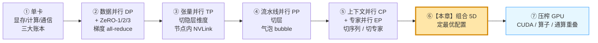
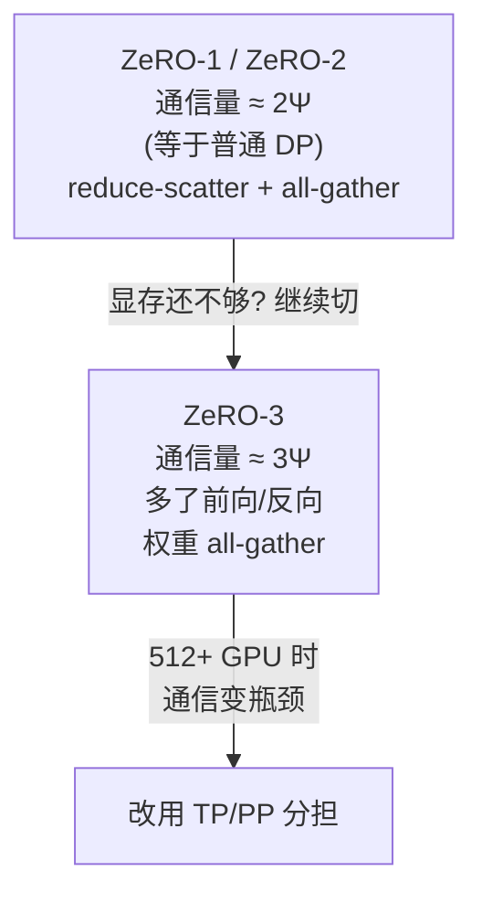
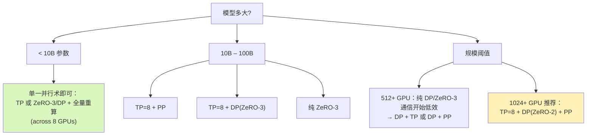
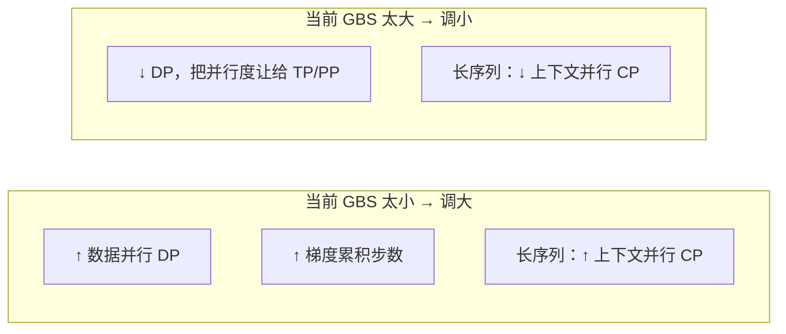
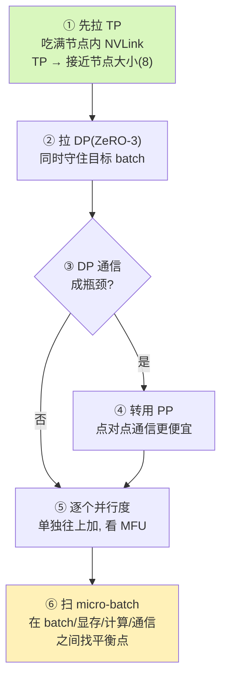
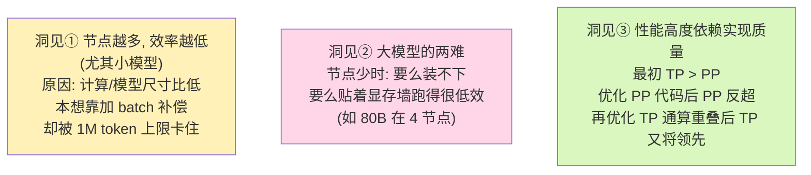
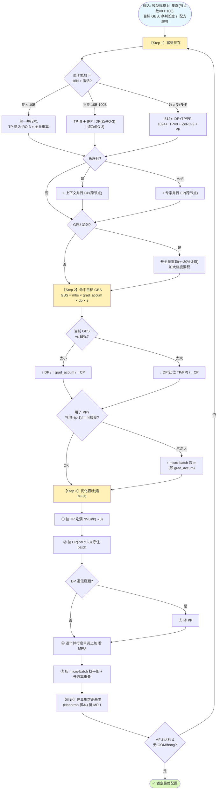

# 第 9 章 · 寻找最优训练配置：显存 → 批量 → 吞吐 → 基准

> 对应《The Ultra-Scale Playbook: Training LLMs on GPU Clusters》(HuggingFace, Nouamane Tazi 等) 原书第 153–162 页 / 第 9 章 *Finding the Best Training Configuration*。
>
> 这是整本书"理论篇"的收官章：前面我们把 **5D 并行**（DP / TP / PP / CP / EP）+ ZeRO + 重算等所有武器都打磨好了，本章回答那个最现实的问题——**拿到一个具体模型 + 一个具体集群，到底该怎么把这些旋钮拧到最优？**

---

## 🗺️ 本章地图：我们走到哪了

整本书的主线是一条"逐步压榨硬件"的爬坡路：



- **前面几章（①–⑤）**：每一种并行技术单独讲——它**切什么**、**通信什么**、**何时用**、**瓶颈在哪**。
- **本章（⑥）**：不再发明新武器，而是教你**怎么把这些武器组合成一套打法**。作者给出一个**三步决策流程**（显存 → 批量 → 吞吐），并真刀真枪地在 **1–64 个 8×H100 节点**上跑了**几千个配置**，把"理论"和"实测"对上。
- **下一章（⑦）**：本章结尾埋了一个伏笔——"通信和计算真的能完美重叠吗？" 答案是**不能**（它们抢同一批 GPU 流式多处理器 SM），于是引出 CUDA 底层优化篇。

> 🔬 **第一性原理**：分布式训练的全部艺术，本质是在 **显存（Memory）/ 计算（Compute）/ 通信（Communication）** 这个"不可能三角"里找平衡点。每一种并行都是用**多通信**去换**少显存**或**多并行度**。本章就是教你怎么在这个三角里**有顺序地**做决策，而不是瞎试。

---

## 🎯 本章要解决的问题

原书开篇就把话挑明了（第 154 页）：

> *"We've now covered all the parallelism techniques… The general question remains, though: **Which ones should we choose, and how do we decide on a specific combination?**"*

也就是说，并行技术不是越多越好、也不是随便叠。作者明确提醒：

> ⚠️ **没有"纸上算出来就一定最优"这回事**。原文：*"you'll always have to run a few experiments to find the definitive optimal setup for your compute cluster given its various physical properties, network bandwidth, GPUs per node, memory per GPU, etc."*
>
> 集群的**网络带宽、每节点 GPU 数、单卡显存**都不一样，最终一定要**跑几组实验**才能定下来。本章给的是一个**把搜索空间砍小**的决策框架，不是一个封闭公式。

作者把决策拆成清晰的**三步**，顺序**不能乱**：

| 步骤 | 目标 | 核心旋钮 | 一句话 |
|------|------|----------|--------|
| **Step 1** | 让一个训练步**塞进显存** | 并行度 / 重算 / ZeRO 级别 | 先能跑起来 |
| **Step 2** | 达到**目标全局 batch size** | DP × 梯度累积 | 再跑对 |
| **Step 3** | **优化吞吐**（MFU） | micro-batch / 通算重叠 / 并行度微调 | 最后跑快 |

> 💡 **为什么是这个顺序？** 显存是**硬约束**（爆了直接 OOM 崩溃），batch size 是**正确性/收敛性约束**（影响最终模型质量），吞吐是**经济性约束**（影响成本但不影响能否训）。所以先满足硬约束，再满足收敛约束，最后在剩余自由度里优化速度。**顺序反了会做无用功**——比如你先调好了吞吐，结果发现 batch 不对要重来。

---

## 🧩 开工前：5D 并行"速查对比表"（本书灵魂一页纸）

做选型前，先把五种并行（外加 ZeRO/重算）放在同一张表里对比——这正是本书的灵魂：**每种武器到底切什么、通信什么、何时用、瓶颈在哪、能不能跨节点**。后面三步都在这张表里"挑旋钮"。

| 维度 | 切什么（省什么显存） | 通信原语 & 通信量 | 何时用 | 瓶颈 / 代价 | 跨节点？ |
|------|----------------------|-------------------|--------|-------------|----------|
| **DP** 数据并行 | 不切模型，切**数据**（各卡同一份权重，不同样本） | 梯度 **all-reduce**，约 $2\Psi$/步 | 几乎总要用，提吞吐 | 大规模时 all-reduce 通信线性增长 | ✅ 可，但带宽敏感 |
| **ZeRO-1/2/3** | 切**优化器/梯度/权重**（$16\Psi$ 摊到 $/N_d$） | reduce-scatter+all-gather；Z1/2≈$2\Psi$，**Z3≈$3\Psi$** | DP 显存不够时逐级开 | Z3 多 1.5× 通信；512+ GPU 成瓶颈 | ✅（FSDP） |
| **TP** 张量并行 | 切**隐藏维 $h$/注意力头**（权重+激活都 $/\text{tp}$） | 每 block **2 次前向+2 次反向 all-reduce** | 单层放不下、或要减其他并行 | 通信极频繁，**只能在节点内 NVLink**，TP≤8 | ❌ 尽量不跨 |
| **PP** 流水线并行 | 切**层 $L$**（每卡只放 $L/\text{pp}$ 层） | 层边界 **点对点 send/recv**（最便宜） | 跨节点扩大模型；DP 通信成瓶颈后兜底 | **气泡** $=(p-1)/m$；显存不均、调度复杂 | ✅ 最适合跨节点 |
| **CP** 上下文并行 | 切**序列 $s$**（长序列的激活/注意力） | ring attention 的 **K/V all-gather/环形 send** | **超长序列**（激活随 $s^2$ 爆） | 注意力要环形传 K/V，实现复杂 | ✅ 跨节点 |
| **EP** 专家并行 | 切**专家**（MoE 每卡放部分 expert） | token **all-to-all** 路由 | **MoE 架构** | all-to-all 对带宽/负载均衡敏感 | ✅ 跨节点 |
| **重算** Recompute | 不切，**丢弃激活反向再算** | 无（纯计算换显存） | 激活吃满显存时 | 计算 **+约 30%**（全量） | — |
| **梯度累积** GA | 不切，**时间换 batch** | 累积期可 `no_sync` 省通信 | 显存有限但要大 batch | 单步变长，吞吐略降 | — |

> 🔬 **一句话记忆**：**DP 切数据 / ZeRO 切状态 / TP 切宽 / PP 切深 / CP 切长 / EP 切专家**。通信便宜程度从便宜到贵大致是 **PP(点对点) < DP/ZeRO1-2(all-reduce) < ZeRO3 < TP(高频 all-reduce) ≈ EP(all-to-all)**——这也解释了为什么 **TP 必须留在节点内、PP 最适合跨节点**。

---

## 9.1 🧠 Step 1：让一个训练步塞进显存

### 9.1.1 先复习"显存账本"——到底什么在吃显存

要谈"塞进显存"，得先知道**显存被谁吃了**。一个训练步的显存 = **模型状态（model states）** + **激活值（activations）** + **零碎（碎片/缓冲区）**。

#### 模型状态：每个参数要 16 字节

现代大模型用**混合精度 + Adam** 训练，每个参数 $\Psi$ 要存这么多东西（这是全书反复用的关键数字）：

| 内容 | 精度 | 字节/参数 |
|------|------|-----------|
| 权重 weights | bf16 | 2 |
| 梯度 gradients | bf16 | 2 |
| **fp32 主权重**（master copy） | fp32 | 4 |
| Adam 动量 $m$（一阶矩） | fp32 | 4 |
| Adam 方差 $v$（二阶矩） | fp32 | 4 |
| **合计** | | **16** |

$$
M_{\text{states}} = 16 \cdot \Psi \quad \text{(字节)}
$$

> 🔬 **为什么 fp32 主权重不能省？** bf16 只有 7 位尾数，权重每步的微小更新（$\eta \cdot g \approx 10^{-6}$ 量级）在 bf16 下会被**舍入吃掉**，等于没更新。所以必须留一份 fp32 主权重承接累积更新，bf16 权重只是它的"投影"。这就是混合精度多花 4+8 字节的根源。

**数值例子**——纯算模型状态（还没算激活！）：

| 模型 | 参数量 $\Psi$ | 模型状态 $16\Psi$ | 单张 H100 (80 GB) 装得下吗？ |
|------|--------------|-------------------|------------------------------|
| 1B   | $1\times10^9$  | 16 GB   | ✅ 勉强（还要留激活，悬） |
| 8B   | $8\times10^9$  | **128 GB** | ❌ 直接爆 |
| 70B  | $7\times10^{10}$ | 1120 GB | ❌ 要 14+ 张卡才装得下状态 |
| 405B | $4.05\times10^{11}$ | 6480 GB | ❌ 要 81+ 张卡 |

**结论一**：8B 以上的模型，**单卡连模型状态都放不下**，必须靠 **ZeRO 分片**或**并行切分**把 $16\Psi$ 摊到多卡。

#### 激活值：被序列长度"平方级"放大

激活值是前向传播中为了反向算梯度而**必须缓存**的中间张量。全书用的是 Megatron-LM（Korthikanti 等）的经典公式：

$$
M_{\text{act}} = L \cdot s \cdot b \cdot h \cdot \left(34 + 5\,\frac{a \cdot s}{h}\right) \quad \text{(字节, bf16)}
$$

- $L$ = 层数，$s$ = 序列长度，$b$ = micro-batch，$h$ = 隐藏维度，$a$ = 注意力头数。
- 括号里的 $34$ 来自各种线性层/LayerNorm 的激活；$5\,\frac{a\cdot s}{h}$ 来自**注意力分数矩阵** $s\times s$，这一项随 $s$ **线性**、整体随 $s$ **平方级**膨胀。

**数值例子**——一个 8B 类模型（$h{=}4096, L{=}32, a{=}32$），$s{=}4096, b{=}1$：

$$
\frac{a\cdot s}{h} = \frac{32\times4096}{4096} = 32,\quad 34 + 5\times32 = 194
$$
$$
M_{\text{act}} = 32 \times 4096 \times 1 \times 4096 \times 194 \approx 1.04\times10^{11}\text{ 字节} \approx \boxed{97\ \text{GiB}}
$$

**一个 micro-batch、一条 4096 的序列，激活就要 97 GB**——比模型状态还猛！这就是为什么**长序列 + 不重算 = 必爆显存**。

#### 激活重算（recomputation）：用计算换显存

**全量重算（full recompute）** 的思路：前向只缓存每层的**输入**（$2\cdot s\cdot b\cdot h$ 字节/层），反向时再重新前向算一遍中间激活。

$$
M_{\text{act}}^{\text{full-recomp}} \approx 2 \cdot L \cdot s \cdot b \cdot h = 2\times32\times4096\times1\times4096 \approx 1.07\times10^{9}\text{ 字节} \approx \boxed{1\ \text{GiB}}
$$

> 💥 **97 GiB → 1 GiB**，激活直接缩到 1/97！**代价**：反向时多做一次前向，计算量大约 **+30%**（多 1 次前向 / (1 前向 + 2 反向) ≈ 33%）。这就是原书 Step 1 里"GPU-poor 时打开 full recompute 换显存、训得慢一点"的精确含义。

### 9.1.2 ZeRO：把 $16\Psi$ 摊薄到 $16\Psi / N_d$

ZeRO（Zero Redundancy Optimizer）的核心：DP 各 rank 本来**每张卡都存一整份** $16\Psi$（完全冗余），ZeRO 把它**切片**到 $N_d$ 张卡上。三个级别逐步切更多东西：

| 级别 | 切什么 | 每卡显存（字节/参数） | 8B 模型、$N_d{=}8$ 时每卡状态 |
|------|--------|----------------------|------------------------------|
| ZeRO-0（普通 DP） | 啥都不切 | $16\Psi$ | 128 GB ❌ |
| **ZeRO-1** ($P_{os}$) | 优化器状态 | $2\Psi + 2\Psi + \dfrac{12\Psi}{N_d}$ | $16+16+12 = 44$ GB |
| **ZeRO-2** ($P_{os{+}g}$) | + 梯度 | $2\Psi + \dfrac{14\Psi}{N_d}$ | $16 + 14 = 30$ GB |
| **ZeRO-3 / FSDP** ($P_{os{+}g{+}p}$) | + 权重 | $\dfrac{16\Psi}{N_d}$ | $128/8 = \boxed{16\ \text{GB}}$ |

> 算例：8B 模型 $16\Psi=128$ GB，ZeRO-3 摊到 8 卡 → **每卡仅 16 GB 状态**，剩下 64 GB 全留给激活，从容。这就是"GPU-rich、10B 以下用单一并行术（如 ZeRO-3 across 8 GPUs + full recompute）"的算账依据。

**通信代价**（这是选级别的关键权衡）：



- **ZeRO-1/2**：通信量和普通 DP 一样（约 $2\Psi$，用 reduce-scatter + all-gather 实现），**几乎白送的显存节省**。
- **ZeRO-3**：前向、反向都要临时 **all-gather 权重**，通信量升到约 $3\Psi$（1.5×）。规模一大（512+ GPU），这部分通信就成瓶颈——所以原书才说"512+ 改用 DP+TP/PP"。

### 9.1.3 原书的 Step 1 决策表（逐条拆解）

原书把 Step 1 分成"GPU 富裕"和"GPU 紧张"两个世界：

#### 情形一：GPU-rich（卡多）



逐条解读：

- **< 10B**：模型小，一种并行就够。要么纯 TP（切到 8 卡）、要么 ZeRO-3/DP 配全量重算。**为什么 TP 上限常设 8？** 因为 TP 通信极频繁（每个 transformer block 前向 2 次、反向 2 次 all-reduce），**只能跑在节点内的高速 NVLink** 上；跨节点用 InfiniBand 跑 TP 会被带宽掐死。一个节点正好 8 张 H100，所以 **TP ≤ 8**。
- **10B–100B（要 >8 卡）**：三选一——
  - **TP=8 + PP**：TP 吃满节点内带宽，PP 跨节点切层，点对点通信便宜。
  - **TP=8 + DP(ZeRO-3)**：TP 摊显存，DP 提吞吐。
  - **纯 ZeRO-3**：实现最简单，但通信随规模涨。
- **512+ GPU**：纯 DP/ZeRO-3 的 all-gather/all-reduce 通信量随 $N_d$ 线性增长，开始拖后腿 → 把一部分并行度让给 TP 或 PP。
- **1024+ GPU 推荐配方**：**TP=8 + DP(ZeRO-2) + PP** 三管齐下。注意这里用 **ZeRO-2 而非 ZeRO-3**——因为已经有 TP+PP 在帮忙摊显存，没必要再付 ZeRO-3 那 1.5× 的通信税。

**特殊情况**：

- **超长序列** → 跨节点加 **上下文并行 CP**（沿序列维切，配 ring attention）。
- **MoE 架构** → 跨节点加 **专家并行 EP**（按专家切，token 用 all-to-all 路由）。

#### 情形二：GPU-poor（卡少）

两招"省显存换时间"：

1. **打开全量激活重算**：如上算例，激活 97 GiB → 1 GiB，代价是计算 +约 30%。
2. **加大梯度累积（gradient accumulation）**：用小 micro-batch 多次前向/反向，把梯度攒起来再更新——等效大 batch 但峰值激活显存只占一个 micro-batch。

### 9.1.4 💻 代码实战：一个"塞不塞得下"检查器（逐行讲解）

原书本章是纯文字决策，没有给代码。但 Step 1 的所有判断**都能写成几十行 Python 自动算出来**。下面把前面所有显存公式落成一个可跑的检查器——这正是 `projects/01_memory_flops_calculator` 的核心逻辑：

```python
import math
from dataclasses import dataclass   # 用 dataclass 装"模型 + 并行 + 集群"三组配置, 代码更干净

GiB = 1024 ** 3                      # 1 GiB = 2^30 字节; 后面所有显存都换算成 GiB 显示
BYTES_PER_PARAM_STATES = 16         # 混合精度 + Adam: 权重2 + 梯度2 + fp32主权重4 + 动量4 + 方差4 = 16

@dataclass
class ModelCfg:                     # ① 模型超参 (决定 N 和激活)
    n_params: float                 # 参数量 Ψ, 例如 8e9
    n_layers: int                   # 层数 L
    hidden: int                     # 隐藏维度 h
    n_heads: int                    # 注意力头数 a
    seq: int                        # 序列长度 s

@dataclass
class ParallelCfg:                  # ② 并行 + 显存策略 (我们要搜索的旋钮)
    tp: int = 1                     # 张量并行度 (切 hidden / heads)
    pp: int = 1                     # 流水线并行度 (切 layers)
    dp: int = 1                     # 数据并行度
    zero_stage: int = 0             # ZeRO 级别 0/1/2/3
    mbs: int = 1                    # micro-batch size
    full_recompute: bool = False    # 是否开全量激活重算

def model_state_mem(m: ModelCfg, p: ParallelCfg) -> float:
    """返回每张 GPU 上模型状态(权重/梯度/优化器)的字节数。"""
    base = BYTES_PER_PARAM_STATES * m.n_params      # 整模型状态 = 16Ψ
    base /= (p.tp * p.pp)                            # TP 切 hidden、PP 切层, 都把参数摊到 tp*pp 份
    nd = p.dp                                        # ZeRO 沿 DP 维切片, 分母是 dp
    w, g, opt = 2 * m.n_params/(p.tp*p.pp), 2 * m.n_params/(p.tp*p.pp), 12 * m.n_params/(p.tp*p.pp)
    if p.zero_stage == 0:   return w + g + opt       # ZeRO-0: 三样都整份
    if p.zero_stage == 1:   return w + g + opt/nd    # ZeRO-1: 只切优化器(12Ψ → /nd)
    if p.zero_stage == 2:   return w + (g + opt)/nd  # ZeRO-2: 再切梯度
    if p.zero_stage == 3:   return (w + g + opt)/nd  # ZeRO-3: 权重也切, 等于 base/nd
    raise ValueError

def activation_mem(m: ModelCfg, p: ParallelCfg) -> float:
    """返回每张 GPU 上激活值的字节数 (Korthikanti 公式, TP 沿 hidden 切)。"""
    L, s, b, h, a = m.n_layers, m.seq, p.mbs, m.hidden, m.n_heads
    if p.full_recompute:
        per = 2 * s * b * h                          # 全量重算: 每层只存输入 (2 字节 bf16)
        total = per * L
    else:
        per = s * b * h * (34 + 5 * a * s / h)       # 不重算: 完整公式, 注意 5·a·s/h 随 s 平方膨胀
        total = per * L
    return total / p.tp                              # TP 沿 hidden 维切, 激活也 /tp

def fits(m, p, gpu_mem_gib=80, reserve_gib=8):
    """判断单卡是否塞得下: 状态 + 激活 + 预留(碎片/缓冲) ≤ 显存。"""
    states = model_state_mem(m, p) / GiB
    acts   = activation_mem(m, p) / GiB
    used   = states + acts + reserve_gib             # reserve: 留给 CUDA 上下文/碎片/通信缓冲
    return used <= gpu_mem_gib, states, acts, used

# ---- 用 8B 模型跑一遍, 对照本章正文的数值 ----
m = ModelCfg(n_params=8e9, n_layers=32, hidden=4096, n_heads=32, seq=4096)
for cfg in [ParallelCfg(dp=8, zero_stage=3, mbs=1, full_recompute=False),
            ParallelCfg(dp=8, zero_stage=3, mbs=1, full_recompute=True)]:
    ok, st, ac, tot = fits(m, cfg)
    print(f"ZeRO3 dp=8 recompute={cfg.full_recompute}: 状态={st:.1f}GiB 激活={ac:.1f}GiB 合计={tot:.1f}GiB 塞得下={ok}")
```

**逐行要点**：

- `BYTES_PER_PARAM_STATES = 16`：把全章最核心的"16 字节/参数"写成常量，一处定义、处处复用。
- `model_state_mem`：先用 `tp*pp` 把参数摊薄（TP 切 hidden、PP 切层都减少**每卡参数数**），再按 `zero_stage` 决定优化器/梯度/权重是否额外 `/dp`。**这就是 9.1.2 那张 ZeRO 表的代码化**。
- `activation_mem`：直接搬 Korthikanti 公式；`full_recompute=True` 时退化成"每层只存输入 $2sbh$"，对应正文 97 GiB → 1 GiB 的那次缩减。`/ p.tp` 体现 TP 也切激活。
- `fits`：把"状态 + 激活 + 预留"加起来和单卡显存比。**`reserve_gib` 很关键**——真实训练有 CUDA 上下文、内存碎片、NCCL 通信缓冲，不留余量就是 9.5 节里"有时 OOM 有时不"的元凶。

跑出来你会看到：8B + ZeRO-3 + dp=8 时状态仅 16 GiB，但**不重算时激活 97 GiB 直接超 80 GiB 显存墙**；开了全量重算激活降到约 1 GiB，整步轻松塞下。**这正是 Step 1 决策的量化依据**——不用猜，算出来。

> 💡 **实战记法**：Step 1 的输出是一组**"刚好能塞下"的配置候选**——它会顺带定下你的 **micro-batch size (MBS)** 和 **DP 度**。这两个数会直接喂给 Step 2。

---

## 9.2 📦 Step 2：达到目标全局 batch size

### 9.2.1 为什么 batch size 是"必须命中"的目标

全局 batch size（GBS）不是随便定的，它由**训练配方/收敛性**决定（论文里写死的超参，比如 "1M tokens per batch"）。**太小**：梯度噪声大、收敛不稳、可能跑不出论文效果；**太大**：泛化变差、学习率要重调。所以 Step 1 跑通后，**当前的 GBS 多半不是目标值**，Step 2 就是把它**精确调到目标**。

### 9.2.2 全局 batch size 的分解公式

用 **token 计**的全局 batch size：

$$
\boxed{\;\text{GBS}_{\text{tokens}} = \text{mbs} \times \text{grad\_accum} \times \text{dp} \times s\;}
$$

- $\text{mbs}$ = 单次前向的 micro-batch（条数），
- $\text{grad\_accum}$ = 梯度累积步数，
- $\text{dp}$ = 数据并行度，
- $s$ = 序列长度。

如果用**条数（sequences）**计：$\text{GBS}_{\text{seq}} = \text{mbs}\times\text{grad\_accum}\times\text{dp}$。

**数值例子**（对齐原书基准：目标 GBS = 1M tokens，$s{=}4096$）：

$$
\text{GBS}_{\text{seq}} = \frac{1{,}000{,}000}{4096} \approx 244\ \text{条}
\;\Rightarrow\;
\text{mbs}\times\text{grad\_accum}\times\text{dp} = 244
$$

凑法举例：

| 场景 | dp | mbs | 需要的 grad_accum | 说明 |
|------|----|----|------------------|------|
| 单节点 8 卡 | 8 | 1 | $244/8 \approx 30$ | 累积 30 步攒够 |
| 8 节点 64 卡 | 64 | 1 | $244/64 \approx 4$ | DP 大了，累积少 |
| 想加大 mbs | 8 | 2 | $244/16 \approx 15$ | mbs 翻倍，累积减半 |

### 9.2.3 调大 / 调小 GBS 的两条路（原书要点）



- **调大**：加 DP（更多卡分数据）或加梯度累积（同样卡跑更多 micro-batch）；长序列还能用 CP 把单条长序列也算进 token 预算。
- **调小**：减 DP，把腾出的并行度让给 TP/PP（顺带帮 Step 3 的吞吐）。

> ⚠️ **常见坑：梯度累积和 PP 气泡是连体的**。梯度累积步数 = 流水线里喂的 **micro-batch 数 $m$**。PP 的气泡比例为
> $$\text{bubble} = \frac{p-1}{m}\quad(p=\text{PP 度},\ m=\text{micro-batch 数})$$
> 例：$p{=}4, m{=}30$（即 grad_accum=30）→ 气泡 = $3/30 = 10\%$，可接受；但若 $m$ 太小（如 $m{=}4$）→ 气泡 = $3/4 = 75\%$，流水线大半时间在空转！**所以用 PP 时，梯度累积步数必须远大于 PP 度**——Step 2 调 GBS 时一定要顺手看一眼气泡。

### 9.2.4 💻 代码实战：梯度累积训练循环（逐行讲解）

"用 DP × 梯度累积凑出目标 batch"听起来抽象，落到代码就是**最经典的梯度累积循环**。这段代码是 Step 2 的灵魂：

```python
import torch, contextlib                    # contextlib 用于 no_sync 与空上下文的切换
import torch.distributed as dist            # PyTorch 分布式包: all-reduce 等集合通信在这里

def compute_grad_accum(target_gbs_tokens, seq, mbs, dp_world_size):
    """由目标 GBS(token) 反推需要多少梯度累积步。"""
    seqs_per_step = mbs * dp_world_size      # 一个"前向-反向 micro-step"全 DP 卡合计处理的序列条数
    target_seqs  = target_gbs_tokens / seq   # 目标 batch 换算成"多少条序列"
    grad_accum   = round(target_seqs / seqs_per_step)
    return max(1, grad_accum)                # 至少 1 步

def train_step(model, optimizer, micro_batches, grad_accum):
    """一个完整的全局训练步 = grad_accum 个 micro-batch 累积后再更新一次。"""
    optimizer.zero_grad()                    # ① 清空上一步残留梯度 (注意: 整个大步开头清一次)
    for i, mb in enumerate(micro_batches):   # ② 遍历 grad_accum 个 micro-batch
        # 关键: 只有最后一个 micro-batch 才触发 DP 梯度同步, 前面的禁止同步 → 省掉 grad_accum-1 次 all-reduce
        sync = (i == grad_accum - 1)
        ctx = model.no_sync() if (not sync and hasattr(model, "no_sync")) else contextlib.nullcontext()
        with ctx:
            loss = model(mb).loss / grad_accum   # ③ loss 除以 grad_accum: 让累积梯度等于"大 batch 的平均梯度"
            loss.backward()                      # ④ 反向: 梯度 += 本 micro-batch 贡献 (累加到 .grad)
    optimizer.step()                         # ⑤ grad_accum 步攒完, 用累积梯度更新一次权重
    return loss.item() * grad_accum          # 还原成未缩放的 loss 便于打印

# ---- 对照原书基准: GBS=1M tokens, seq=4096 ----
ga = compute_grad_accum(target_gbs_tokens=1_000_000, seq=4096, mbs=1, dp_world_size=8)
print(f"dp=8, mbs=1 → 需要梯度累积 {ga} 步")     # 输出 30, 与正文表格一致
```

**逐行要点**：

- `compute_grad_accum`：把 9.2.2 的公式 $\text{GBS}=\text{mbs}\times\text{ga}\times\text{dp}\times s$ 反解出 `ga`。dp=8、mbs=1、1M token、seq=4096 → **30 步**，和正文表格对得上。
- `optimizer.zero_grad()` 放在**整个大步开头**，循环里**不清**——这样 `loss.backward()` 才能把 grad_accum 个 micro-batch 的梯度**累加**到 `.grad` 上。
- `loss / grad_accum`：⚠️**最易错的一行**。不除的话，累积出来的是"梯度之和"而非"平均梯度"，等于把有效学习率放大了 grad_accum 倍，训练会炸。
- `model.no_sync()`：**性能命门**。DP 默认每次 `backward()` 都触发一次梯度 all-reduce；但累积阶段中间那些 micro-batch 的梯度还没攒完，**没必要同步**。用 `no_sync()` 把同步推迟到最后一个 micro-batch，**省掉 $\text{ga}-1$ 次全网 all-reduce**——grad_accum=30 时省掉 29 次，通信直接降一个数量级。
- `optimizer.step()`：30 个 micro-batch 攒完才更新一次权重——这就是"用小显存等效大 batch"的本质。

> 🔬 **第一性原理**：梯度累积之所以能"省显存换 batch"，是因为**梯度是可加的**（$\nabla(\sum L_i)=\sum\nabla L_i$）。峰值激活显存只取决于**单个 micro-batch**，而有效 batch 是 micro-batch 的 $\text{ga}\times\text{dp}$ 倍——用时间换空间。

---

## 9.3 🚀 Step 3：优化训练吞吐

显存够了、batch 对了，现在让 GPU **别闲着**。原书的前提：**"只要显存和通信还没成为瓶颈"**，就可以按下面的招法往上推。

### 9.3.1 衡量尺子：MFU（模型 FLOPs 利用率）

吞吐优化必须有个**客观尺子**，业界标准是 **MFU（Model FLOPs Utilization）**：

$$
\boxed{\;\text{MFU} = \frac{\text{实测吞吐(tokens/s)} \times \text{每 token 的模型 FLOPs}}{\text{硬件峰值 FLOPs}}\;}
$$

- **每 token 的模型 FLOPs**：训练（前向+反向）约 $6N$（$N$ = 参数量），长序列还要加注意力项 $\approx 6N + 12\,L\,s\,h$。
- **硬件峰值**：H100 SXM 的 bf16 稠密峰值 ≈ **989 TFLOP/s**（即 $9.89\times10^{14}$）。

**数值例子**——8B 模型、8×H100、目标 MFU 40%：

$$
\text{FLOPs/token} \approx 6N = 6\times8\times10^9 = 4.8\times10^{10}
$$
$$
\text{峰值} = 8\times9.89\times10^{14} = 7.91\times10^{15}\ \text{FLOP/s}
$$
$$
\text{有效算力} = 0.40\times7.91\times10^{15} = 3.16\times10^{15}\ \text{FLOP/s}
$$
$$
\text{吞吐} = \frac{3.16\times10^{15}}{4.8\times10^{10}} \approx \boxed{65{,}900\ \text{tokens/s}}
$$

> 💡 **面试高频**：MFU 35–50% 在大集群上已是很好的成绩；理论 100% 永远达不到，因为有通信、气泡、重算开销、kernel 启动、内存带宽墙等。**MFU 是把"几千个配置"排序的统一指标**——原书热力图的颜色就是 MFU（越亮越高效）。

把 MFU 写成函数，训练时每隔几步打印一次，就是最实用的"吞吐温度计"：

```python
H100_BF16_PEAK = 989e12          # 单张 H100 SXM 的 bf16 稠密峰值 ≈ 989 TFLOP/s

def mfu(tokens_per_sec, n_params, n_gpus,
        n_layers=None, seq=None, hidden=None, peak=H100_BF16_PEAK):
    """计算 Model FLOPs Utilization。"""
    flops_per_token = 6 * n_params                    # 训练(前向+反向) ≈ 6N FLOPs/token
    if all(v is not None for v in (n_layers, seq, hidden)):
        flops_per_token += 12 * n_layers * seq * hidden  # 长序列再加注意力项(可选, s 大时不可忽略)
    achieved = tokens_per_sec * flops_per_token        # 实际有效算力 (FLOP/s)
    theoretical = peak * n_gpus                         # 全集群峰值算力
    return achieved / theoretical                       # 比值 = MFU ∈ (0,1)

# ---- 用正文 8B 例子反推: 若想要 40% MFU, 吞吐该是多少 ----
target_tps = 0.40 * (H100_BF16_PEAK * 8) / (6 * 8e9)
print(f"8B@8×H100, MFU=40% 对应吞吐 ≈ {target_tps:,.0f} tokens/s")  # ≈ 65,900, 与正文一致
print(f"反过来, 实测 50,000 tok/s → MFU = {mfu(50_000, 8e9, 8):.1%}")  # ≈ 30.4%
```

- `6 * n_params`：每 token 训练 FLOPs 的经典近似——前向 $2N$ + 反向 $4N$ = $6N$（每个参数一次乘加、反向两倍）。
- `12 * n_layers * seq * hidden`：注意力的 $s^2$ 计算项，序列短时可忽略，4096 这种长序列要算进去否则 MFU 会被高估。
- 函数**两头都能用**：给吞吐求 MFU（评估现状），或给目标 MFU 反推该达到的吞吐（设定目标）。

### 9.3.2 原书 Step 3 的有序招法（逐条解读）

原书给了一个**有优先级**的调优清单：



1. **先拉 TP 到接近节点大小（8）**：TP 用的是节点内**最快的 NVLink**，先把它吃满，这样能**减少其他形式的并行**，整体更高效。
2. **拉 DP（ZeRO-3）同时守住目标 batch**：DP 提吞吐，但别让 GBS 跑偏（和 Step 2 联动）。
3. **当 DP 通信成瓶颈 → 转 PP**：DP 的 all-reduce 随 $N_d$ 涨，到一定规模划不来，PP 只在层边界做便宜的点对点 send/recv。
4. **逐个并行度单独往上加**：一次只动一个旋钮，观察 MFU 变化，避免多变量耦合看不清。
5. **扫 micro-batch**：MBS 影响很微妙——
   - MBS ↑：单次计算更"胖"，kernel 效率↑、计算/通信比↑（对 DP/PP 有利）；但激活显存↑、且固定 GBS 下 grad_accum 步数↓（PP 气泡可能↑）。
   - MBS ↓：激活省、可累积更多步（PP 气泡↓）；但 kernel 利用率可能不足。

> 🔬 **第一性原理**：吞吐优化的本质是**最大化"计算占比"**——让每张卡尽量多的时间在做有效矩阵乘，尽量少的时间在等通信/等流水线/重算。TP 先行是因为它的通信能藏在最快的 NVLink 里；PP 兜底是因为它的通信最便宜（只在边界）。

#### 🔢 micro-batch 扫描的数值账（固定 GBS 时，MBS 与气泡此消彼长）

micro-batch size（MBS）是 Step 3 最微妙的旋钮。**固定全局 batch（GBS）时，MBS 越大 → 梯度累积步数 $m$ 越小 → PP 气泡越大**，同时**激活显存越大**；但 MBS 越大 kernel 越"胖"、矩阵乘效率越高。下面用前面 70B 例子的设定（**PP=2、dp=8、目标 244 条序列、$s=4096$**）把这条权衡算成一张表：

| MBS | 梯度累积 $m=\lceil 244/(8\cdot\text{mbs})\rceil$ | PP 气泡 $\frac{p-1}{m}=\frac{1}{m}$ | 单卡激活（相对 mbs=1） | kernel 效率 | 结论 |
|-----|------|------|------|------|------|
| 1 | $\lceil 244/8\rceil=31$ | $1/31 \approx 3.2\%$ | 1× | 偏低（瘦） | 气泡最小，但算力可能没吃满 |
| 2 | $\lceil 244/16\rceil=16$ | $1/16 \approx 6.3\%$ | 2× | 中 | 多数情况下的甜点 |
| 4 | $\lceil 244/32\rceil=8$ | $1/8 = 12.5\%$ | 4× | 高（胖） | kernel 最高效，但气泡+激活双涨 |
| 8 | $\lceil 244/64\rceil=4$ | $1/4 = 25\%$ | 8× | 高 | 气泡 25% 通常划不来 |

> 💡 **怎么读这张表**：MBS 从 1→4，气泡从 3.2% 涨到 12.5%（坏），激活从 1× 涨到 4×（坏），但 kernel 效率单调上升（好）。**没有解析最优解**——这正是原书让你"experiment with micro-batch sizes"的原因：把这几行都丢上集群跑实测 MFU，取最高的那一行。经验上 **MBS=2 常是甜点**：气泡还小、激活可控、kernel 已不太瘦。

### 9.3.3 通算重叠（communication–computation overlap）

吞吐优化的另一大杠杆是**让通信"藏"在计算背后**：

- **DP 梯度 all-reduce** 可以在反向传播**还在算前面层的梯度**时，就**异步发后面层已算好的梯度**（bucketed all-reduce overlap）。
- **ZeRO-3 的权重 all-gather** 可以**预取（prefetch）**：算第 $i$ 层时，提前 all-gather 第 $i{+}1$ 层的权重。
- **PP** 的 1F1B 调度本身就是为了让 send/recv 和计算重叠。

> ⚠️ **本章结尾的重大伏笔（第 162 页）**：作者坦白，前面所有分析都**默认"通信和计算能完美重叠、互不影响"**——但**现实更微妙**：NCCL 的 send/recv kernel 会**抢占和计算同一批 GPU 流式多处理器（SM）**，导致重叠时计算吞吐**反而下降**。要真正榨干性能，必须深入 GPU 架构本身——这就把我们引向下一章的 **CUDA 模式**。

---

## 9.4 🔬 用基准扫描成千上万配置

### 9.4.1 实验设置

光有决策框架不够，作者**真的把它跑了一遍**。在 HuggingFace 的 **Nanotron** 仓库里有现成脚本可复现这些实验。

| 维度 | 取值 |
|------|------|
| 集群规模 | **1 – 64 个节点**，每节点 **8× H100** → 8 – 512 GPU |
| 模型规模 | 书中讨论过的所有尺寸（约 1B → 80B+） |
| 序列长度 | **4,096** |
| 全局 batch size | **1M tokens**（≈ 244 条 4096 序列） |
| 配置总数 | **数千个**（剔除不可能配置后仍有几千） |
| 扫描的旋钮 | DP / TP / PP / GAS（梯度累积）/ MBS / ZeRO 级别 |
| 着色指标 | **MFU**（越亮越高效） |

> 😅 作者还在书里向同事道歉（原书 NOTE）：*"We want to take this opportunity to apologize to our coworkers for blocking most of the science cluster…"* ——几千个 job 几乎把整个科研集群占满了。

### 9.4.2 热力图（FIG.LXIV）告诉我们什么

原书用热力图把"每个 (模型规模 × 节点数) 组合下的最优配置"画出来，每格标注 **DP / TP / PP / GAS / MBS / ZeRO**，颜色 = MFU。三条核心洞见：



**洞见①——规模化的效率衰减**：节点越多（并行度越高），效率越低，**小模型尤甚**。因为小模型"计算量 / 模型尺寸"比值低，通信占比相对高。通常可以**加大 batch** 来摊薄通信，但这里被 **1M token 的全局 batch 上限**死死卡住，没法靠加 batch 救。

**洞见②——大模型的显存两难**：模型越大，显存需求暴涨。节点少时出现两种糟糕情况：(a) **根本装不下**；(b) 装下了但**贴着显存墙跑**（被迫开满重算、塞满 ZeRO），效率很低——书中点名 **80B 模型在 4 节点**就是这种"勉强能跑但很低效"的典型。

**洞见③——实现质量决定胜负**：这是最反直觉、也最有价值的一条。**同一种并行术，谁快取决于谁的代码优化得好**：
- 最初实现：**TP 比 PP 快**。
- 优化了 PP 代码后：**PP 反超成了更快的选项**。
- 现在正在改进 TP 的通算重叠：**预计 TP 又会重新领先**。

> 💡 **面试/实战金句**：**"理论选型只能缩小范围，最终胜负在工程实现。"** 不要因为"理论上 PP 气泡大"就一棍子打死 PP——一个优化良好的 PP 实现可能吊打一个朴素的 TP 实现。这也是为什么必须**亲自在自己的集群上跑基准**。

#### 🔍 怎么读热力图里的"一格"

热力图的横轴是**节点数**、纵轴是**模型规模**，每一格里写着该 (规模×节点) 组合下**实测最优**的一套旋钮，格子的**颜色深浅 = MFU**。举两个对照格帮你建立直觉：

| 格子（示意） | 该格最优配置 | 颜色（MFU） | 怎么解读 |
|--------------|--------------|-------------|----------|
| 1B 模型 × 1 节点(8 卡) | `DP=8, TP=1, PP=1, ZeRO=1, MBS=...` | **亮**（高 MFU） | 小模型小集群，纯 DP 就够，通信占比低、效率高 |
| 1B 模型 × 64 节点(512 卡) | `DP 很大, ZeRO≥2` | **暗**（低 MFU） | 同一小模型摊到 512 卡，单卡算的太少、通信占比飙升 → 洞见① |
| 80B 模型 × 4 节点(32 卡) | `TP=8, PP/ZeRO 拉满, 开重算` | **暗** | 贴着显存墙跑、被迫开满省显存手段 → 洞见② |
| 80B 模型 × 16 节点(128 卡) | `TP=8, PP, ZeRO-2` | **较亮** | 卡多了，显存不再贴墙，配方更从容、MFU 回升 |

> 💡 **看图三连**：①**从左往右（加节点）颜色变暗** = 规模化效率衰减；②**最左上角大模型可能直接空白**（装不下）；③**同一格的配置就是你该照抄的起点**——找到与你"模型规模 × 集群规模"最接近的那一格，把它的 `DP/TP/PP/GAS/MBS/ZeRO` 当作 Step 1–3 的初值，再微调。

### 9.4.3 💻 代码实战：把"扫几千个配置"写成搜索骨架

作者跑了"数千个配置"，靠的不是手点，而是**程序化生成所有合法配置 → 批量提交 → 收集 MFU 排序**。下面这段把搜索逻辑骨架化（和 `projects/01_memory_flops_calculator` 配合就能离线先剪枝）：

```python
from itertools import product

def enumerate_configs(n_gpus_total, gpus_per_node=8):
    """枚举所有 (tp,pp,dp) 满足 tp*pp*dp = 总卡数 且 tp ≤ 节点大小 的合法组合。"""
    for tp in [1, 2, 4, 8]:                          # TP 只在节点内, 上限 = 每节点 GPU 数
        if tp > gpus_per_node:
            continue
        for pp in [1, 2, 4, 8, 16]:                  # PP 跨节点切层
            if (n_gpus_total % (tp * pp)) != 0:      # tp*pp 必须整除总卡数
                continue
            dp = n_gpus_total // (tp * pp)            # 剩下的并行度全给 DP
            for zero in ([1, 2, 3] if dp > 1 else [0]):   # 只有 dp>1 才谈 ZeRO 分片
                for mbs in [1, 2, 4]:
                    yield ParallelCfg(tp=tp, pp=pp, dp=dp,
                                      zero_stage=zero, mbs=mbs)

def search(model, n_gpus, target_gbs_tokens):
    """离线剪枝: 先用显存检查器 + 气泡 + batch 命中过滤, 再交给真集群跑基准。"""
    survivors = []
    for cfg in enumerate_configs(n_gpus):
        ok, st, ac, tot = fits(model, cfg)            # ① 显存硬约束: 塞不下直接淘汰
        if not ok:
            continue
        ga = compute_grad_accum(target_gbs_tokens, model.seq, cfg.mbs, cfg.dp)
        bubble = (cfg.pp - 1) / max(ga, 1)            # ② 气泡: PP 度 / micro-batch 数
        if bubble > 0.25:                             # 气泡 > 25% 的配置先剪掉
            continue
        survivors.append((cfg, ga, bubble, tot))
    return survivors                                  # ③ 幸存者才值得排队上集群实测 MFU

# ---- 8B 模型, 32 GPU(4 节点), 1M token ----
survivors = search(m, n_gpus=32, target_gbs_tokens=1_000_000)
print(f"32 GPU 下合法且通过剪枝的配置数: {len(survivors)}")
for cfg, ga, bub, tot in survivors[:5]:
    print(f"  tp={cfg.tp} pp={cfg.pp} dp={cfg.dp} z={cfg.zero_stage} "
          f"mbs={cfg.mbs} ga={ga} 气泡={bub:.0%} 显存={tot:.0f}GiB")
```

**逐行要点**：

- `enumerate_configs`：用 `itertools.product` 思路穷举 `(tp,pp,dp,zero,mbs)`，但用**整除约束**和 **TP ≤ 节点大小**两条硬规则**立刻砍掉大半非法组合**——这就是原书说的"剔除不可能配置后仍有几千个"。
- `search` 里**两道离线剪枝**：先 `fits()` 过显存（Step 1），再算气泡过 PP（Step 2 联动）。**离线就能淘汰绝大多数烂配置**，只把"幸存者"送上昂贵的真集群跑 MFU——这正是把"几千个 job"控制在可承受成本内的关键工程手段。
- 真集群那一步（实测 tokens/s → `mfu()` 排序）才是花钱的部分，所以**离线剪枝越狠，省的机时越多**。

> ⚠️ **常见坑**：别忘了 `n_gpus % (tp*pp) == 0` 这条整除约束。很多人手配并行度时凑不齐，启动直接报 "world size mismatch"——程序化枚举能从源头杜绝。

---

## 9.5 🧰 基准测试踩过的坑：作者的经验教训

作者的"原计划"很天真（第 161 页）：*"let's run every possible distributed configuration… On paper, this sounds easy enough."* ——结果一上集群，麻烦立刻来了。

### 9.5.1 真实世界的"翻车现场"

| 翻车现象 | 本质 |
|----------|------|
| PyTorch 进程**没清理干净** | 残留进程占着显存/端口，下个 job 起不来 |
| **Slurm 强杀 job** → 节点故障 | 作业管理器超时/抢占，把节点搞挂 |
| 几分钟的基准**拖成几小时** | 初始化/通信建链/编译开销失控 |
| 有些 job **无限挂起（hang）** | NCCL 死锁、集合通信对不齐、某个 rank 卡住 |

### 9.5.2 为了"在有限时间内跑完"额外做的工程

作者坦言花了大量时间在这些**基础设施**上：

- **最小化集群重启时间、压缩空转时间**——几千个 job，每个省 1 分钟重启就是几十小时。
- **分析详细的 NCCL debug 日志**——定位通信卡死/带宽异常。
- **理解显存使用模式和 CUDA 内存分配器行为**——为什么同样配置有时 OOM 有时不？分配器碎片化是常见元凶。
- **改进多节点下的 PP 性能**——这正是洞见③里"PP 反超"的来源。


> ⚠️ **核心教训（原文）**：*"What looks simple in theory often requires careful attention to many moving parts in practice."* ——**理论上简单的事，落地全是细节**。这正是 Nanotron [A] 和 Picotron [B] 这类开源代码库存在的意义：把"能复现的分布式训练代码"开放出来，让研究者不必每次都重蹈这些坑。

### 9.5.3 埋下的伏笔：通算重叠并不"免费"

本章（也是 5D 并行篇）的收尾，作者戳破了一个一直默认的假设：

> *"computation and communication can be efficiently overlapped on GPUs without any impact on the computation throughput. **The reality is more nuanced.**"*

用 NCCL 的 send/recv 时，**通信 kernel 和计算 kernel 会争抢同一批 GPU 流式多处理器（SM）**，导致重叠时计算吞吐**下降**。同步模式有时对并行策略也不是最优（PyTorch 团队博客 [C] 有例子）。要真正榨干硬件，得**深入 GPU 架构**——

> **"Time to turn the lights off and activate CUDA mode!"** → 这就是下一章的主题。

---

## 9.6 🧭 实操总流程图：拿到模型 + 集群，一步步定配置

把全章揉成一张**可照着做**的决策流程图（这是本章最值钱的产出）：



> 💡 **怎么用这张图**：从上往下走，**Step 1→2→3 顺序不可逆**；任何一步发现走不通（OOM、气泡爆炸、MFU 太低），就回到 Step 1 换一组并行度重来。最后一定要**在真集群上用基准验证**——理论缩小范围，基准定胜负。

---

## 9.7 🧪 一个完整的"配方"实例：把流程走一遍

**任务**：训一个 **70B** 模型，集群 = **16 节点 × 8 H100 = 128 GPU**，目标 **GBS = 1M tokens**，$s=4096$。

**Step 1（显存）**：
- 模型状态 $16\times70\text{B} = 1120$ GB，单卡 80 GB 远放不下 → 必须切。
- 70B 属 10B–100B 区间，选 **TP=8**（吃满每节点 NVLink）。TP=8 后每卡权重/激活切到 1/8。
- 剩下 $128/8 = 16$ 个 TP 组，可作为 **DP=16**（配 ZeRO-1/2）。
- 估算每卡状态：在 TP=8 + ZeRO-2、DP=16 下，$16\Psi$ 先被 TP 切 8、再被 ZeRO-2 把梯度+优化器切 16，单卡降到约 $\frac{2\Psi}{8} + \frac{14\Psi}{8\times16}$ ≈ 17.5 + 7.6 ≈ 25 GB 级别（具体随实现），留足激活空间。是否还需重算视激活而定（$s=4096$ 偏大，可能开**选择性重算**）。

**Step 2（batch）**：
- 目标 244 条序列。当前 dp=16，mbs=1 → 需 $\text{grad\_accum} = 244/16 \approx 15$。
- 若再加 **PP=2**（16 节点里 2 节点组成一条流水线），dp 变 8，则 grad_accum = $244/8 ≈ 30$，micro-batch 数 $m=30$，PP 气泡 = $(2-1)/30 ≈ 3.3\%$，很健康。

**Step 3（吞吐）**：
- TP 已=8 吃满 NVLink ✅。
- 开 DP 梯度 all-reduce 与反向重叠、ZeRO 权重预取。
- 扫 mbs ∈ {1,2,4}：mbs=2 时 grad_accum=15、气泡 $(2-1)/15≈6.7\%$ 仍可，kernel 更胖 → 跑基准比 MFU 取最高者。
- 算一下吞吐天花板：FLOPs/token $=6\times70\text{B}=4.2\times10^{11}$；峰值 $128\times9.89\times10^{14}=1.27\times10^{17}$；若 MFU=40% → 吞吐 $=0.4\times1.27\times10^{17}/4.2\times10^{11}\approx 1.2\times10^5$ tokens/s ≈ 12 万 tok/s。

**最终配置候选**：`TP=8, PP=2, DP=8, ZeRO-2, GAS=30, MBS=1`（再用基准在 MBS/ZeRO 级别上微调）。

---

## 📌 本章小结

1. **三步定配置，顺序不能乱**：① **塞进显存**（硬约束，OOM 直接崩）→ ② **命中目标 batch**（收敛约束，影响模型质量）→ ③ **优化吞吐**（经济约束，影响成本）。
2. **Step 1 的算账**：模型状态 = $16\Psi$ 字节/参数；激活随序列**平方级**膨胀（公式 $L s b h(34+5\tfrac{as}{h})$，8B@4096 单 micro-batch 就 97 GiB）；**全量重算**把激活砍到约 1/97、代价 +约 30% 计算；**ZeRO-1/2/3** 把 $16\Psi$ 摊到 $/N_d$，ZeRO-3 多付 1.5× 通信。GPU-rich 按规模分档选并行组合，GPU-poor 靠重算+梯度累积续命。
3. **Step 2 的公式**：$\text{GBS}=\text{mbs}\times\text{grad\_accum}\times\text{dp}\times s$；调大用 DP/累积/CP，调小减 DP 让位 TP/PP；**梯度累积步数 = PP 的 micro-batch 数**，气泡 $=(p-1)/m$，二者连体。
4. **Step 3 的尺子与招法**：用 **MFU** 排序；先拉 **TP 吃满 NVLink**，再拉 **DP(ZeRO-3)** 守 batch，DP 通信瓶颈后转 **PP**，逐个并行度上加，最后**扫 micro-batch + 开通算重叠**。
5. **基准的真相**：作者在 1–64 节点 8×H100 上跑了**数千配置**，热力图给出三大洞见——**规模化效率衰减**（小模型尤甚，受 1M token 上限拖累）、**大模型显存两难**（装不下 / 贴墙低效）、**实现质量决定胜负**（PP 优化后反超 TP）。
6. **落地全是坑**：进程泄漏、Slurm 强杀、job 挂起、莫名变慢——理论简单、工程不易；Nanotron / Picotron 开源就是为了让这些坑可复现、可避开。
7. **埋下的伏笔**：通算重叠**并不免费**——NCCL kernel 抢占计算用的 SM，重叠会降吞吐。要真正榨干硬件，**下一章进入 CUDA 模式**。

---

## 🔗 延伸

- **配套手算工具** → [`../projects/01_memory_flops_calculator/`](../projects/01_memory_flops_calculator/)：把本章的 $16\Psi$、激活公式、MFU、GBS 分解都做成可调参的计算器，输入模型/集群即出"塞不塞得下 + 吞吐天花板"。
- **ZeRO 三级实测** → [`../projects/02_data_parallel_zero/`](../projects/02_data_parallel_zero/)：从零实现 ZeRO-1/2/3，对照本章每卡显存表与通信量。
- **TP / PP / CP 实现** → [`../projects/03_tensor_parallel/`](../projects/03_tensor_parallel/)、[`../projects/04_pipeline_parallel/`](../projects/04_pipeline_parallel/)（含气泡 $(p-1)/m$ 验证）、[`../projects/05_context_parallel_ring_attention/`](../projects/05_context_parallel_ring_attention/)。
- **集合通信底层** → [`../projects/06_collectives_from_scratch/`](../projects/06_collectives_from_scratch/)：手写 all-reduce / all-gather / reduce-scatter，理解 ZeRO 与 DP 的通信账。
- **公式速查与符号表** → [`../appendix/`](../appendix/)：显存/通信/气泡/MFU 公式集中索引。
- **官方代码** → Nanotron（[github.com/huggingface/nanotron](https://github.com/huggingface/nanotron)）跑基准脚本；Picotron（[github.com/huggingface/picotron](https://github.com/huggingface/picotron)）极简可读的 5D 并行教学实现。
- **下一章预告** → 压榨 GPU / CUDA 模式：SM 争用、通算重叠的真实代价、算子融合与 kernel 优化。

---

> 🧾 *本文对应原书第 153–162 页（第 9 章 Finding the Best Training Configuration）。书中本章篇幅精炼，本讲在忠实原文三步框架与三大洞见的基础上，补全了显存/通信/MFU 的公式推导、数值算例与可操作流程图，便于零基础到进阶逐步落地。*
