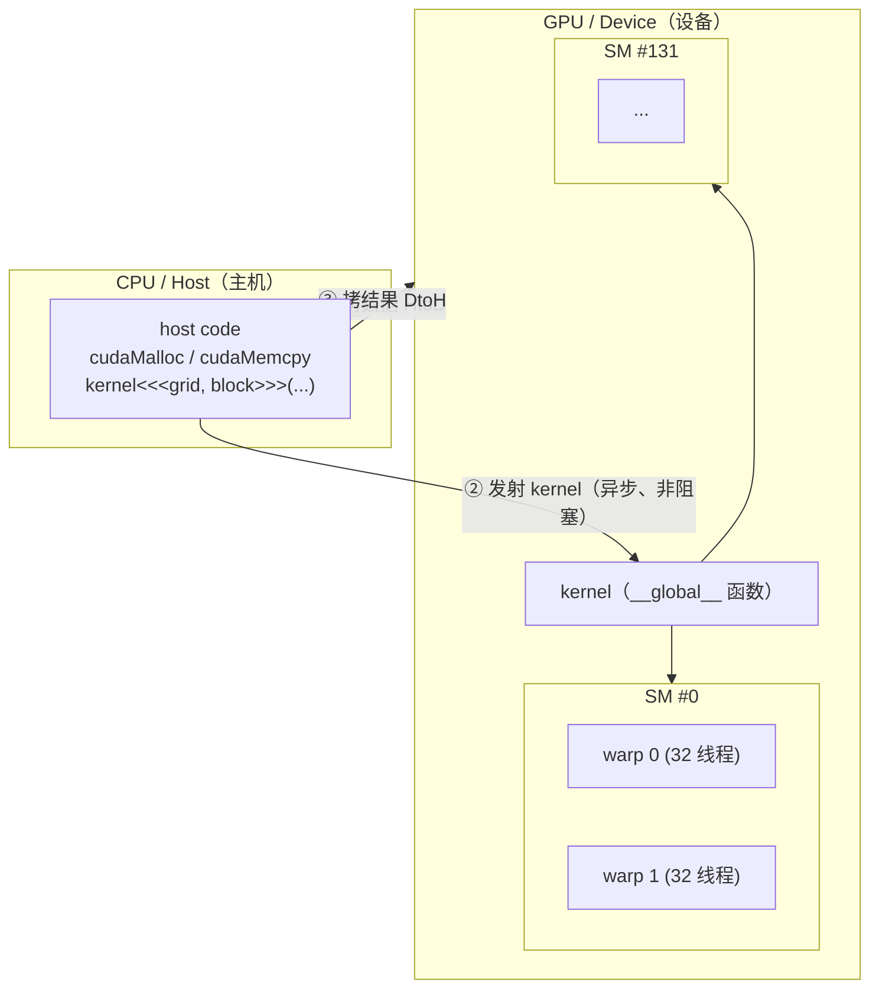
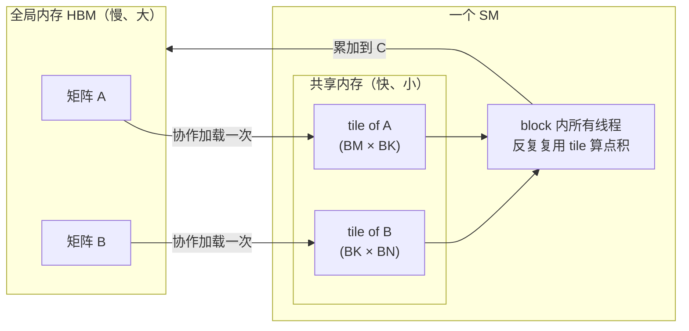
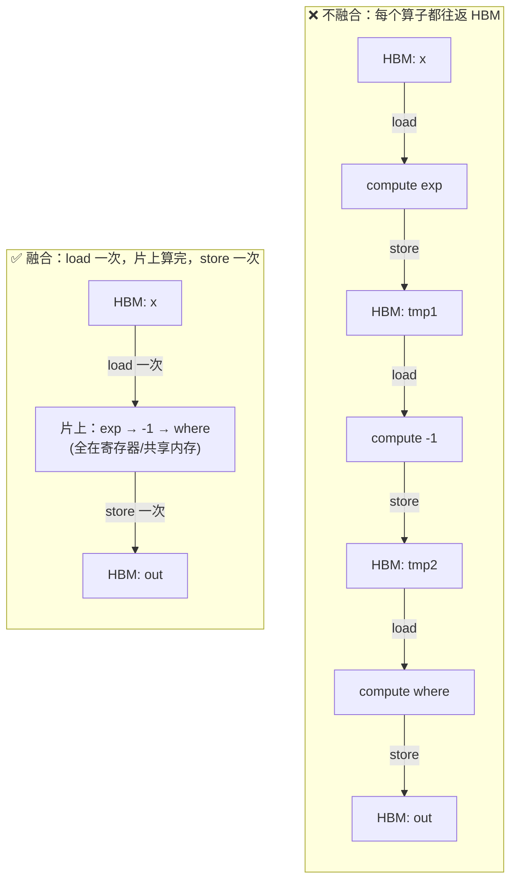
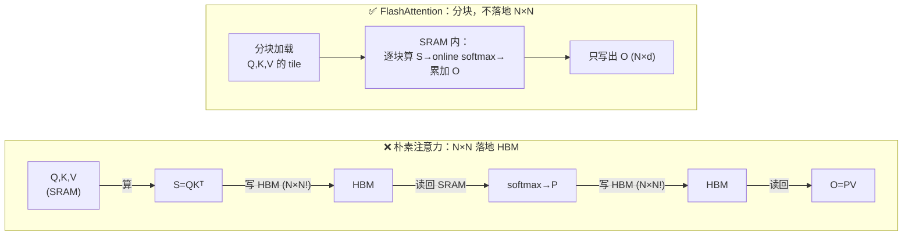
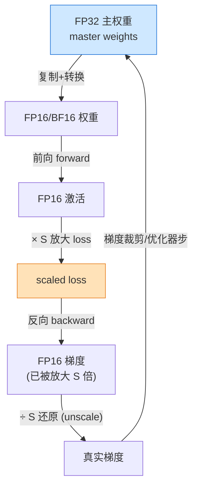
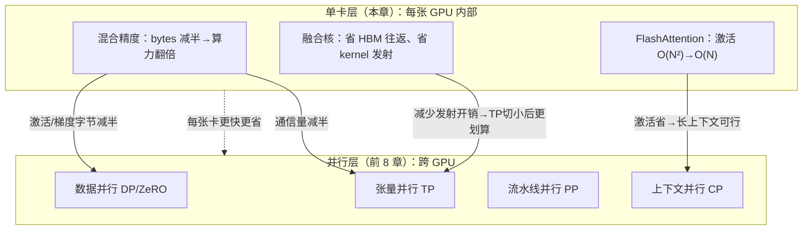
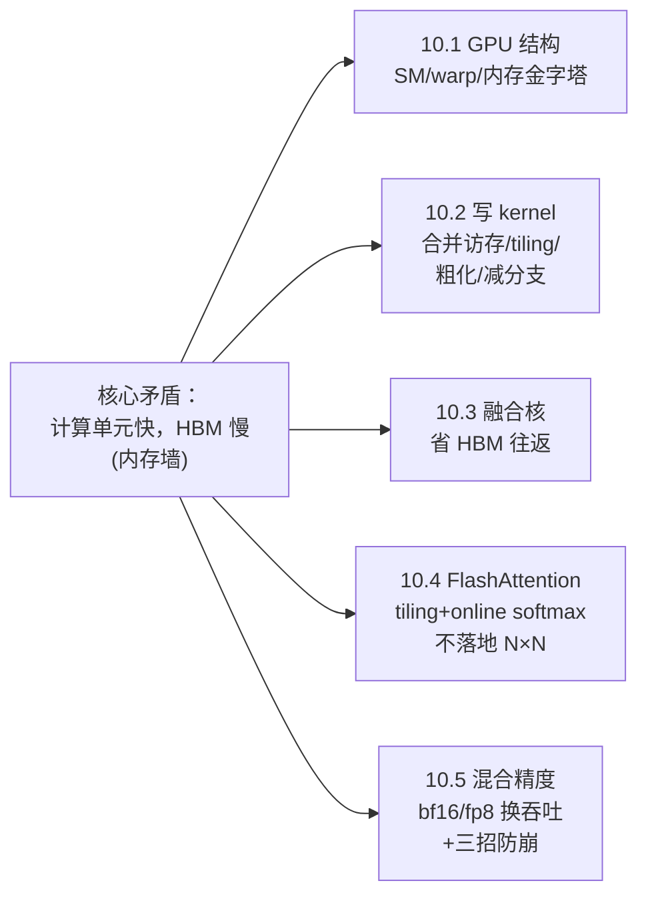

# 第 10 章 深入 GPU：融合、线程、混合精度、FlashAttention、融合核

> 对应《The Ultra-Scale Playbook: Training LLMs on GPU Clusters》(HuggingFace, Nouamane Tazi 等) 原书第 163–200 页（第 10 章 *Diving into the GPUs — Fusing, Threading, and Mixing*）。
>
> 本篇是「《Ultra-Scale Playbook》逐章精讲」系列的第 9 篇。前面 8 章我们一路从**单卡显存与 FLOPs**讲到 **5D 并行**（DP / ZeRO / TP / PP / CP / EP），把模型"摊开"到成百上千张卡上。本章是全书的**收尾杀器**：当模型已经被切好、放好、调度好之后，我们回到**单张 GPU 内部**，把每一张卡自身的算力榨到极致。

---

## 🗺️ 本章地图：我们走到哪了？

整本书的主线是一条"放大"之路：


前面 5 步都在回答**"怎么把一个大模型摆到很多 GPU 上、让它们高效协作"**——核心矛盾是 **显存 / 计算 / 通信** 三者的权衡。

本章换了一个视角：**单张 GPU 内部**还能压榨多少？这一层的矛盾不再是机器之间的"通信"，而是**芯片内部的"访存"**——计算单元（core）远比内存快，数据在不同层级内存之间"搬来搬去"的开销，往往才是真正的瓶颈。

本章对应原书 5 个小节，我们逐一精讲：

| 小节 | 主题 | 一句话本质 |
|---|---|---|
| 10.1 | GPU 入门 primer | GPU = 一堆并行核 + 多级内存金字塔；代码运行单元叫 kernel |
| 10.2 | 用 kernel 提升性能 | PyTorch→compile→Triton→CUDA 四级梯队；合并访存 / tiling / 线程粗化 / 减少分支 |
| 10.3 | 融合核 fused kernels | 把多个逐元素算子塞进一个 kernel，省掉往返 HBM 的搬运 |
| 10.4 | FlashAttention | tiling + online softmax，让注意力**不落地** N×N 大矩阵 |
| 10.5 | 混合精度训练 | fp16 / bf16 / fp8，用更少的比特换吞吐，但要防数值崩 |

> ⚠️ **重要边界说明**：原书在 10.1 明确说"这里只讲到后文需要用到的概念级深度（conceptual level）"。GPU 体系结构的**本质细节**（warp 调度器、bank conflict、tensor core MMA、内存事务粒度等）在本系列的 **`../appendix/A`（GPU 架构深挖附录）** 里展开。本章遇到这些点会用 🔬 框点一下，并指引你去看附录。

---

## 🧭 引子：为什么要"下沉"到 GPU 底层？

原书开篇（p.164）的话值得逐字咀嚼：

> 到目前为止，我们的讨论都集中在模型操作的**高层组织**——在各种加速器之间搬运计算、考虑总体显存约束、做计算单元的高层调度。但这**忽略了所有可以在更低层做的优化**：仔细理解我们的模型操作是**如何在每张 GPU 上被调度和执行**的。

换句话说：前 8 章把 GPU 当成一个**黑盒算力块**。本章要打开这个黑盒。

🔬 **第一性原理：现代 GPU 是"内存墙"机器，不是"算力墙"机器。**

一张 H100 的 BF16 算力约 **990 TFLOPS**，而它的 HBM 显存带宽约 **3.35 TB/s**。算一笔账：要喂饱这些算力单元，每读 1 字节数据理论上要做

$$
\frac{990 \times 10^{12}\ \text{FLOP/s}}{3.35 \times 10^{12}\ \text{B/s}} \approx 295\ \text{FLOP/Byte}
$$

也就是说，**每从显存读 1 个字节，硬件期望你对它做近 300 次浮点运算**，才能不让算力单元闲着。很多算子（尤其逐元素操作、注意力的 softmax）远远达不到这个"算术强度（arithmetic intensity）"，于是它们被**带宽**卡死，而不是被**算力**卡死。本章几乎所有技巧——合并访存、tiling、融合、FlashAttention——本质都在干一件事：**减少对最慢那层内存（HBM）的往返**。

---

## 🧱 10.1 GPU 入门 primer（SM / 线程 / warp / 显存层级）

### 计算侧：从 GPU 到 core 的层级

原书（p.165）给出 GPU 的层级结构：

- **GPU** = 一个由**流式多处理器（Streaming Multiprocessor, SM）**组成的阵列。
- 每个 **SM** 包含并控制一组**流式处理器（streaming processors）**，也就是俗称的 **core（核）**。
- 每个 core 可以同时处理多个**线程（thread）**。

> 📐 **数值例子（H100）**：一张 NVIDIA H100 有 **132 个 SM**，每个 SM 有 **128 个 core**，所以总共
> $$132 \times 128 = 16{,}896 \text{ 个 CUDA core}$$
> 这还没算专门做矩阵乘的 **Tensor Core**（每 SM 4 个，共 528 个）——后者才是跑 GEMM / 注意力的主力，细节见 `../appendix/A`。

### 显存侧：一座"内存金字塔"

GPU 的内存也是高度层级化的，从快到慢、从小到大：

| 层级 | 作用域（谁能看到） | 典型容量（H100 量级） | 相对速度 | 比喻 |
|---|---|---|---|---|
| **寄存器 Registers** | 单个**线程**私有 | 每线程几十~几百个 | 最快（~1 周期） | 手里攥着的纸条 |
| **共享内存 / L1 Cache** | 单个 **SM** 内所有线程共享 | 每 SM 最多 ~256 KB | 很快（几十 TB/s） | 桌上的便签本 |
| **L2 Cache** | 所有 **SM** 共享 | ~50 MB | 中等（几 TB/s） | 办公室的文件柜 |
| **全局内存 Global / HBM** | 整张 GPU（含 CPU 经 PCIe/NVLink） | **80 GB**（H100 宣称值） | 最慢（~3.35 TB/s） | 楼下的仓库 |

> ⚠️ **常见坑：HBM 名字带"High Bandwidth"，但它是金字塔里最慢的一层。** 原书在 10.4 特别强调：现代 GPU 的全局内存常用 **HBM（High Bandwidth Memory）** 技术，"尽管名字里有高带宽，但在 GPU 内存层级里它比 SRAM 慢"。这个 **HBM vs SRAM** 的对比，是理解 FlashAttention 的钥匙。记住一句话：**SRAM（寄存器/共享内存）快但小，HBM 大但慢。**

🔬 **第一性原理：GPU 编程的全部艺术，就是"让尽量多的活儿，在尽量靠上的内存层级里干完"。** 把热数据从仓库（HBM）搬到便签本（共享内存），让一个 SM 上的几百个线程反复复用它，避免每个线程都各自跑去仓库取一次——这就是后面 tiling、融合、FlashAttention 的统一主题。

### kernel：跑在 GPU 上的那段代码

原书引入两个关键名词：

- **kernel（核函数）**：一段运行在 GPU core 上的代码。可以用高层语言 **CUDA** 或 **Triton** 写，然后编译成 NVIDIA GPU 的底层汇编 **PTX（Parallel Thread Execution）**。
- **host code（主机代码）**：跑在 **CPU / host** 上的配套代码，负责**准备数据分配、加载数据和代码**，再"发射（launch）"kernel 到 GPU。



### kernel 是怎么被调度的？warp / block / grid

原书（p.167）给出 kernel 的调度规则——这三个名词务必记牢：

- **线程被打包成 warp（线程束）**，每个 warp 固定含 **32 个线程**。一个 warp 里的 32 个线程**锁步（lockstep）执行同一条指令**，只是作用在数据的不同部分上（这就是后面要讲的 **SIMD / SIMT**）。
- **warp 被打包成 block（线程块）**，block 大小更灵活（例如 512 或 1024 线程）。**每个 block 被指派到单个 SM 上**；一个 SM 可以并行跑多个 block；但如果资源不够，有些 block 会被**排队（waitlisted）**，等资源释放才执行。
- 所有 block 合起来叫 **grid（网格）**，就是一次 kernel 发射的全部线程。

> 💡 **记忆口诀**：grid（一次发射）⊃ block（落在一个 SM 上）⊃ warp（32 线程锁步）⊃ thread（最小执行单元）。**block 是分配单位，warp 是执行/调度单位，thread 是编程单位。**

原书强调：真正用好 GPU，要时刻考虑各种**尺寸与分配约束**——各级内存的大小、每个 SM 上并发 block 数、warp 里的线程数。"大多数时候你不需要下沉到这个精度，可以复用社区写好的 kernel——但我们还是会给你一点入门提示。"

### 📜 代码精讲：CUDA 向量加法（CODE.IX + CODE.X）

这是 GPU 编程的"Hello World"——把两个长度为 N 的向量逐元素相加。原书把它拆成 host code 和 device code 两段。

#### Host code（跑在 CPU 上）

```cpp
// Host code —— 在 CPU 上准备一切
void vecAdd(float* h_A, float *h_B, float *h_c, int n) {
    // ① 在“设备显存（device memory，即 HBM）”里分配三块空间
    int size = n * sizeof(float);          // 字节数 = 元素个数 × 每个 float 4 字节
    float *d_A, *d_B, *d_C;                 // d_ 前缀 = device 指针（指向 GPU 显存）
    cudaMalloc(&d_A, size);                 // 在 GPU 上 malloc，等价于 CPU 的 malloc
    cudaMalloc(&d_B, size);
    cudaMalloc(&d_C, size);

    // ② 把输入数据从主机内存拷到设备显存（Host to Device）
    cudaMemcpy(d_A, h_A, size, cudaMemcpyHostToDevice);
    cudaMemcpy(d_B, h_B, size, cudaMemcpyHostToDevice);

    // ③ 配置发射参数并发射 kernel
    int threadsPerBlock = 256;              // 每个 block 用 256 个线程
    int blocksPerGrid =
            (N + threadsPerBlock - 1) / threadsPerBlock;   // 向上取整：保证线程数 ≥ N
    VecAdd<<<blocksPerGrid, threadsPerBlock>>>(d_A, d_B, d_C, N);  // <<<grid, block>>>

    // ④ 把结果从设备拷回主机（Device to Host）
    cudaMemcpy(h_C, d_C, size, cudaMemcpyDeviceToHost);

    // ⑤ 释放设备显存
    cudaFree(d_A);
    cudaFree(d_B);
    cudaFree(d_C);
}
```

**逐行要点**：

1. `cudaMalloc(&d_A, size)`：在 **HBM** 上申请显存。注意 GPU 有自己的地址空间，CPU 指针 `h_A` 不能直接被 GPU 解引用，必须先拷过来。
2. `cudaMemcpy(..., cudaMemcpyHostToDevice)`：这步是**走 PCIe / NVLink 的真实数据搬运**，很贵。训练中我们想方设法**减少这种 host↔device 往返**——这正是 10.3 融合核的动机来源。
3. **`blocksPerGrid` 的向上取整公式**是 CUDA 里最常见的一行：
   $$\text{blocksPerGrid} = \left\lceil \frac{N}{\text{threadsPerBlock}} \right\rceil = \frac{N + \text{threadsPerBlock} - 1}{\text{threadsPerBlock}}$$
   > 📐 **数值例子**：设 $N = 1{,}000{,}000$，`threadsPerBlock = 256`，则
   > $$\text{blocksPerGrid} = \left\lfloor \frac{1{,}000{,}000 + 255}{256}\right\rfloor = \left\lfloor 3907.2\right\rfloor = 3907$$
   > 总共发射 $3907 \times 256 = 1{,}000{,}192$ 个线程 —— 比 $N$ **多了 192 个**！所以 device code 里必须有 `if (i < N)` 这道**越界保护**，否则那 192 个多余线程会去读越界地址。
4. `<<<blocksPerGrid, threadsPerBlock>>>` 是 CUDA 独有的 **kernel 发射语法**：三尖括号里第一个是 grid 维度，第二个是 block 维度。

#### Device code（跑在 GPU 上，即 kernel 本身）

```cpp
// Device code —— 真正在 GPU 上并行执行的 kernel
__global__ void VecAdd(float* A, float* B, float* C, int N)
{
    // 每个线程算出“我负责第几个元素”
    int i = blockDim.x * blockIdx.x + threadIdx.x;
    if (i < N)              // 越界保护（见上面的 192 个多余线程）
        C[i] = A[i] + B[i]; // 这个线程只干一件事：算一个元素的加法
}
```

**逐行要点**：

- `__global__`：CUDA 限定符，表示"**这是个 kernel，由 host 调用、在 device 上执行**"。
- **全局线程索引公式**（必背）：
  $$i = \underbrace{\texttt{blockDim.x}}_{\text{每块线程数=256}} \times \underbrace{\texttt{blockIdx.x}}_{\text{我在第几块}} + \underbrace{\texttt{threadIdx.x}}_{\text{我在块内第几号}}$$
  这把"二维的（第几块，块内第几号）"压平成"一维的全局编号 $i$"。比如 block #5 的 17 号线程：$i = 256 \times 5 + 17 = 1297$。
- 核心思想 **SPMD（Single Program Multiple Data）**：**同一段 kernel 代码，被几十万个线程同时跑，每个线程靠自己的 $i$ 处理不同的数据**。程序员只写"一个线程干什么"，硬件负责"复制几十万份并行跑"。

> 💡 **面试高频**：「`threadIdx`、`blockIdx`、`blockDim`、`gridDim` 分别是什么？」
> - `threadIdx`：线程在 **block 内**的局部坐标
> - `blockIdx`：block 在 **grid 内**的坐标
> - `blockDim`：一个 block 有多少线程（你发射时定的）
> - `gridDim`：一个 grid 有多少 block
> 全局索引就是 `blockDim * blockIdx + threadIdx`。

---

## ⚡ 10.2 用 kernel 提升性能（为什么要写/用自定义核）

### 四级"工具梯队"：从易到难、从慢到快

原书（p.174）给出一个极其实用的总结——写 kernel 有四种姿势，**难度、速度、灵活度三者权衡**：

| 工具 | 难度 | 速度 | 灵活度 | 适用场景 |
|---|---|---|---|---|
| **① PyTorch** | 最易 | 慢 | 高 | 原型验证；算子组合现成 |
| **② `@torch.compile`** | 易 | 快 | **不灵活** | 一行装饰器就提速；首选 |
| **③ Triton** | 较难 | 更快 | 较灵活（能控 block） | compile 不够时，手写 block 级 kernel |
| **④ CUDA** | 最难 | **最快** | **最灵活**（能控共享内存/调度） | 极致优化；FlashAttention 这种级别 |

> 💡 **实战建议（原书原话）**：「想加一个没有优化 kernel 的新算子、或给现有 PyTorch 函数提速时，从零写 CUDA 看似最直接，但**从零写高性能 CUDA 需要大量经验、学习曲线陡峭**。更好的起点通常是 `torch.compile`，它能动态捕获你的操作、生成底层高性能 Triton kernel。」**先 compile，不够再 Triton，再不够才 CUDA。** 不要一上来就手撸 CUDA。

### 📜 例子：给 ELU 激活函数写 kernel

ELU（Exponential Linear Unit，指数线性单元）的定义：

$$
\text{ELU}(x) = \begin{cases} x & x \ge 0 \\ \alpha\,(e^{x} - 1) & x < 0 \end{cases}
$$

#### 第一步：朴素 PyTorch + 一行装饰器（CODE.XI）

```python
@torch.compile          # ← 全部魔法，就这一行
def elu(x, alpha=1.0):
    return torch.where(x < 0, alpha * (torch.exp(x) - 1), x)
```

- `torch.where(cond, a, b)`：逐元素三目运算，`cond` 为真取 `a`，否则取 `b`。
- 加上 `@torch.compile` 后，PyTorch 会**追踪（trace）**这串操作，把 `exp`、减法、乘法、`where` **融合**成一个 Triton kernel（注意——这已经用到了 10.3 的"融合"思想！）。原书图 LXVII 显示：**仅仅加一个装饰器，性能就有显著提升**。

#### 第二步：看看 compile 生成了什么 Triton kernel

设环境变量 `export TORCH_LOGS="output_code"`，就能 dump 出 `@torch.compile` 生成的 Triton 代码。原书把它清理、改名、加注释后得到（CODE.XIII）：

```python
@triton.jit             # JIT 编译这个 Triton kernel
def elu_kernel(input_ptr, output_ptr, num_elements, BLOCK_SIZE: tl.constexpr):
    # ① 算出本 block 负责的数据起始下标
    block_start = tl.program_id(0) * BLOCK_SIZE
    # ② 生成本 block 要处理的一整段下标 [start, start+BLOCK_SIZE)
    block_indices = block_start + tl.arange(0, BLOCK_SIZE)[:]
    # ③ 越界掩码：只处理 < num_elements 的合法下标（对应 CUDA 的 if(i<N)）
    valid_mask = block_indices < num_elements
    # ④ 按掩码从 HBM 把这一段数据“一次性、向量化”地 load 进来
    input_values = tl.load(input_ptr + block_indices, valid_mask)

    # ⑤ ELU 计算本体（全部在寄存器/片上完成，不落地 HBM）
    zero_value = 0.0
    negative_mask = input_values < zero_value
    exp_values = tl.math.exp(input_values)
    one_value = 1.0
    shifted_exp_values = exp_values - one_value
    output_values = tl.where(negative_mask, shifted_exp_values, input_values)

    # ⑥ 把结果按掩码一次性 store 回 HBM
    tl.store(output_ptr + block_indices, output_values, valid_mask)
```

**Triton 与 CUDA 的关键区别（逐点讲）**：

1. `tl.program_id(0)`：给出当前 **block 的唯一 ID**（类似 CUDA 的 `blockIdx.x`）。**注意：Triton 让你以"block"为单位思考，而不是以单个"线程"为单位**——你写的是"一个 block 怎么处理一段数据"，block 内部的 32 线程怎么排布，由 Triton 编译器替你搞定。
2. `block_indices = block_start + tl.arange(0, BLOCK_SIZE)`：一次生成**一整段下标向量**。Triton 的 `load`/`store`/算术全是**向量化（SIMD）**的，天然就把"合并访存"（见 10.2.1）做好了。
3. `valid_mask`：和 CUDA 的 `if (i < N)` 同一作用，处理 $N$ 不能被 `BLOCK_SIZE` 整除的尾巴。
4. `tl.load` / `tl.store`：显式的"从 HBM 读 / 往 HBM 写"。中间 ⑤ 步的所有计算都在片上完成——**load 一次、算完、store 一次**，没有把中间结果（`exp_values` 等）落地 HBM。这就是融合的威力。

> ⚠️ **Triton 的天花板**：原书指出，即便用 Triton，有时也达不到设备峰值性能，因为 **Triton 对共享内存（shared memory）和 SM 内调度等底层细节的处理能力有限**——它只管到 "block 以及 block 在 SM 间的调度" 这一层。要再往下抠（手工管理共享内存、warp 级排布），就必须落到 CUDA。FlashAttention 就是 CUDA 级的杰作。

接下来原书用 CUDA 演示四个经典优化技巧。

### 🧩 10.2.1 合并访存 Memory Coalescing

**问题背景**：全局内存（HBM）用 **DRAM** 实现，延迟高、（相对缓存）带宽低，是很多应用的头号瓶颈。

🔬 **第一性原理：DRAM 是"成块（burst）"给数据的。** 每次访问一个 DRAM 地址，硬件会**并行**读出一段**连续地址**（包含你要的那个）—— 就像快递员一次送一整箱，而不是一件一件跑。**合并访存（coalescing）**就是利用这个特性：如果一个 warp 里的 32 个线程访问的是**连续的内存地址**（线程 0 读地址 $X$，线程 1 读 $X+1$，线程 2 读 $X+2$……），硬件就能把这 32 次请求**合并成一次大的、高效的 DRAM burst**；反之，地址东一个西一个，就得拆成很多次小访问，带宽利用率暴跌。

#### 📜 反面教材：朴素矩阵乘（CODE.XIV）

计算 $C = A \times B$，其中 $A$ 是 $M\times K$，$B$ 是 $K\times N$，$C$ 是 $M\times N$。最朴素的写法：**每个线程算 $C$ 的一个元素**。

```cpp
__global__ void matmul_naive(int M, int N, int K,
                             const float *A, const float *B, float *C) {
    const uint x = blockIdx.x * blockDim.x + threadIdx.x;   // 负责 C 的第 x 行
    const uint y = blockIdx.y * blockDim.y + threadIdx.y;   // 负责 C 的第 y 列
    if (x < M && y < N) {
        float tmp = 0.0;
        for (int i = 0; i < K; ++i) {
            tmp += A[x * K + i] * B[i * N + y];   // 行主序：A[x][i] 与 B[i][y]
        }
        C[x * N + y] = tmp;
    }
}
```

**为什么这段访存是"不合并"的？** 关键看 `A[x * K + i]`：

- 矩阵在内存里是**行主序（row-major）**存储：同一行的元素地址连续。
- 同一个 warp 里、`threadIdx.x` 相邻的两个线程 `(0,0)` 和 `(1,0)`，它们的 `x` 不同（差 1），`y` 相同。
- 于是线程 `(0,0)` 读 `A[0*K + i]`（第 0 行），线程 `(1,0)` 读 `A[1*K + i]`（第 1 行）——这两个地址**相隔 $K$ 个元素**，根本不连续！每次循环迭代都这样错位 → **永远无法合并**。

用 `ncu`（NVIDIA Nsight Compute）profile，会看到刺眼的告警：**memory throughput 低、uncoalesced memory accesses（未合并访存）**。

#### 📜 正面修复：换一种线程→坐标的映射（CODE.XV）

```cpp
const int x = blockIdx.x * BLOCKSIZE + (threadIdx.x / BLOCKSIZE);  // 行
const int y = blockIdx.y * BLOCKSIZE + (threadIdx.x % BLOCKSIZE);  // 列
if (x < M && y < N) {
    float tmp = 0.0;
    for (int i = 0; i < K; ++i) {
        tmp += A[x * K + i] * B[i * N + y];
    }
    C[x * N + y] = tmp;
}
```

**改了什么？** 把 2D block 换成 **1D block**，并重新定义 `x`、`y`：

- 同一个 warp 里 `threadIdx.x` 相邻的线程，`threadIdx.x / BLOCKSIZE` 相同 → **共享同一个 `x`（同一行）**；
- 而 `threadIdx.x % BLOCKSIZE` 依次 +1 → **`y` 连续递增（相邻列）**。

于是相邻线程读 `A[x*K+i]`：`x` 相同 → **读同一个地址**（硬件广播，免费）；读 `B[i*N+y]`：`y` 连续 → **读连续地址**（完美合并）。

> 📐 **数值结果（原书 p.179）**：修复后 `ncu` 的"未合并访存"告警消失，**内存吞吐提升约 10 倍**，**kernel 执行时间也下降 10 倍**。原书惊叹："Amazing!" —— **只是换了个下标映射，没动任何计算量，速度 ×10**。这就是访存优化的魔力。

> 💡 **面试高频一句话**：行主序矩阵，让 warp 内相邻线程沿**最后一维（列）**走，访存就合并；沿**行**走就不合并。

### 🧩 10.2.2 分块 Tiling（用共享内存复用数据）

合并访存解决了"怎么读得快"，但朴素矩阵乘还有个浪费：**同一块数据被反复从 HBM 读**。$C$ 的同一行所有元素都要读 $A$ 的同一行；同一列所有元素都要读 $B$ 的同一列。重复加载 → 浪费带宽。

**Tiling（分块）思想**：利用**共享内存（shared memory）**——SM 内那块"小而快、block 内所有线程共享"的内存。把 $A$、$B$ 的一小块（tile）**协作加载到共享内存一次**，让 block 内所有线程**反复复用**，避免重复跑 HBM。



#### 📜 代码精讲：tiled matmul 核心（CODE.XVI）

```cpp
// 把指针挪到本 block 负责的起始元素
A += blockRow * TILE_SIZE * K;                                  // A 从第 blockRow 行、第 0 列开始
B += blockCol * TILE_SIZE;                                      // B 从第 0 行、第 blockCol 列开始
C += blockRow * TILE_SIZE * N + blockCol * TILE_SIZE;           // C 的对应子块

float sum = 0.0;
// 外层循环：沿 A 的列方向、B 的行方向，逐个 tile 滑过去
for (int tileIdx = 0; tileIdx < K; tileIdx += TILE_SIZE) {
    // ① 每个线程协作搬一个元素进共享内存（A 一个、B 一个）
    sharedA[localRow * TILE_SIZE + localCol] = A[localRow * K + localCol];
    sharedB[localRow * TILE_SIZE + localCol] = B[localRow * N + localCol];

    // ② 路障同步：等 block 内所有线程都把自己的元素搬完，再往下走
    __syncthreads();

    // 把指针滑到下一个 tile
    A += TILE_SIZE;
    B += TILE_SIZE * N;

    // ③ 在共享内存里算这个 tile 的部分点积，累加进 sum
    for (int i = 0; i < TILE_SIZE; ++i) {
        sum += sharedA[localRow * TILE_SIZE + i] * sharedB[i * TILE_SIZE + localCol];
    }

    // ④ 再同步一次：防止有线程在别人还没算完时，就把新数据覆盖进共享内存
    __syncthreads();
}
C[localRow * N + localCol] = sum;     // 全部 tile 处理完，写回最终结果
```

**两个 `__syncthreads()` 是灵魂**：

- **第①步后的同步**：保证"**所有线程都加载完**"再开始计算——否则可能有线程读到还没被填好的共享内存（脏数据）。
- **第③步后的同步**：保证"**所有线程都算完这个 tile**"再进入下一轮加载——否则快的线程会把共享内存覆盖掉，慢的线程就读错了。

> ⚠️ **常见坑**：忘记 `__syncthreads()`，或者把它放进 `if` 分支里（导致 warp 内部分线程到不了 barrier）→ **死锁或读到脏数据**。这是 CUDA 新手第一大坑。

> 📐 **数值结果（原书 p.180）**：用 `ncu` 测，tiled kernel 的内存吞吐升到 **410 GB/s**，执行时间再降约 **43%**，达到约 **6.6 TFLOPS** 的性能。`localCol = threadIdx.x` 的设计同时保证了加载时的**合并访存**（warp 内相邻线程访问相邻元素）。

> 💡 **本质**：合并访存优化的是"读的方式"，tiling 优化的是"读的次数"。把 $K$ 维切成 $K/\text{TILE}$ 个 tile，每个元素从 HBM 只读一次、在共享内存里复用 `TILE_SIZE` 次 → HBM 访存量降为 $1/\text{TILE\_SIZE}$。

### 🧩 10.2.3 线程粗化 Thread Coarsening

tiling 之后再 profile，原书发现一个"神秘"的 warp 状态分布：大量周期卡在 `smsp__pcsamp_warps_issue_stalled_mio_throttle`。查 NVIDIA Kernel Profiling Guide 的 "Warp Stall Reasons" 一节，这条的意思是：

> Warp 停顿，在等 **MIO（memory input/output）指令队列**腾出空间。该停顿在 MIO 流水线（含特殊数学指令、动态分支、**共享内存指令**）被极度占用时很高。当由共享内存访问引起时，**改用更少但更宽的 load 可以减轻流水线压力。**

**翻译**：warp 在排队等共享内存访问返回——共享内存指令发太多了，把流水线堵住了。

**解法：线程粗化（thread coarsening）**——把**多个线程合并成一个"粗化线程"**，让**每个线程负责多个输出元素**。这样：

- 总线程数变少 → 共享内存访问指令变少 → MIO 流水线不再被堵；
- 每个线程一次加载、复用到多个输出 → "**更少但更宽的 load**"，正合 NVIDIA 的建议。

> 💡 **直觉**：原本 4 个线程各算 1 个输出、各发 4 次共享内存 load；粗化成 1 个线程算 4 个输出，加载的数据在寄存器里复用，共享内存访问次数大降。代价是单线程寄存器/工作量增加，**并行度下降**——又是一笔权衡，要靠 profile 找平衡点。

### 🧩 10.2.4 减少控制分歧 Minimizing Control Divergence

🔬 **第一性原理：SM 用 SIMD（Single Instruction, Multiple Data）模型执行一个 warp。** 任一时刻，**一条指令**被取出，然后对 warp 内全部 32 个线程**同时执行**——它们跑同一条指令，只是作用在不同数据段上。好处是：取指/派发的**控制硬件被 32 个执行单元共享**，硬件开销小、算力占比高。

**控制分歧（control divergence）**：当 warp 内的线程走了**不同的执行路径**（比如一个 `if` 让一部分线程进 A 分支、另一部分进 B 分支），硬件没法同时执行两条不同指令，只能**串行化**：先让走 A 的线程跑、走 B 的线程**空等（idle）**；再反过来。于是 warp 的有效利用率被腰斩甚至更差。

> 📐 **数值直觉**：如果一个 `if/else` 把 warp 切成两半，且两个分支都很重，那么这段代码的吞吐最坏会**减半**（两条路径串行跑）；如果有 $k$ 路互斥分支，最坏退化到 $1/k$。

**怎么减少分歧？**

1. **重构代码减少分支**；
2. **用数据结构保证 warp 内线程走相同路径**（比如把同类元素排到一起，让一个 warp 只处理一类）；
3. **predication（谓词执行）**：把 `if` 变成"两条都算、用掩码选结果"——没有真正的跳转，避免分支序列化（Triton 的 `tl.where` + `mask` 本质就是这个思路）。

> ⚠️ **常见坑**：`if (threadIdx.x % 2 == 0)` 这种**按线程号奇偶分叉**的写法，会让**每个 warp 都内部分歧**，是教科书级的反面案例。能用算术/掩码替代分支就替代。

至此，原书总结了写自定义 kernel 的几大考量（合并访存、tiling、线程粗化、减少分歧）。但还有"一个更重要的概念"要在进入真实案例（FlashAttention）前讲——**融合核**。

---

## 🔗 10.3 融合核 Fused Kernels

### 动机：别在 host 和 GPU 之间反复横跳

原书（p.185）回到一个反复出现的事实：**CPU（host）和 GPU 的操作可以异步**——host code 能以**非阻塞**方式往 GPU 上排活儿。前面我们用它来**重叠通信与计算**；这里把它推广成一个更一般的原则：

> **不惜一切代价，避免在 host 命令和 GPU kernel 命令之间来回横跳。**

让 GPU 尽量"自治"：把**尽可能多的连续计算操作打包进一个 kernel** 里让 GPU 一口气跑完——这就叫 **fused kernel（融合核）**。这个思想被 Horace He 在 "Making Deep Learning Go Brrrr From First Principles" 一文中漂亮地图解过（原书引用图 LXXVI / LXXVII）。



🔬 **第一性原理：逐元素操作是"带宽瓶颈型"算子，融合直接砍掉 HBM 往返。** 看左边不融合的链路：每个算子都要 **load → 算 → store** 一次 HBM。$n$ 个逐元素算子串起来，就有 $\approx 2n$ 次 HBM 往返（每个算子读一次写一次）。融合后只剩 **1 次 load + 1 次 store**。对 `exp/-1/where` 这种几乎不耗算力、纯吃带宽的操作，HBM 往返就是全部开销 —— 融合能逼近 $n$ 倍加速。

原书强调：**融合核对"一串各自独立、逐 token 进行的逐元素（point-wise）操作"尤其高效、且容易写**。这种情况下，"把算出来的中间值送回 HBM、再搬进 SM、再起一个新 kernel"毫无意义——**把所有值留在片上，直到所有计算做完**，效率高得多。

> 💡 **Transformer 里的典型融合点**：原书点名 **LayerNorm** —— 它是一串逐元素操作（求均值、求方差、归一化、缩放平移），是融合的天然对象。实际中 `fused LayerNorm`、`fused dropout+bias+activation`、`fused AdamW` 等都是社区常用的融合核。前面那个 `@torch.compile` 的 ELU 例子，本质也是把 `exp/sub/where` 融合成一个 Triton kernel。

> ⚠️ **不是什么都能融**：融合的前提是中间结果能装进片上内存（寄存器/共享内存）。如果中间张量太大装不下，就得分块——这正好引出下一节：**当中间矩阵大到 N×N 装不下时，怎么办？** 答案是 FlashAttention。

---

## 🚀 10.4 FlashAttention

FlashAttention 由 **Tri Dao** 提出，通过手写 CUDA kernel 让注意力**更快、更省显存**。原书称它是"kernel 工程的一件真正的杰作（a true masterpiece）"。

### 先看朴素注意力为什么慢

标准注意力的计算（单头，省略缩放 $1/\sqrt{d}$）：

$$
S = QK^\top,\quad P = \text{softmax}(S),\quad O = PV
$$

其中 $Q, K, V \in \mathbb{R}^{N\times d}$（$N$ = 序列长度，$d$ = 头维度），中间矩阵 $S, P \in \mathbb{R}^{N\times N}$。

**朴素实现的访存灾难**：它必须把 $S = QK^\top$（注意力分数）和 $P = \text{softmax}(S)$（归一化权重）这两个 $N\times N$ 大矩阵**实体化（materialize）到 HBM**，然后再读回 SRAM 做下一步。由于 HBM 带宽低，这一来一回成了**严重瓶颈**。

> 📐 **数值例子：N×N 矩阵有多吓人。** 取序列长度 $N = 8192$，bf16（2 字节）：
> $$|S| = N^2 \times 2\,\text{B} = 8192^2 \times 2 = 134\ \text{MB}\ (\text{单头、单 batch})$$
> 32 个头就是 **4.3 GB**，而这只是**一层**的中间结果！长上下文时，注意力矩阵是模型里**最大的激活矩阵**之一。把它来回搬运 HBM，既慢又占显存。



### 核心思想：分块 + online softmax，绝不落地 S 矩阵

原书（p.187）点出两步关键：

1. **把 $S$ 切成能塞进 SM 共享内存的小块（tile）来算**——这是 tiling（10.2.2）的应用。
2. **更进一步：干脆不实体化整个 $S$ 矩阵**，只保留计算 softmax 归一化因子所需的**统计量**（running max 和 running sum）。这样可以**直接在 SRAM 里一口气算出部分 $O$**，而不必把中间结果在 HBM 间搬来搬去。

这同时收获两个好处：① 用上了快的共享内存；② **释放了实体化巨大注意力矩阵带来的显存瓶颈**。

🔬 **难点：softmax 需要看到一整行才能归一化，怎么"分块"算？** 这就是 **online softmax（在线/流式 softmax）** 的精髓。

### 📐 online softmax 完整推导

标准（数值稳定版）softmax 对一行分数 $s_1,\dots,s_N$：先减去行最大值 $m=\max_j s_j$ 防溢出，

$$
o = \sum_{j=1}^{N} \frac{e^{s_j - m}}{\ell} v_j,\qquad \ell = \sum_{k=1}^{N} e^{s_k - m}
$$

问题：$m$ 和 $\ell$ 都要**先扫完整行**才能确定。FlashAttention 要**一边分块扫、一边维护**这两个统计量。维护三个 running 量：$m$（running max）、$\ell$（running 分母和）、$o$（running 输出）。

每来一个新块（局部分数 $\tilde s$、对应 $V$ 子块），做如下更新：

$$
\begin{aligned}
m^{\text{new}} &= \max\!\big(m,\ \max(\tilde s)\big) & \text{(更新全局最大值)}\\[2pt]
\ell^{\text{new}} &= e^{m - m^{\text{new}}}\,\ell \;+\; \sum_{j\in \text{块}} e^{\tilde s_j - m^{\text{new}}} & \text{(旧分母按新基准重缩放，加上新块贡献)}\\[2pt]
o^{\text{new}} &= e^{m - m^{\text{new}}}\,o \;+\; \sum_{j\in \text{块}} e^{\tilde s_j - m^{\text{new}}}\, v_j & \text{(旧输出同样重缩放，加上新块贡献)}
\end{aligned}
$$

扫完所有块后，最终输出 $O = o/\ell$。

**为什么是对的？** 关键是那个**校正因子 $e^{m - m^{\text{new}}}$**：当发现了更大的新最大值 $m^{\text{new}} > m$，之前所有项都是以旧的 $m$ 为基准 $e^{\cdot - m}$ 算的，现在乘上 $e^{m-m^{\text{new}}}$ 就等价于换成以 $m^{\text{new}}$ 为基准 $e^{\cdot - m^{\text{new}}}$。这样无论分多少块、顺序如何，结果都和"一次性看整行"完全一致——**精确（exact），不是近似**。

#### 🔢 一个能手算验证的小例子

设一行 4 个分数 `s = [1, 3, 2, 5]`，对应的 $V$（这里用标量便于演示）`v = [10, 20, 30, 40]`。**真值**：$m=5$，

$$e^{1-5},e^{3-5},e^{2-5},e^{5-5} = 0.0183,\ 0.1353,\ 0.0498,\ 1$$
$$\ell = 1.2034,\quad O = \tfrac{0.0183\cdot10+0.1353\cdot20+0.0498\cdot30+1\cdot40}{1.2034} = \tfrac{44.38}{1.2034}=36.88$$

**用 online softmax 分两块 `[1,3]`、`[2,5]` 算**：

初始化 $m=-\infty,\ \ell=0,\ o=0$。

**块 1 = [1,3]**：局部 max = 3 → $m^{\text{new}}=\max(-\infty,3)=3$。校正因子 $e^{-\infty-3}=0$。
- $\ell = 0\cdot 0 + (e^{1-3}+e^{3-3}) = 0 + (0.1353+1) = 1.1353$
- $o = 0\cdot 0 + (e^{1-3}\cdot10 + e^{3-3}\cdot20) = 1.353 + 20 = 21.353$
- 更新 $m=3$。

**块 2 = [2,5]**：局部 max = 5 → $m^{\text{new}}=\max(3,5)=5$。校正因子 $e^{3-5}=e^{-2}=0.1353$。
- $\ell = 0.1353\times 1.1353 + (e^{2-5}+e^{5-5}) = 0.1536 + (0.0498+1) = 0.1536+1.0498 = \mathbf{1.2034}$ ✓
- $o = 0.1353\times 21.353 + (e^{2-5}\cdot30 + e^{5-5}\cdot40) = 2.889 + (1.494+40) = 44.383$

**最终**：$O = o/\ell = 44.383 / 1.2034 = \mathbf{36.88}$ ✓ —— 和真值**完全一致**！

> 💡 这就是为什么 FlashAttention 敢叫 "exact attention"：online softmax 是**代数恒等变换**，没有任何精度损失，却把 $N\times N$ 的 $S/P$ 从"必须整块存"变成"只需维护每行两个标量 $m,\ell$"。显存从 $O(N^2)$ 降到 $O(N)$。

### FlashAttention 的收益总结

原书（p.189）列出它为什么迅速成为所有 Transformer 的默认注意力实现：

- **不实体化 $S$ 矩阵** → 大幅减少注意力的显存负担（$O(N^2)\to O(N)$）。
- **去掉了 $O(N^2)$ 访存代价的很大一部分** → 长上下文也跑得动、跑得快。
- 一个直接后果：FlashAttention 出来后，那些为绕开 $O(N^2)$ 而生的**线性注意力 / 次二次近似注意力**方案，大多被**搁置**了——因为人们发现，**精确且快**的 FlashAttention 已经够好。

> 📐 **复杂度对比表**：
>
> | | 计算量 | HBM 访存量 | 额外显存 |
> |---|---|---|---|
> | 朴素注意力 | $O(N^2 d)$ | $O(N^2 + Nd)$ | $O(N^2)$（存 $S,P$） |
> | FlashAttention | $O(N^2 d)$ | $O(N d)$（不落地 $S$） | $O(N)$（只存 $m,\ell$） |
>
> 计算量同阶，但**访存量从 $N^2$ 降到 $Nd$**，且省掉 $N^2$ 显存——长上下文下这是天壤之别。

### FlashAttention 1 / 2 / 3 的演进

原书（p.189）说明：FA-2 和 FA-3 相比 FA-1，**改的不是注意力机制本身，而是把底层实现更贴合 GPU**：

| 版本 | 核心改进 | 针对的硬件特性 |
|---|---|---|
| **FA-1** | tiling + online softmax，不落地 $S$ | 通用：吃满共享内存、避开 HBM |
| **FA-2** | ① 尽量减少**非 matmul 运算**；② 在 **warp 和线程块之间精细切分工作负载** | Tensor Core 利用率（非 matmul 拖后腿） |
| **FA-3** | 针对最新 **Hopper（H100）** 架构，精细优化 **FP8 和 Tensor Core 支持** | H100 的 FP8 算力（见 10.5.2） |

🔬 **为什么"减少非 matmul 运算"如此关键？** Tensor Core 做 matmul 极快（H100 上数百到上千 TFLOPS），但 softmax 里的 `exp`、求 max、求和这些**非 matmul 标量运算**走的是普通 CUDA core，慢得多。FA-2 的洞见是：当 matmul 被 Tensor Core 加速到飞快后，**那些非 matmul 操作反而成了新瓶颈**，必须想办法砍掉或重排。这是"哪里成了瓶颈就优化哪里"的典型迭代。

> 💡 **延伸：FlexAttention**。原书提醒，FlashAttention 对"能加速哪些注意力模式"有限制（比如各种 mask 变体）。PyTorch 的 **FlexAttention** 是一个**又快又灵活**的变体，能用类 FlashAttention 的性能支持各种自定义注意力 mask（causal、sliding window、ALiBi 等），值得关注。

---

## 🎚️ 10.5 混合精度训练 Mixed Precision Training

前面 4 节都要改建模代码、写自定义 kernel。混合精度是本章最后一招，也是最"普适"的一招——**它与建模代码无关，对任何模型都适用，已成业界标配**。

### 浮点数到底是怎么存的？

PyTorch 默认用 **FP32（float32，单精度）**：每个数 32 比特 = 4 字节，分成三段：

- **符号位 Sign**（1 位）：正还是负。
- **指数位 Exponent**：控制数的**量级**（大小范围）。
- **尾数位 Mantissa**：控制数的**有效数字**（精度）。

🔬 **本质：浮点数就是二进制的"科学计数法"。** 类比十进制 $-3.14\times 10^{2}$：符号、尾数、指数三件套。浮点数的值：

$$
\text{value} = (-1)^{\text{sign}} \times \big(1 + \text{mantissa}\big) \times 2^{\,(\text{exponent} - \text{bias})}
$$

其中 **bias** 让指数能表示负数（FP32 的 bias=127，bf16 同样 127，fp16 是 15）。**指数位数决定能表示多大范围，尾数位数决定有多精细。**

原书（p.191）给出 5 种格式的"比特预算"表：

| 格式 | 总位数 | 符号 Sign | 指数 Exponent | 尾数 Mantissa |
|---|---|---|---|---|
| **float32** | 32 | 1 | 8 | 23 |
| **float16** | 16 | 1 | 5 | 10 |
| **bfloat16** | 16 | 1 | **8** | 7 |
| **float8 (e4m3)** | 8 | 1 | 4 | 3 |
| **float8 (e5m2)** | 8 | 1 | 5 | 2 |

### 范围 vs 精度：天下没有免费的午餐

减少总位数要付代价，但**我们能选择把代价付在尾数还是指数上**——这正是两种 FP8 格式（e4m3 偏精度、e5m2 偏范围）存在的原因。

> 📐 **推导"范围"（由指数位决定）**：
> - **float32**：8 位指数 → 最大约 $3.4\times10^{38}$，最小正规数约 $1.2\times10^{-38}$，连同次正规数能到 $\sim10^{-45}$。原书说它**横跨约 80 个数量级**（$10^{-45}\sim10^{38}$ ≈ 83 个量级）。
> - **float16**：只有 5 位指数 → 最大仅 **65504**，最小正规数 $\approx 6.1\times10^{-5}$。**范围被牺牲了一大截**。
> - **bfloat16**：指数位**和 float32 一样是 8 位** → **保持了 float32 的完整范围**（$\sim3.4\times10^{38}$）！代价是尾数只剩 7 位。
> - **float8**：e5m2 用 5 位指数，**保持 float16 的范围**（最大 57344）；e4m3 只有 4 位指数，**范围更小**（最大仅 448）。

> 📐 **推导"精度/分辨率"（由尾数位决定）—— 用 epsilon 衡量**：epsilon 定义为"$1.0$ 之后第一个可表示的数"，即 $2^{-\text{尾数位数}}$：
> - float32：$\varepsilon = 2^{-23} \approx 1.19\times10^{-7}$
> - float16：$\varepsilon = 2^{-10} \approx 9.77\times10^{-4} \approx 10^{-3}$
> - bfloat16：$\varepsilon = 2^{-7} \approx 7.8\times10^{-3}$（比 float16 还大 ~10 倍，即更粗）
>
> 原书用"在 [1,2] 区间撒 10000 个点、四舍五入到各格式最近可表示数"做实验，结论触目惊心：**bf16 虽保住了范围，却以牺牲精度为代价；fp8 更夸张——e4m3 在 [1,2] 区间只能表示 7 个数，e5m2 只能表示 3 个数。**

> 💡 **一图记住权衡**：
> $$\text{指数位 ↑} \Rightarrow \text{范围 ↑（不易溢出/下溢）} \qquad \text{尾数位 ↑} \Rightarrow \text{精度 ↑（数与数挨得更近）}$$
> **bf16 = "宽范围 + 粗精度"**，特别适合训练（梯度/激活量级跨度大，怕溢出胜过怕不精细），所以现代大模型训练默认 bf16 而非 fp16。

> 📌 **冷知识**：bfloat16 的 "b" 来自 **Google Brain**（Brain Floating Point）。

混合精度的核心思想：**对某些计算用低精度（提速、省显存），同时用全精度维持训练效果**。但实践证明**不能完全抛弃 float32**——总有些计算必须留在全精度。

### 🔧 10.5.1 FP16 与 BF16 训练：三个救命技巧

原书（p.195）警告：**把所有张量和操作naive 地全换成 float16，通常会导致 loss 发散（diverging losses）**。原始的 Mixed Precision Training 论文给出三个技巧来追平 float32 训练效果：



#### 技巧 1：FP32 权重副本（master weights）

**问题**：FP16 权重有两个隐患。① 训练中有些权重会变得极小，被**舍入成 0**；② 即便权重本身不接近 0，如果**更新量太小**，"大数 + 极小数"在 FP16 里会因量级差异而**下溢（underflow）**，加了等于没加。一旦权重变成 0，由于再无梯度信号穿过，它**会永远卡在 0**。

**解法**：在显存里额外保留一份 **FP32 的"主权重"**，优化器的更新累加到这份高精度副本上；每步再把它**转成 FP16 副本**去做前向/反向。小更新在 FP32 里能稳稳累积，不会丢。

> ⚠️ **代价**：要多存一份 FP32 权重（每参数多 4 字节）。这正是 ZeRO 等显存优化里把"FP32 主权重"算进显存账本的原因——见本系列第 2 章。

#### 技巧 2：Loss Scaling（损失缩放）

**问题**：梯度同样面临下溢——**梯度通常远小于 1**，在 FP16 里容易掉到可表示范围以下变成 0。

**解法（极简却极有效）**：**反向前把 loss 乘以一个缩放因子 $S$，反向后把梯度除以 $S$（unscale）。**

📐 **推导为什么有效**：损失对参数的梯度满足链式法则，若把损失放大 $S$ 倍 $L' = S\cdot L$，则每个梯度也被放大 $S$ 倍：

$$
\frac{\partial (S\cdot L)}{\partial \theta} = S\cdot\frac{\partial L}{\partial \theta}
$$

反向传播全程的梯度都被抬高 $S$ 倍，**远离 FP16 的下溢区**；在做梯度裁剪、优化器更新之前再 $\div S$ 还原，**对训练数学上无任何影响**（纯粹是先放大再缩小）。

> 📐 **数值例子**：设某梯度真值 $g = 2^{-30}\approx 9.3\times10^{-10}$。FP16 最小正规数是 $2^{-14}$、最小次正规数 $2^{-24}$ —— $2^{-30}$ **直接下溢成 0**，梯度丢失。取 $S = 2^{16}=65536$，反向时梯度变成 $S\cdot g = 2^{-30}\cdot2^{16} = 2^{-14}$，**恰好落在 FP16 可表示范围**；优化器前再 $\div 2^{16}$ 还原回 $2^{-30}$（此时是在 FP32 主权重上累加，能保住）。梯度被"抢救"回来了。
>
> 实践中 $S$ 常用**动态损失缩放**：溢出（出现 inf/nan）就把 $S$ 减半并跳过这步，连续若干步不溢出就把 $S$ 翻倍——自动找最大可用缩放。

#### 技巧 3：FP32 累加（accumulation）

**问题**：某些算术操作（求平均、求和——比如 LayerNorm、softmax、归约）在 16 位下做，**累加过程会上溢或下溢**：成千上万个小数在 16 位里逐个相加，舍入误差滚雪球。

**解法**：**累加的中间结果用 FP32**，只在最后把结果转回 16 位。现代 Tensor Core 本身就支持"输入 FP16/BF16、累加用 FP32"。

> 💡 **三招的共同主题**：**把"怕精度丢失的地方"（小更新累加、小梯度、长串求和）留在 FP32，把"省得起的地方"（矩阵乘的输入、激活的存储）放到 16 位。** 这就是"mixed（混合）"的真义——不是全低精度，而是精挑细选地混。

### 🔥 10.5.2 FP8 预训练

> 📐 **为什么要再往下走到 8 位？** 原书（p.197）：即便完美重叠了通信和计算，最终还会撞上硬件本身的**理论 FLOPS 上限**。这时**数值精度**就成了突破口——在 H100 上，**FP8 矩阵乘（GEMM）的理论 FLOPS 是 BF16 的 2 倍**。低精度训练因此成为进一步提速的诱人路径。

**但 FP8 的最大挑战是：稳定性。** 精度太低时，数值不稳定常导致 **loss 发散**，很难追平高精度训练的精度。而且已知"**对固定模型尺寸，学习率越高越不稳定**"，让 FP8 预训练尤其棘手（原书图 LXXXIII 给了一条典型的 FP8 发散 loss 曲线）。

**首个公开报告的超大规模 FP8 混合精度训练成功案例是 DeepSeek-V3**。其做法与 BF16 混合精度一脉相承：

- 仔细分析前向（Fprop）、激活反向（Dgrad）、权重反向（Wgrad）每个操作；
- **一部分聚合（accumulation）和主权重仍保持高精度**，而操作本身用 FP8 执行。

🔬 **关键技术：per-tile（分块）量化。** 从高精度（FP32/BF16）转到范围更小的低精度（FP8），需要**先归一化数值范围**（比如除以这组数的绝对值最大值 absmax）。DeepSeek-V3 进一步提出**按 tile 归一化**：

- **输入/激活**：按 **1×128** 的 tile 归一化；
- **权重和缩放因子**：按 **128×128** 的 tile 归一化。

这样做的好处：**归一化不再被激活里的离群值（outlier）强烈带偏**——一个超大离群值只会污染它所在的小 tile，而不会把一整行/整列的缩放都搞坏。

### 📊 不同 FP8 方案的显存账本（TABLE.I 复现）

原书给出一张极有价值的对比表——同一个模型，不同精度方案下**每个参数占多少字节**（含主权重、梯度、优化器状态等全套）。以一个参数为单位：

| 方案 | GEMM 精度 | 主权重 | 累积梯度 | 模型权重 | 梯度 | 优化器状态 | 每参数总字节 | 相对节省 |
|---|---|---|---|---|---|---|---|---|
| **BF16 + FP32 混合精度（基线）** | BF16 | FP32(4) | FP32(4) | BF16(2) | BF16(2) | FP32+FP32(4+4) | **20 B** | — |
| 上者去掉 FP32 梯度累积 | BF16 | FP32(4) | n/a | BF16(2) | BF16(2) | FP32+FP32(4+4) | **16 B** | ↓20% |
| **Transformer Engine** | FP8 | n/a | n/a | FP32(4) | FP32(4) | FP32+FP32(4+4) | **16 B** | ↓20% |
| **FP8-LM (O3 级)** | FP8 | FP16(2) | FP16(2) | FP8(1) | FP8(1) | FP8+FP16(1+2) | **9 B** | **↓55%** |
| **DeepSeek-V3** | FP8 | FP32(4) | FP32(4) | FP8(1) | BF16(2) | BF16+BF16(2+2) | **15 B** | ↓25% |
| **Nanotron FP8** | FP8 | BF16(2) | FP32(4) | FP8(1) | FP8(1) | FP8+FP8(1+1) | **10 B** | ↓50% |

> 💡 **怎么读这张表**：每个方案在"哪一项敢用低精度、哪一项必须保高精度"上做了不同选择。比如 **FP8-LM O3** 最激进（连优化器状态都压到 FP8/FP16），每参数仅 9 B，省 55%；**DeepSeek-V3** 更保守（主权重、累积梯度仍 FP32），省 25% 但更稳。**没有唯一正解，是稳定性 vs 显存的权衡光谱。**

> 📐 **算一笔账**：一个 70B 参数模型，BF16 基线下光这套状态就要 $70\times10^9 \times 20\,\text{B} = 1.4\ \text{TB}$；换 FP8-LM O3（9 B）只需 $630\ \text{GB}$ —— **省下近 770 GB**，相当于少用约 10 张 H100 的显存（80 GB/张）。这就是为什么大厂死磕 FP8。

**现状与未来**：原书（2025 年初）判断 FP8 仍是**实验性技术**、方法还在演进，但"鉴于其显而易见的好处，它很可能成为标准、不久后取代 BF16 混合精度"。开源实现可看 **Nanotron 的 FP8 PR**。再往前看，**NVIDIA 下一代 Blackwell 芯片已宣布支持 FP4 训练**——更快，但毫无疑问会带来**新的稳定性挑战**。

> ⚠️ **趋势判断（面试可答）**：精度演进 FP32 → FP16/BF16 → FP8 → FP4，每降一档**算力翻倍、显存减半，但稳定性更难保**。每一代的工程主题都是"**用更聪明的缩放/量化方案，在更低精度下追平高精度的收敛**"。

---

## 🧩 这些"压榨单卡"手段，如何叠加到并行之上？

这是本章必须回答的"灵魂问题"：本章技巧和前 8 章的 5D 并行是**什么关系**？答案是——**正交（orthogonal）、可乘性叠加**。并行解决"模型放得下、卡间协作"，本章解决"每张卡自己跑得快、装得多"，两者相乘。



**具体怎么相乘（带因果链）**：

| 本章手段 | 直接省什么 | 如何放大并行收益 |
|---|---|---|
| **混合精度（bf16/fp8）** | 每个数的字节数 → 显存、算力 | **激活/梯度变窄 → DP 的 all-reduce、TP 的 all-gather/reduce-scatter 通信量直接减半**（通信量 = 张量元素数 × 每元素字节）；FP8 GEMM 算力翻倍 → 每张卡计算时间减半 |
| **FlashAttention** | 注意力激活 $O(N^2)\to O(N)$ | 省下的激活显存可用于**更长上下文 / 更大 batch / 更少重计算**；让 **CP（上下文并行）+ Ring Attention** 这种长序列切分更可行（CP 本身就建立在 FlashAttention 的分块思想上） |
| **融合核** | HBM 往返次数、kernel 发射开销 | TP 把单卡计算切小后，**kernel 发射等固定开销占比上升**，融合摊薄这些开销，让 TP 切得更细仍划算 |

🔬 **第一性原理：通信量 = 数据量 × 字节宽度。** 混合精度不只是"单卡省显存"——它**直接缩小了所有跨卡通信的数据量**。一个 ZeRO-3 训练，把梯度从 FP32 换成 BF16，all-gather/reduce-scatter 的字节数立刻减半，**通信时间也近似减半**。所以本章和并行不是"二选一"，而是"**乘起来**"：

$$
\text{最终吞吐} \approx \underbrace{\text{并行带来的卡数扩展}}_{\text{前 8 章}} \times \underbrace{\text{单卡 MFU 提升}}_{\text{本章}}
$$

> 💡 **实战次序**：业界通常**先在单卡把本章手段都开满**（bf16 + FlashAttention + 融合核 + torch.compile），把单卡 MFU（Model FLOPs Utilization）拉到 40~50%+，**再去叠并行**。如果单卡本身效率低，并行只是"把低效率复制了 N 份"，得不偿失。

---

## 📌 本章小结

把整章浓缩成一张"思维地图"：



**一句话记住每一节**：

1. **10.1 GPU primer**：GPU = 一堆并行 core（H100：132 SM × 128 = 16896 core）+ 一座内存金字塔（寄存器 < 共享/L1 < L2 < HBM，越下越大越慢）。代码单元叫 kernel，由 host 发射，线程→warp(32)→block(落一个 SM)→grid。**细节看 `../appendix/A`。**
2. **10.2 写 kernel**：四级梯队 PyTorch→`torch.compile`→Triton→CUDA（越来越难/快/灵活，**优先 compile**）。四大 CUDA 技巧：**合并访存**（warp 内读连续地址，×10）、**tiling**（共享内存复用，配 `__syncthreads`）、**线程粗化**（减共享内存压力）、**减少控制分歧**（SIMD 怕 `if` 分叉）。
3. **10.3 融合核**：把一串逐元素算子塞进一个 kernel，**load 一次、片上算完、store 一次**，省掉 $\sim 2n$ 次 HBM 往返。LayerNorm、激活函数是天然融合对象。
4. **10.4 FlashAttention**：tiling + **online softmax**（用 running max/sum + 校正因子 $e^{m-m^{\text{new}}}$，精确无损），**绝不实体化 $N\times N$ 的 $S$ 矩阵**，显存 $O(N^2)\to O(N)$、HBM 访存 $N^2\to Nd$。FA-2 减非 matmul、切 warp；FA-3 吃 H100 FP8。
5. **10.5 混合精度**：浮点 = 符号+指数(范围)+尾数(精度)。**bf16 = 宽范围粗精度**（训练默认）。FP16 三救命招：**FP32 主权重 + loss scaling + FP32 累加**。FP8 算力 ×2 但易发散，靠 **per-tile 量化**（DeepSeek-V3）稳住；显存可省 25~55%。未来 → FP4。

**贯穿全章的一条主线（务必内化）**：

> 🔬 现代 GPU 是**内存墙**机器（H100 算术强度门槛 ~295 FLOP/Byte）。本章每一招——合并访存、tiling、融合、FlashAttention、混合精度——**本质都是同一件事的不同面：减少对慢内存（HBM）的访问，或减少每次访问搬运的字节数。** 谁少碰 HBM，谁就快。

**和前 8 章的关系**：本章是"**压榨单卡**"，与"**5D 并行**"正交且可乘。混合精度还会**反向缩小跨卡通信量**，FlashAttention 让长上下文 CP 成为可能。正确次序是**先把单卡 MFU 拉满，再叠并行**。

---

## 🔗 延伸阅读与动手

- **本质细节（强烈建议）**：`../appendix/A` —— GPU 架构深挖（warp 调度器、bank conflict、Tensor Core MMA、内存事务粒度、occupancy 计算）。本章 10.1 只给了概念级概览，附录是真正的"打开黑盒"。
- **动手写 kernel**：
  - `../projects/` —— 本系列的实战项目目录（从零实现 collectives、并行原语等）。
  - 本仓库 **`../../ai-framework/cuda`** —— llm-action 的 CUDA 算子实战（向量加法、矩阵乘、合并访存/tiling 优化、融合核、手写 FlashAttention 等），与本章 10.2/10.3/10.4 的代码一一对应，建议边读边跑 `ncu` profile 复现"×10""×6.6 TFLOPS"等数字。
- **原书参考文献（第 10 章）**：
  - FlashAttention：T. Dao et al., *FlashAttention: Fast and Memory-Efficient Exact Attention with IO-Awareness*, 2022.
  - 混合精度：P. Micikevicius et al., *Mixed Precision Training*, 2018.
  - FP8：*FP8-LM* (2023)、*torchao* (2024)、*DeepSeek-V3 Technical Report* (2024，§3.3 量化方案)。
  - 训练不稳定性：M. Wortsman et al., *Small-scale proxies for large-scale Transformer training instabilities*, 2023.
  - 入门好文：Horace He, *Making Deep Learning Go Brrrr From First Principles*（融合直觉）；Simon Boehm, *CUDA Matrix Multiplication*（matmul 逐步优化）；Codingconfessions, *GPU Computing*。
  - 工具：NVIDIA Nsight Compute（`ncu`）Profiling Guide 的 "Warp Stall Reasons" 一节（线程粗化的依据）；PyTorch **FlexAttention** 博客。
- **系列相邻章节**：上一篇（5D 并行组合 / 专家并行）讲"怎么把模型摊到集群"；本篇讲"怎么把每张卡榨干"；下一篇是全书 **Conclusion（总结与全景回顾）**。

> 📍 **下一步动手建议**：拿一段 LayerNorm，分别用①纯 PyTorch、②`@torch.compile`、③手写 Triton 跑 benchmark，再用 `TORCH_LOGS="output_code"` dump 出 compile 生成的 Triton kernel 对照阅读——你会亲眼看到本章 10.2/10.3 讲的"融合"和"合并访存"是怎么被自动做出来的。这是把本章从"看懂"变成"会用"的最快路径。
