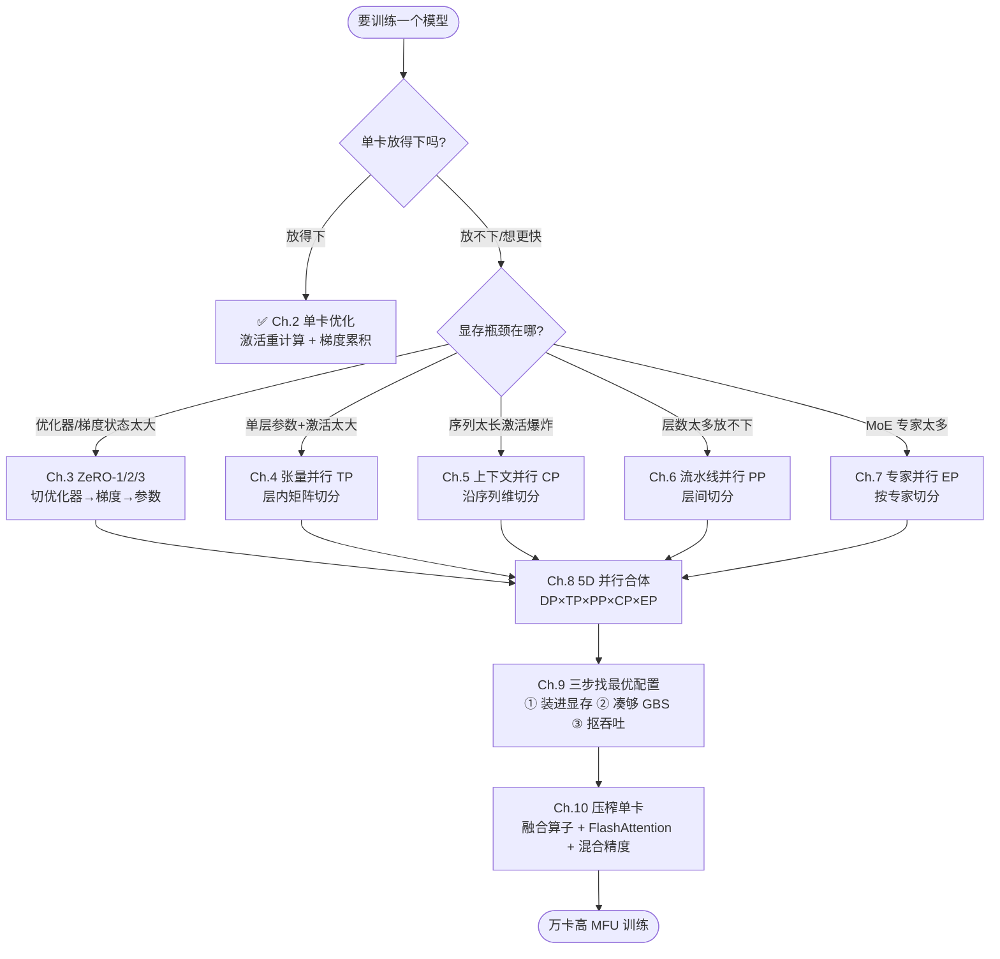
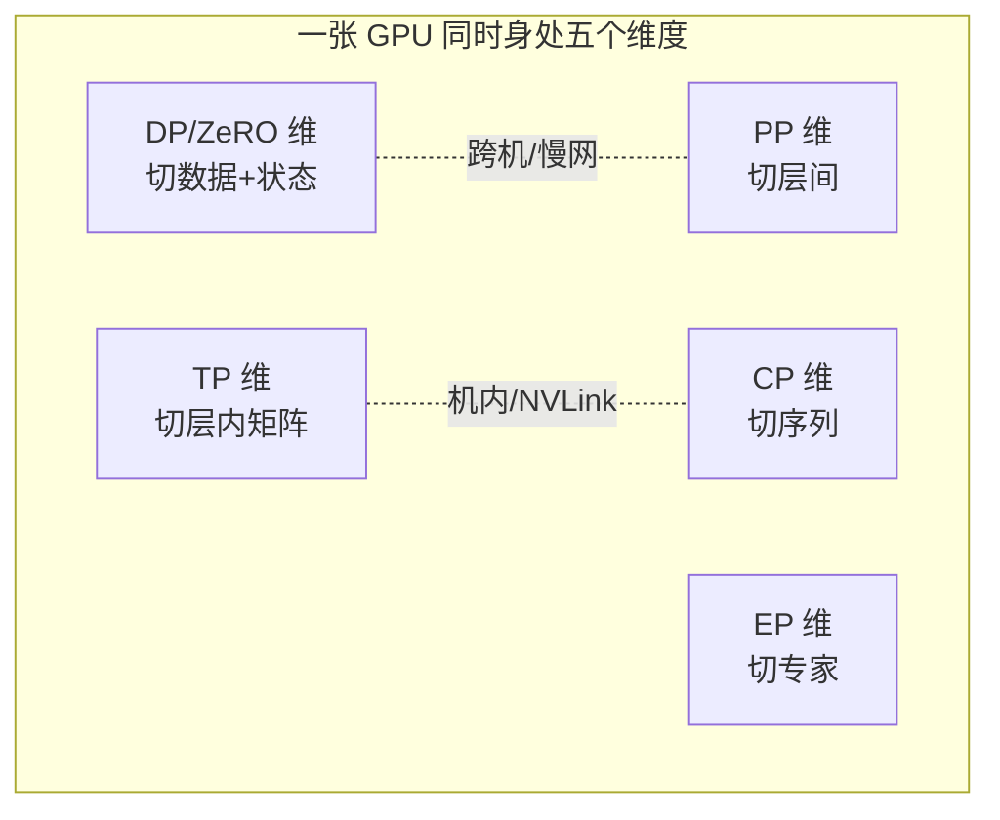
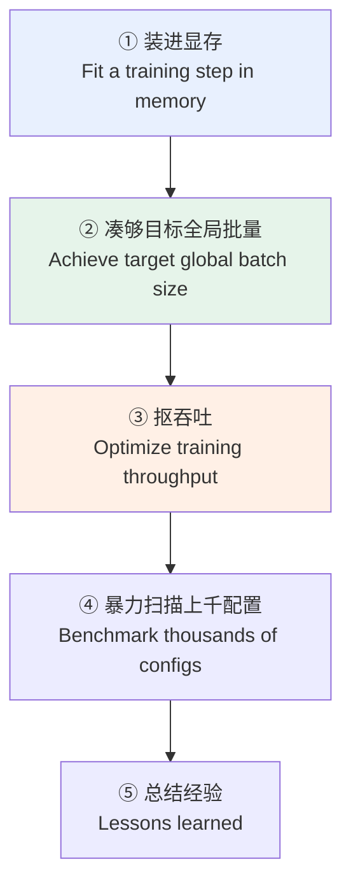
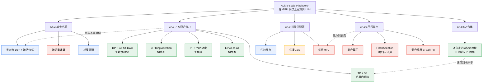

# 第 11 章 结论与全书综述：从单卡到万卡的完整心法 + 参考文献导读

> 对应原书：《The Ultra-Scale Playbook: Training LLMs on GPU Clusters》(HuggingFace, Nouamane Tazi、Ferdinand Mom、Haojun Zhao 等)
> 原书章节：**Ch.11 Conclusion（p.201–204）+ Ch.12 References（p.205–214）**
> 本文是「逐章精讲」系列的**收官篇 + 全书综述**。前 10 篇把每种技术拆开讲透；这一篇把它们重新**串成一条主线**，并把原书最后那一大页参考文献做成一份「该读什么、为什么读」的导读地图。

---

## 🗺️ 本章地图：我们走到了哪里

先用一句话定位：**整本书就是一条「让模型在越来越多的 GPU 上跑得越来越快」的攀爬路线**，而你现在站在山顶往回看。


这张图就是全书的脊柱。每往右走一步，我们都在回答同一个问题：**「现在卡住我的到底是显存、计算、还是通信？该用哪种切分来解？代价又是什么？」**——这正是全书的灵魂：**显存 / 计算 / 通信（Memory / Compute / Communication）三者的永恒权衡**。

> 💡 **怎么用这一章**
> - 如果你是**第一次读**：把它当成「全书电梯演讲」，先建立全局观，再回头看细节章。
> - 如果你**已经读完前 10 章**：把它当成「考前冲刺 + 决策手册」，每个技术只剩「何时用、瓶颈在哪」这几个最值钱的判断。
> - 如果你在**找工作面试**：本章的对比表 + 数值例子 + 决策链，几乎覆盖了分布式训练面试的所有高频问题。

---

## 11.0 原书《Conclusion》在说什么？📜

原书的结论章其实很短（正文不到两页），但每句话都有分量。我们先**忠实地把它讲清楚**，再展开综述。

作者开篇说（p.203）：

> "Congratulations, dear reader, you made it to the end! We started with exploring how to train a simple model on a single GPU and went all the way to mastering various intricate techniques used to efficiently train massive language models like **Llama-405B** and **DeepSeek-V3** on **thousands of GPUs**. By now, you can read a diagram like Llama-3's 4D parallel setup with (relative) ease!"

翻译与解读：

- **起点**：单卡训练一个简单模型（Ch.2）。
- **终点**：在**数千张 GPU**上高效训练 Llama-405B、DeepSeek-V3 这种巨无霸（Ch.3–10）。
- **能力检验**：你现在能**看懂 Llama-3 的 4D 并行配置图**——这正是作者设定的「毕业标准」。

作者接着点出**三件核心功夫**（p.203）：

1. **为给定的模型和集群规模，选对并行策略**（choosing the right parallelization strategy）。
2. **尽可能让通信与计算重叠**（overlapping communication and computation where possible）。
3. **写贴合硬件布局的自定义算子**（writing custom kernels that take into account the hardware layout）。

> 🔬 **第一性原理：为什么是这三件事？**
> GPU 集群训练慢，根因只有三类浪费：① **GPU 在等数据/等显存**（切分策略没选好）；② **GPU 在等网络**（通信没和计算重叠，算力空转）；③ **GPU 在算但算得笨**（kernel 没吃满 SM、访存没合并）。这三件功夫**一一对应**地消灭这三类浪费。整本书 240 页，本质就是把这三件事讲透。

作者还提醒一个常被忽视的趋势（p.203）：

> "...as both the AI builder community and model sizes are growing rapidly, the community of people using distributed techniques for **inference, fine-tuning, and training** is increasing exponentially..."

也就是说：**分布式不再是「只有几十个预训练大佬才需要」的屠龙术**。推理、微调、RLHF、长上下文……今天几乎每个认真做 LLM 的人都会撞上分布式。这本书的知识比你想象的「日常」得多。

---

## 11.1 主线复盘（一）：从单卡到万卡的决策链 ⛓️

这是本章的重头戏。我们把原书 Ch.2–Ch.10 串成**一条会随着「卡数 / 模型大小 / 序列长度」推进而逐步触发的决策链**。每一环都回答四个问题：**切什么 / 通信什么 / 何时用 / 瓶颈在哪**。

### 🎬 决策链总览图



下面逐环讲透。每一环我都给**数值例子**，让你对「什么时候必须上这招」有量级直觉。

---

### 🧱 第 0 环（Ch.2）：单卡 —— 先把账算明白

在谈任何并行之前，必须先会**算一张卡上的显存账**。这是全书的地基。

**模型状态（model states）显存**——混合精度 + Adam 训练，每个参数占 **16 字节**：

| 部分 | 精度 | 字节/参数 | 说明 |
|---|---|---|---|
| 权重 weights | BF16 | 2 | 前向/反向用 |
| 梯度 gradients | BF16 | 2 | 反向产出 |
| 优化器：FP32 主权重 | FP32 | 4 | master copy，保证更新精度 |
| 优化器：Adam 一阶动量 $m$ | FP32 | 4 | momentum |
| 优化器：Adam 二阶动量 $v$ | FP32 | 4 | variance |
| **合计** | | **16** | $= 2\Psi$（参数）$+ 2\Psi$（梯度）$+ 12\Psi$（优化器） |

设参数量为 $\Psi$，则模型状态显存：

$$M_{\text{states}} = 16\,\Psi \text{ bytes}$$

> 📐 **数值例子**：一个 **8B** 模型，光模型状态就是
> $$16 \times 8\times10^9 = 1.28\times10^{11}\text{ B} = 128\ \text{GB}$$
> 一张 H100 才 **80 GB**。结论：**8B 模型连「静态状态」都塞不进单卡**，更别说激活了——这就是为什么后面所有并行技术都不可避免。

**激活显存（activation memory）**——Transformer 的激活随 `批量 × 序列长度` 线性增长。原书给出（简化形式）：

$$M_{\text{act}} \approx L \cdot s \cdot b \cdot h \left(34 + 5\,\frac{n_{\text{heads}}\cdot s}{h}\right)\text{ bytes}$$

其中 $L$=层数，$s$=序列长度，$b$=每卡微批量，$h$=隐藏维，$n_{\text{heads}}$=注意力头数。注意那个 $\frac{n_{\text{heads}}\cdot s}{h}$ 项里**还有一个 $s$**——所以激活对序列长度是**接近平方**增长，这正是后面**上下文并行（Ch.5）**存在的根本原因。

Ch.2 给了两把「单卡省显存」的小刀：

- **激活重计算（Activation Recomputation / Gradient Checkpointing）**：前向时**不保存**中间激活，反向时**重新算一遍**。代价是多约 **+20% ~ +30% 计算量**，换来激活显存**大幅下降**（选择性重计算可只重算最便宜的部分）。
- **梯度累积（Gradient Accumulation）**：把一个大 batch 拆成多个 micro-batch 串行前向/反向、**累加梯度**再更新。让**激活显存按 micro-batch 大小**而非全局 batch 大小计算。这是后面**流水线并行（Ch.6）microbatch** 概念的前身。

> ⚠️ **常见坑**：很多人以为「重计算」是免费午餐。它**省显存但费算力**，在算力本就紧张（高 MFU）时反而拖慢训练。原书的态度是：**先用，但要做「选择性重计算」**——只重算 attention 这类显存大、重算便宜的部分。

> 🔗 想动手算这本账：见 [`../projects/01_memory_flops_calculator/`](../projects/01_memory_flops_calculator/)。

---

### 🔁 第 1 环（Ch.3）：数据并行 DP + ZeRO —— 第一个「多卡」反应

**是什么**：把模型在 $N_d$ 张卡上**各复制一份**，每张卡喂**不同的数据**，反向后用 **All-Reduce** 把梯度求平均，保证各副本同步。这是最简单、最常用的 1D 并行。

**切什么 / 通信什么**：

- 朴素 DP：**不切**任何东西（每卡一整份模型），只在反向后 **All-Reduce 梯度**（通信量 $\approx 2\Psi$，环形 All-Reduce 的经典结果）。
- 三个工程优化（原书重点）：
  1. **通信与反向重叠**：梯度一算完就发出去，别等整个反向结束（backward hook）。
  2. **梯度分桶（bucketing）**：把许多小梯度攒成大 bucket 再 All-Reduce，提升带宽利用率。
  3. **与梯度累积配合**：累积期间**不通信**，只在最后一个 micro-batch 才同步。

**ZeRO（Zero Redundancy Optimizer）—— DP 的进化形态**：朴素 DP 的浪费在于「16Ψ 的状态在每张卡上都存了一份」。ZeRO 把这些状态**切开分摊**：

| 阶段 | 切什么 | 每卡显存（近似） | 额外通信 |
|---|---|---|---|
| 基线 DP | 不切 | $16\Psi$ | All-Reduce 梯度 $2\Psi$ |
| **ZeRO-1** | 优化器状态 | $2\Psi + 2\Psi + \dfrac{12\Psi}{N_d}$ | 同 DP（Reduce-Scatter + All-Gather，总量≈不变） |
| **ZeRO-2** | + 梯度 | $2\Psi + \dfrac{2\Psi + 12\Psi}{N_d}$ | 同 DP |
| **ZeRO-3 (FSDP)** | + 参数 | $\dfrac{16\Psi}{N_d}$ | DP 的 **≈1.5×**（前向/反向各需 All-Gather 参数） |

> 📐 **数值例子**：8B 模型，$16\Psi=128$ GB。用 **ZeRO-3 在 64 张卡**上：每卡模型状态降到 $128/64 = 2$ GB。再加上激活，单卡 80 GB 完全装得下。**这就是 ZeRO 的威力：用通信换显存，把「单卡装不下」变成「能装下」。**

**何时用 / 瓶颈在哪**：

- DP/ZeRO 是**默认起手式**，几乎总要用，因为它直接放大全局 batch、提升吞吐。
- 瓶颈：① **DP 度数太大时吞吐会掉**（每步 All-Reduce 的通信占比上升，且全局 batch 过大伤收敛）；② ZeRO-3 的额外参数 All-Gather 在**慢网络（跨机 InfiniBand）上会成为瓶颈**——所以 ZeRO-3 更适合在**高带宽域内**展开。

> 🔗 动手实现 ZeRO 各阶段：[`../projects/02_data_parallel_zero/`](../projects/02_data_parallel_zero/)。

---

### ✂️ 第 2 环（Ch.4）：张量并行 TP + 序列并行 SP —— 切进「层内」

**是什么**：DP/ZeRO 是「整层不动、按数据/状态切」。当**单层本身**（比如一个巨大的 FFN 矩阵）都装不下，或想进一步压低**单层激活与参数显存**时，就要**把矩阵乘法本身切开**。这就是张量并行（Tensor Parallelism, TP）。

**切什么 / 通信什么**（一个 Transformer block 内）：

- **列并行（Column Linear）**：把权重 $W$ 按**列**切到各卡，每卡算 $X W_i$ 得到输出的一部分；前向是「拆分」，反向需要 All-Reduce 梯度。
- **行并行（Row Linear）**：把权重按**行**切，每卡算部分和，前向需要 **All-Reduce** 把部分和加起来。
- 一个标准 block（Attention + FFN）配成「列并行→行并行」，**前向需要 2 次 All-Reduce**（attention 出口 1 次，FFN 出口 1 次），反向同理。

**序列并行（Sequence Parallelism, SP）**：TP 之外，LayerNorm、Dropout 这类**逐元素**操作不需要完整隐藏维，可沿**序列维**切分，把这部分激活也分摊掉。SP 与 TP 配合，把 All-Reduce 拆成 **All-Gather + Reduce-Scatter**，进一步降低激活峰值显存。

> 📐 **数值例子**：TP=8 时，单层的参数和大部分激活都被切成 1/8。一个原本要 128 GB 状态的 8B 模型，单算 TP 维度，参数部分就降到约 16 GB/卡。

**何时用 / 瓶颈在哪**：

- 何时用：模型**单层太大**、或想配合 ZeRO 进一步降显存、或要支持很大的隐藏维。
- ⚠️ **致命瓶颈：TP 通信极其频繁且在关键路径上**（每个 block 前向 2 次 All-Reduce，无法和计算很好重叠）。因此 **TP 几乎只在单机内（NVLink，~900 GB/s）展开，度数通常 ≤ 8**。一旦 TP 跨机（走 InfiniBand），通信会把算力拖垮。**这是「TP ≤ 单节点 GPU 数」这条铁律的来源。**

> 🔗 动手实现列/行并行：[`../projects/03_tensor_parallel/`](../projects/03_tensor_parallel/)。

---

### 🧵 第 3 环（Ch.5）：上下文并行 CP —— 为「长序列」而生

**是什么**：回看激活公式里那个 $s^2$ 项——当序列长度 $s$ 涨到 **32k、128k、1M** 时，**注意力的激活会平方级爆炸**，连 TP 都救不了（TP 切的是隐藏维 $h$，不是序列 $s$）。上下文并行（Context Parallelism, CP）**沿序列维**把 token 切到不同卡上。

**切什么 / 通信什么**：

- 每张卡只持有序列的一段（比如 128k 切成 8 段，每卡 16k）。
- 注意力需要每个 query 看到**所有** key/value。**Ring Attention** 让 K/V 块在卡之间**环形传递**：算本地块的注意力 → 把 K/V 传给下一张卡 → 再算 → ……一圈下来每个 query 见过所有 K/V。**通信（传 K/V）与计算（算注意力）天然重叠**，这是 CP 高效的关键。
- **Zig-Zag Ring Attention**：因为是**因果掩码（causal mask）**，序列前段的卡算得少、后段算得多，**负载不均**。Zig-Zag 把序列段**交错分配**（卡 0 拿第 0 段和第 15 段……），让每张卡的计算量大致相等。

**何时用 / 瓶颈在哪**：

- 何时用：**唯一目标就是长上下文**。短序列（≤4k）几乎用不到 CP。
- 瓶颈：环形传 K/V 的通信量随序列长度增长；负载均衡（靠 Zig-Zag 缓解）；与 FlashAttention 的结合（Ring Flash Attention）。

> 🔗 动手实现 Ring Attention：[`../projects/05_context_parallel_ring_attention/`](../projects/05_context_parallel_ring_attention/)。

---

### 🪜 第 4 环（Ch.6）：流水线并行 PP —— 切进「层间」

**是什么**：当模型**层数太多**（比如 405B 有上百层），即便每层都切了还是放不下，就把**不同的层**放到不同的卡（stage）上，数据像在流水线上一样**逐 stage 流过**。这就是流水线并行（Pipeline Parallelism, PP）。

**切什么 / 通信什么**：

- 切**连续的层块**到不同 stage。通信是**相邻 stage 间点对点（P2P）传激活**——通信量小、且只跟相邻 stage 通信，所以 **PP 对网络带宽要求最低，可以跨机**。
- **核心代价：流水线气泡（pipeline bubble）**。第一个 micro-batch 必须从 stage 0 一路流到 stage $p-1$ 才填满流水线，期间很多卡在空转。

**气泡公式（AFAB / GPipe 调度）**：

$$r_{\text{bubble}} = \frac{p - 1}{m}$$

其中 $p$=流水线 stage 数，$m$=micro-batch 数。

> 📐 **数值例子**：$p=8$ 个 stage。
> - 若 $m=8$：气泡 $=7/8 = 87.5\%$！算力几乎全浪费。
> - 若 $m=32$：气泡 $=7/32 \approx 21.9\%$。
> - 若 $m=128$：气泡 $=7/128 \approx 5.5\%$。
> **结论：micro-batch 数 $m$ 必须远大于 stage 数 $p$，气泡才小。** 这就是为什么 PP 总要配合大量 micro-batch（也就和梯度累积天然结合）。

**调度演进（本章四小节，越来越省）**：

| 调度 | 思路 | 气泡 | 激活显存 |
|---|---|---|---|
| **AFAB**（All-Forward-All-Backward / GPipe） | 先把所有 micro-batch 前向，再全部反向 | $\frac{p-1}{m}$ | 高（要存所有 micro-batch 激活） |
| **1F1B**（One-Forward-One-Backward，Llama-3.1 用） | 前向反向交错，尽早释放激活 | $\frac{p-1}{m}$（相近） | **低**（峰值激活 $\propto p$ 而非 $m$） |
| **Interleaving**（虚拟 stage） | 每卡放多个不连续层块，缩短填充期 | 更小 | 中 |
| **Zero Bubble / DualPipe**（DeepSeek-V3 用） | 把反向拆成「算输入梯度」「算权重梯度」，用后者填气泡 | $\approx 0$ | 中 |

**用「时间线」看清气泡（AFAB，4 stage × 4 micro-batch）**：

```mermaid
gantt
    title 流水线时间线（AFAB：先全前向 F，再全反向 B；灰=气泡空转）
    dateFormat X
    axisFormat %s
    section Stage0
    F1 :0,1
    F2 :1,2
    F3 :2,3
    F4 :3,4
    (空转) :crit, 4,7
    B4 :7,9
    B3 :9,11
    section Stage3
    (空转) :crit, 0,3
    F1 :3,4
    F2 :4,5
    F3 :5,6
    F4 :6,7
    B4 :7,9
    B3 :9,11
```



看图就懂：**Stage3 在最前面要干等 3 格（等数据从 Stage0 流过来），Stage0 在中间要干等（等反向回传）**——这些标红的格子就是气泡。$p=4,m=4$ 时气泡 $=(4-1)/4=75\%$，画面里空转格子占了一大半。把 $m$ 加到 16，前后那几格空转占比就摊薄到 $(4-1)/16≈18.75\%$。

**再看 1F1B（One-Forward-One-Backward）的时间线（同样 4 stage × 4 micro-batch）**，对比一下气泡和激活显存的差别：

```mermaid
gantt
    title 流水线时间线（1F1B：进入稳态后前向 F / 反向 B 交错；激活尽早释放）
    dateFormat X
    axisFormat %s
    section Stage0
    F1 :0,1
    F2 :1,2
    F3 :2,3
    B1 :3,4
    F4 :4,5
    B2 :5,6
    B3 :6,7
    B4 :7,8
    section Stage3
    (空转) :crit, 0,3
    F1 :3,4
    B1 :4,5
    F2 :5,6
    B2 :6,7
    F3 :7,8
    B3 :8,9
    F4 :9,10
    B4 :10,11
```



对照两张图，关键差别不在「气泡总比例」（AFAB 与 1F1B 的气泡都约为 $\frac{p-1}{m}$，**两者气泡大小相近**），而在**激活显存峰值**：

- **AFAB**：要把**全部 $m$ 个 micro-batch 的前向激活**都堆着，直到反向阶段才逐个释放 → 激活峰值 $\propto m$（micro-batch 越多越省气泡，但激活越爆）。
- **1F1B**：每个 stage 一旦做完某个 micro-batch 的前向，**马上安排它的反向并立刻释放激活** → 在途的激活数量被压到 $\propto p$（流水线深度），**与 $m$ 解耦**。这就是 1F1B 能「既加大 $m$ 压气泡、又不撑爆显存」的根本原因，也是 Llama-3.1 选它的理由。

> 💡 **一句话记住 AFAB→1F1B**：气泡几乎一样，但 1F1B 把「要同时存活的激活」从「全部 micro-batch」降到「流水线深度那么几个」。**省的是显存，不是气泡。**

> 💡 **直觉**：PP 的全部艺术，就是**和「气泡」搏斗**。从 GPipe 到 DualPipe，每一代都在「用更精巧的调度把空转的格子填满」。DeepSeek-V3 的 DualPipe 能把气泡压到接近零，这也是它能在有限卡上训 671B 的关键之一。

> 🔗 动手实现 AFAB/1F1B：[`../projects/04_pipeline_parallel/`](../projects/04_pipeline_parallel/)。

---

### 👨‍🔬 第 5 环（Ch.7）：专家并行 EP —— 为 MoE 而生

**是什么**：混合专家（Mixture-of-Experts, MoE）模型有很多个「专家 FFN」，但每个 token 只激活其中少数几个（top-k 路由）。专家并行（Expert Parallelism, EP）把**不同的专家放到不同的卡**上。

**切什么 / 通信什么**：

- 切**专家**（一整个专家 FFN 是一个不可分单元，放某张卡）。
- 通信是 **All-to-All**：token 要被「派送」到它选中专家所在的卡（dispatch），算完再「收回」原位（combine）。这是 EP 特有的通信模式。

**何时用 / 瓶颈在哪**：

- 何时用：**只在 MoE 模型上**（DeepSeek-V3、Mixtral 等）。Dense 模型用不到。
- 瓶颈：All-to-All 通信、以及**负载均衡**（热门专家被挤爆、冷门专家闲置，需要辅助 loss 或路由技巧来均衡）。
- EP 与 DP 天然兼容（专家彼此独立），常和 TP/PP 一起组成 MoE 的并行方案。

---

### 🧊 第 6 环（Ch.8）：5D 并行合体 —— 把五把刀叠起来

到这里，我们手上有**五种正交的切分维度**。它们各管一类瓶颈，可以**同时叠加**成一个 N 维网格（mesh）：



**关键心法：把「通信贵的维度」放进「网络快的域」。** 这是 5D 配置的最高指导原则：

| 维度 | 通信模式 | 通信频率 | 该放哪个网络域 |
|---|---|---|---|
| **TP** | All-Reduce（关键路径，难重叠） | 极高 | **机内 NVLink**（度数 ≤ 8） |
| **EP** | All-to-All | 高 | 机内或高带宽域 |
| **CP** | Ring 传 K/V（可重叠） | 中 | 机内或近邻 |
| **DP/ZeRO** | All-Reduce / All-Gather（可重叠） | 中 | 可跨机 |
| **PP** | P2P 传激活（量小） | 低 | **最适合跨机** InfiniBand |

> 🔬 **第一性原理：为什么要这么排？**
> 集群的网络是**分层的**：机内 NVLink ~900 GB/s，跨机 InfiniBand ~50–100 GB/s（差一个量级）。所以**通信越频繁/越在关键路径的维度，越要放进越快的网络域**。这条原则可以把整本书的并行配置经验压缩成一句话。

**一个真实配置读法（Llama-3 405B，4D 并行）**：典型形如 `TP=8（机内）× PP=16（跨机）× DP=...（跨机）× CP（长上下文阶段）`。读懂它，就是作者设定的毕业标准。

---

### 🎯 第 7 环（Ch.9）：找到最优配置 —— 三步决策法

有了五把刀，**怎么针对具体模型 + 具体集群选出最优组合？** 原书给出一个干净的**三步法**：



- **第 1 步 装进显存**：先用 TP / PP / ZeRO / 重计算的组合，**保证一步训练能塞进单卡显存**。这是硬约束，装不下一切免谈。
- **第 2 步 凑够全局批量（Global Batch Size, GBS）**：模型收敛需要一个目标 GBS。GBS = `micro_batch × 梯度累积步数 × DP度数`。在第 1 步选定并行后，用 **DP 度数 + 梯度累积**把 GBS 调到目标值。
- **第 3 步 抠吞吐**：在前两步约束下，调整各维度度数、micro-batch 大小、重计算策略，让 **MFU（Model FLOPs Utilization，模型算力利用率）最大**。
- **第 4、5 步**：作者团队**真的跑了上千个配置**做基准测试（这本书最硬核的部分之一），并坦诚分享了「在 GPU 集群上跑 benchmark 比想象中难得多」的踩坑经验。

> 💡 **面试高频**：「给你一个 70B 模型、64 张 H100，怎么配并行？」——标准答法就是走这三步：① 先估显存决定要不要 PP/TP/ZeRO-3；② 算 GBS 决定 DP 和累积；③ 再微调抠 MFU。能把第 11.1 节的决策链和这三步串起来讲，基本就稳了。

---

### 🔧 第 8 环（Ch.10）：压榨单卡 —— 当并行都配好之后

并行解决的是「多卡怎么协作」。但如果**每一张卡本身**就只发挥了 30% 算力，再好的并行也白搭。Ch.10 转向**单卡内部的极致优化**：

| 技术 | 解决什么 | 一句话原理 |
|---|---|---|
| **GPU primer**（SM/warp/显存层级） | 建立硬件心智模型 | 知道 SM、warp、HBM↔SRAM 带宽差异，才知道往哪优化 |
| **Kernel 优化** | 访存与并行度 | 内存合并（coalescing）、分块（tiling）、提高占用率 |
| **融合算子（Fused kernels）** | 减少 kernel 启动 + 访存往返 | 把多个逐元素 op 融成一个 kernel，少读写 HBM |
| **FlashAttention** | 注意力的显存与速度 | **不实例化 $s\times s$ 注意力矩阵**，分块在 SRAM 里算，把显存从 $O(s^2)$ 降到 $O(s)$ |
| **混合精度（Mixed precision）** | 算力 + 显存 | BF16/FP16 算、FP32 累加；FP8 进一步提速（H100） |

> 🔬 **FlashAttention 为什么重要**：它把注意力的访存瓶颈（反复读写巨大的 $s\times s$ 矩阵）干掉了。这不仅大幅提速，还**省下平方级的激活显存**——直接缓解了 Ch.5 上下文并行要解决的那个 $s^2$ 难题。所以 **Ring Flash Attention = CP + FlashAttention** 是长上下文训练的黄金组合。

> 🔗 从零实现各种集合通信原语（All-Reduce/All-Gather/Reduce-Scatter/All-to-All），是理解上面所有通信代价的基本功：[`../projects/06_collectives_from_scratch/`](../projects/06_collectives_from_scratch/)。

---

## 11.2 主线复盘（二）：三大资源的总账 ⚖️

把全书 5D 并行 + 单卡优化拍平到「**显存 / 计算 / 通信**」这张总账上，你会发现每个技术都是在**三者之间倒腾**：

| 技术 | 省显存？ | 影响计算？ | 增加通信？ | 通信原语 |
|---|---|---|---|---|
| 激活重计算 (Ch.2) | ✅ 大降激活 | ❌ +20~30% 重算 | — | — |
| 梯度累积 (Ch.2) | ✅ 降激活峰值 | 略增（串行 micro-batch） | — | — |
| ZeRO-1/2/3 (Ch.3) | ✅✅ 切状态 | — | ZeRO-3 +50% | Reduce-Scatter / All-Gather |
| 张量并行 TP (Ch.4) | ✅ 切层内参数+激活 | — | ⚠️ 极高，关键路径 | All-Reduce |
| 序列并行 SP (Ch.4) | ✅ 切 LN/Dropout 激活 | — | 中 | All-Gather / Reduce-Scatter |
| 上下文并行 CP (Ch.5) | ✅✅ 切序列激活 | — | 中，可重叠 | Ring P2P (K/V) |
| 流水线并行 PP (Ch.6) | ✅ 切层间参数 | ❌ 气泡空转 | ✅ 低，量小 | P2P 激活 |
| 专家并行 EP (Ch.7) | ✅ 切专家参数 | — | 中 | All-to-All |
| 融合算子 (Ch.10) | 略省 | ✅ 提速 | — | — |
| FlashAttention (Ch.10) | ✅✅ 注意力 $O(s^2)\to O(s)$ | ✅ 提速 | — | — |
| 混合精度 (Ch.10) | ✅ 减半 | ✅ 提速 | 通信量也减半 | — |

> 🧠 **一句话记住全书**：
> **显存不够 → 切（ZeRO/TP/PP/CP/EP）或重算；算力浪费 → 融合算子 + FlashAttention + 高 MFU 调度；通信卡脖子 → 重叠 + 把贵的通信放进快的网络域。**

---

### 把「通信量」也算成一笔账 📡

显存账我们算过了，**通信账**同样能量化——这是判断「某个并行维度会不会成瓶颈」的关键。核心公式来自环形（ring）集合通信：

- **环形 All-Reduce**：每张卡收发的数据量 $\approx 2\cdot\dfrac{N-1}{N}\cdot V$，当卡数 $N$ 大时趋近 $2V$（$V$ 是被规约张量的大小）。它由 **Reduce-Scatter（$\approx V$）+ All-Gather（$\approx V$）** 两步组成。
- **All-Gather / Reduce-Scatter** 各自 $\approx \dfrac{N-1}{N}V \approx V$。

> 📐 **数值例子（DP 每步通信量）**：8B 模型，BF16 梯度 $V = 2\Psi = 16$ GB。一次环形 All-Reduce 每卡要收发约 $2V = 32$ GB。若机内 NVLink 有效带宽按 ~300 GB/s 算，单这一步通信 $\approx 32/300 \approx 107$ ms。**如果前向反向只花 200 ms，那通信就吃掉了 1/3 时间——这正是「梯度通信必须和反向重叠」的量化理由。**

> 📐 **数值例子（TP 为何不能跨机）**：TP 在每个 Transformer block 前向要做 **2 次 All-Reduce**，反向再 2 次。设隐藏维 $h=4096$、序列 $s=4096$、微批 $b=1$、BF16，单次 All-Reduce 的激活张量 $V = b\cdot s\cdot h\cdot 2 = 1\times4096\times4096\times2 \approx 32$ MB。一个 80 层模型一次前向就是 $80\times2\times2V \approx 80\times2\times64\text{MB} \approx 10$ GB 的 All-Reduce 通信，**且全在计算关键路径上无法重叠**。机内 NVLink（~900 GB/s）扛得住，跨机 InfiniBand（~50 GB/s）会慢近 20 倍——**这就是「TP ≤ 单节点卡数」铁律的算术证明。**

> 📐 **数值例子（PP 通信为何便宜）**：PP 相邻 stage 只传一次激活 $V = b\cdot s\cdot h\cdot 2 \approx 32$ MB（同上），且是**点对点、量小、可与计算重叠**。对比 TP 每 block 的 GB 级 All-Reduce，**PP 的通信量小了 2~3 个量级——这就是 PP 能放心跨机的原因。**

> 🔬 **第一性原理总结**：把上面三笔账并排看——**DP 通信 = O(参数量)、TP 通信 = O(激活量×层数)且在关键路径、PP 通信 = O(单层激活)且可重叠**。通信账的「大小 × 频率 × 能否重叠」三要素，完全决定了 11.1 第 6 环那张「哪个维度放哪个网络域」的表。

### 用代码把「单卡显存账」固化下来 🧮

原书 Ch.2 的核心是这张显存账。为贯彻「**代码教学是重点**」，我们把它写成一个可直接跑的估算器，并**逐行讲解**——这也正好对应 [`../projects/01_memory_flops_calculator/`](../projects/01_memory_flops_calculator/) 要实现的东西。

```python
def estimate_memory_gb(
    num_params,        # 参数量 Ψ，例如 8e9 表示 8B
    seq_len,           # 序列长度 s
    micro_batch,       # 每卡微批量 b
    num_layers,        # 层数 L
    hidden,            # 隐藏维 h
    num_heads,         # 注意力头数 n_heads
    bytes_per_param=16,          # 混合精度+Adam: 16 字节/参数（见 11.1 表）
    recompute=False,             # 是否开激活重计算
    tp=1, pp=1, zero_stage=0, dp=1   # 各并行度数
):
    # ---- 1) 模型状态显存：16Ψ，再按 TP/PP/ZeRO 切分 ----
    states = num_params * bytes_per_param            # 总状态字节
    states /= (tp * pp)                              # TP 切层内、PP 切层间，参数被分摊
    if zero_stage == 1:                              # ZeRO-1 只切优化器(12/16)
        states = num_params*4/(tp*pp) + (num_params*12/(tp*pp))/dp
    elif zero_stage == 2:                            # ZeRO-2 切优化器+梯度(14/16)
        states = num_params*2/(tp*pp) + (num_params*14/(tp*pp))/dp
    elif zero_stage == 3:                            # ZeRO-3 全切(16/16)
        states = (num_params*16/(tp*pp))/dp

    # ---- 2) 激活显存：原书公式，按 TP/PP 分摊 ----
    act = num_layers * seq_len * micro_batch * hidden * (
        34 + 5 * (num_heads * seq_len) / hidden     # 注意末项含 s → 近似平方增长
    )
    act /= (tp * pp)                                 # TP 切隐藏维、PP 切层 → 激活也分摊
    if recompute:                                    # 重计算把激活峰值砍掉一大块
        act *= 0.2                                   # 选择性重计算的粗略系数

    total_bytes = states + act
    return total_bytes / (1024**3)                   # 转成 GB
```

**逐行解读**：

- **第 2 块（states）**：`num_params * 16` 就是 11.1 节那张 16 字节/参数表的代码化；`/(tp*pp)` 体现「TP 切层内、PP 切层间」都会摊薄参数；`zero_stage` 分支体现 ZeRO 三阶段**只对 DP 维度 `/dp` 再切一刀**——注意 ZeRO 切的是「在 DP 副本之间冗余的那份状态」，所以除的是 `dp` 不是 `tp*pp`。
- **第 3 块（act）**：直接套用原书激活公式，`(34 + 5*n_heads*s/h)` 里那个 `s` 让激活对序列长度近似平方——**这一行就是上下文并行存在的全部理由**。`/(tp*pp)` 表示 TP/PP 也会分摊激活；`recompute` 用一个粗系数表示「重算换显存」。
- **返回**：字节转 GB，和「H100 = 80 GB」直接对照。

> 📐 **跑一下**：`estimate_memory_gb(8e9, 4096, 1, 32, 4096, 32, zero_stage=3, dp=64)` 会告诉你「8B 模型 + ZeRO-3 + 64 卡」单卡占用，验证 11.1 节「2 GB 状态 + 激活」的结论。把 `zero_stage` 改成 0 再跑，立刻看到「单卡 128 GB 装不下」。**这就是把抽象公式变成肌肉记忆的最快方式。**

---

## 11.3 作者的结论与给从业者的三条建议 🧭

原书结论章最实在的部分，是作者给「学完之后该干嘛」开的**三条路**（p.204，逐条对应原文）：

> 1. "Carefully read some of the landmark or very recent papers..."
> 2. "Start from scratch and implement an algorithm yourself. Often, a method only fully 'clicks' if you've actually implemented it."
> 3. "Dive into one of the widely used frameworks and start contributing: fix bugs, answer issues, or implement a new feature."

逐条解读 + 我的实操补充：

### 📖 建议一：精读里程碑论文（和最新论文）

作者说，References 里列了「我们所知最有影响力的论文、博客、书」。**别贪多**——挑几篇里程碑（Megatron-LM、ZeRO、FlashAttention）精读，比泛读一百篇有用。下一节 11.4 就是为这条建议准备的「该读哪几篇」导读。

### ✍️ 建议二：从零亲手实现一遍

作者的原话很关键：**"a method only fully 'clicks' if you've actually implemented it"**（一个方法，只有你亲手实现过才会真正「通」）。这正是本仓库 [`../projects/`](../projects/) 六个动手项目存在的意义——从零写 DP/ZeRO、TP、PP、Ring Attention、集合通信。

> 💡 **实战路线**：先实现 [`06_collectives_from_scratch`](../projects/06_collectives_from_scratch/)（理解 All-Reduce 等原语），再实现 [`02_data_parallel_zero`](../projects/02_data_parallel_zero/)（DP/ZeRO 就是这些原语的编排），你会发现「ZeRO-2 和 ZeRO-3 通信差异」这种面试题，自己写过就一眼看穿。

### 🛠️ 建议三：投身一个主流框架去贡献

作者说这是「**进入任何 ML 领域最好的方式**」：修 bug、答 issue、实现新特性。下一节的「训练框架」类导读会告诉你各框架的定位，帮你选一个切入。

最后，作者用一句开源浪漫主义收尾：

> "May the force of open source and open science always be with you."

并在**致谢**里点名感谢了做评审 + NotebookLM 音频的 Elie、优化前端的 Hynek、修 hub 的 Simon、以及让科学集群在「起起落落」中稳定运行的 Matthieu 和 Hugo——这其实侧面说明：**训大模型是一项重度依赖工程团队和基础设施的系统工程，不是一个人的独舞。**

---

## 11.4 参考文献分类导读：该读什么、为什么 📚

原书 References（p.205–214）按主题分成了几大类。下面我把每一类**整理成表**，并对**重点条目**给出「为什么读 / 对应本书哪章」的导读。这部分是本章对原书最有增量的加工——把一张「链接清单」变成一张「学习路线图」。

### 🏆 一、里程碑 LLM 扩展论文（Landmark LLM scaling papers）

> **怎么读这一类**：这是「必读核心」。建议按「先方法、后报告」的顺序：先读 Megatron-LM（方法奠基），再读各家技术报告（Llama 3、DeepSeek-V3）看方法如何落地到真实万卡训练。

| 论文 | 贡献 | 对应本书 | 优先级 |
|---|---|---|---|
| **Megatron-LM** | 提出**张量并行**与高效模型并行 | Ch.4 | ⭐⭐⭐ 必读 |
| **Megatron-Turing NLG 530B** | DeepSpeed + Megatron 组合训 530B | Ch.3+Ch.8 | ⭐⭐ |
| **PaLM** | Google Pathways，数百任务 + 推理能力 | 全书背景 | ⭐⭐ |
| **Gemini** | 多模态（文/图/音/视频） | 背景 | ⭐ |
| **Llama 3** | Llama-3 系列，**4D 并行**的真实落地范本 | Ch.8+Ch.9 | ⭐⭐⭐ 必读 |
| **DeepSeek-V3** | 671B MoE + **DualPipe** + FP8 训练 | Ch.6+Ch.7+Ch.10 | ⭐⭐⭐ 必读 |

> 💡 **为什么先读 Megatron-LM**：它是 TP 的源头，本书 Ch.4 的列/行并行、Ch.4 序列并行（来自后续 Megatron 论文 arXiv:2205.05198）全脱胎于此。读懂它，TP 这一环就通了。
> 💡 **为什么读 DeepSeek-V3 报告**：它把本书后半段最硬的招（MoE 专家并行、DualPipe 零气泡、FP8 混合精度）**同时**用在一次真实训练里，是「5D 并行合体」的最佳案例研究。

### 🧰 二、训练框架（Training frameworks）

> **怎么读这一类**：对应作者的「建议三：去贡献」。先按「教学友好 → 工业级」排序选一个切入。

| 框架 | 定位 | 适合谁 |
|---|---|---|
| **Nanotron** (HuggingFace) | 本书配套框架，各种并行策略 | 想读「和书一致」的生产代码 |
| **Megatron-LM** (NVIDIA) | 工业级 TP/PP/SP 标杆 | 想看极致性能实现 |
| **DeepSpeed** (Microsoft) | **ZeRO** 各阶段 + 多并行 | 想吃透 ZeRO（Ch.3） |
| **FairScale** (Meta) | PyTorch 大规模训练扩展 | FSDP/分片优化器 |
| **Colossal-AI** | 集成式大规模训练系统 | 想要一站式方案 |
| **torchtitan** (PyTorch 官方) | PyTorch 原生大模型训练 | 想看最「干净」的 PyTorch 原生写法 |
| **GPT-NeoX** (EleutherAI) | 训过 GPT-NeoX-20B | 开源社区生态 |
| **LitGPT** (Lightning AI) | 20+ 开源 LLM，重**可复现** | 想要可复现 baseline |
| **OpenDiLoCo** | 跨集群低通信训练（DiLoCo） | 关心去中心化/弱网训练 |
| **torchgpipe / OSLO** | GPipe(PP) / 大规模优化框架 | 研究 PP 调度 |

> 💡 **入门建议**：想跟书走，读 **Nanotron**（本书的「production-ready code」参照系，Ch.1 就提到）；想学最规范的 PyTorch 原生写法，读 **torchtitan**；想吃透 ZeRO，读 **DeepSpeed** 源码配合 Ch.3。

### 🐞 三、调试与性能剖析（Debugging）

> **怎么读这一类**：这是「**实战刚需**」。训大模型 80% 时间在调性能，这几篇 PyTorch 官方教程值得**动手照做一遍**。

| 资源 | 解决什么 | 对应本书 |
|---|---|---|
| **Speed profiling**（PyTorch profiler 官方教程） | 找计算瓶颈、看 kernel 时间线 | Ch.9+Ch.10 |
| **Memory profiling**（PyTorch 显存优化指南） | 理解/优化 GPU 显存 | Ch.2 |
| **Memory profiling walkthrough**（HF 博客） | 用简单例子看显存可视化 | Ch.2 |
| **TensorBoard profiler tutorial** | 用 TensorBoard 做性能剖析 | Ch.9 |

> 💡 **为什么重要**：本书 Ch.2 的显存曲线、Ch.9 的吞吐调优，背后全靠 profiler。**不会 profiling，就只能瞎调参。** 这几篇是把书里的「显存账/吞吐账」落到真实工具的桥梁。配合本仓库 [`../appendix/`](../appendix/) 的「Distributed Training Profiling（A2）」一起看。

### 🔗 四、分布式技术（Distribution techniques）

> **怎么读这一类**：这是「**和本书章节一一对应的深读清单**」。每读完书的一章，就去读对应的这几篇原始材料补深度。

| 资源 | 对应本书章节 | 一句话 |
|---|---|---|
| **Data parallelism**（siboehm 博文） | Ch.3 | DP 训练的通俗深讲 |
| **ZeRO**（arXiv:1910.02054） | Ch.3 | ZeRO 原论文，三阶段显存优化 |
| **FSDP**（arXiv:2304.11277） | Ch.3 | PyTorch 全分片数据并行 = ZeRO-3 |
| **Tensor + sequence parallel + selective recompute**（arXiv:2205.05198） | Ch.4+Ch.2 | 序列并行 + 选择性重计算的出处 |
| **Pipeline parallelism**（NVIDIA 万亿参数博文） | Ch.6 | PP 落地指南 |
| **Breadth-first pipeline parallelism**（arXiv:2211.05953） | Ch.6 | PP 调度的更广讨论 |
| **Ring all-reduce**（Gibiansky 经典博文） | Ch.3+附录 | **理解环形 All-Reduce 的最佳入门** |
| **Ring Flash Attention**（GitHub） | Ch.5+Ch.10 | Ring Attention × FlashAttention |
| **Ring Attention tutorial**（coconut-mode） | Ch.5 | Ring Attention 概念与实现 |
| **ZeRO and 3D**（DeepSpeed 教程） | Ch.8 | **ZeRO vs 3D 并行的权衡**——选型必读 |
| **Mixed precision training**（arXiv:1710.03740） | Ch.10 | 混合精度原始论文 |
| **Visualizing 6D mesh parallelism**（main-horse） | Ch.8 | 6D 并行网格的通信可视化 |

> 💡 **三篇「点睛」推荐**：① **Ring all-reduce**（Gibiansky）——把全书所有 All-Reduce 通信量的来龙去脉讲透，配合 [`../projects/06_collectives_from_scratch/`](../projects/06_collectives_from_scratch/) 一起读；② **ZeRO and 3D**（DeepSpeed）——直接回答「我到底该用 ZeRO 还是 3D 并行」这个选型灵魂问题，是 Ch.8 的最佳补充；③ **FSDP 论文**——理解「FSDP 就是 PyTorch 原生的 ZeRO-3」。

### 🖥️ 五、硬件（Hardware）

> **怎么读这一类**：这是「**把软件并行落到真实集群**」的现实检验。读这些，你才知道前面所有「机内 NVLink vs 跨机 IB」的假设从何而来。

| 资源 | 讲什么 | 为什么读 |
|---|---|---|
| **Fire-Flyer**（DeepSeek，arXiv:2408.14158） | 设计 1 万张 **PCIe** GPU 集群 | 看「省钱版」万卡集群怎么搭，对照 11.1 的网络分层假设 |
| **Meta 24k H100 集群** | Meta AI 基础设施全景 | 工业级 H100 集群的真实拓扑 |
| **SemiAnalysis 10万 H100 集群** | 10 万卡集群的供电/网络分析 | 理解超大规模的**电力与网络**才是真瓶颈 |
| **Modal GPU glossary** | 「给人看的 CUDA 文档」 | Ch.10 GPU primer 的速查手册 |

> 🔬 **为什么硬件这一类不能跳过**：本书反复强调「TP 放机内、PP 放跨机」——**这条铁律的根源就是硬件网络的物理分层**。读 Meta/SemiAnalysis 的集群报告，你会真正理解「为什么 NVLink 和 InfiniBand 差一个量级」如何决定了你的并行配置。

### 📦 六、其它 + 收尾资源（Others）

这一类是「**老兵的实战笔记**」，含金量极高，尤其适合真正要上手训大模型的人：

| 资源 | 价值 |
|---|---|
| **Stas Bekman's handbook**（ml-engineering） | 训 LLM 的「百科全书」，工程细节最全 |
| **BLOOM training chronicles** | 176B 模型训练的**真实流水账**（含各种崩溃与修复） |
| **OPT logbook**（Meta） | OPT-175B 训练日志，看真实事故现场 |
| **Harm's law / long contexts**（harmdevries） | 模型大小 vs 计算开销、长上下文成本的量化分析 |
| **GPU Mode / EleutherAI YouTube** | 活跃的性能/扩展性读书会社区 |
| **Google JAX scaling book** | JAX 视角的「如何扩展你的模型」 |
| **fvsmassa & TimDarcet FSDP（~500 LoC）** | **极简 FSDP 实现**，500 行读懂 ZeRO-3 |
| **thonking.ai**（Horace He） | PyTorch 性能内幕博客 |
| **Aleksa's ELI5: FlashAttention** | FlashAttention 最通俗的解释 |
| **TunibAI 3D parallelism tutorials** | PyTorch 大规模建模实战教程 |

> 💡 **强烈推荐两个「读日志」**：**BLOOM chronicles** 和 **OPT logbook** 是市面上极少见的、把「训练 175B 时到底会出什么事故、怎么救」一五一十记下来的一手材料。读完你对「大规模训练的真实痛苦」会有完全不同的体感——loss 尖刺、硬件故障、数值不稳定……这些书里讲方法，日志里讲血泪。
> 💡 **极简实现首选**：那个 **~500 行的 FSDP** 完美呼应作者「亲手实现才会通」的建议——一个周末就能读完并复现 ZeRO-3 的核心。

---

## 11.5 全书知识地图（总图）🗺️

把全书所有概念收进一张**总图**。横向是「从单卡到万卡」的推进，纵向是「显存/计算/通信」三大资源，外加单卡 kernel 优化层与决策方法层。



> 🎨 **图例**：<span>🔵 蓝=显存维度</span>，<span>🔴 红=计算维度</span>，<span>🟢 绿=通信维度</span>，<span>🟡 黄=决策/方法</span>。整张图的「三色」分布，正好印证 11.2 节的总账：**全书所有招式，都是在这三种颜色之间倒腾。**

---

## 11.6 面试 / 自检：你真的「毕业」了吗？✅

作者的毕业标准是「能读懂 Llama-3 的 4D 并行图」。这里给一份更细的自检清单（也是分布式训练**面试高频**）：

| # | 问题 | 在本书哪 | 一句话答案 |
|---|---|---|---|
| 1 | 混合精度 + Adam，每参数多少字节？ | Ch.2 | 16（2+2+4+4+4） |
| 2 | 8B 模型单卡（80G）为何放不下？ | Ch.2 | 光状态 128 GB > 80 GB |
| 3 | ZeRO-1/2/3 分别切什么？ | Ch.3 | 优化器 / +梯度 / +参数 |
| 4 | ZeRO-3 比 DP 多多少通信？ | Ch.3 | ≈1.5×（多 All-Gather 参数） |
| 5 | TP 为什么不能跨机？ | Ch.4 | All-Reduce 太频繁，IB 扛不住 |
| 6 | 序列并行切哪部分激活？ | Ch.4 | LayerNorm/Dropout 沿序列维 |
| 7 | 上下文并行解决什么？ | Ch.5 | 激活随 $s$ 平方爆炸（长上下文） |
| 8 | Zig-Zag 解决什么？ | Ch.5 | 因果掩码导致的负载不均 |
| 9 | PP 气泡公式？$p=8,m=32$ 多少？ | Ch.6 | $(p-1)/m=7/32≈21.9\%$ |
| 10 | 1F1B 比 AFAB 好在哪？ | Ch.6 | 激活显存峰值 $\propto p$ 而非 $m$ |
| 11 | DualPipe 凭什么零气泡？ | Ch.6 | 拆反向（输入梯度/权重梯度）填气泡 |
| 12 | EP 用什么通信原语？ | Ch.7 | All-to-All（dispatch/combine） |
| 13 | 5D 配置最高原则？ | Ch.8 | 通信贵的维度放进快的网络域 |
| 14 | 找配置三步？ | Ch.9 | ①装显存 ②凑GBS ③抠吞吐 |
| 15 | FlashAttention 省的是？ | Ch.10 | 不实例化 $s\times s$，显存 $O(s^2)\to O(s)$ |
| 16 | 训练 FLOPs 经验公式？ | 全书 | dense ≈ $6ND$（参数×token×6） |

> 💡 能把这 16 条**连成 11.1 的决策链**讲出来（而不是孤立背诵），你就真正「读懂了 Llama-3 的 4D 并行图」，也就达到了作者设定的毕业标准。

---

## 📌 本章小结

1. **全书是一条主线**：从「单卡放不下 8B 模型（128 GB > 80 GB）」出发，逐步触发 **DP/ZeRO → TP/SP → CP → PP → EP** 五把切分刀，合体成 **5D 并行**，再用**三步法**选最优配置，最后回到单卡用**融合算子 / FlashAttention / 混合精度**压榨 MFU。

2. **灵魂只有三个字**：**显存 / 计算 / 通信**。每个技术都是在三者间倒腾——显存不够就切或重算，算力别浪费就融合 + 高 MFU，通信别卡脖子就重叠 + 把贵通信放进快网络域。

3. **5D 配置最高原则**：**通信越频繁/越在关键路径的维度，越要放进越快的网络域**（TP 机内 NVLink、PP 跨机 IB）。这条原则源自硬件网络的物理分层，能把全书配置经验压成一句话。

4. **作者的三条建议**：精读里程碑论文 → 亲手从零实现（"only clicks if you implement it"）→ 投身主流框架贡献。

5. **参考文献是一张学习地图**：里程碑论文（Megatron-LM/ZeRO/FlashAttention/Llama-3/DeepSeek-V3 必读）、训练框架（Nanotron/Megatron/DeepSpeed/torchtitan）、调试（PyTorch profiler）、分布式技术（与各章一一对应）、硬件（Meta/SemiAnalysis/Fire-Flyer 集群报告）、实战日志（BLOOM/OPT logbook、500 行 FSDP）。

6. **毕业标准**：能读懂 Llama-3 的 4D 并行配置图，并把 16 道高频自检题串成一条决策链。

---

## 🔗 延伸阅读

- **动手项目（强烈建议照作者建议「亲手实现」）**：
  - [`../projects/01_memory_flops_calculator/`](../projects/01_memory_flops_calculator/) —— 把 11.1 的显存账写成估算器（对应 Ch.2）
  - [`../projects/02_data_parallel_zero/`](../projects/02_data_parallel_zero/) —— 从零实现 DP 与 ZeRO-1/2/3（对应 Ch.3）
  - [`../projects/03_tensor_parallel/`](../projects/03_tensor_parallel/) —— 列/行并行（对应 Ch.4）
  - [`../projects/04_pipeline_parallel/`](../projects/04_pipeline_parallel/) —— AFAB / 1F1B 调度与气泡（对应 Ch.6）
  - [`../projects/05_context_parallel_ring_attention/`](../projects/05_context_parallel_ring_attention/) —— Ring / Zig-Zag Attention（对应 Ch.5）
  - [`../projects/06_collectives_from_scratch/`](../projects/06_collectives_from_scratch/) —— All-Reduce/All-Gather/Reduce-Scatter/All-to-All（理解一切通信代价）
- **附录精读**：[`../appendix/`](../appendix/) —— A1 并行编程速成、A2 分布式训练性能剖析、A3 LLM 训练的典型规模、A4 计算/通信重叠的数学。
- **本系列前 10 篇精讲**：回到 [`./`](./) 看每种技术的完整拆解。

> 🎉 恭喜你读到全书终点。**愿开源与开放科学之力与你同在**——去训练下一代了不起的模型吧！
