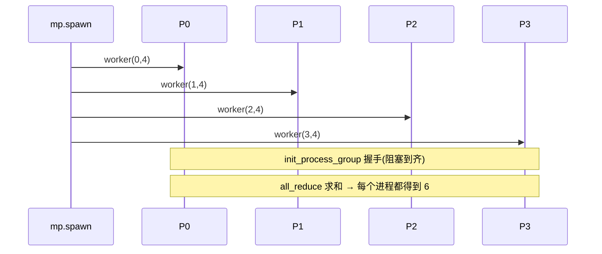

# 零基础(一)· PyTorch 分布式:进程组、rank / world_size、启动方式

> 面向**完全零基础**。读完你能:说清楚"多卡训练到底是多进程怎么协作的",并在**一台没有 GPU 的笔记本上**用 `gloo` 后端真跑起 4 个进程做分布式。
>
> 配套项目 `../projects/` 里所有分布式代码都用本文的模式启动。

---

## 🧠 一句话直觉

**分布式训练 = 多个进程,每个进程管一张卡(或一份数据/一段模型),它们通过"集合通信"互相对齐。**

- 单机单卡:1 个进程。
- 单机 8 卡:8 个进程,每个进程绑 1 张 GPU。
- 多机(2 机 × 8 卡):16 个进程。

这些进程组成一个 **进程组 process group**,PyTorch 用 `torch.distributed`(简称 `dist`)来管它们之间的通信。

## 🔑 三个必须记住的词

| 词 | 含义 | 例子(2 机 × 4 卡 = 8 进程) |
|---|---|---|
| **world_size** | 进程总数 | 8 |
| **rank** | 当前进程的全局编号(0 ~ world_size-1) | 0,1,...,7 |
| **local_rank** | 当前进程在本机内的编号 | 每机 0,1,2,3 |

> 💡 `rank == 0` 常被当作"主进程",用来打印日志、存 checkpoint。

## 🖥️ 后端 backend:gloo vs nccl

| 后端 | 跑在 | 用途 |
|---|---|---|
| **gloo** | CPU(也支持 GPU 部分操作) | 没有 GPU 时学习/调试;本教程全用它 |
| **nccl** | NVIDIA GPU | 真实多卡训练的标准(NVLink/IB 上极快) |

> 本机 `torch 2.12.0+cpu`,没有 GPU → 用 **gloo** 就能在 CPU 上模拟多进程分布式,把所有原理跑通。真实上卡时把 `gloo` 换成 `nccl`、`cpu` 换成 `cuda` 即可。

---

## 👣 第一个分布式程序(可直接运行)

```python
# hello_dist.py —— 4 个进程各打印自己的 rank,并一起 all_reduce 一个数
import os
import torch
import torch.distributed as dist
import torch.multiprocessing as mp


def worker(rank, world):
    # 1) 每个进程都要知道"去哪找组长"——主进程的地址和端口
    os.environ.setdefault("MASTER_ADDR", "127.0.0.1")   # 本机
    os.environ.setdefault("MASTER_PORT", "29500")       # 任选一个空闲端口
    # 2) 加入进程组(gloo 后端)
    dist.init_process_group("gloo", rank=rank, world_size=world)

    # 3) 每个进程造一个张量,值 = 自己的 rank
    x = torch.tensor([float(rank)])
    print(f"[rank {rank}] 起始值 = {x.item()}")

    # 4) all_reduce(SUM):所有进程的 x 求和,结果写回每个进程的 x
    dist.all_reduce(x, op=dist.ReduceOp.SUM)
    print(f"[rank {rank}] all_reduce 后 = {x.item()}  (应 = 0+1+2+3 = 6)")

    # 5) 收尾
    dist.destroy_process_group()


if __name__ == "__main__":            # ← Windows 必须有这个守卫!
    world = 4
    mp.spawn(worker, args=(world,), nprocs=world, join=True)
```

**逐行讲解:**
- `import torch.distributed as dist`:分布式通信的主模块。
- `import torch.multiprocessing as mp`:用来一次性启动多个进程(`mp.spawn`)。
- `os.environ["MASTER_ADDR"/"MASTER_PORT"]`:所有进程通过这个"约定地址"互相找到、握手。单机就用 `127.0.0.1` + 任意空闲端口。
- `dist.init_process_group("gloo", rank=..., world_size=...)`:**每个进程都要调用一次**,声明"我是第 rank 号,总共 world_size 个",然后大家握手组成进程组。这一步会**阻塞**,直到所有进程都到齐。
- `dist.all_reduce(x, op=SUM)`:一个**集合通信**操作——把所有进程的 `x` 逐元素求和,结果广播回每个进程。4 个进程的值 0/1/2/3 求和 = 6。
- `mp.spawn(worker, args=(world,), nprocs=world)`:启动 `world` 个进程,每个都跑 `worker(rank, world)`,`rank` 由框架自动传入(0,1,2,3)。
- `if __name__ == "__main__":`:**Windows 上必须**。因为 Windows 用 `spawn` 方式起进程(重新 import 你的脚本),没有这个守卫会无限递归起进程。

**运行:**
```bash
python hello_dist.py
```
输出(顺序可能乱,因为是并发):
```
[rank 0] 起始值 = 0.0
[rank 3] 起始值 = 3.0
...
[rank 2] all_reduce 后 = 6.0  (应 = 0+1+2+3 = 6)
```



---

## 🚀 两种启动方式:mp.spawn vs torchrun

| 方式 | 怎么用 | 适合 |
|---|---|---|
| `mp.spawn(fn, nprocs=N)` | 在 Python 里一行起 N 个进程 | 单机、教学、测试(本教程用它) |
| `torchrun --nproc_per_node=N script.py` | 命令行启动器,自动设 rank/world_size 到环境变量 | 生产、多机 |

`torchrun` 版的脚本里这样读:
```python
import os, torch.distributed as dist
dist.init_process_group("nccl")                      # torchrun 已设好环境变量
rank = int(os.environ["RANK"])
local_rank = int(os.environ["LOCAL_RANK"])
world = int(os.environ["WORLD_SIZE"])
torch.cuda.set_device(local_rank)                    # 每进程绑一张 GPU
```
启动:`torchrun --nproc_per_node=8 train.py`(单机 8 卡)。

---

## ⚠️ 零基础最容易踩的坑

1. **忘了 `if __name__ == "__main__":`**(Windows)→ 进程无限递归、报错刷屏。
2. **端口被占用** → 换 `MASTER_PORT`(如 29500 换 29501)。
3. **worker 写成了嵌套函数** → `mp.spawn` 在 Windows 下需要 worker 是**模块级函数**(能被重新 import 到)。
4. **各进程初始权重不一致** → DDP 一开始就发散;要么同一随机种子,要么 `broadcast` 从 rank0 同步。
5. **`init_process_group` 卡住不动** → 通常是某个进程没起来/地址端口不一致,大家等不齐。
6. **gloo 打印 `kubernetes.docker.internal ... socket` 警告** → **无害**,gloo 在探测网卡,会回退到 `127.0.0.1` 正常跑。

---

## 📌 速查表

```python
dist.init_process_group("gloo", rank=r, world_size=w)  # 加入组
dist.get_rank(); dist.get_world_size()                 # 查询
dist.all_reduce(t, op=dist.ReduceOp.SUM)               # 求和同步
dist.broadcast(t, src=0)                               # 从 rank0 广播
dist.barrier()                                         # 所有进程对齐等待
dist.destroy_process_group()                           # 收尾
```

## 🔗 延伸
- 下一篇:`02_集合通信零基础...md`(把 all_reduce 等原语讲透)
- 实战:`../projects/02_data_parallel_zero`(用这套启动方式跑真 DDP)
- 理论:`../book-guide/00_导读...md`、`../appendix/B_并行编程速成...md`
