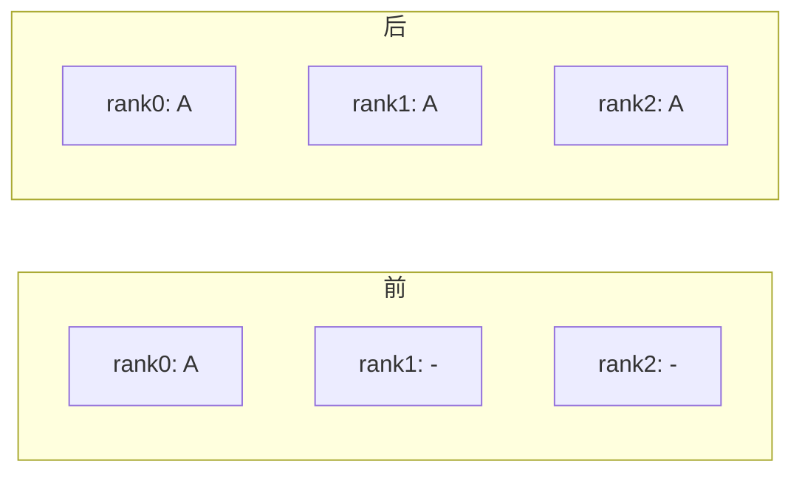
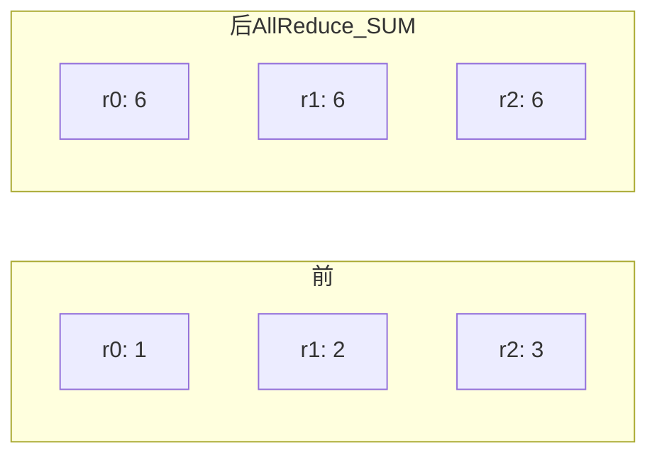
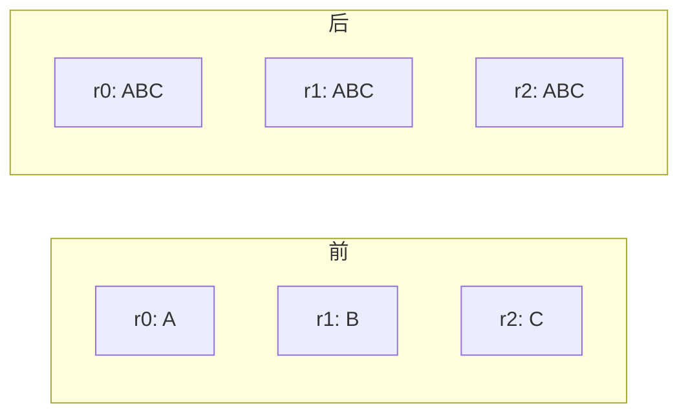
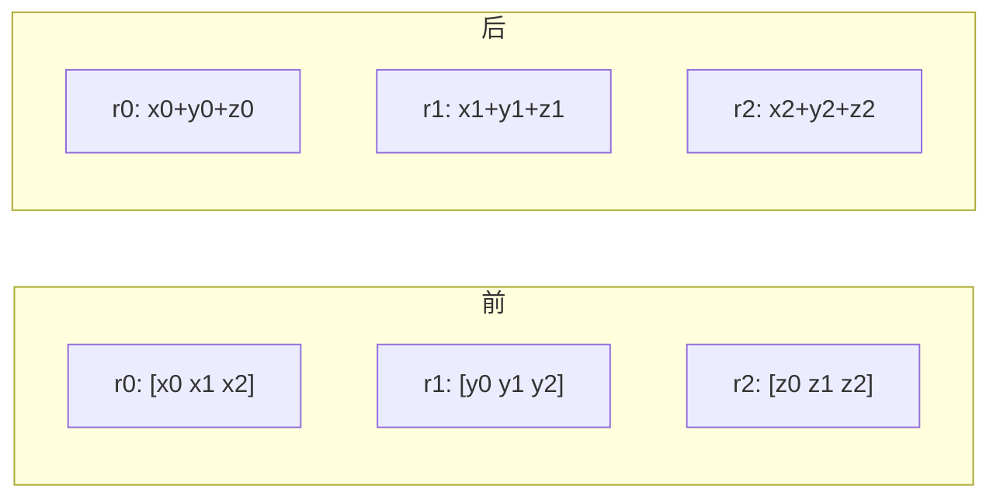
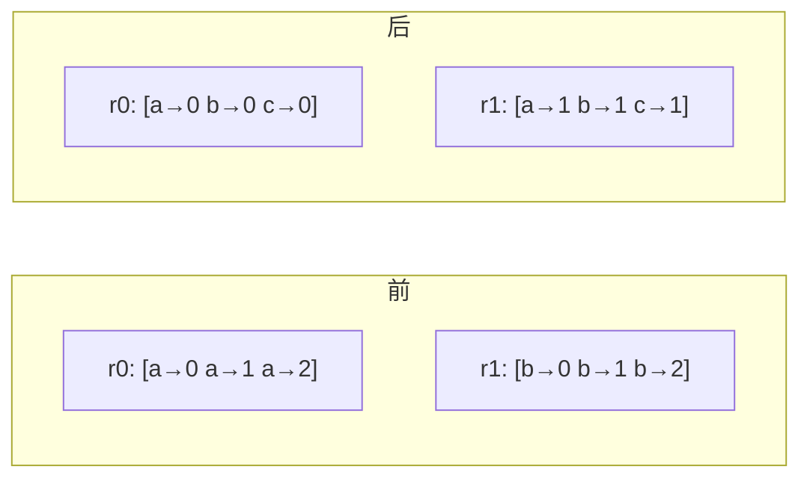

# 零基础(二)· 集合通信:AllReduce / ReduceScatter / AllGather / Broadcast / All-to-All 手画

> 集合通信 collective communication 是**所有并行策略的底座**:DP 靠 AllReduce、ZeRO 靠 ReduceScatter+AllGather、MoE 靠 All-to-All、流水线靠 P2P。把这几张图刻进脑子,分布式就通了一半。
>
> 配套:`../projects/06_collectives_from_scratch`(从零实现 ring AllReduce)。

---

## 📖 先约定:P 个进程,每个有一份数据

下面每个原语,左边是"操作前每个 rank 有什么",右边是"操作后"。用 `t` 表示张量。

---

## 1) Broadcast(广播):一个人说,所有人听

`src` 进程的张量复制给所有进程。


```python
dist.broadcast(t, src=0)      # 所有进程的 t 变成 rank0 的 t
```
**用途**:训练开始时把初始权重从 rank0 同步到所有卡。

---

## 2) Reduce / AllReduce(规约 / 全规约)

- **Reduce**:所有进程的张量做运算(SUM/MAX/...),结果只给 `dst`。
- **AllReduce**:结果给**所有**进程。


```python
dist.all_reduce(t, op=dist.ReduceOp.SUM)   # 每个进程都拿到求和
```
**通信量(ring 算法)**:每 rank 收发 `2(P-1)/P·N`,与 P 几乎无关 → 带宽最优。
**用途**:**数据并行 DDP** 反向后同步梯度(求和/平均);张量并行的行并行汇总。

---

## 3) AllGather(全收集):把每个人的拼起来

每个进程贡献一段,操作后每个进程都拿到**所有段的拼接**。


```python
out = [torch.empty_like(t) for _ in range(world)]
dist.all_gather(out, t)       # out = [各 rank 的 t]
```
**用途**:**ZeRO-3** 前向时按需把分片的参数 all-gather 成完整参数。

---

## 4) ReduceScatter(规约散射):求和后按段分掉

先把所有进程的张量求和,再把结果**切成 P 段,每个进程拿一段**。


```python
dist.reduce_scatter_tensor(out_chunk, in_full)   # 求和后各拿一段
```
**关键恒等式**:`AllReduce = ReduceScatter + AllGather`(ring AllReduce 正是这么实现的)。
**用途**:**ZeRO** 反向时把梯度 reduce-scatter 到各分片;TP+SP。

---

## 5) All-to-All(全到全):每个人给每个人一份

进程 i 的第 j 段发给进程 j。像"转置"。


```python
dist.all_to_all_single(out, inp)
```
**用途**:**MoE 专家并行 EP** —— 把每个 token 路由到它该去的 expert 所在的卡,再把结果送回。

---

## 6) P2P:send / recv(点对点)

一个进程发,另一个进程收。非集合,是最底层的通信。
```python
dist.isend(t, dst=1); dist.irecv(buf, src=0)   # 非阻塞(环上通信必须用它防死锁)
```
**用途**:**流水线并行 PP** 在 stage 间传激活(前向)和激活梯度(反向)。

---

## 🗺️ 一张总表:原语 ↔ 并行

| 原语 | 语义 | 谁在用 |
|---|---|---|
| Broadcast | src → 所有 | 初始权重同步 |
| **AllReduce** | 求和 → 所有 | **DDP 梯度**、TP |
| AllGather | 拼接 → 所有 | ZeRO-3 收参数 |
| ReduceScatter | 求和 → 分段 | ZeRO 分梯度、TP+SP |
| All-to-All | 转置式交换 | MoE 专家并行 EP |
| send/recv | 点对点 | 流水线 PP |

## 🔬 为什么 ring AllReduce 带宽最优
把梯度切成 P 段,让数据沿环流动:reduce-scatter(P-1 步求和)+ all-gather(P-1 步收集)。每个 rank 只收发 `2(P-1)/P·N` ≈ `2N`,**和卡数无关**——所以 DDP 能扩展到上万卡而通信不爆炸。手写实现见 `../projects/06_collectives_from_scratch`。

## ⚠️ 常见坑
- 环上用**阻塞** send/recv 互相等 → 死锁;用 `isend/irecv` 或 `batch_isend_irecv`。
- `all_gather` 的输出列表要**预先分配**好每个 `empty_like`。
- ReduceScatter/AllGather 的段长必须能整除。

## 📌 速查
```python
dist.all_reduce / all_gather / reduce_scatter_tensor / broadcast / all_to_all_single
dist.batch_isend_irecv([dist.P2POp(dist.isend, t, dst), dist.P2POp(dist.irecv, buf, src)])
```

## 🔗 延伸
- 手写实现:`../projects/06_collectives_from_scratch`
- 理论:`../appendix/B_并行编程速成_集合通信原语_NCCL_AllReduce_ReduceScatter等.md`
- 应用:`../book-guide/02_数据并行...md`(ZeRO)、`../book-guide/07_5D并行总览...md`
