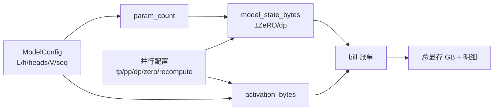

# 项目 01 · Transformer 训练显存 & 算力计算器

> 对应《Ultra-Scale Playbook》**第 2 章(单卡训练:显存解剖 / 激活重算 / 梯度累积)** 与 **第 9 章(寻找最优训练配置:先把训练步塞进显存)**。
>
> **一句话**:输入模型结构 + 并行配置,一张表算清楚"这一步训练到底吃多少显存、要多少算力"。这是所有分布式训练决策的**第一块地基**——你得先会算账,才谈得上选 DP/TP/PP/ZeRO。

---

## 🎯 这个项目解决什么"硬骨头"

新手面对"7B 模型为什么单张 80GB 卡放不下?"往往答不上来。本项目把训练显存拆成**四块**,每块都给出可验证的公式:

| 显存块 | 是什么 | 混合精度 + Adam 的账 |
|---|---|---|
| 参数 parameters | 模型权重(计算用低精度副本) | 2 B/param(fp16/bf16) |
| 梯度 gradients | 反向算出的梯度 | 2 B/param |
| 优化器状态 optimizer states | fp32 主参数 + Adam 的 m、v | 4 + 4 + 4 = 12 B/param |
| 激活 activations | 前向存下来供反向用的中间张量 | 随 batch×seq 增长,长序列杀手 |

**模型状态合计 = 16 B/param**。所以 7B 模型光模型状态就 `7e9 × 16 ≈ 112 GB` —— 一张卡当然放不下。这正是需要 **ZeRO / TP / PP** 的根本原因。

---

## 🧠 核心公式(都在 `calc.py`,都被 `test_calc.py` 对拍验证)

### 1) 参数量:`12 L h²` 的来历
单层 Transformer(FFN 倍数 4):
- 注意力 Q/K/V/O 投影:`4h²`
- MLP 两个线性层 `h→4h→h`:`8h²`
- 合计 `≈ 12h²`,乘以层数 `L`,再加嵌入 `V·h`。

$$N \approx 12 L h^2 + V h$$

GPT-2 small(L=12, h=768)→ 约 124M;Llama-7B(L=32, h=4096)→ 约 6.6B。✅ 与公开数字吻合。

### 2) 激活显存(Megatron / Korthikanti 公式)
单层激活元素数 $\approx sbh\left(34 + \dfrac{5as}{h}\right)$,其中 `s`=序列长、`b`=batch、`a`=头数。
- `34sbh`:线性层/LN/dropout 的中间激活
- `5as^2b`:**注意力分数矩阵**,随 `s²` 爆炸 → 这就是长序列必须上**上下文并行**(项目 05)的原因。
- 激活重算:`selective` 去掉注意力项,`full` 每层只存输入 `2sbh`,反向时整层重算(用算力换显存)。

### 3) FLOPs 与 MFU
$$\text{训练 FLOPs} \approx 6ND \quad (N=\text{参数量},\ D=\text{token 数})$$
前向 `2ND` + 反向 `4ND`。MFU = 实测算力 / 峰值算力。

---

## 🏗️ 架构



## 📁 文件
| 文件 | 作用 |
|---|---|
| `calc.py` | 全部计算逻辑(参数量/显存/激活/FLOPs/账单),纯 python/numpy,零依赖 |
| `test_calc.py` | 13 个 pytest,用 GPT-2/7B/70B 对拍公式 |
| `run_demo.py` | 打印 7B/70B 在不同并行配置下的显存与算力账单 |
| `requirements.txt` | 仅需标准库(numpy 可选) |

## ▶️ 如何运行
```bash
python -m pytest -q      # 13 passed —— 验证所有公式
python run_demo.py       # 打印真实规模模型的显存/算力账单
```

## 📊 demo 会告诉你的事(真实输出)
- **Llama-7B**:模型状态 98 GB(单卡放不下)→ 全激活重算把激活从 194 GB 压到 2 GB → ZeRO-3(dp=8)把模型状态压到 12 GB → **能塞进一张卡了**。
- **Llama-70B**:单卡 1934 GB(天方夜谭)→ ZeRO-3(dp=64)+TP=8+PP=4 后单卡 < 1 GB 模型状态。
- **算力**:70B 训 1.4T token ≈ 5.4e23 FLOPs ≈ 369 张 H100 跑 15 天(MFU=0.4)。

## 💡 面试高频
- "7B 模型训练要多少显存?" → 模型状态 16 B/param ≈ 112 GB,加激活。
- "激活为什么随序列平方增长?" → 注意力分数矩阵 `5as²b` 项。
- "ZeRO-3 和 TP 都省显存,区别?" → ZeRO 沿 **数据并行维**分片模型状态(通信换显存);TP 沿 **模型维**切每层权重(每层多次通信)。

## ⚠️ 常见坑
- 只算了参数忘了优化器状态(Adam 是参数的 6 倍字节)。
- 忘了激活;长序列/大 batch 下激活常常比模型状态还大(见 demo 中 7B 无重算时 194 GB)。
- ZeRO 分片的是**模型状态**,不分片激活(激活靠 TP/PP/CP + 重算来降)。

## 🔗 延伸
- 理论:`../../book-guide/01_单卡训练_显存解剖_激活重算_梯度累积.md`、`../../book-guide/08_寻找最优训练配置_显存_批量_吞吐_基准.md`
- 基础:`../../code-zero/03_Transformer显存与计算零基础_参数_激活_优化器_FLOPs估算.md`
- 下一步:`../02_data_parallel_zero`(把这些显存真正分片掉)
