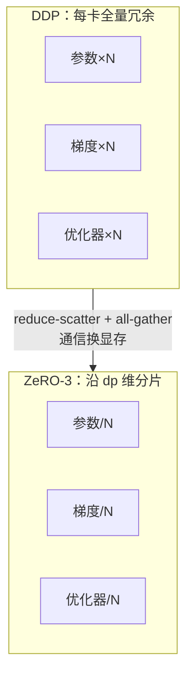

# 项目 02 · 从零实现数据并行 DDP 与 ZeRO

> 对应《Ultra-Scale Playbook》**第 3 章(数据并行 + ZeRO)**。
>
> **核心洞察**:DDP 和 ZeRO **不改变参数更新的数学**,只改变"谁存什么、谁算什么"。所以只要实现正确,把分片聚合回来,结果必须和"单卡在全 batch 上做一步 Adam"**逐元素相等**——这正是我们的测试金标准。

---

## 🎯 解决什么"硬骨头"

- **数据并行 DP**:每卡一份完整模型 + 不同数据,反向后 **all-reduce 梯度求平均**,各卡做相同更新 → 参数始终同步。
- **ZeRO 的动机**:DDP 里每张卡都存了**全量**的参数、梯度、优化器状态,极度冗余。ZeRO 沿数据并行维把这些冗余分片掉:

| 级别 | 额外分片 | 单卡模型状态显存 |
|---|---|---|
| DDP(ZeRO-0) | 无 | 16 B/param(全量) |
| ZeRO-1 | 优化器状态 | 参数2 + 梯度2 + 优化器12/N |
| ZeRO-2 | + 梯度 | 参数2 + (梯度2+优化器12)/N |
| ZeRO-3 | + 参数 | (参数2+梯度2+优化器12)/N ≈ 16/N |

`N` = 数据并行度。ZeRO-3 让单卡模型状态几乎线性下降(用**通信换显存**:前向/反向按需 all-gather 参数、reduce-scatter 梯度)。



## 📁 文件
| 文件 | 作用 |
|---|---|
| `zero_dp.py` | 玩具 MLP + 手写 Adam + DDP 梯度平均 + ZeRO-3 分片更新(单进程可验证的核心) |
| `test_zero_dp.py` | 5 个 pytest:分片覆盖性、DDP 平均梯度==全 batch 梯度、ZeRO-3 单步/多步==单卡 Adam |
| `run_demo.py` | **真·多进程**:gloo 后端起 4 个进程做 DDP,校验所有 rank 参数逐元素一致 |

## ▶️ 如何运行
```bash
python -m pytest -q      # 5 passed —— 单进程验证 ZeRO/DDP 数学正确
python run_demo.py       # 4 进程 gloo DDP,loss 下降 + 参数最大偏差 0.00e+00
```
> ⚠️ `run_demo.py` 可能打印几行 `kubernetes.docker.internal ... socket` 警告:那是 gloo 尝试解析默认主机名的**无害提示**,它会回退到 `127.0.0.1` 正常跑完。真实多卡把 `gloo→nccl`、`cpu→cuda` 即可。

## 🔬 测试为什么能证明正确性
`test_zero3_multi_step_matches_reference` 连续训练 15 步,每步都断言 ZeRO-3(dp=4)的参数与单卡 Adam 逐元素相等(`atol=1e-10`,双精度)。因为 Adam 是**逐元素**运算,把参数向量按元素切成 N 段、每段独立更新、再拼回,数学上必然等于整体更新——测试验证的是**分片/聚合的簿记没错**。

## 💡 面试高频
- **ring all-reduce 通信量**:`2(N−1)/N · |grad|`,与卡数几乎无关 → 带宽最优。
- **ZeRO-3 vs FSDP**:FSDP 是 PyTorch 原生的 ZeRO-3 风格实现(前向 all-gather 参数、用完即弃、reduce-scatter 梯度)。
- **DDP 为什么各卡结果一致**:同一初始权重 + all-reduce 平均梯度 + 相同优化器 → 逐步同步(demo 里偏差 0.00e+00 就是证明)。

## ⚠️ 常见坑
- 各 rank 初始权重不一致(忘了同种子/broadcast)→ DDP 从一开始就发散。
- all-reduce 后忘了除以 world_size(变成求和而非平均)。
- ZeRO 分的是**模型状态**,不分激活(激活靠 TP/PP/CP + 重算降)。

## 🔗 延伸
- 理论:`../../book-guide/02_数据并行_DP_全批量_ZeRO分片.md`
- 通信原语:`../../code-zero/02_集合通信零基础_AllReduce_ReduceScatter_AllGather_手画.md`、`../06_collectives_from_scratch`
- 启动方式:`../../code-zero/01_PyTorch分布式零基础_进程组_rank_world_size_启动.md`
