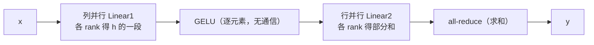

# 项目 03 · 从零实现张量并行 TP(+ 序列并行思想)

> 对应《Ultra-Scale Playbook》**第 4 章(张量并行 + 序列并行)**。
>
> **张量并行**把**单个矩阵乘**切到多卡:不是切数据(那是 DP),而是切**权重矩阵本身**。核心是两种切法——列并行 + 行并行——的巧妙配合,让一个 MLP / 注意力块只需**很少的通信**。

---

## 🎯 两种切法(线性层 `y = x @ Wᵀ + b`,W 形状 `(out, in)`)

| | 怎么切 | 前向通信 | 反向通信 |
|---|---|---|---|
| **列并行** ColumnParallel | 按 **out** 维切 W → `W_i (out/p, in)` | 无(各得输出一段)→ 需要时 all-gather | 对 x 的梯度 all-reduce |
| **行并行** RowParallel | 按 **in** 维切 W(x 也按列切) | all-reduce(求和部分和) | 无 |

**Megatron MLP 的精髓**:第一层**列并行**(h→4h)、中间 GELU 逐元素(切了也不用通信)、第二层**行并行**(4h→h)。这样每个 MLP **前向只 1 次 all-reduce、反向只 1 次**。



**注意力**按**头 heads** 切:每个 rank 负责一部分头,QKV 列并行、输出投影行并行。

## 📁 文件
| 文件 | 作用 |
|---|---|
| `tensor_parallel.py` | 列/行并行 Linear、并行 MLP、按头切注意力(单进程可验证核心) |
| `test_tp.py` | 15 个 pytest:并行前向/反向(输出+梯度)== 单卡整体,逐元素相等 |
| `run_demo.py` | **真·多进程**:gloo 起 4 进程跑 TP-MLP,校验 vs 单卡参考(偏差 ~1e-14) |

## ▶️ 如何运行
```bash
python -m pytest -q      # 15 passed —— 列/行并行、MLP、注意力全部对拍单卡
python run_demo.py       # 4 进程 gloo TP-MLP,最大偏差 ~2.8e-14
```
> socket 警告同项目 02,无害。真实多卡:`gloo→nccl`、`cpu→cuda`,权重真正分片存储。

## 🔬 为什么 TP 只在单机内做
每个 transformer block 前向就有 **2 次 all-reduce**(MLP 一次、注意力一次),反向再 2 次,通信量大且在关键路径上。所以 TP 通常**只在一台机器内、走 NVLink**(带宽 ~900 GB/s)做,跨机(带宽低一两个量级)会被通信拖垮。这就是 5D 并行里"TP 机内、DP/PP 机间"的由来(见 `../../appendix/A_GPU架构与本质...md`)。

## 💡 序列并行 SP(思想)
TP 之外,LayerNorm/Dropout 这些**非 TP 区**的激活仍是全量冗余。SP 把它们沿**序列维**切,和 TP 配合(all-reduce 拆成 reduce-scatter + all-gather),进一步省激活显存且不增加通信量。

## 💡 面试高频
- "TP 的 MLP 为什么第一层列切、第二层行切?" → 这样中间的 GELU 可以逐元素并行、不用通信,整个 MLP 只需 1 次 all-reduce。
- "TP 通信为什么重?" → 每个 block 前向 2 次、反向 2 次 all-reduce,在关键路径 → 必须高带宽域(NVLink)。
- "注意力怎么做 TP?" → 按头切,天然并行,输出投影行并行汇总。

## ⚠️ 常见坑
- 列并行后忘了在需要完整张量处 all-gather;或行并行忘了 all-reduce → 结果错。
- 偏置 bias 在行并行里只能加一次(在 all-reduce 之后),否则被加 p 次。
- 头数不能被 TP 度整除 → 注意力切不匀。

## 🔗 延伸
- 理论:`../../book-guide/03_张量并行_TP_序列并行_SP.md`
- 硬件为何机内:`../../appendix/A_GPU架构与本质_从晶体管到张量核_SM_warp_显存层级_NVLink_集群网络.md`
- 上一个:`../02_data_parallel_zero`;下一个:`../04_pipeline_parallel`
