# 项目 04 · 从零实现流水线并行 PP(AFAB / 1F1B / 气泡分析)

> 对应《Ultra-Scale Playbook》**第 6 章(流水线并行)**。
>
> 流水线并行把**层**切到不同 stage(卡),激活在 stage 间逐段传递。把一个 batch 拆成 `m` 个 **micro-batch** 灌进流水线,梯度按 micro-batch 累加,走完再做**一次**优化器更新。核心难点是**气泡 bubble**。

---

## 🎯 关键洞察(也是测试金标准)

> **不管用哪种调度,流水线累加出来的梯度都等于"单进程在整个 batch 上一次前向+反向"的梯度(逐元素相等)。调度只影响气泡和激活显存,不影响数学结果。**

## 🫧 气泡从哪来

流水线要"填充"和"排空",填充/排空期间有 stage 空闲 = 气泡。理想气泡比例:

$$\text{bubble} = \frac{p-1}{m+p-1}\quad(p=\text{stage 数},\ m=\text{micro-batch 数})$$

→ **m 越大气泡越小**(demo: p=8, m=1000 时气泡 < 1%)。这就是为什么要切很多 micro-batch。

## 📊 调度对比

| 调度 | 顺序 | 气泡 | 激活显存 |
|---|---|---|---|
| **AFAB**(all-forward-all-backward) | 所有前向 → 所有反向 | 大 | 大(要存 **m** 份激活) |
| **1F1B**(one-forward-one-backward) | 稳态里一前一后 | 同量级但**显存小** | 小(~**p** 份激活) |
| **交错 interleaved** | 每卡放多个不连续 stage | 更小 | 中 |
| **零气泡 / DualPipe** | 拆分反向、精细排布 | ~0 | 中 |

```mermaid
gantt
    title 1F1B 稳态：每个 stage 交替 F/B，激活显存降到 ~p 份
    dateFormat X
    axisFormat %s
    section Stage0
    F0 :0,1
    F1 :1,2
    B0 :2,3
    F2 :3,4
    B1 :4,5
    section Stage1
    F0 :1,2
    F1 :2,3
    B0 :3,4
```



## 📁 文件
| 文件 | 作用 |
|---|---|
| `pipeline.py` | 切 stage、micro-batch 累加梯度、AFAB/1F1B 事件序列、气泡公式 |
| `test_pipeline.py` | 10 个 pytest:累加梯度==单进程整 batch、结果与 micro 数无关、气泡公式与单调性 |
| `run_demo.py` | **真·多进程**:每 rank 一个 stage,`send/recv` 逐段传激活,校验前向==单进程 |

## ▶️ 如何运行
```bash
python -m pytest -q      # 10 passed —— 流水线梯度正确性 + 气泡公式
python run_demo.py       # 4 stage gloo 流水线前向,偏差 0.00e+00
```

## 💡 面试高频
- "流水线气泡怎么算、怎么减?" → `(p-1)/(m+p-1)`;增大 micro-batch 数 m、用 1F1B/交错/零气泡调度。
- "1F1B 比 AFAB 好在哪?" → 气泡同量级但**激活显存从 m 份降到 ~p 份**。
- "PP 的通信是什么?" → stage 间 **P2P send/recv 激活(前向)和激活梯度(反向)**,通信量小 → 适合跨机。

## ⚠️ 常见坑
- micro-batch 太少 → 气泡巨大,吞吐惨。
- 用 mean 归约但各 micro-batch 大小不一 → 累加梯度和单进程不等(本项目用 sum 归约规避)。
- 忘了流水线要等所有 micro-batch 反向完才 step(否则梯度不完整)。

## 🔗 延伸
- 理论:`../../book-guide/05_流水线并行_PP_AFAB_1F1B_交错_零气泡DualPipe.md`
- P2P 原语:`../../code-zero/02_集合通信零基础_AllReduce_ReduceScatter_AllGather_手画.md`
- 上一个:`../03_tensor_parallel`;下一个:`../05_context_parallel_ring_attention`
