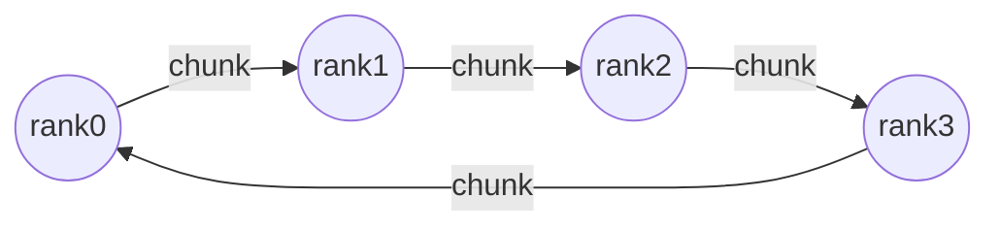

# 项目 06 · 从零实现集合通信原语(ring AllReduce)

> 对应《Ultra-Scale Playbook》附录 **"Parallel Programming Crash Course"** + 第 3 章 ZeRO 的通信基础。
>
> 所有分布式训练的底座都是**集合通信 collective communication**。本项目只用**点对点 P2P(send/recv)** 从零搭出 **ring AllReduce**,并和官方 `torch.distributed.all_reduce` 对拍——理解了它,DDP/ZeRO/TP 的通信就都通了。

---

## 🎯 ring AllReduce = reduce-scatter + all-gather

每个 rank 把向量切成 P 段,数据沿**环**流动:

| 阶段 | P-1 步,每步做什么 | 结束状态 |
|---|---|---|
| **reduce-scatter** | 把收到的一段**加**到本地对应段 | 每个 rank 拥有"某一段"的完整求和 |
| **all-gather** | 把已求和的一段**覆盖**传给下一环 | 每个 rank 拥有全部段(完整求和) |



**通信量**:每个 rank 收发 $\dfrac{2(P-1)}{P}N$,**与卡数 P 几乎无关**(P 大时趋于 `2N`)→ **带宽最优**。这就是为什么 DDP 的梯度同步能扩展到成千上万卡。

## 📁 文件
| 文件 | 作用 |
|---|---|
| `collectives.py` | 单进程模拟 ring AllReduce / ReduceScatter / AllGather / Broadcast + 通信量公式 |
| `test_collectives.py` | 12 个 pytest:ring AllReduce==手工求和(P=1..8)、RS+AG==AR、通信量公式 |
| `run_demo.py` | **真·多进程**:只用 `isend/irecv` 从零搭 ring AllReduce,和官方 `all_reduce` 对拍(偏差 ~1e-16) |

## ▶️ 如何运行
```bash
python -m pytest -q      # 12 passed —— 环算法逐元素对拍手工求和
python run_demo.py       # 4 进程 gloo:自实现 ring AllReduce vs 官方,偏差 ~8.9e-16
```

## 🧩 每个原语用在哪
| 原语 | 语义 | 用在哪种并行 |
|---|---|---|
| **AllReduce** | 求和后广播给所有 | DDP 梯度同步、TP |
| **ReduceScatter** | 求和后按段分给各 rank | ZeRO 梯度分片、TP+SP |
| **AllGather** | 每 rank 收集全部 | ZeRO 参数收集、TP+SP |
| **Broadcast** | 从 src 播给所有 | 初始权重同步 |
| **All-to-All** | 每 rank 给每 rank 一份 | MoE 专家并行 EP 的 token 路由 |
| **P2P send/recv** | 点对点 | 流水线并行 PP 的激活/梯度传递 |

## 💡 面试高频
- "ring AllReduce 通信量?" → `2(P-1)/P·N`,与卡数几乎无关,带宽最优。
- "AllReduce 怎么由更小的原语组成?" → reduce-scatter + all-gather。
- "NCCL 内部怎么做?" → 类似 ring / tree(小消息用 tree 降延迟,大消息用 ring 提带宽)。

## ⚠️ 常见坑
- 阻塞式 send/recv 环上互等 → 死锁;用 `batch_isend_irecv`。
- reduce-scatter 阶段是"**加**",all-gather 阶段是"**覆盖**",搞反就错。
- 分段索引 `(r-i)%P` 一步算错,结果就不是求和(测试用 P=1..8 全覆盖来兜底)。

## 🔗 延伸
- 理论:`../../appendix/B_并行编程速成_集合通信原语_NCCL_AllReduce_ReduceScatter等.md`
- 基础:`../../code-zero/02_集合通信零基础_AllReduce_ReduceScatter_AllGather_手画.md`
- 应用:`../02_data_parallel_zero`(DDP/ZeRO 就靠这些原语)
