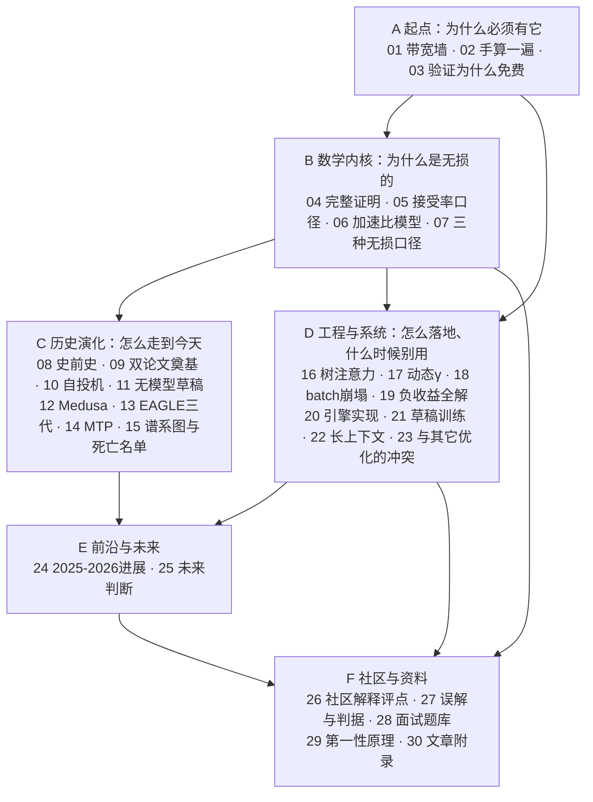

# 00 总览与知识地图

## 1. 一句话

这个库要回答的是同一个问题的六个层次：**投机采样为什么必须存在**（带宽墙）、**它为什么是无损的**（拒绝采样的完整证明）、**它到底快多少**（以及为什么经常不快）、**它是怎么走到今天的**（2018→2026 的谱系）、**社区把它讲对了多少**（精选与评点）、**它接下来会怎样**（判断与反方论点）。

全库的立场只有一句：**投机采样是一笔用算力换延迟的交易，这笔交易经常是亏的** —— 所以本库把"什么时候不该用"写得和"怎么用"一样重。

---

## 2. 一张图看懂全库



---

## 3. 六条阅读路线

| 你的目的 | 路线 |
|---|---|
| **快速搞懂它在干什么** | [[02-最小可跑的投机采样-手算一遍]] → [[04-拒绝采样修正-无损性的完整证明]] |
| **搞懂数学** | 04 → [[05-接受率alpha-定义口径与怎么测]] → [[06-期望接受长度与加速比模型-完整推导]] → [[07-无损的三种口径-分布无损不等于结果相同]] |
| **搞懂为什么快、什么时候不快** | [[01-decode为什么慢-带宽墙与算力空转]] → [[03-并行验证为什么几乎免费-算术强度与roofline]] → [[18-batch与吞吐-收益衰减曲线]] → [[19-负收益全解-什么时候投机反而更慢]] |
| **看历史怎么走过来** | [[08-史前史-2018并行解码与非自回归的失败]] → [[09-2023奠基-两篇同期论文的异同]] → 10–14 → [[15-谱系图与被淘汰的分支]] |
| **上生产** | 19 → [[20-主流引擎实现-vLLM与SGLang与TensorRTLLM]] → [[23-与其它优化的相互作用-量化与KVcache与PD分离]] → [[17-动态草稿长度与自适应停止]] |
| **跟前沿 / 找资料** | [[24-前沿进展-2025到2026]] → [[25-未来判断-哪些方向会活下来]]；资料见 [[30-附录-优秀文章与资料清单]] |

**只有半小时**：读 [[29-本质总结-第一性原理]] 和 [[27-常见误解与判据]] 这两篇。前者是全库压缩，后者是一份可查的避坑清单。

---

## 4. 每篇一句话

### A 起点：为什么必须有它

- **[[01-decode为什么慢-带宽墙与算力空转]]** —— 自回归 decode 每吐一个 token 就要把全部权重从 HBM 搬一次，算术强度约 1 FLOP/Byte，而 H100 的屋脊点是 295.4 —— **99.7% 的算力在空转**。那份空转就是投机采样要薅的羊毛。
- **[[02-最小可跑的投机采样-手算一遍]]** —— 用 $|V|=5,\gamma=3$ 的真实数字把一次迭代逐位走完：$p$、$q$、$\min(1,p/q)$、掷出的 $u$、接受还是拒绝。看见了再去看证明。
- **[[03-并行验证为什么几乎免费-算术强度与roofline]]** —— 一条不对称撑起了全部：**权重访存与 query token 数无关，算力与之成正比**。前向被访存卡住时，把 query token 从 1 加到 $\gamma+1$ 几乎不花时间。

### B 数学内核：为什么是无损的

- **[[04-拒绝采样修正-无损性的完整证明]]** —— 两行修正（$\min(1,p/q)$ 判据 + 残差分布重采）让输出**逐点精确等于**目标分布（**L1 分布无损**），而且**与草稿好坏完全无关**。三种社区常见错法的偏差被精确量化：0.132 / 0.224 / 0（不发赠品 token 只是慢）。
- **[[05-接受率alpha-定义口径与怎么测]]** —— "接受率"至少指四个不同的量。同一次响应的同一份统计，能同时报出 **0.0775 / 0.2000 / 1.2326** 三个"接受率"。
- **[[06-期望接受长度与加速比模型-完整推导]]** —— $E[\tau]=(1-\alpha^{\gamma+1})/(1-\alpha)$ 的前提是**两条**不是一条：沿链不相关 **且** 起点无偏。本库两次猜错方向，最后查到真机制是更新过程的长度偏置，净效果是**公式高估**（实测最大 10.5%）。
- **[[07-无损的三种口径-分布无损不等于结果相同]]** —— L1 / L2 / L3 三种口径。最重要的一条判据：**「开投机后输出变了」不是 bug，「开投机后分布变了」才是**。而这个混淆的源头就在 Leviathan 论文自己的摘要里。

### C 历史演化：怎么走到今天

- **[[08-史前史-2018并行解码与非自回归的失败]]** —— 三条路：改分布族（非自回归）、改迭代方式（Jacobi）、改"谁来验证"（Blockwise Parallel Decoding）。**只有第三条活了下来。**
- **[[09-2023奠基-两篇同期论文的异同]]** —— Google 与 DeepMind 独立写出同一个算法。**两篇的 $p$ 与 $q$ 记号完全相反**，跨两篇抄公式必然出错。
- **[[10-自投机-跳层早退与Draft-and-Verify]]** —— 让模型自己当自己的草稿。零额外权重，但草稿成本 $c$ 卡在 0.25–0.5，$c=0.5$ 时理想加速比的天花板只有 1.376×（口径：理想模型，**batch size = 1 且落在 memory-bound 区**，是上界不是实测）—— 这就是它没能成为主流的全部原因。
- **[[11-无模型草稿-promptlookup与ngram与检索]]** —— 草稿不一定要用模型。$c\approx0$ 时即使 $\alpha$ 很低也能赚，实测 $\alpha=0.30$ 的 n-gram 比 $\alpha=0.43$ 的蒸馏草稿快 35%。
- **[[12-Medusa-多头草稿与树注意力的诞生]]** —— 直接在目标模型上挂几个预测头，并把树注意力推向业界。结构性弱点是**各头独立预测**；口径上最常被误传的是**它默认的 typical acceptance 是 L3 而非 L1**。
- **[[13-EAGLE三代-特征级自回归的演进]]** —— 把草稿的自回归从 token 层挪到特征层，在保住 L1 的前提下把 $c$ 压到一层 decoder 的量级。
- **[[14-MTP-从训练目标到推理草稿]]** —— MTP 最初是个**训练目标**（为了模型自己更好），后来才被发现能当草稿器用。这两件事不能混为一谈。
- **[[15-谱系图与被淘汰的分支]]** —— 全库历史线的总图 + 死亡名单：哪些路走死了、死因是什么、留下了什么遗产。

### D 工程与系统：怎么落地、什么时候别用

- **[[16-树形草稿与树注意力-mask构造与验证]]** —— 树注意力不是新算子，就是一张换了形状的 mask（树链等价性误差 $4.4\times10^{-16}$）。"该深还是该宽"的答案比流行说法严格：树要赢必须**同时**满足两个条件。
- **[[17-动态草稿长度与自适应停止]]** —— 固定 $\gamma$ 一定次优。本篇纠正了一个直觉判据：正确的边际停止条件是 $\alpha^{g+1}>c\cdot\text{speedup}(g)$，忽略机会成本会把 $\gamma$ 选大一倍以上。
- **[[18-batch与吞吐-收益衰减曲线]]** —— compute-bound 极限下加速比收敛到 $E[\tau]/(\gamma+1)\times(1-s)$，**恒小于 1 且调参救不了**。
- **[[19-负收益全解-什么时候投机反而更慢]]** —— 17 条红黄绿灯判定清单，外加公开数据里唯一一张明确穿过 1.0× 的 batch 扫描表。
- **[[20-主流引擎实现-vLLM与SGLang与TensorRTLLM]]** —— 参数名与默认值全部抄自源码，抄不到的一律标「未查证」（全篇 32 处）。并把各引擎官方自己写下的"什么时候不该开"原文摆出来。
- **[[21-草稿模型怎么训-对齐与在线蒸馏]]** —— 草稿的训练目标不是"语言建模做得好"，而是"把自己的分布压向目标模型的分布"。由 $\beta=1-\mathrm{TV}(p,q)$ 直接给出。
- **[[22-长上下文下的投机采样]]** —— 长上下文把账本改写了两次，而且**方向相反**：硬件侧变友好、草稿侧变不准。两派之争由此调和。
- **[[23-与其它优化的相互作用-量化与KVcache与PD分离]]** —— 多数优化与投机采样是**竞争关系**，抢的是同一份访存冗余。权重 fp16→int4 让可用 batch 区间从 265 塌到 52，但 bs=1 的加速比几乎不变。

### E 前沿与未来

- **[[24-前沿进展-2025到2026]]** —— 2025-08 到 2026-08 这一年，重心从"怎么把草稿做准"挪到"怎么把验证预算花对"。
- **[[25-未来判断-哪些方向会活下来]]** —— 20 条判断，逐条标注证据等级 A/B/C，每条附"如果我错了会先看到什么信号"。

### F 社区与资料

- **[[26-社区精彩解释精选-好在哪与错在哪]]** —— 采纳要真诚，评点要具体。一个反直觉的发现：**踩坑的主要是英文权威源**。
- **[[27-常见误解与判据]]** —— 一份可查、可判定的误解清单，每条给"一句话判据"。
- **[[28-面试题库]]** —— 41 道题，每道以一个可判定的判据为落点，含一组"照妖镜题"。
- **[[29-本质总结-第一性原理]]** —— 全库压缩成几条能记住的原理，外加一页纸处方与一把鉴别尺。
- **[[30-附录-优秀文章与资料清单]]** —— 用户点名要的"附录好的文章"：按学习路径分组，每条说清"该不该点开、看什么、当心什么"。

---

## 5. 全库的硬结论（都可复跑）

这些不是转述，是 `_lab/` 里跑出来的：

1. **草稿模型的好坏只影响速度，不影响分布。** 接受率低到 0.31、甚至草稿把质量押在目标最不可能的 token 上，输出分布的最大逐点误差仍是 $10^{-17}$ 量级。
2. **两种社区常见错法的偏差被精确量化**：拒绝后直接从 $p$ 重采 → 0.132；判据写成 $p\ge q$ 就接受 → 0.224。而"不发赠品 token"**无偏**，只是慢。由此得判据：**少发 token 只是慢，改分布才是错。**
3. **$T=0$ 时投机输出与贪心解码逐 token 相同**，16 组配置全部验证，且与草稿好坏无关。
4. **加速比公式的前提是两条**（沿链不相关 + 起点无偏），真实负载上都不成立，净效果是**高估**。
5. **compute-bound 极限下加速比收敛到 $E[\tau]/(\gamma+1)$，恒小于 1**，任何新方法都逃不掉这条渐近线。
6. **量化与投机是竞争关系**：可用 batch 区间缩小 5.1 倍，而 bs=1 的加速比几乎不变 —— **只在 bs=1 做兼容性测试会系统性漏掉这个冲突**。
7. **"草稿不准就该把树加宽"是错的**：宽度值不值钱取决于边际覆盖率增益，不是草稿好不好。
8. **接受率随温度不是单调的**：形状由 argmax 一致率决定。所以 $T=0$ 测的接受率不能外推到线上温度。
9. **chunked prefill 与投机抢同一份"免费额度"**，而额度只有几百个 query token 的量级 —— 一个 prefill chunk 就够吃光。
10. **全库 147 个 arXiv 编号，编造 0 个。** 不是抽样 —— 拿 arXiv 官方 Atom API 全量核过（不经过任何摘要模型），并做成了强制关卡：新增引用没核实过，`pytest` 会红。
11. **MoE 与稠密的结论两头都相反**：MoE 上 batch=1 投机反而亏（0.804×），中大 batch 才是甜区，且能一直赚到稠密早已翻转的 batch=1024（2.16× vs 0.566×）。这也解释了那个此前无法解释的反例。

---

## 6. 五条铁律与它们的强制机制

| | 铁律 | 强制方式 |
|---|---|---|
| 一 | 说「无损」必须标 L1 / L2 / L3 口径 | `python _lab/verify.py --rules` |
| 二 | 加速比数字不许裸奔（batch、γ、接受率、模型组合、硬件精度、延迟还是吞吐、任务分布） | `--rules` |
| 三 | 每个「它很好」必须配一条「它什么时候是负收益」 | `--struct` |
| 四 | 数学断言必须有可执行验证，且正文指名引用 | `--tests`（**强制零虚引**） |
| 五 | 史料必须可追溯：年月 + arXiv/URL + 作者机构 + 新增什么 + 什么被推翻；禁止无主语句子 | `--consistency` |

铁律一与铁律二不是格式洁癖：它们是这个主题上最高频的两类错误的解药，理由分别见第 07 篇与第 18 篇。

---

## 7. `_lab/` 是论证的一部分

本库的断言多数是数学命题，能被代码判真假。所以 `_lab/` 不是配套示例，它就是论证本身。

```bash
cd _lab
python -m pytest -q          # 全部测试
python spec.py --proof       # L1 无损：精确枚举 vs 目标分布
python spec.py --bias        # 三种常见错法的精确偏差
python caliber.py --greedy   # L2 贪心等价
python accept.py --temp      # 接受率随温度的形状
python regime.py --renewal   # 公式高估的机制
python tree.py --mask        # 树注意力 = 换形状的 mask
python speedup.py --batch    # batch 崩塌曲线
python speedup.py --quant    # 量化与投机是竞争不是叠加
python moe.py --redhat       # MoE 为什么与稠密两头相反
python citecheck.py          # 引用核验（147 个 arXiv 编号全量核过）
python verify.py             # 全库自检
```

---

## 8. 本库被自己的数据推翻过的地方

这一节是本库的诚信底线，完整版在 [[29-本质总结-第一性原理]]：

- 猜想「$\beta$ 波动大 → Jensen → 公式低估」→ 实测准到 2–3% 以内。**猜错。**
- 猜想「沿链正相关 → 公式低估」→ 实测是**高估**，方向相反。**又猜错。**
- 猜想「残差分布集中在难区」→ 实测残差落难区 0.436/0.497，与目标分布 0.50 几乎一样。**解释不成立，重查。**
- 猜想「$\alpha$ 随温度总是非单调」→ 实测烂草稿是单调的。**要加条件。**
- 猜想「typical acceptance 的阈值调保守能减小偏差」→ 实测**反而变大**。
- 猜想「草稿不准就该加宽树」→ 实测取决于边际覆盖率增益。
- 判据「$\alpha^{g+1}>c$ 就该继续起草」→ **错的**，正确是 $\alpha^{g+1}>c\cdot\text{speedup}(g)$。
- **一个真 bug**：`speedup.py` 的 attention 浮点数漏乘层数 $L$，写第 03 篇时被查出。修正后还带出一个新结论（batch=1 时长上下文反而缩小免费额度）—— 那条结论旧模型根本给不出。

---

## 9. 边界

同一个 `llm-action` 仓库里，投机解码已经以单章形式出现过至少六次（`attention-optimization/26`、`27`，`vLLM解剖/原理05`，`MLOPS/推理08`，`cuda实战/frontier C4`，`算法/LLM11`）。**本库不重复它们**，判据是：如果一句话在那六篇里已经说清楚了，本库就一句话带过 + 指路。完整边界见 `_meta/写作规范.md` §0。

---

## 10. 续写

说「给投机采样库续写」即续。开工前：

1. 读 `_meta/写作规范.md`（五条铁律、十段式模板、文件清单）；
2. 跑 `python _lab/verify.py` 看当前缺什么、哪里违规；
3. 新增数学断言时，**先写 `_lab` 里的测试，再写正文**，并在正文指名引用。

---

### 本篇验证

本篇是索引篇，不含独立的数学断言；它引用的每条结论都在对应篇目里有测试支撑，可用 `python _lab/verify.py --tests` 一次性核验全库（当前：正文引用测试 398 处，**虚引 0 处**）。

- 全库测试：`cd _lab && python -m pytest -q`
- 全库自检：`python _lab/verify.py`（双链死链、测试虚引、五条铁律体检、跨篇一致性）

### 本篇来源

本篇的内容全部来自本库其它篇目，不引入新的外部来源。各篇的来源见各篇文末的「本篇来源」小节；资料总清单见 [[30-附录-优秀文章与资料清单]]。
