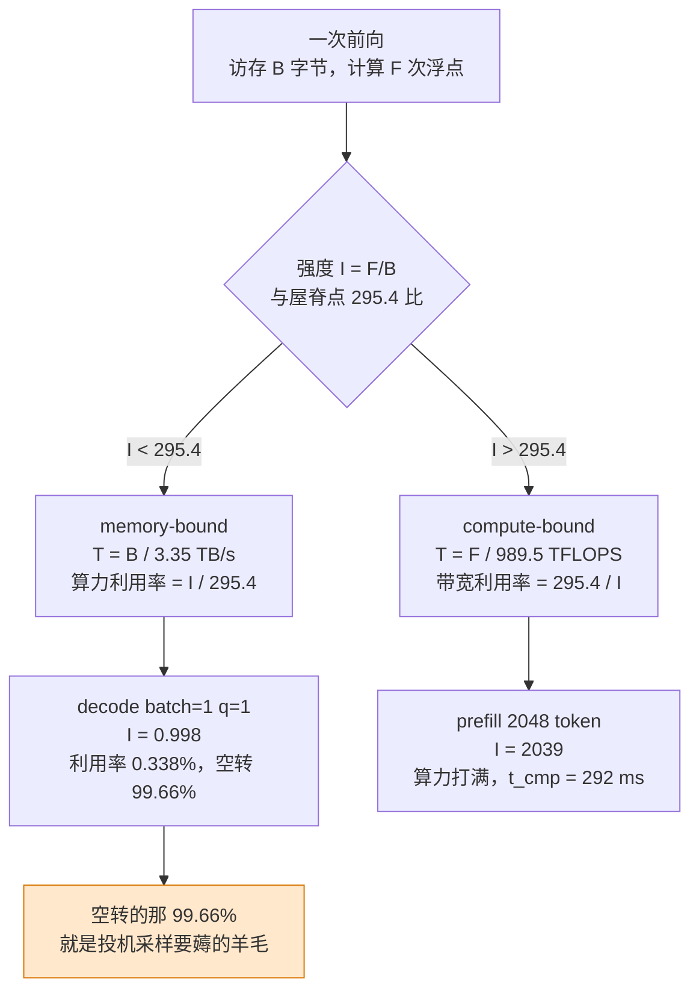
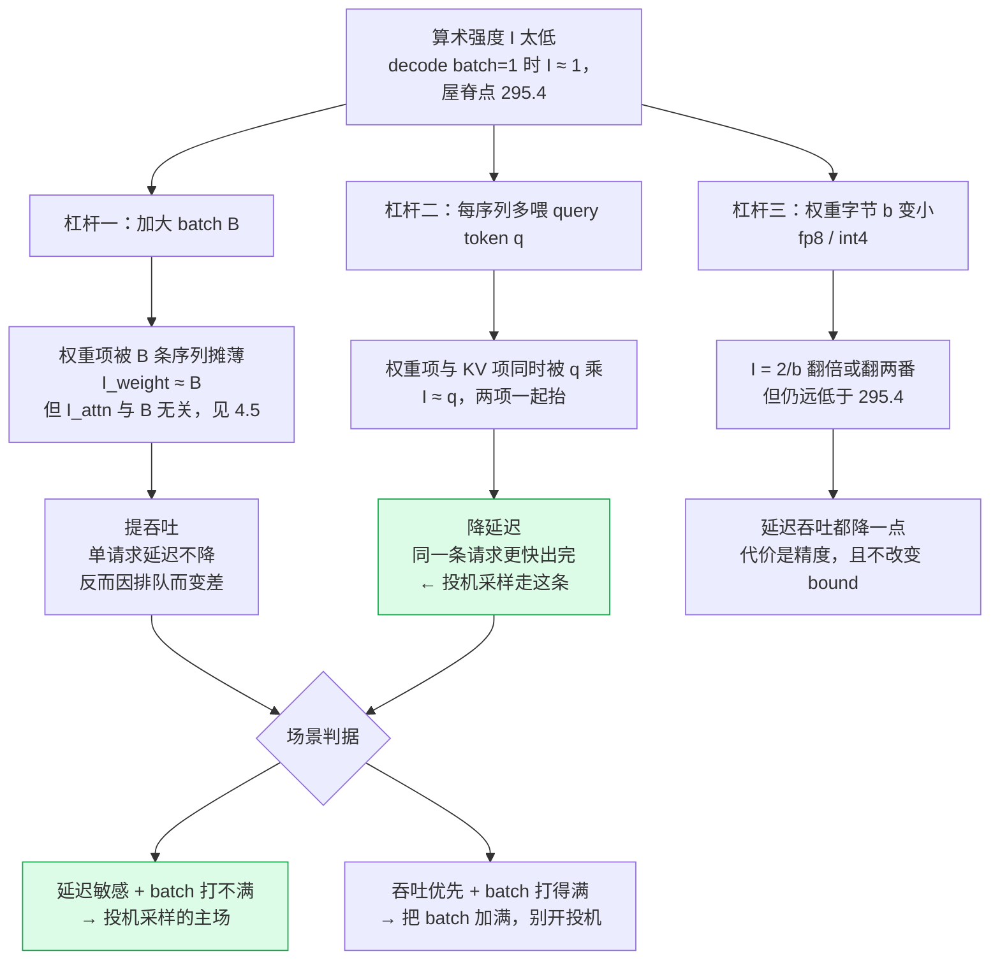

# 01 decode 为什么慢 —— 带宽墙与算力空转

## 1. 一句话

自回归 decode 每吐出一个 token，都要把**整份权重**从 HBM 搬进片上一次，而这一趟搬运只换来大约 **2 次浮点运算/参数**：算术强度 $\approx 1\ \mathrm{FLOP/Byte}$。H100 SXM5 的屋脊点是 **295.4 FLOP/Byte**（BF16 **稠密** 989.5 TFLOPS ÷ 3.35 TB/s）。

$1 \ll 295.4$，于是算力利用率只有 $1/295.4=\mathbf{0.338\%}$ —— **99.66% 的张量核心在空转**。
投机采样存在的全部理由，就是把这块空转的算力换成延迟。

---

## 2. 从哪来：不解决它会怎样

### 2.1 同一个模型，两种完全不同的形状

同一份权重 $W$，在推理的两个阶段被用成了两种截然不同的算子：

| 阶段 | 一次前向喂进去几个 token | 矩阵形状 | 算子类型 | 卡在哪 |
|---|---|---|---|---|
| **prefill**（处理 prompt） | 整段 prompt，$N$ 可到几千 | $[N,d]\times[d,d]$ | **GEMM**（矩阵×矩阵） | 算力 |
| **decode**（逐 token 生成） | **1 个** | $[1,d]\times[d,d]$ | **GEMV**（矩阵×向量） | 带宽 |

GEMV 是 GEMM 在 $N=1$ 时的退化形。退化掉的恰恰是**复用**：GEMM 里一块权重被 $N$ 行激活反复用，GEMV 里它只被用一次就被丢弃。

> PyTorch 团队在 gpt-fast 那篇博客里把这句话说得最干脆：*"because of the KV-cache, for BS=1 every single matrix multiplication in a transformer is actually a matrix vector multiplication"* —— **batch=1 时，transformer 里根本没有矩阵乘法，全是矩阵向量乘法**（来源见 §末）。

这一层的差异，本仓库的 `attention-optimization/22-prefill-vs-decode.md` 已经讲透（强度 $\approx$ 并行 token 数、MFU/MBU、两阶段 SLO），**本篇不重复**。本篇往下挖的是那篇没展开的两件事：

1. **把 KV 流量项显式算进账里**，并给出"多长的上下文才让 KV 超过权重"的具体临界值 —— 结论与直觉相反（§4.4）；
2. **把"batch 提吞吐 / 投机降延迟"的分工讲成一条可判定的场景判据**（§4.6、§8）。

### 2.2 没有它会怎样：一个 70B 的时间账

口径：llama3-70b（$P=70.6\times10^9$），fp16 权重，H100 SXM5，**TP=4**（四卡张量并行，一阶近似：带宽与算力各乘 4，忽略 all-reduce），batch=1，seqlen=1024，每序列 1 个 query token。

- 一次前向 $T=10.562$ ms
- 吞吐 $=94.7$ tokens/s（单请求）
- 生成 200 个 token $=2.11$ s

这 10.562 ms 里，**10.562 ms 是在等 HBM**，浮点单元只忙了 $0.0357$ ms。换句话说，你买的那 4 张卡里，有 3.986 张卡的算力在这一步里完全没被用到。

而且这笔账**不会随着卡多而变好**：TP 把带宽和算力同时乘 $n$，屋脊点 $\text{peak}/\text{BW}$ 分子分母同乘 $n$ 后不变，强度不变，bound 不变 —— 加卡只是把绝对时间等比缩小，**没有改变"在空转"这个事实**。

| TP | 屋脊点 (FLOP/Byte) | 强度 $I$ | bound | 一次前向 (ms) | tokens/s | 权重+KV 需求 / 可用显存 |
|---|---|---|---|---|---|---|
| 1 | 295.4 | 0.998 | memory | 42.249 | 23.7 | 142 GB / 80 GB **装不下** |
| 2 | 295.4 | 0.998 | memory | 21.125 | 47.3 | 142 GB / 160 GB |
| 4 | 295.4 | 0.998 | memory | 10.562 | 94.7 | 142 GB / 320 GB |
| 8 | 295.4 | 0.998 | memory | 5.281 | 189.4 | 142 GB / 640 GB |

（实测，复跑见 §6；口径：llama3-70b、fp16、batch=1、seqlen=1024、q/seq=1、H100 SXM5 × TP，忽略通信）

**第一行必须读出来**：70B 的 fp16 权重是 141.2 GB，单卡 80 GB 根本放不下。后面凡是出现"单卡 H100 跑 70B"的表，都是**为了对齐尺子而做的假设配置**，不是可落地的部署（`_lab/test_speedup.py::test_70b_does_not_fit_on_one_gpu`）。这条在铁律二里是硬性的：**报加速比不报卡数，那个数字没法用**。

---

## 3. 机制拆解：把一次前向的账列成两个数

### 3.1 记号

| 记号 | 含义 | 单位 |
|---|---|---|
| $P$ | 模型参数量 | 个 |
| $b$ | 每参数字节数（fp16/bf16 = 2，fp8 = 1，int4 = 0.5） | Byte |
| $B$ | batch size（同时在跑的序列条数） | — |
| $S$ | 上下文长度（KV cache 里已有的 token 数） | — |
| $q$ | **每条序列**这一次喂进去的 query token 数 | — |
| $n_q=B\cdot q$ | 本次前向的 query token 总数 | — |
| $d$ | $d_{\text{model}}$ | — |
| $L$ | 层数 | — |
| $d_{kv}$ | 每层 K（或 V）的维度（GQA 下 $=n_{kv}\times d_{head}$） | — |
| $\kappa$ | 每 token 的 KV 字节数 $=2\,L\,d_{kv}\,b_{kv}$ | Byte |
| $\text{BW}$ | HBM 带宽 | Byte/s |
| $\Pi$ | 峰值算力（**必须注明精度与稠密/稀疏**） | FLOP/s |

### 3.2 两个数

**访存字节**（读一次权重 + 读一次 KV cache）：

$$
\mathcal{B} \;=\; \underbrace{P\,b}_{\text{权重}} \;+\; \underbrace{B\,S\,\kappa}_{\text{KV cache}}
\tag{3.1}
$$

**浮点运算数**（线性层 + attention 的 $QK^\top$ 与 $\cdot V$）：

$$
\mathcal{F} \;=\; n_q\Big(\underbrace{2P}_{\text{线性层}} \;+\; \underbrace{4\,S\,d}_{\text{attention}}\Big)
\tag{3.2}
$$

**这两式的结构差异是全篇的题眼**，值得单独框出来：

> $\mathcal{B}$ 的**权重项与 $q$ 无关**；$\mathcal{F}$ **整体与 $q$ 成正比**。

### 3.3 "每参数 2 次浮点"是怎么来的

取一个线性层 $y=Wx$，$W\in\mathbb{R}^{m\times n}$，$x\in\mathbb{R}^{n}$。

$y$ 的每个分量 $y_i=\sum_{j=1}^{n}W_{ij}x_j$，需要 $n$ 次乘法 + $n-1$ 次加法 $\approx 2n$ 次浮点运算。$m$ 个分量共 $2mn$ 次。而这一层的参数量恰好是 $mn$。

$$
\frac{\text{FLOPs}}{\text{参数}}=\frac{2mn}{mn}=2
\tag{3.3}
$$

把全模型的线性层加起来，就是 (3.2) 里的 $2P$。**注意这条只对"每个参数被用一次"的情形成立** —— 也就是 $q=1$ 的 decode。$q>1$ 时每个参数被用 $q$ 次，故乘 $n_q$。

### 3.4 算术强度与屋脊模型

$$
I \;=\; \frac{\mathcal{F}}{\mathcal{B}},\qquad
T \;=\; \max\!\Big(\underbrace{\frac{\mathcal{B}}{\text{BW}}}_{t_{\text{mem}}},\ \underbrace{\frac{\mathcal{F}}{\Pi}}_{t_{\text{cmp}}}\Big)
\tag{3.4}
$$

$t_{\text{mem}}=t_{\text{cmp}}$ 的那个强度就是**屋脊点（ridge point）**：

$$
I^{*}=\frac{\Pi}{\text{BW}}
\tag{3.5}
$$

$I<I^{*}$ 时 memory-bound，此时**算力利用率**（MFU 的上界）恰为

$$
\text{util}=\frac{t_{\text{cmp}}}{t_{\text{mem}}}=\frac{I}{I^{*}}
\tag{3.6}
$$

（3.6）是本篇最该记住的一行：**利用率就是"你的强度距离屋脊点有多远"。**

---

## 4. 逐步推导

### 4.1 屋脊点：989.5 不是 1979

NVIDIA 官方 H100 规格页（2026-08 实取核对）给的 BFLOAT16 Tensor Core 数字是 **1,979 TFLOPS**，同一张表的脚注写着 `* With sparsity`。这是**含 2:4 结构化稀疏**的口径 —— 稠密峰值是它的一半：

$$
\Pi_{\text{BF16, dense}}=\frac{1979}{2}=989.5\ \text{TFLOPS},\qquad \text{BW}=3.35\ \text{TB/s}
$$

$$
I^{*}=\frac{989.5\times10^{12}}{3.35\times10^{12}}=\mathbf{295.4}\ \text{FLOP/Byte}
\tag{4.1}
$$

（`_lab/test_speedup.py::test_ridge_point_value`）

**为什么必须用稠密数**：LLM 推理的权重不是 2:4 稀疏的。拿 1979 当分母会把屋脊点写成 590.7，把"距离屋脊点多远"这件事整整放大两倍，进而把"空转比例"算错。本仓库的 AI 芯片对比库把这条立成了铁律 —— **峰值算力不许裸奔：写峰值必须同段给出精度、稠密/稀疏、带宽与拐点**。本篇的所有数字都按这条报。

### 4.2 batch=1 的强度：把 (3.1)(3.2) 代进去

先做一个纯符号的估算。$B=1$、$q=1$，且暂时忽略 attention 与 KV 两项（下一节补回来）：

$$
I=\frac{1\cdot 2P}{P\cdot b}=\frac{2}{b}
\tag{4.2}
$$

fp16 时 $b=2$，于是 $I=1$ FLOP/Byte。**这个 1 与模型多大、多少层、什么架构都无关** —— 它只取决于"每参数 2 次浮点、每参数 2 字节"这一条比例。这就是为什么 decode 的带宽墙是**结构性**的，不是调优能绕过去的。

代回 (3.6)：

$$
\text{util}=\frac{1}{295.4}=0.338\%
\quad\Longrightarrow\quad
\textbf{空转 } 99.66\%
\tag{4.3}
$$

把 attention 与 KV 两项加回去，实测值（llama3-70b，H100 SXM5 单卡假设配置，fp16，batch=1，seqlen=1024，q/seq=1）：

| 项 | 数值 |
|---|---|
| 权重字节 | $1.412\times10^{11}$ B = 141.20 GB → 42.149 ms |
| KV 字节 | $3.355\times10^{8}$ B = 0.336 GB → 0.100 ms |
| $\mathcal{B}$ 合计 | 141.54 GB → $t_{\text{mem}}=42.249$ ms |
| 线性层 FLOPs | $1.412\times10^{11}$ = 141.20 GFLOP → 0.1427 ms |
| attention FLOPs | $3.355\times10^{7}$ = 0.03 GFLOP → 0.00003 ms |
| $\mathcal{F}$ 合计 | 141.23 GFLOP → $t_{\text{cmp}}=0.1427$ ms |
| **强度 $I$** | **0.9979 FLOP/Byte** |
| **利用率** | **0.3378%** |

（实测，复跑：`python _lab/speedup.py --roofline`；`_lab/test_speedup.py::test_decode_is_memory_bound_at_batch_one`）

符号估算给 $I=1$，实测给 $0.9979$。**差的那 0.2% 就是 KV 与 attention 两项** —— 在 seqlen=1024、batch=1 下它们几乎不存在。

### 4.3 屋脊图



从 $I=0.998$ 到 $I^{*}=295.4$，中间隔着**两个半数量级**。这不是"稍微没喂饱"，是"几乎没开始用"。

### 4.4 KV 流量项：临界上下文长度（本篇的核心增量）

社区里有一句流传很广的话：**"长上下文下 KV cache 的读取会成为主导项。"** 这句话是对的，但它省掉了前提，而省掉的那个前提恰好是本库最关心的那个 —— **batch**。

令 (3.1) 的两项相等，解出临界上下文长度：

$$
P\,b = B\,S^{*}\,\kappa
\quad\Longrightarrow\quad
\boxed{\ S^{*}=\frac{P\,b}{B\,\kappa}\ }
\tag{4.4}
$$

$S>S^{*}$ 时 KV 流量超过权重流量。三个模型的 $\kappa$（来自 `_lab/speedup.py` 的 `MODELS`，均为 GQA、fp16 KV，`_lab/test_speedup.py::test_model_specs_self_consistent` 校验其内部一致性）：

| 模型 | $P$ | 权重 $Pb$ | $L$ | $d_{kv}$ | $\kappa=2Ld_{kv}\cdot 2$ |
|---|---|---|---|---|---|
| llama3.2-1b | 1.24 B | 2.48 GB | 16 | 512 | **32 KiB/token** |
| llama3-8b | 8.03 B | 16.06 GB | 32 | 1024 | **128 KiB/token** |
| llama3-70b | 70.6 B | 141.20 GB | 80 | 1024 | **320 KiB/token** |

代入 (4.4)（**实测**，复跑见 §6）：

| 模型 | $B=1$ | $B=8$ | $B=32$ | $B=64$ | $B=256$ |
|---|---|---|---|---|---|
| llama3.2-1b | 75,684 | 9,460 | 2,365 | 1,183 | 296 |
| llama3-8b | 122,528 | 15,316 | 3,829 | 1,915 | 479 |
| llama3-70b | **430,908** | 53,864 | 13,466 | 6,733 | 1,683 |

**这张表推翻了两个我写之前以为对的直觉：**

**被推翻的直觉一："长上下文下 KV 是主导项"。** 在 $B=1$ 下不是。llama3-70b 要跑到 **430,908 token** 的上下文，KV 流量才追平权重流量 —— 那已经远超任何在产的上下文窗口。把 70B 塞满 128 K 上下文，KV 也只有 42.95 GB，是权重 141.20 GB 的 **0.304**。所以**单请求低延迟场景下，decode 的时间几乎全花在"反复搬同一份权重"上，KV 只是零头**。这一点直接决定了投机采样的收益来源：它省的就是这个"反复"。

**被推翻的直觉二："模型越大越受 KV 拖累"。** 恰好相反。$S^{*}\propto P/\kappa$，而 $\kappa\propto L\,d_{kv}$ 只随模型规模**线性**长（1B→70B，$\kappa$ 只涨十倍），$P$ 却涨了五十七倍。于是**模型越小，KV 越早成为主导项**：

| 模型 | 128 K 上下文下 KV 字节 | 权重字节 | KV / 权重 |
|---|---|---|---|
| llama3.2-1b | 4.29 GB | 2.48 GB | **1.732** |
| llama3-8b | 17.18 GB | 16.06 GB | **1.070** |
| llama3-70b | 42.95 GB | 141.20 GB | 0.304 |

（口径：batch=1，fp16 权重与 fp16 KV，上下文 131,072 token）

这条对投机采样有直接后果：**草稿模型比目标模型更"KV 密集"**。草稿一轮要串行跑 $\gamma$ 次前向，每次都要把自己的 KV 读一遍；上下文一长，草稿的相对成本 $c=T_{\text{draft}}/T_{\text{target}}$ 就会爬升。同一对模型（target=llama3-70b、draft=llama3.2-1b，batch=1，H100 SXM5 单卡假设配置，fp16）：

| seqlen | $T_{\text{draft}}$ | $T_{\text{target}}$ | $c$ |
|---|---|---|---|
| 1,024 | 0.750 ms | 42.249 ms | 0.0178 |
| 8,192 | 0.820 ms | 42.951 ms | 0.0191 |
| 32,768 | 1.061 ms | 45.354 ms | 0.0234 |
| 131,072 | 2.022 ms | 54.970 ms | 0.0368 |

$c$ 在 1 K→128 K 之间涨到原来的两倍多。$c$ 直接进加速比公式的分母 $(\gamma c+1)$，也直接决定最优 $\gamma^{*}$ —— 推导见 [[06-期望接受长度与加速比模型-完整推导]]，长上下文下的完整处理见 [[22-长上下文下的投机采样]]。

### 4.5 KV 项的强度不随 batch 改善（一条结构性事实）

把 (3.1)(3.2) 里只属于 attention/KV 的那部分单独拿出来算强度：

$$
I_{\text{attn}}
=\frac{n_q\cdot 4Sd}{B\,S\,\kappa}
=\frac{B\,q\cdot 4Sd}{B\,S\,\kappa}
=\frac{4qd}{\kappa}
=\frac{q\,d}{L\,d_{kv}}
\tag{4.5}
$$

**$B$ 和 $S$ 全被约掉了。** 也就是说：

> **加大 batch 不会改善 attention 那一项的算术强度，一点都不会。**
> 唯一能抬它的杠杆是 $q$ —— 每条序列多喂几个 query token。

代入三个模型（$q=1$）：$I_{\text{attn}}$ 分别是 1b: 0.250、8b: 0.125、70b: **0.100** FLOP/Byte。对着屋脊点 295.4，这是**三个数量级**的差距。

（这也解释了 GQA 为什么在 decode 上这么值钱：MHA 时 $d_{kv}=d$，(4.5) 退化成 $q/L$，70B 就是 $1/80=0.0125$；GQA 把 $d_{kv}$ 从 8192 压到 1024，$I_{\text{attn}}$ 抬高八倍。GQA/MLA 的细节属于 `attention-optimization` 14–16，本篇只用这个结论。）

(4.5) 是"长上下文 + 大 batch 下投机依然不亏"这个反直觉现象的根：KV 项把前向死死钉在 memory 区，batch 拉不出来（`_lab/test_speedup.py::test_long_context_keeps_speedup_at_large_batch`）。这条留给 [[18-batch与吞吐-收益衰减曲线]] 与 [[22-长上下文下的投机采样]] 展开。

### 4.6 一次前向喂 $k$ 个 query token 的成本结构

回到 §3.2 框出的那句话，现在给它一个数：

- $\mathcal{B}$ 的权重项 $Pb$ 与 $q$ **无关**（`_lab/test_speedup.py::test_weights_read_once_regardless_of_query_tokens`：$q=1$ 与 $q=9$ 的访存字节**逐位相同**，差 $<10^{-15}$）；
- $\mathcal{F}$ 与 $q$ **成正比**。

于是在 memory 区里，$T=\mathcal{B}/\text{BW}$ 压根不含 $q$ —— **验证 5 个 token 与生成 1 个 token 同价**。实测（llama3-70b，H100 SXM5 单卡假设配置，fp16，batch=1，seqlen=1024）：

```
batch    seqlen   q/seq       t_mem(ms)   t_cmp(ms)   bound     T(ms)
1        1024     1           42.249      0.143       memory    42.249
1        1024     5           42.249      0.714       memory    42.249
```

$q$ 从 1 变 5，$T$ **一位小数都没动**。这就是投机采样的物理地基（`_lab/test_speedup.py::test_verify_is_nearly_free_in_memory_bound_region`）。

**免费到什么时候为止？** 在权重主导区 $I\approx q$，所以临界的 $q$ 差不多就是屋脊点本身。实测二分（llama3-70b，H100 SXM5 单卡假设配置，fp16，batch=1，seqlen=2048）：$q\le 296$ 时 memory-bound（$q=296$ 时 $I=294.74$），**$q\ge 297$ 才翻进 compute-bound**（$I=295.7$）。

而真实的草稿长度 $\gamma$ 是 4–8 量级，$q=\gamma+1\le 9$。也就是说，**batch=1 下你离"把 H100 喂饱"还差三十几个身位**。这条余量有多宽、边界在哪、树形草稿怎么把 $q$ 推高，是 [[03-并行验证为什么几乎免费-算术强度与roofline]] 的内容，本篇不抢。

### 4.7 batch 是另一条路 —— 但它换的是另一种东西

抬高 $I$ 的杠杆一共只有三个，它们**换来的东西不一样**：



**这张图是全库的场景判据，值得用一段话说死：**

加大 batch 确实把强度抬起来了 —— 权重被 $B$ 条序列摊薄，$I_{\text{weight}}\approx B$。但它抬的是**每张卡每秒能吐多少 token**（吞吐），**不是每条请求多久吐完**（延迟）。对单条请求而言，batch 从 1 加到 64，它自己那份前向该等 42 ms 还是等 48 ms（llama3-70b、seqlen=1024、H100 SXM5 单卡假设配置、fp16：$B=1$ 时 42.249 ms，$B=64$ 时 48.560 ms）—— **延迟只涨不降**。

投机采样走的是杠杆二：它不增加并发请求数，而是让**同一条请求**在一次前向里推进多个位置。它换的是延迟。

于是分工写死：

> **batch 提吞吐，投机降延迟。**
> 投机采样的适用场景是 **① 延迟敏感（TPOT 有 SLO）且 ② batch 打不满**。
> 两个条件缺一，它就从"薅羊毛"变成"抢算力"—— 因为杠杆一和杠杆二**抢的是同一份空转算力**，
> 而那份算力只够被薅一次。

这条判据的定量形式（崩塌点在哪、保本线怎么算）在 [[18-batch与吞吐-收益衰减曲线]] 与 [[19-负收益全解-什么时候投机反而更慢]]。

---

## 5. 小数字算例：一次前向，从字节算到毫秒

口径写全：**llama3-70b（$P=70.6\times10^9$，$L=80$，$d=8192$，$d_{kv}=1024$），fp16 权重与 fp16 KV，H100 SXM5 单卡（$\Pi=989.5$ TFLOPS BF16 稠密，$\text{BW}=3.35$ TB/s，$I^{*}=295.4$），batch=1，seqlen=1024，q/seq=1。**（再强调一次：单卡放不下 141.2 GB，这是为了对齐尺子的假设配置。）

**第 1 步 · 权重字节**

$$
P\,b=70.6\times10^{9}\times 2=1.412\times10^{11}\ \text{B}=141.20\ \text{GB}
$$

**第 2 步 · KV 字节**

$$
\kappa=2\times 80\times 1024\times 2=327{,}680\ \text{B}=320\ \text{KiB}
$$
$$
B\,S\,\kappa=1\times 1024\times 327{,}680=3.355\times10^{8}\ \text{B}=0.336\ \text{GB}
$$

**第 3 步 · 访存合计与 $t_{\text{mem}}$**

$$
\mathcal{B}=1.412\times10^{11}+3.355\times10^{8}=1.4154\times10^{11}\ \text{B}
$$
$$
t_{\text{mem}}=\frac{1.4154\times10^{11}}{3.35\times10^{12}}=42.249\ \text{ms}
$$

**第 4 步 · 浮点数与 $t_{\text{cmp}}$**

$$
\underbrace{2P=1.412\times10^{11}}_{\text{线性层}}+\underbrace{4Sd=4\times1024\times8192=3.355\times10^{7}}_{\text{attention}}=1.4123\times10^{11}\ \text{FLOP}
$$
$$
t_{\text{cmp}}=\frac{1.4123\times10^{11}}{989.5\times10^{12}}=0.1427\ \text{ms}
$$

**第 5 步 · 结论**

$$
I=\frac{1.4123\times10^{11}}{1.4154\times10^{11}}=0.9979\ \text{FLOP/Byte}
$$
$$
T=\max(42.249,\ 0.1427)=42.249\ \text{ms}\quad(\textbf{memory-bound})
$$
$$
\text{util}=\frac{0.1427}{42.249}=\frac{0.9979}{295.4}=0.3378\%
$$

**读出来**：这 42.249 ms 里，张量核心只忙了 **0.1427 ms**，剩下 **42.106 ms 在等内存**。生成 200 个 token 要 8.45 s，其中 8.42 s 是在等 HBM。

**再算一步，看清羊毛有多厚**：把 $q$ 改成 5（验证 4 个草稿 token + 1 个赠品位置），$t_{\text{cmp}}$ 涨到 $0.714$ ms，$t_{\text{mem}}$ **纹丝不动**，$T$ 仍是 42.249 ms。**多推进 4 个位置，账单上多出 0 ms。** 这 4 个位置能不能真的用上，取决于草稿猜得准不准；而"用上了会不会改掉输出分布"是另一件事，答案是不会（本库口径 **L1 分布无损**），证明见 [[04-拒绝采样修正-无损性的完整证明]]，收益模型见 [[06-期望接受长度与加速比模型-完整推导]]。物理上，这 4 个位置是白送的。

---

## 6. 代码验证

`_lab/speedup.py` 把 §3 的两式实现成 `fwd_time()`：

```python
def fwd_time(model, hw, batch, seqlen, q_per_seq, bytes_per_param=2.0):
    n_q = batch * q_per_seq
    mem_bytes = model["P"] * bytes_per_param + batch * seqlen * model["kv_per_tok"]
    flops     = n_q * (2 * model["P"] + 4 * seqlen * model["d_model"])
    t_mem, t_cmp = mem_bytes / hw["bw"], flops / hw["peak"]
    return dict(t=max(t_mem, t_cmp), t_mem=t_mem, t_cmp=t_cmp,
                bound="memory" if t_mem >= t_cmp else "compute",
                intensity=flops / mem_bytes)
```

`mem_bytes` 里**没有 `n_q`**，`flops` 里**有** —— (3.1)(3.2) 的结构差异在代码里就是这一行的差别。

实跑（`python _lab/speedup.py --roofline`，硬件 H100 SXM5，BW=3.35 TB/s，峰值(稠密)=989.5 TFLOPS，屋脊点 295.4 FLOP/Byte）：

```
--- llama3.2-1b (P=1.24B, KV=32 KiB/token) ---
batch    seqlen   q/seq       t_mem(ms)   t_cmp(ms)   bound     T(ms)
1        1024     1           0.750       0.003       memory    0.750
1        1024     5           0.750       0.013       memory    0.750
1        32768    1           1.061       0.003       memory    1.061
64       1024     1           1.381       0.161       memory    1.381
256      1024     5           3.304       3.219       memory    3.304

--- llama3-8b (P=8.03B, KV=128 KiB/token) ---
1        1024     1           4.834       0.016       memory    4.834
1        1024     5           4.834       0.081       memory    4.834
64       1024     5           7.358       5.199       memory    7.358
256      1024     1           15.051      4.159       memory    15.051
256      1024     5           15.051      20.797      compute   20.797
256      32768    5           333.006     21.469      memory    333.006

--- llama3-70b (P=70.60B, KV=320 KiB/token) ---
1        1024     1           42.249      0.143       memory    42.249
1        1024     5           42.249      0.714       memory    42.249
1        32768    1           45.354      0.144       memory    45.354
64       1024     5           48.560      45.674      memory    48.560
256      1024     1           67.791      36.539      memory    67.791
256      1024     5           67.791      182.697     compute   182.697
256      32768    5           862.680     184.043     memory    862.680
```

（实测节选，口径：单卡 H100 SXM5、fp16、忽略 norm/softmax/kernel launch/调度开销，故为**乐观上界**）

三条读法：

1. **看 llama3-70b 的 `1/1024` 两行**：$q$ 从 1 到 5，`T` 一模一样。§4.6 的免费性在这里是可见的。
2. **看 llama3-8b 的 `256/1024` 两行**：$q=1$ 时 memory、15.051 ms；$q=5$ 时翻进 compute、20.797 ms。**免费性在这里结束了**（`_lab/test_speedup.py::test_verify_stops_being_free_in_compute_bound_region`）。
3. **看 llama3-8b 的 `256/32768` 那行**：同样 $q=5$、同样 batch=256，只是上下文从 1 K 变 32 K，就又回到了 memory 区 —— KV 项把它拽了回去（§4.5）。**"大 batch 下投机没用"这句话的隐含前提是短上下文。**

---

## 7. 口径与坑

**坑一：峰值算力裸奔。** 用 1979 TFLOPS 当分母，屋脊点变成 590.7，"空转比例"从 99.66% 被算成 99.83%，看起来只差一点点，但**所有"离屋脊点还差多远"的判断都会错一倍**。判据很简单：**看到 BF16 峰值先问它含不含稀疏**。NVIDIA 官方表格给的是稀疏数，稠密值要自己按脚注除以二。

**坑二：不报卡数的加速比。** 70B fp16 权重 141.2 GB，单卡 H100 装不下（`::test_70b_does_not_fit_on_one_gpu`）。同一个"2.8×"，在 TP=8、batch=1、seqlen=1024 下和在 TP=1 下是两件事，后者根本不存在。本库铁律二要求同段报全 batch / $\gamma$ / $\alpha$ / 模型对 / 硬件与卡数 / 精度 / 测的是什么 / 任务分布 —— 硬件那一栏包含**卡数**。

**坑三：把 MFU 与 MBU 搞混。** decode 阶段 MFU 天然是 0.3% 量级，拿它去和训练的 40–50% 比毫无意义。decode 该看的是 **MBU**（带宽利用率）。gpt-fast 那篇博客给了一个漂亮的锚：Llama-7B、fp16、batch=1、A100-80GB（限功耗 330 W）、107 tok/s → MBU 72%，作者的评语是"即使纯拷贝内存也很难突破 85%"。**MBU 已经 72% 意味着优化空间只剩十几个百分点 —— 除非换问题。投机采样就是"换问题"。**

**坑四：把这套账当成实测。** `speedup.py` 忽略了 norm、softmax、kernel launch、调度、TP 的 all-reduce。真实系统的 `T` 只会更大，崩塌点只会来得**更早**。所以本篇所有数字都是**乐观上界**，用来定方向和判定性，不是用来报 benchmark。

**坑五（本篇特有）：把"KV 主导"当成无条件真理。** §4.4 已经把它证否了 —— 在 batch=1 下，70B 要到 43 万 token 上下文 KV 才追平权重。正确的说法是：**KV 主导发生在 $S>Pb/(B\kappa)$，而这个门槛与 batch 成反比。** 大 batch 是让 KV 主导的主因，长上下文只是共犯。

---

## 8. 失效条件：什么时候 decode **不是**访存瓶颈

本篇的全部结论建立在"decode 深度 memory-bound"之上。以下任一条成立，这个前提就动摇，投机采样的物理地基也跟着塌：

**① 大 batch（最常见）。** $I_{\text{weight}}\approx B$，$B$ 接近 295 时权重项就顶到屋脊点了。实测（llama3-8b，H100 SXM5 单卡，fp16，seqlen=1024）：batch=256、$q=1$ 时 $I=81.63$ 仍在 memory 区；batch=256、$q=5$ 时 $I=408.14$ 已经是 compute-bound，$T$ 从 15.051 ms 涨到 20.797 ms。**可判定形式：当 $B\cdot q\gtrsim I^{*}=295$（短上下文下）时，验证不再免费。**

**② 投机验证本身把 query token 数推高。** 这是最容易被忽略的一条：**投机采样会把自己推出 memory 区**。有效强度是 $I\approx B\cdot q=B(\gamma+1)$，树形草稿更是把 $q$ 从 $\gamma+1$ 推到**节点总数**（几十上百）。也就是说，$\gamma$ 越大、树越宽，离屋脊点越近 —— **投机采样的收益曲线自带一个天花板，且天花板由它自己的 $q$ 决定**。可判定形式：$B(\gamma+1)\gtrsim 295$（短上下文）时，第 $\gamma+1$ 个位置不再是白送的。树形草稿的 $q$ 怎么算见 [[16-树形草稿与树注意力-mask构造与验证]]，收益衰减见 [[18-batch与吞吐-收益衰减曲线]]。

**③ 超长上下文下 attention 的算力占比上升。** (3.2) 的 attention 项 $4Sd$ 随 $S$ 线性涨，而线性层项 $2P$ 不涨。两项相等的临界长度是 $S=P/(2d)$：70B 是 $70.6\times10^9/16384=4.31\times10^{6}$ token，8B 是 $8.03\times10^9/8192=9.80\times10^{5}$。所以**在当前上下文窗口内，attention 的 FLOPs 还远不是主项**。但要注意方向相反的一件事：attention 那部分的**强度**极低（§4.5，70B 只有 0.100 FLOP/Byte），所以随着 $S$ 增长，整体强度是**下降**的 —— 实测 llama3-70b、batch=1、$q=1$：$S=1024$ 时 $I=1.00$，$S=32768$ 时 $I=0.94$，$S=131072$ 时 $I=0.79$。**长上下文让 decode 更 memory-bound，不是更 compute-bound。** 这一条是本篇最容易被写反的地方。

**④ MoE 稀疏激活改变有效权重读取量。** MoE 的 $P$ 要换成**每 token 实际激活的专家参数量** $P_{\text{act}}$，(3.1) 的权重项从 $Pb$ 变成 $\approx P_{\text{act}}b$（不考虑专家常驻与路由抖动）。这会同时改两件事：绝对时间变短；而随着 batch 增大，不同 token 路由到不同专家，**被读的专家总数上升**，权重项不再是"读一次"的常数 —— 于是 (3.1) 的"权重项与 $q$ 无关"这条**在 MoE 上不严格成立**（$q$ 个 query token 可能激活不同专家）。本库的 `speedup.py` 建模的是稠密模型，**MoE 需要单独的账**。可判定形式：当 $q$ 个 query token 的路由并集显著大于单 token 的激活集时，验证不再免费。与其它优化的相互作用见 [[23-与其它优化的相互作用-量化与KVcache与PD分离]]。

**⑤ 低精度权重把强度抬上去。** $I=2/b$，fp8 令 $I$ 翻倍、int4 令 $I$ 翻两番。实测（llama3-70b，H100 SXM5 × TP=4，batch=1，seqlen=1024，KV 保持 fp16）：fp16 $I=0.998$、$t_{\text{mem}}=10.562$ ms；fp8 $I=1.991$、5.294 ms；int4 $I=3.963$、2.659 ms。**注意 $I$ 仍然只有个位数，离 295.4 远得很** —— 量化把墙推远了一点，没有拆掉墙。所以**量化与投机采样不是互斥的，是叠加的**（量化把 $T_{\text{target}}$ 和 $T_{\text{draft}}$ 一起压小，$c$ 基本不变，加速比结构不变）。

**⑥ 别的东西先卡住了你。** gpt-fast 那篇博客的起点是 **25.5 tok/s，卡在 CPU overhead**，不是带宽 —— 加上 `torch.compile` + 静态 KV cache 后才到 107 tok/s（Llama-7B，fp16，batch=1，A100-80GB 限功耗 330 W）。**如果你的 MBU 只有 20%，先别上投机采样，先去查 kernel launch 和图捕获。** 投机采样薅的是"带宽已经打满、算力还在空转"的那块羊毛；带宽都没打满时，羊毛还没长出来。

**一条收尾判据**：上投机采样之前，先测 MBU。**MBU 高（>60%）且 batch 打不满 → 投机是对的；MBU 低 → 先修别的；batch 打得满 → 加 batch 而不是加投机。**

---

## 9. 自测题

1. 为什么 batch=1 的 decode 算术强度是 $2/b$，与模型大小、层数、架构都无关？这个"无关"在什么时候会破？
   <details><summary>答案要点</summary>因为线性层的 FLOPs 是 $2P$、字节是 $Pb$，$P$ 上下约掉。破的条件有三：(a) KV 项不可忽略时（$S>Pb/(B\kappa)$，见 §4.4）；(b) attention FLOPs 不可忽略时（$S>P/2d$，量级 $10^6$ token）；(c) MoE，因为 $P$ 要换成激活参数量且随 batch 变化。</details>

2. 一个人说"我们把上下文加到 32 K，KV cache 就成主导项了"。他的模型是 70B、batch=1。这句话对吗？如果他的 batch 是 64 呢？
   <details><summary>答案要点</summary>batch=1 时**不对**：$S^{*}=430{,}908$，32 K 时 KV 只占权重的 7.6%（$45.354$ ms vs $42.249$ ms，只多 3.1 ms）。batch=64 时 $S^{*}=6{,}733$，32 K 已远超临界，KV **确实**成了主导项。所以这句话缺的是 batch，而 batch 恰恰是决定性的那一项。</details>

3. 把权重量化到 int4，decode 会从 memory-bound 变成 compute-bound 吗？
   <details><summary>答案要点</summary>不会。$I=2/b$，int4 下 $I\approx4$（实测 3.963，因为 KV 仍是 fp16），距屋脊点 295.4 还差近两个数量级。量化把墙推远、把时间压小，但不改变 bound。这也是为什么量化与投机采样可以叠加：两者薅的是同一块空转算力的不同层面 —— 量化减少要搬的字节，投机增加每次搬运换回的 token 数。</details>

4. 加大 batch 也能把强度抬到屋脊点，为什么还需要投机采样？
   <details><summary>答案要点</summary>因为两者换的东西不同。batch 抬的是吞吐（每卡每秒 token 数），单条请求的延迟只会因排队和更大的前向而**变差**（实测 llama3-70b、seqlen=1024、H100 SXM5、fp16：$B=1$ 时 42.249 ms，$B=64$ 时 48.560 ms）。投机采样不增加并发，而是让同一条请求一次推进多个位置，降的是延迟。判据：**延迟敏感且 batch 打不满 → 投机；吞吐优先且 batch 打得满 → 加 batch，别开投机**（§4.7）。</details>

5. 为什么说"长上下文让 decode 更 memory-bound"而不是相反？attention 的 FLOPs 不是随 $S$ 线性涨吗？
   <details><summary>答案要点</summary>FLOPs 涨，但字节涨得一样快，而且 attention 那部分的强度 $I_{\text{attn}}=qd/(Ld_{kv})$ 极低（70B 只有 0.100）。往一个 $I\approx1$ 的混合里掺入 $I=0.1$ 的成分，整体强度只会**下降**。实测 llama3-70b、batch=1、$q=1$：$I$ 从 $S=1024$ 的 1.00 掉到 $S=131072$ 的 0.79。这条正是"长上下文 + 大 batch 下投机依然不亏"的原因（§4.5）。</details>

---

## 10. 延伸与双链

- 全库地图：[[00-总览与知识地图]]
- 直接后继（本篇只点到、由它展开）：[[03-并行验证为什么几乎免费-算术强度与roofline]]
- 先看能跑的最小实现：[[02-最小可跑的投机采样-手算一遍]]
- 为什么这样白拿还不改分布（本库口径 L1 分布无损）：[[04-拒绝采样修正-无损性的完整证明]]
- 白拿几个 token、$c$ 怎么进公式：[[06-期望接受长度与加速比模型-完整推导]]
- 本篇 §4.7 判据的定量版：[[18-batch与吞吐-收益衰减曲线]]、[[19-负收益全解-什么时候投机反而更慢]]
- KV 项主导时会发生什么：[[22-长上下文下的投机采样]]
- 量化 / KV cache / PD 分离如何改这本账：[[23-与其它优化的相互作用-量化与KVcache与PD分离]]
- $q$ 被树推高之后：[[16-树形草稿与树注意力-mask构造与验证]]
- 第一性原理的收束：[[29-本质总结-第一性原理]]
- 社区在"KV 主导"和"投机提吞吐"上的常见口误：[[26-社区精彩解释精选-好在哪与错在哪]]、[[27-常见误解与判据]]

---

### 本篇验证

- `_lab/test_speedup.py::test_ridge_point_value` —— 验证 (4.1)：$989.5\times10^{12}/3.35\times10^{12}\in(290,300)$，即屋脊点 295.4 FLOP/Byte。本篇所有"距屋脊点多远"的判断都以它为准。
- `_lab/test_speedup.py::test_decode_is_memory_bound_at_batch_one` —— 验证 §4.2：batch=1、seqlen=1024 下 llama3-70b 的前向是 memory-bound 且强度 $<5$（实测 0.998）。
- `_lab/test_speedup.py::test_weights_read_once_regardless_of_query_tokens` —— 验证 (3.1) 的结构断言：$q=1$ 与 $q=9$ 的访存字节差 $<10^{-15}$，权重只搬一次。这是 §4.6 与全库的地基。
- `_lab/test_speedup.py::test_verify_is_nearly_free_in_memory_bound_region` —— 验证 §4.6 与 §5：memory 区里 $q=5$ 与 $q=1$ 的耗时比 $<1.01$。
- `_lab/test_speedup.py::test_verify_stops_being_free_in_compute_bound_region` —— 验证 §8 第 ① ② 条：compute 区里 $q=5$ 与 $q=1$ 的耗时比 $>2$，免费性结束。
- `_lab/test_speedup.py::test_long_context_keeps_speedup_at_large_batch` —— 验证 §4.5：长上下文下 KV 项把前向钉在 memory 区，batch=512、seqlen=16384 时验证阶段仍是 memory-bound。
- `_lab/test_speedup.py::test_70b_does_not_fit_on_one_gpu` —— 验证 §2.2 与 §7 坑二：70B fp16 权重 141.2 GB > 单卡 80 GB。本篇凡用单卡 70B 的表都标了"假设配置"。
- `_lab/test_speedup.py::test_model_specs_self_consistent` —— 校验 §4.4 三个模型的 $\kappa$ 与层数自洽（$\kappa$ 必是 $4L$ 的整数倍）。
- 可复跑：
  - `python _lab/speedup.py --roofline` —— §6 的完整表。关键数字：屋脊点 **295.4 FLOP/Byte**；llama3-70b batch=1/seqlen=1024，$q=1$ 与 $q=5$ 的 `T` 同为 **42.249 ms**；llama3-8b batch=256/seqlen=1024，$q=5$ 翻进 compute（15.051 → **20.797 ms**）；同配置把 seqlen 换成 32768 又回到 memory（**333.006 ms**）。
  - `python _lab/speedup.py --batch`、`python _lab/speedup.py --breakeven` —— 本篇判据的定量后续，正文交给 18/19 两篇。

### 本篇来源

- **NVIDIA H100 Tensor Core GPU（官方规格页）** — https://www.nvidia.com/en-us/data-center/h100/ （2026-08 本次实取核对）。H100 SXM：BFLOAT16 / FP16 Tensor Core **1,979 TFLOPS**，GPU Memory Bandwidth **3.35 TB/s**，GPU Memory 80 GB，脚注原文 `* With sparsity`。**它讲得好在哪**：把稀疏脚注放在同一张表里，没有藏。**它不好在哪**：表格正文给的是**稀疏**峰值，稠密值要读者自己按脚注除以二 —— 这就是社区里"H100 有 1979 TFLOPS"这种裸奔说法的源头。本篇一律用稠密 989.5。同一份规格的逐行核对亦见本仓库 `AI芯片对比，国内外，架构算子软件栈/01-怎么读一张AI芯片规格表.md`（该篇独立算出同一个 295.4 FLOP/Byte）。
- **Horace He 等（PyTorch 团队），*Accelerating Generative AI with PyTorch II: GPT, Fast*** — https://pytorch.org/blog/accelerating-generative-ai-2/ （页面显示最后更新 2024-11；配套仓库 pytorch-labs/gpt-fast）。**讲得好在哪**：三处。① 把 GEMV 那句话说死了 —— *"for BS=1 every single matrix multiplication in a transformer is actually a matrix vector multiplication"*；② 给了 **MBU** 的可算定义与一个真实锚点（Llama-7B、fp16、batch=1、A100-80GB 限功耗 330 W、107 tok/s → MBU 72%，并指出"纯内存拷贝也很难破 85%"），这让"还剩多少优化空间"变成一个数；③ 起点 25.5 tok/s 卡的是 **CPU overhead** 而不是带宽，这个诚实的细节支撑了本篇 §8 第 ⑥ 条。**哪里不严谨（要点名）**：它写投机解码 *"does not change the quality of the output"*、*"mathematically identical results compared to regular generation"* —— 这是把**分布相同**说成了**结果相同**，即本库铁律一里 L1 与 L2 两种口径的混用。正确说法是：温度 $>0$ 时是 **L1 分布无损**（逐点分布相等，但同 prompt 同种子的输出序列会不同），只有 $T=0$ 贪心才是 **L2 逐 token 相同**。详见 [[04-拒绝采样修正-无损性的完整证明]]。另外它给的加速数字（CodeLlama-34B + CodeLlama-7B 代码任务 **2x** tokens/s；Llama-7B + TinyLlama-1B 约 **1.3x**）口径只报到 batch=1 / A100-80GB / 正文描述的草稿长度约 8，**未报温度、$\alpha$、seqlen 与任务采样分布**，按铁律二属于「口径不全，不可横向比较」。
- **Yaniv Leviathan, Matan Kalman, Yossi Matias, *Fast Inference from Transformers via Speculative Decoding*** — https://arxiv.org/abs/2211.17192 （2022-11，ICML 2023）。投机采样的奠基论文之一。**与本篇的关系**：它把"目标模型验证 $\gamma+1$ 个 token 与生成 1 个 token 同价"当作分析的起点，本篇给的就是这条起点的物理账。它的加速比公式与前提分析见 [[06-期望接受长度与加速比模型-完整推导]]。
- **Samuel Williams, Andrew Waterman, David Patterson, *Roofline: An Insightful Visual Performance Model for Multicore Architectures*, Communications of the ACM 52(4), 2009-04** — https://dl.acm.org/doi/10.1145/1498765.1498785 。屋脊模型 (3.4)(3.5) 的原始出处。**讲得好在哪**：把"性能上限"压缩成 $\min(\Pi,\ \text{BW}\times I)$ 这一个式子和一张图，让不同 kernel 能画在同一把尺子上。**局限**：它假设带宽是常数，而真实 HBM 的有效带宽随访问模式（连续/跨步、cache 命中）变化，所以本篇的账是**乐观上界**。⚠️ 本次 WebFetch 该 URL 返回 **HTTP 403**（ACM 数字图书馆需登录），**未能逐字复核书目信息**，此处按 B 级来源标注；WebSearch 配额已在本会话用尽，无法交叉验证。
- **本仓库既有材料** —— `attention-optimization/22-prefill-vs-decode.md`（367 行）已讲透 prefill/decode 的形状差异、强度 $\approx$ 并行 token 数、MFU/MBU 指标体系与容量规划，写得好；`attention-optimization/26-speculative-decoding.md` 已给出 roofline 动机。**本篇不重复这两块**，补的是它们没有的两件事：**(4.4) 的临界上下文长度 $S^{*}=Pb/(B\kappa)$ 及其反直觉的具体数值**（70B 在 batch=1 下要 43 万 token 才让 KV 主导；模型越小 KV 越早主导），以及**(4.5) 的 $I_{\text{attn}}=qd/(Ld_{kv})$ —— attention 项的强度与 batch 无关，这是"batch 提吞吐 / 投机降延迟"分工的数学根据**。
