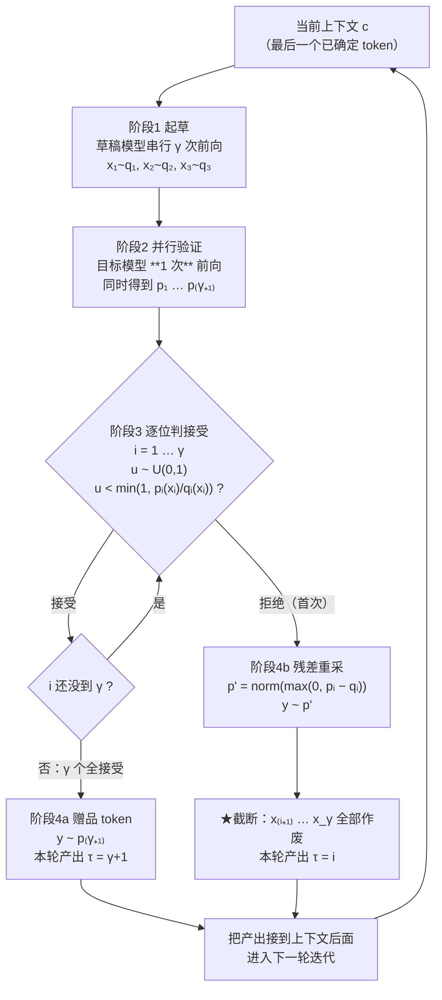

# 02 最小可跑的投机采样 —— 手算一遍

## 1. 一句话

小模型飞快地连猜 $\gamma$ 个 token，大模型**一次**前向把这 $\gamma$ 个位置**同时**算出来，然后**逐位掷一次骰子**决定留不留 —— 留下的白拿，第一个没留下的地方**当场补一个**、后面全作废。本篇不证明为什么这样做是对的（那是 [[04-拒绝采样修正-无损性的完整证明]] 的事），只把它在 $|V|=5$、$\gamma=3$ 上**一个数一个数地跑给你看**：三次真实迭代的 $p$、$q$、$\min(1,p/q)$、掷出的 $u$、接受还是拒绝，全部来自 `python _lab/spec.py --demo` 的实跑输出。

看完这篇，你应该能在纸上手算出 $\beta=0.8558$，并回答一个问题：**为什么这个例子里"只要被拒绝，输出就一定是 token 3"？**

---

## 2. 从哪来：为什么需要一个"最小例子"

### 2.1 上游动机（一句话带过）

decode 阶段每生成一个 token 就要把整个模型权重从 HBM 搬一遍，算力大面积空转 —— 这是 [[01-decode为什么慢-带宽墙与算力空转]] 的内容，本篇不重复。结论只有一句：

> 在 batch 小的时候，**一次前向喂 1 个 token 和喂 8 个 token，耗时几乎一样**（为什么"几乎"，见 [[03-并行验证为什么几乎免费-算术强度与roofline]]）。

那么问题就变成：**怎么才能在一次前向里，凑出多个"值得算"的位置？** 答案是让一个便宜的模型先猜出来。

### 2.2 但"猜"这件事有个陷阱

猜完之后要"验"。而"验"这一步是全篇最容易讲错的地方 —— 社区里绝大多数入门讲解在这里都简化过头了。所以本库把入门篇的重心放在这儿：

> **大模型做的不是打分，也不是挑选。** 它做的是**两件确定形式的随机操作**：
> ① 对每个草稿 token 掷一次均匀随机数，以概率 $\min(1,\,p/q)$ 接受；
> ② 在第一个被拒的位置，从一个**专门构造的残差分布** $p'=\mathrm{norm}(\max(0,p-q))$ 里重采一个 token。
>
> 把它讲成"大模型给草稿打分、分够高就留下"，**在数学上是另一个算法**，而且那个算法会悄悄改掉模型的输出分布（[[04-拒绝采样修正-无损性的完整证明]] §2.1 把偏差量到了 $10^{-1}$ 量级）。

### 2.3 30 秒直觉：一个尽量不骗人的比喻

我不用"老师批改作业"这个比喻 —— 它暗示大模型在**评分**，而评分意味着"分高留下、分低丢掉"，恰好就是上面那个错的确定性判据。换一个：

> **代购与退货。**
>
> 草稿模型是个代购，它按**自己的**价目表 $q$ 抓货，抓得飞快。目标模型手里是**真正的**价目表 $p$。
> 对代购抓来的每一件货，目标模型做的事是：
>
> - 如果这类货代购**抓多了**（$q>p$），就以 $1-p/q$ 的概率**退货** —— 注意是掷骰子退，不是一律退；
> - 如果代购**抓少了**（$p\ge q$），一律留下（$\min(1,p/q)=1$）；
> - 一旦发生退货，就从"**欠账清单**"里补一件 —— 欠账清单只列那些被抓少了的品类，且严格按欠的量成比例。这张欠账清单就是残差分布 $p'$。

这个比喻抓住了三件真事：**接受是随机的**（不是分数阈值）、**补货只补欠账**（不是从 $p$ 重新随便抓一件）、**多抓的按比例退**（这正是 $\min(1,p/q)$ 的含义）。

它**仍然会误导的地方**（自己先说清）：比喻里每件货像是独立退换的，而真实算法里 **一旦第一件退货，后面所有货都作废**。原因在 §3.3 讲，不是因为后面的货不好，而是因为后面的货是在"前面那件被留下"的前提下配的 —— 前提没了，它们连"合法的猜测"都算不上。

---

## 3. 机制拆解

### 3.1 记号（与 [[04-拒绝采样修正-无损性的完整证明]] 完全一致）

| 记号 | 含义 | 形状 |
|---|---|---|
| $V$ | 词表；本篇取 $\lvert V\rvert=5$ | — |
| $p_i$ | **目标模型**在前缀 $(c,x_1,\dots,x_{i-1})$ 下的 next-token 分布 | $(\lvert V\rvert,)$ |
| $q_i$ | **草稿模型**在**同一前缀**下的分布 | $(\lvert V\rvert,)$ |
| $x_i$ | 草稿采出的第 $i$ 个 token，$x_i\sim q_i$ | 标量 |
| $u_i$ | 第 $i$ 位掷出的均匀随机数，$u_i\sim\mathrm{Uniform}(0,1)$ | 标量 |
| $\gamma$ | 一次迭代的草稿长度；本篇取 3 | — |
| $\beta$ | 单步接受概率 $\sum_x\min(p(x),q(x))$ | 标量 |
| $\tau$ | 本轮**实际产出**的 token 数，$1\le\tau\le\gamma+1$ | 标量 |

> **记号警告（真踩过的坑）**：两篇奠基论文的 $p,q$ 是**反过来**的。Leviathan 用 $M_p$ 表示目标模型、$M_q$ 表示草稿；Chen 等人则用 $p$ 表示草稿、$q$ 表示目标。读社区代码时看到 `min(1, q[x]/p[x])` 不要以为写反了 —— 先确认作者的记号（§10 的 Jay Mody 那篇就是后一种）。本库统一用 **$p$=目标、$q$=草稿**。差异细节见 [[09-2023奠基-两篇同期论文的异同]]。

### 3.2 一次迭代的四个阶段与代价

| 阶段 | 做什么 | 前向次数 | 每次前向的 query token 数 |
|---|---|---|---|
| 1 起草 | $x_i\sim q_i$，$i=1..\gamma$ | $\gamma$ 次**串行**（草稿模型） | 1 |
| 2 验证 | 一次拿到 $p_1,\dots,p_{\gamma+1}$ | **1 次**（目标模型） | $\gamma+1$ |
| 3 判接受 | 逐位掷 $u_i$，比 $\min(1,p_i(x_i)/q_i(x_i))$ | 0（纯标量运算） | — |
| 4 收尾 | 拒绝处从 $p'$ 重采；或全接受时发赠品 | 0 | — |

**第 2 阶段是全部魔法所在**：目标模型只跑**一次**，却同时得到 $\gamma+1$ 个位置的分布。为什么能同时得到？因为这 $\gamma+1$ 个位置对应的是**同一条序列**上的连续位置，因果 mask 天然保证第 $i$ 个位置只看得见前 $i-1$ 个 token —— 这正是"教师强制"（teacher forcing）在训练时用的那个性质，投机采样只是把它挪到了推理时。为什么这一次前向"几乎免费"，是算术强度的事，见 [[03-并行验证为什么几乎免费-算术强度与roofline]]。

**注意 $p_{\gamma+1}$**：它是"如果 $\gamma$ 个草稿全对，下一个该是什么"的分布。它是**顺手算出来的**（因为验证的 query 里本来就带了第 $\gamma$ 个草稿 token），所以全接受时可以白拿一个 token。这就是 $\tau$ 的上界是 $\gamma+1$ 而不是 $\gamma$ 的原因。

### 3.3 完整伪代码（十几行，三处坑已标出）

```text
INPUT: 上下文 c，目标模型 p，草稿模型 q，草稿长度 gamma
OUTPUT: 本轮确定产出的 token 列表（长度 1..gamma+1）

 1  xs ← []                                  # ---- 阶段 1：起草 ----
 2  cur ← c
 3  for i = 1 .. gamma:
 4      x_i ~ q(· | cur);  xs.append(x_i);  cur ← cur + x_i

 5  p_1..p_{gamma+1} ← target_forward(c + xs)  # ---- 阶段 2：一次并行验证 ----

 6  out ← []                                  # ---- 阶段 3：逐位判接受 ----
 7  for i = 1 .. gamma:
 8      a ← min(1, p_i(x_i) / q_i(x_i))
 9      u ~ Uniform(0, 1)                      # ★坑1：随机判据，不是阈值判据
10      if u < a:
11          out.append(x_i)
12      else:
13          p' ← normalize(max(0, p_i − q_i))  # ★坑2：残差分布，不是 p_i
14          y ~ p';  out.append(y)
15          return out                         # ★坑3：首次拒绝即截断，后面全作废

16  y ~ p_{gamma+1}                            # ---- 阶段 4：全接受，白拿一个 ----
17  out.append(y);  return out
```

**三处坑，逐个说清**：

- **★坑1（第 9–10 行）：`u < a` 是随机判据。** $a=0.7096$ 的意思是"有 70.96% 的概率接受"，**不是**"0.7096 > 阈值所以接受"。§4 的迭代 3 会给出一个 $a=0.7096$ 却**被拒绝**的真实样本，以及一个 $a=0.3450$ 却**被接受**的真实样本 —— 两个方向的反例都在实跑输出里。把它写成 `if p_i(x_i) >= q_i(x_i): accept` 是社区高频错法之一，精确枚举下它让首 token 分布偏了 0.224（`_lab/test_lossless.py::test_threshold_rule_is_biased`）。
- **★坑2（第 13 行）：必须从残差分布重采。** 拒绝之后**不能**从 $p_i$ 重采。直觉：被接受的那部分 token 已经按 $\min(p,q)$ 的比例流出去了，如果补偿时再按完整的 $p$ 补，草稿高估的 token 会被补两次。量化后果与完整证明见 [[04-拒绝采样修正-无损性的完整证明]]。
- **★坑3（第 15 行）：首次拒绝即截断。** $x_{i+1},\dots,x_\gamma$ 必须全部丢掉。它们是在"前缀含 $x_i$"的条件下采的，而 $x_i$ 已经被换成了 $y\ne x_i$；它们的条件前缀已经不存在了。留着继续验证不会报错，只会让分布偷偷偏掉。这条约束也是 [[16-树形草稿与树注意力-mask构造与验证]] 存在的理由 —— 树形草稿就是为了让"一步错全废"的代价小一点。

### 3.4 流程图



**读图要点**：只有一条边通向"截断"，且它一定是**第一次**拒绝触发的；`τ` 的取值范围 $[1,\gamma+1]$ 由这张图的结构直接决定（最坏第 1 位就被拒，$\tau=1$；最好全接受加赠品，$\tau=\gamma+1$）。这条边界由 `_lab/test_lossless.py::test_chunk_length_bounds` 强制（$\gamma\in\{1,2,4\}$ 各跑 2000 次，逐次断言 $1\le\tau\le\gamma+1$）。

---

## 4. 逐步走查：三次真实迭代，一个数都不改

以下全部来自实跑：

```bash
cd _lab && python spec.py --demo
```

配置：$\lvert V\rvert=5$，$\gamma=3$，目标模型 `ToyMarkov(V=5, seed=0)`，草稿模型 `perturb(target, eps=0.8, seed=1)`（在目标 logit 上加噪造出的"像但不完全像"的草稿），随机数种子 `default_rng(7)`，起始 token $s_0=0$。

### 4.1 迭代 1：全接受 + 赠品，$\tau=4$

| 位置 $i$ | 上下文 | 草稿 $x_i$ | $p_i(x_i)$ | $q_i(x_i)$ | $\min(1,p/q)$ | 掷出 $u_i$ | 判定 |
|---|---|---|---|---|---|---|---|
| 0 | 0 | 2 | 0.3386 | 0.3406 | 0.9942 | 0.2252 | 接受 |
| 1 | 2 | 3 | 0.2903 | 0.2262 | **1.0000** | 0.3002 | 接受 |
| 2 | 3 | 4 | 0.4623 | 0.4555 | **1.0000** | 0.8736 | 接受 |

$\gamma=3$ 个全部接受 → 从 $p_4=p(\cdot\mid 4)$ 采赠品 token = **0**。

**本轮产出 4 个 token：`[2, 3, 4, 0]`**（$\tau=\gamma+1=4$，上界）

看位置 1 和位置 2：$\min(1,p/q)=1.0000$，因为这两处 $p_i(x_i)>q_i(x_i)$ —— **草稿低估了自己猜的这个 token**，目标模型认为它比草稿以为的还要可能。这种位置**必然接受**，掷不掷骰子都一样。位置 2 掷出 $u=0.8736$ 这么大的数也照样接受，就是这个道理。

### 4.2 迭代 2：一个"低接受概率却被接受"的样本，$\tau=4$

上一轮末尾是 token 0，所以本轮上下文回到 0。

| 位置 $i$ | 上下文 | 草稿 $x_i$ | $p_i(x_i)$ | $q_i(x_i)$ | $\min(1,p/q)$ | 掷出 $u_i$ | 判定 |
|---|---|---|---|---|---|---|---|
| 0 | 0 | 3 | 0.1982 | 0.0540 | **1.0000** | 0.3030 | 接受 |
| 1 | 3 | 4 | 0.4623 | 0.4555 | 1.0000 | 0.2784 | 接受 |
| 2 | 4 | 2 | 0.0559 | 0.1619 | **0.3450** | 0.2549 | **接受** |

全接受 → 从 $p_4=p(\cdot\mid 2)$ 采赠品 token = **1**。

**本轮产出 4 个 token：`[3, 4, 2, 1]`**

**位置 2 是本篇最重要的一行数据。** 目标模型给 token 2 的概率只有 0.0559，草稿给了 0.1619 —— 草稿给它的概率几乎是目标模型的**三倍**（高估）。接受概率只有 34.5%。但骰子掷出 0.2549 < 0.3450，**它被接受了**。

> 如果你的实现写的是 `if p >= q: accept`，这一位会被**拒绝**。
> 如果你的实现写的是"接受概率高于 0.5 才留"，这一位也会被拒绝。
> 而正确的算法**接受了它** —— 而且必须接受，否则 token 2 在输出分布里就会少掉一块。

这就是"随机判据 vs 阈值判据"的区别在一个具体样本上的样子。它同时也说明了另一件事：**投机采样不是在做质量筛选。** 一个目标模型自己都觉得只有 5.6% 可能的 token，照样有 34.5% 的机会被留下来 —— 因为目标模型本来就有 5.6% 的概率会自己采出它。

### 4.3 迭代 3：第 1 位就被拒，$\tau=1$

上一轮末尾是 token 1，本轮上下文为 1。

| 位置 $i$ | 上下文 | 草稿 $x_i$ | $p_i(x_i)$ | $q_i(x_i)$ | $\min(1,p/q)$ | 掷出 $u_i$ | 判定 |
|---|---|---|---|---|---|---|---|
| 0 | 1 | 2 | 0.3042 | 0.4287 | **0.7096** | **0.7927** | **拒绝** |

拒绝 → 从残差分布 $p'(\cdot\mid 1)$ 重采，得到 token **1**。位置 1、位置 2 的草稿 token **全部作废**（它们已经被草稿模型算出来了，但一个都不能用）。

**本轮产出 1 个 token：`[1]`**（$\tau=1$，下界）

**两个值得停下来看的点**：

1. **$a=0.7096$ 却被拒了。** 接受概率七成，骰子掷出 0.7927，超了。这是"随机判据"的另一个方向的反例：**高接受概率也会被拒**。前一轮的位置 2（$a=0.3450$ 却被接受）与这一位合起来，恰好把阈值判据的两种错误都堵死了。
2. **重采出来的 token 1，是目标模型的 argmax。** 看上下文 1 处的两个分布：

   $$p(\cdot\mid 1)=[0.1694,\ \mathbf{0.4347},\ 0.3042,\ 0.0584,\ 0.0333]$$
   $$q(\cdot\mid 1)=[0.2143,\ 0.2505,\ \mathbf{0.4287},\ 0.0692,\ 0.0373]$$

   **草稿模型和目标模型的 argmax 不一样**：草稿最看好 token 2（0.4287），目标最看好 token 1（0.4347）。草稿按自己的判断押了 token 2，被以 29% 的概率否掉了。而 token 1 是**唯一**满足 $p>q$ 的 token（0.4347 > 0.2505），所以残差分布 $p'=[0,1,0,0,0]$ —— **这一步只要被拒，输出必定是 token 1**。

### 4.4 三轮汇总

| 迭代 | 起始 token | $\tau$ | 产出 | 结束方式 |
|---|---|---|---|---|
| 1 | 0 | 4 | `[2,3,4,0]` | 全接受 + 赠品 |
| 2 | 0 | 4 | `[3,4,2,1]` | 全接受 + 赠品 |
| 3 | 1 | 1 | `[1]` | 位置 0 被拒 |

3 次目标模型前向，产出 9 个 token。**注意"3 次前向"这个说法本身还不是加速比** —— 草稿模型跑了 $3\times3=9$ 次前向，那部分成本没算进去；而且样本量只有 3，方差极大。把这些账算全需要一个模型，见 §7.2 与 [[06-期望接受长度与加速比模型-完整推导]]。

---

## 5. 手算一遍：$\lvert V\rvert=5$ 的 $\beta$、TV 与残差

现在把上下文 $s_0=0$ 这一步**完全用手算一遍**。两个分布（实跑输出，6 位小数）：

$$p=[0.202373,\ 0.156379,\ 0.338596,\ 0.198202,\ 0.104451]$$
$$q=[0.206040,\ 0.233006,\ 0.340578,\ 0.053960,\ 0.166416]$$

### 5.1 逐列填表

| token | 0 | 1 | 2 | **3** | 4 |
|---|---|---|---|---|---|
| $p$ | 0.202373 | 0.156379 | 0.338596 | **0.198202** | 0.104451 |
| $q$ | 0.206040 | 0.233006 | 0.340578 | **0.053960** | 0.166416 |
| $p>q$? | 否 | 否 | 否 | **是** | 否 |
| $\min(1,p/q)$ | 0.9822 | 0.6711 | 0.9942 | **1.0000** | 0.6276 |
| $\min(p,q)$ | 0.202373 | 0.156379 | 0.338596 | **0.053960** | 0.104451 |
| $\max(0,p-q)$ | 0 | 0 | 0 | **0.144241** | 0 |

### 5.2 三个数

**接受概率 $\beta$** —— 把 $\min(p,q)$ 一行加起来：

$$\beta=0.202373+0.156379+0.338596+0.053960+0.104451=\mathbf{0.855759}$$

**全变差距离 TV** —— $\tfrac12\sum\lvert p-q\rvert$：

$$\mathrm{TV}(p,q)=\mathbf{0.144241}$$

**恒等式验算**：$\beta+\mathrm{TV}=0.855759+0.144241=1.000000$ ✓

这条恒等式 $\beta=1-\mathrm{TV}(p,q)$ 不是巧合，它对任意两个分布都成立（`_lab/test_lossless.py::test_beta_equals_one_minus_tv`，100 组随机 Dirichlet 分布逐组断言）。它给了一个很好用的读法：

> **接受率就是两个分布的重叠面积。** 草稿和目标"长得有多像"，直接就是"有多少比例的猜测会被留下"。
> 更精确的口径讨论（$\beta$、$\alpha$、平均接受长度，三者常被混着叫）见 [[05-接受率alpha-定义口径与怎么测]]。

**残差分布** —— $\max(0,p-q)$ 一行加起来：

$$\sum_z\max(0,p(z)-q(z))=0.144241=1-\beta\ \checkmark$$

归一化：

$$p'=\frac{[0,\ 0,\ 0,\ 0.144241,\ 0]}{0.144241}=[0,\ 0,\ 0,\ \mathbf{1},\ 0]$$

### 5.3 为什么残差恰好落在 token 3

因为 **token 3 是这一行里唯一被草稿低估的 token**（$p=0.1982 > q=0.0540$，草稿只给了目标模型的 27%）。

残差分布的构造是 $\max(0,p-q)$ —— 它**只保留 $p>q$ 的那些 token**，其余全部清零。这里只有一个 token 满足条件，于是全部"欠账"都记在它头上，归一化后自然是个 one-hot。

用 §2.3 的代购比喻：代购在 token 0、1、2、4 上都**抓多了**（$q>p$），只有 token 3 **抓少了**。所以欠账清单上只有 token 3 这一项 —— 一旦发生退货，补的必然是它。

**别把 one-hot 当成通例。** 它只是"恰好只有一个 token 被低估"的巧合。换一个上下文（$s=2$，同一对模型）就不是了：

$$p(\cdot\mid 2)=[0.193756,\ 0.376606,\ 0.035334,\ 0.290349,\ 0.103955]$$
$$q(\cdot\mid 2)=[0.175939,\ 0.517686,\ 0.017400,\ 0.226230,\ 0.062744]$$

| token | 0 | 1 | 2 | 3 | 4 |
|---|---|---|---|---|---|
| $\max(0,p-q)$ | 0.017817 | **0** | 0.017934 | 0.064118 | 0.041211 |
| $p'$（归一化） | 0.12629 | **0** | 0.12712 | **0.45448** | 0.29211 |

这里 $\beta=0.858920$，$1-\beta=0.141080=\sum\max(0,p-q)$ ✓。**4 个 token 被低估，只有 token 1 被草稿高估**（0.3766 vs 0.5177），于是 $p'(1)=0$ —— 被拒绝时，**绝不会补出 token 1**。

这条性质值得单独记住：

> **残差分布在"草稿高估的 token"上恒为 0。** 一个 token 被草稿越高估，它被接受的概率越低，且拒绝时也补不到它 —— 两条路一起把它压回 $p$ 的水平。这就是修正机制的全部作用方式。

至于"为什么这么修正之后输出分布恰好等于 $p$"，那是 [[04-拒绝采样修正-无损性的完整证明]] §4 的四步推导。本篇只到"看见它在干什么"为止。

---

## 6. 最小可跑代码

### 6.1 核心 12 行

`_lab/spec.py::speculative_step`，纯 numpy，与 §3.3 的伪码逐行对应：

```python
def speculative_step(target, draft, last, gamma, rng, trace=None):
    # ---- 1) 起草：gamma 次串行前向 ----
    xs, qs, cur = [], [], last
    for _ in range(gamma):
        q = draft.dist(cur)                      # 伪码第 4 行
        x = int(rng.choice(len(q), p=q))
        xs.append(x); qs.append(q); cur = x

    # ---- 2) 并行验证：一次拿 gamma+1 个分布 ----
    ps, cur = [], last
    for i in range(gamma + 1):                   # 伪码第 5 行
        ps.append(target.dist(cur))              # p_i 的条件 = 前缀 + 前 i-1 个草稿 token
        if i < gamma:
            cur = xs[i]

    # ---- 3) 逐位判接受 ----
    out = []
    for i in range(gamma):
        x = xs[i]
        a = min(1.0, ps[i][x] / qs[i][x]) if qs[i][x] > 0 else 0.0   # ★坑1
        u = float(rng.random())
        if u < a:                                 # 随机判据，不是 a > 阈值
            out.append(x)
        else:
            r = residual_dist(ps[i], qs[i])       # ★坑2：残差，不是 ps[i]
            out.append(int(rng.choice(len(r), p=r)))
            return out                            # ★坑3：首次拒绝即截断

    # ---- 4) 全接受，白拿一个 ----
    out.append(int(rng.choice(len(ps[gamma]), p=ps[gamma])))
    return out
```

和残差分布本身（两行）：

```python
def residual_dist(p, q):
    r = np.maximum(0.0, p - q)
    s = r.sum()
    if s <= 0.0:
        return p.copy()      # 仅在 p==q 时触发；此时接受概率恒为 1，这条分支走不到
    return r / s
```

### 6.2 三处对应关系，逐行核对

| 伪码 | 代码 | 容易写错成什么 |
|---|---|---|
| 第 5 行「一次并行验证」 | `for i in range(gamma+1): ps.append(target.dist(cur))` | 这里的循环是**在教学模型里模拟**一次并行前向；真实引擎是一次 `forward(input_ids=[c]+xs)` 拿 $\gamma+1$ 个 logits 行。**关键不在循环，在于 `cur` 的推进顺序必须与草稿完全一致**（$p_i$ 与 $q_i$ 的条件前缀对齐） |
| 第 9–10 行 `u < a` | `u = rng.random(); if u < a:` | 写成 `if ps[i][x] >= qs[i][x]:`（阈值判据） |
| 第 13 行 `p'` | `r = residual_dist(ps[i], qs[i])` | 写成 `r = ps[i]`（从 $p$ 重采） |
| 第 15 行 `return` | 在 `else` 分支里直接 `return out` | 写成 `continue`（不截断，继续验后面的位置） |

### 6.3 实跑：$\tau$ 的分布

把 $\tau$ 的分布**精确枚举**出来（不掷骰子，把所有分支的概率加起来），起始 token $s_0=0$：

| $\gamma$ | $P(\tau{=}1)$ | $P(\tau{=}2)$ | $P(\tau{=}3)$ | $P(\tau{=}4)$ | $P(\tau{=}5)$ | $E[\tau]$ |
|---|---|---|---|---|---|---|
| 1 | 0.1442 | 0.8558 | — | — | — | 1.8558 |
| 2 | 0.1442 | 0.1435 | 0.7122 | — | — | 2.5680 |
| 3 | 0.1442 | 0.1435 | 0.1189 | 0.5933 | — | **3.1613** |
| 4 | 0.1442 | 0.1435 | 0.1189 | 0.1030 | 0.4903 | 3.6516 |

> **口径声明（铁律二）**：这**不是加速比**，禁止与任何真实系统横向比较。它是 —— batch size：不适用（单序列玩具模型）；$\gamma$：见表列；$\beta(s_0{=}0)=0.8558$；draft/target 组合：`ToyMarkov(V=5,seed=0)` 与 `perturb(eps=0.8,seed=1)`，同词表、无参数量概念；硬件与精度：纯 numpy float64，CPU；测的是**每轮产出 token 数 $\tau$ 的期望**，不含任何前向耗时；任务分布：无。复跑：`_lab/spec.py::iteration_dist`。

两个读法：

1. **$P(\tau=1)=0.1442=1-\beta$ 与 $\gamma$ 无关。** 第一位被拒的概率只取决于第一位，$\gamma$ 加多少都救不了它。
2. **$E[\tau]$ 的增量在衰减**：$\gamma$ 从 1→2 涨 0.712，2→3 涨 0.593，3→4 涨 0.490。而草稿成本是**线性**涨的。这两条曲线的交点就是最优 $\gamma$ —— 完整推导见 [[06-期望接受长度与加速比模型-完整推导]]，自适应地找它见 [[17-动态草稿长度与自适应停止]]。

再看一个更诚实的数字。上面是**固定起始 token 0** 的期望；真实生成里上下文一直在变，而 $\beta$ 是**随上下文变的**（$\beta(s{=}0)=0.8558$，$\beta(s{=}1)=0.8157$，$\beta(s{=}2)=0.8589$）。连着跑 200000 轮迭代（每轮起点接上一轮的产出，`default_rng(7)`，$\gamma=3$）：

```
经验分布  P(τ=1)=0.1826  P(τ=2)=0.1441  P(τ=3)=0.1152  P(τ=4)=0.5580
经验均值  E[τ] = 3.0487        （单点估计给的是 3.1613）
```

**单个上下文测出来的 $\beta$ 会高估真实的 $E[\tau]$**（这里高估 3.7%）。这在玩具模型上只是个小偏差，在真实模型上是个大坑 —— 因为真实文本里"难的位置"和"容易的位置"分布极不均匀。这条留给 [[05-接受率alpha-定义口径与怎么测]] 展开。

---

## 7. 口径与坑

### 7.1 铁律一：本篇的"无损"是哪一档

本篇跑的这个算法是 **L1 分布无损（exact）**：输出是目标模型分布 $p$ 的**精确样本**，逐点相等。

**L1 不蕴含"结果一样"。** §4 那三轮跑出来的 `[2,3,4,0,3,4,2,1,1]`，和把同一个目标模型单独自回归跑 9 步得到的序列，**几乎肯定不同** —— 即使固定同一个种子。因为投机采样消耗随机数的方式完全不同（每个位置多掷一个 $u$，拒绝时还要从 $p'$ 再采一次）。

完整证明见 [[04-拒绝采样修正-无损性的完整证明]]；三种口径（L1 分布无损 / L2 贪心等价 / L3 近似）的完整辨析见 [[07-无损的三种口径-分布无损不等于结果相同]]。本篇只需要你记住：**分布相同，样本不同。**

### 7.2 常见误解点名（写作规范 §4 的高频错误）

**误解 A：「投机解码的输出和不开投机完全一样」**

这是把 L1 说成了 L2。真实案例：PyTorch 官方博客 *A Hitchhiker's Guide to Speculative Decoding*（2024-11-13）开头写的是

> "It incorporates a verification mechanism to ensure the correctness of these speculated tokens, thereby **guaranteeing that the overall output of speculative decoding is identical to that of vanilla decoding**."

这句话在 $T=0$ 贪心下成立（L2），在采样下**不成立**（只有分布相同）。同一篇文章的技术内容是扎实的（它把 KV cache 复用、mask 修改、speculator 训练两阶段讲得很具体），但这句开场白会让读者拿"逐 token 对比"去验证一个采样系统，然后误判成 bug。

对照一下 Chen 等人原论文的措辞就知道差别在哪：他们写的是 "preserves the distribution of the target model **within hardware numerics**" —— **preserves the distribution**（保持分布），而不是 identical output；而且还留了 "within hardware numerics" 这个后门（见 §8 第 5 条）。这是我见过对这件事最精确的一句话。

**误解 B：「$p(x)>q(x)$ 就接受」**

漏掉了 $\min(1,p/q)$ 的随机性。§4.2 的位置 2（$a=0.3450$ 被接受）与 §4.3 的位置 0（$a=0.7096$ 被拒绝）是这条误解的两个方向的实测反例。精确枚举下这种写法让首 token 分布偏 0.224（`_lab/test_lossless.py::test_threshold_rule_is_biased`）。

**误解 C：「拒绝后从 $p$ 重采」**

这是最隐蔽的一条，因为它看起来"更合理"（既然草稿不可信，就从可信的分布重采）。它错在：被接受的部分已经按 $\min(p,q)$ 流出去了，再按完整的 $p$ 补会补重。量化偏差 0.132（`_lab/test_lossless.py::test_naive_resample_is_biased`），完整分析见 [[04-拒绝采样修正-无损性的完整证明]]。

**误解 D：「草稿模型越小越好」**

小 → 草稿成本 $c$ 低，但 $\beta$ 也塌。§6.3 那张表告诉你 $E[\tau]$ 完全由 $\beta$ 驱动；$\beta$ 掉一点，$\alpha^k$ 的衰减会放大它。这是一个**权衡**不是一个方向。极端情况见 [[11-无模型草稿-promptlookup与ngram与检索]]（草稿成本压到 ~0，但 $\beta$ 只在特定任务上够用）与 [[21-草稿模型怎么训-对齐与在线蒸馏]]。

### 7.3 一条排查判据

线上出问题时，先把问题分成两类，别混着调：

> **「接受长度不理想」是性能问题，「分布对不上」是正确性问题。**
>
> - $\tau$ 偏低 → 去看草稿质量、$\gamma$、上下文分布。调这些**不会**改变输出正确性。
> - 输出分布跑偏（评测分数掉了、行为和离线不一致）→ 回去看 §3.3 那三处坑。**改这些才可能改分布。**
>
> 判定"分布跑偏"的正确方法是**统计检验或精确枚举**，不是对比单条输出（见 §7.1）。

---

## 8. 失效条件：这个最小例子省略了什么

本篇的例子跑得通、算得准，但它离一个能上线的实现还差很远。**下面每一条，都是这个玩具例子里根本不存在、而真实系统里会咬人的东西**：

1. **KV cache 回滚。** 玩具模型每次 `target.dist(cur)` 都是重新查表，没有状态。真实系统里，目标模型验证 $\gamma+1$ 个位置时会往 KV cache 里写入 $\gamma+1$ 个位置的 K/V；一旦第 $i$ 位被拒，**第 $i+1$ 位之后写进去的 KV 必须回滚/丢弃**，而且草稿模型自己的 KV cache 也要同步回滚。这是投机解码实现里最常见的 bug 来源，而且它不会报错 —— 只会让后续生成基于一段不存在的历史。见 [[20-主流引擎实现-vLLM与SGLang与TensorRTLLM]]。
   **可判定的症状**：接受率随生成长度单调下降，且重启会话后消失。

2. **连续批处理（continuous batching）。** 本例是单序列。真实服务里一个 batch 内每条序列的 $\tau$ 都不同（有的产出 1 个，有的产出 4 个），**下一轮的 batch 形状是不规则的**，要么 padding 要么重排。更要命的是：**batch 一大，"并行验证几乎免费"这个前提就没了** —— 目标模型早已不是 memory-bound，多喂的 $\gamma$ 个 token 是实打实的算力开销。PyTorch 那篇博客给的经验值是 "We begin to observe throughput reduction beyond a batch size of 64"（**口径不全**：未给硬件、$\gamma$、序列长度，不可直接搬用）。收益衰减曲线见 [[18-batch与吞吐-收益衰减曲线]]，完整的负收益条件见 [[19-负收益全解-什么时候投机反而更慢]]。

3. **树形草稿。** 本例的草稿是**一条链**，所以"第 $i$ 位被拒，后面全废"。真实系统普遍改成树（每个位置押多个候选），此时 §3.3 的接受判据要推广成"沿树逐层做"，且需要构造祖先链 mask、用**深度**而不是拍平下标作 position id。position id 写错是另一个静默 bug。见 [[16-树形草稿与树注意力-mask构造与验证]] 与 [[12-Medusa-多头草稿与树注意力的诞生]]。

4. **tokenizer 对齐。** 本例里 $p$ 和 $q$ 定义在同一个 $\lvert V\rvert=5$ 的词表上，所以 $p(x)/q(x)$ 有意义。**两个模型 tokenizer 不同时，这个比值根本没有定义** —— 不是"精度差一点"，是无意义。跨 tokenizer 的投机需要额外的对齐机制，那已经不是本篇这个算法了。
   **可判定的症状**：$\beta$ 异常低且与内容无关，或干脆越界报错。

5. **采样参数一致性。** 本例没有 temperature / top-p / top-k。真实系统里，**$p$ 与 $q$ 必须施加同一套变换之后再比**。常见的两种偏差：
   - 目标模型截断了 top-p 而草稿没截 → 被截掉的 token 上 $p=0$，接受概率恒为 0，$\beta$ 莫名塌方（仍然 L1 无损，只是很慢）；
   - 草稿截得比目标更狠 → $q(x)=0$ 的 token 草稿永远采不到，**算法仍然无损**，只是效率变差。

   两种都不会报错。排查时先打印 $\beta$ 的分布，塌方一般就是这儿。

6. **低精度下的数值问题。** 本例是 float64。真实系统里 $p$ 和 $q$ 由不同精度、不同 kernel 算出（例如目标 fp8、草稿 fp16），而 $p(x)/q(x)$ 在 $p\approx q$ 处对舍入**极其敏感**。此时的"无损"只在浮点误差意义下成立 —— 严格说已经不是纯粹的 L1 了。Chen 等人在摘要里就留了这个后门："preserves the distribution of the target model **within hardware numerics**"。量化与投机的相互作用见 [[23-与其它优化的相互作用-量化与KVcache与PD分离]]。

7. **长上下文。** 本例的"上下文"只有一个 token。序列一长，KV cache 的读取本身就成了带宽大头，$\gamma+1$ 个 query token 要重读整段 KV —— "并行验证几乎免费"的前提被侵蚀。见 [[22-长上下文下的投机采样]]。

> **一句话总结这一节**：本篇的例子把**算法**讲对了，但**系统**的部分一个都没有。而真实项目里投机解码翻车，绝大多数不是算法写错，是上面这七条里的某一条。

---

## 9. 自测题

1. §4.2 的位置 2 里，$p=0.0559$、$q=0.1619$、$a=0.3450$、$u=0.2549$，结果是**接受**。如果把判据改成"$p\ge q$ 才接受"，这一位会怎样？输出分布会往哪个方向偏？
   <details><summary>答案要点</summary>会被拒绝。阈值判据下，所有 $p<q$ 的 token 一律被拒 —— 但正确算法允许它们以 $p/q$ 的概率通过。于是草稿高估的 token 在输出里被**压得过狠**，而拒绝次数变多、残差分布被使用的频率变高，草稿低估的 token 被**补得过多**。整体偏差方向是"过度纠正"。精确枚举给出的首 token 最大偏差是 0.224（`test_threshold_rule_is_biased`）。</details>

2. 为什么 §5 里 $s_0=0$ 的残差分布恰好是 one-hot，而 $s=2$ 的不是？给出一个判据：什么时候残差一定是 one-hot？
   <details><summary>答案要点</summary>残差 $\propto\max(0,p-q)$ 只保留 $p>q$ 的 token。$s_0=0$ 处只有 token 3 满足 $p>q$，所以归一化后是 one-hot。判据：**当且仅当恰好有一个 token 满足 $p(x)>q(x)$ 时**，残差是 one-hot。$s=2$ 处有 4 个 token 满足，所以是个 4 点分布。注意 $p\ne q$ 时至少有一个 token 满足 $p>q$（否则 $\sum p<\sum q=1$，矛盾），所以残差永远是合法分布 —— 这条由 `test_residual_is_valid_distribution` 断言。</details>

3. 某实现为了"少一次采样开销"，在 $\gamma$ 个草稿全部被接受时，直接把第 $\gamma$ 个草稿 token 再输出一遍当赠品。这会怎样？如果它改成干脆不发赠品呢？
   <details><summary>答案要点</summary>第一种破坏 **L1 分布无损**：赠品位置的分布被换成了一个退化的点分布，联合分布直接改掉。第二种（不发赠品）**仍然是 L1 分布无损**，只是每轮少产出一个 token（$E[\tau]$ 从 3.1613 掉到 2.1613 量级），变慢不变错。这是"少发 token 只是慢，改分布才是错"的典型对照，见 `test_no_bonus_token_is_still_lossless`。</details>

4. §6.3 的表里，$P(\tau=1)=0.1442$ 在 $\gamma=1,2,3,4$ 下**完全不变**。为什么？这对"加大 $\gamma$ 能救低接受率"这个想法意味着什么？
   <details><summary>答案要点</summary>$\tau=1$ 意味着第一位就被拒，其概率恰是 $1-\beta(s_0)=0.1442$，与后面有几个草稿完全无关。含义：**加大 $\gamma$ 不能降低"这一轮几乎白跑"的概率**，只能提高"运气好时多拿几个"的上限。$\beta$ 低时加 $\gamma$ 是在给一个大概率作废的赌注加注 —— 草稿成本线性涨，$E[\tau]$ 的增量却在衰减。这就是最优 $\gamma$ 存在的原因，见 [[06-期望接受长度与加速比模型-完整推导]]。</details>

5. 有人说"投机采样就是大模型给小模型的草稿打分，分够高就留下"。请指出这句话里**两处**具体的错误。
   <details><summary>答案要点</summary>（一）**不是打分，是随机接受**：接受概率是 $\min(1,p/q)$，一个 $p$ 只有 0.0559 的 token 照样有 34.5% 概率被留下（§4.2 实测）；反过来 $a=0.7096$ 的也会被拒（§4.3 实测）。（二）**"留下/丢掉"是二选一，漏了第三件事**：拒绝处不是简单丢掉，而是要**从残差分布重采一个补上**，所以每轮至少产出 1 个 token（$\tau\ge1$，由 `test_chunk_length_bounds` 强制）。附带第三处：这句话暗示"大模型觉得好的才留"，但投机采样根本不做质量筛选 —— 它做的是分布匹配。</details>

---

## 10. 延伸与双链

- 上游动机（为什么 decode 慢）：[[01-decode为什么慢-带宽墙与算力空转]]
- 为什么"一次验 $\gamma+1$ 个"几乎免费：[[03-并行验证为什么几乎免费-算术强度与roofline]]
- **本篇的下一站**（把 §5 的算例证成定理）：[[04-拒绝采样修正-无损性的完整证明]]
- $\beta$ 到底怎么定义、怎么测（§6.3 那个 3.1613 vs 3.0487 的差在那里展开）：[[05-接受率alpha-定义口径与怎么测]]
- $E[\tau]$ 与最优 $\gamma$ 的完整推导：[[06-期望接受长度与加速比模型-完整推导]]
- "分布无损 ≠ 结果相同"（§7.1 的完整版）：[[07-无损的三种口径-分布无损不等于结果相同]]
- 两篇奠基论文的记号与写法差异（§3.1 的记号警告）：[[09-2023奠基-两篇同期论文的异同]]
- 把"一条链"换成"一棵树"：[[16-树形草稿与树注意力-mask构造与验证]]
- 本篇省略的系统问题：[[18-batch与吞吐-收益衰减曲线]]、[[19-负收益全解-什么时候投机反而更慢]]、[[20-主流引擎实现-vLLM与SGLang与TensorRTLLM]]、[[22-长上下文下的投机采样]]、[[23-与其它优化的相互作用-量化与KVcache与PD分离]]
- 社区讲解的精选与评点：[[26-社区精彩解释精选-好在哪与错在哪]]、[[27-常见误解与判据]]

---

### 本篇验证

- `_lab/test_lossless.py::test_chunk_length_bounds` —— 验证 §3.4 流程图的结构性结论：每轮产出 $\tau$ 必落在 $[1,\gamma+1]$。$\gamma\in\{1,2,4\}$ 各跑 2000 次逐次断言。**$\tau\ge1$ 这条正是"拒绝处必须重采"的可判定形式**（漏掉重采就会出现 $\tau=0$）。
- `_lab/test_lossless.py::test_generate_length_and_range` —— 验证 §4 那种连续迭代的收敛性：生成 50 个 token 所需迭代数落在 $[50/(\gamma+1),\,50]$，且所有 token 合法。
- `_lab/test_lossless.py::test_sampling_matches_enumeration` —— **保证 §4 三次迭代跑的那份代码，就是 §6 精确枚举所刻画的那个算法**：200000 次采样的经验频率与精确分布逐点比较（容差取 4 个标准误）。没有这条，"实跑输出"和"数学对象"就是两回事。
- `_lab/test_lossless.py::test_residual_is_valid_distribution` —— 验证 §5.3 的断言：残差 $\mathrm{norm}(\max(0,p-q))$ 恒为合法分布（非负、和为 1），50 组随机 Dirichlet 分布。
- `_lab/test_lossless.py::test_residual_mass_equals_rejection_prob` —— 验证 §5.2 的手算等式：$\sum\max(0,p-q)=1-\beta=\mathrm{TV}(p,q)$，三个量是同一个数。50 组随机分布。
- `_lab/test_lossless.py::test_beta_equals_one_minus_tv` —— 验证 §5.2 的恒等式 $\beta+\mathrm{TV}=1$（本篇手算得 $0.855759+0.144241=1.000000$），100 组随机分布。
- 可复跑：
  - `python _lab/spec.py --demo` —— §4 的三次迭代逐位判据（迭代 1 `[2,3,4,0]`、迭代 2 `[3,4,2,1]`、迭代 3 `[1]`）与 §5 的手算数字（$\beta=0.8558$，$\mathrm{TV}=0.1442$，残差 one-hot 在 token 3，最大逐点误差 $8.327\times10^{-17}$）
  - `python -m pytest -q _lab/test_lossless.py` —— 21 个测试全绿

### 本篇来源

- Yaniv Leviathan, Matan Kalman, Yossi Matias, *Fast Inference from Transformers via Speculative Decoding* — https://arxiv.org/abs/2211.17192 （2022-11，ICML 2023）。Algorithm 1 就是本篇 §3.3 的伪码原型。**记号：$M_p$ 是目标模型、$M_q$ 是草稿模型**（本库沿用这一套）。
- Charlie Chen, Sebastian Borgeaud, Geoffrey Irving, Jean-Baptiste Lespiau, Laurent Sifre, John Jumper, *Accelerating Large Language Model Decoding with Speculative Sampling* — https://arxiv.org/abs/2302.01318 （2023-02-02，DeepMind）。摘要里那句 "a novel modified rejection sampling scheme which **preserves the distribution of the target model within hardware numerics**" 是我见过对无损性最精确的一句话：它说的是 *preserves the distribution*（不是 identical output），而且预留了 "within hardware numerics"（本篇 §8 第 6 条）。**注意它的 $p,q$ 与 Leviathan 相反。**
- Jay Mody, *Speculative Sampling* — https://jaykmody.com/blog/speculative-sampling/ （2023-02-08）。**好在哪**：全篇不到百行 numpy，把 $\min(1,p/q)$ 与残差重采写成了能直接读懂的代码，是我见过最适合配合本篇 §6 一起看的实现。**要注意的地方**：① 他的记号是 $p$=草稿、$q$=目标（跟 Chen 那篇），所以他的代码写的是 `min(1, q[i][j] / p[i][j])`，**和本篇正好反过来** —— 直接照抄会写反；② 他在脚注里主动更正了一处：接受率 $r$ 实际衡量的是"平均**解码**出的 token 数除以 $K+1$"，而不是"被接受的草稿 token 数"，这个口径分歧本库在 [[05-接受率alpha-定义口径与怎么测]] 里展开。这条脚注比正文更有价值。
- Joao Gante, *Assisted Generation: a new direction toward low-latency text generation* — https://huggingface.co/blog/assisted-generation （2023-05-11，Hugging Face）。**好在哪**：它给了本篇 §3.2 那个关键性质最好懂的一句话解释 —— "In the particular case of greedy decoding, if you pass the generated sequence as input and apply the argmax operator to the resulting logits, you will obtain the generated sequence back."（这正是"一次前向能同时验 $\gamma+1$ 个位置"的来源）。**要注意的地方**：它当时明确写了 "assisted generation is limited to a batch size of `1`"，且同页对比数据显示 batch=64 相对 batch=1 有约 39 倍的吞吐差 —— 这实际上是本篇 §8 第 2 条的最早公开证据之一，但很多二手转述只搬了"提速"结论，把这句限制丢了。
- IBM Research / PyTorch, *A Hitchhiker's Guide to Speculative Decoding* — https://pytorch.org/blog/hitchhikers-guide-speculative-decoding/ （2024-11-13）。**好在哪**：把工程侧讲得很实 —— 复用 vLLM 的 paged attention kernel 做 KV cache 维护、修改 attention mask 做验证、speculator 两阶段训练（长序列小 batch → 短序列大 batch，步数比 5:2），以及 "We begin to observe throughput reduction beyond a batch size of 64" 这个经验拐点。**讲错的地方（本篇 §7.2 已点名）**：开篇那句 "guaranteeing that the overall output of speculative decoding is **identical** to that of vanilla decoding" 混淆了 L1 与 L2 —— 在采样场景下只有分布相同，输出不同。另外它给的 "2x / 3x speedup" **口径不全**（未给硬件、精度、$\gamma$、序列长度、任务分布），按铁律二不可与其它来源横向比较。
- 本仓库既有材料：`attention-optimization/26-speculative-decoding.md` 也讲了同一个算法。本篇不重复它的推导与 roofline 动机，补的是它没有的东西：**逐位打印真实随机数的走查**（§4）、**残差为什么恰好是 one-hot 及其反例**（§5.3）、**三处易错点的可判定症状**（§3.3、§8）。
