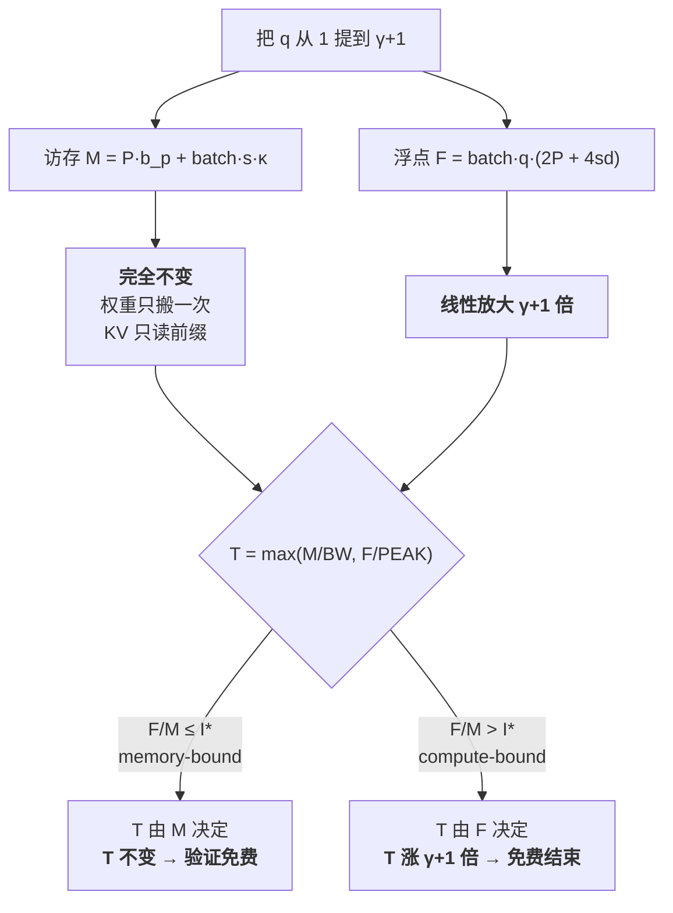
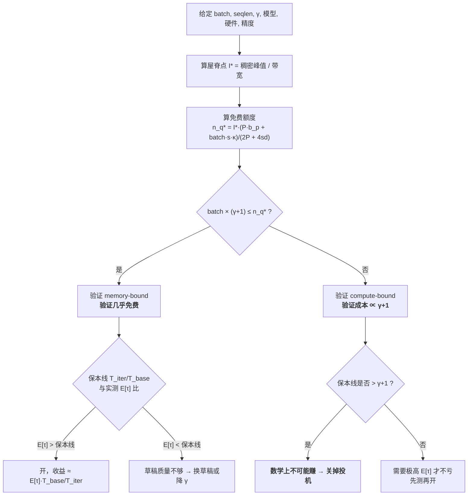

# 03 并行验证为什么几乎免费 —— 算术强度与 roofline

## 1. 一句话

投机采样的全部物理地基是**一条不对称**：一次前向里，**权重的访存字节数与这次喂进去几个 query token 无关**（权重只读一次），而**浮点运算数与 query token 数严格成正比**。当前向被访存卡住时，把 query token 从 1 个加到 $\gamma+1$ 个几乎不加时间。

本篇把这句话从口号变成一条**可判定的临界不等式**，并回答"这个 ≈ 在哪里失效"。核心结论一句话：**免费额度是一个总量 $n_q^\*$，batch 和 $\gamma+1$ 在争抢同一个额度**，$\text{batch}\times(\gamma+1)\le n_q^\*$ 才免费。

---

## 2. 从哪来：那个"分母里的 1"

[[06-期望接受长度与加速比模型-完整推导]] 的 (4.4) 式是整个领域最常被引用的公式：

$$
\text{speedup}=\frac{E[\tau]}{\gamma c+1}
$$

分母里那个孤零零的 $1$ 表示"目标模型跑一次前向"。**它把'验证 $\gamma+1$ 个 token' 和 '生成 1 个 token' 当成了同一件事**。如果这条不成立，分母会变成大约 $\gamma c+(\gamma+1)$，加速比的上限立刻从 $E[\tau]$ 掉到 $E[\tau]/(\gamma+1)\le 1$ —— **投机采样将不只是收益变小，而是根本不存在**。

Chen 等（2023-02）在摘要里就把这条当作方法的前提直接写出来了：

> "the latency of parallel scoring of short continuations, generated by a faster but less powerful draft model, is comparable to that of sampling a single token from the larger target model."
> —— arXiv 2302.01318 摘要原文

**"comparable" 是一个没有口径的词。** 本篇要做的就是把它替换成一个带 batch、seqlen、硬件、精度的不等式。

**与邻篇的分工（别读重了）：**

| 篇目 | 它管什么 | 它已经给到哪 |
|---|---|---|
| [[01-decode为什么慢-带宽墙与算力空转]] | 动机侧：decode 强度 $\approx 1$、算力利用率 0.338% | 给了 $2P$ 与 $4Sd$ 的基本推导、屋脊点 295.4、batch=1 下二分出的 $q\le296$、以及**近似**判据 $B\cdot q\gtrsim295$。它在正文里明说"这条余量有多宽、边界在哪，是 03 的内容，本篇不抢" |
| [[18-batch与吞吐-收益衰减曲线]]、[[19-负收益全解-什么时候投机反而更慢]] | 后果侧：崩塌后的渐近线 $E[\tau]/(\gamma+1)\cdot(1-s)<1$、完整衰减曲线 | 已贴全 `--batch` 的两张扫描表 |

**本篇只补它们之间那一段，且只补三样新东西：**

1. **把近似判据 $B\cdot q\gtrsim I^{*}$ 换成精确闭式** $n_q^{*}$、$b_{\text{crit}}(q)$、$s_{\text{crit}}(q)$，并与数值实现逐点对拍（§4.3–4.4）；
2. **保本线**这张 01/18 都没有的表，以及它揭示的"数学上不可能赚"的格子（§6.3）；
3. **对 `speedup.py` 自身两处口径问题的如实记录**：`!` 标记在实际输出里一次都没出现（§6.3）、attention 项少乘了层数（§7.2）。

---

## 3. 机制拆解

### 3.1 Roofline 的两条线

Roofline 模型（Williams / Waterman / Patterson，CACM 2009）把一个 kernel 的性能上界写成两条线的下包络：一条是带宽线，一条是算力线。NVIDIA 官方的《GPU Performance Background》把判据写得最干脆：

> "an algorithm is memory limited if its arithmetic intensity is lower than the processor's `ops:byte` ratio"
> —— https://docs.nvidia.com/deeplearning/performance/dl-performance-gpu-background/index.html

于是一次前向的时间下界是

$$
T=\max\!\left(\frac{\text{访存字节}}{\text{带宽}},\ \frac{\text{浮点数}}{\text{峰值算力}}\right)
\tag{3.1}
$$

**这里的 $\max$ 是乐观假设**：它默认访存与计算完美重叠。真实 kernel 在最坏情况下退化成两项相加。所以 (3.1) 给的是**时间的下界 / 性能的上界**，本篇后面所有数字都继承这个性质。

### 3.2 屋脊点（ridge point）

两条线的交点：

$$
I^{*}=\frac{\text{峰值算力}}{\text{带宽}}\quad[\text{FLOP/Byte}]
\tag{3.2}
$$

**本库的硬件口径（峰值算力不许裸奔，同段给全三件套）**：

| 项 | 值 | 出处 |
|---|---|---|
| 硬件 | NVIDIA H100 SXM5 | — |
| BF16/FP16 Tensor Core 峰值 | **989.5 TFLOPS（稠密）** | 官方页写 "1,979 teraFLOPS"，脚注 `* With sparsity`；稠密 = 1979/2 |
| 内存带宽 | **3.35 TB/s**（HBM3） | 官方页 "3.35TB/s" |
| 显存容量 | 80 GB | 官方页 "80GB" |
| **屋脊点 $I^{*}$** | **295.4 FLOP/Byte** | $989.5\times10^{12}/3.35\times10^{12}$ |
| 权重/KV 精度 | fp16（2 字节/参数） | 本篇统一口径 |

来源：https://www.nvidia.com/en-us/data-center/h100/ （2026-08-22 抓取核对）。

**如果错用稀疏口径 1979 TFLOPS，屋脊点会变成 590.7 —— 凭空翻倍，"我这个算子受不受带宽限制"的判断整体错一档。** 这是本仓库 `AI芯片对比` 库里同名铁律的直接后果，本篇沿用。

对照两个常见的参照物：A100（312 TFLOPS FP16 稠密 / 1.5 TB/s HBM2e）的屋脊点约 208 FLOP/Byte —— 这就是 kipply 那篇《Transformer Inference Arithmetic》里反复出现的那个数字 208。**屋脊点是硬件属性，与模型无关；算术强度是负载属性，与硬件无关。** 两者相比才得到 bound。

### 3.3 一次前向的三个量

| 量 | 记号 | 依赖什么 | **依赖 query token 数吗** |
|---|---|---|---|
| 权重访存 | $P\cdot b_p$ | 参数量、精度 | **否** |
| KV cache 读 | $\text{batch}\cdot s\cdot \kappa$ | batch、上下文长、层数、KV 头维 | **否** |
| 浮点运算 | $n_q\cdot(2P+4sd)$ | 上面全部 + $n_q$ | **是，线性** |

记号约定（后面全篇通用）：

| 记号 | 含义 | 本篇取值举例 |
|---|---|---|
| $P$ | 目标模型参数量 | llama3-70B：$7.06\times10^{10}$ |
| $b_p$ | 每参数字节数 | fp16 → 2 |
| $L$ | 层数 | 70B：80 |
| $d$ | $d_{\text{model}}$ | 70B：8192 |
| $s$ | 上下文长度（已有前缀） | 1024 / 16384 / 32768 |
| $\kappa$ | 每 token 的 KV 字节数 $=2\cdot L\cdot d_{kv}\cdot b_p$ | 70B：$2\cdot80\cdot1024\cdot2=327680$ B $=320$ KiB |
| $q$ | **每条序列**这次喂进去几个 query token | baseline decode $=1$；验证 $=\gamma+1$ |
| $n_q$ | query token **总数** $=\text{batch}\cdot q$ | — |
| $I^{*}$ | 屋脊点 | H100：295.4 |

**$q$ 就是本篇的主角。** 投机采样做的唯一一件事，就是把 $q$ 从 1 提到 $\gamma+1$，然后祈祷 $T$ 不涨。

---

## 4. 逐步推导

### 4.1 浮点：$2P$ 与 $4sd$ 的来历，以及三条被 01 略过的口径

$y=Wx$ 中 $y_i=\sum_j W_{ij}x_j$ 要 $n$ 乘 $+\,(n-1)$ 加 $\approx 2n$ 次浮点，$m$ 个分量共 $2mn$，而 $mn$ 恰是这层参数量 —— 于是每 query token 的线性层浮点数 $\approx 2P$。attention 侧对**一个** query token、**一层**、**一个头**（头维 $d_h$）：$QK^\top$ 与 $s$ 个 key 做点积共 $2sd_h$，$\text{softmax}(\cdot)V$ 再来 $2sd_h$；对所有头求和（$\sum_h d_h=d$）得**每层 $4sd$**，对 $L$ 层求和得 $4Lsd$。

这两步 [[01-decode为什么慢-带宽墙与算力空转]] §3.3 已经推过，**本节只补它没说、而本篇后面要用的三条口径**：

1. **FMA 算 2 FLOP，与分母口径自洽。** 硬件一条 FMA 做一次乘加，厂商标称峰值 TFLOPS 也按 2 FLOP/FMA 计。若哪家把 FMA 算 1 FLOP，分子分母必须一起改，否则屋脊点整体错一倍。
2. **embedding 是 gather 不是 matmul。** 它的参数计入 $P$ 却几乎不产生浮点运算，所以 $2P$ 对含大词表的小模型是**高估**。草稿模型（llama3.2-1B）恰恰是这一类，**这让本篇对草稿开销的估计偏保守（偏大）**，方向上是安全的。
3. **GQA 不减 attention 的 FLOPs，只减 KV 字节。** 分组查询注意力压的是 $d_{kv}$，但 K/V 会被**广播**到所有 query 头再做乘法，$4sd$ 里的 $d$ 仍是完整的 $d_{\text{model}}$。01 §4.4 讲的是 GQA 对 $\kappa$（访存）的好处，两者不能互相替代 —— **混淆这两件事会让 §4.3 的分子分母同时算错**。

另外，$4Lsd$ 里那个 $L$ 在 `speedup.py` 的实现里被漏掉了。这是一个真实的模型缺陷，量化在 §7.2，**它让本篇更乐观、不会更悲观**。

### 4.2 访存：权重只读一次，KV 只读前缀

$$
M=\underbrace{P\cdot b_p}_{\text{权重}}+\underbrace{\text{batch}\cdot s\cdot \kappa}_{\text{KV cache 读}}
\tag{4.1}
$$

**这里是全篇的枢纽，值得慢一点看。**

- 权重项 $P b_p$：一次前向要把每个权重从 HBM 搬到片上一次。**搬完之后，用它去乘 1 个 token 还是 5 个 token，是同一批权重、同一次搬运。** 这就是"权重访存与 $n_q$ 无关"。
- KV 项：读的是**已有前缀**的 K/V。前缀长度是 $s$，与这次新喂几个 query token 无关。
- 本次新写入的 $q$ 个 token 的 KV（$\text{batch}\cdot q\cdot\kappa$ 字节）在模型里被忽略。$q=5$、$s=1024$ 时它占 KV 读的 0.49%，可忽略；但 $s$ 很短时不可忽略 —— 见 §8。

**把 (4.1) 和 §4.1 并排放，不对称就赤裸裸地出现了：**

$$
M=P b_p+\text{batch}\cdot s\cdot\kappa
\qquad\text{（与 }n_q\text{ 无关）}
$$
$$
F=n_q\cdot(2P+4sd)
\qquad\text{（与 }n_q\text{ 严格成正比）}
$$



**投机采样的全部理由在 D 那一格，它在大 batch 下崩塌的全部理由在 E 那一格。** 整个领域的工程史，可以读成"想尽办法待在 D 里"。

### 4.3 临界不等式

memory-bound 的条件是算术强度不超过屋脊点：

$$
\frac{F}{M}=\frac{n_q(2P+4sd)}{P b_p+\text{batch}\cdot s\cdot\kappa}\ \le\ I^{*}
$$

解出 $n_q$：

$$
\boxed{\ n_q\ \le\ n_q^{*}\ \triangleq\ I^{*}\cdot\frac{P b_p+\text{batch}\cdot s\cdot\kappa}{2P+4sd}\ }
\tag{4.2}
$$

$n_q^{*}$ 就是**免费额度**：一次前向最多能塞进多少个 query token 而不加时间。因为 $n_q=\text{batch}\cdot q$，(4.2) 等价于

$$
\text{batch}\times(\gamma+1)\ \le\ n_q^{*}
\tag{4.3}
$$

**读法（本篇最重要的一句）：batch 和 $\gamma+1$ 在争抢同一个额度。** 把 batch 翻倍，就等于把可用的 $\gamma$ 砍掉一半；反过来也一样。任何只报 $\gamma$ 不报 batch 的投机解码配置都是无法评估的（铁律二）。

**一个漂亮的化简。** fp16 下 $b_p=2$，且忽略 attention 项（$s$ 不太大时 $4sd\ll 2P$），分子的权重项与分母恰好抵消：

$$
n_q^{*}\ \approx\ I^{*}\left(1+\frac{\text{batch}\cdot s\cdot\kappa}{2P}\right),
\qquad
q^{*}=\frac{n_q^{*}}{\text{batch}}\approx I^{*}\left(\frac{1}{\text{batch}}+\frac{s\kappa}{2P}\right)
\tag{4.4}
$$

$q^{*}$ 的第二项**与 batch 无关**。于是 batch $\to\infty$ 时每序列的免费额度有一个**地板**：

$$
q^{*}_{\infty}=I^{*}\cdot\frac{s\,\kappa}{2P}
\tag{4.5}
$$

### 4.4 两个推论：临界 batch 与临界 seqlen

**推论一（临界 batch）。** 令 $\text{batch}\cdot q=n_q^{*}$，解得

$$
b_{\text{crit}}(q)=\frac{I^{*}}{\,q-q^{*}_{\infty}\,}
\qquad(\text{仅当 } q>q^{*}_{\infty}\text{ 时存在})
\tag{4.6}
$$

**推论二（临界 seqlen）。** 当 $q\le q^{*}_{\infty}$ 时 (4.6) 无解 —— **意味着任何 batch 都不会掉出 memory 区**。这给出一个上下文长度阈值：

$$
s_{\text{crit}}(q)\ \text{满足}\ I^{*}\frac{s\kappa}{2P}=q
\quad\Longrightarrow\quad
s_{\text{crit}}(q)\approx\frac{2Pq}{I^{*}\kappa}
\tag{4.7}
$$

上下文比 $s_{\text{crit}}$ 更长时，**"投机在大 batch 下会崩"这句话就不成立了**（还有显存这道独立的墙，见 §7.4）。

**推论一与推论二是本篇给出的、比 `speedup.py` 的扫描表更强的东西**：扫描表只能告诉你"在我扫到的这几个点上翻没翻"，闭式能告诉你**翻转点在哪、以及什么时候根本不存在翻转点**。

**闭式与数值实现逐点对拍（实测，`_lab/speedup.py::fwd_time`）：**

| 口径 | 闭式 $b_{\text{crit}}$ | 数值实测 | 是否吻合 |
|---|---|---|---|
| 70B, fp16, $s=1024$, $q=5$ | **68.7** | batch=68 → `memory`（强度 292.8）；batch=69 → `compute`（强度 296.5） | ✅ |
| 70B, fp16, $s=1024$, $q=1$（基线） | **990.1** | batch=990 → `memory`（295.4）；batch=991 → `compute`（295.5） | ✅ |

（复跑口径：H100 SXM5，BF16 稠密 989.5 TFLOPS / 3.35 TB/s / $I^{*}=295.4$；结论对 TP 度数不敏感，理由见 §4.5。）

### 4.5 一个容易被忽略的不变量：屋脊点与卡数无关

`speedup.py::scale()` 把带宽、算力、容量都按卡数线性放大。于是

$$
I^{*}_{\text{TP}=n}=\frac{n\cdot\text{peak}}{n\cdot\text{BW}}=I^{*}
$$

**屋脊点、算术强度、bound 判定、$n_q^{*}$、$b_{\text{crit}}$、$s_{\text{crit}}$ 全都是 TP 不变量**；变的只有绝对时间（都除以 $n$）和**显存容量**（乘 $n$）。

这条不变性有直接的工程含义：**加卡不能把你从 compute-bound 里救出来**（一阶近似下），它只能让你跑得更快、装得更多。要回到 memory 区，只能改 batch、改 $\gamma$、改上下文长度、或者改精度。

**注意这条不变性正是因为忽略了通信才成立** —— 真实 TP 有 all-reduce，而 all-reduce 在 decode 阶段占比很高且**随卡数变差**，所以真实系统里加卡不但救不了你，还会额外扣分。见 §7.3。

---

## 5. 小数字算例：一次迭代从头算到尾

**完整口径**：target = llama3-70B（$P=7.06\times10^{10}$，$L=80$，$d=8192$，$\kappa=320$ KiB/token）；draft = llama3.2-1B（$P=1.24\times10^{9}$，$\kappa=32$ KiB/token）；$\gamma=4$（故 $q=5$）；batch $=1$；seqlen $=1024$；**8×H100 SXM5（TP=8，忽略通信）**；fp16 权重与 KV；测的是**单请求延迟**（TPOT），不是吞吐。

> 为什么必须是 8 卡：70B 的 fp16 权重是 $7.06\times10^{10}\times2=141$ GB，**单张 80 GB 的 H100 装不下**（`_lab/test_speedup.py::test_70b_does_not_fit_on_one_gpu`）。任何声称"单卡 H100 跑 70B fp16"的配置都不成立。

**第一步：基线前向（$q=1$）**

$$
M=141.2\ \text{GB}+1\times1024\times327680\ \text{B}=141.2+0.335=141.5\ \text{GB}
$$
$$
F=1\times(2\times7.06\times10^{10}+4\times1024\times8192)=1.4124\times10^{11}\ \text{FLOP}
$$

TP=8 的带宽 $=8\times3.35=26.8$ TB/s，算力 $=8\times989.5=7916$ TFLOPS：

$$
T_{\text{mem}}=\frac{1.4153\times10^{11}}{2.68\times10^{13}}=\mathbf{5.2812\ \text{ms}},\qquad
T_{\text{cmp}}=\frac{1.4124\times10^{11}}{7.916\times10^{15}}=0.0178\ \text{ms}
$$

$T=\max=5.2812$ ms，**memory-bound，算力只用掉 0.34%**。

**第二步：验证前向（$q=5$）**

$M$ 一个字节都不变（权重同一批、KV 同一段前缀），$F$ 乘 5：

$$
T_{\text{mem}}=\mathbf{5.2812\ \text{ms}}\ (\text{不变}),\qquad
T_{\text{cmp}}=0.0892\ \text{ms}
$$

$T=5.2812$ ms。**验证 5 个 token 与生成 1 个 token 的比值 $=1.000000$。**

代入 (4.4) 核对免费额度：$n_q^{*}=295.4\times(1+0.002376)=296.0$。**batch=1 时可用额度是 296 个 query token，$\gamma+1=5$ 只用掉 1.7%** —— 这就是"几乎免费"的量化版本。想把它用满，$\gamma$ 得开到 295。

**第三步：草稿的 4 次串行前向**

草稿是 1B，$M_{\text{draft}}=2.48\ \text{GB}+1024\times32768\ \text{B}=2.514$ GB，每次

$$
T_{\text{draft}}=\frac{2.514\times10^{9}}{2.68\times10^{13}}=0.0938\ \text{ms}
$$

4 次串行共 $0.3752$ ms。相对成本 $c=0.0938/5.2812=\mathbf{0.0178}$。

**第四步：合账**

$$
T_{\text{iter}}=0.3752+5.2812=5.6563\ \text{ms},\qquad
\text{草稿占迭代}=\frac{0.3752}{5.6563}=\mathbf{6.63\%}
$$

取 $E[\tau]=3.0$：

$$
\text{speedup}=\frac{E[\tau]\cdot T_{\text{base}}}{T_{\text{iter}}}=\frac{3.0\times5.2812}{5.6563}=\mathbf{2.801}
$$

保本线：$T_{\text{iter}}/T_{\text{base}}=5.6563/5.2812=\mathbf{1.071}$ —— 只要平均每轮产出超过 1.071 个 token 就不亏。

**第五步：把 batch 推到 512，同样的算式**

$$
T_{\text{base}}=11.6791\ \text{ms}\ (\text{memory}),\qquad
T_{\text{verify}}=45.6743\ \text{ms}\ (\textbf{compute})
$$

比值 $=\mathbf{3.911}$。**同一个 $\gamma$、同一个 $E[\tau]=3.0$，加速比从 2.801 掉到 0.721** —— 慢了 28%。变的不是接受率，变的是那个 $\max$ 选了另一条腿。

---

## 6. 代码验证

### 6.1 `--roofline`：q 从 1 变 5 时 T 怎么动

复跑：`python _lab/speedup.py --roofline`。

**口径声明（很重要）**：这张表用的是**单卡 H100 SXM5** 的带宽与算力（3.35 TB/s / 989.5 TFLOPS 稠密 / fp16）。70B 在单卡上放不下，所以**那几行的绝对毫秒数不是可实现的延迟**；但由于 `scale()` 把带宽与算力同倍放大，**`bound` 判定与算术强度是 TP 不变量**（§4.5），表的结论对任意 TP 度数都成立。要看可实现的绝对时间，请用 §5 的 TP=8 算例。

**llama3-70B（$P=70.60$B，$\kappa=320$ KiB/token）实测：**

| batch | seqlen | q/seq | t_mem(ms) | t_cmp(ms) | bound | T(ms) | 算术强度 |
|---|---|---|---|---|---|---|---|
| 1 | 1024 | 1 | 42.249 | 0.143 | memory | 42.249 | 1.00 |
| 1 | 1024 | **5** | 42.249 | 0.714 | memory | **42.249** | 4.99 |
| 1 | 32768 | 1 | 45.354 | 0.144 | memory | 45.354 | 0.94 |
| 1 | 32768 | **5** | 45.354 | 0.719 | memory | **45.354** | 4.68 |
| 64 | 1024 | 1 | 48.560 | 9.135 | memory | 48.560 | 55.56 |
| 64 | 1024 | **5** | 48.560 | 45.674 | memory | **48.560** | 277.82 |
| 256 | 1024 | 1 | 67.791 | 36.539 | memory | 67.791 | 159.21 |
| 256 | 1024 | **5** | 67.791 | **182.697** | **compute** | **182.697** | **796.03** |
| 256 | 32768 | 1 | 862.680 | 36.809 | memory | 862.680 | 12.60 |
| 256 | 32768 | **5** | 862.680 | 184.043 | memory | **862.680** | 63.01 |

（实测；复跑命令见上。算术强度列由 `fwd_time()` 的 `intensity` 字段给出，屋脊点 295.4 作对照。）

**逐行读法**（"$q$ 从 1 变 5 而 `T(ms)` 不动"这一条 [[01-decode为什么慢-带宽墙与算力空转]] 已经读过，下面四条是本篇加的：**算术强度那一列**，以及它与 §4.4 闭式的逐格对照）：

1. **前 8 行，$q$ 从 1 变 5，`T(ms)` 一个数字都没动。** `t_cmp` 老老实实涨了 5 倍，但它一直躲在 `t_mem` 的影子里 —— **免费不是因为算得快，是因为算得再多也还在等内存**。强度那一列给出了"还差多远"：batch=1 时只有 4.99，离 295.4 还有 59 倍余量。
2. **`64 / 1024 / q=5` 那一行是刀尖上**：算术强度 277.82，屋脊点 295.4，只差 6%。这正是 (4.6) 给出的 $b_{\text{crit}}(5)=68.7$ —— 闭式说 68 是最后一格，表里 batch=64 果然还在 memory 区，再往上一档就掉下去。**这一格恰好是近似判据与精确闭式分道扬镳的地方**：01 用的近似式（忽略分子里的 KV 项）给 $n_q^{*}\approx I^{*}=295.4$，而 $64\times5=320>295.4$ 会落到 compute 那一侧；(4.2) 把 KV 项算进分子后额度是 **340.2**，$320<340.2$ 判 memory —— **与 `fwd_time()` 的实际输出一致**。01 已把那条标为"近似判据"，本篇补的正是它在边界附近不够用的这一段。
3. **`256 / 1024 / q=5` 是唯一翻转的一行**：强度 796.03 远超 295.4，$T$ 从 67.791 跳到 182.697，**倍数是 2.70 而不是 5**（因为基线那一行还在 memory 区，$T$ 只需涨到 compute 线上，不是涨 5 倍）。**"验证成本变 $\gamma+1$ 倍"这个说法只在基线也已经 compute-bound 时才准。**
4. **最后两行是本篇最反直觉的地方**：batch 同样是 256，只把上下文从 1024 换成 32768，**验证又免费了**。原因在 (4.4)：KV 项 $\text{batch}\cdot s\cdot\kappa$ 把 $M$ 撑大 12.7 倍，额度跟着涨。代入 (4.7)：$s_{\text{crit}}(5)\approx 7307$ tokens —— **上下文超过约 7.3k 之后，$\gamma=4$ 的验证在任何 batch 下都不会掉出 memory 区**。18 与 22 观察到了"长上下文那段不翻转"这个现象，本篇给出的是**它从哪个长度开始成立**。

llama3-8B 那一块给出同一现象的另一个刻度：`256 / 1024 / q=5` 也翻转（15.051 → 20.797 ms），闭式给 $b_{\text{crit}}(5)=116.4$，$s_{\text{crit}}(5)\approx2079$ —— **模型越小、KV 越重，翻转来得越早（因为 $2P$ 变小，$q^{*}_\infty$ 变大得更快）**。这条对"给小模型开投机"的直觉是个提醒。

### 6.2 `--batch`：草稿开销到底占多少

复跑：`python _lab/speedup.py --batch`。

**完整口径**：target = llama3-70B，draft = llama3.2-1B，$\gamma=4$，**8×H100 SXM5（TP=8，带宽/算力/容量按 8 倍线性放大，忽略通信）**，fp16，$E[\tau]=3.0$ 固定（**只改 batch，不改接受率**），测的是**吞吐 tokens/s（全 batch 合计）**。

**完整的两张扫描表（含吞吐与加速比）已由 [[18-batch与吞吐-收益衰减曲线]] 逐行贴出并分析，本节不重复。** 这里只抽出它没有展开、而本篇必须回答的那一列：**草稿的 $\gamma$ 次串行前向到底占多少**。

| seqlen | batch=1 | 16 | 64 | 128 | 256 | 384 | 512 | 768 | 1024 |
|---|---|---|---|---|---|---|---|---|---|
| **1024** | 6.6% | 7.6% | **10.2%** | 8.1% | 6.8% | 6.3% | 6.0% | 5.8% | **5.7%** |
| **16384** | 7.6% | 16.3% | **23.3%** | 装不下 | 装不下 | 装不下 | 装不下 | 装不下 | 装不下 |
| （1024 的验证阶段） | mem | mem | mem | **cmp** | cmp | cmp | cmp | cmp | cmp |

（实测；复跑命令见上。"装不下"= `feasible()` 判定 8×H100 的 640 GB 放不下权重 + KV。）

**四条读法：**

- **实测区间是 5.7% – 23.3%**（全部 12 个可行格子）。注意这**不是**一个"草稿开销大约 6%"的常数，它在本模型口径下就已经跨了 4 倍。
- **随 seqlen 显著变大**：seqlen 从 1024 到 16384，batch=64 那一格从 10.2% 涨到 23.3%。机制是草稿模型的权重很轻（1.24B fp16 = 2.48 GB），它的访存账里 KV 项占比天然更高，**长上下文对草稿的相对打击远大于对目标模型的**。§7.2 会说明真实涨幅比这更陡（`speedup.py` 少算了草稿的 attention）。展开见 [[22-长上下文下的投机采样]]。
- **随 batch 反而变小**（1024 那一行从 10.2% 掉到 5.7%）—— **但这是个陷阱**。占比 = 草稿时间 / 迭代时间；草稿时间几乎没变，掉下去是因为**分母（验证时间）膨胀了**。对照最后一行就能看见：占比开始下降的那一格（batch=128），恰恰是"验证阶段"从 `mem` 翻成 `cmp` 的那一格。**用"草稿开销占比下降"论证"投机在大 batch 下更划算"是彻底的因果倒置**（见 [[26-社区精彩解释精选-好在哪与错在哪]]）。
- **5.7%–23.3% 是乐观下界。** 它只算了草稿的 GEMM 与 attention 主项。真实系统里草稿的 $\gamma$ 次前向**每次**都要付一整轮 kernel launch、采样、调度，而草稿单次前向只有 **0.0938 ms**（§5 第三步实测）—— **在这个尺度上固定开销与计算时间同量级**。§7.4 展开。

**这张表最该被记住的一点**：从 batch=64 到 128，草稿占比**下降**了（10.2% → 8.1%），接受率、$\gamma$、模型、硬件一个字没改，而 [[18-batch与吞吐-收益衰减曲线]] 里同两格的加速比是 2.693 → 1.658。**唯一变的是最后一行那个 mem → cmp。** 崩塌曲线的完整分析归 18 与 [[19-负收益全解-什么时候投机反而更慢]]，本篇到边界为止。

### 6.3 `--breakeven`：保本线，以及一处必须点名的口径差

复跑：`python _lab/speedup.py --breakeven`。

**完整口径**：target = llama3-70B，$\gamma=4$（故 $E[\tau]$ 的理论上限是 5），**4×H100 SXM5（TP=4，显存合计 320 GB，忽略通信）**，fp16。表格数字是"要不亏本，$E[\tau]$ 至少要多大"。

**draft = llama3.2-1B（$P=1.24$B）：**

| batch | seqlen=1024 | seqlen=8192 | seqlen=32768 |
|---|---|---|---|
| 1 | 1.07 | 1.08 | 1.09 |
| 8 | 1.08 | 1.11 | 1.19 |
| 32 | 1.09 | 1.20 | 装不下 |
| 64 | 1.11 | 装不下 | 装不下 |
| 128 | 1.81 | 装不下 | 装不下 |
| 256 | **2.89** | 装不下 | 装不下 |

**draft = eagle-head（$P=0.60$B）：**

| batch | seqlen=1024 | seqlen=8192 | seqlen=32768 |
|---|---|---|---|
| 1 | 1.03 | 1.03 | 1.04 |
| 8 | 1.03 | 1.04 | 1.04 |
| 32 | 1.04 | 1.04 | 装不下 |
| 64 | 1.04 | 1.04 | 装不下 |
| 128 | 1.70 | 装不下 | 装不下 |
| 256 | **2.74** | 装不下 | 装不下 |

（实测；复跑命令见上。）

**⚠️ 三条必须点名的口径事项：**

**(1) 这张表是 TP=4，上一张是 TP=8。两张表的数字不能混用。**
`_batch()` 用 8 卡是为了把 batch 扫到 1024 而不撞显存墙；`_breakeven()` 用 4 卡。差别不在时间（$b_{\text{crit}}$、保本线都是 TP 不变量，§4.5），**差别全在"装不下"那些格子上** —— 容量按卡数放大，TP=4 只有 320 GB，TP=8 有 640 GB。所以同一个 (batch, seqlen) 在两张表里可能一个能算、一个不能算。**把两张表的数字放进同一个比较里就是违反铁律二。**

**(2) 表里没有任何一个带 `!` 的格子 —— 这与 `speedup.py` 自己的"读法"文案不符，本篇如实记录。**
源码在保本线大于 5（超过 $\gamma+1$ 的理论上限）时会追加一个 `!`，并在结尾写"表里带 `!` 的格子意味着无论接受率多高都不可能保本"。**但在 TP=4 的实际输出里，`!` 一次都没出现，最大值只有 2.89。** 原因是可行性过滤：真正会触发 `!` 的大 batch 格子（batch $\ge$ 512）在 TP=4 的 320 GB 下全部是"装不下"，而循环最大只扫到 batch=256。

补齐这个空缺（TP=8，640 GB，其余口径不变）：

| batch | 保本线（draft=1B） | 保本线（draft=eagle-head） | 显存 | 判定 |
|---|---|---|---|---|
| 256 | 2.89 | 2.74 | 238 GB | 需要 $E[\tau]\ge2.89$ 才不亏 |
| 512 | 4.16 | 3.95 | 333 GB | 已经很难达到 |
| 768 | 4.89 | 4.65 | 427 GB | 逼近上限 5 |
| 1024 | **5.30 `!`** | **5.04 `!`** | 522 GB | **超过 $\gamma+1=5$，无论接受率多高都不可能赚** |

（实测；复跑：`python -c "from speedup import *; print(breakeven_accept_len('llama3-70b','llama3.2-1b',scale(H100,8),1024,1024,4))"`，在 `_lab` 目录下执行。该断言由 `_lab/test_speedup.py::test_breakeven_can_exceed_theoretical_max` 守住。）

**`5.30 > 5` 这个格子是本篇最强的一条结论**：$\gamma=4$ 时一次迭代最多产出 5 个 token（全接受 + 赠品），而保本需要 5.30 个。**这不是"接受率不够高"的问题，是数学上的不可能。** 在这个工作点上，唯一正确的做法是**把投机关掉**。

**(3) 保本线为什么恒大于 1。**
草稿的 $\gamma$ 次前向总要花时间，$T_{\text{iter}}>T_{\text{base}}$ 恒成立，所以 $E[\tau]=1$（每轮只产出 1 个 token，即首个草稿就被拒）必然是纯亏。这条由 `_lab/test_speedup.py::test_breakeven_always_above_one` 守住。对比两个草稿也很直观：**草稿从 1.24B 换成 0.6B 的单层头，batch=1 的保本线从 1.07 掉到 1.03** —— 这正是历史上从"独立小模型草稿"转向"单层草稿头"的物理动力（[[13-EAGLE三代-特征级自回归的演进]]）。

### 6.4 判定流程



---

## 7. 口径与坑

### 7.1 本模型的乐观性：五项显式声明

**本篇给出的全部时间与加速比都是乐观上界，不是实测值。真实系统的崩塌点只会来得更早。** 被忽略的东西，按影响从大到小：

| # | 被忽略的项 | 为什么让结果偏乐观 |
|---|---|---|
| 1 | **TP 通信（all-reduce）** | `scale()` 把带宽/算力按卡数线性放大，**完全没算 all-reduce**。而 all-reduce 在 decode 阶段占比很高（每层两次、消息很小、被延迟而非带宽支配），且随卡数变差。真实 TP=8 的有效带宽远达不到 8×3.35 TB/s。 |
| 2 | **$\max$ 而非求和** | (3.1) 默认访存与计算完美重叠。真实 kernel 在最坏情况下退化成 $T_{\text{mem}}+T_{\text{cmp}}$，那时"验证免费"直接变成"验证要多花 $T_{\text{cmp}}$"。 |
| 3 | **norm / softmax / RoPE / 逐元素算子** | FLOPs 小但访存不小，且大量是 memory-bound 的小 kernel。它们会**同时**抬高 $M$ 和固定开销。 |
| 4 | **kernel launch 与调度** | 见 §7.4。草稿单次前向只有 0.09 ms 量级，固定开销与之同量级。 |
| 5 | **激活显存与碎片** | `feasible()` 只算权重 + KV，因此"装得下"的判定也偏乐观，真实可用 batch 更小。 |

**请不要把本篇任何数字当成 benchmark 结果引用。** 它们是"在最有利于投机采样的假设下能拿到的上限"。

### 7.2 一处必须点名的模型缺陷：attention FLOPs 少乘了层数

`speedup.py` 的浮点公式写的是

```python
flops = n_q * (2 * model["P"] + 4 * seqlen * model["d_model"])
```

按 §4.1 的推导，attention 项应当是 $4\cdot L\cdot s\cdot d$（每层 $4sd$，共 $L$ 层）。**代码里少乘了层数 $L$。** 本篇如实量化这个缺口（70B，$L=80$，$d=8192$，$2P=1.412\times10^{11}$）：

| seqlen | 代码的 attention 项 / $2P$ | 补上 $L=80$ 后 / $2P$ |
|---|---|---|
| 1024 | 0.024% | 1.9% |
| 8192 | 0.19% | 15.2% |
| 16384 | 0.38% | 30.4% |
| 32768 | 0.76% | **60.8%** |

（实测计算，口径同上。）

**这个缺口对本篇结论的影响：**

- **短上下文（$s\le$ 4k）：几乎无影响。** $b_{\text{crit}}(5)$ 在 $s=1024$ 从 68.7 变成 67.2（差 2%），在 $s=4096$ 从 134.4 变成 114.8。表里所有 `bound` 判定**一个都不翻**。
- **长上下文：方向一致，幅度变小。** $s_{\text{crit}}(5)$ 从约 7307 变成约 8437 tokens；$s=8192$ 时 $b_{\text{crit}}(5)$ 从"不存在"变成 2036 —— 但 batch=2036 在任何现实显存下都装不下，所以工程结论不变。
- **对轻量草稿影响最大。** llama3.2-1B 在 $s=32768$ 时，正确的 attention 项是 $2P$ 的 **173%** —— 也就是说**长上下文下草稿模型的 attention 已经比它的全部权重乘法还贵**。这解释了 §6.2 里"草稿占迭代"随 seqlen 从 6.6% 涨到 23.3%（batch=64 那一格 10.2% → 23.3%），而且说明真实涨幅比这更陡。

**这个缺陷让本模型更乐观，不会更悲观**（少算了浮点数 → 更容易判成 memory-bound → 更容易说"免费"）。本篇不改 `speedup.py`（它是主持人写好的基座，语义不改），而是把偏差量化后写在这里，并把"长上下文下真实曲线比模型更陡"作为结论交给 [[22-长上下文下的投机采样]]。

### 7.3 屋脊点是排除法工具，不是预测工具

一个高频误用：看到算术强度 796 > 屋脊点 295，就说"这个 kernel 能跑到 989.5 TFLOPS"。**不能。** 屋脊点给的是必要条件不是充分条件：

- **低于屋脊点 → 一定拿不到峰值算力。** 这是硬结论，可以放心用来排除。
- **高于屋脊点 → 只是"有可能"吃到算力。** 实际达成率取决于 tile 形状、L2 命中、tensor core 利用、SM 占用等等。本仓库 `AI芯片对比` 库记录的 H100 BF16 GEMM 第三方实测达成率约 73%（约 720 TFLOP/s），MI300X 更低。

所以本篇的 `compute` 那些格子，真实时间比表里**更长**，加速比比表里**更低**。

### 7.4 验证的隐藏成本：模型里一项都没有

本篇的 (3.1) 只有两项，真实一次投机迭代至少还有五项：

1. **草稿的 $\gamma$ 次串行前向。** 这一项**在模型里**（§6.2 的 5.7%–23.3%），但它是**串行**的 —— $\gamma$ 次前向不能并行，成本线性涨而收益指数饱和（[[06-期望接受长度与加速比模型-完整推导]] §4.5）。这也是树形草稿要解决的问题（[[16-树形草稿与树注意力-mask构造与验证]]）。
2. **kernel launch 与 CPU 开销。** PyTorch 官方 gpt-fast 那篇博客的第一节就是"heavily CPU overhead bound"，朴素实现只有 25.5 tok/s，加了 `torch.compile` + 静态 KV cache 后跳到 107.0 tok/s（口径：A100-80GB 限功耗 330 W，Llama-7B，**batch=1，测延迟**）。**4 倍的差距全部来自 launch 开销。** 投机采样每轮要发起 $\gamma+1$ 次前向而不是 1 次，**这项开销按轮数放大**，而草稿单次前向只有 0.09 ms 量级 —— 固定开销与之同量级甚至更大。这是本模型完全没有、而真实系统里经常决定成败的一项。
3. **KV cache 的写入与回滚。** 验证时 $\gamma+1$ 个 token 的 KV 都会被写进 cache；一旦第 $k$ 位被拒，后面 $\gamma-k$ 个槽位必须**回滚/丢弃**。模型只算了 KV **读**，没算这次写（$\text{batch}\cdot q\cdot\kappa$，$q=5$/$s=1024$ 时是 KV 读的 0.49%，可忽略）与回滚的簿记（不可忽略：它是 cache 管理逻辑，不是带宽）。树形草稿下还要按被选中的路径**压实**，更贵。
4. **采样与验证判据本身。** 每个位置要算 $\min(1,p/q)$、抽均匀随机数、拒绝时从残差分布 $p'=\mathrm{norm}(\max(0,p-q))$ 重采（[[04-拒绝采样修正-无损性的完整证明]]）。这些是词表大小 $|V|$ 的逐元素操作，$|V|\sim 10^5$ 时不算小，而且它是**串行依赖**的：第 $i$ 位的判定要等第 $i-1$ 位。
5. **调度器开销。** 每轮迭代实际产出 $\tau$ 个 token 是**随机变量**，连续批处理的调度器必须处理"这一轮各请求产出不同"的情况；prefix cache、chunked prefill 都要跟着适配。工程细节见 [[20-主流引擎实现-vLLM与SGLang与TensorRTLLM]]。

**判据**：本篇的模型说"草稿占 6.6%"，如果你的实测草稿占比是 30%，**不要先怀疑带宽账，先去看 kernel launch 和采样开销**。

### 7.5 精度改的是带宽账，不是算力账

`fwd_time()` 的 `bytes_per_param` 参数直接改 $M$。把权重从 fp16 换成 int8，$M$ 的权重项减半，$T_{\text{mem}}$ 减半 —— **但 $F$ 一个字都不变**（weight-only 量化的计算仍在 bf16 里做）。后果是**算术强度翻倍，免费额度 $n_q^{*}$ 减半**：

$$
n_q^{*}(\text{fp16})\approx I^{*}\left(1+\frac{\text{batch}\cdot s\kappa}{2P}\right)
\quad\longrightarrow\quad
n_q^{*}(\text{int8})\approx I^{*}\left(\frac{1}{2}+\frac{\text{batch}\cdot s\kappa}{2P}\right)
$$

（推导：$b_p$ 从 2 变 1，分子的权重项 $Pb_p$ 从 $2P$ 减半到 $P$，而分母 $2P+4sd$ 不变。）

**量化让 decode 变快，同时让投机采样更早崩。** 这两件事必须一起报，只报前者是常见的口径事故。展开见 [[23-与其它优化的相互作用-量化与KVcache与PD分离]]。

---

## 8. 失效条件（铁律三）

"验证几乎免费"在以下情形失效，按可判定性排序：

1. **$\text{batch}\times(\gamma+1)>n_q^{*}$（最硬的一条）。** 由 (4.2) 判定。等价形式：$\text{batch}>b_{\text{crit}}(\gamma+1)=I^{*}/(\gamma+1-q^{*}_\infty)$。**实测锚点**：llama3-70B / fp16 / H100（任意 TP）/ seqlen=1024 / $\gamma=4$，**$b_{\text{crit}}=68.7$**，batch=68 是 memory、batch=69 是 compute。越过这条线后验证成本按 $\gamma+1$ 线性涨。
2. **保本线超过 $\gamma+1$（最终判决）。** 同上口径、TP=8、batch=1024 时保本线 **5.30 > 5**，**无论接受率多高都不可能赚**。此时唯一正确动作是关掉投机，不是调 $\gamma$、不是换草稿。
3. **上下文太短。** (4.5) 的地板 $q^{*}_\infty=I^{*}s\kappa/(2P)$ 随 $s$ 线性缩小。$s$ 很短时（几十到几百 token）KV 项几乎为零，免费额度退化成 $n_q^{*}\approx I^{*}=295.4$ 这个常数，于是 batch 稍大就越线。**"投机在大 batch 下会崩"这句流行说法的隐含前提是短上下文**；本篇给出的阈值是 $s_{\text{crit}}(\gamma+1)\approx 2P(\gamma+1)/(I^{*}\kappa)$，70B/$\gamma=4$ 时约 **7307 tokens**（补上层数因子后约 8437）。
4. **权重被量化。** §7.5：int8 weight-only 让 $n_q^{*}$ 大约减半，int4 减到四分之一。**量化与投机是互相挤压的两个优化**，不是叠加的。
5. **KV cache 被压缩或卸载。** 减小 $\kappa$（MLA、KV 量化、KV 淘汰）会同时减小免费额度 —— 与量化同一个机制。KV 卸载到 CPU/NVMe 则改的是"带宽"那一项本身，roofline 的分母不再是 HBM 带宽。
6. **草稿与目标共享同一批 GPU 且争抢资源。** 本模型假设两者串行独占硬件。若并发执行（例如草稿跑在另一个 stream 上），$c$ 不再是常数。
7. **树形草稿把 $q$ 变成节点总数。** 树的成本由节点总数决定，(4.2) 里的 $\gamma+1$ 要换成树的节点数；一棵 64 节点的树在 batch=8 时就已经吃掉 512 个免费额度。见 [[16-树形草稿与树注意力-mask构造与验证]]。
8. **动态 $\gamma$。** $\gamma$ 变成随机变量后，$n_q$ 每轮不同，"是否越线"成了逐轮判定。见 [[17-动态草稿长度与自适应停止]]。
9. **小 kernel 区（本模型完全看不到）。** batch 与 $\gamma$ 都极小时，真实瓶颈既不是带宽也不是算力，而是 §7.4 的固定开销。这时 roofline 的两条腿都不对，`speedup.py` 的所有数字都不适用。

**一条速判**：拿到一个"投机解码提速 N 倍"的数字，先问 **batch × (γ+1) 是多少**、**seqlen 是多少**。这两个数不给，(4.2) 就算不出来，那个 N 倍就无法评估。

---

## 9. 自测题

1. 为什么"权重访存与 query token 数无关"这一条，比"attention 可以并行"更根本？
   <details><summary>答案要点</summary>"attention 可以并行"只说明多个 token 的计算没有数据依赖，那是**算力侧**的性质；但 decode 的瓶颈根本不在算力（§5 算例里算力只用掉 0.34%）。真正让验证免费的是**访存侧**：权重搬一次就够用，$M$ 与 $n_q$ 无关，于是在 memory-bound 区多算的部分完全被隐藏。如果 decode 是 compute-bound 的，attention 再怎么可并行，验证 $\gamma+1$ 个 token 也要花 $\gamma+1$ 倍时间 —— 投机采样就不存在了。</details>

2. 某人报告"在 8×H100 上用 EAGLE 把 70B 提速 2.7 倍"。按本篇，你至少要追问哪两个数？为什么这两个最关键？
   <details><summary>答案要点</summary>**batch 和 seqlen**。因为 (4.2) 的免费额度 $n_q^{*}=I^{*}(Pb_p+\text{batch}\cdot s\kappa)/(2P+4sd)$ 只由这两个数（加 $\gamma$ 和模型）决定，而加速比在越过 $b_{\text{crit}}$ 前后能从 2.693 翻转到 0.721（[[18-batch与吞吐-收益衰减曲线]] 的扫描表，batch 64→512；本篇 §5 第五步给出同一翻转的逐步算式）。$\gamma$ 和硬件通常会给，接受率可以估，唯独 batch 和 seqlen 最常被省略且影响最大。附带追问精度（§7.5 量化让额度减半）。</details>

3. seqlen=1024 时 batch=256 的验证是 compute-bound，seqlen=32768 时同样 batch=256 却是 memory-bound。用 (4.4) 解释，并说明"那把上下文加长就能一直开投机"错在哪。
   <details><summary>答案要点</summary>(4.4)：$q^{*}=I^{*}(1/\text{batch}+s\kappa/2P)$，第二项随 $s$ 线性增长。$s$ 从 1024 到 32768 涨 32 倍，KV 项把 $M$ 撑大 12.7 倍，免费额度跟着涨，于是 $q=5$ 又落回额度内。错在忽略**第二堵墙：显存**。§6.2 那张表的 seqlen=16384 行里，batch $\ge$ 128 全部是"装不下"（8×H100 合计 640 GB）。长上下文用**容量约束**换掉了**算力约束**，不是免除了约束。</details>

4. `--batch` 表里 seqlen=1024 这一列，草稿占迭代从 batch=64 的 10.2% 掉到 batch=1024 的 5.7%。这是好消息吗？
   <details><summary>答案要点</summary>不是。占比 = 草稿时间 / 迭代时间。草稿时间几乎没变（草稿在这些 batch 下仍是 memory-bound），掉下去是因为**分母的验证时间膨胀了**（验证进了 compute 区，按 $\gamma+1$ 线性涨）。同一段区间里加速比从 2.693 崩到 0.566。把"草稿开销占比下降"读成"投机更划算"是因果倒置。判据：**看占比之前先看 `验证阶段` 那一列**。</details>

5. 有人说"我们加到 16 卡，通信开销摊薄了，投机采样在大 batch 下就不崩了"。对吗？
   <details><summary>答案要点</summary>不对，而且方向反了。第一，$I^{*}=\text{peak}/\text{BW}$ 在一阶近似下**与卡数无关**（§4.5），$n_q^{*}$、$b_{\text{crit}}$、$s_{\text{crit}}$ 全是 TP 不变量 —— 加卡让绝对时间变短，但**不改变你落在哪个区**。第二，加卡会让 all-reduce **更差**不是更好（decode 阶段消息小、延迟主导），而本模型恰恰把通信忽略了，所以真实系统里加卡后崩塌只会更早。要回到 memory 区，能动的只有 batch、$\gamma$、seqlen、精度这四个旋钮。</details>

6. `--breakeven` 的输出里为什么一个 `!` 都没有，而 `test_breakeven_can_exceed_theoretical_max` 却断言保本线能超过 5？两者矛盾吗？
   <details><summary>答案要点</summary>不矛盾，是口径不同。`_breakeven()` 用 **TP=4**（320 GB）且 batch 只扫到 256，而真正触发 `!` 的格子在 batch $\ge$ 1024，那些格子在 TP=4 下全是"装不下"，被可行性过滤掉了。测试用 **TP=8**（640 GB），batch=1024 装得下，保本线 5.30 > 5。这正是本篇反复强调的：**两张表 TP 度数不同，数字不可混用**；也说明源码的"读法"文案描述的是一个在该表口径下不会出现的现象。</details>

---

## 10. 延伸与双链

- 前置动机（decode 为什么慢）：[[01-decode为什么慢-带宽墙与算力空转]]
- 最小闭环（先跑起来再看物理账）：[[02-最小可跑的投机采样-手算一遍]]
- 本篇撑起的那个"分母里的 1"：[[06-期望接受长度与加速比模型-完整推导]]
- 免费额度被树吃掉：[[16-树形草稿与树注意力-mask构造与验证]]、[[17-动态草稿长度与自适应停止]]
- 崩塌的完整分析（本篇只到边界为止）：[[18-batch与吞吐-收益衰减曲线]]、[[19-负收益全解-什么时候投机反而更慢]]
- 长上下文为什么反而更安全（以及显存这堵墙）：[[22-长上下文下的投机采样]]
- 量化 / KV 压缩与投机互相挤压：[[23-与其它优化的相互作用-量化与KVcache与PD分离]]
- 草稿成本 $c$ 的历史压缩路线：[[13-EAGLE三代-特征级自回归的演进]]
- 工程实现里的隐藏开销：[[20-主流引擎实现-vLLM与SGLang与TensorRTLLM]]
- 接受率怎么测才不被口径坑：[[05-接受率alpha-定义口径与怎么测]]
- 两篇奠基论文怎么表述"parallel scoring 同价"：[[09-2023奠基-两篇同期论文的异同]]
- 社区在这条物理账上的高频错误：[[26-社区精彩解释精选-好在哪与错在哪]]、[[27-常见误解与判据]]

---

### 本篇验证

- `_lab/test_speedup.py::test_ridge_point_value` —— 屋脊点 $I^{*}=989.5\times10^{12}/3.35\times10^{12}\approx295.4$ FLOP/Byte（验证 §3.2 与全篇的判据基准）。
- `_lab/test_speedup.py::test_weights_read_once_regardless_of_query_tokens` —— **本篇的核心不对称**：`q_per_seq` 从 1 变到 9，`t_mem` 差值 $<10^{-15}$，即访存字节与 query token 数完全无关（验证 §4.2）。
- `_lab/test_speedup.py::test_decode_is_memory_bound_at_batch_one` —— batch=1 的基线 decode 算术强度 $<5$，远低于屋脊点 295.4（验证 §5 第一步）。
- `_lab/test_speedup.py::test_verify_is_nearly_free_in_memory_bound_region` —— memory 区里验证 5 个 token 与 1 个的时间比 $<1.01$（验证 §5 第二步的"比值 1.000000"）。
- `_lab/test_speedup.py::test_verify_stops_being_free_in_compute_bound_region` —— compute 区里（TP=8, batch=512, seqlen=1024）该比值 $>2.0$，实测 3.911（验证 §5 第五步与 §8 第 1 条）。
- `_lab/test_speedup.py::test_70b_does_not_fit_on_one_gpu` —— 70B fp16 权重 141 GB > 单卡 80 GB，因此 §5/§6.2/§6.3 必须用多卡口径（验证 §5 的口径声明与 §6.1 的单卡表注意事项）。
- `_lab/test_speedup.py::test_breakeven_always_above_one` —— 保本线恒 $>1$：草稿总要花时间（验证 §6.3 第 (3) 条）。
- `_lab/test_speedup.py::test_lighter_draft_lowers_breakeven` —— 草稿越轻保本线越低（验证 §6.3 的 1.07 → 1.03）。
- `_lab/test_speedup.py::test_breakeven_can_exceed_theoretical_max` —— **本篇最强结论**：TP=8、batch=1024、seqlen=1024、$\gamma=4$ 时保本线 $>5=\gamma+1$，无论接受率多高都不可能赚（验证 §6.3 的补表与 §8 第 2 条）。
- `_lab/test_speedup.py::test_model_specs_self_consistent` —— 三个模型的 $P$、$\kappa$、$d_{\text{model}}$ 自洽，且 $\kappa$ 必为 $4L$ 的整数倍（$\kappa=2\cdot L\cdot d_{kv}\cdot 2$，验证 §3.3 的记号表）。
- 可复跑（在 `_lab/` 目录下执行）：
  - `python speedup.py --roofline` —— §6.1 的表。关键数字：屋脊点 **295.4**；70B/batch=1/seqlen=1024 下 q=1 与 q=5 的 `T(ms)` 同为 **42.249**；256/1024/q=5 从 67.791 跳到 **182.697**（唯一翻转的一行）；256/32768/q=5 仍是 **862.680**（长上下文不翻转）。
  - `python speedup.py --batch` —— §6.2 抽取的"草稿占迭代"一行（完整扫描表见 [[18-batch与吞吐-收益衰减曲线]]）。关键数字：TP=8 下草稿占迭代实测区间 **5.7%–23.3%**；seqlen=1024 的验证阶段在 batch=64→128 之间从 `memory` 翻成 `compute`（与 §4.4 闭式给的 $b_{	ext{crit}}=68.7$ 一致）。
  - `python speedup.py --breakeven` —— §6.3 的两张表。关键数字：TP=4 下最大保本线 **2.89**（batch=256/seqlen=1024），**全表无 `!`**；draft 从 1.24B 换成 0.6B，batch=1 保本线 **1.07 → 1.03**。

### 本篇来源

- **NVIDIA H100 官方产品页** — https://www.nvidia.com/en-us/data-center/h100/ （2026-08-22 抓取）。本篇全部硬件口径的出处：H100 SXM 的 BFLOAT16 / FP16 Tensor Core 写作 "1,979 teraFLOPS"，页面脚注为 `* With sparsity`，故**稠密口径为 989.5 TFLOPS**；GPU Memory "80GB"，Memory Bandwidth "3.35TB/s"。**它讲得好在**规格表完整且脚注明确。**要指出的是**：官方把带星号的稀疏数字放在主位置、稠密值完全不列，读者极易直接抄走 1979 —— 这会让屋脊点从 295.4 变成 590.7，"我的算子受不受带宽限制"的判断整体错一档。本仓库 `AI芯片对比` 库把这条做成了铁律，本篇沿用。
- **NVIDIA《GPU Performance Background: Understanding Performance》** — https://docs.nvidia.com/deeplearning/performance/dl-performance-gpu-background/index.html （持续更新，2026-08-22 抓取）。给出本篇 §3.1 的判据原文："an algorithm is memory limited if its arithmetic intensity is lower than the processor's `ops:byte` ratio"，并把 arithmetic intensity 定义为 "the ratio of algorithm implementation operations and the number of bytes accessed"。**好在**它把"算法属性（算术强度）"和"硬件属性（ops:byte ratio）"分得干干净净，这个区分是本篇 §4.5"屋脊点是 TP 不变量"的基础。**局限**：文中示例用的是 V100（125 FP16 Tensor TFLOPS / 约 900 GB/s，ops:byte 40–139），数字已过时，需要自行换算到当代卡。
- **Roofline 模型原始论文** — Williams, Waterman, Patterson, *Roofline: An Insightful Visual Performance Model for Multicore Architectures*, CACM 2009 — https://dl.acm.org/doi/10.1145/1498765.1498785 。本篇只使用其被广泛复述的基本定义（算术强度 = FLOP/Byte，屋脊点 = 峰值算力/带宽）。**注：本仓库 `AI芯片对比` 库记录该 DOI 页此前抓取返回 403，未逐字核验正文，本篇沿用同一处理方式并如实标注。**
- **kipply, *Transformer Inference Arithmetic*** — https://kipp.ly/transformer-inference-arithmetic/ （2022-03）。§4.1 的 $2P$ 推导出处："We do 2⋅P flops of operations, which can be intuited by the fact that we matmul through all the parameters"，并逐层拆成 QKV 投影 $2\cdot3d^2$ + 输出投影 $2d^2$ + MLP $2\cdot8d^2$。**好在**它是少数把 FLOPs 账和访存账**同时**算清楚的博客，A100 的 ops:byte $=312\text{e}12/1.5\text{e}12=208$ 这个数字就是从这里普及开的，它那句"it'll take the same amount of time to compute for up to 208 tokens"正是本篇 (4.2) 的口语版。**要注意的是**：文中另一个 "1040 FLOPs per byte" 是**算力 ÷ 通信带宽（300 GB/s）**，不是算力 ÷ HBM 带宽，两个比值口径完全不同，混用会得到错的结论。
- **Charlie Chen, Sebastian Borgeaud, Geoffrey Irving, Jean-Baptiste Lespiau, Laurent Sifre, John Jumper（DeepMind），*Accelerating Large Language Model Decoding with Speculative Sampling*** — https://arxiv.org/abs/2302.01318 （2023-02）。摘要把本篇要论证的前提直接写成了方法基础："the latency of parallel scoring of short continuations ... is comparable to that of sampling a single token from the larger target model"，并报告 Chinchilla 70B 在**分布式设置**下 2–2.5× 解码加速。**好在**它明确把这条当作前提而非结论。**要指出的是**："comparable" 没有任何口径 —— 论文未在摘要层面给出 batch 与序列长度，而本篇 §5 表明同一 $\gamma$ 与 $E[\tau]$ 下加速比可以从 2.801 翻转到 0.721。**这正是本库铁律二的由来。**
- **Yaniv Leviathan, Matan Kalman, Yossi Matias（Google Research），*Fast Inference from Transformers via Speculative Decoding*** — https://arxiv.org/abs/2211.17192 （2022-11）。同期奠基工作，报告 T5-XXL 相对标准 T5X 实现 2×–3× 加速且输出分布不变。本篇只用它的加速比模型（分母那个 $1$），推导在 [[06-期望接受长度与加速比模型-完整推导]]。
- **Joao Gante（Hugging Face），*Assisted Generation: a new direction toward low-latency text generation*** — https://huggingface.co/blog/assisted-generation （2023-05-11）。**社区解释里把本篇这条不对称讲得最清楚的一段**："the bottleneck in the forward pass comes from loading the model layer weights into the computation cores of your device, not from performing the computations themselves" —— 一句话点到"搬权重"而不是"算矩阵"，正是 §4.2 的枢纽。**好在**它避开了公式，用一句话就把因果讲对了。**要指出的两点**：① 文中报告的 "up to 3x / 2x / 10x" 加速全部是 **batch=1**（博客明确说明当时只支持 bs=1），**不可外推到服务端的大 batch**；② "10x（依赖显存卸载时）"这一条口径特殊 —— 那是把 HBM 带宽换成了 PCIe/主存带宽的场景，屋脊点整个换了一条，与本篇的 HBM 口径不可比。
- **PyTorch 官方博客，*Accelerating Generative AI with PyTorch II: GPT, Fast*** — https://pytorch.org/blog/accelerating-generative-ai-2/ （2023-11 首发，页面标注 2024-11-14 更新）。§7.4 第 2 条的出处。**好在**它给出了本篇模型里完全没有的那一项的量级：朴素实现 **25.5 tok/s**（"heavily CPU overhead bound"），加 `torch.compile` + 静态 KV cache 后 **107.0 tok/s**（口径：A100-80GB 限功耗 330 W，Llama-7B，**batch=1，测延迟**），**4 倍差距全部来自 launch 开销**；同时给出 MBU（Model Bandwidth Utilization）这个口径：7B fp16 在 107 tok/s、A100 标称 2 TB/s 下 MBU = 72%。它对投机解码的实测也很诚实：**CodeLlama-34B + CodeLlama-7B 生成代码约 2×，而 Llama-7B + TinyLlama-1B 只有约 1.3×**（同一 batch=1 口径），说明加速比强依赖草稿与目标的对齐程度。**要注意的是**：该文 MBU 用的 A100 带宽写作 2 TB/s（A100-80GB SXM 的标称值），与 kipply 用的 1.5 TB/s（A100-40GB）不同，**两篇的 ops:byte 比值因此不可直接互引**。
- **本仓库既有材料**：`AI芯片对比，国内外，架构算子软件栈/01-怎么读一张AI芯片规格表.md` 已对 H100 / H200 / MI300X / TPU v6e 四颗芯片逐项核对官方页并给出拐点表（H100 295.4、H200 206.1、MI300X 246.7、TPU v6e 560.4 FLOP/Byte）。本篇沿用其"峰值算力不许裸奔"的铁律与 H100 口径，不重复规格核验过程。`attention-optimization/26-speculative-decoding.md` 已给过 roofline 动机的定性版本；**本篇不重复定性叙述，补的是闭式临界不等式 (4.2)–(4.7)、闭式与数值实现的逐点对拍、以及对 `speedup.py` 自身两处口径问题的如实记录（§6.3 的 `!` 缺席、§7.2 的层数因子）。**
