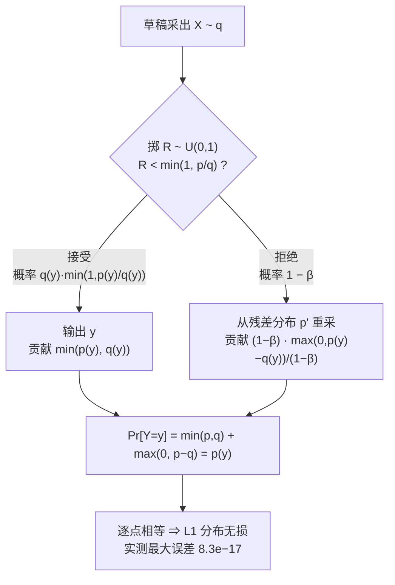

# 04 拒绝采样修正 —— 无损性的完整证明

## 1. 一句话

投机采样之所以能"白拿速度"，全靠一个两行的修正：**接受概率取 $\min(1, p/q)$，拒绝之后从残差分布 $p'=\mathrm{norm}(\max(0,\,p-q))$ 重采**。这两行合起来让输出**逐点精确等于目标模型分布 $p$**（本库口径 **L1 分布无损**），而且这个结论**与草稿模型的好坏完全无关** —— 草稿只影响速度，不影响分布。

本篇把这句话证明到每一步都有依据，并用精确枚举把它算成一个数：最大逐点误差 $8.3\times10^{-17}$。

---

## 2. 从哪来：不修正会怎样

### 2.1 一个诱人但错误的想法

拿到"小模型起草、大模型验证"这个点子后，最自然的实现是：

> 草稿模型给出 $x$。大模型算一下 $p(x)$。如果 $p(x)$ 够大就接受，否则丢掉，从 $p$ 重新采一个。

这个想法有两处会出错，而且**都不会报错、不会崩溃**，只会悄悄改掉模型的输出分布：

1. **判据写成确定性的**（$p(x)\ge q(x)$ 就接受）；
2. **拒绝后从 $p$ 重采**（而不是从残差分布）。

社区里这两种写法都很常见（见 [[26-社区精彩解释精选-好在哪与错在哪]]）。它们错得有多离谱？本库把两种写法也做了精确枚举，在同一组玩具模型（$|V|=5,\gamma=3$）上量出来：

| 写法 | 说明 | 首 token 分布的最大逐点误差 | 结论 |
|---|---|---|---|
| `correct` | $\min(1,p/q)$ 判据 + 残差分布重采 | $1.665\times10^{-16}$ | 无偏 |
| `naive_p` | 拒绝后直接从 $p$ 重采 | $\mathbf{1.322\times10^{-1}}$ | **有偏** |
| `threshold` | 判据写成 $p\ge q$ 就接受 | $\mathbf{2.238\times10^{-1}}$ | **有偏** |
| `no_bonus` | 正确判据，但不发"赠品 token" | $8.327\times10^{-17}$ | 无偏（只是慢） |

（实测，复跑：`python _lab/spec.py --bias`）

读法：`naive_p` 让某个 token 的概率偏了 **13 个百分点**，`threshold` 偏了 **22 个百分点**。这不是数值误差，是把模型换成了另一个模型。而最后一行说明了另一件事：**"少发一个 token"只是慢，"改了分布"才是错** —— 后面 §7 会把这条做成判据。

### 2.2 为什么"从 $p$ 重采"是错的

直觉上它看起来很对：既然草稿不可信，那就用可信的 $p$ 重新采一个，哪里错了？

错在**你已经用掉了一次信息**。被接受的那部分 token 已经按 $\min(p,q)$ 的比例流出去了；如果拒绝时再按完整的 $p$ 补，那些"$q$ 本来就低估的 token"会被补两次，"$q$ 高估的 token"则被少补。**残差分布的存在，正是为了把已经流出去的那部分从补偿里扣掉。**

下面把这句话写成等式。

---

## 3. 形式化

### 3.1 记号

| 记号 | 含义 |
|---|---|
| $V$ | 词表，$\lvert V\rvert$ 为词表大小 |
| $p(\cdot\mid c)$ | **目标模型**（target，大模型）在上下文 $c$ 下的 next-token 分布 |
| $q(\cdot\mid c)$ | **草稿模型**（draft，小模型）在同一上下文下的分布 |
| $\gamma$ | 一次投机迭代里草稿连续生成的 token 数 |
| $x_1,\dots,x_\gamma$ | 草稿采出的 token，$x_i\sim q(\cdot\mid c,x_1,\dots,x_{i-1})$ |
| $p_i$ | 简写 $p(\cdot\mid c,x_1,\dots,x_{i-1})$，$i=1,\dots,\gamma+1$ |
| $q_i$ | 简写 $q(\cdot\mid c,x_1,\dots,x_{i-1})$，$i=1,\dots,\gamma$ |
| $\beta$ | 单步接受概率 $\sum_x \min(p(x),q(x))$ |
| $\tau$ | 一次迭代实际产出的 token 数，$1\le\tau\le\gamma+1$ |

**关键的对齐关系**：$p_i$ 与 $q_i$ 的条件是**同一个前缀**。目标模型一次前向就能同时拿到 $p_1,\dots,p_{\gamma+1}$ 共 $\gamma+1$ 个分布，因为它们对应的是同一条序列上的 $\gamma+1$ 个位置（为什么这一次前向几乎不额外花钱，见 [[03-并行验证为什么几乎免费-算术强度与roofline]]）。

### 3.2 算法（Leviathan Algorithm 1 / Chen Algorithm 2）

```
输入：上下文 c，目标模型 p，草稿模型 q，草稿长度 gamma
1. 起草：for i = 1..gamma:  x_i ~ q_i            # gamma 次串行前向
2. 验证：一次并行前向拿到 p_1, ..., p_{gamma+1}   # 1 次前向
3. 逐位判接受：
     for i = 1..gamma:
         r ~ Uniform(0,1)
         if r < min(1, p_i(x_i) / q_i(x_i)):
             接受 x_i，继续
         else:
             y ~ p'_i = norm(max(0, p_i - q_i))   # 残差分布
             输出 (x_1..x_{i-1}, y)，本轮结束      # 首次拒绝即截断
4. 若 gamma 个全部接受：
     y ~ p_{gamma+1}                              # "赠品 token"，白拿
     输出 (x_1..x_gamma, y)
```

三处最容易写错的地方，先标出来：

- **第 3 步的 `r <`**：这是个**随机**判据，不是阈值判据。$p_i(x_i)/q_i(x_i)=0.67$ 意味着"有 67% 的概率接受"，不是"不接受"。
- **首次拒绝即截断**：后面已经起草好的 $x_{i+1},\dots,x_\gamma$ 必须**全部作废**。因为它们的条件前缀里含有被否掉的 $x_i$，已经不合法了。
- **第 4 步的赠品 token**：$\gamma$ 个全接受时，$p_{\gamma+1}$ 已经在同一次前向里算出来了，白扔可惜。这是 $\tau$ 的上界是 $\gamma+1$ 而不是 $\gamma$ 的原因。

---

## 4. 逐步推导

只需证**单个位置**的结论；整条序列由归纳直接得到（§4.3）。

### 4.0 证明的形状：两条互斥路径，加起来恰好是 $p$

在动笔推导之前，先看清整个证明要干什么 —— 它只是把"输出 $y$"这件事拆成两条互斥的路径，然后证明两条路径的概率加起来**恰好**等于 $p(y)$。



两条路径各自的贡献里，**$(1-\beta)$ 在拒绝那条路上被约掉了** —— 这正是"从 $p$ 重采"为什么错的地方（它约不掉）。下面把每一步补全。

### 4.1 主定理

**定理.** 设 $p,q$ 是 $V$ 上的两个分布。按下述过程产生随机变量 $Y$：

1. 采 $X\sim q$；
2. 采 $R\sim\mathrm{Uniform}(0,1)$，若 $R<\min\!\big(1,\tfrac{p(X)}{q(X)}\big)$ 则令 $Y=X$；
3. 否则采 $Y\sim p'$，其中 $p'(y)=\dfrac{\max(0,\,p(y)-q(y))}{\sum_{z}\max(0,\,p(z)-q(z))}$。

则 $Y\sim p$，**逐点精确相等**。

### 4.2 证明

**第一步：算"被接受且取值为 $y$"的概率。**

$$
\Pr[\,Y=y,\ \text{接受}\,]
=\underbrace{q(y)}_{\text{草稿采到 }y}\cdot\underbrace{\min\!\Big(1,\frac{p(y)}{q(y)}\Big)}_{\text{通过判据}}
$$

依据：第 1 步与第 2 步独立（$R$ 与 $X$ 独立），故联合概率是两者相乘。

化简这个乘积。分两种情形：

- 若 $q(y)\le p(y)$：$\min(1,p(y)/q(y))=1$，乘积 $=q(y)=\min(p(y),q(y))$。
- 若 $q(y)>p(y)$：$\min(1,p(y)/q(y))=p(y)/q(y)$，乘积 $=q(y)\cdot\frac{p(y)}{q(y)}=p(y)=\min(p(y),q(y))$。

两种情形合并：

$$
\boxed{\ \Pr[\,Y=y,\ \text{接受}\,]=\min\big(p(y),\,q(y)\big)\ }
\tag{4.1}
$$

（$q(y)=0$ 时草稿采不到 $y$，左边为 0，右边 $\min(p(y),0)=0$，也成立。）

**第二步：算总接受概率。**

对 (4.1) 的 $y$ 求和：

$$
\beta \;:=\; \Pr[\text{接受}]\;=\;\sum_{y}\min\big(p(y),q(y)\big)
\tag{4.2}
$$

于是拒绝概率 $\Pr[\text{拒绝}]=1-\beta$。

**第三步：算归一化常数。**

$$
\sum_{z}\max\big(0,\,p(z)-q(z)\big)
\overset{(a)}{=}\sum_{z}\Big[p(z)-\min\big(p(z),q(z)\big)\Big]
\overset{(b)}{=}1-\beta
\tag{4.3}
$$

依据：(a) 用恒等式 $\max(0,a-b)=a-\min(a,b)$（对任意实数成立，逐项验证两种大小关系即可）；(b) 用 $\sum_z p(z)=1$ 与 (4.2)。

(4.3) 是整个证明的关键：**残差的总质量恰好等于拒绝概率**。这不是巧合，是 $\min$ 与 $\max$ 的互补性。

因此残差分布可以写成

$$
p'(y)=\frac{\max(0,\,p(y)-q(y))}{1-\beta}\qquad(\beta<1)
\tag{4.4}
$$

**第四步：合并两条路径。**

$Y=y$ 只可能经由"接受"或"拒绝后重采"这两条互斥路径：

$$
\begin{aligned}
\Pr[Y=y]
&=\Pr[\,Y=y,\ \text{接受}\,]+\Pr[\text{拒绝}]\cdot p'(y)\\[2pt]
&\overset{(4.1),(4.4)}{=}\min\big(p(y),q(y)\big)+(1-\beta)\cdot\frac{\max(0,\,p(y)-q(y))}{1-\beta}\\[2pt]
&=\min\big(p(y),q(y)\big)+\max\big(0,\,p(y)-q(y)\big)\\[2pt]
&\overset{(c)}{=}p(y)
\end{aligned}
$$

依据 (c)：再次用 $\max(0,a-b)=a-\min(a,b)$，即 $\min(a,b)+\max(0,a-b)=a$，取 $a=p(y),b=q(y)$。

$\blacksquare$

**注意 $(1-\beta)$ 被约掉了。** 这就是"从 $p$ 重采"为什么错：它相当于把第四步的第二项换成 $(1-\beta)\cdot p(y)$，于是

$$
\Pr[Y=y]=\min(p,q)+(1-\beta)p(y)\ \ne\ p(y)\quad\text{（除非 }\beta=1\text{）}
$$

偏差是 $\min(p,q)-\beta\, p(y)$，量级由 $1-\beta$ 决定 —— 草稿越差，偏得越狠。

**$\beta=1$ 的退化情形**：此时 $p=q$，永不拒绝，$p'$ 用不到（代码里的兜底分支永远走不到，见 `_lab/spec.py::residual_dist` 的注释）。

### 4.3 从一个位置推到整条序列

上面证的是：给定前缀，产出的**下一个** token 服从 $p(\cdot\mid\text{前缀})$。

**归纳**：设前 $k$ 个输出 token 的联合分布已等于目标模型的链式概率 $\prod_{j\le k}p(t_j\mid t_{<j})$。第 $k+1$ 个 token 有两种来源：

- 它是本轮某个被接受/重采的位置 —— 由主定理，条件分布是 $p(\cdot\mid t_{\le k})$；
- 它是"赠品 token" —— 直接从 $p_{\gamma+1}=p(\cdot\mid t_{\le k})$ 采，条件分布同样正确。

两种来源的条件分布相同，故联合分布 $=\prod_{j\le k+1}p(t_j\mid t_{<j})$。归纳完成。

这里有个**容易被忽略的细节**：每轮产出的 token 数 $\tau$ 是随机的，且 $\tau$ 与产出的内容相关（难的地方更容易被拒、$\tau$ 更小）。归纳法之所以还成立，是因为上面每一步用的都是**条件**分布，不受 $\tau$ 的随机性影响。这条在 [[06-期望接受长度与加速比模型-完整推导]] 里会再出现一次 —— 那里 $\tau$ 的随机性就不能忽略了，而且它会咬人。

---

## 5. 小数字算例：一次算到底

取 $|V|=5$，目标与草稿都是玩具马尔可夫模型，看起始 token $s_0=0$ 这一步（复跑：`python _lab/spec.py --demo`）：

$$
p=[0.2024,\ 0.1564,\ 0.3386,\ 0.1982,\ 0.1045]
$$
$$
q=[0.2060,\ 0.2330,\ 0.3406,\ 0.0540,\ 0.1664]
$$

**第一步，接受概率 $\min(1,p/q)$**（逐分量）：

| token | 0 | 1 | 2 | **3** | 4 |
|---|---|---|---|---|---|
| $p$ | 0.2024 | 0.1564 | 0.3386 | **0.1982** | 0.1045 |
| $q$ | 0.2060 | 0.2330 | 0.3406 | **0.0540** | 0.1664 |
| $\min(1,p/q)$ | 0.9822 | 0.6711 | 0.9942 | **1.0000** | 0.6276 |

只有 token 3 满足 $p>q$（草稿**低估**了它），所以它一旦被草稿采到就必然接受。其余四个都是草稿高估，接受要掷骰子。

**第二步，$\min(p,q)$ 与总接受概率**：

$$
\min(p,q)=[0.2024,\ 0.1564,\ 0.3386,\ 0.0540,\ 0.1045],\qquad
\beta=\sum=0.8558
$$

**第三步，残差**：

$$
\max(0,p-q)=[0,\ 0,\ 0,\ \mathbf{0.1442},\ 0],\qquad \sum=0.1442=1-\beta\ \checkmark
$$

对照 (4.3)：$1-\beta=1-0.8558=0.1442$，与残差总质量**逐位相同**。归一化后

$$
p'=[0,\ 0,\ 0,\ \mathbf{1},\ 0]
$$

这个例子特别好懂：**这一步只要被拒绝，就一定输出 token 3**。因为 token 3 是唯一被草稿低估的 token，全部"欠账"都记在它头上。

**第四步，验算 token 3 的总概率**：

$$
\underbrace{0.0540}_{\text{接受路径 }\min(p,q)}+\underbrace{0.1442}_{\text{拒绝概率}}\times\underbrace{1.0}_{p'(3)}=0.1982=p(3)\ \checkmark
$$

再验算 token 1（草稿高估的那类）：

$$
\underbrace{0.1564}_{\min(p,q)}+0.1442\times\underbrace{0}_{p'(1)}=0.1564=p(1)\ \checkmark
$$

**每一个 token 都对上了。** 这就是主定理在具体数字上的样子。

顺带看一眼"从 $p$ 重采"错在哪：那样 token 1 会得到 $0.1564+0.1442\times0.1564=0.1790$，比真实的 $0.1564$ 高出 **14%**；而 token 3 会得到 $0.0540+0.1442\times0.1982=0.0826$，只有真实值 $0.1982$ 的 **42%**。**草稿高估的 token 被进一步放大，被低估的 token 被继续压制** —— 偏差的方向恰好是把目标模型往草稿模型的方向拽。这正是它最危险的地方：输出看起来仍然通顺，只是悄悄变成了一个介于大模型与小模型之间的东西。

---

## 6. 代码验证：把"证明"变成一个数

光有推导还不够。本库的铁律四要求每个数学断言配一个可执行验证。这里用的不是"采一百万次看直方图像不像"，而是**精确枚举**：把 $\gamma$ 个位置 $\times$ $|V|$ 种取值 $\times$ 接受/拒绝二分的全部分支的概率加起来，一个骰子都不掷。

```python
# _lab/spec.py
def iteration_dist(target, draft, last, gamma, variant="correct"):
    """一次投机迭代产出 token 元组的**精确**分布 {tuple: prob}。"""
    def rec(i, prefix, prob, cur):
        if i == gamma:                       # 全接受 -> 赠品 token
            pb = target.dist(cur)
            for y in range(V): res[prefix + (y,)] += prob * pb[y]
            return
        p_i, q_i = target.dist(cur), draft.dist(cur)
        for x in range(V):                   # 接受分支
            a = min(1.0, p_i[x] / q_i[x])
            if a > 0: rec(i + 1, prefix + (x,), prob * q_i[x] * a, x)
        p_rej = 1.0 - float(np.minimum(p_i, q_i).sum())   # 拒绝分支
        if p_rej > 0:
            r = residual_dist(p_i, q_i)
            for y in range(V): res[prefix + (y,)] += prob * p_rej * r[y]
```

把它串成多轮，得到输出流前 $n$ 个 token 的精确联合分布，再与目标模型的链式概率逐点相减：

```
V      gamma   n      eps      alpha(s0)    最大逐点误差
3      1       3      0.0      1.0000       1.388e-17
3      3       3      4.0      0.8592       6.939e-18
4      1       3      4.0      0.3105       2.776e-17
4      3       3      4.0      0.3105       1.388e-17
```

（实测，复跑：`python _lab/spec.py --proof`）

**这张表最该看的是最后两行**：草稿烂到接受率只剩 **0.31**（也就是每三次起草有两次被否），误差**仍然是 $10^{-17}$**。

> **草稿模型的好坏只影响速度，不影响分布。** 这是投机采样的全部卖点，也是它与"用小模型近似大模型"这类做法的根本分界。

本库还把这条推到极端：让草稿把几乎全部概率质量押在**目标模型最不可能的 token** 上（接受率 $<0.15$），结论不变（`_lab/test_lossless.py::test_lossless_holds_for_adversarial_draft`）。

---

## 7. 口径与坑：三种"无损"，别混着说

这是本库铁律一。"投机采样是无损的"这句话在社区里至少被用在三种不同意义上：

| 口径 | 含义 | 同一 prompt 跑两次结果一样吗 | 谁属于这一类 |
|---|---|---|---|
| **L1 分布无损（exact）** | 输出是目标模型分布的**精确样本**，逐点相等 | **不一定一样** | 标准投机采样、EAGLE 系列、MTP 草稿 |
| **L2 贪心等价（greedy-exact）** | $T=0$ 时输出序列与目标模型**逐 token 相同** | 一样 | 上述方法在 $T=0$ 的退化情形；blockwise parallel decoding |
| **L3 近似（lossy）** | 放宽了接受判据，分布**已经不等于** $p$ | 不一定，且分布已变 | Medusa 的 typical acceptance、各种阈值放宽 |

**本篇证明的是 L1。** 它**不**蕴含"开了投机和不开投机结果一模一样" —— 这是社区最高频的一个误解。开投机后随机数的消耗方式变了（每个位置多消耗一个 $R$，拒绝时还要从 $p'$ 再采一次），所以即便固定种子，token 序列也会不同。**分布相同，样本不同。** 详见 [[07-无损的三种口径-分布无损不等于结果相同]]。

还有一条判据值得单独记住，来自 §2.1 表格的最后一行：

> **少发 token 只是慢，改分布才是错。**
> 不发赠品 token（`no_bonus`）误差 $8.3\times10^{-17}$，无偏，只是每轮少产出一个；
> 而 `naive_p` / `threshold` 误差 $10^{-1}$，快是快了，但你跑的已经不是原来那个模型。
>
> 排查一个投机解码实现时，先用这条分类：**是"接受长度不理想"（性能问题），还是"分布对不上"（正确性问题）？** 前者调参，后者必须回去看这两行修正有没有写对。

---

## 8. 失效条件：这个证明什么时候不成立

无损性是数学定理，但它**有前提**。以下任一条被破坏，L1 就不再成立：

1. **$p_i$ 与 $q_i$ 的条件前缀没对齐。** 最常见的形态是**树形草稿的 position id 用错**（用了拍平后的下标而不是节点深度），于是目标模型算出的 $p_i$ 对应的根本不是那条前缀。这个 bug 不会报错，只会让分布悄悄偏掉。量化后果见 `_lab/test_tree.py::test_tree_attention_breaks_if_position_ids_wrong`，机制见 [[16-树形草稿与树注意力-mask构造与验证]]。
2. **两个模型的 tokenizer 不同。** $p$ 与 $q$ 必须定义在**同一个词表**上，否则 $p(x)/q(x)$ 无意义。跨 tokenizer 的投机需要额外的对齐机制，那已经不是本篇这个定理覆盖的算法了。
3. **采样参数不一致。** 温度 / top-p / top-k **必须对 $p$ 和 $q$ 施加同一套变换后再比**。如果目标模型截断了 top-p 而草稿没有，$p$ 会在被截断的 token 上取 0，接受概率恒为 0，虽然仍然"无损"但接受率会莫名塌方；反过来若草稿截断得更狠，$q(x)=0$ 的 token 草稿永远采不到，此时**证明仍成立**（(4.1) 在 $q(y)=0$ 处两边都是 0），只是效率变差。
4. **数值精度。** 推导用的是实数。真实实现里 $p$ 与 $q$ 由不同精度/不同 kernel 算出（例如目标模型 fp8、草稿 fp16），$p(x)/q(x)$ 在 $p\approx q$ 处对舍入极其敏感。**这时的"无损"只在浮点误差意义下成立**，严格说已经不是 L1 了。报"无损"时若模型跑在低精度上，应当说明这一点。
5. **判据被人为放宽。** 一旦引入 typical acceptance 之类的阈值（Medusa 的做法），本篇的定理立刻失效，口径降到 L3。这是**设计选择**不是 bug，但必须如实标注。

**注意上面 5 条没有一条是"草稿模型不够好"。** 草稿差只会让你慢，不会让你错 —— 这一点值得反复强调，因为它决定了工程上该往哪儿使劲：**调草稿是调性能，调修正是调正确性。**

---

## 9. 自测题

1. 若草稿模型 $q$ 与目标模型 $p$ 完全相同，$\beta$ 等于多少？残差分布是什么？算法退化成什么？
   <details><summary>答案要点</summary>$\beta=\sum\min(p,p)=1$，永不拒绝。残差 $\max(0,p-p)=0$，未定义（代码里兜底返回 $p$，但这条分支永远走不到）。算法退化成"草稿说什么就是什么 + 赠品 token"，每轮产出 $\gamma+1$ 个 token，即 $E[\tau]$ 取到上界。</details>

2. 证明第三步的恒等式 $\sum_z\max(0,p(z)-q(z))=1-\beta$ 时，为什么必须用到 $\sum_z p(z)=1$？如果 $p$ 没归一化（例如忘了 softmax 后又乘了个系数），会发生什么？
   <details><summary>答案要点</summary>(4.3) 的 (b) 步直接用了 $\sum p=1$。若 $p$ 的总质量是 $Z\ne1$，残差总质量变成 $Z-\beta$，而拒绝概率仍是 $1-\beta$，两者不再相等，第四步的约分失败，输出分布偏离 $p/Z$。工程含义：**必须在归一化之后的概率上做接受判据**，用未归一化的 logits 或 unnormalized prob 会破坏 **L1 分布无损**（$T=0$ 时的 L2 贪心等价也一起破坏）。</details>

3. 一个实现里，作者为了"省一次采样"，在 $\gamma$ 个草稿全部被接受时直接把最后一个草稿 token 又输出一遍，而不是从 $p_{\gamma+1}$ 采赠品 token。这会破坏 **L1 分布无损**吗？
   <details><summary>答案要点</summary>会。赠品 token 必须从 $p_{\gamma+1}$ 采。重复输出一个已有 token 相当于把第 $\gamma+1$ 个位置的分布换成了一个退化的点分布，直接改掉了联合分布。对照 §2.1 表：合法的省法是 `no_bonus`（干脆不发，无偏但慢），不是"随便发一个"。</details>

4. 有人报告"开了投机解码后，同一个 prompt、同一个种子，输出和以前不一样了，是不是实现有 bug？"你怎么回答？
   <details><summary>答案要点</summary>不一定是 bug。L1 分布无损保证的是分布相同，不是样本相同；随机数消耗方式变了，序列自然会变。正确的判定方法是**统计检验**（大量样本下的分布比较）或对本实现做 §6 那样的精确枚举，而不是对比单条输出。若要逐 token 相同，需要走 L2 口径（$T=0$ 贪心），且贪心下确实应当完全一致 —— 那种情况下不一致才是真 bug。</details>

5. 为什么"首次拒绝即截断"？把被拒位置之后的草稿 token 留着、继续验证下一个，会怎样？
   <details><summary>答案要点</summary>因为 $x_{i+1}$ 是在"前缀含 $x_i$"的条件下采的，而 $x_i$ 已被否掉、实际输出的是 $y\ne x_i$。此时 $q_{i+1}$ 的条件前缀与真实前缀不符，$p_{i+1}$ 也是按错误前缀算的，(4.1) 的对齐前提被破坏。继续验证会引入偏差 —— 这正是 §8 第 1 条的一般形式。</details>

---

## 10. 延伸与双链

- 上游动机：[[01-decode为什么慢-带宽墙与算力空转]]、[[03-并行验证为什么几乎免费-算术强度与roofline]]
- 先看直觉再回来看证明：[[02-最小可跑的投机采样-手算一遍]]
- 接受率 $\beta$ 的口径与测法：[[05-接受率alpha-定义口径与怎么测]]
- $\tau$ 的分布与加速比（本篇刻意回避的随机性在那里咬人）：[[06-期望接受长度与加速比模型-完整推导]]
- 三种"无损"口径的完整辨析：[[07-无损的三种口径-分布无损不等于结果相同]]
- 两篇奠基论文在证明写法上的差异：[[09-2023奠基-两篇同期论文的异同]]
- 树形草稿如何破坏/保持本篇的对齐前提：[[16-树形草稿与树注意力-mask构造与验证]]
- 社区在这两行修正上翻过的车：[[26-社区精彩解释精选-好在哪与错在哪]]、[[27-常见误解与判据]]

---

### 本篇验证

- `_lab/test_lossless.py::test_exact_distribution_lossless` —— 精确枚举 7 组 $(V,\gamma,\varepsilon)$ 配置，输出流前 3 个 token 的联合分布与目标链式概率逐点误差 $<10^{-12}$。这是 §4 主定理的判定性验证。
- `_lab/test_lossless.py::test_lossless_holds_for_terrible_draft` —— 接受率 $<0.4$ 时仍精确无损。
- `_lab/test_lossless.py::test_lossless_holds_for_adversarial_draft` —— 草稿把质量押在目标最不可能的 token 上（接受率 $<0.15$），仍精确无损。验证 §6 的"草稿好坏不影响分布"。
- `_lab/test_lossless.py::test_residual_mass_equals_rejection_prob` —— 验证 (4.3)：$\sum\max(0,p-q)=1-\beta=\mathrm{TV}(p,q)$。
- `_lab/test_lossless.py::test_naive_resample_is_biased` —— 证明"拒绝后从 $p$ 重采"有偏（误差 $>10^{-2}$）。
- `_lab/test_lossless.py::test_threshold_rule_is_biased` —— 证明"$p\ge q$ 就接受"有偏。
- `_lab/test_lossless.py::test_no_bonus_token_is_still_lossless` —— 证明"不发赠品 token"仍无偏，支撑 §7 的"慢 vs 错"判据。
- `_lab/test_lossless.py::test_sampling_matches_enumeration` —— 掷骰子的实现与精确枚举一致，保证 demo 跑的就是被证明的那个算法。
- 可复跑：
  - `python _lab/spec.py --demo` —— §5 的手算算例（$\beta=0.8558$，残差 one-hot 在 token 3）
  - `python _lab/spec.py --proof` —— §6 的误差表（最小误差 $3.5\times10^{-18}$，最大 $2.2\times10^{-16}$）
  - `python _lab/spec.py --bias` —— §2.1 的三种错法偏差表（`naive_p` 0.132，`threshold` 0.224）

### 本篇来源

- Yaniv Leviathan, Matan Kalman, Yossi Matias, *Fast Inference from Transformers via Speculative Decoding* — https://arxiv.org/abs/2211.17192 （2022-11，ICML 2023）。Algorithm 1 与 Theorem 3.5（无损性）的原始出处。它的好处是把"为什么可以这样接受"写成了可验证的引理；需要注意的是**它的加速比分析建立在接受事件 i.i.d. 的假设上**，这个前提在正文里写了但极易被二手讲解略过（见 [[06-期望接受长度与加速比模型-完整推导]]）。
- Charlie Chen, Sebastian Borgeaud, Geoffrey Irving, Jean-Baptiste Lespiau, Laurent Sifre, John Jumper, *Accelerating Large Language Model Decoding with Speculative Sampling* — https://arxiv.org/abs/2302.01318 （2023-02）。同期独立工作，把修正写成"modified rejection sampling"，对 top-k/nucleus 下的处理交代得比前者细。两篇的对照见 [[09-2023奠基-两篇同期论文的异同]]。
- 本仓库既有材料：`attention-optimization/26-speculative-decoding.md` 已给出同一证明的另一种写法与 roofline 动机，写得好；本篇不重复它的动机部分，而把**错法的量化偏差**与**精确枚举验证**补上——那两块是它没有的。
