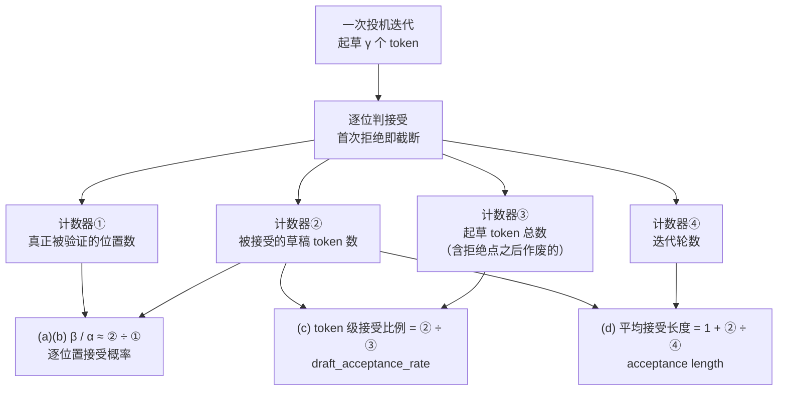
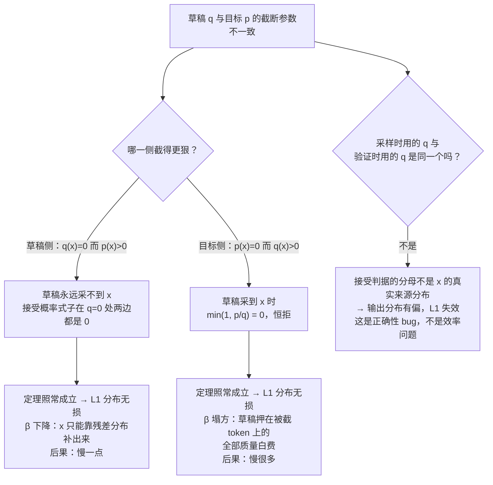

# 05 接受率 alpha —— 定义口径与怎么测

## 1. 一句话

"接受率"这个词在投机采样里**至少指四个不同的量**：单步接受概率 $\beta$、期望接受率 $\alpha$、实测的 token 级接受比例、平均接受长度（acceptance length）。它们互相之间**不是同义词也不是可以随手换算的**——本篇会给出一份 vLLM 官方文档里的真实样例，同一次运行的同一段统计，能同时读出 **0.0775**、**0.2000**、**1.2326** 三个都被叫做"接受率"的数字。

外加一条本库跑出来的结论：**接受率随温度的变化形状不是固定的**，好草稿是 U 形（有低谷），烂草稿是单调上升。所以不报温度的接受率数字没有意义。

---

## 2. 从哪来：夹在"对不对"和"快多少"之间的那个量

[[04-拒绝采样修正-无损性的完整证明]] 证明了输出分布逐点等于目标模型分布（**L1 分布无损**），并且这个结论与草稿好坏无关。
[[06-期望接受长度与加速比模型-完整推导]] 用 $\alpha$ 算出 $E[\tau]=\frac{1-\alpha^{\gamma+1}}{1-\alpha}$ 和加速比。

两篇之间少了一块：**$\alpha$ 本身是什么，它怎么测**。这一块之所以值得单独写一篇，是因为它是整个主题里**口径事故最集中的地方**：

- 论文里的 $\alpha$ 是一个**理论量**（对上下文取期望），它在系统里没有直接对应的计数器；
- 引擎打点的 `draft_acceptance_rate` 和 `acceptance_length` 是**两个不同的比值**，都被叫"接受率"；
- 社区帖子里的"我们接受率 80%"通常不说 $\gamma$、不说温度、不说是否含赠品 token —— 而这三项**每一项都能把数字改掉一半以上**。

先看一份真东西。vLLM 的 `acceptance_metrics.md` 给了一个 `summary` 响应的样例（原文抄录，URL 见 §本篇来源）：

```json
"speculative_decoding": {
  "mean_acceptance_length": 1.2325581395348837,
  "draft_acceptance_rate": 0.07751937984496124,
  "acceptance_histogram": [39, 1, 0, 3],
  "num_spec_steps": 43,
  "num_accepted_draft_tokens": 10,
  "num_draft_tokens": 129,
  "num_spec_tokens": 3
}
```

同一次请求，两个字段都在讲"接受"，一个是 **0.0775**，一个是 **1.2326**。它们不矛盾，只是**分母不同**。而真正对应论文里 $\alpha$ 的那个数**这两个字段都不是**——它得从 `acceptance_histogram` 重建出来，等于 **0.2000**（§5 会一步步算）。

这就是本篇要解决的问题。

---

## 3. 机制拆解：$\beta$ 的定义与那条恒等式

### 3.1 定义

固定一个上下文 $c$，记目标分布 $p=p(\cdot\mid c)$、草稿分布 $q=q(\cdot\mid c)$。

**定义（单步接受概率）**：

$$
\beta \;:=\; \Pr\big[\text{草稿在这个位置被接受}\big]
$$

注意这里**对草稿采到哪个 token 取了边缘**。它不是"给定 token $x$ 的接受概率 $\min(1,p(x)/q(x))$"，而是那个量按 $q$ 加权的平均。这两者被混淆是社区里第二高频的错（第一高频见 [[04-拒绝采样修正-无损性的完整证明]] §2.1）。

Leviathan 论文的原文定义（Definition 3.1）：

> The acceptance rate $\beta_{x_{<t}}$, given a prefix $x_{<t}$, is the probability of accepting $x_t\sim q(x_t|x_{<t})$ by speculative sampling.

### 3.2 推导 $\beta=\sum_x\min(p,q)$

$$
\beta=\sum_x \underbrace{q(x)}_{\text{草稿采到 }x}\cdot\underbrace{\min\!\Big(1,\frac{p(x)}{q(x)}\Big)}_{\text{通过判据}}
$$

依据：草稿采样与判据用的均匀随机数独立，联合概率相乘；再对 $x$ 求和（互斥事件）。

逐项化简 $q(x)\cdot\min(1,p(x)/q(x))$，分两种情形：

- $q(x)\le p(x)$：括号里取 $1$，乘积 $=q(x)=\min(p(x),q(x))$；
- $q(x)>p(x)$：括号里取 $p(x)/q(x)$，乘积 $=p(x)=\min(p(x),q(x))$。

（$q(x)=0$ 时该项为 $0$，而 $\min(p(x),0)=0$，也对上。）

两种情形都落在 $\min(p(x),q(x))$ 上，故

$$
\boxed{\ \beta=\sum_x\min\big(p(x),q(x)\big)\ }
\tag{3.1}
$$

### 3.3 推导 $\beta=1-\mathrm{TV}(p,q)$

全变差距离 $\mathrm{TV}(p,q)=\frac12\sum_x|p(x)-q(x)|$。用初等恒等式

$$
\min(a,b)=\frac{a+b-|a-b|}{2}\qquad(\text{对任意实数成立，分 }a\ge b\text{ 与 }a<b\text{ 两种情形逐一验证})
$$

代入 (3.1)：

$$
\beta=\sum_x\frac{p(x)+q(x)-|p(x)-q(x)|}{2}
=\frac{1}{2}\Big(\underbrace{\textstyle\sum_x p}_{=1}+\underbrace{\textstyle\sum_x q}_{=1}\Big)-\frac{1}{2}\sum_x|p-q|
=1-\mathrm{TV}(p,q)
\tag{3.2}
$$

$\blacksquare$

Leviathan 论文走的是同一条路，只是先定义了一个自己的散度 $D_{LK}$ 再回到这里（原文 Definition 3.2 / Lemma 3.3）：

> $D_{LK}(p,q)=\sum_x|p(x)-M(x)|$ where $M(x)=\frac{p(x)+q(x)}{2}$ …… **Lemma 3.3.** $D_{LK}(p,q)=1-\sum_x\min(p(x),q(x))$

它的 $D_{LK}$ **就是全变差距离**（把 $|p-M|=\frac{|p-q|}{2}$ 代进去即可看出）。论文起了个新名字，二手讲解经常把它当成某种新散度，其实不必——记住 $\beta=1-\mathrm{TV}$ 就够了。

### 3.4 几何含义与三条推论

(3.1) 的几何读法：把 $p$ 和 $q$ 画成同一根 token 轴上的两条柱状图，**$\beta$ 就是两者重叠部分的面积**。剩下的面积分成两块，形状不同但**质量相等**，各为 $\mathrm{TV}$：

$$
\sum_x\max(0,p-q)=\sum_x\max(0,q-p)=\mathrm{TV}(p,q)=1-\beta
$$

（第一个等号来自两者都归一化；这条也正是 [[04-拒绝采样修正-无损性的完整证明]] (4.3) 里"残差总质量恰好等于拒绝概率"的几何解释。）

三条立刻能读出的推论：

1. $\beta\in[0,1]$；$\beta=1\iff p=q$；$\beta=0\iff p$ 与 $q$ 支撑不交。
2. **$\beta$ 只认重叠，不认排序**。两个分布可以 top-1 完全不同而 $\beta$ 很高（都很平坦时），也可以 top-1 完全相同而 $\beta$ 很低（一个尖一个平时）。所以"草稿的 top-1 命中率"和 $\beta$ 是两个量，**贪心命中率高不蕴含采样接受率高**。§6 会把这条做成实测。
3. **$\beta$ 与 KL 散度不是一回事**。$\beta$ 有界（$\mathrm{TV}\le1$），KL 无界。Pinsker 不等式给出单向的 $\mathrm{TV}\le\sqrt{\mathrm{KL}/2}$，于是 $\beta\ge1-\sqrt{\mathrm{KL}/2}$——这是一个**很松的下界**，本库未对它建数值验证。工程含义：**用蒸馏 loss（KL）当草稿质量的代理指标是有偏的**，训草稿模型时该盯的是 TV 不是 KL（见 [[21-草稿模型怎么训-对齐与在线蒸馏]]）。

---

## 4. 四种被叫做"接受率"的量

### 4.1 一张对照表

| 记号 | 名字 | 定义 | 值域 | 谁在用 |
|---|---|---|---|---|
| **(a) $\beta(c)$** | 单步接受概率 | $\sum_x\min(p(\cdot\mid c),q(\cdot\mid c))$ | $[0,1]$ | Leviathan Definition 3.1；**是随机变量**，依赖具体上下文 |
| **(b) $\alpha$** | 期望接受率 | $\mathbb E_{c\sim\pi}[\beta(c)]$ | $[0,1]$ | Leviathan「$\alpha=E(\beta)$」；论文里所有公式用的都是它 |
| **(c) token 级接受比例** | draft acceptance rate | 累计被接受草稿 token 数 $\div$ 累计**起草** token 数 | $[0,1]$ | vLLM `draft_acceptance_rate`；工程上最常报 |
| **(d) 平均接受长度** | acceptance length | 每轮迭代产出 token 数，$1+$ 累计接受数 $\div$ 轮数 | $[1,\gamma+1]$ | vLLM `mean_acceptance_length`、SGLang `avg_spec_accept_length`；引擎里最常打点 |



**三个不同的分母，就是三个不同的数。** 图里 ① < ③ 恒成立（拒绝点之后的草稿被起草了但从未被验证），所以 **(c) 恒不大于 (a)(b) 的估计值**。

### 4.2 (c) 与 (d) 的换算：一条恒等式

设一轮起草 $\gamma$ 个、被接受 $A$ 个。则本轮产出 $\tau=A+1$（拒绝处重采一个，或全接受后拿赠品一个）。累计到 $N$ 轮：

$$
\text{(d)}=1+\frac{\sum A}{N},\qquad
\text{(c)}=\frac{\sum A}{\sum \gamma}=\frac{\sum A}{N\bar\gamma}
\quad\Longrightarrow\quad
\boxed{\ \text{(c)}=\frac{\text{(d)}-1}{\bar\gamma}\ }
\tag{4.1}
$$

其中 $\bar\gamma$ 是**平均每轮起草长度**。(4.1) 是纯计数恒等式，**不依赖任何独立性假设**，随时可用。

两处坑：

- **$\bar\gamma$ 不总等于配置的 $\gamma$**。动态草稿长度（[[17-动态草稿长度与自适应停止]]）、结构化输出作废草稿，都会让每轮起草数变化。vLLM 对 `num_draft_tokens` 的定义原文就写了：「Total proposed draft tokens, **after subtracting drafts invalidated by structured-output constraints.**」——所以开了 guided decoding 后，(c) 的分母会**变小**，(c) 看起来会**变好看**，但那不是模型变好了。
- **(d) 含赠品 token，(c) 不含**。(4.1) 里那个 $-1$ 就是它。很多论文的"平均接受长度"指的是**被接受的草稿 token 数**（不含赠品），与引擎口径**差 1**。见 §4.4。

### 4.3 为什么 (c) 不是 $\alpha$：一张会让人吵架的表

在 [[06-期望接受长度与加速比模型-完整推导]] 的理想前提（接受事件沿链不相关）下，$\mathbb E[A]=\sum_{k=1}^{\gamma}\alpha^k$，于是

$$
\text{(c)}=\frac{\mathbb E[A]}{\gamma}=\frac{\alpha(1-\alpha^{\gamma})}{\gamma(1-\alpha)}
$$

固定 $\alpha=0.80$，只改 $\gamma$（由 `_lab/accept.py::expected_tokens` 闭式算出，复跑：
`python -c "from accept import expected_tokens as e; [print(g, e(0.8,g), (e(0.8,g)-1)/g) for g in (1,2,3,4,6,8,12)]"`）：

| $\gamma$ | (d) 平均接受长度 | $\mathbb E[A]$ | **(c) token 级接受比例** |
|---|---|---|---|
| 1 | 1.8000 | 0.8000 | **0.8000** |
| 2 | 2.4400 | 1.4400 | **0.7200** |
| 3 | 2.9520 | 1.9520 | **0.6507** |
| 4 | 3.3616 | 2.3616 | **0.5904** |
| 6 | 3.9514 | 2.9514 | **0.4919** |
| 8 | 4.3289 | 3.3289 | **0.4161** |
| 12 | 4.7251 | 3.7251 | **0.3104** |

**读法：同一对模型、同一个温度、$\alpha$ 一动不动地等于 0.80，报出来的"接受率"可以是 0.80，也可以是 0.31。** 差别只来自 $\gamma$。

所以：

> **只报 (c) 不报 $\gamma$，这个数字无法解读。** 两个团队报 "接受率 41%" 和 "接受率 80%"，可能是同一对模型。

原因是结构性的：**首次拒绝即截断**，拒绝点之后的草稿被起草了、被计入分母了，却从来没有被验证过。$\gamma$ 越大，白扔的越多，(c) 被压得越低。

**$\alpha$ 的无偏估计要换分母**：只统计**真正被验证过的位置**（首次拒绝之前的全部位置，含被拒的那一个）：

$$
\hat\alpha=\frac{\text{被接受的草稿 token 数}}{\text{被验证的位置数}}
\tag{4.2}
$$

引擎不一定直接打这个点，但 vLLM 的 `acceptance_histogram` 足以重建它——§5 演示。

### 4.4 (d) 的"含不含赠品 token"：两大引擎都含

这条容易踩，因为**论文口径和引擎口径不一样**，而两者用的是同一个中文词。

**vLLM**（`docs/features/speculative_decoding/acceptance_metrics.md`，原文）：

> `mean_acceptance_length`: Mean tokens emitted per verification step, **including the bonus token**: `1 + num_accepted_draft_tokens / num_spec_steps`. Ranges from `1.0` (nothing accepted) to `num_spec_tokens + 1`.
> `acceptance_histogram`: … **Excludes the always-accepted bonus token.**
> `num_accepted_draft_tokens`: Total accepted draft tokens, **excluding bonus tokens**.

**SGLang**（源码，`python/sglang/srt/managers/scheduler.py` 与 `speculative/eagle_info.py`）：

```python
# scheduler.py
ret["avg_spec_accept_length"] = (
    self.metrics_reporter.spec_total_num_accept_tokens
    / self.metrics_reporter.spec_total_num_forward_ct
)

# eagle_info.py
# Per-req accept counts. `num_accept_tokens = num_correct_drafts + 1`.
```

那个 `+ 1` 就是赠品 token。**两大引擎的 acceptance length 口径一致，都含赠品，值域都是 $[1,\gamma+1]$。**

于是有一条速查判据：

> 看到一个"平均接受长度"，先问它**能不能取到小于 1 的值**。
> 不能（下界是 1.0）→ 引擎口径，含赠品；
> 能（下界是 0）→ 论文里的"平均被接受草稿数"，不含赠品，**要加 1 才能和引擎数字比**。

### 4.5 (b) 与实测在什么时候对不上

即使把 (c) 的分母换成 (4.2) 那个正确的，$\hat\alpha$ 与论文里的 $\alpha$ 仍然可能不等——因为 $\alpha$ 是按**平稳上下文分布**加权的，而实测是按**迭代**抽样的，两者在"难度连片"时会分家（长度偏置）。这条已经在 [[06-期望接受长度与加速比模型-完整推导]] §7.3 用可控实验做完了，本篇不展开，只留结论：

> **难度连片时，用平均 $\alpha$ 代入闭式会高估 $E[\tau]$**（本库实测最大高估 10.5%）。所以别用 (d) 反推 $\alpha$，也别用 $\alpha$ 预测 (d)。

---

## 5. 小数字算例

### 5.1 手算 $\beta$：$|V|=5$，两个分布

$$
p=[0.50,\ 0.20,\ 0.15,\ 0.10,\ 0.05],\qquad
q=[0.30,\ 0.30,\ 0.20,\ 0.15,\ 0.05]
$$

逐项取 $\min$：$[0.30,\ 0.20,\ 0.15,\ 0.10,\ 0.05]$，求和 $\beta=\mathbf{0.80}$。

验算 (3.2)：$|p-q|=[0.20,0.10,0.05,0.05,0.00]$，和为 $0.40$，$\mathrm{TV}=0.20$，$1-\mathrm{TV}=0.80$ ✓。

验算 §3.4 的两块面积：$\max(0,p-q)=[0.20,0,0,0,0]$，和 $=0.20$；$\max(0,q-p)=[0,0.10,0.05,0.05,0]$，和 $=0.20$。**形状完全不同，质量相等** ✓。

### 5.2 同一个例子说明"贪心接受率不能外推"

上面 $p$ 与 $q$ 的 argmax 都是 token 0，所以 $T\to0$ 时两个分布都塌成 $e_0$，$\beta\to1$。

现在把 $q$ 动一点点，换成

$$
q'=[0.28,\ 0.32,\ 0.20,\ 0.15,\ 0.05]
$$

只挪了 0.02 的质量。此时：

- $T=1$：$\min(p,q')=[0.28,0.20,0.15,0.10,0.05]$，$\beta=\mathbf{0.78}$ —— 几乎没变（0.80 → 0.78）。
- $T\to0$：$q'$ 的 argmax 变成了 token 1，与 $p$ 的 argmax（token 0）不同，两个分布塌成**正交的**点分布，$\beta\to\mathbf{0}$。

> **同一对分布，$T=1$ 的接受率 0.78，$T\to0$ 的接受率 0.00。** 挪动 2% 的质量就能做到。
> 这就是为什么"我们在贪心模式下测到接受率 X"这句话，**对 $T>0$ 的线上配置没有任何预测力**。

### 5.3 把 vLLM 官方样例的三个数全算出来

回到 §2 那份 `summary` 响应。已知 `acceptance_histogram = [39, 1, 0, 3]`，`num_spec_tokens` $=k=3$。直方图第 $j$ 项 = 恰好接受了 $j$ 个草稿 token 的步数。

**第一步，核对总数。**
轮数 $=39+1+0+3=43$ ✓（等于 `num_spec_steps`）。
接受数 $=39\cdot0+1\cdot1+0\cdot2+3\cdot3=10$ ✓（等于 `num_accepted_draft_tokens`）。
起草数 $=43\times3=129$ ✓（等于 `num_draft_tokens`，说明这次每轮都足额起草了 3 个）。

**第二步，(d) 平均接受长度。**

$$
1+\frac{10}{43}=\mathbf{1.2326}\quad\checkmark\ \text{（与响应里的 1.2325581… 一致）}
$$

**第三步，(c) token 级接受比例。**

$$
\frac{10}{129}=\mathbf{0.07752}\quad\checkmark\ \text{（与 0.0775193… 一致）}
$$

**第四步，重建被验证的位置数，得到 $\hat\alpha$。**
接受了 $j<k$ 个的那一步，说明第 $j+1$ 个位置被拒了 —— 它**被验证过**，要计入分母；接受了 $j=k$ 个的那一步，验证了 $k$ 个位置。

$$
\text{验证位置数}=39\times1+1\times2+0\times3+3\times3=39+2+0+9=50
$$
$$
\hat\alpha=\frac{10}{50}=\mathbf{0.2000}
$$

**第五步，检验这三个数自洽不自洽。** 把两个候选 $\alpha$ 分别代进 [[06-期望接受长度与加速比模型-完整推导]] 的闭式 $E[\tau]=\frac{1-\alpha^{k+1}}{1-\alpha}$，与实测的 1.2326 比：

| 代入的"接受率" | 来源 | 算出的 $E[\tau]$ | 与实测 1.2326 的偏差 |
|---|---|---|---|
| 0.07752 | `draft_acceptance_rate` | 1.0840 | **−12.05%** |
| 0.20000 | 由直方图重建的 $\hat\alpha$ | 1.2480 | **+1.25%** |

（口径：vLLM 官方文档样例，method=`ngram`，$k=3$，模型/硬件/batch/温度**原文未给出**——按铁律二，这组数只能用来演示口径换算，**不可横向比较**。）

**结论**：$\hat\alpha=0.20$ 才是能代进公式的那个量；把 `draft_acceptance_rate` 当 $\alpha$ 用，会低估 12%。而这两个字段在同一个 JSON 里并排放着，名字都叫 acceptance。

---

## 6. 代码验证：温度如何改变 $\alpha$（本篇最重要的一张表）

### 6.1 实测

`_lab/accept.py --temp` 造两个草稿：`eps=0.3`（好草稿）与 `eps=1.2`（烂草稿），对目标模型和草稿**同时**按温度 $T$ 重新归一化（对 log 概率除以 $T$ 再 softmax），再算 $\alpha=\mathbb E_{s\sim\pi}[\beta]$。

实测（复跑：`python _lab/accept.py --temp`；玩具一阶马尔可夫模型 $|V|=8$，seed 固定，**bs 概念不适用**）：

```
  好/烂草稿：eps=0.3 时 argmax 一致率 = 0.625
  好/烂草稿：eps=1.2 时 argmax 一致率 = 0.125

温度T       好草稿(eps=0.3)   烂草稿(eps=1.2)
0.02      0.6967         0.0001
0.10      0.6574         0.0715          <- 低谷
0.30      0.7096         0.3353
0.60      0.8244         0.5268
1.00      0.8952         0.6585
2.00      0.9496         0.8109
5.00      0.9803         0.9225
20.00     0.9951         0.9805
```

**好草稿是 U 形**：$T=0.02$ 时 0.6967，降到 $T=0.1$ 的 **0.6574（低谷）**，再一路升到 $T=20$ 的 0.9951。
**烂草稿是单调上升**：从 0.0001 一路升到 0.9805，没有低谷。

### 6.2 两个端点的机制

**$T\to0$：$\alpha$ 收敛到"两模型 argmax 相同"的概率质量。**
温度趋零时两个分布都塌成各自 argmax 上的点分布。两个点分布的重叠面积非 0 即 1：argmax 相同则 $\beta=1$，不同则 $\beta=0$。于是

$$
\alpha \;\xrightarrow[T\to0]{}\; \sum_{c}\pi(c)\,\mathbf 1\big\{\arg\max p(\cdot\mid c)=\arg\max q(\cdot\mid c)\big\}
$$

这个极限**既不是 0 也不是 1**，而是 argmax 一致的那部分上下文的概率质量。数字对得上吗？实测（同一脚本的内部量，复跑见 §本篇验证）：

| 草稿 | 按状态均匀计的 argmax 一致率 | $T=0.02$ 时按 $\pi$ 加权的一致质量 | $T=0.02$ 时的 $\alpha$ |
|---|---|---|---|
| 好（eps=0.3） | 0.6250 | 0.6642 | 0.6967 |
| 烂（eps=1.2） | 0.1250 | 0.0000 | 0.0001 |

**三列是三个不同的数，别混用。** 第一列按状态均匀计数，第二列按平稳分布加权（这才是极限的正确形式），第三列是 $T=0.02$ 处的实际值（因为 $T$ 还没到 0，非 argmax 的 token 上还剩一点重叠，所以略高于第二列）。烂草稿那一行三个数一起塌到 0，把机制说得很干净。

**$T\to\infty$：两个分布都趋于均匀，$\mathrm{TV}\to0$，$\alpha\to1$。** 与草稿好坏无关——足够高的温度下，任何草稿的接受率都会趋近 1。这条听起来像好消息，其实是个警告：**高温下接受率高，不代表草稿好，只代表目标模型自己也在瞎猜**。

### 6.3 中间为什么会有低谷（只对好草稿）

把两端连起来就能看出：好草稿在 $T=1$ 时 $\alpha=0.8952$，而 $T\to0$ 的极限只有 0.66 附近。**从 $T=1$ 往下降温，$\alpha$ 必须下跌**，因为它要去够那个更低的极限。跌到某处之后又要回到 0.6967 这个端点值，于是形成低谷（实测在 $T\approx0.1$）。

烂草稿则没有这个矛盾：它的 $T\to0$ 极限（≈0）低于沿途所有取值，所以曲线一路单调。

**判据形式**：设 $g$ 为 argmax 一致的概率质量。若 $g<\alpha(T{=}1)$，降温会让 $\alpha$ 先跌（好草稿的典型情形）；若 $g>\alpha(T{=}1)$，降温会让 $\alpha$ 涨。**决定形状的是 $g$ 与常温 $\alpha$ 的大小关系，不是草稿"好不好"这个含糊的说法。**

### 6.4 一次写反了的修正（本库保留证伪过程）

这一节最初的写法是「$\alpha$ 关于温度**总是**非单调」。跑完 `--temp` 才发现**烂草稿是严格单调的**，非单调只发生在 argmax 一致率足够高的草稿上。脚本里那句注释是当时改完留下的：

```python
print("读法（这段是实测推翻了我最初写法之后重写的）：")
```

对应的两个测试也是分开写的，一个断言非单调、一个断言单调（`_lab/test_accept.py::test_good_draft_alpha_is_non_monotone_in_temperature` 与 `::test_poor_draft_alpha_is_monotone_in_temperature`）。**"$\alpha$ 随温度非单调"这句话本身就是一条需要标口径的断言**——它只对一类草稿成立。

### 6.5 真实模型上是什么样：Leviathan Table 3

玩具模型给的是机制，真实数字得看论文。Leviathan et al. 的 Table 3 给了各模型对在 $t=0$（argmax）与 $t=1$（标准采样）下的实测 $\alpha$（原文抄录）：

| 目标 $M_p$ | 草稿 $M_q$ | $\alpha$ @ t=0 | $\alpha$ @ t=1 | 方向 |
|---|---|---|---|---|
| T5-XXL (EnDe) | T5-small | 0.75 | 0.62 | ↓ 13 点 |
| T5-XXL (EnDe) | T5-base | 0.80 | 0.68 | ↓ 12 点 |
| T5-XXL (EnDe) | T5-large | 0.82 | 0.71 | ↓ 11 点 |
| T5-XXL (CNNDM) | T5-small | 0.65 | 0.53 | ↓ 12 点 |
| T5-XXL (EnDe) | Bigram | 0.20 | 0.19 | ↓ 1 点 |
| T5-XXL (EnDe) | Unigram | 0.08 | 0.07 | ↓ 1 点 |
| LaMDA 137B | LaMDA 8B | 0.75 | 0.74 | ↓ 1 点 |
| LaMDA 137B | LaMDA 2B | 0.71 | 0.71 | 持平 |
| GPT-like 97M | GPT-like 6M | 0.88 | **0.89** | **↑ 1 点** |

（引用，非本库实测。口径：论文原文只给了模型对与采样设置，batch=1、TPU-v4；$\gamma$、任务的具体切分见原文 §4。）

三件事一起看：

1. **同一对模型换个任务，$\alpha$ 差 10 个点以上**：T5-XXL/T5-small 在 EnDe 上 0.75，在 CNNDM 上 0.65。**不报任务分布的接受率数字不可比。**
2. **降温不是总让 $\alpha$ 涨**——这是社区里的一个流行说法（"贪心接受率总是最高"）。表里大多数行确实是 t=0 更高，但 GPT-like 那一行是**反的**，LaMDA 2B 那一行**持平**。论文自己的措辞是 "Interestingly, $\alpha$ and walltime improvement are **higher** for argmax sampling (temp=0)"，说的是他们那批实验的**观察**，不是定理。
3. **烂草稿（unigram/bigram）对温度几乎不敏感**（0.08→0.07、0.20→0.19），好草稿敏感（0.75→0.62）。这与 §6.1 玩具实验的方向一致：**温度敏感度随 argmax 一致率上升**。

### 6.6 工程含义（铁律二的硬证据）

> **拿 $T=0$ 测出的接受率，不能外推到 $T=0.7$ 的线上配置。**
> 好草稿会掉（本库玩具：0.697 → 0.657 附近；Leviathan 实测：0.75 → 0.62），烂草稿会涨（0.0001 → 0.34）。方向和幅度都取决于具体模型对。
> **不报温度的接受率数字没有意义。**

---

## 7. 口径与坑

### 7.1 怎么测才对：一份可操作的清单

**A. 必须固定并写进报告的量**（缺一项，数字就不可比）：

| 类别 | 要记什么 | 为什么 |
|---|---|---|
| 采样 | **温度**、top-p、top-k、min-p、repetition/presence penalty | §6 已证温度能改一半；截断见 §7.2 |
| 草稿侧采样 | 草稿是**贪心取 argmax** 还是**从 $q$ 随机采** | 见 §7.3，这两种是**不同定义**的 $\beta$ |
| 结构 | $\gamma$（或树的节点数与深度）、是否动态 $\gamma$ | (c) 随 $\gamma$ 从 0.80 变到 0.31（§4.3） |
| 模型对 | 目标/草稿的参数量、是否同族、**是否同 tokenizer**、权重精度 | 跨精度时 $p/q$ 在 $p\approx q$ 处对舍入敏感 |
| 口径 | (d) **是否含赠品 token**；(c) 的分母是"起草总数"还是"验证位置数" | §4.4、(4.2) |
| 负载 | 任务分布（代码/摘要/对话/工具调用）、prompt 长度分布、是否开 guided decoding | Leviathan Table 3：换任务差 10 点以上；guided decoding 改分母 |
| 系统 | batch size / 并发数、引擎与版本、是否 chunked prefill、prefill 与 decode 是否分开统计 | 接受率本身与 batch 无关，但**报出来的收益强依赖 batch**（§8） |

**B. 统计纪律**（本库踩过的坑，见 `_meta/写作规范.md` §6）：

- **接受长度是"每轮一个观测"的随机变量，必须多轮平均并给出不确定度。** 用 $N$ 轮的样本标准差 $s$，均值标准误约 $s/\sqrt N$；报数字时把 $N$ 和区间一起报。
- **单样本/单请求判定是错的。** 拿 §5.3 那份样例试一下：43 步里只有 3 步接受满 3 个，它们贡献了 10 个接受 token 中的 9 个。把其中**一步**去掉，平均接受长度就从 1.2326 掉到 **1.1667**（−5.3%）。一个请求的接受率，噪声比信号大。
- **固定随机种子并记录**，否则同一配置两次测量的差异无法归因。
- **分阶段统计**。首 token、prefill 刚结束的前几轮、长上下文后段的接受率不是一个数（见 [[22-长上下文下的投机采样]]）。把它们混进一个平均值会掩盖真实形状；正确做法是留下逐位置/逐步数组（vLLM 的 `--per-request-spec-decode-metrics detailed` 给 `per_step_accepted` / `per_step_drafted` 两个数组，正是为此）。

**C. 别做的事**：

- 别用 [[06-期望接受长度与加速比模型-完整推导]] 的闭式**反推** $\alpha$（难度连片时会系统性偏）。
- 别把不同来源的接受率放进同一张表比较，除非上面 A 表逐项核对过。
- 别把 (c) 直接当 $\alpha$ 代进任何公式（§5.3 已量化：低估 12%）。

### 7.2 top-p / top-k 截断：无损仍成立，接受率会塌

前提：接受判据里的 $p$ 与 $q$ **必须是各自采样参数施加完之后、重新归一化过的分布**。截断本身不破坏 [[04-拒绝采样修正-无损性的完整证明]] 的定理——只是把"目标分布"换成了"带采样参数的目标分布"，本篇口径下仍是 **L1 分布无损**（相对于那个带参数的 $p$）。

问题出在**两侧参数不一致**时。分两种情况，结论都是"仍然无损，但效率变差"，程度不同：



逐条说清：

**情况一，草稿截得更狠（$q(x)=0$，$p(x)>0$）。**
接受概率式子 $\Pr[Y=x,\text{接受}]=q(x)\min(1,p(x)/q(x))$ 在 $q(x)=0$ 处左右两边都是 0（[[04-拒绝采样修正-无损性的完整证明]] (4.1) 已处理这个边界），证明的每一步都不受影响。**L1 分布无损照常成立。** 代价：$\beta=\sum\min(p,q)$ 变小（$q$ 被压到更窄的支撑上，重叠面积必然不增），那些 token 只能靠残差分布 $p'$ 补出来，也就是**只能靠拒绝路径产出**。后果是慢，不是错。

**情况二，目标截得更狠（$p(x)=0$，$q(x)>0$）。**
草稿采到 $x$ 时 $\min(1,p(x)/q(x))=0$，**恒拒**。残差分布在被截掉的 token 上是 $\max(0,0-q(x))=0$，所以重采也永远不会吐出它。**L1 分布无损同样照常成立。** 但代价大得多：草稿押在被截 token 上的**全部**概率质量都变成纯浪费，$\beta$ 会塌。极端情形是目标侧 `top_k=1`（贪心）而草稿不截断，此时 $\beta=p_{\text{trunc}}(x)$ 只在草稿恰好采中那唯一存活 token 时才非零。

**这两种情况都要说透一件事：**

> **"仍然无损但接受率塌方"和"有偏"是两回事。**
> 前者是**性能问题**（L1 分布无损仍成立）——你跑的还是那个模型，只是白烧算力；调参就能修。
> 后者是**正确性问题**（L1 已失效）——你跑的已经不是那个模型了；离线评测和线上行为会对不上，而且不报错、不崩。
> 这条判据是 [[04-拒绝采样修正-无损性的完整证明]] §7「少发 token 只是慢，改分布才是错」的直接延伸。排查时先分这一类，再决定往哪儿使劲。

**情况三，真正会破坏 L1 的那种不一致。** 不是"截断参数不同"，而是**草稿采样时用的分布与交给验证器的分布不是同一个**。SGLang 在源码注释里点名了这个坑（`python/sglang/srt/speculative/spec_utils.py`，原文）：

> The verify's accept test `coin*q(X) < p(X)` is unbiased **only if q is exactly the distribution X was drawn from**, so callers must hand the returned q (not a recomputed one) to the verify.

也就是说：如果草稿是从**截断后**的 $q$ 采的，验证却拿**未截断**的 $q$ 去算比值，判据的分母就错了，输出分布**有偏**。这不是效率问题，是 L1 失效。同一份源码还写了引擎的正确做法（`renorm_draft_probs` 的 docstring，原文）：

> Plain softmax, except under rejection sampling where logits are temperature-scaled so the draft proposal q tracks the target sampling temperature (**higher acceptance; correctness holds for any q**).

这句话把本篇两条主线一起点明了：**给草稿也施加目标的温度，是为了提高接受率（性能）；而正确性对任何 $q$ 都成立（L1 与草稿无关）。**

### 7.3 一个最容易被忽略的口径：草稿是贪心还是随机采

vLLM 的默认值不是随机采样（`vllm/config/speculative.py` @ v0.27.1，原文）：

```python
draft_sample_method: DraftSampleMethod = "greedy"
"""How the draft model samples tokens. 'greedy' always picks the argmax
token, and the draft probabilities are treated as one-hot during rejection
sampling. 'probabilistic' samples stochastically from the draft
distribution and uses the full draft logits for the probability ratio test
during rejection sampling. This comes at the cost of additional GPU memory
usage."""

```

把 $q$ 当 one-hot 意味着 $q=e_{x^\*}$，其中 $x^\*=\arg\max q$。代进 (3.1)：

$$
\beta=\sum_x\min\big(p(x),\,e_{x^\*}(x)\big)=\min\big(p(x^\*),1\big)=p(x^\*)
\tag{7.1}
$$

**接受率变成了"目标模型给草稿 argmax 那个 token 的概率"，这是一个完全不同的量。** 两条推论（由 (7.1) 直接得到；本库 `_lab` 里的 $\alpha$ 全部是 probabilistic 口径，未对这两条单独建测试）：

- $\beta\le\max_x p(x)$。**温度越高 $p$ 越平，贪心草稿的接受率上界越低**——与 §6.2 "probabilistic 口径下 $T\to\infty$ 使 $\alpha\to1$" **方向相反**。
- 同一引擎、同一对模型、同一温度，只改 `draft_sample_method`，报出来的接受率就换了定义。**跨配置比较接受率时，这一项必须核对。**

（这条也解释了 §7.2 那条 SGLang 注释里为什么强调"必须把采样时那个 $q$ 原样交给验证"——one-hot 与真实 $q$ 是两个分布，混用就是情况三。）

---

## 8. 失效条件：什么时候"高接受率"也换不来加速

铁律三。$\alpha$ 是**采样层**的量，与系统无关；而加速比强依赖系统。下面每一条都是"$\alpha$ 很高但收益没了"的可判定形态。

1. **草稿太贵（$c$ 大）。** 理想模型 $\text{speedup}=E[\tau]/(\gamma c+1)$。取 $\alpha=0.90$（很高了）：$c=0.5$ 时最优在 $\gamma^\*=3$、加速比 1.376；$c=1.0$（草稿与目标同价）时最优在 $\gamma^\*=1$、加速比只有 **0.950 —— 已经小于 1**，即变慢。
   （口径：理想模型，batch=1 且落在 memory-bound 区，假设"验证免费"，未计工程开销；复跑 `python _lab/accept.py --table` 的同一套函数。）
   **判据**：$c\gtrsim1$ 时，无论 $\alpha$ 多高都不值得开。这正是"草稿越小越好"这句话该被反驳的另一面——两边都要看。
2. **验证不再免费（大 batch）。** 分母那个 $1$ 崩掉。vLLM 官方文档把这条写得最直白（`adaptive_verification.md`，原文）：
   > Speculative decoding buys fewer decode steps with more compute. **At batch size 1 that is a good trade** … **At batch size 256 it is a much more delicate one.** Draft tokens now compete with real tokens for the same compute, and **every rejected token is compute wasted; with enough of them, throughput drops.**
   可判定形式（`dynamic_speculative_decoding.md`，原文）：**有效 batch $=\text{BS}\times K$，超过临界 batch 后 TPOT 恶化**。注意这条**与 $\alpha$ 无关**：$\alpha$ 一点没变，收益却翻转。展开见 [[18-batch与吞吐-收益衰减曲线]]、[[19-负收益全解-什么时候投机反而更慢]]。
3. **接受率涨了但接受长度不涨（边际饱和）。** Red Hat 在 H200-PCIe-141GB 上用 gpt-oss-120b（MXFP4 MoE）+ EAGLE3 草稿、vLLM v0.13.0、ShareGPT、并发 1–200 实测：$K=2$ 时接受率 45.4% / 接受长度 1.91；$K=3$ 时 35.6% / **2.07**；$K=4$ 时 28.3% / **2.13**。
   **$K$ 从 3 加到 4，接受长度只涨 0.06，而每步的草稿算力成本是线性涨的。** 这正是 §4.3 那张表的现实版：(c) 掉、(d) 微涨、成本线性涨。**看 (c) 会以为在恶化，看 (d) 会以为在改善，两个都不足以做决策——要看的是 (d) 的边际增量除以边际成本。**
4. **树形草稿下 $\alpha$ 与收益的关系整个换了。** 链式草稿里成本 $\propto\gamma$、收益 $\propto$ 接受长度，两者共用一个 $\gamma$。树形草稿里**成本由节点总数决定，收益由被接受路径的深度决定**，同一个 $\alpha$ 可以对应完全不同的节点预算。此时 (4.1) 的 $\bar\gamma$ 要换成"平均节点数"，而 §4.3 那张表的 $\gamma$ 语义不再成立。见 [[16-树形草稿与树注意力-mask构造与验证]]。
5. **$\alpha$ 高是因为温度高。** §6.2：$T\to\infty$ 时任何草稿的 $\alpha\to1$。如果一个配置报出很高的接受率，先确认它不是靠高温刷出来的——那种情况下接受率高只说明目标模型本身在瞎猜，接受长度确实会涨，但输出质量的账要另算。
6. **$\alpha$ 高但被长度偏置骗了。** 按迭代抽样与按 token 抽样不是同一个统计量，难度连片时前者被短迭代过采样。见 [[06-期望接受长度与加速比模型-完整推导]] §7.3。

**一条总判据**：接受率是**必要不充分**条件。它高，不保证快；它低，一定不快。所以看到接受率数字时，正确的下一个问题不是"这个数好不好"，而是"$c$ 多少、batch 多少、验证还免不免费"。

---

## 9. 自测题

1. 某团队报告"我们的草稿模型接受率 41%"。你需要追问哪三项才能判断这个数字是好是坏？
   <details><summary>答案要点</summary>①**分母口径**：是 (c)（÷起草总数）还是 (4.2)（÷验证位置数）；②**$\gamma$**：$\alpha=0.80$ 在 $\gamma=8$ 时 (c) 恰好是 0.4161；③**温度**（以及草稿是贪心还是随机采）。三项都对齐后，41% 可能对应 $\alpha=0.80$ 这样一个相当好的草稿。</details>

2. 为什么 $\beta$ 与 KL 散度不能互相替代？这对训练草稿模型意味着什么？
   <details><summary>答案要点</summary>$\beta=1-\mathrm{TV}$，TV 有界且只看重叠面积；KL 无界且对 $q$ 在 $p$ 低概率处的取值极敏感。Pinsker 只给单向且很松的界 $\beta\ge1-\sqrt{\mathrm{KL}/2}$。工程含义：蒸馏 loss（KL/CE）降下去不等于接受率升上来，训草稿时应该直接盯 TV 或直接测接受率。</details>

3. 一个实现把目标模型的 top-p 设成 0.9，草稿模型忘了设（不截断）。输出分布还对吗？接受率会怎样？
   <details><summary>答案要点</summary>只要接受判据用的 $p$、$q$ 分别是各自采样参数施加后归一化的分布，且草稿采样与验证用的是**同一个** $q$，则输出仍是 **L1 分布无损**（相对于带 top-p 的目标分布）。但草稿会不断采到被目标截掉的 token，那些位置接受概率恒 0，$\beta$ 塌方。这是性能问题不是正确性问题。**真正会出错的情形**是草稿从截断后的 $q$ 采、验证却用未截断的 $q$ 算比值——那时分布有偏。</details>

4. 引擎报 acceptance length = 3.2，配置 $\gamma=8$。某论文报同一对模型"平均接受 2.4 个 token"。这两个数矛盾吗？
   <details><summary>答案要点</summary>不一定矛盾。引擎口径含赠品 token（值域 $[1,9]$），3.2 对应被接受草稿 2.2 个；论文口径若不含赠品，2.4 与 2.2 是可比的同一类量，差 0.2 可以由任务/温度/版本解释。若论文口径也含赠品，那就是 3.2 vs 2.4，差别更大。**先问值域下界是 1 还是 0。**</details>

5. 有人说"降到 $T=0$ 接受率一定最高，所以线上用贪心"。哪里错了？
   <details><summary>答案要点</summary>两处。①**不是定理**：Leviathan Table 3 里 GPT-like 97M/6M 是 $t=0$ 的 0.88 低于 $t=1$ 的 0.89，LaMDA 2B 持平；本库玩具实验里烂草稿在 $T\to0$ 时 $\alpha\to0.0001$，比常温低得多。$T\to0$ 的极限是 argmax 一致的概率质量 $g$，$g$ 与常温 $\alpha$ 的大小关系决定方向。②**口径混淆**：若引擎的草稿本来就是贪心采样（vLLM 默认），$\beta=p(x^\*)$ 已经是另一个量，不能与 probabilistic 口径的数字比。</details>

---

## 10. 延伸与双链

- 前置（$\beta$ 从哪来、为什么 $\min(p,q)$）：[[04-拒绝采样修正-无损性的完整证明]]
- 后续（$\alpha$ 怎么变成加速比、以及公式的两条前提）：[[06-期望接受长度与加速比模型-完整推导]]
- "无损"的三种口径与"L1 不蕴含结果相同"：[[07-无损的三种口径-分布无损不等于结果相同]]
- 为什么验证那一次前向可以近似当免费：[[03-并行验证为什么几乎免费-算术强度与roofline]]
- $\gamma$ 语义被换掉的地方：[[16-树形草稿与树注意力-mask构造与验证]]、[[17-动态草稿长度与自适应停止]]
- 接受率没变而收益消失的地方：[[18-batch与吞吐-收益衰减曲线]]、[[19-负收益全解-什么时候投机反而更慢]]
- 各引擎具体打了哪些点、字段叫什么：[[20-主流引擎实现-vLLM与SGLang与TensorRTLLM]]
- 该盯 TV 不该盯 KL 的训练侧含义：[[21-草稿模型怎么训-对齐与在线蒸馏]]
- 长上下文下接受率的形状变化：[[22-长上下文下的投机采样]]
- 社区在"接受率"这个词上的翻车集锦：[[26-社区精彩解释精选-好在哪与错在哪]]、[[27-常见误解与判据]]

---

### 本篇验证

- `_lab/test_lossless.py::test_beta_equals_one_minus_tv` —— 100 组随机 Dirichlet 分布上验证 §3.3 的恒等式 $\beta=1-\mathrm{TV}(p,q)$。
- `_lab/test_lossless.py::test_residual_mass_equals_rejection_prob` —— 验证 §3.4 的"两块非重叠面积质量相等"：$\sum\max(0,p-q)=1-\beta=\mathrm{TV}(p,q)$，三个量是同一个数。
- `_lab/test_accept.py::test_alpha_is_one_when_draft_equals_target` —— $q=p$ 时 $\alpha=1$（§3.4 推论 1 的边界）。
- `_lab/test_accept.py::test_alpha_drops_with_perturbation` —— 草稿噪声 eps 单调增时 $\alpha$ 单调不增（$\beta$ 确实在度量"像不像"）。
- `_lab/test_accept.py::test_alpha_at_low_temperature_tracks_argmax_agreement` —— **§6.2 的核心断言**：$T\to0$ 时 $\alpha$ 收敛到 argmax 一致的概率质量，不是收敛到 0 或 1（好草稿落在 $[0.5,0.85]$，烂草稿落在 $[0,0.05]$）。
- `_lab/test_accept.py::test_alpha_goes_to_one_at_high_temperature` —— $T=50$ 时两种草稿的 $\alpha$ 都 $>0.97$（§6.2 的另一个端点）。
- `_lab/test_accept.py::test_good_draft_alpha_is_non_monotone_in_temperature` —— **§6.1 的 U 形**：断言 $\alpha(T{=}0.1)<\alpha(T{=}0.02)$ 且 $\alpha(T{=}20)>\alpha(T{=}0.02)$。
- `_lab/test_accept.py::test_poor_draft_alpha_is_monotone_in_temperature` —— **§6.4 那次自我修正的判据**：烂草稿在 8 个温度点上单调不减。两条测试分开写，正是因为"非单调"这句话本身要标口径。
- `_lab/test_accept.py::test_expected_tokens_matches_geometric_sum` —— §4.3 换算表所依赖的闭式与逐项求和逐点相等。
- `_lab/test_accept.py::test_speedup_can_be_below_one` —— §8 第 1 条：理想模型下加速比也可以小于 1。
- 可复跑：
  - `python _lab/accept.py --temp` —— §6.1 的温度表（好草稿 0.6967 → 0.6574 低谷 → 0.9951；烂草稿 0.0001 → 0.9805）
  - `python _lab/accept.py --table` —— §4.3 与 §8 用到的 $E[\tau]$ / 最优 $\gamma$ 扫描
  - §6.2 那张三列表的第二列（$\pi$ 加权 argmax 一致质量 0.6642 / 0.0000）由 `_lab/accept.py` 的 `stationary` 与 `_retemp` 直接算出：
    `python -c "import numpy as np; from spec import ToyMarkov, perturb; from accept import stationary, _retemp; b=ToyMarkov(8,seed=5); d=perturb(b,eps=0.3,seed=99); bt,dt=_retemp(b,0.02),_retemp(d,0.02); pi=stationary(bt.T); print(pi[np.argmax(bt.T,1)==np.argmax(dt.T,1)].sum())"`

### 本篇来源

- Yaniv Leviathan, Matan Kalman, Yossi Matias, *Fast Inference from Transformers via Speculative Decoding* — https://arxiv.org/abs/2211.17192 （2022-11，ICML 2023）。Definition 3.1（$\beta$ 的定义）、Definition 3.2 / Lemma 3.3（$D_{LK}$ 与 $\sum\min$）、Corollary 3.6（$\alpha=1-E(D_{LK})=E(\min(p,q))$）、Table 3（各模型对在 t=0 / t=1 的实测 $\alpha$）的出处。**它讲得好的地方**：把 $\beta$ 定义成"给定前缀的条件量"，并明写 $\alpha=E(\beta)$ 依赖 i.i.d. 简化假设（原文 "If we make the simplifying assumption that the $\beta$s are i.i.d."）。**需要指出的是**：它自造的 $D_{LK}$ 其实就是全变差距离，换个名字反而让不少二手讲解以为是新东西；另外 Table 3 只给了 t=0 与 t=1 两个点，论文由此下的观察"$\alpha$ 在 argmax 采样下更高"被社区读成了普遍规律，而它自己表里的 GPT-like 那一行就是反例。
- Charlie Chen 等（DeepMind）, *Accelerating Large Language Model Decoding with Speculative Sampling* — https://arxiv.org/abs/2302.01318 （2023-02）。同期独立工作，对 nucleus/top-k 下的处理交代得更细，与本篇 §7.2 相关。
- vLLM 官方文档 *Per-Request Acceptance Metrics* — https://raw.githubusercontent.com/vllm-project/vllm/main/docs/features/speculative_decoding/acceptance_metrics.md （2026-08-22 取）。**本篇 §2 / §5.3 那份样例与 §4.4 的三条定义全部原样抄自这一页。** 它讲得好的地方：把 `mean_acceptance_length`（含赠品、值域 $[1,k+1]$）与 `draft_acceptance_rate`（÷起草总数）的公式**都写出来了**，这在同类文档里很少见；还点明 `acceptance_histogram` 不含赠品、`num_draft_tokens` 已扣掉被结构化输出作废的草稿。**不足**：文档没有给出 (4.2) 那个"÷验证位置数"的量，也没提醒读者这两个字段都不能直接当论文里的 $\alpha$ 用——本篇 §5.3 补上了重建方法。
- vLLM `SpeculativeConfig` 源码 @ v0.27.1 — https://raw.githubusercontent.com/vllm-project/vllm/v0.27.1/vllm/config/speculative.py 。§7.3 的 `draft_sample_method` docstring 原文出处（默认值是 `"greedy"`，草稿概率被当 one-hot）。
- SGLang 源码 @ main（2026-08-22 取）：
  - https://raw.githubusercontent.com/sgl-project/sglang/main/python/sglang/srt/managers/scheduler.py —— `avg_spec_accept_length = spec_total_num_accept_tokens / spec_total_num_forward_ct`
  - https://raw.githubusercontent.com/sgl-project/sglang/main/python/sglang/srt/speculative/eagle_info.py —— 注释 `num_accept_tokens = num_correct_drafts + 1`，即**含赠品 token**，与 vLLM 口径一致
  - https://raw.githubusercontent.com/sgl-project/sglang/main/python/sglang/srt/speculative/spec_utils.py —— §7.2 情况三与 §7.3 引用的两段 docstring（"correctness holds for any q"、"must hand the returned q (not a recomputed one) to the verify"）。**这两句是本篇找到的最好的工程侧表述**：一句把"正确性与草稿无关"说清，一句把"采样用的 $q$ 必须原样交给验证"这个静默 bug 点名。
- Red Hat, *Performance improvements for speculative decoding in vLLM with gpt-oss* — https://developers.redhat.com/articles/2026/04/16/performance-improvements-speculative-decoding-vllm-gpt-oss （2026-04）。§8 第 3 条的 $K=2/3/4$ 接受率与接受长度数据来源；完整七项口径见本库 `_research/RS-3-引擎实现现状.md` §1.9(g)。
- 本仓库既有材料：`vLLM解剖-高吞吐推理系统/02-原理深挖/原理05-投机解码的接受率数学.md` 已推过 $\beta=1-\mathrm{TV}$；本篇不重复该推导之外的部分，补的是**四种口径的辨析与换算**、**从直方图重建 $\hat\alpha$ 的方法**、以及**温度影响的形状实测**。
