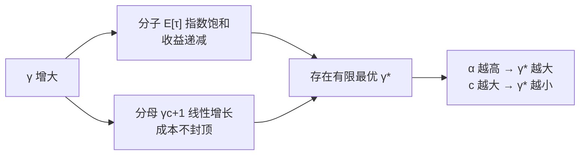

# 06 期望接受长度与加速比模型 —— 完整推导（附两次自我证伪）

## 1. 一句话

一次投机迭代的期望产出是

$$
E[\tau]=\frac{1-\alpha^{\gamma+1}}{1-\alpha}
$$

这条公式几乎出现在每一篇讲投机采样的文章里，但**它的前提被绝大多数二手讲解写错了**：它要求的不是"接受率处处相同"，而是**接受事件沿链不相关，且每轮迭代的起点服从平稳分布**。本篇把推导补完，再用两次被实测打脸的过程说明这两条前提在真实负载上都不成立 —— 净效果是**公式高估**，本库实测最大高估 10.5%。

---

## 2. 从哪来

[[04-拒绝采样修正-无损性的完整证明]] 解决了"对不对"，剩下的问题只有一个：**快多少**。

快多少由两件事决定：

- **一次迭代能白拿几个 token**（$E[\tau]$，本篇 §4.1–4.3）；
- **一次迭代要花多少时间**（$\gamma c+1$，本篇 §4.4，物理账在 [[03-并行验证为什么几乎免费-算术强度与roofline]]）。

两者一除就是加速比。听起来很简单 —— 麻烦全在 $E[\tau]$ 那一项的前提上。

---

## 3. 形式化

沿用 [[04-拒绝采样修正-无损性的完整证明]] 的记号，再补三个：

| 记号 | 含义 |
|---|---|
| $A$ | 一次迭代中**被接受的草稿 token 数**，$A\in\{0,1,\dots,\gamma\}$ |
| $\tau$ | 一次迭代**实际产出的 token 数**，$\tau=A+1$（拒绝处重采一个，或全接受后拿赠品一个） |
| $\beta_i$ | 位置 $i$ 的接受概率 $\sum_x\min(p_i(x),q_i(x))$。**它是随机变量**，因为前缀是随机的 |
| $\alpha$ | 论文口径的"期望接受率" $\mathbb E_{c\sim\pi}[\beta(c)]$，$\pi$ 为目标模型的平稳（上下文）分布 |
| $c$ | 草稿一次前向的相对成本 $T_{\text{draft}}/T_{\text{target}}$ |

**$\tau$ 的取值范围是 $[1,\gamma+1]$**：最坏情况第一个草稿就被拒，仍然产出 1 个（重采的那个）；最好情况全接受再加赠品，$\gamma+1$ 个。**产出永远不会是 0** —— 这是投机采样"最坏也不比原来慢多少"的结构性保证（`_lab/test_lossless.py::test_chunk_length_bounds`）。

---

## 4. 逐步推导

### 4.1 从尾概率到期望

对取值于 $\{0,1,\dots,\gamma\}$ 的非负整数随机变量 $A$，有

$$
E[A]=\sum_{k=1}^{\gamma}\Pr[A\ge k]
\tag{4.1}
$$

依据：把 $A=\sum_{k=1}^{\gamma}\mathbf 1\{A\ge k\}$ 两边取期望（$\mathbf 1$ 为示性函数），期望与有限和交换。

### 4.2 $\Pr[A\ge k]$ 是什么

$A\ge k$ 等价于"前 $k$ 个草稿 token 全部被接受"。逐位条件展开：

$$
\Pr[A\ge k]
=\mathbb E\Big[\prod_{i=1}^{k}\beta_i\Big]
\tag{4.2}
$$

依据：由 [[04-拒绝采样修正-无损性的完整证明]] 的 (4.1)–(4.2)，给定前缀时位置 $i$ 被接受的概率（对草稿采到哪个 token 取边缘）恰为 $\beta_i=\sum_x\min(p_i,q_i)$；再对随机前缀取期望。

**这一步是全篇的关键，请慢一点看。** (4.2) 里的期望**不能**随手拆成 $\prod\mathbb E[\beta_i]$ —— 乘积的期望等于期望的乘积，需要**不相关**（对乘积而言需要独立或至少两两不相关）。

### 4.3 加上前提，得到闭式

**前提 A（沿链不相关）**：$\beta_1,\dots,\beta_\gamma$ 互不相关。
**前提 B（起点无偏）**：每轮迭代的起始上下文服从平稳分布 $\pi$，故 $\mathbb E[\beta_i]=\alpha$。

在 A、B 之下，(4.2) 变成 $\alpha^k$，代回 (4.1)：

$$
E[A]=\sum_{k=1}^{\gamma}\alpha^{k},\qquad
E[\tau]=1+E[A]=\sum_{k=0}^{\gamma}\alpha^{k}
=\frac{1-\alpha^{\gamma+1}}{1-\alpha}
\tag{4.3}
$$

（等比数列求和；$\alpha=1$ 时取极限 $\gamma+1$。）

**注意 Leviathan 论文写的前提是 i.i.d.（独立同分布）。** i.i.d. 是**充分条件**，不是必要条件 —— 上面的推导只用到了"不相关"。这个区别不是抠字眼：真实模型里 $\beta$ 的**波动幅度很大**（远非同分布），但只要不相关，公式依然精确。本库 §7 的第一次证伪就是撞在这里。

### 4.4 加速比

设一次迭代耗时为「$\gamma$ 次草稿前向 + 1 次目标前向」：

$$
T_{\text{iter}}=\gamma\,T_{\text{draft}}+T_{\text{target}}=(\gamma c+1)\,T_{\text{target}}
$$

基线是每个 token 一次目标前向，故

$$
\text{speedup}=\frac{E[\tau]\cdot T_{\text{target}}}{T_{\text{iter}}}
=\frac{1-\alpha^{\gamma+1}}{(1-\alpha)(\gamma c+1)}
\tag{4.4}
$$

**分母的那个 $1$ 藏着一条巨大的假设**：它把"目标模型验证 $\gamma+1$ 个 token"当成与"生成 1 个 token"同价。这条只在 memory-bound 区成立，大 batch 下会崩 —— 见 [[18-batch与吞吐-收益衰减曲线]] 与 [[19-负收益全解-什么时候投机反而更慢]]。**本篇 §4 的全部结论都建立在"验证免费"之上，离开那个区就作废。**

### 4.5 最优 $\gamma$

(4.4) 对 $\gamma$ 不是单调的：分子指数饱和，分母线性增长。所以存在有限的最优 $\gamma^\*$。



实测扫描（复跑：`python _lab/accept.py --table`）：

| $\alpha$ | $c=0.02$ | | $c=0.05$ | | $c=0.10$ | | $c=0.20$ | |
|---|---|---|---|---|---|---|---|---|
| | $\gamma^\*$ | speedup | $\gamma^\*$ | speedup | $\gamma^\*$ | speedup | $\gamma^\*$ | speedup |
| 0.50 | 4 | 1.794 | 3 | 1.630 | 2 | 1.458 | 1 | 1.250 |
| 0.70 | 8 | 2.758 | 6 | 2.353 | 4 | 1.981 | 3 | 1.583 |
| 0.80 | 11 | 3.817 | 8 | 3.092 | 6 | 2.470 | 4 | 1.868 |
| 0.90 | 19 | 6.365 | 13 | 4.674 | 10 | 3.431 | 7 | 2.373 |

（口径：理想模型，假设"验证免费"，未计任何工程开销；batch 隐含为 1 且落在 memory-bound 区。**这些数字是上界，不是实测加速比。**）

读法：同一个 $\alpha=0.80$，草稿成本 $c$ 从 0.02 涨到 0.20，$\gamma^\*$ 从 11 掉到 4，理想加速比从 3.82 掉到 1.87。**"把 $\gamma$ 调大"不是免费的**，因为草稿是**串行**跑 $\gamma$ 次 —— 成本线性涨，收益指数饱和。

这张表也解释了业界的一个方向性转变：**从"独立小模型当草稿"转向"单层草稿头"，本质是把 $c$ 从 0.1 量级压到 0.02 量级**，从而把可用的 $\gamma^\*$ 和加速比同时推上去（见 [[13-EAGLE三代-特征级自回归的演进]]）。

---

## 5. 小数字算例

$\alpha=0.8,\ \gamma=4$：

$$
E[\tau]=1+0.8+0.64+0.512+0.4096=3.3616
$$

逐项的含义：$0.8^k$ 是"前 $k$ 个都接受"的概率，也就是"第 $k+1$ 个 token 能白拿到"的概率。第 5 项 $0.4096$ 说明，$\gamma=4$ 时有 41% 的迭代能吃到赠品 token。

取 $c=0.05$：$\text{speedup}=3.3616/(4\times0.05+1)=3.3616/1.2=\mathbf{2.80}$。

再看边际：把 $\gamma$ 从 4 加到 5，$E[\tau]$ 涨到 $3.6893$（+9.7%），分母涨到 $1.25$（+4.2%），加速比 $2.951$，还值。加到 8：$E[\tau]=4.1615$，分母 $1.4$，加速比 $2.972$。加到 12：$E[\tau]=4.4234$，分母 $1.6$，加速比 $2.765$ —— **已经掉头向下**。最优在 $\gamma^\*=8$，与 §4.5 的表一致。

---

## 6. 代码验证

```python
# _lab/accept.py
def expected_tokens(alpha: float, gamma: int) -> float:
    if alpha >= 1.0:
        return float(gamma + 1)
    return float((1.0 - alpha ** (gamma + 1)) / (1.0 - alpha))

def speedup_ideal(alpha: float, gamma: int, c: float) -> float:
    return expected_tokens(alpha, gamma) / (gamma * c + 1.0)
```

闭式与逐项求和逐点相等（`_lab/test_accept.py::test_expected_tokens_matches_geometric_sum`），$\gamma^\*$ 随 $c$ 单调降、随 $\alpha$ 单调升（`::test_optimal_gamma_decreases_with_cost`、`::test_optimal_gamma_increases_with_alpha`）。

但公式本身自洽，不代表它**能预测真实系统**。下面两节是本篇真正的内容。

---

## 7. 口径与坑：两次自我证伪

本库的做法是：先把猜想写下来，再跑数字，跑出来不对就**如实记下来并改**。这一节保留了完整的证伪过程，因为过程本身比结论更有用。

### 7.1 猜想一：β 有波动 → Jensen → 公式低估。**被推翻**

直觉：$E[\tau]$ 关于 $\alpha$ 是凸函数，$\beta$ 有波动时由 Jensen 不等式 $\mathbb E[f(\beta)]\ge f(\mathbb E[\beta])$，真实值应当高于公式值。

实测（`python _lab/accept.py --iid`，随机马尔可夫玩具模型）：

| $\lvert V\rvert$ | eps | $\gamma$ | $\alpha$ | $\beta_{\min}$ | $\beta_{\max}$ | 公式 $E[\tau]$ | 实测 $E[\tau]$ | 实测/公式 |
|---|---|---|---|---|---|---|---|---|
| 8 | 0.5 | 2 | 0.7972 | 0.6122 | 0.8976 | 2.4328 | 2.4257 | 0.997 |
| 8 | 1.5 | 4 | 0.5122 | 0.2628 | 0.7402 | 1.9777 | 1.9865 | 1.004 |
| 8 | 3.0 | 4 | 0.3202 | 0.1763 | 0.4492 | 1.4660 | 1.4682 | 1.001 |
| 4 | 3.0 | 2 | 0.6833 | 0.3091 | 0.8629 | 2.1503 | 2.1988 | 1.023 |

$\beta$ 在 $0.176$ 到 $0.449$ 之间变化（**差 2.5 倍**），公式却准到 **2%–3% 以内**。猜想错了。

**为什么错？** 回头看 (4.2)：推导要的从来不是"$\beta$ 是常数"，而是"$\beta_i$ 沿链不相关"。乘积的期望等于期望的乘积，只需要不相关，不需要同分布。Jensen 那套推理对应的是另一个量（对 $\alpha$ 求 $f$ 再平均），根本没进到这条推导里。

**这次证伪的收获不是负的**：它把公式的适用范围**扩大**了 —— 只要接受难度不"连片"，即使各处接受率天差地别，公式仍然精确。

### 7.2 猜想二：那正相关时公式该低估。**又被推翻，方向相反**

既然前提是"不相关"，那么正相关（真实模型里"难的地方连着难"：代码块、长数字串、罕见实体）应当让 $\mathbb E[\prod\beta]>\prod\mathbb E[\beta]$，公式**低估**。

为了干净地测这一条，本库造了一个「黏性双区制」玩具模型（`_lab/regime.py::make_regime_pair`）：token 分易区/难区，难区里草稿被强噪声打乱；`sticky` 参数控制"区制粘不粘"，且**只改粘性，不改各区的 $\beta$**。

实测（`python _lab/regime.py --sweep`）：

| sticky | $\beta$ 一阶自相关 $\rho$ | $\alpha$ | $\gamma$ | 公式 $E[\tau]$ | 实测 $E[\tau]$ | 实测/公式 |
|---|---|---|---|---|---|---|
| 0.50 | +0.041 | 0.6831 | 8 | 3.0535 | 3.0886 | 1.012 |
| 0.70 | +0.384 | 0.7050 | 8 | 3.2437 | 3.2264 | 0.995 |
| 0.85 | +0.618 | 0.7243 | 8 | 3.4282 | 3.2695 | 0.954 |
| 0.95 | +0.765 | 0.7382 | 8 | 3.5714 | 3.2969 | 0.923 |
| 0.99 | +0.812 | 0.7439 | 8 | 3.6328 | 3.2526 | **0.895** |

$\rho$ 从 $+0.04$ 升到 $+0.81$，实测/公式从 $1.012$ 一路掉到 $0.895$。**方向和猜想相反：公式是高估，不是低估。**

### 7.3 真正的机制：更新过程的长度偏置

第二次被打脸后，本库没有直接改结论，而是去查机制。答案在**前提 B**（起点无偏）上，不在前提 A 上。

公式里的 $\alpha$ 是**平稳分布 $\pi$ 加权**的平均接受率，这等价于默认"每轮迭代的起点是 $\pi$ 分布的"。但**迭代的起点是上一轮结束的地方**，而一轮在哪里结束由拒绝决定 —— 这是对**更新过程**的抽样，不是对 token 流的均匀抽样。

实测（`python _lab/regime.py --renewal`，$\gamma=4$）：

| sticky | $E[\tau\mid$易起点$]$ | $E[\tau\mid$难起点$]$ | **token 流**落难区 | **迭代起点**落难区（实测） | 更新过程闭式预测 |
|---|---|---|---|---|---|
| 0.50 | 3.374 | 1.818 | 0.4984 | 0.3792 | 0.6498 |
| 0.85 | 4.289 | 1.920 | 0.5034 | 0.6336 | 0.6908 |
| 0.99 | 4.741 | 2.000 | 0.4929 | 0.6938 | **0.7033** |

三件事一起看：

1. **token 流落难区恒为 $0.50=\pi$。** 无损性在这里被独立验证了一次：投机采样吐出的 token 流，其统计与目标模型自己跑出来的完全一致（`_lab/test_accept.py::test_token_stream_matches_stationary_distribution`）。**偏的不是 token 流，是"按迭代抽样"这个动作。**
2. **难区起点的迭代明显更短**（2.00 vs 4.74）。短迭代多，于是按迭代计数时难区被过采样，起点落难区从 0.38 升到 0.69 —— 经典的**长度偏置（length-biasing）**。每轮实际面对的接受率因此低于 $\pi$ 加权的 $\alpha$，公式**高估**。
3. 更新过程的闭式预测

$$
\Pr[\text{起点落难区}]=\frac{\pi_{\text{难}}/E[\tau\mid\text{难}]}{\pi_{\text{易}}/E[\tau\mid\text{易}]+\pi_{\text{难}}/E[\tau\mid\text{难}]}
$$

在 sticky=0.99 时给出 0.7033、实测 0.6938（**差 1.4%**）；在 sticky=0.50 时给出 0.6498、实测 0.3792（**完全不准**）。这不是闭式错了，而是它自己的假设（"整轮都待在起点那个区"）在低粘性下不成立。**一个模型只在自己的假设成立处才准** —— 本库把这条也做成了断言（`_lab/test_accept.py::test_renewal_formula_accurate_only_when_sticky`），当作对自身方法的自查。

### 7.4 所以这条公式该怎么用

- **别用它预测加速比。** 直接测 acceptance length（每轮平均产出 token 数），这是引擎都能打点的量。
- **别用它反推 $\alpha$。** 由实测 $E[\tau]$ 套公式解出的 $\alpha$ 会**高于**真实的平均接受率（因为公式高估 $E[\tau]$，反解就得补偿），于是高估草稿质量。
- **可以用它做定性判断**：$\gamma$ 该往哪个方向调、$c$ 降一半大概值不值、$\alpha$ 提 5 个点收益有多大。这些结论对前提的破坏不敏感。
- **报数字时必须报口径**：$\alpha$ 是在什么温度、什么任务、什么 batch 下测的。同一个模型对在代码任务和开放对话上的 $\alpha$ 能差出很多，而温度的影响甚至**不是单调的**（见 [[05-接受率alpha-定义口径与怎么测]]）。

---

## 8. 失效条件

本篇的公式在以下情形失效，按严重程度排序：

1. **验证不再免费（最严重）。** (4.4) 分母的 $1$ 崩掉。大 batch + 短上下文时验证前向进入 compute-bound，分母变成约 $\gamma+1$ 倍，加速比可以直接翻转成小于 1。这时公式给出的数字**完全没有参考价值**，不是"偏了一点"。见 [[18-batch与吞吐-收益衰减曲线]]、[[19-负收益全解-什么时候投机反而更慢]]。
2. **难度连片（本篇 §7.2–7.3）。** 公式高估 $E[\tau]$，本库实测最大高估 10.5%。代码、长数字串、结构化输出这类负载尤其明显。
3. **树形草稿。** $\tau$ 与 $\gamma$ 的关系整个变了：树的成本由**节点总数**决定，而接受长度由**最优路径深度**决定，(4.3) 的一维递推不再适用。见 [[16-树形草稿与树注意力-mask构造与验证]]。
4. **动态 $\gamma$。** 若按置信度提前停止起草，$\gamma$ 本身成了随机变量且与 $\beta$ 相关，(4.1)–(4.3) 的求和上限不再是常数。见 [[17-动态草稿长度与自适应停止]]。
5. **草稿与目标共享算力。** 若两者跑在同一批 GPU 上争抢资源，$c$ 不再是常数，而会随 batch 与调度变化。

**一条工程判据**：如果你的实测加速比与公式预测差得离谱，先查第 1 条（有没有跑出 memory-bound 区），再查第 3、4 条（是不是压根不该套这个公式），最后才怀疑 $\alpha$ 测错了。

---

## 9. 自测题

1. 为什么 (4.2) 不能直接写成 $\prod_i\mathbb E[\beta_i]$？在什么条件下可以？
   <details><summary>答案要点</summary>因为 $\beta_i$ 是随机变量（依赖随机前缀），乘积的期望一般不等于期望的乘积。充分条件是互不相关（比 i.i.d. 弱）。真实模型里"难的地方连着难"会破坏不相关性。</details>

2. $\alpha=0.9$、$c=0.05$ 时最优 $\gamma^\*=13$。如果把草稿换成一个更小的模型，$c$ 降到 0.02，$\gamma^\*$ 会变大还是变小？加速比呢？如果这个更小的草稿同时把 $\alpha$ 从 0.9 拉到 0.75，还值得换吗？
   <details><summary>答案要点</summary>$c$ 降 → $\gamma^\*$ 变大（19）、加速比升（6.365）。但 $\alpha$ 掉到 0.75 时，$c=0.02$ 下最优约在 $\gamma^\*\approx9$、加速比约 3.2，低于原来的 4.674。**换草稿要同时看 $c$ 和 $\alpha$，只看一个必然做错决定**。这正是"草稿越小越好"这句话错在哪里。</details>

3. 有人用实测的 $E[\tau]=3.2$ 和 $\gamma=8$ 反推 $\alpha$，得到约 0.74，据此说"我们的草稿模型接受率有 74%"。这个说法有什么问题？
   <details><summary>答案要点</summary>反推用的是公式，而公式在难度连片时**高估** $E[\tau]$；要用高估的公式去拟合实测值，解出的 $\alpha$ 必然偏高。§7.2 的 sticky=0.99 行就是例子：真实 $\alpha=0.7439$ 时公式给 3.633，而实测只有 3.253 —— 若拿 3.253 反推，得到的 $\alpha$ 会明显低于 0.7439。方向取决于负载，但无论如何"反推出的 $\alpha$"与"逐位测出的平均接受率"是两个不同的量，不能混用。正确做法是直接逐位统计接受率。</details>

4. §7.3 的表里，"token 流落难区 = 0.50"这一列为什么重要？它验证了什么？
   <details><summary>答案要点</summary>它独立验证了无损性：投机采样输出流的统计等于目标模型自身的平稳分布。同时它把"哪里偏了"定位得很准 —— 偏的不是输出，而是"按迭代抽样"这个观测动作。这个区分很关键：如果 token 流本身也偏了，那就是实现 bug（正确性问题）；只有按迭代抽样偏，才是本篇讲的统计现象（预测精度问题）。</details>

5. 更新过程闭式在 sticky=0.50 时预测 0.6498、实测 0.3792，差得很远。这说明本库的分析错了吗？
   <details><summary>答案要点</summary>不说明。该闭式明确假设"整轮迭代都待在起点所在的区"，这条在低粘性下不成立（区制每步重抽）。模型在自己假设不成立处不准，是正常的，也正是本库把它写进测试的原因——用来标出该模型的适用边界。真正错的做法是不声明假设、把它当普适公式用。</details>

---

## 10. 延伸与双链

- 前置：[[04-拒绝采样修正-无损性的完整证明]]（$\beta$ 的来历）、[[05-接受率alpha-定义口径与怎么测]]（$\alpha$ 怎么测才对）
- 物理账（分母那个 $1$ 到底靠不靠得住）：[[03-并行验证为什么几乎免费-算术强度与roofline]]
- 公式彻底失效的地方：[[18-batch与吞吐-收益衰减曲线]]、[[19-负收益全解-什么时候投机反而更慢]]
- 一维递推不再适用：[[16-树形草稿与树注意力-mask构造与验证]]、[[17-动态草稿长度与自适应停止]]
- 把 $c$ 压下去的历史动力：[[13-EAGLE三代-特征级自回归的演进]]、[[14-MTP-从训练目标到推理草稿]]
- 两篇奠基论文对这条公式的不同写法：[[09-2023奠基-两篇同期论文的异同]]
- 社区如何误用这条公式：[[26-社区精彩解释精选-好在哪与错在哪]]、[[27-常见误解与判据]]

---

### 本篇验证

- `_lab/test_accept.py::test_expected_tokens_matches_geometric_sum` —— 闭式 $(1-\alpha^{\gamma+1})/(1-\alpha)$ 与逐项求和 $\sum_{k=0}^{\gamma}\alpha^k$ 逐点相等（验证 §4.3）。
- `_lab/test_accept.py::test_expected_tokens_edge_cases`、`::test_expected_tokens_monotone` —— $\tau$ 的边界（$\alpha=1$ 给 $\gamma+1$，$\alpha=0$ 给 1）与单调性。
- `_lab/test_accept.py::test_optimal_gamma_decreases_with_cost`、`::test_optimal_gamma_increases_with_alpha` —— 验证 §4.5 的两条方向性结论。
- `_lab/test_accept.py::test_speedup_can_be_below_one` —— 理想模型下加速比也可以小于 1。
- `_lab/test_accept.py::test_formula_accurate_when_uncorrelated` —— **第一次证伪**：$\beta$ 波动 2.5 倍但沿链不相关时，公式准到 3% 以内。
- `_lab/test_accept.py::test_formula_overestimates_when_sticky` —— **第二次证伪**：难度连片时公式高估（sticky=0.99 时实测/公式落在 0.85–0.97）。
- `_lab/test_accept.py::test_stickiness_raises_beta_autocorrelation` —— 实验前提成立性检查：粘性确实造出了正相关。
- `_lab/test_accept.py::test_iteration_start_is_biased_toward_hard_regime` —— 起点偏置存在且随粘性增强。
- `_lab/test_accept.py::test_hard_region_iterations_are_shorter` —— §7.3 的机制：难区迭代更短。
- `_lab/test_accept.py::test_token_stream_matches_stationary_distribution` —— token 流等于平稳分布（无损性的独立旁证）。
- `_lab/test_accept.py::test_renewal_formula_accurate_only_when_sticky` —— 更新过程闭式只在自身假设成立处才准。
- 可复跑：
  - `python _lab/accept.py --table` —— §4.5 的 $\gamma^\*$ 与理想加速比扫描表
  - `python _lab/accept.py --iid` —— §7.1 的第一次证伪
  - `python _lab/regime.py --sweep` —— §7.2 的第二次证伪（实测/公式 1.012 → 0.895）
  - `python _lab/regime.py --renewal` —— §7.3 的机制表（预测 0.7033 vs 实测 0.6938）

### 本篇来源

- Yaniv Leviathan, Matan Kalman, Yossi Matias, *Fast Inference from Transformers via Speculative Decoding* — https://arxiv.org/abs/2211.17192 （2022-11）。Theorem 3.8 与最优 $\gamma$ 的分析出处。它讲得好的地方是**明确把 i.i.d. 写成了假设**（很多二手讲解把这句话丢了）；需要补充的是，论文没有讨论这个假设被破坏时偏差的**方向**，本篇 §7 用可控实验补上了这一块，并且得到的方向与直觉相反。
- Charlie Chen 等, *Accelerating Large Language Model Decoding with Speculative Sampling* — https://arxiv.org/abs/2302.01318 （2023-02）。它更侧重实测的 acceptance rate 而非闭式外推，这个取向与本篇 §7.4 的建议一致。
- 本仓库既有材料：`vLLM解剖-高吞吐推理系统/02-原理深挖/原理05-投机解码的接受率数学.md` 已推过同一条闭式，写得好；本篇不重复推导细节，补的是**两条前提的分离（不相关 vs 起点无偏）**与**两次证伪的可复跑实验**。
