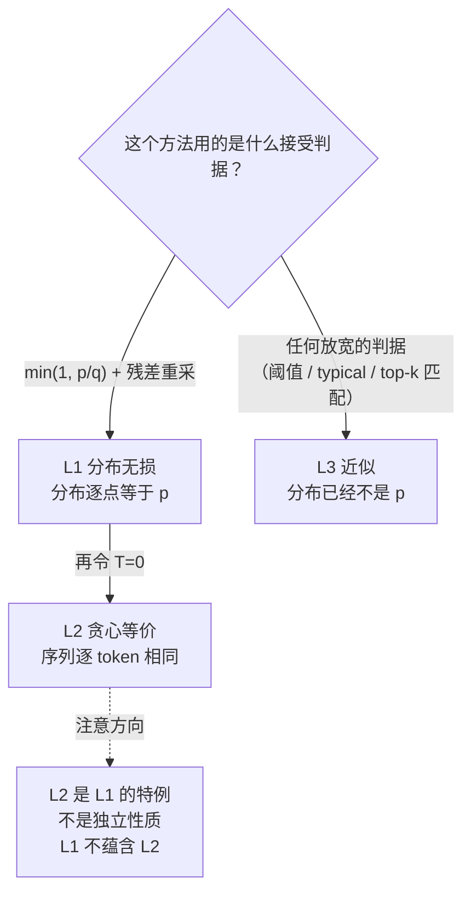

# 07 无损的三种口径 —— 分布无损不等于结果相同

## 1. 一句话

"投机采样是无损的"这句话在社区里被用在**三种完全不同的意义**上：**L1 分布无损**（输出是目标分布的精确样本，但两次运行结果可以不同）、**L2 贪心等价**（$T=0$ 时输出序列逐 token 相同）、**L3 近似**（放宽判据，分布已经变了）。本篇把三者分清，并给出三条可执行的判据 —— 其中最重要的一条是：**「开投机后输出变了」不是 bug，「开投机后分布变了」才是**。

---

## 2. 从哪来：一个每周都会被问一次的问题

> "我把投机解码打开，同一个 prompt、同一个 seed，输出和以前不一样了。是不是实现有 bug？"

这个问题在各个引擎的 issue 区反复出现。它之所以让人困惑，是因为提问者读到的"无损"和实现者说的"无损"**不是同一个词**。

- 实现者说的是 **L1**：输出是目标模型分布 $p$ 的精确样本，$\Pr[Y=y]=p(y)$ 逐点相等（[[04-拒绝采样修正-无损性的完整证明]] 已证明）。
- 提问者理解的是"**结果一样**"，那是 **L2**。

**这个混淆的源头，其实就在奠基论文自己身上。** 本库调研（`_research/RS-2-社区讲解盘点与评点.md`）逐字比对后发现：Leviathan 等 (arXiv 2211.17192) 的**摘要**写的是

> "without any changes to the outputs" / "with identical outputs"

而**正文**写的是

> "without changing the model output **distribution**"

同一篇论文里两种口径并存，而绝大多数二手讲解只抄了摘要那一句。**所以这不是社区不认真，而是一个从源头就带偏了的传播链** —— 这也说明为什么本库要把口径标注做成铁律一，而不是靠自觉。

L1 **不蕴含** L2。这不是文字游戏，它直接决定了你该怎么排查问题：**用"对比单条输出"去验证 L1，永远会得到"不一致"的结论，然后你会去修一个不存在的 bug。**

---

## 3. 三种口径的精确定义

| 口径 | 精确表述 | 同一 prompt 跑两次结果一样吗 | 谁属于这一类 |
|---|---|---|---|
| **L1 分布无损**<br/>(distribution-exact) | 输出流的联合分布与目标模型自回归分布**逐点相等** | **不一定** —— 温度 >0 时本来就不一样 | 标准投机采样、EAGLE 系列、MTP 草稿、SpecInfer 的树验证 |
| **L2 贪心等价**<br/>(greedy-exact) | $T=0$ 时输出序列与目标模型贪心解码**逐 token 相同** | 一样（贪心本身是确定性的） | 上述方法在 $T=0$ 的**退化特例**；blockwise parallel decoding |
| **L3 近似**<br/>(lossy) | 放宽了接受判据，输出分布**不等于** $p$ | 不一定，且分布已变 | Medusa 的 typical acceptance、各种阈值放宽、部分自投机设置 |



**本库铁律一**：正文里出现"无损"必须在同一段标明是三者中的哪一个。没标口径的"无损"视为未完成，`_lab/verify.py --rules` 会把它标出来。

---

## 4. 逐步推导

### 4.1 L1 为什么不蕴含 L2

L1 是关于**分布**的命题，L2 是关于**样本**的命题。两个随机过程可以分布完全相同而实现路径完全不同。

具体到实现层面，投机采样改变了随机数的**消耗方式**：

| | 朴素解码每产出一个 token | 投机采样每产出一个 token |
|---|---|---|
| 随机数消耗 | 1 次（从 $p$ 采样） | 1 次接受判定的 $R\sim U(0,1)$；若拒绝还要再采一次残差；若全接受还要采赠品 token |

所以即便固定种子，两条路径消耗随机数的次数与顺序都不同，产生的序列自然不同。**这与实现是否正确无关**，是算法结构决定的。

**推论（一条很有用的判据）**：若你要求"开关投机后逐 token 一致"，唯一能做到的配置是 $T=0$（L2）。任何 $T>0$ 的配置下要求这一点，都是要求一件数学上做不到的事。

### 4.2 L2 为什么成立：$T\to0$ 时随机性完全消失

$T\to0$ 时 $p$ 与 $q$ 都退化成 one-hot：$p=\mathbf e_{a}$（$a=\arg\max p$），$q=\mathbf e_{b}$（$b=\arg\max q$）。

草稿只会提出 $x=b$。分两种情形：

**情形一：$a=b$（两模型 argmax 一致）**
$$
p(x)=q(x)=1\ \Rightarrow\ \min\!\Big(1,\frac{p(x)}{q(x)}\Big)=1\ \Rightarrow\ \textbf{必接受},\ \text{输出}=b=a
$$

**情形二：$a\ne b$（argmax 不一致）**
$$
p(x)=p(b)=0\ \Rightarrow\ \min\!\Big(1,\frac{0}{1}\Big)=0\ \Rightarrow\ \textbf{必拒绝}
$$
拒绝后从残差分布采：
$$
\max(0,\,p-q)=\max(0,\,\mathbf e_a-\mathbf e_b)=\mathbf e_a\quad(a\ne b)
$$
归一化后仍是 $\mathbf e_a$，故**输出 $=a$**。

**两条路都输出 $a=\arg\max p$。** 判据里的 $R$ 从未起过作用（接受概率非 0 即 1），随机性完全消失。因此：

$$
\boxed{\ T=0\ \text{时，投机采样的输出与贪心解码逐 token 相同，且与草稿模型的好坏无关}\ }
$$

草稿差只是让情形二出现得更频繁 —— 拒绝更多、每轮产出更少、**更慢**，但**一个 token 都不会错**。

实测（`python _lab/caliber.py --greedy`）：$|V|\in\{5,8\}$、草稿扰动 $\varepsilon\in\{0,1,3,8\}$、$\gamma\in\{2,4\}$ 共 16 组配置，argmax 一致率低至 **0.500**，生成 60 个 token，**全部"相同"**（`_lab/test_caliber.py::test_greedy_speculative_equals_greedy`）。

### 4.3 L3 的偏差：它是结构性的，不是能调掉的

L3 的典型做法是放宽接受判据以换取更长的接受长度。本库用一个**最简化身**来量化这类做法的代价：判据改成"草稿 token $x$ 只要 $p(x)\ge\varepsilon$ 就接受"（绝对阈值，不看 $q$），拒绝时仍走原来的残差分布。

> **口径声明**：这是对该**类**判据的一个模型，**不是 Medusa 的确切规则**（Medusa 的 typical acceptance 用的是与熵相关的自适应阈值）。下面的数字适用于这个模型，用来说明机制，不能当作 Medusa 的实测偏差。

实测（`python _lab/caliber.py --typical`，$|V|=5,\gamma=3$，$p=[0.2024,0.1564,0.3386,0.1982,0.1045]$）：

| 阈值 $\varepsilon$ | 首 token 最大逐点误差 | 与 $p$ 的 TV 距离 | 口径 |
|---|---|---|---|
| 0.00 | 0.1719 | 0.2004 | L3 近似 |
| 0.02 | 0.1719 | 0.2004 | L3 近似 |
| 0.05 | 0.1719 | 0.2004 | L3 近似 |
| 0.10 | 0.1719 | 0.2004 | L3 近似 |
| 0.20 | **0.2201** | 0.2608 | L3 近似 |
| 0.50 | **0.6598** | 0.6598 | L3 近似 |

三条读法，**第三条与直觉相反**：

1. $\varepsilon=0$（无条件接受草稿）时，输出分布**就是草稿分布 $q$**，误差 $0.1719=\max|p-q|$（`_lab/test_caliber.py::test_zero_threshold_reproduces_draft_distribution`）。这给了偏差的一个直观上界：**最坏情况就是"你其实在用草稿模型"**。
2. $\varepsilon$ 从 0 涨到 0.10 期间误差不变 —— 本例 $p$ 的最小分量是 0.1045，阈值还没够到任何 token，判据事实上没生效。
3. $\varepsilon$ 继续涨到 0.20、0.50，误差**反而变大**（0.2201 → 0.6598）。

第 3 条的机制值得记住：被拒绝的质量走的是 $\mathrm{norm}(\max(0,p-q))$ 这条补偿路径，而**那条补偿是专为 $\min(1,p/q)$ 判据配套设计的**。换了判据，补偿就不再匹配；拒绝得越多，走错路的质量越多，偏差越大。

$$
\Rightarrow\ \textbf{判据与补偿必须成对更换。只改判据不改补偿，"调保守一点"反而更糟。}
$$

（`_lab/test_caliber.py::test_raising_threshold_makes_bias_worse_not_better`）

这条解释了为什么严肃的 L3 方法（如 SpecTr 的最优传输视角、SpecInfer 的多分支拒绝采样）都要**重新推导整套接受-补偿机制**，而不是简单地在原判据上加个阈值。

---

## 5. 小数字算例：三种口径在同一组模型上的样子

同一对模型（$|V|=5,\gamma=3$，target seed=0，draft 扰动 $\varepsilon=1.2$）：

| 做法 | 首 token 分布的最大逐点误差 | 口径 | 结论 |
|---|---|---|---|
| 标准判据 + 残差重采 | $1.665\times10^{-16}$ | **L1** | 无偏 |
| 同上，但不发赠品 token | $8.327\times10^{-17}$ | **L1** | 无偏（只是慢） |
| 拒绝后直接从 $p$ 重采 | $1.322\times10^{-1}$ | 错误实现 | **有偏** |
| 判据写成 $p\ge q$ 就接受 | $2.238\times10^{-1}$ | 错误实现 | **有偏** |
| 绝对阈值 $\varepsilon=0.2$ 接受 | $2.201\times10^{-1}$ | **L3** | 有偏（设计选择） |
| $T\to0$，标准判据 | 0（序列逐 token 相同） | **L2** | 逐 token 相同 |

（复跑：`python _lab/spec.py --bias` 与 `python _lab/caliber.py --typical`、`--greedy`）

**注意第 4 行与第 5 行的误差量级几乎一样（0.224 vs 0.220），但性质完全不同**：第 4 行是**实现写错了**（作者以为自己在做 L1），第 5 行是**明知会偏、为换速度主动选的**（作者知道自己在做 L3）。数字分不出它们，只有意图和文档能分出来 —— 所以口径标注不是形式主义，它是唯一能区分"bug"和"设计"的东西。

---

## 6. 代码验证

```python
# _lab/caliber.py —— L2 的核心：T=0 时两条路吐出同一个 token
def greedy_speculative(target, draft, s0, n, gamma):
    P, Q = onehot_model(target), onehot_model(draft)
    ...
    a = min(1.0, ps[i][x] / qv) if qv > 0 else 0.0
    if a >= 1.0:
        chunk.append(x)                                   # argmax 一致 -> 接受
    else:
        chunk.append(int(residual_dist(...).argmax()))    # 不一致 -> 残差退化成 argmax(p)
        break
```

配套断言共 11 条（`_lab/test_caliber.py`），覆盖 L2 的 6 组参数、argmax 大量分歧下的 L2、one-hot 模型自洽性、L3 在四个阈值下均有偏、$\varepsilon=0$ 复现草稿分布、以及"提高阈值让偏差更大"这条反直觉结论。

---

## 7. 口径与坑：三条可执行的判据

### 判据一：区分"输出变了"与"分布变了"

| 现象 | 是不是问题 | 怎么查 |
|---|---|---|
| $T>0$，开关投机后输出序列不同 | **不是问题**（L1 本来就允许） | 不用查 |
| $T=0$，开关投机后输出序列不同 | **是问题**（违反 L2） | 查 §8 那几条对齐前提 |
| $T>0$，大量样本下的分布统计对不上 | **是问题**（违反 L1） | 做分布检验或精确枚举对拍 |

**验证 L1 的正确方式不是对比单条输出**，而是二选一：① 大样本下比较 token 频率/困惑度等统计量；② 在玩具规模上做精确枚举对拍（[[04-拒绝采样修正-无损性的完整证明]] §6 的做法）。

**一个便宜且高信噪比的技巧**：先把温度设成 0，检查 L2 是否逐 token 成立。L2 是确定性的，一条输出就能判定，而且它能抓出绝大多数对齐类 bug（position id、tokenizer、KV 回滚）。**T=0 对拍应当是投机解码上线前的第一项检查。**

### 判据二：区分"慢"与"错"

- 少发赠品 token、接受率低、$\gamma$ 设得不好 → **慢**，分布仍然正确。
- 判据写错、补偿写错、前缀没对齐 → **错**，而且不会报错。

排查时先做 L2 对拍（判定"错"），通过之后再去调接受率（判定"慢"）。**顺序反了会把正确性问题误诊成性能问题**，这是本主题最常见的排查失误。

### 判据三：报数字时口径必须可比

- 不同口径的方法**不能横比 acceptance length**。L3 用分布正确性换来的接受长度，与 L1 的接受长度不是同一个量纲的东西。
- 一篇材料若声称"无损"却没说口径，先默认它没想清楚，去看它的接受判据代码：**看拒绝分支从哪个分布重采**，一眼就能定性。

---

## 8. 失效条件

L1 与 L2 各自的前提（详见 [[04-拒绝采样修正-无损性的完整证明]] §8），这里按"排查顺序"重列：

1. **$p_i$ 与 $q_i$ 的条件前缀没对齐** —— 树形草稿的 position id 用错是最常见形态（[[16-树形草稿与树注意力-mask构造与验证]] §4.1）。**L1、L2 同时失效**，T=0 对拍能抓出来。
2. **tokenizer 不同** —— $p(x)/q(x)$ 无意义。L1、L2 同时失效。
3. **采样参数不一致**（温度/top-p/top-k 在两侧施加得不同）—— 通常**仍然无损但接受率塌方**，属于"慢"不属于"错"（[[05-接受率alpha-定义口径与怎么测]]）。
4. **低精度数值** —— $p$ 与 $q$ 由不同精度/不同 kernel 算出时，$p(x)/q(x)$ 在 $p\approx q$ 处对舍入极敏感。此时"无损"只在浮点误差意义下成立，**严格说已经不是 L1**。模型跑在 fp8/int4 上时报"无损"必须注明这一点。
5. **判据被主动放宽** —— 口径降到 L3，这是设计选择，必须如实标注（§4.3）。
6. **L2 特有的失效**：$T=0$ 但存在 argmax **平局**时，平局的打破规则（tie-breaking）在草稿与目标两侧必须一致，否则序列会分叉。真实词表上平局罕见但非不可能，尤其在低精度下。

---

## 9. 自测题

1. 用户报告"$T=0.7$ 时开投机前后输出不同"，你的第一反应是什么？
   <details><summary>答案要点</summary>这是 L1 允许的正常现象，不是 bug。正确回应：解释 L1 vs L2 的区别；若要验证正确性，建议改用 $T=0$ 做逐 token 对拍（L2），或做大样本分布检验。不要去"修"这个不存在的 bug。</details>

2. 为什么 $T=0$ 时草稿模型再差也不会让输出出错，只会让它变慢？
   <details><summary>答案要点</summary>见 §4.2：argmax 一致则必接受、输出 $\arg\max p$；不一致则必拒绝，而残差分布在 $T\to0$ 下退化成 $\arg\max p$ 处的 one-hot，输出仍是 $\arg\max p$。两条路输出同一个 token。草稿差只是让第二种情形更频繁，即每轮产出更少。</details>

3. 某实现为了提高接受率，把判据从 $\min(1,p/q)$ 改成"$p(x)\ge0.05$ 就接受"，其余不变。作者认为"阈值这么小，偏差可以忽略"。对吗？
   <details><summary>答案要点</summary>不对，而且错得比他想的更严重。§4.3 实测显示：阈值很小时判据事实上等于"无条件接受"，输出分布**就是草稿分布**，误差达到 $\max|p-q|$（本例 0.1719）——这是偏差的最大值而不是最小值。另外，把阈值调大也不能改善，因为补偿路径不匹配（误差反而涨到 0.66）。正确做法是判据与补偿成对重新推导。</details>

4. 为什么说"L2 是 L1 的退化特例，不是一条独立的性质"？
   <details><summary>答案要点</summary>因为 L2 就是 L1 在 $T\to0$ 下的表现：分布退化成 one-hot 后，"分布相等"自动意味着"样本相等"（点分布只有一个可能取值）。所以任何满足 L1 的方法在 $T=0$ 下自动满足 L2；反之不成立（一个只在贪心下对齐的方法未必满足 L1）。</details>

5. 你要为团队写一条"投机解码上线检查项"，只能写三条，写哪三条？
   <details><summary>答案要点</summary>① $T=0$ 逐 token 对拍（判定正确性，最便宜的一条）；② 树形草稿时做"树 vs 逐链"等价性对拍（抓 position id / mask bug）；③ 在**目标 batch 区间**测吞吐与 P99 TPOT 两条线，确认没有落进负收益区（[[18-batch与吞吐-收益衰减曲线]]、[[19-负收益全解-什么时候投机反而更慢]]）。前两条查"错"，第三条查"值不值"。</details>

---

## 10. 延伸与双链

- 证明本体：[[04-拒绝采样修正-无损性的完整证明]]
- 直觉与走查：[[02-最小可跑的投机采样-手算一遍]]
- 接受率的口径问题（另一组高频混淆）：[[05-接受率alpha-定义口径与怎么测]]
- 加速比公式的口径问题：[[06-期望接受长度与加速比模型-完整推导]]
- 对齐前提最容易破的地方：[[16-树形草稿与树注意力-mask构造与验证]]
- L3 的代表作与它的取舍：[[12-Medusa-多头草稿与树注意力的诞生]]
- 引擎里各方法分别是什么口径：[[20-主流引擎实现-vLLM与SGLang与TensorRTLLM]]
- 社区在口径上翻的车：[[26-社区精彩解释精选-好在哪与错在哪]]、[[27-常见误解与判据]]

---

### 本篇验证

- `_lab/test_caliber.py::test_greedy_speculative_equals_greedy` —— **L2 的判定性验证**：6 组 $(V,\varepsilon,\gamma)$ 配置下，$T=0$ 投机输出与贪心解码逐 token 相同。
- `_lab/test_caliber.py::test_greedy_equivalence_holds_even_when_argmax_disagrees` —— argmax 一致率 <0.8 时 L2 仍成立（验证 §4.2 的"与草稿好坏无关"）。
- `_lab/test_caliber.py::test_onehot_model_is_deterministic` —— $T\to0$ 退化模型的自洽性。
- `_lab/test_caliber.py::test_typical_acceptance_is_biased` —— **L3 在四个阈值下均有偏**。
- `_lab/test_caliber.py::test_zero_threshold_reproduces_draft_distribution` —— $\varepsilon=0$ 时输出分布就是草稿分布（误差 $<10^{-12}$），给出偏差上界。
- `_lab/test_caliber.py::test_raising_threshold_makes_bias_worse_not_better` —— **验证 §4.3 第 3 条反直觉结论**：阈值 0.05→0.20→0.50，误差单调变大。
- `_lab/test_lossless.py::test_naive_resample_is_biased`、`::test_threshold_rule_is_biased`、`::test_no_bonus_token_is_still_lossless` —— §5 表格中"错误实现"与"慢但不错"三行的出处。
- 可复跑：
  - `python _lab/caliber.py --greedy` —— §4.2 的 16 组 L2 对拍，全部"相同"
  - `python _lab/caliber.py --typical` —— §4.3 的阈值-偏差表
  - `python _lab/spec.py --bias` —— §5 表格前四行

### 本篇来源

- Yaniv Leviathan 等 — https://arxiv.org/abs/2211.17192 （2022-11）与 Charlie Chen 等 — https://arxiv.org/abs/2302.01318 （2023-02）。两篇都明确写的是**分布无损（L1）**，措辞严谨；社区转述时把它读成"结果相同"是二次加工造成的失真，不是原文的问题。
- 本篇 §2 关于"混淆源头在论文摘要"的比对，来自本库 `_research/RS-2-社区讲解盘点与评点.md` 的逐字核查（41 份材料，用 ar5iv 全文抽句）。该调研的另一条结论值得一并记住：**踩这个坑的主要是英文权威源**（含若干厂商官方博客），而本次实际读到的中文材料在**接受判据与残差分布上全部写对**，弱项在口径标注与时效。详见 [[26-社区精彩解释精选-好在哪与错在哪]]。
- Tianle Cai 等, *Medusa* — https://arxiv.org/abs/2401.10774 （2024-01）。typical acceptance 的出处。论文本身对"这是近似"是有交代的，但**大量二手讲解把 Medusa 和标准投机采样并列称为"无损加速"**，这是本主题最普遍的口径错误之一（见 [[26-社区精彩解释精选-好在哪与错在哪]]）。注意本篇 §4.3 用的是该**类**判据的简化模型，不是 Medusa 的确切规则。
- 本篇 §4.3 的"提高阈值反而更糟"是本库跑数字得到的结论，最初写在代码注释里的说法（"提高阈值会让偏差变小"）被实测推翻后重写。过程保留在 `_lab/caliber.py` 的输出文字里。
