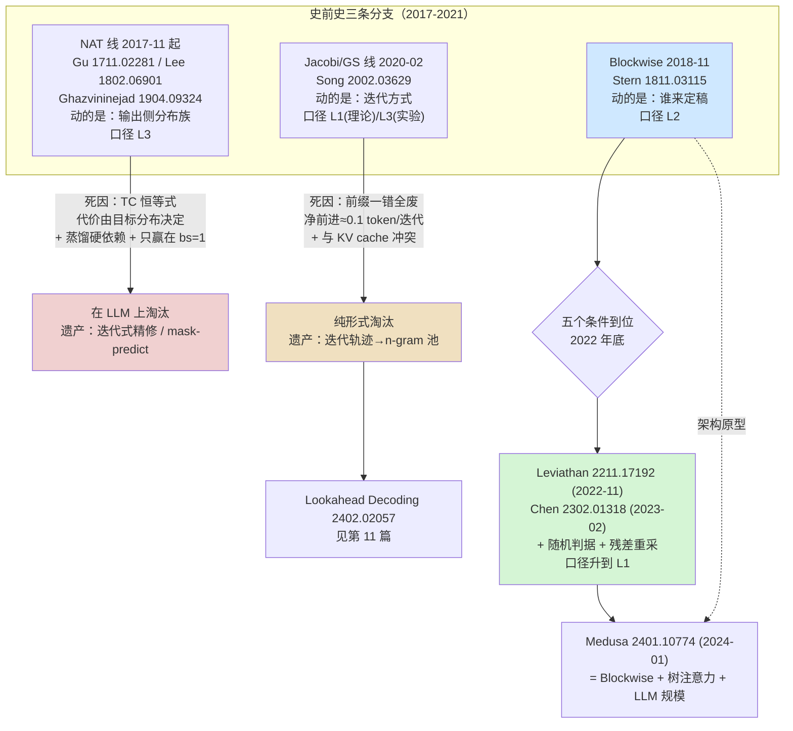

# 08 史前史 —— 2018 并行解码与非自回归的失败

## 1. 一句话

2017–2022 年间，人们为了摆脱"一次一个 token"分头走了三条路：**改输出侧的分布族**（非自回归 NAT）、**改迭代方式**（Jacobi / Gauss-Seidel 不动点）、**改"谁来定稿"**（Blockwise Parallel Decoding）。前两条到今天都没能在 LLM 上活下来，第三条活了 —— 而且它就是投机采样的直系祖先。

本篇要讲清的核心区分是：Stern 等（2018-11，arXiv:1811.03115）拿到的是 **L2 贪心等价**（$T=0$ 时逐 token 与贪心解码相同），**不是 L1 分布无损**。这一个口径之差，正是 2022–2023 那两篇必须把整套算法重做一遍的原因。

---

## 2. 前一代卡在哪：2017 年之后，训练并行了，生成没有

Transformer（Vaswani 等，2017-06，arXiv:1706.03762，Google Brain / Google Research）把**训练**从 $O(T)$ 的串行链条变成了一次矩阵乘法：$T$ 个位置的 loss 可以在同一次前向里算出来。但**生成**没有跟着变 —— 第 $t$ 个 token 的输入是第 $t-1$ 个 token 的输出，这条依赖链没有被 attention 消掉。

Stern 等在摘要里把这件事写得很干净（arXiv:1811.03115 摘要逐字）：

> "While common architecture classes such as recurrent, convolutional, and self-attention networks make different trade-offs between the amount of computation needed per layer and the length of the critical path at training time, **generation still remains an inherently sequential process**."

于是 2018 年前后出现了一个共同的提问方式：**既然一次前向可以并行处理 $T$ 个位置，为什么生成时只用其中一个位置？** 三条分支就是对这个问题的三种回答，它们的分歧在于**动哪一样东西**：

| 分支 | 动的是什么 | 目标模型的自回归分布还在吗 | 代表工作 |
|---|---|---|---|
| **非自回归 NAT** | **输出侧的分布族** —— 假设各位置条件独立 | **不在了**（换了模型） | Gu 等 2017-11 |
| **Jacobi / GS** | **迭代方式** —— 把解码看成解不动点方程 | 在（$\epsilon=0$ 时理论上收敛到同一结果） | Song 等 2020-02 |
| **Blockwise** | **谁来定稿** —— 辅助头提议、原模型验证 | 在（贪心口径下逐 token 相同，**L2**） | Stern 等 2018-11 |

后面会看到，第三列就是生死线。

---

## 3. 机制拆解：三条分支各自做了什么

### 3.1 Blockwise Parallel Decoding —— 投机采样的直系祖先

| 项 | 值 |
|---|---|
| **年月 / arXiv** | **2018-11**（v1 2018-11-07，仅 v1）· **arXiv:1811.03115** |
| **标题** | *Blockwise Parallel Decoding for Deep Autoregressive Models* |
| **作者 / 机构** | **Mitchell Stern（UC Berkeley）**、Noam Shazeer、Jakob Uszkoreit（**Google Brain**）。论文脚注："Work performed while the author was an intern at Google Brain" |
| **会议** | NeurIPS 2018 |
| **本库口径** | **L2 贪心等价**（exact-match 变体）；论文 §5 的三种放宽准则属 **L3 近似** |

（元数据经 `export.arxiv.org` Atom API 核对：标题、三位作者、v1 日期 2018-11-07 一致。）

**机制，三步循环**（记原模型的 next-token 分布为 $p_1$，辅助头为 $p_2,\dots,p_k$）：

1. **Predict（起草）**：$k$ 个输出头基于**同一前缀** $\hat y_{\le j}$ 各自给出 $+1,\dots,+k$ 位置的 argmax：
   $$\hat y_{j+i}=\arg\max_y p_i(y\mid \hat y_{\le j},\,x),\qquad i=1,\dots,k$$
   注意第 $i$ 个提案**不** condition 在第 $i-1$ 个提案上 —— 这正是必须验证的原因。
2. **Verify（验证）**：原模型一次并行前向拿到 $k$ 个位置的 $p_1$，找最大的 $\hat k$ 使
   $$\hat y_{j+i}=\arg\max_y p_1(y\mid \hat y_{\le j+i-1},\,x)\quad\text{对所有 }i\le \hat k$$
3. **Accept（接受）**：$j\leftarrow j+\hat k$，回到第 1 步。

**三处值得单独记住的设计**：

- **$\hat k\ge1$ 的保底**。$\hat y_{j+1}$ 本身就来自 $p_1$，所以第一个提案必然通过验证，最坏退化成普通贪心解码，**永不倒退**。这条与投机采样"每轮至少产出 1 个 token"是同一件事。
- **head 架构不是 $k$ 个独立模型**（原文逐字）："we insert **a single feedforward layer** with hidden size $k\times d_{hidden}$ and output size $k\times d_{model}$ between the decoder output and the final projection layer... A residual connection between the input and each of the $k$ outputs is included. **The original projection layer is identically applied to each of the $k$ outputs**." —— 一层共享的多输出 FFN，词表投影完全复用。**这就是六年后 Medusa 的架构原型。**
- **Combined scoring and proposal**。朴素实现每步要 2 次前向（$m$ 步变 $2m/k$ 步）；把最终投影层维度扩 $k$ 倍、每个位置算 $k$ 个 softmax，第 $n$ 次验证与第 $n+1$ 次起草就能合并，迭代数降到 $m/k+1$。

**它没做的事（最常见的误记）**：对 NeurIPS camera-ready 全文做穷尽检索，解码语境下的 `sampl*` **0 次**、`rejection` **0 次**、`temperature` **0 次**、`stochast*` **0 次**。**Stern 2018 没有提出拒绝采样，也不支持随机采样。** 说它"提出了 lossless speculative sampling"是错的；说它贡献了算法骨架与自起草架构是准确的。

### 3.2 非自回归生成（NAT）—— 一次并行吐出整句

| 论文 | arXiv / v1 | 会议 | 一作 / 机构 |
|---|---|---|---|
| Gu, Bradbury, Xiong, Li, Socher — *Non-Autoregressive Neural Machine Translation* | **1711.02281** / **2017-11** | ICLR 2018 | Jiatao Gu（**香港大学**，Salesforce Research 实习期间完成）；Bradbury / Xiong / Socher 属 **Salesforce Research** |
| Lee, Mansimov, Cho — *Deterministic NAT by Iterative Refinement* | **1802.06901** / **2018-02** | EMNLP 2018 | Jason Lee（**纽约大学 NYU**） |
| Ghazvininejad, Levy, Liu, Zettlemoyer — *Mask-Predict* | **1904.09324** / **2019-04** | EMNLP-IJCNLP 2019 | Marjan Ghazvininejad（**FAIR Seattle**） |

**本库口径：三篇全部 L3 近似** —— 它们训练的是**新模型**，条件独立假设直接改掉了输出分布，不是把原模型的分布保下来。

**机制**：Gu 2017 一次前向并行产出整个目标序列（配 fertility 预测长度）；Lee 2018 加入迭代式 refinement；Ghazvininejad 2019 用 conditional masked LM 做 mask-predict 迭代。

**它们共同的建模假设**，把序列分布写成各位置独立的乘积：

$$
P_{\text{NAT}}(y_1,\dots,y_T\mid x)=\prod_{t=1}^{T}P(y_t\mid x)
$$

对照自回归的链式分解：

$$
P_{\text{AR}}(y_1,\dots,y_T\mid x)=\prod_{t=1}^{T}P(y_t\mid y_{<t},\,x)
$$

差别只有 $y_{<t}$ 这一项，但它就是全部代价（§4.3 会把这份代价算成一个数）。

### 3.3 Jacobi / Gauss-Seidel 不动点解码

| 项 | 值 |
|---|---|
| **年月 / arXiv** | **2020-02**（v1 2020-02-10，v2 2021-06-11）· **arXiv:2002.03629** |
| **一作 / 机构** | Yang Song（**Stanford**）；Chenlin Meng、Stefano Ermon 同属 Stanford；Renjie Liao（**多伦多大学 + Vector Institute**） |
| **会议** | ICML 2021，PMLR v139, pp.9791–9800 |
| **本库口径** | 理论上 **L1 分布无损**（$\epsilon=0$）；实验用 $\ell_\infty<0.01$ 容差跑，实际降级为 **L3 近似** |

**机制**：把自回归递推 $\mathbf s_t=h_t(\mathbf u,\mathbf s_{1:t-1})$ 写成一个**三角非线性方程组**

$$
h_t(\mathbf u,\mathbf s_{1:t-1})-\mathbf s_t=0,\qquad t=1,\dots,T
$$

然后用 Jacobi 或 Gauss-Seidel 并行迭代求这个不动点。

**它最重要的贡献是一句话的视角转换**（原文逐字）："**running one iteration of GS is the same as performing standard feedforward computation**" —— 标准自回归解码就是 Gauss-Seidel 迭代一步。这句话给整个"并行解码"方向提供了统一的数学框架。Proposition 1 保证 $\epsilon=0$ 时"**yields the same result as standard feedforward computation in at most $T$ parallel iterations**"。

**这条线在 LLM 上长成了 Lookahead Decoding**（Fu 等，2024-02，arXiv:2402.02057，ICML 2024）：把 Jacobi 迭代的历史轨迹存成 n-gram 池当草稿。机制与取舍见 [[11-无模型草稿-promptlookup与ngram与检索]]，本篇不展开。

Santilli 等（**2023-05**，v1 2023-05-17，**arXiv:2305.10427**，一作 Andrea Santilli，**罗马大学 Sapienza**，ACL 2023 main）把它搬到了机器翻译上，口径是 **L2 贪心等价**（定理：$\le m$ 次迭代内与 greedy 自回归结果相同；无法与 beam search 结合）。

---

## 4. 逐步走查：三条分支各自死在哪一步

### 4.1 Blockwise 的一个 step 里发生了什么

设 $k=4$，当前已生成前缀 `The cat sat`。

| 阶段 | 发生的事 | 形状 / 成本 |
|---|---|---|
| Predict | 一层多输出 FFN 从最后一个隐状态同时给出 4 个位置的 argmax：`on`, `the`, `mat`, `.` | 增广模型的一次前向，query token 数 = 1 |
| Verify | 把 `The cat sat on the mat .` 一次喂进原模型，拿 4 个位置的 $p_1$ | **一次前向，query token 数 = 4** |
| 比对 | 位置 1：$\arg\max p_1(\cdot\mid$`The cat sat`$)=$ `on` ✓；位置 2：$=$ `the` ✓；位置 3：$=$ `down` ✗ | $\hat k=2$ |
| Accept | 前缀变成 `The cat sat on the`，回到 Predict | 本轮净产出 2 个 token |

**这里已经出现了投机采样的全部骨架**：小的东西提议、大的东西一次并行验证、接受最长匹配前缀、失败点截断。差别只有一处 —— **"比对"用的是 argmax 相等**。

### 4.2 为什么 argmax 相等只能给到 L2

把 §4.1 的比对写成单位置的形式：

$$
Y=\begin{cases}
x, & x=\arg\max_y p(y)\quad(\text{接受})\\[2pt]
\arg\max_y p(y), & \text{否则}\quad(\text{回退到打分模型自己的输出})
\end{cases}
$$

**两条分支吐出的是同一个 token。** 所以

$$
\boxed{\;\Pr[Y=y]=\mathbb 1\big[y=\arg\max p\big]\;}
$$

输出分布**恒等于 $\arg\max p$ 处的 one-hot，与草稿 $q$ 完全无关**。

这个结论有两面：

- **好的一面**：它与目标模型的贪心解码**逐 token 相同**，且与辅助头的好坏无关 —— 这正是本库口径里的 **L2 贪心等价**（[[07-无损的三种口径-分布无损不等于结果相同]] §3）。$T=0$ 时目标分布本身就是 one-hot，此时 $\mathbb 1[y=\arg\max p]=p(y)$，**L2 就是 L1 在 $T=0$ 的退化特例**。
- **坏的一面**：$T>0$ 时目标分布不是 one-hot，这个判据把采样这件事**整个关掉了**。偏差有闭式：

$$
\mathrm{TV}\big(\text{输出},\,p\big)=1-\max_y p(y)
$$

实测（`python _lab/prehistory.py --exact`，$|V|=5$，$p(\cdot\mid s{=}0)=[0.2024,0.1564,0.3386,0.1982,0.1045]$）：

| 草稿扰动 $\varepsilon$ | argmax 一致率 | 最大逐点误差 | $\mathrm{TV}(\text{out},p)$ | 口径 |
|---|---|---|---|---|
| 0.0 | 1.000 | 0.6614 | 0.6614 | **L3 近似**（在 $T>0$ 下） |
| 0.5 | 0.800 | 0.6614 | 0.6614 | **L3 近似** |
| 1.2 | 0.600 | 0.6614 | 0.6614 | **L3 近似** |
| 3.0 | 0.200 | 0.6614 | 0.6614 | **L3 近似** |
| 8.0 | 0.200 | 0.6614 | 0.6614 | **L3 近似** |

（实测，复跑命令见上；$1-\max p=1-0.3386=0.6614$，与闭式逐位相同。）

**这张表最该看的是"五行数字一模一样"**：偏差与草稿好坏**完全无关**。这与 L1 判据的性质恰好相反 —— L1 下草稿只影响速度不影响分布（[[04-拒绝采样修正-无损性的完整证明]] §6），而 exact-match 判据下草稿连分布都碰不到。

$$
\Rightarrow\ \textbf{要支持带温度的采样，不是"换个更好的草稿"，是必须换判据。}
$$

### 4.3 从 L2 到 L1 要改的恰好两处

对照 [[04-拒绝采样修正-无损性的完整证明]] §3.2 的算法，2022–2023 那两篇相对 Stern 2018 改的就是这两行：

| | Stern 2018（L2） | Leviathan 2022-11 / Chen 2023-02（L1） |
|---|---|---|
| **接受判据** | $x=\arg\max p$（确定性、精确匹配） | $r\sim U(0,1)$，$r<\min\!\big(1,\tfrac{p(x)}{q(x)}\big)$（**随机**） |
| **拒绝后怎么办** | 回退到 $\arg\max p$ | 从**残差分布** $p'=\mathrm{norm}(\max(0,p-q))$ 重采 |

这两处必须**成对**更换：判据决定了哪些质量已经从接受路径流出去了，补偿必须把这部分扣掉才能配平（[[07-无损的三种口径-分布无损不等于结果相同]] §4.3 给出了"只改一处会更糟"的实测）。

两篇奠基论文对 Stern 的批评说的就是这件事：

- Leviathan 等 §5 逐字三点："**(1) it only supports greedy decoding (temperature=0) and not the general stochastic setting, (2) it requires additional training of a custom model, and (3) focuses on preserving down-stream task quality, instead of guaranteeing identical outputs.**"
- Chen 等逐字："These methods have yet to be adapted to typical language model use-cases since they **either only work with greedy sampling, bias the results or are focused on other modalities**. Further, to our knowledge **none of these techniques have been scaled to distributed setups**."

### 4.4 NAT 死在哪：条件独立假设的代价是可以算出来的

社区讲 NAT 的失败常停在"token 重复""翻译不通顺"这类现象描述上。这些是症状，不是病因。病因在 Gu 等 2017 的 §2.3 里写得非常清楚（逐字）：

> "such a model exhibits **complete conditional independence**... Intuitively, such a decoder is akin to **a panel of human translators each asked to provide a single word of a translation independently of the words their colleagues choose**."
> "'Thank you.' ... can be accurately translated into German as any one of 'Danke.', 'Danke schön.', or 'Vielen Dank.' ... This target distribution **cannot be represented as a product of independent probability distributions**... because a conditionally independent distribution cannot allow 'Danke schön.' and 'Vielen Dank.' **without also licensing 'Danke Dank.' and 'Vielen schön.'** We call this the '**multimodality problem**'."

**这段话可以直接变成一个数。** 设目标联合分布 $P$，NAT 的模型族是所有可写成 $\prod_t Q_t(y_t)$ 的分布。在这个族里离 $P$ 最近的那一个（KL 意义下）就是**边缘乘积**，而它与 $P$ 的距离恰好等于 **total correlation**：

$$
\min_{Q\ \text{独立}}\ \mathrm{KL}(P\,\|\,Q)\;=\;\mathrm{TC}(P)\;=\;\sum_{t=1}^{T}H(Y_t)-H(Y_1,\dots,Y_T)
$$

$T=2$ 时 $\mathrm{TC}=I(Y_1;Y_2)$，就是被丢掉的互信息。

**这条恒等式是本篇的关键**，因为它说明：**NAT 付出的代价由目标分布自己决定，与模型有多大、训练数据有多少、算力有多强都无关。** 只要模型族被限定成"各位置独立"，这份 KL 就必须付。

用 Gu 的例子手算一遍（$|V|$ 各为 2，两个位置）：目标是 `Danke schön` 与 `Vielen Dank` 各 0.5。

| | `schön` | `Dank` | 边缘 |
|---|---|---|---|
| `Danke` | **0.50** | 0 | 0.5 |
| `Vielen` | 0 | **0.50** | 0.5 |
| 边缘 | 0.5 | 0.5 | |

边缘乘积给出的最优独立近似是四格各 0.25：

| | `schön` | `Dank` |
|---|---|---|
| `Danke` | 0.25 | **0.25** ← 目标分布里概率为 0 |
| `Vielen` | **0.25** ← 概率为 0 | 0.25 |

- 漏到"从未出现过的串"上的质量：$0.25+0.25=\mathbf{0.50}$ —— **一半**。
- $\mathrm{KL}(P\|Q)=2\times0.5\ln\frac{0.5}{0.25}=\ln2=\mathbf{0.6931}$ nats $=\mathbf{1.0000}$ bit。
- $\mathrm{TC}(P)=2\times\ln2-\ln2=\ln2$ ✓ 与 KL 相等。

拼接 $R$ 段这样的结构，$\mathrm{TC}=R\ln2$ **线性增长** —— 生成越长，代价越大。这就是"加算力不解决"的精确含义。

**投机采样恰好绕开了这条**：它**不动输出侧的分布族**，只在草稿侧并行，最后由目标模型逐位置定稿，于是 $\mathrm{TC}$ 一分不丢。

> **本篇的中心洞察**：不要试图**取代**目标模型，而是让目标模型来**验证**。
> NAT 与 Blockwise 的分岔点就在这里 —— 前者把并行放在了 output 侧（换了分布族），后者把并行放在了 draft 侧（分布族没动）。

### 4.5 Jacobi 死在哪：前缀一错全废，加上与 KV cache 结构性冲突

**死因一（作者自己埋的伏笔）**。Song 等 2020 §5.3.2 逐字：

> "**parallel Jacobi updates cannot leverage these caches** for faster sampling, and therefore **one parallel update can be slower than one sequential update** of feedforward sampling."

CIFAR-10 上当场应验：纯 Jacobi **26.16 s（1.18×）** 反而慢于带 cache 的顺序基线 **17.76 s（1.74×）**（口径：单张 V100 32GB，**batch size = 4**，PixelCNN++ 图像采样，度量 latency，非 LLM 文本任务）。**LLM 的 KV cache 正是同一个机制。**

**死因二：attention 让"前缀一错全废"**。CLLM（arXiv:2403.00835，v1 **2024-02-28**，Siqi Kou、Lanxiang Hu、Zhezhi He、Zhijie Deng、Hao Zhang，ICML 2024）§1 逐字：

> "**vanilla Jacobi decoding for LLMs shows only marginal speedup over AR decoding in practice, e.g., an average of 1.05× speedup in Santilli et al. 2023.** This is because **a LLM can rarely yield a correct token when there are incorrection in its preceding tokens due to the attention mechanism**"

把这句话做成最小模型：位置 $t$ 只有在 $y_{<t}$ 全对时才输出对，否则以概率 `luck` 蒙对。归纳可证 `luck=0` 时**第 $k$ 轮后恰好前 $k$ 个位置正确**，收敛需要 $T$ 轮 —— **迭代次数与自回归完全相同**，而每轮要算 $T$ 个位置。

实测（`python _lab/prehistory.py --jacobi`，$T=32$，每档 200 次重复，种子固定）：

| `luck` | 平均收敛轮数 | 理想加速比 $T/\text{rounds}$ | 读法 |
|---|---|---|---|
| **0.00** | **32.00** | **1.000** | 一个 token 都没省 |
| 0.05 | 30.45 | 1.051 | |
| 0.10 | 28.82 | 1.111 | |
| 0.20 | 25.86 | 1.238 | |
| 0.30 | 22.98 | 1.393 | |
| 0.50 | 16.52 | 1.936 | 才开始有意义 |

（实测；"理想加速比"的口径：**假设并行验证完全免费**，即 batch × 位置数仍在免费额度内，见 [[03-并行验证为什么几乎免费-算术强度与roofline]]；这是**上界**，真实系统还要打折。）

**对照真实数据**。Santilli 等 2023 Table 1（口径：**batch size = 1**，基线**带 KV cache**，翻译任务 en↔de；Opus 跑 CPU、MBart50 跑 Ryzen 9 3900X + **Nvidia 3090**；度量 latency）：

| 算法 | Opus/CPU en→de | de→en | MBart50/GPU en→de | de→en |
|---|---|---|---|---|
| Greedy AR（基线） | 1.00× | 1.00× | 1.00× | 1.00× |
| **PJ（纯 Jacobi）** | **0.73×** | **0.75×** | **0.88×** | **0.88×** |
| PGJ (b=3) | 1.34× | 1.37× | 1.06× | 1.08× |

**纯 Jacobi 全线是减速。** 摘要里的 "38%" 只来自 Opus/CPU 那一列，GPU 上最好只有 1.06–1.08×。而 CLLM Table 3 给出了机理的量化版本：原 fine-tuned 模型在 Spider / Code-Search-Net / GSM8K / ShareGPT 四个数据集上 fast-forward token count **全部 = 1.1**，表注明示这 1.1 里的 1.0 是"不用 fast-forwarding 也会预测对的那一个" —— **净收益约 0.1 token/迭代**，离本模型给出的 1.5× 门槛（`luck` 要到 0.3 以上）差一个数量级。

---

## 5. 小数字算例：同一对 $(p,q)$，三种判据三种命运

取 [[04-拒绝采样修正-无损性的完整证明]] §5 那组玩具模型（$|V|=5$，$s_0=0$，$\gamma=3$）：

$$
p=[0.2024,\ 0.1564,\ 0.3386,\ 0.1982,\ 0.1045],\qquad
q=[0.2060,\ 0.2330,\ 0.3406,\ 0.0540,\ 0.1664]
$$

| 判据 | 首 token 输出分布 | 最大逐点误差 | 口径 | 出处 |
|---|---|---|---|---|
| **exact match**（Stern 2018 的做法） | $[0,0,1,0,0]$ | **0.6614** | **L3 近似**（$T>0$ 下） | `prehistory.py --exact` |
| **$\min(1,p/q)$ + 残差重采** | $=p$ 逐点 | $1.665\times10^{-16}$ | **L1 分布无损** | `spec.py --bias` |
| exact match，但令 $T\to0$ | $=\arg\max p$ 的 one-hot $=p$ | 0 | **L2 贪心等价** | `caliber.py --greedy` |

三行读法：

1. **第一行不是"稍微有偏"**：TV $=0.6614$ 意味着 66% 的概率质量走错了地方。它把一个熵不低的分布压成了点分布。
2. **第三行与第一行是同一个算法**，只是把温度降到 0。此时目标分布本身就是 one-hot，$p$ 与 $\arg\max p$ 的 one-hot 重合，误差归零。**"Stern 2018 是无损的"这句话唯一正确的读法就是这一行 —— L2，而且是相对增广模型自身的 $p_1$。**
3. **中间那行是 2022 年才补上的那两处修正。** 它多花的是一个均匀随机数和一次残差归一化，换来的是从 L2 升到 L1。

**关于第三行的"相对谁"，Stern 2018 自己的脚注 1 留了一个坑**（逐字）："the final decoder layer is processed by a learned transformation for **all** predictions $p_1,\dots,p_k$... Using an identity transformation for $p_1$ instead would result in identical BLEU scores." —— 即使冻结基座，增广模型的 $p_1$ 也**不等于**原始 Transformer 的 $p$。Table 1 里 Regular $k=1$ 是 BLEU **26.00**，而 baseline greedy 是 **25.56**。所以准确表述是：**相对增广模型自身的 $p_1$ 是 L2 贪心等价，相对原始 Transformer 不是。**

---

## 6. 代码验证

三条分支各配一组断言，全部纯 numpy、CPU 秒级、种子固定（`_lab/prehistory.py` + `_lab/test_prehistory.py`，共 23 条断言，实跑 `23 passed in 0.31s`）。

```python
# _lab/prehistory.py —— 分支一：exact-match 判据的输出分布
def exact_match_output_dist(p, q):
    """接受则吐 x（且 x == argmax p），拒绝则吐 argmax p —— 两条路同一个 token。
    所以输出分布恒为 argmax(p) 处的 one-hot，**与 q 完全无关**。"""
    out = np.zeros_like(p)
    out[int(np.argmax(p))] = 1.0
    return out
```

```python
# _lab/prehistory.py —— 分支二：条件独立假设的代价 = total correlation
def total_correlation(P):          # TC = Σ_t H(Y_t) − H(Y_1..Y_T)，nats
    ...
# 实跑核对：200 个随机 3×3×3 联合分布上
#   |KL(P ‖ 边缘乘积) − TC(P)| 最大 = 1.22e-15
#   4000 次随机独立分布试探：无一优于边缘乘积
```

```python
# _lab/prehistory.py —— 分支三：Jacobi 的"前缀一错全废"最小模型
#   luck=0 时 rounds == T（T ∈ {8,16,32,64}，各 5 个种子），每轮净前进恰好 1.0
```

关键实跑输出已贴在 §4.2（exact-match 偏差表）、§4.4（双峰算例）、§4.5（Jacobi 扫描表）。

---

## 7. 口径与坑

### 坑一：把 Stern 2018 的"无损"当成 L1

这是本篇要纠正的第一号误记。原文摘要里的措辞是 "**iteration reductions of up to 2x over a baseline greedy decoder with no loss in quality**" —— 主语是 **greedy decoder**，口径是 **L2 贪心等价**，而且如 §5 所述，是相对**增广模型自身的 $p_1$**。把它读成"2018 年就有无损投机采样了"错了两层：既错了口径（L2 不是 L1），也错了参照系（增广模型不是原模型）。

### 坑二：把摘要里的三个倍数混着用（铁律二）

摘要给了三个数字，它们对应三种完全不同的东西：

| 摘要措辞 | 实际对应 | 度量 | 口径完整性 |
|---|---|---|---|
| "up to 2×, no loss in quality" | Table 1 Distillation 列，mean block size **1.91** | **迭代次数**，非 wall-clock | **batch size 原文未给出**（全文无 "batch" 一词）；推理硬件**原文未给出** |
| "up to 7×" | Table 2（图像超分）Both 列 **6.79** | **迭代次数**，且是 **L3 近似**（放宽了准则） | 同上 |
| "wall-clock up to 4×" | **超分任务**的 4.0×（$k=6$，fine-tune + $\epsilon=2$ 近似） | latency | 任务是超分**不是机器翻译**；**L3 近似** |

Table 4（newstest2014，**batch size = 1**，caption 写 "single-sentence decoding"；distill + fine-tune；exact match，**L2 贪心等价**；推理硬件原文未给出；度量 latency）：

| $k$ | wall-clock 加速 | BLEU |
|---|---|---|
| 1（基准） | 1.00× | 29.11 |
| 2 | 1.72× | 28.95 |
| 4 | 2.69× | 28.54 |
| 6 | 3.10× | 28.11 |
| **8** | **3.31×** | 27.88 |
| 10 | 3.04×（**回落**） | 27.40 |

> ⚠️ **最重要的空白**：论文**从未发布"冻结基座 + exact greedy"这一唯一严格保持原模型质量的配置的 wall-clock 数字**。该配置的 mean block size 只有 **1.76**。任何"Stern 2018 达成 2× 无损（L2）wall-clock 加速"的说法都**超出原文证据**。

另外 **distillation 常被误记**：teacher **不是**原模型自己的贪心输出。原文逐字："The distilled data is produced via **beam decoding** using a pre-trained model with the same hyperparameters as the baseline but **a different random seed**." 且**只有机器翻译做了蒸馏**，超分没做。

### 坑三：NAT 的质量数字本身口径不齐

Schmidt 等，*Non-Autoregressive Machine Translation: A Call for Clarity*，**arXiv 2205.10577，EMNLP 2022** —— NAT 文献里 tokenized BLEU 的口径不一致，可导致高达 **1.7 BLEU** 的偏差。所以横比 NAT 各家质量数字时要先核对 BLEU 口径。

### 坑四：把 Jacobi 的"38%"当成通用结论

Santilli 2023 摘要的 38% 只来自 Opus/CPU 一列（口径：**batch size = 1**、翻译任务、**假设预先知道目标长度**，原文逐字 "we **assume to know beforehand the length $m$** of the target and measure the speedup **in the ideal condition**"）。GPU 上最好只有 1.06–1.08×，纯 Jacobi 是 0.88×。原文自己还写了 "nearly 2×" 那个数来自 **122 核 CPU** 的概念验证，并自限 "**this experiment does not simulate a real production system**"，8 核时纯 Jacobi 掉到 **0.46×**。

---

## 8. 失效条件

本篇讲的是历史，但史前史的三条分支各留下了一组**今天仍然可判定**的失效条件。

**A. Blockwise 谱系（今天的 Medusa / 多头自起草线）**

1. **$k$ 过大反而更慢。** Stern 自己的 Table 4 在 $k=10$ 回落（3.31× → 3.04×，**batch size = 1**）。原文归因逐字："larger block sizes $k$ continue to improve in terms of iteration count, but **start to decline in terms of wall-clock improvement due to their higher computational cost**"（总运算量随预测数**二次**增长）。判定式：当第 $k$ 个位置的边际接受概率带来的期望增益 $<$ 第 $k$ 个 head 的边际算力成本时停止加 $k$。
2. **exact-match 判据在高熵任务上塌方。** 超分任务 Table 2 的 Regular 列 mean block size 只有 **1.07–1.10**，原文自认 "**overly stringent, barely allowing for any speedup**"。判定式：当目标模型的 top-1 概率中位数低于约 $1/k$ 量级时，精确匹配几乎不可能连续命中。
3. **辅助头必须训练。** 这不是运行时失效，是部署前提：拿不到训练资源就用不了这条线（Leviathan 批评的第 2 点）。
4. **越过免费额度后验证不再免费。** $\text{batch}\times(k+1)>n_q^{*}$ 时，验证成本按 $k+1$ 线性增长，加速比塌向 $E[\tau]/(k+1)$。实测锚点见 [[03-并行验证为什么几乎免费-算术强度与roofline]]（llama3-70B / fp16 / H100 / seqlen=1024 / $\gamma=4$，临界 batch **68.7**）与 [[19-负收益全解-什么时候投机反而更慢]]。

**B. NAT 那条线（判定式：什么时候它一定过不去）**

5. **目标分布的 total correlation 非零。** 由 §4.3 的恒等式，代价 $=\mathrm{TC}(P)$，且随生成长度线性累积。**自然语言的 TC 显然远大于 0**，所以这条永远触发。
6. **对自回归 teacher 的序列级蒸馏是硬依赖（自我拆台）。** Mask-Predict Table 6（WMT14 EN-DE）：$T=1$ 时 Raw **10.64** vs Dist **18.05**（差 7.41）；$T=10$ 时 24.61 vs 27.03。原文结论逐字："**Overall, it appears as though CMLMs are heavily dependent on model distillation.**" 含义：要加速一个自回归模型，先得有那个自回归模型当 teacher，质量天花板被 teacher 焊死。
7. **速度优势只在 batch size 很小时成立。** Helcl, Haddow, Birch, *Non-Autoregressive Machine Translation: It's Not as Fast as it Seems*，**arXiv 2205.01966，NAACL 2022** 逐字："although NAR models are faster on GPUs, **with small batch sizes**, they are **almost always slower under more realistic usage conditions**." / "there is currently **no compelling scenario that warrants the deployment of NAR models**." Table 5（**A100**，batched GPU 解码）：优化过的自回归基线 **140 秒**，比 NAR-Large（782 s）快 **5.6×**、比 NAR-Micro（311 s）快 2.2×，**且质量全面更好**（COMET 0.527 vs 0.149 / −0.008）。
   > LLM serving 的经济学是吞吐 / continuous batching，而 NAT 的全部优势恰好只在 batch=1 的延迟场景。这条判定式与 [[18-batch与吞吐-收益衰减曲线]] 的结论同源。

**C. Jacobi 那条线**

8. **每轮净前进 $\le 1+\epsilon$ 时必然是负收益。** 由 §4.5 的模型，`luck=0` 时理想加速比恰好 1.000，而每轮的实际成本 $>1$ 倍单步成本，于是净亏损。判定式：测 fast-forward token count，若扣掉"白拿的那 1 个"后净收益 $<0.5$，纯 Jacobi 一定比自回归慢。CLLM 实测原模型净收益约 **0.1**。
9. **与 KV cache 结构性冲突。** Song 等自己写的那句 "parallel Jacobi updates cannot leverage these caches" 在 LLM 上更严重：每轮迭代都要重算被覆写位置的 KV。

**D. 一条贯穿三者的元判定式**

10. **凡是"用一个新分布族取代目标模型分布"的方案，正确性代价都由目标分布决定，与工程无关；凡是"保留目标模型作为验证者"的方案，代价只体现在速度上。** 前者要证明质量不掉（很难，且是分布性质），后者只需证明判据与补偿配平（一个两行的定理，[[04-拒绝采样修正-无损性的完整证明]]）。**这是史前史留给后人的最有价值的一条判据。**

---

## 9. 为什么爆发在 2022 年底而不是 2018 年

同一个"起草—验证—接受"骨架，2018 年只能做贪心版，2022 年才能做通用版。这不是聪明程度的差别，是五个条件同时到位的结果。



**条件一：目标模型大到 decode 深度 memory-bound，于是"验证几乎免费"。**
2018 年的目标模型是 Transformer-base 级的机器翻译模型；Stern 自己观察到 $k=10$ 时 wall-clock **回落**，归因是"higher computational cost" —— **在他们的模型与硬件上，验证的额外算力是真的会出现在墙钟里的**。而 2022 年之后的情形正相反：llama3-70B / fp16 / H100 / **batch size = 1** / seqlen=1024 下，decode 的算术强度约 5，屋脊点 295.4 FLOP/Byte，免费额度是 **296 个 query token**，$\gamma+1=5$ 只用掉 **1.7%**（[[01-decode为什么慢-带宽墙与算力空转]]、[[03-并行验证为什么几乎免费-算术强度与roofline]]）。**同一个动作，2018 年要付钱，2022 年几乎白送。**

**条件二：这个观察被明确写进了论文的前提。**
Chen 等 2023-02 摘要逐字："the latency of **parallel scoring of short continuations**, generated by a faster but less powerful draft model, **is comparable to that of sampling a single token** from the larger target model." 把"验证几乎免费"从隐含直觉变成了写在纸面上的方法前提。

**条件三：现成的小模型质量够高，草稿不必再训。**
Stern 必须训练辅助头（Leviathan 批评的第 2 点）。Leviathan 用的是**现成 checkpoint**：目标 T5-XXL（11B），草稿 T5-large(800M) / T5-base(250M) / T5-small(77M)，全部拿来就用。这在 2018 年不存在 —— 那时没有"同族、同 tokenizer、按尺寸成系列发布"的模型家族。原文的经验法则是草稿"**around two orders of magnitude smaller**"。

**条件四：解码口径变了 —— 从贪心/beam 变成带温度采样。**
2018 年机器翻译的默认解码是 greedy 或 beam search，**确定性**；Stern 只支持贪心（L2）在当时不是缺陷。到 2022 年，LLM 服务的默认是 temperature / nucleus 采样，"只支持 $T=0$"直接出局。**这是 Leviathan 批评的第 1 点，也是本篇 §4.2 那张表的现实意义** —— 把 exact-match 判据原样搬进 $T>0$，TV 距离是 0.66，不是可以忽略的东西。

**条件五：分布式服务规模到位，草稿成本 $c$ 可以做得很小。**
Chen 等逐字："none of these techniques have been scaled to distributed setups"。他们的实测口径（**16 TPU v4**，Megatron 风格切分，**batch size = 1**，$K=4$）：Chinchilla 70B **14.1 ms/token**，草稿 4B **1.8 ms/token**，于是成本系数 $c\approx0.128$。Leviathan 的 Corollary 3.9 说只要 $\alpha>c$ 就存在能改进的 $\gamma$ —— **2022 年这个不等式第一次在真实部署上宽松得离谱。**

> ⭐ 值得注意的是 Chen 的草稿形状选择：不是直接拿一个 chinchilla-optimal 7B，而是训了一个 **$d_{model}$ 6144、48 heads、只有 8 层**的"宽而浅"模型。理由逐字：70B 的最优部署是 16 TPU v4，而 7B 的最优拓扑是 4 TPU v4，"serving a 7B on 16 TPUs actually **increases** the latency"，所以要 "training a **wider model with a relatively few number of layers** in order to minimise communication overhead"。**分布式下草稿的最优形状由通信而非参数量决定** —— 这条至今有效，见 [[21-草稿模型怎么训-对齐与在线蒸馏]]。

**五个条件的合取，才是"2022 年底"这个时间点的解释。** 2018 年缺的不是想法（骨架已经完整），缺的是条件一、三、四、五中的每一个。

---

## 10. 它新增了什么 / 什么被后来推翻（铁律五）

### 10.1 Blockwise（Stern 等，2018-11，arXiv:1811.03115）

**新增（相对当时无同类工作，它是这条线的起点）**：

1. draft → verify → accept 三步循环骨架；
2. $\hat k\ge1$ 的保底性质（最坏退化成贪心，永不倒退）；
3. **自起草**架构：一层共享的多输出 FFN + 复用词表投影；
4. combined scoring and proposal，把迭代数从 $2m/k$ 降到 $m/k+1$。

**被后来推翻 / 淘汰的主张**：

| 主张 | 谁推翻的 | 怎么推翻的 |
|---|---|---|
| "近似准则 Minimum Block Size（每步至少接受 $\ell$ 个）有用" | **作者自己在同一篇里** | 逐字："much larger drops in BLEU with only minor improvements... **the ability to accept just one token on occasion is important**" |
| "$k$ 越大越好" | **作者自己的 Table 4** | $k=10$ 时 wall-clock 从 3.31× 回落到 3.04×（**batch size = 1**）。这条在 2026 年依然成立（每位置接受率衰减） |
| "exact-match 验证够用" | **作者自己的 Table 2** | 超分任务 mean block size 只有 1.07–1.10，原文自认 "overly stringent, barely allowing for any speedup" |
| "只支持贪心可以接受" | Leviathan 2022-11 / Chen 2023-02 | 见 §4.3 的两条逐字批评；本篇 §4.2 给出了量化版本（$T>0$ 下 TV $=1-\max p=0.6614$） |

**它没被推翻的部分**：骨架与自起草架构。**Medusa（arXiv:2401.10774，v1 2024-01-19；Tianle Cai、Yuhong Li、Zhengyang Geng、Hongwu Peng、Jason D. Lee、Deming Chen、Tri Dao；机构组合本篇未逐一核实，标「未查证」，见 [[12-Medusa-多头草稿与树注意力的诞生]]）基本就是 Blockwise + 树注意力 + LLM 时代的规模。** 两者的对应关系：

| | Stern 2018 | Medusa 2024-01 |
|---|---|---|
| 草稿来源 | 共享的多输出 FFN 头 | 多个解码头（同样挂在最后一层隐状态上） |
| 每轮候选 | 一条链（$k$ 个位置各一个 argmax） | **一棵树**（各头取 top-$s_i$ 做笛卡尔积，用树注意力一次验证） |
| 接受判据 | exact match（**L2 贪心等价**） | typical acceptance（**L3 近似**，作者自陈放宽） |
| 基座 | 需要训练增广模型 | 冻结基座只训头（Medusa-1）/ 联合训练（Medusa-2） |

**要点名的一条口径错误**：Medusa 的 typical acceptance 是 **L3 近似**，Together.ai 的原博客自己写清楚了放宽了分布匹配要求，但大量二手讲解把它与标准投机采样并列称为"无损加速" —— 这是本主题最普遍的口径错误之一（[[26-社区精彩解释精选-好在哪与错在哪]]、[[27-常见误解与判据]]）。

### 10.2 NAT 线（Gu 等 2017-11 / Lee 等 2018-02 / Ghazvininejad 等 2019-04）

**新增**：一次前向并行产出整句（Gu）；迭代式 refinement（Lee）；conditional masked LM + mask-predict 迭代（Ghazvininejad）。

**被推翻 / 淘汰**：

- "并行生成整句可以在质量上追平自回归" —— 被 multimodality problem 从**建模层面**否掉（§4.3 的 TC 恒等式给出了量化形式），并被 Helcl 等 2022（arXiv 2205.01966，NAACL 2022）从**速度层面**再否一次（真实 batched GPU 场景下自回归反而快 5.6× 且质量更好）。
- **没有被淘汰的遗产**：**迭代式精修**这个思想活了下来 —— mask-predict 的"生成后多轮修改"是今天扩散式语言模型草稿（如 block diffusion 草稿）的直接前身；CTC 类对齐方法在语音识别里仍是主力。**这条线在 LLM 文本生成上死了，不等于它在别处死了。**

### 10.3 Jacobi / GS 线（Song 等 2020-02 / Santilli 等 2023-05）

**新增**：把自回归解码写成三角非线性方程组并用并行迭代求解；"自回归解码 = Gauss-Seidel 一步"这个统一视角；Santilli 的 PJ / PGJ / HGJ 三种变体与停机条件 $\mathbf y^{k-1}-\mathbf y^k=\mathbf 0$。

**被推翻 / 淘汰**：

- "纯 Jacobi 能加速 LLM 解码" —— 被 Santilli 自己的 Table 1 否掉（PJ 全线 $<1\times$，**batch size = 1**），被 CLLM 从机理上量化（净前进约 0.1 token/迭代）。
- "Jacobi 是无损的" —— 需要标口径：Santilli 是 **L2 贪心等价**（且无法与 beam search 结合）；Song 等理论上 **L1 分布无损**但实验用 $\ell_\infty<0.01$ 容差跑，实际是 **L3 近似**。
- **没有被淘汰的遗产**：迭代轨迹被 Lookahead Decoding 拿去当 n-gram 池（[[11-无模型草稿-promptlookup与ngram与检索]]）。CLLM（2024-02，arXiv:2403.00835）则走了另一条路 —— **微调模型让它学会一步跳到不动点**，代价是**修改了权重**：相对 CLLM 自身是 **L2 贪心等价**，相对原模型是 **L3 近似**（GSM8K 59.1 → 56.4，掉 2.7；口径：**batch size = 1**，8× A100 40GB，**仅贪心**）。**CLLM 不是 drop-in 的无损加速器。**

---

## 11. 自测题

1. 有人说"投机采样 2018 年就有了，Stern 那篇就是"。这句话对在哪、错在哪？
   <details><summary>答案要点</summary>对：draft→verify→accept 骨架、$\hat k\ge1$ 保底、自起草的多输出头架构，2018 年确实都有了，两篇奠基论文也都把它列为前作（Google 官方博客称其为 "a precursor to our work"）。错：Stern 用的是 exact-match 判据，口径是 **L2 贪心等价**而非 **L1 分布无损**；全文没有 rejection sampling、没有 temperature、不支持随机采样。而且它的"无损"是相对**增广模型自身的 $p_1$**（脚注 1 + Table 1 的 26.00 vs 25.56），不是相对原始 Transformer。</details>

2. 为什么"把 Stern 的判据直接用在 $T=0.7$ 的场景"不是"稍微有点偏"，而是"完全不能用"？给一个数。
   <details><summary>答案要点</summary>exact-match 判据的两条分支吐出同一个 token（$\arg\max p$），所以输出分布恒为 one-hot，与草稿无关。偏差有闭式 $\mathrm{TV}=1-\max_y p(y)$。本库玩具模型上 $p$ 的最大分量 0.3386，于是 TV $=0.6614$ —— 66% 的概率质量走错地方。它不是把分布弄歪了，是把采样关掉了、退化成贪心。见 `_lab/test_prehistory.py::test_exact_match_bias_equals_one_minus_max_prob`。</details>

3. NAT 的失败为什么说是"信息论代价"而不是"工程问题"？把代价写成公式。
   <details><summary>答案要点</summary>NAT 的模型族是所有独立乘积分布。在这个族里离目标联合分布 $P$ 最近的是边缘乘积，距离恰为 total correlation $\mathrm{TC}(P)=\sum_t H(Y_t)-H(Y)$（$T=2$ 时即互信息）。这个量是 $P$ 自己的性质，与模型大小、数据量、算力都无关；而且随生成长度线性累积。所以"再大的 NAT 也追不平"不是没调好，是族的表达力上界。见 `_lab/test_prehistory.py::test_independent_factorization_cost_equals_total_correlation`。</details>

4. 纯 Jacobi 解码在理论上"最多 $T$ 轮就收敛到与自回归相同的结果"，听起来至少不亏。为什么实测是 0.73×–0.88×（batch size = 1）？
   <details><summary>答案要点</summary>"最多 $T$ 轮"的上界在"前缀一错全废"的真实模型上是**紧的** —— 每轮净前进恰好 1 个 token，迭代次数与自回归一样多（本库模型 `luck=0` 时 rounds = T = 32，理想加速比 1.000）。而每轮要算 $T$ 个位置、且无法复用 KV cache（Song 等自己写了这条），所以每轮成本更高。迭代数不减 + 每轮更贵 = 净亏损。CLLM 实测原模型净前进约 0.1 token/迭代。</details>

5. 用一句话概括史前史留给投机采样的核心洞察，并说明它如何区分"活下来的分支"与"死掉的分支"。
   <details><summary>答案要点</summary>**不要试图取代目标模型，而是让目标模型来验证。** NAT 把并行放在 output 侧（换了分布族），代价由目标分布决定、无法用工程消掉；Jacobi 保留了分布但迭代结构与 attention/KV cache 冲突；Blockwise 把并行放在 draft 侧、让原模型定稿，于是正确性只需证明"判据与补偿配平"这一个两行定理，剩下全是速度问题。判据：**看这个方案的正确性代价是"分布性质"还是"速度性质"** —— 前者要做实验证明质量不掉，后者只要做数学。</details>

---

## 12. 延伸与双链

- 为什么 2022 年验证几乎免费（条件一的量化）：[[01-decode为什么慢-带宽墙与算力空转]]、[[03-并行验证为什么几乎免费-算术强度与roofline]]
- 从 L2 升到 L1 需要的那两行修正：[[04-拒绝采样修正-无损性的完整证明]]
- 三种口径的完整辨析（本篇通篇依赖它）：[[07-无损的三种口径-分布无损不等于结果相同]]
- 两篇奠基论文的逐项对比（本篇只讲它们相对史前史新增了什么）：[[09-2023奠基-两篇同期论文的异同]]
- Jacobi 那条线的今生：[[11-无模型草稿-promptlookup与ngram与检索]]
- Blockwise 的直系后代：[[12-Medusa-多头草稿与树注意力的诞生]]
- 从链到树（Stern 的一条链是树的退化情形）：[[16-树形草稿与树注意力-mask构造与验证]]
- 被淘汰分支的完整清单与判据：[[15-谱系图与被淘汰的分支]]
- 草稿模型形状为什么由通信决定：[[21-草稿模型怎么训-对齐与在线蒸馏]]
- NAT 那条线"只赢在 bs=1"的现代对应物：[[18-batch与吞吐-收益衰减曲线]]、[[19-负收益全解-什么时候投机反而更慢]]

---

### 本篇验证

- `_lab/test_prehistory.py::test_exact_match_rule_collapses_sampling_to_greedy` —— 4 组 $(V,\text{seed})$ × 全部起始状态：exact-match 判据的输出恒为 $\arg\max p$ 的 one-hot（验证 §4.2 的箱式结论）。
- `_lab/test_prehistory.py::test_exact_match_bias_equals_one_minus_max_prob` —— 偏差闭式 $\mathrm{TV}=1-\max p$，误差 $<10^{-12}$（验证 §4.2 表与 §5 第一行）。
- `_lab/test_prehistory.py::test_exact_match_bias_is_independent_of_draft_quality` —— 草稿 argmax 一致率从 1.000 拉到 0.200，偏差变化 $<10^{-12}$（验证"必须换判据而不是换草稿"）。
- `_lab/test_prehistory.py::test_exact_match_is_lossless_only_when_target_is_deterministic` —— 目标分布 one-hot 时偏差为 0，否则 $>0.5$（**L2 与 L1 分界线的可判定形式**）。
- `_lab/test_prehistory.py::test_independent_factorization_cost_equals_total_correlation` —— 4 种形状 × 30 个随机联合分布：$\min_{Q\text{独立}}\mathrm{KL}(P\|Q)=\mathrm{TC}(P)$，误差 $<10^{-9}$（验证 §4.3 的恒等式）。
- `_lab/test_prehistory.py::test_best_independent_approximation_is_product_of_marginals` —— 200 个随机分布 × 20 次随机独立分布试探（共 4000 次）无一优于边缘乘积。
- `_lab/test_prehistory.py::test_bimodal_example_leaks_half_the_mass` —— Gu 的 `Danke schön / Vielen Dank` 例子：漏到零概率串上的质量恰为 0.50，KL $=\ln2$（验证 §4.3 手算）。
- `_lab/test_prehistory.py::test_cost_grows_with_sequence_length_for_correlated_targets` —— 拼接 $R$ 段时 $\mathrm{TC}=R\ln2$ 线性增长（验证"加算力不解决"）。
- `_lab/test_prehistory.py::test_jacobi_advances_exactly_one_token_per_iteration` —— $T\in\{8,16,32,64\}$ × 5 个种子：`luck=0` 时收敛轮数 $=T$，每轮净前进恰好 1.0（验证 §4.5）。
- `_lab/test_prehistory.py::test_jacobi_needs_large_luck_rate_to_reach_useful_speedup` —— 理想加速比随 `luck` 单调，`luck=0.2` 仍 $<1.5$（对照 CLLM 的净收益 0.1）。
- `_lab/test_caliber.py::test_greedy_speculative_equals_greedy` —— **Blockwise 那条线的数学基础**：6 组配置下 $T=0$ 的投机输出与贪心解码逐 token 相同（**L2 贪心等价**）。
- `_lab/test_caliber.py::test_greedy_equivalence_holds_even_when_argmax_disagrees` —— argmax 一致率低至 0.500 时 L2 仍成立（"与草稿好坏无关"）。
- `_lab/test_lossless.py::test_exact_distribution_lossless` —— **L1 分布无损需要额外的两行修正才成立**：精确枚举 7 组配置，误差 $<10^{-12}$。这是 §4.3 那张对照表右列的出处。
- `_lab/test_speedup.py::test_decode_is_memory_bound_at_batch_one` —— **batch size = 1** 的 decode 算术强度 $<5$，远低于屋脊点 295.4（§9 条件一）。
- `_lab/test_speedup.py::test_verify_is_nearly_free_in_memory_bound_region` —— memory-bound 区内把 query token 从 1 加到 $\gamma+1$ 几乎不加时间（§9 条件一、条件二）。
- 可复跑：
  - `python _lab/prehistory.py --exact` —— §4.2 的偏差表（五行全部 0.6614）
  - `python _lab/prehistory.py --nat` —— §4.3 的双峰算例（漏 0.50 质量，KL $=0.6931$ nats $=1.0000$ bit，TC 相等；200 个随机分布上 $|{\rm KL}-{\rm TC}|$ 最大 $1.22\times10^{-15}$）
  - `python _lab/prehistory.py --jacobi` —— §4.5 的扫描表（`luck=0` 时 32.00 轮 / 1.000×）
  - `python _lab/caliber.py --greedy` —— L2 的 16 组对拍，全部"相同"
  - `python -m pytest -q _lab/test_prehistory.py` —— 实跑 `23 passed in 0.31s`

### 本篇来源

- Mitchell Stern, Noam Shazeer, Jakob Uszkoreit, *Blockwise Parallel Decoding for Deep Autoregressive Models* — https://arxiv.org/abs/1811.03115 （**2018-11**，v1 2018-11-07，NeurIPS 2018）。本篇主角。**它好在哪**：骨架完整到六年后几乎不用改，$\hat k\ge1$ 的保底性质与自起草架构都是原创；而且论文对自己方法的局限相当诚实（Minimum Block Size 无用、$k$ 过大回落、exact-match 在超分上过严，三条都是作者自己写出来的）。**要指出的是**：摘要里三个倍数（2× / 7× / wall-clock 4×）分别对应迭代次数、L3 近似配置、超分任务，极易被混用；且**唯一严格保持质量的配置（冻结基座 + exact greedy，mean block size 1.76）从未发布 wall-clock 数字**。元数据经 `export.arxiv.org` Atom API 核对。
- Jiatao Gu, James Bradbury, Caiming Xiong, Victor O.K. Li, Richard Socher, *Non-Autoregressive Neural Machine Translation* — https://arxiv.org/abs/1711.02281 （**2017-11**，ICLR 2018）。**它好在哪**：§2.3 对 multimodality problem 的定义是本篇 §4.3 全部推导的源头，"a panel of human translators each asked to provide a single word independently" 这个比喻至今没有被超越。**要指出的是**：摘要的 "as little as 2.0 BLEU" 是最好那一档（Ro→En 仅 −0.32），WMT14 En→De 纯 NAT 实际掉 6.10 BLEU；15.6× 的基线是 beam=4，对 greedy 只有 10.5×，且逐字口径为 "without minibatching... on a single NVIDIA Tesla P100"（**bs=1**）。
- Marjan Ghazvininejad, Omer Levy, Yinhan Liu, Luke Zettlemoyer, *Mask-Predict* — https://arxiv.org/abs/1904.09324 （**2019-04**，EMNLP-IJCNLP 2019）。**要指出的是**：速度对比里存在**缓存不对称** —— 原文逐字 "Caching reduces the baseline's decoding speed from 210 seconds to 128.5; **CMLMs do not use cached decoding.**"（口径：**batch size = 10**，解码 GPU 型号原文未给出）。做横比时必须注意这一点。
- Jindřich Helcl, Barry Haddow, Alexandra Birch, *Non-Autoregressive Machine Translation: It's Not as Fast as it Seems* — https://arxiv.org/abs/2205.01966 （**2022-05**，NAACL 2022）。**它好在哪**：把 NAT 的速度声称放到真实 batched 场景里重测，直接给出 "there is currently no compelling scenario that warrants the deployment of NAR models" 的结论。这是 NAT 线在工程上的死亡证明。
- Robin M. Schmidt 等, *Non-Autoregressive Translation: A Call for Clarity* — https://arxiv.org/abs/2205.10577 （**2022-05**，EMNLP 2022）。NAT 文献 BLEU 口径不一致可致 1.7 BLEU 偏差。引用任何 NAT 质量数字前先看这篇。
- Yang Song, Chenlin Meng, Renjie Liao, Stefano Ermon, *Accelerating Feedforward Computation via Parallel Nonlinear Equation Solving* — https://arxiv.org/abs/2002.03629 （**2020-02**，ICML 2021）。**它好在哪**："running one iteration of GS is the same as performing standard feedforward computation" 这一句给整个并行解码方向提供了统一框架。**要指出的是**：论文自己就写了 "parallel Jacobi updates cannot leverage these caches"，并在 CIFAR-10 上当场应验（纯 Jacobi 1.18× 慢于带 cache 的顺序基线 1.74×，口径 **batch size = 4**，单张 V100 32GB）。**这条 caveat 在后来的二手转述里几乎全被丢掉。**
- Andrea Santilli 等, *Accelerating Transformer Inference for Translation via Parallel Decoding* — https://arxiv.org/abs/2305.10427 （**2023-05**，ACL 2023 main）。**它好在哪**：Table 1 把纯 Jacobi 与带 KV cache 的基线放在一起测，是"Jacobi 不管用"的最强证据（**batch size = 1**，PJ 全线 $<1\times$）。**要指出的是**：摘要的 38% 只来自 Opus/CPU 一列，且实验**假设预先知道目标长度**（原文逐字 "in the ideal condition"）。
- Siqi Kou, Lanxiang Hu, Zhezhi He, Zhijie Deng, Hao Zhang, *CLLMs: Consistency Large Language Models* — https://arxiv.org/abs/2403.00835 （**2024-02**，ICML 2024）。**它好在哪**：Table 3 的 fast-forward token count 给出了"每轮只前进 1 个 token"的原始量化证据，且表注诚实说明这 1.1 里含"不用 fast-forwarding 也会对的那 1 个"。**要指出的是**：CLLM 修改了模型权重，相对自身是 **L2 贪心等价**、相对原模型是 **L3 近似**（GSM8K 59.1 → 56.4），**不是 drop-in 无损加速器**；口径 **batch size = 1**、8× A100 40GB、仅贪心。
- Yaniv Leviathan, Matan Kalman, Yossi Matias — https://arxiv.org/abs/2211.17192 （**2022-11**，ICML 2023 Oral）与 Charlie Chen 等 — https://arxiv.org/abs/2302.01318 （**2023-02**，DeepMind）。本篇只用了它们对 Stern 的两段逐字批评、Chen 摘要里"并行打分与采样单个 token 代价相当"这条前提，以及 §9 的实验口径（Leviathan：**batch size = 1**、单张 TPU-v4、现成 T5 checkpoint；Chen：**batch size = 1**、16 TPU v4、$K=4$、70B 14.1 ms/token vs 4B 1.8 ms/token）。完整对比见 [[09-2023奠基-两篇同期论文的异同]]。
- Tianle Cai, Yuhong Li, Zhengyang Geng, Hongwu Peng, Jason D. Lee, Deming Chen, Tri Dao, *Medusa* — https://arxiv.org/abs/2401.10774 （**2024-01**，v1 2024-01-19，元数据经 arXiv API 核对；**各作者所属机构本篇未逐一核实，标「未查证」**）。本篇只用它来说明 Blockwise 架构的延续性，机制详见 [[12-Medusa-多头草稿与树注意力的诞生]]。
- Google Research 官方博客 *Looking back at speculative decoding*（research.google/blog，**2024-12-06**，Leviathan / Kalman / Matias）。称 Stern 2018 为 "a precursor to our work"，并明示灵感来源是 CPU 分支预测的 speculative execution。⚠️ 博客写"60M T5-small"而论文中 T5-small 是 **77M**，两处不一致，**以论文为准**。
- 本库调研笔记 `_research/RS-1-历史演化与谱系.md` §2 —— 本篇全部逐字引文的提取与核对过程（含 NeurIPS camera-ready 全文的关键词穷尽检索结果）保存在那里，不参与双链。
