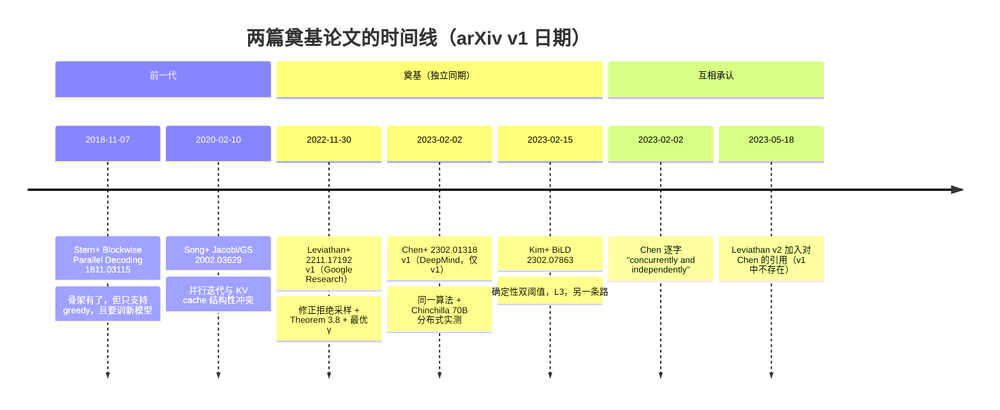
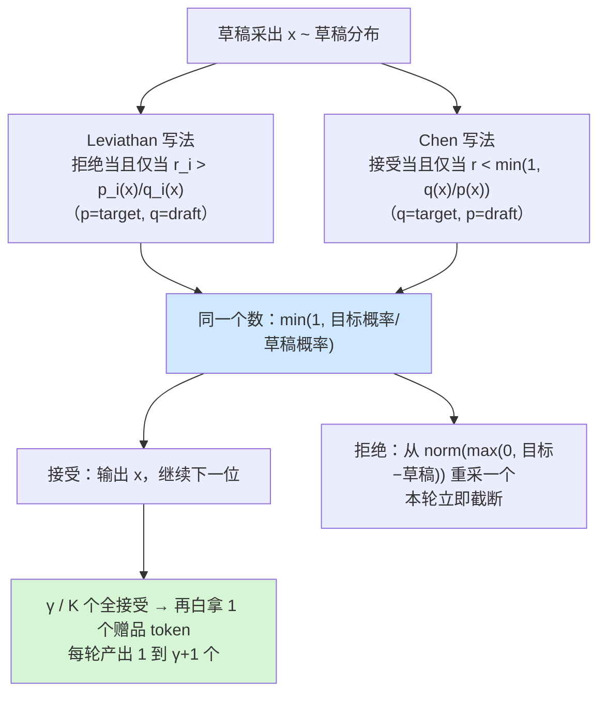

# 09 2023 奠基 —— 两篇同期论文的异同

## 1. 一句话

2022-11 的 Leviathan / Kalman / Matias（Google Research，arXiv:2211.17192）与 2023-02 的 Chen 等六人（DeepMind，arXiv:2302.01318）**独立地写出了同一个算法**：接受判据同构、残差重采同构、赠品 token 同构。它们真正的差别不在算法，而在**理论深度、实验口径、以及记号** —— 其中记号的 $p$ 与 $q$ **完全相反**，这是读者对照原文时翻车最多的一处。

本篇不重复无损性证明（在 [[04-拒绝采样修正-无损性的完整证明]]）也不重复 $E[\tau]$ 推导（在 [[06-期望接受长度与加速比模型-完整推导]]），本篇做的是**论文考古**：逐条对照两篇原文，量化"记号写反"的后果，并列出**两篇都没做的事** —— 因为那份清单基本就是后续三年的工作目录。

---

## 2. 前一代卡在哪

两篇论文冲的是同一个缺口，而这个缺口是被 2018–2022 那批工作**留下**的。

**Stern, Shazeer, Uszkoreit — Blockwise Parallel Decoding**（**2018-11**，arXiv:1811.03115；一作 Mitchell Stern，UC Berkeley，实习于 Google Brain；Noam Shazeer / Jakob Uszkoreit 属 Google Brain；NeurIPS 2018）已经把 **draft → verify → accept** 的骨架搭好了，也已经证明了"最坏退化成普通 greedy、永不倒退"。它卡在哪，**Leviathan 自己在 §5 逐字写了三条**：

> "it only supports greedy decoding (temperature=0) and not the general stochastic setting, it requires additional training of a custom model, and focuses on preserving down-stream task quality, instead of guaranteeing identical outputs."

**Chen 在 Related Work 里给的批评几乎是同一套**（逐字）：

> "These methods have yet to be adapted to typical language model use-cases since they either only work with greedy sampling, bias the results or are focused on other modalities."

翻译成本库的口径语言（[[07-无损的三种口径-分布无损不等于结果相同]]）：**Stern 2018 最好只能做到 L2 贪心等价，而且是相对"增广后的模型"而非原始模型**；温度一旦不为 0，整条路就断了。同期的另外两条支线也各自撞墙：非自回归翻译（Gu 等，2017-11，arXiv:1711.02281）死于 multimodality problem 且必须重训模型（L3）；Jacobi / Gauss-Seidel 并行解码（Song, Meng, Liao, Ermon，2020-02，arXiv:2002.03629，ICML 2021）死于"并行迭代用不了 KV cache"。这三条线的完整死因见 [[08-史前史-2018并行解码与非自回归的失败]]。

于是 2022 年底摆在桌上的缺口只剩一条，但很硬：

> **能不能在任意温度下并行解码，输出分布与目标模型逐点相同（L1 分布无损），而且不训练任何新模型、不改目标模型一个权重？**

两篇论文在相隔 64 天内、互不知情地，给出了同一个答案。



---

## 3. 机制拆解：元数据、记号与算法的三层对照

### 3.1 元数据

| 项 | **Leviathan, Kalman, Matias** | **Chen, Borgeaud, Irving, Lespiau, Sifre, Jumper** |
|---|---|---|
| arXiv | **2211.17192**（v1 **2022-11-30**，v2 2023-05-18） | **2302.01318**（v1 **2023-02-02**，**仅 v1，从未修订**） |
| 一作 / 机构 | Yaniv Leviathan，**Google Research**（Mountain View） | Charlie Chen，**DeepMind**（全体作者同机构） |
| 发表 | **ICML 2023 Oral**，PMLR v202, pp.19274–19286 | **无会议**，arXiv 技术报告 |
| 自命名 | speculative decoding / speculative sampling | **speculative sampling（SpS）** |
| 无损口径 | **L1 分布无损**（Appendix A.1，$l=1$ 时）；开 lenience $l<1$ 后降为**有界 L3** | **L1 分布无损**（Theorem 1，限定 "within hardware numerics"） |
| 正确性证明位置 | **正文** §3 + Appendix A.1 | **补充材料**（Supplementary → Proofs），不在正文 |

Chen 的 Author Contributions 一节里，**"Modified Rejection Sampling Scheme" 一项署的是 John Jumper**（AlphaFold 的 John Jumper）。这条署名信息只有 Chen 那篇有。

### 3.2 记号：最大的坑

两篇对 $p$ 和 $q$ 的用法**完全相反**，且草稿长度的符号也不同。

Leviathan §2 逐字定义：

> "Let $M_p$ be the target model, inference from which we're trying to accelerate, and $p(x_t\mid x_{<t})$ the distribution we get from the model for a prefix $x_{<t}$. Let $M_q$ be a more efficient approximation model for the same task, and denote by $q(x_t\mid x_{<t})$ the distribution..."

Chen §4.2 逐字：

> "Given a sequence of tokens $x_1,\dots,x_n$, and $K$ draft tokens $\tilde x_{n+1},\dots,\tilde x_{n+K}$ generated from $p(\cdot\mid\cdot)$..."

对照表：

| 含义 | **Leviathan** | **Chen** |
|---|---|---|
| **目标模型**（大，要加速的那个） | $M_p$ / $p$ | **$q$** |
| **草稿模型**（小，起草的那个） | $M_q$ / $q$ | **$p$** |
| 草稿长度 | $\gamma$ | **$K$**（lookahead） |
| 接受率符号 | $\beta$（逐位）/ $\alpha=E(\beta)$ | 无专用符号 |

还有一处更隐蔽的撞名：**Leviathan 的摘要里 $K$ 指"要解码的 token 总数"**（逐字："decoding $K$ tokens takes $K$ serial runs of the model"），**而 Chen 的 $K$ 指一次投机的草稿长度**。同一个字母，两篇里是两个毫不相干的量。

> **实用结论**：跨论文抄公式必错。本库正文一律采用 **Leviathan 记号**（$p$=target，$q$=draft，$\gamma$=草稿长度），与 [[04-拒绝采样修正-无损性的完整证明]]、[[06-期望接受长度与加速比模型-完整推导]] 保持一致。读 Chen 原文时请先在心里把 $p\leftrightarrow q$ 全部对调。

### 3.3 算法：两种写法，一个算法

**Leviathan Algorithm 1**（逐字，仅保留判据相关行）：

```
r_1 ~ U(0,1), ..., r_γ ~ U(0,1)
n ← min({i−1 | 1 ≤ i ≤ γ, r_i > p_i(x)/q_i(x)} ∪ {γ})
p'(x) ← p_{n+1}(x)
if n < γ then
    p'(x) ← norm(max(0, p_{n+1}(x) − q_{n+1}(x)))
end if
t ~ p'(x)
return prefix + [x_1, ..., x_n, t]
```

**Chen Algorithm 2**（逐字，接受行）：

```
if r < min(1, q(x̃ | x_1..x_{n+t−1}) / p(x̃ | x_1..x_{n+t−1})) then  accept
else  x_{n+t} ~ (q(x|·) − p(x|·))_+   and exit for loop
若 K 个全部接受: 额外采样 x_{n+K+1} ~ q(x|·)
```

把 Chen 的记号映射过去（Chen 的 $q$ → Leviathan 的 $p$，Chen 的 $p$ → Leviathan 的 $q$）：

- Chen 的接受条件 $r<\min\!\big(1,\ q_{\text{target}}/p_{\text{draft}}\big)$ **就是** Leviathan 的 $r_i\le p_i/q_i$；
- Chen 的残差 $(q_{\text{target}}-p_{\text{draft}})_+$ **就是** Leviathan 的 $\mathrm{norm}(\max(0,p-q))$。

**两者是同一个算法**（`_lab/test_notation.py::test_two_papers_give_identical_acceptance_probability`）。



**赠品 token 的组织方式是两篇唯一的表述差异**（不是语义差异）：

- **Leviathan 无分支**：把它折进 $p'$ 的定义 —— 默认 $p'=p_{n+1}$，只在 $n<\gamma$（发生过拒绝）时才改写成残差。全接受时 $n=\gamma$，$p'$ 保持 $p_{\gamma+1}$，赠品 token 自然落出来。
- **Chen 显式 if/else**，并在正文把两条性质单独说明（逐字）：
  > "At least one token will always be generated from a draft-accept loop – if the first token is rejected, a valid token is resampled."
  > "Since the final token of the draft gives us the logits for the next token, if every drafted token is accepted, we can sample from it normally. This gives us a maximum of **K+1** tokens per loop, over the naive implementation which would only return K tokens."

两种写法产出的 token 数都是 $1$ 到 $\gamma+1$（$K+1$）。**Leviathan 的写法更紧凑、更容易证明；Chen 的写法更容易照着实现** —— 主流引擎的伪代码组织更接近 Chen（见 [[20-主流引擎实现-vLLM与SGLang与TensorRTLLM]]）。

---

## 4. 逐条走查：算法与理论的差异

### 4.1 理论：Leviathan 有完整定量理论，Chen 只有正确性

**Leviathan §3 的全部命题**（编号与陈述逐字核对自原文）：

| 编号 | 内容 |
|---|---|
| Definition 3.1 | "The acceptance rate $\beta_{x_{<t}}$, given a prefix $x_{<t}$, is the probability of accepting $x_t\sim q(x_t\mid x_{<t})$ by speculative sampling." |
| Definition 3.2 | $D_{LK}(p,q)=\sum_x\lvert p(x)-M(x)\rvert$，其中 $M=(p+q)/2$ |
| Lemma 3.3 | $D_{LK}(p,q)=1-\sum_x\min(p(x),q(x))$ |
| Theorem 3.5 | $\beta=1-D_{LK}(p,q)$ |
| Corollary 3.6 | $\alpha=1-E(D_{LK}(p,q))=E(\min(p,q))$ |
| Equation (1) | $E(\#\text{tokens})=\dfrac{1-\alpha^{\gamma+1}}{1-\alpha}$ |
| Definition 3.7 | "Let $c$, the cost coefficient, be the ratio between the time for a single run of $M_q$ and the time for a single run of $M_p$." |
| **Theorem 3.8** | walltime 改进因子 $=\dfrac{1-\alpha^{\gamma+1}}{(1-\alpha)(\gamma c+1)}$ |
| Corollary 3.9 | 若 $\alpha>c$，存在 $\gamma$ 可改进，改进因子至少 $\dfrac{1+\alpha}{1+c}$ |
| Definition（§3.4） | "Let $\hat c$ be the ratio of arithmetic operations per token of the approximation model $M_q$ to that of the target model $M_p$." |
| **Theorem 3.11** | 总运算量**增加**因子 $=\dfrac{(1-\alpha)(\gamma\hat c+\gamma+1)}{1-\alpha^{\gamma+1}}$ |

**Chen 侧只有一条**：Theorem 1，标题逐字 "Modified Rejection Sampling recovers the target distribution"，位于**补充材料的 Proofs 一节**（不在正文），内容是单 token 命题
$$P(X=x)=\min(p(x),q(x))+\max\big(0,q(x)-p(x)\big)=q(x)$$
（Chen 记号，$q$ 是 target）。**Chen 没有** acceptance rate 的闭式、没有 $E(\#\text{tokens})$、没有 walltime 模型、没有 cost coefficient、没有最优 $\gamma$ 分析。它用**经验曲线**（Figure 1 三张子图）代替全部这些。

**谁证了什么、谁只是断言**，一句话讲清：

- **两篇都严格证明了单 token 的 L1 分布无损**（Leviathan Appendix A.1 逐字："We will now show that for any distributions $p(x)$ and $q(x)$, the tokens sampled via speculative sampling from $p(x)$ and $q(x)$ are **distributed identically** to those sampled from $p(x)$ alone."）。
- **只有 Leviathan 证明了"快多少"**（Theorem 3.8）与**"多花多少算力"**（Theorem 3.11）。
- **两篇都没有显式证明整条序列的联合分布**等于目标模型的自回归联合分布 —— 两个正确性命题都是单 token 的，序列级由归纳直接得到，但两篇都没把归纳写出来。本库把这一步补在 [[04-拒绝采样修正-无损性的完整证明]] §4.3，并用精确枚举验到 $10^{-17}$。

### 4.2 Theorem 3.8 的隐含假设 —— 作者自己标注的，不是后人揭露的

Leviathan 在推导 Equation (1) 前逐字写道：

> "If we make the **simplifying assumption that the $\beta$s are i.i.d.**, and denote $\alpha=E(\beta)$, then the number of tokens produced by a single run of Algorithm 1 is a capped geometric variable, with success probability $1-\alpha$ and cap $\gamma+1$."

这句话必须被强调两次，因为它同时被两个方向误读：

1. **社区常见误读一**：以为这是"隐藏假设"，是后来的人挖出来的。**不是** —— 作者写在正文里，白纸黑字。
2. **社区常见误读二**：以为 i.i.d. 是必要条件，于是认定"$\beta$ 有波动公式就不准"。**也不对** —— i.i.d. 只是充分条件，推导实际只需要**沿链不相关**。本库 [[06-期望接受长度与加速比模型-完整推导]] §7.1 用实验证伪了这条直觉：$\beta$ 在 $0.176$–$0.449$ 之间波动（差 2.5 倍）时公式仍准到 2%–3%。

**Chen 那篇完全没有这个假设，因为它压根没写这条公式。** 它报的是实测曲线。从"结论可靠性"角度看，Chen 的取向更保守；从"能不能指导调参"角度看，Leviathan 的取向可用得多 —— Corollary 3.9 直接给出"$\alpha>c$ 就一定有得赚"这条可判定的准入判据。

### 4.3 只有一篇有的东西

| 机制 | 只在 Leviathan | 只在 Chen |
|---|---|---|
| **Lenience**（Appendix A.5，$l\in[0,1]$，比较前把 $q$ 乘 $l$，**破坏 L1，降为有界 L3**） | 有 | 无 |
| **Beam search 扩展**（Appendix A.4，$\mathrm{top}_w(M_p)\subseteq\mathrm{top}_u(M_q)$ 即接受；原文自称分析 "more involved and we leave it for future work"） | 有 | 无 |
| **总算力增量定理**（Theorem 3.11） | 有 | 无 |
| **最优 $\gamma$ 的解析求解**（Figure 3："The optimal $\gamma$ as a function of $\alpha$ for various values of $c$"） | 有 | 无 |
| **延迟方差 / P90-P99 的讨论** | 无 | 有 |
| **分布式部署下草稿模型该长什么形状** | 无 | 有 |
| **代码生成任务（HumanEval）实测** | 无 | 有 |

关于 lenience，Leviathan 有一句**必须一起引用的界定**（逐字）：

> "Note that the results in this paper **except for this section** use the strictest version of Algorithm 1 and **don't allow lenience of any kind**."

也就是说：**Leviathan 正文里的 2.6× / 3.4× 全部是 $l=1$ 的严格 L1 分布无损**；Appendix A.5 里那档 5× 是 $l=0.1$ 的 **L3**，两者不能混用、不能放进同一张表比较。这是本库铁律二在这篇论文上最直接的一次应用。（这三个数的其余口径与该文全部实验相同，见 §7.1 的逐项口径表：**batch size = 1**、单张 TPU-v4、度量是 wall-clock latency 而不是吞吐。）

### 4.4 草稿模型怎么选：两条互相冲突的经验法则

这是两篇最有意思的实质分歧，而且**两条都对，只是前提不同**。

**Leviathan（单卡视角，按参数量）** 逐字：

> "choosing $M_q$ to be **around two orders of magnitude smaller** than $M_p$ usually performed best"

依据是 Table 2 里那条反直觉的曲线：T5-large 草稿的 $\alpha$ 最高（0.82）**却最慢**（1.7×），T5-small 的 $\alpha$ 只有 0.75 **却最快**（3.4×）—— 因为 Theorem 3.8 分母里的 $\gamma c$ 项由 $c$ 主导。**草稿越强不等于越快。**（这两个数的口径：目标 T5-XXL 11B，EnDe，$T=0$，$\gamma=7$，**batch size = 1**，单张 TPU-v4，latency —— 见 §7.1。）

**Chen（分布式视角，按通信形状）**：Chinchilla 70B 的最优部署是 16 TPU v4（14.1 ms/token），而一个 chinchilla-optimal 的 7B 最优拓扑只要 4 TPU v4；把 7B 摊到 16 张卡上反而**增加**延迟。于是 Chen 的草稿不是"小两个数量级的现成模型"，而是**专门训的宽而浅的 4B**：$d_{model}=6144$（比 70B 的 8192 只小一点）、48 heads、**仅 8 层**，"trained with the same tokeniser and dataset as Chinchilla"。

> **调和**：Leviathan 的法则约束的是**参数量比**（决定 $c$），Chen 的法则约束的是**层数与并行拓扑**（决定分布式下的实际 $c$）。在单卡上两者一致；**在多卡上 Leviathan 的法则会失效**，因为 $c$ 不再正比于参数量，而是被通信轮次（正比于层数）钉死。这条至今有效，也是后来"单层草稿头"路线（[[13-EAGLE三代-特征级自回归的演进]]）在分布式下格外划算的原因。

---

## 5. 小数字算例：同一组数字，两套记号，一个陷阱

取 [[04-拒绝采样修正-无损性的完整证明]] §5 的同一组玩具分布（$\lvert V\rvert=5$，起始 token 那一步）：

$$
p_{\text{target}}=[0.2024,\ 0.1564,\ 0.3386,\ 0.1982,\ 0.1045]
$$
$$
q_{\text{draft}}=[0.2060,\ 0.2330,\ 0.3406,\ 0.0540,\ 0.1664]
$$

在 **Leviathan 记号**里这就是 $p$ 和 $q$；在 **Chen 记号**里恰好反过来（$q$ 是上面那行，$p$ 是下面那行）。

**两套判据逐点相同**（复跑：`python _lab/notation.py`）：

| token | 0 | 1 | 2 | 3 | 4 |
|---|---|---|---|---|---|
| Leviathan $\min(1,\ p_{\text{target}}/q_{\text{draft}})$ | 0.9824 | 0.6712 | 0.9940 | 1.0000 | 0.6279 |
| Chen $\min(1,\ q_{\text{target}}/p_{\text{draft}})$ | 0.9824 | 0.6712 | 0.9940 | 1.0000 | 0.6279 |
| **最大逐点差** | \multicolumn{5}{c}{**0.0**} |

（实测，两行完全相同，最大逐点差 $0.0$。）

### 现在把记号写反

假设有人照抄了 Chen 论文的 $\min(1,q/p)$，却沿用了 Leviathan 的变量命名（代码里 `q` 是草稿、`p` 是目标）。他算出的是 $\min(1,\ q_{\text{draft}}/p_{\text{target}})$：

| token | 0 | 1 | 2 | 3 | 4 |
|---|---|---|---|---|---|
| 写反后的接受概率 | **1.0000** | **1.0000** | **1.0000** | 0.2725 | **1.0000** |

**这个 bug 不会抛异常、不会 NaN、不会让输出变成乱码。** 它做的是三件事：

**第一，实测接受率不降反升。**

$$
\beta_{\text{正确}}=\sum_x q_{\text{draft}}(x)\cdot\min(1,p/q)=\mathbf{0.8558}
\qquad
\beta_{\text{写反}}=\mathbf{0.9607}
$$

看板上的 acceptance rate 从 0.86 涨到 0.96，**看起来像是把草稿模型调好了**。这是它最危险的地方 —— 常规的性能监控完全发现不了。

**第二，输出分布被拽向草稿模型。** 首 token 的精确分布（残差仍按正确公式算，即只把"判据写反"这一种 bug 单独隔离出来）：

| token | 0 | 1 | 2 | 3 | 4 |
|---|---|---|---|---|---|
| 目标分布 $p$ | 0.2024 | 0.1564 | 0.3386 | **0.1982** | 0.1045 |
| 写反后的输出分布 | 0.2060 | 0.2330 | 0.3406 | **0.0540** | 0.1664 |
| 草稿分布 $q$ | 0.2060 | 0.2330 | 0.3406 | **0.0540** | 0.1664 |

**输出分布与草稿分布逐点相同，最大逐点误差 $4.9\times10^{-17}$；与目标分布的最大逐点误差是 $0.1442$。**

在这个算例里它**精确复现了草稿模型**。原因可以手算：本例中只有 token 3 满足 $p>q$，残差因此是 one-hot 在 token 3 上（$p'=[0,0,0,1,0]$）。于是

$$
\Pr[Y=3]=\underbrace{\frac{q(3)^2}{p(3)}}_{\text{接受路径}}+\underbrace{\Big(q(3)-\frac{q(3)^2}{p(3)}\Big)}_{\text{拒绝质量全部落到 token 3}}=q(3)
$$

其余 token 的接受概率都被截断到 1，输出即 $q$ 本身。一般情形下不会这么干净，但**偏差方向是恒定的：朝向草稿模型**（`_lab/test_notation.py::test_swapped_notation_pulls_output_toward_the_draft`，12 组随机分布全部成立）。

**第三，速度真的变快了。** 接受率 0.96 对应的 $E[\tau]$ 明显高于 0.86 —— 所以这个 bug 会同时带来"更高的接受率"和"更高的加速比"，唯一被牺牲的是**你跑的其实是那个小模型**。

> **这就是本篇存在的理由。** 记号反转不是学术洁癖，它是一个**会被性能指标奖励的正确性 bug**。排查判据是这样一条：接受率**异常地高**（尤其接近或超过 $\sum_x\min(p,q)$ 的理论上界）时，先怀疑分子分母写反了，而不是庆祝草稿模型变好了。理论上界的算法见 [[05-接受率alpha-定义口径与怎么测]]。

---

## 6. 代码验证

本篇新增 `_lab/notation.py`（精确计算，不掷骰子）与 `_lab/test_notation.py`。核心两个函数：

```python
# _lab/notation.py
def accept_prob_leviathan(p_target, q_draft):
    """Leviathan Algorithm 1：判据 r_i > p_i(x)/q_i(x) 触发拒绝，故接受概率 = min(1, p/q)。"""
    return np.minimum(1.0, p_target / q_draft)

def accept_prob_chen(p_draft, q_target):
    """Chen Algorithm 2：判据 r < min(1, q(x~)/p(x~))。形参名沿用 Chen 的含义。"""
    return np.minimum(1.0, q_target / p_draft)

def accept_prob_swapped(p_target, q_draft):
    """**错误**：照抄 Chen 的 min(1,q/p) 但沿用 Leviathan 的变量命名。"""
    return np.minimum(1.0, q_draft / p_target)
```

实跑输出（`python _lab/notation.py`）：

```
Leviathan min(1, p_target/q_draft) : [0.9824 0.6712 0.994  1.     0.6279]
Chen      min(1, q_target/p_draft) : [0.9824 0.6712 0.994  1.     0.6279]
两者最大逐点差                     : 0.0

写反的判据 min(1, q_draft/p_target): [1.     1.     1.     0.2725 1.    ]

正确判据下的接受率 beta = 0.8558
写反判据下的接受率      = 0.9607   <- 看板上会「变好」

正确判据的首 token 分布: [0.2024 0.1564 0.3386 0.1982 0.1045]
  最大逐点误差: 1.11e-16
写反判据的首 token 分布: [0.206  0.233  0.3406 0.054  0.1664]
  与 target 的最大逐点误差: 0.1442
  与 draft  的最大逐点误差: 4.86e-17
```

`test_notation.py` 共 67 个用例全绿（`python -m pytest test_notation.py -q` → `67 passed in 0.13s`），全库 165 个用例全绿。

---

## 7. 口径与坑：实验规模逐项对照（铁律二）

**这张表是本篇最该被当成工具用的部分。** 两篇论文的头条数字**不可横向比较**，下面逐项列出为什么。缺项一律写"原文未给出"。

| 铁律二的七项 | **Leviathan（头条 3.4×）** | **Chen（头条 2.46×）** |
|---|---|---|
| **1. batch size** | **1**（逐字："We measure walltime improvements with a **batch size of 1** on a single TPU-v4"） | **1**（逐字："We run the tasks at **batch size 1** with SpS and ArS"） |
| **2. $\gamma$ / $K$** | **7**（EnDe，temp=0；不同行 3–7 不等） | **4** |
| **3. $\alpha$ / 平均接受长度** | **0.75**（EnDe/T5-small/temp=0）。口径是 **Corollary 3.6 的解析估计量** $E(\min(p,q))$，逐字："we evaluated the expectation from Corollary 3.6 on **10K tokens generated by $M_p$**" | **原文未给出数值**。Figure 1 中图画的是"average number of tokens accepted **divided by $K+1$**"，纵轴 0.5–1.0，**无表格数字** |
| **4. draft–target 组合** | **T5-small (77M) → T5-XXL (11B)**，同族、同 tokenizer、**现成 checkpoint 未做任何训练** | **专训 4B（$d_{model}$ 6144 / 48 heads / **仅 8 层**）→ Chinchilla 70B**，"same tokeniser and dataset as Chinchilla" |
| **5. 硬件与精度** | **单张 TPU-v4**；**权重精度原文未给出** | **16 张 TPU v4**，Megatron 式分片；**权重精度原文未给出** |
| **6. 测的是什么** | **walltime latency**（相对 T5X 基线实现）。**吞吐原文未给出** | **mean token time（latency，ms/token）**。**吞吐原文未给出** |
| **7. 任务分布** | WMT **EnDe** 翻译 + **CCN/DM** 摘要 | **XSum**（1-shot，11,305 条，max len 128，nucleus $p$=0.8）+ **HumanEval**（100-shot，16,400 条，max len 512，$p$=0.95、temperature 0.8） |

**Leviathan Table 2 完整**（口径同上表左列；**全部 $l=1$，严格 L1 分布无损**）：

| 任务 | $M_q$（草稿） | temp | $\gamma$ | $\alpha$ | 加速比 |
|---|---|---|---|---|---|
| EnDe | **T5-small** | 0 | 7 | 0.75 | **3.4×** |
| EnDe | T5-base | 0 | 7 | 0.80 | 2.8× |
| EnDe | T5-large | 0 | 7 | **0.82** | **1.7×** |
| EnDe | T5-small | 1 | 7 | 0.62 | 2.6× |
| EnDe | T5-base | 1 | 5 | 0.68 | 2.4× |
| EnDe | T5-large | 1 | 3 | 0.71 | 1.4× |
| CNNDM | T5-small | 0 | 5 | 0.65 | 3.1× |
| CNNDM | T5-base | 0 | 5 | 0.73 | 3.0× |
| CNNDM | T5-large | 0 | 3 | 0.74 | 2.2× |
| CNNDM | T5-small | 1 | 5 | 0.53 | 2.3× |
| CNNDM | T5-base | 1 | 3 | 0.55 | 2.2× |
| CNNDM | T5-large | 1 | 3 | 0.56 | 1.7× |

**Chen Table 1 完整**（口径同上表右列；batch=1，$K$=4）：

| 方法 | Benchmark | 质量指标 | Mean Token Time | 加速比 |
|---|---|---|---|---|
| ArS (Nucleus) | XSum (ROUGE-2) | 0.112 | 14.1 ms | 1× |
| **SpS (Nucleus)** | XSum | **0.114** | 7.52 ms | **1.92×** |
| ArS (Greedy) | XSum | 0.157 | 14.1 ms | 1× |
| **SpS (Greedy)** | XSum | **0.156** | 7.00 ms | **2.01×** |
| ArS (Nucleus) | HumanEval | 45.1% | 14.1 ms | 1× |
| **SpS (Nucleus)** | HumanEval | **47.0%** | 5.73 ms | **2.46×** |

### 7.1 最关键的一条口径分歧：两篇的"接受率"不是同一个量

这一条值得单独拎出来，因为它导致**两篇论文的接受率数字根本不能对照着看**。

- **Leviathan 的 $\alpha$** = $E(\min(p,q))$，一个**逐位的、解析的**量（Corollary 3.6），在目标模型自己生成的 10K token 上求期望。它**与 $\gamma$ 无关**。
- **Chen 的纵轴** = 平均接受 token 数 $\div (K+1)$，一个**整轮的、计数的**量。它**含赠品 token**，**被 $K$ 截断**，因此**强烈依赖 $K$**。

两者的关系是 $\text{Chen 口径}=E[\tau]/(\gamma+1)$，而 $E[\tau]$ 由 [[06-期望接受长度与加速比模型-完整推导]] 的闭式给出。代入 Leviathan 自己的头条设置（EnDe / T5-small / temp=1：$\alpha=0.62$、$\gamma=7$）：

$$
\frac{E[\tau]}{\gamma+1}=\frac{1}{8}\cdot\frac{1-0.62^{8}}{1-0.62}=0.322
$$

**同一套系统，Leviathan 的表里写 0.62，Chen 的图上只有 0.32 —— 差 0.30。**

更麻烦的是，**这个差值连符号都不固定**：$\gamma=3$、$\alpha=0.20$ 时 Chen 口径给 0.312，**高于** $\alpha$；$\gamma=3$、$\alpha=0.70$ 时给 0.633，**低于** $\alpha$。所以两个口径之间**没有单向的换算修正**，只能各报各的、各标各的（`_lab/test_notation.py::test_alpha_caliber_gap_changes_sign`、`::test_alpha_caliber_gap_is_large_at_leviathan_headline_setting`）。接受率口径的完整分类见 [[05-接受率alpha-定义口径与怎么测]]。

### 7.2 第二条口径分歧："无损"这个词，两篇的措辞是冲突的

按铁律一，两篇都是 **L1 分布无损**。但**它们摘要里的措辞强度完全不同**，而这个差异极可能就是社区第一大误解的文本源头。

**Leviathan 摘要逐字**：

> "...an algorithm to sample from autoregressive models faster **without any changes to the outputs**, by computing several tokens in parallel."

**Chen §6.1 逐字**：

> "Even with greedy sampling, a single token deviating due to numerics could result in two sequences diverging wildly. Since pseudo-random seeds are processed differently between ArS and SpS, and because the different computation graphs lead to different numerics, **we cannot not expect identical outputs**."（原文即为 "cannot not"，疑似笔误，语义为"不能期待输出相同"）

**Chen 摘要逐字**：

> "...a novel modified rejection sampling scheme which **preserves the distribution of the target model within hardware numerics**."

字面上读，Leviathan 的 "without any changes to the outputs" 与 Chen 的 "we cannot not expect identical outputs" **是互相矛盾的**。实际上两篇的数学保证完全一致，冲突只在措辞：

- Leviathan 在正文里把话说准了 —— §6 逐字 "the **output distribution** is guaranteed to stay the same"，Appendix A.1 逐字 "**distributed identically**"。摘要里的 "outputs" 是 "output distribution" 的省略。
- Chen 说的是**逐 token 的序列**，那确实不相同，而且**从第一天起就写在摘要的限定词 "within hardware numerics" 里**。

> **判据**：任何把"投机采样无损"讲成"输出和不开投机一模一样"的材料，都可以直接追溯到 Leviathan 摘要那句话的字面读法。**正确表述是 L1 分布无损：分布逐点相同，样本不同。** 完整辨析见 [[07-无损的三种口径-分布无损不等于结果相同]] 与 [[27-常见误解与判据]]。

---

## 8. 两篇都没做的事 —— 后续三年在补什么

这一节是本篇最有信息量的部分：**把两篇奠基论文的空白列出来，基本就是 2023–2026 这条线的工作目录。**

| 空白 | 两篇的状态 | 后来谁补的（年月 / arXiv / 一作 / 机构） |
|---|---|---|
| **batch > 1 的分析** | **两篇都完全没有**。Leviathan 全部实验 bs=1 且正文无任何 batch>1 讨论；Chen 逐字 "at batch size 1"。两篇都**没有报过吞吐（tokens/s）**，只报延迟 | 本库 [[18-batch与吞吐-收益衰减曲线]] 给出 compute-bound 渐近线；长上下文下的反例见 MagicDec（**2024-08**，arXiv:2408.11049）与 [[22-长上下文下的投机采样]] |
| **接受率随任务 / 温度的变化规律** | Leviathan 只给了**四个离散点**（EnDe/CNNDM × temp 0/1），**没有温度扫描**，也没有解释为什么 CNNDM 的 $\alpha$ 系统性低于 EnDe；Chen 只说过 "the overall acceptance rate is **robust to the exact parameters used**"，**未给数据支撑** | [[05-接受率alpha-定义口径与怎么测]]（本库实测：好草稿的 $\alpha$ 对温度**非单调**，`_lab/test_accept.py::test_good_draft_alpha_is_non_monotone_in_temperature`） |
| **树形草稿 / 多条候选** | **两篇都只有单链草稿**。Leviathan 的 beam search 扩展（A.4）最接近，但作者自陈 "we leave it for future work" | SpecInfer（**2023-05**，arXiv:2305.09781，Xupeng Miao，CMU，ASPLOS 24）首创 token tree + 树注意力；Sequoia（**2024-02**，arXiv:2402.12374）加 DP 最优树。见 [[16-树形草稿与树注意力-mask构造与验证]] |
| **动态 / 自适应 $\gamma$** | Leviathan **意识到了但没做** —— 正文指出用 oracle 动态调 $\gamma$ 可达 $E[\tau]=1/(1-\alpha)$，比固定 $\gamma$ 高约 60%；Chen 只做了 $K$ 的离散扫描 | [[17-动态草稿长度与自适应停止]] |
| **草稿模型怎么训** | Leviathan **完全没训**（用现成 checkpoint）；Chen 训了但只用一句话交代（"same tokeniser and dataset"），**无消融、无对齐损失设计** | [[21-草稿模型怎么训-对齐与在线蒸馏]]；机制上的正式回答是 EAGLE 系（**2024-01**，arXiv:2401.15077，Yuhui Li，北京大学）与 HASS（**2024-08**，arXiv:2408.15766） |
| **不用独立草稿模型** | 两篇都要求**一个额外的模型**。Leviathan 在 Discussion 里提过 "greater improvements might be obtained via **custom approximation models**" 但没实现 | 自投机 / 跳层：Draft & Verify（**2023-09**，arXiv:2309.08168，Jun Zhang，厦门大学，ACL 24）见 [[10-自投机-跳层早退与Draft-and-Verify]]；无模型草稿见 [[11-无模型草稿-promptlookup与ngram与检索]]；多头草稿见 [[12-Medusa-多头草稿与树注意力的诞生]] |
| **长上下文** | 两篇的最大 max len 分别是 CNNDM 摘要与 **512**（HumanEval）。**KV cache 随上下文增长带来的草稿开销，两篇都没算** | [[22-长上下文下的投机采样]] |
| **序列级联合分布的证明** | 两篇的正确性定理**都是单 token 的** | 本库 [[04-拒绝采样修正-无损性的完整证明]] §4.3 补归纳 + 精确枚举 |
| **与量化 / KV cache / PD 分离的交互** | **两篇都没有**（两篇连权重精度都没写） | [[23-与其它优化的相互作用-量化与KVcache与PD分离]] |
| **什么时候是负收益** | Leviathan 的 Theorem 3.11 **理论上指出了**总算力会增加，但**没有给出任何负收益的实测**；Corollary 3.9 只给了正向准入判据 $\alpha>c$ | [[19-负收益全解-什么时候投机反而更慢]] |

> **一句话**：两篇奠基论文回答了"**能不能做**"（能，而且是 L1 分布无损），但几乎没有回答"**什么时候值得做**"。Theorem 3.11 是唯一指向后者的路标，而它是全领域最被忽视的定理。

---

## 9. 失效条件（铁律三）：这两篇的结论在什么条件下不适用

**注意本节的对象是"两篇论文的结论"，不是"投机采样这个方法"。** 前者的适用范围比后者窄得多。

1. **离开 batch = 1，两篇的全部加速比数字立刻失效。** 这不是"偏了一点"，而是**测的东西变了**：两篇报的都是 bs=1 的 latency，而生产系统关心的是 continuous batching 下的吞吐。本库 [[18-batch与吞吐-收益衰减曲线]] 给出可判定的形式：验证前向进入 compute-bound 后，吞吐加速比收敛到 $\dfrac{E[\tau]}{\gamma+1}(1-s)$（$s$ 为草稿开销占比），在 target=llama3-70b / draft=llama3.2-1b / $\gamma$=4 / $E[\tau]$=3.0 / fp16 / 8×H100 / **短上下文**的解析模型下实测为 **0.566**（即亏 44%）。**这是本库的解析模型与实验结论，不是两篇论文的结论 —— 两篇论文对此完全没有表态。** 重要限定：这条只对**短上下文**成立，长上下文下大 batch 仍可能是赚的（见 [[22-长上下文下的投机采样]]）。

2. **Theorem 3.8 的 i.i.d. 假设在真实负载上不成立，净效果是公式高估 $E[\tau]$。** 本库 [[06-期望接受长度与加速比模型-完整推导]] 用可控的「黏性双区制」实验测出：$\beta$ 的一阶自相关从 $+0.04$ 升到 $+0.81$ 时，实测/公式从 $1.012$ 掉到 $0.895$，**最大高估 10.5%**。机制不是 i.i.d. 中的"同分布"被破坏（那一条本库先证伪了），而是**迭代起点的长度偏置** —— 难区的迭代更短，按迭代计数时难区被过采样。**这是本库的实验结论，论文本身既没做也没预言方向。**

3. **$c$ 不是常数时，Theorem 3.8 与 Corollary 3.9 的准入判据 $\alpha>c$ 会给出错误结论。** Definition 3.7 把 $c$ 定义成两次前向的**时间比**，隐含它是个与部署无关的常数。Chen 那篇自己就是反例：同一个 7B 草稿，摊到 4 卡还是 16 卡，$c$ 完全不同。草稿与目标共享 GPU、争抢调度时更是如此。

4. **Leviathan 的"小两个数量级"法则只在单卡成立。** 见 §4.4：分布式下决定 $c$ 的是层数（通信轮次）而非参数量。

5. **Leviathan Table 2 的 $\alpha$ 数字不能迁移到别的模型族。** 那些是 T5 v1.1 家族内部（同 tokenizer、同预训练数据、同架构）的 $\alpha$。跨族草稿、跨 tokenizer 的场景根本不在这两篇的覆盖范围内。

6. **两篇的质量结论（"不掉质量"）是在各自那几个任务上测的。** Chen 的 Table 1 里 XSum ROUGE-2 从 0.157 掉到 0.156、HumanEval 从 45.1% 升到 47.0% —— 这是**采样噪声**，不是"投机让模型变好了"。L1 分布无损保证的是分布相同，**任何单次评测的分数差都应被解读为噪声**；反过来，若某次评测出现**系统性**掉分，那说明实现破坏了 L1，是正确性 bug，不是"可接受的质量损失"。

7. **开了 lenience 就不再是这两篇正文的结论。** $l<1$ 时口径降到有界 L3，Leviathan 自己用一整句话把这条隔离开了（§4.3 引文）。

---

## 10. 自测题

1. Chen 论文里的 $p$ 是目标模型还是草稿模型？如果你照抄它的接受判据 $\min(1,q/p)$ 到一个用 Leviathan 记号写的代码库里，会发生什么？给出至少两个可观测后果。
   <details><summary>答案要点</summary>Chen 的 $p$ 是**草稿**（"K draft tokens ... generated from $p$"），$q$ 是目标。照抄会算成 $\min(1,q_{\text{draft}}/p_{\text{target}})$。后果：(a) 实测接受率**上升**（本篇算例 0.8558 → 0.9607），看板上像是变好了；(b) 输出分布被拽向草稿模型（本篇算例里精确等于草稿分布，与目标最大逐点误差 0.1442）；(c) 加速比也真的上升 —— 所以性能监控无法发现。判据：接受率异常地高、接近或超过 $\sum\min(p,q)$ 的理论上界时，先查分子分母。</details>

2. Leviathan Table 2 里，T5-large 草稿的 $\alpha$ 是全表最高的 0.82，加速比却只有 1.7×，而 $\alpha$=0.75 的 T5-small 拿到 3.4×。用 Theorem 3.8 解释，并说明这条对今天选草稿模型意味着什么。
   <details><summary>答案要点</summary>Theorem 3.8 的分母是 $\gamma c+1$。T5-large (800M) 相对 T5-XXL (11B) 的 $c$ 远大于 T5-small (77M)，$\gamma$=7 时 $\gamma c$ 这一项把分子多出来的那点 $\alpha$ 收益全部吃掉。含义：**"草稿越强越快"是错的**，$\alpha$ 与 $c$ 必须一起看。今天的启示是把 $c$ 压到极低（单层草稿头），而不是把 $\alpha$ 顶到极高。同题的定量版见 [[06-期望接受长度与加速比模型-完整推导]] §4.5。</details>

3. 有人说"Leviathan 那篇报了 5× 加速"。这句话有什么问题？
   <details><summary>答案要点</summary>正文的最高数字是 3.4×（EnDe / T5-small / temp=0 / $\gamma$=7 / $\alpha$=0.75 / bs=1 / 单张 TPU-v4 / latency）。5× 那一档在 Appendix A.5，是 lenience $l$=0.1 的结果，**已经不是 L1 分布无损而是有界 L3**。原文用一整句话把两者隔开（"except for this section ... don't allow lenience of any kind"）。把 5× 和 3.4× 放在一起说，同时违反铁律一（口径不标）与铁律二（不可比的数字并列）。</details>

4. Leviathan 报"$\alpha=0.62$"，Chen 的 Figure 1 纵轴在 0.5–1.0 之间。能说"Chen 的接受率更高"吗？
   <details><summary>答案要点</summary>不能，两者不是同一个量。Leviathan 的 $\alpha=E(\min(p,q))$ 是逐位解析量，与 $\gamma$ 无关；Chen 的纵轴是"平均接受 token 数 $/(K+1)$"，是整轮计数量，含赠品 token 且被 $K$ 截断。同一套系统（$\alpha$=0.62，$\gamma$=7）按 Chen 口径只有 0.322。更麻烦的是差值**符号不固定**（$\gamma$=3、$\alpha$=0.20 时 Chen 口径反而更高），所以没有单向换算。而且 Chen 那篇**根本没给出接受率的数值**，只有一张图。</details>

5. 两篇论文的正确性定理都只证了单个 token。这算不算漏洞？如果要补，缺的是哪一步？
   <details><summary>答案要点</summary>不算漏洞，算未写完。缺的是**对序列长度的归纳**：需要说明每轮产出的 token 数 $\tau$ 是随机的、且与产出内容相关，而归纳之所以仍然成立，是因为每步用的都是**条件**分布，不受 $\tau$ 随机性影响。本库在 [[04-拒绝采样修正-无损性的完整证明]] §4.3 补了这一步，并用精确枚举把序列级误差量到 $10^{-17}$。值得注意的是：$\tau$ 的随机性在无损性上不咬人，但在 $E[\tau]$ 的预测上会咬人（[[06-期望接受长度与加速比模型-完整推导]] §7.3 的长度偏置）。</details>

6. Chen 那篇独有的"$K$ 增大会增加延迟方差、影响 P90/P99"这条观察，为什么 Leviathan 那篇不可能得出？
   <details><summary>答案要点</summary>因为 Leviathan 的分析对象是**期望**（Theorem 3.8 给的是 expected improvement factor），整套理论里没有方差这个量。Chen 走的是实测路线，Figure 1 左图直接画了生成 128 个 token 的耗时**标准差**，方差自然浮出来。这也说明"更强的理论"与"更有用的观察"不是一回事：$E[\tau]$ 的闭式指导调参，方差的观察指导 SLO。生产上 SLO 写的是 P99 TPOT 时，Chen 的这条比 Theorem 3.8 更该被引用。</details>

---

## 11. 延伸与双链

- 本篇刻意不重复的两块：[[04-拒绝采样修正-无损性的完整证明]]（无损性证明）、[[06-期望接受长度与加速比模型-完整推导]]（$E[\tau]$ 与最优 $\gamma$）
- 前一代的完整死因：[[08-史前史-2018并行解码与非自回归的失败]]
- 接受率的口径分类（本篇 §7.1 的一般化）：[[05-接受率alpha-定义口径与怎么测]]
- "无损"措辞冲突的完整辨析：[[07-无损的三种口径-分布无损不等于结果相同]]、[[27-常见误解与判据]]
- 两篇都没做的 batch 维度：[[18-batch与吞吐-收益衰减曲线]]、[[19-负收益全解-什么时候投机反而更慢]]
- 两篇都没做的树形草稿与动态 $\gamma$：[[16-树形草稿与树注意力-mask构造与验证]]、[[17-动态草稿长度与自适应停止]]
- 后续各条支线：[[10-自投机-跳层早退与Draft-and-Verify]]、[[11-无模型草稿-promptlookup与ngram与检索]]、[[12-Medusa-多头草稿与树注意力的诞生]]、[[13-EAGLE三代-特征级自回归的演进]]
- 全景与被淘汰的分支：[[15-谱系图与被淘汰的分支]]
- 工业实现更接近哪一篇的写法：[[20-主流引擎实现-vLLM与SGLang与TensorRTLLM]]
- 社区在记号与无损口径上翻的车：[[26-社区精彩解释精选-好在哪与错在哪]]

---

## 12. 它新增了什么 / 什么被后来推翻（铁律五）

### 12.1 相对前作新增了什么

**Leviathan, Kalman, Matias（2022-11，arXiv:2211.17192，Google Research，ICML 2023 Oral）**：

1. **修正拒绝采样** —— 把 Stern 2018 的 L2 贪心等价骨架提升到**任意温度下的 L1 分布无损**，且**不训练任何模型、不改目标模型权重**。
2. **完整的定量理论** —— Theorem 3.5（$\beta=1-D_{LK}$）、Corollary 3.6（$\alpha=E(\min(p,q))$）、Theorem 3.8（walltime 改进因子）、Corollary 3.9（准入判据 $\alpha>c$）、Theorem 3.11（总算力增量）。**这套理论至今是该领域唯一被广泛引用的解析框架。**
3. **"任何采样方式都可归约为从调整后的分布做标准采样"**（§2.2 Standardized Sampling），逐字："while there are many methods and parameters of sampling, like argmax, top-k, nucleus, and setting a temperature ... they can all easily be cast into standard sampling from an adjusted probability distribution."
4. **"$\alpha>c$ 就一定有得赚"这条准入判据**，以及由此得出的反直觉推论：连 bigram 这种平凡草稿都有用 —— 原文逐字："with $M_p$ being T5-XXL 11B and $M_q$ being a trivial bigram model, we get $\alpha\approx0.2$ which leads to an inference speed improvement factor of **1.25X**"（口径同该文其余实验：**batch size = 1**、单张 TPU-v4、EnDe、$T=0$、latency，见 §7.1 口径表；$\gamma$ 该处未给）。**这是 n-gram 类无模型草稿路线（[[11-无模型草稿-promptlookup与ngram与检索]]）最早的理论辩护。**

**Chen, Borgeaud, Irving, Lespiau, Sifre, Jumper（2023-02，arXiv:2302.01318，DeepMind）**：

1. **规模验证** —— 首次在 **70B 级模型（Chinchilla）+ 分布式（16 TPU v4，Megatron 分片）** 上跑通并给出实测。Leviathan 那篇最大只做到 11B 单卡（LaMDA 137B 只测了 $\alpha$，逐字 "While we only implemented our method for T5, we measured $\alpha$ values for various tasks..."，**未做 walltime 实现**）。
2. **分布式下草稿模型的形状原则** —— "宽而浅"（$d_{model}$ 6144 / 48 heads / 仅 8 层），理由是最小化通信轮次而非最小化参数量。见 §4.4。
3. **延迟方差与 P90/P99 的提出** —— 逐字："even though larger values of $K$ may yield marginally greater mean speedups in certain circumstances, it also **increases variance** of the time to generate a full sequence. This could be problematic for settings where the **P90, P99** latencies of concern."
4. **对"无损"的准确措辞** —— 摘要即写 "within hardware numerics"，§6.1 明确 "we cannot not expect identical outputs"。**这是全领域最早、也最清楚的一次 L1 vs L2 界定。**
5. **代码生成任务的实测**（HumanEval，2.46×，全表口径见 §7）。

### 12.2 优先权：无争议

- **arXiv v1 日期**：Leviathan **2022-11-30** 早 Chen **2023-02-02** 共 64 天。
- **Chen 主动声明并发独立**（逐字）："**Coincidentally, the work in this manuscript was undertaken concurrently and independently of the work on speculative decoding from Leviathan et al. (2022).** We focus more heavily the distributed serving setting for large models and offer some incremental optimisations, but otherwise **the core underlying idea is the same**."
- **Leviathan v2（2023-05-18）加入了对 Chen 的引用**（v1 中不存在，逐字）："After we initially published our work, an independent implementation of speculative decoding (Chen et al., 2023) showed similar **2X-2.5X** improvements on Chinchilla 70B."

**两种表述不冲突**（一个讲发表次序，一个讲研究过程），双方都承认核心思想相同，**截至查证日（2026-08-22）未见任何优先权争议**。

补一条史料 caveat：Google Research 官方博客 "Looking back at speculative decoding"（**2024-12-06**，署名 Leviathan / Kalman / Matias）称 Stern 2018 为 "a precursor to our work"，灵感明示为 CPU 分支预测的 speculative execution，并称该技术已部署于 **AI Overviews in Google Search**。该博客**完全未提及 Chen et al. / DeepMind**；博客里写的草稿模型是 "60M T5-small"，而论文中 T5-small 是 **77M**，两处数字不一致，**以论文为准**。

### 12.3 哪些主张后来被推翻或需要修正

| 主张 | 出处 | 状态 | 依据 |
|---|---|---|---|
| "without any changes to the outputs"（摘要措辞） | Leviathan 摘要 | **需修正为 L1 分布无损**（分布相同、样本不同） | 论文自身正文即已说准（§6 "output **distribution**"、Appendix A.1 "distributed identically"）；Chen §6.1 明确否定了逐 token 相同。见 §7.2 |
| Theorem 3.8 的 **i.i.d. 假设** | Leviathan §3.1（**作者自己标注为 simplifying assumption**） | **在真实负载上不成立；净效果是公式高估 $E[\tau]$** | **本库实验**（非论文）：难度连片时实测/公式从 1.012 掉到 0.895，**最大高估 10.5%**。机制是迭代起点的长度偏置。见 [[06-期望接受长度与加速比模型-完整推导]] §7 |
| Theorem 3.8 分母的 $\gamma c+1$ 隐含"验证一次 = 生成一个 token 同价"（即 batch=1、memory-bound） | Leviathan §3.3 | **离开 memory-bound 区即崩，加速比可翻转成 <1** | **本库解析模型与实验**（非论文）：compute-bound 渐近线 $\frac{E[\tau]}{\gamma+1}(1-s)$，短上下文 8×H100 上实测 **0.566**。见 [[18-batch与吞吐-收益衰减曲线]]。限定：长上下文下大 batch 仍可赚，见 [[22-长上下文下的投机采样]] |
| "$M_q$ 小两个数量级最好" | Leviathan §4 经验法则 | **单卡仍成立；分布式下失效** | Chen 自身即反例（宽而浅 4B / 8 层）。见 §4.4 |
| 固定 $\gamma$ / $K$ | 两篇均是 | **被动态 $\gamma$ 与树形草稿取代** | SpecInfer（2023-05，arXiv:2305.09781，Xupeng Miao，CMU）、Sequoia（2024-02，arXiv:2402.12374）、EAGLE-2（2024-06，arXiv:2406.16858，Yuhui Li，北京大学）。**Leviathan 自己已预见**：oracle 动态 $\gamma$ 可再高约 60% |
| 必须有一个独立的草稿模型 | 两篇均是 | **被自投机 / 多头 / 无模型草稿绕开** | Draft & Verify（2023-09，arXiv:2309.08168）、Medusa（2024-01，arXiv:2401.10774，Tianle Cai，Princeton，**注意 typical acceptance 是 L3 不是 L1**）、EAGLE（2024-01，arXiv:2401.15077） |
| Chen："the overall acceptance rate is **robust to the exact parameters used**"（指采样参数） | Chen §4.2 | **未给数据支撑，且本库实测部分不成立** | **本库实验**：好草稿的 $\alpha$ 随温度**非单调**（`_lab/test_accept.py::test_good_draft_alpha_is_non_monotone_in_temperature`）。见 [[05-接受率alpha-定义口径与怎么测]] |
| 两篇的正确性定理（单 token） | Leviathan A.1 / Chen Thm 1 | **未被推翻，但不完整**（缺序列级归纳） | 本库 [[04-拒绝采样修正-无损性的完整证明]] §4.3 补齐 |
| Leviathan Theorem 3.11（投机**增加**总运算量） | Leviathan §3.4 | **截至查证日未见推翻，反而被反复印证** | 它是"compute-bound 时有害"的理论根源，也是本库 [[19-负收益全解-什么时候投机反而更慢]] 全篇的出发点。**全领域最被忽视的定理** |

> **两篇的核心贡献 —— 修正拒绝采样带来 L1 分布无损 —— 截至查证日（2026-08-22）从未被推翻，也没有被更好的方案取代。** 三年来被推翻的全部是**外围的工程假设**（固定 $\gamma$、独立草稿模型、bs=1 的成本模型、参数量法则），而那两行数学一个字没改。这件事本身就是本库的一条结论：**数学内核稳定，工程外壳全换** —— 详见 [[15-谱系图与被淘汰的分支]] 与 [[29-本质总结-第一性原理]]。

---

### 本篇验证

本篇新增 `_lab/notation.py` + `_lab/test_notation.py`（67 用例，`python -m pytest test_notation.py -q` → **67 passed in 0.13s**；全库 **165 passed**）。

- `_lab/test_notation.py::test_two_papers_give_identical_acceptance_probability` —— **本篇 §3.3 的核心断言**：把记号映射对之后，Leviathan 的 $\min(1,p/q)$ 与 Chen 的 $\min(1,q/p)$ 逐点相等（12 组随机分布，误差 $<10^{-15}$）。两篇是同一个算法。
- `_lab/test_notation.py::test_both_papers_are_l1_lossless` —— 两篇的判据 + 残差重采都精确还原 target（L1 分布无损，误差 $<10^{-14}$）。
- `_lab/test_notation.py::test_swapped_notation_inflates_measured_acceptance_rate` —— **§5 的第一条后果**：记号写反后实测接受率**不降反升**（12 组随机分布全部成立）。
- `_lab/test_notation.py::test_swapped_notation_inflates_on_the_article_example` —— §5 的具体数字：$0.8558\to0.9607$。
- `_lab/test_notation.py::test_swapped_notation_is_biased`、`::test_swapped_notation_pulls_output_toward_the_draft` —— **§5 的第二条后果**：破坏 L1，且偏差方向恒定朝向草稿模型。
- `_lab/test_notation.py::test_swapped_notation_reproduces_the_draft_on_the_article_example`、`::test_residual_is_one_hot_on_the_article_example` —— §5 算例中"精确复现草稿分布"的判定与其前提检查。
- `_lab/test_notation.py::test_alpha_caliber_gap_changes_sign`、`::test_alpha_caliber_gap_is_large_at_leviathan_headline_setting` —— **§7.1 的断言**：两篇的"接受率"不是同一个量，差值连符号都不固定；Leviathan 头条设置下差 0.30。
- `_lab/test_notation.py::test_leviathan_and_chen_alpha_calibers_are_different_quantities` —— 在真实玩具模型上两口径差 $>0.05$。
- `_lab/test_notation.py::test_acceptance_rate_equals_overlap_in_both_notations` —— 两篇口径下的接受率都等于 $\sum\min(p,q)=1-\mathrm{TV}(p,q)$（Leviathan Theorem 3.5）。

引用本库既有测试（支撑 §9 引述的结论，**均为本库实验而非论文结论**）：

- `_lab/test_lossless.py::test_exact_distribution_lossless` —— 序列级 L1 无损（补两篇都没写的归纳，见 §4.1）。
- `_lab/test_lossless.py::test_naive_resample_is_biased`、`::test_threshold_rule_is_biased` —— 两种常见错法的量化偏差，与 §5 的"记号写反"并列为三类不会报错的正确性 bug。
- `_lab/test_accept.py::test_expected_tokens_matches_geometric_sum` —— Leviathan Equation (1) 的闭式自洽。
- `_lab/test_accept.py::test_formula_accurate_when_uncorrelated` —— i.i.d. 中"同分布"并非必要（§4.2）。
- `_lab/test_accept.py::test_formula_overestimates_when_sticky` —— i.i.d. 破坏时公式**高估**（§9 第 2 条，最大 10.5%）。
- `_lab/test_accept.py::test_optimal_gamma_decreases_with_cost` —— Theorem 3.8 的方向性推论（§4.4、自测题 2）。
- `_lab/test_speedup.py::test_compute_bound_asymptote_equals_wasted_compute_ratio` —— §9 第 1 条的渐近线 0.566。

可复跑：

- `python _lab/notation.py` —— §5、§6 的全部数字（两套判据最大逐点差 **0.0**；接受率 $0.8558\to0.9607$；写反后与草稿分布误差 $4.86\times10^{-17}$、与目标误差 $0.1442$）
- `python _lab/spec.py --demo` —— §5 算例分布的来源
- `python _lab/accept.py --table` —— §4.4 引用的最优 $\gamma$ 扫描

### 本篇来源

- Yaniv Leviathan, Matan Kalman, Yossi Matias, *Fast Inference from Transformers via Speculative Decoding* — https://arxiv.org/abs/2211.17192 （**2022-11**，v1 2022-11-30 / v2 2023-05-18，**Google Research**，ICML 2023 Oral，PMLR v202:19274–19286）。本篇所有 Leviathan 引文逐字核对自 https://ar5iv.labs.arxiv.org/html/2211.17192 （核对日 2026-08-22）。**它讲得好在**：把"快多少"写成了可判定的定理（Theorem 3.8 / Corollary 3.9），并且**主动把 i.i.d. 写成假设**而不是藏起来。**需要指出的不严谨之处**：摘要的 "without any changes to the outputs" 与正文的 "output **distribution**" 强度不一致，是社区第一大误解的文本源头（§7.2）；此外论文全程未讨论 batch>1，而后来几乎所有生产场景都在那个区。
- Charlie Chen, Sebastian Borgeaud, Geoffrey Irving, Jean-Baptiste Lespiau, Laurent Sifre, John Jumper, *Accelerating Large Language Model Decoding with Speculative Sampling* — https://arxiv.org/abs/2302.01318 （**2023-02**，v1 2023-02-02，**仅 v1 从未修订**，**DeepMind**，无会议）。本篇所有 Chen 引文逐字核对自 https://ar5iv.labs.arxiv.org/html/2302.01318 （核对日 2026-08-22）。**它讲得好在**：对"无损"的措辞最准确（摘要即带 "within hardware numerics"，§6.1 明确否定逐 token 相同）；提出了延迟**方差**与 P90/P99 这条对生产 SLO 至关重要、而 Leviathan 的期望框架不可能得出的观察；给出了分布式下草稿模型"宽而浅"的形状原则。**需要指出的不足**：**全文没有给出任何接受率的数值**（只有 Figure 1 的曲线），使得它的结果无法与 Leviathan 的 $\alpha$ 对照；"acceptance rate is robust to the exact parameters used" 这句断言**未给数据支撑**；正确性定理放在补充材料且只覆盖单 token。
- Mitchell Stern, Noam Shazeer, Jakob Uszkoreit, *Blockwise Parallel Decoding for Deep Autoregressive Models* — https://arxiv.org/abs/1811.03115 （**2018-11**，**UC Berkeley + Google Brain**，NeurIPS 2018）。两篇奠基论文共同的前作，两篇都引用并都给出了批评（§2）。**常见误记**：它**没有**提出拒绝采样，也不支持随机采样 —— 详见 [[08-史前史-2018并行解码与非自回归的失败]]。
- Google Research Blog, *Looking back at speculative decoding* — https://research.google/blog/looking-back-at-speculative-decoding/ （**2024-12-06**，Leviathan / Kalman / Matias）。**好在**给出了灵感来源（CPU 分支预测）与部署去向（AI Overviews in Google Search）。**问题有两处**：草稿模型写成 "60M T5-small" 而论文是 **77M**；**全文未提及 Chen et al. / DeepMind**。
- 本库既有材料：[[04-拒绝采样修正-无损性的完整证明]] 已完成无损性证明与序列级归纳，[[06-期望接受长度与加速比模型-完整推导]] 已完成 $E[\tau]$ 推导与两次自我证伪，本篇不重复，只做两篇论文本身的对照。
- 本仓库既有材料：`attention-optimization/26-speculative-decoding.md` 给出了同一算法的另一种讲法与 roofline 动机，写得好；但它**未区分两篇论文的记号**，读者若照它的记号去读 Chen 原文会翻车 —— 本篇 §3.2 与 §5 补的正是这一块。
