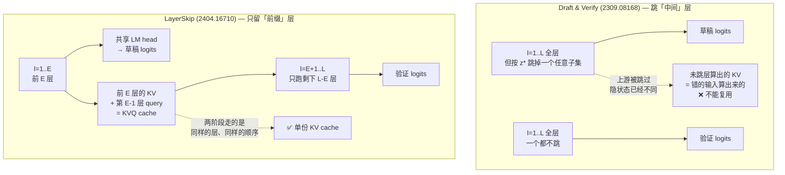

# 10 自投机 —— 跳层、早退与 Draft & Verify

## 1. 一句话

自投机（self-speculative decoding）用同一份权重同时当草稿和目标：**跳掉一部分层跑出来的就是草稿，跑完剩下的层就是验证**。它一次解决了独立草稿模型的三个包袱（要单独准备、要同 tokenizer、要额外显存），代价是**草稿成本 $c$ 掉不下 0.25–0.5 的量级** —— 而 [[06-期望接受长度与加速比模型-完整推导]] 的公式说明，$c=0.5$ 时哪怕 $\alpha=0.9$，理想加速比的天花板也只有 **1.376×**。这个数字就是自投机没能成为主流的全部原因。

---

## 2. 前一代卡在哪

[[09-2023奠基-两篇同期论文的异同]] 里的两篇论文都假定"手边有一个小模型"。这个假定在论文里成立，在部署里经常不成立，卡在三处：

**卡点一：草稿模型得存在。** Jun Zhang 等在 arXiv:2309.08168 §1 把这条写得很直白（逐字）：

> *"How to find or train a draft model that can effectively mimic the outputs of such a tailored model is a formidable task, with no straightforward or guaranteed solutions."*

这里的 *tailored model* 指的是 LLaMA-2-Chat、CodeLLaMA 这类微调过的模型。基座模型有官方的小尺寸兄弟（Llama-3.1-8B ↔ Llama-3.2-1B），但**每个业务微调出来的模型都没有**。要么再微调一个小的（成本见 [[21-草稿模型怎么训-对齐与在线蒸馏]]），要么放弃投机。

**卡点二：必须同 tokenizer。** HuggingFace transformers 对 `assistant_model=` 的文档逐字写着 *"The assistant model must have the exact same tokenizer."*（跨 tokenizer 需要走另一条 UAG 路径，见 [[20-主流引擎实现-vLLM与SGLang与TensorRTLLM]]）。同族模型之间通常满足，跨族基本不满足。

**卡点三：草稿要吃两份显存 —— 权重和 KV。** 这一条最容易被忽略，因为大家只算权重。按本库解析模型的参数表（`_lab/speedup.py::MODELS`，复跑 `python -c "from speedup import MODELS; print(MODELS)"`）：

| 组合 | 草稿权重开销 | 草稿 KV 开销 |
|---|---|---|
| target = llama3-8b（P=8.03e9, 32 层）<br/>draft = llama3.2-1b（P=1.24e9, 16 层） | +2.48 GB（fp16），**相当于目标权重的 +15.4%** | 每 token **等于目标 KV 的 25%**（16 层×512 vs 32 层×1024），任何序列长度下比例不变 |
| target = llama3-70b<br/>draft = llama3.2-1b | +2.48 GB，仅目标的 **+1.8%** | 同上 25% |

读法：**目标越小，草稿的相对显存代价越难忍**。8B 上挂一个 1B 草稿，等于凭空多要 15% 权重显存 + 25% KV 显存；而 KV 那一项在长上下文 + 大 batch 下是主导项（[[22-长上下文下的投机采样]]）。这份显存本来可以用来加 batch。

（口径：上表是**解析计算**，来自本库参数表的 `P` 与 `kv_per_tok`，fp16、无量化、不含激活与碎片。不是硬件实测。）

自投机的提案就是：**这三个包袱同时消失**。草稿就是目标本身，不需要准备、天然同 tokenizer、零额外权重。

---

## 3. 机制拆解

### 3.1 两条路线的分界：跳中间层 vs 只留前缀层

两篇奠基性工作选了同一个大方向、不同的具体切法，而这个差别决定了后面所有的效率差异。



**这张图是本篇的核心。** LayerSkip 论文 §3 用一句话点破了这个差别（逐字）：

> *"The advantage of our proposed solution compared to Zhang et al. 2023 is that verification and correction stages can reuse the activation and KV cache from the draft stage as both stages execute the same early layers in the same order, while Zhang et al. 2023 can not reuse them as it skips intermediate layers."*

为什么"跳中间层"就不能复用？因为 Transformer 是 $x_{l+1}=x_l+f_l(x_l)$ 的串联。若草稿跳掉了第 7 层，那么第 8 层拿到的输入 $x_8^{\text{draft}}$ 与验证时的 $x_8^{\text{full}}$ 就是两个不同的向量，于是第 8 层算出来的 $K,V$ 也是两份不同的东西。**草稿阶段算过的 KV，验证时一个都用不上。** 反过来，只留前 $E$ 层的前缀切法，前 $E$ 层的输入与全模型逐层完全一致，那 $E$ 层的 $K,V$ 就是同一份东西 —— 这是**数学上的恒等，不是工程近似**。

### 3.2 Draft & Verify（Jun Zhang 等，arXiv:2309.08168，v1 2023-09-15，ACL 2024）

- **作者与机构**：Jun Zhang、Jue Wang、Huan Li、Lidan Shou、Ke Chen、Gang Chen（**浙江大学 区块链与数据安全全国重点实验室**）；Sharad Mehrotra（**UC Irvine, Donald Bren School of Information and Computer Sciences**）。arXiv comment 字段逐字："Accepted to ACL 2024"。
- **跳层的粒度是"层"不是"块"**：attention 子层与 MLP 子层**分开计数、分开选**。论文把 LLaMA-2-13B 记作 **80 层**（40 个 attention + 40 个 MLP），LLaMA-2-70B 记作 **160 层**。附录 C 图示的 BO 结果是"跳 24 层 attention + 10 层 MLP"。
- **跳哪些层怎么选 —— 贝叶斯优化（Bayesian Optimization）**：
  - 决策变量 $\boldsymbol z\in\{0,1\}^L$（第 $i$ 位为 1 表示跳过第 $i$ 层）；
  - 目标函数 $f(\boldsymbol z)$ = 开发集上的 **average inference time per verified token**（不是接受率！论文明说只优化接受率会退化成"一层都不跳"）；
  - $\boldsymbol z^*=\arg\min_{\boldsymbol z} f(\boldsymbol z)$，用高斯过程做代理模型 + acquisition function 平衡探索/利用；
  - 用的是 `github.com/bayesian-optimization/BayesianOptimization`（MIT License），跑 **1000 次迭代**；每次评估用**从训练集随机抽的 8 条样本**测 per-token 时间；
  - $\boldsymbol z^*$ **模型级固定**，推理时不再更新（任务差异大时论文建议做任务级优化）。
- **自适应 draft-exiting**：草稿每出一个 token，看自己的置信度 $\max_x q(x\mid\cdot)$，低于阈值就停止起草。阈值本身按接受率反馈调：
  $$AR \leftarrow \beta_1 AR+(1-\beta_1)AR_e,\qquad
  \tilde\gamma=\begin{cases}\gamma+\epsilon,& AR\le\alpha\\ \gamma-\epsilon,&\text{otherwise}\end{cases},\qquad
  \gamma\leftarrow\beta_2\gamma+(1-\beta_2)\tilde\gamma$$
  超参（Appendix B）：初始 $\gamma=0.6$、$\epsilon=0.01$、$\beta_1=0.5$、$\beta_2=0.9$，目标接受率 $\alpha$ 按模型/数据微调。
  ⚠️ **这里的 $\gamma$ 是置信度阈值，$K$ 才是草稿长度** —— 与本库（以及 Leviathan）用 $\gamma$ 表示草稿长度的记号**正好撞车**。引用该文时必须换记号，否则读者会把两件事搞混。这条属于 [[17-动态草稿长度与自适应停止]] 的前身。
- **无损口径**：
  - 贪心（Algorithm 2/3）：验证是 `if x_{i+1} != argmax p(x|0⃗,...)` 就换掉并截断 —— 纯 argmax 比对，**L2 贪心等价**；
  - 采样（Appendix K, Algorithm 4）：草稿改为 $x_{j+1}\sim q$，验证是 $r\sim U[0,1]$，若 $r\ge\min(1,p/q)$ 则拒绝并从 $\dfrac{\max(0,p-q)}{\sum_x\max(0,p-q)}$ 重采 —— **这是标准的修正拒绝采样，L1 分布无损**（证明见 [[04-拒绝采样修正-无损性的完整证明]]）。
  - 两条路都**不改权重**，所以 L1/L2 都是**相对原始 checkpoint** 而言的。这是它相对 LayerSkip 最大的优势。
- **一个由本篇自己核实的事实**：把 ar5iv 全文转成纯文本后 `grep -c '[Cc]ache'` 结果为 **0** —— **这篇论文从头到尾没有讨论过 KV cache**。它在 2023-09 提出自投机时，并没有意识到"自投机可以共享 KV"这件事；这正是 LayerSkip 半年后补上的那块。

### 3.3 LayerSkip（Mostafa Elhoushi 等，arXiv:2404.16710，v1 2024-04-25，ACL 2024）

- **作者与机构**：Mostafa Elhoushi、Akshat Shrivastava（论文标注为共同一作/core contributor）、Diana Liskovich、Basil Hosmer、Bram Wasti、Liangzhen Lai、Anas Mahmoud、Bilge Acun、Saurabh Agarwal、Ahmed Roman、Ahmed A Aly、Beidi Chen、Carole-Jean Wu。机构标注为 **FAIR at Meta / GenAI at Meta / Reality Labs at Meta**，外加 University of Toronto、CMU、University of Wisconsin-Madison、Dana-Farber Cancer Institute。代码 `github.com/facebookresearch/LayerSkip`。
  > ⚠️ **取证坑**：ar5iv 渲染页面的 `date:` 字段显示 "August 9, 2026"，那是**重编译日期**，不是 v1 日期。本篇的 v1 日期取自 `export.arxiv.org` Atom API：`published = 2024-04-25T16:20:23Z`。**只看 ar5iv 页脚会把年月写错两年。**
- **它做的第一件事是改训练，不是改推理**。Draft & Verify 是"拿一个现成模型跳层"，LayerSkip 是"训一个天生适合早退的模型"：
  1. **Layer dropout**：丢弃率**按层指数递增**，$D(l)=e^{l\ln 2/(L-1)}-1$ 再缩放到 $p_{\max}$（实验取 0.1–0.2）。浅层几乎不丢、深层丢得多；
  2. **Early exit loss**：**所有层共用同一个 LM head**（论文强调 *"without adding any auxiliary layers or modules"* —— 与 [[12-Medusa-多头草稿与树注意力的诞生]] 的加头路线正相反）；各层损失权重按 $\tilde e(t,l)=C(t,l)e(l)/\sum_i C(t,i)e(i)$ 分配，$C$ 是 curriculum（rotational：每 $R$ 层开一个出口并轮转；gradual：逐步放开）；
  3. 论文的一个副产物观察：**不加早退损失时，中间层的困惑度在训练过程中会持续恶化**（Figure 22）。也就是说"浅层表示天然可用"这个直觉是错的 —— 浅层可用性是**训出来的**。
- **推理端的自投机三步**（§4.3 + Appendix A.4 伪码）：
  1. `forward_early`：跑前 $E$ 层，经共享 LM head 自回归出 $d$ 个草稿 token，同时把前 $E$ 层的 KV 和第 $E-1$ 层的 query 存进 **KVQ cache**；
  2. `forward_remainder`：只跑第 $E+1$ 到 $L$ 层，复用 KVQ cache，一次前向验证全部 $d$ 个草稿；
  3. 逐位比对，接受到第一个分歧处，把验证出的那个 token 接上，回到第 1 步。
- **Cache Reuse 的两块（论文逐字）**：
  - *"Single KV Cache: ... the first E layers are shared in both steps. Hence, in the draft stage, the KV cache in the first E layers are already computed, so we are able to effectively maintain a single KV cache for the draft and verify steps, reducing memory and latency."*
  - *"Exit Query Cache: ... saves the query vector of exit layer E−1 for verification to directly continue from layer E to last layer L. Critically note that we need to save only the query for the exit layer."*
- **无损口径 —— 这里要非常小心**：
  - 验证规则是 *"assess to see where the draft tokens and verified tokens agree"*，即 **argmax 一致性比对**，全部实验也都是 greedy decoding。所以 LayerSkip 的自投机是 **L2 贪心等价**，论文**没有**给出采样版本的修正拒绝采样。
  - 更要紧的是：**它相对的是谁**。训练配方改了权重，"LayerSkip 版 Llama2-7B"和"原始 Llama2-7B"是两个模型。论文自己在 §6.2 逐字交代基线设置：*"'Autoregressive' experiments use baseline models that were pretrained or finetuned without LayerSkip, while 'Early Exit' and 'Self Speculative' experiments use our models trained or finetuned with LayerSkip."*
  - 所以：**相对 LayerSkip 模型的最后一层，自投机是 L2；相对原始 checkpoint，整条链路是 L3**（权重被换过了）。论文 §8 Limitations 第一条也承认这是它相对 Draft & Verify 的劣势（逐字）：*"Our self-speculative decoding solution requires finetuning a model or pretraining it with our recipe, while the self-speculative decoding approach propoposed in Zhang et al. 2023 does not require changing a model's weights."*（原文 "propoposed" 为笔误）
  - 而**关掉验证、只用早退**（论文的 "Early Exit" 行）是彻底的 **L3 近似**，掉分幅度见 §7.3。

### 3.4 铁律一：自投机的三种口径，一张表说清

| 设置 | 口径 | 相对谁 | 依据 |
|---|---|---|---|
| Draft & Verify，采样（Algorithm 4） | **L1 分布无损** | **原始 checkpoint** | 完整的 $\min(1,p/q)$ + $\text{norm}(\max(0,p-q))$ 残差重采 |
| Draft & Verify，贪心（Algorithm 2/3） | **L2 贪心等价** | **原始 checkpoint** | argmax 逐位比对 |
| LayerSkip 自投机（greedy） | **L2 贪心等价** | **LayerSkip 训练后的模型** | argmax 一致性；权重已被训练配方改过 |
| LayerSkip 自投机，与原始 checkpoint 比 | **L3 近似** | 原始 checkpoint | 权重不同，最后一层输出本来就不同 |
| **纯早退（不做验证）** | **L3 近似** | 任何参照 | 直接用第 $E$ 层的 logits 出 token，无修正 |

**这就是 `_meta/写作规范.md` §1 里"部分自投机设置属于 L3"的确切所指**：不是自投机这条路线本身有损，而是**（a）关掉验证阶段、（b）为了让浅层出口可用而改了权重**这两种设置有损。凡是保留了完整验证阶段、且不改权重的自投机，它的无损性与标准投机采样一字不差 —— 因为它用的就是同一条接受判据。把这两者混为一谈，是这条线上最常见的误读。

---

## 4. 一个 step 里发生了什么（含成本公式的重推）

标准投机采样一轮的耗时（[[06-期望接受长度与加速比模型-完整推导]] 式 4.4）是

$$T_{\text{iter}}=(\gamma c+1)\,T_{\text{target}},\qquad c=\frac{T_{\text{draft}}}{T_{\text{target}}}$$

**这条公式对 LayerSkip 是错的**，因为它假设"验证要跑一次完整的目标前向"。而 LayerSkip 的验证**只跑后 $L-E$ 层**。设 $L$ 为总层数、$E$ 为出口层：

$$
\boxed{\;
c=\frac{E}{L},\qquad
T_{\text{iter}}^{\text{LayerSkip}}=\Big(\gamma\cdot\frac{E}{L}+\frac{L-E}{L}\Big)T_{\text{target}}
\;}
\tag{4.1}
$$

对比之下，一个**独立草稿模型**、成本恰好也是 $c=E/L$ 的话，分母是 $\gamma\cdot\frac{E}{L}+1$。两者之差就是共享 KV 省下的那一份：

$$
\text{省下的比例}=\frac{E/L}{\gamma\cdot E/L+1}
\tag{4.2}
$$

逐步走查一轮（以 $L=24$、$E=6$、$\gamma=7$ 为例，即 LayerSkip 论文 Table 11 的 CPU 配置）：

1. **草稿 7 步**：每步跑第 1–6 层（成本 $6/24=0.25$），共 $7\times0.25=1.75$ 个目标前向当量。每步顺手把这 6 层的 $K,V$ 写进唯一那份 cache。
2. **验证 1 次**：跑第 7–24 层（成本 $18/24=0.75$），一次前向覆盖 8 个位置（7 个草稿 + 1 个当前）。前 6 层？**已经在第 1 步算完了，直接读 cache**。
3. **分母合计**：$1.75+0.75=2.5$。若换成一个外挂的、成本同为 0.25 的独立草稿模型，分母是 $1.75+1=2.75$ —— **贵 10%**。
4. **回滚**：被拒的位置之后的 KV 在唯一那份 cache 里裁掉。这里自投机还占一个便宜：**只有一份 cache 要裁**，不存在"两份 cache 长度对不齐"这个经典 bug 面。

（形状标注：草稿阶段每步 query 形状 $[b,1,d]$，走 $E$ 层；验证阶段 query 形状 $[b,\gamma+1,d]$，走 $L-E$ 层；KV cache 形状 $[b,L,\text{seqlen},n_{kv},d_h]$，**只有一份**，草稿写前 $E$ 层、验证补后 $L-E$ 层。）

---

## 5. 小数字算例：这一节解释了自投机为什么没赢

### 5.1 $c=0.5$ 意味着什么（本篇的核心数字）

Draft & Verify 报告"跳掉大约一半层时端到端加速最高"。跳一半层 $\Rightarrow c\approx0.5$。把它代进 [[06-期望接受长度与加速比模型-完整推导]] 的模型，取一个**慷慨的** $\alpha=0.9$：

**实测**（复跑：`cd _lab && python -c "from accept import optimal_gamma; print(optimal_gamma(0.9, 0.5))"`）

$$
\gamma^\*=3,\qquad \text{speedup}^\*=\mathbf{1.3756}
$$

逐 $\gamma$ 展开（同一条命令换 `speedup_ideal(0.9, g, 0.5)`）：

| $\gamma$ | 1 | 2 | **3** | 4 | 5 | 6 | 8 | 12 |
|---|---|---|---|---|---|---|---|---|
| $E[\tau]$ | 1.900 | 2.710 | **3.439** | 4.095 | 4.686 | 5.217 | 6.126 | 7.458 |
| 分母 $\gamma c+1$ | 1.50 | 2.00 | **2.50** | 3.00 | 3.50 | 4.00 | 5.00 | 7.00 |
| 理想加速比 | 1.267 | 1.355 | **1.376** | 1.365 | 1.339 | 1.304 | 1.225 | 1.065 |

**读法（这是全篇最重要的一段）**：

1. **最优草稿长度只有 3。** 而 $c=0.02$ 的草稿头在同样 $\alpha=0.9$ 下 $\gamma^\*=19$。草稿贵，就只能猜三步。
2. **理想加速比 1.376×，而这是上界。** 这个数字**假设验证完全免费、没有任何工程开销、$\beta$ 沿链不相关**（[[06-期望接受长度与加速比模型-完整推导]] §7 已证明第三条会让公式高估）。真实系统只会更低。
3. **$\gamma=12$ 时已经掉到 1.065**，再往上就跌破 1。$c$ 大的时候，"把 $\gamma$ 调大"不是收益递减，是**直接亏钱**。

同一个 $\alpha=0.9$，把 $c$ 横着扫一遍（`python -c "from accept import optimal_gamma; [print(c, optimal_gamma(0.9,c)) for c in (0.02,0.10,0.25,0.33,0.50,0.75)]"`）：

| $c$ | 0.02 | 0.10 | 0.25 | 0.33 | **0.50** | 0.75 |
|---|---|---|---|---|---|---|
| 对应做法 | EAGLE 类草稿头 | 独立 1B 小模型 | 只留 1/4 层 | 只留 1/3 层 | **跳一半层** | 只跳 1/4 层 |
| $\gamma^\*$ | 19 | 10 | 6 | 5 | **3** | 1 |
| 理想加速比 | **6.365** | 3.431 | 2.087 | 1.768 | **1.376** | 1.086 |

**这张表就是整条历史线的答案。** 从 $c=0.5$ 走到 $c=0.02$，理想加速比从 1.38 变成 6.37，**差 4.6 倍**。自投机确立了"草稿必须便宜"这个认识，却卡在自己 $c$ 的下限上 —— 因为**跳层是有底的**：跳得太狠，$\alpha$ 塌方（Draft & Verify 实测：80 层里跳超过 42 层后加速比明显下降）。想再往下压 $c$，只能换机制，那就是 [[13-EAGLE三代-特征级自回归的演进]] 与 [[14-MTP-从训练目标到推理草稿]]。

还有一条更冷的推论（`python -c "from accept import optimal_gamma; [print(a, optimal_gamma(a,0.5)) for a in (0.9,0.95,0.97,0.99,0.995)]"`）：**在 $c=0.5$ 下，$\alpha$ 要拉到 0.995 才刚够 1.82×**。

| $\alpha$ | 0.90 | 0.95 | 0.97 | 0.99 | 0.995 |
|---|---|---|---|---|---|
| $\gamma^\*$ | 3 | 5 | 7 | 13 | 19 |
| 理想加速比 | 1.376 | 1.514 | 1.602 | 1.750 | 1.817 |

**$c=0.5$ 时，理想加速比的绝对上界是 $1/c=2$**（$\gamma\to\infty$、$\alpha\to1$）。**跳一半层的自投机，无论接受率多高、无论工程做得多好，永远到不了 2×。** 这不是实现问题，是算术。

### 5.2 拿 Draft & Verify 自己的 breakdown 反验一遍

论文 Table 5 给了一份罕见的逐阶段计时（**口径**：LLaMA-2-13B，CNN/DM 测试集抽 10 条，A100-40GB，greedy，batch size 未给出但全文只出现一次 "batch"、且在结论里说"可参考 FlashAttention/vLLM 进一步适配 batched decoding"，故按 **bs=1** 理解）：

| 项 | Autoregressive | Self-Speculative |
|---|---|---|
| 起草 | — | **25.5 ± 1.14 ms**（attention 14.6，MLP 9.46） |
| 验证 | — | **10.7 ± 2.81 ms**（attention 7.55，MLP 2.73） |
| $\gamma$ 阈值更新 | — | 0.61 ± 0.14 **µs** |
| 每 token 平均延迟 | **56.3 ± 1.23 ms**（attn 39.7，MLP 14.3） | **36.8 ± 3.23 ms**（attn 22.2，MLP 12.2） |

**本篇自己做的反解**（复跑：`cd _lab && python -c` 见文末「本篇验证」）：

1. 端到端实测加速比 $=56.3/36.8=\mathbf{1.530}$。
2. 起草占自投机总延迟的 **69.3%**（25.5/36.8）。**在自投机里，起草才是大头，验证反而便宜。** 论文自己也点了这一句：*"the drafting stage consumes the majority of inference latency"*。这与独立小模型草稿的直觉完全相反。
3. 从 attention/MLP 分项反解单次草稿的相对成本：跳 24/40 attention（留 40%）+ 10/40 MLP（留 75%），得 $c=(0.40\times39.7+0.75\times14.3)/56.3=\mathbf{0.473}$。交叉验证：实测 draft/target 的 attention 时间比 $14.6/39.7=0.368$、MLP 比 $9.46/14.3=0.662$，与理论的 0.40/0.75 同量级（略低，符合"跳层同时省掉了一部分 kernel launch"的方向）。
4. 由验证耗时反解 $E[\tau]=56.3/10.7=\mathbf{5.26}$；由起草耗时反解每轮实际草稿步数 $K_{\text{eff}}=\mathbf{5.04}$（自适应 exit 把 $K=12$ 的上限砍到了约 5）。
5. **把这三个数代回第 06 篇的公式**：$\text{speedup}=E[\tau]/(K_{\text{eff}}c+1)=5.26/(5.04\times0.473+1)=\mathbf{1.555}$，**实测 1.530，误差 1.66%**。

这次反解有两重价值：**一是**它用一篇真实论文的计时数据独立验证了 [[06-期望接受长度与加速比模型-完整推导]] 的加速比模型在 bs=1 memory-bound 区确实准；**二是**它把 $c\approx0.47$ 从"我猜跳一半层就是 0.5"变成了**从论文自报数字反解出来的**。§5.1 那张表用的不是拍脑袋的参数。

---

## 6. 代码验证

本篇不新增 `_lab` 文件 —— 需要的东西 `accept.py` 已经全有了。关键函数：

```python
# _lab/accept.py
def speedup_ideal(alpha: float, gamma: int, c: float) -> float:
    return expected_tokens(alpha, gamma) / (gamma * c + 1.0)

def optimal_gamma(alpha: float, c: float, gmax: int = 64) -> tuple[int, float]:
    best_g, best_s = 1, -1.0
    for g in range(1, gmax + 1):
        s = speedup_ideal(alpha, g, c)
        if s > best_s:
            best_g, best_s = g, s
    return best_g, best_s
```

**实跑输出**（`cd _lab && python -c "from accept import optimal_gamma; print(optimal_gamma(0.9, 0.5))"`）：

```
(3, 1.3755859375)
```

三条断言直接支撑本篇：

- `_lab/test_accept.py::test_optimal_gamma_decreases_with_cost` —— **$c$ 越大 $\gamma^\*$ 越小**。这就是"自投机只能猜 3 步、EAGLE 能猜 19 步"背后的单调性。
- `_lab/test_accept.py::test_speedup_can_be_below_one` —— **理想模型下加速比本身就能 < 1**。这条尤其重要：$c$ 太大时，**不是"工程没做好所以没提速"，而是数学上就该亏**。§5.1 表里 $\gamma=12$ 那格（1.065）离 1 只差一点点，再大一点就翻过去了。
- `_lab/test_accept.py::test_optimal_gamma_increases_with_alpha` —— $\alpha$ 越高 $\gamma^\*$ 越大，对应 §5.1 第二张表：$c=0.5$ 下只有把 $\alpha$ 推到 0.99 以上，长草稿才重新有意义。

另外两条来自 `speedup.py`，管的是"共享 KV 到底值多少"这一侧：

- `_lab/test_speedup.py::test_lighter_draft_lowers_breakeven` —— 草稿越轻，加速比跌破 1 的那个 batch 越大（可用区间越宽）。自投机的 $c$ 重，所以它的可用 batch 区间**比 EAGLE 类窄**。
- `_lab/test_speedup.py::test_breakeven_always_above_one` —— 翻转点恒 > 1，即 bs=1 处总有收益。这解释了为什么所有自投机论文的头条数字都是 bs=1。

无损性那一侧共用第 04 篇的验证：`_lab/test_lossless.py::test_exact_distribution_lossless` —— Draft & Verify 的 Algorithm 4 用的就是这条被验证过的判据（$\min(1,p/q)$ + 残差重采），所以它的采样模式是 **L1**，不需要为它单独再验一次。

### 6.1 共享 KV 值多少：解析预测 vs 论文实测

用式 (4.2) 预测，再对上 LayerSkip Table 7 的消融（**口径**：CPU 推理，Llama 1.5B（24 层）TOPv2 微调模型，7 speculations，其余同 §6.2 设置）：

| 配置 | 共享分母 | 不共享分母 | **式 (4.2) 预测省** | **论文实测省（TOPv2）** | **论文实测省（CNN/DM）** |
|---|---|---|---|---|---|
| $E=18$（$c=0.75$，$\gamma=7$） | 5.500 | 6.250 | **12.0%** | 143→134 ms/t，**6.3%** | 182→166 ms/t，**8.8%** |
| $E=12$（$c=0.50$，$\gamma=7$） | 4.000 | 4.500 | **11.1%** | 110→104 ms/t，**5.5%** | 185→165 ms/t，**10.8%** |

四格里有一格（CNN/DM $E=12$：预测 11.1% vs 实测 10.8%）几乎完全命中，其余三格预测偏高 1.2–5.6 个百分点。方向与量级对得上，说明式 (4.2) 抓到了机制；偏高的原因**本篇未能定论** —— 论文只给了端到端 ms/token，没给逐阶段计时，无法区分"cache 读写本身也要钱"和"CPU 上层耗时非线性"这两种解释。**标记未查证。**

**结论仍然是明确的：共享 KV 值约 5%–12%，是真收益，但它不足以改变 $c\approx0.5$ 带来的量级问题。** 12% 相对于 EAGLE 那条线 4.6 倍的差距，是两个数量级上的事。

---

## 7. 口径与坑

### 7.1 记号撞车：Draft & Verify 的 $\gamma$ 不是草稿长度

再强调一次：**该文的 $\gamma$ 是置信度阈值（0.2/0.4/0.6/0.8），$K$ 才是草稿长度（2/4/6/8/12）**。社区转述该文时把两者搞混过不止一次。读它的 Table 3 与 Table 4 时要看清列头。

### 7.2 两篇论文的加速比，能不能放一张表里比？

**LayerSkip 自己做了这个比较**，而且做得比多数论文谨慎 —— 它逐字写明 *"Following Zhang et al. 2023, speedup is calculated as the acceleration of average inference time per token"*，且照抄了 CNN/DM 1-shot、XSUM 0-shot 的评测设置。它报的结论是：CNN/DM 上 **1.81× vs Draft & Verify 的 1.5×**（快），XSUM 上 **1.34× vs 1.48×**（慢）。

但按铁律二的七项单核对，**这个比较仍然是口径不全的**：

| 核对项 | Draft & Verify | LayerSkip | 一致？ |
|---|---|---|---|
| batch size | 未给出（正文仅一次提及 batch，在"未来工作"里），按 bs=1 | 未给出，同按 bs=1 | 大致一致 |
| $\gamma$ / 草稿长度 | 自适应，上限 $K=12$；反解出 $K_{\text{eff}}\approx5$ | 固定 $d$（表中未逐格给出） | **不一致**（自适应 vs 固定） |
| $\alpha$ | 报了 AR（0.748–0.935） | 报了 token acceptance（45%–98.9%） | **定义未必同口径**（见 [[05-接受率alpha-定义口径与怎么测]]） |
| draft/target 组合 | 原始 LLaMA-2-13B 跳层 | **LayerSkip 持续预训练过的 Llama2-13B** 前 $E$ 层 | **不一致：目标模型不是同一个** |
| 硬件 | **A100-40GB**（13B）、2×A100-80GB（70B） | **H100** | **不一致** |
| 测的是什么 | 平均每 token 推理时间之比 | 同 | 一致 |
| 任务分布 | CNN/DM、XSum、HumanEval | 同 | 一致 |

**最致命的是第 4 行**：LayerSkip 的"1.81×"分母是**没经过 LayerSkip 训练的模型**的自回归速度，分子是**经过训练的模型**的自投机速度。两个模型的最后一层输出并不相同。**这不是同一个模型的加速比，是两个模型之间的速度比。**（LayerSkip 报告 ROUGE-2/EM 没掉，说明质量没塌，但"没掉"和"逐 token 相同"是两回事，见 [[07-无损的三种口径-分布无损不等于结果相同]]。）

**判据**：引用"LayerSkip 比 Draft & Verify 快 20%"时，必须同时说明**硬件不同（H100 vs A100）且目标模型不同**。否则属于铁律二禁止的横向比较。

### 7.3 早退本身有多不准：一组该被反复引用的数字

LayerSkip 的 Table 11（**口径**：CPU 推理，Llama 1.5B（24 层）TOPv2 微调，TOPv2 测试集前 100 条，7 speculations，生成 50 token，greedy）：

| 模式 | $E$ | EM | 接受率 | ms/token |
|---|---|---|---|---|
| Autoregressive（全 24 层） | — | **85.39** | — | 165 |
| **纯早退（L3）** | 18 | 82.0 | — | 124 |
| **纯早退（L3）** | 12 | 77.2 | — | 84 |
| **纯早退（L3）** | 6 | **29.8** | — | 44 |
| 自投机（L2） | 18 | 82.9 | 99% | 134 |
| 自投机（L2） | 12 | 82.9 | 97% | 104 |
| 自投机（L2） | 6 | 82.9 | **76%** | 87 |

三条读法：

1. **$E=6$ 时纯早退把 EM 从 85.39 砸到 29.8** —— 掉了 65 个点，**浅层表示确实还没成形**。而同样的 $E=6$，加上验证阶段后 EM 回到 82.9。**"验证阶段"这三个字值 53 个 EM 点。**
2. **接受率随 $E$ 掉得很快**：$E=18$ 时 99%，$E=6$ 时 76%。这就是自投机 $\alpha$ 的真实脸孔 —— **想让 $c$ 小（$E$ 小），$\alpha$ 立刻掉**。而 §5.1 已经说明，$c=0.25$ 时想要 2× 就需要 $\alpha\approx0.9$，76% 显然不够。
3. **代码任务上更糟**：同论文 Table 5（Llama1 7B 代码微调，A100，HumanEval，$d=12$，$E=6$，greedy）报的 token 接受率只有 **45%**。代码的 token 熵高、局部依赖强，浅层出口更难猜对 —— 与 [[05-接受率alpha-定义口径与怎么测]] 关于任务分布的结论一致。

### 7.4 「零额外显存」这句话的边界

Draft & Verify 摘要逐字："requires no additional neural network training and **no extra memory footprint**"。这句话在**主方案下成立**，但论文自己在 Appendix F 给了例外：为了压更狠的跳层比例，可以拿 75M token 微调草稿子图 —— 一旦这么做，**草稿就不再与原模型共享参数**，摘要那句话立刻失效（论文自陈）。引用这句话时要说明是哪个设置。

LayerSkip 那边则从一开始就不成立"零改动"：它必须重训。**这两篇的取舍正好互补**：Draft & Verify 换来"权重不动"，代价是不能共享 KV；LayerSkip 换来"共享 KV + 浅层出口更准"，代价是要重训、且相对原始 checkpoint 不再无损。

### 7.5 工程现状里的一个反讽

按 RS-3 的引擎盘点（截至 2026-08-22）：**HuggingFace transformers 是唯一内置早退自投机的主流框架**（`generate(assistant_early_exit=E)`，路由优先级最高的一条；vLLM / SGLang / llama.cpp / TensorRT-LLM 都没有）。类 docstring 直接点名 `facebook/layerskip-llama3.2-1B`。

但读源码会发现两件事（`src/transformers/generation/candidate_generator.py`，本篇复核过）：

1. **它是 L1 的**。`EarlyExitCandidateGenerator.get_candidates()` 返回 `(candidate_ids, candidate_logits)`，而 `utils.py` 的分派是 `if do_sample and candidate_logits is not None: _speculative_sampling(...)` —— 所以它走的是 Leviathan Algorithm 1 的修正拒绝采样，**分布无损**。（[[20-主流引擎实现-vLLM与SGLang与TensorRTLLM]] 把早退与 prompt lookup 归为"拿不到草稿分布"的同一类，就这一条而言可以再细化：早退是拿得到草稿 logits 的。）
2. **它没有实现 LayerSkip 的共享 KV**。实现只有三行 —— 临时把 `base_model.config.num_hidden_layers` 改成 $E$、调父类、再改回来。而父类 `AssistedCandidateGenerator` 在构造时**显式把 `past_key_values` 排除在拷贝之外**（`if key not in ("encoder_outputs", "past_key_values")`），并把草稿的 cache 单独存进 `self.assistant_kwargs["past_key_values"]`。也就是说，**HF 为"同一个模型的前 $E$ 层"和"同一个模型的全部 $L$ 层"维护了两份互不相干的 KV cache**。

**结论**：唯一落地了早退自投机的主流框架，恰恰**丢掉了自投机最独特的那个优势**。这不是 bug（复用父类的实现代价最低），但它意味着：**今天大多数人跑到的"自投机"，是式 (4.1) 的分母写成 $\gamma\cdot\frac{E}{L}+1$ 的那个版本，而不是 $\gamma\cdot\frac{E}{L}+\frac{L-E}{L}$。** 想拿到共享 KV 的那 5%–12%，得用 Meta 官方仓库。

---

## 8. 失效条件（铁律三）

写成可判定的形式：

1. **$c\ge 1/S_{\text{target}}$ 时，直接判负收益。** 若你要求的加速比是 $S_{\text{target}}$，那么必须满足 $c<1/S_{\text{target}}$，因为理想加速比的绝对上界就是 $1/c$。**跳一半层（$c=0.5$）时目标不能超过 2×；实际能拿到的（$\alpha=0.9$）只有 1.376×。** 想要 3×，$c$ 必须小于 0.33，即最多只能留 1/3 的层 —— 而那个深度上 $\alpha$ 已经塌了（Table 11：$E=6/24$ 时 $\alpha=76\%$）。这条是数学，不是工程。
2. **batch ≥ 交叉点时，与所有投机方案一起失效，且自投机更早。** 自投机的 $c$ 大，同样的 $\gamma$ 下它消耗的"免费额度"与独立草稿相同（都是 $\text{batch}\times(\gamma+1)$ 个 query token），但它的**收益更低**，所以在 [[18-batch与吞吐-收益衰减曲线]] 那条曲线上，它更早跌破 1。可判定形式见 [[19-负收益全解-什么时候投机反而更慢]] 与 [[23-与其它优化的相互作用-量化与KVcache与PD分离]] §4.1 的交叉点表。
3. **代码 / 结构化输出任务上，$E$ 必须调大，收益随之蒸发。** 依据：LayerSkip 代码微调实验（A100，Llama1 7B，HumanEval，$d=12$，$E=6$）token 接受率仅 **45%**，而同配方在 TOPv2 语义解析上 $E=6$ 有 76%。$\alpha=0.45$ 配 $c=0.25$、$\gamma=12$ 时，代回公式给出的理想加速比不足 1.3。**判据：若目标任务的浅层出口接受率 < 60%，把 $E$ 调大到接受率 ≥ 80%，然后重算 $1/c$ 上界，多半会发现已经不值。**
4. **跳层组合选错时，比不投机还慢。** Draft & Verify §4.3 逐字：*"an inappropriate combination of skipped layers can actually result in a decrease in the end-to-end inference speed."* 而 BO 要跑 **1000 次迭代**（每次评估要在 8 条真实样本上实测 per-token 时间）。**这是一笔离线成本，且换模型就要重跑。** 判据：若模型版本迭代周期短于 BO 一次的完成时间，这条路线在工程上不成立。
5. **想给已经 int4 量化的模型上自投机时，先重算免费额度。** 量化把访存砍掉、把前向往 compute-bound 推，而自投机的 $c$ 大意味着它需要**更长的 $\gamma$ 才划算**（$\gamma^\*$ 虽然小，但每个 $\gamma$ 的边际收益也小），两头夹击。见 [[23-与其它优化的相互作用-量化与KVcache与PD分离]] §4.1：int4 权重把可用 batch 区间从 265 砍到 67。
6. **LayerSkip 路线：不接受"权重被换过"的场合直接出局。** 若你的合规/评测要求是"输出必须与已上线的 checkpoint 逐 token 一致"，LayerSkip 不满足（它是相对新权重的 L2，相对旧 checkpoint 是 L3）。这种场合只有 Draft & Verify 路线可用。

---

## 9. 自测题

1. Draft & Verify 与 LayerSkip 都叫"自投机"，为什么只有后者能共享 KV cache？请从 $x_{l+1}=x_l+f_l(x_l)$ 说起。
   <details><summary>答案要点</summary>Transformer 是逐层串联的残差流。LayerSkip 只保留**前缀** $1..E$ 层，草稿与验证在这 $E$ 层上输入逐层完全相同，所以这 $E$ 层的 $K,V$ 是**同一份东西**（数学恒等）。Draft & Verify 跳的是**中间**层，一旦第 $j$ 层被跳过，第 $j+1$ 层往后拿到的隐状态就与全模型不同，那些层算出的 $K,V$ 是"用错的输入算出来的"，验证时必须重算。LayerSkip 论文 §3 明确点名了这一差别。</details>

2. 有人说"自投机是无损的，因为它用的就是原模型"。这句话在哪些设置下对、哪些下错？
   <details><summary>答案要点</summary>① Draft & Verify 采样模式（Algorithm 4）用完整的 $\min(1,p/q)$ + $\text{norm}(\max(0,p-q))$，**L1，相对原始 checkpoint**，对。② Draft & Verify 贪心是 argmax 比对，**L2**，对（但要说清是 L2 不是 L1）。③ LayerSkip 自投机是 **L2，但相对的是被 LayerSkip 重训过的模型**；相对原始 checkpoint 是 **L3**，因为权重被换了。④ 纯早退不做验证是彻底的 **L3**：Table 11 里 $E=6$ 时 EM 从 85.39 掉到 29.8。所以"用的就是原模型"这个理由只对 ①②，对 ③ 不成立（模型已经不是原来那个）。</details>

3. $\alpha=0.9$、$c=0.5$ 时最优 $\gamma^\*=3$、理想加速比 1.376×。如果工程上把共享 KV 做到位（$L=24$、$E=12$），加速比会变成多少？这够不够解释自投机的落败？
   <details><summary>答案要点</summary>共享 KV 把分母从 $\gamma\times0.5+1$ 换成 $\gamma\times0.5+0.5$。$\gamma=3$ 时分母从 2.5 变 2.0，加速比从 1.376 升到 $3.439/2.0=1.720$（约 +25%；注意这是解析上界，论文实测的 KVQ 消融只有 5%–12%）。**不够。**因为 $c=0.02$ 的草稿头在同样 $\alpha$ 下是 6.365×。共享 KV 是常数因子的改进，$c$ 的差距是数量级的改进。**这正是"自投机被轻量草稿头取代"的定量原因。**</details>

4. Draft & Verify 的 Table 3 里，$K=2$ 时接受率最高（0.924）但加速比最低（1.37×），$K=8$ 时接受率最低（0.748）加速比也低（1.36×）。为什么会两头都低？
   <details><summary>答案要点</summary>这正是 [[06-期望接受长度与加速比模型-完整推导]] §4.5 的"分子指数饱和、分母线性增长"。$K$ 小：分子 $E[\tau]$ 上限被 $K+1$ 卡住，草稿能力没用满（论文原话 *"underutilizes the draft model's capacity"*）；$K$ 大：分母 $Kc+1$ 线性涨，而多出来的草稿 token 大概率被丢。注意这里的"接受率"是按**已生成草稿 token 的比例**统计的，$K$ 越大越容易统计到链条后段的低接受位置，所以它随 $K$ 单调降 —— **接受率高 ≠ 加速比高**，这是 α 口径问题的一个漂亮实例（见 [[05-接受率alpha-定义口径与怎么测]]）。</details>

5. LayerSkip 报告在 CNN/DM 上 1.81×、比 Draft & Verify 的 1.5× 快 20%。要引用这个数字，你必须补哪些口径？
   <details><summary>答案要点</summary>至少三条：① **硬件不同**——LayerSkip 用 H100，Draft & Verify 用 A100-40GB；② **目标模型不同**——LayerSkip 的自投机跑在"经 LayerSkip 持续预训练（52B token）的 Llama2"上，而它的自回归基线跑在"没经过该训练的 Llama2"上，这不是同一个模型的加速比；③ **batch size 两篇都未给出**，按上下文只能推断为 1。另外 XSUM 上方向是**反的**（1.34× vs 1.48×），只引 CNN/DM 那一格属于挑数据。</details>

---

## 10. 它新增了什么 / 什么被后来推翻（铁律五）

### 10.1 Draft & Verify（2023-09）新增了什么

1. **第一次证明"草稿模型可以不存在"**。在它之前，投机采样的每一篇都预设了两个模型。它把草稿变成目标的一个**子图**。
2. **把"跳哪些层"变成一个可优化的目标函数**，而且目标选得对 —— 优化的是 *average inference time per verified token*，不是接受率。这个取舍在论文里有明确论证（只优化接受率会退化成不跳层）。
3. **自适应 draft-exiting**：按草稿置信度停止起草，阈值用接受率反馈调。这是 [[17-动态草稿长度与自适应停止]] 那条线的直接前身；HuggingFace 今天的 `assistant_confidence_threshold`（默认 0.4）与 `num_assistant_tokens_schedule="heuristic"` 都是同一思路的工业化。
4. **对"零额外显存"给了可核验的边界**（Appendix F 的例外自陈）。

### 10.2 Draft & Verify 的哪些主张被后来推翻/修正

- **"自投机不能共享 KV cache"** —— 严格说这不是它的主张，而是它的**盲点**：全文 `grep -c cache` = **0**。LayerSkip 在 7 个月后指出，只要把"跳中间层"换成"只留前缀层"，KV 就能共享，并实测省 5%–12%。**这是本条线上被推翻得最干净的一条。**
- **"跳一半层是最优点"** —— 这个经验结论在它自己的实验里成立（80 层跳 42 层左右达峰），但它同时**锁死了 $c\approx0.5$**，也就锁死了 2× 的绝对上界。后来的路线（EAGLE / MTP）没有在这个框架里改进，而是**换掉了框架**。
- **BO 选层这套方法本身**：截至查证日（2026-08-22）**未见被直接推翻**，但也**未被任何主流推理引擎采用** —— vLLM / SGLang / TensorRT-LLM / llama.cpp 全都没有跳层自投机（依据：RS-3 引擎盘点）。1000 次 BO 迭代的离线成本 + 换模型就要重跑，是它没能进引擎的合理解释（**这条归因是本篇的推断，非论文自陈，标记为推断**）。

### 10.3 LayerSkip（2024-04）新增了什么

1. **共享 KV cache（Single KV Cache + Exit Query Cache = KVQ cache）** —— 自投机独有的效率优势，只有前缀切法拿得到。
2. **把"浅层出口可用"从假设变成训练目标**：layer dropout（按层指数递增）+ early exit loss（所有层共用一个 LM head，不加辅助头）。附带一个反直觉发现：**不加早退损失时，中间层困惑度会随训练持续恶化**——浅层可用性是训出来的，不是白送的。
3. **一次训练得到一整族草稿模型**：论文逐字 *"Our training recipe enabled us to train the model once to get an ensemble of different candidate draft models at each layer depth."* 推理时按任务选 $E$，不必重训。
4. **公开了模型**：`facebook/layerskip-llama3.2-1B` 等，是 HF `assistant_early_exit` 的默认演示对象。

### 10.4 LayerSkip 的哪些主张被后来推翻/修正

- **"不加辅助模块"这条路线，被 Medusa/EAGLE 那条"就加辅助模块"的路线在效果上压过。** LayerSkip 的最高数字 2.16×（从零预训练 Llama2 7B，H100，CNN/DM，greedy，bs 未给出），而 EAGLE 系在 bs=1 上的数字要高得多（见 [[13-EAGLE三代-特征级自回归的演进]]）。原因在 §5.1 那张 $c$ 表里：**LayerSkip 的 $c=E/L$ 有物理下限，草稿头的 $c$ 没有。**
- **"共享 KV 减少 memory 和 latency"这条本身没被推翻，但在工程上大面积没被实现** —— 唯一内置早退自投机的 HF transformers 用的是两份 KV cache（§7.5，本篇读源码核实）。
- **"self-speculative decoding 不需要额外权重"** —— 对推理成立，但训练配方改了权重，所以对"部署时能不能直接用现成 checkpoint"这个更实际的问题，答案是**不能**。论文 §8 自陈。
- **截至查证日（2026-08-22），未见有工作推翻它关于"中间层困惑度随训练恶化"的实证观察。**

### 10.5 自投机今天还活在哪里

这条线并没有死，但它**换了要便宜的东西 —— 从"少跑几层"变成"少读一点 KV / 读得糙一点"**：

| 工作 | arXiv / 年月 | 它把什么变便宜 | 数字与口径 |
|---|---|---|---|
| **MagicDec** | 2408.11049，2024-08 | 草稿用 StreamingLLM 定长窗口 / 自投机，**只读固定长度的 KV** | 8×A100，Llama-2-7B-32K，**batch 32–128**，32K prefill：**1.91–2.0×**。γ/接受率/温度未逐格给出【口径不全】 |
| **QuantSpec** | 2502.10424，2025-02 | draft 与 target 同架构，draft 侧用**分层 4-bit 量化 KV + 4-bit 权重** | 报告接受率 >90%，端到端最高约 2.5×，跨多个上下文长度 >1.78×。⚠️**硬件/模型对/batch 未从原文核实** |
| **SparseSpec** | 2512.01278，2025-12（Yilong Zhao、Jiaming Tang、Kan Zhu 等，MIT/UW/Berkeley/清华） | 自投机 + PillarAttn，复用 verification 阶段的信息选关键 token；delayed verification 做 CPU/GPU overlap | 最高 **2.13× 吞吐**。⚠️**硬件/模型/上下文/batch 原文摘要未给出** |
| **EfficientRollout** | 2606.18967，2026-06-17（Minseo Kim 等） | RL rollout 场景：从 target **诱导出一个量化的 drafter**，天然跟着演化中的策略走 | 数字见 [[24-前沿进展-2025到2026]]，本篇不重复 |

**这张表里没有一个是跳层的。** 机制上的解释很清楚：

> **跳层直接砍掉了"表示还没形成"的那部分计算，所以 $\alpha$ 一定会掉；而砍 KV（量化/稀疏/定长窗口）在长上下文下几乎不动 $\alpha$，却能把成本砍得同样狠。**

外加一条 [[22-长上下文下的投机采样]] 已经确认的结构性优势：**自投机类草稿天然没有训练窗口外推问题**（它就是目标模型本身），而 EAGLE-3 的公开草稿头训练窗口只有 2K，拿到 32K 输入上接受长度塌到 1.28、加速比变成 **0.81×**（OWL，2510.07535，bs=1，8×H200，LongSpecBench 4K–64K）。

**所以自投机今天确定还活着的三个场景**（前两条有一手依据，第三条是推断）：

1. **长上下文 + 大 batch**：草稿必须"长度无关"，自投机 / 定长窗口是最省事的选择（依据：MagicDec 实测，见上表）。
2. **没有可用草稿头权重时**：业务微调出来的模型没有配套的 EAGLE 头，训一个要成本（[[21-草稿模型怎么训-对齐与在线蒸馏]]）。Draft & Verify 的卖点在这里仍然成立 —— 它是**唯一不需要任何额外权重、也不需要改权重**的路线。
3. **极度显存受限时**（**推断，未查到专门实测**）：§2 那张表说明 8B 目标挂 1B 草稿要多吃 15.4% 权重 + 25% KV。当这份显存的机会成本高于 1.376× 与 3× 之间的差距时，自投机划算。**本库未找到直接测量这个交换的论文，标记未查证。**

---

## 11. 延伸与双链

- 上一代（草稿模型从哪来）：[[09-2023奠基-两篇同期论文的异同]]；更早的自草稿骨架：[[08-史前史-2018并行解码与非自回归的失败]]
- 本篇全部定量结论的来源公式：[[06-期望接受长度与加速比模型-完整推导]]；接受判据的正确性：[[04-拒绝采样修正-无损性的完整证明]]
- 无损三口径与"L1 不等于结果相同"：[[07-无损的三种口径-分布无损不等于结果相同]]
- $\alpha$ 为什么随任务差两倍、以及"接受率"的多种定义：[[05-接受率alpha-定义口径与怎么测]]
- 把 $c$ 真正压到 0.02 的两条后继路线：[[13-EAGLE三代-特征级自回归的演进]]、[[14-MTP-从训练目标到推理草稿]]；另一条"$c$ 几乎为 0"的路：[[11-无模型草稿-promptlookup与ngram与检索]]
- 自适应停止的现代形态：[[17-动态草稿长度与自适应停止]]
- 自投机今天真正的战场：[[22-长上下文下的投机采样]]、[[24-前沿进展-2025到2026]]
- 引擎里到底有没有：[[20-主流引擎实现-vLLM与SGLang与TensorRTLLM]]
- 什么时候一律别开：[[18-batch与吞吐-收益衰减曲线]]、[[19-负收益全解-什么时候投机反而更慢]]、[[23-与其它优化的相互作用-量化与KVcache与PD分离]]
- 谱系里的位置与"被淘汰的分支"：[[15-谱系图与被淘汰的分支]]、[[25-未来判断-哪些方向会活下来]]
- 社区对"自投机无损"的常见误读：[[27-常见误解与判据]]

---

### 本篇验证

- `_lab/test_accept.py::test_optimal_gamma_decreases_with_cost` —— 验证 §5.1 的核心断言：$c$ 越大最优草稿长度越小。自投机 $c\approx0.5$ 只能猜 3 步、EAGLE 类 $c\approx0.02$ 能猜 19 步，是同一条单调性的两端。
- `_lab/test_accept.py::test_speedup_can_be_below_one` —— 验证 §8 第 1 条：**理想模型下加速比本身就能小于 1**。这条断言说明 $c$ 太大时的负收益是算术后果，不是工程没做好。
- `_lab/test_accept.py::test_optimal_gamma_increases_with_alpha` —— 验证 §5.1 第二张表：$c=0.5$ 时只有把 $\alpha$ 推到 0.99 以上，长草稿才重新有意义。
- `_lab/test_speedup.py::test_lighter_draft_lowers_breakeven` —— 验证 §8 第 2 条：草稿越重，跌破 1 的 batch 越小，自投机的可用 batch 区间比 EAGLE 类窄。
- `_lab/test_speedup.py::test_breakeven_always_above_one` —— 翻转点恒大于 1，即 bs=1 处总有收益；这解释了为什么本篇引用的所有自投机数字都是 bs=1。
- `_lab/test_lossless.py::test_exact_distribution_lossless` —— 验证 §3.4 第一行：Draft & Verify 的 Algorithm 4 用的正是这条被逐点验证过的判据（$\min(1,p/q)$ + 残差重采），所以它的采样模式是 **L1**。
- 可复跑（全部在 `_lab/` 目录下执行，不新增文件）：
  ```bash
  cd _lab
  # §5.1 本篇的核心数字
  python -c "from accept import optimal_gamma; print(optimal_gamma(0.9, 0.5))"
  # -> (3, 1.3755859375)

  # §5.1 c 横扫（alpha=0.9）
  python -c "from accept import optimal_gamma; [print(c, optimal_gamma(0.9,c)) for c in (0.02,0.10,0.25,0.33,0.50,0.75)]"
  # -> 0.02 (19, 6.3654...) / 0.1 (10, 3.4309...) / 0.25 (6, 2.0868...)
  #    0.33 (5, 1.7681...) / 0.5 (3, 1.3756...) / 0.75 (1, 1.0857...)

  # §5.1 alpha 横扫（c=0.5）
  python -c "from accept import optimal_gamma; [print(a, optimal_gamma(a,0.5)) for a in (0.90,0.95,0.97,0.99,0.995)]"
  # -> 0.9 (3, 1.3756) / 0.95 (5, 1.5138) / 0.97 (7, 1.6019) / 0.99 (13, 1.7501) / 0.995 (19, 1.8169)

  # §5.2 用 Draft & Verify Table 5 的计时反解，再代回第 06 篇公式
  python -c "
  T=56.3; att=39.7; mlp=14.3; d=25.5; v=10.7; ss=36.8
  c=(0.40*att+0.75*mlp)/T; E=T/v; K=(d*E)/(c*T)
  print('c=%.4f  E[tau]=%.4f  K_eff=%.4f' % (c,E,K))
  print('预测 %.4f  实测 %.4f  误差 %.2f%%' % (E/(K*c+1), T/ss, 100*(E/(K*c+1)/(T/ss)-1)))"
  # -> c=0.4726  E[tau]=5.2617  K_eff=5.0431
  # -> 预测 1.5552  实测 1.5299  误差 1.66%

  # §6.1 共享 KV 的解析预测（式 4.2）
  python -c "
  L,g=24,7
  for E in (18,12):
      c=E/L; a=g*c+(L-E)/L; b=g*c+1.0
      print('E=%d 共享%.3f 不共享%.3f 省%.1f%%' % (E,a,b,100*(1-a/b)))"
  # -> E=18 共享5.500 不共享6.250 省12.0%
  # -> E=12 共享4.000 不共享4.500 省11.1%

  # §2 草稿的两份显存
  python -c "
  from speedup import MODELS
  t,d=MODELS['llama3-8b'],MODELS['llama3.2-1b']
  print('草稿权重 %.2f GB = 目标的 %.1f%%' % (d['P']*2/1e9, 100*d['P']/t['P']))
  print('草稿 KV / 目标 KV = %.0f%%' % (100*d['kv_per_tok']/t['kv_per_tok']))"
  # -> 草稿权重 2.48 GB = 目标的 15.4% ; 草稿 KV / 目标 KV = 25%
  ```

### 本篇来源

- **Jun Zhang, Jue Wang, Huan Li, Lidan Shou, Ke Chen, Gang Chen（浙江大学 区块链与数据安全全国重点实验室）, Sharad Mehrotra（UC Irvine）**, *Draft & Verify: Lossless Large Language Model Acceleration via Self-Speculative Decoding* — https://arxiv.org/abs/2309.08168 （**v1 2023-09-15**，v2 2024-05-20；arXiv comment："Accepted to ACL 2024"）。元数据取自 `export.arxiv.org` Atom API；正文与附录逐字提取自 https://ar5iv.labs.arxiv.org/html/2309.08168 。
  - **好在哪**：它是第一篇把"草稿模型"从系统里删掉的工作，而且把 Table 5 的**逐阶段计时**放了出来 —— 这在本领域极其罕见，本篇 §5.2 才能做那次反解。它对目标函数的选择也讲得很诚实（明说只优化接受率会退化）。
  - **不严谨/需要指出的地方**：① **记号 $\gamma$ 被用作置信度阈值**，与 Leviathan/Chen 及后续所有文献的"草稿长度 $\gamma$"直接冲突，是社区误读的高发点；② 摘要写 "no extra memory footprint"，但 Appendix F 的 aggressive-skip 变体需要微调草稿子图、不再共享参数，摘要那句话在该设置下失效（论文正文自陈，摘要未加限定）；③ **全文 `grep -c '[Cc]ache'` = 0**，完全没有讨论 KV cache 的复用问题，这是被 LayerSkip 补上的盲点；④ **batch size 从未给出**，全文只出现一次 "batch"，在结论里作为未来工作；⑤ 初始阈值在正文 Figure 5 写 0.4、Appendix B 写 0.6，两处不一致。
- **Mostafa Elhoushi, Akshat Shrivastava 等 13 人（FAIR at Meta / GenAI at Meta / Reality Labs at Meta；U Toronto、CMU、UW-Madison、Dana-Farber）**, *LayerSkip: Enabling Early Exit Inference and Self-Speculative Decoding* — https://arxiv.org/abs/2404.16710 （**v1 2024-04-25**，v4 2024-10-18；arXiv comment："ACL 2024"）。代码 https://github.com/facebookresearch/LayerSkip 。正文逐字提取自 https://ar5iv.labs.arxiv.org/html/2404.16710 。
  - **好在哪**：① §3 用一句话把"为什么只有前缀切法能共享 KV"讲透了，本篇 §3.1 直接引用；② Table 7 的 KVQ 消融是本领域少见的"把自己某个组件关掉再测一遍"，让共享 KV 的价值可被量化；③ Table 11 把**纯早退**与**自投机**放在同一张表里对比（EM 29.8 vs 82.9），是"验证阶段值多少"最直观的证据；④ §8 Limitations 老实承认了"要改权重"这个相对 Draft & Verify 的劣势。
  - **不严谨/需要指出的地方**：① **加速比的基线是另一个模型**（未经 LayerSkip 训练的 checkpoint），论文虽在 §6.2 交代了，但表格里只写 "Autoregressive"，容易被读成同模型加速比；② **batch size 全表未给出**；③ 正文说"In Table 6, we evaluate our code-finetuned Llama1 7B on HumanEval"，但 Table 6 的 caption 是 TOPv2、Table 5 才是 HumanEval，**正文引用的表号与 caption 不一致**；④ $E=12$ 的接受率正文写 97.2%、表里写 97.6%，两处不一致；⑤ **ar5iv 渲染页脚的 `date:` 字段是重编译日期（August 9, 2026），不是 v1 日期** —— 只看那一行会把年月写错两年，本篇的日期一律以 arXiv API 的 `published` 为准。
- **HuggingFace transformers**（v5.15.1，源码抓取自 `main` 分支，2026-08-22）—— `src/transformers/generation/candidate_generator.py::EarlyExitCandidateGenerator`（L1169–1222）与 `generation/utils.py::_get_candidate_generator` / `_speculative_sampling`。本篇 §7.5 的两条结论（**走 L1 拒绝采样**、**保留两份 KV cache**）由本篇直接读源码核实：`get_candidates` 返回非空 `candidate_logits`，分派处为 `if do_sample and candidate_logits is not None: _speculative_sampling(...)`；而父类构造时 `if key not in ("encoder_outputs", "past_key_values")` 显式排除了目标的 KV，草稿 cache 单独存在 `self.assistant_kwargs["past_key_values"]`。引擎覆盖面（vLLM/SGLang/llama.cpp/TensorRT-LLM 均无早退自投机）取自本库 `_research/RS-3-引擎实现现状.md` 的盘点。
- **本库既有材料**：加速比模型与两次自我证伪见 [[06-期望接受长度与加速比模型-完整推导]]（本篇不重复推导，只做代入与反解）；显存/免费额度的记账方式见 [[23-与其它优化的相互作用-量化与KVcache与PD分离]]；长上下文场景下自投机为何仍然活着，依据见 `_research/RS-4-负记益与基准数据.md` §3（MagicDec）与 [[22-长上下文下的投机采样]]；2025–2026 的自投机变体清单见 `_research/RS-5-前沿与未来.md` §6.2/§7 与 [[24-前沿进展-2025到2026]]。
</content>
</invoke>
