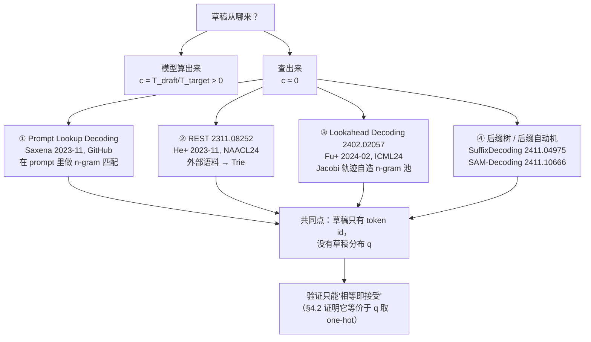

# 11 无模型草稿 —— Prompt Lookup、n-gram 与检索

## 1. 一句话

草稿不一定要由模型算出来，也可以直接从 prompt、已生成的历史、或一个外部语料里**查**出来。
查表的草稿成本 $c\approx 0$，于是加速比公式 $E[\tau]/(\gamma c+1)$ 的分母退化成 $1$ ——
**即使接受率低到 0.30，它也能赚；而接受率 0.43 的蒸馏草稿因为 $c$ 太大，反而是白干。**

---

## 2. 前一代卡在哪：$c$ 这一项，谁都躲不掉

到 2023 年下半年，投机采样已经有了三条成熟路线（时间线见 [[15-谱系图与被淘汰的分支]]）：

| 路线 | 代表 | 草稿从哪来 | 它付的代价 |
|---|---|---|---|
| 独立小模型 | Leviathan 2211.17192 / Chen 2302.01318 | 另一个 LLM | 要**准备一份权重**，且每轮串行跑 $\gamma$ 次前向 |
| 自投机 | Draft&Verify 2309.08168（见 [[10-自投机-跳层早退与Draft-and-Verify]]） | 目标模型自己跳层 | 省了权重，但**没省前向** |
| 多头 / 特征级 | Medusa 2401.10774、EAGLE 2401.15077 | 挂在目标模型上的小头 | 权重小了，但**要为每个目标模型单独训练** |

三条路线的共同结构是 [[06-期望接受长度与加速比模型-完整推导]] 的 (4.4) 式：

$$
\text{speedup}=\frac{E[\tau]}{\gamma c+1},\qquad c=\frac{T_{\text{draft}}}{T_{\text{target}}}
$$

**它们全都在优化分子 $E[\tau]$（提高接受率），而分母里的 $\gamma c$ 是它们的结构性负担。**
Leviathan 论文自己的 Table 2 就把这个负担摆出来了：T5-XXL(11B) 目标模型下，
T5-large 草稿的接受率 $\alpha=0.82$（三个草稿里最高）却只跑出 **1.7× 加速**，
而 T5-small 草稿 $\alpha=0.75$ 反而跑出 **3.4×** —— 差别全在 $c$。
（口径：T5 v1.1，WMT EnDe，$T=0$，$\gamma=7$，**batch size = 1**，single TPU-v4，walltime latency。）

Leviathan 论文里还埋了一句更极端的观察，当时几乎没人当回事：

> **bigram 这种平凡模型在 EnDe 上 $\alpha\approx 0.2$，因 $c\approx 0$ 仍带来 1.25× 加速（$\gamma=3$，batch size = 1）。**

这就是无模型草稿的**最早理论辩护**：如果 $c$ 能压到 0，那么 $\alpha$ 低到 0.2 都还有得赚。
2023 年 11 月起，三拨人几乎同时把这句话做成了工程。

具体到"前一代卡在哪"，有三件事是模型草稿无论怎么优化都解不掉的：

1. **要有一份权重。** 显存要占（SpecDecode-Bench 实测：Qwen3-0.6B 配 8B 目标，per-token 显存 ×1.77），部署要多一个 checkpoint，版本要跟着目标模型走。
2. **要为目标模型对齐。** 词表不一致直接不能用（vLLM 源码：`Target and draft model should have the same vocabulary size`），换个目标模型就要重训。
3. **域外泛化会崩。** 这是本篇的关键实证（§4.3）：任务特定蒸馏草稿一旦离开训练域，$\alpha$ 从 0.60 掉到 0.43，加速比只剩 1.03×（口径见 §4.3，batch size 未在原文标注）。

无模型草稿的三条应答是：**不用权重、不用对齐、不怕域外**（因为它压根没学过任何东西）。
代价是接受率天然很低 —— 而本篇要论证的就是：**在 $c\approx0$ 的前提下，低接受率不是问题。**

---

## 3. 机制拆解：四条无模型路线



### 3.1 Prompt Lookup Decoding（PLD）

- **作者**：Apoorv Saxena（GitHub `apoorvumang`；主页自述 *MTS, Inception Labs. Prev Adobe Research*，**2023-11 当时的所属机构未查证**）
- **年月与出处**：**2023-11**，仅 GitHub 仓库 <https://github.com/apoorvumang/prompt-lookup-decoding>，**无论文**
- **机制**（README 逐字）："we modify speculative decoding where we replace the draft model with **simple string matching in the prompt** to generate candidate token sequences"，具体是 "tries to match last few tokens to somewhere earlier in the prompt. If found, it returns the **next-k token continuation**"
- **两个超参**：`max_ngram_size`（匹配窗口 $n$，README 实验取 3）、`num_pred_tokens`（草稿长度 $k$，即本库的 $\gamma$，README 取 10）
- **复杂度**：$O(L)$ 的字符串扫描，$L$ 为当前序列长度；**跑在 CPU 上，零显存、零权重**
- **它相对前作新增了什么**：把 Leviathan 那句 bigram 观察工程化，并把"草稿源"从**模型**换成**输入本身**——这是第一次有人明确地说"输入里已经写着答案了"

README 自报数字（**口径不全，见下**）：

| 任务 | 数字 |
|---|---|
| CNN/Dailymail + HAGRID（摘要与 context-QA） | 平均 **2.4× 加速** |
| 总体宣称 | 输入受限任务 **2x–4x**，"with no effect on output quality" |
| 硬件 / 模型 | 单张 A100 40GB；Mistral-7B-Instruct-v0.1 |
| MT-Bench 多轮 | turn 0 收益小，turn 1 收益大 |

> ⚠️ **铁律二体检**：README 给了硬件、模型、$n=3$、$k=10$ 四项，**缺 batch size（HF `generate` 单流路径隐含 batch = 1，但 README 未写）、缺 $\alpha$、缺权重精度、缺测的是 TPOT 还是端到端**。按本库规矩，这组数字**标注「口径不全，不可与本库其它加速比横向比较」**。

### 3.2 REST：从外部数据存储检索

- **作者/机构**：Zhenyu He（**北京大学**，National Key Lab of General AI / 人工智能学院）、Zexuan Zhong、Tianle Cai、Jason D. Lee（**Princeton University**）、Di He（**北京大学**）
- **年月与编号**：**arXiv:2311.08252，v1 2023-11-14**，NAACL 2024
- **机制**：不看 prompt，而是**离线建一个数据存储（datastore）**，推理时用当前后缀去检索续写候选，把候选拼成 **Trie**，按前缀频次加权，用优先队列剪到 top-$c$ 个节点（论文取 $c=64$），再按 Trie 展开成树形草稿（树注意力见 [[16-树形草稿与树注意力-mask构造与验证]]）
- **数据存储规模（逐字）**：代码域用 The Stack 的 Python 预训练代码 **2.7M 样本 → 27GB**；通用域用 UltraChat **约 774K 对话 → 12GB**
- **它相对 PLD 新增了什么**：把可匹配的语料从"这一条请求的 prompt"扩大到"整个训练语料"，于是**开放式任务也能命中**；代价是多了 12–27GB 的磁盘 / 内存驻留
- **截至查证日的状态**：未见有生产引擎实现 REST 本身；它的思想被 SuffixDecoding 的"跨请求全局树"继承（§3.4）

论文自报数字（**口径较全**）：

| 目标模型 | 任务 | 加速比 |
|---|---|---|
| CodeLlama-7B | HumanEval | 2.12×–2.36× |
| CodeLlama-13B | HumanEval | 2.17×–2.27× |
| Vicuna-7B | MT-Bench | 1.62×–1.69× |
| Vicuna-13B | MT-Bench | 1.71×–1.77× |

口径（论文给全的部分）：单张 **A6000 + 96 CPU 核**，**batch size = 1**，HumanEval 温度 0.8 / top-p 0.95、上限 512 token，MT-Bench 温度 0.7 / top-p 0.8、上限 1024 token，贪心与核采样两组都测。**缺项：权重精度、$\alpha$ 数值、Trie 构建的 CPU 时间占比。**

### 3.3 Lookahead Decoding：自己造 n-gram 池

- **作者**：Yichao Fu、Peter Bailis、Ion Stoica、Hao Zhang（UCSD Hao AI Lab 与 UC Berkeley 系，**具体单位分工未在摘要页标注**）
- **年月与编号**：**arXiv:2402.02057，v1 2024-02-03**，ICML 2024
- **机制**（摘要逐字）："an **exact, parallel decoding algorithm** that accelerates LLM decoding **without needing auxiliary models or data stores**"。做法是跑 **Jacobi 迭代**（不动点并行解码，谱系上承自 Song 等 2002.03629，见 [[08-史前史-2018并行解码与非自回归的失败]]）：每步在多个位置同时猜，猜出来的**轨迹片段被收进一个 n-gram 池**，下一步从池里取候选来验证。它自己把这笔交易写得很准："trading per-step **log(FLOPs)** to reduce the number of total decoding steps"
- **它相对 PLD/REST 新增了什么**：**不依赖输入里有可复用片段，也不需要外部语料**——n-gram 池是解码过程自己长出来的
- **它的哪些主张后来被淘汰**：**Lookahead Decoding 在唯一实现过它的生产级引擎里被整段删除。** TensorRT-LLM 从 1.2 起随 TRT engine 后端一起移除了 `LookaheadDecodingConfig`（PyTorch backend 的 `decoding_type` 列表里没有它），`examples/` 下的 `lookahead/` 目录也没了。这条与 ReDrafter 的下场相同，是 [[15-谱系图与被淘汰的分支]] 的硬证据。**注意：被淘汰的是 Lookahead 这条具体路线，不是无模型草稿这个类。**

论文自报数字：MT-bench 上最高 **1.8× 加速**；代码补全任务在多 GPU 强扩展下最高 **4×**。
（**口径不全**：摘要未给 batch size、硬件型号、$\gamma$/窗口尺寸、精度。按本库规矩不可横向比较。）

### 3.4 后缀树 / 后缀自动机：无模型草稿的第二春

**SuffixDecoding**

- **作者**：Gabriele Oliaro、Zhihao Jia（**CMU**）、Daniel Campos、Aurick Qiao（**Snowflake AI Research**）
- **年月与编号**：**arXiv:2411.04975，v1 2024-11-07**，NeurIPS 2025 Spotlight
- **机制**：同时对**当前请求的 token** 和**此前请求缓存下来的回答**维护**后缀树**；发现请求开始重复已见模式时按**历史频次**提议续写；固定树深 64 token，**每步动态决定投机多少个 token**（自适应 $\gamma$，见 [[17-动态草稿长度与自适应停止]]）
- **它相对 PLD 新增了三点**（Snowflake 生产化 blog 明说）：① 同时对 prompt 与历史生成做匹配；② 用**频次**而非"最近一次出现"选续写；③ **每请求每步自适应投机长度**
- **摘要自报**：agentic benchmark（SWE-Bench、Text-to-SQL）上最高 **5.3×**，比 EAGLE-2/3 快 2.8×，比 Token Recycling 快 1.9×。**口径不全：摘要未给硬件、batch size / 并发、精度。**

**SAM-Decoding**

- **作者/机构**：Yuxuan Hu、Ke Wang、Xiaokang Zhang、Cuiping Li、Hong Chen、Jing Zhang（**中国人民大学信息学院**）、Fanjin Zhang（**清华大学**知识工程组）
- **年月与编号**：**arXiv:2411.10666，v1 2024-11-16**（截至查证日 arXiv 页未标注会议）
- **机制**：用**后缀自动机（suffix automaton）**取代 n-gram 匹配，找**最长精确后缀匹配**，SAM 更新与后缀检索的平均时间复杂度 **$O(1)$/步**；可按匹配长度自适应地在多种草稿策略间切换
- **它相对 PLD/REST 新增了什么**：把匹配从"固定窗口 $n$ 的 n-gram"升级成"**最长后缀**"，于是不必手调 $n$；并把检索源同时接到静态语料与动态生成序列上
- **自报数字**：比其它检索式方法快 **18%+**；Spec-Bench 整体 **1.84×**，HumanEval **2.29×**，HAGRID **2.24×**；与 EAGLE-2 组合再加 3.28%–11.13%。口径：单张 **RTX A6000 48GB**、20 核 CPU、**float16、贪心解码、batch size = 1**，Vicuna-7B/13B/33B 与 Llama3-8B-instruct

---

## 4. 逐步推导：为什么 $c\approx 0$ 会改变整个判据

### 4.1 无模型草稿的 $c$ 到底有多小

$c=T_{\text{draft}}/T_{\text{target}}$。无模型草稿的 $T_{\text{draft}}$ 是一次 CPU 侧字符串/树查找：

| 来源 | 测量 | 数值 |
|---|---|---|
| Snowflake 生产化 blog（2025-12-02） | 后缀树投机延迟 | **20–30 微秒/token，在 CPU 上** |
| SpecDecode-Bench（arXiv:2601.11580） | n-gram 的草稿开销占比 | **< 2%**（同表：draft-model 法在 Qwen3-8B 上 batch size=1 时占 **47%**） |
| SpecDecode-Bench | n-gram 的额外显存 | **0** |
| 多语言投机论文（arXiv:2605.30580（2026-05）） | n-gram 提议耗时 vs 蒸馏草稿前向 | **0.001 s vs 0.033 s（33 倍）** |

取 $T_{\text{target}}\sim 30$ ms 量级（70B 级模型 batch size=1 的一次 decode 前向），$c$ 落在 $10^{-3}$ 量级。
本篇统一取 **$c=0.001$** 作为无模型草稿的代表值，取 **$c=0.1$** 作为"小模型草稿"的代表值。

### 4.2 无模型草稿没有 $q$，所以它只能"相等即接受"—— 而这恰好是 L1

这是本篇最重要的一条机制。TensorRT-LLM 在 `validate_speculative_config` 里拒绝对 NGram 开拒绝采样，理由逐字：

> retrieval-based drafters that emit only token ids with **no q** are excluded

无模型草稿吐出来的只有 token id，没有分布 $q$，因此**在数学上无法参与 Leviathan 的 $\min(1,p/q)$ 判据**。
四家引擎（vLLM / SGLang / TensorRT-LLM / llama.cpp）对它统一采用"相等即接受"：
目标模型在每个位置从 $p_i$ 采一个 $x_i$，草稿 token $d_i$ 与之相等才接受，第一处不等即停。

**很多人以为这是一种"退化的近似"，其实不是。** 把 $q$ 取成 one-hot 分布 $q=\delta_d$ 代进 [[04-拒绝采样修正-无损性的完整证明]] 的两条式子：

$$
\beta=\sum_x\min\big(p(x),\delta_d(x)\big)=\min\big(p(d),1\big)=p(d)
\tag{4.1}
$$

$$
p'(x)=\frac{\max\big(0,\,p(x)-\delta_d(x)\big)}{\sum_y\max\big(0,\,p(y)-\delta_d(y)\big)}
=\begin{cases}0,& x=d\\[2pt] \dfrac{p(x)}{1-p(d)},& x\neq d\end{cases}
\tag{4.2}
$$

(4.1) 说：接受概率恰是"目标模型自己会吐出这个 token 的概率" $p(d)$ —— 而这**正是**"从 $p$ 采一个再看等不等于 $d$"的概率。
(4.2) 说：拒绝后的残差分布恰是"$p$ 条件在 $x\neq d$ 上" —— 而这**正是**"从 $p$ 采到的那个 $x$，已知它不等于 $d$"的分布。

**两边逐点相同。所以"相等即接受"不是近似，它就是 Leviathan 算法在 $q$ 退化成 one-hot 时的特例，口径是 L1 分布无损。**
$T=0$ 时它同时退化成 L2 贪心等价。这两条都在 §6 里用精确枚举验过（最大逐点误差 $2.8\times10^{-17}$）。

推论：**无模型草稿的 $\alpha$ 有一个非常干净的解释 —— $\alpha=\mathbb E[p(d)]$，即"查表查出来的那个 token，在目标模型眼里的平均概率"。**
它天然低（因为查表查出的是一个点，而 $p$ 通常是散开的），但它的低是**结构性的**，不是实现缺陷。

### 4.3 核心论证：算清楚 $E[\tau]/(\gamma c+1)$

现在把两组参数代进 [[06-期望接受长度与加速比模型-完整推导]] 的 (4.4) 式。
实跑（在 `_lab` 下 `python -c "from accept import optimal_gamma; print(optimal_gamma(0.30,0.001))"`）：

| 配置 | $\alpha$ | $c$ | 最优 $\gamma^\*$ | 理想加速比 | $\gamma$ 取 1 时 | $\gamma$ 取 12 时 |
|---|---|---|---|---|---|---|
| **无模型草稿（n-gram）** | **0.30** | **0.001** | **5** | **1.4204** | 1.2987 | 1.4116 |
| 蒸馏草稿（域外） | 0.43 | 0.1 | 2 | 1.3457 | 1.3000 | 0.7974 |

（口径：理想模型，**batch size 隐含为 1 且落在 memory-bound 区**，假设"验证免费"，未计任何工程开销。这是上界，不是实测。复跑见 §6。）

**读法一：低 14 个点的接受率，仍然赢。** $\alpha$ 从 0.43 掉到 0.30，理想加速比却从 1.3457 涨到 1.4204。
原因全在分母：$\gamma^\*=5$ 时无模型草稿的分母是 $5\times0.001+1=1.005$，几乎就是 1；
蒸馏草稿在 $\gamma^\*=2$ 时分母已经是 $1.2$，而它想把 $\gamma$ 加到 5 去多拿一点 $E[\tau]$，分母就变成 $1.5$，加速比反而掉到 1.1622。

**读法二：$c\approx0$ 把 $\gamma$ 这个旋钮变成了"几乎免费"的。** 无模型草稿在 $\gamma$ 从 1 扫到 12 的整个区间里，理想加速比都在 1.30–1.42 之间，**最差点只比最优点低 8.6%**；蒸馏草稿同样区间从 1.35 一路掉到 0.80，**最差点比最优点低 41%，而且已经掉到 1.0 以下**。调参容错度差了一个量级。

**读法三：$c=0$ 时的天花板是 $1/(1-\alpha)$。** 这是 $E[\tau]$ 在 $\gamma\to\infty$ 的极限。$\alpha=0.30$ 给 1.4286，$\alpha=0.43$ 给 1.7544。
**接受率仍然是天花板的唯一决定因素**——无模型草稿并没有推翻这一点，它只是让你**摸得到**天花板。

**读法四：要在 $c=0.1$ 上追平 $\alpha=0.30,c=0.001$ 的那 1.4204，接受率必须涨到约 0.48。** 实跑扫描：$c=0.1$ 时 $\alpha=0.46$ 给 1.3930、$\alpha=0.48$ 给 1.4253。
**也就是说，把 $c$ 从 0.1 压到 0.001，相当于白送 18 个百分点的接受率。**

### 4.4 与实测对照：方向一致，量级要老实说

RS 调研里最干净的一条实证（**口径照抄，缺项标出**）：

> **来源**：*Speculative Decoding Across Languages*，<https://arxiv.org/html/2605.30580v1>
> **口径**：verifier = Qwen 3.5 9B；draft = Qwen 3.5 0.8B（另测 2B / 4B）；任务 = 英译 11 种低资源语言 + 域外故事生成；草稿前向 ~0.033 s，n-gram ~0.001 s。
> **缺项【口径不全】**：**batch size 未在原文标注**（该领域惯例为 1，但原文未写）、硬件型号未给、权重精度未给、$\gamma$ 未给、测的是 TPOT 还是端到端未给。

| 场景 | 平均接受率 $\bar\alpha$ | 平均加速 $\bar f$ |
|---|---|---|
| 翻译（域内），通用草稿 | 0.40 | **1.02×**（≈ 完全白干；batch size 未标注） |
| 翻译（域内），任务特定蒸馏草稿 | 0.60 | 1.28×（batch size 未标注） |
| 故事生成（**域外**），任务特定蒸馏草稿 | **0.43** | **1.03×**（batch size 未标注） |
| 故事生成（**域外**），**n-gram** | **0.30**（更低！） | **1.39×**（却更快；batch size 未标注） |

$1.39/1.03=1.35$ —— **接受率低了 30% 的方法，实测快 35%。**

**理论与实测的对照**（这一节必须老实）：

| | 理论（§4.3 取 $c=0.001$ / $c=0.1$） | 实测 |
|---|---|---|
| 方向 | n-gram 更快 | n-gram 更快 ✅ **一致** |
| n-gram 加速比 | 1.4204（batch size=1 理想模型） | 1.39×（batch size 未标注） |
| 蒸馏草稿加速比 | 1.3457（batch size=1 理想模型） | 1.03×（batch size 未标注） |
| n-gram 相对优势 | +5.6% | +35% |

**方向一致，n-gram 那一侧的绝对值也几乎对上（1.4204 vs 1.39），但蒸馏草稿那一侧理论明显高估。**
这不奇怪，也不是公式错了：$c=0.1$ 是本篇为了对比设的**假设值**，论文只给了草稿前向的绝对耗时 0.033 s，**没有给目标模型的前向耗时，所以真实的 $c$ 无法从原文算出**。
反解一下就清楚了 —— 实跑二分求解（`_lab` 下用 `optimal_gamma` 扫）：

- 要让 $\alpha=0.30$ 的理想加速比等于 1.39，需要 $c=0.0065$；
- 要让 $\alpha=0.43$ 的理想加速比等于 1.03，需要 $c=0.3883$。

也就是说，真实系统里那个蒸馏草稿的**有效** $c$ 接近 0.39，远大于参数量比给人的直觉。
[[03-并行验证为什么几乎免费-算术强度与roofline]] 解释了为什么：小模型的前向时间**不按参数量等比缩小**（kernel launch、权重加载、调度开销都不缩），0.8B 配 9B 的实际 $c$ 远高于 0.089。

**这条对照的正确结论不是"公式很准"，而是：**
> **公式给对了方向和排序，但要用它算绝对加速比，必须先测出真实的 $c$，而 $c$ 不能用参数量比来估。**

### 4.5 于是判据要换

$\alpha$ 是 [[05-接受率alpha-定义口径与怎么测]] §8 的结论"必要不充分"的一个具体展开：

> ❌ **错误判据**：接受率越高越好；$\alpha<0.5$ 就不值得开。
> ✅ **正确判据**：看 $E[\tau]/(\gamma c+1)$ 这个**比值**，两项都要量。

RS 调研里翻到过一条流传很广的说法："α=0.6 → 2.4× 加速；α=0.8 → 3.7×；α<0.5 就不划算"（batch size 等口径全缺）——
它无出处，且与上表 $\alpha=0.30$ 的 n-gram 跑出 1.39×（batch size 未标注）**直接矛盾**。这类"接受率阈值表"是本主题最典型的错误知识，遇到要点名（见 [[27-常见误解与判据]]）。

---

## 5. 小数字算例：手算一遍 Prompt Lookup

任务：代码编辑。prompt 里是原函数，要求给它加一个参数 `c`。用词级 token 便于手算。

```
prompt : def add ( a , b ) : return a + b
目标输出: def add ( a , b , c ) : return a + b + c
```

取 $n=2$（匹配窗口）、$k=4$（草稿长度，即 $\gamma$）。匹配规则：取当前序列**末尾 2 个 token**，
在序列里**从近到远**回扫找相同的 2-gram，找到就把它后面的 4 个 token 当草稿。

逐轮走查（实跑输出，复跑命令见 §6）：

| 轮 | 序列末尾 2-gram | 查表结果（草稿） | 接受数 | 本轮产出 | 产出内容 |
|---|---|---|---|---|---|
| 0 | `+ b` | （未命中） | 0 | 1 | `def` |
| 1 | `b def` | （未命中） | 0 | 1 | `add` |
| 2 | `def add` | `( a , b` | **4** | **5** | `( a , b ,` |
| 3 | `b ,` | （未命中） | 0 | 1 | `c` |
| 4 | `, c` | （未命中） | 0 | 1 | `)` |
| 5 | `c )` | （未命中） | 0 | 1 | `:` |
| 6 | `) :` | `return a + b` | **4** | **5** | `return a + b +` |
| 7 | `b +` | （未命中） | 0 | 1 | `c` |

**合计：8 轮迭代产出 16 个 token，$E[\tau]=2.000$。**
不开投机需要 16 次目标模型前向，开了只需 8 次 —— 步数比 **2.000**（batch size = 1，纯步数口径，未计验证成本）。

这个算例把无模型草稿的性格暴露得很干净：

1. **产出是双峰的，不是几何分布。** 8 轮里 6 轮产出 1（完全没命中）、2 轮产出 5（打满）。标准差 $\sqrt{3}\approx1.732$，与均值 2.0 同量级。
   对照 SpecDecode-Bench 的实测（H100、vLLM v0.10.1.1、每步提议 3 个草稿 token，单位为平均接受 token 数）：n-gram 在 InstructCoder 上 **7.27（std 4.19）**，在 GSM8K 上 **1.41（std 0.45）**——**标准差 4.19 就是这种双峰性在真实负载上的样子。**
2. **没命中的那 6 轮，代价几乎为零。** 每轮多花的是一次 CPU 上的字符串扫描（微秒级），目标模型前向该跑还是跑一次。**这就是下行风险小的直接来源**（§4.3 读法二的另一种说法）。
3. **命中的位置不是随机的**：都发生在"目标输出开始复述 prompt 里某个已有片段"的时刻。**输出与输入的字面重复，是唯一的收益来源。**

---

## 6. 代码验证

### 6.1 "相等即接受 = $q$ 取 one-hot" 的精确验证

在 `_lab` 下（**不新增文件，用 `python -c` 调既有基座**）：

```bash
cd _lab && python -c "
import numpy as np
from spec import ToyMarkov, beta_overlap, residual_dist, max_pointwise_error
tgt = ToyMarkov(5, seed=11, temp=1.0)
drf = ToyMarkov.__new__(ToyMarkov)          # 确定性草稿 = 查表命中的那一个 token
Q = np.zeros_like(tgt.T); rng = np.random.default_rng(0)
for s in range(tgt.V): Q[s, int(rng.integers(tgt.V))] = 1.0
drf.T, drf.V = Q, tgt.V
d = int(np.argmax(drf.dist(0)))
print('beta =', beta_overlap(tgt.dist(0), drf.dist(0)), ' p(d) =', tgt.dist(0)[d])
print('residual =', residual_dist(tgt.dist(0), drf.dist(0)))
for g in (1,2,3): print('gamma=%d 最大逐点误差 %.3e' % (g, max_pointwise_error(tgt, drf, 0, 3, g)))
"
```

实跑输出：

```
target p(.|0) = [0.1069 0.4026 0.3517 0.062  0.0767]
draft  q(.|0) = [0. 0. 0. 0. 1.]        (one-hot，命中 token 4)
beta = 0.076719   vs  p(d) = 0.076719   -> 相等: True
residual = [0.115832 0.436022 0.380949 0.067198 0.      ]
p 条件在 x!=d = [0.115832 0.436022 0.380949 0.067198 0.]   -> 最大逐点差 0.0
gamma=1 精确枚举 vs 目标分布 最大逐点误差 = 2.776e-17
gamma=2 精确枚举 vs 目标分布 最大逐点误差 = 2.776e-17
gamma=3 精确枚举 vs 目标分布 最大逐点误差 = 2.776e-17
各状态 beta = [0.0767 0.3788 0.2139 0.3029 0.0791]   平均 0.2103
```

三件事一次说清：(4.1) 与 (4.2) 逐点成立；无模型草稿的口径是 **L1 分布无损**（误差 $2.8\times10^{-17}$ 是浮点噪声）；一个**随机**查表草稿的 $\alpha$ 只有 **0.2103** —— 低得很难看，但按 §4.3 依然能赚。

### 6.2 加速比对照表的复跑

```bash
cd _lab && python -c "
from accept import speedup_ideal, optimal_gamma
print('n-gram  a=0.30 c=0.001 ->', optimal_gamma(0.30, 0.001))
print('蒸馏    a=0.43 c=0.100 ->', optimal_gamma(0.43, 0.100))
for g in (1,2,5,8,12): print(g, round(speedup_ideal(0.30,g,0.001),4), round(speedup_ideal(0.43,g,0.1),4))
"
```

实跑输出：`(5, 1.4204278606965177)` 与 `(2, 1.3457499999999998)`，逐 $\gamma$ 行与 §4.3 的表一致。

### 6.3 §5 手算算例的复跑

```bash
cd _lab && python -c "
def lookup(seq,n,k):
    if len(seq)<n: return []
    pat=seq[-n:]
    for i in range(len(seq)-n-1,-1,-1):
        if seq[i:i+n]==pat: return seq[i+n:i+n+k]
    return []
seq='def add ( a , b ) : return a + b'.split(); out='def add ( a , b , c ) : return a + b + c'.split()
it=tok=0
while out:
    d=lookup(seq,2,4); acc=0
    for j,t in enumerate(d):
        if j<len(out) and t==out[j]: acc+=1
        else: break
    emit=out[:acc+1]; seq+=emit; out=out[len(emit):]; it+=1; tok+=len(emit)
print('迭代 %d 轮, 产出 %d token, E[tau]=%.3f' % (it,tok,tok/it))
"
```

实跑输出：`迭代 8 轮, 产出 16 token, E[tau]=2.000`。

### 6.4 保本线：$c=0$ 也不等于"永远不亏"

用 `_lab/speedup.py` 的 roofline 账算"要不亏本，$E[\tau]$ 至少得多大"。
把草稿成本设为 0（即只算验证 $\gamma+1$ 个 token 相对于生成 1 个 token 的代价）：

| batch size | seqlen | draft=1.24B | draft=eagle-head(0.6B) | **draft 零成本（n-gram）** |
|---|---|---|---|---|
| 1 | 1024 | 1.071 | 1.034 | **1.000** |
| 8 | 8192 | 1.114 | 1.036 | **1.000** |
| 64 | 1024 | 1.114 | 1.036 | **1.000** |
| 64 | 8192 | 1.251 | 1.043 | **1.000** |
| **128** | **1024** | 1.840 | 1.731 | **1.693** |
| **256** | **1024** | 2.941 | 2.786 | **2.746** |
| 256 | 8192 | 1.344 | 1.047 | **1.000** |

（口径：`_lab/speedup.py` 的 roofline 模型，**非实测**；target=llama3-70b，权重 BF16，TP=4×H100，$\gamma=4$。
复跑：`cd _lab && python -c "from speedup import *; hw=scale(H100,4); print(breakeven_accept_len('llama3-70b','llama3.2-1b',hw,256,1024,4))"`）

**这张表是本篇最重要的负面结论**：n-gram 的保本线在小 batch size 下**精确等于 1.000**（分母那个 $1$ 完全成立，任何 $E[\tau]>1$ 都是净赚）；
但 batch size 128 / seqlen 1024 时保本线跳到 **1.693**，batch size 256 时跳到 **2.746**。
**$c\approx0$ 只消掉了分母里的 $\gamma c$，没有消掉那个 $1$ 会随 batch size 膨胀的事实。** 展开见 §8 与 [[18-batch与吞吐-收益衰减曲线]]。

---

## 7. 口径与坑

### 7.1 「prompt lookup」这个名字是历史包袱

vLLM `v1/spec_decode/ngram_proposer.py` 的 `batch_propose` 吃的是 `token_ids_cpu`（形状 `(batch_size, max_model_len)`）配 `num_tokens_no_spec`，
即**当前序列迄今为止的全部 token（prompt + 已生成）**，不只是 prompt。
官方文档 `n_gram.md` 里那句 "matching n-grams in the prompt" **措辞不严谨**。
与 suffix decoding 的真正区别也不在"看不看已生成的 token"，而在 **suffix 额外维护一棵跨请求的全局后缀树**
（`suffix_decoding_max_cached_requests` 默认 10000，设 0 关闭，只留 prompt 树）。

### 7.2 REST 论文自己踩了铁律一的坑

REST 论文对无损性的表述逐字是（**L1 还是 L2，读完这句再判**）：

> "In this way, the sequences produced using REST are **identical to those generated by standard autoregressive generation**."

按本库的口径表，REST 的机制（从 $p$ 采样再与草稿比对）是 **L1 分布无损**，
但这句英文读起来是 **L2 贪心等价**（"序列相同"）。**这正是 [[07-无损的三种口径-分布无损不等于结果相同]] 点名的最高频错误**，
而且它出现在一篇 NAACL 论文的正文里，不是社区博客。引用 REST 时必须替它把口径补上：**温度 > 0 时序列并不相同，相同的是分布。**

### 7.3 无模型草稿的 $\alpha$ 与模型草稿的 $\alpha$ 不是同一个量

- 模型草稿：$\alpha=\mathbb E\big[\sum_x\min(p(x),q(x))\big]=\mathbb E[1-\mathrm{TV}(p,q)]$，度量的是**两个分布有多像**。
- 无模型草稿：$\alpha=\mathbb E[p(d)]$，度量的是**查出来那个点在目标分布上的质量**。

后者的上界比前者低得多：一个 one-hot 分布与任何非退化的 $p$ 的重叠最多是 $\max_x p(x)$。
**所以拿两者的 $\alpha$ 直接比大小是没有意义的**，必须比 $E[\tau]/(\gamma c+1)$。
这是 [[05-接受率alpha-定义口径与怎么测]] §4 那张"四种被叫做接受率的量"表在无模型草稿上的延伸。

### 7.4 引擎里的 n-gram 也有它自己的开销

vLLM 的 n-gram 提议器**跑在 CPU 上，用 numba JIT，而且当前实际只用 1 个线程**（源码）：

```python
# TODO(ekagra-ranjan): bump up the cap from 1 to 8
# when TP parallelization for ngram is implemented.
self.num_numba_thread_available = min(1, (cpu_count // 2))
self.num_numba_thread_available //= tp_size
```

`min(1, ...)` 恒等于 1，再除以 `tp_size` —— **TP>1 时甚至会变成 0**。
另有阈值 `num_tokens_threshold = 8192`：batch 总 token 数低于它就强制单线程。
**这就是 `ngram_gpu` 被单独做出来的原因（PR #29184）**：大 batch size 下 CPU 侧的 n-gram 匹配是真实瓶颈，且每个 TP rank 都要各跑一遍。
Snowflake 的 blog 也诚实记录了同一件事：并发 64 时**曾被 CPU 卡住**，做了自定义 hashmap（投机快 3.4×、更新快 1.5×、内存降 2.3×，并发 64）与两级链表（投机再快 2.2×，并发 64）之后**仍有约 10% 开销**。

> **判据**：$c\approx0$ 是对 **GPU 时间**说的。**CPU 时间不是零**，在高并发下它会变成新的瓶颈。

### 7.5 n-gram 在有些引擎里被排除在别的特性之外

- vLLM 的 V2 model runner **不支持** `ngram` / `ngram_gpu`（源码 `TODO: ngram / ngram_gpu are not supported by the v2 model runner yet`），于是"想要 full CUDA graph 就得上 V2，但 V2 又排除 n-gram"是一个真实的两难。
- SGLang 的 `supports_grammar_overlap()` 对 NGRAM 为 **False**，源码注释："NGRAM drafts from a host corpus lookup, so it stays **synchronous by design**"。
- TensorRT-LLM 与 SGLang 都对 n-gram **拒绝开启拒绝采样**（§4.2 的 "no q"）。

---

## 8. 失效条件（铁律三）

按可判定程度排序。

1. **输出与输入没有字面重复时，$\alpha\to0$，收益归零。**
   可判定形式（SpecDecode-Bench 给出的唯一一条可直接计算的方法选择判据）：
   > **当 prompt-output 重叠的 BLEU-4 低于约 0.6 时，n-gram 稳定劣于 EAGLE / EAGLE-3；高于 0.6 时稳定优于。**
   同源实测（H100，vLLM v0.10.1.1，每步提议 3 个草稿 token，单位=平均接受 token 数；**该表 batch size 原文未标注** —— 同文的加速比表另分 bs=1 / bs=128 两档，见 §8）：n-gram 在 InstructCoder 上 7.27，在 GSM8K 上 **1.41** —— **同一方法，任务一换差 5.2 倍。**
   典型的零收益负载：**开放式创作、翻译（源语言与目标语言字面不共享）、prompt 里没有任何可复用片段的首轮对话。**

2. **但归零不等于变慢 —— 这是它区别于模型草稿的地方。**
   $\alpha\to0$ 时 $E[\tau]\to1$，加速比 $\to 1/(\gamma c+1)$。实跑：

   | 方案 | $\gamma$ | $c$ | $\alpha\to0$ 时的加速比 | 损失 |
   |---|---|---|---|---|
   | n-gram | 5 | 0.001 | 0.9950 | **−0.50%** |
   | n-gram | 12 | 0.001 | 0.9881 | **−1.19%** |
   | 蒸馏草稿 | 2 | 0.1 | 0.8333 | −16.67% |
   | 蒸馏草稿 | 5 | 0.1 | 0.6667 | −33.33% |
   | EAGLE 类 | 11 | 0.02 | 0.8197 | −18.03% |

   （口径：理想模型，**batch size = 1 且落在 memory-bound 区**，假设"验证免费"。）
   **下行风险不对称**：无模型草稿最坏亏 1%，模型草稿最坏亏 17–33%。这是"默认开着也无所谓"的数学依据。

3. **大 batch size / 短上下文：验证成本吃掉一切，$c\approx0$ 救不了。**
   §6.4 的表：batch size 128 / seqlen 1024 时保本线 1.693，batch size 256 时 2.746。
   而 TensorRT-LLM blog07 的实测口径（8×B200，Llama-4-Scout-17B-16E，FP8 权重，TP=8）：
   > "We can see that N-Gram can provide speed-ups **for batch sizes up to 32** and works best with a single batch. **The main overhead with larger batch sizes is the verification cost.**"
   官方的自动策略也印证：TensorRT-LLM 的 `AUTO` 启发式**就是"用 n-gram，并在 batch size ≥ 32 时关掉"**。
   **可判定形式**：`verification_batch = original_batch × (v+1)` 超过该模型在该硬件上的临界 batch 后，TPOT 恶化（双引擎背书，见 [[18-batch与吞吐-收益衰减曲线]]、[[19-负收益全解-什么时候投机反而更慢]]）。

4. **首轮对话 / 单轮短请求：历史还没长出来。**
   TensorRT-LLM blog07 的 Magpie 多轮实测（8×B200，Llama-4-Scout-17B-16E，FP8，TP=8，3000 段对话，k=3/v=5）：
   **第 1 轮 AL = 1.37，第 2 轮 AL = 1.66。** n-gram 在第二轮才真正起效。
   这正是 SuffixDecoding 的全局树、以及 llama.cpp `ngram-mod` 的"跨 slot 共享 hash pool"要解决的问题。

5. **高并发下 CPU 成为瓶颈**（§7.4）。可判定形式：并发上升时 n-gram 的提议耗时占 step 时间的比例上升；vLLM 单线程 + TP 分摊会让它更早撞墙。

6. **它拿不到 $q$，所以享受不到某些优化**：不能开拒绝采样（§4.2），SGLang 下不能与 grammar overlap 并行（§7.5），vLLM V2 model runner 不支持（§7.5）。**"零成本"不是没有代价，代价体现在特性兼容性上。**

---

## 9. 自测题

1. 有人说："n-gram 草稿接受率才 0.3，太低了，不如用蒸馏出来的 0.43 的小模型。" 这个推理错在哪？给出反驳所需的最小计算。
   <details><summary>答案要点</summary>错在只看分子。判据是 $E[\tau]/(\gamma c+1)$。取 $c=0.001$ 与 $c=0.1$：$\alpha=0.30$ 在 $\gamma^\*=5$ 给 1.4204，$\alpha=0.43$ 在 $\gamma^\*=2$ 给 1.3457 —— 低接受率的那个更快。最小计算就是各自求一次 $\arg\max_\gamma E[\tau]/(\gamma c+1)$。实测方向一致（1.39× vs 1.03×，batch size 未标注）。</details>

2. 无模型草稿没有草稿分布 $q$，为什么它仍然是 L1 分布无损的，而不是某种近似？
   <details><summary>答案要点</summary>因为"相等即接受"就是 Leviathan 算法在 $q=\delta_d$ 时的特例。$\beta=\sum_x\min(p,\delta_d)=p(d)$，恰是"从 $p$ 采一个等于 $d$"的概率；残差分布 $\mathrm{norm}(\max(0,p-\delta_d))$ 恰是 $p$ 条件在 $x\neq d$ 上。两边逐点相同，见 §4.2 与 §6.1 的 $2.8\times10^{-17}$ 误差。$T=0$ 时同时是 L2。</details>

3. 为什么"把 $\gamma$ 调大"对无模型草稿几乎免费，对小模型草稿却很贵？给出定量说法。
   <details><summary>答案要点</summary>分母是 $\gamma c+1$。$c=0.001$ 时 $\gamma$ 从 1 加到 12 只把分母从 1.001 推到 1.012（+1.1%）；$c=0.1$ 时同样的动作把分母从 1.1 推到 2.2（+100%）。实跑：无模型草稿在 $\gamma\in[1,12]$ 内加速比 1.30–1.42（最差比最优低 8.6%），蒸馏草稿从 1.35 掉到 0.80（低 41%，且已跌破 1.0）。</details>

4. 一个 RAG 服务想上投机解码，n-gram 与 EAGLE-3 二选一。你需要先量哪一个数，判据是什么？
   <details><summary>答案要点</summary>量 **prompt 与 output 的 BLEU-4 重叠**。SpecDecode-Bench 给的判据是约 0.6：高于它 n-gram 稳定更优（RAG 大量复述原文，通常在这一侧），低于它选 EAGLE-3。还要同时量并发：TensorRT-LLM 的 `AUTO` 在 batch size ≥ 32 就把 n-gram 关掉，因为验证成本盖过一切。另外 EAGLE 系的接受长度标准差小得多（0.47–1.07 vs n-gram 的 0.45–4.19），有 SLO 的服务要为可预测性付溢价。</details>

5. §6.4 的表里，n-gram 在 batch size=1 时保本线精确等于 1.000，在 batch size=256 / seqlen=1024 时变成 2.746。这两个数分别对应加速比公式里的哪一项？
   <details><summary>答案要点</summary>1.000 说明分母 $\gamma c+1$ 里的 $\gamma c$ 项被消掉了（$c\approx0$），只剩那个 $1$，而那个 $1$ 在 memory-bound 区确实成立。2.746 说明那个 $1$ 本身崩了：大 batch size 短上下文下"验证 $\gamma+1$ 个 token"不再与"生成 1 个 token"同价，分母膨胀到约 2.75 倍。**无模型草稿只解决了 $\gamma c$，没有解决 $1$。**</details>

---

## 10. 它新增了什么 / 什么被后来推翻（铁律五）

### 10.1 它新增了什么

| 工作 | 年月 | 相对前作新增的机制 |
|---|---|---|
| Prompt Lookup Decoding（Saxena，GitHub） | 2023-11 | 首次把草稿源从**模型**换成**输入本身**：$n$-gram 匹配 prompt，取 next-$k$ 续写；$c$ 降到 CPU 字符串扫描量级 |
| REST（He 等，2311.08252，NAACL24） | 2023-11 | 把可匹配语料从"本请求 prompt"扩到**离线数据存储**（27GB 代码 / 12GB 对话），并用 **Trie + 频次剪枝到 top-64** 构造树形草稿 |
| Lookahead Decoding（Fu 等，2402.02057，ICML24） | 2024-02 | **既不要 prompt 重复，也不要外部语料**：用 Jacobi 迭代的轨迹自己长出 n-gram 池 |
| SuffixDecoding（Oliaro 等，2411.04975，NeurIPS25 Spotlight） | 2024-11 | **跨请求**后缀树 + **按频次**选续写 + **每步自适应草稿长度** |
| SAM-Decoding（Hu 等，2411.10666） | 2024-11 | 后缀自动机做**最长精确后缀匹配**，$O(1)$/步，免去手调 $n$ |

一条贯穿的机制线：**可匹配的上下文范围一路扩大** —— prompt → 外部语料 → 自造 n-gram 池 → 跨请求历史。

### 10.2 什么被后来推翻 / 淘汰

- **Lookahead Decoding 这条具体路线被淘汰了。** TensorRT-LLM 从 1.2 起随 TRT engine 后端一起删除 `LookaheadDecodingConfig`，`examples/lookahead/` 目录也移除（C++ kernel `lookaheadDecodingLayer.cpp` 还留在树里，但 Python 侧已推不动）。**这是唯一实现过它的生产级引擎。** 与它一起被删的还有 ReDrafter。
- **REST 本身没有进任何主流引擎。** 截至查证日，vLLM / SGLang / TensorRT-LLM / llama.cpp / HF transformers **均无 REST 实现**；它的"外部语料"思想被 SGLang 的 `--speculative-ngram-external-corpus-path` 与 TensorRT-LLM 的 `SA` 后缀自动机接了过去。
- **「n-gram 只是个玩具兜底」这个判断被推翻了。** 见下。
- **截至查证日，"无模型草稿"这一**类**未见任何推翻**：反而在 2025–2026 变强了。

### 10.3 它今天的位置：默认兜底选项，且在特定负载上反超

引擎支持现状（版本锚点：vLLM v0.27.1 / SGLang v0.5.18 / TensorRT-LLM 1.3.0rc25 / llama.cpp master `b10573` / HF transformers 5.15.1，均为 2026-08 拉取）：

| 引擎 | n-gram / lookup | 后缀树 / 后缀自动机 |
|---|---|---|
| **vLLM** | ✅ `ngram`、`ngram_gpu` | ✅ `suffix`（需 `pip install arctic-inference==0.1.1`） |
| **SGLang** | ✅ `NGRAM`（含外部语料路径） | ✅ `NGRAM` 的 trie 变体 |
| **TensorRT-LLM** | ✅ `NGram` | ✅ `SA`（GPU 原生后缀自动机） |
| **llama.cpp** | ✅ **5 种**（`ngram-simple` / `map-k` / `map-k4v` / `mod` / `cache`） | ✅ `ngram-mod`（**跨 slot 共享 hash pool**） |
| **HF transformers** | ✅ `prompt_lookup_num_tokens=`（docstring 直接指向 Saxena 的仓库） | ❌ |

三条硬事实说明它不只是兜底：

1. **五家全有，而 Medusa 已经出局。** 对照 [[12-Medusa-多头草稿与树注意力的诞生]]：SGLang 与 llama.cpp 从未实现 Medusa，vLLM 保留代码但撤掉文档页，TensorRT-LLM 1.2 起删除。**无模型草稿是唯一被五家全部实现、且从未被任何一家移除的草稿方式。**
2. **NVIDIA 的"你帮我自动选"给的答案就是它。** TensorRT-LLM 的 `AutoDecodingConfig` 启发式实测就是 **n-gram，并在 batch size ≥ 32 时关掉**。这是官方对"默认该怎么做"最直接的表态。
3. **在长上下文与 agentic 负载上，它把学习型草稿打穿了。** OWL 论文（arXiv:2510.07535，2025-10-08，Jaeseong Lee、Seung-won Hwang（首尔大学）+ Snowflake AI Research + CMU）在 LongSpecBench（WildChat-4.8M 采样 200 条，上下文 4K–64K）上的实测：

   | 方法 | 接受长度（Llama-3.1-8B） | 接受长度（Llama-3.3-70B） | token/s 加速（70B） |
   |---|---|---|---|
   | PLD | 2.75 | 2.24 | 1.59× |
   | Suffix Decoding | 3.41 | 2.61 | 2.18× |
   | SAMD | 3.18 | 2.48 | 2.16× |
   | **EAGLE3** | **1.28** | **1.35** | **0.81×（负加速）** |

   口径（论文给全）：**batch size = 1**、tree size 60、tree depth 8、top-k 10、**fp16**、1×H200（8B）/ 8×H200（70B）、SAMD 框架 static cache。
   **一个不需要任何训练的后缀树（2.18×，batch size=1）在 4K–64K 上下文上打赢了训练过的 EAGLE3（0.81×，batch size=1）。**
   机制解释见 [[22-长上下文下的投机采样]]：EAGLE 系的 drafter 对训练窗口有依赖，而后缀匹配没有。

4. **它已被 Snowflake 生产化并合入 vLLM 主干**（PR #25784，2025-12）。Spec-Bench 实测：并发 1 时 SuffixDecoding ~5.6 ms vs N-gram[5,5] 5.63 ms；**并发 64 时 11.57 ms vs N-gram[3,5] 13.14 ms（1.11–1.17×）**；代码编辑基准 BlazeEdit 上 **1.96×–3.12× vs 原生解码**（并发口径见前两行，1.02–1.31× vs 最好的 n-gram 配置）。

> **结论**：无模型草稿在 2023 年是"没有草稿模型时的将就"，在 2026 年是**默认开启的兜底 + 高重复负载上的首选**。
> 它没有被推翻，因为它赌的是一件不会变的事：**推理的输出里有大量字面重复，而查表是免费的。**

---

## 11. 它在什么负载上特别好用

共同特征只有一条：**输出与输入（或输出与自己的历史）有大量字面重复。**

| 负载 | 重复从哪来 | 佐证 |
|---|---|---|
| **代码补全 / 代码编辑** | 改一个函数，绝大部分 token 与原文逐字相同 | SpecDecode-Bench：InstructCoder 上 n-gram 平均接受 7.27 token（vs EAGLE 4.24），H100，每步提议 3 个草稿 token |
| **文档编辑 / 改写 / 润色** | 同上，编辑距离远小于文档长度 | llama.cpp 文档直写适用场景："Iterating over a block of text/code (e.g. in llama.vim)" |
| **RAG / 有据问答** | 答案大量复述检索到的原文 | PLD README：CNN/Dailymail + HAGRID 平均 2.4×（单张 A100 40GB，Mistral-7B，**batch size 未标注**） |
| **结构化输出（JSON / SQL / 表格）** | 键名、schema、模板全部来自 prompt | TensorRT-LLM blog12：JSON Mode Eval 上 NGram AL=2.59 逼近 EAGLE3 的 2.86（LLaMA 3.1 8B）；官方原话 "it performs **surprisingly well**. This is because JSON Mode Eval is an **information extraction task**" |
| **多轮对话第二轮起** | 复述上一轮内容 | TensorRT-LLM blog07：Magpie 第 1 轮 AL 1.37 → 第 2 轮 1.66（8×B200，Llama-4-Scout，FP8，TP=8） |
| **推理模型的最终作答段** | 把 thinking 里的结论重复一遍 | llama.cpp 文档直写："Reasoning models (when they have to repeat their thinking in the final answer)" |
| **agentic / RL rollout** | 多智能体流水线反复跑相似子任务、自我修正循环 | SuffixDecoding 摘要：agentic 负载"result in long and highly predictable sequences" |
| **长 prompt 短生成** | 分母小、可匹配面大 | 见 §10.3 的 OWL 表（4K–64K 上下文，batch size = 1） |

**反面清单（$\alpha\approx0$）**：开放式创作（写诗、写故事的开头）、翻译（源与目标不共享字面）、单轮短问答且 prompt 里无可复用片段、纯数学推理（GSM8K 上 n-gram 平均接受只有 1.41，H100，每步提议 3 个草稿 token）。

---

## 12. 延伸与双链

- 判据的数学地基：[[06-期望接受长度与加速比模型-完整推导]]（$E[\tau]/(\gamma c+1)$ 与两条前提）、[[05-接受率alpha-定义口径与怎么测]]（"接受率是必要不充分条件"）
- 为什么"相等即接受"是 L1：[[04-拒绝采样修正-无损性的完整证明]]、[[07-无损的三种口径-分布无损不等于结果相同]]
- 分母那个 $1$ 靠不靠得住：[[03-并行验证为什么几乎免费-算术强度与roofline]]、[[18-batch与吞吐-收益衰减曲线]]、[[19-负收益全解-什么时候投机反而更慢]]
- REST / SuffixDecoding 的树怎么构：[[16-树形草稿与树注意力-mask构造与验证]]；自适应草稿长度：[[17-动态草稿长度与自适应停止]]
- 谱系里的位置与被删除的分支：[[08-史前史-2018并行解码与非自回归的失败]]、[[09-2023奠基-两篇同期论文的异同]]、[[15-谱系图与被淘汰的分支]]
- 与模型草稿路线的对照：[[10-自投机-跳层早退与Draft-and-Verify]]、[[12-Medusa-多头草稿与树注意力的诞生]]、[[13-EAGLE三代-特征级自回归的演进]]
- 引擎里怎么配：[[20-主流引擎实现-vLLM与SGLang与TensorRTLLM]]；长上下文下的反超：[[22-长上下文下的投机采样]]
- 未来判断与常见误解：[[24-前沿进展-2025到2026]]、[[25-未来判断-哪些方向会活下来]]、[[27-常见误解与判据]]、[[28-面试题库]]

---

### 本篇验证

- `_lab/test_lossless.py::test_lossless_holds_for_terrible_draft` —— 接受率只有 0.3 的烂草稿，分布依然精确无损（L1）。**这是无模型草稿敢用的数学依据：草稿再烂也不会错，只会慢**，对应本篇 §4.2 与 §6.1。
- `_lab/test_accept.py::test_expected_tokens_matches_geometric_sum` —— 闭式 $E[\tau]=(1-\alpha^{\gamma+1})/(1-\alpha)$ 与逐项求和逐点相等，是 §4.3 全部数字的基础。
- `_lab/test_accept.py::test_optimal_gamma_decreases_with_cost` —— $c$ 越大最优 $\gamma^\*$ 越小。本篇 §4.3 的 $\gamma^\*$：无模型草稿 5、蒸馏草稿 2，正是这条的两端。
- `_lab/test_accept.py::test_speedup_can_be_below_one` —— 理想模型下加速比也可以 < 1（断言 $\alpha=0.3,\gamma=8,c=0.5$ 时 < 1）。这条界定了 §8 条 2 的边界：**低 $\alpha$ 本身不致命，低 $\alpha$ 配上大 $c$ 才致命。**
- `_lab/test_accept.py::test_alpha_drops_with_perturbation` —— 草稿越偏离目标，$\alpha$ 单调下降。对应 §7.3：无模型草稿的 $\alpha=\mathbb E[p(d)]$ 天然处于这条曲线的低端。
- `_lab/test_speedup.py::test_breakeven_always_above_one` —— 草稿总要花时间，保本所需 $E[\tau]$ 恒 > 1。**注意本篇 §6.4 的"零成本"列给出 1.000，是因为那一列把草稿成本设成了 0，不在该测试的模型范围内**；该测试覆盖的是有真实草稿模型的情形。
- `_lab/test_speedup.py::test_lighter_draft_lowers_breakeven` —— 草稿越轻保本线越低（1.24B → eagle-head 0.6B）。**无模型草稿是这条曲线的极限点**，对应 §6.4 的三列递减。
- 可复跑（**均在 `_lab` 目录下用 `python -c` 调既有基座，本篇未新增文件**）：
  - §6.1 one-hot 草稿的精确验证 —— 输出 `beta = 0.076719 = p(d)`、残差逐点差 `0.0`、最大逐点误差 `2.776e-17`、随机查表草稿 $\alpha=0.2103$
  - §6.2 `optimal_gamma(0.30, 0.001)` → **`(5, 1.4204278606965177)`**；`optimal_gamma(0.43, 0.1)` → `(2, 1.3457499999999998)`
  - §6.3 §5 手算算例 —— 输出 `迭代 8 轮, 产出 16 token, E[tau]=2.000`
  - §6.4 `python _lab/speedup.py --breakeven` 的同一套函数（`breakeven_accept_len`）；零成本列为 `fwd_time(target, hw, batch, seqlen, gamma+1)['t'] / fwd_time(target, hw, batch, seqlen, 1)['t']`

### 本篇来源

- **Prompt Lookup Decoding**，Apoorv Saxena，2023-11 — <https://github.com/apoorvumang/prompt-lookup-decoding>。好在**极简**：核心逻辑不到 20 行，把"替换草稿模型"这件事讲成了一句话。不严谨处：README 的 "2x-4x" **没有给 batch size、$\alpha$、精度、测量指标**，按铁律二属于口径不全；"prompt lookup" 这个名字也与后来引擎里的实际实现（看 prompt + 已生成全部 token）不符（§7.1）。
- **REST: Retrieval-Based Speculative Decoding**，Zhenyu He（北京大学）、Zexuan Zhong、Tianle Cai、Jason D. Lee（Princeton）、Di He（北京大学），arXiv v1 **2023-11-14**，NAACL 2024 — <https://arxiv.org/abs/2311.08252>。好在**口径给得全**（A6000、batch size=1、温度与 top-p、生成上限都写了）。不严谨处：正文那句 "sequences produced using REST are identical to those generated by standard autoregressive generation" 把 L1 写成了 L2（§7.2），引用时必须替它纠正。
- **Break the Sequential Dependency of LLM Inference Using Lookahead Decoding**，Yichao Fu、Peter Bailis、Ion Stoica、Hao Zhang，arXiv v1 **2024-02-03**，ICML 2024 — <https://arxiv.org/abs/2402.02057>。好在把交易讲得很准："trading per-step log(FLOPs) to reduce the number of total decoding steps"。不严谨处：摘要的 "up to 1.8x / 4x" **未给 batch size 与硬件**；且它是本篇唯一一条**已被生产引擎删除**的路线（§10.2）。
- **SuffixDecoding: Extreme Speculative Decoding for Emerging AI Applications**，Gabriele Oliaro、Zhihao Jia（CMU）、Daniel Campos、Aurick Qiao（Snowflake AI Research），arXiv v1 **2024-11-07**，NeurIPS 2025 Spotlight — <https://arxiv.org/abs/2411.04975>。生产化 blog（2025-12-02，Aurick Qiao、Gabriele Oliaro、Samyam Rajbhandari）— <https://www.snowflake.com/en/engineering-blog/suffixdecoding-arctic-inference-vllm/>。好在**工程诚实度很高**：连 CPU 侧 20–30 微秒的开销和并发 64 时遗留的 ~10% 开销都写了。
- **SAM Decoding: Speculative Decoding via Suffix Automaton**，Yuxuan Hu、Ke Wang、Xiaokang Zhang、Cuiping Li、Hong Chen、Jing Zhang（中国人民大学信息学院）、Fanjin Zhang（清华大学），arXiv v1 **2024-11-16** — <https://arxiv.org/abs/2411.10666>。好在**口径逐项给全**（RTX A6000 48GB、float16、贪心、batch size=1）。截至查证日 arXiv 页未标注会议。
- **Speculative Decoding Across Languages** — <https://arxiv.org/html/2605.30580v1>。本篇 §4.4 的关键实证（$\bar\alpha=0.30$ 的 n-gram 比 $\bar\alpha=0.43$ 的蒸馏草稿快 35%）出自此文。好在它**同时报了 $\alpha$ 与草稿前向耗时**，这是全部调研里唯一让"低接受率却更快"能被归因的一组数据。不严谨处：**未给 batch size、硬件、精度、$\gamma$**，本篇已逐条标注。
- **SpecDecode-Bench**，*Speculative Decoding: Performance or Illusion?*（Xiaoxuan Liu 等，UC Berkeley；MLSys 2026） — <https://arxiv.org/abs/2601.11580>（**v1 2025-12-31 / v2 2026-03-18**）；项目页 <https://specdecode-bench.github.io/>。BLEU-4 ≈ 0.6 的方法选择判据、n-gram 的方差（InstructCoder 7.27 std 4.19 vs GSM8K 1.41 std 0.45）、草稿开销 <2% 与显存 0 均出自此文（口径：H100、vLLM v0.10.1.1、**链式** k=3）。⚠️ ~~该项目**网站**摘要里"树验证 k=21 在 batch size 64 跌破 1×"的说法与论文正文冲突，本篇**未引用**该条。~~ **2026-08-22 复核：不冲突 —— 树实验只在 v2 里，本库原先引用的 `…v1` 读不到它，网站摘要是对的。该条现已可引用（详见 [[19-负收益全解-什么时候投机反而更慢]] §12.6）。本篇仍不引用它，因为本篇讲的是无模型草稿，与树验证无关。**
- **OWL**，Jaeseong Lee、Seung-won Hwang（首尔大学）、Aurick Qiao、Gabriele Oliaro、Ye Wang、Samyam Rajbhandari（Snowflake AI Research，另有 CMU），arXiv v1 **2025-10-08** — <https://arxiv.org/abs/2510.07535>。§10.3 的对照表出自其 Table 1 与 Table 2。⚠️ 该文摘要说"比 EAGLE3 接受长度高约 5×"，按其 Table 1 自算，**5× 对应的是 HOWL 变体（6.14/1.28=4.80×），OWL 单独只有 3.13×**；引用必须写清是哪个变体。
- **TensorRT-LLM blog07: NGram Performance Analysis And Auto Enablement** — <https://github.com/NVIDIA/TensorRT-LLM/blob/main/docs/source/blogs/tech_blog/blog07_NGram_performance_Analysis_And_Auto_Enablement.md>。§8 条 3/条 4 的原文与 Magpie 多轮 AL 数据出自此文。好在它**把负收益机制写成了公式**（`verification_batch = original_batch × (v+1)`）。⚠️ 该文目录里有一节 `Feature Gaps`，但正文中该节内容缺失。
- **vLLM 投机解码文档与源码** — <https://docs.vllm.ai/en/latest/features/speculative_decoding/>（v0.27.1，2026-08-11）。§7.1 的 `ngram_proposer.py` 单线程 numba 细节、§7.4 的 `num_numba_thread_available` 片段、§7.5 的 V2 model runner 排除均来自源码阅读；`n_gram.md` 里 "matching n-grams in the prompt" 一句**与源码不符**，本篇已指出。
- 本仓库既有材料：`attention-optimization/26-speculative-decoding.md` 已推过拒绝采样与 roofline 动机，本篇不重复；本篇补的是**无模型草稿的 $q$ 退化推导（§4.2）与"低接受率也能赚"的定量判据（§4.3–4.5）**。
