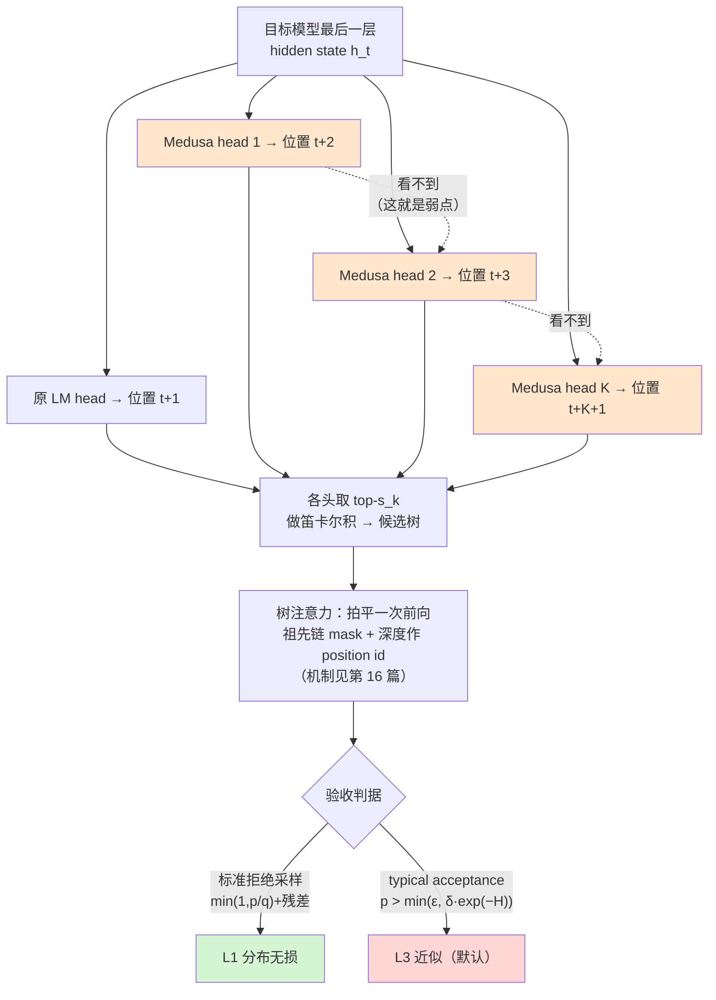
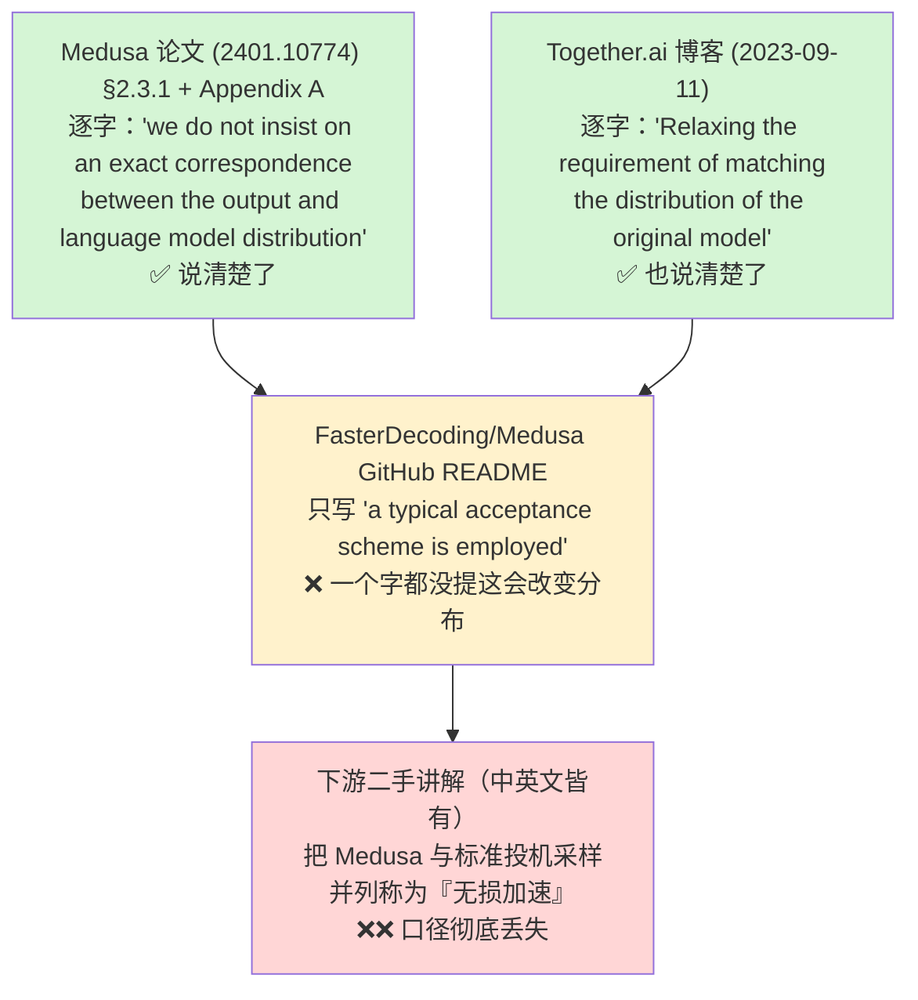

# 12 Medusa —— 多头草稿与树注意力的诞生

## 1. 一句话

Medusa（Tianle Cai 等，**arXiv:2401.10774**，v1 **2024-01-19**）把一句话做成了标准做法：**别再养一个独立的草稿模型，直接在目标模型的最后一层 hidden state 上挂几个预测头**。它同时把**树注意力**从 SpecInfer 那样的研究技巧推成了行业标配。代价是一个结构性弱点 —— **各个头互相独立、谁也不看谁**，以及一个被社区大面积误传的口径问题 —— **它默认的 typical acceptance 是 L3 近似，不是 L1 分布无损**。

---

## 2. 前一代卡在哪：独立草稿模型的三个结构性麻烦

到 2023 年底，投机采样的标准形态是 [[09-2023奠基-两篇同期论文的异同]] 定下的：一个小模型串行跑 $\gamma$ 步出草稿，大模型一次验证。这套东西数学上是干净的（[[04-拒绝采样修正-无损性的完整证明]]），但工程上卡在三处，而且这三处都不是调参能解决的。

### 2.1 麻烦一：草稿模型要单独训练与维护

Medusa 论文 §2.1.1 逐字点了这件事的代价：

> "existing approaches (Spector & Re 2023; Miao et al. 2023) often resort to separately pre-training a smaller model. This pre-training process demands substantial additional computational resources. For example, in (Miao et al. 2023), a reported **275 NVIDIA A100 GPU hours** were used."

275 A100 小时只是训练本身。真正的持续成本是：目标模型每做一次 SFT / RLHF，草稿模型就与它错开一次，$\alpha$ 随之衰减 —— 论文把这叫 **distribution shift**。加上 Chen et al.（2302.01318）指出的分布式部署下"同时服务两个模型"的复杂度，一个草稿模型是一件需要长期养着的资产，不是一个开关。

### 2.2 麻烦二：tokenizer 必须一致，这不是可选项

接受判据里的 $\min(1,\ p(x)/q(x))$ 要求 $p$ 与 $q$ 定义在**同一个 token 空间**上。tokenizer 不同，这个比值没有意义 —— 这是 [[07-无损的三种口径-分布无损不等于结果相同]] §8 第 2 条列的硬失效条件。所以 Chen et al. 的 4B 草稿是"with **the same tokeniser and dataset as Chinchilla**"重新训的，而不是随手拿一个现成小模型。**"随便找个小模型当草稿"在 L1 口径下根本不成立。**

### 2.3 麻烦三：草稿成本 $c$ 压不下去

这是三条里最硬的一条，因为它是算得出来的。[[06-期望接受长度与加速比模型-完整推导]] §4.5 的扫描表（复跑 `python _lab/accept.py --table`；口径：理想模型、假设"验证免费"、bs=1 且落在 memory-bound 区，**是上界不是实测**）：

| $\alpha=0.80$ | $\gamma^\*$ | 理想加速比 |
|---|---|---|
| $c=0.20$ | 4 | **1.868** |
| $c=0.10$ | 6 | 2.470 |
| $c=0.05$ | 8 | 3.092 |
| $c=0.02$ | 11 | **3.817** |

同一个 $\alpha$，只把草稿成本 $c$ 从 0.20 压到 0.02，理想加速比就从 1.868 涨到 3.817 —— **草稿成本比接受率更值钱**。而一个独立小模型的 $c$ 很难做到 0.02 量级：它要跑完整的 embedding、若干层 transformer、以及一个 $d\times V$ 的 LM head。更糟的是 Chen et al. 记录的那条分布式约束：Chinchilla 70B 的最优部署是 16 TPU v4，而一个 chinchilla-optimal 7B 的最优拓扑只要 4 TPU v4 —— "serving a 7B on 16 TPUs actually **increases** the latency"。**在分布式服务里，草稿的成本下限由通信而不是参数量决定。**

Medusa 论文里有一组同机同基准的内部对照，把这条讲得最直接（Table 1，Vicuna 系列，bs=1，草稿用 Llama-68M / Tiny-Vicuna，$\gamma$ 按模型分别取 4/3/3）：

| 目标模型 | $S_{\text{SpecDecoding}}$（独立草稿） | $S_{\text{Medusa}}$（草稿头） |
|---|---|---|
| Vicuna-7B | 1.47 | **2.83** |
| Vicuna-13B | 1.56 | **2.83** |
| Vicuna-33B | 1.60 | **2.35** |

> **口径（铁律二，逐项）**：batch size = **1**（论文："Our experiments primarily focus on scenarios with a batch size of one"）；$\gamma$ / 树：Medusa 侧用 5 个头 + 优化后的 64 节点稀疏树，SpecDecoding 侧 $\gamma\in\{3,4\}$ 单链；接受率口径见 §7.1；draft-target 组合：Llama-68M/160M、Tiny-Llama、Tiny-Vicuna（Appendix D）；**硬件正文未逐字给出**（Appendix G 的 roofline 剖析用的是 A100-80GB-PCIe / A40 / A6000；同一批作者的 Together.ai 博客写的是单张 A100-80G）；度量是 wall-clock latency 的 speedup；任务 MT-Bench。⚠️ **基线是 HuggingFace 默认实现**（论文："The baseline is the default Huggingface implementation"），不是优化过的引擎 —— 这一条对怎么读这些倍数至关重要，见 §8.2。

---

## 3. 机制拆解

### 3.1 Medusa 头：一层 FFN + 残差

给定目标模型最后一层在位置 $t$ 的 hidden state $h_t\in\mathbb R^{d}$，加 $K$ 个解码头。第 $k$ 个头预测第 $t+k+1$ 位的 token（原 LM head 负责 $t+1$ 位）：

$$
p_t^{(k)} \;=\; \mathrm{softmax}\Big(W_2^{(k)}\cdot\big(\mathrm{SiLU}(W_1^{(k)}\cdot h_t) + h_t\big)\Big),
\qquad W_1^{(k)}\in\mathbb R^{d\times d},\ \ W_2^{(k)}\in\mathbb R^{d\times V}
$$

两个初始化细节是这套东西能训起来的关键（论文 §2.1.1）：$W_2^{(k)}$ **初始化为原模型的 LM head**，$W_1^{(k)}$ **初始化为零**。于是训练开始的那一刻，每个头的预测**与原模型的下一 token 预测完全相同**，训练是从一个已经不差的点出发的。

**参数量（本库按上式算出，非论文给出）**：Vicuna-7B 的 $d=4096,\ V=32000$，则每个头 $d^2 + dV = 16{,}777{,}216 + 131{,}072{,}000 \approx 0.148\text{B}$；5 个头约 **0.74B**，相当于 Llama-2-7B（6.74B）骨干的约 **11%**。所以"parameter efficient"是相对说法 —— 头的绝大部分参数（88.6%）在那个 $d\times V$ 的输出投影上，和一个完整 LM head 同价。

### 3.2 关键结构性弱点：各头互相独立

第 $k$ 个头**只看 $h_t$**，不看第 $1..k-1$ 个头已经选了什么。这不是实现疏漏，是架构定义：五个头是五个并行的分支，一次前向同时算完。

后果精确地说是：**每个头的边缘分布可以是对的，但它们的乘积不是目标模型的联合分布。** §5.2 会用一个 4 行的算例把这件事算成数字。这正是 Hydra 与 EAGLE 后来切进去的地方（§9.2），也是 2026 年 DSpark 给它起名 **suffix decay** 的那件事。



### 3.3 树：把各头的 top-$k$ 拼成候选集

各头独立意味着单链只能用 top-1，而第二个头的 top-1 准确率并不高。Together.ai 的 Medusa 博客（2023-09-11，同一批作者）给了这条动机最好的一对数字：**第二个头预测 next-next token 的 top-1 准确率约 60%，但 top-5 超过 80%**。单链吃 60%，树能吃 80%。

Medusa 的树构造是**自顶向下的笛卡尔积**：第 $k$ 个头取 top-$s_k$，各头候选做笛卡尔积，新 token 总数

$$
N \;=\; \sum_{k=1}^{K}\ \prod_{i=1}^{k} s_i
$$

论文明确区分了自己与同期工作的方向：Miao et al.（SpecInfer）与 Spector & Re（Staged）是 **bottom-up** —— 用草稿模型生成多条候选再合并去重；Medusa 是 **top-down** —— 因为候选天然是"每个头的 top-$s_k$"这种规则结构。

**优化稀疏树**（§2.3.3）：设 $a_k^{(i)}$ 为第 $k$ 个头的第 $i$ 名预测的准确率（定义为 top-$i$ 减 top-$(i-1)$），**假设各头独立**，则一条由 $[i_1,\dots,i_k]$ 组成的候选的准确率估计为 $\prod_{j=1}^{k}a_j^{(i_j)}$，而期望接受长度就是所有节点这个乘积之和。于是可以贪心地一个一个加节点（每加一个节点，期望恰好增加该节点对应的那个乘积）。实测结果：**64 节点的稀疏树优于 256 节点的稠密树**（§3.3.1）。

> **本篇不重复讲树注意力的机制。** mask 怎么构造、position id 为什么必须是深度、"树拍平一次前向 == 每条根到叶路径各跑一次"的等价性验证（本库实测最大逐元素误差 $4.441\times10^{-16}$），全部在 [[16-树形草稿与树注意力-mask构造与验证]]。本篇只讲 Medusa 在历史上把它推广开这件事。

### 3.4 Medusa-1 与 Medusa-2

| | **Medusa-1：冻结骨干** | **Medusa-2：联合训练** |
|---|---|---|
| 训什么 | 只训头 | 头 + 骨干一起训 |
| 损失 | $\mathcal L_{\text{M1}}=\sum_{k=1}^{K}-\lambda_k\log p_t^{(k)}(y_{t+k+1})$，$\lambda_k=0.8^{k}$ | $\mathcal L_{\text{M2}}=\mathcal L_{\text{LM}}+\lambda_0\mathcal L_{\text{M1}}$ |
| 配方 | 骨干可 4-bit 量化（只用来出 hidden state） | ① combined loss；② 头的 lr 取骨干的 **4 倍**；③ heads warmup 两阶段（先只训头，再一起训） |
| 成本 | **单卡可训**：Vicuna-7B 约 **5 小时**，单张 A100 PCIE，60k ShareGPT 样本 | 需要能全量/LoRA 微调骨干的资源 |
| Vicuna-7B 加速比 | **2.18×** | **2.83×** |
| **口径代价（关键）** | 骨干权重**未改** → 骨干分布仍是原模型的 $p$ | 骨干权重**被改了** → 相对**原始模型**已经不是 L1，无论验收判据用什么 |

（**本小节两张表里的 2.18× / 2.83× 口径同 §2.3**：**batch size = 1**（论文："Our experiments primarily focus on scenarios with a batch size of one"）、MT-Bench、5 头 + 64 节点稀疏树、度量是 wall-clock latency 的 speedup、**基线是 HuggingFace 默认实现**；硬件正文未逐字给出。这几项缺一都不能横比，见 §7.3。）

**Medusa-2 的代价必须说清楚，因为它在社区里几乎没人提。** 论文 Table 2（Vicuna-7B，MT-Bench，GPT-4 评分）：

| | Baseline | Direct Fine-tuning | Medusa-1 | Medusa-2 |
|---|---|---|---|---|
| Quality | 6.17 | **5.925** | 6.23 | 6.18 |
| Speedup | N/A | N/A | 2.18× | 2.83× |

"直接把头和骨干一起微调"会把质量从 6.17 打到 5.925。Medusa-2 那套三件配方就是为了把这个洞补上 —— 它补住了（6.18），但**这是"经验上没掉分"，不是"数学上没变"**。Table 1 里 Vicuna-13B 的质量差是 **−0.14**，Zephyr-7B 是 **−0.07**。

**自蒸馏**（§2.3.2）：当拿不到训练数据、或模型经过 RLHF 时，用模型自己生成数据；骨干的损失换成 $\mathcal L_{\text{LM-distill}}=\mathrm{KL}(p^{(0)}_{\text{original},t}\ \|\ p^{(0)}_t)$，并用 LoRA 实现"关掉 adapter 就是原模型"，从而不必同时驻留两份权重。训练侧的展开见 [[21-草稿模型怎么训-对齐与在线蒸馏]]。

### 3.5 typical acceptance：这是 L3，不是 L1

Medusa 的验收有两条路。论文 §2 逐字："The final step (3) can be realized by **either rejection sampling** (Leviathan et al. 2022; Chen et al. 2023) **or typical acceptance**."

**默认那条**（§2.3.1）是 typical acceptance。给定上下文，候选 token $x_{n+k}$ 被接受当且仅当

$$
p_{\text{original}}(x_{n+k}\mid x_{1..n+k-1}) \;>\; \min\Big(\epsilon,\ \delta\exp\big(-H(p_{\text{original}}(\cdot\mid x_{1..n+k-1}))\big)\Big)
$$

$\epsilon$ 是硬阈值，$\delta$ 是与熵挂钩的阈值，$H$ 是熵。为保证每步至少产出一个 token，**第一个 token 走贪心并无条件接受**，后续才用这条判据。判据借自 Hewitt et al. 2022 的截断采样框架。

**这条判据没有拒绝后的残差补偿，因此输出分布不等于 $p$ —— 按本库口径它是 L3 近似。** 论文自己是承认的，Appendix A 逐字："However, **we diverge because we do not insist on an exact correspondence between the output and language model distribution**."；Together.ai 博客更直白："**Relaxing the requirement of matching the distribution of the original model** makes the non-greedy generation even faster than greedy decoding."

**但是 —— 这是本篇最要紧的一条区分（铁律一）：**

$$
\boxed{\ \textbf{Medusa 默认判据（typical acceptance）= L3；Medusa 改用标准拒绝采样判据 = L1。}\ }
$$

口径是**判据的属性，不是方法名的属性**。同一套 Medusa 头、同一棵树，换掉验收那一步，口径就变了。再叠加 §3.4 的那一层：**Medusa-1 + 拒绝采样 = 相对原模型的 L1；Medusa-2 + 拒绝采样 = 相对被改过的骨干的 L1、相对原模型是 L3。** 论文摘要里那个 "lossless" 只挂在 Medusa-1 上（逐字："Medusa-1: Medusa is directly fine-tuned on top of a **frozen** backbone LLM, enabling **lossless** inference acceleration"），这个限定极其精确，也极其容易被漏读。

**这类"放宽阈值"判据的偏差有多大，本库已经用精确枚举量化过，本篇不重复。** [[07-无损的三种口径-分布无损不等于结果相同]] §4.3 给了两条结论，第二条反直觉：

1. 阈值取 0（无条件接受草稿）时，输出分布**就是草稿分布**，这给出了偏差的上界（`_lab/test_caliber.py::test_zero_threshold_reproduces_draft_distribution`）；
2. **把阈值调保守，偏差反而变大** —— 因为拒绝后的补偿路径 $p'=\mathrm{norm}(\max(0,p-q))$ 是专为 $\min(1,p/q)$ 判据配套设计的，换了判据补偿就不匹配，拒绝得越多、走错路的质量越多（`_lab/test_caliber.py::test_raising_threshold_makes_bias_worse_not_better`）。

> **由此得到一条可直接用的工程判据**：如果你只是把 Medusa 的 `posterior_threshold` 往严了调、指望"这样就接近无损了"，你正在做一件被实测推翻的事。要回到 L1，**只能整套换回拒绝采样判据 + 残差补偿**，判据与补偿必须成对更换。

---

## 4. 一个 decode step 里发生了什么

假设 $K=4$ 个头、稀疏树 64 节点、当前前缀长 $n$。

| 步 | 发生什么 | 形状 / 复杂度 |
|---|---|---|
| 0 | 上一轮验证的前向已经算出了各位置的 $h_t$ | 无额外成本 —— **这是 Medusa 最省的一步**：草稿输入是上一轮验证的副产品 |
| 1 | 5 个头（含原 LM head）各做一次 $d\to d\to V$ | $5\times(d^2+dV)$ FLOPs，**无 attention、无 KV 读** |
| 2 | 各头取 top-$s_k$，按预先搜好的稀疏树布局拼成 64 个候选 token | 纯 CPU/索引，无矩阵乘 |
| 3 | 64 个 token 拍平，连同祖先链 mask 与深度 position id 一起喂给目标模型 | query token 数 = 64；**权重仍只读一遍**（[[03-并行验证为什么几乎免费-算术强度与roofline]]） |
| 4 | 对每条根到叶路径按 §3.5 的判据逐位判定，取**最长被接受的前缀** | $O(N)$ |
| 5 | 按选中路径压实 KV cache，丢掉未选分支 | 树形草稿的三件杂活之一（[[16-树形草稿与树注意力-mask构造与验证]] §3.2） |

**第 0 步是理解 Medusa 为什么便宜的钥匙**：独立草稿模型要额外串行跑 $\gamma$ 次前向（$c$ 里的 $\gamma c$ 项），Medusa 的头**复用了验证那一次前向已经算出的 hidden state**，于是草稿成本从"$\gamma$ 次小模型前向"塌成"1 次 $5\times(d^2+dV)$ 的矩阵乘"。这正是 §2.3 那张表里 $c$ 从 0.1 量级掉到 0.02 量级的物理来源。

本库把这条量化了（复跑见 §6）：目标 llama3-70b，4×H100，batch 8，seqlen 1024，$\gamma=4$ —— 换成更轻的草稿头后，**保本所需的接受长度从 1.0764 降到 1.0343**。

---

## 5. 小数字算例

### 5.1 树节点数与 speedup 恒等式

论文 Appendix B.1 定义了三个必须分清的量：

- **Acceleration rate**：平均每个 decode step 产出多少 token（普通自回归 = 1.0）；
- **Overhead**：Medusa 的每步延迟 ÷ 原模型的每步延迟；
- **Speedup**：wall-clock 加速比。

三者满足 $\text{Speedup} = \text{Acceleration rate} / \text{Overhead}$。用 Table 1 的数核一遍（**本库自算，用来验内部自洽**）：

| 模型 | Acc. rate | Overhead | 相除 | 论文报的 $S_{\textsc{Medusa}}$ | 相对差 |
|---|---|---|---|---|---|
| Vicuna-7B | 3.47 | 1.22 | 2.844 | 2.83 | +0.5% |
| Zephyr-7B | 3.14 | 1.18 | 2.661 | 2.66 | +0.04% |
| Vicuna-13B | 3.51 | 1.23 | 2.854 | 2.83 | +0.8% |
| Vicuna-33B | 3.01 | 1.27 | 2.370 | 2.35 | +0.9% |

四行全部落在两位小数四舍五入的误差内，**恒等式成立、表格自洽**。这张核算表的用处是：**overhead 是 1.18–1.27，不是 1.0**。谁把 "acceleration rate 3.47" 直接当成"快 3.47 倍"，就凭空多算了 22%。（该表口径同 §2.3：**batch size = 1**、单卡、MT-Bench、5 头 + 64 节点稀疏树。）

树的节点数用 §3.3 的公式：$s=(2,3)$ 时 $N = 2 + 2\times3 = 8$（论文 Figure 2 的例子）。默认 5 头、稀疏树 64 节点、深度 4。

### 5.2 独立头的代价：一个 4 行的算例

用 [[08-史前史-2018并行解码与非自回归的失败]] 里 Gu et al.(2017) 定义 multimodality problem 时用的那个例子，词表只有 4 个词。目标模型在当前前缀下的**两步真实联合分布**是：

$$
p(\text{Danke},\ \text{schön}) = 0.5,\qquad p(\text{Vielen},\ \text{Dank}) = 0.5,\qquad \text{其余为 }0
$$

两个位置的**边缘**分布：

$$
p_1 = \{\text{Danke}:0.5,\ \text{Vielen}:0.5\},\qquad p_2=\{\text{schön}:0.5,\ \text{Dank}:0.5\}
$$

Medusa 的头 0（原 LM head）学 $p_1$，头 1 学 $p_2$ 的**边缘**（它只看 $h_t$，看不到头 0 选了什么）。**两个头都可以学到完全正确的边缘分布 —— 训练损失已经降无可降。** 但它们的乘积是：

| 候选链 | 独立头给的概率 | 目标模型的真实概率 |
|---|---|---|
| Danke schön | 0.25 | **0.5** |
| Vielen Dank | 0.25 | **0.5** |
| Danke **Dank** | 0.25 | **0** |
| Vielen **schön** | 0.25 | **0** |

**一半的概率质量落在目标模型概率为 0 的链上。** 这不是训练不足，是架构表达力的缺陷 —— 它与 [[08-史前史-2018并行解码与非自回归的失败]] 里非自回归翻译的死因是**同一个数学问题**，区别只在于：NAT 把它当作最终输出（于是错），Medusa 把它当作草稿（于是只是慢）。2026 年 DSpark 给它起了新名字 **multi-modal collision**。

现在算三种草稿形态在这个例子上的账（口径：$L=2$ 位、贪心/精确匹配即 L2 口径，只数节点与接受长度）：

| 形态 | 树布局 | 新增节点数 | 第 2 位命中概率 | 期望接受长度 |
|---|---|---|---|---|
| 单链（各头取 top-1） | $s=(1,1)$ | 2 | **0**（tie-break 取 Danke+Dank，必被拒） | 1.0 |
| Medusa 式树 | $s=(2,2)$ | $2+4=6$ | **1.0** | 2.0 |
| 自回归草稿（EAGLE 式） | $s=(2,1)$ | $2+2=4$ | 1.0 | 2.0 |

三行读出三件事：

1. **单链在这里彻底失效**（第 2 位命中概率 0），所以对 Medusa 来说**树不是加分项，是必需品**；
2. **树把它救回来了**，代价是 6 个节点里只有 4 个有用（浪费 33%）；
3. **自回归草稿用 4 个节点拿到同样的接受长度** —— 因为位置 2 以位置 1 已选的 token 为条件，两条无效链**根本不会被生成**。

> 这条推论值得单独记住：**"Medusa 必须配树"与"Medusa 的头互相独立"是同一件事的两面。** 树在这里买的不是额外收益，是在补一个结构性亏空。这也解释了为什么 EAGLE 系可以用更小的树拿到更高的接受长度（[[13-EAGLE三代-特征级自回归的演进]]）。

**但树不是万能的补丁。** 本库 [[16-树形草稿与树注意力-mask构造与验证]] §5.3 用实测给了边界：**宽度值不值钱，取决于边际覆盖率增益 $c_k-c_1$，而不是"草稿好不好"。** 上面这个例子里 $c_2-c_1=+0.5$，宽度买得到东西；而当草稿是**整体跑偏**（$c_2=c_1$）时，无论预算多大链都不输（`_lab/test_tree.py::test_budget_needed_grows_as_the_gain_shrinks`）。多模态碰撞属于前者，能被宽度救；drafter 与 target 脱节属于后者，宽度救不了。

---

## 6. 代码验证

本篇涉及的三类断言，本库已有的验证如下 —— **全部是指名引用，实验本身在对应篇目里，本篇不重复。**

**(a) typical acceptance 是 L3**（§3.5）

```python
# _lab/test_caliber.py 里的三条，覆盖"放宽阈值"这类判据的全部性质
test_typical_acceptance_is_biased                  # 四个阈值下输出分布均 ≠ p
test_zero_threshold_reproduces_draft_distribution  # ε=0 -> 输出分布就是草稿分布（偏差上界）
test_raising_threshold_makes_bias_worse_not_better # 阈值 0.05→0.20→0.50，偏差单调变大
```

实跑（本次 `python -m pytest -q test_caliber.py::test_typical_acceptance_is_biased ... ` 3 条全绿）。数字表见 [[07-无损的三种口径-分布无损不等于结果相同]] §4.3；口径提醒：那是对该**类**判据的简化模型（绝对阈值），**不是 Medusa 的确切规则**（Medusa 用的是与熵挂钩的自适应阈值 $\min(\epsilon,\delta e^{-H})$），数字用来说明机制，不能当作 Medusa 的实测偏差。

**(b) 树 = 多条链，一位不差**（§3.3）

```python
# _lab/test_tree.py
test_tree_attention_equals_per_chain               # 4 种树形状，最大逐元素误差 4.441e-16
test_budget_needed_grows_as_the_gain_shrinks  # 边际覆盖增益**极小**时，现实预算内链都不输 （2026-08-22 更正：初稿的「增益为 0」是显示精度假象，真实约 $10^{-5}$；$c_k>c_1$ 恒成立，判据是「增益多大 vs 预算多大」）
```

**(c) 更轻的草稿把保本线压下去**（§2.3、§4）

```python
# _lab/test_speedup.py::test_lighter_draft_lowers_breakeven
hw = scale(H100, 4)
heavy = breakeven_accept_len("llama3-70b", "llama3.2-1b",  hw, 8, 1024, 4)  # -> 1.0764
light = breakeven_accept_len("llama3-70b", "eagle-head",   hw, 8, 1024, 4)  # -> 1.0343
assert light < heavy
```

口径：目标 llama3-70b，4×H100，**batch = 8**，seqlen = 1024，$\gamma=4$；`breakeven_accept_len` 的定义是"要不亏本，$E[\tau]$ 至少得多大" $=(t_{\text{draft}}+t_{\text{verify}})/t_{\text{base}}$。**这就是 Medusa 那条路线的机器可判定版本**：把独立小模型换成挂在 hidden state 上的轻量头，保本线下移，可用的 $\gamma$ 与加速比一起上去。

---

## 7. 口径与坑

### 7.1 Medusa 的 acceptance length 与 L1 方法的 acceptance length 不可直接横比

这是本篇必须显式写出来的一条（铁律二）。三个理由，任何一个单独成立都足以否掉横比：

1. **判据不同**。Medusa 默认走 typical acceptance（L3），EAGLE / MTP / 标准投机采样走 $\min(1,p/q)$ + 残差（L1）。L3 用**分布正确性**换来的接受长度，与 L1 的接受长度不是同一个量纲的东西 —— 换句话说，你可以把任何 L1 方法的接受长度调到任意高，只要你愿意把判据放松到底（极限就是 §3.5 那条：无条件接受，输出分布 = 草稿分布）。
2. **计数口径不同**。Medusa 的 acceleration rate 定义是"平均每步解码出多少 token"，**含那个无条件接受的首 token**（论文："In a standard auto-regressive model, this rate is 1.0"）。别的工作报的 $\tau$ 含不含赠品 token、含不含首 token，口径各异（[[05-接受率alpha-定义口径与怎么测]]）。
3. **论文正文未逐字写明主结果用的是哪套判据**。Table 1 的 3.47 / 3.14 / 3.51 / 3.01 与 §3.3.2 那组 typical acceptance 阈值扫描（Figure 5，温度固定 0.7，$\epsilon$ 从 0.01 扫到 0.25）是分开报的，Figure 5 还把 greedy / random sampling / typical 三档并排比较 —— **说明主结果与 typical acceptance 消融不是同一组设置**。本次核到的论文正文没有一句逐字说明 Table 1 用的是哪条验收路径，**标「未查证」**。

> **结论**：看到"Medusa 3.47 vs EAGLE 3.94"这种并排表，**先问这两个数是不是同一个判据、同一种计数**。不是就别比。

### 7.2 E6 传播链：错不在 Medusa 作者，在中间那一环

本库调研（RS-2）把这条链完整地追了一遍，它是本主题最典型的一个"口径在传播中丢失"的标本：



**断点在 README。** 绝大多数人只读 README，而 README 里控制有损程度的那几个旋钮（`temperature` / `posterior_threshold` / `posterior_alpha`）本次抓取也未见文档说明 —— **旋钮存在于代码里，不存在于文档里**。评点见 [[26-社区精彩解释精选-好在哪与错在哪]]，判据清单见 [[27-常见误解与判据]]。

### 7.3 基线是 HuggingFace 默认实现

论文 §3.1 逐字："The baseline is the **default** Huggingface implementation."。这意味着 2.18× / 2.83×（口径同 §2.3：**batch size = 1**、MT-Bench、单卡、wall-clock latency）的分母是一个**未经引擎优化**的实现。换成 vLLM / TensorRT-LLM 这类分母，overhead 的相对占比会变大、加速比会缩水。**这不是论文的错**（它写清楚了），但它决定了这些倍数不能直接搬到生产语境里读（[[20-主流引擎实现-vLLM与SGLang与TensorRTLLM]]）。

### 7.4 "五个头就够了"是一条被低估的自陈上界

论文 §2.2.3 逐字："Empirically, we found that **five heads are sufficient at most**." 并且加了一句：用优化后的树，"sometimes three or four heads may be enough"。这句话的真正含义不是"五个头很棒"，而是**独立头这条路的深度到此为止** —— 再往后加头，边际收益不足以覆盖它带来的节点膨胀。对比一下：2026 年的并行草稿把 $\tau$ 做到 6.5 以上，靠的不是加头，是**加位置间依赖**（§9.2）。

---

## 8. 失效条件（铁律三）

### 8.1 静态树 + 高并发 = 负收益

Medusa 的树是**离线搜好、运行时固定**的（§2.3.3 的贪心构造用的是校准集上的 $a_k^{(i)}$）。它不随 batch、不随请求、不随位置调整。论文自己在 §3.3.1 观察到了这条的一半：Figure 4(b) 里 **speed 随候选 token 数增加而下降**，归因逐字为 "the increased overhead introduced by the **compute-bound**"。

**可判定形式**：设树节点数 $N$，并发 $B$。当验证前向的 query token 总数 $B\times N$ 大到把该前向推出 memory-bound 区（判据与临界点见 [[03-并行验证为什么几乎免费-算术强度与roofline]] 与 [[18-batch与吞吐-收益衰减曲线]]），"验证同价"的前提消失，树的整个立论基础作废，收益趋零甚至为负（[[19-负收益全解-什么时候投机反而更慢]]）。**Medusa 没有任何机制感知这件事** —— 动态化要等 EAGLE-2 的置信度动态树与 [[17-动态草稿长度与自适应停止]] 讲的那一类做法。

### 8.2 与优化过的引擎基线比，倍数缩水

见 §7.3。判据：**只要基线换成一个 CUDA graph + paged KV + 融合 kernel 的实现，overhead 的分子分母都变，2.83× 不可直接搬用。** 引用这些数字必须带上"基线是 HF 默认实现"这句。

### 8.3 需要 L1 的场景，默认配置直接出局

$T=0$ 时 typical acceptance 退化成贪心（论文 §2.3.1 逐字："when the temperature is set to 0, it reverts to greedy decoding"），此时是 **L2 贪心等价**；$T>0$ 时是 **L3**。所以：

- **on-policy RL rollout**：rollout 分布必须等于 policy 分布，否则梯度是错的 —— 这是数学上不可协商的（[[25-未来判断-哪些方向会活下来]] §6.3）。Medusa 默认配置**不可用**，必须换回拒绝采样判据，且骨干不能是 Medusa-2 改过的那份。
- **可复现 / 可审计输出**：同理。

### 8.4 每换一次骨干就要重训；Medusa-2 还会改权重

Medusa-1 训一次 7B 头约 5 小时单卡，便宜但不是零。真正的约束是**它绑死在一个具体 checkpoint 上**：目标模型做一次 SFT，头就得重训。Medusa-2 更进一步 —— 它**改了骨干权重**，于是与"drop-in 加速器"这个定位不兼容；对 RLHF 之后的模型还必须先走自蒸馏流程。

### 8.5 2026 年最硬的一条：主流引擎里已经没有它了

本库对引擎源码的核查（截至 **2026-08-22**）：

| 引擎 | Medusa 状态 |
|---|---|
| **SGLang** | ❌ **从未实现**（全仓库 grep `medusa` 命中 **0**）；`--speculative-algorithm` 取值里没有它 |
| **vLLM** v0.27.1 | ⚠️ `vllm/v1/spec_decode/medusa.py` 还在、枚举里还在，但**文档目录已无 Medusa 专页**；V1 **删掉了** `acceptance_method` / `posterior_threshold` / `posterior_alpha` 三个字段 —— **L3 口径在 vLLM V1 里没有开关了** |
| **TensorRT-LLM** 1.2+ | ❌ PyTorch backend 下 `MedusaDecodingConfig` 直接抛错；legacy 文档页仍在描述 Medusa 且链接全 404（**这是二手资料最容易被误导的地方**） |
| 还留着的 | MLC-LLM（`--speculative-mode medusa`）、**已于 2026-03-21 归档只读的 TGI** |

> **所以"什么时候不该用 Medusa"在 2026 年有一个最简单的答案：你多半也用不上了。** 逐引擎的核查明细见 [[20-主流引擎实现-vLLM与SGLang与TensorRTLLM]]。

---

## 9. 它新增了什么 / 什么被后来推翻（历史篇专属）

### 9.1 它新增了什么

| # | 新增的机制 | 具体到什么 |
|---|---|---|
| 1 | **草稿不再需要独立模型** | 在目标模型最后一层 $h_t$ 上挂 $K$ 个"一层 FFN + 残差"的头，$W_2$ 初始化为原 LM head、$W_1$ 初始化为 0。一举消掉 §2 的三个麻烦：不用单独训练/维护、tokenizer 天然一致、$c$ 从"$\gamma$ 次小模型前向"塌成"1 次矩阵乘" |
| 2 | **把树注意力推进主流** | 自顶向下的笛卡尔积树（对照 SpecInfer / Staged 的 bottom-up 合并），加上用 $a_k^{(i)}$ 独立性假设贪心构造的**稀疏树**（64 节点优于 256 节点稠密树）。机制本体属于 SpecInfer，**普及归 Medusa** |
| 3 | **把"草稿头"确立成一种形态** | Medusa-1 冻结骨干、单卡 5 小时就能给任意已有模型加上投机能力。这个形态被 EAGLE、HASS、EAGLE-3、MTP 全盘继承 |
| 4 | **把"要不要 L1"变成一个显式旋钮** | typical acceptance 的 $(\epsilon,\delta)$ 是本领域第一个被广泛使用的"有损程度"旋钮，而且论文**诚实地写了它放宽了分布** |

**它继承自谁**：论文 §1 逐字点名 "we **revisit and refine** the concept of using multiple decoding heads on top of the backbone model to expedite inference (**Stern et al. 2018**)"。Medusa 不是无中生有 —— 它是 Stern 的 blockwise parallel decoding（arXiv:1811.03115，2018-11，Mitchell Stern，UC Berkeley + Google Brain）在 LLM 时代的复活（[[08-史前史-2018并行解码与非自回归的失败]]）。**Stern 那套只支持贪心（L2），Medusa 补上了随机采样这一档**（拒绝采样走 L1 / typical acceptance 走 L3）。

**时间线上的一个细节**：Together.ai 的 Medusa 博客发于 **2023-09-11**，比 arXiv v1（**2024-01-19**）早四个多月。所以社区在 2023 年秋天就已经在用它了 —— 这解释了为什么它的传播速度远快于同期论文。

### 9.2 什么被后来推翻

**推翻点一：各头独立预测（2024 年就被点名）**

- **Hydra**（*Hydra: Sequentially-Dependent Draft Heads for Medusa Decoding*，**arXiv:2402.05109**，v1 **2024-02-07**，第一作者 **Zachary Ankner**，合著含 Jonathan Ragan-Kelley、Christopher Rinard；**作者机构本次未逐字核到论文首页，标「未查证」**；COLM 2024）。摘要逐字把 Medusa 的弱点写成了标题：
  > "To date, **all existing draft heads have been sequentially independent**, meaning that they speculate tokens in the candidate continuation **independently of any preceding tokens** in the candidate continuation."
  Hydra++ 相对 **Medusa decoding** 提升解码吞吐**最高 1.31×**，相对自回归解码 2.70×。⚠️ **口径不全**：摘要未给 batch size / 硬件 / 树规模，**不可与本篇其它数字横比**。
- **ReDrafter**（*Recurrent Drafter for Fast Speculative Decoding in Large Language Models*，**arXiv:2403.09919**，v1 **2024-03-14**，Yunfei Cheng、Aonan Zhang 等，**Apple**）走了另一条补法：用 **RNN 草稿头**条件在 LLM hidden state 上，并在 **beam search 结果**上做**动态树注意力**"to eliminate duplicated prefixes"。⚠️ 数字口径：Vicuna / MT-Bench 上最高 2.8×，PyTorch 实现，**H100**；Apple Silicon 上 MLX 实现最高 2.3×；**batch size 与树规模摘要未给出**。
- **EAGLE**（*EAGLE: Speculative Sampling Requires Rethinking Feature Uncertainty*，**arXiv:2401.15077**，v1 **2024-01-26**，第一作者 **Yuhui Li**，合著 Fangyun Wei、Chao Zhang、Hongyang Zhang；**机构本次未逐字核到，标「未查证」**；ICML 2024）是真正把这条路走通的那个：把自回归从 token 级移到**特征（次顶层 hidden state）级**，再用"提前一步的 token 序列"消掉特征级自回归的不确定性。摘要口径：LLaMA2-Chat 70B 上 latency 加速 **2.7–3.5×**，"doubled throughput"，并明确写 "**while maintaining the distribution of the generated text**"（即 L1）。⚠️ 摘要未给 batch size 与树规模。演进见 [[13-EAGLE三代-特征级自回归的演进]]。

> **EAGLE v1 比 Medusa v1 只晚 7 天**（2024-01-26 vs 2024-01-19）。这两条路是同时长出来的，不是先后取代 —— 只是后来的三年里，赢的是有位置间依赖的那条。

**推翻点二：2026 年的位置级证据 —— 纯并行多头这一档已经死了**

**DSpark**（*DSpark: Confidence-Scheduled Speculative Decoding with Semi-Autoregressive Generation*，**arXiv:2607.05147v1**，**2026-07-06**，Xin Cheng、Xingkai Yu、Chenze Shao、Jiashi Li、Yunfan Xiong 等 20+ 人，**Peking University + DeepSeek-AI**）的摘要把病因和药方一起写死了：

> 病因逐字："While recent parallel drafters efficiently propose long token sequences in a single forward pass, they suffer from **rapid acceptance decay due to a lack of inter-token dependencies**."
> 药方逐字："DSpark utilizes a **semi-autoregressive architecture, coupling a parallel backbone with a lightweight sequential module**, to introduce **intra-block dependency modeling and mitigate suffix decay**."

论文 Figure 2 的**位置级接受率曲线**是最直接的判决：

| 位置 | 自回归 drafter（Eagle3） | 并行 drafter（DFlash） |
|---|---|---|
| 位置 1 | 0.81（Math） | **0.88（Math）** —— 并行更强（架构可以做得更深） |
| 位置 2–7 | **稳定** | **快速衰减**（Chat 上 0.72 → 0.63） |

> ⚠️ **口径必须一起讲**：这两行引的是**不同域**（位置 1 那行是 Math，衰减那行是 Chat），**不是一条干净的同域曲线，0.88 与 0.63 不能相减**。原文的定性结论是明确的，量化对比需要回原文取同域数据。

**为什么"位置 1 领先"救不了它**：$E[\tau]$ 是位置 $1..\gamma$ 上的**累积存活**，不是各位置的平均。位置 1 上 $+0.07$ 对 $E[\tau]$ 的贡献是一阶的，位置 2–7 的塌方却是**连乘**衰减（[[06-期望接受长度与加速比模型-完整推导]]）。这与 §5.2 那个 4 行算例说的是同一件事：独立预测的边缘都对，联合是错的，而 $E[\tau]$ 只认联合。

**收敛结论**：DSpark 与腾讯的 **DFly**（*AngelSpec*，**arXiv:2607.25852v2**，**2026-07-29**，Hong Liu 等，**Tencent Inc**；DFly 的 **predecessor-conditioned autoregressive head** 用更早草稿位置已选定的 token 修正边缘预测）**两家独立地收敛到同一个形状：并行 backbone + 轻量因果 head**。

$$
\boxed{\ \textbf{2026 年的新架构结论：纯 Medusa 式多头（无位置间条件化）这一档已经死了。}\ }
$$

这条判断在本库以 **A 级证据**记录在 [[25-未来判断-哪些方向会活下来]] §4.2 的 J7 条，2026 年的落地情况见 [[24-前沿进展-2025到2026]]。

**推翻点三：工程面出局**（见 §8.5 的表；截至 2026-08-22 的源码核查）。

### 9.3 什么**没有**被推翻

必须把死掉的部分和活下来的部分分开，否则会把 Medusa 的历史地位判错：

1. **树注意力活得好好的**。死的是"各头独立"，不是树。动态树（EAGLE-2）、按预算裁剪的树（D-cut / ECHO）都是它的直系后代。机制见 [[16-树形草稿与树注意力-mask构造与验证]]。
2. **"不要独立草稿模型"这条主张赢了，而且赢麻了**。本库调研（RS-5）逐字记录："**没有任何一个 2026 年的主流方案回到『独立小模型当草稿』的老路。**" 独立草稿模型今天只在"拿不到 target hidden state"或"必须跨 tokenizer"这两个窄口里还有意义。
3. **"草稿头"这个形态是 Medusa 留下的最持久的东西**。EAGLE 三代、MTP（[[14-MTP-从训练目标到推理草稿]]）、P-EAGLE、DFlash、DSpark，全都是"挂在目标模型上的轻量头"这个形态的变体 —— 它们改的是头的**内部结构**（要不要位置间依赖、要不要吃 target hidden state），不是这个形态本身。
4. **"把有损程度做成显式旋钮"这个做法也活着**，只是主流从 typical acceptance 换成了别的参数化（例如以 KL 预算为约束的最优有损变体）。

**一句话结论**：**Medusa 作为一个可部署方法已经死了；Medusa 作为一个形态的奠基者活着。** 谱系上的位置见 [[15-谱系图与被淘汰的分支]]。

---

## 10. 自测题

1. 有人说"Medusa 是无损的，因为论文摘要里写了 lossless"。这句话哪里对、哪里错？
   <details><summary>答案要点</summary>摘要里的 "lossless" 只挂在 **Medusa-1**（冻结骨干）那一句上，指的是**不改骨干权重所以不损原模型能力**。它不等于验收判据是 L1：Medusa **默认走 typical acceptance，那是 L3**；只有换回 $\min(1,p/q)$ + 残差补偿的标准拒绝采样判据才是 L1。还要再叠一层：**Medusa-2 改了骨干权重**，相对原始模型无论用什么判据都不再是 L1。所以完整表述是"Medusa-1 + 拒绝采样 = L1；Medusa-1 + typical acceptance = L3（$T=0$ 时退化为 L2）；Medusa-2 相对原模型 = L3"。</details>

2. 某团队为了"让 Medusa 更接近无损"，把 `posterior_threshold` 从 0.09 调到 0.3。这样做能达到目的吗？
   <details><summary>答案要点</summary>不能，而且很可能更糟。[[07-无损的三种口径-分布无损不等于结果相同]] §4.3 的精确枚举显示，把阈值调保守**偏差反而变大**（`_lab/test_caliber.py::test_raising_threshold_makes_bias_worse_not_better`）—— 因为拒绝后的补偿路径 $\mathrm{norm}(\max(0,p-q))$ 是为 $\min(1,p/q)$ 判据配套设计的，换了判据补偿就不匹配，拒绝得越多走错路的质量越多。他们同时还会损失接受长度。正确做法是**判据与补偿成对换回拒绝采样**。</details>

3. 为什么 Medusa "必须"配树，而 EAGLE 可以用更小的树拿到更高的接受长度？
   <details><summary>答案要点</summary>因为 Medusa 的头互相独立，各头边缘正确但联合错（§5.2 的四行算例：一半概率质量落在目标概率为 0 的链上）。单链只能取各头 top-1，很可能拼出一条目标模型概率为 0 的链，第 2 位命中概率可以是 0。树把多条候选一起验证，是在补这个亏空。EAGLE 的草稿是自回归的，位置 $k$ 以位置 $k-1$ 已选 token 为条件，那些不自洽的组合**根本不会被生成**，所以同样接受长度需要的节点更少。</details>

4. Medusa 论文报 Vicuna-7B 的 acceleration rate 是 3.47（**batch size = 1**，单卡，MT-Bench）。能不能说"Medusa 让 Vicuna-7B 快了 3.47 倍"？能不能拿它和 EAGLE-3 的接受长度并排比较？
   <details><summary>答案要点</summary>两个都不能。第一，论文自己给了 $\text{Speedup}=\text{Acceleration rate}/\text{Overhead}$，Vicuna-7B 的 overhead 是 1.22，所以 wall-clock 是 $3.47/1.22\approx 2.84$（论文报 2.83），把 3.47 当加速比会多算 22%。第二，横比不成立至少有三个理由：判据不同（L3 vs L1）、计数口径不同（Medusa 的定义含无条件接受的首 token）、以及论文正文未逐字说明 Table 1 用的是哪套验收路径。另外基线是 HuggingFace 默认实现，也不能直接搬到优化引擎的语境里。</details>

5. Medusa 论文说"五个头最多就够了"。这句话在 2026 年还成立吗？为什么？
   <details><summary>答案要点</summary>对**独立头**这条路仍然成立 —— 它是这条路深度的自陈上界：再加头，边际收益覆盖不了节点膨胀与 compute-bound 代价。但它**不是**投机解码整体的上界：2026 年的并行草稿（DFlash 一类）把接受长度做到 6.5 以上，靠的不是加更多独立头，而是加**位置间依赖**（DSpark 的半自回归结构：并行 backbone + 轻量因果 head）。所以准确表述是"五个头是**无位置间条件化**这一族的天花板"。</details>

6. 你要给团队写一条"该不该用 Medusa"的判定规则，怎么写？
   <details><summary>答案要点</summary>可以写成三个否决位 + 一个正面条件：① 需要 L1（RL rollout / 可审计输出）→ 默认配置直接否，除非换回拒绝采样判据且用 Medusa-1；② 目标并发使 $B\times N$（batch × 树节点数）把验证前向推出 memory-bound 区 → 否（静态树无法自适应）；③ 目标引擎是 SGLang / TRT-LLM 1.2+ / vLLM V1 的推荐路径 → 否（没有实现或没有开关）。正面条件只剩：本地单用户、bs=1、已有 Medusa 权重、且能接受 L3。**这四条合起来基本就是"2026 年不要新上 Medusa，去看 EAGLE-3 / MTP / DFlash"。**</details>

---

## 11. 延伸与双链

- **前置**：[[06-期望接受长度与加速比模型-完整推导]]（$c$ 为什么比 $\alpha$ 更值钱）、[[03-并行验证为什么几乎免费-算术强度与roofline]]（树为什么"同价"）
- **口径本体**：[[07-无损的三种口径-分布无损不等于结果相同]]（L1/L2/L3 与 typical acceptance 的偏差量化）、[[05-接受率alpha-定义口径与怎么测]]（接受长度的计数口径）
- **树的机制与判据**：[[16-树形草稿与树注意力-mask构造与验证]]（本篇不重复的那部分）
- **它继承自谁**：[[08-史前史-2018并行解码与非自回归的失败]]（Stern 2018 与 multimodality problem）、[[09-2023奠基-两篇同期论文的异同]]（独立草稿模型的标准形态）
- **它被谁取代**：[[13-EAGLE三代-特征级自回归的演进]]、[[14-MTP-从训练目标到推理草稿]]、[[24-前沿进展-2025到2026]]（并行 backbone + 因果 head）
- **旁支对照**：[[10-自投机-跳层早退与Draft-and-Verify]]、[[11-无模型草稿-promptlookup与ngram与检索]]（另外两条"不要独立草稿模型"的路）
- **训练侧**：[[21-草稿模型怎么训-对齐与在线蒸馏]]（自蒸馏与对齐）
- **动态化**：[[17-动态草稿长度与自适应停止]]（静态树的解药）
- **失效条件的展开**：[[18-batch与吞吐-收益衰减曲线]]、[[19-负收益全解-什么时候投机反而更慢]]
- **工程现状**：[[20-主流引擎实现-vLLM与SGLang与TensorRTLLM]]
- **谱系与判断**：[[15-谱系图与被淘汰的分支]]、[[25-未来判断-哪些方向会活下来]]
- **口径误传**：[[26-社区精彩解释精选-好在哪与错在哪]]、[[27-常见误解与判据]]

---

### 本篇验证

- `_lab/test_caliber.py::test_typical_acceptance_is_biased` —— **验证 §3.5 的核心断言**：放宽阈值这一类判据（typical acceptance 所属的那一类）在四个阈值下输出分布均**不等于** $p$，即口径是 L3 而非 L1。
- `_lab/test_caliber.py::test_zero_threshold_reproduces_draft_distribution` —— 阈值取 0 时输出分布就是草稿分布（误差 $<10^{-12}$），给出 §3.5 那条"偏差上界 = 你其实在用草稿模型"的量化。
- `_lab/test_caliber.py::test_raising_threshold_makes_bias_worse_not_better` —— **验证 §3.5 与自测题 2 的反直觉结论**：阈值 0.05→0.20→0.50，偏差单调变大，因为补偿路径与判据不匹配。
- `_lab/test_tree.py::test_tree_attention_equals_per_chain` —— 树拍平一次前向 == 每条根到叶路径各跑一次，四种树形状误差 $<10^{-12}$（支撑 §3.3 "本篇不重复机制"的那个指路）。
- `_lab/test_tree.py::test_budget_needed_grows_as_the_gain_shrinks` —— **验证 §5.2 末尾那条边界**：边际覆盖率增益**极小**时，加宽要到 $2^{31}$ 量级预算才兑现得了 —— 树能救"多模态碰撞"，救不了"整体跑偏"。
  （**2026-08-22 更正**：初稿说的"增益为 0"其实是显示精度造成的假象，真实增益约 $10^{-5}$；$c_k>c_1$ 恒成立，正确判据是"增益多大 vs 预算多大"。详见第 16 篇 §5.3 与其勘误。）
- `_lab/test_speedup.py::test_lighter_draft_lowers_breakeven` —— **验证 §2.3 与 §4 的动机**：同一目标模型（llama3-70b，4×H100，batch 8，seqlen 1024，$\gamma=4$），把独立小模型草稿换成轻量草稿头，保本接受长度从 **1.0764** 降到 **1.0343**。
- 可复跑：
  - `cd _lab && python -m pytest -q test_caliber.py test_tree.py test_speedup.py` —— 本次实跑，上述 6 条（`test_tree_attention_equals_per_chain` 含 4 组参数，共 9 个用例）全绿
  - `python _lab/accept.py --table` —— §2.3 的 $c$-$\gamma^\*$-加速比扫描表
  - `python _lab/tree.py --mask` —— §3.3 指向的树等价性验证

### 本篇来源

- **Tianle Cai, Yuhong Li, Zhengyang Geng, Hongwu Peng, Jason D. Lee, Deming Chen, Tri Dao**, *Medusa: Simple LLM Inference Acceleration Framework with Multiple Decoding Heads* — <https://arxiv.org/abs/2401.10774>（v1 **2024-01-19**；本次逐字核读的是 **v3，2024-06-14** 的 arXiv HTML 版；机构：Princeton University、Together AI、UIUC、CMU、University of Connecticut；Cai 与 Li 为共同一作。会议：论文 keywords 字段标为 ICML，**官方接收公告本次未逐字核到，标「未独立核实」**）。**它讲得好的地方**：把"不要独立草稿模型"这条主张写成了可复现的最小配方，并且**自己承认了 typical acceptance 放宽分布**（Appendix A："we do not insist on an exact correspondence between the output and language model distribution"）。**需要注意的地方**：① 主结果的验收判据论文正文未逐字说明（§7.1）；② 基线是 HuggingFace 默认实现（§7.3）；③ 优化树构造的推导**假设各头准确率独立**，而各头独立恰恰是这套方法的弱点所在 —— 这个假设与它想解决的问题同源。
- **Together.ai 博客**, *Medusa: Simple Framework for Accelerating LLM Generation with Multiple Decoding Heads* — <https://www.together.ai/blog/medusa>（**2023-09-11**，早于 arXiv v1 四个月）。**好在哪**：给了"为什么必须有树"最好的一对数字（第二个头 next-next token top-1 约 **60%**、top-5 超 **80%**），并且明确写了 "Relaxing the requirement of matching the distribution of the original model"，**E6 这个锅不该扣在 Medusa 作者头上**。**不严谨处**：typical acceptance 的机制只写了一句"设个阈值"，没给 $\min(\epsilon,\delta e^{-H})$ 的形式；2× 的加速没标 $\gamma$ / 树规模；放宽了多少**完全没有量化**（既无 TV 距离也无下游对照）。
- **FasterDecoding/Medusa GitHub** — <https://github.com/FasterDecoding/Medusa>。**好在哪**：Medusa-1 / Medusa-2 的区分写得清楚，速度数字明确标了 "single-GPU inference, batch size of 1"。**错在哪（本篇 §7.2 的传播链断点）**：README 只写 "a typical acceptance scheme is employed"，**一个字都没提这会改变输出分布**；控制有损程度的 `temperature` / `posterior_threshold` / `posterior_alpha` 本次抓取也未见文档说明。**论文与博客说清楚了，README 没说，而绝大多数人只读 README。**
- **Zachary Ankner 等**, *Hydra: Sequentially-Dependent Draft Heads for Medusa Decoding* — <https://arxiv.org/abs/2402.05109>（v1 **2024-02-07**，COLM 2024；**作者机构本次未逐字核到，标「未查证」**）。第一个把"draft head 至今全是 sequentially independent"写进摘要的工作，Hydra++ 相对 Medusa 吞吐最高 1.31×（**batch / 硬件 / 树规模摘要未给出，口径不全，不可横比**）。
- **Yunfei Cheng, Aonan Zhang 等（Apple）**, *Recurrent Drafter for Fast Speculative Decoding in Large Language Models* — <https://arxiv.org/abs/2403.09919>（v1 **2024-03-14**）。另一条补法：RNN 草稿头 + beam search 结果上的动态树。Vicuna/MT-Bench 最高 2.8×（PyTorch，**H100**），MLX/Apple Silicon 最高 2.3×；**batch 与树规模摘要未给出**。
- **Yuhui Li, Fangyun Wei, Chao Zhang, Hongyang Zhang**, *EAGLE: Speculative Sampling Requires Rethinking Feature Uncertainty* — <https://arxiv.org/abs/2401.15077>（v1 **2024-01-26**，ICML 2024；**机构本次未逐字核到，标「未查证」**）。比 Medusa v1 只晚 7 天，用特征级自回归解决了"位置间无依赖"，摘要明确写 "while maintaining the distribution of the generated text"（L1）。
- **Xin Cheng, Xingkai Yu, Chenze Shao 等（Peking University + DeepSeek-AI）**, *DSpark: Confidence-Scheduled Speculative Decoding with Semi-Autoregressive Generation* — <https://arxiv.org/abs/2607.05147>（v1 **2026-07-06**）。**本篇"被推翻"部分的主要证据源**：摘要逐字点出并行草稿 "suffer from rapid acceptance decay due to a lack of inter-token dependencies"，解法是 "coupling a parallel backbone with a lightweight sequential module"；Figure 2 的位置级接受率曲线（位置 1 并行更强 0.88 vs 0.81 @Math，位置 2–7 并行快速衰减 0.72→0.63 @Chat）。⚠️ **两行为不同域，不可相减**；生产数字（DeepSeek-V4 线上流量，vs MTP-1，per-user +60~85% @ 等吞吐）的**硬件配置原文未给出**。
- **Hong Liu 等（Tencent Inc）**, *AngelSpec: Towards Real-World High Performance Inference with Speculative Decoding* — <https://arxiv.org/abs/2607.25852>（v2 **2026-07-29**）。DFly 的 **predecessor-conditioned autoregressive head** 与 DSpark 的轻量因果模块**独立同源**，是"两家分头到达同一形状"这条论证的第二个支点。
- **Mitchell Stern, Noam Shazeer, Jakob Uszkoreit**, *Blockwise Parallel Decoding for Deep Autoregressive Models* — <https://arxiv.org/abs/1811.03115>（**2018-11**，UC Berkeley + Google Brain，NeurIPS 2018）。Medusa §1 逐字承认自己是在 "revisit and refine" 这项工作。⚠️ **常见误记**：Stern 2018 **没有**提出拒绝采样、**不支持**随机采样（本库对 camera-ready 全文的检索：`sampl*` 在解码语境 0 次、`rejection` 0 次），详见 [[08-史前史-2018并行解码与非自回归的失败]]。
- **Xupeng Miao 等**, *SpecInfer* — <https://arxiv.org/abs/2305.09781>（**2023-05**）。树注意力的**机制**出处（bottom-up 合并），Medusa 明确将其列为独立同期工作并说明自己走的是 top-down。**普及归 Medusa，发明归 SpecInfer** —— 这个区分在二手资料里经常被弄反。
- 引擎侧现状（vLLM / SGLang / TensorRT-LLM 的 Medusa 支持状态）取自本库 `_research/RS-3-引擎实现现状.md` 的源码级核查，**核查截止 2026-08-22**；展开见 [[20-主流引擎实现-vLLM与SGLang与TensorRTLLM]]。
