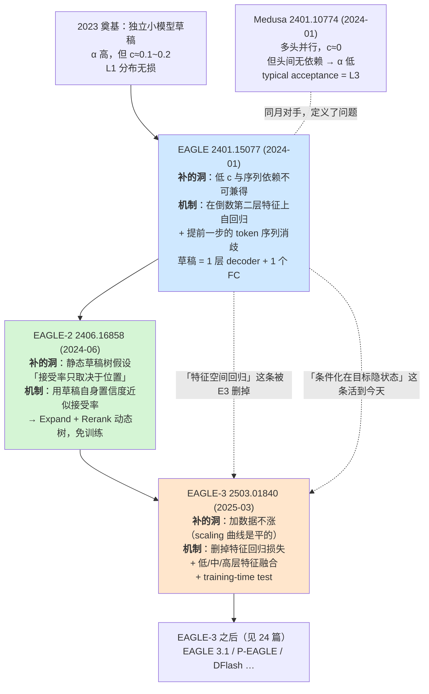

# 13 EAGLE 三代 —— 特征级自回归的演进

## 1. 一句话

EAGLE 三代做的是同一件事的三次修正：**把草稿模型的输入从「token」换成「目标模型的隐状态」，从而在保持 L1 分布无损的前提下，把草稿成本 $c$ 压到一层 decoder 的量级。**
第一代给出了「条件化在目标隐状态上」这个真因，但把它实现成了「在特征空间里做回归」；第二代补上了「树形状不该是静态的」；第三代**删掉了第一代的核心训练目标**，只留下真因。

---

## 2. 前一代卡在哪

### 2.1 2023 奠基之后剩下的那个洞：$c$ 太大

Leviathan 等人（**2022-11**，arXiv:2211.17192）与 Chen 等人（**2023-02**，arXiv:2302.01318）奠定的标准投机采样，草稿是**一个独立的小语言模型**。理想加速比模型（[[06-期望接受长度与加速比模型-完整推导]]）写作

$$
\text{speedup}=\frac{E[\tau]}{\gamma c+1},\qquad E[\tau]=\frac{1-\alpha^{\gamma+1}}{1-\alpha}
$$

其中 $c$ 是「一次草稿前向 / 一次目标前向」的时间比。独立小模型的 $c$ 大在两处：**它有自己的全套权重要从 HBM 读**，而且**草稿是串行跑 $\gamma$ 次**，成本线性涨、收益指数饱和。

第 06 篇那张扫描表（复跑 `python _lab/accept.py --table`，口径：理想模型、假设验证免费、batch 隐含为 1 且在 memory-bound 区，**是上界不是实测**）把这笔账写死了 —— 固定 $\alpha=0.80$：

| $c$ | 0.20 | 0.10 | 0.05 | 0.02 |
|---|---|---|---|---|
| 最优 $\gamma^*$ | 4 | 6 | 8 | **11** |
| 理想加速比上界（batch=1） | 1.868 | 2.470 | 3.092 | **3.817** |

读法：$c$ 从 0.20 压到 0.02，$\gamma^*$ 从 4 涨到 11，上界从 1.87 涨到 3.82。**压 $c$ 是这条线唯一的主轴** —— 它同时买到两样东西：更便宜的每一步，以及更长的可用 $\gamma$。

> ⚠️ 修正一条常见转述：这条 3.82 对应的是 $c:0.20\to0.02$，不是 $0.10\to0.02$。$c$ 从 0.10 到 0.02 是 $\gamma^*:6\to11$、上界 $2.470\to3.817$。引用时别把两组混起来。

### 2.2 Medusa 已经把 $c$ 压到近零，但把 $\alpha$ 赔掉了

Cai 等人的 Medusa（**2024-01**，arXiv:2401.10774）用多个并行头直接从同一个隐状态出 $\gamma$ 个 token，**草稿只要一次前向**，$c\approx 0$。代价是头与头之间**没有序列依赖**：第 2 个头看不到第 1 个头采出了什么。而且它默认的 typical acceptance 是 **L3 近似**（改变了输出分布），不是 L1。细节见 [[12-Medusa-多头草稿与树注意力的诞生]]。

于是 2024 年初摆在桌上的问题是可以一句话说清的：

> **能不能既拿到 Medusa 的低 $c$（不跑一整个模型），又拿回自回归草稿的序列依赖（高 $\alpha$），同时保持 L1 分布无损？**

EAGLE 三代就是这个问题的三次回答。



---

## 3. 机制拆解

### 3.1 EAGLE（2024-01）

| 项 | 值 |
|---|---|
| **年月 / arXiv** | **2024-01**（v1 2024-01-26）· **arXiv:2401.15077** |
| **标题** | *EAGLE: Speculative Sampling Requires Rethinking Feature Uncertainty* |
| **作者 / 机构** | **Yuhui Li（北京大学）**、Fangyun Wei（**Microsoft Research**）、Chao Zhang（北京大学）、Hongyang Zhang（**University of Waterloo & Vector Institute**，通讯 hongyang.zhang@uwaterloo.ca） |
| **会议** | ICML 2024 |
| **无损口径** | **L1 分布无损**（逐节点递归投机采样，接受概率 $\min(1,\,p/\hat p)$；摘要原文 "while maintaining the distribution of the generated text"） |

**符号**。记目标模型第 $i$ 个位置的**倒数第二层隐状态**（LM head 之前的那一层输出）为 $f_i\in\mathbb{R}^{d}$，论文逐字定义为 *"the second-to-top-layer feature of a LLM, the hidden state before the LM head"*。记 token 序列为 $t_{1:i}$，其 embedding 为 $e_{1:i}\in\mathbb{R}^{d}$。

**两个观察，且第二个是第一个的代价**（这是本篇要点破的第一件事）：

1. **特征层比 token 层好预测。** 论文原文：*"feature sequences exhibit more regularity"*。为什么？把 $f_i \to t_i$ 这一步看清楚就明白了：$t_i$ 是 $f_i$ 过 LM head、再 softmax、再采样的产物 —— **采样是一次有损压缩**，把一个 $d$ 维连续向量压成 $\log_2|V|$ 比特（$|V|=32000$ 时约 15 比特，$d=4096$ 时 fp16 是 65536 比特）。用 $t_{1:i}$ 预测 $t_{i+1}$，等于先把上下文压碎再重建；用 $f_{1:i}$ 预测 $f_{i+1}$，条件信息保留得多得多。
2. **但特征层自回归有固有的不确定性。** $f_{i+1}$ **不是** $f_{1:i}$ 的函数：它还取决于第 $i+1$ 个位置**采出了哪个 token**。论文的例子是 *"sampling different tokens like 'am' or 'always' leads to distinct feature sequences, introducing ambiguity into feature-level autoregression"* —— 「I am」和「I always」后面的特征轨迹是两条完全不同的路。

**解法：把提前一步的 token 序列喂进去。** 草稿模型的输入不是 $f_{1:i}$，而是 $(f_{1:i},\ t_{2:i+1})$ —— token 序列**相对特征序列右移一位**，因此它携带了「第 $i+1$ 步的采样结果」这个特征序列本身缺失的信息。论文逐字：*"EAGLE inputs the token sequence from one time step ahead, which includes the sampling outcomes, into the draft model."*

论文自己的消融把这三档拆开了（**口径**：Vicuna 7B、MT-bench、$T=0$，图注原文 *"Accuracy and speedup ratio of draft models based on tokens, features and feature&shifted-token at temperature=0, tested on MT-bench with Vicuna 7B as the original LLM"*；**该图注未给 batch size**，按投机解码论文惯例应为 batch=1，**口径不全，不可与其它来源横比**）：

| 草稿输入 | 加速比 |
|---|---|
| token 级自回归 | 1.5× |
| 特征级自回归（无移位 token） | 1.9× |
| 特征级 + 移位 token（= EAGLE） | **2.8×** |

原文对第三档的说明：*"by addressing the uncertainty, the speedup ratio further increases from 1.9x to 2.8x."*
**注意这三档的差是「同一个 batch=1 设置下的内部对照」，可以横比；跟别的论文的数字不能横比。**

**架构（形状标注）**。草稿模型三块，只有中间一块是新的：

| 模块 | 参数来源 | 形状 |
|---|---|---|
| Embedding | **复用目标模型，冻结** | $|V|\times d$ |
| **Autoregression Head（唯一可训练）** | 新训 | FC：$2d\to d$；**1 层 decoder layer** |
| LM Head | **复用目标模型，冻结** | $d\times|V|$ |

一次草稿前向：$(f_{1:i},\ e_{2:i+1})$ 在最后一维拼接得 $(\text{bs},\,i,\,2d)$ → FC 降到 $(\text{bs},\,i,\,d)$ → 1 层 decoder → 得到 $\hat f_{i+1}$ → 过冻结的 LM head → $\hat p_{i+2}$ → 采样出 $\hat t_{i+2}$。

**可训练参数量**（论文自报）：7B→0.24B，13B→0.37B，33B→0.56B，70B→**0.99B**，Mixtral 8×7B→0.28B。
**训练**：ShareGPT，约 **68 000** 条对话；损失

$$
L = L_{\text{reg}} + w_{\text{cls}}\cdot L_{\text{cls}},\qquad w_{\text{cls}}=0.1
$$

$L_{\text{reg}}=\text{Smooth-}L_1(f_{i+1},\ \hat f_{i+1})$ 是**特征回归损失**（记住这一项，第三代要删的就是它），$L_{\text{cls}}$ 是目标与草稿两个 LM head 输出分布之间的交叉熵。权重取 0.1 的理由是论文自陈 *"the classification loss is an order of magnitude larger than the regression loss"*。训练时给特征加 $\mathcal U(-0.1,0.1)$ 噪声做增广，缓解自回归误差累积。
**成本**：70B 的头 *"completed in 1–2 days on 4×A100 (40G) GPUs"*；7B–33B 的头 *"can even be conducted on a RTX 3090 node in 1–2 days"*。

**验证**：树注意力一次前向验完整棵树，逐节点递归应用投机采样（论文 *"At every node of the draft tree, we recursively apply speculative sampling algorithms"*），接受概率 $\min(1,\,p_{j+i}(\hat t)/\hat p_{j+i}(\hat t))$，拒绝后从修正分布重采。树 mask 怎么构造、为什么它等价于多条链，见 [[16-树形草稿与树注意力-mask构造与验证]]；接受判据的正确性证明见 [[04-拒绝采样修正-无损性的完整证明]]。这套判据给的是 **L1 分布无损**，不是「结果和不开投机一模一样」（[[07-无损的三种口径-分布无损不等于结果相同]]）。

### 3.2 EAGLE-2（2024-06）

| 项 | 值 |
|---|---|
| **年月 / arXiv** | **2024-06**（v1 2024-06-24）· **arXiv:2406.16858** |
| **标题** | *EAGLE-2: Faster Inference of Language Models with Dynamic Draft Trees* |
| **作者 / 机构** | 与第一代同一组：Yuhui Li（北京大学）、Fangyun Wei（Microsoft Research）、Chao Zhang（北京大学）、Hongyang Zhang（University of Waterloo & Vector Institute） |
| **会议** | EMNLP 2024 |
| **无损口径** | **L1 分布无损**（摘要逐字 *"ensures that the distribution of the generated text remains unchanged, making it a lossless acceleration algorithm"* —— 这个 "lossless" 指的是分布，属 L1） |

**前一代卡在哪**：EAGLE-1（以及此前几乎所有树形方案）用**静态草稿树** —— 树的形状在离线时定好，运行时不变。摘要逐字点破了这个隐含假设：*"Most speculative sampling methods such as EAGLE use a static draft tree, **implicitly assuming that the acceptance rate of draft tokens depends only on their position**."*

论文用两张图打掉这个假设：

- **Figure 5**：同一个位置（P1…P6）的接受率**在不同 query 之间方差很大** —— 位置能解释一部分，但解释不完。
- **Figure 6**：草稿模型是 **well-calibrated** 的 —— 置信度 $<0.05$ 的 token 接受率约 **0.04**；置信度 $>0.95$ 的接受率约 **0.98**。

第二张图才是真正的杠杆：**草稿模型自己的置信度就能估接受率，不需要调用目标模型**。这把「该往哪扩树」从一个不可观测量变成了一个可观测量。

**本库第 16 篇已经用一个可算的模型独立证明了「静态树一定在某些位置上是错的」**：最优树形状同时随**预算**和**边际覆盖率增益** $c_k-c_1$ 变化（[[16-树形草稿与树注意力-mask构造与验证]] §5）。摘一行那里的实测：草稿一致度 0.95、预算 8 个节点时**链赢**（1.5227 vs 二叉树 1.3380）；预算涨到 16 时**二叉树反超**（1.7772 vs 链 1.5512）。同一棵静态树不可能在两行都最优。EAGLE-2 做的就是把这个「最优形状随上下文漂移」的事实变成一个运行时算法。

**机制**：两阶段，都不需要额外训练（论文明确 *"no additional training"*，直接复用 EAGLE-1 的草稿权重）。

1. **Expand（扩展）**：定义节点 $i$ 的**价值** $V_i$ 为**根到 $i$ 路径上全部置信度的乘积**。论文逐字：*"The global acceptance rate of a token $t_i$ is the product of the acceptance rates of all tokens on the path from the root node to $t_i$."* 每一层从当前层里挑 value 最大的 **top-$k$（实现取 $k=10$）** 个节点做扩展，*"We choose the top-k tokens with the highest global acceptance probabilities from the current layer for expansion"*。
2. **Rerank（重排）**：全部草稿 token 按 value 全局排序，*"we rerank all draft tokens and select the top m tokens with the highest values"*，并**保持树的连通性**；value 相同的优先取浅节点。选完再拍平、重建 attention mask 与 position id。

**超参（论文实现细节）**：草稿 token 总数 $m=60$（7B/8B）/ 50（13B）/ 48（70B），**树深 6**，扩展阶段每层取 10 个节点。

> ⭐ 一个值得单独点出的不变式：**value 是路径上置信度的连乘，因此孩子的 value 恒 $\le$ 父的 value。** 于是「按 value 取 top-$m$」**自动**保证选出的节点集合连通 —— 不需要额外的修补逻辑。这条性质是 EAGLE-2 能把 rerank 写得这么短的原因，论文没有强调它，但实现里它是关键。

### 3.3 EAGLE-3（2025-03）

| 项 | 值 |
|---|---|
| **年月 / arXiv** | **2025-03**（v1 2025-03-03）· **arXiv:2503.01840** |
| **标题** | *EAGLE-3: Scaling up Inference Acceleration of Large Language Models via Training-Time Test* |
| **作者 / 机构** | 同一组：Yuhui Li（北京大学）、Fangyun Wei（Microsoft Research）、Chao Zhang（北京大学）、Hongyang Zhang（University of Waterloo & Vector Institute） |
| **会议** | NeurIPS 2025 |
| **无损口径** | **L1 分布无损**（论文自陈 *"does not modify the target model's weights and uses strict speculative sampling acceptance conditions"*，并援引 Leviathan 等人 2022-11 arXiv:2211.17192 的 Appendix A.1） |

**前一代卡在哪：加数据不涨。** 论文 Figure 1（LLaMA-Instruct 3.1 8B、MT-bench）显示 **EAGLE 的 scaling 曲线是平的**，而 EAGLE-3 的是上升的，论文称这条上升曲线 *"was never observed in the previous works"*。

**诊断**：问题出在 $L_{\text{reg}}$。论文逐字：*"feature prediction can be seen as an additional constraint, which limits the expressiveness of the draft model and makes it difficult to benefit from increased data."*

**三处改动**：

1. **删掉特征预测损失，改为直接预测 token**（abstract：*"abandons feature prediction in favor of direct token prediction"*）。
2. **低/中/高层特征融合**：论文 *"we integrate and leverage low-, mid-, and high-level features from the target model"*；做法是 *"Concatenate the k-dimensional vectors l, m, and h to form a 3k-dimensional vector, then pass it through a fully connected (FC) layer to reduce it to k-dimensions."* → **论文未指明具体是哪几层算「低/中/高」，本次核查未在实现细节节找到该映射，标「未查证」。**
3. **training-time test（TTT）**：训练时**模拟多步起草**。第 1 步用目标模型的真特征；从第 2 步起，目标特征在推理时是拿不到的，于是**把草稿模型自己上一步的输出喂回去**，配专门的 attention mask 递归展开。论文 Figure 6 画了三步（原生一步 + 两步模拟）。论文对这个技术的命名句：*"We can address this issue by incorporating Step 1 into the training process... We name this technique as training-time test."*

**训练数据**：*"We use ShareGPT and UltraChat-200K as training data, containing approximately 68K and 464K data entries, respectively"*，即相对 EAGLE-1 约 **8 倍**数据量。

### 3.4 为什么删掉那个损失反而更好 —— 三层论证

这是本篇最需要讲透的一处。

**第一层：$L_{\text{reg}}$ 是一个充分不必要条件。** 草稿模型真正要做对的事是「下一个 token 的分布对」。而 $L_{\text{reg}}$ 要求「隐状态在 $\mathbb R^d$ 里逼近目标的隐状态」。后者蕴含前者（隐状态一样 → 过同一个 LM head → 分布一样），**但反过来不成立**：LM head 是 $d\to|V|$ 的线性映射，$d=4096$、$|V|=32000$ 时它有巨大的零空间与方向冗余，**很多个不同的 $\hat f$ 能给出同一个 softmax 分布**。用一个更强的条件去逼一个更弱的目标 —— 优化被迫在一个比必要范围小得多的解集里找解。

**第二层（更硬的一层）：$L_{\text{reg}}$ 锁死了草稿模型的输入接口。** 既然训练目标是「预测下一步的顶层特征 $f_{i+1}$」，而下一步草稿又要吃 $\hat f_{i+1}$ 作为输入，**输入空间和输出空间必须是同一个空间**（都是目标模型倒数第二层的特征空间），自回归才接得上。这意味着：**只要 $L_{\text{reg}}$ 还在，多层融合就是不可能的** —— 融合出来的 $g$ 不在 $f$ 那个空间里，你无法要求草稿模型「预测下一个 $g$」，因为目标模型的下一个 $g$ 也要等它自己前向完才有。

> 所以改动 1 和改动 2 **不是两件独立的事**：**去掉特征回归损失是多层融合的前置条件**。论文说得含蓄（*"complete flexibility in the draft model's input"*），但因果就是这个方向。这条因果关系是读 EAGLE-3 最容易滑过去的地方。

**第三层：这解释了 scaling 曲线为什么平。** 约束越强，模型容量越多地被「对齐特征」这件事吃掉。加数据只是把这个多余的约束拟合得更准，而不是把 token 预测做得更准。松开约束之后，多出来的容量才有地方去 —— 于是曲线开始上升。

### 3.5 那么 EAGLE-1 的核心假设被否定了吗？—— 精确回答

**部分否定，而且被否定的恰好是标题里那部分。** 逐条拆：

| EAGLE-1 的主张 | EAGLE-3 之后的状态 |
|---|---|
| 草稿模型应当**条件化在目标模型的隐状态**上（而不是只吃 token） | **活下来了，而且被加强** —— 从只用倒数第二层，扩到低/中/高三层融合 |
| 应当把**提前一步的 token 序列**喂进草稿模型以消解采样随机性 | **活下来了** —— EAGLE-3 的草稿输入仍含 token embedding |
| 草稿模型应当**在特征空间里做自回归**，并**以预测下一步特征为训练目标** | **被删除** —— EAGLE-3 直接预测 token，不再回归特征 |
| 「feature uncertainty」是需要专门解决的核心问题（论文标题） | **问题本身消失了** —— 不预测特征，就没有特征不确定性 |

一句话的历史判断：

> **EAGLE-1 的真正贡献是「条件化在目标隐状态上」，而「在特征空间里回归」只是 2024 年初实现这件事的手段。**
> 三代之后，手段被换掉，真因留下来。EAGLE-1 论文把手段写进了标题（*Requires Rethinking Feature Uncertainty*），这是它被自己的后继部分推翻的地方。

同一组作者在 14 个月内推翻自己上一篇的核心训练目标 —— 这在本库整条谱系里不多见，值得记一笔（[[15-谱系图与被淘汰的分支]]）。

### 3.6 EAGLE-3 之后

**EAGLE 3.1**（2026-05，vLLM 官方 blog，加 FC normalization 与 post-norm 治 attention drift）、其学术版 **Attention Drift**（**2026-05**，arXiv:2605.09992）、**P-EAGLE**（**2026-02**，arXiv:2602.01469，机构**未查证**，把自回归 drafter 改成一次前向出 $K$ 个 token）——这三条都在 [[24-前沿进展-2025到2026]] 展开，本篇不重复。

---

## 4. 逐步走查：一个迭代里到底发生了什么

### 4.1 EAGLE-1 的一个草稿步（$\gamma$ 步中的第 2 步）

设目标模型上一轮吐出的最后一个 token 是 $t_{i}$，其倒数第二层特征 $f_{i}$ 在上一轮验证前向里**已经算出来了**（这是关键：$f_i$ 是免费的副产品）。

1. 草稿输入 $(f_{i},\ e_{i+1})$ —— 注意 token 比特征**超前一位**：$e_{i+1}$ 是刚采出来的那个 token 的 embedding。
2. FC：$\text{concat}\to\mathbb R^{2d}\to\mathbb R^{d}$。
3. 1 层 decoder（带 KV cache，草稿自己的）→ $\hat f_{i+1}$。
4. 冻结的 LM head：$\hat f_{i+1}\to \hat p_{i+2}\in\Delta^{|V|-1}$。
5. 从 $\hat p_{i+2}$ 采样 / 取 top-$k$ → 树的下一层节点。
6. 下一步的输入变成 $(\hat f_{i+1},\ e_{i+2})$ —— **$\hat f$ 是草稿自己预测出来的，误差从这里开始累积**（这正是 EAGLE-3 的 TTT 要在训练时模拟的那件事）。

论文报的接受率对这个误差累积并不敏感得离谱：0 个错误特征时 $\alpha\in[0.74,0.85]$，1 个错误特征时 $\alpha\in[0.69,0.80]$（口径：论文自报的 $\alpha$ 定义，见 [[05-接受率alpha-定义口径与怎么测]] 对 $\alpha$ 定义分歧的讨论）。

### 4.2 EAGLE-2 的 Expand + Rerank 走查

一轮草稿 = 深度 6 次 Expand，最后一次 Rerank，然后一次目标前向验证：

```
for depth in 1..6:
    从当前层中取 value 最大的 top-10 个节点          # Expand 的选择
    对这 10 个节点各跑一次草稿前向（可以 batch 成一次）  # 10 个位置一起
    每个节点取 top-k 个孩子，孩子 value = 父 value × 孩子置信度
rerank: 把这 6 层里全部节点按 value 降序排，取前 m 个（m=60/50/48）
       （由 value 的连乘单调性，取到的集合自动连通）
拍平 → 建树 mask 与 position id → 目标模型一次前向验证 → 逐节点递归投机采样
```

**Expand 阶段的草稿前向次数是 6 次（=树深），不是 60 次** —— 同一层的 10 个节点拼成一个 batch 一起过。这就是为什么动态树几乎不涨 $c$：$c$ 由**树深**决定，不由树的节点数决定。

---

## 5. 小数字算例

### 5.1 动态树 vs 静态树：$|V|=5$，预算 6 个节点，手算到底

词表 $V=\{A,B,C,D,E\}$。草稿模型在各节点给出的置信度（只列 top-2）：

| 位置 | 条件 | top-2 置信度 |
|---|---|---|
| 第 1 层 | 根 | $A{:}0.60,\ B{:}0.30$ |
| 第 2 层 | 经过 $A$ | $C{:}0.70,\ D{:}0.20$ |
| 第 2 层 | 经过 $B$ | $C{:}0.50,\ E{:}0.40$ |
| 第 3 层 | 经过 $AC$ | $E{:}0.80,\ A{:}0.10$ |
| 第 3 层 | 经过 $BC$ | $D{:}0.60,\ E{:}0.30$ |

**value = 路径上置信度连乘**：

```
A   0.60      AC  0.60×0.70 = 0.42      ACE 0.42×0.80 = 0.336
B   0.30      AD  0.60×0.20 = 0.12      ACA 0.42×0.10 = 0.042
              BC  0.30×0.50 = 0.15      BCD 0.15×0.60 = 0.090
              BE  0.30×0.40 = 0.12      BCE 0.15×0.30 = 0.045
```

**Rerank，取 $m=6$**：降序为 $A(0.60) > AC(0.42) > ACE(0.336) > B(0.30) > BC(0.15) > AD(0.12) = BE(0.12) > \dots$
取前 6：$\{A,\ AC,\ ACE,\ B,\ BC,\ AD\}$。连通性自动成立（$ACE$ 的父 $AC$ 在、$AC$ 的父 $A$ 在、$BC$ 的父 $B$ 在、$AD$ 的父 $A$ 在）。

**期望接受长度**（口径：**L2 精确匹配口径**下的近似，把置信度当接受概率；同层候选互斥，故某层命中概率 = 该层保留节点 value 之和）：

- 第 1 层：$0.60+0.30=0.90$
- 第 2 层：$0.42+0.15+0.12=0.69$
- 第 3 层：$0.336$

$$
E[\tau]=1+0.90+0.69+0.336=\mathbf{2.926}
$$

**对照：同样 6 个节点的静态二叉全展开树（深度 2）**：第 1 层 $\{A,B\}$，第 2 层 $\{AC,AD,BC,BE\}$。

- 第 1 层：$0.90$；第 2 层：$0.42+0.12+0.15+0.12=0.81$

$$
E[\tau]=1+0.90+0.81=\mathbf{2.71}
$$

**动态树多赚 0.216 个 token/迭代（+8.0%），预算一个没多花。** 差别就在一次预算调配：静态树把第 6 个节点给了 $BE$（value 0.12），动态树把它给了 $ACE$（value 0.336）。

这个算例也把 EAGLE-2 的本质说清了：**rerank 等价于按「节点的边际期望贡献」分配预算**，而边际贡献恰好就是 value 本身。

### 5.2 $c$ 到底降了多少 —— 用 roofline 模型算一遍

用本库的 roofline 模型（`_lab/speedup.py`，硬件 4×H100 SXM5，seqlen=1024，**batch=1**，fp16 权重）算「一次草稿前向 / 一次目标前向」：

| 目标 | 草稿 = 独立小模型 `llama3.2-1b`（1.24B） | 草稿 = `eagle-head`（0.6B，**1 层**） |
|---|---|---|
| llama3-8b | $c=0.155$ | $c=\mathbf{0.074}$ |
| llama3-70b | $c=0.018$ | $c=\mathbf{0.0085}$ |

（复跑：见 §6 的片段。**这是模型算出来的比值，不是实测**；它忽略 kernel launch、调度、树拍平等固定开销，真实 $c$ 只会更大。）

把 §2.1 的表接上：8B 目标上 $c$ 从 0.155 降到 0.074，在 $\alpha=0.80$ 时 $\gamma^*$ 大致从 5 走到 7，理想上界从约 2.2 走到约 2.8。**这个量级的收益，正好对得上 EAGLE-1 消融里 1.5×→2.8× 那条线（batch=1，Vicuna 7B，MT-bench，$T=0$）里属于「$c$ 下降」的那一半 —— 另一半来自 $\alpha$ 上升。**

再看保本线（复跑 `python _lab/speedup.py --breakeven`，口径：target=llama3-70b，$\gamma=4$，4×H100，fp16，seqlen=1024；表里是「$E[\tau]$ 至少要多大才不亏」）：

| batch | 1 | 8 | 32 | 128 | 256 |
|---|---|---|---|---|---|
| 草稿 = llama3.2-1b | 1.07 | 1.08 | 1.09 | 1.84 | 2.94 |
| 草稿 = eagle-head | **1.03** | **1.03** | **1.04** | **1.73** | **2.79** |

**轻草稿把保本线整体压低**（`_lab/test_speedup.py::test_lighter_draft_lowers_breakeven`）。注意它在小 batch 区压得多（1.07→1.03，草稿开销砍掉一半）、在大 batch 区压得少（2.94→2.79）—— 因为大 batch 下亏损的主因已经不是草稿开销，而是验证前向掉进 compute-bound 区（[[18-batch与吞吐-收益衰减曲线]]）。**这就预告了 §8 的失效条件：压 $c$ 这条主轴在大 batch 区是无效的。**

---

## 6. 代码验证

本篇不新增 `_lab` 模块，复用已有三个基座。关键片段：

```python
# _lab/accept.py —— §2.1 那张 c → gamma* 表的生成器
def speedup_ideal(alpha: float, gamma: int, c: float) -> float:
    return expected_tokens(alpha, gamma) / (gamma * c + 1.0)
# optimal_gamma(alpha, c) 扫 gamma 取最大值；
# 单调性由 test_optimal_gamma_decreases_with_cost / _increases_with_alpha 钉死
```

```python
# _lab/speedup.py —— §5.2 的 c 与保本线
import speedup as S
hw = S.scale(S.H100, 4)
for tgt in ('llama3-70b', 'llama3-8b'):
    for d in ('llama3.2-1b', 'eagle-head'):
        t  = S.fwd_time(S.MODELS[tgt], hw, 1, 1024, 1)['t']
        dt = S.fwd_time(S.MODELS[d],   hw, 1, 1024, 1)['t']
        print(tgt, d, 'c=%.4f' % (dt / t))
# 实跑输出：
#   llama3-70b llama3.2-1b c=0.0178      llama3-70b eagle-head c=0.0085
#   llama3-8b  llama3.2-1b c=0.1552      llama3-8b  eagle-head c=0.0744
```

```python
# _lab/tree.py —— §3.2「静态树一定在某些位置上是错的」的可算证据
# 复跑 python _lab/tree.py --shape，实测（agree=0.95）：
#   预算 8  : 链 1.5227 > 2 叉 1.3380     <- 预算小，链赢
#   预算 16 : 链 1.5512 < 2 叉 1.7772     <- 预算大，树赢
#   agree=0.80 时 c2 - c1 = 0.000，无论预算多大链都赢
```

---

## 7. 口径与坑

**坑 1（本主题最高频的数字错误）：把 $\tau$ 当成加速比。** EAGLE 系论文的表把 Speedup Ratio 与平均接受长度 $\tau$ **并排**放，两列量级接近（都是 3–7），极易串行。硬事实：EAGLE-1 在 **Vicuna 7B / RTX 3090 / MT-bench / $T=0$ / batch=1** 下 $\tau=3.94$，而加速比只有约 **2.90×**。看到「EAGLE 3.94×」这种写法，先怀疑它抄错了列。

**坑 2：EAGLE-3 论文正文与自己的 Table 5 打架。** 正文写 *"EAGLE shows the maximum throughput improvement at a batch size of 24"*，但 Table 5 里 EAGLE 的最大值在 **batch=2（1.30×）**，batch=24 只有 1.03×。正文那句大概率想说的是「EAGLE 保持正收益的最大 batch 是 24」。**引用时以表为准**，不要引用正文那句。

**坑 3：Table 5 的硬件，两处记载不一致。** 我本次复核 arXiv HTML（v2）取到的表注是：*"Throughput improvement under different batch sizes on **A100** and LLaMA-Instruct 3.1 8B for the MT-Bench dataset, with vLLM without speculative sampling as the baseline (1.00x)."* 而本库调研笔记 `_research/RS-4` 把该表登记为 **RTX 3090**（论文另有 vLLM 实验用到 RTX 3090 与 A100 两种卡）。**两处不一致，本篇以我复核到的表注（A100）为准并原样标出分歧，不替任一方下结论。** 无论哪张卡，表内的**相对**比较（EAGLE vs EAGLE-3，同表同卡）都成立。

**坑 4：EAGLE-2 的实验节没给 GPU 与 batch size。** 我本次核查 arXiv HTML 未在实验/实现细节节找到逐表的硬件标注与 batch 声明。因此 EAGLE-2 论文自报的「3.05×–4.26×」**口径不全，不可与其它来源横比**；按投机解码论文惯例应为 batch=1，但这是推断，不是论文陈述。

**坑 5：官方仓库自相矛盾，本篇不替它下结论。** SafeAILab/EAGLE 的 README 正文用词是精确的 —— *"provably maintaining the consistency with vanilla decoding in the distribution of generated texts"*（说的是**分布**，属 L1 口径，不是逐 token 相同）。但同一份 README 的 Todo 列表里（2026-08-22 核验）**仍写着** "Support non-greedy inference (provably maintaining text distribution)"。也就是说，仓库自己把「带证明的非贪心支持」列为待办。**读者无法仅凭 README 判断当前实现在 $T>0$ 下究竟是 L1 还是 L2。本次未读源码，标「未查证」**，引擎侧的实际实现见 [[20-主流引擎实现-vLLM与SGLang与TensorRTLLM]]。

**坑 6：TTT 在工程上不便宜。** LMSYS/SGLang 的 SpecForge blog（2025-07-25）把 TTT 的目的讲对了 —— *"makes the draft model robust by simulating multi-step generation"* —— 也诚实写了难点：*"specialized attention masks and recursive data loops"*。同一篇给的另一个数字很有教学价值：离线训练要预存 hidden states，UltraChat + ShareGPT 约 **12 TB**。训练侧详见 [[21-草稿模型怎么训-对齐与在线蒸馏]]。

---

## 8. 失效条件（铁律三）

**F1：输入长度超出草稿头的训练窗口 → 接受长度塌方。** 这是本库找到的**最确定的负收益配方**。OWL（**2025-10**，arXiv:2510.07535，Snowflake Arctic Inference 团队，作者含 Aurick Qiao、Samyam Rajbhandari）在 LongSpecBench 上测：口径 = Llama-3.1-8B-Instruct / **1×H200** / **batch=1** / 输入长度 **4K–64K** / 200 条样本。结果：EAGLE3 的 $\tau$ 塌到 **1.28**（几乎等于不投机），加速比 **0.81×** —— 比不开投机慢 19%。归因：EAGLE3 的公开草稿头**训练窗口是 2K**（Red Hat 的实践文亦提到当时可得的投机模型有 *"a 2048 context length cap"*），超出窗口后外推失败。
**可判定形式**：**当「实际输入长度 > 草稿头训练窗口」时关掉它**，或换成不吃训练窗口的草稿（自投机 / 定长窗口 / 检索式，见 [[11-无模型草稿-promptlookup与ngram与检索]]、[[22-长上下文下的投机采样]]）。

**F2：batch 越过交叉点 → 净亏损，而且改进草稿只能右移交叉点，不能消除它。**
口径：EAGLE-3 论文 Table 5，A100（见坑 3 的分歧标注），LLaMA-Instruct 3.1 8B，MT-Bench，指标是**吞吐**，基线是未开投机的 vLLM = 1.00×；**该表未给 $\gamma$/树规模、逐 batch 的 $\tau$、温度、精度 —— 口径不全，不可与其它来源横比**。

| batch size | 2 | 4 | 8 | 16 | 24 | 32 | 48 | 56 |
|---|---|---|---|---|---|---|---|---|
| **EAGLE** | 1.30× | 1.25× | 1.21× | 1.10× | **1.03×** | **0.93×** | 0.82× | **0.71×** |
| **EAGLE-3** | 1.75× | 1.68× | 1.58× | 1.49× | 1.42× | 1.36× | 1.21× | **1.01×** |

**读法（这是本篇最重要的一条结论）**：EAGLE 的盈亏平衡点落在 batch 24 与 32 之间，batch=56 时比不开投机慢 29%；EAGLE-3 把平衡点推到 batch≈56。**两代之间草稿质量的全部改进（删损失、多层融合、TTT、8 倍数据），换来的是交叉点从 ~28 右移到 ~56，交叉点本身一步没消失。**

这与 [[18-batch与吞吐-收益衰减曲线]] 的渐近线推导完全一致：在 compute-bound 区

$$
\lim_{\text{batch}\to\infty}\text{speedup}=\frac{E[\tau]}{\gamma+1}\,(1-s)\ <\ 1
$$

$E[\tau]/(\gamma+1)\le 1$ 恒成立，再乘 $(1-s)<1$，**极限严格小于 1，与草稿多好无关**。提高 $E[\tau]$ 只是把这个小于 1 的极限抬高、把穿越点推后（`_lab/test_speedup.py::test_compute_bound_asymptote_equals_wasted_compute_ratio`、`::test_higher_accept_length_raises_but_cannot_save_asymptote`）。**「把草稿做得更准就能在大 batch 下赚钱」是一个可以被算术直接否掉的说法。**

**F3：目标模型是 4-bit 权重量化 → 增益几乎归零。** 口径：RTX 3090 / Llama-3-8B-Instruct / **W4A16 (GPTQ)** / **单批** / EAGLE-2 —— 结果是**零加速增益**。机制：量化已经把权重加载时间压掉，验证的额外算力再无处可藏（[[23-与其它优化的相互作用-量化与KVcache与PD分离]]）。

**F4：目标是超大 MoE → 收益本来就薄。** 口径：**batch=1**，8×H200 —— Qwen3-235B-A22B(Top-8) + EAGLE-3 仅 **1.22×**，GPT-OSS-120B(Top-4) + EAGLE-3 仅 **1.14×**；对照 dense 的 Llama-3.1-8B 上 EAGLE-3 是 4.40×。EAGLE-1 论文自己也报了 Mixtral 8×7B 只有 1.5×（口径：论文自报，batch=1），归因为验证时的专家加载开销。

**F5：跑久了会自己变差。** vLLM issue #41838（**Open**，2026-08-22 核验）：接受长度 *"smoothly and monotonically regresses over time"*，**只有重启服务才能恢复**。口径：vLLM 0.17.1（0.19.1 上复现），FP8 + EAGLE3，**batch=4** 时 AL 从约 4.5 掉到约 2.8（batch=2 时 4.2→3.8）；同报告称 TensorRT-LLM 上不退化。**推论：压测 10 分钟得到的加速比不算数，$\tau$ 必须作为一等监控指标持续打点。**

**F6：注意力漂移（attention drift）。** 换 chat template、上长上下文、换分布外 system prompt 时性能掉；根因是投机步之间残差没归一化、hidden state 幅度随链深增长。这条在 EAGLE-3 上被点名，且 Qwen3.5 9B 的 MTP head 同样中招（**2026-05**，arXiv:2605.09992）——**不是 EAGLE 特有，而是「自回归 drafter 吃自己输出」这类设计的通病**（[[14-MTP-从训练目标到推理草稿]] 同类方案一并受影响）。EAGLE 3.1 的修法见 [[24-前沿进展-2025到2026]]。

**F7：任务分布不对。** 同一篇 EAGLE-3 论文、同一套口径（**batch=1**，$T=0$）内可横比：Llama-3.1-8B 上 HumanEval 4.85× / $\tau$=6.74，CNN/DailyMail 只有 3.65× / $\tau$=5.34。**摘要几乎总是全表最差的一档。** 另有第三方给出可计算的切换判据：当 prompt-output 重叠的 BLEU-4 超过约 0.6 时，n-gram 草稿稳定优于 EAGLE / EAGLE-3（口径：H100 / vLLM v0.10.1.1 / 每步 3 个草稿 token / **batch 未标注**）。

---

## 9. 自测题

1. **为什么「特征层比 token 层好预测」和「特征层自回归有固有不确定性」不是互相矛盾的两句话？**
   要点：它们说的是两件事。好预测说的是**条件信息量**（$f$ 没经过采样这次有损压缩，$t$ 经过了）；不确定性说的是**$f_{i+1}$ 不是 $f_{1:i}$ 的函数** —— 它还依赖第 $i+1$ 步采样的实现值。第二句是第一句的**代价**，移位 token 序列正是用来补这个代价的。

2. **EAGLE-2 为什么不需要额外训练？它凭什么敢用草稿置信度当接受率？**
   要点：它复用 EAGLE-1 的草稿权重，只改运行时的树构造策略。依据是论文 Figure 6 的标定证据：置信度 <0.05 → 接受率 ≈0.04，置信度 >0.95 → 接受率 ≈0.98。**这把「往哪扩树」从不可观测量变成可观测量，且不需要调用目标模型。**

3. **为什么说「删掉特征回归损失」和「多层特征融合」不是两件独立的改动？**
   要点：只要训练目标是「预测下一步的顶层特征」，草稿的输入空间就必须等于输出空间（自回归才接得上）。融合特征 $g$ 不在那个空间里，且目标模型的下一个 $g$ 也不可提前得到。**删损失是融合的前置条件。**

4. **EAGLE-3 相对 EAGLE 把交叉点从 batch≈28 推到 batch≈56。能不能继续改进草稿把交叉点推到无穷（即在任意 batch 下都赚）？**
   要点：不能。compute-bound 区的极限是 $\frac{E[\tau]}{\gamma+1}(1-s)$，因 $E[\tau]\le\gamma+1$ 且 $s>0$，**极限严格小于 1**，与草稿质量无关。改进草稿只抬高极限、右移穿越点。

5. **同事说「我们上了 EAGLE-3，压测 1.8×，可以上线了」。至少要追问哪三件事？**
   要点：① **batch/并发**是多少（Table 5 显示 batch 32 起 EAGLE 就已经是净亏）；② **输入长度**有没有超过草稿头训练窗口 2K（超了会掉到 0.81×）；③ **压了多久**（vLLM #41838：AL 会随运行时间单调退化，只有重启才恢复）。另可追问目标模型是否 4-bit 量化、是否 MoE。

---

## 10. 它新增了什么 / 什么被后来推翻（铁律五）

| 代次 | 年月 / arXiv | 第一作者 + 机构 | **新增的机制**（具体到机制） | **什么被后来推翻 / 修正** |
|---|---|---|---|---|
| **EAGLE** | **2024-01** / arXiv:2401.15077（ICML 2024） | Yuhui Li，北京大学（合作方 Microsoft Research、University of Waterloo & Vector Institute） | ① 草稿模型在**倒数第二层特征**上做自回归，不在 token 上；② 输入**右移一位的 token 序列**以消解采样随机性；③ 草稿 = 冻结 embedding + **FC($2d\to d$) + 1 层 decoder** + 冻结 LM head；④ 损失 $L_{\text{reg}}(\text{Smooth-}L_1) + 0.1\,L_{\text{cls}}$ | **① 与 ④ 被自家 EAGLE-3 推翻**：不再预测特征，$L_{\text{reg}}$ 被删除，标题里的 "feature uncertainty" 问题随之消失。**② 与「条件化在目标隐状态上」这条活了下来。** ③ 的自回归展开被 P-EAGLE（**2026-02** / arXiv:2602.01469）改成一次前向出 $K$ 个 token（[[24-前沿进展-2025到2026]]） |
| **EAGLE-2** | **2024-06** / arXiv:2406.16858（EMNLP 2024） | 同上组 | ① 指出接受率**上下文相关**，静态树的隐含假设不成立；② 用草稿模型置信度**近似接受率**（标定证据：<0.05→0.04，>0.95→0.98）；③ **Expand**（按 value = 路径置信度连乘取 top-10 扩展）+ **Rerank**（全局按 value 取 top-$m$，连通性由连乘单调性自动保证）；④ **免训练**，复用 EAGLE-1 权重 | 截至 2026-08-22 未见机制被推翻，**动态树已成为默认做法**并被 SGLang / vLLM / TensorRT-LLM 实现。被**修正**的是其加速比的适用范围：论文自报 3.05×–4.26×（**口径不全，未给硬件与 batch**），而 batch 上去之后见 F2 |
| **EAGLE-3** | **2025-03** / arXiv:2503.01840（NeurIPS 2025） | 同上组 | ① **删除特征预测损失**，改直接预测 token；② **低/中/高层特征融合**（拼 $3k$ 维 → FC 降回 $k$ 维；**具体层号论文未给出，未查证**）；③ **training-time test**：训练时把草稿自己的输出递归喂回，配专用 mask 模拟多步起草；④ 训练数据扩到 ShareGPT(68K) + UltraChat-200K(464K)，约 8× | **① 被 F2 修正**：改进草稿质量只把吞吐交叉点从 batch≈28 右移到 batch≈56，**没有消除交叉点**（同论文 Table 5 自己给的证据）。**② 被 attention drift 修正**（**2026-05** / arXiv:2605.09992）：融合输入随投机深度失衡、高层 hidden state 主导，残差未归一化导致幅度增长 → EAGLE 3.1 补 FC normalization + post-norm。**③ 的成本被点名**：离线训练要存约 12 TB hidden states。另有 F1：公开 checkpoint 的 2K 训练窗口使其在 4K–64K 输入上退化到 0.81×（**2025-10** / arXiv:2510.07535） |

**跨三代的一句话**：**被推翻的是「在特征空间里回归」这个手段，被保留并加强的是「条件化在目标模型隐状态上」这个真因。**

---

## 11. 延伸与双链

- 草稿成本 $c$ 与最优 $\gamma^*$ 的完整推导，以及 §2.1 那张表的出处：[[06-期望接受长度与加速比模型-完整推导]]
- 树 mask / position id 怎么建，以及「静态树一定在某些位置上是错的」的可算证明：[[16-树形草稿与树注意力-mask构造与验证]]
- 大 batch 交叉点的渐近线推导（F2 的算术依据）：[[18-batch与吞吐-收益衰减曲线]]
- 接受判据本身为什么是 L1 分布无损：[[04-拒绝采样修正-无损性的完整证明]]；L1/L2/L3 三种口径的区别：[[07-无损的三种口径-分布无损不等于结果相同]]
- $\alpha$ 与 $\tau$ 的定义分歧（坑 1 的根源）：[[05-接受率alpha-定义口径与怎么测]]
- EAGLE 的同月对手与树注意力的来处：[[12-Medusa-多头草稿与树注意力的诞生]]；MTP 线：[[14-MTP-从训练目标到推理草稿]]；整体谱系：[[15-谱系图与被淘汰的分支]]
- EAGLE-3 之后（EAGLE 3.1 / P-EAGLE / DFlash）：[[24-前沿进展-2025到2026]]
- 引擎里的实际实现与 $T>0$ 下的口径问题：[[20-主流引擎实现-vLLM与SGLang与TensorRTLLM]]
- 什么时候整体不该开：[[19-负收益全解-什么时候投机反而更慢]]

### 本篇验证

- `_lab/test_accept.py::test_optimal_gamma_decreases_with_cost` —— 验证 §2.1 的核心断言：**草稿成本 $c$ 越小，最优 $\gamma^*$ 越大**（对 $\alpha\in\{0.6,0.8,0.9\}$、$c\in\{0.02,0.05,0.1,0.2,0.4\}$ 全部检查单调性）。这条是 EAGLE 整条线「压 $c$」动机的数学基础。
- `_lab/test_accept.py::test_optimal_gamma_increases_with_alpha` —— 验证另一半：接受率越高，可用的 $\gamma$ 越长。EAGLE 靠隐状态条件化把 $\alpha$ 抬上去，收益走的就是这条通道。
- `_lab/test_tree.py::test_chain_beats_tree_at_small_budget` 与 `_lab/test_tree.py::test_tree_beats_chain_at_large_budget` —— 验证 §3.2 的断言：**最优树形状随预算翻转**，因此静态树必然在某些配置下次优。这是 EAGLE-2 动态树的存在理由。
- `_lab/test_tree.py::test_budget_needed_grows_as_the_gain_shrinks` —— 验证「草稿不准就该加宽树」是错的：边际覆盖增益**极小**时，现实预算内链都赢。这解释了 EAGLE-2 为什么必须用**标定过的置信度**来决定扩展方向，而不是无脑加宽。 （2026-08-22 更正：初稿的「增益为 0」是显示精度假象，真实约 $10^{-5}$；$c_k>c_1$ 恒成立，判据是「增益多大 vs 预算多大」）
  （**2026-08-22 更正**：初稿说的"增益为 0"其实是显示精度造成的假象，真实增益约 $10^{-5}$；$c_k>c_1$ 恒成立，正确判据是"增益多大 vs 预算多大"。详见第 16 篇 §5.3 与其勘误。）
- `_lab/test_speedup.py::test_lighter_draft_lowers_breakeven` —— 验证 §5.2 的保本线表：把草稿从 1.24B 独立模型换成 1 层草稿头，$E[\tau]$ 的保本线从 1.07 降到 1.03（batch=1）。
- `_lab/test_speedup.py::test_compute_bound_asymptote_equals_wasted_compute_ratio` —— 验证 F2 的算术：compute-bound 区的加速比极限等于 $\frac{E[\tau]}{\gamma+1}(1-s)$，**严格小于 1**。这条钉死了「改进草稿质量不能消除交叉点，只能右移」。
- 可复跑：
  - `python _lab/accept.py --table` —— 输出 §2.1 的 $c\to\gamma^*$ 表（$\alpha=0.80$ 行：$c$=0.20/0.10/0.05/0.02 → $\gamma^*$=4/6/8/11，上界=1.868/2.470/3.092/3.817）
  - `python _lab/speedup.py --breakeven` —— 输出 §5.2 的保本线表（llama3-70b，$\gamma=4$：llama3.2-1b 草稿 1.07/1.08/1.09/1.84/2.94 vs eagle-head 1.03/1.03/1.04/1.73/2.79，对应 batch=1/8/32/128/256）
  - `python _lab/tree.py --shape` —— 输出 §3.2 引用的形状翻转表

### 本篇来源

- **EAGLE 原论文** — https://arxiv.org/abs/2401.15077 ｜ https://arxiv.org/html/2401.15077 （2024-01）。**好在哪**：把「为什么特征层好预测」和「为什么特征层有不确定性」拆成两个观察分别论证，消融表（1.5× / 1.9× / 2.8×，Vicuna 7B、MT-bench、$T=0$、batch=1）直接量化了每一步的贡献，是本主题里少见的干净归因。**不严谨处**：标题把「feature uncertainty」立为核心问题，而这个问题在 14 个月后被自家 EAGLE-3 直接删掉了；消融图注**未标 batch size**。
- **EAGLE-2 原论文** — https://arxiv.org/abs/2406.16858 ｜ https://arxiv.org/html/2406.16858 （2024-06）。**好在哪**：先证「接受率与上下文相关」（Figure 5），再证「草稿置信度是接受率的良好代理」（Figure 6），最后才给算法 —— 论证链完整，且方案免训练、可直接套在已有 checkpoint 上。**不严谨处**：实验节**未给逐表硬件与 batch size**（本次核查 HTML 未找到），自报的 3.05×–4.26× 属**口径不全**。
- **EAGLE-3 原论文** — https://arxiv.org/abs/2503.01840 ｜ https://arxiv.org/html/2503.01840 （2025-03）。**好在哪**：敢于给出「加数据不涨」的负结果并定位到自家上一代的损失函数；Table 5 是本库找到的**唯一一张明确穿过 1.0× 的公开 batch 扫描表**，这种自曝其短的表在本主题里极其罕见。**不严谨处**：正文 *"EAGLE shows the maximum throughput improvement at a batch size of 24"* 与自己的 Table 5 冲突（表里 EAGLE 最大值在 batch=2 的 1.30×）；**未指明低/中/高分别是哪几层**；Table 5 未给 $\gamma$/温度/精度。
- **SafeAILab/EAGLE 官方仓库** — https://github.com/SafeAILab/EAGLE （README 2025-09-18 更新，2026-08-22 核验）。**好在哪**：把三代差异压成三句话，是做谱系表最干净的一手材料；无损表述用词精确（"in the distribution of generated texts"，即 L1 口径）。**不严谨处**：Todo 列表里仍写着 "Support non-greedy inference (provably maintaining text distribution)"，与正文的 "provably maintaining ... distribution" 并列出现，读者无从判断当前实现在 $T>0$ 下的口径。
- **OWL（长上下文反例）** — https://arxiv.org/abs/2510.07535 （2025-10）。**好在哪**：给出 F1 的完整口径（Llama-3.1-8B / 1×H200 / batch=1 / 输入 4K–64K），并把归因落到「草稿头训练窗口 2K」这个可检查的工程事实上。
- **Attention Drift** — https://arxiv.org/abs/2605.09992 （2026-05）。**好在哪**：把 drift 量化成「sink token 注意力占比 vs 最近生成 token 注意力占比」的此消彼长，并发现 MTP head 同样中招 —— 说明这是自回归 drafter 的通病而非 EAGLE 特有。**不严谨处**：所有增益数字**未给硬件与 batch**。
- **LMSYS/SGLang SpecForge blog** — https://www.lmsys.org/blog/2025-07-25-spec-forge/ （2025-07）。**好在哪**：把 TTT 的目的与工程难点都写了出来（*"specialized attention masks and recursive data loops"*），并给出 12 TB 这个让「训草稿的成本」变具体的数字。**不严谨处**：所报加速比未给硬件、batch 与接受长度。
- **Red Hat《Fly Eagle(3) fly》** — https://developers.redhat.com/articles/2025/07/01/fly-eagle3-fly-faster-inference-vllm-speculative-decoding （2025-07）。**好在哪**：旁证了当时可得投机模型的 *"2048 context length cap"*，与 OWL 的归因互相印证。
- **vLLM issue #41838** — https://github.com/vllm-project/vllm/issues/41838 （Open，2026-08-22 核验）。**好在哪**：给出 F5 的完整复现口径与逐模型的 AL 退化幅度，是「压测不等于上线表现」最硬的一条一手证据。
- 本篇引用的 batch 扫描表、任务分布差异、量化与 MoE 三条失效条件的原始记录与口径核对过程，见本库 `_research/RS-4-负收益与基准数据.md`（该笔记不参与双链）。
